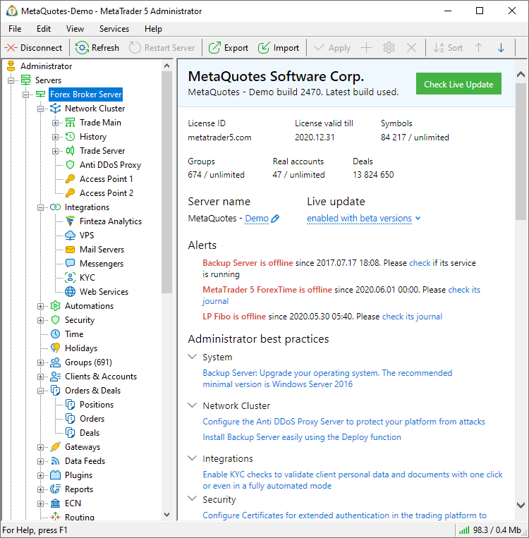

[🏠 Document Start](../../README.md) / [MetaTrader 5 Trading Platform](../../MetaTrader-5-Trading-Platform.md) / [Platform Setup](../Platform-Setup.md) / Start Page

[Previous](General-Information/ImportExport-Settings.md) | [Next](Network-cluster.md)

# Start Page (#start-page)

The start page displays important information about the platform operation: license data, the number of groups, accounts and trading operations. In addition, here you can change live update settings, as well as find a lot of useful information related to platform administration.

To open the start page, select the desired platform on the left side of the terminal.

## Server Data (#server-data)

The following platform data is specified in the page header:

  * Name of the trading platform owner company.
  * Platform name displayed in client terminals. It consists of two parts:

  * Owner company's short name indicated in the license.
  * An additional part as define by you. Here you can specify additional data, such as the server type: demo or live. The short name is set in the "Server Name" field below. After editing the data, click "Apply" on the toolbar to save settings.  
The additional data must not look like the domain name of the server. For example, do not specify "demo.com", "real.net", etc.

## License Information (#license-information)

The main license details are shown at the top of the page. Here, you will be warned of approaching expiration date or account limit. Separate warnings can be shown if your platform is [not activated](../Platform-Installation/Activation.md).

  * License — the website of the company for which the trading platform license has been issued.
  * License valid till — license expiration date. For example, if 2021.12.31 is specified, the license is valid until 2021.12.30 23:59:59 trading platform time.  
If payments are made in a timely manner and your platform is properly connected to the license server (updates.metaquotes.net), the license will be updated automatically. If the license update fails for any reason, the license field will become highlighted in red one month before the license expiration date. In this case please contact the [support team](../Technical-Support.md) for renewal. Once the license expires, the platform operation will stop and you will not be able to provide further services to your clients.
  * Symbols — the total number of [symbols](Symbols.md) in the platform, as well as the limitation according to your license type (if there is any).
  * Groups — the total number of [groups](Groups.md) in the platform, as well as the limitation according to your license type (if there is any).
  * Real accounts — the total number of real clients in the entire platform, as well as the limitation on the number of clients according to the license (if any). Real accounts are client records that are not included into demo*, manager*, preliminary* and contest* [groups](Groups/Group-Types.md). Only [enabled accounts (#enable)](Accounts/Editing-Account.md#enable) for which [trading is allowed (#trading)](Accounts/Editing-Account.md#trading) are counted.
  * Deals — the number of [deals](Deals.md) executed in the platform.

## Live update (#update)

The [update](Live-Update.md) of system components is set in this block:

  * Disabled — no updates to the platform components are performed, either automatically or manually.
  * Enabled — platform components are updated to latest release versions in the automatic mode.
  * Enabled with beta versions — when you launch live update, both release and beta versions of platform components will be installed. Beta versions precede the main release, allowing you to test the new features released in the update, as well as to test the operation of your plugins, gateways and other additional components. This option should only be enabled on test servers. Please make sure not to update your real servers with live accounts up to the beta version.

After editing the data, click "Apply" on the toolbar to save settings.

> Make sure your platform is [activated](../Platform-Installation/Activation.md). Otherwise, some of its basic features will be limited. If a notification in the upper part of the page shows that the platform is not activated, launch activation using the Services menu.

## Alerts (#alerts)

Important alerts concerning the platform components are shown in this block:

  * No connection between the [gateway](Gateways.md) or [data feed](Data-Feeds.md) and the source. If such an alert appears, please check the gateway or data feed [journal](Gateways/Journal-of.md).
  * A [platform component](../Platform-Components.md) is not connected. In this case please check if the appropriate service is running in the operating system and check the latest logs in the component's log in the disk.

Please do not ignore alerts.

## Administrator best practices (#best-practice)

This block features useful tips concerning platform operation, which will assist in using the platform to its full capabilities: what components need further setup or verification, how additional symbols can be added and other tips. A click on a tip will open an appropriate Administrator terminal section. After that the advice line will be hidden from the list.
