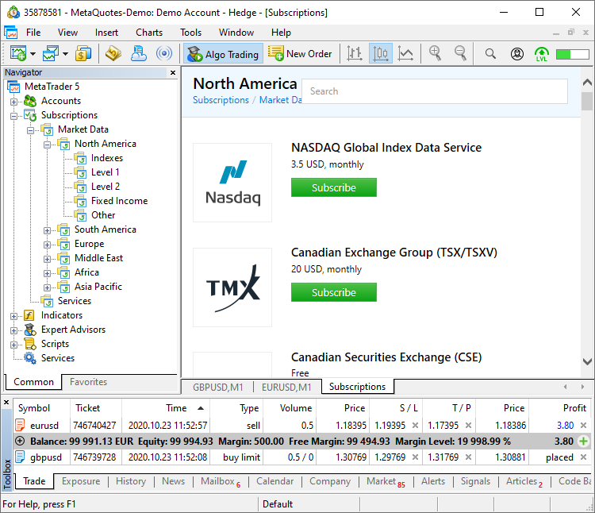
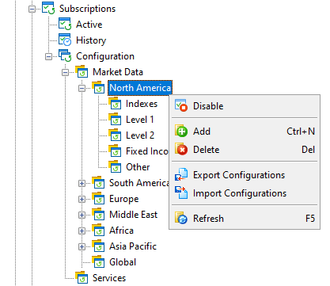

[🏠 Document Start](../../README.md) / [MetaTrader 5 Trading Platform](../../MetaTrader-5-Trading-Platform.md) / [Platform Setup](../Platform-Setup.md) / Subscriptions

[Previous](Synchronization/Features.md) | [Next](Subscriptions/Common.md)

# Subscriptions for Additional Trader Services (#subscriptions-for-additional-trader-services)

With the "Subscriptions" service, you can offer additional paid services to traders directly in the client terminals. For example, you can sell subscriptions for high-quality market data from well-known providers, offer personal manager services to assist traders in understanding the basics of trading, deliver one-time services such as position transferring or currency conversion, and much more.

## Service Advantages (#service-advantages)

  * A ready-made showcase of products which can be viewed by all your traders. You [set up products](Subscriptions/Common.md) via the Administrator terminal, and the subscriptions appear straight in client terminals. It means that you will not have to additionally attract traders to your site.
  * Payment is performed directly from a trading account. Traders can easily pay for the product, as they do not have to think which payment methods to use. The easy procedure can increase the probability of a successful purchase.
  * Automated delivery of market data and news. The trader starts receiving the data immediately after purchasing a subscription. Once you set up the subscriptions, you do not need to perform any additional manual actions. For more details, please refer to the article "[Market data subscriptions in MetaTrader 5](https://support.metaquotes.net/en/articles/1014)".
  * Unified Database. Information on subscriptions is linked to trading accounts in the platform. You can easily [view all services purchased by the trader (#user-subscriptions)](Subscriptions/Controlling.md#user-subscriptions) and generate a report.

Set up subscriptions and offer more services to your traders.

## Setting up subscriptions (#setup)

Go to the new Subscriptions service in the Administrator terminal, create a configuration and set the following:

  * Subscription [price and period](Subscriptions/Common.md)
  * [Product description](Subscriptions/Description.md) for a showcase in client terminals
  * Subscription [access permissions](Subscriptions/Permissons.md) for certain groups and countries
  * [Trading instruments](Subscriptions/Symbols.md) for market data subscriptions
  * [News categories](Subscriptions/News.md) for news subscriptions

The platform features a few ready-made examples, which can help you in understanding the service operation and setup principles.

Before setting up specific configurations, we recommend defining the service structure and creating appropriate categories. For example, "Market Data" and "Manager Services". Categories can be created using the context menu in the sections tree.

## Subscription Payments (#payments)

Subscription fees are paid directly from the trading account balance. Traders will not need to visit other websites, as the payment can be made straight in the platform.

A payment is deducted from the account as [a balance operation of "charge" type (#action)](Deals.md#action). The deal comment will specify "Subscription 'Subscription name'".

To start receiving data, the trader purchases a subscription in the terminal:

  * At this moment, the appropriate amount is debited from the user's trading account balance (for paid subscriptions).
  * An appropriate subscription record is created, indicating the subscription expiry date.
  * If [automated renewal (#autorenew)](Subscriptions/Permissons.md#autorenew) is enabled for a subscription, an attempt to deduct the appropriate amount from the account will be performed upon expiration. If the attempt is successful, the subscription will remain active.
  * If the required amount is not available on the account, the suspended status is set for the subscription. A repeated payment attempt will be made an hour later. Repeated attempts are made within a day. If a payment cannot be made during this time, the subscription is canceled.

> Since the payment can only be made from an account balance, subscriptions are only available for real and preliminary accounts.
