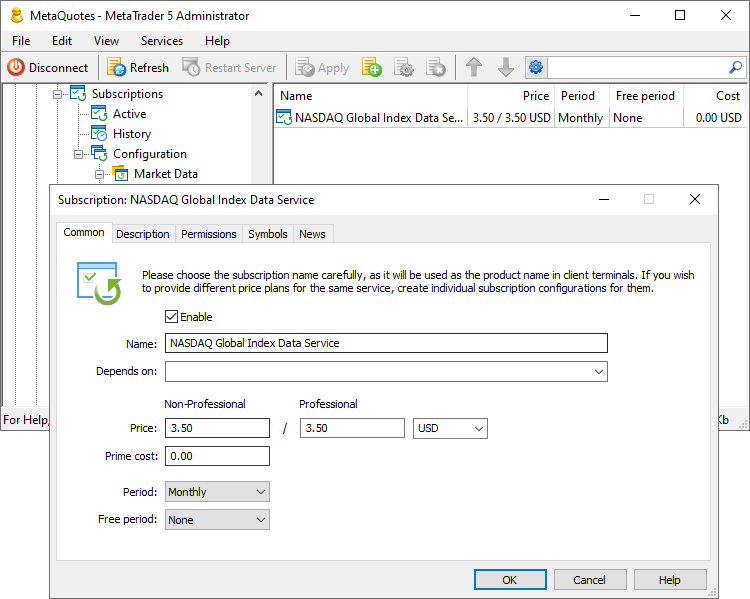

[🏠 Document Start](../../../README.md) / [MetaTrader 5 Trading Platform](../../../MetaTrader-5-Trading-Platform.md) / [Platform Setup](../../Platform-Setup.md) / [Subscriptions](../Subscriptions.md) / Common

[Previous](../Subscriptions.md) | [Next](Description.md)

# Common

Set the service name, price and payment frequency in the main section. Choose a clear and understandable name for the service.

The following settings are available:

  * Name — the name of the service. It should be short and straightforward. This name will be displayed as the product name in client terminals.
  * Depends on — sets if another product subscription is required in order to subscribe to the current product. Using this option you can create product packages. For example, you can create a paid subscription for US market price data, and a dependent free subscription for Asian market data. In this case, traders having the first subscription will be able to receive the second one for free.
  * Price — subscription cost. Another function enabling separate pricing for non-professional (ordinary traders) and professional (legal entities, brokers, banks) clients is currently under development. The price from the Non-Professional fields is currently used for all subscriptions.
  * Prime cost — specify your expenses relating to the service provision. For example, if you are reselling market data, you can specify here how much you are paying for the subscription. This will allow you to build reports on the service profitability.
  * Period — the period of the subscription. If the subscription is canceled before the end of the paid period, data delivery will stop immediately, while the cost of unused time will not be refunded.
  * Free period — subscription trial period. The trading account owner can use the free period once. If the subscription period is extended after the free period (including [automatic renewals (#autorenew)](Permissons.md#autorenew)), the appropriate amount will be paid from the user's account.

> To quickly create similar services, use the "Add copy" command of the context menu. Instead of creating each service from scratch, create a copy of the existing one and adjust the required parameters.
