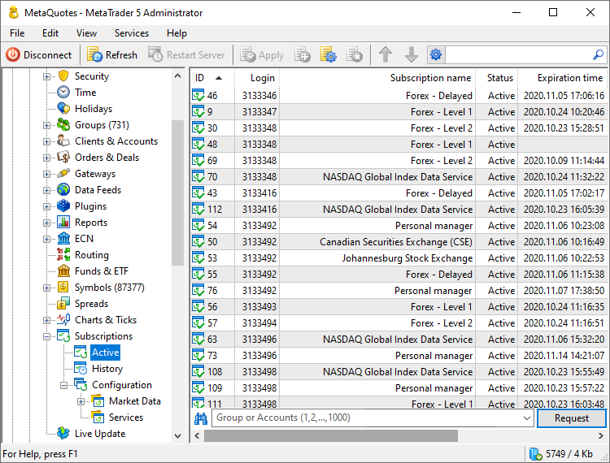
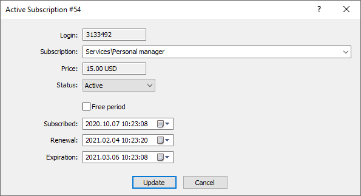
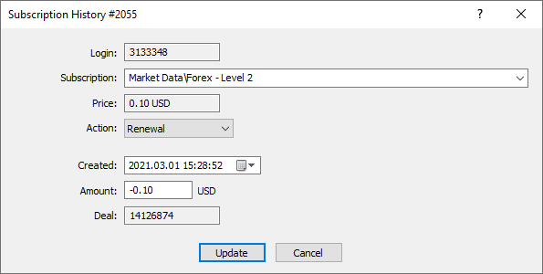

[🏠 Document Start](../../../README.md) / [MetaTrader 5 Trading Platform](../../../MetaTrader-5-Trading-Platform.md) / [Platform Setup](../../Platform-Setup.md) / [Subscriptions](../Subscriptions.md) / Controlling

[Previous](News.md) | [Next](../Mailbox.md)

# Subscriptions Control (#subscriptions-control)

The service usage can be monitored using the Active and History sections. The sections feature active subscriptions and events concerning all subscriptions, respectively.

Request subscriptions from the server to view them:

  * By trader group — select a group from the list or specify the group name manually.
  * By login — specify one or several accounts separated by commas.

## Active Subscriptions (#active)

The following information is available for each active subscription:

  * ID — the internal identifier of the subscription configuration.
  * Login — subscriber's account number.
  * Subscription name — [the name of the subscription](Common.md).
  * Status — current subscription status:

  * Active — the subscription is active and the trader is receiving the service.
  * Suspended — the subscription has been suspended. This status is activated if the [subscription renewal fee (#payments)](../Subscriptions.md#payments) cannot be payed from a trading account.
  * Canceled — the subscription has been canceled.
  * Subscription time — the date and time when the subscription was activated.
  * Renewal time — the latest renewal date and time.
  * Expiration time — subscription expiration date and time.

Using the context menu, you can quickly jump to viewing the subscribed [account](../Accounts.md) and the [subscription configuration](Common.md).

Here you can edit the parameters of an active subscription:

  * Service and subscription status. If you change the subscription state to "Canceled", this subscription will not be available in the list during the next request of active subscriptions.
  * Free period. This is an indication that the user has received the subscription as a free trial. If you disable this option, the user will be able to use a free period once again at the next subscription.
  * Subscription, next renewal and expiration dates. When the subscription period is changed, no additional fees are debited from the account.

### Delete and unsubscribe (#delete-unsubscribe)

When a subscription is canceled or deleted, the user will no longer be able to use the service. However, these actions have fundamental differences:

  * When a subscription is canceled, the relevant information remains in the database, and the [history (#history)](Controlling.md#history) will contain a separate record about subscription cancellation. 
  * When deleted, the whole subscription record is removed from the database. If you delete a trial subscription record, the trader will be able to use the free period again, since there will be no record in the database that it has already been used.

Both actions can be performed using the context menu of the active subscriptions section.

> The Manager account needs appropriate [permissions (#subscriptions)](../Managers.md#subscriptions)in order to access subscription editing options.

## Subscriptions History (#history)

All actions related to subscriptions can be viewed under the "History" tab:

  * ID — the internal identifier of the subscription configuration.
  * Login — subscriber's account number.
  * Subscription name — [the name of the subscription](Common.md).
  * Record Id — the unique identifier of the subscription action.
  * Action— action type:

  * Subscription — subscribing to a service.
  * Renewal — renewal of an existing subscription.
  * Suspension — subscription suspension if the relevant [renewal fee (#payments)](../Subscriptions.md#payments) cannot be paid from the user's account.
  * Cancellation — subscription cancellation by the user.
  * Deletion — subscription deletion by the system, for example when the appropriate configuration is deleted.
  * Amount — subscription cost.
  * Deal Id— the identifier of the [deal](../Deals.md) by which the appropriate [subscription fee (#payments)](../Subscriptions.md#payments) amount was charged from the account.

To adjust the amount of information displayed, use the context menu. Using the menu, you can also quickly jump to viewing the subscribed [account](../Accounts.md) and the [subscription configuration](Common.md).

If you have [appropriate permissions (#subscriptions)](../Managers.md#subscriptions), you can edit actions in history. To do this, double-click on the line.

The following parameters can be edited:

  * Service and type of action. Changes do not affect active trader subscriptions. If you change the action type from "Cancel" to "Subscription", the trader's subscription will not be restored.
  * The date of the action.
  * Subscription fee. The change does not affect the deal by which the subscription payment was conducted.

## Trader Subscriptions (#user-subscriptions)

To view subscription data of a specific trader, open his or her [account](../Accounts.md) and navigate to the "Subscriptions" tab.

To navigate to [general subscription settings](Common.md), double-click on the line.

From this section, you can add a new subscription or delete an existing one:

When adding a paid subscription, the system will notify the user that the payment for the subscription will be debited from the trading account.
