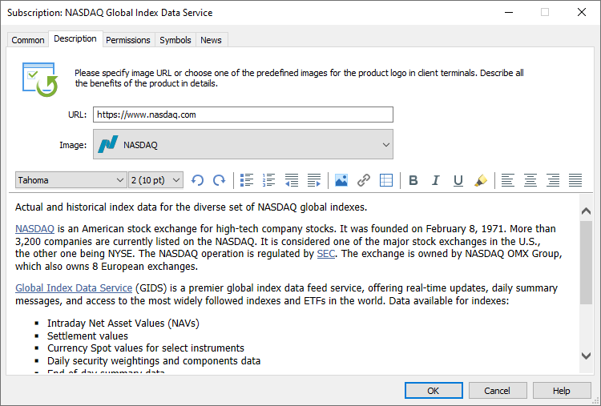

[🏠 Document Start](../../../README.md) / [MetaTrader 5 Trading Platform](../../../MetaTrader-5-Trading-Platform.md) / [Platform Setup](../../Platform-Setup.md) / [Subscriptions](../Subscriptions.md) / Description

[Previous](Common.md) | [Next](Permissons.md)

# Description

In this section, you should provide a detailed description of a subscription, including its benefits for traders. This information will be displayed in the subscriptions showcase in client terminals.

In the "URL" field, add a link to more detailed information about the service. Select a logo — you can access images for the most popular services, as well as for well-known data providers. In the future, you will be able to upload your own logos.

