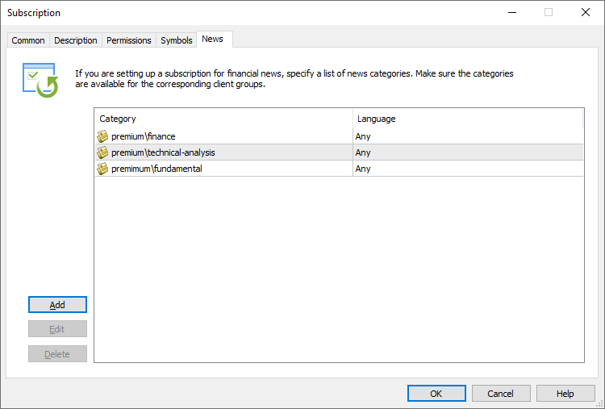

[🏠 Document Start](../../../README.md) / [MetaTrader 5 Trading Platform](../../../MetaTrader-5-Trading-Platform.md) / [Platform Setup](../../Platform-Setup.md) / [Subscriptions](../Subscriptions.md) / News

[Previous](Symbols.md) | [Next](Controlling.md)

# News (#news)

For news data services, set the news categories in this section.

## Preparatory Steps (#prepare)

Before you start offering news subscriptions, you should configure news delivery via [data feeds](../Data-Feeds.md). The news categories specified in subscription settings must be available in the platform.

  * To start offering news, you will need to sign an agreement with appropriate agencies, as news constitute proprietary data.

  * The support website [App Store](https://support.metaquotes.net/en/market/mt5/datafeeds) features a variety of solutions enabling receiving of news data from popular providers.

  
---  
  

## Setup (#setup)

In the settings, specify those news categories, which will be available by subscription.

  * Usually, news categories are provided by data feeds. News providers supplement news with the information about categories to which the news belong. The same applies to the news language.
  * A news category can be additionally specified in the [News Category (#parameters)](../Data-Feeds/Configuration-of.md#parameters) parameter of the data feed. This is a standard parameter supported by all data feeds. The parameter is applied as follows:

  * If a data source does not provide news categories, news items will be added to the category specified in this parameter (the category will be specified in the news).
  * If the data source provides a category, then the data feed will add the "News Category" parameter value before the original category name. The resulting category will look like "[value from News Category] \ [category from data source]". The "\" characters in a category name are interpreted as subcategory separators. Therefore, it means that all news items are added to the category specified in the parameter, within which original categories from the data source will be used.

## Access to news on the client terminal side (#access)

Subscriptions limit access to news in the platform. A subscription is needed to access news if the following conditions are met:

  * There is a subscription with a [list of groups (#country-group)](Permissons.md#country-group) containing the trader group.
  * There is a subscription, having the news category and language in the "News" section.

If there are no appropriate subscriptions in the platform, it is considered that the subscription is not required and the news will be delivered in a normal way, in accordance with the [parameters of the group (#symbols)](../Groups/Group-Settings.md#symbols) to which the account belongs.
