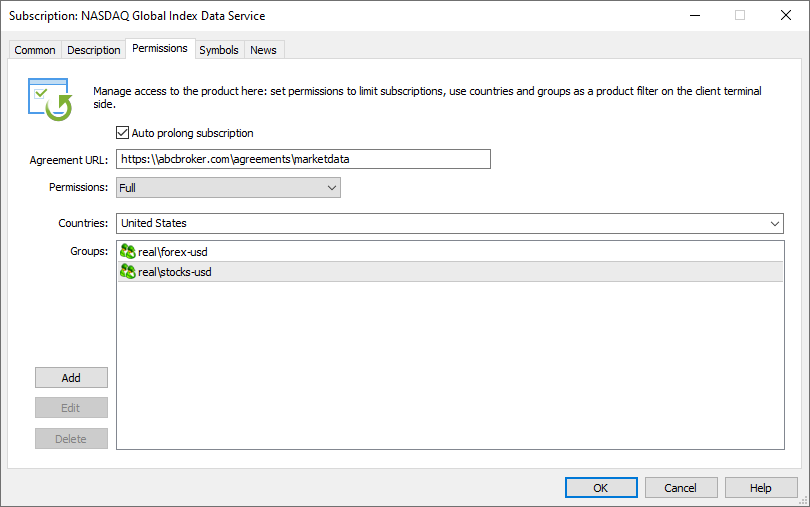

[🏠 Document Start](../../../README.md) / [MetaTrader 5 Trading Platform](../../../MetaTrader-5-Trading-Platform.md) / [Platform Setup](../../Platform-Setup.md) / [Subscriptions](../Subscriptions.md) / Permissons

[Previous](Description.md) | [Next](Symbols.md)

# Permissions (#permissions)

Specify here subscription access permissions: to which client groups and countries the subscription will be available.

Specify the following settings:

  * Auto renew subscription — this option enables automated subscription renewal upon expiration. During renewal, the subscription amount will be automatically debited from the client's trading account.
  * Agreement URL — you can specify here a link to additional Agreement/Rules to be accepted by the trader. An agreement link will be displayed in the subscription confirmation dialog in client terminals.
  * Permissions — select the subscription actions available to traders:

  * Full — the client can subscribe and unsubscribe from the service.
  * Unsubscribe — the client can only unsubscribe from the service. The subscription can only be created through the Manager terminal or the API. If the user is not subscribed to a service with this permission, the appropriate subscription will not be shown to the trader in the client terminal.
  * View — the client can view the service in the terminal, but subscribe and unsubscribe options are only available through the Manager terminal or the API. If the user is not subscribed to a service with this permission, the appropriate subscription will not be shown to the trader in the client terminal.
  * Hidden — clients cannot view the service in the terminal, even if they are subscribed to this services (the subscription fee is charged from the trading account, as for regular subscriptions). The subscription can only be created through the Manager terminal or the API.

## Access to subscriptions by country and group (#country-group)

You can create subscriptions for traders from certain countries. To limit access, specify the list of countries in the appropriate field. To select/deselect all countries in the list, right-click on the list.

Note:

  * When opening a demo account from the client terminal, the client's country is determined automatically.
  * When opening a preliminary account, the country is also determined automatically, but the client can specify another country in the registration form.
  * When creating a real account, you [specify the country manually (#personal)](../Accounts/Editing-Account.md#personal).

Similarly, you can limit access, allowing subscriptions only for clients from individual [groups](../Groups.md).

> Restrictions by countries and groups also affect the ability to subscribe through Manager terminals or the API. If the service is not available for the trader, there is no way to subscribe to it.
