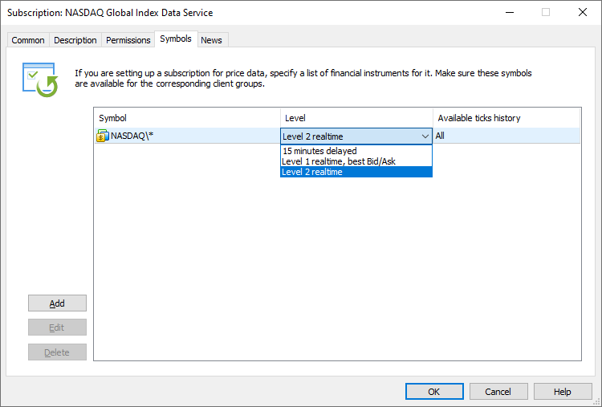
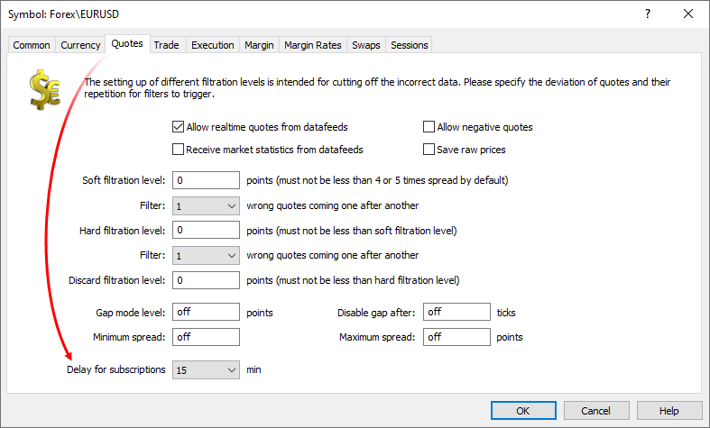
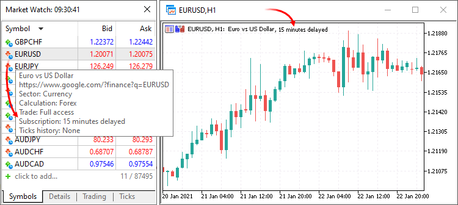

[🏠 Document Start](../../../README.md) / [MetaTrader 5 Trading Platform](../../../MetaTrader-5-Trading-Platform.md) / [Platform Setup](../../Platform-Setup.md) / [Subscriptions](../Subscriptions.md) / Symbols

[Previous](Permissons.md) | [Next](News.md)

# Symbols (#symbols)

For market data services, set the list of trading instruments in the Symbols section. After purchasing a subscription, the trader will have access to these symbols in Market Watch, including their real-time quotes and available price history.

## Preparatory Steps (#prepare)

Before you start offering market data to your traders, you should configure receiving of appropriate symbol data from liquidity providers. The process is similar to adding trading symbols available to traders in the platform:

  * Create the required [symbols](../Symbols.md)
  * Set up [gateways](../Gateways.md) and/or [data feeds](../Data-Feeds.md) to receive appropriate symbol data.

  * To start offering market data, you will need to sign an agreement with appropriate exchanges and trading systems, as the data is proprietary.
  * The support website [App Store](https://support.metaquotes.net/en/market/mt5/aggregation) features a variety of solutions enabling receiving of data from popular liquidity providers.

  * If you are further transmitting subscription data between your servers using gateways or data feeds, enable the "[Allow access to subscription data via data feeds (#subscription-data-feed)](../Accounts/Editing-Account.md#subscription-data-feed)" permission in the settings of the trading account you are using for connecting to the source server.

  
---  
  

# Setup (#setup)

Specify the symbols and/or symbol groups which data will be available by subscription. Specify, which data will be available for each of the symbols or groups:

  * Level — data type that will be available by subscription:

  * Delayed — data in the Market Watch in client terminals will be displayed with a [delay (#delayed)](Symbols.md#delayed). Depth of Market and tick history will not be available.
  * Level 1 realtime, best Bid/Ask — data in the Market Watch will be displayed in real time. Depths of Market will not be available.
  * Level 2 realtime — the subscriber will receive in real time the best Bid/Ask prices in the Market Watch, as well ad the Depth of Market data.
  * Available tick history — the tick history depth that will be available by subscription.

> To provide Depth of Market or tick history by subscription, the relevant data must be available in your platform (must be provided by the gateways/data feeds that you use).

## Access to symbols on the client terminal side (#access)

Subscription limit general access to [trading symbols](../Symbols.md) available in the platform. If a symbol is not used in subscriptions, this symbol can be accessed in a regular way — in accordance with the [settings of the group (#symbols)](../Groups/Group-Settings.md#symbols) to which the account belongs.

If a symbol subscription exists in the platform, then access to the symbol data (quotes, history, Depth of Market, tick history) depends on whether the subscription is available to the trader in accordance with the subscription [permission settings (#country-group)](Permissons.md#country-group).

  * If [permission settings (#country-group)](Permissons.md#country-group) include the trader's group, then the trader will be able to access the real-time symbol data by subscription. Without a subscription, the trader will only receive [delayed data (#delayed)](Symbols.md#delayed). It means that you do not disable access to symbol data by setting up a subscription. Without a subscription, the trader can still receive the symbol data, but only with a delay.
  * If there are no subscriptions available to this client group, the trader will be able to receive the relevant market data without a subscription. The access will be provided in accordance with the group settings.

Example: you have a EURUSD symbol subscription with access for the 'real-usd' group.

  * A trader from the 'real-usd' group will need a subscription to receive the EURUSD data.
  * Traders from any other groups will receive the EURUSD data in accordance with the appropriate group settings, without a subscription.

If the trader has multiple intersecting subscriptions, the maximum subscribed data will be available. For example, if a trader has a subscription for the delayed EURUSD data and a subscription for EURUSD Level 2, then Level 2 data will be available to the trader.

> Subscriptions restrict access to data that is originally [available to the user group (#symbols)](../Groups/Group-Settings.md#symbols). For example, if only Forex\* symbols are available to a trader's group, then no subscription can provide access to data from the Stocks\* group.

## License Control (#license-control)

Each subscription allows up to three connections: one from a desktop terminal, one from a mobile terminal, and one from a web terminal. Additional connections will receive subscription data with a 15-minute delay. Accounts connected in investor mode will always receive delayed data and will not have access to tick history.

## Delayed data (#delayed)

You can provide market data with a [minute delay (#level)](Symbols.md#level). For example, this can serve as a free trial version of your service. A certain delay in quote delivery can also be demanded by some exchanges providing data.

The default delay is 15 minutes, however you can override this value for each [trading instrument (#delay)](../Symbols/Symbol-Settings/Quotes.md#delay):

The delay is specified at this level, because exchanges can have different requirements for each trading instrument. Therefore, you cannot create multiple subscriptions for the same trading instrument with different delay values. The value specified in symbol settings will be applied for all subscriptions connected to this instrument.

> A restart of [access servers](../Network-cluster/Configuring-Servers/Access-Server.md) is required for new delay settings to take effect.

This works as follows on the client terminal side:

  * Quotes in the Market Watch will be received with a delay.
  * Charts will be updated with a delay.
  * The current prices for positions and orders in the Trade section will be updated with a delay.
  * Profit by position and account balance will be updated at current prices, without delay.
  * The tick history is only available for the current terminal operation session (deep history is not available, regardless of the subscription settings).
  * Depths of Market is not be available.

A special indication is used in client terminals to inform traders about which data is provided with a delay:

  * Symbols in Market Watch are marked with a clock icon, and the delay value is displayed in the tooltip
  * Data delay notification is displayed on charts

