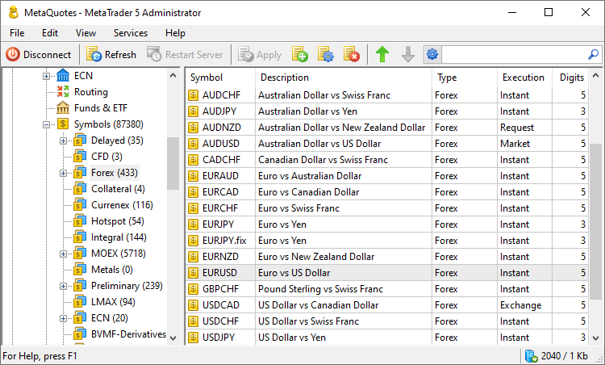
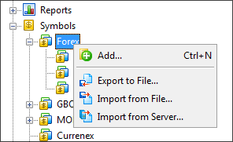
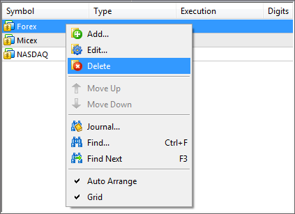
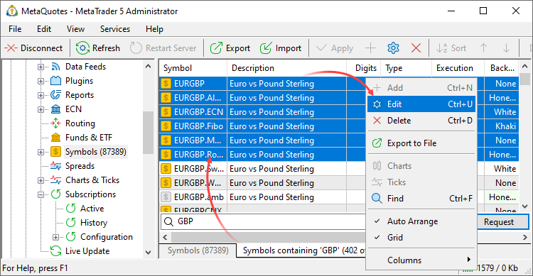

[🏠 Document Start](../../README.md) / [MetaTrader 5 Trading Platform](../../MetaTrader-5-Trading-Platform.md) / [Platform Setup](../Platform-Setup.md) / Symbols

[Previous](Funds-&-ETF.md) | [Next](Symbols/Symbol-Settings.md)

# Symbols (#symbols)

This section is devoted to the management of symbols in the trading system. The possibility of structuring symbols in groups is available here.

The structure of symbols can be viewed in the left part of the administrator terminal. The right part reflects group or symbols included into a selected group of a higher order. Information about symbols is represented in four columns:

  * Symbol — symbol name;
  * Type — group of the highest order to which the symbol is included;
  * Execution — type of trade operation execution for this symbol;
  * Digits — number of decimal places in the symbol price.

## Managing Groups of Symbols (#groups)

To create a new group, select a group of higher level, in which the new group should be created. To create a rout group, select the Symbols section. After that call the context menu and execute the " Add" command specifying the name of the new group.

  * After a group of symbols has been created, you will not be able to change its name.
  * Symbol group name cannot contain any punctuation marks or special characters (allowed are ".", "_", "&" and "#"). It's not recommended to use the following characters in the symbol names: <, >, :, ", /, |, ?, *.

  
---  
  
If you need to delete a group, select it in the right part of the "Symbols" section and press " Delete" in the [Edit](../MetaTrader-5-Administrator/User-Interface/Main-Menu/Edit.md) menu, on the [Standard](../MetaTrader-5-Administrator/User-Interface/Toolbar/Standard.md) toolbar or in the [context menu (#context)](Symbols.md#context):

> A group that contains at least one symbol cannot be deleted. In order to delete a group, first you should delete all symbols from it.

## How to Manage Symbols (#symbols-manage)

Symbols are managed in the right part of the administrator terminal.

  * Adding  
In order to add a symbol, enter the necessary group and execute the " Add" command in the [Edit](../MetaTrader-5-Administrator/User-Interface/Main-Menu/Edit.md) menu, on the [toolbar](../MetaTrader-5-Administrator/User-Interface/Toolbar.md) or in the context menu. After that the window of [symbol settings](Symbols/Symbol-Settings.md) will be opened.
  * Editing  
In order to edit a symbol, select it and execute the " Edit" command of the [Edit](../MetaTrader-5-Administrator/User-Interface/Main-Menu/Edit.md) menu, on the [Standard](../MetaTrader-5-Administrator/User-Interface/Toolbar/Standard.md) toolbar or in the context menu. After that the window of [symbol settings](Symbols/Symbol-Settings.md) will be opened. The symbol editing window can be opened by double clicking on the symbol in the list. You can also edit several symbols [at the same time (#groupwork)](General-Information/Working-with-Instructions.md#groupwork). To do this, select symbols using the mouse and "Ctrl" or "Shift", and then execute the " Edit" command.
  * Deleting  
In order to delete a symbol, select it and execute the " Delete" command in the [Edit](../MetaTrader-5-Administrator/User-Interface/Main-Menu/Edit.md) menu, on the [Standard](../MetaTrader-5-Administrator/User-Interface/Toolbar/Standard.md) toolbar or in the context menu. You can delete several symbols at the same time, selecting them using the mouse and "Ctrl" or "Shift".
  * Sorting  
Symbols and symbol groups can be sorted alphabetically. The feature of sorting is that it is performed on the server, not on the local MetaTrader 5 Administrator. To sort symbols execute the " Sort Alphabetically" command in the context menu. Once it is done, the confirmation window will appear. In it you can choose whether the symbol groups should also be sorted or not.

  * We strongly recommend to perform changes of financial symbols only on weekends or holidays, when markets are closed.
  * Additional general information about working with configuration records is given in the ["Working with Instructions"](General-Information/Working-with-Instructions.md) section.

  
---  
  

## Symbol filtering and batch editing (#filter)

You can [edit the settings of multiple symbols (#groupwork)](General-Information/Working-with-Instructions.md#groupwork) at a time. Select the required symbols in the list and click "Edit" in the context menu.

To bulk edit symbols which are in different subcategories, use the filter tab at the bottom of the window. Specify a comma separated list of symbols or a mask, for example:

  * EURUSD, GBPJPY — two specified symbols
  * EUR*, GBP* — the symbols with the names beginning with EUR and GBP
  * *USD, !GBPUSD — all symbols with USD as the second currency except for GBPUSD

Select the desired symbols from the filtered list and edit:

To create copies of multiple symbols, select the desired symbols, click " Edit" in the menu, and then specify the postfix in the "Symbol" field. The postfix must begin with a period (.). For example, if you select the symbols EURUSD, USDJPY, GBPUSD and add the postfix .x (EURUSD.x) in the group editing window, you will get copies of the symbols: EURUSD.x, USDJPY.x and GBPUSD.x.

## Context Menu (#context)

The context menu of the "Symbols: section contains the following commands:

  *  Add — [add](Symbols/Symbol-Settings.md) a new symbol.
  *  Edit — [edit](Symbols/Symbol-Settings.md) a selected symbol or open a selected group.
  *  Delete — delete a selected symbol or group.
  *  Move Up — move a selected symbol up relative to others. This sorting is saved on the server. To sort the list of symbols temporarily, click on the heading of any column. When temporary sorting is enabled, the symbol moving up/down buttons become inactive.
  *  Move Down — move a selected symbol down relative to others. This sorting is saved on the server. To sort the list of symbols temporarily, click on the heading of any column. When temporary sorting is enabled, the symbol moving up/down buttons become inactive.
  *  Sort alphabetically — [sort (#sort)](Symbols.md#sort) configurations alphabetically. Please note that sorting is done on the server, not in the local terminal.
  * Automation triggers — create an [automation](Automations.md) task for the selected event or edit an existing one. The menu displays only the triggers and tasks associated with the current section.
  * Automation actions — add an automation action to an existing task or create a new task based on the action. The menu displays only the actions associated with the current section.
  *  Export to File — [export](General-Information/ImportExport-Settings.md) symbol settings to a file.
  *  Import from File — [import (#import)](General-Information/ImportExport-Settings.md#import) symbol settings to a file.
  *  Import from Server — start [importing symbols](Symbols/Import-of.md) from a remote MetaTrader 5 or MetaTrader 4 server.
  *  Journal — request [logs](Network-cluster/Journal.md) according to the selected configuration. This will open the trade server logs section, with the name of the selected configuration automatically specified in the query field. You will only need to press the request button.
  *  Charts — request the [minute history](1-Minute-History-Charts.md). This opens the relevant section with the name of the selected symbol automatically specified in the request field.
  *  Ticks — request the [tick history](BidAskLast-Ticks.md). This opens the relevant section with the name of the selected symbol automatically specified in the request field.
  *  Find — open the [search](../MetaTrader-5-Administrator/User-Interface/Search.md) window.
  * Auto Arrange — if this option is enabled the size of columns is selected automatically.
  * Grid — this option shows/hides field separators in the table with symbols.

