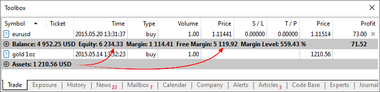
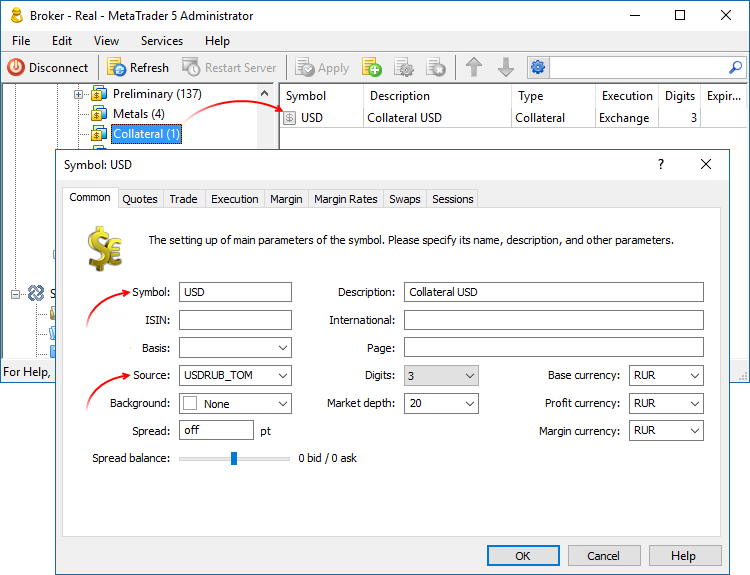
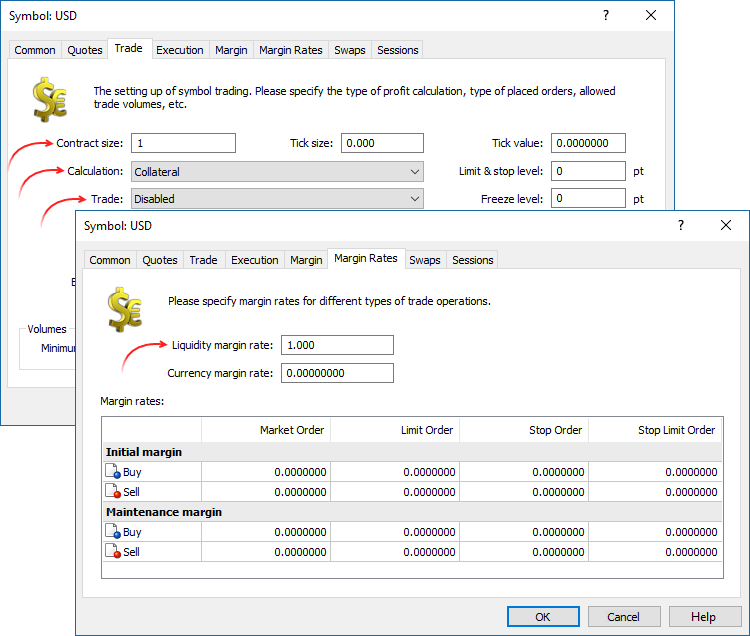

[🏠 Document Start](../../../README.md) / [MetaTrader 5 Trading Platform](../../../MetaTrader-5-Trading-Platform.md) / [Platform Setup](../../Platform-Setup.md) / [Symbols](../Symbols.md) / Collateral

[Previous](Import-of.md) | [Next](../Spreads.md)

# Collateral Symbols

The trading platform supports a special type of non-tradable assets, which can be used as client's assets to provide the required margin for open positions of other instruments. For example, a certain amount of gold in physical form can be available on a trader's account, which can be used as a margin (collateral) for open positions.

Such instruments have [calculation type "Collateral" (#calculation)](Symbol-Settings/Trade.md#calculation). Features of such symbols:

  * Clients can't perform any operations with these symbols, except for closing. A position can be opened only by a manager.
  * No profit can be accrued for the positions of these symbols, they have no stop loss or take profit.
  * The value of such a position, and thus the amount of money that a client can use as collateral, is calculated by the below formula:

Such assets are displayed as open positions. Their value is calculated by the formula: Contract size * Lots * Market Price * Liquidity Rate.

Liquidity Rate is the share of the asset that a broker allows to use for the margin, it is set in the [symbol properties](Symbol-Settings/Margin.md).

> For groups with the risk management mode ["for Stock Exchange, based on margin discount rates" (#risk)](../Groups/Group-Settings.md#risk), the current Last price is used for Market Price, instead of Bid and Ask.

The Assets are added to the client's Equity and increase Free Margin, thus increasing the volumes of allowable trade operations on the account.

In the example above, a trader has 1 ounce of gold having the current market value of 1 210.56 USD. This value is added to the equity and the free margin.

[Symbol settings (#trade-disabled)](Symbol-Settings/Trade.md#trade-disabled) may allow clients and managers close such positions (Trade = Close only). In this case a trader will be able to convert the asset in the deposit currency at the current market rate and use that money for trading. A position can be closed only if the conversion rate of the assets currency into the deposit currency is available.

## Charging a client account

An asset can be added to a client account via the manager terminal or gateways. For example, [MetaTrader 5 Gateway to MOEX Securities](../../Platform-Components/Gateways/MOEX-Securities.md) supports importing the clients' money limits in currencies other than the ruble as Collateral positions.

## Configuring collateral symbols

Create a separate symbol group via the Administrator terminal and then create a currency symbol in it. Select "Collateral symbol currency" — "Client deposit currency" pair as a quote source for it.

Next:

  * Set Collateral for the symbol type
  * Disable trading for the symbol
  * Set contract size 1 to let the price be displayed down to the last cent
  * Specify zero size and tick value
  * Specify the liquidity margin rate - amount of the current value of an asset, which will be taken into account as collateral
  * Remove all margin ratios (set zero values)

