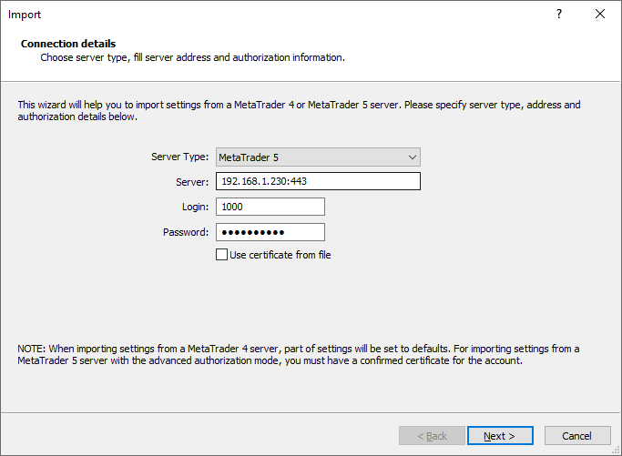
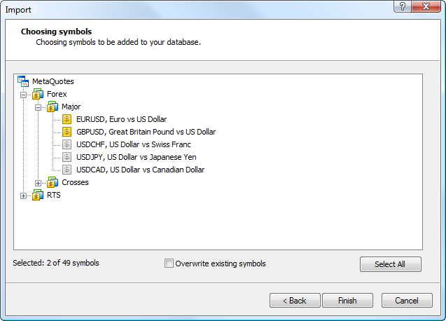

[🏠 Document Start](../../../README.md) / [MetaTrader 5 Trading Platform](../../../MetaTrader-5-Trading-Platform.md) / [Platform Setup](../../Platform-Setup.md) / [Symbols](../Symbols.md) / Import of

[Previous](Splicing-Futures.md) | [Next](Collateral.md)

# Import of Symbols

Using the administrator terminal you can import [symbols](../Symbols.md) with all their settings from any remote servers of MetaTrader 5 or MetaTrader 4.

> In order to import symbols from another server, there should be any active account (demo or real, but not a manager one).

To start importing symbols use the " Import from Server" command of the [context menu (#context)](../Symbols.md#context) of the Symbols section. After that the following window will appear:

On the first step specify the details of the server from which symbols and details for connecting it will be imported:

  * Server Type — in this field you should select the type of the server from which symbols will be imported: MetaTrader 5 or MetaTrader 4;
  * Server — IP address and port of the server separated by a colon;
  * Login — login for authorizing on the server;
  * Password — password for authorizing on the server;
  * Use certificate from file — if symbols are imported from a MetaTrader 5 server with the enabled mode of [extended authorization](../../MetaTrader-5-Administrator/Getting-Started/Connect-to-Server/Extended-Authorization.md), connection using the details of the account specified above will requite a confirmed certificate. If the certificate has been installed in the operating system storage, it will be automatically recognized by the importing system. If the certificate hasn't been installed yet, this option should be enabled and path to the file should be specified manually;

  * Certificate file — press "Browse" and specify the pfx file of the certificate. The file certificate obtained in the terminal is saved to /terminal data folder/profiles/server name/certificates/.
  * Certificate Password — [password (#password)](../../MetaTrader-5-Administrator/Getting-Started/Connect-to-Server/Extended-Authorization.md#password) of the certificate.

  * Import in the extended authorization mode is available only from MetaTrader 5 servers.
  * Symbols from a MetaTrader 4 server are imported to the current selected [group (#groups)](../Symbols.md#groups). When importing from a MetaTrader 5 server, location of groups is preserved the same as that on the source server.

  
---  
  
After you have specified all the data, press "Next". In case of a successful connection to the server, the list of available symbols will appear in the next window:

There are several ways to select symbols:

  * By double clicking on a symbol icon - the icon will become yellow at that;
  * By double clicking on a group icon - all symbols on the group will be selected at that;
  * Using the "Select all" button.

Here you can also view [settings](Symbol-Settings.md) of imported symbols. To do it click twice on their names. To start the import press "Done".

  * If you enable the "Overwrite existing symbols" option, then in case the name of an imported symbol matches one of the existing symbols, all its settings will be overwritten (including path in the hierarchy). If this option is disabled, such symbols will not be imported.
  * All symbols are imported with the [disabled (#trade-disabled)](Symbol-Settings/Trade.md#trade-disabled) trading possibility;
  * After importing symbols, please check their settings.

  
---  
  
## Specifics of Import

When importing symbols from a MetaTrader 4 server, parameters are converted, while missing parameters are assigned default values:

  * [Filters](Symbol-Settings/Quotes.md)  
The filtering level of a symbol from MetaTrader 4 is set as [soft (#soft-filtration)](Symbol-Settings/Quotes.md#soft-filtration). The hard filtering is 5 times larger, while the discard level is 100 times larger.
  * [Volumes (#volumes)](Symbol-Settings/Trade.md#volumes)  
Default volume levels are set.

Symbols from a MetaTrader 4 server are imported to the current [group (#groups)](../Symbols.md#groups). When importing symbols from a MetaTrader 5 server location of symbols by groups is preserved the same as that on the source server.
