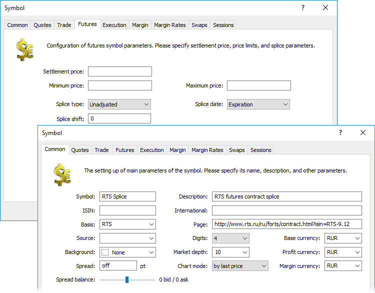

[🏠 Document Start](../../../README.md) / [MetaTrader 5 Trading Platform](../../../MetaTrader-5-Trading-Platform.md) / [Platform Setup](../../Platform-Setup.md) / [Symbols](../Symbols.md) / Splicing Futures

[Previous](Symbol-Settings/Sessions.md) | [Next](Import-of.md)

# Splicing Futures

MetaTrader 5 trading platform allows users to splice the quotes of the symbols having a single underlying but different validity periods. Futures can serve as examples of such symbols. Spliced symbol charts allow performing technical analysis of prices for an underlying asset.

It is possible to splice not only bars but tick data as well. Please note that tick data take much more disk space compared to minute history. After splicing, same ticks are stored separately for source symbols and a spliced one.

To splice the futures, a new symbol should be created. The history of quotes of this symbol will represent splicing of several futures with one underlying asset. Also, quotes of the front futures will be broadcast in real time at this symbol.

> The front futures is a futures with the closest expiration date.

  * Since the splicing symbol is created solely for analytical purposes, the ability to trade it should be disabled at ["Trade" (#trade-disabled)](Symbol-Settings/Trade.md#trade-disabled) tab.

  * Splicing symbols are not influenced by [session settings](Symbol-Settings/Sessions.md), because the sessions of original symbols may differ.

  
---  
  
["Exchange Futures" calculation type (#trade-disabled)](Symbol-Settings/Trade.md#trade-disabled) should be set on the symbol's "Trade" tab. Also, the following parameters should be set for the symbol:

  * name should be specified in "Symbol" field of ["Common"](Symbol-Settings/Common.md) tab ;
  * additional information can be specified in "Description" field (optional);
  * a link to the web page can be specified in "Page" field (optional);
  * market depth should be enabled;
  * spread, spread balance, prices, etc. settings on the "Common" tab should be disabled;
  * quote sessions from 00:00 to 24:00 on all days should be set on ["Sessions"](Symbol-Settings/Sessions.md) tab (session borders are often defined by an exchange shortly before the sessions themselves; these settings are set to ensure getting into the exchange's quote sessions);
  * set underlying asset and splicing settings according to the instruction below.

All other symbol parameters are of no importance.

> The following settings of the splicing symbol must match the settings of the symbols used for splicing:

## Setting an Underlying Asset

The underlying asset, according to which the splicing will be performed, should be specified in "Basis" field of ["Common"](Symbol-Settings/Common.md) tab. The quotes of all symbols with the specified underlying asset will participate in splicing.

## Configuring Splicing

As a rule, several futures having different expiration dates are simultaneously traded for the same underlying asset. A point, at which the quotes of one futures are replaced with the quotes of another, is called a splicing point.

The splicing type is set first. Despite a single underlying asset, the level of price for futures having different expiration dates may differ. Thus, considerable drops may form in their splicing points. The trading platform allows splicing the prices both with and without reducing the price to a single level.

  * Unadjusted — splicing of quotes is performed without reducing the price level of the previous (expiring) contract to the prices of the next one (or a frontal one — futures with the closest expiration date). In this case, real quotes will be available in history.
  * Adjusted — the difference between the last quote of the previous (expiring) contract and the first quote of the new front contract is calculated during splicing. The calculated difference is added/deducted from all previous quotes leading to the adjustment of the price level. This method allows forming a smooth final chart convenient for full-scaled technical analysis. However, the history will contain reduced quotes instead of actual ones.

The main step in setting up splicing is defining a splicing point. The trading platform has the ability to define a splicing point relative to a symbol's expiration date. Each symbol has its expiration date shown in "To" field of ["Sessions"](Symbol-Settings/Sessions.md) tab.

Futures splicing can be performed either at the moment of a current (front) contract's expiration or with a shift from that moment by the specified number of days. The point of switching to the quotes of the next contract depends on the "Splice shift" parameter. If it is set to 0, the quotes switch at the moment of the current contract's expiration, otherwise — the specified number of days earlier than its expiration.

After saving the symbol, the platform will start splicing and its chart will become available for viewing. Also, quotes of the front futures will be broadcast in real time at this symbol. And depending on the "Splice shift" parameter the symbol will switch to the quotes of the next contract at the moment of the current contract's expiration or the specified number of days earlier than its expiration.

Detailed information about splicing points and transformation prices can be found in the [journal](../Network-cluster/Journal.md) of the history server.

## Example of splicing

Let's consider the example of splicing of three symbols:

  * RTS-9.12 futures for RTS underlying with the expiration date of 2012.09.15 15:45
  * RTS-12.12 futures for RTS underlying asset with the expiration date of 2012.12.15 15:45
  * RTS-3.13 futures for RTS underlying asset with the expiration date of 2013.03.15 15:45.

Let's specify the following settings for the splicing symbol:

  * Symbol — @RTS;
  * Basis — RTS;
  * Splice — Adjusted;
  * Date — Expiration;
  * Shift — 1.

After saving the symbol, check the splicing by the history server's journal:

2013.02.15 09:24:35 HistoryBase @RTS continuous build from RTS-3.13 [2012.12.14-2013.03.14][45638 bars updated][adjustment 0 pips]  
2013.02.15 09:24:37 HistoryBase @RTS continuous build from RTS-12.12 [2012.09.14-2012.12.14][72600 bars updated][adjustment -40 pips]  
2013.02.15 09:24:39 HistoryBase @RTS continuous build from RTS-9.12 [2011.06.06-2012.09.14][70532 bars updated][adjustment -220 pips]  
---  
  
The example above shows the splicing of three symbols. The splicing is performed the day before the symbol's expiration.

The quotes' period that has got into the final spliced symbol, as well as the value, by which the previous quotes have been shifted, while splicing with that symbol, should be be specified for each symbol.

> Splicing may take some time. A large volume of the accumulated tick data on spliced symbols may greatly affect a splicing time. However, splicing is performed asynchronously — charts are completed step by step without interfering with the platform operation.
