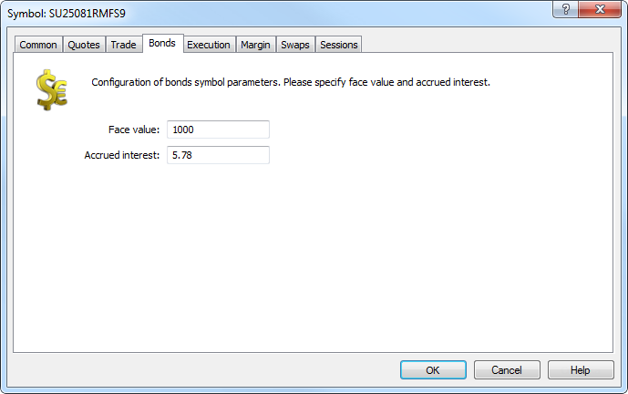

[🏠 Document Start](../../../../README.md) / [MetaTrader 5 Trading Platform](../../../../MetaTrader-5-Trading-Platform.md) / [Platform Setup](../../../Platform-Setup.md) / [Symbols](../../Symbols.md) / [Symbol Settings](../Symbol-Settings.md) / Bonds

[Previous](Options.md) | [Next](Execution.md)

# Bonds

This tab contains the settings specific to bonds.

This tab appears only if Exchange Bonds symbol [calculation mode (#calculation)](Trade.md#calculation) is enabled.  
---  
  

The tab contains the following settings:

  * Face value — initial value set by an issuer.
  * Accrued interest — accumulated coupon interest (part of the coupon interest calculated in proportion to the number of days since the coupon bond issuance or the last coupon interest payment).

