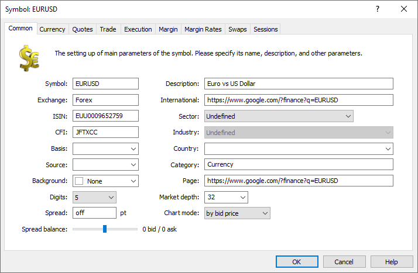

[🏠 Document Start](../../../../README.md) / [MetaTrader 5 Trading Platform](../../../../MetaTrader-5-Trading-Platform.md) / [Platform Setup](../../../Platform-Setup.md) / [Symbols](../../Symbols.md) / [Symbol Settings](../Symbol-Settings.md) / Common

[Previous](../Symbol-Settings.md) | [Next](Currency.md)

# Common (#common)

The common symbol parameters are set up on this tab:

  * Symbol — symbol name. It should not contain any punctuation marks or special characters except for ".", "_", "&" and "#". It's not recommended to use the following characters in the symbol names: <, >, :, ", /, |, ?, *. Do not use , and \ symbols (the latter is interpreted as the subgroup separator). Whitespaces set at the beginning or at the end of the name are automatically removed when saving. Do not create symbols with names only differing in case, such as for example Apple and APPLE. Otherwise problems may arise when working with price data.
  * Description — a brief description of the symbol.
  * ISIN — International Securities Identifying Number. A unique 12-character code that unambiguously identifies it.
  * International name — the international name of the symbol (in English, as a rule).
  * Exchange — the name of the exchange in which the symbol is traded.
  * Category — the symbol category. Categories are intended for additional marking of financial instruments. For example, this can be the market sector to which the symbol belongs: Agriculture, Oil & Gas and others.
  * CFI — instrument classification in accordance with the [ISO 10962](https://www.iso.org/standard/44799.html) standard. The parameter is used for [EMIR reports](../../Reports/EMIR.md).
  * Sector — economic sector the instrument belongs to, such as energy, finance, healthcare and others.
  * Industry — industry branch the instrument belongs to, such as sportswear and accessories, car manufacturing, restaurant business and others.
  * Country — country of the company whose shares are traded on the stock exchange.
  * Basis — the underlying asset of a derivative. For example, for gold futures contracts gold is the underlying asset. The parameter is used in the following calculations:
    * When [splicing](../Splicing-Futures.md) futures charts.
    * When calculating the margin for [intercontract spread](../../Spreads.md).
    * When building [options boards](Options.md) in the client terminal for symbols with the Exchange Options and Exchange Margin Options calculation types.
  * Page — address of a web page with the information on this symbol. This address will be shown as a link when viewing symbol properties in the client terminal.
  * Source — a symbol, whose quotes should be used for the current symbol. Specify here the name of the symbol that exists in the system. Note that the quotes will be taken directly from the corresponding symbols in the [data feed](../../Data-Feeds.md) (without any transformation according to the settings of the corresponding symbol in the trading platform). After this field has been changed, the server needs to be [restarted (#restart)](../../../MetaTrader-5-Administrator/User-Interface/Main-Menu/Services.md#restart).
  * Digits — number of decimal places in the symbol price. After changing this parameter the server should be [restarted](../../Network-cluster/Restarting-and-Stopping-Servers.md).
  * Background — background color of the symbol. This will also be the background color of the symbol in the Market Watch window in the client and manager terminals.
  * Market depth — displaying of the market depth of this symbol and its depth. The depth is specified for one direction. For example, if you specify 16, then up to 16 buy orders and the same number of sell orders will be displayed in the Depth of Market. The maximum depth is 32 orders in one direction. If you set "off" here, then a scalper depth of market instead of the exchange one will be used for the symbol. The scalper depth of market shows best Bid/Ask prices as well as a range of prices above and below them generated with the same step (minimal price step), which can be used to quickly place pending orders. If the depth of market is enabled for a symbol, its charts will be drawn using the prices of last executed deals (Last).  
After changing this parameter the server should be [restarted](../../Network-cluster/Restarting-and-Stopping-Servers.md).
  * Spread — spread size in points. If the value of this field is non-zero, the spread will be considered fixed, and will be calculated for the symbol using the "Spread balance" parameter. If "0" is set here, the spread is considered floating, i.e. is formed based on quotes received from [data feeds](../../Data-Feeds.md). The value is ignored if [Market depth (#dom)](Common.md#dom) is enabled for the symbol (the value of the "Market depth" parameter is non-zero).
  * Spread balance — in this field you can specify how the Bid and Ask prices should be transformed or shifted. The first value indicates the Bid price shift in points (balance_bid) and the second value is for the Ask price shift in points (balance_ask). Three scenarios of transformation of quotes are possible:
    * If the spread of incoming quotes is equal to the spread specified for the symbol, then the prices are transformed according to the following formula: New Bid = Bid + points * (balance_bid + balance_ask)/2, where points is 1/10ssymbol digits. New Ask = New Bid + spread.
    * If the spread of incoming quotes differs from the spread specified for the symbol, then the prices are transformed according to the following formula: New Bid = (Ask + Bid)/2 - points * (spread/2 - (balance_bid + balance_ask)/2), where points is 1/10symbol digits. New Ask = New Bid + spread.
    * If the floating spread (value "0" or "off") is set for the symbol, then prices are shifted on the same number of points specified for the spread balance.
  * Chart mode — the mode of creation of the symbol chart: using the Bid or Last price. This parameter also sets the price used for building the [bars](../../1-Minute-History-Charts.md) of a financial instrument. Accordingly, this affects what charts will be shown to traders in client terminals. For symbol charts, appropriate symbol prices must be provided by [datafeeds](../../Data-Feeds.md) or [gateways](../../Gateways.md). When the chart drawing mode is changed, the accumulated price history will not be changed. Settings only apply to new received data.

  * If there are no history data for the symbol, but the "Source" field is defined, then after the server restart these data will be created by automatically copying the history data of a symbol specified in the "Source" field.

  * For the symbols, the charts of which are based on Bid prices, the history server does no accept Last prices and volumes from gateways and datafeeds. Such ticks are not saved and are not provided to other components of the platform.

  * If the market depth is available for a symbol, the "Spread" and "Spread Balance" settings are not applied. In this case, the History server [automatically generates the Bid/Ask ticks](../../BidAskLast-Ticks.md) based on the best prices in the market depth, so price markup settings are not applicable to them.

  
---  
  

## Automated enrichment of symbol data (#enrichment)

MetaTrader 5 stores a huge data base from open sources, which enables the automated enrichment of financial symbol data: descriptions, ISIN, related trading venues, sectors and industries. With this data, your clients receive a detailed categorization of symbols, based on which they can [analyze the entire sectors of the economy (#industry-analysis)](https://www.metatrader5.com/en/terminal/help/trading/market_watch#industry-analysis). No extra actions are required from brokers to enable the data.

The following symbol fields are checked during server restart: Description, ISIN, Exchange, Category, Sector, Industry, Country, Page. If any field is empty, the platform will try to fill it with the information from its database, based on the symbol name.

The platform journal will display the following log entries:

2020.09.11 16:29:46.541 Symbols symbol 'NAV' config enriched: Symbols - NAV - Description: 'Net Asset Value' -> 'Navistar International Corporation'   
2020.09.11 16:29:46.541 Symbols symbol 'NAV' config enriched: Symbols - NAV - Sector: '' -> 'Industrials'   
2020.09.11 16:29:46.541 Symbols symbol 'NAV' config enriched: Symbols - NAV - Industry: '' -> 'Farm & Heavy Construction Machinery'  
---  
  
If the provided description does not fit, you can replace it with your own information. The fields which the broker fills in manually, are not changed.

> No enrichment is applied to symbols used in [funds](../../Funds-&-ETF.md).
