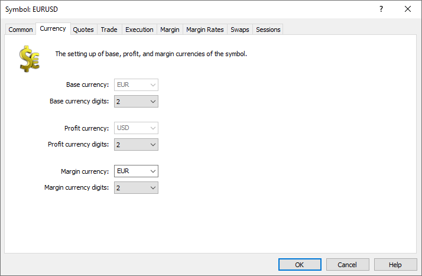

[🏠 Document Start](../../../../README.md) / [MetaTrader 5 Trading Platform](../../../../MetaTrader-5-Trading-Platform.md) / [Platform Setup](../../../Platform-Setup.md) / [Symbols](../../Symbols.md) / [Symbol Settings](../Symbol-Settings.md) / Currency

[Previous](Common.md) | [Next](Quotes.md)

# Currency

The tab allows configuring symbol currency settings:

  * Base currency — base currency of the symbol.
  * Profit currency — currency that will be used to [calculate the profit](Trade/Profit-Calculation.md) from deals on this symbol.
  * Margin currency — [margin requirements](Trade/Margin-Calculation.md) for the symbols will be calculated in this currency.

> For standard world currencies, such as USD, EUR, GBP, JPY, CHF, RUR, etc., the number of digits is set by the platform and thus it is not recommended to change this parameter. This may affect profit and margin calculation for the relevant instrument. The accuracy of cryptocurrencies (and other non-standard currencies) can be changed manually. A higher accuracy enables a proper calculation of profit and margin through cross-rates, in which such currencies are used. If the accuracy is small, the resulting profit or margin value can be equal to zero due to rounding.
