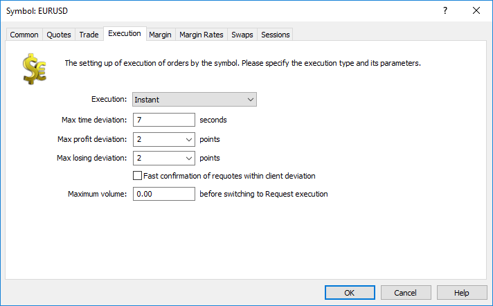

[🏠 Document Start](../../../../README.md) / [MetaTrader 5 Trading Platform](../../../../MetaTrader-5-Trading-Platform.md) / [Platform Setup](../../../Platform-Setup.md) / [Symbols](../../Symbols.md) / [Symbol Settings](../Symbol-Settings.md) / Execution

[Previous](Bonds.md) | [Next](Margin.md)

# Execution (#execution)

The symbol order execution mode is set up on this tab:

## Instant (#instant)

In this mode a client places an order at prices from the Market Watch window without requesting prices before that. The following settings are available for this mode:

  * Max time deviation — the maximal difference (in seconds) between the time when the price specified in the client's order was received, and the time of the latest price. If this limit is exceeded, requote is performed and new prices are sent to the client;
  * Max profit deviation — maximal deviation of the order price from the current symbol price in the direction profitable for a client. This value being exceeded, new prices will be sent to the client;
  * Max losing deviation — maximal deviation of the order price from the current symbol price in the direction losing for a client. This value being exceeded, new prices will be sent to the client;
  * Maximum volume — the maximum volume of the order that can be accepted in the instant execution mode. All clients' orders larger than that will be automatically switched to the request execution mode.
  * Fast confirmation of requotes within client deviation — the option is disabled by default. When creating a trade request in the instant execution mode, the client can specify tolerance, i.e. by how many points the request execution price can differ from the price specified in the order. If a dealer returns a requote in response to such a request, and the requote price is within the tolerable deviation specified by the client, the order will be returned to the dealer for confirmation after the client confirms this new price. If the option is enabled, the order will be executed immediately after the client confirms the price. No additional confirmation from a dealer is required.

The following options are used only if the deal volume exceeds the maximum volume that can be accepted in the instant execution mode. Such deals are processed in the "Request" execution mode.

  * Timeout — time in seconds, during which the price provided by the dealer is valid;
  * Confirm orders — if this option is enabled, then after a trader receives quotes from a dealer and agrees to execute a deal at them, the dealer will have to additionally confirm the execution of this order.

### Checking prices and requotes (#requote)

If the price in the trade request exceeds the maximum deviation in the profit or loss direction, the server returns a requote to the client and prints the following message to the [Journal](../../Network-cluster/Journal.md):

'7000009': requote 1.15309 / 1.15329 (instant buy 0.01 EURUSD at 1.15328)[slippage]  
---  
  
If the requot price provided by the dealer exceeds the maximum deviation specified by the trader in the trade request (order), another requote is sent to the trader. the following message is printed to the journal:

'7000009': requote 1.15313 / 1.15333 (instant buy 0.01 EURUSD at 1.15331)[dealer deviation]  
---  
  
Apart from checking the price value and time deviation according to symbol settings, the server performs additional checks.

Checking for presence in the flow. The price used by a client to set an order, should be present in the quote flow. In other words, a deal cannot be performed at a non-existing price. The price search depth is defined by the "Max time deviation" parameter. If there is no price, the server sends a requote to a client and the appropriate message (deviation is blocked with 'count' on 'request') appears in the journal. Here 'count' means the counter of invalid client requests, while 'request' is a request description. In each case of that type, the invalid client request counter is increased.

Checking for obsolescence. The platform checks if the prices used by a client to place an order are obsolete. Depending on the market rate, the server calculates the range of the last ticks, within which the requested price is located. On the fast market, the acceptable range is expanded, while on the slow market, it is narrowed. If the price does not fall within the acceptable range, the server sends the client a requote and leaves the following message in the journal: previous price 'x' on 'request.' Here, 'x' is a location of the requested price in the quote flow (0 means the last price), while 'request' is a request description. In each case of that type, the invalid client request counter is increased.

Invalid request counter. The server features the invalid request counter for each client. As soon as the counter exceeds the threshold value, the server starts rejecting subsequent invalid client requests leaving the 'off quotes' message. The appropriate message (deviation is blocked with 'count' on 'request') appears in the journal. Here, 'count' means the counter of invalid client requests, while 'request' is the last request description. When a valid client request is received, the counter is decreased.

## Request (#request)

In this mode, a client requests the filling price before placing an order. The following options are available here:

  * Timeout — time in seconds, during which the price provided by the dealer is valid;
  * Confirm orders — if this option is enabled, then after a trader receives quotes from a dealer and agrees to execute a deal at them, the dealer will have to additionally confirm the execution of this order.

## Market (#market)

In this mode, a client places an order at the broker's price, "agreeing with it in advance".

## Exchange (#exchange)

In this execution mode a trader's request is passed to an external gateway connected to an exchange or another liquidity provider. Operation specifics:

  * Different [order execution policies (#fill-policy)](../../General-Information/Trading-System.md#fill-policy) can be used
  * The [Limit & Stop Level](Trade.md) parameter does not work

