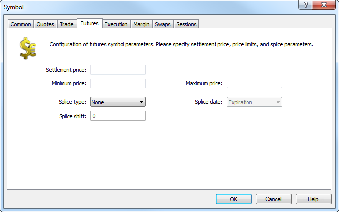

[🏠 Document Start](../../../../README.md) / [MetaTrader 5 Trading Platform](../../../../MetaTrader-5-Trading-Platform.md) / [Platform Setup](../../../Platform-Setup.md) / [Symbols](../../Symbols.md) / [Symbol Settings](../Symbol-Settings.md) / Futures

[Previous](Trade/Conversion.md) | [Next](Options.md)

# Futures

This tab contains the settings specific to futures contracts.

> It appears only if Exchange Futures or FORTS Futures symbol [calculation mode (#calculation)](Trade.md#calculation) is enabled.

Symbol price settings can be specified in the upper part:

  * Settlement price — estimated (clearing) price of a symbol's previous trading session;
  * Minimum price — minimum symbol price in the current trading session;
  * Maximum price — maximum symbol price in the current trading session.

The settings described above are followed by futures contracts splicing ones. This process is described in details in the [separate section](../Splicing-Futures.md).

  * Splice type — Unadjusted mode allows splicing futures quotes "as is" without converting a previous contract's price level to the current (front) contract's prices. In Adjusted mode, the difference between the previous contract's last quote and the front contract's first one is calculated. Then all previous futures' quotes are changed by that value. In that case, the obtained spliced chart is smooth and has no sharp variations on the borders.  
For ordinary symbols, set None.
  * Splice date — only Extension option is currently provided. The splicing is performed at the expiration of the symbol specified in To field of [Sessions](Sessions.md) tab.
  * Splice shift — splice date shift can be set here. The shift is set in the number of days to the past from the symbol's expiration date.

