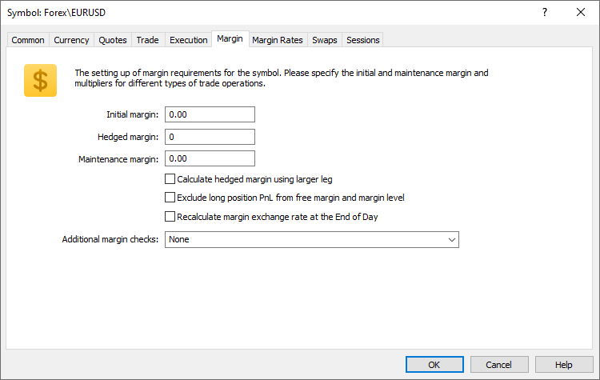

[🏠 Document Start](../../../../README.md) / [MetaTrader 5 Trading Platform](../../../../MetaTrader-5-Trading-Platform.md) / [Platform Setup](../../../Platform-Setup.md) / [Symbols](../../Symbols.md) / [Symbol Settings](../Symbol-Settings.md) / Margin

[Previous](Execution.md) | [Next](Margin-Rates.md)

# Margin

On this tab you can set up parameters of margin requirements of a symbol:

  * Initial margin — amount of money ([margin (#futures)](Trade/Margin-Calculation/Basic.md#futures)) deposited for futures contracts to ensure performance of the contract to execute a deal with the volume of 1 lot. Value is specified in the margin currency. If the initial margin value is specified for a symbol, then this exact value is used. [Formulas of margin calculation](Trade/Margin-Calculation.md) for the corresponding trade type are not used.
  * Maintenance margin — the minimal amount of money ([margin (#futures)](Trade/Margin-Calculation/Basic.md#futures)) that must be available on a client's account to support a position with the volume of 1 lot. Value is specified in the margin currency.
  * Hedged margin — the amount of margin charged per each hedged lot of a position. If initial margin is set for an instrument, the hedged margin is specified as an absolute value (in margin currency) terms. If the initial margin is not set (equal to 0), the contract size is specified. The margin is calculated by the appropriate formula corresponding to the type of the instrument and using the specified contract size. For more details please see the [special section (#hedged)](Trade/Margin-Calculation/Retail-Forex-CFD-Futures-—-Hedging.md#hedged).  
To enable correct risk management, the hedged margin amount must be greater than 0. Otherwise, traders will have almost no restrictions on increasing oppositely directed positions (if the same volume is used for the two directions). It is recommended to use a value equal to the contract size or the initial or maintenance margin (depending on how the hedging margin is set).
  * Calculate hedged margin using larger leg — determines the [hedged margin calculation mode (#hedged)](Trade/Margin-Calculation/Retail-Forex-CFD-Futures-—-Hedging.md#hedged): basic or using larger position leg.
  * Exclude long position PnL from free margin and margin level — the option affects the display of positions purchased with own funds, on accounts with margin trading enabled. If the option is enabled, profit/loss of positions for the symbol will be ignored when calculating free margin, margin level and account equity. Also, [Stop Out (#stopout)](../../Groups/Group-Settings.md#stopout) will not be applies to such positions.
  * Recalculate margin exchange rate at the End of Day — if this option is enabled, at the end of the trading day, the server will update the position margin conversion rate at current market prices. For further details, please see [Basic Margin Calculation (#recalculate-margin)](Trade/Margin-Calculation/Basic.md#recalculate-margin).
  * Additional margin check — on default, the margin is checked when any order is placed and when a pending order triggers. This parameter allows enabling additional margin checks:

  * check before executing orders — in this mode, another check of margin is added to those described above: the margin is checked before executing an order after it is confirmed (checked) by the server (at automated execution), by a dealer or by a gateway.
  * check on SL-TP trigger — enables an additional check of margin before a position is closed by stop loss or take profit. If the position close results in reducing the margin level, and it becomes insufficient to maintain open positions and orders, the stop loss/take profit will not trigger, the position will stay open. This check must be enabled in case the trade operations are transmitted to an external system (exchange).

  * If the initial margin is specified, then no calculations by formulas specified in the ["Calculation" (#calculation)](Trade.md#calculation) field are performed.

  * If the maintenance margin value is not specified, the value of the initial margin is used for it.

  
---  
  
The margin calculation is described in details in a [separate section](Trade/Margin-Calculation.md).
