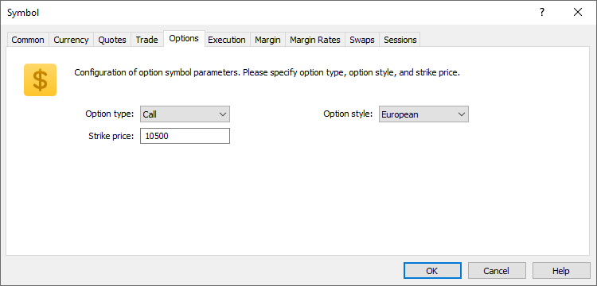

[🏠 Document Start](../../../../README.md) / [MetaTrader 5 Trading Platform](../../../../MetaTrader-5-Trading-Platform.md) / [Platform Setup](../../../Platform-Setup.md) / [Symbols](../../Symbols.md) / [Symbol Settings](../Symbol-Settings.md) / Options

[Previous](Futures.md) | [Next](Bonds.md)

# Options

This tab contains the settings specific to options. It appears only if Exchange Options [calculation mode (#calculation)](Trade.md#calculation) is enabled for the symbol.

The tab contains the following settings:

  * Option type — there are two main option types: Call option gives its holder the right to buy the underlying asset by a certain date for a certain price, while Put one gives the right to sell it.
  * Option style — options can be American and European. American option can be exercised at any time up to the expiration date. European option can be exercised only on the expiration date itself.
  * Strike price — price, at which an option gives the right to buy or sell an asset.

## Options Board

The client terminal features options trading functionality, which includes the [Options Board](https://www.metatrader5.com/en/terminal/help/trading/options_board). This tool becomes available under the following conditions:

  * Exchange Options [calculation mode (#calculation)](Trade.md#calculation) is selected in symbol settings.
  * The [underlying asset symbol](Common.md) (basis) existing on the server is specified in symbol settings.
  * The option has not expired, the date in the ["To" field](Sessions.md) is later than the current date.
  * The symbol of the options and of its underlying asset are [available to the group (#symbols)](../../Groups/Group-Settings.md#symbols), in which the client account is located.

