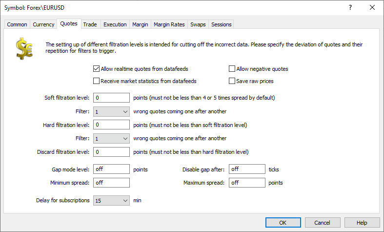

[🏠 Document Start](../../../../README.md) / [MetaTrader 5 Trading Platform](../../../../MetaTrader-5-Trading-Platform.md) / [Platform Setup](../../../Platform-Setup.md) / [Symbols](../../Symbols.md) / [Symbol Settings](../Symbol-Settings.md) / Quotes

[Previous](Currency.md) | [Next](Trade.md)

# Quotes (#quotes)

Parameters of processing of the symbol quotes received from [data feeds](../../Data-Feeds.md) are set up on this tab:

  * Allow realtime quotes from data feeds — allow/prohibit receiving of quotes for this symbol from data feeds in the real time mode. If this option is disabled, a dealer can manually through in quotes for this symbol.
  * Allow negative prices — the trading platform supports operations with negative security prices. If such a situation occurs in the market, all the appropriate functions will work correctly. This includes the display of quotes, calculation of profit margin, placing of orders, etc. However, such market situations are extremely rare, and negative values in the price stream are usually caused by an error on the data source side. Therefore, the history server rejects negative prices by default. To allow negative prices in the platform, you should enable the appropriate option.

> Negative prices are only allowed for Futures contracts (Futures, Exchange Futures, Exchange FORTS Futures). Do not enable this option for [other financial symbol types (#calculation)](Trade.md#calculation).

  * Save raw prices — save quotes in the way they come from data feeds. Ticks accepted by the platform in accordance with all filters and symbol settings are unconditionally saved. This option enables the additional saving of prices that the platform has not accepted (has discarded). You can use this option for the addition control and verification of filter operations. When enabling this options, please note that the stream of raw quotes will take up additional disk space.  
You can view the raw and accepted streams separately under the "Ticks Bid/Ask/Last" section, by specifying the appropriate [type of quotes (#type)](../../BidAskLast-Ticks.md#type) in the request.
  * Receive market statistics from data feeds — if this option is enabled, the market statistics (Ask High, Bid Low, etc.) is received directly from data feeds without its calculation by the history server. Before enabling the option, please make sure your data feeds support the delivery of the relevant data.  
If disabled, the following statistical parameters are calculated by the history server: High and Low for Bid, Ask and Last; current session Open and previous session Close. Besides, the price change percentage relative to the previous session is calculated on client terminals.  
After disabling this option, a restart of the history server is required. Statistics recalculation will resume only after the restart.

## Filters (#filters)

Filters allow controlling the correctness of quotes received from a data feed. The detailed description of filters is given in a [separate section](../../../Platform-Components/History-Server/Quotes-Filtration.md).

  * Soft filtration level — the soft filtration level is the first border of the channel of allowed symbol prices. If a new price (Bid or Ask) differs from the previous one by more than the specified value (in points), it is deleted from the price stream translated to clients. However, if such a price difference appears again the number of times specified in the "Filter" field, the new price level is accepted, and the filtration level is shifted by the specified value. Such quotes will be translated again.
    * Filter — the number of quotes (of Bid or Ask prices), that come in succession and exceed the soft filtration level, after which the new channel of allowed prices limited by the soft filtration level is set;
  * Hard filtration level — the hard filtration level is the second border of the price channel. If a received quote exceeds the level both of the soft and of the hard filtration, it is cut out from the price stream translated to clients. For a new level of accepted price to be set, the quotes must be repeat the number of times specified in both levels.
    * Filter — the number of quotes, received after the soft filtration level is broken and that exceed the hard filtration level, after which the new channel of allowed prices limited by the specified levels is set;
  * Discard filtration level — if the difference between prices of the previous and new quote exceed the specified value, such new prices are definitely removed from the stream.
  * Minimum spread — here you can set the minimum difference between Bid and Ask prices. If the spread is less than the value specified, the quote will be cut out.
  * Maximum spread — here you can set the maximal difference between Bid and Ask prices. This value being exceeded, the quote will be cut out.

  * Filters cannot be applied to instruments with the [enabled Depth of Market (#dom)](Common.md#dom) and with the one of the following properties: [Exchange calculation type (#calculation)](Trade.md#calculation) (begins with "Exchange") or [Last price based charting mode (#charts)](Common.md#charts). Also, filtering is not applied to [splice symbols](../Splicing-Futures.md).

  * Filtering is not applied to the [depth of market data](../../General-Information/Price-Data.md).

  * To completely disable filtering, set 0 for all levels: Soft, Hard and Discard.

  * The platform automatically filters out negative and zero Bid and Ask prices of OTC instruments, regardless of whether their Market Depth is enabled or not. OTC (over-the-counter or off-exchange) symbols include financial instruments whose [calculation type (#calculation)](Trade.md#calculation) does not start with "Exchange".

  * Analysis and filtration are performed separately for Bid and Ask.

  * Filters are not applied to the first tick after a break in the quotes stream: after platform restart, after a break in [quoting sessions](Sessions.md), after [off-hours](../../Time.md) and after [holidays](../../Holidays.md). Filtration cannot be applied because it is not known in advance what was the price preceding the break. This rule does not apply to other price checks, including [allowable spread (#spread)](Quotes.md#spread).

  * Filters do not apply to ticks added via the Manager terminal and Manager API.

  * The platform allows using a symbol as the source of quotes for another symbol. The source symbol can be specified in the [Source (#source)](Common.md#source) field. Source symbol filtering settings do not apply to quotes provided to the target symbol. For example, EURUSD quotes are used for the EURUSDm symbol. A quote which is not added to the EURUSD stream due to filtering parameters can be added to the EURUSDm quotes stream.

  
---  
  

## Gap mode level (#gap)

Gap is a considerable difference between the previous and the next quote in the price flow. The symbol settings allow you to define what price differences are to be considered as gaps.

Unlike the filters, quotes are not removed from the flow when enabling the gap mode. They are passed to clients. However, this check can be used in the [routing rules (#gap)](../../Routing/Actions-and-Conditions.md#gap) in order to process trade requests in a special way under the market conditions that differ from normal ones. For example, after a gap, client requests can be rejected or requoted during a certain number of subsequent ticks.

Specify a value in points in the "Gap mode level" field. If the difference between the previous and the next quote exceeds the specified value, a gap is considered to be formed. The check is performed for Bid and Ask prices separately.

Next, specify the number of ticks after the gap, after which the gap mode is disabled. For example, suppose that we have the values of 100 points and 3 ticks. When a gap is detected, the tick counter is increased by 1. If no new price spike for the specified number of points occurs at the two subsequent ticks, the gap mode will be disabled at the next (fourth) tick:

  * The first tick, on which a gap occurred. The tick counter is set to 1.
  * The second tick without a gap. The tick counter is increased to 2. It is the first tick, which confirms the new price.
  * The third tick without a gap. The tick counter is increased to 3. It is the second tick, which confirms the new price.
  * The fourth tick without a gap. It is the third tick, which confirms the new price. The gap mode is switched off.

The "Disable gap after" parameter must be filled in, otherwise the gap mode will not be activated.

> After launching the server, the first tick is always considered a gap, since the previous price is not known in advance. The gap counter is immediately set to maximum in that case. Thus, the gap mode is disabled if no gap occurs on the second tick after launching the server.

Gaps detection and tick calculation are displayed in the Journal of the trade server:

2017.03.16 12:21:20.323 TickSymbol 'EURUSD' gap by ask from 1.07149 to 1.07250 [diff:101, gap level: 3]   
2017.03.16 12:21:20.323 TickSymbol 'EURUSD' gap by ask from 1.07139 to 1.07240 [diff:101, gap level: 3]  
---  
  
The 'diff' value shows the actual difference between the previous and the next quote. The 'gap level' value sets the number of ticks specified in the symbol settings for disabling the gap mode.

If the difference between the current and the next price (here, it is Ask) does not exceed the specified value (100), the Journal entry states that an ordinary tick has arrived and the counter has been increased:

2017.03.16 12:21:20.428 TickSymbol 'EURUSD' normal tick 1.07247 after gap by ask [tick counter: 2]  
---  
  
Please note that the counter is already equal to 2. The tick, on which the gap started, has already been taken into account. If the next tick does not differ by the specified value, the gap mode for the Ask price is disabled:

2017.03.16 12:21:20.730 TickSymbol 'EURUSD' normal tick 1.07248 after gap by ask [tick counter: 3]   
2017.03.16 12:21:20.730 TickSymbol 'EURUSD' gap by ask mode disabled  
---  
  

## Delay for Subscriptions (#delay)

Financial symbol price data can be provided by [subscription](../../Subscriptions.md). One of the data providing options is the [delayed (#delayed)](../../Subscriptions/Symbols.md#delayed) delivery of quotes. This option is usually used for providing data to traders for free, for strategy testing and other purposes.

The default delay is 15 minutes, which can be overridden for each separate trading symbol. For further details please visit the [Subscription Settings section (#delayed)](../../Subscriptions/Symbols.md#delayed). 

  * A restart of [access servers](../../Network-cluster/Configuring-Servers/Access-Server.md) is required for new delay settings to take effect.
  * The delay does not affect data delivery for non-subscription instruments.

  
---
