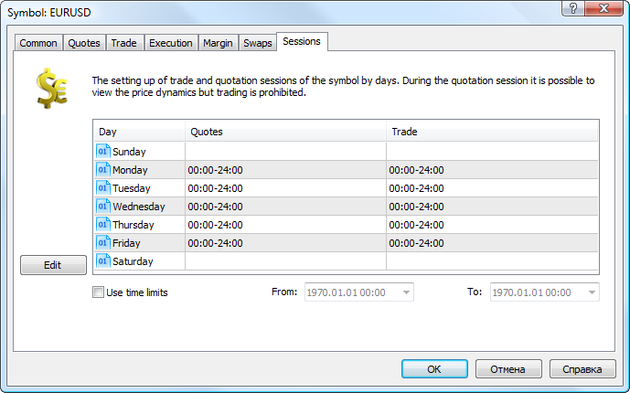
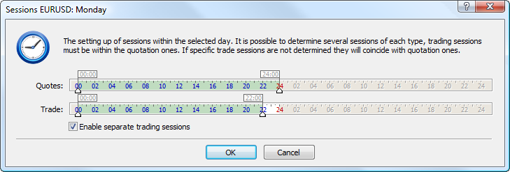

[🏠 Document Start](../../../../README.md) / [MetaTrader 5 Trading Platform](../../../../MetaTrader-5-Trading-Platform.md) / [Platform Setup](../../../Platform-Setup.md) / [Symbols](../../Symbols.md) / [Symbol Settings](../Symbol-Settings.md) / Sessions

[Previous](Swaps.md) | [Next](../Splicing-Futures.md)

# Sessions

As a rule, trading is disabled on weekends. Most banks and stock exchanges do not work, which means there is no liquidity in the markets. The platform supports a [trading schedule](../../Time.md), which can prevent traders from sending trade requests in non-trading hours. You can also limit trading at a certain time for each individual instrument.

The following session types can be configured here:

  * Quoting sessions. During this time, the platform will receive (and broadcast to traders) quotes from data sources.
  * Trading sessions. During this time, users can perform trading operations for the symbol. When trying to place an order outside the session, the trader will receive the "Market closed" warning.

  * Trade and quotation sessions do not affect the possibility of trading using the manager terminal, Manager API and Web API.

  * Session settings do not apply to [spliced symbols](../Splicing-Futures.md), because the sessions of original symbols may differ.

  
---  
  
To start setting up a day, click twice on a corresponding line in the table:

The following settings are available here:

  * Quotes — setup of a quoting session;
  * Trade — setup of a trading session;
  * Enable separate trading sessions — if you need to set up quoting and trading sessions separately, select this option.

  * To set the same sessions for several week days, select them using the mouse while holding Ctrl or Ctrl+Shift. Then click "Edit".

  * Several quoting and trading sessions can be set up within one weekday. Click with your left mouse button on the time scale and holding the button pressed drag it till the necessary time.

  
---  
  
The time adjusting levers can be moved both with a mouse or using a keyboard. If your hold Shift pressed, the speed of lever moving will be slowed down. Thus you can set up the time of sessions maximum precisely, including minutes.

Beside that, the following parameters are available on the "Sessions" tab:

  * Use time limits — if a symbol is to exist only during a certain timeperiod, select this option and then set the time limits when it will exist. As soon as this period is over, trading of this symbol will be [disabled (#trade-disabled)](Trade.md#trade-disabled). At the attempt to open an order with this symbol, "Market Closed" will be returned to clients.
  * From — start date and time of the symbol existence;
  * To — end date and time of the symbol existence;

> We strongly recommend to perform any operations on modification of financial symbols only on holidays when markets are closed.
