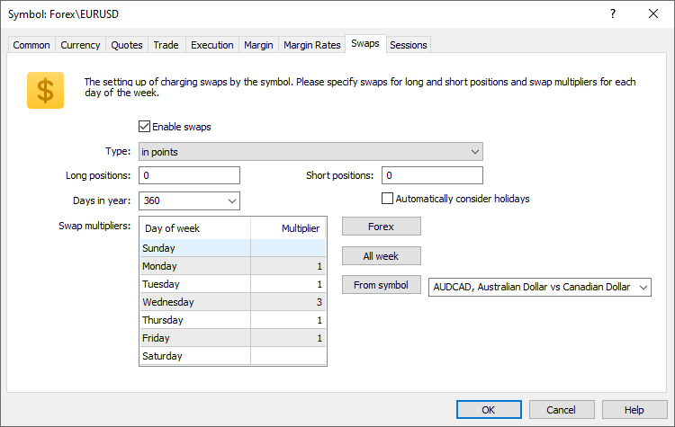

[🏠 Document Start](../../../../README.md) / [MetaTrader 5 Trading Platform](../../../../MetaTrader-5-Trading-Platform.md) / [Platform Setup](../../../Platform-Setup.md) / [Symbols](../../Symbols.md) / [Symbol Settings](../Symbol-Settings.md) / Swaps

[Previous](Margin-Rates.md) | [Next](Sessions.md)

# Swaps (#swaps)

Swap (Rollover) is an operation of transferring a trader's open position on the next trading day. This operation is performed [at the end of the trading day (#end-of-day)](../../Network-cluster/Configuring-Servers/Trade-Server.md#end-of-day) if the position remains open at that moment. A fee is charged for the transfer of the positions. The swap amount is accumulated in a separate field of the trading position. Once the position is closed, this amount is accounted in the balance.

Position rollovers for a symbol are set up on this tab:

  * Enable swaps — enable/disable charging of swaps.
  * Type — one of swap charging types, described below.
  * Long positions — swap for Buy positions.
  * Short positions — swap for Sell positions.
  * Days in year — the number of days in a year to be used for [swap percent calculation (#percentage)](Swaps.md#percentage). Depending on the country and market in which the broker operates, as well as on the financial instrument type, different [number of days in a year](https://en.wikipedia.org/wiki/Day_count_convention) can be used when calculating annual percent. This parameter operates with such calculation specifics. The most common option of 360 days is used by default. You can change the value to 365 or 366, as well as specify a different value manually.
  * Swap multipliers — swap multiplier for each day of the week. This multiplier will be applied to the calculated swap value before charging. Specify 1 to charge the regular amount, 3 for triple swap or 0 to cancel swap. Conveniently manage the settings using the following commands:

  * Forex — sets standard settings for Forex instruments: standard single swaps on weekdays and triple swap on Wednesday.
  * All week — standard single swap seven days a week.
  * From symbol — copies swap multipliers from the selected symbol.

### Automatically consider holidays (#automatically-consider-holidays)

If the corresponding option is enabled, the platform checks all [holiday](../../Holidays.md) configurations. The day before the holiday, the swap is doubled. No swap is charged on the day of the holiday. The calculations still use the swap multipliers specified for the corresponding days. For example:

  * Swap multiplier is set to 1 for Tuesday
  * Wednesday swap multiplier is 3
  * Wednesday is a holiday

On Tuesday, the swap will be charged with a coefficient of 4: a sum of the the multipliers of the current day and of the holiday. No swap will be charged on Wednesday as it is a holiday.

The coefficients are applied similarly if you have multiple holidays in a row. If the holidays are set to Wednesday and Thursday, the platform will add the multipliers for Tuesday, Wednesday and Thursday and will charge the corresponding swap on Tuesday.

  * Charging of swaps can be disabled for [groups of accounts (#swaps)](../../Groups/Group-Settings.md#swaps).

  * Swap calculations are globally controlled at the [trading server (#swap)](../../Network-cluster/Configuring-Servers/Trade-Server.md#swap) level. If swaps for certain days are disabled on the server, it cannot be enabled for individual symbols. If swaps are enabled on the server, they can be disabled for a specific symbol by specifying a zero multiplier for the certain day.
  * By default, swap calculations are not performed on Saturday and Sunday. When working days are shifted to weekends, specify swap multipliers for the relevant days and enable weekend swap in [trading server settings (#swap)](../../Network-cluster/Configuring-Servers/Trade-Server.md#swap).

  
---  
  
The following types of swap charging are available:

## Calculation in points (#calculation-in-points)

Swap size is set in points and calculated by the following formula:

Swap size * Point price

Depending on the position direction, a swap size is taken from the "Long positions" or "Short positions" field. The calculation is performed in the following order:

  * Calculating the point price in a symbol profit currency considering a position volume
  * Converting the obtained price into a client's deposit currency
  * Calculating a swap sum using the formula shown above

A single point price is a profit obtained when the price moves one point for a position of a specified volume. The price calculation (including converting to the deposit currency) is performed according to the [type of the profit calculation by symbol](Trade/Profit-Calculation.md) depending on the position direction.

For example, in case of Buy 5.00 USDTRY with the contract volume of 100 000 and Forex profit calculation type, the point price is calculated as follows:

5 * 100,000 * 0.00001 = 5 TRY

If the deposit currency is USD, the price is converted at the current rate:

5 * 0.2274587 = 1.14 USD (with rounding)

If the swap for long positions is -11.35, the total sum is as follows:

1.14 * (-11.35) = 12.94 USD

> The swap may be equal to zero, if the sum is below the minimum estimated currency unit at one of the stages. This may happen on small volume trades at micro-accounts (with a reduced contract size). For example, in case of Buy 0.01 EURUSD and the contract size of 1 000, the point price is calculated as follows: 0.01 * 1 000 * 0.00001 = 0.0001 USD. When rounding, the result is 0, thus the final swap value is also zero.

## Calculation in money (#calculation-in-money)

If you select swap charging in money, the amount of money charged for the transfer of each lot of a position is specified in fields "Long positions" and "Short positions". Three types of currencies can be used for specifying swap amount:

  * Using base currency — charging in the [base currency (#base-currency)](Currency.md#base-currency) of the symbol a position is opened for;
  * Using margin currency — charging in the [margin currency (#margin-currency)](Currency.md#margin-currency) of the symbol a position is opened for;
  * Using profit currency — charging in the [profit currency (#margin-currency)](Currency.md#margin-currency) of the symbol a position is opened for;
  * Using group currency — charging in the [deposit currency (#currency)](../../Groups/Group-Settings.md#currency) of the group the account belongs to.

In all cases except for charging the swaps in deposit currency, the swap size is converted into deposit currency. The conversion is performed using the unfavorable price for trader: if the swap is positive, a trader has to sell the swap currency for the deposit currency; if the swap is negative, a trade has to buy the swap currency for the deposit currency.

## Calculation in percentage (#percentage)

In this case the annual interest rate is specified for long and short positions. Since swaps are calculated and charged every day at [the end of day time (#end-of-day)](../../Network-cluster/Configuring-Servers/Trade-Server.md#end-of-day), the calculated amount of the annual interest rate is divided by the [number of days in a year](Swaps.md).

When charging swaps, first the cost of one symbol lot is calculated (the symbol of the opened position), and then the specified percent is calculated, the obtained amount is multiplied by the position volume (in lots) and the result is divided by the number of days in a year. There are two calculation methods:

  * In percentage terms, using current price — in this case the swap is calculated as the percent from the current position cost: (cost of 1 lot of position * volume in lots * specified swap size /100)/[days in year];
  * In percentage terms, using open price — in this case the swap is calculated as the percent from the position cost at the moment of its opening: (cost of 1 lot of position * volume in lots * specified swap size /100)/[days in year].

The calculation of the cost of 1 lot of a position depends on the [type of profit/margin calculation (#calculation)](Trade.md#calculation) of the symbol:

  * For the symbols with the Forex type of calculation the cost of 1 lot of a position is calculated in the [base currency](Currency.md) and is equal to the contract size. For example, for the EURUSD symbol that has contract size 100 000 the cost of 1 lot of a position is equal to 100 000 EUR. The feature of Forex symbols is the cost of 1 lot of a position in the base currency for them does not change in time. Thus, both modes of charging swaps in percentage terms work identically for the Forex symbols.
  * For the symbols with CFD, CFD Leverage, CFD Index and Futures type of calculation the cost of 1 lot of a position is also calculated in the base currency. Since the contract size of such symbols is not represented in money (but in the number of securities for example), then to represent the position cost in money the contract size is additionally multiplied by the symbol price. For symbols of the Futures type, the resulting value is multiplied by the tick value to tick size ratio. For example, if a Futures symbol has the base currency USD, contract size 100, its price is equal to 33 and the tick value/tick size ratio is 1/0.1, then the cost of 1 lot of the position is equal to 100*33*10 = 33 000 USD. For a CFD symbol with the same parameters, one lot size would be 100*33 = 3300 USD. 

If the currency of swap calculation (the base currency of the symbol) is different from the [client group currency (#currency)](../../Groups/Group-Settings.md#currency), it is conversed using the current rate when charging swaps. For Buy positions, the Bid price of the currency pair [swap currency|deposit currency] is used; Ask price is used for Sell positions.

## Charging swaps by reopening positions (#charging-swaps-by-reopening-positions)

In this case all positions are forcedly closed at the end of a trading day, and on the next day they will be reopened. Reopen conditions depend on the swap settings:

  * In points, reopen position by close price — all positions will be opened at their close price +/- specified swap (in points);
  * In points reopen position by bid price — all positions will be opened at the current Bid price +/- specified swap (in points).

Thus swap is charged by way of adjusting the reopen price.

  * Positions are closed at a time set in the ["End of day" (#end-of-day)](../../Network-cluster/Configuring-Servers/Trade-Server.md#end-of-day) parameter. The open time of new (reopened) positions depends on the ["Daily reports" (#end-of-day)](../../Network-cluster/Configuring-Servers/Trade-Server.md#end-of-day) setting of the trade server. If "End of day" option is selected, the open time of the reopened positions is as the end of day time of current trade day (["End of day" (#end-of-day)](../../Network-cluster/Configuring-Servers/Trade-Server.md#end-of-day)). If "Start of day" option is selected, the open time of the reopened positions is set as the start of the next trade day. At that, if the open time of a position does not match a [trading session](Sessions.md) of the symbol, then the open time is set to the start of a closest trading session.

  * When re-opening a position, the new position has the same ticket as the old one. This position ticket is also written to the [deals](../../Deals.md), which close the old position and open a new one (in the "Position" field of the deals).

  
---
