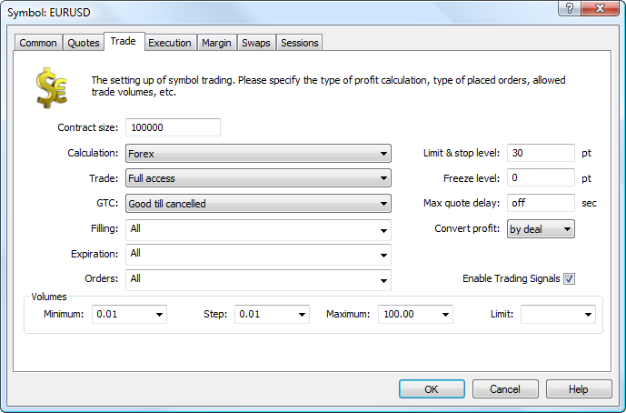

[🏠 Document Start](../../../../README.md) / [MetaTrader 5 Trading Platform](../../../../MetaTrader-5-Trading-Platform.md) / [Platform Setup](../../../Platform-Setup.md) / [Symbols](../../Symbols.md) / [Symbol Settings](../Symbol-Settings.md) / Trade

[Previous](Quotes.md) | [Next](Trade/Margin-Calculation.md)

# Trade

Symbol trading parameters are configured on this tab:

  * Contract size — amount of the underlying asset in one lot/contract (for currency pairs it is actually the value of one lot in the base currency of the instrument).

> It is strongly recommended not to change the contract size if there are open client positions. This may lead to incorrect operation of some functions (for example, wrong [correction of positions based on the history of deals (#check-fix)](../../Accounts/Editing-Account.md#check-fix)).

  * Tick size — the minimal step of the price change. This value is used for calculating [profit (#futures)](Trade/Profit-Calculation.md#futures), [margin (#cfd-index)](Trade/Margin-Calculation/Basic.md#cfd-index) and [swaps](Swaps.md) for CFD Index and Futures. Also, this values is used for rounding the quotes passed form [data feeds](../../Data-Feeds.md): for all financial instruments with the disabled [Market Depth (#dom)](Common.md#dom) and non-exchange instruments (other than Exchange*) with the enabled Market Depth. After changing this parameter the server should be [restarted](../../Network-cluster/Restarting-and-Stopping-Servers.md).
  * Tick value — the cost of one point of the price change. This value is used for calculating [profit (#futures)](Trade/Profit-Calculation.md#futures), [margin (#cfd-index)](Trade/Margin-Calculation/Basic.md#cfd-index) and [swaps](Swaps.md) for CFD Index and Futures. After changing this parameter the server should be [restarted](../../Network-cluster/Restarting-and-Stopping-Servers.md);
  * Calculation — type of calculation of [margin requirements](Trade/Margin-Calculation/Retail-Forex-CFD-Futures-—-Netting.md) and [profit](Trade/Profit-Calculation.md) on a symbol. This parameter also influences the calculation of [swaps](Swaps.md). The following calculation types are available:

  * Forex — calculation for Forex symbols.

  * Forex No Leverage — totally equivalent to the Forex type except that the client leverage is not taken into account when calculating the margin. Forex No Leverage can be used if it is necessary to calculate the margin with a fixed leverage for all clients regardless of their actual leverage. If this type is selected, the client leverage is not taken into account when [calculating the margin (#noleverage)](Trade/Margin-Calculation/Basic.md#noleverage). A fixed leverage can be set through [margin rates](Margin-Rates.md) (for example, the rate of 0.01 is similar to the leverage of 1:100).

  * CFD — calculation for CFD.
  * Futures — calculation for Futures.
  * CFD Index — calculation for CFD indexes.
  * CFD Leverage — calculation for CFD with the account of the leverage.
  * Exchange Stocks — calculation for exchange stocks.

  * Exchange MOEX Stocks — calculation for stocks traded at Moscow Exchange.

  * Exchange Bonds — calculation for exchange [bonds](Bonds.md).

  * Exchange MOEXBonds — calculation for [bonds](Bonds.md) traded at Moscow Exchange.

  * Exchange Futures — calculation for exchange [futures](Futures.md).
  * Exchange FORTS Futures — calculation for the FORTS exchange. This mode must only be used together with the [MOEX Deivatives Gateway](../../../Platform-Components/Gateways/MOEX-Derivatives.md). Otherwise the margin requirements calculation results may be unpredictable.

  * Exchange Option — calculation for exchange [options](Options.md).
  * Collateral — non-tradable instruments of this type are used as client's [assets to provide the required margin for open positions (#collateral)](../../Accounts/Editing-Account.md#collateral) of other instruments. For these instruments the margin and profit are not calculated.

> In all types of calculation except the Exchange types, all types of pending orders as well as stop loss and take profit orders are triggered (activated) according to Bid or Ask price. In Exchange Stocks, Exchange Bonds, Exchange Futures and FORTS Exchange mode, orders are triggered according to the last deal price (Last). A similar division by prices is used when displaying floating profits in client terminals. In exchange modes, the floating profit is calculated using Last prices.

  * Trade — setup of how the symbol is traded:
    * Disabled — trade is disabled;
    * Long only — only long positions can be opened;
    * Short only — only short positions can be opened;
    * Close only — only position closing is allowed. On [hedging (#hedging)](../../Groups/Position-Accounting-Systems.md#hedging) accounts, only market operations that close positions are allowed. On [netting (#netting)](../../Groups/Position-Accounting-Systems.md#netting) accounts, in addition to the market Close operation, it is possible to place a pending order in an opposite direction. As a result of this pending order triggering, an existing position will be closed instead of opening a new position (unlike hedging).
    * Full access — any trade is allowed;
  * GTC — mode of keeping the orders at a change of a trade day:
    * Good till today including SL/TP — orders effective only within one trading day. As soon as it is over, all Stop Loss and Take Profit levels of open positions, as well as all pending orders are deleted.
    * Good till canceled — as a trade day changes, pending orders and stop levels are preserved.
    * Good till today excluding SL/TP — as a trade day changes, only pending orders are deleted, Stop Loss and Take Profit levels of open positions are preserved.
  * Limit & stop level — price channel (in points) from the current market price, within which it is prohibited to place Stop Loss, Take Profit and pending orders. At the attempt to place an order within this channel, the server will return message "Invalid S/L or T/P" and will not accept the order;
  * Freeze level — level for freezing orders that are close to the current price. When an order price is as close to the market price as the value specified here or less than that, its modification or deletion is prohibited. This limitation is also applied to positions. When current market price is close to a Stop Loss of Take Profit level of a position, modification of these levels is prohibited as well as modification of the position volume and closing of the position;
  * Max quote delay — time (in seconds) of delay in the receipt of quotes, after which trading will be automatically disabled for this symbol. As quotes start coming again, trade will be enabled automatically.
  * Filling — additional rules of [order filling (#fill-policy)](../../General-Information/Trading-System.md#fill-policy) that can be set to traders. The necessary filling type should be ticked off:
    * Fill or Kill — this fill policy means that a deal can be executed only with the specified volume.
    * Immediate or Cancel — in this case a trader agrees to execute a deal with the volume maximally available in the market within that indicated in the order. In case the order cannot be filled completely, the available volume of the order will be filled, and the remaining volume will be canceled.
    * Book or Cancel — the order can only be placed in the Depth of Market (order book). If the order can be filled immediately when placed, this order is canceled.
    * Return — this mode is not available in the list. It is always enabled for the market (Buy and Sell) orders in the Exchange Execution mode, as well as for [limit and stop limit orders (#pending-order)](../../General-Information/Trading-System.md#pending-order) in the Market Execution and Exchange Execution modes.

> In the client and manager terminal, the fill policy can be selected only when placing market orders. The exceptions are Limit ans Stop Limit orders by symbols that have the "Exchange" [type of execution](Execution.md).

  * Convert profit — this option is available only for the Forex type symbols. It determines the conversion of profit/loss from the symbol [profit currency (#profit-currency)](Currency.md#profit-currency) to a client [deposit currency (#currency)](../../Groups/Group-Settings.md#currency):

  * by deal — this mode is used on default. For the conversion of profit/loss fro, the profit currency to the deposit currency, the price at which a deal (exit from position) is performed is used, the profitability/unprofitability of the deal is not taken into consideration;
  * by market — in this mode, the conversion is performed using the current Bid/Ask price depending of the profitability/unprofitability of a deal. The Bid price is taken for calculations for profitable deals, because as a result of a profitable deal, a trader obtains a certain amount of the profit currency and needs to sell it for the deposit currency. The Ask price is taken for losing deals, because as a result of a losing deal, a trader needs to buy a certain amount of currency for the deposit currency.

> More detailed information can be found in the ["Profit calculation" (#conversion)](Trade/Profit-Calculation.md#conversion) section.

  * Expiration — condition for the expiration of orders. Necessary expiration types should be ticked off:
    * Good till canceled — the order will stay in the queue until it is manually canceled;
    * Day — the order will be effective only during the current trading day. When orders are processed on the MetaTrader 5 platform side, intraday orders are canceled at the end of the calendar day considering the [trading server time](../../Time.md) and the symbol [trading sessions](Sessions.md). For example, if trading ends at 21:00, the untriggered intraday orders will be canceled at the same time. When orders are processed in external systems via [gateways](../../Gateways.md), the expiration rules can be different and depend on the specific system.
    * Specified time — the order will be effective till the date specified by the trader;
    * Specified day — the order is active till 00:00 of the specified day. If that time appears to be out of a trade session, the expiration will be processed at a nearest trading time.
  * Orders — types of allowed orders: Market, Limit, Stop, Stop Limit, Stop Loss, Take Profit, Close By. Close By permission of a symbol does not mean that this type of orders will be available on [netting accounts (#netting)](../../Groups/Position-Accounting-Systems.md#netting). Close By orders can only be used on [hedging accounts (#hedging)](../../Groups/Position-Accounting-Systems.md#hedging).
  * Enable Trading Signals — if this option is disabled, clients will not be able to copy trade operations by this symbol using the [Signals](https://www.mql5.com/en/signals) service. Trading signals can also be disabled on a [client group level (#signals)](../../Groups/Group-Settings.md#signals).
  * Volumes — setup of volumes of placed orders for this symbol:
    * Minimum — minimal volume of the symbol order. Not applied when closing positions.
    * Maximum — maximal volume of the symbol order. It is considered not only when traders place orders but also when a position is closed by [stop out (#stopout)](../../Groups/Group-Settings.md#stopout).
    * Step — volume change step.
    * Limit — maximum allowed cumulative volume of an open position and pending orders by a symbol in one direction (buy or sell). For example, if the limit is set to 5 lots, a user can have an open buy position of 5 lots and place a Sell Limit order of 5 lots. But in this case the trader cannot place a pending Buy Limit order, since the total volume in one direction would exceed the limit. Also, a client having a 5-lot Buy position cannot place a Sell Limit order with a volume exceeding 5 lots: if the pending order triggered after the closing of the initial position, the client would have a short position exceeding the specified limit.
  * Prices — price setting for futures contracts (available for the Exchange Futures and FORTS Futures trade modes):
    * Settlement — calculated price of the futures contract (the clearing price of the previous trade session).
    * Minimum — minimum price of the futures contract for the current trade session. A price no lower than specified can be specified when placing an order.
    * Maximum — maximum price of the futures contract for the current trade session. A price no greater than specified can be specified when placing an order.

  * The price parameters of the Exchange Futures and FORTS Futures contracts determine the margin requirements for them. The minimum and maximum prices for the current session, which are calculated at the exchange as a percentage of the settlement price, determine the maximum possible profit and loss of a client for the financial instrument. Thus, the maximum possible loss is used as the margin requirements for the symbol instead of the entire price of the contract.
  * Usually, the price parameters and the margin requirements ([initial (#initial)](Margin.md#initial) and [maintenance (#maintenance)](Margin.md#maintenance)) are passed from and exchange through a [gateway](../../Gateways.md). In this case, you shouldn't modify those parameters manually.

  
---
