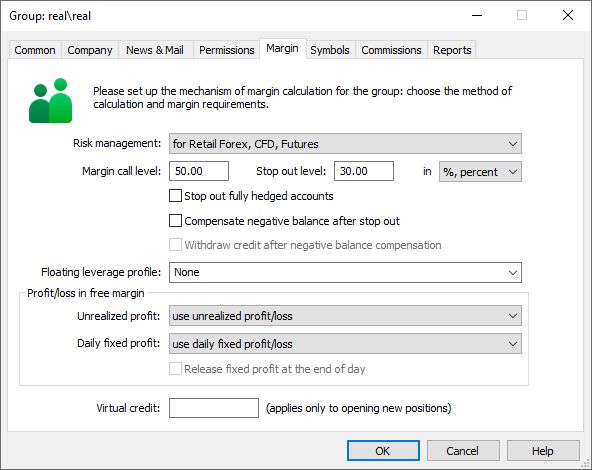

[🏠 Document Start](../../../../../README.md) / [MetaTrader 5 Trading Platform](../../../../../MetaTrader-5-Trading-Platform.md) / [Platform Setup](../../../../Platform-Setup.md) / [Symbols](../../../Symbols.md) / [Symbol Settings](../../Symbol-Settings.md) / [Trade](../Trade.md) / Margin Calculation

[Previous](../Trade.md) | [Next](Margin-Calculation/Basic.md)

# Margin Calculation

Margin is charged to provide collateral for traders' open positions and orders. It serves as a guarantee that the conditions of the concluded deal will be fulfilled. The trading platform provides different risk management models, which define the type of pre-trade control. The model can be defined separately for each client group on the ["Margin" tab](../../../Groups/Group-Symbol-Settings/Margin.md) in the "Risk Management" field.

The following models are currently available:

  * [for Retail Forex, CFD, Futures](Margin-Calculation/Retail-Forex-CFD-Futures-—-Netting.md) — used for the OTC market. Margin calculation is based on the type of instrument, as well as group settings. [Netting position accounting system (#netting)](../../../Groups/Position-Accounting-Systems.md#netting) is used.
  * [for Retail Forex, CFD, Futures with hedging](Margin-Calculation/Retail-Forex-CFD-Futures-—-Hedging.md) — used for the OTC market. Margin calculation is based on the type of instrument, as well as group settings. [Hedging position accounting system (#hedging)](../../../Groups/Position-Accounting-Systems.md#hedging) is used.
  * [for Stock Exchange, based on margin discount rates](Margin-Calculation/Stock-Exchange.md) — used for the exchange market. Margin calculation is based on the discounts specified in [symbol settings](../Margin.md). Discounts are set by the broker, however they cannot be lower than the exchange set values.

