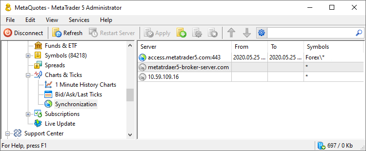
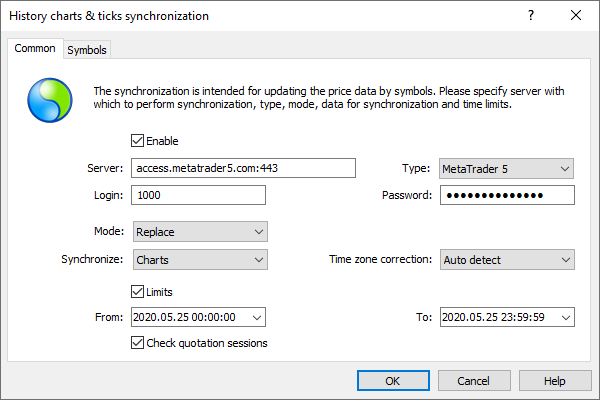
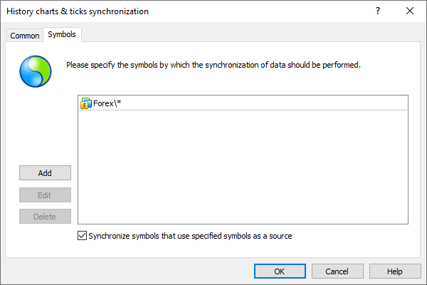

[🏠 Document Start](../../README.md) / [MetaTrader 5 Trading Platform](../../MetaTrader-5-Trading-Platform.md) / [Platform Setup](../Platform-Setup.md) / Synchronization

[Previous](Bid-Ask-Last-Ticks/Split-Stocks.md) | [Next](Synchronization/Features.md)

# Synchronization (#synchronization)

Deep high-quality history is essential for traders. Historical data is used for technical analysis, as well as for creating and testing trading strategies. If you do not provide historical data, potential clients are likely to choose your competitors who do provide history.

With the MetaTrader 5 platform, you can easily solve the missing data issue. Minute bar and tick history on your server can be quickly synchronized with any other MetaTrader 5 and MetaTrader 4 server. For more details, please read the article [Deep Price History in MetaTrader 5 in a Few Clicks](https://support.metaquotes.net/en/articles/377).

## Setup (#setup)

Data synchronization is performed through a regular client connection to an external MetaTrader 4/5 server. To access the data, you should open a demo account on the source server. The only special requirement for this account is ability to access trading symbols which your are going to synchronize. Connect to the external server via a client terminal using the created account to check all symbols available on this server. Next, execute the Symbols command in the context menu of the Market Watch window.

  * Please note that price data is protected as intellectual property. Therefore you should make sure that you have all the necessary agreements before you proceed with the synchronization.
  * By default, your platform is already ready to synchronize data with the MetaQuotes-Demo server, and the corresponding configuration is available in the settings. This server stores deep history for 35 Forex pairs, 35 CFDs, as well as XAUUSD and XAGUSD metal price data. Historical data include Bid prices, spreads (which actually means the availability of Ask prices), and tick volumes. We recommend running synchronization by executing the " Synchronize History" command from the Services menu. This will provide the minimum required data to your traders. For more details, please read the article [Deep Price History in MetaTrader 5 in a Few Clicks](https://support.metaquotes.net/en/articles/377).

  
---  
  
Prior to starting synchronization, please make sure that the system time of your MetaTrader 5 server is accurate. The use of correct time will prevent discrepancies in quotes. Check platform settings under the [Time (#synchronization)](Time.md#synchronization) section.

After completing the preparation, create a new configuration. Click Add" in the toolbar and proceed with the setup.

### Common (#common)

Specify here data for connection to the external server and synchronization parameters:

  * Enable — enable or disable synchronization with this server.
  * Server — server address and port separated by a colon.
  * Type — the type of the server, with which synchronization will be conducted - MetaTrader 4 or MetaTrader 5.
  * Login — the account number on the server with which you synchronize. Use a regular client account having access to required symbols, for connection.
  * Password — password to the account on the server with which you synchronize.
  * Mode — synchronization mode: Replace (replace all data and add what is missing), Merge (add only missing data).
  * Synchronize — data type to synchronize: [charts](1-Minute-History-Charts.md), [ticks](BidAskLast-Ticks.md) or both.
  * Time zone correction — if MetaTrader servers are located in different time zones, the time in the received data can be corrected. The system can determine the time correction automatically. Optionally, the relevant value can be specified manually. Values from -24:00 to 24:00 are valid. Please see [Time zone correction (#time-zone)](Synchronization/Features.md#time-zone) for further details.
  * Limits — time interval for history data synchronization. If this option is enabled, fields for entering starting and ending dates will be active. You can specify the date using your keyboard or a calendar that is opened at a click on button .
  * Check quotation sessions — if this option is enabled, then the [quotation sessions](Symbols/Symbol-Settings/Sessions.md) set for the symbols in your trading platform will be considered during the synchronization of history data. If a source server has price data that falls outside of quotation sessions of your symbols, such data will not be synchronized (will be ignored). Thus only the price data within the set quotation sessions is imported in the platform.

> When conducting synchronization, take into account [specific features (#features)](Synchronization/Features.md#features) of this process for MetaTrader 5 and MetaTrader 4 servers.

## Symbols (#symbols)

Specify here symbols, history data of which will be synchronized:

  * Add — add a symbol or a group of symbols. After you press this button, a new field will appear. A click on this field will open a list where you should specify a symbol or group of symbols from those available on the server. For more details please read ["Symbol specification"](General-Information/Specifying-Symbols-and-Groups.md).
  * Delete — delete a selected symbol.
  * Edit — modify a selected symbol. The same action can be performed by a double click on an entry.

If you enable the option "Synchronize symbols that use specified symbols as a source", the system will additionally synchronize historical data for the symbols for which one of the selected symbols is specified in the [Source (#source)](Symbols/Symbol-Settings/Common.md#source) field.

## Synchronization launch (#synchronization-launch)

To start synchronization, click " Synchronize History" in the [Services](../MetaTrader-5-Administrator/User-Interface/Main-Menu/Services.md) menu. The process will run for all [enabled configurations (#enable)](Synchronization.md#enable). If there is currently no need to synchronize with any server, disable its configuration before starting.

To control the process and to view the result, request server [logs](Network-cluster/Journal.md) for the "Synchronization" keyword. The log appears as follows:

'1000': start history synchronization   
history synchronization with 'access.metatrader5.com' started   
'EURUSD' synchronization started   
...   
history synchronization with 'access.metatrader5.com' finished  
---  
  

## Context Menu (#context)

The following commands are available in the context menu of Synchronization:

  *  Add — add a new synchronization server;
  *  Edit — change a selected synchronization server;
  *  Delete — delete a selected synchronization server;
  *  Move Up — move a selected server up relative to others;
  *  Move Down — move a selected server down relative to others;
  *  Sort Alphabetically — sort configurations alphabetically. Please note that sorting is done on the server, not in the local terminal.
  *  Enable — enable the selected configuration.
  *  Disable — disable the selected configuration.
  *  Export to File — [export](General-Information/ImportExport-Settings.md) synchronization settings to a file.
  *  Import from File — [import (#import)](General-Information/ImportExport-Settings.md#import) synchronization settings to a file.
  *  Journal — request [logs](Network-cluster/Journal.md) according to the selected configuration. This will open the trade server logs section, with the name of the selected configuration automatically specified in the query field. You will only need to press the request button.
  *  Find — open the [Search](../MetaTrader-5-Administrator/User-Interface/Search.md) window;
  * Auto Arrange — if this option is enabled the size of columns is selected automatically;
  * Grid — this option shows/hides field separators in the table with synchronization servers.

