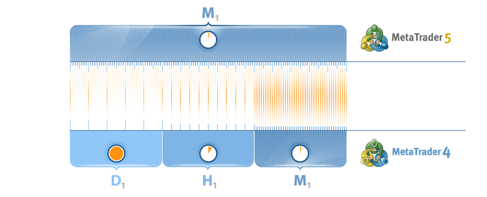

[🏠 Document Start](../../../README.md) / [MetaTrader 5 Trading Platform](../../../MetaTrader-5-Trading-Platform.md) / [Platform Setup](../../Platform-Setup.md) / [Synchronization](../Synchronization.md) / Features

[Previous](../Synchronization.md) | [Next](../Subscriptions.md)

# Synchronization Features (#synchronization-features)

There are some specific features of synchronization that should be taken into account before you start this process.

## Specifics of synchronization of MetaTrader 5 and MetaTrader 4 servers (#features)

##  (#)

There is a considerable difference between synchronization with MetaTrader 4 and MetaTrader 5 servers.

  * History data in MetaTrader 5 are stored only as 1 minute data and are converted to larger timeframes by request in the client terminal. In MetaTrader 4 different timeframes are stored.
  * During synchronization with MetaTrader 4 servers, the successive selection of the most complete data starting from 1 minute timeframe is performed. First all M1 data are taken. Then it tries to obtain the missing part from H1 data. The hour value of the MetaTrader 4 server is written for the first minute on the MetaTrader 5 server. Then an attempt is made to obtain missing data from D1 timeframe. The daily data of MetaTrader 4 (e.g. 01.03.2009) are written for the first minute of the day of MetaTrader 5 (e.g. 01.03.2009 00:00). Therefore, clients can get a complete chart for the history period only on the timeframe, from which the data were imported.

> To synchronize data with the MetaTrader 4 server, at least one [demo group (#demo)](../Groups/Group-Types.md#demo) should be available on it. The group can be disabled.

## Time zone correction (#time-zone)

[Synchronization settings (#time-zone)](../Synchronization.md#time-zone) provide the special function of correcting time zones. It allows to easily synchronize history data by MetaTrader servers located in different time zones. There are two variants of operation of this function:

  * Auto detect  
If this variant is selected, the time difference will be detected automatically. Besides, it will also be detected, whether the option of [Daylight saving time (#daylight-saving)](../Time.md#daylight-saving) is enabled on both servers. This parameter is taken into account only when small parts of history data are synchronized, because switch to DST may differ in different countries. At the synchronization of larger parts of data, the current time shift (+1 hour if it has been performed already) and is added to the time zone difference. History data are synchronized with the difference by the obtained time shift.
  * Setting a precise correction  
When this variant is chosen, history data will be shifted strictly by this value, not taking into account the DST.

> To synchronize larger periods of history data we recommend using servers with disabled DST switch.
