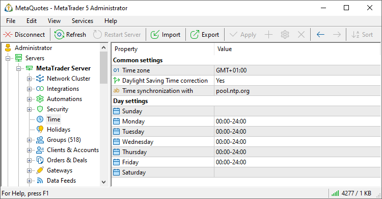
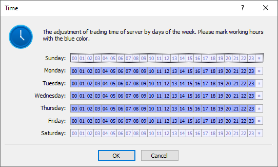

[🏠 Document Start](../../README.md) / [MetaTrader 5 Trading Platform](../../MetaTrader-5-Trading-Platform.md) / [Platform Setup](../Platform-Setup.md) / Time

[Previous](Automations/Statistics.md) | [Next](Holidays.md)

# Time (#time)

This section is intended for configuring server time settings. At non-working time clients can connect to the server, watch charts and trade history, but cannot conduct trade operations.

> One can setup the trade and quotation sessions for each symbols separately at the ["Sessions"](Symbols/Symbol-Settings/Sessions.md) tab.

Time settings are divided into common and day settings:

## Common Settings (#common)

The following parameters are available in this block:

  * Time zone — the time zone of the trade server (e.g. GMT+1:00);
  * Daylight Saving Time correction — enable/disable DST correction;
  * Time synchronization with — address of the server that is used for synchronizing time over protocols NTP and TIME. Through this server the system will receive exact time. After setting time zones this time will be used in the system.

  * At startup of the MetaTrader 5 servers (services), the [Windows Time service in the operating system is automatically disabled (#time)](../Platform-Installation/System-Preparation.md#time). However, if an address of a server for the synchronization of time is not specified in the "Time synchronization with" field, that service will not be disabled.
  * Time synchronization with the specified server is performed for the [main trade server](../Platform-Components.md). All other components are synchronized with the main trade server.
  * The checking and synchronization of time is performed every hour. If a time difference of more than 30ms is detected, time correction is performed. To request the [journal](Network-cluster/Journal.md) records regarding time synchronization use "time synchronization" key phrase.
  * Changes in "Time zone" and "Daylight Saving Time correction" become effective only after the server restart. It is strongly recommended not to change server time zone settings during a trade day, because this may cause failure of quotes. These settings should be changed on weekend or holidays or at night when the trading activity is minimal and the thread of quotes is slow.

  * When other servers of the platform connect to the main server, they compare their time zone and DST settings. If the time zone has changed or time has switched to DST, the settings of the server that has connected to the main one are updated, and after that the server is restarted to apply changed.

  * After common time settings are changed, the main server should be [restarted](Network-cluster/Restarting-and-Stopping-Servers.md).

  
---  
  

## Daylight Saving Time features (#daylight-saving-time-features)

When switching to Daylight Saving Time (DST), the platform uses the dates stored in the operating system time zone. Therefore, we urge you to set the Windows OS time zone and DST parameters similar to the ones in the platform.

Platform and OS settings | Performed actions  
---|---  
DST enabled in MetaTrader 5 | After Windows switches to DST, the platform does the same within an hour (during the hourly synchronization). The platform uses time data stored in the OS time zone.  
DST disabled in MetaTrader 5 | No switch is performed.  
DST enabled in MetaTrader 5 but there is no DST switch for the time zone set in OS. | No switch is performed, since the platform has no exact data on what date/time the shift is to be performed.  
  

## Day Settings (#daily-settings)

In order to start editing working time, select one of days and press button " Edit" in the [Edit (#edit)](../MetaTrader-5-Administrator/User-Interface/Main-Menu/Edit.md#edit) menu, on the [Standard](../MetaTrader-5-Administrator/User-Interface/Toolbar/Standard.md) toolbar or in the context menu. The following window will be opened:

Working hours are colored blue. In order to change a working hour into non-working or vice versa, click it with t he left mouse button. To change working hours in bulk, click on the necessary hour and drag the cursor to another hour. Button "*" at the end of the line allows switching all working into non-working and vice versa.

For changes to take effect, execute command " Apply Changes" in the [Edit (#apply)](../MetaTrader-5-Administrator/User-Interface/Main-Menu/Edit.md#apply) menu, or the same command on the [Standard](../MetaTrader-5-Administrator/User-Interface/Toolbar/Standard.md) toolbar or in the context menu.

## Context Menu (#context)

The context menu of the Time section contains the following commands:

  *  Edit — edit the selected instruction;
  *  Export to File — [export](General-Information/ImportExport-Settings.md) work time settings to a file.
  *  Import from File — [import (#import)](General-Information/ImportExport-Settings.md#import) work time settings to a file.
  *  Find — open the [search](../MetaTrader-5-Administrator/User-Interface/Search.md) window;
  * Auto Arrange — if this option is enabled the size of columns is selected automatically;
  * Grid — this option shows/hides field separators.

