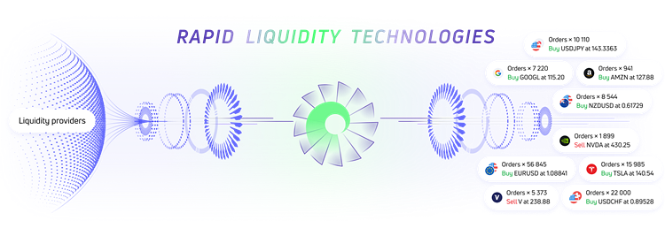
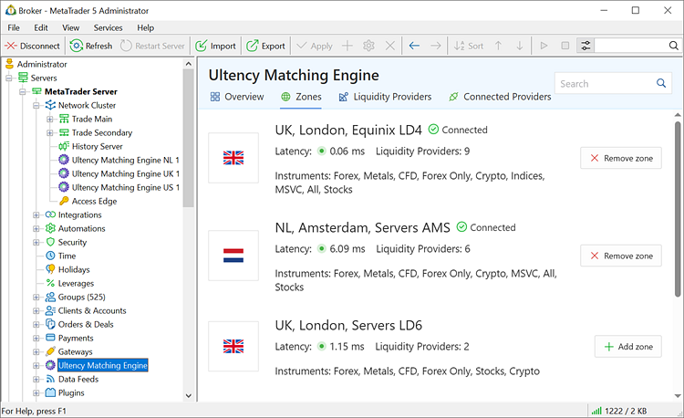
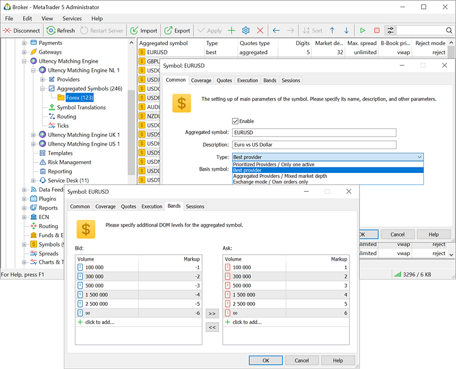
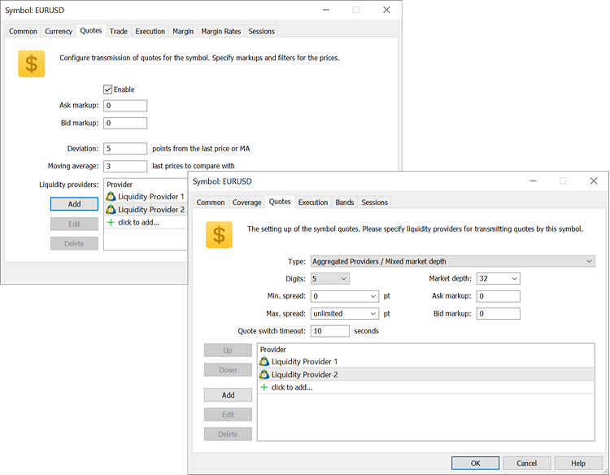

[🏠 Document Start](../../README.md) / [MetaTrader 5 Trading Platform](../../MetaTrader-5-Trading-Platform.md) / [Platform Setup](../Platform-Setup.md) / Ultency

[Previous](Reports/Fast-Profit-Deals.md) | [Next](Ultency/Connection.md)

# Ultency Matching Engine: Built-in liquidity aggregation and order execution

Ultency Matching Engine is an ultra-low latency solution for liquidity aggregation, trade order matching, and risk management. This technological platform enables reliable connection to multiple providers simultaneously, consolidating their prices and execution to deliver the best trading conditions for traders. The system is highly customizable to meet the unique requirements of each broker, offering a comprehensive suite of risk management and reporting tools.

## Ultency for Brokers

Ultency offers unique advantages for brokers:

  * Access multiple [liquidity providers (#liquidity-providers)](Ultency/Connection.md#liquidity-providers) through an intuitive gallery with detailed descriptions of offerings and connect in a few clicks.
  * Choose the best prices from various sources to improve order execution for traders.
  * Lower spreads by accessing multiple liquidity providers. This makes trading more cost-efficient for clients and helps attract new traders.
  * Save on infrastructure costs by avoiding individual connections to each provider. Ultency reduces development and maintenance costs, simplifying scalability.
  * Access various order types and a wide range of risk management tools. Select optimal execution strategies based on market volatility and client needs.
  * Efficiently process orders during news releases and fast market movements. The platform tracks prices from multiple providers, minimizing delays or price gaps.

## Ultency Features

Ultency is a native solution for the MetaTrader 5 platform:

  * The engine uses highly efficient internal data transfer protocols between cluster components, significantly speeding up order processing and enhancing system resilience.
  * The main instrument and trading session parameters are configured once in MetaTrader 5, eliminating the need to monitor their compliance in multiple systems. All order execution, client and configuration change logs are stored in one place, accessible only to the broker.

Each broker gets a dedicated platform that processes only their orders. You can choose from multiple hosting locations depending on which liquidity providers you want to connect to and the markets you offer. For example, to offer access to various exchanges, you can use a server in London for Forex providers and another one in New York for NYSE providers.

## Highly Configurable

Ultency allows detailed configuration of price aggregation and order execution parameters:

  * For each instrument, you can specify individual liquidity providers to aggregate prices for clients, and configure custom order book rules, spread adjustments, and execution parameters.
  * For each client/group, you can assign liquidity providers to execute their orders, as well as individual markups. You can manage order routing between A-Book, B-Book, and C-Book executions (partial hedge, overhedge, reverse hedge).

With the flexible template system, you can save markups, price feed configurations, routing rules, and order execution settings. Create templates for different conditions and apply them automatically based on time, market events, or risk management rules.

## Protection and Risk Management

Intelligent filtering protects against incorrect prices. Each price entering the system is validated and compared with prices from other providers. Based on the validation results, the system decides whether to accept or reject the quote.

The system supports automatic risk management rules, including coverage based on position volume, instrument, currency, turnover, profit, and more. Rules can be set for individual clients, client groups, or the broker's entire portfolio.

## Monitoring and Reporting

Ultency supports special coverage accounts for monitoring key metrics, including funds, profit/loss, total positions, and more. The data can be analyzed by liquidity providers, clients, client groups, and the entire portfolio, and used to configure automatic risk management rules.

A dedicated dashboard allows dealers to monitor performance parameters in real-time, including the volume of orders routed to providers, risk management rules, and the broker's portfolio.

The built-in reports enable the analysis of client trading results, A-Book execution efficiency, earnings from markups, commissions, and swaps. Reports can be segmented by instruments and client groups, allowing you to identify toxic clients and take appropriate measures promptly.
