[🏠 Document Start](../../../README.md) / [MetaTrader 5 Trading Platform](../../../MetaTrader-5-Trading-Platform.md) / [Platform Setup](../../Platform-Setup.md) / [Ultency](../Ultency.md) / Aggregated Symbols

[Previous](Provider-Symbols.md) | [Next](Translations-of-Symbols-and-Quotes.md)

# Aggregated Symbols (#aggregated-symbols)

Ultency receives price data from multiple liquidity providers and consolidates it into a single stream. As a result, your clients get better execution prices. This makes trading more attractive and cost-efficient for clients and helps you to attract new traders. In addition to external provider data, Ultency allows you to aggregate your own clients' orders into the order book, enabling the broker to operate as a fully functional ECN.

To collect price data, you need to create aggregated symbols. To avoid creating them manually, simply select the symbols imported from a provider and choose "Copy to Aggregated Symbols":

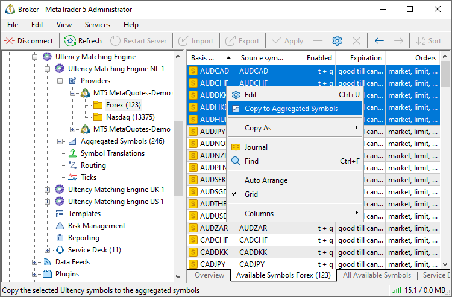

As a result, the selected symbols will be automatically added to the Aggregated Symbols section, within the same subgroup and with the same settings, including name, description, basis symbol, and trading sessions. Price feeds from the selected provider will also be enabled for these symbols by default.

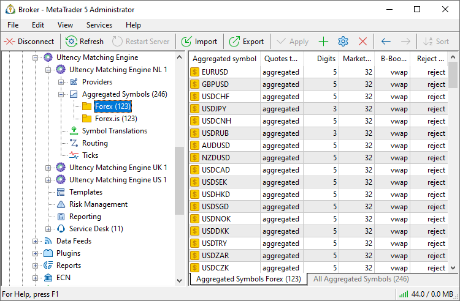

Once this is done, proceed to configure the remaining parameters.

## Common (#common)

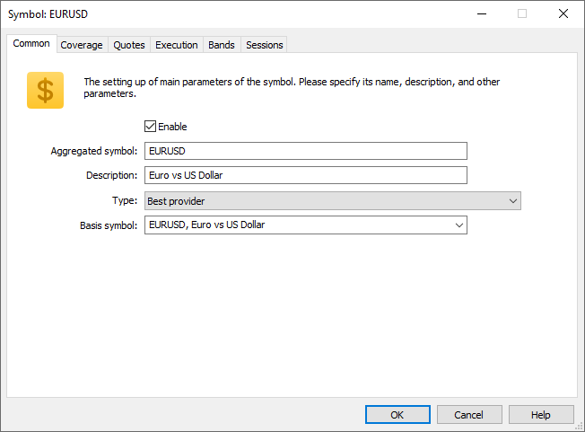

The following settings are available in the "Common" section:

  * Aggregated symbol — the name of the aggregated symbol.
  * Description — a brief description of the symbol.
  * Type — order execution type for the symbol:
    * Prioritized providers / Only one active — only one provider is used, the first available from the list in the [Execution (#execution-providers)](Aggregated-Symbols.md#execution-providers) section. If the first provider is unavailable, disabled, or trading is not possible (for example, if there is no active trading session at the moment), the system will automatically attempt to route the order through the next available provider.
    * Best provider — orders are executed through the provider (from the list in the "[Execution (#execution-providers)](Aggregated-Symbols.md#execution-providers)" section) that offers the best available price for the requested volume.
    * Aggregated providers / Mixed market depth — orders are executed through providers from the list in the "[Execution (#execution-providers)](Aggregated-Symbols.md#execution-providers)" section. Orders can be executed through different providers, including partially. [FOK (#fill-policy)](../Symbols/Symbol-Settings/Trade.md#fill-policy) orders are always executed through only one provider, which currently offers the best available price for the requested volume (as in the "Best provider" mode) and which supports the FOK fill mode.
    * Exchange mode / Own orders only — orders are not routed to external providers. The order book is formed exclusively from your clients' orders. The mode is currently under development.
  * Basis symbol — the name of the instrument associated with the symbol received from a provider. Each aggregated symbol must have a designated basis symbol, which defines the instrument for which data is collected, as well as the list of providers whose data should be aggregated. Ultency scans all selected providers and aggregates data from instruments that share the [specified (#basis)](Provider-Symbols.md#basis) basis symbol. The basis symbol is also used for [routing requests](Routing.md).  
  
A single provider cannot have multiple symbols with the same basis symbol.

## Coverage (#coverage)

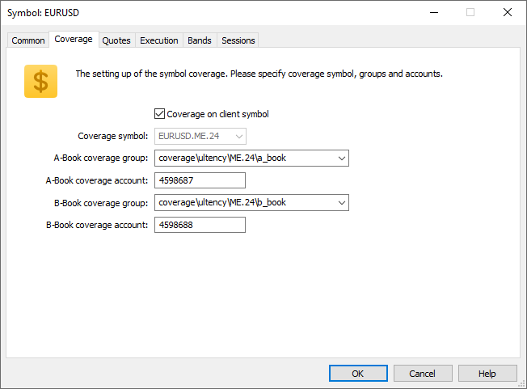

To ensure precise control over the execution of trades for an aggregated symbol, all operations related to that symbol are duplicated to separate coverage accounts. One account collects all transactions routed to external providers (A-Book), while another collects all operations executed within the platform (B-Book).

If you do not specify coverage groups/accounts when adding the configuration for an aggregated symbol, Ultency will automatically copy them from the configurations of other symbols. If the groups/accounts are not yet specified anywhere, Ultency will automatically create new groups and accounts and add them to the aggregated symbol's configuration. The groups are created with the [netting accounting system (#netting)](../Groups/Position-Accounting-Systems.md#netting), allowing you to view the net positions for all clients. These groups and accounts will be immediately added to the aggregated symbol's settings. You can control system operations by requesting reports for the relevant groups and accounts through the Manager terminal.

  * Coverage symbol — if this option is enabled, coverage deals for the aggregated symbol will be executed on the original MetaTrader 5 symbols from which client requests are [routed](Routing.md) to this aggregated symbol. If you wish to cover trades on a different symbol, disable this option and specify the symbol in the following field.
  * Coverage symbol — the name of the symbol where trades will be duplicated. It is used only when the "Coverage on client symbol" is disabled.
  * A-Book coverage group — the group where the account for duplicating A-Book operations is located.
  * A-Book coverage account — the account where A-Book operations are duplicated.
  * B-Book coverage group — the group where the account for duplicating B-Book operations is located.
  * B-Book coverage account — the account where B-Book operations are duplicated.

> Ensure that the settings are correctly aligned: the specified coverage account must belong to the specified group. If you move the account or replace it with an account from a different group, be sure to update the group in the aggregated symbol settings accordingly.

## Quotes (#quotes)

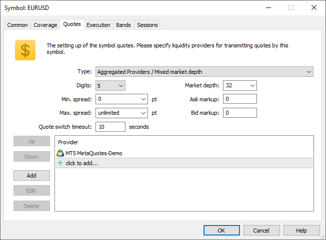

This section defines the settings for quote aggregation:

  * Type – type of quote aggregation:
    * Prioritized providers / Only one active — only one provider is used, the first available one from the [list (#quotes-providers)](Aggregated-Symbols.md#quotes-providers). If the first provider remains unavailable for the duration specified in the "Quote switch timeout" parameter, the system will switch to the next provider in the list.
    * Aggregated providers / Mixed market depth — the market depth is formed from the prices of providers in the [list (#quotes-providers)](Aggregated-Symbols.md#quotes-providers).
    * Aggregated providers with own orders / Mixed market depth — the market depth is formed from the prices of providers in the [list (#quotes-providers)](Aggregated-Symbols.md#quotes-providers) and client requests inside the platform. The mode is currently under development.
  * Digits — the number of decimal places to which prices received from sources will be rounded.
  * Market depth — the number of orders/levels displayed in the order book. Depth is set for one side. For example, if set to 16, the book will display up to 16 buy orders and up to 16 sell orders. If the market depth is disabled (the value of 0), requests in B-Book mode are executed in full at best prices.
  * Min. spread — the minimum spread that will be maintained in the instrument's price book, even when orders come in at better prices. More detailed information is provided [below (#spread)](Aggregated-Symbols.md#spread).
  * Max. spread — the maximum spread that will be maintained in the instrument's price book, even when orders come in at worse prices. More detailed information is provided [below (#spread)](Aggregated-Symbols.md#spread).
  * Ask markup — the number of points by which all ask prices (the ask side of the order book) will be shifted. A positive or negative value can be specified. The markup is applied before the minimum and maximum spread settings.
  * Bid markup — the number of points by which all bid prices (the bid side of the order book) will be shifted. A positive or negative value can be specified. The markup is applied before the minimum and maximum spread settings.
  * Quote switch timeout — used only for aggregation in "Prioritized providers / Only one active" mode. If quotes do not arrive from the prioritized provider within the specified number of seconds, the stream switches to the next provider in the [list (#quotes-providers)](Aggregated-Symbols.md#quotes-providers). When quotes from the first provider resume, the stream automatically switches back. Upon the end of a quoting session for the prioritized provider, the switch to the next provider occurs immediately, without the timeout.

### Providers (#execution-providers)

This section defines the list of providers whose quotes can be aggregated for the given instrument. The order of providers in the list determines their priority. The first provider is considered the highest priority.

### Minimum and maximum spread (#spread)

When aggregating order books from multiple sources and combining orders within the cluster, situations may arise where both sides of a trade are willing to execute at worse prices than actually available. For example, one provider may offer to buy an asset at a price of 100, while another may offer to sell the same asset at 90\. If the actual spread for the symbol becomes narrower than the minimum allowed, Ultency will adjust the displayed prices in the order book to maintain the required spread. Actual order prices remain unchanged, and trades are still executed at provider prices.

The adjustment to maintain the minimum spread is done using the following algorithm:

  * The current spread is calculated as the difference between the best Bid and Ask. The calculation applies all [markups (#markup)](Aggregated-Symbols.md#markup) specified for the aggregated symbol.
  * If the current spread is smaller than the defined minimum, the system calculates the spread delta. It is the amount by which the spread needs to be widened.
  * New Bid and Ask prices are computed. Bid New = Bid - floor(spread_delta/2) points. Ask New = Ask + ceil(spread_delta/2) points. Here 'floor' and 'ceil' are standard functions for getting the nearest integer value from below and above.
  * For all buy orders with prices higher than Bid New, the visible price is adjusted to Bid New.
  * For all sell orders with prices lower than Ask New, the visible price is adjusted to Ask New.

The Maximum Spread parameter works in a similar way. If the actual spread exceeds the specified maximum, all orders are shifted to reduce the spread.

## Execution (#execution)

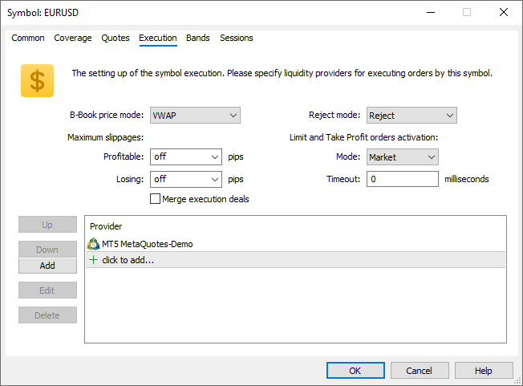

This section defines order execution settings for the aggregated symbol:

### B-Book price mode (#b-book-mode)

Ultency allows partial coverage of orders. In the [routing settings (#coverage)](Routing.md#coverage), you can specify what portion of each order should be executed via external providers (A-Book) and what portion should be executed internally within the cluster (B-Book). The "B-Book price mode" parameter defines how the non-covered (B-Book) portion of the order is executed:

  * VWAP — the uncovered volume is executed at prices from the aggregated order book.
  * A-Book — the volume is executed at the same price as the covered volume with the external provider. This mode provides additional protection from off-market prices, assuming the liquidity provider (especially a large one) uses robust filtering mechanisms to avoid incorrect executions.

### Reject mode (#reject-mode)

This setting determines how an order will be handled if rejected by the current prioritized provider:

  * Reject — the order is rejected.
  * B-Book — the order is executed internally within the platform without routing to external providers.

This setting is applied in all execution modes except [Exchange mode / Own orders only (#filling-type)](Aggregated-Symbols.md#filling-type).

### Slippages (#slippage)

This section defines how much the execution price in Ultency can deviate from the client's requested price.

  * Profitable — the number of points by which the price may deviate from the requested one, in a profitable direction for the client.
  * Losing — the number of points by which the price may deviate from the requested one, in an unprofitable direction for the client.

The function has a different behavior depending on the execution mode:

  * A-Book — after an actual deal is executed with the external provider, Ultency compares the execution price with the initially requested price ([considering translation settings](Translations-of-Symbols-and-Quotes.md)). If the executed price is within the allowed slippage range, the deal is executed on the platform side at the client's original requested price. If the slippage exceeds the limit, Ultency will execute the order on the platform side at the actual execution price applied on the provider side.  
  
Suppose both profitable and losing slippage values are set to 5 points. Ultency sends a Buy Limit order at 1.14053 to the external provider, but the provider fills it at 1.14051 (2 points better). This slippage is acceptable. Ultency will fill the client's order at the original price, 1.14053.  
  
If the provider's execution price exceeds the slippage limit, Ultency will fill the order at that price, i.e. 1.14051.
  * B-Book — the price requested by the client is compared to the prices in the aggregated order book, considering the [order fill type (#fill-policy)](../Symbols/Symbol-Settings/Trade.md#fill-policy). For example, if a FOK order cannot be fully filled at acceptable prices, it will be completely rejected. An IOC order will be partially filled within available volumes at acceptable prices.

### Merge execution deals (#merge-deals)

Depending on the settings, deals may be split across different sources, partially in B-Book, and partially in A-Book with multiple providers. Ultency records the entire execution chain and can display it to the trader: the trading history on the trader's side will display all deals that executed the order. To hide execution details from traders, enable "Merge execution deals". In this case, all trades used to fill the order on the Ultency side will be presented in the platform as a single combined operation, showing total volume and weighted average price. Thus, the trader will also see a single trader in the account history.

Merging deals affects [slippage (#slippage)](Aggregated-Symbols.md#slippage) parameters. If merging is disabled, slippage is checked for each individual deal that executes the order. If enabled, slippage is checked only for one combined deal (at the weighted average price).

### Limit and Take Profit orders activation (#limit-activation)

Configure how limit orders, [not previously routed to Ultency (#limit-processing)](Aggregated-Symbols.md#limit-processing), and Take Profit activations are handled:

  * Mode — type of order to be sent to Ultency upon activation of Take Profit levels and limit orders not previously routed to Ultency. Options: "Limit" and "Market".
  * Timeout — the lifetime of an order routed to Ultency (in milliseconds). If the order is not executed within this time, this order is canceled. In case of the re-activation of a limit order or the Take Profit level, a new order with the specified timeout will be sent to Ultency.

By default, Ultency displays limit orders with a lifetime of 5 seconds.

> These settings do not apply to Stop Loss activations, which are always sent as market orders.

### Processing limit orders outside Ultency (#limit-processing)

You can configure limit orders to remain off Ultency until triggered. Configure [routing rules](../Routing/Actions-and-Conditions.md) to prevent such orders from being sent for matching before their activation.

Add a rule to process the placing of limit and stop limit orders, as well as the stop limit order activation without forwarding to Ultency. Please note that routing rules are processed top-downward. For example, if you have a general rule according to which all requests are sent to Ultency, then a new rule for processing limit orders should be located above the general one in the list.

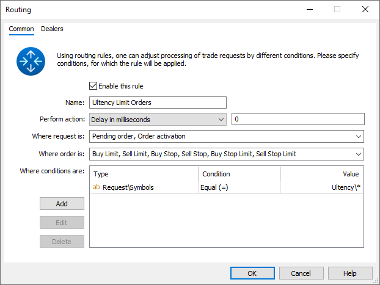

### Providers (#execution-providers)

This section defines a list of providers through which orders for this instrument can be executed. The order of providers in the list determines their priority. The first provider is considered the highest priority.

## Levels (#bands)

Use these settings to fine-tune aggregation and display of order book levels: combine aggregated levels from different sources by volume for a cleaner, more user-friendly order book. This can be used when processing orders in B-Book mode, when you act as a market maker and there's no need to show all the initial levels from providers.

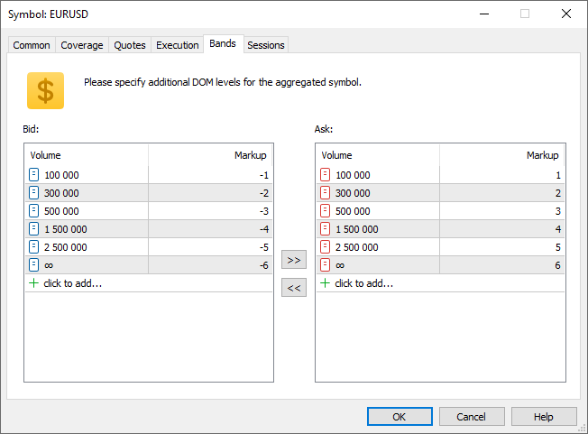

Set volume per level in the number of contracts. The levels are set separately for each side (Bid/Ask). Example for Bid side:

  * First level = 100 000, markup = -1. Ultency will collect the closest orders aggregated to 100,000 contracts into one level. The level price will be set to the volume-weighted average price minus 1 point. The volume is 100,000.
  * Second level = 300,000, markup = -2. Ultency will collect the closest orders aggregated to 300,000 contracts into one level. The level price will be set to the volume-weighted average price minus 2 points. The volume is 300,000. Please note that the volume is always counted from the top of the order book (the price closest to the market), and not from the previous level.
  * The same applies to the other levels.
  * Level ∞. This is a technical level. Its price is calculated as a weighted average of all orders used to form the previous level, adjusted by its own markup. It is not visible in the market depth but is used for order execution – all orders that do not fall into the other levels are executed at this price.

Important: If there isn't enough actual volume to fill a level, the full configured volume is still displayed in the market depth.

Let's consider order merging using two symbols as an example: EURUSD.raw, which is the original aggregated market depth with no level settings specified, and EURUSD with level settings used.

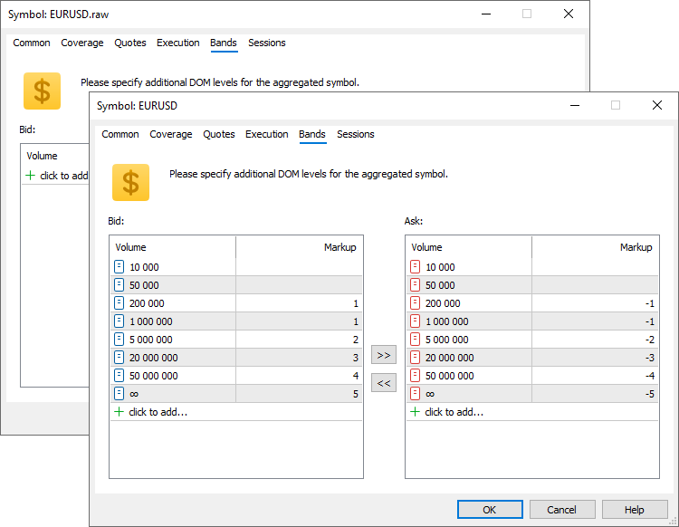

The orders of the original market depth will be displayed as follows:

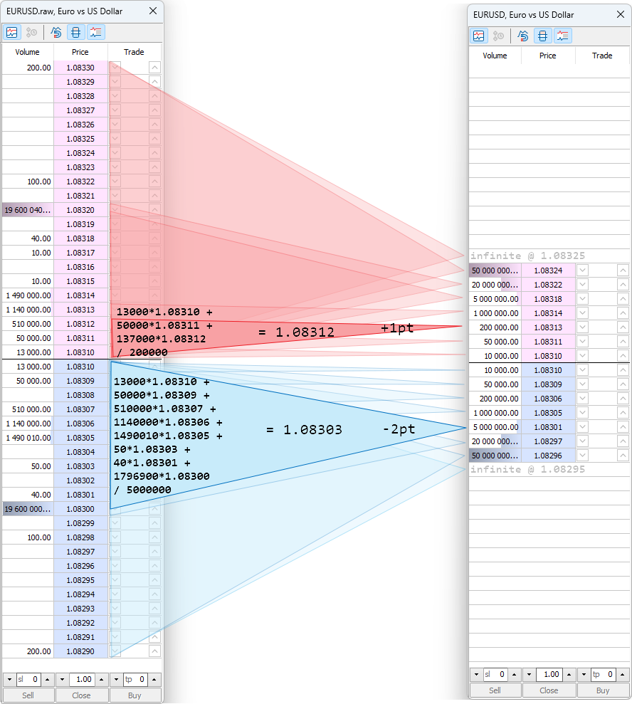

## Sessions (#sessions)

Define quote and trade sessions for the aggregated symbol. These sessions can be independent of [provider-side sessions (#sessions)](Provider-Symbols.md#sessions), but make sure providers collectively cover the time to avoid gaps in quotes and execution.

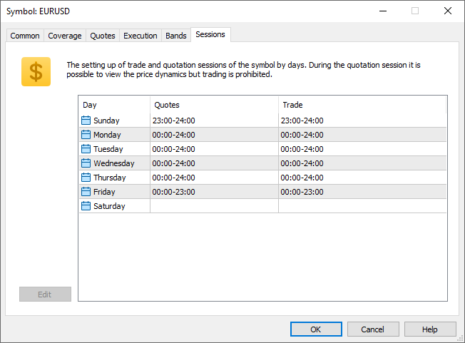

Click on a day to adjust its session settings:

To configure the time of quote and trading sessions separately, enable the corresponding option. Next, set up the sessions. The sliders that control session beginning and end times can be moved with the mouse and with the arrow keys. You can hold down the Shift key to slow down the slider speed. This enables precision of up to minutes when configuring sessions.
