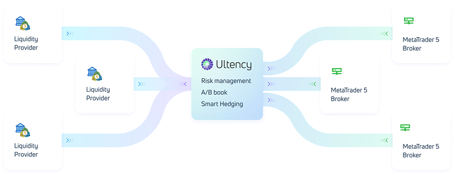
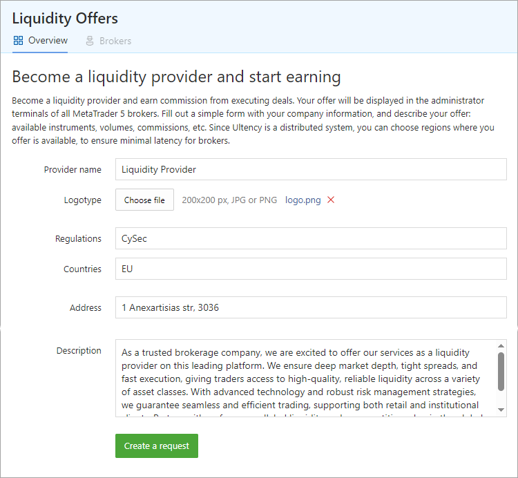
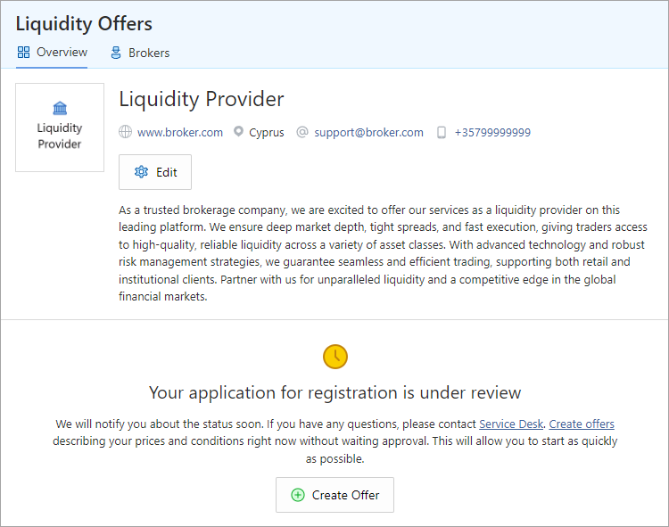
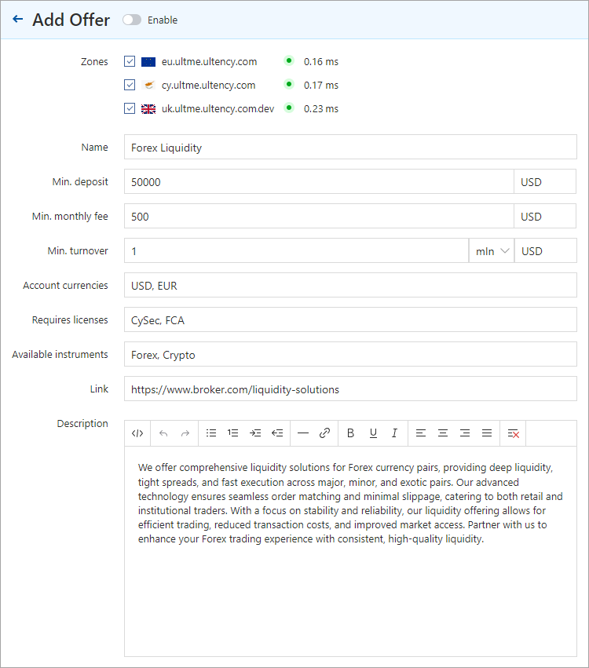
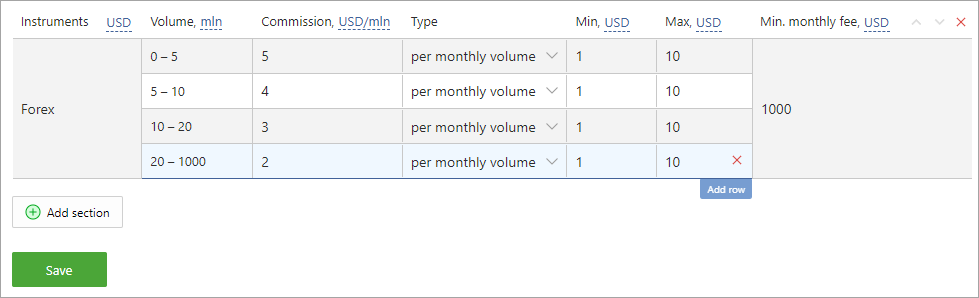

[🏠 Document Start](../../../README.md) / [MetaTrader 5 Trading Platform](../../../MetaTrader-5-Trading-Platform.md) / [Platform Setup](../../Platform-Setup.md) / [Ultency](../Ultency.md) / Become a Provider

[Previous](Service-Desk.md) | [Next](../ECN.md)

# Become a Liquidity Provider in Ultency (#become-a-liquidity-provider-in-ultency)

Become a liquidity provider and generate income from executing trades on behalf of other brokers. You will earn direct commissions on executed trades while simultaneously increasing the volume of trading operations.

## Access a Vast Pool of Potential Clients (#access-a-vast-pool-of-potential-clients)

Ultency provides access to an extensive audience of potential clients. Your offering will be showcased within the Administrator terminals of all MetaTrader 5 brokers. Additionally, Ultency ensures seamless interaction with clients through an [integrated communication system](Service-Desk.md). Negotiations and technical issue resolutions can be conducted directly within MetaTrader 5 Administrator.

## Become a Provider in Just 5 Minutes (#become-a-provider-in-just-5-minutes)

Registering with Ultency takes only a few minutes. Complete a short company profile and outline your terms, including available instruments, trading volumes, fees, and more. As a decentralized system, Ultency enables you to select your regions of operation, ensuring minimal execution latency for connected brokers.

## How to Get Started (#how-to-get-started)

  * [Register (#register)](Become-a-Provider.md#register) as a liquidity provider and await approval.
  * [Create offers (#offer)](Become-a-Provider.md#offer) detailing your terms.
  * Upon receiving a request and finalizing terms with a broker, open a standard trading account in MetaTrader 5 for that broker.
  * The [broker will connect (#connect)](Connection.md#connect) via Ultency using the designated account to process client trades through it.
  * Monitor account activity using all available MetaTrader 5 tools: view current positions and trading history and create reports.

## Registering as a Liquidity Provider (#register)

Navigate to the "Ultency\Liquidity Offers" section and complete a brief registration form with your company details:

To register, provide the following:

  * Company name
  * Logo 200*200
  * List of regulatory licenses: CySec, FCA, NFA, etc.
  * Countries where you provide services

  * The minimum term for which you can enter into agreements with brokers for liquidity provision services

  * Company address and contact information: phone, website, email
  * Links to legal documents: business terms, service agreements, order execution policy
  * A brief company and service description for display in the marketplace

After completing the form, click "Create a request" to send your application for review. If further details are needed, our team will contact you.

While your application is under review, you may edit your company details at any time.

You can also start creating service offers immediately, without waiting for the verification to complete. This will allow you to get started faster.

## Creating Offers (#offer)

An offer is a description of your services: prices, conditions, available tools, etc. This information will be displayed in the [list of liquidity providers (#liquidity-providers)](Connection.md#liquidity-providers) enabling brokers to evaluate and choose their preferred providers.

Click "Create Offer":

Provide the following information:

  * Specify the [zones (#zones)](Connection.md#zones) where your offer will be available. Zones are geographic locations where other brokers' Ultency servers may be located. From these locations, brokers will connect to you to receive liquidity. Select zones depending on where your platform is located.
  * Service name.
  * The minimum deposit required for a broker's account to process their traders' operations.
  * The minimum monthly fee — a base fee charged to brokers regardless of liquidity usage. Additional pricing configurations are provided below.
  * Minimum turnover (volume of processed deals) in millions of currency units.
  * The available currencies in which brokers can maintain accounts.
  * Required regulatory compliance CySec, FCA, NFA, etc.
  * Supported trading instruments.
  * Link to additional service information.
  * Brief description of the service.

In the block below, define our liquidity provision rates. You may charge commissions based on trade volume or per operation.

Add a section to describe fees for a specific group of instruments, such as Forex, Crypto, etc. Multiple sections can be added.

Define commission levels within each section based on volume or turnover. To add a new level, hover over an existing row and select "Add Row".

  * Instruments — description of instruments to which commissions apply.
  * Volume — volume range for the applicable commission rates. Select the units to display the values from the dropdown menu: lots, millions, or trillions (if the volume is specified in nominal value).
  * Commission — commission amount. Select units to display the values from the dropdown menu: currency, currency per million units of volume, percentage of the deal value/turnover, or points.
  * Type — commission type: per trade volume, daily turnover, or monthly turnover.
  * Min/Max — minimum and maximum commission thresholds. The units in which the value is specified depend on how the commission is calculated.
  * Min. monthly fee — a baseline fee charged to brokers regardless of liquidity usage.

The appropriate commission settings must be configured for the [group](../Groups/Commission-Settings.md) that will include the accounts provided to brokers for liquidity access.

## Configuring Broker Account Groups (#group)

Brokers will [connect](Connection.md) to your liquidity services via Ultency using standard trading accounts. To connect a broker, simply create an account for them and provide the login credentials.

Create a dedicated account group with the following settings:

  * [Access to required trading instruments (#symbols)](../Groups/Group-Settings.md#symbols)
  * [Commission](../Groups/Commission-Settings.md) structure in accordance with your [offer (#commission)](Become-a-Provider.md#commission)
  * [Netting accounting system (#netting)](../Groups/Position-Accounting-Systems.md#netting). Broker accounts will consolidate multiple client trades into aggregate positions supported by the netting system.

