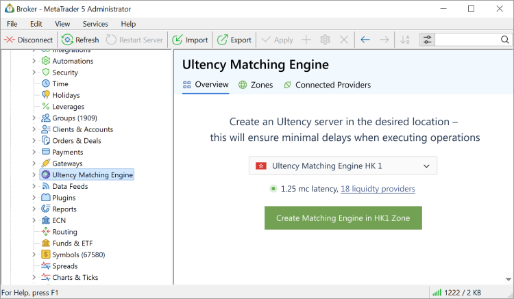
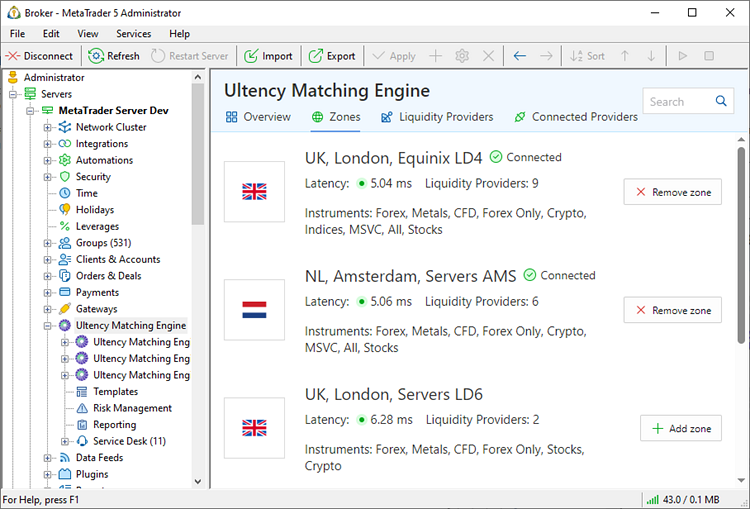
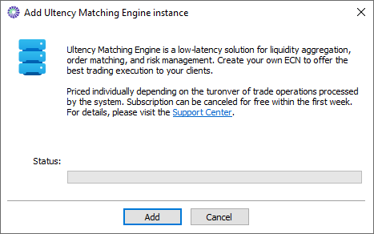
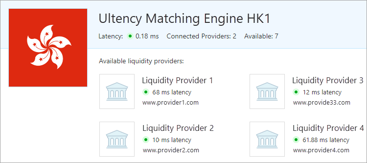
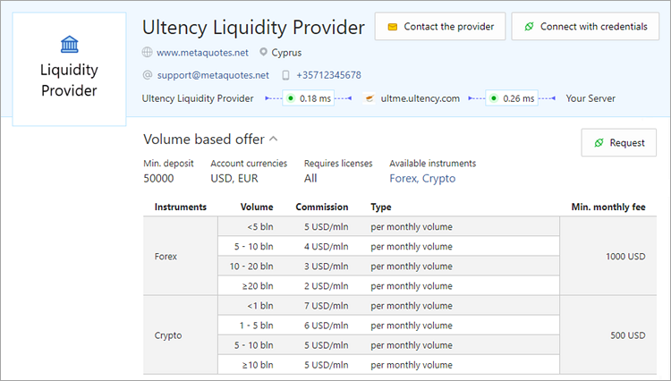
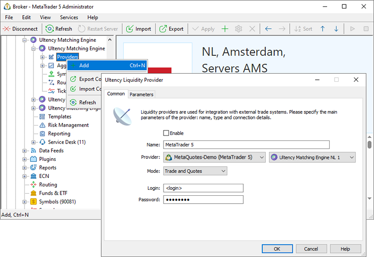
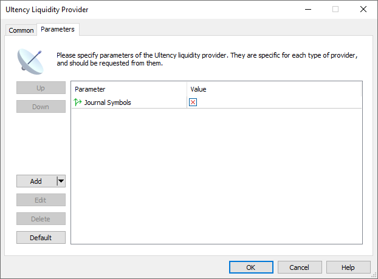

[🏠 Document Start](../../../README.md) / [MetaTrader 5 Trading Platform](../../../MetaTrader-5-Trading-Platform.md) / [Platform Setup](../../Platform-Setup.md) / [Ultency](../Ultency.md) / Connection

[Previous](../Ultency.md) | [Next](Provider-Symbols.md)

# Connecting Ultency (#connecting-ultency)

Ultency is a ready-to-use solution. You don't need to rent your own servers or install additional software. By connecting to Ultency, you receive a dedicated platform, tailored specifically for you, which will aggregate prices from your selected liquidity providers and process only your orders.

Steps to connect Ultency:

  1. Obtain an Ultency server by selecting an appropriate geographical zone.
  2. Contact liquidity providers via the built-in communication system and sign a service agreement.
  3. Connect providers to your zone using the provided credentials.

## Zones (#zones)

Zones are geographic locations where your Ultency servers can be hosted. Each zone has its own list of available liquidity providers to whom you can connect. Select a [zone (#zones)](Connection.md#zones) based on the liquidity providers you intend to use and the markets in which you wish to offer trading. You can view all available zones in the "Overview" section. By default, it suggests a zone with the fastest connection to your platform. Check if the zone has suitable liquidity providers and click "Create Matching Engine". The component will be added to your cluster. The server rental cost will be included in your company's invoice.

Go to the "Zones" section to manage your zones. The list displays both available and connected zones, providing key information such as network latency between the Ultency server and your platform, the number of available liquidity providers, and available categories of financial instruments.

If you want to provide access to multiple markets simultaneously, you can connect to several zones. For example, you may use an Ultency server in London for Forex providers and another in New York for NYSE providers.

Click "Add zone" and review the terms. Next, add the zone:

## Liquidity Providers (#liquidity-providers)

Once you have obtained an Ultency server in your selected zone, you need to contact a liquidity provider, i.e. the company that will supply price feeds and process your orders. A separate service agreement must be signed with each provider. To view detailed information about available liquidity providers and their terms, go to the relevant section or click on any zone to see its providers.

On each provider's page, you will find:

  * General description.
  * List of zones where the provider is available.
  * Service details: available instruments, turnover volume, commission structure (per trade, periodic fees), and service costs.

Ultency offers [Service Desk](Service-Desk.md), a built-in communication system, to facilitate direct contact with providers. Select the desired service and click "Request". This will create a private dialogue with the provider where you can discuss all necessary details.

## Connecting a Liquidity Provider (#connect)

Once a service agreement is signed, the liquidity provider will supply you with connection details, including server address, login, and password. Create a provider configuration:

Fill in the parameters:

  * Name — the name of the configuration.
  * Provider — the provider you have a contract with and the Ultency server where it will be connected.
  * Mode — the provider's operating mode: quotes only, order processing only, both quotes and orders.
  * Server — provider's server address.
  * Login — login credentials for the provider.
  * Password — password for the provider.
  * Coverage group and account — when adding a liquidity provider, the system automatically creates a special group and a trading account within that group. All client orders routed to this provider will be duplicated to this account for risk management and monitoring purposes.

Under the "Parameters" tab, set additional options:

  * Journal Symbols — controls whether [symbol changes](Provider-Symbols.md) from the provider are logged in the trading server journal. Adding a new provider may import tens of thousands of symbols, which could clutter the journal during the initial setup. It is recommended to disable "Journal Symbols" during initial configuration. You can enable it later for monitoring and debugging purposes.

Once the provider is successfully connected, the provider's available financial instruments will be imported into Ultency. You can proceed with instrument configuration for subsequent aggregation.
