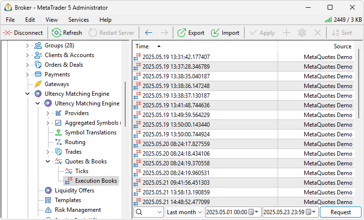
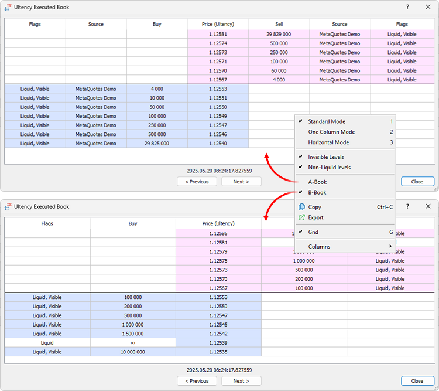

[🏠 Document Start](../../../README.md) / [MetaTrader 5 Trading Platform](../../../MetaTrader-5-Trading-Platform.md) / [Platform Setup](../../Platform-Setup.md) / [Ultency](../Ultency.md) / Execution Books

[Previous](Ticks.md) | [Next](Service-Desk.md)

# Execution Books (#execution-books)

Ultency captures the current state of the aggregated order book each time a deal is matched. This feature provides better understanding of how the system operates and helps resolve potential disputes.

The system maintains two separate order books:

  * A Book, which is assembled according to [execution settings (#execution)](Aggregated-Symbols.md#execution) for the aggregated symbol. This book is used for executing orders routed to liquidity providers. It is not visible to traders.
  * B-Book, which is assembled according to [quote settings (#quotes)](Aggregated-Symbols.md#quotes) for the aggregated symbol. It is used for executing orders internally within the platform, and it is the one visible to traders when trading through Ultency.

Together, these books provide a full picture of trade execution in any mode: what book was visible to the trader, what levels were actually available from liquidity providers, and how the execution occurred.

The easiest way to view market conditions at the time of a trading operation is to open it from the [Matching orders](Matching-Orders.md), [Liquidity orders](Liquidity-Orders.md), or [Deals](Deals.md) section and navigate to the "Ultency Book" tab. The "Execution Books" section allows you to view the full history of all saved order book snapshots.

## Requesting Data (#request)

To view order books for a symbol, request them, following these steps:

  * Symbol Selection  
In the first field, specify one of the financial symbols from the system. The symbol can be specified manually or chosen from the list, which opens by clicking on the down arrow.
  * Period Selection  
Specify the period for which you want to request books. You can choose one of the predefined periods by clicking on  (today, last 3 days, last week, last month, last 3 months, last 6 months or the entire history). You can also specify a custom time interval.
  * Request Execution  
To retrieve the tick data, click the "Request" button or use the corresponding context menu command .

## Viewing the Order Book (#view)

Click on any order book in the list to view its details. Then, in the context menu, select the [order book type (#dom-type)](Execution-Books.md#dom-type): A-Book or B-Book.

The following information is available for each order book:

  * Source — the liquidity provider from which the buy/sell level was received. This field is available only for the A-Book. The [provider configuration (#connect)](Connection.md#connect) name is displayed as the source.
  * Buy/Sell — the available volume (in number of contracts) at each bid or ask price. If the field shows the infinity symbol (∞), it indicates a technical level created according to the [settings of the aggregated symbol (#bands)](Aggregated-Symbols.md#bands).
  * Price — the sell or buy level price. In A-Book mode, this column also shows B-Book prices calculated based on [minimum spread (#spread)](Aggregated-Symbols.md#spread) or [markup (#markup)](Aggregated-Symbols.md#markup) settings, but excluding [levels (#bands)](Aggregated-Symbols.md#bands) themselves.
  * Flags — additional attributes of the price level:

  * Liquid — the level is liquid, meaning trades can be executed at this price.
  * Visible — the level is visible to clients in the aggregated order book. Currently, only [technical levels (#bands)](Aggregated-Symbols.md#bands) with infinite liquidity created based on aggregated symbol settings can be invisible.

At the bottom of the window, the timestamp of the saved order book snapshot is displayed along with its unique identifier. This same identifier appears when viewing details of a [matching order (#book-reference)](Matching-Orders.md#book-reference). It can also be used to retrieve order books in this section.

Use the context menu to manage the appearance and content of the order book. From here, you can switch between order book types, toggle columns, and enable or disable the grid display. Additional available commands include:

  * Invisible levels — disable this option to hide [technical levels (#bands)](Aggregated-Symbols.md#bands) with infinite liquidity from the order book. When enabled, both visible and hidden levels will be shown.
  * Illiquid levels — disable this option to hide price levels at which orders cannot be executed.

