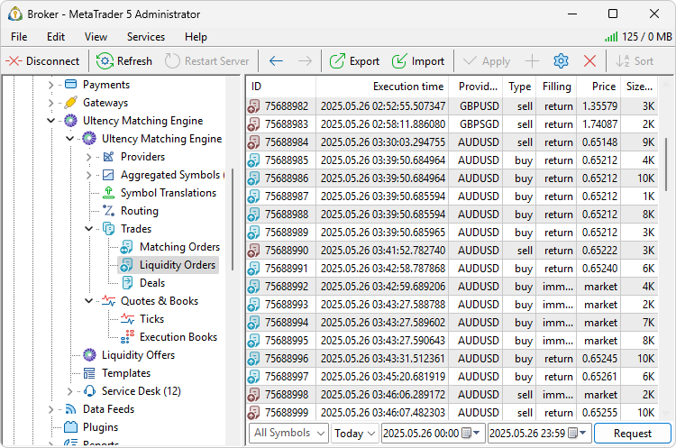
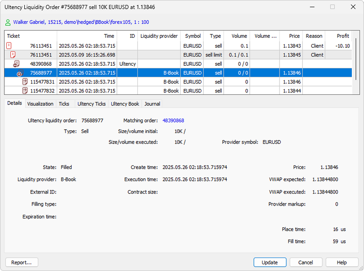
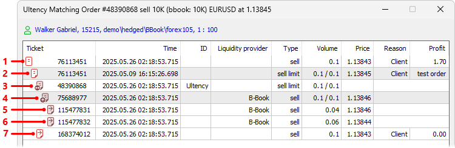
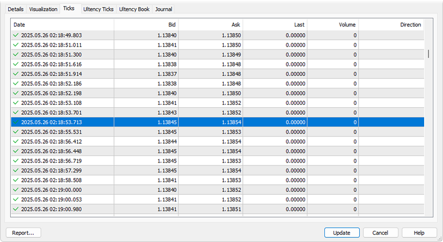
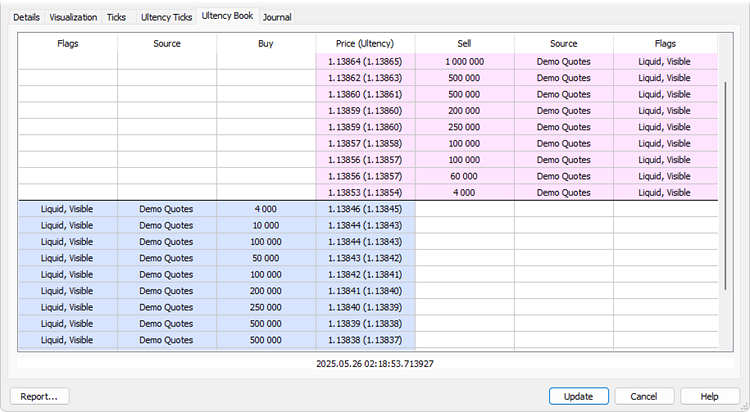
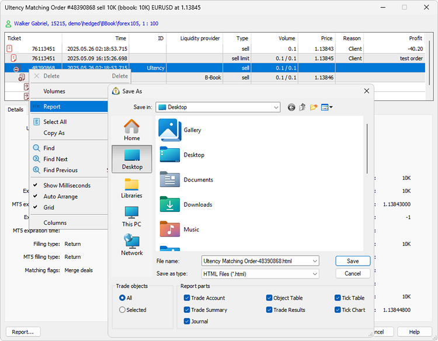

[🏠 Document Start](../../../README.md) / [MetaTrader 5 Trading Platform](../../../MetaTrader-5-Trading-Platform.md) / [Platform Setup](../../Platform-Setup.md) / [Ultency](../Ultency.md) / Liquidity Orders

[Previous](Matching-Orders.md) | [Next](Deals.md)

# Liquidity Orders (#liquidity-orders)

Ultency maintains its own database of trading operations. When a client on the platform side places an order that is routed for execution to Ultency, a corresponding operation is created in Ultency. This is referred to as a [matching order](Matching-Orders.md). Based on routing rules, Ultency generates one or more requests for execution – these are called liquidity orders. Depending on the execution type, these orders may be routed to liquidity providers (A-Book) or executed internally (B-Book). Deals that execute the liquidity order either by liquidity providers or internally are transmitted to Ultency and can be viewed in the [relevant section](Deals.md).

In this section, you can view all liquidity orders: which provider they originated from, their volume, price, and other parameters.

## Request Orders (#request)

To view orders, request them using one of the following methods:

  * By Groups  
Select a group from the dropdown list.
  * By Logins  
Enter one or more account numbers separated by commas.
  * By Symbols  
Specify one or more instruments separated by commas.

Additional query parameters may include:

  * "Open Only" — display orders that have not yet been executed.
  * One of the predefined date ranges: "Today", "Last 3 days", "Last week", "Last 3 months", "Last 6 months" or "All history". To specify a custom request period, use the fields to the right. Orders are requested by execution time. Open orders do not have this parameter, so they will be included in all queries.
  * Exact time range. Specify the start or end time manually or use the calendar popup, opened via the button .

After entering the required parameters, click "Request".

## Viewing an Order (#view)

To view an order, double-click on it in the list. The trade dialog is a full-featured tool that offers many useful functions: displaying the structure of the operation, visualizations, tick and order book history, and the operation log.

### Account Details (#account-details)

At the top of the dialog, a summary of the account on which the operation was performed is displayed: name, login, group, and leverage. Click this line to open [detailed account information](../Accounts/Editing-Account.md).

### Overview and Related Operations (#connected-transactions)

All related trading operations are shown in this block: deals executed as a result of order execution and the resulting position. Thus you can easily access the entire chain of related actions. Select an operation from the tree and all relevant parameters will be instantly displayed in the bottom part.

In the example above:

  1. Final position opened on the MetaTrader 5 side as a result of the order executed in Ultency.
  2. Original pending order placed from MetaTrader 5.
  3. Matching order created in Ultency to execute the client's original market order.
  4. Corresponding liquidity order created to fill the matching order.
  5. First deal that partially filled the matching order. Since the volume of the best available ask at that time was smaller (0.04) than the original request (0.1), Ultency filled the order using two price levels.
  6. Second deal that partially filled the matching order. Next after the best ask in the order book.
  7. Final deal created on the MetaTrader 5 side.

### Trading Operation Details (#details)

For each order, the following parameters are shown:

  * Ultency liquidity order — ticket number of the liquidity order created in Ultency to fill the client order.
  * Order type — type of the liquidity order created in Ultency.
  * Matching order — ticket number of the [matched order](Matching-Orders.md) that will be filled by this liquidity order.
  * Size/volume initial — initial volume of the liquidity order, in contracts and lots.
  * Size/volume executed — volume of the liquidity order that was actually executed in Ultency.
  * Provider symbol — name of the [trading instrument](Provider-Symbols.md) on the liquidity provider side.

  * State — current state of the liquidity order (filled, rejected, partially filled, expired, etc.).
  * Liquidity provider — name of the [liquidity provider (#liquidity-providers)](Connection.md#liquidity-providers) to which the liquidity order is sent.
  * External ID — order ticket created on the liquidity provider side. 

  * Filling type — additional [fill policy rules (#fill-policy)](../General-Information/Trading-System.md#fill-policy) for the liquidity order: "Fill or kill", "Cancel remainder", "Passive", or "Return remainder".
  * Expiration time — if lifetime of the liquidity order has expired, then this field contains the date and time of expiration.
  * Create time — liquidity order creation time.

  * Execution time — liquidity order execution time in Ultency.
  * Provider contract — contract size of the [trading instrument](Provider-Symbols.md) on the liquidity provider side.
  * Price — the initial price requested in the liquidity order.
  * VWAP expected — the price at which the liquidity order was expected to be executed. The value is calculated as the volume-weighted average price based on the current order book from the liquidity provider and the required trade volume. Includes the [provider markup (#quotes)](Provider-Symbols.md#quotes).
  * VWAP executed — the actual price at which the liquidity order was executed. The value is calculated as the volume-weighted average price of the deals executed on the provider side. Includes the [provider markup (#quotes)](Provider-Symbols.md#quotes).
  * Provider markup — markup size as defined in the [provider symbol settings (#quotes)](Provider-Symbols.md#quotes). Specified in points.
  * Place time — the time it took to register the liquidity order with the provider. Specified in microseconds.
  * Fill time — the time from registering the liquidity order with the provider to the execution of the final trade under that order. Specified in microseconds.

### Visualization (#visualization)

In this section, execution of a trading operation is visualized on the tick chart of the appropriate aggregated symbol.

### Closest Ticks Before and After the Operation (#ticks)

When analyzing disputable situations with traders, it is often necessary to analyze quotes that existed at the time of the trading operation. This information can be retrieved in just two clicks. Open the deal details and go to the "Ticks" or "Ultency Ticks" tab. The terminal will automatically request the full day's tick history for the date of the trade. The tick closest to the trade execution time will be automatically highlighted in the list.

  * Ticks — ticks actually shown to traders on the MetaTrader 5 side. These represent the platform-side symbol, which receives tick data from the aggregated symbol in Ultency according to [translation settings](Translations-of-Symbols-and-Quotes.md). As a result, markup settings from the translation rules and standard price adjustment parameters set for the [symbol (#spread)](../Symbols/Symbol-Settings/Common.md#spread) or [group](../Groups/Group-Symbol-Settings/Common.md) may apply.
  * Ultency ticks — ticks of the [aggregated symbol (#quotes)](Aggregated-Symbols.md#quotes) in Ultency.

### Ultency Book (#book)

Every time deals are matched, Ultency records the current state of the aggregated order book. This feature provides better understanding of how the system operates and helps resolve potential disputes. For more details, see the [Execution Books](Execution-Books.md) section.

### Trading Operation Journal (#journal)

This is another tool to assist during the follow-up operation examination. There is no need to manually query [logs from the server](../Network-cluster/Journal.md) or to filter entries. Open the trading operation details, navigate to the "Journal" tab, and the terminal will automatically request the relevant records from the server, filtered by ticket and from the operation date to the current day.

### Trading Operation Report (#report)

All data from the trading operation dialog can be saved as a report. The report includes the full operation chain from order to position, a visual tick chart, log excerpts, and overall account status.

To generate the file, right-click in the "[Overview and related operations (#connected-transactions)](Liquidity-Orders.md#connected-transactions)" section and select "Report" from the context menu. Then choose which data to include: account status, trading results, log, tick chart, etc.

## Context Menu (#context)

The context menu of this section includes the following commands:

  *  Edit — open the selected order.
  *  Delete — delete the selected order.
  *  Request — execute a [request (#request)](../Orders.md#request).
  * Copy As — copy the orders selected in the list:
    *  Lines — copy all selected information.
    * List Of Logins — copy only the list of logins.
    * List Of Tickets — copy only the list of tickets.
  *  Journal By — query [journal](../Network-cluster/Journal.md) entries for the selected order.
  *  Export — [export](../General-Information/Data-Export.md) the requested orders to an *.HTM, *.HTML, or *.CSV file.
  *  Find — open the [search](../../MetaTrader-5-Administrator/User-Interface/Search.md) window.
  * Auto Arrange — if this option is enabled, the size of columns is selected automatically.
  * Grid — show/hide grid to separate fields in the orders table.
  * Columns — use this submenu to select which [order data (#view)](Liquidity-Orders.md#view) fields are displayed in the list.

