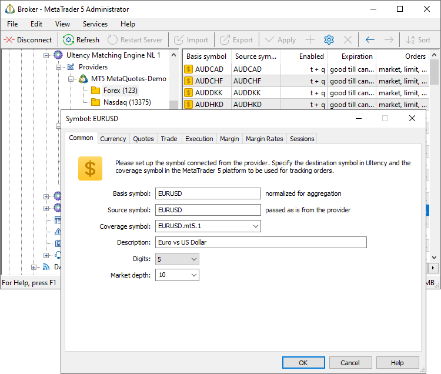
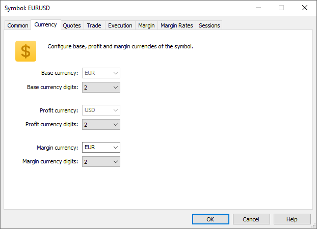
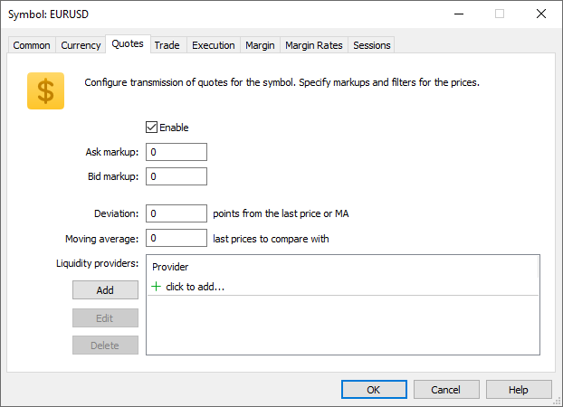
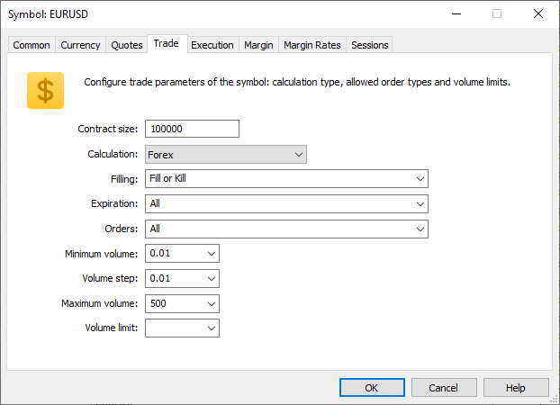
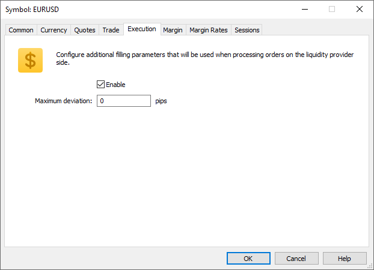
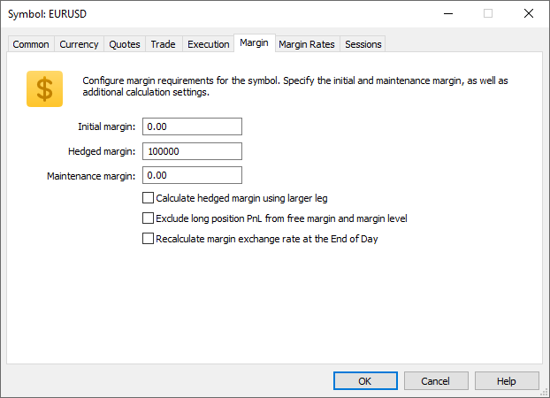
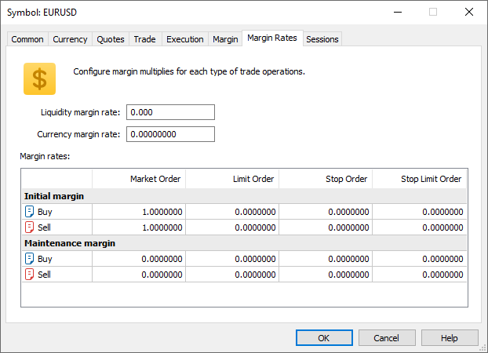
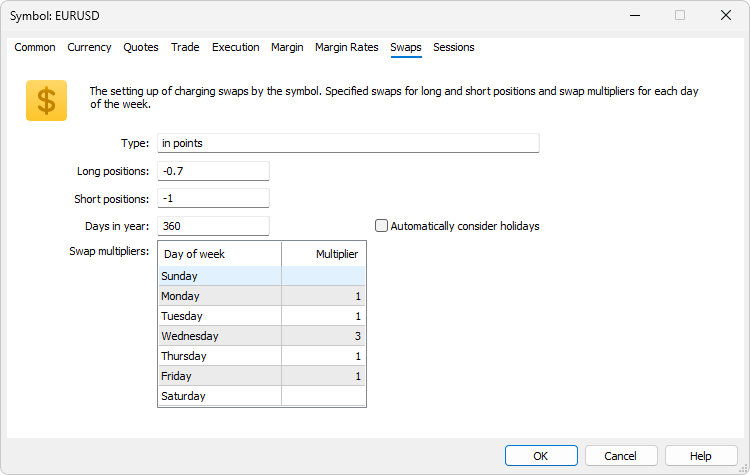
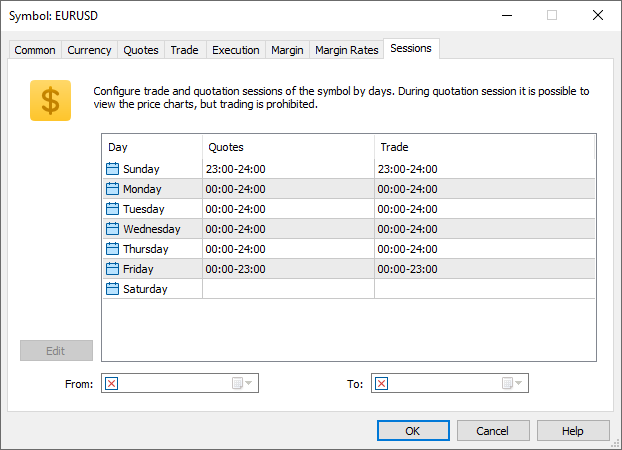
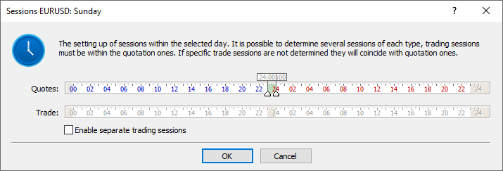

[🏠 Document Start](../../../README.md) / [MetaTrader 5 Trading Platform](../../../MetaTrader-5-Trading-Platform.md) / [Platform Setup](../../Platform-Setup.md) / [Ultency](../Ultency.md) / Provider Symbols

[Previous](Connection.md) | [Next](Aggregated-Symbols.md)

# Provider Symbols (#provider-symbols)

Ultency imports financial instrument settings from liquidity providers and subsequently uses them for price data aggregation and order execution routed to the provider.

## Common (#common)

The following settings are available in the "Common" section:

  * Basis symbol — the name of the instrument associated with the symbol received from a provider. It is used to link the provider's instrument to an aggregated symbol.  
  
Each aggregated symbol must have a designated [basis symbol (#basis)](Aggregated-Symbols.md#basis), which defines the instrument for which data is collected, as well as the list of providers whose data should be aggregated. Ultency scans all selected providers and aggregates data from instruments with the specified basis symbol. The basis symbol is also used for [routing the requests](Routing.md).  
  
A single provider cannot have multiple symbols with the same basis symbol.  
  
To bulk modify or remove a basis symbol, select the desired records, click "Edit" in the menu, and then specify or delete the postfix in the corresponding field. The postfix must begin with a period (.). For example, if you select records with the basis symbols EURUSD, USDJPY, and GBPUSD and add a postfix .x (EURUSD.x) in the bulk editing window, all three base symbols will be changed to EURUSD.x, USDJPY.x, and GBPUSD.x, respectively.  

  * Source symbol — the name of the instrument on the provider side. This field is populated automatically when the provider is connected.
  * Coverage symbol — a symbol used to duplicate all trades executed through this provider.
  * Description — a brief description of the symbol.
  * Digits — the number of decimal places in the symbol prices. This is used for indication only on the provider's side. Prices are rounded only when [transmitted to MetaTrader 5](Translations-of-Symbols-and-Quotes.md), while Ultency works with prices according to the original number of digits from the liquidity provider.
  * Market depth — the number of price levels (on each side) to be transmitted for this symbol. Other levels will be excluded from the aggregated book. If Market depth is disabled on Ultency or provider side, ticks for this symbol will be processed with the maximum execution volume specified in the [settings (#volume-max)](Provider-Symbols.md#volume-max) and participate in order matching and B-Book book formation by [levels (#bands)](Aggregated-Symbols.md#bands).

> A liquidity provider must not have multiple instruments with the same basis symbol. For example, a regular EURUSD symbol and a similar symbol with different settings and an additional suffix in the name (EURUSD.x, etc.). This may cause errors or undefined behavior in Ultency. If duplicate symbols are available for the account used for [connecting to the provider (#connect)](Connection.md#connect), contact the provider to ensure only one set is available.

## Currency (#currency)

The parameters in this section are informational and should not be modified. They reflect how the liquidity provider handles transactions and which settings they use.

  * Base currency — the base currency of the instrument.
  * Profit currency — the currency in which profits from trades on this symbol will be [calculated](../Symbols/Symbol-Settings/Trade/Profit-Calculation.md).
  * Margin currency — the currency used to [calculate margin requirements](../Symbols/Symbol-Settings/Trade/Margin-Calculation.md) for the symbol.

## Quotes (#quotes)

This section defines settings for receiving quotes from the provider:

Specify the following parameters:

  * Enable — enables reception of quotes and depth of market for the symbol.
  * Bid markup — the number of points to adjust the Bid price received from the provider before passing it to the aggregated symbol. Positive values increase the prices, while negative values decrease them. The value is in points of the source symbol's price.
  * Ask markup — the number of points to adjust the Ask price received from the provider before passing it to the aggregated symbol. Positive values increase the prices, while negative values decrease them. The value is in points of the source symbol's price.

### Price Filtering (#price-filtering)

Filters are used to control the correctness of quotes from the liquidity provider:

  * Deviation — maximum allowed difference (in points) between the received price and the previous or average price (if "Moving average" is non-zero). Prices exceeding this deviation are discarded.
  * Moving average — number of previous prices used to calculate the average. If the current price deviates from this average by more than the "Deviation" value, it is discarded. A zero value means the current price is compared to the last price.
  * Liquidity providers — a list of liquidity providers whose prices are used to cross-check quotes from the current provider. When receiving a quote, the system will compare it with the latest price for the same basis symbol from the specified providers. If the price differs by more than the "Deviation" value, it is automatically discarded.

## Trading (#trading)

The parameters in this section are informational and should not be modified. They reflect how the liquidity provider handles transactions and which settings they use.

If necessary, you can only narrow the settings within the limits allowed by the provider. For example, you can disable one of the supported execution modes (but not enable the unsupported one) or increase the minimum volume.

The following settings are available:

  * Contract size — the amount of the base asset per lot/contract (for currency pairs it is actually the value of one lot in the base currency of the instrument).
  * Calculation — symbol [margin requirements](../Symbols/Symbol-Settings/Trade/Margin-Calculation/Retail-Forex-CFD-Futures-—-Netting.md) and [profit](../Symbols/Symbol-Settings/Trade/Profit-Calculation.md) calculation type. This parameter also affects the calculation of [swaps](../Symbols/Symbol-Settings/Swaps.md).
  * Filling — additional [order filling rules (#fill-policy)](../General-Information/Trading-System.md#fill-policy) that can be specified in Ultency. To allow a particular fill type, check the relevant box:
    * Fill or Kill — order can only be executed in the specified volume.
    * Immediate or Cancel — order can be executed in the maximum volume available in the market within the requested volume. If the request cannot be filled in full, an order with the available volume will be executed, and the remaining volume will be canceled.
    * Passive — order is only placed in the market depth. If the order can be filled immediately when placed, this order is canceled.
    * Return — this mode is not available in the list. It is always allowed for market orders (Buy and Sell) in the "Exchange execution" mode and for [limit and stop-limit orders (#pending-order)](../General-Information/Trading-System.md#pending-order) in the "Market Execution" and "Exchange Execution" modes.
  * Expiration — order expiration conditions. To allow an expiration type, check the relevant box:
    * Good Till Canceled — the order will remain in the queue until it is canceled manually.
    * Day — the order will be valid only during the current trading day. When processed on the MetaTrader 5 platform side, day orders are removed at the end of the calendar day (24 hours) taking into account [trading server time](../Time.md) and symbol [trading sessions](../Symbols/Symbol-Settings/Sessions.md). For example, if trading ends at 21:00, untriggered day orders will be canceled at the same time. When orders are processed in external systems via [gateways](../Gateways.md), the expiration rules can be different and depend on the specific system.
    * Specified time — the order will be valid until the specified date.
    * Specified day — the order will be valid until 00:00 of the specified day. If outside a trading session, it will expire at the next available session.
  * Orders — allowed order types: Market, Limit, Stop, Stop Limit, Stop Loss, Take Profit, Close By. Enabling Close By orders does not affect [netting accounts (#netting)](../Groups/Position-Accounting-Systems.md#netting), as Close By orders can only be used on [hedging accounts (#hedging)](../Groups/Position-Accounting-Systems.md#hedging).
  * Minimum volume — minimum order size for the symbol. The parameter is ignored when closing positions.
  * Maximum volume — maximum order size for the symbol. Applied when placing orders and when closing positions by [Stop Out (#stopout)](../Groups/Group-Settings.md#stopout).
  * Volume step — volume change step.
  * Volume limit — maximum total volume of an open position and pending orders in one direction (buy or sell) per one symbol. For example, a limit of 5 lots allows you to have an open 5-lot position and place a 5-lot Sell Limit order. But in this case, placing a pending Buy Limit order is not allowed, since the total volume in one direction would exceed the limit. Also, if there is a 5-lot Buy position, Ultency cannot place a Sell Limit order with a volume exceeding 5 lots: if the pending order triggered after the closing of the initial position, the system would have a short position exceeding the specified limit.

## Execution (#execution)

The section defines additional execution parameters for orders routed to the liquidity provider.

### Maximum deviation (#maximum-deviation)

This parameter is only used when operations are sent as Instant Execution and Request Execution orders.

In case of an instant execution, an acceptable deviation is specified in the request sent to the external provider.

When a requote from an external provider is received, Ultency checks if the new price is within the specified deviation. If so, Ultency sends a new request to the provider with the prices from the requote. If the provider accepts the prices, the request is executed. In case of a repeated requote, the deviation will be checked according to the first request (i.e. the price of the original order).

If deviation is exceeded, execution is stopped, and the order is rejected.

## Margin (#margin)

The parameters in this section are informational and should not be modified. They reflect how the liquidity provider handles transactions and which settings they use. These settings are also used to calculate the coverage account margin to align conditions with the liquidity provider's terms.

When trading on the MetaTrader 5 side, your clients will use the same [margin settings](../Symbols/Symbol-Settings/Margin.md) in your platform. Align them with the providers' settings to avoid increased risks.

## Margin Rates (#margin-rates)

The parameters in this section are informational and should not be modified. They reflect how the liquidity provider handles transactions and which settings they use. These settings are also used to calculate the coverage account margin to align conditions with the liquidity provider's terms.

When trading on the MetaTrader 5 side, your clients will use the same [margin settings](../Symbols/Symbol-Settings/Margin-Rates.md) in your platform. Align them with the providers' settings to avoid increased risks.

## Swaps (#swaps)

The parameters in this section are informational and cannot be modified. They reflect how the liquidity provider handles transactions and which settings they use. These settings are also used to calculate the coverage account margin to align conditions with the liquidity provider's terms.

Доступны следующие параметры:

  * Type — swap charging type.
  * Long positions — swap for Buy positions.
  * Short positions — swap for Sell positions.
  * Days in year — the number of days in a year to be used for [swap percent calculation (#percentage)](../Symbols/Symbol-Settings/Swaps.md#percentage). Depending on the country and market in which the broker operates, as well as on the financial instrument type, different [number of days in a year](https://en.wikipedia.org/wiki/Day_count_convention) can be used when calculating annual percent. This parameter operates with such calculation specifics. The most common option of 360 days is used by default. You can change the value to 365 or 366, as well as specify a different value manually.
  * Swap multipliers — swap multiplier for each day of the week. This multiplier will be applied to the calculated swap value before charging. Specify 1 to charge the regular amount, 3 for triple swap or 0 to cancel swap.

Detailed information is available in the "[Symbols \ Swaps](../Symbols/Symbol-Settings/Swaps.md)" section.

## Sessions (#sessions)

This section contains the provider's default quoting and trading sessions. You may narrow (but not expand) these sessions to restrict quoting and order routing.

Click on a day to adjust its session settings:

To configure the time of quote and trading sessions separately, enable the corresponding option. Next, set up the sessions. The sliders that control session beginning and end times can be moved with the mouse and with the arrow keys. You can hold down the Shift key to slow down the slider speed. This enables precision of up to minutes when configuring sessions.

If the symbol should only be available for a specific time, set From and To parameters. Outside this range, trading will be [disabled (#trade-disabled)](../Symbols/Symbol-Settings/Trade.md#trade-disabled) for this symbol. Clients will receive a "Trading disabled" message upon attempting to place orders.
