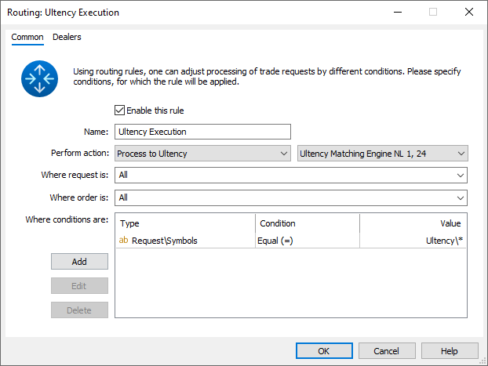
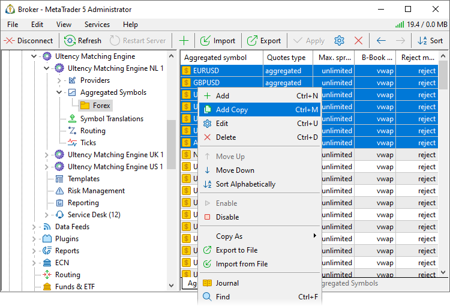
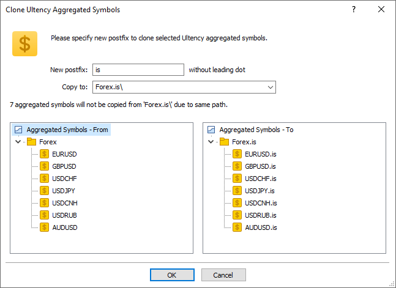
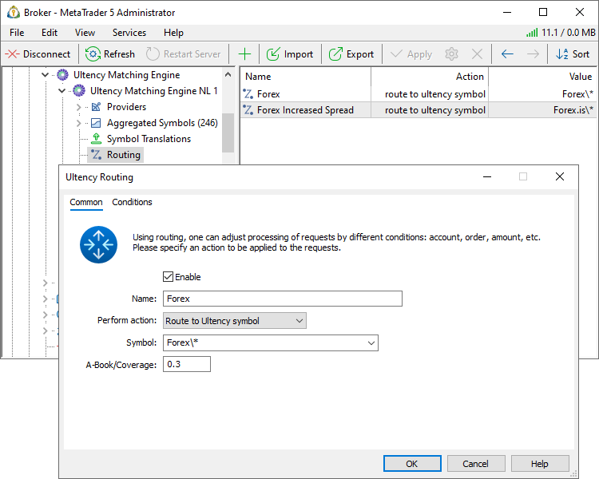
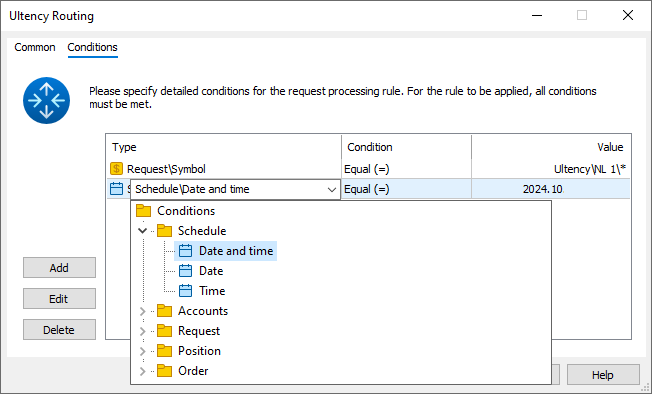
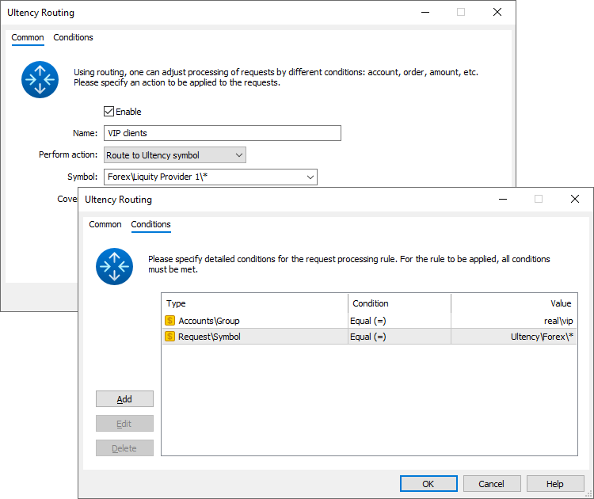

[🏠 Document Start](../../../README.md) / [MetaTrader 5 Trading Platform](../../../MetaTrader-5-Trading-Platform.md) / [Platform Setup](../../Platform-Setup.md) / [Ultency](../Ultency.md) / Routing

[Previous](Translations-of-Symbols-and-Quotes.md) | [Next](Routing/Conditions.md)

# Routing (#routing)

To ensure client trading requests are forwarded to Ultency for execution, define [routing rules](https://support.metaquotes.net/ru/docs/mt5/platform/administration/requests_routing). In the Common settings, specify which requests should be routed to Ultency. For example, all requests for symbols matching Ultency*. Select "Send to Ultency" for the action and specify the Ultency server that will handle execution.

Requests forwarded to Ultency in accordance with the routing rules will be processed according to Ultency's internal rules.

## Internal Routing in Ultency (#routing-ultency)

To define how trading requests are processed inside Ultency, use the "Routing" section in the settings of the respective Ultency server. Depending on various conditions (symbol, volume, trader group, etc.), you can manage trade execution flexibly, such as routing orders to different providers or rejecting them.

To implement different execution conditions for the same symbols, create separate sets of aggregated instruments. Select the required symbols from the list and choose "Add Copy" from the context menu.

Next, define a postfix that will be added to all symbol names in the new set. You should also specify a subfolder name where these symbol copies will be placed.

After creating copies, adjust their settings as needed.

Once you have prepared the necessary sets of aggregated symbols, proceed to configure routing rules:

Create a rule and specify the following parameters:

  * Name — name of the routing rule.
  * Perform action — action to be taken when a request matches the [rule conditions (#conditions)](Routing.md#conditions).
    * Route to Ultency symbol — the request will be executed based on the settings of the specified aggregated symbol.
    * Reject — the request will be rejected.
  * Symbol — aggregated symbol according to which the request will be executed. For convenience, symbols can be specified as subgroups. For example, Forex\*. Based on the symbol in the incoming request, Ultency will automatically select a matching aggregated symbol from this subgroup. See symbol selection logic [below (#symbol-matching)](Routing.md#symbol-matching).
  * A-Book/Coverage — portion of the order to be sent to an external provider (A-Book share). 0 indicates that the entire order will be executed internally (B-Book), 1 – the entire order will be routed to an external liquidity provider as per [execution settings (#execution)](Aggregated-Symbols.md#execution).

## Rule Conditions (#conditions)

To define which requests should be processed according to the rule, specify a set of conditions:

A detailed description of available conditions is provided in a [separate section](Routing/Conditions.md).

## Rule Execution Order (#priority)

Rules are executed from the top downwards. If an incoming request matches the conditions of the first rule, it will be processed according to that rule. If it doesn't match, the system checks the next rule, and so on.

To reorder rules, use the " Move Up" and " Move Down" options in the context menu or the corresponding commands in the [Edit](../../MetaTrader-5-Administrator/User-Interface/Main-Menu/Edit.md) menu and [Standard Toolbar](../../MetaTrader-5-Administrator/User-Interface/Toolbar/Standard.md).

## How Aggregated Symbols Are Selected (#symbol-matching)

Routing rules enable different handling of operations on the same instrument, depending on the conditions. For example, EURUSD orders from clients in the real\regular group may be routed to one liquidity provider, while forwarding orders from real\vip clients to another. To implement such differentiation, create separate sets of aggregated symbols as mentioned earlier. Then, define a specific routing rule for each client group, indicating the corresponding subgroup of aggregated symbols as the symbol.

Example: Assume that Ultency has two sets of aggregated instruments:

  * Forex\Liquidity Provider 1\*. The subgroup contains EURUSD.lp1 which has EURUSD set as its [basis symbol (#basis)](Aggregated-Symbols.md#basis).
  * Forex\Liquidity Provider 2\*. This subgroup contains EURUSD.lp2 which also has EURUSD as the basis symbol.

Each symbol is configured to [execute (#execution)](Aggregated-Symbols.md#execution) through its respective liquidity provider.

Through [symbol translation settings](Translations-of-Symbols-and-Quotes.md), both subgroups are mapped to a single symbol set on the trading platform side:

  * Forex\Liquidity Provider 1\* -> Ultency\Forex\*
  * Forex\Liquidity Provider 2\* -> Ultency\Forex\*

As a result, the trading platform features a single symbol, Ultency\Forex\EURUSD, available for client trading. A routing rule is then set up as follows:

How the selection works:

  1. When a trading request for EURUSD is received, the system checks the routing rules from top to bottom and identifies the first rule that matches the request conditions. Let's say the rule specified above applies.
  2. The system checks the group of aggregated symbols specified in the rule. In this case, it is Forex\Liquidity Provider 1\*.
  3. Ultency checks the list of instruments in the Forex\Liquidity Provider 1\* subgroup and selects the one whose [basis symbol (#basis)](Aggregated-Symbols.md#basis) matches the symbol in the request – EURUSD. In this case, it is EURUSD.lp1. This symbol will be used to execute the client's order.

