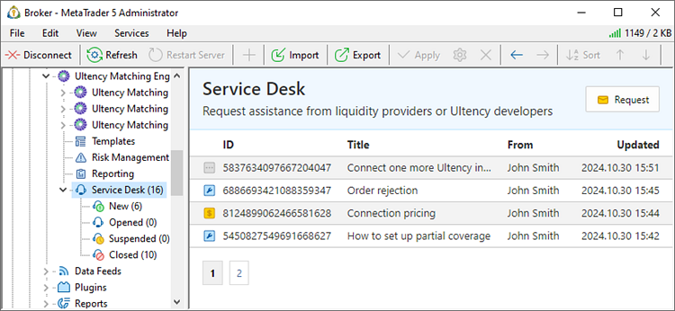
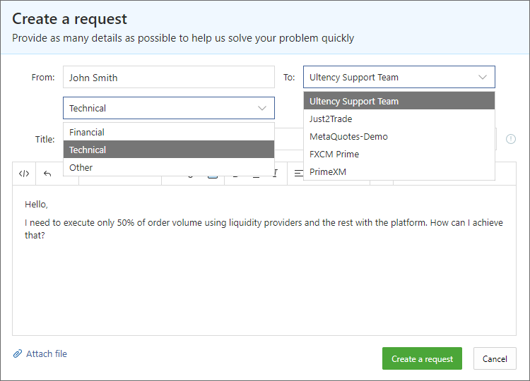
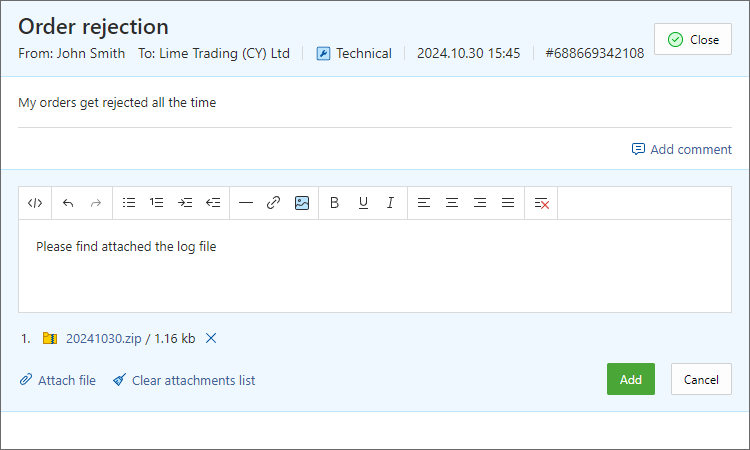

[🏠 Document Start](../../../README.md) / [MetaTrader 5 Trading Platform](../../../MetaTrader-5-Trading-Platform.md) / [Platform Setup](../../Platform-Setup.md) / [Ultency](../Ultency.md) / Service Desk

[Previous](Execution-Books.md) | [Next](Become-a-Provider.md)

# Service Desk (#service-desk)

Service Desk is a built-in support and communication system within Ultency, designed to simplify interactions with liquidity providers. Whenever you encounter any questions or issues, there's no need to search for contact information. Simply reach out to the provider directly through the Service Desk. You can also use it to contact Ultency developers for any technical assistance.

All requests to providers are organized into categories for convenience:

  * New — requests that have not yet received a response.
  * Open — ongoing conversations and unresolved requests.
  * Suspended — requests that have been postponed for various reasons.
  * Closed — requests that have been resolved and where correspondence is completed.

## Creating a Request (#create)

To contact a liquidity provider, click "Request". Select the provider to whom the request will be sent, choose a category, and briefly describe the issue in the subject field. Then, provide a detailed description of the issue. If necessary, attach additional files such as logs, screenshots, etc. The more detailed your description, the faster you will receive a solution.

If the issue requires urgent attention, click  to the right of the subject field. The request will be marked as a priority and displayed with a corresponding label in the list.

## Correspondence (#communication)

To view a provider's response or add more details, open the request.

Once the issue is resolved, click "Close" in the top-right corner. The request will then be moved to the Closed category.
