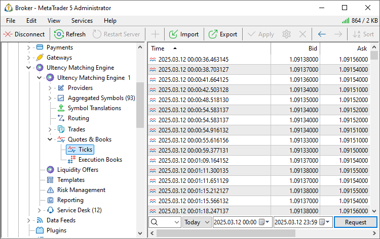

[🏠 Document Start](../../../README.md) / [MetaTrader 5 Trading Platform](../../../MetaTrader-5-Trading-Platform.md) / [Platform Setup](../../Platform-Setup.md) / [Ultency](../Ultency.md) / Ticks

[Previous](Deals.md) | [Next](Execution-Books.md)

# Ticks (#ticks)

This section allows you to view the tick history for [aggregated symbols](Aggregated-Symbols.md) — all quotes received from liquidity providers that affected the best Bid and Ask prices.

Each tick may contain the following data:

  * Date — date and time when the tick was received.
  * Bid — the Bid price.
  * Ask — the Ask price.
  * Last — price of the last executed deal.
  * Volume — volume of the last performed transaction.
  * Direction — direction of the deal as a result of which the tick was created: Buy or Sell.

## Requesting Tick Data (#request)

To request ticks for a symbol, follow these steps:

  * Symbol Selection  
In the first field, specify one of the financial symbols available in the system. You can either enter the symbol manually or select it from the list by clicking the drop-down arrow.
  * Period Selection  
Specify the time period for which you want to request ticks. You can select one of the predefined periods by clicking on  (today, last 3 days, last week, last month, last 3 months, last 6 months, or the entire history) or define a custom period.
  * Request Execution  
To retrieve the tick data, click the "Request" button or use the corresponding context menu command .

