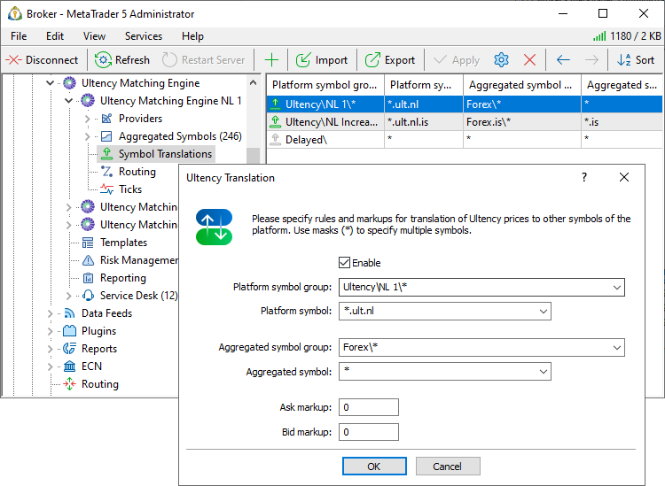

[🏠 Document Start](../../../README.md) / [MetaTrader 5 Trading Platform](../../../MetaTrader-5-Trading-Platform.md) / [Platform Setup](../../Platform-Setup.md) / [Ultency](../Ultency.md) / Translations of Symbols and Quotes

[Previous](Aggregated-Symbols.md) | [Next](Routing.md)

# Translations of Symbols and Quotes

Use the "Translation" section to map [aggregated symbols](Aggregated-Symbols.md) in Ultency to trading symbols on the MetaTrader 5 platform.

Your traders do not have direct access to Ultency symbols. They can only trade using the platform's trading symbols, which are configured in the [respective section](../Symbols.md) of the platform. To ensure quotes flow from Ultency to the correct symbols in your platform, set up symbol translation rules.

By creating multiple translation rules, you can retransmit Ultency quotes into several sets of symbols simultaneously. For example, with different markups, trading conditions, or delivery modes (real-time or delayed).

Translation rule parameters:

  * Platform symbol — the symbol that will receive data from Ultency. This symbol must be pre-created in the platform.
  * Aggregated symbol — the [aggregated symbol](Aggregated-Symbols.md) in Ultency from which data will be transmitted.
  * Bid and Ask markups — the number of points to adjust the corresponding prices. Positive values increase the price, while negative values decrease it. The value is in points of the source symbol's price. If multiple symbols fall under one group rule but have different precisions (number of decimal places), the markup will be applied according to each source symbol’s precision. For example, if a symbol has 4 decimal places, a markup of "1" will adjust the price by 0.0001; if a symbol has 5 decimal places, a markup of "1" will adjust the price by 0.00001.

You can use the wildcard mask "*" for bulk retranslations and conversions of source and destination symbol names. In this case, all pairs of source-target symbols that have matching patterns represented by the mask will be retransmitted. The "*" mask is also used to link symbols based on patterns. For example:

  * If aggregated symbols are specified as "*" and platform symbols as "*.ult.nl", all aggregated symbols will be retransmitted to platform symbols with the same names and a ".ult.nl" suffix. Example: if the aggregated symbol is EURUSD, the corresponding platform symbol will be EURUSD.ult.nl.
  * If aggregated symbols are specified as "*.is" and platform symbols as "*.ult.nl", all aggregated symbols ending with names ending in ".is" will be retransmitted to platform symbols with the same names, replacing ".is" with ".ult.nl". For example: if the aggregated symbol is EURUSD.is, the corresponding platform symbol will be EURUSD.ult.nl. If the aggregated symbol is EURUSD, it will not be retransmitted to the platform.

The parameters "Platform symbol group" and "Aggregated symbol group" serve as additional filters. For example, if the platform symbol is specified as "*.ult.nl", this means "all symbols ending with .ult.nl", regardless of their folder location. For example:

  * Ultency\NL 1 — symbols with standard conditions.
  * Ultency\NL Increased spread — symbols with increased spreads.

If you want to restrict translation only to "*.ult.nl" symbols in a specific folder, you can set a path in the "Platform symbol group", such as "Ultency\NL 1*".

  * Each aggregated symbol must have at least one translation rule configured. Otherwise, traders will not receive quotes from Ultency.
  * You can translate quotes from a single Ultency symbol to multiple MetaTrader 5 symbols. However, each platform symbol can only have one Ultency aggregated symbol. If multiple translation rules are set for the same platform symbol, only the first rule will be applied. If you have multiple Ultency servers, and they contain translation rules for the same MetaTrader 5 symbol, only the first rule from the first server will be used.

  
---
