# official proof of platform operational skills


|   | MetaQuotes certification program            | Page |
|---|---------------------------------------------|------|
|   | Platform installation                       | 7    |
| 1 | Platform architecture                       | 8    |
| 2 | Selecting hardware                          | 15   |
| 3 | System preparation                          | 18   |
| 4 | First-time platform installation            | 38   |
| 5 | Installation of additional components       | 41   |
| 6 | Platform activation                         | 55   |
| 7 | Cluster management                          | 58   |
| 8 | Common errors                               | 64   |
|   | Platform security                           | 65   |
| 1 | Configuring anti-flood control              | 66   |
| 2 | Configuring firewall                        | 68   |
| 3 | Enabling anti-DDoS protection               | 70   |
| 4 | Setting access rights                       | 76   |
| 5 | Extended authentication                     | 85   |
| 6 | One-time passwords                          | 93   |
| 7 | Common errors                               | 103  |
|   | Configuring platform backups                | 104  |
| 1 | Backup server installation                  | 105  |
| 2 | Periodic and file copies                    | 110  |
| 3 | Configuring automatic failover              | 116  |
| 4 | Server recovery                             | 121  |
| 5 | Data export to SQL and operations with DBMS | 125  |
| 6 | Common errors                               | 136  |
|   | Ongoing platform maintenance                | 137  |
| 1 | Start page and hints                        | 138  |
| 2 | Monitoring                                  | 141  |
| 3 | Automation of administrator operations      | 152  |
| 4 | License restrictions                        | 158  |
| 5 | Platform update                             | 162  |
| 6 | Platform migration                          | 166  |
| 7 | Working with platform logs                  | 168  |
| 8 | Server and utility console commands         | 172  |
| 9 | Working with help information               | 177  |
|   | Configuring client groups and accounts      | Page |
| 1 | Group types                                 | 183  |
| 2 | Creating groups, general settings           | 185  |
| 3 | Import from another server                  | 188  |
| 4 | Configuring accounts on the server          | 197  |
| 5 | Common errors                               | 201  |
|   | Configuring financial instruments           | 202  |
| 1 | Creating symbols, general settings          | 205  |
| 2 | Import from another server                  | 209  |
| 3 | Common errors                               | 212  |
|   | General platform settings                   | 213  |
| 1 | Trading time                                | 215  |
| 2 | Holidays                                    | 220  |
| 3 | Import and export of settings               | 222  |
| 4 | Common errors                               | 226  |
|   | Feeding quotes                              | 227  |
| 1 | Real-time data                              | 231  |
| 2 | Deep price history                          | 252  |
| 3 | Common errors                               | 261  |
|   | Additional services                         | 262  |
| 1 | Server plugins and APIs                     | 263  |
| 2 | Additional components in the App Store      | 268  |
| 3 | Integration with messengers                 | 270  |
| 4 | Integration with mail services              | 283  |
| 5 | Funds and ETFs                              | 285  |
| 6 | Built-in ECN                                | 299  |
| 7 | Subscriptions                               | 311  |

## <span id="page-3-0"></span>**MetaQuotes certification program**

You think you know MetaTrader 5 inside out and have allthe skills needed to operate the platform for your broker successfully? Put your knowledge to the test and become a MetaQuotes certified professional.

- ·How to install and deploy the MetaTrader 5 trading cluster?
- ·How to protect against DDoS attacks and recover after a malfunction?
- ·How to create your own ECN and connect liquidity providers?
- ·How to configure the MetaTrader 5 platform to meet regulator requirements?
- ·What to do if the quotes have stopped and connection to the trade server has been lost?

These and many other questions arise in day to day brokerage activities. The answers are provided in this tutorial, in articles on the [Support](https://support.metaquotes.net/en/articles) Center website and in the MetaTrader 5 platform [documentation,](https://support.metaquotes.net/en/docs/mt5) but allthis still can't replace a specialist who knows WHAT to do in a specific situation and WHERE to find the necessary information.

Pass [certification](https://support.metaquotes.net/en/certification) from MetaQuotes to verify your knowledge and get the documentary evidence of your qualification for a broker.


## **Through certification, you will**

- ·Test your knowledge
- ·Study relevant material and turn your weak points into strong ones
- ·Learn how to handle the existing functionality in depth
- ·Have an understanding of new product features
- ·Become a certified MetaQuotes professional
- ·Enrich your employment opportunities

### **Three types of certification**

- 1. MetaTrader 5 [Administrator](https://support.metaquotes.net/en/certification/courses/4) for platform administrators
- 2. [MetaTrader](https://support.metaquotes.net/en/certification/courses/6) 5 Manager for client managers
- 3. [MetaTrader](https://support.metaquotes.net/en/certification/courses/7) 5 Dealer for dealers and risk managers

#### **Free online test and two oral exam attempts**

Even if you are not confident in your abilities, start with the first certification stage — the online test. This test is free, while the number of attempts is unlimited. Check out the topics covered by the test and prepare for the certification.

If you feel confident about your knowledge and can easily pass the first stage, it will not be difficult for you to pass the second-stage interview. During the interview, we will additionally verify your knowledge before issuing a certificate. Even if your first interview attempt is unsuccessful, you will have a free retake attempt.

It is safe to say that getting a certificate is easier than obtaining a driver's license provided that you really spent some time behind the wheel and read the traffic code.

We offer one free certification for each company. [Order](https://support.metaquotes.net/en/certification) it now via the Certification section in MetaQuotes Support Center.

### **You are just a few steps away from becoming a certified professional**

Select the necessary certificate type and pass two stages:

- · Stage 1. Complete the online test consisting of approximately 80 multi-choice questions at your convenience. To complete the test, you should score 70% correct answers. Once you have successfully completed this test, you can then go on to sign up for stage two.
- · Stage 2. Pay for the oral exam and be interviewed by a MetaQuotes representative via a video call. The interview lasts for roughly 30 minutes and verifies that the results of the first stage are legitimate.

Successful participants receive an official certificate signed and verified by a unique 12-digit ID which proves authenticity. The document can be validated by using this [link](https://support.metaquotes.net/en/certification).

Enroll in the program now by going to the [Certification](https://support.metaquotes.net/en/certification) section on the MetaQuotes Support Center website. It takes less than 10 seconds.

## <span id="page-6-0"></span>**Platform installation**

The selection and preparation of hardware, as well as the correct installation of the MetaTrader 5 trading platform, are very important steps. They directly affect the platform reliability and the quality of your customer service.

In this chapter, we will cover all aspects of the platform installation:

- ·General platform operation principles and the interaction of its components
- ·Choosing a hosting provider, selecting hardware to meet the system requirements
- ·Preparing Windows for platform installation
- ·Installing the main and additional components for fully featured system operation
- ·Initial license activation and reactivation specifics

## <span id="page-7-0"></span>**Platform architecture**

The MetaTrader 5 trading platform is a distributed system. It is divided into separate components which are interconnected by the main trade server, where all settings are stored. Many functions are logically separated, which greatly improves the system reliability and performance.

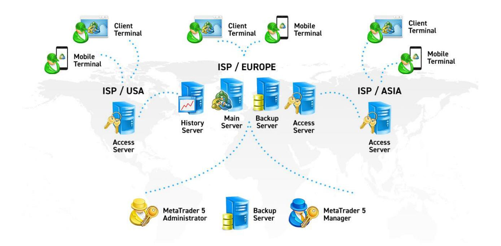

### **Trade server**

The system has two types of trade servers: one main server and additionaltrade servers. In addition to the functions of a trade server, the main server manages the system configuration and controls other servers. The trade server performs the following functions:

- ·Storing and managing client records
- ·Authenticating and authorizing client connections
- ·Storing and managing trade records
- ·Checking, managing and executing trade requests
- ·Managing the internal mail system.

Additionaltrade servers reduce main server load when the company has many clients. They store and manage a certain part of the client and trade databases, as well as manage trading activities.

See also: [Documentation](https://support.metaquotes.net/en/docs/mt5/platform/components/trade_server) / Platform / Platform components / Trade server

- ·The system can have one main trade server and an unlimited number of additional servers.
- ·All servers are configured via the **Network Cluster** section of the Administrator terminal.

#### <span id="page-8-1"></span>**Access server**

Access servers serve as proxy servers and platform firewalls. These servers perform the following functions:

- ·Handling incoming connections
- ·Packing and forwarding authorization requests to a trade server
- · Controlling the activity of client connections to protect the server from attacks and overload [\(Antiflood](#page-65-0) [Control](#page-65-0))
- · Storing history data, Market Depth data and news and providing them to clients to reduce the history server load
- ·Caching and providing Live Update updates to terminals
- · Monitoring cluster operation by observing history and trade servers. If the servers become unavailable, the system can automatically switch to backup servers.

An unlimited number of access servers can be installed for each trade server. Terminals switch between them automatically depending on priority settings.

See also: [Documentation](https://support.metaquotes.net/en/docs/mt5/platform/components/access_server) / Platform / Platform components / Access server

#### <span id="page-8-0"></span>**History server**

The history server processes price and news data. It performs the following functions:

- ·Receiving and filtering price and news data from gateways and datafeeds
- ·Packing price and news data
- · Storing and providing price history in the form of 1-minute bars and ticks to other components of the platform
- ·Storing and providing news
- ·Receiving, checking and distributing Live Update updates between MetaTrader 5 servers

See also: [Documentation](https://support.metaquotes.net/en/docs/mt5/platform/components/history_server) / Platform / Platform components / History server

#### <span id="page-9-0"></span>**Backup server**

These servers store backup data copies which can be used in case of a trade or history server failure. Backup servers perform the following functions:

- · Providing real-time backup of the trade and history server. Each server is associated with one or more separate backup server instances which can replace it at any time.
- ·Creating daily backups of all databases, creating regular backups of client and trade databases
- · For history servers: backing up data required for correct recovery of gateways, including user settings which can be stored in the settings.dat file under the gateway working directory (if provided by the gateway developer) and trade execution databases
- · Enabling automated switch to a backup server (failover) in case the primary server becomes unavailable to ensure the uninterrupted operation of the platform
- ·Enabling easy migration of servers to new equipment
- · Enabling fast manualrecovery even if the main trade server is unavailable and connection to the platform via MetaTrader 5 Administrator is impossible
- ·Replicating information to a MySQL, Firebird, MSSQL or Oracle database in realtime

See also: [Documentation](https://support.metaquotes.net/en/docs/mt5/platform/components/backup_server) / Platform / Platform components / Backup server

### **Data feeds**

The platform receives quotes and news from data feeds. Data feeds pass information to the [history](#page-8-0) server from which it is provided to [access](#page-8-1) points (data centers) and terminals. Data feeds are executable files (with the \*.exe extension) which run as separate processes.

The trading platform includes several data feeds which provide quotes and news from the most popular providers:

- ·Dow Jones Prime Tass News Feeder
- ·DJ News Feeder
- ·IQFeeder
- ·MetaTrader 4 Feeder
- ·MetaTrader 4 Host Feeder
- ·MetaTrader 5 Feeder
- ·Trading Central News Feeder
- ·MetaTrader 5 UniFeeder

- ·Thomson Reuters Feeder
- ·RSS News Feeder
- ·IBTimes News Feeder
- ·Championship Feeder
- ·Forex Pros Feeder
- ·KnowledgeView News Feeder
- ·FXstreet Feeder
- ·Financial Source News Feeder
- ·Claws & Horns Feeder
- ·UniNewsFeeder
- ·Alliance News Feeder
- ·Remote Datafeed
- ·Universal DDE Connector

Additional data feeds are featured in the MetaQuotes Support Center App [Store](https://support.metaquotes.net/en/market/mt5/datafeeds).

See also: [Documentation](https://support.metaquotes.net/en/docs/mt5/platform/components/datafeeds) / Platform / Platform components / Data feeds

#### **Gateways**

Gateways integrate the MetaTrader 5 platform with externaltrading systems. Gateways enable the forwarding of trading operations to external systems, as well as transmitting quotes and news from them. Gateways are executable files (\*.exe) that run as separate processes.

The trading platform includes many gateways:

#### **Liquidity Gateways**

- ·MetaTrader 5 Gateway to Currenex
- ·MetaTrader 5 Gateway to Integral
- ·MetaTrader 5 Gateway to Euronext FX
- ·MetaTrader 5 Gateway to Cboe FX
- ·MetaTrader 5 Gateway to LMAX Exchange
- ·MetaTrader 5 Gateway to FXCM PRO

- ·MetaTrader 5 Gateway to MetaTrader 5
- ·MetaTrader 5 Gateway to MetaTrader 4

#### **Exchange Gateways**

- ·MetaTrader 5 Gateway to MOEXFX (Moscow Exchange, Foreign Exchange Market)
- ·MetaTrader 5 Gateway to MOEX Securities (Moscow Exchange, Stock Market)
- ·MetaTrader 5 Gateway to MOEX Derivatives (Moscow Exchange, Derivatives Market)
- ·MetaTrader 5 Gateway to DGCX (DubaiGold and Commodities Exchange, Derivatives Market)
- ·MetaTrader 5 Gateway to GBOT (Bourse Africa, Derivatives Market)
- ·MetaTrader 5 Gateway to Ukrainian Exchange (Ukrainian Exchange, Stocks)
- ·MetaTrader 5 Gateway to ASX (Australian Stock Exchange, Futures and Stocks)
- ·MetaTrader 5 Gateway to Borsa Istanbul(Istanbul Stock Exchange, VIOP derivatives section)
- ·MetaTrader 5 Gateway to Interactive Brokers

Additional gateways are featured in the MetaQuotes Support Center App [Store.](https://support.metaquotes.net/en/market/mt5/datafeeds)

See also: [Documentation](https://support.metaquotes.net/en/docs/mt5/platform/components/datafeeds) / Platform / Platform components / Gateways

#### **Administrator terminal**

MetaTrader 5 Administrator is a software program for the remote administration of the MetaTrader 5 trading platform. Through the terminal, the administrator can controlthe operation of servers and other platform components, manage settings for user groups, managers, financial instruments and data feeds. Also, the terminal enables the management of quote and tick databases, configuration of trading times and backups.

The trading platform provides enhanced configuration options. All of them are divided into categories and are conveniently presented in the Administration terminal.

See also: [Documentation](https://support.metaquotes.net/en/docs/mt5/platform/administrator) / Administrator

#### **Manager terminal**

MetaTrader 5 Manager provides essential client management, trade processing and reporting tools. In the terminal, dealers can process incoming orders manually and automatically, while risk managers can manage financial instrument settings and view data on uncovered positions. Accountants can conduct balance operations and create all kinds of reports. Furthermore, MetaTrader 5 Manager provides a plethora of other useful features.

See also: [Documentation](https://support.metaquotes.net/en/docs/mt5/manager) / Manager

#### **Client terminal for Windows**

The client terminal is the main working station of a trader, through which the trader can perform trading operations on financial markets. The terminal includes allrequired features to enable successful online trading, including technical and fundamental analysis, algorithmic trading, and the ability to trade from mobile devices. The client terminal supports all available trading instruments, such as forex symbols, options, futures and stocks.

See also: [Documentation](https://support.metaquotes.net/en/docs/mt5/client) / Client terminal

#### **Mobile terminal for iOS and Android**

With the MetaTrader 5 Mobile, users can controltheir accounts and trade in the financial markets from iOS and Android devices. Traders can access real-time quotes and analyze charts using dozens of popular indicators and graphical objects from anywhere in the world.

Special versions adapted for tablet computers are available for both operating systems.

#### See also:

- ·[Documentation](https://support.metaquotes.net/en/docs/mt5/iphone) / iPhone & iPad
- ·[Documentation](https://support.metaquotes.net/en/docs/mt5/android) / Android

#### <span id="page-12-0"></span>**WebTerminal**

MetaTrader 5 WebTerminal allows users to trade financial markets from a web browser. It works in all operating systems and browsers, without the need to install any additional software. The web terminal is safe to use, as all transmitted data is securely encrypted.

The web terminalfeatures alltypes of market and pending orders, and it supports one-click trading. Traders can view real-time quotes and analyze charts using basic graphical objects and 30 technical indicators.

See also: [Documentation](https://support.metaquotes.net/en/docs/mt5/client) / WebTerminal

#### **MetaTrader 5 APIs**

The MetaTrader 5 platform features open APIs which allow further expansion of the platform capabilities, integration with other trading systems and back-office components, as well as platform customization to fit specific business needs.

The platform provides five APIs and an additional option enabling real-time data export to an SQL database:

- ·Server API to expand MetaTrader 5 trade server functionality and change its operating logic.
- · Manager API to create and edit accounts, deposit and withdraw funds, process trade requests and manage server settings.
- · Gateway API to create custom gateways and data feeds to integrate the MetaTrader 5 platform with other systems.
- ·Report API to develop custom reports for MetaTrader 5 Manager.
- ·Web API to integrate the MetaTrader 5 platform with web resources and other services of the company.
- ·Export to SQL to export data to an SQL database in realtime and create reports.

See also: [Documentation](https://support.metaquotes.net/en/docs/mt5/api) / API

## <span id="page-14-0"></span>**Selecting hardware for platform installation**

Different approaches can be used when selecting hardware for your platform.

We recommend installing MetaTrader 5 on dedicated servers rented from hosting companies. However, this is not the only available option, and so you can use:

- · A dedicated server. This is a preferred option for installing the platform. Rent a machine with suitable parameters from a a hosting company. Many hosting companies offer dedicated servers, but this option is more expensive than a virtual machine.
- · A cheaper option is a Virtual Private Server (VPS). However, please note your trading platform will be running along with dozens of other operating systems on the same computer, which often leads to the insufficiency of resources. This solution can be used for testing and development systems, as well as for trading terminals. However, a VPS is unacceptable for trading platforms.
- · Your own managed virtualized infrastructure (for example, with VMWare/Hyper-V/Xen). You can rent a dedicated server and deploy the required infrastructure. Please note that we do not recommend hosting more than one virtual servers on a physical machine used for the trading platform operation.
- · A specialized virtualization solution from the provider. When selecting virtualization solutions from hosting providers, discuss with the provider alltechnical issues related to server loads in as much detail as possible. Resources availability must be fully guaranteed by the provider.

See also: Articles / How to choose a web hosting [provider](https://support.metaquotes.net/en/articles/977)

|                  | Minimum requirements                                                              | Recommended requirements                                                                                                               |
|------------------|-----------------------------------------------------------------------------------|----------------------------------------------------------------------------------------------------------------------------------------|
| CPU              | Intel i7 11xx quad-core or more                                                   | Intel Xeon E3, E5 no less than quad-core (no older than 5 years)                                                                       |
| RAM              | No less than 16 GB                                                                | No less than 32 GB                                                                                                                     |
| Disk             | RAID-1 array with 2 x 1 TB drives                                                 | RAID-1 array with two 1 TB SSDs/NVMe for the trade server and the history server, RAID-1 array with 2 x 1 TB drives for backup servers |
| Network          | No less than 100 Mbps Internet connection for both incoming and outgoing channels | No less than 1 Gbps Internet connection for both incoming and outgoing channels                                                        |
| Operating system | Windows Server 2019 Standard x64                                                  | Windows Server 2022 Standard / Server Core edition                                                                                     |

### **Equipment requirements**

- ·The processor must support [AVX2](https://ru.wikipedia.org/wiki/AVX) instructions to enable platform installation.
- · Choose a server configuration depending on the number of clients, financial instruments and the density of quotes stream. When databases grow, causing an increased load on the trading platform, even the initially recommended configuration may be failto cope with such load.
- · Due to the fact that the backup server is basically a duplicate of the main trading server, the configuration of the backup server should be similar or even identicalto the configuration of the main server. It is not recommended to place the backup server at the same hosting company as the main server, as it may happen that the entire network of the provider will be unavailable. Hosting the servers from different companies increases data security and the fault tolerance of the entire system.
- · The history server processes and stores large amounts of information. Therefore, the important criteria for the history server include the amount of disk space and data read/write speed.

## **Additional requirements**

- · No third-party software for system time synchronization is allowed, because cluster components [synchronize](#page-214-0) time with a reference server on their own.
- · Use virtualization if you have control over the hypervisor and can ensure enough resources for the virtual machine running MetaTrader 5. At least eight logical cores must be available to the virtual machine (virtual processors are specified here, unlike physical ones used for dedicated servers). The machine should support the Over-Provisioning technology and have the disk speed of no less than 30 MBps.
- · Configure BIOS on the server for use by low-latency applications: disable allthe energy saving features (including CPU C-state) and set memory usage parameters to the High Performance state.

### **Recommended basic cluster configuration**

We recommend renting at least two servers. Furthermore, it is advisable to have servers that are physically located in different data centers. One server will be used as the primary server. The second server will be used as a backup server. The primary server data is to be replicated to it in realtime.

Thus, even if one of the hosting providers has troubles, you will be able to restore the platform on the backup server. This configuration minimizes risks, as the probability of failure in both data centers is very small.

The following platform components should be installed on the primary and backup servers:

| Primary server    | Backup server                           |
|-------------------|-----------------------------------------|
| Main trade server | Backup server for the main trade server |
| History server    | Backup server for the history server    |
| Access server     | Access server                           |

Components can be installed in different physical servers within one data center, in order to provide a greater platform performance.

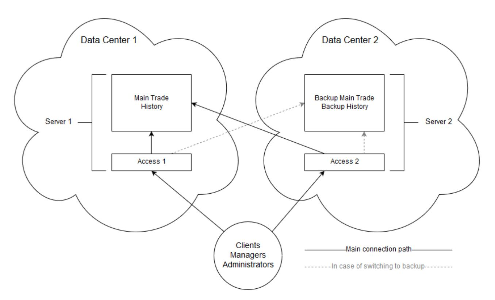

In MetaTrader 5 Administrator, the recommended configuration looks as follows:

| MetaQuotes - MetaTrader 5 Administrator                                      |                       |                   |                 |             |                |         |             |
|------------------------------------------------------------------------------|-----------------------|-------------------|-----------------|-------------|----------------|---------|-------------|
| <b>File</b>                                                                  | Edit                  | View              | <b>Services</b> | Help        |                |         |             |
| Refresh<br>Restart Server<br>Export<br>Import<br>Apply<br>Sort<br>Disconnect |                       |                   |                 |             |                |         |             |
| Administrator                                                                | Type                  | <b>Address</b>    | <b>CPU</b>      | Threads     | Memory         | Social  | Connections |
| Servers                                                                      | MetaTrader Server Dev | 14.140.80.42:1951 | 3%              | 125         | 34 157         | 91      | 7           |
|                                                                              | Trade Server          | 14.140.80.42:1952 | 2%              | 127         | 34 157         | 91      | 0           |
| Network Cluster                                                              | Access Server         | 14.140.80.42:2000 | 6%              | 87          | 34 157         | 91      | 2           |
|                                                                              |                       | 14.140.80.42:1950 | 1%              | 97°         | 34 157         | 91      | 2           |
|                                                                              | History Server        | 14.140.80.42:1953 | 3%              | 89          | 34 157         | 91      | 8           |
|                                                                              | Backup Server         | 14.140.80.42:1954 | 4%              | 29          | 34 157         | 91      |             |
|                                                                              |                       | 14.140.80.42:1955 | 3%              | 37          | 34 157         | 91      |             |
| Trade Server                                                                 |                       |                   |                 |             |                |         |             |
|                                                                              |                       |                   |                 |             |                |         |             |
| Access Point 1                                                               |                       |                   |                 |             |                |         |             |
| Access Point 2                                                               |                       |                   |                 |             |                |         |             |
| <b>Integrations</b>                                                          | Overview<br>Nodes     | CPU<br>Memory     |                 | Connections | <b>Traffic</b> | Latency | Network     |
| 1055 / 0 Kb<br>For Help, press F1                                            |                       |                   |                 |             |                |         |             |

It is highly recommended to installthe history server close to trades servers in order to avoid delays when delivering quotes and sending trading operations to external systems through gateways.

## <span id="page-17-0"></span>**Preparing Windows for platform installation**

An important issue which directly affects the trading platform security and stability, is the configuration and optimization of your computer with the operating system.

This section covers the basic system preparation steps. However, please note that these are only recommendations. Use them at your own discretion and depending on your specific conditions and needs. After completing the configuration, please restart the server for the changes to take effect.

## **Configuring system updates**

In the control panel, enable automatic downloading of updates with manual confirmation of installation. The fully automated mode is not recommended as Windows does not allow the selection of the day on which updates should be installed. We recommend installing the updates on weekends, when the server load is minimal.

| Note: | Make sure to install all operating system updates, before installing the platform. |
|-------|------------------------------------------------------------------------------------|
|-------|------------------------------------------------------------------------------------|

#### **Disabling server roles**

Disable unnecessary server roles using the Server Manager. Run the Manager from the Administration section and complete all steps by clicking Next, until you see the list of server roles.

If any of the roles are active, select these roles and select Next. Skip the next step, where system components are configured, by clicking Next. At the confirmation step, check the list of roles to be removed and click Remove.

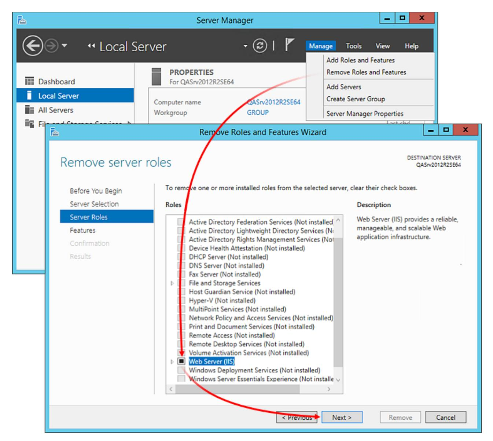

### **Graphical interface**

First, it is recommended to configure a graphical user interface of the operating system. Disable anti-aliasing, shadows, menus, transition effects, etc. These settings provide faster operation with the server when using remote access.

Additionally, it is recommended to set a blank page as the home page in the internet browser properties.

## **Disable time synchronization**

Time synchronization on the server where the platform is installed must only be performed by the MetaTrader 5 main trade server. Windows Time sync service must be disabled.

The built-in MetaTrader 5 time sync service verifies and corrects time (if necessary) once an hour. Its settings are specified under the [Time](#page-214-0) section.

To disable time synchronization in the operating system, open the Date and Time section in the control panel. Navigate to the Internet Time tab, enter 127.0.0.1 in the Server box and uncheck the box next to automatic sync.

| Label                                                                          | Value                                                                      |
|--------------------------------------------------------------------------------|----------------------------------------------------------------------------|
| 雷                                                                              |                                                                            |
| Date and Time                                                                  |                                                                            |
|                                                                                | <b>Internet Time</b><br><b>Additional Clocks</b>                           |
| This computer is set to automatically synchronize with<br>'time.windows.com'.  |                                                                            |
| <b>This computer is set to automatically synchronize on a scheduled basis.</b> |                                                                            |
| <button>Change settings...</button>                                            |                                                                            |
|                                                                                | <b>Internet Time Settings</b>                                              |
|                                                                                | Configure Internet time settings:                                          |
|                                                                                | <input type="checkbox"/> Synchronize with an Internet time server          |
|                                                                                | <input type="text" value="127.0.0.1"/> Server: <button>Update now</button> |
| <button>Cancel</button> <button>OK</button>                                    |                                                                            |

If the **Time synchronization with** parameter is empty in platform time [settings](#page-214-0), the Windows Time service will be automatically disabled in the operating system when you start MetaTrader 5 servers.

## <span id="page-20-0"></span>**Configuring network connections**

Right-click on an active network connection and select Properties.

| φ                     | Ethernet Status                                                                                                                                                                                                     |
|-----------------------|---------------------------------------------------------------------------------------------------------------------------------------------------------------------------------------------------------------------|
| General<br>Connection |                                                                                                                                                                                                                     |
| IPv4 Connectivity:    | x<br>ψ<br><b>Ethernet Properties</b>                                                                                                                                                                                |
| IPv6 Connectivity:    |                                                                                                                                                                                                                     |
| Media State:          | Networking                                                                                                                                                                                                          |
| Duration:             | Connect using:                                                                                                                                                                                                      |
| Speed:<br>Details     | XenServer PV Network Device #0                                                                                                                                                                                      |
|                       | x<br>φ<br><b>Ethernet Properties</b><br>This connection uses the following items:                                                                                                                                   |
| <b>Activity</b>       | <b>D D</b> <sub>T</sub> Client for Microsoft Networks<br>Networking<br>□ ■ File and Printer Sharing for Microso<br>Connect using:<br>□ ■ QoS Packet Scheduler                                                       |
| Bytes:                | Microsoft Network Adapter Multiple<br>XenServer PV Network Device #0<br>Link-Layer Topology Discovery Ma                                                                                                            |
| <b>Properties</b>     | □ ▲ Link-Layer Topology Discovery Re<br>Configure<br>Internet Protocol Version 6 TCP/I<br>This connection uses the following items:<br>Internet Protocol Version 4/TCP/I<br>Link-Layer Topology Discovery Responder |
|                       | Link-Layer Topology Discovery Mapper I/O Driver<br>$install$<br>Uninstall<br>Internet Protocol Version 6 (TCP/IPv6)                                                                                                 |
|                       | Description<br>Internet Protocol Version 4 (TCP/IPv4)<br>Allows your computer to access resour<br>network.                                                                                                          |
|                       | $install$<br>Uninstall<br>Properties<br>Description<br>Allows your computer to access resources on a Microsoft                                                                                                      |
|                       | network.                                                                                                                                                                                                            |
|                       | OK.<br>Cancel                                                                                                                                                                                                       |

In the Networking tab, remove all components except TCP/IP v4, TCP/IP v6 and Link-Layer Topology Discovery\*. The latter protocols will assist with the setup of routing.

#### **Removing unnecessary programs**

Remove all unnecessary programs which can slow down the trading platform or negatively affect its security, such as:

- ·Web server (Internet Information Server, Apache, etc.)
- ·Mail server, DNS server, SNMP, etc.
- ·Databases (Oracle, MSSQL, and others)
- ·Various development environments (IDE), compilers
- ·Environments .NET and Java
- · Various control agents from the server manufacturer; usually this is a whole set of default programs designed for remote server monitoring.

Run the Add/Remove Programs wizard. Go to Programs and Features and uninstall all unnecessary programs. Remove programs at your discretion, depending on your needs and resource efficiency.

## <span id="page-22-0"></span>**Configuring Windows firewall**

The Platform installer (also used for fast deployment) automatically adds permissions for the required applications in Windows firewall.

If your platform configuration requires an additional port, navigate to Control Panel—Windows Firewall— Advanced settings. Create a new inbound rule and select the following:

- ·Program — if you want to allow connections for a specific application, such as a gateway.
- ·Port — if you want to open specific ports regardless of the application.

| 顣                                           | Windows Firewall with Advanced Security                          |
|---------------------------------------------|------------------------------------------------------------------|
|                                             |                                                                  |
| Action View<br>File<br>Help                 |                                                                  |
| $\vert$ ?<br>屙                              | 扉                                                                |
| Windows Firewall with Adv.                  | <b>Inbound Rules</b><br><b>Actions</b>                           |
| Inbound Rules<br><b>Outbound Rules</b>      | <b>Name</b><br>Α<br><b>Inbound Rules</b>                         |
| <b>Connection Security Ru</b>               | $\sqrt{443}$<br>New Rule<br><b>STRA</b><br>MetaTrader 5 S        |
| W                                           | New Inbound Rule Wizard                                          |
| <b>Rule Type</b>                            |                                                                  |
| Select the type of firewall rule to create. |                                                                  |
| Steps:                                      |                                                                  |
| Rule Type                                   | What type of rule would you like to create?                      |
| <b>Protocol and Ports</b>                   |                                                                  |
| Action                                      | Program<br>Ω                                                     |
| • Profile                                   | Rule that controls connections for a program.                    |
| Name                                        | ● Port                                                           |
|                                             | Rule that controls connections for a TCP or UDP port.            |
|                                             | Predefined:                                                      |
|                                             | BranchCache - Content Retrieval (Uses HTTP)<br>$\lambda_{\rm B}$ |
|                                             | Rule that controls connections for a Windows experience.         |
|                                             | Custom<br>Custom rule.                                           |

| ₩                                                           | x<br>New Inbound Rule Wizard                                                                                                                                                                   |  |  |  |
|-------------------------------------------------------------|------------------------------------------------------------------------------------------------------------------------------------------------------------------------------------------------|--|--|--|
| <b>Protocol and Ports</b>                                   |                                                                                                                                                                                                |  |  |  |
| Specify the protocols and ports to which this rule applies. |                                                                                                                                                                                                |  |  |  |
| Steps:                                                      |                                                                                                                                                                                                |  |  |  |
| <b>Rule Type</b>                                            | Does this rule apply to TCP or UDP?                                                                                                                                                            |  |  |  |
| <b>Protocol and Ports</b>                                   | • TCP                                                                                                                                                                                          |  |  |  |
| Action                                                      | ○ UDP                                                                                                                                                                                          |  |  |  |
| Profile                                                     |                                                                                                                                                                                                |  |  |  |
| <b>Name</b>                                                 | Does this rule apply to all local ports or specific local ports?                                                                                                                               |  |  |  |
|                                                             | All local ports                                                                                                                                                                                |  |  |  |
|                                                             | Specific local ports:<br>5000                                                                                                                                                                  |  |  |  |
|                                                             | Example: 80, 443, 5000-5010                                                                                                                                                                    |  |  |  |
| ◌                                                           | x.<br>New Inbound Rule Wizard                                                                                                                                                                  |  |  |  |
| <b>Action</b>                                               |                                                                                                                                                                                                |  |  |  |
|                                                             | Specify the action to be taken when a connection matches the conditions specified in the rule.                                                                                                 |  |  |  |
| Steps:                                                      |                                                                                                                                                                                                |  |  |  |
| Rule Type                                                   | What action should be taken when a connection matches the specified conditions?                                                                                                                |  |  |  |
| <b>Protocol and Ports</b>                                   |                                                                                                                                                                                                |  |  |  |
| Action                                                      | Allow the connection                                                                                                                                                                           |  |  |  |
| Profile                                                     | This includes connections that are protected with IPsec as well as those that are not.                                                                                                         |  |  |  |
| • Name                                                      | Allow the connection if it is secure                                                                                                                                                           |  |  |  |
|                                                             | This includes only connections that have been authenticated by using IPsec. Connections will be secured using the settings in IPsec properties and rules in the Connection Security Rule node. |  |  |  |
|                                                             | Customize.                                                                                                                                                                                     |  |  |  |

Next, specify the port number and select "Allow the connection":

Next, depending on your computer location, specify the profile for which the rule shall apply: domain, private network or public network. In the last step, specify a name for the rule.

For each component of the platform, the list of ports that should be allowed is different:

#### **Access server**

| Ports for outgoing connections                   | Reason                                                                                                                                                     |
|--------------------------------------------------|------------------------------------------------------------------------------------------------------------------------------------------------------------|
| Ports on which trading servers are running.      | Access servers forward client connections to trade servers. For the main trade, the configuration files are additionally updated and time is synchronized. |
| The port on which the history server is running. | Receiving news, updates and quotes.                                                                                                                        |
| Port 443.                                        | Connection to MetaQuotes' Updates server (https://updates.metaquotes.net).                                                                                 |

| Ports for incoming connections                            | Reason                                                 |
|-----------------------------------------------------------|--------------------------------------------------------|
| Ports on which the access server is running<br>(Bindings) | These ports will listen to receive client connections. |

#### **Backup server**

| Ports for outgoing connections                   | Reason                                                                                                 |
|--------------------------------------------------|--------------------------------------------------------------------------------------------------------|
| Main trade server port.                          | Configuration file updates and time synchronization are performed through the main server.             |
| Port of the server being reserved.               | Backing up server information.                                                                         |
| The port on which the history server is running. | Receiving updates.                                                                                     |
| Ports on which gateways are running.             | Backing up gateway data.                                                                               |
| Port 443.                                        | Connection to MetaQuotes' Updates server (https://updates.metaquotes.net).                             |
| Access server ports                              | Monitoring the availability of the backup server if automatic switch to the backups server is enabled. |

#### **Trade server**

| Ports for outgoing connections                   | Reason                                                                                       |
|--------------------------------------------------|----------------------------------------------------------------------------------------------|
| Port 25.                                         | Sending reports to the mail server.                                                          |
| Port 37.                                         | Time synchronization by the TIME protocol (for the main server).                             |
| Port 123.                                        | Time synchronization by the NTP protocol (for the main server).                              |
| Main trade server port.                          | Receiving configuration files and synchronizing time (for non-main servers).                 |
| The port on which the history server is running. | Receiving quotes and updates.                                                                |
| Ports on which gateways are running.             | Working with gateways: receiving quotes, trading.                                            |
| Port 443.                                        | Connection to MetaQuotes' Updates server (https://updates.metaquotes.net).                   |
| Ports for incoming connections                   | Reason                                                                                       |
| The port on which the trade server is operating. | For the main server, this port is required for connecting all other components. For non-main |

| Header1 | servers, it is required for connecting access servers. |
|---------|--------------------------------------------------------|
|---------|--------------------------------------------------------|

#### **History server**

| Ports for outgoing connections                    | Reason                                                                                                                                                                                                                         |
|---------------------------------------------------|--------------------------------------------------------------------------------------------------------------------------------------------------------------------------------------------------------------------------------|
| Port 443.                                         | Connection to MetaQuotes' Updates server (https://updates.metaquotes.net).                                                                                                                                                     |
| Main trade server port.                           | Receiving configuration files and synchronizing time.                                                                                                                                                                          |
| Ports on which data feeds are running.            | Ports for data feeds connecting to remote servers.<br>For example, MetaTrader4Feeder (port 443 is used by default), MetaTrader5Feeder (port 443 is used by default) and TCNewsFeeder (FTP ports 20 or 21 are used by default). |
| Ports on which the remote data feeds are running. | Port numbers depend on the connected data sources.                                                                                                                                                                             |
| Ports for incoming connections                    | Reason                                                                                                                                                                                                                         |

| Ports for incoming connections                   | Reason                                                                                                                                                           |
|--------------------------------------------------|------------------------------------------------------------------------------------------------------------------------------------------------------------------|
| The port on which the history server is running. | This port is required for connecting other components of the platform                                                                                            |
| Ports on which data feeds are running.           | Ports, on which data sources accepting external connections from remote servers are running. For example, DJPrimeTassNewsFeeder (port 20000 is used by default). |

## **Disabling sounds**

Sound notifications will not be used on the server where the trading server is installed, and thus they should be disabled. Open Sounds in Control Panel:

| Sound                                                                                                                                                   | x |
|---------------------------------------------------------------------------------------------------------------------------------------------------------|---|
| Sounds<br>Recording<br>Playback<br>Communications                                                                                                       |   |
| A sound theme is a set of sounds applied to events in Windows and programs. You can select an existing scheme or save one you have modified.            |   |
| Sound Scheme:                                                                                                                                           |   |
| <b>Windows Default</b><br>Save As...<br>Delete                                                                                                          |   |
| No Sounds<br>event in the following list and<br>Windows Default<br>supply. Tourtuh save the changes as a new<br>sound scheme.<br><b>Program Events:</b> |   |
| <b>E</b> Windows<br>Asterisk<br>Calendar Reminder<br>Close Program<br>Critical Battery Alarm<br>Critical Stop                                           |   |
| Play Windows Startup sound                                                                                                                              |   |
| Sounds:<br>(None)<br><button>▶ Test</button><br>Browse...                                                                                               |   |
| <button>Cancel</button><br><button>OK</button><br><button>Apply</button>                                                                                |   |

In the list of sound schemes, select No Sound and click OK.

### **Setting general performance parameters**

Open the Control Panel, then System—System Properties—Advanced—Performance Options. On the **Visual Effects** tab, select **Adjust for best performance**:

| <b>System Properties</b>                                                |                                                                                                                                                                                                                                                                                                                                                                                                                                                                                                                                                                                                          |
|-------------------------------------------------------------------------|----------------------------------------------------------------------------------------------------------------------------------------------------------------------------------------------------------------------------------------------------------------------------------------------------------------------------------------------------------------------------------------------------------------------------------------------------------------------------------------------------------------------------------------------------------------------------------------------------------|
| Computer Name, Hardware, Advanced, Remote                               |                                                                                                                                                                                                                                                                                                                                                                                                                                                                                                                                                                                                          |
| You must be logged on as an Administrator to make most of these changes |                                                                                                                                                                                                                                                                                                                                                                                                                                                                                                                                                                                                          |
| Performance                                                             | Visual effects, processor scheduling, memory usage, and virtual memory                                                                                                                                                                                                                                                                                                                                                                                                                                                                                                                                   |
| Settings                                                                |                                                                                                                                                                                                                                                                                                                                                                                                                                                                                                                                                                                                          |
| User Profiles                                                           | Desktop settings related to your sign-in                                                                                                                                                                                                                                                                                                                                                                                                                                                                                                                                                                 |
| Startup and Recovery                                                    | System startup, system failure, and debugging information                                                                                                                                                                                                                                                                                                                                                                                                                                                                                                                                                |
| Environment Variables                                                   |                                                                                                                                                                                                                                                                                                                                                                                                                                                                                                                                                                                                          |
| Buttons                                                                 | <button>OK</button> <button>Cancel</button> <button>Apply</button>                                                                                                                                                                                                                                                                                                                                                                                                                                                                                                                                       |
| Performance Options                                                     | <p>Select the settings you want to use for the appearance and performance of Windows on this computer.</p> <ul> <li><input checked="" type="radio"/> Let Windows choose what's best for my computer</li> <li><input type="radio"/> Adjust for best appearance</li> <li><input type="radio"/> Adjust for best performance</li> </ul> <div> <label><input type="checkbox"/> Animate controls and elements inside windows</label><br/> <label><input type="checkbox"/> Animate windows when minimizing and maximizing</label><br/> <label><input type="checkbox"/> Animations in the taskbar</label> </div> |
| Desktop settings related to your sign-in                                | <label><input type="checkbox"/> Animate controls and elements inside windows</label><br><label><input type="checkbox"/> Animate windows when minimizing and maximizing</label><br><label><input type="checkbox"/> Animations in the taskbar</label>                                                                                                                                                                                                                                                                                                                                                      |
| Startup and Recovery                                                    | <label><input type="checkbox"/> System startup, system failure, and debugging information</label><br><label><input type="checkbox"/> Fade or slide menus into view</label><br><label><input type="checkbox"/> Fade or slide ToolTips into view</label><br><label><input type="checkbox"/> Fade out menu items after clicking</label><br><label><input type="checkbox"/> Save taskbar thumbnail previews</label><br><label><input type="checkbox"/> Show shadows under mouse pointer</label>                                                                                                              |
| Environment Variables                                                   | Show shadows under windows<br>Show thumbnails instead of icons<br>Show translucent selection rectangle<br>Show window contents while dragging<br>Slide open combo boxes<br>Smooth edges of screen fonts                                                                                                                                                                                                                                                                                                                                                                                                  |
|                                                                         | Smooth-scroll list boxes<br>Use drop shadows for icon labels on the desktop                                                                                                                                                                                                                                                                                                                                                                                                                                                                                                                              |

Navigate to the **Advanced** tab, click **Change...** , and set the initial paging file size to the maximum value.

| x<br>Performance Options                                                                                                                                                                                                                                                                                                                                                                          | x<br><b>Virtual Memory</b>                                                                                                                                                                                                                                                                                                                                                                                                                                                                                                        |
|---------------------------------------------------------------------------------------------------------------------------------------------------------------------------------------------------------------------------------------------------------------------------------------------------------------------------------------------------------------------------------------------------|-----------------------------------------------------------------------------------------------------------------------------------------------------------------------------------------------------------------------------------------------------------------------------------------------------------------------------------------------------------------------------------------------------------------------------------------------------------------------------------------------------------------------------------|
| Advanced<br><b>Visual Effects</b><br>Data Execution Prevention<br>Processor scheduling<br>Choose how to allocate processor resources.<br>Adjust for best performance of:<br><b>Background services</b><br>$igcirc$ Programs<br>Virtual memory<br>A paging file is an area on the hard disk that Windows uses as<br>if it were RAM.<br>Total paging file size for all drives:<br>704 MB<br>Change | Automatically manage paging file size for all drives<br>Paging file size for each drive<br>Paging File Size (MB)<br>Drive [Volume Label]<br>C:<br>System managed<br>Selected drive:<br>C:<br>Space available:<br>35344 MB<br>Custom size:<br>4096<br>Initial size (MB):<br>4096<br>Maximum size (MB):<br>$igcirc$ System managed size<br>No paging file<br>Set<br>Total paging file size for all drives<br>Minimum allowed:<br><b>16 MB</b><br>Recommended:<br>3579 MB<br>Currently allocated: 704 MB<br>Cancel<br><b>OK</b><br> |
| OK<br>Cancel<br>Apply                                                                                                                                                                                                                                                                                                                                                                             |                                                                                                                                                                                                                                                                                                                                                                                                                                                                                                                                   |

Return to the System Properties—Advanced dialog and go to the Startup and Recovery settings:

| <b>System Properties</b>                           |                                                                |
|----------------------------------------------------|----------------------------------------------------------------|
| Advanced                                           |                                                                |
| Hardware                                           |                                                                |
| Computer Name                                      |                                                                |
| Remote                                             |                                                                |
| System startup                                     | Default operating system:<br>Windows Server 2012 R2            |
|                                                    | Time to display list of operating systems:<br>0<br>seconds     |
|                                                    | Time to display recovery options when needed:<br>30<br>seconds |
| You must be logged on as an Administrator to make  |                                                                |
|                                                    | Performance                                                    |
|                                                    | Visual effects, processor scheduling, memory usage             |
| System failure                                     | Write an event to the system log                               |
|                                                    | Automatically restart                                          |
|                                                    | Write debugging information                                    |
|                                                    | Automatic memory dump                                          |
| <b>User Profiles</b>                               |                                                                |
|                                                    | Desktop settings related to your sign-in                       |
|                                                    | Startup and Recovery                                           |
|                                                    | (none)                                                         |
|                                                    | Small memory dump (256 KB)                                     |
|                                                    | Kernel memory dump                                             |
|                                                    | Complete memory dump                                           |
|                                                    | Automatic memory dump                                          |
|                                                    | OK                                                             |
|                                                    | Cancel                                                         |
| System startup, system failure, and debugging info |                                                                |
|                                                    | <b>OK</b>                                                      |
|                                                    | Settings                                                       |
|                                                    | Environment Variables                                          |
|                                                    | Cancel                                                         |
|                                                    | Apply                                                          |

Disable the **Display List of Operating Systems** option. In the **Write Debugging Information** item, select **None**.

From the control panel, navigate to Hardware—Power Options. Select maximum performance mode:

| Label                               | Value                                                                                                                                                                                                             |
|-------------------------------------|-------------------------------------------------------------------------------------------------------------------------------------------------------------------------------------------------------------------|
| Control Panel Home                  | Choose what the power button does                                                                                                                                                                                 |
|                                     | Choose or customize a power plan<br>A power plan is a collection of hardware and system settings (like display brightness, sleep, etc.) that manages how your computer uses power. Tell me more about power plans |
| Create a power plan                 | Preferred plans                                                                                                                                                                                                   |
| Choose when to turn off the display | <b>Balanced (recommended)</b><br>Change plan settings<br>Automatically balances performance with energy consumption on capable hardware.                                                                          |
|                                     | ◉ High performance<br>Change plan settings                                                                                                                                                                        |
|                                     | Favors performance, but may use more energy.                                                                                                                                                                      |
|                                     | Hide additional plans                                                                                                                                                                                             |
|                                     | Power saver<br>Change plan settings                                                                                                                                                                               |
|                                     | Saves energy by reducing your computer's performance where possible.                                                                                                                                              |
|                                     | See also                                                                                                                                                                                                          |
| <b>User Accounts</b>                |                                                                                                                                                                                                                   |

## **Configuring file deletion without moving them to the recycle bin.**

To delete files immediately, without moving to the recycle bin, select **Properties** in its context menu. Select "Don't move files to the Recycle Bin. Remove files immediately when deleted":

| Recycle Bin Properties                  | x                                                                                |
|-----------------------------------------|----------------------------------------------------------------------------------|
| General                                 |                                                                                  |
| Recycle Bin Location                    | Space Available                                                                  |
| Local Disk (C:)<br>49.6 GB              |                                                                                  |
| Settings for selected location          |                                                                                  |
| 4CB; Custom size:<br>Maximum size (MB): | 4590                                                                             |
|                                         | 4CB; Don't move files to the Recycle Bin. Remove files immediately when deleted. |
| Display delete confirmation dialog      |                                                                                  |
| Buttons                                 | Cancel<br>OK<br>Apply                                                            |

#### **Configuring remote access**

Please keep the server remote access details in a safe place and do not share it with anyone without special need.

**Blocking RDP access with blank password.** Accounts for which no password is specified must not be able to remotely connect to the server.

Open Control Panel—Administration—Local Policies—Security options. Enable the option "Accounts: Limit local account use of blank passwords to console logon only".

| Policy                                                                   | Security Setting         |
|--------------------------------------------------------------------------|--------------------------|
| Account Policies                                                         | Block Microsoft accounts |
| Accounts: Guest account status                                           | Disabled                 |
| Accounts: Limit local account use of blank passwords to logon            | Enabled                  |
| Accounts: Rename administrator account                                   | Администратор            |
| Accounts: Rename guest account                                           | Гость                    |
| Audit: Audit the access of global system objects                         | Disabled                 |
| Audit: Audit the use of Backup and Restore privilege                     | Disabled                 |
| Audit: Force audit policy subcategory settings (Windows Vista and later) | Not Defined              |
| Audit: Shut down system immediately if unable to log security audits     | Disabled                 |
| DCOM: Machine Access Restrictions in Security Descriptor                 | Not Defined              |
| DCOM: Machine Launch Restrictions in Security Descriptor                 | Not Defined              |

**Changing standard port for remote connections.** To protect the server from attacks targeting "well-know" ports, we recommend changing the port for Desktop Protocol. Open regedit, go to

HKEY\_LOCAL\_MACHINE\SYSTEM\CurrentControlSet\Control\Terminal Server\WinStations\RDP-Tcp and find the **Port Number** parameter. Double click on it, select Decimal base and specify the desired port.

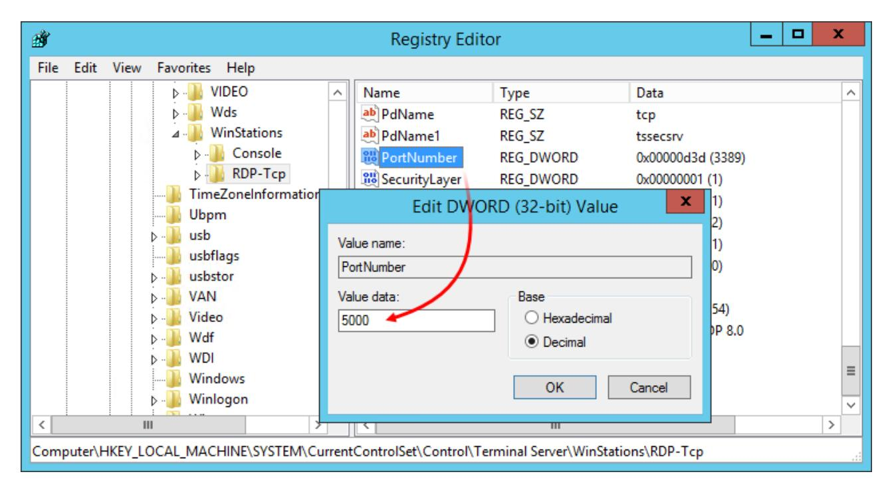

- ·The specified port must be allowed in [Windows](#page-22-0) firewall.
- · To connect to the server remotely, specify the new port after the IP address separated by a colon. For example, 10.59.162.3:5000.

**Limiting the list of IP addresses for remote connection.** As an additional security measure, you can restrict the list of IP addresses which can be used to remotely connect to the server. For example, you can allow connections only from your office addresses.

Open Windows Firewall and find Remote Desktop—User Mode (TCP-In) in the list of inbound rules. There may be several such rules depending on the number of network profiles. Open the one you need and go to the **Scope** tab. In the **Remote IP** address section, select "These IP addresses" and add the necessary ones to the list:

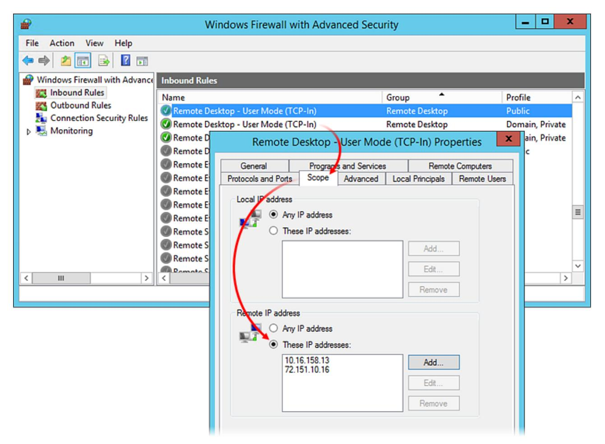

## **Configuring antivirus software**

If antivirus software is used on your server, add to its exclusions the system processes of the MetaTrader 5 platform along with its installation directory. Constant monitoring by antivirus software reduces platform performance.

Here is an example of adding exclusions in Windows Defender, which is a built-in antivirus software used on Windows Server 2016. Open Windows Settings—Updates and Security—Windows Defender. Go to Exclusions and select **Add an exclusion**.

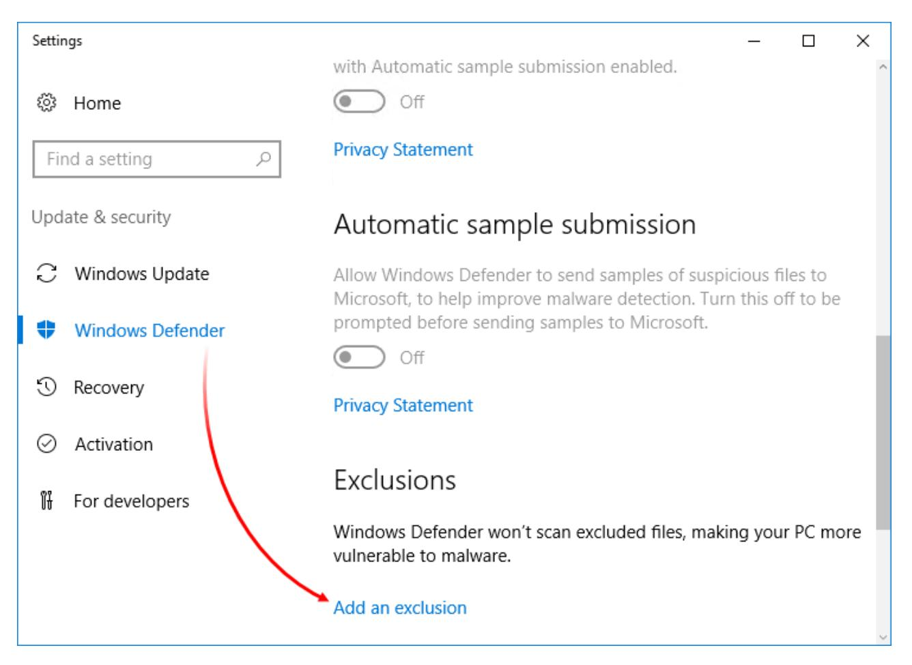

#### Select **Exclude folder** and specify the platform installation directory

| Settings | Add an exclusion |
|----------|------------------|
|----------|------------------|

Files and folders

| + Exclude a file           |                                                                                                                                                                                                                                                                                                                                                                                                                                                                                                                                                                                                                                                                                                                      |             |             |             |             |           |       |  |  |  |  |  |  |                   |             |             |             |             |             |                   |  |  |  |  |  |                   |  |  |  |  |  |                    |  |  |  |  |  |                    |  |  |  |  |  |
|----------------------------|----------------------------------------------------------------------------------------------------------------------------------------------------------------------------------------------------------------------------------------------------------------------------------------------------------------------------------------------------------------------------------------------------------------------------------------------------------------------------------------------------------------------------------------------------------------------------------------------------------------------------------------------------------------------------------------------------------------------|-------------|-------------|-------------|-------------|-----------|-------|--|--|--|--|--|--|-------------------|-------------|-------------|-------------|-------------|-------------|-------------------|--|--|--|--|--|-------------------|--|--|--|--|--|--------------------|--|--|--|--|--|--------------------|--|--|--|--|--|
| – Exclude a folder         |                                                                                                                                                                                                                                                                                                                                                                                                                                                                                                                                                                                                                                                                                                                      |             |             |             |             |           |       |  |  |  |  |  |  |                   |             |             |             |             |             |                   |  |  |  |  |  |                   |  |  |  |  |  |                    |  |  |  |  |  |                    |  |  |  |  |  |
| Select Folder              |                                                                                                                                                                                                                                                                                                                                                                                                                                                                                                                                                                                                                                                                                                                      |             |             |             |             |           |       |  |  |  |  |  |  |                   |             |             |             |             |             |                   |  |  |  |  |  |                   |  |  |  |  |  |                    |  |  |  |  |  |                    |  |  |  |  |  |
|                            | This PC > Work (D:) > MetaTrader 5 Platform                                                                                                                                                                                                                                                                                                                                                                                                                                                                                                                                                                                                                                                                          |             |             |             |             |           |       |  |  |  |  |  |  |                   |             |             |             |             |             |                   |  |  |  |  |  |                   |  |  |  |  |  |                    |  |  |  |  |  |                    |  |  |  |  |  |
| Search                     |                                                                                                                                                                                                                                                                                                                                                                                                                                                                                                                                                                                                                                                                                                                      |             |             |             |             |           |       |  |  |  |  |  |  |                   |             |             |             |             |             |                   |  |  |  |  |  |                   |  |  |  |  |  |                    |  |  |  |  |  |                    |  |  |  |  |  |
| Organize                   | New folder                                                                                                                                                                                                                                                                                                                                                                                                                                                                                                                                                                                                                                                                                                           |             |             |             |             |           |       |  |  |  |  |  |  |                   |             |             |             |             |             |                   |  |  |  |  |  |                   |  |  |  |  |  |                    |  |  |  |  |  |                    |  |  |  |  |  |
| + Pro                      | <table> <tr> <td>Name</td> <td>Access</td> <td>Backup</td> <td>History</td> <td>MainTrade</td> <td>Trade</td> </tr> <tr> <td></td> <td></td> <td></td> <td></td> <td></td> <td></td> </tr> <tr> <td>5/23/2017 5:45 PM</td> <td>File folder</td> <td>File folder</td> <td>File folder</td> <td>File folder</td> <td>File folder</td> </tr> <tr> <td>5/23/2017 4:45 PM</td> <td></td> <td></td> <td></td> <td></td> <td></td> </tr> <tr> <td>5/23/2017 4:10 PM</td> <td></td> <td></td> <td></td> <td></td> <td></td> </tr> <tr> <td>5/24/2017 12:15 AM</td> <td></td> <td></td> <td></td> <td></td> <td></td> </tr> <tr> <td>5/24/2017 12:15 AM</td> <td></td> <td></td> <td></td> <td></td> <td></td> </tr> </table> | Name        | Access      | Backup      | History     | MainTrade | Trade |  |  |  |  |  |  | 5/23/2017 5:45 PM | File folder | File folder | File folder | File folder | File folder | 5/23/2017 4:45 PM |  |  |  |  |  | 5/23/2017 4:10 PM |  |  |  |  |  | 5/24/2017 12:15 AM |  |  |  |  |  | 5/24/2017 12:15 AM |  |  |  |  |  |
| Name                       | Access                                                                                                                                                                                                                                                                                                                                                                                                                                                                                                                                                                                                                                                                                                               | Backup      | History     | MainTrade   | Trade       |           |       |  |  |  |  |  |  |                   |             |             |             |             |             |                   |  |  |  |  |  |                   |  |  |  |  |  |                    |  |  |  |  |  |                    |  |  |  |  |  |
|                            |                                                                                                                                                                                                                                                                                                                                                                                                                                                                                                                                                                                                                                                                                                                      |             |             |             |             |           |       |  |  |  |  |  |  |                   |             |             |             |             |             |                   |  |  |  |  |  |                   |  |  |  |  |  |                    |  |  |  |  |  |                    |  |  |  |  |  |
| 5/23/2017 5:45 PM          | File folder                                                                                                                                                                                                                                                                                                                                                                                                                                                                                                                                                                                                                                                                                                          | File folder | File folder | File folder | File folder |           |       |  |  |  |  |  |  |                   |             |             |             |             |             |                   |  |  |  |  |  |                   |  |  |  |  |  |                    |  |  |  |  |  |                    |  |  |  |  |  |
| 5/23/2017 4:45 PM          |                                                                                                                                                                                                                                                                                                                                                                                                                                                                                                                                                                                                                                                                                                                      |             |             |             |             |           |       |  |  |  |  |  |  |                   |             |             |             |             |             |                   |  |  |  |  |  |                   |  |  |  |  |  |                    |  |  |  |  |  |                    |  |  |  |  |  |
| 5/23/2017 4:10 PM          |                                                                                                                                                                                                                                                                                                                                                                                                                                                                                                                                                                                                                                                                                                                      |             |             |             |             |           |       |  |  |  |  |  |  |                   |             |             |             |             |             |                   |  |  |  |  |  |                   |  |  |  |  |  |                    |  |  |  |  |  |                    |  |  |  |  |  |
| 5/24/2017 12:15 AM         |                                                                                                                                                                                                                                                                                                                                                                                                                                                                                                                                                                                                                                                                                                                      |             |             |             |             |           |       |  |  |  |  |  |  |                   |             |             |             |             |             |                   |  |  |  |  |  |                   |  |  |  |  |  |                    |  |  |  |  |  |                    |  |  |  |  |  |
| 5/24/2017 12:15 AM         |                                                                                                                                                                                                                                                                                                                                                                                                                                                                                                                                                                                                                                                                                                                      |             |             |             |             |           |       |  |  |  |  |  |  |                   |             |             |             |             |             |                   |  |  |  |  |  |                   |  |  |  |  |  |                    |  |  |  |  |  |                    |  |  |  |  |  |
| Folder:                    | MetaTrader 5 Platform                                                                                                                                                                                                                                                                                                                                                                                                                                                                                                                                                                                                                                                                                                |             |             |             |             |           |       |  |  |  |  |  |  |                   |             |             |             |             |             |                   |  |  |  |  |  |                   |  |  |  |  |  |                    |  |  |  |  |  |                    |  |  |  |  |  |
| <b>Exclude this folder</b> |                                                                                                                                                                                                                                                                                                                                                                                                                                                                                                                                                                                                                                                                                                                      |             |             |             |             |           |       |  |  |  |  |  |  |                   |             |             |             |             |             |                   |  |  |  |  |  |                   |  |  |  |  |  |                    |  |  |  |  |  |                    |  |  |  |  |  |
| Cancel                     |                                                                                                                                                                                                                                                                                                                                                                                                                                                                                                                                                                                                                                                                                                                      |             |             |             |             |           |       |  |  |  |  |  |  |                   |             |             |             |             |             |                   |  |  |  |  |  |                   |  |  |  |  |  |                    |  |  |  |  |  |                    |  |  |  |  |  |

Select "Exclude process .exe, .com or .src". Specify the name of the platform component process in the window that opens. You can specify the name of the server executable file (for example mt5trade64.exe) or the name of the process (for example mt5msrv).

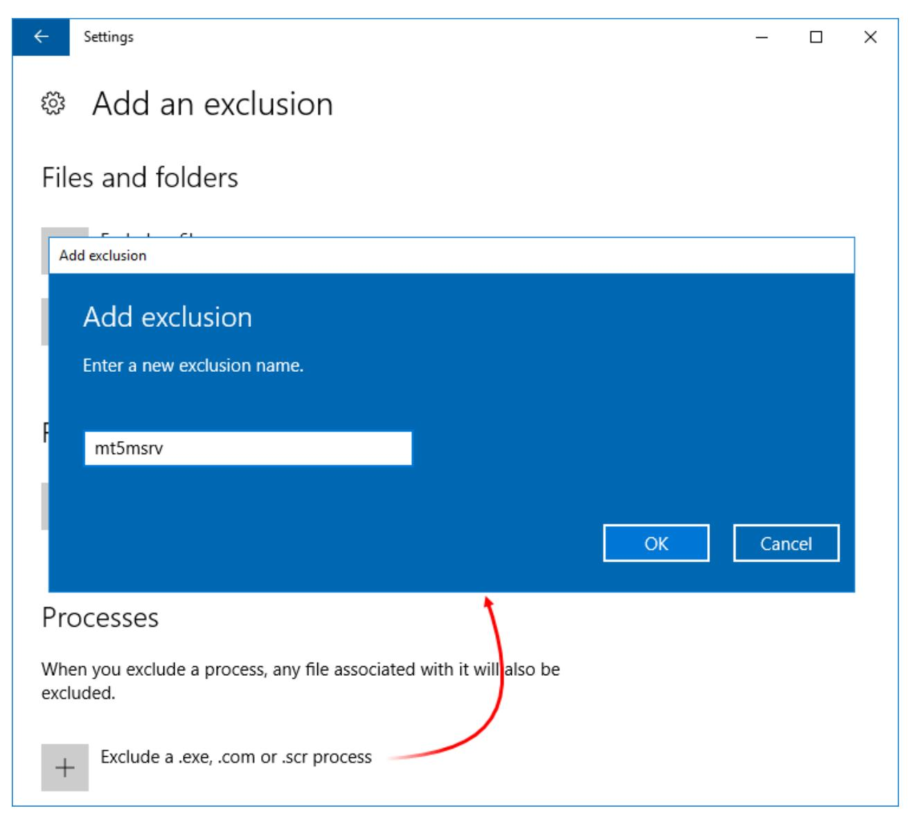

Similar exclusions should be added for all installed components of the cluster. The default names of the services are:

- ·mt5msrv for the main trade server
- ·mt5tsrv for an additionaltrade server
- ·mt5asrv for an access server
- ·mt5bsrv for a backup server
- ·mt5hsrv for a history server

If several components of the same type are installed, a digit is added to the service name. For example, mt5tsrv5. You can view the list of installed processes in the task manager.

## <span id="page-37-0"></span>**First-time platform installation**

Prior to installthe platform, you should rent servers from hosting providers, meeting system and [hardware](#page-14-0) [requirements.](#page-14-0) All [preparatory](#page-17-0) steps must be completed on these servers. You will also need a license file provided by the support team upon platform purchase.

Download an installer from App Store / Download / [MetaTrader](https://support.metaquotes.net/en/download/mt5) 5 in MetaQuotes Support Center.

#### See also: Video / [MetaTrader](https://support.metaquotes.net/en/articles/999) 5 trading platform installation

The platform installer allows you to deploy a required set of servers on one local computer, including a main trade server, its backup server, a history server, and an access server. This option should be used for the firsttime platform installation on the main server. After that, you will be able to connect to the platform using MetaTrader 5 Administrator and proceed to the installation and configuration of additional components.

Run the mt5srvsetup.exe platform installer and select **Full installation**:

| <b>MetaTrader 5 Platform Setup</b>                                                                                                                                                                                                     | ×      |        |
|----------------------------------------------------------------------------------------------------------------------------------------------------------------------------------------------------------------------------------------|--------|--------|
| MetaTrader 5                                                                                                                                                                                                                           |        |        |
| Welcome to MetaTrader 5 Platform Setup program. You can choose the full installation of all components with default settings or the installation and configuration of a separate server.                                               |        |        |
| Select the installation type:                                                                                                                                                                                                          |        |        |
| (C) Full installation (install all servers on the same computer)                                                                                                                                                                       |        |        |
| Single server (install one of the servers)                                                                                                                                                                                             |        |        |
| Online Assistant                                                                                                                                                                                                                       |        |        |
| WARNING: This program is protected by copyright law and international treaties. Unauthorized reproduction or distribution of this program, or any portion of it, may result in severe civil and criminal penalties possible under law. |        |        |
| MetaQuotes Software Corp.                                                                                                                                                                                                              |        |        |
| < Back                                                                                                                                                                                                                                 | Cancel | Next > |

Next, accept the license agreement and specify the path to the platform license file \*.lic. Information from the license will be displayed, including the product (license expiration date), the company for which the license has been issued, and the domain name.

| MetaTrader 5 Platform Setup                                                                                                                                    |                                                                  |
|----------------------------------------------------------------------------------------------------------------------------------------------------------------|------------------------------------------------------------------|
| MetaTrader 5                                                                                                                                                   |                                                                  |
| Select the destination folder where you want to install MetaTrader 5 Platform. To install to a<br>different location, click Browse, and select another folder. | Installation folder:   C: WetaTrader 5 Platform<br>Browse        |
| Select the Start Menu program group.                                                                                                                           | Program group: MetaTrader 5 Platform                             |
| Select the IP address to which you would like to bind the server components.                                                                                   | <b>IP</b> address: 192.168.1.230                                 |
| Select the TCP ports configuration profile.                                                                                                                    | Profile: Default (Public: 443, Service: 441-444)<br>$ checkmark$ |
| MetaQuotes Ltd.                                                                                                                                                | Cancel<br>Next<br>< Back                                         |

In the next step, specify the following installation parameters:

- ·**Installation folder**. Click Browse and select the directory in which the trading platform will be installed.
- · **Program group**. Specify the program group name for the trading platform; this name will be displayed in the Start menu.
- · **IP address**. Select one of the IP addresses available on the server. Connection to the platform will be established using this address.
- · **Profile**. Select one of the port profiles for connection. Range 441-444 is used by default, and port 443 will be used for public access (access server). Other ports are allocated for the trade server, history and backup servers. There are also some additional profiles. For example, the range of 1950-1953, in which port 1950 is used for the access server.
- · If all ports specified in the profiles are occupied by other applications, you should installthe platform components one by one. In this case, you can specify any other port manually.
- · FullInstallation is not possible if at least one of the ports from the selected range (profile) is busy. In this case, it does not matter which network interface is using for. The installer checks all available interfaces to prevent any network conflicts. If you receive a message about a busy port during full installation, installthe platform components one by one.

After the installation is complete, a dialog box will appear showing data for the first connection to the platform using MetaTrader 5 Administrator: a login and password for the automatically created administrator account and the address for connection.

Be sure to save this data in a safe place, otherwise you will not be able to connect to the platform without this information.

| MetaTrader 5 Platform Setup<br>×                                                         |
|------------------------------------------------------------------------------------------|
| MetaTrader 5                                                                             |
| <b>Installation progress</b>                                                             |
| Create directories                                                                       |
| Create program group                                                                     |
| <b>Extract files</b>                                                                     |
| Configuring                                                                              |
| Installation successfully completed.                                                     |
| To configure the platform, please connect to your server via MetaTrader 5 Administrator: |
| Server: 192.168.1.67:443                                                                 |
| Login: 1000                                                                              |
| Password: vsu4akbfgm                                                                     |
| MetaQuotes Software Corp.                                                                |
| < Back<br>Finish<br>Cancel                                                               |

#### **First connection to the platform and necessary actions**

During the platform installation, one administrator account with login 1000 and a random password is create. This data, along with the server address for connection, is displayed on the last step of the platform installation. Be sure to save this data in a safe place, because without it you will not be able to connect to the platform using MetaTrader 5 Administrator.

The password of the automatically created administrator account is also saved in the log file of the main trade server (the /Logs folder).

Add the newly installed platform to MetaTrader 5 Administrator, and then connect to it using the administrator account. For security reasons, you will immediately need to change your password.

See also: [Documentation](https://support.metaquotes.net/en/docs/mt5/platform/administrator/getting_started/server_connect) / Administrator / Getting started / Connect to server

In the next step, [activate](#page-54-0) licenses in order to lift allfunctional limitations of the platform.

The password generated for the first administrator account is also used by all components of the platform for internal authentication. If necessary, you can change it through the Administrator terminal, in the Network cluster / [Server name] / Common section.

## <span id="page-40-0"></span>**Installation of additional platform components**

After initial [installation,](#page-37-0) you receive a ready-to-tun trading platform. However, you should install additional components to ensure full-fledged and stable operation:

- ·Backup servers to which the platform can switch in case of primary server failure
- · Access servers in the main regions where you provide services to clients, to ensure optimal connection conditions
- ·Additionaltrading servers to reduce the load on the main trade when your customer base grows

### <span id="page-40-1"></span>**Installing additional backup servers**

Once the main platform part is installed, it is recommended to configure appropriate backup servers. The ability to ensure uninterrupted business operation is one of the main requirements set by financialregulators.

The MetaTrader 5 platform provides a separate component responsible for data security, the [backup](#page-9-0) server. It runs in parallel as an exact copy of the primary trade or history server. The backup server state is constantly synchronized with the primary server, enabling the system to switch to the backup server at any time. Furthermore, the backup process is resource efficient:

- · Critical and frequently changing data is synchronized in realtime. These include client and trade databases, platform settings, configurations and databases of gateway trade executions.
- · The rest of data is backed up every hour, including mail and news databases, files, executable files of gateways and data feeds and plugins.
  - · Always install backup servers which are the mandatory components of the platform. Trade and history servers do not create backups of databases.
  - · Multiple backup servers can be installed for each trade and history server, to minimize the risk of system failure.

During the full platform installation, a backup server is only created for the main trade server. It is installed on the same computer/disk, where the main components are installed. It only provides the minimum protection level, for example against the accidental deletion of the main server databases. However, in case of hardware failure, both the main and the backup server will be unavailable.

To ensure reliable platform operation, it is recommended to manually add backup servers for the history server, as well as for additionaltrade servers (if any). Such backup servers must be installed separately from the main servers, on separate computers.

The easiest way to install a server is to configure it in the MetaTrader 5 Administrator terminal and then to use the deployment function.

Before deploying a server, be sure to configure server network parameters: the password that will be used by other cluster components for connection to the backup server, as well as the IP addresses through which the

new server will send and receive data. Allthese parameters will be registered in the server installation package. Thus, all other cluster components will be able to connect to the backup server immediately after installation, while you will be able to manage the server via the Administrator terminal.

| Label                                                                                            | Value                                 |                |
|--------------------------------------------------------------------------------------------------|---------------------------------------|----------------|
| Server                                                                                           |                                       |                |
| Common<br>Network Backup SQL Export SQL Options Folders Service                                  |                                       |                |
| Please specify common server settings: type, name, internal identifier, and password.            |                                       |                |
| <b>Backup Server</b><br>Type:                                                                    |                                       |                |
| MetaTrader 5 Main Backup Server<br>Name:                                                         |                                       |                |
| 4<br>ID:<br>Password:                                                                            |                                       |                |
| Server                                                                                           |                                       |                |
| Network Backup SQL Export SQL Options Folders Service<br>Common                                  |                                       |                |
| Please specify network settings of the server: outgoing address, public addresses, and bindings. |                                       |                |
| The following IPv4 and IPv6 addresses are used for outgoing connections from this server.        |                                       |                |
| Address:<br>18.140.18.42:2000<br><i>✓</i>                                                        | [2a00:1111:1:20::2a]:2000             |                |
| Listen on these IP addresses                                                                     | Automatically use as public addresses |                |
| 军 18.140.18.42:2000<br>Add<br><i>℗</i>                                                           |                                       |                |
| ₩ [2a00:1111:1:20::2a]:2000<br>Edit                                                              | - [2a00:1111:1:20::2a]:2000           |                |
| <b>Delete</b>                                                                                    |                                       |                |
|                                                                                                  |                                       |                |
|                                                                                                  | ОК                                    | Help<br>Cancel |

Please make sure that network [parameters](#page-20-0) are correctly configured and that allthe [required](#page-22-0) ports are open. It is important because during deployment, an instant connection to allthe required servers of the cluster will be required.

If a MetaTrader 5 cluster component is deployed on another subnet (different from the one where the Main trade server and the History server are installed), the Main and the History servers must be accessible via the internet. Otherwise, the newly installed component will not be able to connect to them.

All other parameters can be configured after installation.

| Label                                   | Value                                                            |
|-----------------------------------------|------------------------------------------------------------------|
| MetaQuotes - MetaTrader 5 Administrator |                                                                  |
| File                                    |                                                                  |
| Edit                                    |                                                                  |
| View                                    |                                                                  |
| Services                                |                                                                  |
| Help                                    |                                                                  |
| Disconnect                              | -x                                                               |
| Restart Server                          |                                                                  |
| Export                                  | ∅ Import ∨ Apply + ⊗ ×                                           |
| Network Cluster                         | 由 - 景 Trade Main                                                 |
| Backup History                          |                                                                  |
| Traffic in                              | 0 Kbit/s                                                         |
| Traffic out                             | 0 Kbit/s                                                         |
| Automation                              | 由 ® Automation <b>⊞</b> ○ Security ˆ Time ℜ Holidays             |
| Add                                     | + Edit × Delete                                                  |
| Ctrl + N                                |                                                                  |
| Groups (6)                              | ⊕ <u>⊱</u> Clients & Export Configurations Import Configurations |
| Help                                    | For Help, press F1                                               |
| Refresh                                 | ³ F5                                                             |
| Status                                  | 6052 / 0 Kb                                                      |

After creating a configuration, run the server deployment command:

After that you willreceive an executable file. Copy it to the directory to which you want to installthe new server and then run from the command line with the /install key. For example:

D:\MetaTrader 5 Platform\Backup History\Deploy\_5\_Backup\_Server.exe /install

The file will installthe backup server with the parameters that you have specified in MetaTrader 5 Administrator.

#### Next, configure the rest backup [parameters](#page-104-0):

| Server                                      |                                                                                                     |                                         |  |  |  |  |    |        |             |
|---------------------------------------------|-----------------------------------------------------------------------------------------------------|-----------------------------------------|--|--|--|--|----|--------|-------------|
| Common                                      |                                                                                                     |                                         |  |  |  |  |    |        |             |
| Network                                     |                                                                                                     |                                         |  |  |  |  |    |        |             |
|                                             |                                                                                                     |                                         |  |  |  |  |    |        |             |
|                                             |                                                                                                     |                                         |  |  |  |  |    |        |             |
| Backup   SQL Export   SQL Options   Folders |                                                                                                     |                                         |  |  |  |  |    |        |             |
|                                             |                                                                                                     |                                         |  |  |  |  |    |        |             |
|                                             | be reserved and backup settings.                                                                    |                                         |  |  |  |  |    |        |             |
|                                             | Backup server is used for backup of trade and history servers. Please specify the name of server to |                                         |  |  |  |  |    |        |             |
|                                             |                                                                                                     |                                         |  |  |  |  |    |        |             |
|                                             | Master server:                                                                                      | Trade Main, 1                           |  |  |  |  |    |        |             |
|                                             |                                                                                                     | Use this backup server for failover     |  |  |  |  |    |        |             |
|                                             |                                                                                                     | Synchronize journals with master server |  |  |  |  |    |        |             |
|                                             |                                                                                                     | □ Enable backups                        |  |  |  |  |    |        |             |
|                                             | Backups path:                                                                                       | F: WT5Backups Main                      |  |  |  |  |    |        |             |
|                                             | Full backup time:                                                                                   | ≑ 00:17                                 |  |  |  |  |    |        |             |
|                                             | Additional backups:                                                                                 | Every hour                              |  |  |  |  |    |        |             |
|                                             |                                                                                                     | $	ick$                                  |  |  |  |  |    |        |             |
|                                             | Keep backups:                                                                                       | 1 day                                   |  |  |  |  |    |        |             |
|                                             |                                                                                                     | $	ick$                                  |  |  |  |  |    |        |             |
|                                             |                                                                                                     |                                         |  |  |  |  |    |        |             |
|                                             |                                                                                                     |                                         |  |  |  |  | OK | Cancel | <b>Help</b> |

When configuring backup server parameters, you should find balance between the frequency of backups and the available disk space on the computer where the backup server is installed:

- · **Backup time**, when file copies will be created. In addition to real-time state synchronization with the main server, the backup server creates daily database file copies on a disk. Such copies allow [restoring](#page-120-0) the primary server status as on a specific day.
- · **Additional backups**. Specify here the frequency of creation of additionalfile copies. By default, file copies are created every 24 hours, but you can set a more frequent custom period, once an hour or 4 hours. However, please note that more frequent backups require more server resources and more disk space. This option is only available for trade server backups. Backup copies of history servers are always created once every 24 hours.
- · **Keep backups** is file copies storage period. All backup copies older than the specified period are automatically deleted.
- · **Enable tick backups**. This parameter should be enabled with caution, because tick data take up too much space. If you choose to back up tick data, set short copy storing period so that they do not consume allthe available disk space.
- · Repeat the procedure and install backup servers for other platform components, including the history server and all other trade servers. Install backup servers separately from the primary servers, on separate computers.
- · Install assess servers close to the backup ones. These access servers will be used for client connections in case the platform switches to the backup servers.

### <span id="page-44-0"></span>**Additional access servers**

It is recommended to install additional access servers in order to improve system performance and reliability. Access servers process client connections, cache data, and protect the platform from DDOS attacks. They also monitor the availability of the trade and history servers to enable the operation of the [automatic](#page-115-0) failover [system.](#page-115-0)

Connection to the entire trading platform is only available through access servers. If you decide to use one server and it fails, neither administrators nor traders will be available to connect to the platform. In addition, the entire connection processing load will be handled by one server, which can negatively affect the system performance.

Access servers can be installed using the previously described [deployment](#page-40-1) procedure.

See also: Video / How to install an [additional](https://support.metaquotes.net/en/articles/1015) access server

We recommend installing several access servers on separate computers. The platform analyzes the current load on each server and effectively distributes client connections between them.

#### **Priority settings**

After installation, configure the rest of the server parameters under the [Network](#page-57-0) cluster section.

The preference of an access server for connecting client terminals to the trade server is determined by the server priority and the connection quality. The lower the priority value, the more preferred the server is for clients. The base priority (from 1 to 15) can be specified in server settings, which determines server preference when all other conditions are equal.

| Server                                                                                                                                       |                     |                       |
|----------------------------------------------------------------------------------------------------------------------------------------------|---------------------|-----------------------|
| Access server is used as access point for connection of clients to trade server. Please specify its priority and antiflood control settings. |                     |                       |
| Priority:                                                                                                                                    | 9                   |                       |
| ◡                                                                                                                                            |                     |                       |
| <input checked="" type="checkbox"/> Enable antiflood control                                                                                 |                     |                       |
| Connections:                                                                                                                                 | 100                 |                       |
| Errors:                                                                                                                                      | 10                  |                       |
| Maximum news:                                                                                                                                | 16384               |                       |
| √ Use this server for monitoring the cluster and failover                                                                                    |                     |                       |
|                                                                                                                                              |                     |                       |
|                                                                                                                                              |                     |                       |
| <button>Cancel</button>                                                                                                                      | <button>OK</button> | <button>Help</button> |

The final analysis of the access server concerns the connection quality (ping) and the current priority, which depends on the base priority and the number of current connections. Server connection quality is shown in client, manager and administrator terminals based on the same data.

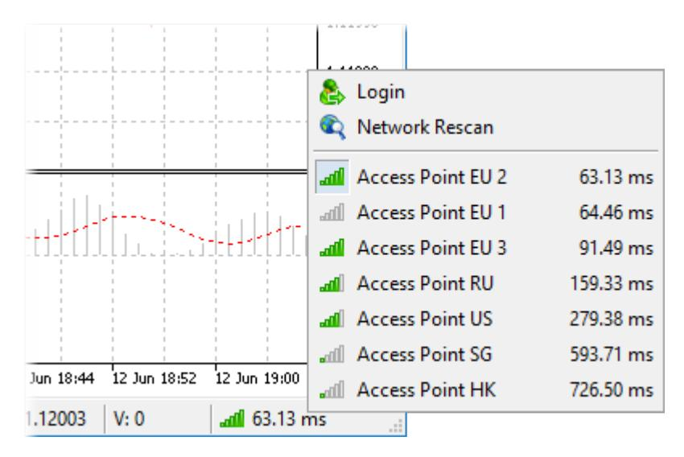

The current priority is calculated using the following formula: *Current Priority = (Base Priority + Connections / 1000)*,

where:

- ·**Current Priority** is the current server priority
- ·**Base Priority** is the base priority specified in server settings
- ·**Connections** is the number of current connections

Every 1000 client connections increase the server's current priority by one. The current priority of the access servers can be viewed in the **Network Cluster** section.

#### **Service setup**

In the **Permissions** and **Servers** sections, specify parameters of connections through the access server.

| Server |                                                                                                           |                                                                       |                                    |                                                                       |                               |                            |
|--------|-----------------------------------------------------------------------------------------------------------|-----------------------------------------------------------------------|------------------------------------|-----------------------------------------------------------------------|-------------------------------|----------------------------|
|        | Please specify trade servers the connection to which will be performed through this access or web server. |                                                                       |                                    |                                                                       |                               |                            |
|        | Trade Main<br>Trade Server                                                                              |                                                                       |                                    |                                                                       |                               |                            |
|        | Server                                                                                                    |                                                                       |                                    | 3                                                                    |                               |                            |
|        |                                                                                                           | Allow Client Terminal connections                                    | Allow Manager Terminal connections | Allow Administrator Terminal connections                             | Allow Manager API connections | Allow Web API connections |
|        |                                                                                                           | Please specify the types of connection allowed at this access server. |                                    |                                                                       |                               |                            |
|        |                                                                                                           | Select All                                                           | Select None                       | Hide server from all types of terminals (connections will be allowed) |                               |                            |
|        |                                                                                                           |                                                                       |                                    |                                                                       |                               |                            |
|        |                                                                                                           |                                                                       |                                    |                                                                       |                               |                            |

In Permissions, specify connection types allowed for the access server:

- ·**Allow Client Terminal connections**. Client terminals are allowed to connect to this access point.
- ·**Allow Manager Terminal connections**. Manager terminals are allowed to connect to this access point.
- · **Allow Administrator Terminal connections**. Administrator terminals are allowed to connect to this access point.
- · **Allow Manager API connections**. Applications written using [Manager](https://support.metaquotes.net/en/docs/mt5/api/managerapi) API are allowed to connect to this access point.
- · **Allow Web API connections**. Applications written using [Web](https://support.metaquotes.net/en/docs/mt5/api/webapi) API are allowed to connect to this access point.

In the **Servers** section, select the trade servers to which users will connect through the selected access server.

#### **Additional trade servers**

As the company grows and the number of active clients increases, you can install additionaltrade servers in order to remove some load from the main server. It is recommended to install an additionaltrade server in the same data center, where the main and history servers are located. Trade servers should not be located far from the history server, in order to avoid delays when delivering quotes and sending trading operations to external systems through gateways.

After the installation of an additionaltrade server, it is recommended to install its backup server in a different data center, where the backup servers of the main and history servers are running.

Additionaltrade servers can be installed using the previously described [deployment](#page-40-1) procedure. After installation, configure all other parameters in the [Network](#page-57-0) cluster section.

#### **Automatic creation of the first administrator account**

According to the platform architecture, an administrator/manager can only work with accounts and databases on the trade server, where the administrator or manager account (its group) is located. For example, when connected to the main server, the administrator/manager can't create accounts on additionaltrade servers. In order to connect to the additionaltrade server and to manage its accounts, the administrator or manager needs to have an account on this server.

When you install an additionaltrade server, one administrator account is automatically created on it. The first free login available in the range of accounts specified for the server will be given to the administrator account.

| Server              | ?                                                                             |  |                         |  |                       |
|---------------------|-------------------------------------------------------------------------------|--|-------------------------|--|-----------------------|
| Common Network Demo |                                                                               |  |                         |  |                       |
|                     |                                                                               |  |                         |  |                       |
| ۲                   | Please specify range of accounts that will be processed by this trade server. |  |                         |  |                       |
| From                |                                                                               |  |                         |  |                       |
| 2 1000001           |                                                                               |  |                         |  |                       |
|                     |                                                                               |  |                         |  |                       |
|                     |                                                                               |  |                         |  |                       |
|                     |                                                                               |  |                         |  |                       |
|                     |                                                                               |  |                         |  |                       |
|                     | To                                                                            |  |                         |  |                       |
|                     | 2000000                                                                       |  |                         |  |                       |
|                     |                                                                               |  |                         |  |                       |
|                     |                                                                               |  |                         |  |                       |
|                     |                                                                               |  |                         |  |                       |
| Add                 |                                                                               |  |                         |  |                       |
| Edit                |                                                                               |  |                         |  |                       |
|                     | <b>Delete</b>                                                                 |  |                         |  |                       |
|                     |                                                                               |  |                         |  |                       |
|                     |                                                                               |  |                         |  |                       |
|                     |                                                                               |  |                         |  |                       |
|                     |                                                                               |  |                         |  |                       |
|                     |                                                                               |  |                         |  |                       |
|                     |                                                                               |  |                         |  |                       |
|                     |                                                                               |  |                         |  |                       |
|                     |                                                                               |  |                         |  |                       |
|                     |                                                                               |  |                         |  |                       |
|                     |                                                                               |  |                         |  |                       |
|                     |                                                                               |  |                         |  |                       |
|                     |                                                                               |  |                         |  |                       |
|                     |                                                                               |  |                         |  |                       |
|                     |                                                                               |  |                         |  |                       |
|                     |                                                                               |  |                         |  |                       |
|                     |                                                                               |  |                         |  |                       |
|                     |                                                                               |  |                         |  |                       |
|                     |                                                                               |  |                         |  |                       |
|                     |                                                                               |  |                         |  |                       |
|                     |                                                                               |  |                         |  |                       |
|                     | <button>OK</button>                                                           |  | <button>Cancel</button> |  | <button>Help</button> |

In addition to the administrator account, [groups](#page-180-0) linked to this account are also created automatically on the server:

- ·demo\demoforex-ID
- ·managers\dealers-ID
- ·managers\administrators-ID

Installation of additional components

·real\real-ID

Here ID is the internal [identifier](#page-58-1) of the added trade server.

- · The administrator account and groups can only be created after specifying the range of accounts. It can be specified when adding a server or when editing it. In other words, once a trade server with the specified account range is added, groups and a manager account are automatically created for this server. If you configure the range before running the [deployment](#page-40-1) procedure, the administrator account and the groups will be created during server installation.
- · A password for the manager account is generated randomly. The login and password of the created account are written to the server's log file (the /Logs folder). The log looks like this: default manager with login '1000' and password 'lfd5fircvs' added
- · The first time you connect using the automatically created administrator account, you will be prompted to change the account password.

#### **Launching the server**

For the newly added server to start functioning, restart the entire platform (the main trade server). After the system restart, the following operations are performed automatically:

- · An account in the manager\administrators-ID group is created for the automatically generated administrator account. If the group does not exist for some reason, an account will be created in another manager group available on the server.
- · If additional accounts were created in the Manager section before restarting the system, and the logins of these accounts fall into the account range of the added server, accounts in appropriate groups will also be created for them.

## <span id="page-49-0"></span>**Installation of separate platform components using the installer**

The simplest way to install individual platform components is to use the [deployment](#page-40-1) procedure. Another available option is to use the [platform](#page-37-0) installer. Select **Single server** and the desired server type.

| Server:              | Access Server    |
|----------------------|------------------|
| IP address:          | 192.168.1.67     |
| Port:                | 443              |
| ID:                  | 2                |
| Password:            |                  |
| Main Server address: | 192.168.1.67:441 |

WARNING: Main Trade Server must be installed. During the installation of all the other components of the platform, the address of the Main Trade Server must be specified.

| MetaQuotes Software Corp.                             |  |
|-------------------------------------------------------|--|
| <button>&lt; Back</button> <button>Next &gt;</button> |  |

Next, specify server parameters; all of them are required:

- ·**IP address**. Choose here one of the available IP addresses to installthe server.
- ·**Port** for connection to the server. It must not be occupied by other applications. Port 443 is used by default.
- ·**ID** will be used for the internal identification of the server.
- ·**Password** is an internal password used by components for connecting to the access server.
- · [when installing the main server] **Access server address** is the IP address and port number of an existing or future access server, separated by a colon.
- · [when installing other servers] **Main server address** is the IP address and port of the main trade server, separated by a colon.

- · Only one main trade server can be installed in the system. The main server is responsible for connections between all other components.
- ·Installthe main trade server before installing any platform components.
- · After installing the additional server, add its configuration in the **Network Cluster** section, and then configure allthe necessary parameters.

#### **A separate installation of the main trade server and its access server**

Installthe main trade server before installing platform components.

| Server:                | Main Trade Server |
|------------------------|-------------------|
| IP address:            | 192.168.1.67      |
| Port:                  | 441               |
| Access Server address: | 192.168.1.67:443  |

Warning: Only one Main Trade Server can be installed in the system. The default ID of Main Trade Server is '1'. The default ID of the Access Server is '2'.

| MetaQuotes Software Corp. |        |      |        |
|---------------------------|--------|------|--------|
|                           | < Back | Next | Cancel |

A minimum working configuration of the trading platform includes a main trading server and an access server. Without an access server, connection to the trade server from terminals (client, manager or administrator) will not be possible. That is why, when installing the main trade server for the first time, the parameters of the future access server are added to its configuration files to enable the first connection through the administrator terminal:

| Parameter | Main trade server | Access server            |
|-----------|-------------------|--------------------------|
| ID        | 1                 | 2                        |
| Password  | A random password | The same random password |

In the installation dialog, the future IP address and port of the access server are specified. This information is written to the main server configuration files to enable recognition of the installed access server.

The identifier 2 and a random password for the future access server is also written to the main server configuration. This data will be used for the authentication of the access server on the main server. The same password is used for the server and for the first administrator account with the login 1000. This password will be displayed on the last installation step. It will also be available in the main trade server log in [installation directory\logs\]. The internal identifier 1 is assigned to the main trade server.

You will need to specify these parameters when installing an access server. You can change these details after connecting to the platform using the Administrator terminal.

#### **Unique service names for platform components**

Trading platform servers run as services in the operating system. These services must have unique names. The following names are assigned to the services by default:

- ·mt5msrv for the main trade server
- ·mt5tsrv for an additionaltrade server
- ·mt5asrv for an access server
- ·mt5bsrv for a backup server
- ·mt5hsrv for a history server

If a server of a certain type is already installed in the operating system, you will need to specify the unique service name and description when installing additional servers of the same type.

| MetaTrader 5 Platform Setup<br>×                                                                                                                             |                                                                                                     |                            |                            |
|--------------------------------------------------------------------------------------------------------------------------------------------------------------|-----------------------------------------------------------------------------------------------------|----------------------------|----------------------------|
| MetaTrader 5                                                                                                                                                 |                                                                                                     |                            |                            |
| MetaTrader 5 Access Server runs as service automatically when the computer boots. Default service parameters already used, please select service parameters. |                                                                                                     |                            |                            |
| Select unique service name.                                                                                                                                  | <table> <tr> <td>Service name:</td> <td>mt5asrv2</td> </tr> </table>                                | Service name:              | mt5asrv2                   |
| Service name:                                                                                                                                                | mt5asrv2                                                                                            |                            |                            |
| Select unique service description.                                                                                                                           | <table> <tr> <td>Service description:</td> <td>Access Server 2</td> </tr> </table>                  | Service description:       | Access Server 2            |
| Service description:                                                                                                                                         | Access Server 2                                                                                     |                            |                            |
| WARNING: service description used for generate human readable program links and installation subdirectory.                                                   |                                                                                                     |                            |                            |
| MetaQuotes Software Corp.                                                                                                                                    |                                                                                                     |                            |                            |
|                                                                                                                                                              | <table> <tr> <td><button>&lt; Back</button></td> <td><button>Next &gt;</button></td> </tr> </table> | <button>&lt; Back</button> | <button>Next &gt;</button> |
| <button>&lt; Back</button>                                                                                                                                   | <button>Next &gt;</button>                                                                          |                            |                            |

When you [deploy](#page-40-1) an additional server, a digit corresponding to the server identifier in the platform is automatically added to its name. For example, mt5tsrv5.

## <span id="page-53-0"></span>**Setting up a platform for testing new features and developing your own solutions**

In addition to the main working platform, you can install a free testing (development) platform. You can use it to test new platform settings and to develop applications using MetaTrader 5 API, without affecting your current working processes. It is also recommended to install beta updates on a test platform, in order to explore new features in advance and to test the operation of third-party applications before updating your working platform.

To request a test platform license, please contact MetaQuotes [Service](https://support.metaquotes.net/en/support) Desk.

The test license is a complete analogue of the main license (including the limitation on the number of accounts), but it has the following differences:

- ·The server name in the license shows Test. This name is displayed in allterminals.
- ·Server [activations](#page-55-0) under this license can't be set as main.

The following restrictions apply to servers installed under a test license:

- · The server is not included in the list of servers available in the desktop terminal. It is possible to connect to the account only by specifying the access server address manually.
- ·Connection to the server via mobile platform and web [terminal](#page-12-0) is not possible.
- ·The server does not allow sending push [notifications](https://support.metaquotes.net/en/docs/mt5/manager/push_notifications) via the Manager terminal and the API.
- ·Allocation of a [VPS](https://www.mql5.com/en/vps) for an account opened on a server running under a test license is not allowed.
- ·An account opened on a server running under a test license can't be registered as a trade [signal](https://www.mql5.com/en/signals).

See also: Articles / [MetaTrader](https://support.metaquotes.net/en/articles/437) 5 debug servers for plugin developers

## <span id="page-54-0"></span>**Platform activation**

After platform [installation](#page-37-0), activate its license. Before activation, the platform operates with the following restrictions:

- ·Only one trade server (main) can be installed in the system.
- ·No more than 100 users can be created.
- ·A maximum of five groups can be created, including four default groups.

Open the server [start](#page-137-0) page and click **Activate now**:

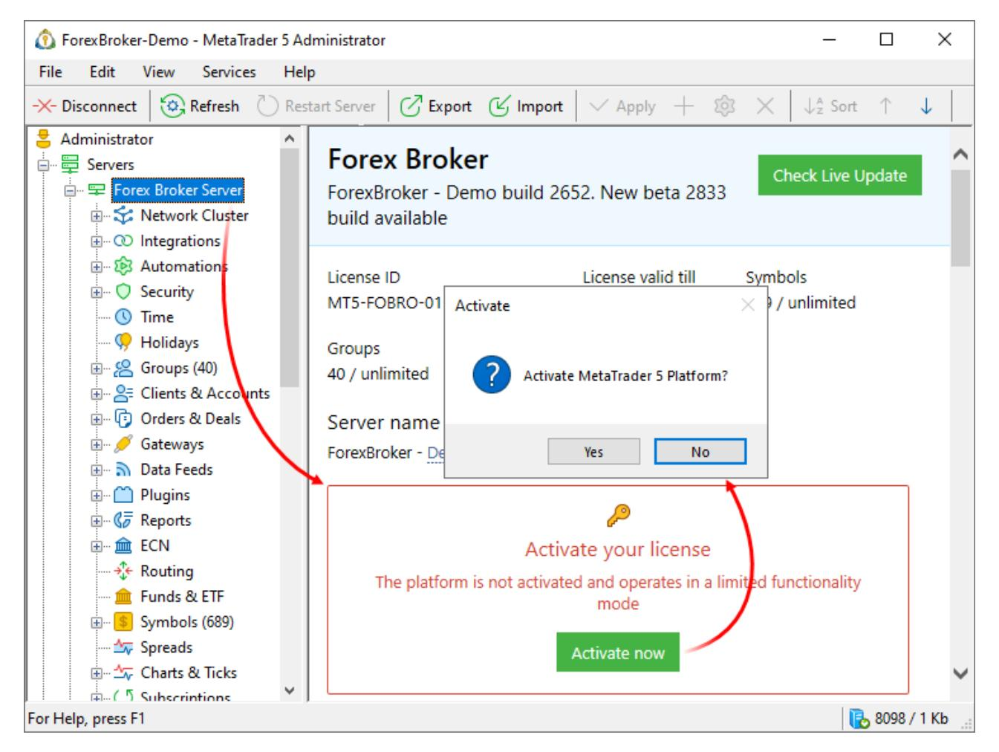

The following actions are performed during activation:

- ·A request is sent to the developer's update server.
- · If the license is verified successfully, a new activated license is generated, which is linked to the configuration of the server where the platform is installed.
- ·The activated license is sent back to the trade server.

- ·The number of activations is limited. Typically, up to 5 activations are allowed for one license.
- · During activation, the system automatically downloads and installs the latest versions of all components of the trading platform.

#### <span id="page-55-0"></span>**Activation management**

You can view your activations under the App Store / [Licenses](https://support.metaquotes.net/en/market/licenses) section of the Support Center site:

| News | Articles | Documentation | Workshops | Certification | App Store | Billing | Analytics | Support |
|------|----------|---------------|-----------|---------------|-----------|---------|-----------|---------|
|------|----------|---------------|-----------|---------------|-----------|---------|-----------|---------|

| <b>MetaTrader 5</b>                     | Server name                                                  | IP | Build | Created | Active |
|-----------------------------------------|--------------------------------------------------------------|----|-------|---------|--------|
| <b>Forex Broker</b>                     | ForexBroker-Temp  10.01.01.126  2515  2020.02.01  2020.07.17 |    |       |         |        |
| forex broker net<br>created: 2009.11.03 | ForexBroker-Demo 75.123.197.45 2537 2019.06.01 2020.07.17    |    |       |         |        |
| license expiration: 2024.01.20          |                                                              |    |       |         |        |

An individual activations list with the following details is displayed for each license of the platform:

- · **Server name** — this name is displayed in client terminals (in the program header, in the Navigator window, etc.). The first part of the name is used from the relevant White Label; the second part is provided by platform settings (it is specified on the start [page](#page-137-0)).
- ·**IP** — the IP address from which the platform was activated.
- · **Build** — current platform build. If the build is shown in red, then an update is available for the platform. We recommend installing the latest versions, as they increase the platform stability and expand its capabilities.
- ·**Created** — platform activation date.
- · **Active** — the date of the last update of platform data (including build). Platforms send service information to the server every 24 hours, during [optimization](#page-61-0) hours. The active time is updated every time when the platform sends data. If no data is received for one month, the date will be shown in red to warn of server inactivity. If the platform does not update the data for three months, it will be automatically removed from the list of available servers in terminals, as well as from the [Signals](https://www.mql5.com/en/signals) and Virtual [Hosting](https://www.mql5.com/en/vps) services.

Two platform [activation](#page-54-0) types are available: primary (shown in bold) and non-primary.

- ·Client terminals can only connect to the platform with the primary activation.
- · To enable client terminal connections, the platform sends information about its access points (installed access servers) to the update server every hour. Information is sent to the server regardless of the activation type. However, only the primary activation access points are sent to the terminals.

· Servers with non-primary activation are not shown in broker selection dialogs when opening an account through terminals.

To make a platform activation primary, please contact MetaQuotes [Service](https://support.metaquotes.net/en/support) Desk.

- · If you migrate the platform to another server and activate it, the new activation will appear in the list as non-primary. As soon as you complete the platform preparation, be sure to contact the Service Desk to set the activation as primary. Otherwise, traders may have connection issues, since terminals will not know new access points.
- · Desktop terminals receive the relevant information about access points every time the trader connects to an account. To ensure the availability of this information after platform migration to new hardware/hosting provider, it is recommended to leave at least one old access point running for 1-2 weeks.
- · Activation is linked to server hardware. When you change the computer configuration, you can see a new activation from the same IP address in the list. If the list of access points has not changed, this will not affect server operation with client terminals. However, we recommend that you contact the support team to set the new activation as primary.

You can delete the old activation by selecting . If you do not have enough permissions to delete an activation, or if you do not see the server management section, please contact the Service Desk.

## <span id="page-57-0"></span>**Cluster management**

|  | All platform servers are managed via the Network Cluster section. |
|--|-------------------------------------------------------------------|
|--|-------------------------------------------------------------------|

| MetaQuotes - MetaTrader 5 Administrator                                                                                          |                                   |                                    |                   |         |                                  |         | ×<br>п          |       |
|----------------------------------------------------------------------------------------------------------------------------------|-----------------------------------|------------------------------------|-------------------|---------|----------------------------------|---------|-----------------|-------|
| File<br>Edit<br><b>Services</b><br><b>Help</b><br>View                                                                           |                                   |                                    |                   |         |                                  |         |                 |       |
| $rac{	extstyle 	ext{	ext{Refresh}}}$ <b>Refresh</b> $	extstyle 	ext{	extless}	ext{	extgreater}$ Restart Server<br>-X-Disconnect | $igcirc$ Export $igcirc$ Import | $	ext{	extbar}	ext{	extbar}$ Apply |                   | 203     | $	ext{	extdownarrow}^{A}_z$ Sort |         |                 |       |
| Administrator                                                                                                                    | Type                              | <b>Address</b>                     | <b>CPU</b>        | Threads | Memory                           | Sockets | Connections     |       |
| <b>服务器</b>                                                                                                                       |                                   | <b>Main Trade Server</b>           | 14.140.80.42:1951 | 3%      | 125                              | 34 157  | 91              | 7     |
| 白………………………………………………………………………………………………                                                                                            |                                   | <b>Trade Server</b>                | 14.140.80.42:1952 | 2%      | 127                              | 34 157  | 91              | 0     |
| in Sc. Network Cluster                                                                                                           |                                   | <b>Access Server</b>               | 14.140.80.42:2000 | 6%      | 87                               | 34 157  | 91              | 2     |
| 白 -                                                                                                                              |                                   | <b>Access Server</b>               | 14.140.80.42:1950 | 1%      | 97                               | 34 157  | 91              | 2     |
| $oxed{	ext{Backup Main}}$                                                                                                       |                                   | <b>History Server</b>              | 14.140.80.42:1953 | 3%      | 89                               | 34 157  | 91              | 8     |
| $	ext{	extsquare}$ * * → History                                                                                                 |                                   | <b>Backup Server</b>               | 14.140.80.42:1954 | 4%      | 29                               | 34 157  | 91              |       |
| <b>Backup History</b>                                                                                                            |                                   | <b>Backup Server</b>               | 14.140.80.42:1955 | 3%      | 37                               | 34 157  | 91              |       |
| 面 帕 Trade Server<br>$oxed{	ext{	extsquare}}$ Access Point 1<br>Access Point 2<br>由 © Integrations<br>$	ext{	ick}$               |                                   | Overview<br>Nodes                  | CPU<br>Memory     |         | Connections                      | Traffic | Latency         | Netwo |
| For Help, press F1                                                                                                               |                                   |                                    |                   |         |                                  |         | all 1055 / 0 Kb |       |

The instructions on how to add servers are provided in the Installing additional [components](#page-40-0) section. Here we will take a look at common settings, which are used for allfour server types.

Individual settings for specific server types are described in relevant sections:

- ·Priority and permission settings on access servers are explained in the access server [installation](#page-44-0) section.
- ·HTTPS settings on access servers are described in the [API](#page-262-0) section.
- · Demo account allocation settings and login ranges on trading accounts are covered in the account [settings](#page-196-0) section.
- ·Quote [delivery](#page-226-0) section provides an explanation of history storing settings.

## **Common**

| Type:      | Main Trade Server (must be one only) |
|------------|--------------------------------------|
| Name:      | <b>Trade Main</b>                    |
| ID:        | 1                                    |
| Password:  |                                      |
| Latitude:  | 0.00000000                           |
| Longitude: | 0.00000000                           |
|            |                                      |
|            |                                      |
|            | OK                                   |
|            | Cancel                               |
|            | Help                                 |

Parameters of connections between servers are set on the **Common** tab:

- ·**Type** — sever type: main trade server, trade server, history server, access server or backup server.
- ·**Name** — server name.
- <span id="page-58-1"></span>·**ID** — value used for internal identification of servers.
- · **Password** — internal password used by other servers of the platform for connecting to this server. The password is set during server [installation.](#page-49-0) If the deployment function is used, the password should be set in advance, before installation. The minimum password length is 7 characters.
- · **Latitude/Longitude** — geographic coordinates of the server to enable its precise positioning on the [interactive](#page-140-0) cluster map.

#### <span id="page-58-0"></span>**Network**

This tab specifies the network settings of the server.

| Label    | Value                     |
|----------|---------------------------|
| Address: | 18.140.18.42:2000         |
|          | [2a00:1111:1:20::2a]:2000 |

Listen on these IP addresses

| Label | Value                     |
|-------|---------------------------|
| 军     | 18.140.18.42:2000         |
| 写     | [2a00:1111:1:20::2a]:2000 |

Automaticly use as public addresses

| Label | Value |
|-------|-------|
|       | Yes   |

Buttons:

| Left Buttons | Right Buttons |
|--------------|---------------|
| Add          | OK            |
| Edit         | Cancel        |
| Delete       | Help          |

#### **IPv4 and IPv6 support**

IPv4 which is used in every network was created more than 30 years ago. It contains IP addresses of 32 bits, which are represented as four 8-bit numbers separated by dots. This produces more than four billion unique IP addresses. However, the rapidly growing number of users and devices has accelerated the depletion of the pool of available addresses.

To avoid the depletion problem, products started to provide additional support for the modern IPv6. This protocol uses 128-bit addresses, represented as x:x:x:x:x:x:x:x, where each x is a hexadecimal value of six 16 bit address elements. Theoretically, this format allows 5 x 10 ^ 28 unique addresses. In addition to an extensive address space, this protocol has other advantages over the older version. You can read about them in specialized articles.

The platform supports two network protocols: IPv4 and IPv6. The corresponding addresses can be specified as outgoing, listen and public.

To use IPv6, please make sure this protocol is supported by your network infrastructure.

#### **Outbound connection address**

The outbound connection address is used for the following purposes:

·Making outbound connections to other servers. · Authenticating the server by IP address. During connection, the server address specified in these settings is checked against the address from which the connection is actually established.

Use the left field to bind to an IPv4 address. The address is specified as IP-address:port, for example: 192.168.0.1:3128.

Use the right field to bind to an IPv6 address. If a port is specified for the address, the main part must be enclosed in brackets: [address]:port.

#### **Listen addresses**

Listen (binding) address is the address and port that the access server will listen on for external connections. It is recommended to specify the IP address for binding, not the domain name.

You can specify here the localIP address of the access server or the external one, depending on the network configuration:

- · If the access server has direct access to the internet and is not closed by a firewall, specify here the external IP address
- · If the local network uses access to the internet through a firewall, you should configure correct routing of incoming connections to the internalIP address of the access server. In this case, specify the local address of the server in this tab.
- · In order to configure listening on a specific port on all available addresses, specify 0.0.0.0:port number. For example, 0.0.0.0:443.

#### **Public addresses**

Specify here a list of public access points (IP or DNS addresses) through which connections from other platform components, client connections from terminals and APIs (for access servers) will be accepted.

When other cluster components connect to the server, they sequentially iterate over its public addresses in the same order in which they are listed. If a domain name is specified as a public address, servers will iterate over all associated IP addresses, while preference is given to IPv6.

If you check "Automatically use as public addresses", the specified listen addresses will be used as public addresses.

#### **Service**

Server service settings are specified on this tab.

| Server                                                                                           |                    |                                      |  |  |  |  |    | ×      |      |
|--------------------------------------------------------------------------------------------------|--------------------|--------------------------------------|--|--|--|--|----|--------|------|
| Common Network Demo End of Day Accounts Orders Deals Failover Service                            |                    |                                      |  |  |  |  |    |        |      |
| Please specify service settings of server: network adapter for monitoring and optimization time. |                    |                                      |  |  |  |  |    |        |      |
|                                                                                                  | Network adapter:   | Microsoft Hyper-V Network Adapter _2 |  |  |  |  |    | $✔$    |      |
|                                                                                                  | Optimization time: | 03:47                                |  |  |  |  |    |        |      |
|                                                                                                  |                    |                                      |  |  |  |  |    |        |      |
|                                                                                                  |                    |                                      |  |  |  |  |    |        |      |
|                                                                                                  |                    |                                      |  |  |  |  |    |        |      |
|                                                                                                  |                    |                                      |  |  |  |  |    |        |      |
|                                                                                                  |                    |                                      |  |  |  |  | OK | Cancel | Help |

The following parameters should be specified here:

- ·**Network adapter** — the network adapter that will be used to [monitor](#page-140-0) the server state.
- <span id="page-61-0"></span>· **Optimization time** — server optimization time. During optimization, different operations are performed aimed to increase the server performance. During this time, the system deletes expired demo accounts, optimizes databases, and updates components. Select the time when the server load is the lowest. For example, 03:47 AM server time.

#### **Cluster optimization process**

Certain operations are performed sequentially during optimization time. Some operations are performed daily, others only on Sundays.

If the optimization start time is set to 1:00 AM, the process will proceed as follows:

#### **Trade server**

- · 1:00. Daylight Saving Time settings are checked. If the clock has turned backward or forward, the server is restarted to apply changes.
- ·1:00 +/– a few seconds. Computer performance data is collected.

Further, no operations are performed on all days except Sunday. The following operations are performed on Sunday:

- · 1:10. Compacting databases and configurations (deleting unnecessary and empty records), deleting expired demo accounts, restarting the server.
- ·2:00. Checking updates; updating and restarting the server if necessary.
- ·3:00. Zipping server logs for the previous week.

#### **History server**

- ·1:00 +/– a few seconds. Computer performance data is collected.
- ·1:10. Compacting databases and configurations (deleting unnecessary and empty records).

Further, no operations are performed on all days except Sunday. The following operations are performed on Sunday:

- ·2:00. Checking updates; updating and restarting the server if necessary.
- · 2:20. Launching tick and minute history optimization. The data of financial instruments that are not available in the platform are deleted from the \history\ directory.
- ·3:00. Zipping server and gateway logs for the previous week.

#### **Access server**

- ·1:00 +/– a few seconds. Computer performance data is collected.
- ·1:10. Compacting databases and configurations (deleting unnecessary and empty records).

Further, no operations are performed on all days except Sunday. The following operations are performed on Sunday:

- ·2:00. Checking updates; updating and restarting the server if necessary.
- · 2:20. Launching tick and minute history optimization. The data of financial instruments that are not available in the platform are deleted from the \history\ directory.
- ·3:00. Zipping server logs for the previous week.

#### **Backup server**

- ·1:00 +/– a few seconds. Computer performance data is collected.
- ·1:10. Compacting databases and configurations (deleting unnecessary and empty records).

Further, no operations are performed on all days except Sunday. The following operations are performed on Sunday:

- ·2:00. Checking updates; updating and restarting the server if necessary.
- ·3:00. Zipping server logs for the previous week.

## <span id="page-63-0"></span>**Common errors and recommendations**

- ·Do not forget to install all operating system updates as this increases the operation stability.
- · Do not use older operating systems as they may not support allthe features required for the quick and reliable platform operation.
- · Do not shrink the paging file. It must be managed by the system. This is a required condition for a correct platform operation.
- ·We do not recommend using hardware older than three years for the platform.
- · At least one access server must be installed in the same location as the main server. Such collocation reduces network latency.
- · The history server must be installed in the same location as the main server, otherwise you quotes may be transmitted with a delay.

## <span id="page-64-0"></span>**Platform security**

Ensuring trading platform security is the direct responsibility of the administrator. This complex task includes not only monitoring and maintaining hardware, but also controlling employee access to data, protecting against network attacks, protecting traders' data, and much more.

In this chapter, we will cover primary administration task, such as:

- ·How to protect against DDoS attacks using built-in anti-flood control
- ·How to control connections to the platform using the built-in firewall
- ·How to protect against DDoS attacks using external service providers
- ·How to set up platform access rights for your company's employees
- ·How to provide additional account security using SSL authentication and one-time passwords

## <span id="page-65-0"></span>**Configuring anti-flood control**

The anti-flood control system runs on access [servers.](#page-8-1) It protects the trading platform from external malicious attacks. The protection system collects a database of users who send invalid requests to the server (for example, an attempt to authorize with an incorrect username or password), as well as of users who send too frequent requests.

Anti-flood control is effective for alltypes of connections to the server, including manager connections (via the Manager terminal or Manager API).

The number of connections and erroneous requests per unit of time can be configured on the **Access** tab of the access server:

| Server                                                                                                                                       |       |
|----------------------------------------------------------------------------------------------------------------------------------------------|-------|
| Common                                                                                                                                       |       |
| Network                                                                                                                                      |       |
| Access                                                                                                                                       |       |
| Permissions                                                                                                                                  |       |
| Servers                                                                                                                                      |       |
| SSL                                                                                                                                          |       |
| Service                                                                                                                                      |       |
|                                                                                                                                              |       |
|                                                                                                                                              |       |
| Access server is used as access point for connection of clients to trade server. Please specify its priority and antiflood control settings. |       |
| Priority:                                                                                                                                    | 9     |
|                                                                                                                                              |       |
|                                                                                                                                              |       |
|                                                                                                                                              |       |
|                                                                                                                                              |       |
|                                                                                                                                              |       |
|                                                                                                                                              |       |
|                                                                                                                                              |       |
|                                                                                                                                              |       |
|                                                                                                                                              |       |
|                                                                                                                                              |       |
|                                                                                                                                              |       |
|                                                                                                                                              |       |
|                                                                                                                                              |       |
|                                                                                                                                              |       |
|                                                                                                                                              |       |
|                                                                                                                                              |       |
|                                                                                                                                              |       |
| □ Enable antiflood control                                                                                                                   |       |
| Connections:                                                                                                                                 | 100   |
| Errors:                                                                                                                                      | 10    |
| Maximum news:                                                                                                                                | 16384 |
| ○ Use this server for monitoring the cluster and failover                                                                                    |       |
|                                                                                                                                              |       |
|                                                                                                                                              |       |
|                                                                                                                                              |       |
|                                                                                                                                              |       |
|                                                                                                                                              |       |
|                                                                                                                                              |       |
|                                                                                                                                              |       |
|                                                                                                                                              |       |
|                                                                                                                                              |       |
|                                                                                                                                              |       |
|                                                                                                                                              |       |
|                                                                                                                                              |       |

#### **How the system works**

The anti-flood control system monitors user activity. Users are identified by their IP addresses as well as by the ID linked to their computers and operating systems. The following two activity types are controlled:

#### ·**The total number of connections from one user**

The system tracks if a user creates too many connections. When a user connects to the server, their connection counter is incremented by one. If the next connection occurs in less than 3 seconds, the counter is incremented. If the specified time interval is exceeded, the counter is reset. When the counter reaches the number specified in the Connections box, the user is blocked for 5 minutes. The blocking period increases if the connections limit is reached again. The maximum blocking period is one hour.

#### ·**Number of invalid packets from one user**

The system blocks brute-force attacks by analyzing authentication errors, which imply multiple login attempts with incorrect data. Also, the system detects garbage flood packets, which can be sent to the server by third-party utilities in an effort to reduce the server performance (i.e. a DoS attack). When a user sends an invalid packet to the server, the user's error counter is incremented by one. If the next invalid packet is sent in less than 5 minutes, the counter is incremented. If the specified time interval is exceeded, the counter is reset. When the counter reaches the number specified in the Errors box, the user is blocked for 5 minutes. The blocking period increases if the connections limit is reached again. The maximum blocking period is one hour.

When a user is blocked, the following entries are added to the access server log:

- ·*IP* is blocked after *N* connections [intruder] — if the user was banned by IP after *N* connection attempts.
- · *CID* is blocked after *N* errors [intruder] — if the user was banned by computer identifier (CID) after sending *N* invalid requests.
  - ·We strongly recommend that you do not disable the anti-flood control system.
  - · The anti-flood control system does not check the IP addresses from the "always allowed" list in [platform](#page-67-0) firewall settings.

## <span id="page-67-0"></span>**Configuring firewall**

The firewall is designed to protect the platform from access from unwanted IP addresses. If you detect suspicious activity from a group of addresses, add a deny rule for them; in this case no user (client, manager, administrator) will be able to connect to the server form these addresses. At the same time, you can add the desired addresses to the allowlist, for example, those used in your office. Such addresses will not be blocked by the [anti-flood](#page-65-0) control system, even if high activity is registered from these addresses.

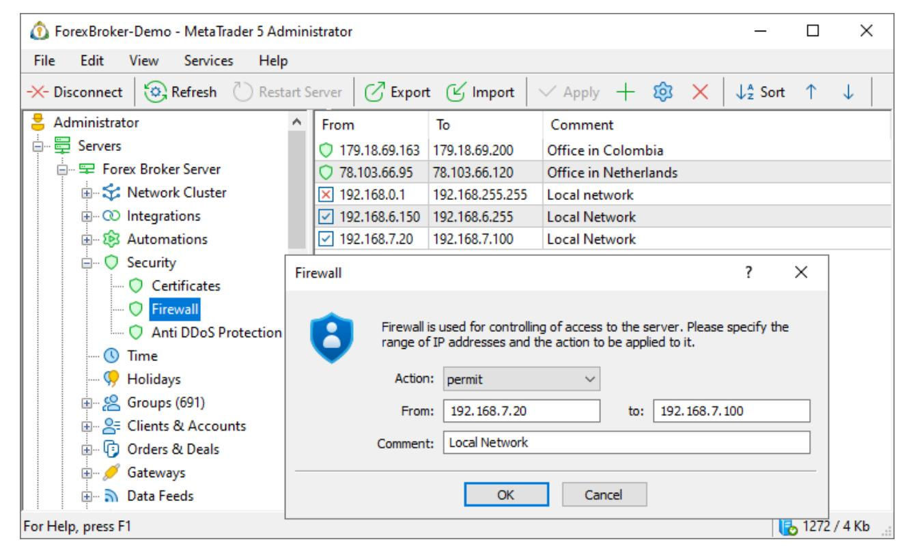

All addresses are considered to be allowed by default, and all addresses are checked by the anti-flood control mechanism.

To protect the system, create a set of allow and deny instructions, taking into account the following rules:

- · The latest rule is applied to an address, regardless of previous instructions, except for the addresses that are always allowed.
- ·Each address is checked from top to bottom.

Thus, the position of each instruction in the list is a very important factor when configuring access from IP addresses.

Here is an example of two instructions:

- ·Denied: 192.168.0.0 — 192.168.0.100
- ·Allowed: 192.168.0.20 — 192.168.0.60

The allow instruction is located lower in the list than the deny rule. This allows the creation of an allowed interval within the range of blocked addresses. Addresses in ranges 192.168.0.0 — 192.168.0.20 and 192.168.0.60 —

192.168.0.100 will be blocked. But if you reverse these instructions, the entire range 192.168.0.0 — 192.168.0.100 will become blocked.

To rearrange rules, drag them in the list or use the arrows on the toolbar.

### **Rule parameters**

Each instruction specifies the type of action to be applied to the indicated address range:

- ·Block
- ·Permit
- · Permit always — these addresses are always allowed regardless of any deny instructions above or below; they are not subject to anti-flood checks

Next, specify the range of addresses to which the action should be applied. To set a rule for only one address, indicate this address on both fields, **From** and **To**.

Additionally, you can add a comment to the rule for easier navigation. For example, you can mention the location, such as Office network, London office, etc.

To quickly add instructions for any IP-address, paste it into the Comment field from the clipboard. After you click OK, the address will be automatically added to fields **From** and **To**.

- · Do not block address ranges that include the IP address used for connection from the Administrator terminal. After the activation of such a rule, you will not be able to connect to the server.
- · If you accidentally block your own IP address and you can't log in under any other administrator account, the only solution is to stop the main server service, to delete the [main server installation directory]config\access.inifile and to restart the server. This willremove any previously created firewall settings.
- · The rules take effect as soon as you click OK, but apply only to new connections. Current connections are not reset.

## <span id="page-69-0"></span>**Enabling anti-DDoS protection**

The access servers of the platform are provided with the anti-DDoS protection mechanism. The mechanism monitors the network activity of clients in realtime and blocks connections from the IP addresses on which suspicious activity is registered, such as sending too many requests, submission of invalid data, authorization errors, etc.

Unfortunately, the mechanism can't protect the platform against all existing types of attacks. For example, it can't defend against attacks targeting the network infrastructure, since such attacks cannot be physically dealt with at the access server application level. Additional mechanisms are required for effective protection.

The trading platform provides a special component Anti-DDoS Proxy Server. The component enables the use of external anti-DDoS service providers. In this case, blocking of unwanted connections is performed on the distributed network of anti-DDoS provider's servers rather than on access servers. The anti-DDos provider's server network actually acts as an additional component between the client and the access server.

Instead of directly connecting to access servers, all clients will be connected to the provider's public access points. Unwanted connections will be filtered in the provider's own network of servers, while legitimate connections from real clients will pass through to access servers.

The broker's infrastructure is practically not affected.

# General operation scheme

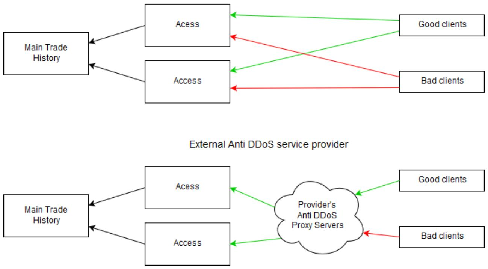

## **Configure your access server for the operation with an external anti-DDoS service provider**

Choose an access server, to which the connections via the anti-DDoS provider will be redirected. It is recommended to install and configure a new access server, because its address must not be publicly known (otherwise attackers will be able to directly attack this server). If you have an access server that was not visible to clients (had the Idle priority or client connections were disabled in its settings), you may use this server.

See also: [Documentation](https://support.metaquotes.net/en/docs/mt5/platform/administration/admin_network/network_add_edit/network_access_server) / Platform / Platform setup / Network cluster / Configuring servers / Access [servers](https://support.metaquotes.net/en/docs/mt5/platform/administration/admin_network/network_add_edit/network_access_server)

The **Hide server from all types of terminals (connections will be allowed)** option is available for servers that work with an external anti-DDoS provider.

| Server                                                                                                                                                                                                                                                                                                                                                                                                                                                                                                                                 |                                       |                                     |
|----------------------------------------------------------------------------------------------------------------------------------------------------------------------------------------------------------------------------------------------------------------------------------------------------------------------------------------------------------------------------------------------------------------------------------------------------------------------------------------------------------------------------------------|---------------------------------------|-------------------------------------|
| <b>Permissions</b>                                                                                                                                                                                                                                                                                                                                                                                                                                                                                                                     |                                       |                                     |
| Network Access<br>Servers Service<br>Common                                                                                                                                                                                                                                                                                                                                                                                                                                                                                            |                                       |                                     |
| Please specify the types of connection allowed at this access server.                                                                                                                                                                                                                                                                                                                                                                                                                                                                  |                                       |                                     |
| <input checked="" type="checkbox"/> Allow client connection<br><input checked="" type="checkbox"/> Allow Client API connection<br><input checked="" type="checkbox"/> Allow manager connection<br><input checked="" type="checkbox"/> Allow Manager API connection<br><input checked="" type="checkbox"/> Allow administrator connection<br><br><button type="button">Select All</button> <button type="button">Select None</button><br><input type="checkbox"/> Hide server from all types of terminals (connections will be allowed) |                                       |                                     |
| <button type="button">OK</button>                                                                                                                                                                                                                                                                                                                                                                                                                                                                                                      | <button type="button">Cancel</button> | <button type="button">Help</button> |

Enable this option for the access server, to which connections will be redirected. The server will be hidden from allterminals, including client, manager and administrator terminals, and it will not be displayed in the list of access points. Attackers will not know the server address and will not be able to execute an attack.

By hiding a server, you do not disable the possibility to connect to it. Terminals can connect to this server if the address is specified manually, while the anti-DDoS provider can redirect client connections to it.

#### **Choose an anti-DDoS service provider and receive necessary data**

You should contact the anti-DDoS provider and sign an appropriate agreement. At the moment, the platform supports the following providers: [Akamai,](https://support.metaquotes.net/en/market/product/194) [Qrator](https://support.metaquotes.net/en/market/product/477), [Cloudflare](https://support.metaquotes.net/en/market/product/478). Support for other providers will be added later.

- ·Provide information about the public address of your access server to your anti-DDoS provider.
- · The provide will allocate one or more public addresses, to which your clients will be connected. These addresses should be specified in the Anti DDoS Proxy Server [settings](#page-72-0) in the Public Addresses box.

· Also, you will be receive ranges of proxy server addresses through which client connections will be forwarded to access servers. These ranges should be specified in the Anti DDoS Proxy Server settings (Source [Subnets\)](#page-72-1). The ranges are used as an additional protection measure: connections forwarded by the anti DDoS provider will only be accepted from these addresses.

See also: [Documentation](https://support.metaquotes.net/en/docs/mt5/platform/administration/admin_network/network_add_edit#network) / Platform / Platform Setup / Network Cluster / Configuring Servers

#### **Configure the Anti DDoS Proxy Server component in MetaTrader 5**

After you receive the required information, add the Anti DDoS Proxy Server component under the **Security** section. Specify a name for this component. Note that this name will be used for the access points displayed in client terminals. Do not use phrases like Anti DDoS and similar, as the point should look like a regular access server.

| Broker-Demo - MetaTrader 5 Administrator                                                                                                                                                                                  |                                                                      |                                           |       |                          |                        |                                                                                       |    |            |        | П                       | $\times$ |  |
|---------------------------------------------------------------------------------------------------------------------------------------------------------------------------------------------------------------------------|----------------------------------------------------------------------|-------------------------------------------|-------|--------------------------|------------------------|---------------------------------------------------------------------------------------|----|------------|--------|-------------------------|----------|--|
| Edit<br>File                                                                                                                                                                                                              | <b>Services</b><br>View                                              | Help                                      |       |                          |                        |                                                                                       |    |            |        |                         |          |  |
| $\rightarrow$ Disconnect $\ket{\odot}$ Refresh $\circlearrowright$ Restart Server $ \oslash$ Export $ \textrm{ }\swarrow$ Import $ \vee\rangle$ Apply $+$ $\ket{\circ}$ $\times$ $ \downarrow$ $\swarrow$ Sort $\uparrow$ |                                                                      |                                           |       |                          |                        |                                                                                       |    |            |        |                         |          |  |
| □ ○ Security                                                                                                                                                                                                              | 由 您 Automations<br>$\Box$ Certificates<br>$\Box$ $\bigcirc$ Firewall |                                           |       | How to set up            |                        | Anti DDoS Protection ·                                                                |    |            |        | <b>Add Proxy Server</b> |          |  |
| $\circ$ O Time<br>$\mathbb{Q}$ Holidays                                                                                                                                                                                   | Anti DDoS Protection                                                 | Server                                    |       |                          |                        |                                                                                       |    |            |        |                         | $\times$ |  |
|                                                                                                                                                                                                                           | 由 8 Groups (41)<br>로 이 Olients & A                                   | Common Network Source Subnets Permissions |       |                          |                        | <b>Servers</b>                                                                        |    |            |        |                         |          |  |
| <b>E</b> Gateways                                                                                                                                                                                                         | 由 D Orders & D                                                       |                                           |       |                          |                        | Please specify common server settings: type, name, internal identifier, and password. |    |            |        |                         |          |  |
| 面 - い Data Feeds<br>Plugins<br><b>主…</b>                                                                                                                                                                                  |                                                                      |                                           | Type: |                          | Anti DDoS Proxy Server |                                                                                       |    |            |        |                         |          |  |
| 由 <b>G</b> Reports                                                                                                                                                                                                        |                                                                      |                                           | Name: | <b>Access Point EU 2</b> |                        |                                                                                       |    |            |        |                         |          |  |
| 画 <b>血 ECN</b><br>$\rightarrow^{\uparrow}_{\mathbf{L}}$ Routing                                                                                                                                                           |                                                                      |                                           | ID:   | 6                        |                        | Password:                                                                             |    |            |        |                         |          |  |
| For Help, press F1                                                                                                                                                                                                        | $\blacksquare$ Funds & ET                                            |                                           |       | Latitude: 0.00000000     |                        | Longitude:                                                                            |    | 0.00000000 |        |                         |          |  |
|                                                                                                                                                                                                                           |                                                                      |                                           |       |                          |                        |                                                                                       |    |            |        |                         |          |  |
|                                                                                                                                                                                                                           |                                                                      |                                           |       |                          |                        |                                                                                       | OK |            | Cancel | <b>Help</b>             |          |  |

Also set the internalID; passwords are not used for this component.

Next, specify the following parameters on the **Network** tab:

· **Priority** — the basic priority for the access points of the Anti DDoS provider, from 0 to 15. It is similar to priority settings of access servers. Preference of a server for client connections is calculated based on the basic priority and the quality of connection with the server (ping). The lower the priority is, the more preferred the server is for clients.

<span id="page-72-0"></span>· **Public addresses** — one or more public access points through which clients connect to the platform (via the provider's network). These points should be provided to you by the Anti DDoS service provider.

| Server        |                                                                                                                                                                                                   |                |                                                                                                                         |         | ?              | ×           |         |      |   |
|---------------|---------------------------------------------------------------------------------------------------------------------------------------------------------------------------------------------------|----------------|-------------------------------------------------------------------------------------------------------------------------|---------|----------------|-------------|---------|------|---|
| Common        | Network                                                                                                                                                                                           | Source Subnets | Permissions                                                                                                             | Servers |                |             |         |      |   |
|               | Please specify public addresses received from your Anti DDoS service provider. This addresses will be used for client connections. Set the priority of addresses for client terminal connections. |                |                                                                                                                         |         |                |             |         |      |   |
| Priority:     | 6                                                                                                                                                                                                 |                |                                                                                                                         |         |                |             |         |      |   |
|               | Public addresses                                                                                                                                                                                  |                |                                                                                                                         |         |                |             |         |      |   |
|               | proxy.metatrader.net: 1955                                                                                                                                                                        |                |                                                                                                                         |         |                |             |         |      |   |
| Add           | Server                                                                                                                                                                                            |                |                                                                                                                         |         |                |             |         | 7    | × |
| Edit          |                                                                                                                                                                                                   |                | Common                                                                                                                  | Network | Source Subnets | Permissions | Servers |      |   |
| <b>Delete</b> |                                                                                                                                                                                                   |                | Please specify address ranges for Anti DDoS proxy servers. Use addresses received from your Anti DDoS service provider. |         |                |             |         |      |   |
|               |                                                                                                                                                                                                   |                | From                                                                                                                    |         | To             |             |         |      |   |
|               |                                                                                                                                                                                                   |                | 81.230.104.0                                                                                                            |         | 81.230.104.255 |             |         |      |   |
|               |                                                                                                                                                                                                   |                | 200.90.103.0                                                                                                            |         | 200.90.103.255 |             |         |      |   |
|               |                                                                                                                                                                                                   |                |                                                                                                                         |         |                |             |         |      |   |
|               |                                                                                                                                                                                                   | Add            |                                                                                                                         |         |                |             |         |      |   |
|               |                                                                                                                                                                                                   | Edit           |                                                                                                                         |         |                |             |         |      |   |
|               |                                                                                                                                                                                                   |                |                                                                                                                         |         |                |             |         |      |   |
|               |                                                                                                                                                                                                   | <b>Delete</b>  |                                                                                                                         |         |                |             |         |      |   |
|               |                                                                                                                                                                                                   |                |                                                                                                                         |         |                |             |         |      |   |
|               |                                                                                                                                                                                                   |                |                                                                                                                         |         | <b>OK</b>      |             | Cancel  | Help |   |

<span id="page-72-1"></span>In the **Source Subnets** tab, set the range of addresses for the provider's proxy servers. Connections forwarded by the Anit DDoS provider will be allowed from these addresses.

Anti-DDoS Proxy Server will work even if you do not specify provider's proxy ranges. However, we strongly recommend specifying the ranges, otherwise, connections from any addresses will be allowed in the Anti DDoS provider mode.

## **Check the accessibility of the Anti-DDoS server in terminals**

After you finish configuring Anti DDoS, the server will be available for client connections. The provider's server is displayed as a regular access point in client terminals:

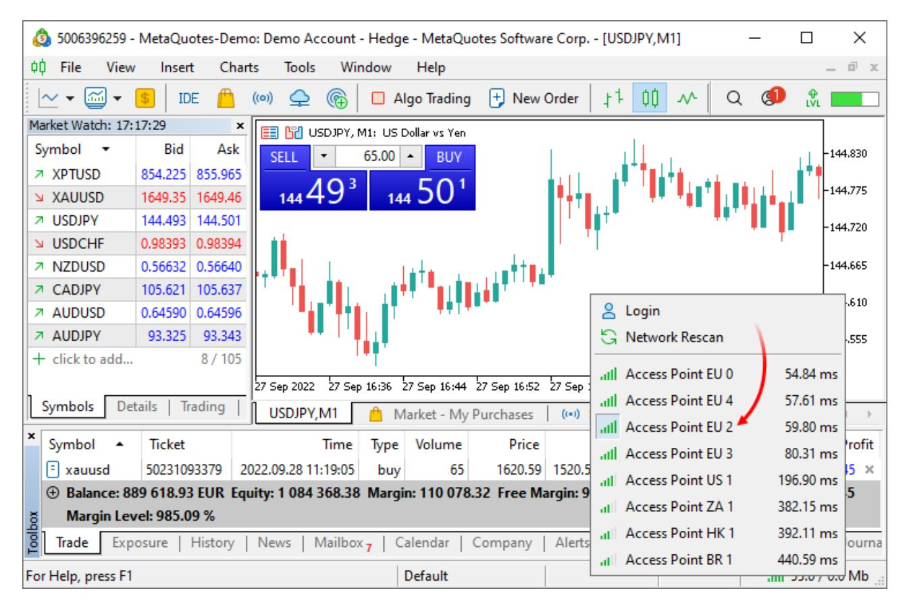

### **How to hide access servers**

After the configuration of the Anti-DDoS proxy server, the provider's access point will be available for all terminals, including client, manager and administrator. However, your access servers will still be available to these terminals.

If a server address is publicly available, attackers can find out this address and perform an attack. You can hide access servers in order to protect them from possible attacks. This can be done by enabling the option **Hide server from all types of terminals (connections will be allowed)**.

| <b>Server</b>                                                                                                                                                                                                                                                  | 7    | × |
|----------------------------------------------------------------------------------------------------------------------------------------------------------------------------------------------------------------------------------------------------------------|------|---|
| <b>Network Access Permissions</b>                                                                                                                                                                                                                              |      |   |
| Please specify the types of connection allowed at this access server.                                                                                                                                                                                          |      |   |
| Allow client connection<br>Allow Client API connection<br>Allow manager connection<br>Allow Manager API connection<br>$ ∨ $ Allow administrator connection<br>Allow all<br>Allow none<br>Hide server from all types of terminals (connections will be allowed) |      |   |
| <button>Cancel</button> <button>OK</button>                                                                                                                                                                                                                    | Help |   |

The server will be hidden from allterminals and will not be displayed in the list of access points. Attackers will not know the server address and will not be able to execute an attack.

By hiding a server, you do not disable the possibility to connect to it. Terminals can connect to this server if the address is specified manually, while the anti-DDoS provider can redirect client connections to it.

### **How to identify connections through the anti DDoS provider**

Forwarded client connections are received from the anti DDoS provider's addresses. However, the real original addresses of clients are also known; they are transmitted by the provider. The proper original client's address is written to the platform logs and client records (e.g. in the **Last IP** parameter).

Check the access server journalto find out if the client is connected via the anti DDoS provider:

```
2017.10.13 17:42:08.441 84.101.15.116 '1814046': login (Client build 1674,
cid: 13ea0a897463ba4aeb76db5d8cdc4afa, ping: 108.83 ms, anti ddos server: 81.230.104.100)
```

# <span id="page-75-0"></span>**Granting different platform access permissions to company employees**

User accounts in the platform are trading accounts. They are used for traders, as well as for the broker's managers and administrators. The latter ones have a special manager configuration add-on over the trading account. This configuration assigns advanced rights and turns a regular account into a manager or administrator account.

All accounts, including trader and manager, are created in [groups](#page-180-0). Groups enable efficient management of common account settings, such as access to trading instruments, authorization parameters and others.

When you installthe platform, two groups are immediately created for broker accounts:

- · managers\administrators — an account group for administrators who manage platform settings, manage databases, etc. The first administrator account with the login 1000 is created in this group.
- ·managers\dealers — a group for manager accounts (dealers) who work with clients, process trades, etc.

These two groups are enough for the initial access setup. Later, you can add additional groups: for additional trade servers, for your White Label, etc.

See also: [Documentation](https://support.metaquotes.net/en/docs/mt5/platform/administration/admin_groups) / Platform / Platform settings / Groups

#### **General recommendations**

- · All company employees should use only corporate email addresses. This ensures greater control and reduces the risk of information leakage.
- · The server administrator should disable the display of client account details to those managers who do not need such data for their official duties. For example, managers who send out news and analytical market reports, do not need access to client account details.
- · The server administrator should restrict managers' access to the data history. If the manager needs access to information for the last 30 days, then you should set 30 days in the **Available Reports** parameter in manager account settings.
- · The server administrator must carefully monitor manager access rights in relation to client groups on the server.
- · The fewer server administrators you have (managers with the right to connect via MetaTrader 5 Administrator), the better.

#### **Create an account**

Create a new account in the administrator or manager group.

Fill in allthe required fields: name, company, country, etc. Properly created accounts enable efficient operation in the future. For each account, it should obvious whom it belongs to.

| Label                                    | Value                                           |
|------------------------------------------|-------------------------------------------------|
| Broker-Demo - MetaTrader 5 Administrator |                                                 |
| File                                     | View                                            |
| Services                                 | Help                                            |
| Refresh                                  | Restart Server                                  |
| Disconnect                               |                                                 |
| Broker Server                            |                                                 |
| Login                                    | A                                               |
| Name                                     | Group                                           |
| Country                                  | Balance / Check                                 |
| Network Cluster                          |                                                 |
| Integrations                             |                                                 |
| New Account                              |                                                 |
| Security                                 |                                                 |
| Preferred Login                          | next                                            |
| Time                                     |                                                 |
| Group                                    | managers
administrators                         |
| Holidays                                 | 由 8 Groups (691)                                |
| Existing Client                          | Enter the client id, name or contacts to search |
| Allocations                              | ½                                               |
| Clients                                  | -8                                              |
| Managers                                 | - 양                                             |
| Trading Accounts                         |                                                 |
| Company                                  | <b>ABC Broker</b>                               |
| Gateways                                 |                                                 |
| Data Feeds                               |                                                 |
| Reports                                  |                                                 |
| ECN                                      |                                                 |
| Routing                                  | ↑                                               |
| Help                                     | Press F1                                        |
| Country                                  | <b>United States</b>                            |
| Zip code                                 | 123456                                          |
| State                                    | <b>New York</b>                                 |
| City                                     | <b>New York</b>                                 |
| Address                                  | 24 Wall st. 15                                  |
|                                          | <b>OK</b><br>Cancel                             |

Set a complex password for the account. It must not be short and must contain different types of characters: lowercase letters, uppercase letters, and numbers. The maximum password length is limited to 16 characters, while the minimum length requirement is determined by the settings of the group in which the account is created.

See also: [Documentation](https://support.metaquotes.net/en/docs/mt5/platform/administration/admin_accounts/account_add) / Platform / Platform settings / Accounts / Account creation

#### **Creating a manager configuration**

To elevate an account, create a manager configuration in the appropriate section.

| Label                                    | Value |
|------------------------------------------|-------|
| Broker-Demo - MetaTrader 5 Administrator |       |

| Edit<br>File<br>View<br><b>Services</b> |  |
|-----------------------------------------|--|
| Help                                    |  |
|                                         |  |
|                                         |  |
|                                         |  |

| $-X$ - Disconnect                                                          |          |
|----------------------------------------------------------------------------|----------|
| Refresh Restart Server   C Export   K Import<br>$$ Apply $+$ $D$ $	imes$ | $$ Sort |
|                                                                            |          |

| 白… = Broker Server                           |  |
|----------------------------------------------|--|
| 山 Network Cluster                            |  |
| 由 1000<br><b>John Smith</b><br>Administrator |  |

| 由 <b>co</b> Integrations |  |
|--------------------------|--|
| 由 8 Automations          |  |

| <b>E</b> . ○ Security                  |  |
|----------------------------------------|--|
| Common<br>Permissions   IP Access List |  |

| $0B7$ ( $4C4$ Time  |                                                                                                                                                                                               |
|-----------------------|-----------------------------------------------------------------------------------------------------------------------------------------------------------------------------------------------|
| $0B7$ $53$ Holidays | Managers are privileged users that have additional permissions, such as administration of users<br>and processing trade operations. Please specify account, mailbox, and groups to be served. |

| 由 g Groups (41)<br>e S= Clients & Acco |  |
|----------------------------------------|--|
|----------------------------------------|--|

| <b>Predictions</b>                               |  |
|--------------------------------------------------|--|
| Administrator<br>Mailbox name:<br>1000<br>Login: |  |

| $68A$ = Clients |  |
|------------------|--|
|------------------|--|

| $D0$ Managers |  |
|----------------|--|
|----------------|--|

| $53C$ Trading Ac |  |
|-------------------|--|
|-------------------|--|

| 由 C Orders & Deals |  |
|--------------------|--|
|--------------------|--|

| <b>E</b> Gateways |  |
|-------------------|--|
|-------------------|--|

| 面 · い Data Feeds |  |
|------------------|--|
|------------------|--|

| <sup>1</sup> Plugins<br>中… | Add |
|----------------------------|-----|
|----------------------------|-----|

| 由 <b>G</b> Reports |  |
|--------------------|--|
|--------------------|--|

| 由 血 ECN | Edit |
|---------|------|
|---------|------|

| — $53C$ | Delete |
|----------|--------|
|----------|--------|

|--|--|

| For Help, press F1 |    |        |      |
|--------------------|----|--------|------|
|                    | OK | Cancel | Help |

#### **General settings**

Specify the following parameters in the general settings section:

- · **Login** — the number of the account based on which the manager account will be created. The account must be included in the manager group.
- · **Mailbox name** — the name of the manager in the mail system. The trading platform allows contacting traders via the internal email system. The specified name will be displayed in the From field in emails sent by the manager. If the trader wants to contact the broker, the manager account will be shown in the list of available recipients in the To field. If the mailbox name is not specified, the manager will not be able to send internal emails.
- · **Groups** — [account](#page-180-0) groups to be managed by this manager account. The manager will have access to accounts and trading operations only within the specified groups. Group rules are checked in a top to bottom order. If you allow all groups in the first line, you will not be able to prohibit some of them with further rules.

You can use mask \* and negation sign ! to indicate groups. For example, demo\* means all groups whose names (including the path) begin with "demo" characters (for example, demo\forex, demoforex, demoforex\usd). If you specify !managers,\*, all groups will be taken into account, except for those whose names begin with the characters "managers".

A rule can't contain only a group deny. For example, rule !demo\* is incorrect. A deny rule can only be combined with permissions for other groups. For example, !demo\*,real\*.

#### **Permissions**

In the **Permissions** section, define which platform functions will be available to the manager.

| Manager: Joe Black                                                                |                                     |  |
|-----------------------------------------------------------------------------------|-------------------------------------|--|
| Permissions                                                                       | <b>IP Access List</b>               |  |
| Common                                                                            |                                     |  |
| Set up permissions of the manager by selecting entries or a previously saved set. |                                     |  |
| Available logs:                                                                   | All                                 |  |
| Available reports:                                                                | All                                 |  |
| Role:                                                                             | <input checked="" type="checkbox"/> |  |
| Save As                                                                           | <b>Delete</b>                       |  |
| Permissions:                                                                      |                                     |  |
| Connection type                                                                   |                                     |  |
| Connect using MetaTrader 5 Administrator                                          |                                     |  |
| Connect using MetaTrader 5 Manager                                                |                                     |  |
| Configuration setup                                                               |                                     |  |
| Configure network                                                                 |                                     |  |
| Configure integrations                                                            |                                     |  |
| Configure IP access list                                                          |                                     |  |
| Configure automations                                                             |                                     |  |
| م ہ اتا                                                                           |                                     |  |
|                                                                                   |                                     |  |
| Buttons:                                                                          |                                     |  |
| <button>OK</button>                                                               |                                     |  |
| <button>Cancel</button>                                                           |                                     |  |
| <button>Help</button>                                                             |                                     |  |

The platform provides permission templates, Roles, for quick configuration. Several presets are available by default, but you can save your own templates. Define permissions for specific positions in your company, save them as a role, and then apply in one click when setting up employee permissions.

When you edit manager positions, the manager account is automatically reconnected in order for the changes to take effect.

- ·**Available logs** — the period for which the manager can view logs.
- · **Available reports** — the period for which the manager can view various reports, as well as request the account trading history in the manager terminal.

- · **Connection type**
  - ·Connect using MetaTrader 5 Administrator — connection to the server via the Administrator terminal.
  - ·Connect using MetaTrader 5 Manager — connection to the server via the Manager terminal.
- · **Configuration setup**
  - ·Configure network — right to configure platform [components](#page-57-0).
  - ·Configure mail servers — set up [integration](#page-282-0) with mail services.
  - ·Configure messengers — set up integrations with SMS providers and [messengers.](#page-269-0)
  - ·Configure KYC — set up integration with KYC services.
  - ·Configure IP access list — set up [access](#page-67-0) to the platform from IP addresses.
  - ·Configure automations — set up automatic actions for specified scenarios (in development).
  - ·Configure operation time — set up server [operation](#page-214-0) time.
  - ·Configure holidays — set up [holidays](#page-219-0) in the platform.
  - ·Configure groups — set up trading [account](#page-180-0) groups.
  - · Configure allocations — set up groups in which traders can open demo and preliminary real accounts directly from client terminals.
  - ·Configure managers' permissions — set up rights for users with manager access.
  - ·Configure request routing — set up trade request routing rules.
  - ·Configure gateways — set up [gateway](#page-226-0) parameters.
  - ·Configure plugins — manage [plugins](#page-262-0).
  - ·Configure datafeeds — manage data [feeds](#page-226-0).
  - ·Configure reports — configure platform reports.
  - ·Configure symbols — set up financial [instruments](#page-201-0) in the platform.
  - ·Configure history charts synchronization — set up [synchronization](#page-226-0) of historical data with other servers.
  - ·Configure ECN — manage [ECN](#page-298-0) settings.
  - ·Configure funds & ETF — set up [investment](#page-284-0) funds.
- · **Administration**
  - ·Access server logs — ability to request server [operation](#page-167-0) logs.
  - ·Receive automatic server reports — ability to receive automatically generated server operation reports.

- · Edit charts — ability to make changes in historical data on the server. The "Edit symbols" right is additionally required to access the data.
- ·Send emails — ability to send emails via the internal mail system.
- · Send news — ability to send news to clients. An administrator or manager can only send newsletters if their account belongs to a group created on the main trade server.
- · Export data — permission to export data (accounts, orders, etc.) to externalfiles from the Administrator and Manager terminals. This permission does not affect the ability to edit sever configurations from the Administrator terminal.
- · **Accounts**
  - ·Accountant (balance operations) — right to work with funds on client accounts.
  - ·Access accounts — permission to view the list of accounts.
  - · View technical accounts — when combined with the "Enable visibility for regular managers" permission of a trading account, provides greater convenience in working with various testing and technical accounts. Disable the "Enable visibility for regular managers" permission for alltechnical accounts, and then disable access to technical accounts for the managers who do not configure the platform. Otherwise, such technical accounts can be confusing for the managers working with clients.
  - · Manage technical accounts — with this permission, the manager can enable and disable options "Show to regular managers" and "Include in server reports" for a trading account. Without this permission, the manager can only see the states of the relevant options, without the ability to change them (read-only).
  - ·Access account personal details — access to personal data of accounts.
  - ·Edit accounts — editing account information.
  - · Delete accounts — right to delete client accounts via the Administrator or Manager terminals and via the Manager API. The "Edit accounts" right is required to enable this permission.
  - ·View currently connected clients — right to view accounts which are currently connected to the server.
  - · Confirm dangerous action — by default the manager terminal displays a confirmation dialog when performing balance operations on client accounts and closing multiple orders. A manager needs to enter a randomly generated sequence of characters in order to confirm the appropriate action. If this permission is disabled, the above actions will be performed immediately without any confirmation.
  - · Push notifications — permission to send push notifications to clients' mobile devices from the Manager terminal. Messages are sent based on MetaQuotes ID, which is a unique user identifier. To obtain the ID, a user needs to install MetaTrader 5 Mobile for [iPhone](https://download.mql5.com/cdn/mobile/mt5/ios?hl=ru&utm_campaign=download&utm_source=metatrader5.help) and [Android.](https://download.mql5.com/cdn/mobile/mt5/android?hl=ru&utm_campaign=download&utm_source=metatrader5.help) For more information please read the MetaTrader 5 Manager user guide.
- ·**Dealing**

- · Access orders and positions — right to view trading orders, deals and positions. The "Access accounts" right is additionally required to access the data. The "Access orders" right affects the ability to enable "Edit orders" and "Dealer" rights.
- · Edit orders, positions, and deals — right to edit any order, deal or position fields via the Administrator or Manager terminals and via the Manager API. Also provides access to the Exposure tab in the Manager terminal.
- · Delete orders, positions, and deals — delete any orders, deals and positions via the Administrator and Manager terminals, as well as via the Manager API. The "Edit orders, positions, and deals" right is additionally required to enable this permission.
- · Dealer — right to conduct trading and dealing activities in the Manager terminal. Also provides access to the Exposure tab in the Manager terminal.
- · Supervisor — this right enables the manager to view the entire queue of requests arriving from client groups available to this manager, as well as to monitor how other dealers process requests. Manager works in the Supervisor mode without connecting as a dealer in the manager terminal. After connecting as a dealer, the manager will only see the requests that are forwarded to them her for processing in accordance with the routing rules.
- · Show raw quoted without spread difference — if this permission is enabled, the manager will see the "Show raw quotes" command in the Market Watch window of the Manager terminal. With this right, the manager can view quotes without spread difference settings set for the manager group.
- ·Throw in quotes — right to add quotes into the stream.
- ·Modify spread and execution mode — right to edit spread and execution mode.
- · Risk manager — right to receive information about clients' aggregate positions and company's coverage positions. The parameter affects the availability of the **Summary Positions and Assets** section, as well as of the account **Assets** tab in the Manager terminal.
- ·Edit groups (margin settings) — right to change group margin settings via the Manager terminal.
- ·Edit groups (commission settings) — right to change group commission settings via the Manager terminal.
- ·Receive reports — right to request and receive various reports on client operations.
- · **Back Office** — access to the **Clients** section. Permissions in this section apply to both Manager and Administrator terminals.
  - ·Access clients — access to the **Clients** section.
  - ·Create clients — right to manually create new client records.
  - ·Edit clients — right to edit any client data, except for documents.
  - ·Delete clients — right to delete client records.
  - ·KYC check — right to launch automated verification of client data through integrated KYC services.

- ·Access documents — right to view client documents.
- ·Create documents — right to add general information about documents in client records.
- ·Edit documents — right to edit general information about documents in client records.
- ·Delete documents — right to delete general information about documents from client records.
- ·Add files to documents — right to add document files to client records.
- ·Delete files from documents — right to delete document files from client records.
- ·Access comments — right to read comments to clients and to their documents.
- ·Add comments — right to add comments to clients and to their documents.
- ·Delete comments — permission to delete comments to clients and to their documents.

#### ·**Finteza**

- ·Access Finteza — access to the **Finteza Analytics** section.
- · View websites — access to website data from the Finteza system, via the **Analytics** section in the Manager terminal.
- · View campaigns — access to information about marketing campaigns from the Finteza system, via the **Analytics** section in the Manager terminal.
- ·View reports — the right is currently not used.
- · **Subscriptions** — access to the [Subscriptions](#page-310-0) section.
  - · View subscriptions — right to view and to edit subscription settings in the Administrator terminal, and to view active subscriptions and the history of subscriptions in the Administrator and Manager terminals.
  - · Edit subscriptions — right to create and to delete trader subscriptions in the Administrator and Manager terminals.

#### <span id="page-82-0"></span>**IP access control**

For added security, you can only allow connections with manager accounts only from specific IP addresses. This can be, for example, you office network addresses. To configure IP access, use the List of Allowed IP Addresses.

| Manager: Joe Black |                                                                                                                                                          |               |        |      |
|--------------------|----------------------------------------------------------------------------------------------------------------------------------------------------------|---------------|--------|------|
| Common Permissions | IP Access List                                                                                                                                           |               |        |      |
|                    | The adjustment of access list is intended for limitation of manager access to the system by IP addresses. Please specify the range of allowed addresses. |               |        |      |
|                    | From                                                                                                                                                     | To            |        |      |
|                    | 179.18.69.163                                                                                                                                            | 179.18.69.200 |        |      |
|                    |                                                                                                                                                          |               |        |      |
|                    |                                                                                                                                                          |               |        |      |
|                    |                                                                                                                                                          |               |        |      |
| Add                |                                                                                                                                                          |               |        |      |
| Edit               |                                                                                                                                                          |               |        |      |
| <b>Delete</b>      |                                                                                                                                                          |               |        |      |
|                    |                                                                                                                                                          | <b>OK</b>     | Cancel | Help |

If you are configuring the list for your own account, be sure to enter the current address into it, otherwise, you will not be able to connect to the platform after updating the settings. While the list is empty, it is considered that connections from any addresses are allowed. If you add at least one address, IP limitation will be applied.

#### **Supervision of managers**

For additional control of access to server data, search queries, data exports, copying to the clipboard, and usage of table filters are logged in the platform. It is carried out both on the side of the Manager and Administrator terminal, and on the trade server side.

For example, if the employee imports data on online accounts, clients and quotes, the following entries will be added to the server log:

```
2020.02.06 08:24:30.865 10.25.217.106 '1024': export online trading accounts,
                                          4 records to 'Online Users.htm'
2020.02.06 08:24:44.756 10.25.217.106 '1024': export clients, 85 records to
                                          'Clients.csv'
2020.02.06 08:25:17.225 10.25.217.106 '1024': export ticks of 'Gold' for
                                          2017.06.26, 57895 records to
                                          'Gold.2017_06_26.Ticks.csv'
```

When copying configurations to clipboard, the following entry is added to the logs:

| 2020.02.06 08:24:30.865 | 192.168.0.1 | '1033': copy MetaTrader 5 Main Server |
|-------------------------|-------------|---------------------------------------|
|                         |             | Journal to clipboard, 6 records       |

## <span id="page-84-0"></span>**SSL authentication**

To ensure a high level of account security, the trading platform supports extended validation through SSL certificates. In this mode, users utilize SSL certificates for logging in, in addition to standard credentials. A certificate can be automatically generated and issued to a client when the client first connects to the trades server. Optionally, you can use your own certificate: generate it using third-party software, issue it to the client, and import the certificate to the account on the trade server side.

### **Generating certificates on the server**

The trading platform provides a mechanism for the automatic generation of client certificates. The certificate can be generated in different ways:

- · Based on a certificate from the license to the trading platform. The license contains a certificate specially issued by MetaQuotes for each specific company.
- · Based on any other certificate which can be used to generate certificates. Such a certificate must contain a private key.

You can select one of the above options under the **Security** / **Certificates** section, in the **Issue** field.

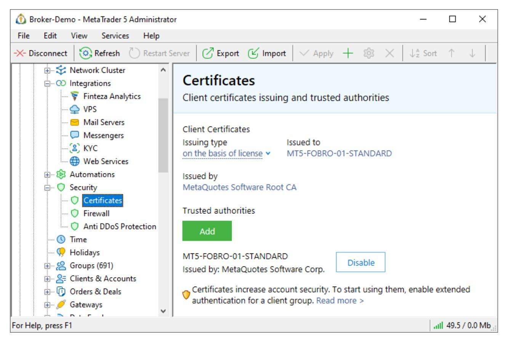

When authorizing on the server with a certificate, the certification authority is checked. Authorization is allowed only with certificates issued by trusted authorities. By default, such an authority is a certificate from the trading platform license, which is used to generate client certificates.

To add another certification authority, click the appropriate button and specify the \*.cer or \*.crt file. If necessary, any of the previously added certification authorities can be disabled at any time.

See also: [Documentation](https://support.metaquotes.net/en/docs/mt5/platform/administration/security/security_certificates) / Platform / Platform settings / Security / Certificates

#### **Setting up a client group**

To enable extended validation for client groups, open the **Common** tab and select a certificate generation option in the **Authentication** tab: 1024-bit RSA SSL certificate or 2048-bit RSA SSL certificate. 2048-bit encryption offers a higher level of security, but certificate generation can be slower. 1024-bit encryption is sufficient in most cases.

| Group:                                                                                         | demo\demoforex                                                                         |
|------------------------------------------------------------------------------------------------|----------------------------------------------------------------------------------------|
| Common<br>Company<br>News & Mail<br>Permissions<br>Margin<br>Symbols<br>Commissions<br>Reports |                                                                                        |
| Group is a set of users that have the same permission settings and service conditions.         | Please specify name of group, deposit currency, trade server, and authentication type. |
| Name:                                                                                          | demo\demoforex                                                                         |
| Currency:                                                                                      | <b>USD</b>                                                                             |
| Trade server:                                                                                  | Trade Main, 1                                                                          |
| Digits:                                                                                        | 2                                                                                      |
| Authentication:                                                                                | 1024-bit RSA SSL certificate                                                           |
| Minimum password length:                                                                       | 8                                                                                      |
| One-time password:                                                                             | <b>Disabled</b>                                                                        |
| Force one-time password usage                                                                  |                                                                                        |
| Enable connections                                                                             |                                                                                        |
| Enable certificate confirmation                                                                |                                                                                        |
| Change password at first login                                                                 |                                                                                        |
| cal{q} Show the risk warning window after connection                                        |                                                                                        |
| Enforce country-specific regulatory restrictions for retail clients                            |                                                                                        |
|                                                                                                |                                                                                        |
| Cancel                                                                                         | <b>Help</b>                                                                            |

#### **Confirmation of certificates**

For added security, you can enable manual confirmation of certificates generated for clients (the **Enable certificate confirmation** option.)

The first time a user connects in the extended authentication mode, a certificate is generated for the user. However, the below restrictions apply untilthe generated certificate is confirmed by a manager or administrator:

- ·The account can't be used for connection from the Administrator or Manager terminal.
- ·Connection from client terminals is only possible in the investor mode, without the possibility to trade.

After generating the certificate, an email is sent to the terminal via the internal mail system, explaining which actions should be taken next to confirm the certificate (for example, the user should callthe specified number). The emailtemplate is located under [trade server installation directory\templates\certificate\]. Edit the template for your specific company.

As soon as the user takes the required steps described in the email, the administrator or manager can confirm the user certificate on the **Security** tab of the account.

| Account:                                                                                     | 1068, John Smith, USD, 1:100, Netting     |
|----------------------------------------------------------------------------------------------|-------------------------------------------|
| Overview                                                                                     |                                           |
| Personal                                                                                     |                                           |
| Account                                                                                      |                                           |
| Profile                                                                                      |                                           |
| Subscriptions                                                                                |                                           |
| Security                                                                                     |                                           |
| Certificate                                                                                  |                                           |
| Extended authentication with SSL certificate based on RSA 1024 bit is used for this account. | Read more about standard SSL certificates |
| Confirm                                                                                      |                                           |
| Reset                                                                                        |                                           |
| Import                                                                                       |                                           |
|                                                                                              |                                           |
|                                                                                              |                                           |
|                                                                                              |                                           |
|                                                                                              |                                           |
|                                                                                              |                                           |
|                                                                                              |                                           |
|                                                                                              |                                           |
|                                                                                              |                                           |
|                                                                                              |                                           |
|                                                                                              |                                           |
| New Client                                                                                   |                                           |
| Update                                                                                       |                                           |
|                                                                                              | Cancel                                    |
| Help                                                                                         |                                           |
| ui.                                                                                          |                                           |

- ·Certificates are confirmed automatically for demo groups, immediately after certificate generation.
- · If during certificate confirmation the user is connected to a trade server from the client terminal, the user will need to re-connect in order to switch to the full-featured operation with an account (with access to trading functionality).

See also: Documentation / Platform / Platform components / Trade server / [Emailtemplates](https://support.metaquotes.net/en/docs/mt5/platform/components/trade_server/mail_templates)

#### **Generating a certificate**

When connecting to a server in the extended authentication mode, the user first completes the standard authentication procedure by specifying the login and password. The server checks if there is an installed certificate for this account. If a certificate is found, the extended authentication is performed (the client certificate is validated). If it is not found, a new certificate is generated.

The trade server sends to the terminal a request to generate two keys, including a [private](https://ru.wikipedia.org/wiki/%D0%97%D0%B0%D0%BA%D1%80%D1%8B%D1%82%D1%8B%D0%B9_%D0%BA%D0%BB%D1%8E%D1%87) and a [public](https://ru.wikipedia.org/wiki/%D0%9A%D1%80%D0%B8%D0%BF%D1%82%D0%BE%D1%81%D0%B8%D1%81%D1%82%D0%B5%D0%BC%D0%B0_%D1%81_%D0%BE%D1%82%D0%BA%D1%80%D1%8B%D1%82%D1%8B%D0%BC_%D0%BA%D0%BB%D1%8E%D1%87%D0%BE%D0%BC) key. The private key is used for decrypting server messages. It is not transmitted anywhere and is only stored in the

terminal(in an encrypted form, bound to the specific hardware). The public key is sent to a trade server and is saved in the client record. The trade server will use the key to encrypt messages which are sent to the terminal.

Based on the account data (client name and account number), the server generates a public key [certificate](https://ru.wikipedia.org/wiki/%D0%A1%D0%B5%D1%80%D1%82%D0%B8%D1%84%D0%B8%D0%BA%D0%B0%D1%82_%D0%BE%D1%82%D0%BA%D1%80%D1%8B%D1%82%D0%BE%D0%B3%D0%BE_%D0%BA%D0%BB%D1%8E%D1%87%D0%B0) and signs it using a private key (this ensures that the certificate can't be falsified). This certificate is sent to the terminal. It will be used for authenticating the user on the server and for encrypting data sent by the terminalto the server.

Next, the terminal packages the previously generated private key and the public key certificate, received from the server, into one file (container), PFX [certificate.](https://ru.wikipedia.org/wiki/PKCS12) The PFX is additionally protected with a password. Thus, even having obtained a PFX certificate, attackers will not be able to use it.

The password for protecting the PFX certificate is set by the user in a special dialog:

| Password for SSL certificate | For higher security the extended authorization is used on the server. To continue the standard SSL certificate will be generated.<br>Read more about standard SSL certificates<br>Please enter password to protect your new certificate. Password must be at least 8 symbols long with digits and different cases. |
|------------------------------|--------------------------------------------------------------------------------------------------------------------------------------------------------------------------------------------------------------------------------------------------------------------------------------------------------------------|
| Password:                    | Example: setSun57                                                                                                                                                                                                                                                                                                  |
| Confirm password:            |                                                                                                                                                                                                                                                                                                                    |
|                              | <input type="checkbox"/> Add certificate to the Windows System Storage                                                                                                                                                                                                                                             |
|                              | <button>Continue</button>                                                                                                                                                                                                                                                                                          |

The following should be specified here:

- ·**Password** — password to protect the certificate.
- ·**Confirm password** — confirmation of the password to avoid typing errors.
- · **Add the certificate to the Windows storage** — if this option is enabled, the certificate will be automatically installed to the operating system storage. If you installthe certificate to the system storage, then you can choose not to keep the PFX file of the certificate on the disk, in the /terminal\_data\_folder/config/certificates folder. The terminal always checks the availability of the certificate in the system storage and in the specified folder on the disk.

A password-protected PFX certificate is saved in the /profiles/server name/certificates directory of the Administrator/Manager terminal(or in the /config/certificates/ directory of the client terminal). Names to the certificate files are assigned according to the following rule: *Login\_ID\_Name.pfx*, where:

- ·**Login** — the account number
- ·**ID** — a short name of the company the account was opened in
- ·**Name** — name of a client specified when creating the account

- ·Even having access to the \*.pfx file, the certificate can't be used without the password.
- · The certificate password must contain at least two types of characters (lowercase letters, uppercase letters, digits or special characters). The same minimum length requirement is used for account and certificate passwords; the relevant option is configured in group settings, under the **Common** section.
- · Certificates are generated only during the first account connection, or if the certificate was intentionally reset on the server (via the account's **Security** section).
- ·The certificate is not checked if an investor password is used.

## **Using third-party certificates**

The trading platform allows the usage of your own client certificate for authentication if required by your company's security policy.

To use your own certificates, disable the certificate generation option in the trading platform. For this, navigate to **Security / Certificates** and select **Issuing type**: **disabled**.

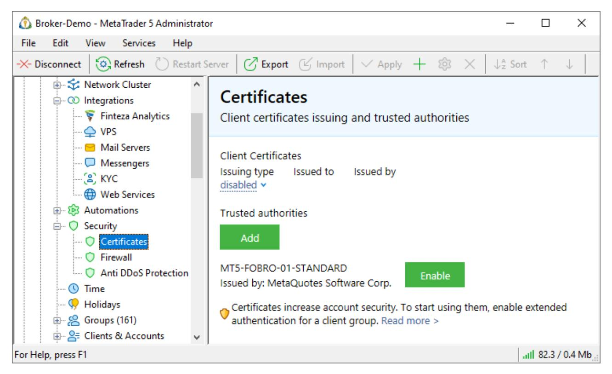

Next, add the certification authority which generates your own company certificates to the list of trusted authorities.

Automatic generation of certificates can only be disabled for certain groups. Navigate to the **Common** tab of the group and select **RSA Custom** in the Authentication field.

#### **Setting up a client group**

To enable extended authentication with your own certificates for a client group, open the **Common** tab in group settings. Select **Custom SSL certificate** in the Authentication field.

| Label                    | Value                                                                                        |
|--------------------------|----------------------------------------------------------------------------------------------|
| Group:                   | demo\demoforex                                                                               |
| Name:                    | demo\demoforex                                                                               |
| Currency:                | USD                                                                                          |
| Trade server:            | Trade Main, 1                                                                                |
| Digits:                  | 2                                                                                            |
| Authentication:          | Custom SSL certificate                                                                       |
| One-time password:       | Disabled                                                                                     |
| Minimum password length: | 8                                                                                            |
|                          |                                                                                              |
|                          | <input checked="" type="checkbox"/> Enable connections                                       |
|                          | <input type="checkbox"/> Enable certificate confirmation                                     |
|                          | <input type="checkbox"/> Change password at first login                                      |
|                          | <input type="checkbox"/> Show the risk warning window after connection                       |
|                          | <input type="checkbox"/> Enforce country-specific regulatory restrictions for retail clients |
|                          |                                                                                              |
|                          | <button>OK</button>                                                                          |
|                          | <button>Cancel</button>                                                                      |
|                          | <b>Help</b>                                                                                  |

- · Manual confirmation for custom certificates is not supported. Such certificates are confirmed automatically, when you import the [certificate](#page-91-0) to the client record.
- · If automated generation of certificates is disabled for the entire platform under the **Security / Certificates** section, custom certificates can be used with any extended authentication mode (1024 bit, 2048-bit or Custom certificate).

#### **Issuance of certificates to clients**

If you choose to use custom certificates, then your company will be responsible for the distribution of certificates among clients. You should provide certificate files to clients (for example, in person, on any digital medium, including an e-token). The provided certificate must contain a private key.

To use the certificate for authentication, the client needs to do one of the following:

- · Copy the certificate file to the /profiles/server name/certificates directory of the Administrator (Manager) terminal or to the /config/certificates/ directory of the client terminal.
- · Installthe certificate to the operating system storage on the computer, from which the client will work with the trading platform.
- ·Connect a portable storage (e-token) to the computer.

During authentication, the terminal checks the described terminal storages. Please note that the required certificate in the /certificates folder of the terminal is searched by the account number specified in the certificate file name. The account number must be specified at the beginning of the certificate file, for example, 10034\_JohnSmith.pfx. This requirement does not apply to certificates installed in the operating system storage or a portable storage.

#### <span id="page-91-0"></span>**Importing a certificate into a client record**

With extended authentication, the server compares the client's certificate with the certificate associated with its account on the server. When the certificates are automatically generated on the server, the issued certificates are automatically imported into the account.

If you are using your own certificates, you must import them into client records. To do this, go to the **Certificates** tab of the client account and click Import:

| Account                                                                                      | 1068, John Smith, USD, 1:100, Netting       |
|----------------------------------------------------------------------------------------------|---------------------------------------------|
| Overview                                                                                     |                                             |
| Personal                                                                                     | Account Profile Subscriptions Security      |
| Certificate                                                                                  |                                             |
| Read more about standard SSL certificates                                                    |                                             |
| Extended authentication with SSL certificate based on RSA 1024 bit is used for this account. |                                             |
| Confirm                                                                                      |                                             |
| Reset<br>Import                                                                              |                                             |
| Open                                                                                         | 3 Open                                      |
|                                                                                              |                                             |
|                                                                                              |                                             |
| Left arrow                                                                                   |                                             |
| config                                                                                       |                                             |
| certificates                                                                                 | Ō                                           |
| Search certificates                                                                          | Ω                                           |
| Organise<br>New folder                                                                       | ⊪ ▼<br>$11$                                 |
| This PC                                                                                      |                                             |
| Name                                                                                         | ㅅ                                           |
| Date modified                                                                                |                                             |
| Type                                                                                         |                                             |
| 3D Objects                                                                                   | <b>1068_ForexBroker_John_Smith.crt</b>      |
|                                                                                              | 3/31/2021 11:57 AM                          |
| Desktop                                                                                      |                                             |
| Documents                                                                                    |                                             |
| Downloads<br>Music                                                                           |                                             |
| Pictures                                                                                     |                                             |
| Videos                                                                                       |                                             |
| OS (C:)                                                                                      | $\frac{12}{3}$                              |
| DATA (D:)                                                                                    | $\Rightarrow$                               |
| New Client                                                                                   | $\frac{a}{\sqrt{a}}$ Local Disk (E:)<br>$✓$ |
|                                                                                              |                                             |
| File name:                                                                                   | $✓$                                         |
|                                                                                              | Certificate X.509 (*.cer;*.crt)             |
|                                                                                              |                                             |
|                                                                                              |                                             |

A certificate is automatically confirmed during import. The additional confirmation function is not used.

## <span id="page-92-0"></span>**One-time passwords for connecting to accounts**

Use of one-time passwords (OTP) provides an additional level of security when working with the platform. The user must enter a unique OTP in addition to the login and password every time to connect to an account.

OTPs are generated in the mobile [terminalfor](https://download.mql5.com/cdn/mobile/mt5/ios?hl=ru&utm_campaign=download&utm_source=metatrader5.help) iPhone and mobile [terminalfor](https://download.mql5.com/cdn/mobile/mt5/android?hl=ru&utm_campaign=download&utm_source=metatrader5.help) Android.

### **Enabling OTP on the server**

OTP settings are managed at the account group level. For example, you can allow the OTP usage for demo groups and enforce them for real clients.

| Group: real\usd-standard |                                                                                    |                                                                                                                                    |              |         |                                                                                                                                                                                  |            |   | ×    |
|--------------------------|------------------------------------------------------------------------------------|------------------------------------------------------------------------------------------------------------------------------------|--------------|---------|----------------------------------------------------------------------------------------------------------------------------------------------------------------------------------|------------|---|------|
| Common<br>Company        | News & Mail                                                                        | <b>Permissions</b>                                                                                                                 | Margin       | Symbols | <b>Commissions</b>                                                                                                                                                               | Reports    |   |      |
|                          |                                                                                    |                                                                                                                                    |              |         | Group is a set of users that have the same permission settings and service conditions.<br>Please specify name of group, deposit currency, trade server, and authentication type. |            |   |      |
| Name:                    | real\usd-standard                                                                  |                                                                                                                                    |              |         | Currency:                                                                                                                                                                        | <b>USD</b> |   |      |
| Trade server:            |                                                                                    | MetaTrader 5 Main Server, 1                                                                                                        |              |         |                                                                                                                                                                                  | Digits:    |   |      |
| Authentication:          | Normal                                                                             |                                                                                                                                    | $\checkmark$ |         | Minimum password length:                                                                                                                                                         |            | 8 |      |
| One-time password:       | <b>TOTP</b> for All<br><b>Disabled</b><br><b>TOTP for All</b><br>TOTP for Web only |                                                                                                                                    |              |         | Force one-time password usage                                                                                                                                                    |            |   |      |
|                          |                                                                                    | Change password at first login<br>Show the risk warning window after connection<br>Allow deals notifications from the trade server |              |         | Enforce country-specific regulatory restrictions for retail clients                                                                                                              |            |   |      |
|                          |                                                                                    |                                                                                                                                    |              |         | ОК                                                                                                                                                                               | Cancel     |   | Help |

#### **Enabling**

OTPs can be enabled for all connection types or only for web [terminal](#page-12-0) connections. Select the desired option in the **One-time password** parameter.

#### **Forced use**

In some countries, regulatory authorities require the use of additional account security measures, such as the OTPs. When the **Force one-time password usage** option is enabled, alltraders from this group will need to use OTPs for connection. Otherwise, users can bind their accounts to a password generator or use the default

authentication method. Before you enable this option, please inform your clients about the new OTP option. Be extremely careful enabling this option for the only one manager group on the trading server.

#### **Using OTPs in web terminals**

The MetaTrader 5 platform supports the extended [authentication](#page-84-0) using certificates. It protects users but works only on desktop and mobile terminals. For web terminal users, only OTPs can be used as additional means of protection.

If you enable OTPs for everyone, those who use certificates will experience unnecessary difficulties connecting to the platform. They will have to pass a triple authentication: enter their standard login/password, provide a certificate, and specify a one-time password.

In order to protect web terminal users without causing extra difficulties for other users who already apply certificates, enable the **TOTP for Web only** mode. Now, if you enable the **Force one-time password usage**, one-time passwords will become mandatory for web terminals (other connections are not affected).

#### **Disabling OTP for individual accounts**

You can disable OTPs for individual clients from the group. Use an appropriate option in the **Account** section:

| Account:                                           | 1068, John Smith, USD, 1:100, Netting                              |
|----------------------------------------------------|--------------------------------------------------------------------|
| Account Profile Subscriptions Security Certificate | Overview                                                           |
| Group:                                             | real\extended                                                      |
| Color:                                             | None                                                               |
| Leverage:                                          | 1:100                                                              |
| Bank account:                                      |                                                                    |
| Agent account:                                     |                                                                    |
| <b>Enable this account:</b>                        | ✓ Enable trading<br>Enable trading by Expert Advisors              |
| <b>Enable trading:</b>                             | ✓ Enable trading<br>Enable trading by Expert Advisors              |
| <b>Enable to change password:</b>                  | ✓ Enable to change password<br>Enable daily reports                |
| <b>Enable trailing stops:</b>                      | ✓ Enable trailing stops<br>Change password at next login           |
| <b>Enable one-time password:</b>                   | ✓ Enable one-time password<br>Sponsored MetaTrader Virtual Hosting |
| Trade accounts:                                    | Gateway ID<br>Account                                              |
| Synchronize                                        |                                                                    |
|                                                    |                                                                    |
|                                                    |                                                                    |
| Add                                                |                                                                    |
| Edit                                               |                                                                    |
| <b>Delete</b>                                      |                                                                    |
|                                                    |                                                                    |
| New Client:                                        | Update                                                             |
| Cancel                                             | Help                                                               |

## **Enabling OTP on iPhone**

To start using OTPs, the user should link their account with a password generator, which is a mobile terminalfor iPhone.

Go to the Settings of the mobile terminal and select OTP. For security reasons, when the section is opened for the first time, the user is requested to set a four-digit password. The password must be entered each time when accessing the password generator.


In the window that opens, select **Bind to account**.

| <b>OTP</b>                                                    |               | $\zeta$ OTP | <b>OTP</b>                                                                                 | <b>Bind</b>       |
|---------------------------------------------------------------|---------------|-------------|--------------------------------------------------------------------------------------------|-------------------|
| MetaTrader 5                                                  |               |             | MetaTrader <sub>5</sub>                                                                    |                   |
| 321394                                                        |               | Server      |                                                                                            | MetaQuotes-Demo > |
| Enter this code when logging in to the bound trading accounts |               | Login       |                                                                                            | 40940875          |
|                                                               |               | Password    |                                                                                            | master password   |
| Bind to account                                               | $\mathcal{P}$ | Bind        |                                                                                            |                   |
| Change Password                                               | $\mathcal{P}$ |             | One-time password generator will be bound to 40940875 -<br>MetaQuotes-Demo trading account |                   |
| Synchronize Time<br>Last synchronization: 12:30 pm            |               |             |                                                                                            |                   |
|                                                               |               |             |                                                                                            |                   |
|                                                               |               |             |                                                                                            |                   |
|                                                               |               |             |                                                                                            |                   |
|                                                               |               |             |                                                                                            |                   |
|                                                               |               |             |                                                                                            |                   |
|                                                               |               |             |                                                                                            |                   |
|                                                               |               |             |                                                                                            |                   |
|                                                               |               |             |                                                                                            |                   |
|                                                               |               |             |                                                                                            |                   |
|                                                               |               |             |                                                                                            |                   |

Next, specify the name of the server on which the account was opened, the account number and the master password to it. The **Bind** option should be kept enabled. Disabled it, if you are going to unbind the specified account from the generator and stop using OTPs.

If you rebind your account to another password generator, you need to additionally enter an OTP from the previously used generator. If you do not have access to it (for example, your mobile device is lost), the binding can be reset via the account [settings](#page-100-0).

Tapping on the Bind button located at the top of the window binds the trading account to the generator. An appropriate message appears after that.

| <b>Label</b>            | <b>Value</b>                                                  |
|-------------------------|---------------------------------------------------------------|
| OTP                     | MetaTrader 5                                                  |
| Server                  | MetaQuotes-Demo >                                             |
| Login                   | 40940875                                                      |
| Password<br><b>Bind</b> | Enter this code when logging in to the bound trading accounts |
|                         | 354384                                                        |
| Bind to account         | MetaTrader 5                                                  |
| Change Password         | 40940875                                                      |
| Synchronize Time        | Last synchronization: 12:30 pm                                |
|                         | OK                                                            |

Likewise, you can bind an unlimited number of accounts to the generator.

The one-time password is displayed at the top of the **OTP** section. A blue bar below visualizes the password lifetime. Once the password expires, it is no longer valid, and a new password will be generated.

Additional commands:

- ·Change Password — change the generator password.
- · Synchronize Time — synchronize the time of the mobile device with the reference server. Accuracy requirement is due to the fact that the one-time password is bound with the current time interval, and this time should be the same on the client terminal and the server side.

## **Enabling OTP on Android device**

Go to the **Accounts** section of the mobile terminal and tap . For security reasons, when the section is opened for the first time, the user is requested to set a four-digit password. The password must be entered each time when accessing the password generator.

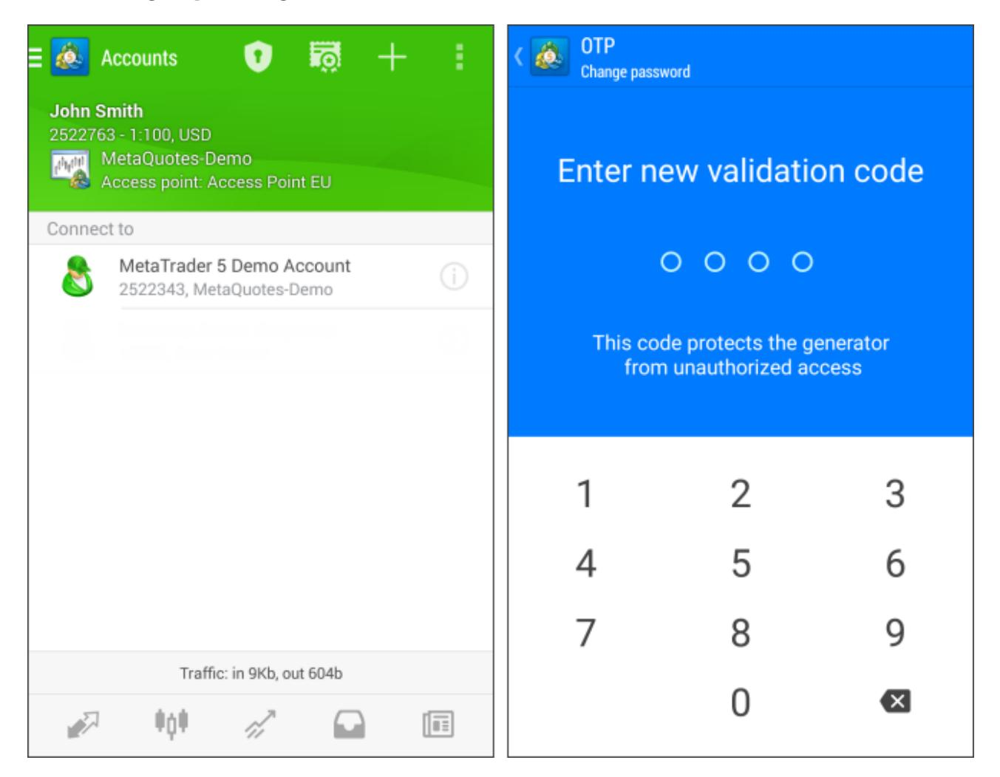

In the window that opens, select **Bind to account**.

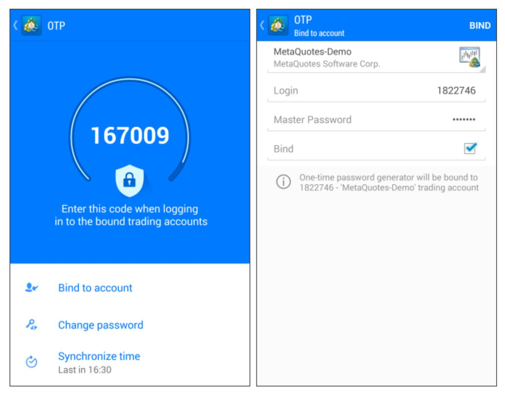

Next, specify the name of the server on which the trading account was opened, the account number and the master password to it. The **Bind** option should be kept enabled. Disabled it, if you are going to unbind the specified account from the generator and stop using OTPs.

If you rebind your account to another password generator, you need to additionally enter an OTP from the previously used generator. If you do not have access to it (for example, your mobile device is lost), the binding can be reset via the account [settings](#page-100-0).

Tapping on the Bind button located at the top of the window binds the trading account to the generator. An appropriate message appears after that.

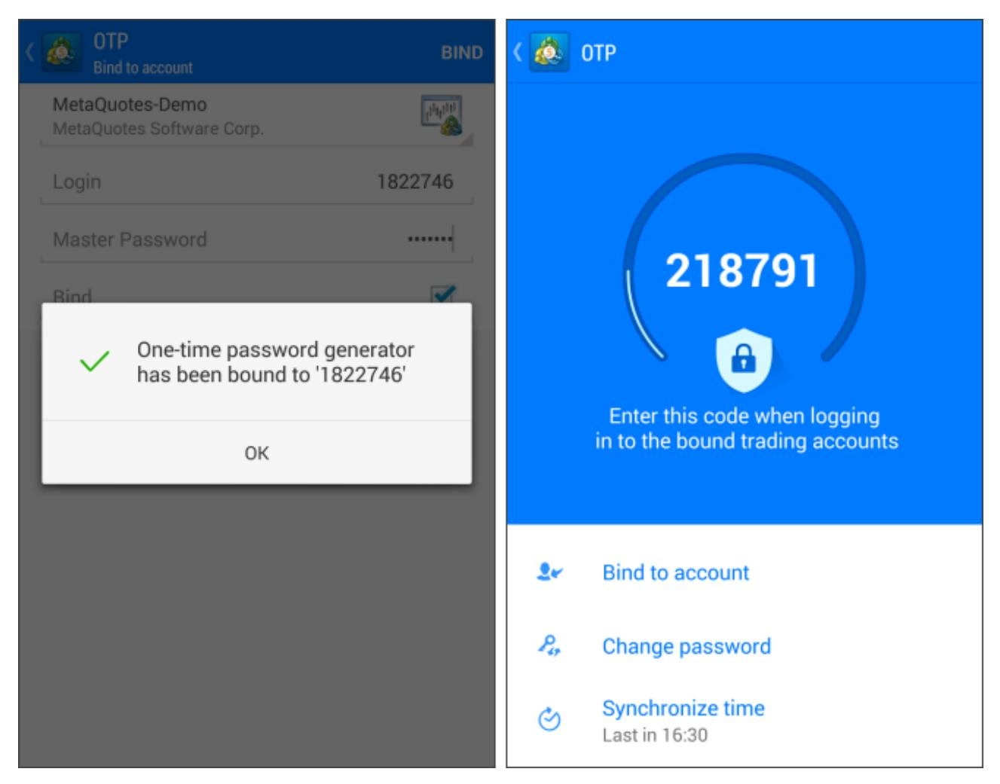

Likewise, you can bind an unlimited number of accounts to the generator.

The one-time password is displayed at the top of the **OTP** section. A blue bar below visualizes the password lifetime. Once the password expires, it is no longer valid, and a new password will be generated.

Additional commands:

- ·Change Password — change the generator password.
- · Synchronize Time — synchronize the time of the mobile device with the reference server. Accuracy requirement is due to the fact that the one-time password is bound with the current time interval, and this time should be the same on the client terminal and the server side.

#### **How to use OTP in the desktop terminal**

After binding an account to the generator, a one-time password will be additionally requested when connecting to it from the Administrator terminal.

Authorization allows to get access to the trade account

| Login                                                                          | 40940875 ✓      |               |
|--------------------------------------------------------------------------------|-----------------|---------------|
| Password                                                                       | ••••••••        | Save password |
| One-time password                                                              |                 |               |
| Server                                                                         | MetaQuotes-Demo |               |
| <button type="button"><b>OK</b></button> <button type="button">Cancel</button> |                 |               |

### <span id="page-100-0"></span>**Resetting binding to the OTP generator**

If the user forgets the password to the password generator but uses the same mobile device, they can reinstall the mobile platform and rebind the account to the generator.

If the user no longer has access to the mobile device, binding to the password generator can be reset via the account settings.

| <b>Account:</b>                                                                                   | 1068, John Smith, USD, 1:100, Netting                                                 |
|---------------------------------------------------------------------------------------------------|---------------------------------------------------------------------------------------|
| <b>Overview</b>                                                                                   |                                                                                       |
| <b>Personal</b>                                                                                   |                                                                                       |
| <b>Account</b>                                                                                    |                                                                                       |
| <b>Profile</b>                                                                                    |                                                                                       |
| <b>Subscriptions</b>                                                                              |                                                                                       |
| <b>Security</b>                                                                                   |                                                                                       |
| <b>Certificate</b>                                                                                |                                                                                       |
| Master password is used for full access to the trading account                                    |                                                                                       |
|                                                                                                   | <button>Check</button> <button>Change</button><br><small>minimum 8 characters</small> |
| Investor password is used for limited access to the trading account in read-only mode             |                                                                                       |
|                                                                                                   | <button>Check</button> <button>Change</button><br><small>minimum 8 characters</small> |
| API password is used for access to the server using Web API                                       |                                                                                       |
|                                                                                                   | <button>Check</button> <button>Change</button><br><small>minimum 8 characters</small> |
| Phone password allows to identify the account owner when performing trade operations by phone     |                                                                                       |
|                                                                                                   | to view password set focus to field                                                   |
| Shared secret key in combination with the current timestamp is used to generate one-time password |                                                                                       |
| <b>OTP secret key</b>                                                                             |                                                                                       |
|                                                                                                   |                                                                                       |
| New Client                                                                                        |                                                                                       |
|                                                                                                   | <button>Update</button> <button>Cancel</button> <button>Help</button>                 |

Delete the private key and save changes. After that, the user will be able to bind the account to the generator again.

## <span id="page-102-0"></span>**Common errors**

- · Do not add your own IP address to the deny list in the [firewall](#page-67-0) settings; otherwise, you will lose access to the system.
- · When configuring IP address restrictions for your own [manager](#page-82-0) account, add your current address to the list; otherwise, you will lose access to the system.
- · Do not enable extended SSL authentication along with one-time passwords for accounts. This will complicate access to accounts.
- ·Do not disable the built-in [anti-flood](#page-65-0) control system. It protects the system against malicious attacks.

## <span id="page-103-0"></span>**Configuring platform backups**

Data safety and uninterrupted operation of the trading platform are key points for any brokerage company. Even a short stop of a trade server leads to loss of money and reputation. Today, the ability to ensure uninterrupted business processes is one of the main requirements set by financialregulators. MetaTrader 5 features allthe necessary components to provide system continuity in any critical situation.

The MetaTrader 5 platform provides a separate component responsible for data security, the [backup](#page-9-0) server. It runs in parallel as an exact copy of the primary trade or history server. The backup server state is constantly synchronized with the primary server, enabling the system to switch to the backup server at any time. Furthermore, the backup process is resource efficient:

- · Critical and frequently changing data is synchronized in realtime. These include client and trade databases, platform settings, configurations and databases of gateway trade executions.
- · The rest of data is backed up every hour, including mail and news databases, files, executable files of gateways and data feeds and plugins.

Multiple backup servers can be installed for each trade and history server, to minimize the risk of system failure.

Always install backup servers which are the mandatory components of the platform. Trade and history servers do not create backups of databases.

During complete platform [installation](#page-6-0), a backup server is only created for the main server of the cluster. It is recommended to manually add backup servers for history and additionaltrade servers of the cluster.

See also: [Documentation](https://support.metaquotes.net/en/docs/mt5/platform/components/backup_server) / Platform / Platform components / Backup server

## <span id="page-104-0"></span>**Backup server installation**

Backup servers must be installed separately from the primary servers, and always on separate computers. The easiest way to install a server is to configure it in the MetaTrader 5 Administrator terminal and then to use the deployment function.

Before deploying a server, be sure to configure server network parameters: the password that will be used by other cluster components for connection to the backup server, as well as the IP addresses through which the new server will send and receive data. Allthese parameters will be registered in the server installation package. Thus, all other cluster components will be able to connect to the backup server immediately after installation, while you will be able to manage the server via the Administrator terminal.

All other parameters can be configured after installation.

| Server |
|--------|
| Common |

Please specify common server settings: type, name, internal identifier, and password.

| Type:     | <b>Backup Server</b>            |
|-----------|---------------------------------|
| Name:     | MetaTrader 5 Main Backup Server |
| ID:       | 4                               |
| Password: | • • • • • • • •                 |

| Server |                                                                 |
|--------|-----------------------------------------------------------------|
| Common | Network   Backup   SQL Export   SQL Options   Folders   Service |

The following IPv4 and IPv6 addresses are used for outgoing connections from this server.

Please specify network settings of the server: outgoing address, public addresses, and bindings.

| Address:                      | 18.140.18.42:2000                                                         |
|-------------------------------|---------------------------------------------------------------------------|
|                               | 98	670	1C4                                                             |
| ✓                             | [2a00:1111:1:20::2a]:2000                                                 |
| Listen on these IP addresses. |                                                                           |
|                               | <input checked="" type="checkbox"/> Automatically use as public addresses |
| Add                           |                                                                           |
|                               | 18.140.18.42:2000                                                         |
|                               | [2a00:1111:1:20::2a]:2000                                                 |
| Edit                          |                                                                           |
|                               | Ƀ [2a00:1111:1:20::2a]:2000                                               |
|                               |                                                                           |
| <b>Delete</b>                 |                                                                           |

| <button>OK</button> | <button>Cancel</button> | <button>Help</button> |
|---------------------|-------------------------|-----------------------|
|---------------------|-------------------------|-----------------------|

| MetaQuotes - MetaTrader 5 Administrator                                                                                  |                                                |                                        |                                                                                                                                                                                                  |                   |                   |                   |         |    |                 |  |  |  |                                          |  |
|--------------------------------------------------------------------------------------------------------------------------|------------------------------------------------|----------------------------------------|--------------------------------------------------------------------------------------------------------------------------------------------------------------------------------------------------|-------------------|-------------------|-------------------|---------|----|-----------------|--|--|--|------------------------------------------|--|
| <table> <tr> <td>Edit</td> <td>File</td> <td>View</td> </tr> </table>                                                    | Edit                                           | File                                   | View                                                                                                                                                                                             | <b>Services</b>   | Help              |                   |         |    |                 |  |  |  |                                          |  |
| Edit                                                                                                                     | File                                           | View                                   |                                                                                                                                                                                                  |                   |                   |                   |         |    |                 |  |  |  |                                          |  |
| -X-Disconnect                                                                                                            | $igcirc$ , Refresh $igcirc$ Restart Server   |                                        | <table> <tr> <td><math>oxed{C}</math> Export</td> <td><math>oxed{C}</math> Import</td> <td><math>oxed{ v}</math> Apply</td> <td>+</td> <td>Q3</td> <td><math>	imes</math></td> </tr> </table> | $oxed{C}$ Export | $oxed{C}$ Import | $oxed{ v}$ Apply | +       | Q3 | $	imes$         |  |  |  | $
ightarrow$ <sub>2</sub> Sort $ earrow$ |  |
| $oxed{C}$ Export                                                                                                        | $oxed{C}$ Import                              | $oxed{ v}$ Apply                      | +                                                                                                                                                                                                | Q3                | $	imes$           |                   |         |    |                 |  |  |  |                                          |  |
| Network Cluster کے اہ<br>由 - 景 Trade Main<br>□ * * ① History                                                             | <b>Backup History</b>                          | $ar{
ule{0.5em}{0.4em}}$              | Traffic in: 0 Kbit/s<br>- Traffic out: 0 Kbit/s                                                                                                                                                  |                   |                   |                   |         |    |                 |  |  |  |                                          |  |
| □ = 帕 Trade = Restart<br>$oxed{
ule{0.3em}{0.3em}}$ $igcirc$ Anti D $igcirc$ Deploy<br>$ar{
ule{1em}{0.4em}}$ Access | Switch to Backup                               |                                        |                                                                                                                                                                                                  |                   |                   |                   |         |    |                 |  |  |  |                                          |  |
| $lacksquare$ Access                                                                                                     | <b>E-CO</b> Integration <b>V</b> Apply Changes | $Ctrl + S$                             |                                                                                                                                                                                                  |                   |                   |                   |         |    |                 |  |  |  |                                          |  |
| 由 ® Automation<br><b>⊞</b> ○ Security<br>$igcirc$ Time<br>$bQ$ Holidays                                                | $+$ Add<br>愈 Edit<br>$	imes$ Delete            | $Ctrl + N$<br>$Ctrl + U$<br>$Ctrl + D$ | 0                                                                                                                                                                                                |                   |                   |                   |         |    |                 |  |  |  |                                          |  |
| 中名 Groups (6<br>⊕ <u>⊱</u> Clients &                                                                                     | Export Configurations<br>Import Configurations |                                        | nits: 0<br><b>CPU</b><br>lerview                                                                                                                                                                 | Memory            | <b>Disk</b>       | Connections       | Network |    | Journal         |  |  |  |                                          |  |
| For Help, press F1                                                                                                       | <sup>3</sup> Refresh                           | F <sub>5</sub>                         |                                                                                                                                                                                                  |                   |                   |                   |         |    | all 6052 / 0 Kb |  |  |  |                                          |  |

After creating a configuration, run the server deployment command:

After that you willreceive an executable file. Copy it to the directory to which you want to installthe new server.

Before installation, please make sure that network [parameters](#page-20-0) are correctly configured and allthe [required](#page-22-0) [ports](#page-22-0) are open on the computer on which you are going to installthe backup server. It is important because during deployment, an instant connection to allthe required servers of the cluster will be required.

If a MetaTrader 5 cluster component is deployed on another subnet (different from the one where the Main trade server and the History server are installed), the Main and the History servers must be accessible via the internet. Otherwise, the newly installed component will not be able to connect to them.

See also: Articles / Technical support [workdays:](https://support.metaquotes.net/en/articles/985) stumbling quotes and slippery backups

Once you have checked allthe settings, run the generated executable file from the command line with the /install key. For example:

D:\MetaTrader 5 Platform\Backup History\Deploy\_5\_Backup\_Server.exe /install

The file will installthe backup server with the parameters that you have previously set in MetaTrader 5 Administrator.

Next, configure the rest of the backup parameters:

| Server                                                                                                                               |                               |             |
|--------------------------------------------------------------------------------------------------------------------------------------|-------------------------------|-------------|
| Common Network Backup Folders Service                                                                                                |                               |             |
| Backup server is used for backup of trade and history servers. Please specify the name of server to be reserved and backup settings. |                               |             |
| Master server:                                                                                                                       | History Server, 3             |             |
| Use this backup server for automated failover                                                                                        |                               |             |
| ∪ Synchronize journals with master server                                                                                            |                               |             |
| √ Enable backups                                                                                                                     |                               |             |
| Backups path:                                                                                                                        | C:\MetaTrader5Backup\\History |             |
| Backup time:                                                                                                                         | 00:17                         |             |
| Enable tick backups                                                                                                                  |                               |             |
|                                                                                                                                      |                               |             |
|                                                                                                                                      |                               |             |
|                                                                                                                                      |                               |             |
|                                                                                                                                      |                               |             |
| <b>OK</b>                                                                                                                            | <b>Cancel</b>                 | <b>Help</b> |

The backup server state is synchronized with the primary server and thus an exact copy of the primary server is creates, which enables switching to the backup server whenever it may be needed. In addition, the server creates database copies as files in the specified directory. Thus, even if the backup server databases are damaged due to which switching to this server becomes impossible, you can use database backups from a disk and restore the relevant server state.

When configuring backup parameters, you should find balance between the backup frequency and the available drive space on the computer where the backup server is installed. The following backup parameters are available in this section:

- ·**Master server** is the name of the server to be backed up and the server login (identifier).
- · **Use this backup server for automated failover**. The trading platform provides the [automated](#page-115-0) failover [system](#page-115-0) which is enabled in case the primary server fails. By default, the platform can switch to any of existing backup servers. If a certain backup server should not be used by the automated failover system, disable this option in backup settings. This may be needed if the backup server is only used for [exporting](#page-124-0) data to an SQL [database.](#page-124-0) You can additionally disable the **Enable backups** option for such servers, to save resources required for the creation of backup copies on a disk.

The option only disables automatic switching. If necessary, you can manually switch to this backup server.

· **Synchronize journals with master server**. The backup server is a copy of the primary server: it stores the same data as the primary server, including log files. If you are only using the backup server for data export to SQL, you can disable log synchronization with the primary server to save disk space.

- <span id="page-107-0"></span>· **Enable backups**. In addition to real-time state synchronization with the primary server, the backup server creates [database](#page-109-0) file copies on the hard disk on a daily basis. Such copies enable the [restoration](#page-120-0) of the primary server status as on a specific day. Disable this option to avoid the creation of file copies. It does not affect real-time data synchronization with the primary server. The backup server anyway serves as a full copy of the primary one. The creation of file copies can be disabled if the server is only used for exporting data to SQL.
- ·**Backups path** is the path on the computer at which the file copies will be saved.
- ·**Backup time** is the file copy creation time.
- <span id="page-107-1"></span>· **Additional backups**. Specify here the frequency of creation of additionalfile copies. By default, file copies are created every 24 hours, but you can set a more frequent custom period, once an hour or 4 hours. However, please note that more frequent backups require more server resources and more disk space. This option is only available for trade server backups. Backup copies of history servers are always created once every 24 hours.
- · **Keep backups** is file copies storage period. All backup copies older than the specified period are automatically deleted.
- · **Enable tick backups**. Copies of [ticks](#page-226-0) are created once a day during a full backup. The backup is performed incrementally: the first copy stores the full data snapshot, while further copies only contain changes relative to the first copy. This algorithm significantly reduces file size. The copies are stored in the \ticks directory where they are arranged in subdirectories by days, for example, ticks\2015.11.17, ticks\2015.11.18, etc. By default, the option is disabled since tick data takes much space. Adjust the **Keep backups** parameter carefully before enabling it. In case of long storage periods, backup tick copies may quickly consume all available disk space.

For manualtick data recovery, sequentially copy the folders with backup copies to the new history server, beginning with the oldest one. For example, the backup server has the following folders: ticks\2015.11.17, ticks\2015.11.18, and ticks\2015.11.19. First, copy the contents of ticks\2015.11.17 to the \ticks directory of the history server. Then, overwrite the contents with the data from the ticks\2015.11.18 folder. Then, overwrite the contents with data from the ticks\2015.11.19 folder.

The set of backup parameters for trade and history servers is different; all possible parameters were described earlier in this section.

In addition to creating periodic and full database backups, the backup servers create starting database copies. Such copies are created before the initial synchronization with the primary server in case its database is damaged. Starting backup copies have the \*start postfix. Initial synchronization is performed during the first connection to the primary server after the backup server start or restart. After the initial synchronization, the backup server willreceive data on changes made in the primary server, in realtime.

See also: Video / How to install a [backup](https://support.metaquotes.net/en/articles/1538) server

## <span id="page-108-0"></span>**Backup of custom directories and files.**

The server enables the synchronization not only of standard platform files and databases, but also of any custom directories and files. For example, many data feeds and plugins require their own .lic, .dat, and similar files for operation. These files should also be backed up.

| Label                                                  | Value                                                             |
|--------------------------------------------------------|-------------------------------------------------------------------|
| Server                                                 |                                                                   |
|                                                        |                                                                   |
| Common                                                 | Network                                                           |
| Backup                                                 | SQL Export                                                        |
| SQL Options                                            |                                                                   |
| Folders                                                |                                                                   |
| Service                                                |                                                                   |
|                                                        |                                                                   |
| Please specify additional folders for synchronization. |                                                                   |
| Folder                                                 |                                                                   |
|                                                        | ab \Plugins\TradePlugin\Settings                                  |
|                                                        |                                                                   |
| Add                                                    |                                                                   |
| Edit                                                   |                                                                   |
| Delete                                                 |                                                                   |
|                                                        |                                                                   |
|                                                        |                                                                   |
|                                                        | <button>OK</button> <button>Cancel</button> <button>Help</button> |

Specify custom directories to be backed up, on the **Folders** tab.

- · **Folder**. Paths are defined relative to the primary server. Subfolders are not backed up. You should specify them explicitly to enable backup.
- · **Masks**. Specify a comma-separated list of files to be copied. File names can be described using masks. If the list is specified, only listed files matching the mask are copied. Otherwise, allfiles from the directory will be copied.
- · **Exclude**. Specify a comma-separated list of files to be ignored. File names can be described using masks. If the list is specified, files from the list and the ones matching the mask will be skipped.

Example:

```
Folder=plugins\HistoryPlugin
Masks=EURUSD*.*,*.lic,*.dat;
Exclude=*.log,*.tmp
```

Files with the .lic and .dat extensions, and files beginning with EURUSD are synchronized in the <server\_installation\_directory>\plugins\HistoryPlugin folder, while .log and .tmp files are skipped.

## <span id="page-109-0"></span>**Periodic and file copies**

A backup server is a complete copy of the primary server. Its directory contains the same folders as the primary server. The only exception concerns the *logs* folder which contains journal entries and crash logs of the backup server. In addition, the following executable files are available in the directory:

- ·**mt5srvupdater64.exe** is the executable file of the backup server update symbol.
- ·**mt5archive.exe** is the archiver which is used to compress and uncompress backup databases.
- ·**mt5backup64.exe** is the executable file of the backup server.

Thus, in case of a failure, the backup server is ready to start performing allthe functions of the primary server.

The main data of trade and history servers is backed up in realtime. These include user database, trade databases, and platform settings.

| Data                                      | Trade server                                                                                                                                                                                                               | History server                                                                                                                                                                                                                                                                              |
|-------------------------------------------|----------------------------------------------------------------------------------------------------------------------------------------------------------------------------------------------------------------------------|---------------------------------------------------------------------------------------------------------------------------------------------------------------------------------------------------------------------------------------------------------------------------------------------|
| Critical (real time<br>backup)            | User database<br>Order database<br>Deal database<br>Configuration databases                                                                                                                                                | Trade execution (executions) and<br>custom settings (settings.dat)<br>databases of running gateways                                                                                                                                                                                         |
| Non-critical (backup<br>every hour)       | Files mt5sendmail64.exe and<br>mt5trade64.exe<br>Plugins (DLL, INI, DAT files, including<br>subdirectories)<br>Reports (DLL, INI files without<br>subdirectories)<br>Templates (HTML, HTM files without<br>subdirectories) | Tick history (minute bars are<br>completed directly at the backup<br>server)<br>mt5history(64).exe file<br>Gateways and datafeeds (EXE, DLL,<br>INI, DAT, JAR, CMD, BAT, PS1, VBS,<br>and PY files, including subdirectories)<br>Plugins (DLL, INI, DAT files, including<br>subdirectories) |
|                                           | User directories and files specified in the Folders section in backup server<br>settings                                                                                                                                   |                                                                                                                                                                                                                                                                                             |
| Non-critical (backup<br>every five hours) | Archive databases<br>Mail database<br>Daily reports database                                                                                                                                                               |                                                                                                                                                                                                                                                                                             |

Some non-criticaltrade and history server data is backed up on an hourly basis.

### **File copies**

In addition to real-time state synchronization with the primary server, the backup server creates database file copies on a disk as of certain points in time. File saving path, creation time and frequency, are specified in backup server [settings.](#page-107-0)

To save time and drive space, backups are performed incrementally:

- · The first backup copy is created for all data of the primary server. This copy is saved under the [Copy saving path]\base\ directory. The folder and file structure in this directory is fully consistent with the primary server.
- · Every next day (hour or 4 hours, depending on the [Additional](#page-107-1) parameter) , an incremental data copy is created. Such a copy contains only the changes as compared to the first (base) copy. Such copies are saved under [Copy saving path]\[YYYY.MM.DD\_HH.MM.SS]\ directories.

Thus, the server doesn't need to copy allthe data during each backup.

Consider an example of a deals database. Backup was enabled on 2019.11.06. The server created a database copy on this day. It appears on the left in the figure below. The entire history of deals is contained under the 'base' directory. It's divided by months and is presented as .zip files. During the next day, traders performed deals through the platform, while the administrator edited a trade which was executed in January 2019. On the next day, the backup server created an incremental copy in the folder named 2019.11.07\_17.10.00 (on the right). Only two .zip archives are included in the incremental copy directory. These are the archive that have changed relative to the base copy.

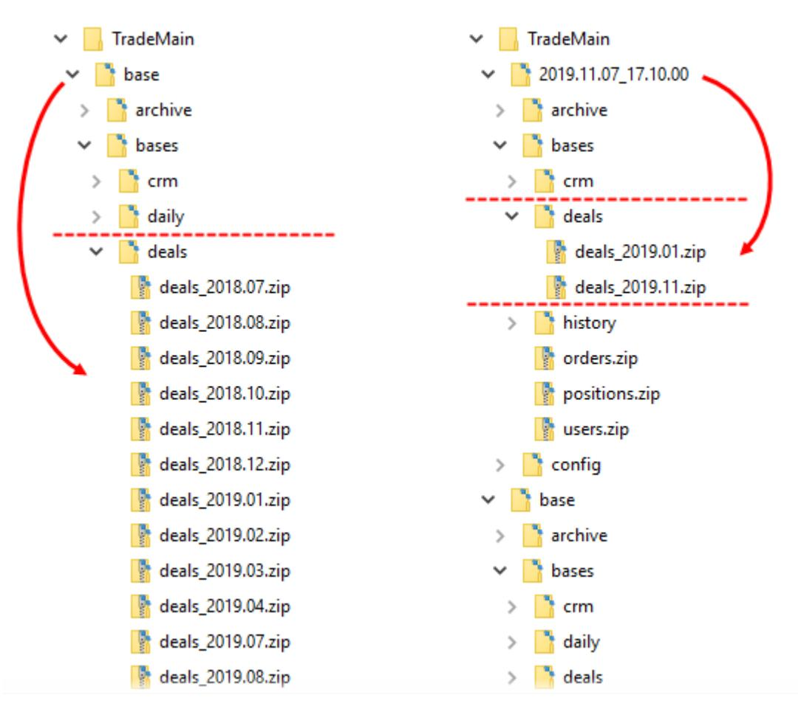

The server can automatically delete old copies to ensure that the backups do not take up allthe free space on the drive. Backup storage depth can be set using the **Keep backups** option in the backup server settings. An old copy is applied to the base backup before being deleted. Appropriate files are merged with the files from the /**base** directory. After that, the state of the /**base** directory will be identicalto the database state as at the

time of the appropriate incremental copy. Further incremental copies are created relative to the new base copy. This approach reduces the amount of data being copied during backup procedures.

Consider this procedure using the previous example. Suppose, the **Keep backups** parameter is set to 3 days.

- · On 2019.11.06, the backup was enabled and the server created a backup copy ("base" folder). For the next three days, the server was creating incremental copies in separated folders.
- · On 2019.11.11, when it was time to create the next copy, the server copied data from the incremental archive of 2019.11.07 into the base copy.

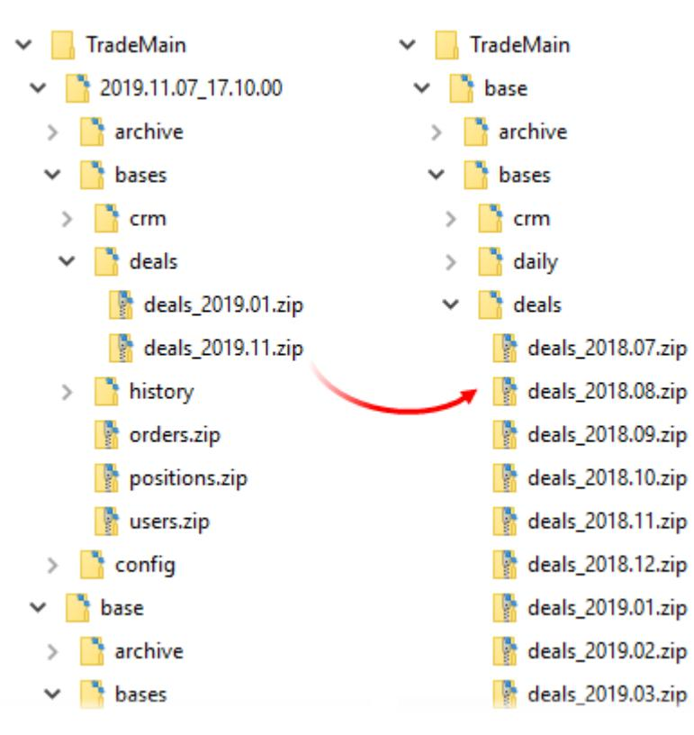

Then, the incremental archive of 2019.11.07 was deleted, while the incremental archive dated 2019.11.11 was created based on the updated base copy.

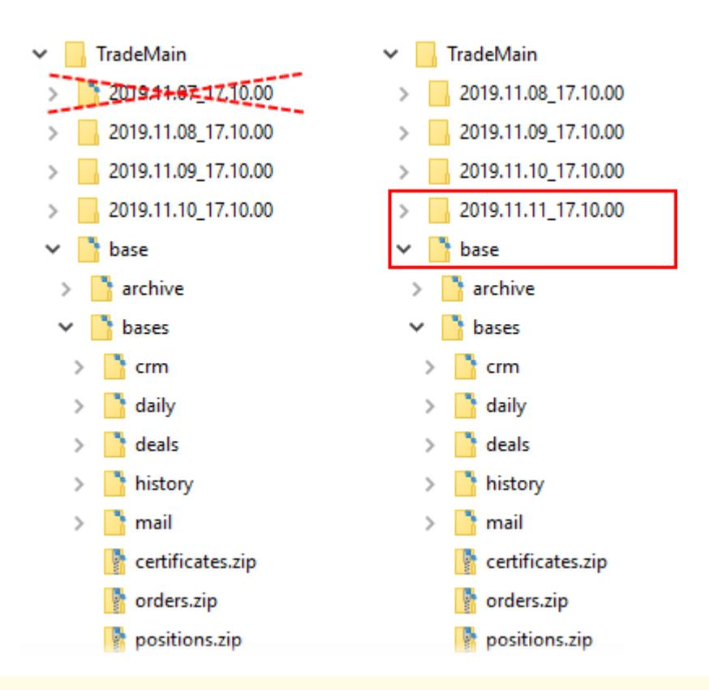

In addition to backup copies, the server saves the mt5backupinfo.txt file in the [backup server installation directory]\base\ folder. The file contains information about the backup. Don't delete or modify this file. The file isn't required for [database](#page-121-0) recovery, so its copying is optional.

By using the **Enable backups** parameter, you can completely disable the creation of backups on your computer drive. This doesn't disable the synchronization of the backup server status with the primary server. The backup server stillremains its full copy. Disabling of copying to drive may be needed if the backup server is used only for data [export](#page-124-0) to SQL.

#### **Working with file copies**

To save the database status as of a certain point in time (for example, in order to move it to a long-term archive on another server), simply copy the basic and incremental copies for the desired date. Together, they represent the complete database status of the primary up server as of the certain point in time.

To query data from a file copy, open the desired MetaTrader 5 Administrator section, such as Orders, Deals, Positions, Trading accounts, and select the copy for the required date in the query box. The terminal will collect and present data from the basic and selected incremental copies. Such queries actually restore the state of the database as at the selected point in time.

### **Transferring current day logs**

The backup server is a copy of the primary server it backs up: it stores the same data and has the same file and directory structure. It also stores its logs in directories and files with the same names (Logs\\*.log)

A special mechanism prevents mixing of the servers' current day logs when switching to the backup server.

When switching the servers, the current day log file of the previous primary server is renamed by adding the .failover extension to its name. The backup server, to which the platform switches, starts its current day log from scratch. The \*.failover file is generated only on the server which previously run as primary. The server, to which the switching is performed, will create its log file from scratch.

If a reverse switching is performed the same day, the .failover file will be renamed back to .log and the backup server will continue logging in it.

Consider an example of switching the main trade server to the backup one and vice versa.

| Contents of \MainTrade\logs\                                                                                                                                              | Contents of \Backup\logs\                                                                                                                                |
|---------------------------------------------------------------------------------------------------------------------------------------------------------------------------|----------------------------------------------------------------------------------------------------------------------------------------------------------|
| Current day log: 20170330.log                                                                                                                                             | Current day log: 20170330.log                                                                                                                            |
| first entry: 10:56:16.265<br>Startup<br>service start initialized<br>last entry:<br>10:57:55.421<br>Exit<br>shutdown finished                                             | first entry: 10:56:16.265<br>Startup<br>service start initialized<br>last entry:<br>10:56:17.888<br>192.168.0.131<br>Config: network config synchronized |
| Switching the servers. The backup server is running<br>here now                                                                                                           | Switching the servers. The trade server is running<br>here now                                                                                           |
| The previous trade server log is renamed to<br>20170330.log.failover:                                                                                                     | The new file of the trade server log 20170330.log:<br>first entry: 10:57:52.507<br>Startup                                                               |
| first entry: 10:56:16.265<br>Startup<br>service start initialized<br>last entry:<br>10:57:55.421<br>Exit<br>shutdown finished                                             | service start initialized<br>last entry:<br>11:02:28.433<br>Exit<br>shutdown finished                                                                    |
| The new file of the backup server log: 20170330.log                                                                                                                       |                                                                                                                                                          |
| first entry: 10:57:52.507<br>Startup<br>service start initialized<br>last entry:<br>10:57:55.401<br>192.168.0.131<br>Config: network config synchronized                  |                                                                                                                                                          |
| Reverse switching. The trade server is running here<br>again                                                                                                              | Reverse switching. The backup server is running<br>here again                                                                                            |
| 20170330.log.failover is renamed back to<br>20170330.log and the new trade server entries are<br>added to it:                                                             | The previous trade server log is renamed to<br>20170330.log.failover:                                                                                    |
| first entry:<br>10:56:16.265<br>Startup<br>service start initialized<br>10:57:55.421<br>Exit<br>shutdown finished<br>11:02:25.454<br>Startup<br>service start initialized | first entry: 10:57:52.507<br>Startup<br>service start initialized<br>last entry:<br>11:02:28.433<br>Exit<br>shutdown finished                            |
| Contents of \MainTrade\logs\                                                                                                                                              | Contents of \Backup\logs\                                                                                                                                |
| last entry:<br>11:04:01.157<br>192.168.0.131<br>Config: network config<br>synchronized                                                                                    | The backup server resumes adding entries in its<br>former 20170330.log file:<br>first entry: 10:56:16.265<br>Startup<br>service start initialized        |
|                                                                                                                                                                           | last entry:<br>11:04:01.157<br>192.168.0.131<br>Config: network config synchronized                                                                      |

#### **Abnormal situations during backup**

The backup creation process can be tracked by the server journal. This section provides sample log entries describing unexpected situations during the backup process.

2012.06.13 17:19:57 TradeOrders: invalid index header timestamp

Such a log entry means that the order database index (order.idx) doesn't match the data in the order database (order.dat). Such a record can appear as a result of an incorrect shutdown of the backup server (for example, a power outage or a manual shutdown of the server service).

This situation is not dangerous. The backup server willrebuild the index and resume operation. This doesn't affect data in the database. However, you should find reasons for the unexpected server shutdown.

2012.06.13 17:19:57 TradeDeals: deals\_2012.06.dat: base has invalid hash

This log means that after synchronization, the deals database on the backup server differs from the relevant database on the trade server. In this case, the backup server will delete the specified database and resynchronize it.

For the deals database (deals\_\*), such log records can be normal after the weekend (when the database is optimized and compacted on the main server). The reason is that after database optimization on the trade server, the backup server sometimes can't synchronize the monthly deals database in the resource saving mode (delete the records which were deleted during optimization on the trade server). In this case, the backup server performs a full database synchronization.

For other databases, this situation is always unacceptable.

## <span id="page-115-0"></span>**Configuring the automatic failover process**

MetaTrader 5 features built-in automatic monitoring of the availability of trade and history servers. The monitoring is performed by the backup server itself as well as by access servers. Each server monitors the availability of the main server and polls other monitoring servers to check whether the main server is available to them.

If the main server is unavailable for a certain time, the platform will automatically switch to the backup server. The downtime is minimal, and switching usually takes less than a minute.

The system includes many checks and it is built in such a way as to prevent false switching.

## **Main server configuration**

There are two scenarios for determining the unavailability of the main server:

- · The server can't be accessed by **all** access servers: if you have five monitoring servers, the main server is unavailable to all of them.
- · The server is not available for the **most** of access servers: if you have five monitoring servers, the main server is unavailable to at least three of them, or to four of six monitoring servers. If you are using two monitoring servers (the minimum allowed number), the main server should be unavailable for both of them.

The scenario is defined in the main server parameters:

| MetaQuotes - MetaTrader 5 Administrator                                                                                                              |  |   |
|------------------------------------------------------------------------------------------------------------------------------------------------------|--|---|
| File<br>Edit<br>View<br><b>Services</b><br>Help                                                                                                      |  |   |
| 86; 86; Disconnect C0; Refresh ; Restart Server ; Export ; Import ; Apply ; + ; ×                                                           |  |   |
| ;; Sort ;<br>Traffic in: 448 Kbit/s<br>Traffic out: 259 Kbit/s<br>CPU total: 5%, 16 cores<br>CPU process: 0%<br>CPU DPC: 0%<br>CPU interrupts: 0% |  |   |
| Servers<br>MetaTrader Server<br>Network Cluster<br>Trade Main                                                                                        |  |   |
| Server                                                                                                                                               |  | × |
| Failover<br>Common Network Demo End of Day Accounts Orders Deals<br>Service                                                                          |  |   |
| Failover is automatic switching to backup server in case of the main server failure. Please specify<br>the settings for automatic switching.         |  |   |
| Switch mode:<br><b>Off</b>                                                                                                                           |  |   |
| Switch timeout:<br>Server is not accessible to most access servers<br>Server is not accessible to all access servers                                 |  |   |
| For Help, press                                                                                                                                      |  |   |

If several backup servers are used for one main server, then each of the backup servers will start switching to the master server mode in case of the main server failure. The last switched server will be used as the primary server, while allthe rest of them will switch back to the backup server mode.

In the **Switch timeout** parameter, specify the time (in seconds) during which the server should be unavailable for monitoring servers, after which the system should start switching to the backup server. Also, after the specified time period, other platform components start their attempts to connect to the access points of the current backup server (trying to connect to it as to the main one).

When the system measures the time during which the primary server is unavailable, it also takes into account reasons for the unavailability. In case of a manualrestart of the server, the unavailability time is increased to include the time required for restart.

- ·Unexpected failure. Switching is performed after the specified timeout.
- · The administrator restarts the server, the system service or the operating system. Switch time is increased to include the time spent for restart. The minimum time is 30 seconds and the maximum time is 300 seconds.
- · Server restart during platform update. Switch time is increased to include time spent for restart. The minimum time is 180 seconds; the maximum is 300 seconds.

## **Configuring monitoring servers**

For an access server to start monitoring the main server, enable "Use this server for monitoring the cluster and failover" option in server settings:

| Server                                                                                                                                       |       |
|----------------------------------------------------------------------------------------------------------------------------------------------|-------|
| Common Network Access Permissions Servers SSL Service                                                                                        |       |
| Access server is used as access point for connection of clients to trade server. Please specify its priority and antiflood control settings. |       |
| Priority:                                                                                                                                    | 19    |
| □ Enable antiflood control                                                                                                                   |       |
| Connections:                                                                                                                                 | 100   |
| Errors:                                                                                                                                      | 10    |
| Maximum news:                                                                                                                                | 16384 |
| Use this server for monitoring the cluster and failover                                                                                      |       |
|                                                                                                                                              |       |
|                                                                                                                                              |       |
| Cancel                                                                                                                                       | Help  |
| <button>OK</button>                                                                                                                          |       |

The system requires at least two monitoring servers. It is recommended to install such servers on different computers (different data centers), separately from the main and history servers. This will provide the most relevant server monitoring data.

#### **Connection to monitoring servers**

The backup server uses the following algorithm for connecting to monitoring servers:

- · As soon as the main server becomes unavailable for the backup server, the backup server checks all monitoring servers one by one and tries to connect to them.
- · First, the backup server tries to connect to the monitoring server via the local address, if possible. Connection to a local address is performed if listen addresses of the backup and access servers are located in 10.\* or 192.168\* subnet. The first three octets must be identical. In this case, both servers are considered to be located on the same subnet, and the backup server tries to connect directly to the listen address of the access server. Example: the listen address of the backup server is 192.168.0.100:1951; the listen address of the access server is 192.168.0.105:1950.
- · If connection via the local address fails, the backup server will use public points of the access server specified in its settings under the **Network** section.

For a fast switching, all access servers should be available and there should not be any disconnected servers among the monitoring servers. The backup server spends 5 seconds trying to connect to a nonexistent address.

See also: [Documentation](https://support.metaquotes.net/en/docs/mt5/platform/administration/admin_network/network_add_edit#network) / Platform / Platform setup / Network cluster / Configuring servers / Network

#### **Using several backup servers**

If several backup servers are used for one primary server, then each of the backup servers will start switching to the primary server mode in case of the primary server failure. The last switched server will be used as the primary server, while allthe rest of them will switch back to the backup server mode.

#### **Tracking monitoring results**

You can request backup server logs using the **Failover** keyword to controlthe process of monitoring. Log examples:

```
2013.09.09 09:07:33 Failover master server '1' - 'Trade Main' is available
2013.09.09 09:07:33 Failover master server '1' - 'Trade Main' is available
for witness server '2' - 'Access Point 1'
2013.09.09 09:07:34 Failover master server '1' - 'Trade Main' is available
for witness server '6' - 'Access Point 2'
2013.09.09 09:07:54 Failover witness access server '7' is not available
2013.09.09 09:07:54 Failover master server '1' - 'Trade Main' is available
for witness server '11' - 'Access Point 3
2013.09.09 09:07:54 Failover master server '1' - 'Trade Main' is available
for 4 witnesses and unavailable for 0 witnesses [0 min]
```

These logs mean the following:

- ·Primary server with ID 1 is available.
- ·Primary server with ID 1 is available for the monitoring server 2 named Access Point 1.
- ·Primary server with ID 1 is available for the monitoring server 6 named Access Point 2.
- ·Monitoring server with ID 7 is unavailable for the backup server.
- ·Primary server with ID 1 is available for monitoring server 11 named Access Point 3.
- · Primary is available for 4 monitoring servers and is not available for 0 monitoring servers. The time, during which the server was unavailable, is shown in parentheses.

#### **Switching features**

On the backup server side, the switching process is performed as follows:

- ·The backup server stops its Windows service.
- · It also updates platform network settings. Servers exchange their roles: the primary server becomes the backup one, and the backup server starts operating as the primary server.
  - · Network settings (IP addresses, outgoing address, and public points) and the name of the former backup server are set for the primary server in the platform configuration.
  - · The IP address and the name of the former primary server are set for the backup server in the platform configuration.
  - · As for the servers, only their internalIDs change. The ID of the former primary server is set for the new backup server, and the ID of the former backup server is set for the new primary one.

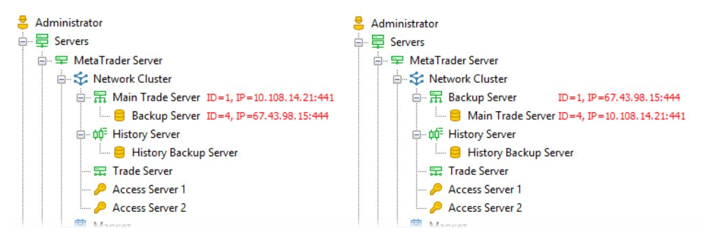

- ·The primary server's Windows service is installed.
- ·The platform sends a notification to the primary server and waits for a confirmation.
- ·The Windows service of the primary server is launched.
- ·The former backup server's Windows service is deleted.

If the primary server was running during the switch to the backup server, the primary server is switched to the backup mode:

- ·The primary server's Windows service is stopped.
- ·Network settings are updated similar to how it is done for the backup server.
- ·The backup server's Windows service is installed and launched.
- · The former primary server's Windows service is deleted.
  - · If the former primary server was inactive when the platform switched to the backup one (for example, the server machine was turned off) and the copy restored from backup is already working by the moment the server is restored, the former primary server switches to the backup mode automatically.
  - · Physically (on the drive), the new trade/history server operates from the former backup server directory, while the new backup server operates from the trade/history server directory.

### **How the platform works after switching to a backup server**

After the backup server switches to a trade server mode, client terminals will start scanning public access points of the access server in an effort to connect to the new trade server. The following factors affect the access point search time:

- · Actual accessibility of the public point for the client. If an address is not available for the client (for example, a localIP address is specified in the settings as a public access point), the terminal spends 10 seconds trying to connect to it. An attempt to connect to the next access point will only be performed after 10 seconds.
- · The number of the access server addresses which are unavailable for the client. For example, if public access points include two local addresses 192.168.0.100 and 192.168.0.101, and one external address access.server.com (available external address of the server), client terminals willfirst spend 20 seconds trying to connect to local addresses before they successfully connect to the external address.
- · Availability of the trade and history servers for the access server. The access server checks the access points of the trade and history servers according to their network settings. Correctness of network settings determines how quickly the access server is ready to go.

It is recommended that you make the access servers having localIP addresses in their list of public points, available only for administrators and managers working in the same local network. To do this, uncheck all options except "Allow administrator connection" and "Allow manager connection" under the **Permissions** tab of the access server.

## <span id="page-120-0"></span>**Restore from backup**

If the main trade server fails, you won't be able to switch to the backup server manually via MetaTrader 5 Administrator as you won't be able to connect to the server. Also, manage other cluster components will be impossible. Such a situation can be avoided by using the [automated](#page-115-0) failover system. However, if the failover system hasn't been enabled, you will need to restore the server manually:

1. Go to the computer where the main trade server is installed, and stop the system service if it is running. The default name of the main trade server service is mt5tmsrv. It can be stopped via the Control Panel— Administrative Tools—Services or through the command line:

```
net stop mt5tmsrv
or
D:\MetaTrader 5 Platform\Main Trade\mt5trade64.exe /stop.
```

If the computer is down (is unavailable), skip this step. However, once the computer is back up, please make sure that the old trade server service has not been restarted.

2. Go to the computer where the backup server is installed, and stop the system service. The default name of the backup server service is mt5bsrv. It can also be stopped using the Control Panel or the command line:

```
net stop mt5bsrv
or
D:\MetaTrader 5 Platform\Backup Main Trade\mt5backup64.exe /stop.
```

3. Run the backup server file from the command line with the /gui parameter. For example:

D:\MetaTrader 5 Platform\Backup Main Trade\mt5backup64.exe /gui.

Click Restore in the window that appears. After that, the recovery process will start. Other components of the cluster will automatically switch to the new primary server.

| MetaTrader 5 Backup Server Configuration                                                                                                 |                                   |
|------------------------------------------------------------------------------------------------------------------------------------------|-----------------------------------|
| Enter the IP:port of the server, its ID and password. Make sure that these data were registered on the main trade server of the cluster. |                                   |
| Server IP address:                                                                                                                       | 192.168.0.67:444                  |
| Restore                                                                                                                                  | $         checkmark       $     |
| Password:                                                                                                                                |                                   |
| Server ID:                                                                                                                               | 4                                 |
| To connect an additional server to the cluster please specify the IP:port of the main trade server.                                      |                                   |
| Main Trade server:                                                                                                                       | 192.168.0.67:441                  |
| © 2001-2016, MetaQuotes Software Corp.                                                                                                   |                                   |
| <button type="button">Cancel</button>                                                                                                    | <button type="button">ОК</button> |

After the recovery of the main trade server, you will be able to connect to the cluster via MetaTrader 5 Administrator. Other components can be switched to backup servers in a regular way, through the interface. For example, if the history server was installed on the same machine, you can switch to the backup server by running the appropriate command in its context menu.

You can also use the described procedure to restore other servers, including additionaltrade servers and history servers. During recovery, new configuration data is sent to the main trade server. A restored server connects to the cluster without additional settings, and you can control it via MetaTrader 5 Administrator.

It is recommended to set up a new backup server immediately after recovery.

Before you launch the backup server, please make sure the primary server is stopped. Otherwise, your clients can start working with different servers.

For example, your primary server and access server are located at the same provider. The provider has issues with the Internet connection due to which the servers become unavailable. At this moment, the platform switches to the backup server. After a while, connection to the primary server is restored causing two servers to run simultaneously. In this case, call your provider and ask them to disable the primary server immediately.

#### **Recovery process**

The recovery process is performed automatically. It consists of the following steps:

- · Configuring the main trade server. At this step, the IP address and port of the primary server are replaced with the address and port of the backup server. The relevant details are displayed at the top of the window. The server password and ID remain the same.
- ·Installing the main trade server service.
- ·Removing the backup server service.
- ·Launching the main trade server service.

If any of the steps couldn't be completed, all changes made during the recovery process are rolled back.

#### <span id="page-121-0"></span>**Database recovery for a specific date**

To restore server databases as on a specific date, stop allthe servers within the cluster. Next, unzip and copy the necessary databases from the \base\ directory of the backup server to the corresponding directories of the primary server.

| MetaTrader5Backup > TradeMain > base > bases > deals | Date modified      | MetaTrader 5 Platform > MainTrade > bases > deals | Date modified      |
|------------------------------------------------------|--------------------|---------------------------------------------------|--------------------|
| deals_2018.07.zip                                    | 2019-11-07 4:25 PM | deals_2018.07.dat                                 | 2018-11-01 9:50 AM |
| deals_2018.08.zip                                    | 2019-11-07 4:25 PM | deals_2018.08.dat                                 | 2018-11-01 9:50 AM |
| deals_2018.09.zip                                    | 2019-11-07 4:25 PM | deals_2018.09.dat                                 | 2018-11-01 9:50 AM |
| deals_2018.10.zip                                    | 2019-11-07 4:25 PM | deals_2018.10.dat                                 | 2018-11-01 9:50 AM |
| deals_2018.11.zip                                    | 2019-11-07 4:25 PM | deals_2018.11.dat                                 | 2018-12-03 9:06 AM |
| deals_2018.12.zip                                    | 2019-11-07 4:25 PM | deals_2018.12.dat                                 | 2018-12-14 9:11 AM |
| deals_2019.01.zip                                    | 2019-11-07 4:25 PM | deals_2019.01.dat                                 | 2019-01-24 6:05 PM |
| deals_2019.02.zip                                    | 2019-11-07 4:25 PM | deals_2019.02.dat                                 | 2019-02-18 6:02 PM |
| deals_2019.03.zip                                    | 2019-11-07 4:25 PM | deals_2019.03.dat                                 | 2019-03-21 6:05 PM |
| deals_2019.04.zip                                    | 2019-11-07 4:25 PM | deals_2019.04.dat                                 | 2019-04-17 7:05 PM |
| deals_2019.07.zip                                    | 2019-11-07 4:25 PM | deals_2019.07.dat                                 | 2019-07-31 11:47   |
| deals_2019.08.zip                                    | 2019-11-07 4:25 PM | deals_2019.08.dat                                 | 2019-08-21 10:33   |

Then unzip and copy the required data from the incremental copy directory for the desired date (its format is [YYYY.MM.DD\_HH.MM.SS]) to the relevant directories of the primary server.

| MetaTrader5Backup > TradeMain > 2019.11.07_17.10.00 > bases > deals > MetaTrader 5 Platform > MainTrade > bases > deals |                    |                   |               |
|-------------------------------------------------------------------------------------------------------------------------|--------------------|-------------------|---------------|
| Name                                                                                                                    | Date modified      | ∧<br>Name         | Date mo       |
| deals_2019.01.zip                                                                                                       | 2019-11-07 5:10 PM | deals_2018.07.dat | $2018 - 11 -$ |
| deals_2019.11.zip                                                                                                       | 2019-11-07 5:10 PM | deals_2018.08.dat | $2018 - 11$   |
| deals_2019.01.dat                                                                                                       | 2019-11-07 5:10 PM | deals_2018.09.dat | $2018 - 11 -$ |
| deals_2019.11.dat                                                                                                       | 2019-11-07 5:10 PM | deals_2018.10.dat | $2018 - 11 -$ |
|                                                                                                                         |                    | deals_2018.11.dat | $2018 - 12 -$ |
|                                                                                                                         |                    | deals_2018.12.dat | $2018 - 12 -$ |
|                                                                                                                         |                    | deals 2019.01.dat | $2019 - 11 -$ |
|                                                                                                                         |                    | deals_2019.02.dat | 2019-02-      |
|                                                                                                                         |                    | deals_2019.03.dat | 2019-03-      |
|                                                                                                                         |                    | deals_2019.04.dat | 2019-04-      |
|                                                                                                                         |                    | deals_2019.07.dat | 2019-07-      |
|                                                                                                                         |                    | deals_2019.08.dat | 2019-08-      |
|                                                                                                                         |                    | deals_2019.11.dat | $2019 - 11 -$ |

123

It is not recommended to restore trading databases separately. Orders, deals and positions are interrelated and must match each other.

## <span id="page-124-0"></span>**Data export to SQL and operations with DBMS**

The MetaTrader 5 trading platform provides standard options for the real-time data export to MySQL, Microsoft SQL Server, FireBird, Oracle, MariaDB and PostgreSQL databases. This option enables the quick and easy deployment of data export to an external database management system (DBMS), from which you can use platform data in any popular programming language and third-party applications. This serves as an intermediate layer between a trade server and the broker's software services, which regularly access trading data. Data export reduces the trade server load related to the retrieving of the current trading data.

The export function is enabled by specifying settings for connection to the DBMS via MetaTrader 5 Administrator. After that, the backup server will immediately perform initial data synchronization with the DBMS. Further, new data will be exported to the DBMS in realtime. The following data is exported:

- ·Information about clients (general information and trading status)
- ·Current active orders and positions
- ·The history of orders and deals
- ·Current prices
- ·Virtually all settings of the trading platform (except for the working time, synchronization and spreads)

The following popular DBMSs are supported:

- ·MySQL Server 5.7 (versions 5.1, 5.5, 5.6, 5.7, 8.0)
- ·MariaDB 10.2 (all versions)
- ·FireBird 3.0 (versions 2.0, 2.1, 2.5, 3.0)
- ·Microsoft SQL Express 2012 (versions 2005, 2008, 2008 R2, 2012, 2014, 2016, 2017, 2019RC)
- ·Oracle Database Express Edition 11g (versions 11g/11g Express Edition, 12c)
- ·PostgreSQL (versions 8.4 — 14.5)

### **Operation principle**

Export to database is implemented on the side of backup servers which replicate data from trade servers.

Below are the general synchronization steps on a backup server:

- ·The backup server connects to the appropriate trade server and synchronizes data.
- ·After synchronization with the trade server, the backup server synchronizes data with an external DBMS.
- · The backup server applies changes to its databases and to the external DBMS according to transactions from the trade server.

The backup server performs initial synchronization based on timestamps (Timestamp field in the tables) during each connection to DBMS:

- ·Allrecords with different timestamps in the external DBMS are replaced with backup server records.
- ·Allrecords which are absent at the backup server are removed from the external DBMS.

The timestamp is used to verify that records on the backup server match the data in the external DBMS. If a timestamp on the backup server matches a timestamp in the external DBMS, the backup server considers that all other record fields are the same and thus the record update is not required.

After databases are synchronized, the backup server applies change transactions to the external DBMS. Additionally, prices and profit values for active orders (mt5\_orders), positions (mt5\_positions) and related trading accounts (mt5\_accounts) are also periodically updated.

### **Exportable tables**

The detailed descriptions of tables which the system exports are provided in the relevant subsections.

- ·mt5\_symbols — symbol configurations.
- ·mt5\_symbols\_sessions — symboltrading and quoting sessions.
- ·mt5\_groups — group configurations.
- ·mt5\_groups\_symbols — individual symbol settings for groups.
- ·mt5\_commissions — group commission settings.
- ·mt5\_commissions\_tiers — commission level settings.
- ·mt5\_managers — manager accounts.
- ·mt5\_clients — client database.
- ·mt5\_documents — customer document database.
- ·mt5\_users — account database.
- ·mt5\_orders — database of open orders.
- ·mt5\_positions — database of positions.
- ·mt5\_orders\_history — database of closed orders.
- ·mt5\_deals — database of deals.
- ·mt5\_accounts — database of trading account states.
- ·mt5\_prices — tick data database.
- ·mt5\_daily — daily report database.

- ·mt5\_holidays — holiday configurations.
- ·mt5\_network — general server settings.
- ·mt5\_network\_access\_servers — access server settings.
- ·mt5\_network\_history\_servers — history server settings.
- ·mt5\_network\_trade\_servers — trade server settings.
- ·mt5\_network\_backup\_servers — backup server settings.
- ·mt5\_network\_backup\_folders — backup of user folders.
- ·mt5\_firewall — firewall settings.
- ·mt5\_routing — routing rules.
- ·mt5\_routing\_dealers — dealer/gateway settings in routing rules.
- ·mt5\_routing\_conds — additional conditions in routing rules.
- ·mt5\_feeders — data feed settings.
- ·mt5\_feeder\_translates — translation settings on data feeds.
- ·mt5\_feeder\_params — additional data feed settings.
- ·mt5\_reports — report settings.
- ·mt5\_report\_params — additionalreport settings.
- ·mt5\_plugins — plugin settings.
- ·mt5\_plugin\_params — additional plugin settings.
- ·mt5\_time — platform trading time settings.
- ·mt5\_time\_weekdays — platform working schedule, by days.

See also: [Documentation](https://support.metaquotes.net/en/docs/mt5/platform/components/backup_server/sql_export) / Platform / Platform Components / Backup Server / SQL Export

#### **Custom data in MetaTrader 5 tables**

In the platform, you can create your own tables in databases and add your own fields in mt5\_\* tables, which are used for data export. Also, you can create stored procedures and triggers.

· The backup server does not recreate data but only adds or updates existing records. A table entry is only deleted if the appropriate entry is deleted on the platform side. For example, if a user is added to the mt5\_users tables, the appropriate user record will exist in the database until you delete the user from MetaTrader 5.

- ·The backup server only works with its own tables and fields.
- · The backup server does not create default indexes. Each index provides an extra load on the database, which can slow down exports and information updates.
- · When you create your own fields in mt5\_\* tables, do not forget to set default values (or allow NULL). Otherwise, the backup server will not be able to add new records to the tables.

#### **Installing a DBMS**

If you do not have a DBMS, install one of the supported options. Below are setup examples for connecting different systems.

We recommended installing the DBMS and the backup server on the same computer, for faster export. However, it should also be kept in mind that the backup server consumes resources. Also, you can deploy several backups for one trade server if necessary. These backup servers should run close to the required DBMSs.

### **Configuring SQL Export**

To enable data export to the SQL database, open backup server settings.

| Server       | 192.168.0.100:500                                                 |
|--------------|-------------------------------------------------------------------|
| Type:        | FireBird 2.x - 3.x                                                |
| Login:       | root                                                              |
| Password:    |                                                                   |
| Data Folder: | c:b t5.fdb                                                       |
|              |                                                                   |
|              |                                                                   |
|              |                                                                   |
|              | <button>OK</button> <button>Cancel</button> <button>Help</button> |

Specify the following parameters:

- ·**Type** of DBMS, to which data will be exported.
- · **Server** on which the DBMS is located. Address format may vary for different DBMS types. See field examples, later in this section.

- · **Login** is the login for connecting to the database. The account with which you are connecting must have permissions to create/edit/delete tables and data.
- ·**Password** is the password for connecting to the database.
- · **Data Folder** is the database name in the DBMS, to which the data will be exported. The database must be created in advance. See field examples, later in this section.

To track the data export process, request logs from the backup server journal using the **SQL** keyword.

If you only use the backup server for data export to SQL, disable the **Use this backup server for automated failover** option. Otherwise, the server can switch to the primary server mode and data export will stop. You can also disable the **Enable backups** option to save resources required for the creation of backup copies in a disk.

Next, set data export parameters:

· **Export history of orders and deals into separate tables by years**. History orders, deals and daily reports are exported to three separate tables by default. However, over time, the platform's databases can grow significantly, causing the tables in the SQL database to grow accordingly. If this option is enabled, the data will be additionally split into separate tables by years. You will have separate tables for each year for historical orders, trades and daily reports. This willreduce the load on the server by reducing the table sizes, as well as speed up queries to the database.

When enabling this option, modify your SQL queries against the database accordingly.

- · **Export additional tables for daily reports** — daily reports store information about the end-of-day status of a trader's open positions and pending orders. You can export this data to an SQL database. Please note that the export of these tables will only begin after the relevant options are enabled. For previously exported daily data, position and order information will not be updated. If you need to export all data, save data from the custom columns (if any) of the mt5\_daily tables and remove these tables from the SQL database. In this case, the backup server willre-export all daily data, including position and order information. Full data replication may take a considerable amount of time, so we recommend performing this operation only on weekends.
- · **Do not export users and trades from demo groups**. When the option is enabled, accounts from demo groups and trade operations (orders, deals and positions) of these accounts will not be exported to the SQL database. This reduces the load on the database and increases query speed.
- · **Refresh prices and trade profits every N minutes**. To reduce resource consumption, you can limit the frequency of price and profit exports. This data includes symbol prices, current position and order prices, as well as almost all data in the table of trading account states.

| Option                                                        | Value                                                                                              |  |  |    |        |      |  |
|---------------------------------------------------------------|----------------------------------------------------------------------------------------------------|--|--|----|--------|------|--|
| Server                                                        |                                                                                                    |  |  |    |        |      |  |
| Common                                                        |                                                                                                    |  |  |    |        |      |  |
| Network                                                       |                                                                                                    |  |  |    |        |      |  |
| Backup                                                        |                                                                                                    |  |  |    |        |      |  |
| SQL Export                                                    |                                                                                                    |  |  |    |        |      |  |
| SQL Options                                                   | Please specify additional options for exporting databases of the backup server to an SQL database. |  |  |    |        |      |  |
| Folders                                                       |                                                                                                    |  |  |    |        |      |  |
| Service                                                       |                                                                                                    |  |  |    |        |      |  |
| Export orders and deals history into separate tables by years |                                                                                                    |  |  |    |        |      |  |
| Do not export users and trades from demo groups               |                                                                                                    |  |  |    |        |      |  |
| Refresh prices and trade profits every                        | 5                                                                                                  |  |  |    |        |      |  |
| minutes                                                       |                                                                                                    |  |  |    |        |      |  |
|                                                               |                                                                                                    |  |  |    |        |      |  |
|                                                               |                                                                                                    |  |  |    |        |      |  |
|                                                               |                                                                                                    |  |  |    |        |      |  |
|                                                               |                                                                                                    |  |  |    |        |      |  |
|                                                               |                                                                                                    |  |  |    |        |      |  |
|                                                               |                                                                                                    |  |  | OK | Cancel | Help |  |

#### **Tracking the export process**

After you specify allthe required settings, the backup server will immediately start exporting data to an external DBMS. To track the data export process, request logs from the backup server journal using the **SQL** keyword, as follows:

```
19:00:16 SQL Export MySQL: successfully connect to '127.0.0.1:metatrader5' for
'root'
19:00:16 SQL Export MySQL: server version 5.7.19
19:00:16 SQL Export MySQL: table 'mt5_symbols' creating started
19:00:16 SQL Export MySQL: table 'mt5_symbols' created
19:00:16 SQL Export MySQL: primary key for 'mt5_symbols' adding started
19:00:16 SQL Export MySQL: primary key for 'mt5_symbols' added
19:00:16 SQL Export MySQL: table 'mt5_symbols_sessions' creating started
19:00:16 SQL Export MySQL: table 'mt5_symbols_sessions' created
19:00:16 SQL Export MySQL: primary key for 'mt5_symbols_sessions' adding started
19:00:16 SQL Export MySQL: primary key for 'mt5_symbols_sessions' added
19:00:16 SQL Export Symbols: 0 symbols and 0 sessions loaded in 312 msecs
19:00:16 SQL Export Symbols: synchronization started
...
```

#### **Configuration examples for Microsoft SQL Server**

| <b>Type:</b>        | Microsoft SQL Server 2005 - 2016 |
|---------------------|----------------------------------|
| <b>Server:</b>      | localhost\SQLExpress:5000        |
| <b>Login:</b>       | sa                               |
| <b>Password:</b>    | ********                         |
| <b>Data Folder:</b> | metatrader5                      |

**Note:** Please specify settings for exporting databases of the backup server to an SQL database.

| <button>OK</button> | <button>Cancel</button> | <b>Help</b> |
|---------------------|-------------------------|-------------|
|---------------------|-------------------------|-------------|

Example of parameters for data exporting to Microsoft SQL Server:

- ·**Type**: Microsoft SQL Server 2005 - 2016.
- · **Server**: specify here the address (IP address or domain name) of the server on which the DBMS is installed, the MSSQL instance name and port for connection (optional). For example, localhost\SQLExpress:5000, 192.168.0.1\SQLExpress, sqlserver.company.net\SQLInstance.
- · **Login**: sa. The account with which you are connecting must have permissions to create/edit/delete tables and data.
- ·**Password**: some\_password.
- · **Data Folder**: the name of the specific database to which the data will be exported. For example, metatrader5. The database must be created in advance.

See also: [Documentation](https://support.metaquotes.net/en/docs/mt5/platform/components/backup_server/sql_export/sql_export_mssql) / Platform / Platform components / Backup server / SQL export / Installing and [configuring](https://support.metaquotes.net/en/docs/mt5/platform/components/backup_server/sql_export/sql_export_mssql) MS SQL

### **Configuration examples for FireBird**

| Server                                                                                   |                    |        |            |             |
|------------------------------------------------------------------------------------------|--------------------|--------|------------|-------------|
| Common                                                                                   | Network            | Backup | SQL Export | SQL Options |
| Please specify settings for exporting databases of the backup server to an SQL database. |                    |        |            |             |
| Type:                                                                                    | FireBird 2.x - 3.x |        |            |             |
| Server:                                                                                  | 192.168.0.100:500  |        |            |             |
| Login:                                                                                   | root               |        |            |             |
| Password:                                                                                | ********           |        |            |             |
| Data Folder:                                                                             | c:\FB\mt5.fdb      |        |            |             |
|                                                                                          |                    |        |            |             |
|                                                                                          |                    |        |            |             |
|                                                                                          |                    |        |            |             |
|                                                                                          | OK                 | Cancel | Help       |             |

Example of parameters for data export to FireBird:

- ·**Type**: FireBird 2.x - 3.x.
- · **Server**: specify here the address (IP address or domain name) of the server on which the DBMS is installed and port for connection (optional). For example, 192.168.0.100:5000, sqlserver.company.net.
- · **Login**: root. The account with which you are connecting must have permissions to create/edit/delete tables and data.
- ·**Password**: some\_password.
- · **Data Folder**: the name of the database file to which the data will be exported. For example, C:\FB\mt5.fdb. The database must be created in advance.

See also: [Documentation](https://support.metaquotes.net/en/docs/mt5/platform/components/backup_server/sql_export/sql_export_firebird) / Platform / Platform components / Backup server / SQL export / Installing and [configuring](https://support.metaquotes.net/en/docs/mt5/platform/components/backup_server/sql_export/sql_export_firebird) FireBird

### **Configuration examples for MySQL/MariaDB**

| Type:        | MySQL 5.x & MariaDB 5.x - 10.x |      |
|--------------|--------------------------------|------|
| Server:      | 192.168.0.100:500              |      |
| Login:       | sysdba                         |      |
| Password:    | ••••••••                       |      |
| Data Folder: | mt5                            |      |
|              |                                |      |
|              |                                |      |
|              |                                |      |
|              |                                |      |
| OK           | Cancel                         | Help |

Example of parameters for data exporting to MySQL (similar parameters are used for MariaDB):

- ·**Type**: MySQL 5.x & MariaDB 5.x - 10.x.
- · **Server**: specify here the address (IP address or domain name) of the server on which the DBMS is installed and port for connection (optional). For example, 192.168.0.100:5000, sqlserver.company.net.
- · **Login**: sysdba. The account with which you are connecting must have permissions to create/edit/delete tables and data.
- ·**Password**: some\_password.
- · **Data Folder**: the database name (schema) to which the data will be exported. For example, metatrader5. The database must be created in advance.

#### See also:

- · [Documentation](https://support.metaquotes.net/en/docs/mt5/platform/components/backup_server/sql_export/sql_export_mysql) / Platform / Platform components / Backup server / SQL export / Installing and [configuring](https://support.metaquotes.net/en/docs/mt5/platform/components/backup_server/sql_export/sql_export_mysql) MySQL Server
- · [Documentation](https://support.metaquotes.net/en/docs/mt5/platform/components/backup_server/sql_export/sql_export_maria) / Platform / Platform components / Backup server / SQL export / Installing and [configuring](https://support.metaquotes.net/en/docs/mt5/platform/components/backup_server/sql_export/sql_export_maria) MariaDB

#### **Configuration examples for PostgreSQL**

| Type:        | PostgreSQL 8.4 - 10.1 |
|--------------|-----------------------|
| Server:      | 192.168.0.122:5234    |
| Login:       | postgres              |
| Password:    | ********              |
| Data Folder: | metatrader5           |

Please specify settings for exporting databases of the backup server to an SQL database.

OKCancelHelpExample of parameters for data exporting to PostgreSQL:

- ·**Type**: PostgreSQL 8.4-14.5.
- · **Server**: specify here the address (IP address or domain name) of the server on which the DBMS is installed and port for connection (optional). For example, 192.168.0.122:5234.
- · **Login**: postgres. The account with which you are connecting must have permissions to create/edit/delete tables and data.
- ·**Password**: some\_password.
- · **Data Folder**: the name of the database to which the data will be exported. For example, metatrader5. The database must be created in advance.

See also: [Documentation](https://support.metaquotes.net/en/docs/mt5/platform/components/backup_server/sql_export/sql_export_postgre) / Platform / Platform components / Backup server / SQL export / Installing and configuring [PostgreSQL](https://support.metaquotes.net/en/docs/mt5/platform/components/backup_server/sql_export/sql_export_postgre)

## **Configuration examples for Oracle**

| Type:        | Oracle 11g - 12c |      |     |
|--------------|------------------|------|-----|
| Server:      | 192.168.9.150    |      |     |
| Login:       | mt5user          |      |     |
| Password:    | ********         |      |     |
| Data Folder: | XE               |      |     |
|              |                  |      |     |
|              |                  |      |     |
|              |                  |      |     |
|              |                  |      |     |
|              |                  |      |     |
|              |                  |      |     |
|              |                  |      |     |
|              |                  |      |     |
| OK           | Cancel           | Help | Ъf, |

Example of parameters for data exporting to Oracle:

- ·**Type**: Oracle 11g-12c.
- · **Server**: specify here the address (IP address or domain name) of the server on which the DBMS is installed. For example, 192.168.9.150.
- · **Login**: mt5user. The account with which you are connecting must have permissions to create/edit/delete tables and data.
- ·**Password**: some\_password.
- · **Data folder**: XE. Oracle Database Express Edition has only one database named XE. Therefore, that is the database that should be specified in the **Data Folder** parameter.

See also: [Documentation](https://support.metaquotes.net/en/docs/mt5/platform/components/backup_server/sql_export/sql_export_oracle) / Platform / Platform components / Backup server / SQL export / Installing and [configuring](https://support.metaquotes.net/en/docs/mt5/platform/components/backup_server/sql_export/sql_export_oracle) Oracle Database

## <span id="page-135-0"></span>**Common errors**

- · Do not forget to configure backup servers for alltrade and history servers. The default backup server is installed only for the main trade server.
- · When setting up a backup server, make sure to properly configure network [parameters](#page-20-0) and to open all [required](#page-22-0) ports. It is important, because an instant connection to allthe required servers of the cluster will be required in case of switching to the backup server.
- · Before launching the backup server, please make sure the primary server is stopped. Otherwise, your clients can start working with different servers.
- · It is recommended to installthe SQL database and the backup server on the same computer, for faster export. However, it should also be kept in mind that the backup server consumes resources. Also, you can deploy several backups for one trade server if necessary. These backup servers should run close to the required DBMSs.

See also: Articles / Technical support [workdays:](https://support.metaquotes.net/en/articles/985) stumbling quotes and slippery backups

## <span id="page-136-0"></span>**Ongoing platform maintenance**

Any software product requires constant maintenance. The administrator must periodically update the software, monitor the status of the cluster, and ensure its stable and secure operation.

The platform provides built-in state [monitoring](#page-140-0) system to assist the administrator. The system monitors hardware load, system services, network activity, and other parameters, providing easy-to-use measurement reports. Also, the Administrator terminal has a built-in system of usefultips which assist in administrating the platform.

Another useful administration tool is the [Automations](#page-151-0) service. Use this service to set up mobile notifications about critical situations on the server in order to respond to them in a timely manner. Furthermore, you can automate a plethora of routine manual operations with this service.

These usefultools enable the prevention of many problems when working with the platform, and if a problem does arise, you will be able to identify and eliminate it in a timely manner.

## <span id="page-137-0"></span>**Start page and platform configuration hints**

The start page displays important information about the platform operation: license data, the number of groups, accounts and trading operations. In addition, here you can change live update settings and find a lot of useful information related to platform administration.

To open the start page, select the desired platform on the left side of the terminal.

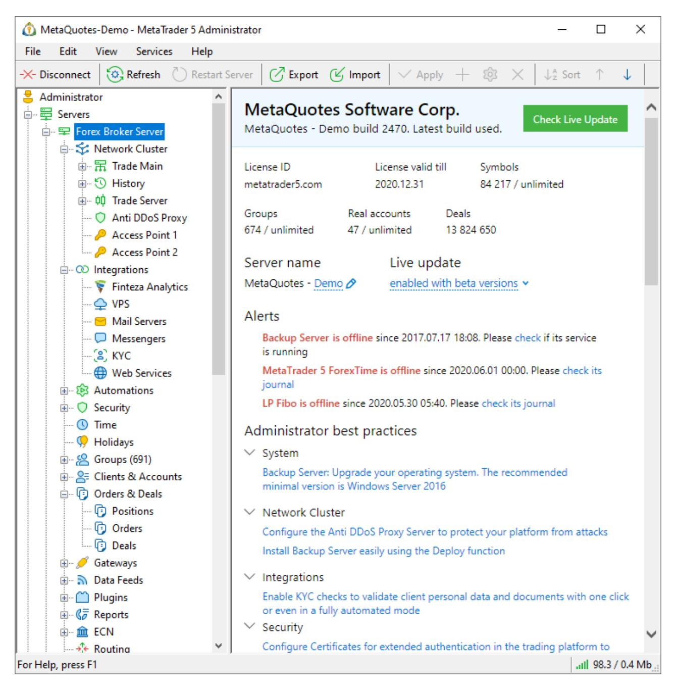

### **Server data**

The following platform data is specified in the page header:

·Name of the trading platform owner company.

- · Platform name displayed in client terminals. It consists of two parts:
  - ·Owner company's short name indicated in the license.
  - · An additional part as define by you. Here you can specify additional data, such as the server type: demo or live. The short name is set in the Server Name box below. After editing the data, select Apply on the toolbar to save settings.

The additional data must not look like the domain name of the server. For example, do not specify "demo.com", "real.net", etc.

#### **License information**

The main license details are shown at the top of the page. Here, you will be warned of approaching expiration date or account limit. Separate warnings can be shown if your platform is not [activated](#page-54-0).

- ·License — the website of the company for which the trading platform license has been issued.
- · License valid till — license expiration date. If payments are made in a timely manner and your platform is properly connected to the license server (updates.metaquotes.net), the license will be updated automatically. If the license update fails for any reason, the license box will become highlighted in red one month before the license expiration date. In this case you should immediately contact the support team for renewal. Once the license expires, the platform operation will stop and you will not be able to provide further services to your clients.
- · Symbols — the total number of symbols in the platform and the limitation according to your license type (if any).
- · Groups — the total number of groups in the platform and the limitation according to your license type (if any).
- · Real accounts — the total number of real clients in the entire platform and the limitation on the number of clients according to the license (if any). Real accounts include client records which are not in groups demo\*, manager\*, preliminary\* or contest\*. Only accounts with enabled trading are considered as real.
- ·Deals — the total number of deals executed in the platform.

#### **Live update**

Once of the following [update](#page-161-0) types is selected in this block:

- · Disabled — automated updates of platform components are not performed. The update can only be performed manually by pressing **Start Live Update** in the **Service** menu.
- ·Enabled — automated update of platform components to latest release versions.
- · Enabled with beta versions — when you launch live update, both release and beta versions of platform components will be installed. Beta versions precede the main release, allowing you to test the new features released in the update, as well as to test the operation of your plugins, gateways, and other additional

components. This option should only be enabled on test servers. Please make sure not to update your real servers with live accounts to beta versions.

After editing the data, click **Apply** on the toolbar to save settings.

Make sure your platform is [activated](#page-54-0). Otherwise, some of its basic features will be limited. If a notification in the upper part of the page shows that the platform is not activated, launch activation using the Services menu.

#### **Alerts**

Important alerts concerning the platform components are shown in this block, such as:

- · No connection between the gateway or data feed and the source. In this case, you should check the relevant log.
- · No connection with a platform component. In this case, you should check if the appropriate service is running in the operating system, as well as view the latest logs in the component's log on disk.

You should not ignore alerts.

#### **Administrator best practices**

This block features usefultips concerning platform operation, which will assist in using the platform to its full capabilities: which components need further setup or verification, how additional symbols can be added and other tips. When you select a hint, an appropriate Administrator terminal section is opened. After that the advice line will be hidden from the list.

## <span id="page-140-0"></span>**Monitoring**

Every minute, the platform measures multiple performance parameters and maintains the performance database allowing the administrator to quickly assess the status of the cluster components and respond to potential issues.

The data is conveniently presented as graphs for the entire cluster and for each platform component separately.

To see the data on the entire platform, select **Network Cluster** and one of the tabs: CPU, Traffic, Network Packets, Memory, Connections or Trade.

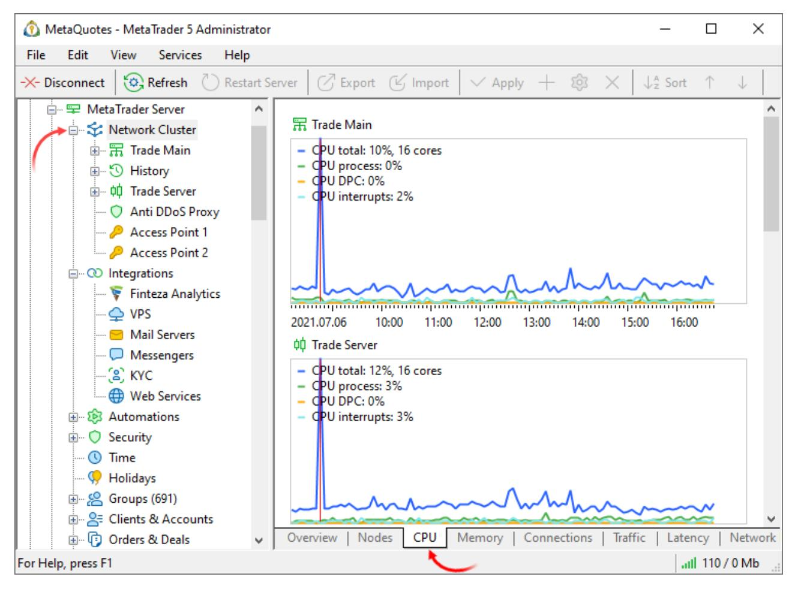

Server restarts are shown on the graphs as verticalred lines. To view exact graph values, enable the crosshair mode in the context menu.

To view more detailed information about any component, select it in the tree.

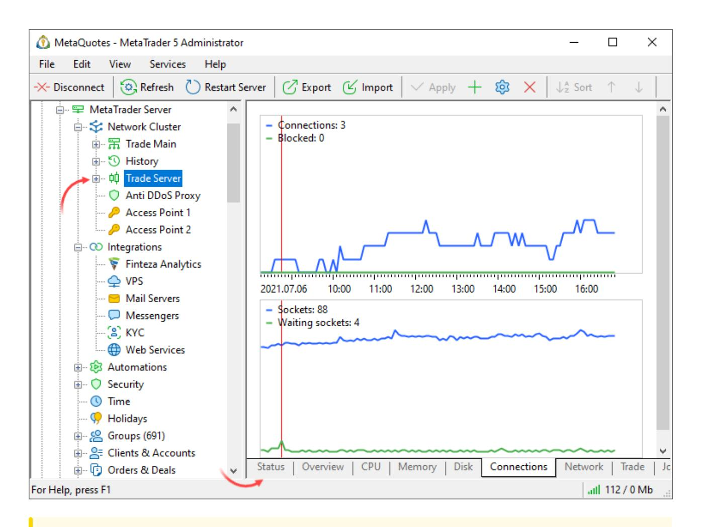

- · The variables are measured once a minute. Most of them show a one-time instant state of the server (for example, CPU load at a particular moment in time). The state can be different between measurements.
- · Performance measurements of different platform components are not synchronized (they are performed in different times). Therefore, common parameters (such as CPU load) can differ in monitoring results of different components, even if they are installed on one physical server.
- · On higher chart timeframes (5 minutes, 15 minutes, 1 hour, 1 day), the displayed variables represent the sum, the highest value and the lowest value over the selected period. For example, the 15-minute [connections](#page-145-0) diagram displays the maximum number of connections for every 15 minutes.
- · Current metrics (in the upper left corner of the graph) always display the last minute values regardless of the selected timeframe.

## **Cluster map**

The **Network Cluster Overview** section displays an interactive map of platform servers. The map enables easy platform state monitoring in terms of server loads, network delays and other metrics.

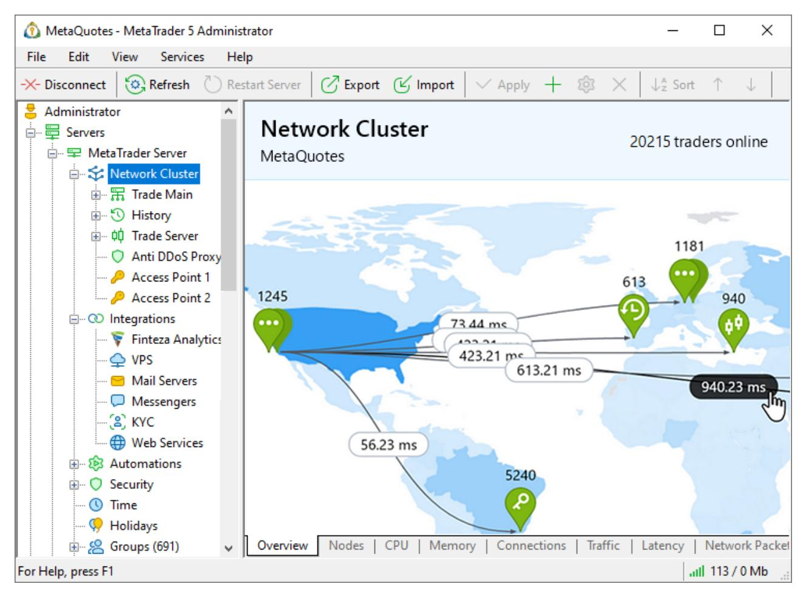

The number of connections is shown for each server. Additionally, map regions are colored depending on the number of connections from them: more intense colors are used for higher connection numbers. Thus, you can spot regions with an extremely high load which require additional access points.

Hover the mouse over a server to view monitoring details: CPU load, memory and disk usage, and the number of connections. Disconnected servers are shown in red on the map.

Use the mouse wheel or the plus sign (+) and minus sign (-) keys to change the map scale.

Server position on the map is determined by the IP addresses automatically, through the built-in GeoIP database. If the coordinates could not be accurately determined automatically, you can specify them manually under the server properties:

| Type:                                                             | Main Trade Server (must be one only) |  |  |
|-------------------------------------------------------------------|--------------------------------------|--|--|
| Name:                                                             | Trade Main                           |  |  |
| ID:                                                               | 1                                    |  |  |
| Password:                                                         |                                      |  |  |
| Latitude:                                                         | 0.00000000                           |  |  |
| Longitude:                                                        | 0.00000000                           |  |  |
| <button>OK</button> <button>Cancel</button> <button>Help</button> |                                      |  |  |

#### <span id="page-143-0"></span>**Processor**

- · TotalCPU usage in percentage. This parameter affects on how fast users and their trade operations are serviced. If the processor load regularly exceeds 50% in the middle of a work day, it is time to think about upgrading the computer. If the CPU load is more than 85%, the graph turns red. This value is critical. If the processor load is 100%, it means that the processing power is not enough for processing of tasks. Occasional spike loads are no reason to worry.
- · CPU usage by the server process. If the totalCPU load is high, while server process load is not very high, the computer resources must be consumed by some third-party application.
- ·Number of CPU cores.
- · CPU DPC (Deferred [Procedure](https://ru.wikipedia.org/wiki/DPC) Call). DPCs have lower priority compared to normal calls. In a normal call, control is immediately transferred to called procedure code. With a DPC call, control is transferred only at a time favorable for the processor. While the processor is occupied by higher-priority tasks, lower-priority DPCs are placed in a special DPC Queue. For more information, please refer to Microsoft [documentation](https://docs.microsoft.com/en-us/azure/monitoring/infrastructure-health/vmhealth-windows/winserver-processor-cpudpctime).
- · CPU [interrupts.](https://ru.wikipedia.org/wiki/%D0%9F%D1%80%D0%B5%D1%80%D1%8B%D0%B2%D0%B0%D0%BD%D0%B8%D0%B5) This parameter provides an indirect measure of activity of connected devices: from the system clock to the mouse. A large interrupt load can mean hardware problems on the server. For more information, please refer to Microsoft [documentation](https://docs.microsoft.com/en-us/previous-versions/windows/it-pro/windows-server-2003/cc786359(v=ws.10)).
  - · If the totalCPU load stays at 85% or more, and the load by DPCs/interrupts is 15% or higher, this may indicate insufficient processor performance. In this case, we recommend that you replace the processor with a more powerful one, or allocate additional processors if you are using a virtual machine.

- · If the totalCPU load is less than 85% and the load by DPCs/interrupts is less than 15%, but you still have performance issues, the problem can be caused by third-party soft- or hardware. If DPC load surges unexpectedly, such load can be caused by recently installed soft- or hardware.
- · If you are using a multiprocessor system and the load is distributed unevenly among CPUs, try installing additional network adapters, one for each processor. This will improve system performance. For more information, please refer to Microsoft [documentation](https://docs.microsoft.com/en-us/azure/monitoring/infrastructure-health/vmhealth-windows/winserver-processor-cpudpctime).
- · The number of threads used by the server process. The values should be generally constant and may only change by a few units.
- · The total number of descriptors (handles) in the system. A descriptor is a pointer, which enables a program to access a dedicated resource. The more descriptors a process uses, the more resources it consumes.
- ·The number of descriptors (handles) used by the server process.

When you switch to higher timeframes, the graph shows the highest values for the selected period.

#### **Memory**

- · The amount of free RAM, in megabytes and percent. Availability of a large amount of free memory is extremely important for a server. This enables you to serve more connected users and to handle large databases. If the available memory becomes less than 100 MB, the graph turns red.
  - ·The amount of RAM allocated by the server process.
  - · The largest available RAM block on the computer, which can be allocated for server operation. A drop in this variable indicates memory fragmentation. This may stem from an incorrect operation of third-party plugins. In this case, you should disable plugins and restart the server.

When you switch to higher timeframes, the graph shows the lowest values (for free memory and the memory block) and the highest values (for the memory allocated by the server) for the selected period.

Allocation of a large amount of RAM for a trade server is a normal behavior. The server allocates and uses memory depending on the total amount of available physical memory. The more memory is available, the larger share of this memory the server can allocate to speed up its performance.

#### **Disk**

- ·Free disk space, in megabytes and percentage.
- · Disk queue length. The values of this parameter should be close to zero. An increase in the value indicates that the disk fails to timely write data. In this case you should consider replacing the drive.
- ·Data reading speed in MBps.
- ·Data writing speed in MBps.

When you switch to higher timeframes, the graph shows the lowest values (for free space) and the highest values (for the queue length and speed) for the selected period.

We recommend that you periodically defragment your disks, as well as monitor disk errors in the server log.

- ·Disk performance values are measured once a day.
- · The measurement of data reading and writing speed is not accurate. The measures are only provided for reference.

### <span id="page-145-0"></span>**Connections**

- · Connections show statistics on the total amount of all standard operating terminal connections and temporary connections made for executing trades, downloading history or news. In the quiet market, this parameter allows determining the number of online users. It is shown for the cluster and for individual servers.
  - ·On access servers, connections show the number of client connections.
  - ·On trade servers, the figure means virtual connections (clients actually connect via access servers).
  - ·On history servers, the metric shows connections of other components of the cluster.
- ·Blocked shows the number of connections blocked by the [Antiflood](#page-65-0) control system or by the [built-in](#page-67-0) firewall.
- · Sockets show the number of active sockets. This value means the total number of TCP endpoints (with a specific IP address and port number) connected throughout the operating system. This also takes into account half-open connections when there is no connection, but the socket is still closed by the operating system.
- · Waiting sockets: the number of half-open connections when there is no connection, but the socket is still closed by the operating system (sockets that do not have the TCP\_STATE\_LISTEN, TCP\_STATE\_ESTAB or MIB\_TCP\_STATE\_CLOSED status).

When you switch to higher timeframes, the graph shows the highest values (for connections) and total values (for sockets and blocked connections) for the selected period.

### **Network and traffic**

- · Incoming and outgoing traffic in Mbps. The load of the network interface selected in server settings (the **Service** section) is measured in terms of the incoming and outgoing traffic (average value per minute). The system measures the traffic of all programs running on the server computer. Unexpected load spikes can point to DDoS attacks.
- ·Packets — the total number of network packets.
- · Resent — the number of resent packets (the absolute number and percent of the total amount). Values greater than 3% indicate poor network connection.

When you switch to higher timeframes, the graph shows the highest values (for speed) and total values (for packets) for the selected period.

The **Networks** section features graphs displaying network latency between cluster components:

- ·The main server displays latency to the history server
- ·The history server shows latency to the main server
- ·Latency to the main and history servers is shown for additional servers
- ·The backup server displays latency to the main and backup servers

#### **Trade (for trade servers)**

- ·Users — the total number of accounts on the server.
- ·Real — the number of live accounts on the server.
- · Online — the number of accounts, which are currently connected to the server (in the minute of measurement).
- · Errors — the number of errors in connecting to the server during the minute of measurement (such as invalid password and others).
- ·Deals — the total number of deals executed on the server per minute.
- ·Real deals — the number of deals performed on real accounts per minute.
- ·Requests — the total number of trade requests executed on the server per minute.
- ·Realrequests — the number of trade requests from real accounts executed on the server per minute.
- · Average and maximum request time — time in milliseconds between the addition of a trade request into a server queue and its execution. Statistics on allrequests.
- · Average and maximum realrequest time — time in milliseconds between the addition of a trade request into a server queue and its execution. Statistics on requests sent from accounts belonging to real groups.

When you switch to higher timeframes, the graph shows the highest values (for accounts) and total values (for errors, deals and requests) for the selected period.

## **History (for the history server)**

- ·Ticks — the number of ticks received per minute.
- ·Depth of Market — the number of received changes in the Market Depth.
- ·Trade statistics — the number of changes in the trade statistics received per minute.
- ·Data sources — the number of data sources running at the time measurement.

·Gateways — the number of gateways running at the time measurement.

When you switch to higher timeframes, the graph shows the highest values (for data feeds and gateways) and total values (for price data) for the selected period.

#### **Performance parameters in the server log**

In addition to graphs, performance metrics are also displayed in relevant server logs. Such logs can be requested with the Monitor keyword.

Log examples:

2018.11.23 02:51:01.657 Monitor connections: 0, cpu: 12%, process cpu: 0%, threads: 1369, process threads: 94, handles: 23398, process handles: 799, disk queue: 0 2018.11.23 02:51:01.657 Monitor net in: 272 kb/s, 16366 kb, net out: 17 kb/s, 1077 kb, retransmit: 0.109% (22 of 20081 packets), sockets: 162 2018.11.23 02:51:01.657 Monitor ticks: 17755, requests: 0 (real: 0), executions 0 (processed: 0), deals: 0 (real: 0, auto: 0, manual: 0, gateway: 0) 2018.11.23 02:51:01.657 Monitor users: 6999, real: 8, online: 0 2018.11.23 02:51:01.657 Monitor transactions symbols: 0, groups: 0, users: 0, orders: 0, history: 0, deals\positions: 0, requests: 0 2018.11.23 02:51:01.657 Monitor trade request processed income: 0, checked: 0, locked: 0 2018.11.23 02:51:01.657 Monitor trade request queue income: 0, checked: 0, waiting: 0, locked: 0 2018.11.23 02:51:01.657 Monitor base cache miss users: 0, deals: 0 months: 0, history: 0 months: 0, daily: 0 months: 0 2018.11.23 02:51:01.657 Monitor total packets: 20, external contexts: 8, internal contexts: 13, session commands: 0 2018.11.23 02:51:01.657 Monitor memory available: 40697 Mb, memory commit: 3362 Mb, max region: 40697 Mb, system commit: 25895 / 69631 Mb 2018.11.23 02:51:01.657 Monitor allocators: 102216 Kb (fragments: 59, used 92270 Kb, free: 9946 Kb, items: 136013) 2018.11.23 02:51:01.657 Monitor clients index: 28 kb, search index: 15 Kb, cache: 0 kb, cache miss: 0) 2018.11.23 02:51:01.657 Monitor documents index: 26 kb, search index: 26 Kb, cache: 0 kb, cache miss: 0) 2018.11.23 02:51:01.657 Monitor comments index: 5 kb, search index: 4 Kb, cache: 0 kb, cache miss: 0) 2018.11.23 02:51:01.657 Monitor files index: 26 kb, search index: 15 Kb, cache: 0 kb, cache miss: 0)

The logs contain the following data:

- ·connections — number of the current server connections.
- ·blocked — number of connections blocked by the anti-flood control system.
- ·trades — number of trades since the last time the status data has been collected.
- ·cpu — current CPU load in %.

- · dpc cpu — CPU load when handling deferred procedure calls. Please see the the [Processor](#page-143-0) section for further details.
- · interrupt cpu — CPU load when handling interrupts from devices. Please see the the [Processor](#page-143-0) section for further details.
- ·process cpu — current CPU usage by the server process in %.
- ·threads — number of threads.
- ·process threads — number of threads used by the server process.
- ·handles — number of system descriptors.
- ·process handles — number of system descriptors used by the server process.
- ·disk queue — disk queue length.
- ·net in — the amount of incoming traffic in kilobits, on the adapter selected for measurement.
- ·net out — the amount of outgoing traffic in kilobits, on the adapter selected for measurement.
- ·retransmit — number of retransmitted packets.
- ·sockets — total number of sockets in the operating system.
- ·ticks — number of ticks received per minute.
- ·requests — total number of trade requests executed on the server per minute.
- ·executions — number of trade executions received per minute (of which processed).
- · deals — total number of deals executed on the server per minute (of which deals from real clients processed in automatic mode, processed manually and processed by the gateway).
- · request time avg — average request processing time in milliseconds: for allrequests and for requests from real accounts.
- · tick apply time avg — average time of one tick application. This includes all operations related to the recalculation of the account trading state and of floating profit for orders and positions.
- ·users — total number of accounts on the server (of which real, of which currently online).
- · transactions — number of changes made in symbol configurations, in account data, in open/closed deals, in deals/positions and trade requests.
- · trade request processed — number of processed trade requests: incoming, verified and captured from the queue.
- · trade request queue — state of the trade server request queue. An increase in the queue may indicate that the server does not have enough resources to process requests on time. income — incoming requests which has not yet been processed; checked — the requests which have been checked; waiting — requests awaiting execution, locked — requests captured by dealers and gateways for processing.

- · automation trigger queue — number of triggered [automation](#page-151-0) triggers. activated — number of activated tasks; action queue — the number of tasks awaiting action; executed — the number of executed requests.
- · users, deals, history, daily, report — size of databases of users, deals, orders, daily reports and server reports. This section also provides information about the number of entries in the databases and the cache size (entries from databases which the server keeps in memory).
- · base cache miss — number of misses when accessing the databases of users, deals, historical orders and daily reports. A miss occurs when the server accesses data in the cache, but that data is not in the cache (for example, it has been evicted by other data). In the event of a miss, the server has to access the disk and to load the requested data into the cache, which reduces the overall system performance. The 'months' data reflect the number of misses when accessing the corresponding monthly database (user and trade data is stored on a disk in separate files by month). Actually, this is the number of calls to monthly databases on disk.

A large number of misses may indicate insufficient RAM and suboptimal database access. A large number of misses at server startup is a normal behavior (there is no data in the cache yet).

· index cache state — the record is displayed when a database index is evicted from the cache. This happens when the server needs to load new data into the cache (the index of the database that the user has accessed), but there is not enough space for this data. In this case, currently unused data is unloaded from memory. Statistics of the unloaded index is written to the server log: name, number of hits, last access time and size.

An example of such logs is shown [below.](#page-150-0)

- · clients index — size of the client database index, its search index, size of client data in cache and number of misses (similar to 'base cache miss').
- · documents index — size of the document database index, its search index, size of document data in cache and number of misses (similar to 'base cache miss').
- · comments index — size of the comment database index, its search index, size of comment data in cache and number of misses (similar to 'base cache miss').
- · files index — size of the file database index, its search index, size of file data in cache and number of misses (similar to 'base cache miss').
- ·total packets — number of network packets in the system at the dime of data measurement.
- ·external contexts — external connections.
- ·internal contexts — internal connections.
- ·session commands — internal parameter displaying the number of unprocessed commands.
- ·async requests — number of asynchronous requests.
- · memory available — the lesser of two values:
  - ·total size of free memory blocks available for the process,

- ·size of the available (free) physical memory.
- ·memory commit — total volume of the memory blocks allocated to the process.
- · max region — size of the maximum continuous free memory block (overall memory fragmentation parameter).
- ·system commit — total volume of the memory blocks allocated for the operation of the operating system.
- ·allocators — data on the the internal state of memory (this parameter is used only by the developers).

Performance metrics are measured and written to the journal once a minute. Performance measurements of different platform components are not synchronized (they are performed in different times).

#### <span id="page-150-0"></span>**A log example with data about server operations with the trade cache**

Trading history is stored on the server disk grouped by months. When data of a certain month is accessed, the server loads the minimum month description, i.e. the index, to its memory. The collection of monthly indexes loaded into server memory is the monthly data cache. The cache information is periodically printed to the server log:

07:00:05.119 Monitor deals months: 36646 Mb / 33 records, month miss: 0, cache: 15077 Mb / 23525376 records, cache miss: 15

This record shows information on the database itself (the first part) and on the cache (the second part): size, number of months and number of missed access attempts.

Cache misses occur when the required month is not in memory, and its index has to be loaded from disk - this can possibly evict another month due to the limited memory.

When data is evicted, statistics of each month is printed to log:

```
index cache state: deals_YYYY.MM.dat: index cache state: XXX hits, last access: XXX,
size: XXX mb
```

The log displays the name, the number of hits, last access date and size.

The presence of three or more misses in a monthly cache ('months miss') or 500 or more misses in the read cache ('cache miss') may indicate:

- · The need to increase memory for the server. Index data take up a lot of space, therefore, the cache can contain few months. Before making a decision, you should additionally check how many months are loaded into memory.
- · A client (plugin\report\manager\terminal), who accesses deep trading history or requests a bulk of deals from different months. In this case, you should find the source of such requests.

## <span id="page-151-0"></span>**Automation of administrator operations**

The Automations service enables the execution of various actions in the platform based on predefined scenarios. To automate routine operations, select conditions and appropriate actions which should trigger under these conditions. Automations streamline day-to-day company processes and eventually minimize manual operations. The service does not require programming skills from the administrator as allrules can be configured in a user-friendly visual mode.


The following actions can be automated:

- · Communication with clients. Automatically notify clients when their balances drop below a certain value, send promotional emails to new clients and reminders to inactive customers.
- · Platform maintenance. Restart servers and gateways if performance metrics degrade, launch history synchronization according to a pre-configured schedules.
- · Configurations management. Set dynamic time-based symbol and group parameters or rearrange routing rules after reaching threshold volumes.
- ·Deals management. Close positions and cancel orders upon the expiration of futures contracts.
- · Accounts management. Disable trading for malicious traders, conduct balance operations and add automated comments after certain actions.
- · Sending events to external systems. Back-office integration options will be added soon. For example, you will be able to send information on opened accounts to online trader rooms or to your CRM system via the REST API.

Reduce manual operations and free up resources for important business tasks. Furthermore, automations improve the quality of services by eliminating human errors. Save money on programmer services and paid plugins by replacing them with simple and easy-to-control automation tasks.

#### **Test the service and purchase a subscription**

You can create up to three Automation tasks for free. Any types of conditions and actions can be automated. Test the system and evaluate its efficiency for your business.

To remove trialrestrictions and to add more automations, purchase a [subscription](https://support.metaquotes.net/en/market/product/547) from the Support Center. The service costs 500 USD per month, but the savings and the additional earnings can certainly be much higher than the aforementioned cost.

### **Automation for platform administrators**

The automation service facilitates routine operations related to platform configurations. With this service, you can set up mobile notifications for critical situations arising on the server. Furthermore, you can integrate the platform with your back office, such as your website, system analytics and other services.

In this section, we will look at an example of automating an administration task. The full description of the service is available in the platform [documentation](https://support.metaquotes.net/en/docs/mt5/platform/administration/automation).

## **High CPU notification on mobile**

This task will automatically send a notification to the platform administrator's mobile phone if the CPU load on the trade server exceeds 70%. The administrator can quickly respond to the issue and eliminate the cause to ensure interrupted customer service.

Create a new task and select the Performance Monitor trigger for it.

| MetaQuotes - MetaTrader 5 Administrator |                                        |                                                                                                                                                      |                 |           |            |     |
|-----------------------------------------|----------------------------------------|------------------------------------------------------------------------------------------------------------------------------------------------------|-----------------|-----------|------------|-----|
| Edit                                    | File                                   | View                                                                                                                                                 | <b>Services</b> | Help      |            |     |
| $φ$ <sub>x</sub> Refresh                | -X- Disconnect                         |                                                                                                                                                      |                 |           |            |     |
|                                         |                                        | Restart Server   7 Export   4 Import                                                                                                                 |                 | $∨$ Apply |            |     |
|                                         |                                        |                                                                                                                                                      |                 |           |            |     |
| White ... = MetaTrader Server           | Label                                  |                                                                                                                                                      | Type            | Ev<br>Ac  | Ac<br>Op   | Ope |
| Network Cluster                         |                                        | Server Performance                                                                                                                                   |                 | 100<br>98 | 102<br>98  |     |
| <b>E-©</b> Integrations                 |                                        |                                                                                                                                                      |                 |           |            |     |
| <b>E-23</b> Automations                 | Automation: High Total CPU Usage Alert |                                                                                                                                                      |                 |           | п          | ×   |
| <b>⊞</b> ○ Security                     |                                        | Trigger                                                                                                                                              | Conditions      | Actions   | Statistics |     |
| $□$                                     | $⊙$                                    | Time                                                                                                                                                 |                 |           |            |     |
| $ℚ$ Holidays                            |                                        | Set up automation of typical procedures based on scenarios. Please start with setting common properties: trigger event, time limits and periodicity. |                 |           |            |     |
| 由 8 Groups (691)                        |                                        | Properties: trigger event, time limits and periodicity.                                                                                              |                 |           |            |     |
| 由 ·· S= Clients & Accounts              |                                        | √ Enable                                                                                                                                             |                 |           |            |     |
| Order & Deals                           | Name:                                  | High Total CPU Usage Alert                                                                                                                           |                 |           |            |     |
| <b>E</b> Gateways                       |                                        |                                                                                                                                                      |                 |           |            |     |
| Data Feeds                              | Trigger:                               | Performance monitor                                                                                                                                  |                 |           |            |     |
| <b>E</b> & Plugins                      | 由 <b>G</b> Reports                     |                                                                                                                                                      |                 |           |            |     |
| 由 血 ECN                                 | Started:                               | 2020.09.10 14:14:48                                                                                                                                  |                 |           |            |     |
| $→$ Routing                             | Expired:                               | 2021.07.06 18:03:21                                                                                                                                  |                 |           |            |     |
| Funds & ETF<br>Symbols (87389)          | Repetitions:                           | 0                                                                                                                                                    |                 |           |            |     |
| + - √x Spreads                          |                                        |                                                                                                                                                      |                 |           |            |     |
| For Help, press F1                      | Period:                                | 0 days 0 hours 0 minutes                                                                                                                             |                 |           |            |     |
|                                         |                                        |                                                                                                                                                      |                 |           |            |     |
|                                         | Days of week:                          | All                                                                                                                                                  |                 |           |            |     |
|                                         | Months:                                | All                                                                                                                                                  |                 |           |            |     |
|                                         | Days of month:                         | All                                                                                                                                                  |                 |           |            |     |
|                                         |                                        |                                                                                                                                                      |                 |           |            |     |
|                                         |                                        |                                                                                                                                                      | OK              | Cancel    | Help       |     |

Triggers are events in the platform for which automation tasks are executed. When an event occurs, the system checks the conditions in the task: if these conditions are met, the specified action is executed.

Performance Monitor triggers every time when the platform [performance](#page-140-0) is measured, i.e. once a minute. The measured values are compared with the conditions specified in the automation task.

No other settings are required in this section. The expiration date is not indicated to enable constant tasks operation; additionalrepetitions are not needed because the trigger fires every minute.

See also: [Documentation](https://support.metaquotes.net/en/docs/mt5/platform/administration/automation/automation_trigger) / Platform / Platform Settings / Automations / Triggers

The performance trigger operates in combination with the Platform category conditions. Select TotalCPU usage and set the value to > 70%. If the measurement exceeds this value, the task willfire.

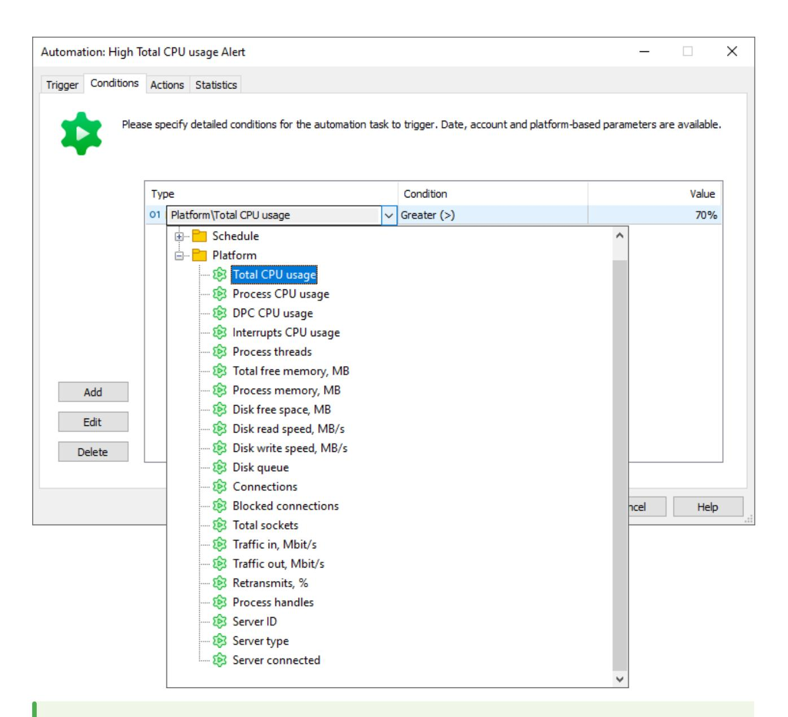

See also: [Documentation](https://support.metaquotes.net/en/docs/mt5/platform/administration/automation/automation_condition) / Platform / Platform Settings / Automations / Conditions

Next, specify the actions to be performed. You can enable sending of SMS or push notifications to your mobile phone.

| Trigger Conditions                                                            |                                                                                                                                                                                                                                   |        |
|-------------------------------------------------------------------------------|-----------------------------------------------------------------------------------------------------------------------------------------------------------------------------------------------------------------------------------|--------|
|                                                                               | Please specify actions that should be performed when conditions trigger. For example, sending a message, updating account settings or performing balance operation, etc. Also specify accounts and groups to apply the action to. |        |
|                                                                               |                                                                                                                                                                                                                                   |        |
| <b>Up</b>                                                                     | Name                                                                                                                                                                                                                              |        |
|                                                                               |                                                                                                                                                                                                                                   |        |
|                                                                               |                                                                                                                                                                                                                                   |        |
|                                                                               |                                                                                                                                                                                                                                   |        |
| <b>Down</b>                                                                   |                                                                                                                                                                                                                                   |        |
|                                                                               |                                                                                                                                                                                                                                   |        |
|                                                                               |                                                                                                                                                                                                                                   |        |
|                                                                               |                                                                                                                                                                                                                                   |        |
|                                                                               |                                                                                                                                                                                                                                   |        |
|                                                                               |                                                                                                                                                                                                                                   |        |
|                                                                               |                                                                                                                                                                                                                                   |        |
| Name:                                                                         | Send SMS to Admin                                                                                                                                                                                                                 |        |
| Action:                                                                       | Send SMS                                                                                                                                                                                                                          |        |
|                                                                               |                                                                                                                                                                                                                                   |        |
| Send by:                                                                      | Phone                                                                                                                                                                                                                             |        |
| To:                                                                           | +15678901234                                                                                                                                                                                                                      |        |
| ALERT!<br>High Total CPU usage on server.<br>Please check server performance. |                                                                                                                                                                                                                                   |        |
|                                                                               |                                                                                                                                                                                                                                   |        |
|                                                                               |                                                                                                                                                                                                                                   |        |
|                                                                               | <b>OK</b>                                                                                                                                                                                                                         | Cancel |

#### **SMS notifications**

In the action settings, message sending options:

- ·Login — to the phone number specified in the administrator account settings
- · Group — to all accounts from the specified group. For example, you can specify here the entire group of platform administrators so that they allreceive notifications.
- ·Phone — to the specified phone number

To enable the system to send SMS messages, configure platform integration with [messengers.](#page-269-0)

#### **Push notifications**

In the action settings, message sending options:

·Login — to MetaQuotes ID specified in the administrator account settings · Group — to all accounts from the specified group. For example, you can specify here the entire group of platform administrators so that they allreceive notifications on their MetaQuotes IDs.

To start receiving push notifications, the administrator should install MetaTrader 5 mobile for [iPhone](https://www.metatrader5.com/en/mobile-trading/iphone) or [Android](https://www.metatrader5.com/en/mobile-trading/android) on a smartphone, and then register MetaQuotes ID in the account settings in the platform:

| Label          | Value                              |
|----------------|------------------------------------|
| Name:          | John                               |
| Last name:     | Smith                              |
| Company:       | <b>Forex Broker</b>                |
| Registered:    | ▦▾<br>2018.07.13 10:55:58          |
| Language:      |                                    |
| ID number:     |                                    |
| MetaQuotes ID: | C9A069EE                           |
|                | <b>C9A069EE</b>                    |
| Email:         | john@forexbroker.com               |
| Phone:         | +12799933999                       |
| Country:       | <b>United States</b>               |
| City:          | <b>New York</b>                    |
| Address:       | 24 Wall St, 15                     |
| Comment:       | automatically generated on startup |

Search for messages or chats

Articles

Graphics in the DoEasy Library (part 75):

Yesterday

Methods of handling primitives and text in the...

Traders

Some more news about how MetaTrader 5 gains  
more popularity

7/5/21

Signals

New subscription Smart Grid 26980 Demo for account 44012836: https://www.mql5.com/en/

5/20/21

Profile

Username

4/19/21

C9A069EE

Use this ID to send messages to this device via notify service

4/18/21

Hello John Smith  
Over 20 years Trading For Institutional Investor...

2/21/21

Hello John Smith  
Still do not know why price moves differently in...

2/1/21

Hi:John Smith  
If you are confused in the face of trading,...

12/7/20

We have an update  
Install the update to set and edit pending orders,

11/4/20

My MetaQuotes ID: C9A069EE

#### **Message text**

You can use macros in messages. Macros allow the substitution of appropriate data depending on the message recipient (account) and the event. Use the context menu to insert macros.

In this case, macro #MONITOR\_CPU# was used. It will substitute the measured CPU load into the text.

#### See also:

- ·[Documentation](https://support.metaquotes.net/en/docs/mt5/platform/administration/automation/automation_condition) / Platform / Platform settings / Automation / Actions
- ·[Documentation](https://support.metaquotes.net/en/docs/mt5/platform/administration/automation/automation_macros) / Platform / Platform settings / Automation / Macros

# <span id="page-157-0"></span>**License restrictions: Accounts, servers, expiration**

The MetaTrader 5 platform is available in three different configurations, which allows choosing the license type that best suits your business model and company development plans. The pricing policy does not require an upfront license purchase fee, as the platform is based on a flat "Pay as You Go" monthly subscription fee. Each license type includes desktop, web and mobile (iOS & Android) terminals at no additional cost. License types differ on the real accounts capacity and the number of trade servers.

| License type      | Real accounts capacity | Monthly flat fee (USD) |
|-------------------|------------------------|------------------------|
| <b>ENTRY</b>      | 1 000                  | 5 000                  |
| <b>STANDARD</b>   | 25 000                 | 10 000                 |
| <b>ENTERPRISE</b> | 200 000                | 20 000                 |

## **Entry**

The entry set of system components supporting up to 1,000 real accounts. The Entry license is suitable for companies serving a small number of customers.

## **Standard**

The standard set of system components supporting up to 25 000 real accounts. This amount is enough to meet your current business needs while additionally reserving lots of room for dynamic business growth.

The Standard license is an ideal solution for the most of established medium-to-large size companies.

## **Enterprise**

An ultimate license allowing you to serve up to 200,000 real accounts. This set allows establishing three [common](https://support.metaquotes.net/en/docs/mt5/platform/components/trade_server) trade [servers](https://support.metaquotes.net/en/docs/mt5/platform/components/trade_server) in addition to the main one. The system installed under the license of this type is able to support and satisfy even the most extreme demands.

Enterprise is idealfor large established institutions such as large international brokers, banks and liquidity providers operating on multiple markets and serving very large and diverse client base.

| ENTRY                                                                                              | STANDARD                                                                                                                                           | ENTERPRISE                                                    |                                                  |
|----------------------------------------------------------------------------------------------------|----------------------------------------------------------------------------------------------------------------------------------------------------|---------------------------------------------------------------|--------------------------------------------------|
| Number<br>of Real Accounts                                                                         | 1 000                                                                                                                                              | 25 000                                                        | 200 000                                          |
| <b>Terminals</b>                                                                                   | WebTerminal<br>Client Desktop Terminals<br>(main label)<br>Client Mobile Terminals<br>(main label)<br>Manager Terminals<br>Administrator Terminals | $	ext{✓}$<br>$	ext{✓}$<br>$	ext{✓}$<br>$	ext{✓}$<br>$	ext{✓}$ | $	ext{✓}$<br>$	ext{✓}$<br>$	ext{✓}$<br>$	ext{✓}$ |
| Servers<br><b>Trade Server</b><br><b>History Server</b><br><b>Access Servers</b><br>Backup Servers | $	extbf{1}$<br>$	ext{✓}$<br>$	ext{✓}$<br>$	ext{✓}$                                                                                                 | $	extbf{1}$<br>$	ext{✓}$<br>$	ext{✓}$<br>$	ext{✓}$            | 4<br>$	ext{✓}$<br>$	ext{✓}$                      |
| Gateways                                                                                           | Add-on upon order                                                                                                                                  | Add-on upon order                                             | Add-on upon order                                |

## **Control of the current account capacity**

The number of real accounts is displayed on the platform start page:

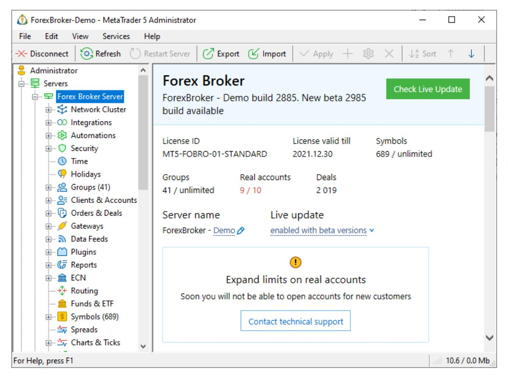

If the number of allowed accounts is running out, a relevant notification will be displayed on this page. Please do not ignore this warning, otherwise you will not be able to open new accounts for your clients soon.

Number of real accounts is the total number of accounts available in the system depending on the purchased license type. This number does not include accounts opened in manager\*, demo\*, preliminary\* and contest\* groups, as well as accounts with disabled trading options.

## **Controlling license expiration**

The license expiration date is also displayed on the start page.

A notification will appear one month before the expiration Do not ignore it. If the license expires, the platform will switch to the reduced functionality mode and you will not be able to serve customers.

Please contact technical support for license renewal. Once a new license is issued for you, you will need to run the [platform](#page-161-0) update. During update check, the updated license file will be downloaded and installed.

All servers in the cluster are restarted to apply the new license. Therefore, the license update and download should be launched only on weekends, during non-trading hours.

## <span id="page-161-0"></span>**Platform update**

One of the criticaltasks related to platform administration is keeping the system up to date. New versions provide new features, bug fixes, improved performance, and increased reliability.

Using older versions is connected with potential compatibility and security issues. If you postpone updates for too long, later you will have to jump through several updates when installing the latest version. This may cause connectivity issues with your back office and third-party integrations.

New versions expand platform capabilities and provide greater reliability. Your company gains a competitive edge and improves customer service through updates. You can view release notes on the [Support](https://support.metaquotes.net/en/news) Center [website](https://support.metaquotes.net/en/news) to see how new versions affect the platform.

### **Upgrade recommendations**

Although the platform provides full inter-version compatibility of interfaces and allAPIs, we highly recommend that you install new versions on your development and demo servers, to ensure correct platform operation. If you do not have free [development](#page-53-0) licenses, please contact [technical](https://support.metaquotes.net/en/servicedesk/new) support.

After making sure that the new version is fully compatible and stable with all integrations, proceed to updating the working platform. Install updates only on weekends when trading is not conducted.

## **Built-in update system**

The Live Update system is a reliable and efficient way to distribute the updated versions of all platform components.

- ·Terminal updates are cached on access servers to reduce the load on the history server.
- · The update files are compressed and digitally signed. These files are transmitted over an encrypted channel.
- ·Platform components additionally check updates when unpacking the files.

The update of the entire platform can be easily installed with one command.

## **Configuring the update system**

The platform update mode is controlled on the start page.

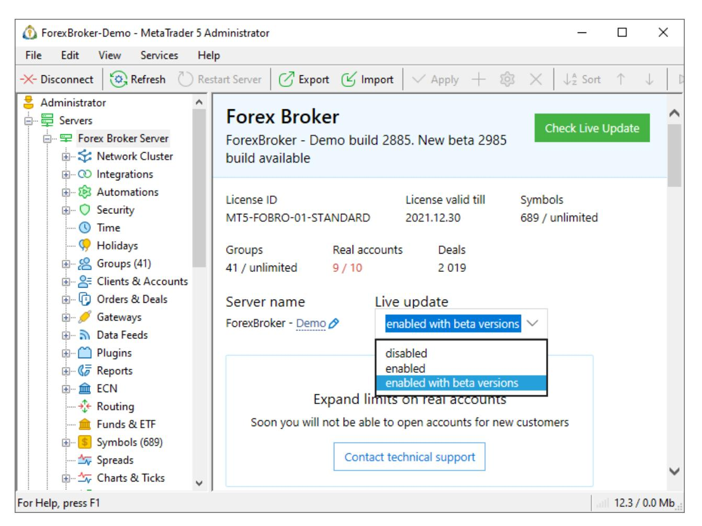

There are three options for installing updates:

- · **Disabled** — the platform is not updated [automatically](#page-162-0) in this mode. The update can only be performed manually by pressing **Start Live Update** in the **Service** menu.
- ·**Enabled** — in this mode, platform components are updated automatically to latest release versions.
- · **Enabled with beta versions** — in addition to release versions of platform components, updates can provide beta versions, which are released much more often. If this option is enabled, the components will be updated regardless of the update type. However, please note that beta versions may be unstable and should be installed only in special cases.

It is highly recommended to use the beta updates only in special cases and only on demo servers.

### <span id="page-162-0"></span>**Automated update procedure**

- · On the night from Saturday to Sunday, during optimization, the history server runs the mt5srvupdater64.exe file, which connects to the update server and checks for updates for all platform components. Optimization time is specified under the **Service** section of the main trade server.
- ·If updates are available, the relevant files are downloaded.

- ·Further, the history server notifies other platform components about the availability of updates.
- ·Server components are immediately updated in the automated mode.
- ·Terminals will display a window prompting the user to update to the latest version.

### **Manual update**

To start updating the platform manually, click **Start Live Update** in the **Service** menu.

### **Monitoring the update process**

To view the update result, query the history server [log,](#page-167-0) specifying Update for the type of requested records.

|                                                  | Sample Trader Demo - MetaTrader 5 Administrator                    |            |                                                    |  |  |  |
|--------------------------------------------------|--------------------------------------------------------------------|------------|----------------------------------------------------|--|--|--|
| File<br><b>Services</b><br>Edit<br>View          | Help                                                               |            |                                                    |  |  |  |
| $ar{} abla$ Refresh $ar{C}$<br>-X- Disconnect | $	extcal{C}$ Export $	extcal{C'} $ Import<br><b>Restart Server</b> |            | ⚊ න<br>$ottom$ 2 Sort $	op$<br>$igvee$ Apply $+$ |  |  |  |
| Administrator                                    | Time $	riangle$                                                    | IP         | Message                                            |  |  |  |
| □ Servers                                        | 2021.05.17 11:29:03.981                                            | Upgrade    | No files for upgrade                               |  |  |  |
| MetaTrader Broker Server                         | 2021.05.19 04:47:00.484                                            |            |                                                    |  |  |  |
| in Network Cluster                               | 2021.05.19 04:47:00.485                                            |            | MetaTrader 5 Server Updater (build 2885, 14A)      |  |  |  |
| MetaTrader 5 Module                              | 2021.05.19 04:47:00.485                                            |            | Copyright 2000-2021, MetaQuotes Ltd.               |  |  |  |
| History Server                                   | 2021.05.19 04:47:00.485                                            |            |                                                    |  |  |  |
| Access Server                                    | 2021.07.07 11:34:53.378                                            |            |                                                    |  |  |  |
| Integrations                                     | 2021.07.07 11:34:53.379                                            |            | MetaTrader 5 Server Updater (build 2885, 14A)      |  |  |  |
| Automations                                      | 2021.07.07 11:34:53.379                                            |            | Copyright 2000-2021, MetaQuotes Ltd.               |  |  |  |
| Security                                         | 2021.07.07 11:34:53.379                                            |            |                                                    |  |  |  |
| $ox$ $igodot$ Time                             | 2021.07.07 11:34:53.977                                            | License    | Information Updated                                |  |  |  |
| $bQ$ Holidays                                   | 2021.07.07 11:34:54.203                                            | Downloader | Revision 8749                                      |  |  |  |
| Groups (41)                                      | 2021.07.07 11:34:54.203                                            |            | 'mt5adm64' build 2985 size 18154 KB                |  |  |  |
| Clients & Accounts                               | 2021.07.07 11:34:54.203                                            |            | 'mt5adm64' build 2885 -> 2985 loaded               |  |  |  |
| Orders & Deals                                   | 2021.07.07 11:34:54.203                                            |            | 'mt5as64' build 2985 size 6999 KB                  |  |  |  |
| Gateways                                         | 2021.07.07 11:34:54.203                                            |            | 'mt5as64' build 2885 -> 2985 loaded                |  |  |  |
| Data Feeds                                       | 2021.07.07 11:34:54.203                                            |            | 'mt5bs64' build 2985 size 33319 KB                 |  |  |  |
| Plugins                                          | <b>Trades</b><br>$2021.07.07 11:34$                                |            | 'mt5bs64' build 2885 -> 2985 loaded                |  |  |  |
| Reports                                          | 2021.07.07 11:34:54.203                                            |            | 'mt5clw64' build 2985 size 29298 KB                |  |  |  |
| ECN                                              | 2021.07.07 11:34:54.203                                            |            |                                                    |  |  |  |
| Routing                                          | 2021.07.07 11:34:54.203                                            |            | Full Live Update<br>Q<br>$	ickmark$                |  |  |  |
| Funds & ETF                                      | 2021.07.07 11:34:54.203                                            |            |                                                    |  |  |  |
| $14.4 / 0.0$ MB<br>For Help, press F1            |                                                                    |            |                                                    |  |  |  |

#### **Current component versions**

The **Live Update** section features the list of all updated platform components, build numbers, release dates, and the distribution file size.

|      | ×<br>(1) ForexBroker-Demo - MetaTrader 5 Administrator |      |                                                                                            |                        |            |                                  |        |                 |  |  |
|------|--------------------------------------------------------|------|--------------------------------------------------------------------------------------------|------------------------|------------|----------------------------------|--------|-----------------|--|--|
| File | Edit<br>View<br><b>Services</b>                        | Help |                                                                                            |                        |            |                                  |        |                 |  |  |
|      | $
ight( il;$ Refresh $igcirc$                        |      | $
ight 
ight $ $igcirc$ Export $
ight 
ight  igvee Import 
ight 
ight  + Restart Server$ |                        | 503        | $
ightarrow^{}$ Sort<br>$	imes$ |        |                 |  |  |
|      | $
ightarrow^{2}$ Routing                              |      | Component                                                                                  |                        | Version    | Date                             |        | Size (kb)       |  |  |
|      | Funds & ETF                                            |      | MetaTrader 5 Administrator                                                                 |                        | 2985       | 2021.07.07                       |        | 18,154          |  |  |
|      | Symbols (689)<br>$+ -$                                 |      | MetaTrader 5 Access Server                                                                 |                        | 2985       | 2021.07.07                       |        | 6,999           |  |  |
|      | …… 么。 Spreads                                          |      | MetaTrader 5 Backup Server                                                                 |                        | 2985       | 2021.07.07                       |        | 33,319          |  |  |
|      | 画 文 Charts & Ticks                                     |      | ∆⊽ MetaTrader 5 Client                                                                     |                        | 2985       | 2021.07.07                       |        | 29,298          |  |  |
|      | <b>A.</b> (5) Subscriptions                            |      | MetaTrader 5 Client IDE<br>2985                                                            |                        | 2021.07.07 |                                  | 23,194 |                 |  |  |
|      | <b>Example 1</b> Live Update                           |      | MetaTrader 5 Client Terminal Tester                                                        |                        | 2985       | 2021.07.07                       |        | 10,330          |  |  |
|      | □ C Support Center                                     |      | ⊙<br>MetaTrader 5 History Server                                                           |                        | 2985       | 2021.07.07                       |        | 136,616         |  |  |
|      | News                                                   |      | MetaTrader 5 Server Updater<br>65                                                          |                        | 2985       | 2021.07.07                       |        | 5,499           |  |  |
| 田一   | n<br>Articles                                          |      | 뵴<br>MetaTrader 5 Manager                                                                  |                        | 2985       | 2021.07.07                       |        | 14,491          |  |  |
|      | <b>Platform Documentation</b><br>ΠЧ                    |      | 帕 MetaTrader 5 Trade Server                                                                |                        | 2985       | 2021.07.07                       |        | 49,335          |  |  |
|      | APL API Documentation                                  |      |                                                                                            | Start Live Update      |            |                                  |        |                 |  |  |
|      | Workshops । ⊠                                          |      |                                                                                            |                        |            |                                  |        |                 |  |  |
|      | <b>Q</b> Certification                                 |      |                                                                                            | Auto Arrange<br>$	ick$ |            |                                  |        |                 |  |  |
|      | …                                                      |      |                                                                                            | $	ick$ Grid            |            |                                  |        |                 |  |  |
|      | For Help, press F1                                     |      |                                                                                            |                        |            |                                  |        | $17.2 / 0.0$ Mb |  |  |

## **Rollback an update**

If, for any reason, you need to roll back a platform update to one of the previous versions, please observe the following points:

- ·Before rolling back, make a full backup of the current platform state.
- · Since some updates may convert (change the format of) databases and configuration files, you can't rollback executable files of the trading platform components separately. You should perform the fullroll back.
- · Also, please note that API versions can be changed during the update. Accordingly, third-party applications written in the APIs must be recompiled with the correct version.

It is not recommended to roll back to previous versions unless absolutely necessary.

## <span id="page-165-0"></span>**Migrating the platform to new hardware**

If you need to move history or trade servers, for example to a new hardware, use the backup server capabilities. It is a reliable and quick option.

Install a [backup](#page-104-0) server on the computer, to which you plan to migrate the server. After installing and launching the backup server, it is recommended to let it operate for a few days on the new machine, to make sure it operates well.

In order to avoid loss of data, which are backed up once an hour, restart the backup server just before switching to it. It will create a fresh backup copy of your data. During the backup process, a sync icon is displayed on the server icon: . As soon as it disappears, it means data sync is complete, and you can switch to the server. Select **Switch to the backup server**, and the backup server will start operating as the primary server, while the primary server will switch to the backup mode.

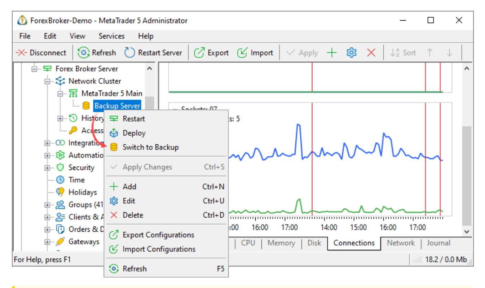

Server migration must only be performed at non-trading hours. During a switchover, the backup server no longer copies the data that the main server continues to receive. Although switching usually takes less than a minute, a significant amount of data may be lost in case of large trading activity.

Be sure to restart the backup server process before switching to it, and wait for data sync to complete.

### **Changing the IP address**

When you change the IP address on the server where the MetaTrader 5 cluster is installed, binding to the new address is performed via the server [console](#page-171-0) mode:

·Run mt5trade64.exe /gui\_main for the main trade server and change addresses of all cluster components. Platform migration

- ·Run mt5history64.exe /guifor the history server and change the addresses of the history and main server.
- ·Run mt5access64.exe /guifor the access server and change the addresses of the access and main server.

## <span id="page-167-0"></span>**Working with platform logs**

Platform logs serve as one of the most important tools for an administrators. Logs provide details of all problems or disputable situations. By regularly analyzing error logs and warnings, you can prevent potential issues. Logs enable controls over information accessed by employees to prevent leaks, and more.

All platform servers, gateways and data feeds have their own separate logs. The relevant components log all performed actions, errors, and other service information.

The information is written to \*.log files, separately for each day. Server logs are saved at [executable file directory]\logs; for gateways: at [history server directory]\[Gateway | Datafeed]\[configuration name]\logs.

Use MetaTrader 5 Administrator for convenient access to the logs. Select the desired component in the tree and navigate to the appropriate tab:

| ForexBroker-Demo - MetaTrader 5 Administrator |                                                                                  |            |
|-----------------------------------------------|----------------------------------------------------------------------------------|------------|
| File                                          | Edit                                                                             | View       |
| <b>Disconnect</b>                             |                                                                                  |            |
| <b>Restart Server</b>                         | Export                                                                           | Import     |
| <b>Apply</b>                                  | Sort                                                                             |            |
| Administrator                                 |                                                                                  |            |
| Servers                                       | Time                                                                             | IP         |
| Forex Broker Server                           | 2021.07.07 11:12:30.865                                                          | LiveUpdate |
| Network Cluster                               | 2021.07.07 11:12:30.929                                                          | LiveUpdate |
| MetaTrader 5 Main                             | 2021.07.07 11:12:31.024                                                          | LiveUpdate |
| History Server                                | 2021.07.07 11:12:31.024                                                          | Scheduler  |
| Access Server                                 | 2021.07.07 11:12:31.024                                                          | Monitor    |
| Integrations                                  | 2021.07.07 11:12:31.024                                                          | Monitor    |
| Automations                                   | 2021.07.07 11:12:31.024                                                          | Monitor    |
| Security                                      | 2021.07.07 11:12:31.024                                                          | Monitor    |
| Time                                          | 2021.07.07 11:12:31.037                                                          | Monitor    |
| Holidays                                      | 2021.07.07 11:12:33.095                                                          | Monitor    |
| Groups (41)                                   | 2021.07.07 11:12:33.097                                                          | Monitor    |
| Clients & Accounts                            | 2021.07.07 11:12:33.351                                                          | Monitor    |
| Orders & Deals                                | 2021.07.07 11:12:33.351                                                          | Scheduler  |
| Gateways                                      | 2021.07.07 11:12:33.351                                                          | Startup    |
| Data Feeds                                    | 2021.07.07 11:12:33.351                                                          | Startup    |
| Plugins                                       | 2021.07.07 11:12:33.351                                                          | Status     |
| Reports                                       |                                                                                  |            |
| ECN                                           | Overview<br>CPU<br>Memory<br>Disk<br>Network<br>Journal<br>Status<br>Connections |            |
| 19.6 / 0.0 MB<br>For Help, press F1           |                                                                                  |            |

Next, specify the keyword for the query, record type, event type and dates.

A journal can contain a huge number of log entries. To avoid system slowdown, the Administrator terminal limits the amount of displayed information to about 30,000 lines. If you reach the limit, a notification will appear in the query window. In this case, refine your search: specify a keyword or indicate a smaller date range.

- · An integrity control system is applied for all log files. If the file was edited on the server, the first edited entry and allthe following records will be highlighted in red.
- · When contacting technical support, always attach the relevant platform logs to ensure a prompt solution to your issues.

### **Keywords**

To analyze the server log, you can use any words and phrases which can be found in the server log. Please note that requesting a full log without a query string will not output the entire server log, since the maximum amount of information output is limited (to approximately 30,000 server log lines).

You can use the following keywords to analyze specific situations:

- ·**Startup** — information about the server initialization and restart.
- ·**Exit** — information about the server stops.
- · **Synchronization** — history synchronization. Possible errors: no connection to the server, synchronization with which is required.
- · **Users** — information related to operations with the account database. Possible errors: invalid database header, error writing to/reading from disk, not enough memory.
- · **History** — information related to working with history data of a symbol. Possible errors: invalid database header, write/read error, invalid quotes in the database.
- · **datafeed** or [data feed name] — activation and operation of data feeds. Possible errors: feeder creation error, invalid timeout, error reading data from the feeder.
- ·**Filter** — filtering quotes (quotes which were not forwarded to the server).
- · **Mail** — work with the mail database. Possible errors: invalid database header, write/read error, not enough memory.
- · **Monitor** — performance measurement and operations with the monitoring database. Possible errors: invalid database header, inability to obtain information about the computer performance.
- ·**News** — news database. Possible errors: incorrect header or database version.
- · **Access, Common, Feeders, Groups, Managers, SymbolGroups, HistorySync, Holidays** — files of relevant server configurations. Possible errors: read/write error.
- ·**Network** — server operation. Possible errors: the port is already in use.
- ·**LiveUpdate** — Live Update system and its databases.
- ·**block** — blocking and unblocking by the anti-flood control.

- · **'[account number]'** — to analyze actions related to a specific account, specify the account in single quotes in the query. For example: '12345'.
- · **#[ticket]** — to analyze actions related to a specific order or deal, specify the operation ticket with the # sign in the query. For example: #111222.
- · **login** — connection to the server with an account. These logs provide information on time, type of connection (client, manager, web terminal, etc.), terminal build and other details.
- ·**logout** — account disconnection from the server.

You can specify keywords combined using logical operators as a query string. The search string supports the following logical operators:

- · **| (or)** — logical operator OR, allows the selection of log lines containing either the first or the second keyword.
- · **& (and)** — logical operator AND, allows the selection of only those log lines which contain the first and the second word; a space between keywords is considered as the AND operator.
- · **^ (-, not)** — logical operator of exclusion NOT, allows the selection of log lines that do not contain the excluded keyword.

Making an exact search query using logical operators increases the efficiency of selection of the desired log entries. For example, the search string '5'&login allows the selection of logs related to the logging in of the manager with login 5.

Search is case sensitive. For example, search for "Session" and "session" will give different results.

### **Log types**

To facilitate search, you can filter logs by type:

- ·**Full** — alltypes of journal entries.
- ·**Without logins** — all logs except the information about the connections of users to a server.
- ·**Errors only** — only error logs.

#### **Event types**

To facilitate search, you can filter logs by event type:

- ·**All** — all events except for Live Update.
- ·**Configuration** — changes in server settings.
- ·**System** — system events.
- ·**Network** — events related to network activities.

- ·**History** — events related to history data.
- ·**Accounts** — events related to accounts on the server.
- ·**Trades** — events related to trading operations on the server.
- ·**API** — events related to working via API.
- ·**LiveUpdate** — events related to the update of the platform components.
- ·**Report Mailer** — events related to the distribution of daily reports.
- ·**Failover** — events related to automatic switching to the backup server.

Live Update logs are not displayed when you select the All event type, as these logs are stored in a separate file (mt5srvupdater.log).

### **Convenient log query**

Many sections of MetaTrader 5 Administrator provide commands for a quick log query for selected entries: trade operations, configurations, etc.

| ForexBroker-Demo - MetaTrader 5 Administrator |                                                                                                           |                            |               |  |  |  |
|-----------------------------------------------|-----------------------------------------------------------------------------------------------------------|----------------------------|---------------|--|--|--|
| File<br>Edit<br>Services<br>View<br>Help      |                                                                                                           |                            |               |  |  |  |
| -X- Disconnect                                | $C$ Refresh $igcirc$ Restart Server $igcirc$ Export $igcirc$ Import<br>$\u2228$ Apply $+$ 83<br>$4a$ | $\u21931;_2^A$ Sort $e9$ |               |  |  |  |
| Administrator<br>Α                            | Time<br>Login<br>Position<br>Symbol<br>Volume                                                             | Type                       | Volume        |  |  |  |
| Servers                                       | 2018.10.31 15:50:43.264<br>1009<br>E.<br>69<br><b>EURUSD</b>                                              | buy                        | 0.5           |  |  |  |
| Forex Broker Server                           | 2018.1<br>Ctrl + U 9<br><b>USDCHF</b><br>72                                                               | buy                        | 0.3           |  |  |  |
| Network Cluster                               | 2018.0<br><b>EURNZD</b><br>46<br>Ctrl + D 8<br>× Delete                                                   | sell                       | 1.8           |  |  |  |
| MetaTrader 5 Main                             | 2018.1<br>92<br><b>AUDJPY</b>                                                                             | buy                        | 2             |  |  |  |
| History Server                                | 2019.0<br>135<br><b>EURUSD</b>                                                                            | buy                        |               |  |  |  |
| Access Server                                 | 2019.0<br>140<br><b>EURUSD</b><br>Copy As<br>▶                                                            | buy                        |               |  |  |  |
| Integrations                                  | 2019.0<br><b>USDJPY</b><br>Journal By<br>Login                                                            | buy                        |               |  |  |  |
| Automations                                   | 2019.1<br><b>ENTLOW</b>                                                                                   | buy                        | 150           |  |  |  |
| Security                                      | 2019.1<br><b>EURUSD</b><br>Export<br>#<br>Ticket                                                          | buy                        | 10            |  |  |  |
| Time                                          | 2019.1<br>169<br><b>GBPUSD</b><br>Ctrl+F 4<br>Q Find                                                      | sell                       |               |  |  |  |
| Holidays                                      | 2019.1<br>170<br><b>EURAUD</b>                                                                            | buy                        | 5             |  |  |  |
| Groups (41)                                   | 2019.1<br>$$ Show Milliseconds<br>171<br><b>USDJPY</b>                                                   | sell                       | 15            |  |  |  |
| Clients & Accounts                            | 2021.0<br>Auto Arrange<br>ENTLOW.P<br>2505                                                                | buy                        | 0.5           |  |  |  |
| Orders & Deals                                | 2020.1<br><b>EURUSD</b><br>185<br>$$<br>Grid                                                             | buy                        | 0.5           |  |  |  |
| Positions                                     | 2021.0<br>2504<br><b>GBPUSD</b>                                                                           | buy                        | 0.5           |  |  |  |
| Orders                                        | Columns<br>▶                                                                                              |                            |               |  |  |  |
| Deals                                         |                                                                                                           |                            |               |  |  |  |
| Gateways                                      | Q *<br>All Symbols<br>Current database<br>$$<br>$$                                                      |                            | Request       |  |  |  |
|                                               |                                                                                                           |                            | 25.9 / 0.0 Mb |  |  |  |

This will open the trade server logs section, with the identifier of the selected entry (account number, ticket, configuration name, etc.) automatically specified in the query field. Simply press the request button.

## <span id="page-171-0"></span>**Server and utility console commands**

Each of the executable files (\*.exe) of the trading platform servers has a specific set of console commands. The commands allow the execution of general actions with the corresponding services in the system, as well as the configuration of component connections when it is impossible to work through the Administrator terminal.

To run a console command, open the Run window in your operating system and type cmd. In the command line, go to the directory in which the executable file of one of the servers is located, enter its name and specify one of the console commands. For example:

C:\MetaTrader 5 Platform\Access>mt5access.exe /stop

#### **Common commands**

The following set of console commands perform common actions and are available for executable files of all servers:

- ·**/start** starts the service associated with this server executable file.
- ·**/stop** stops the service associated with this server executable file.
- ·**/restart** restarts the service associated with this server executable file.
- ·**/console** starts the service in console mode.
- · **/install [/name:service\_name /display:display\_name /description:service\_description]** installs a service, associating it with the given executable file. As additional parameters, you can specify the service name for the operating system, the extended (display) name of the service for users, and its description. If you do not specify parameters, the default service name will be set.
- · **/uninstall [/name:service\_name]** deletes the service associated with the given executable file. As an optional parameter, you can specify the name of the service to be deleted.
- · **/info** shows server information: internalID, own address, main server address and binding addresses (for access servers).

Additional parameters are specified without brackets. For example: /install/name:mt5access /display:Access Server

#### **Server configuration**

If incorrect parameters were specified during the installation of some component and connection to the platform via the Administrator terminal is impossibles, you can reconfigure the components using the console command **/config**. This command can run on any server except the main trade server. The following parameters are available for the command:

- · **/main:address:port** (for trade servers) or **/main\_trade:address:port** (for non-trade servers) — the IP address and port of the main trade server, separated by a colon.
- ·**/own:address:port** — the IP address and port of the server being configured, separated by a colon.
- · **/history:address:port** — the IP address and port number of the history server. The parameter is only used when configuring access servers. It enables immediate specification of the history server address, without waiting for it from the main server. This improves the speed and reliability server deployment.
- ·**/id:identifier** — the internal identifier of the server being configured.
- ·**/password:password** — the internal password of the server being configured.

You can specify multiple addresses separated by commas in the 'main', 'own' and 'history' parameters. For example: /main:192.168.0.1:440,[2a00:1987:1:30::2a]:440.

These parameters match the parameters specified in the **Network Cluster** section in the Administrator terminal. After you run the command, the previously specified server parameters will be overwritten.

Example:

/config /main:192.168.0.1:440 /own:192.168.0.1:443 /id:3 /password:3jdaLjsQ

#### **Configuring servers in graphical mode**

To configure a server in graphical mode, run its executable file from the command line with the **/gui** key. For example, mt5trade64.exe /gui.

| MetaTrader 5 Trade Server Configuration                                                                                                     |                                             |
|---------------------------------------------------------------------------------------------------------------------------------------------|---------------------------------------------|
| Enter the IP:port of the server, its ID and password. Make sure that these data<br>were registered on the main trade server of the cluster. |                                             |
| Server IPv4 address:                                                                                                                        | 192.168.1.230:441                           |
| Server IPv6 address:                                                                                                                        |                                             |
| Server ID:                                                                                                                                  | 1                                           |
| Password:                                                                                                                                   |                                             |
| To connect an additional server to the cluster please specify the IP:port of the main trade                                                 |                                             |
| Main Trade server:                                                                                                                          | 192.168.1.230:441                           |
| © 2000-2022, MetaQuotes Ltd.                                                                                                                |                                             |
|                                                                                                                                             | <button>Cancel</button> <button>OK</button> |

The same parameters are configured here as in the console mode:

- ·**Server IP address** — the IP address and port of the server being configured, separated by a colon.
- ·**Server ID** — the internal identifier of the server being configured.

- ·**Password** — the internal password of the server being configured.
- ·**Main Trade server** — the IP address and port of the main trade server, separated by a colon.

The Restore command is available in the backup server configuration window. With this command you can [restore](#page-120-0) the primary server.

#### **Configuring the main trade server**

A separate console program, **/config\_main**, is provided for configuring the main trade server. The command features the following parameters:

- ·**/main:address:port** for the IP address and port of the main trade server, separated by a colon.
- ·**/access:address:port** for the IP address and port of the access server, separated by a colon.
- ·**/history:address:port** for the IP address and port of the history server, separated by a colon.
- ·**/backup:address:port** for the IP address and port of the backup server, separated by a colon.
- ·**/password:password** for the internal password that will be set for allthe aforementioned servers.

During configuration, internalIDs will be automatically assigned to all servers: 1 for the trade server, 2 for the access server, 3 for the history server, and 4 for the backup server.

#### **Configuring the main trading server in graphical mode**

To configure the main trade server in graphical mode, run its executable file from the command line with the **/gui\_main** key. For example, mt5trade64.exe /gui\_main.

| MetaTrader 5 Main Trade Server Configuration |                                                                                                                                                                |                   |        |
|----------------------------------------------|----------------------------------------------------------------------------------------------------------------------------------------------------------------|-------------------|--------|
|                                              | Specify configuration of all server components of the trading system. There must be one Main Trade Server, one History Server, and one Access Server at least. |                   |        |
|                                              | Server                                                                                                                                                         | <b>Address</b>    | ID     |
|                                              | Main Server                                                                                                                                                    | 192.168.1.230:441 | 1      |
|                                              | Access Server                                                                                                                                                  | 192.168.1.230:443 | 2      |
|                                              | History Server                                                                                                                                                 | 192.168.1.230:442 | 3      |
|                                              | <b>Backup Server</b>                                                                                                                                           | 192.168.1.230:444 | 4      |
|                                              | Backup History Server                                                                                                                                          | 192.168.1.230:445 | 5      |
|                                              |                                                                                                                                                                |                   |        |
|                                              |                                                                                                                                                                |                   |        |
| Add                                          |                                                                                                                                                                |                   |        |
| Edit                                         |                                                                                                                                                                |                   |        |
| <b>Delete</b>                                |                                                                                                                                                                |                   |        |
|                                              | © 2000-2022, MetaQuotes Ltd.                                                                                                                                   | OK                | Cancel |

The window contains a list of servers, the configurations of which are already present on the main trade server.

To change server parameters, double click on it. This will open a standard [server](#page-57-0) setup dialog, similar to the dialog in MetaTrader 5 Administrator.

When you set up the main trade server, the system verifies the parameters. The situations are not allowed:

- ·Adding a duplicate main or history server. Only one instance of each server can exist in a cluster.
- ·Specifying an incorrect range of logins, orders or deals.
- ·Creating more trade servers than allowed by the license. These servers will not work.
- ·Deleting the main server (explicitly deleting or changing the type).
- ·Deleting a working trade server.
- · Changing the network settings, after which the main trade server would no longer be available to the administrator. For example, removing the last access server.

In allthese cases, a relevant warning will be displayed when you try to save the changes.

#### **Platform update and activation**

The mt5srvupdater64.exe history server component has several console commands which enable platform update and activation if the servers are not available for connection through the Administrator terminal.

To execute these commands, run mt5srvupdater64.exe from the root directory of the history server, specifying the necessary keys:

- ·**/update** downloads the updated files of all platform components, if there are any, from the update server.
- · **/upgrade** installs the [updates](#page-161-0) of all platform components. Running this command is only possible after downloading the updates.
- ·**/activate** [activates](#page-54-0) the platform.

For example, after you run *mt5srvupdater64.exe /update /upgrade*, the system will download and install platform updates.

The update process is logged in the mt5srvupdater.txt file, located under /history/logs/.

## <span id="page-176-0"></span>**Working with platform help information**

The MetaTrader 5 trading platform is a large and complex system with many settings and operation specifics. However, to become a good administrator, you do not need to immediately learn all its features. You can easily solve any work problem if you know how to navigate in the help information.

A plethora of reference materials are available for MetaTrader 5, including documentation and articles. The information is easy to access, as it is available online, on the Support Center website, and is built into the traders and brokers working tools. Therefore, you can access the relevant information by pressing F1 in the terminal.

## **Contextual help**

The platform Help is quite extensive. For easier navigation, they use contextual links. All elements of the terminal interface, such as menu commands, tabs and dialogs, are linked to specific pages in the user manual. The platform Help files feature more than 2,000 contextual links.

To access a specific topic, for example, on working with positions, select the appropriate section in the MetaTrader 5 Administrator interface and press F1. The desired Help section will immediately open and thus you do not need to search for information.

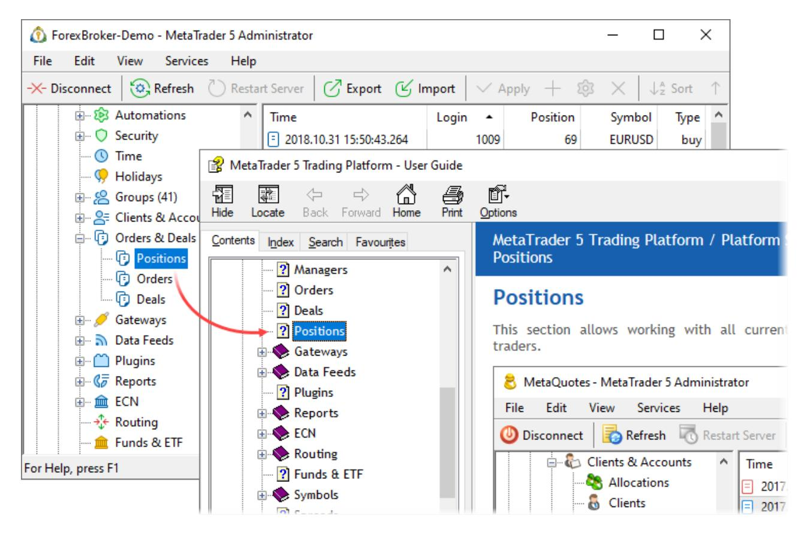

Similarly, you can invoke help for any dialog box, tab or menu command: open a dialog or hover over the command and press F1.

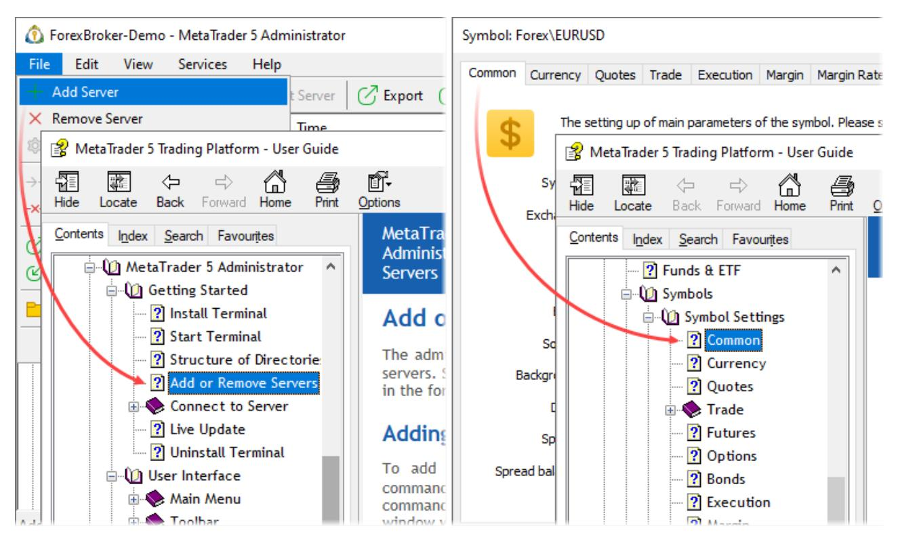

Additionally, you may use search if you do not know in which section the required command/setting is located. The search function is available on the Support Center website and in built-in Help files.

### **Built-in support center**

To facilitate access to information, many sections of the Support Center website are built into the Manager and Administrator terminals. You can view the documentation as well as read news, articles and answers to frequently asked questions, without going to the support website.

From the same section, you can contact the support team by using service desk or live chat.

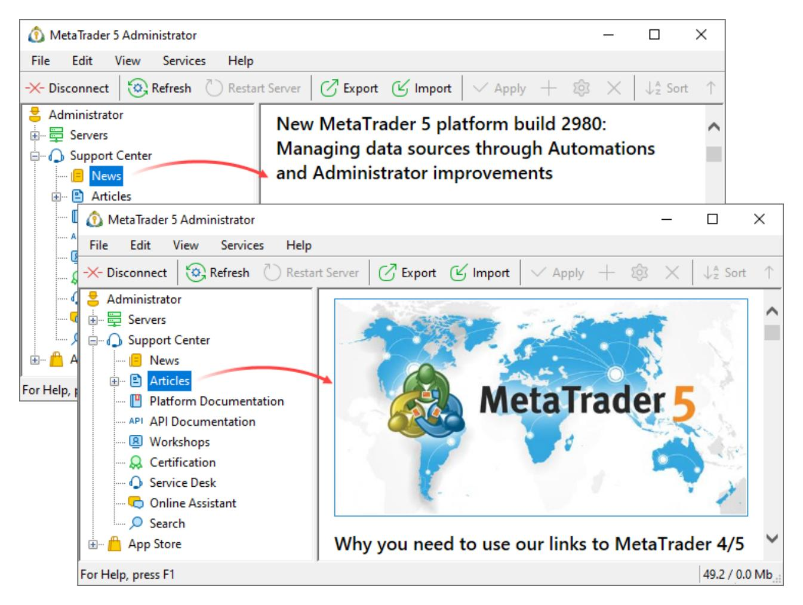

## <span id="page-179-0"></span>**Common errors**

- · Remember about the platform license expiration date. Be sure to contact technical support in a timely manner to renew the license. If the license expires, the platform will switched to the reduced functionality mode and you will not be able to serve customers.
- · Monitor the real accounts capacity provided by the license. Upgrade the license in advance if necessary, so as not to reach the limit. Otherwise, you will not be able to provide services to new customers.
- · Keep your hardware up to date. We do not recommend using hardware older than three years for the platform.
- ·Use the latest versions of operating systems and install all available updates for them.
- ·Do not ignore error messages in server logs. Analyze them to determine the reasons.
- · Do not install platform beta versions on servers with real clients. Use only special development servers or servers with demo accounts.
- · Before installing a new release version of the platform, update your test platform and check its operation with allthird-party integrations.
- ·Perform any technical work (update, transfer) only on weekends, when no trading operations are performed.

## <span id="page-180-0"></span>**Configuring client groups and accounts**

The primary purpose of the MetaTrader 5 platform is to provide access to trading for the company's clients. Clients need accounts to perform trading operations. However, before creating accounts, you should determine the account structure in your platform.

- ·Which account types by deposit size you will offer: micro, mini, standard
- ·Which account types by deposit currency you will support: USD, EUR, other
- ·Which position accounting system will be offered for different account types: hedging, netting
- ·Which demo accounts will be available to your clients

All accounts are created in groups. Groups enable efficient management of common account settings, such as access to trading instruments, authorization parameters and others. Account types are created based on groups.

#### See also:

- ·Video / Get more clients: Open demo accounts from [terminals](https://support.metaquotes.net/en/articles/458)
- ·Video / Get more clients: Increase conversion rate and optimize client [management](https://support.metaquotes.net/en/articles/461)

### **Group naming guidelines**

Give your groups meaningful names to make them easier to work with. Any administrator should be able to easily understand which accounts are included in a group.

For convenience, the names can contain region, currency, White Label name (for partner account groups) and other data. For example, real-eur, real-usa.

If there are many groups, you can group them into subfolders, for example:

- ·demo\
- ·preliminary\
- ·real\
- ·whitelabel\

Only lowercase or uppercase letters, numbers, \_ (underscore) and - (hyphen) are allowed in group names.

#### **Access restrictions by server**

The MetaTrader 5 platform allows multiple trading servers to serve traders within a cluster. Even when there are a lot of clients, the platform will balance load for efficient operation.

Please pay attention to the following features when working with multiple servers:

- · Each server has its own account, client and trade databases. To access this data, you must use a manager/administrator account created on the same server. The platform determines on which server the manager account is created and connects exactly to this server.
- · Platform settings can be changed only when connected to the main trade server. This also applies to the creation of groups and trading instruments.
- · The settings of each group include a parameter that determines group binding to a trade server. All accounts created in the group will be managed on this server.

## <span id="page-182-0"></span>**Group types**

Several group types are used in the trading platform. Groups determine the purpose and access rights of the accounts included in them. The system determines the group type by its name.

### **Demo groups**

Demo groups contain demo accounts. They enable users to work in a training mode without real money, allowing them to test trading strategies. These accounts have the same functionality as the real ones. The difference is that demo accounts can be opened without any investment and, therefore, users can't expect to profit from them. Demo accounts can be opened directly from client terminals, while real accounts can only be opened through Manager and Administrator terminals.

A created group is considered a demo group if its name (including the path) contains the characters *demo* (case sensitive). For example, demo\forex, demo-USD and real\demoforex-USD are demo groups, while Demoforex and fx-USD are not considered as demo.

To enable your clients to open demo accounts directly from client terminals, add demo groups to the **Clients and accounts** \ **Account allocation** section in MetaTrader 5 Administrator.

#### **Manager groups**

Accounts from broker [employees](#page-75-0) are created in manager groups. Manager configurations can only be created based on these accounts. Only these accounts can connect to trade servers via Administrator and Manager terminals, and via APIs.

Manager groups are those whose names (including path) contain *manager* (case sensitive). For example, manager\_CFD or manager\_real.

### **Contest groups**

This type is provided specifically for holding contests among traders. Contest groups are those whose names (including path) contain *contest* (case sensitive). For example, contest\_forex or contest\USD.

Contest accounts can't be opened from terminals, as they can only be created by the broker.

Contest accounts are marked with a blue icon in client terminals. When a trader is connected to such an account, the "Contest account" title is displayed in the terminal window header. In some reports, competition accounts can be displayed in separate groups. Contest accounts operate similarly to demo ones.

## **Preliminary groups**

One preliminary group is created automatically on the server. When a user requests a real account via a client terminal, a preliminary account is created in this group. Managers can keep track of such accounts and communicate with clients, using the contact details provided during registration. After formalizing the relations with the client, the manager can easily move a preliminary account into one of real groups, which will allow the client to instantly start trading.

You can create additional preliminary groups so that customers can immediately request specific account types.

- ·Trading is prohibited for all symbols in the preliminary group.
- ·All accounts in such groups are created with a zero balance.
- · When opening an account in this group, the client receives an emails from the template [main server directory]\templates\greeting\preliminary\.
- · To enable your clients to request real accounts from client terminals, add preliminary groups to the **Clients and accounts** \ **Account allocation** section in MetaTrader 5 Administrator.

#### **Coverage groups**

The MetaTrader 5 trading platform allows you to cover client positions on other trade servers in an effort to protect your company from risks. When a client opens a position, the broker opens a position on another broker's server. Coverage groups are provided for such trades. These groups are included in specialreports, while their positions are displayed in a separate tab in the Manager terminal enabling the broker's risk manager to control situation.

Coverage groups are those whose names (including path) contain *coverage* (case sensitive). For example, coverage\forex.

See also: [Documentation](https://support.metaquotes.net/en/docs/mt5/manager/summary_positions) / Manager / Dealing and risk management / Summary positions and coverage

#### **Real groups**

These groups contain accounts for working with real money. If a group does not fall into any of the above categories, the group is defined by the system as real.

- · If groups in the system have a hierarchy, their names should contain the relevant path. This path is an integral part of the group name and it is taken into account when determining its type. For example, all the subgroups created in the "manager" group will be considered as manager groups.
- ·Do not mix signs of different group types within one group name. For example, managers\demo.

## <span id="page-184-0"></span>**Creating groups, general settings**

|                                               | ForexBroker-Demo - MetaTrader 5 Administrator |                                    |                     |                                |                                                                                                                                                                                  |                 |                            |                               |                         | п                | ×          |                         |
|-----------------------------------------------|-----------------------------------------------|------------------------------------|---------------------|--------------------------------|----------------------------------------------------------------------------------------------------------------------------------------------------------------------------------|-----------------|----------------------------|-------------------------------|-------------------------|------------------|------------|-------------------------|
| File                                          | Edit<br>View                                  | <b>Services</b><br>Help            |                     |                                |                                                                                                                                                                                  |                 |                            |                               |                         |                  |            |                         |
|                                               | $(4)$ Refresh<br>-X-Disconnect                |                                    | Restart Server      |                                | $egin{matrix}7\ 7	ext{$ >                                                                                                                                                       |                 | $egin{matrix}6\ 4	ext{$ > |                               | $	extvee$ Apply         | 203              |            | $
ightarrow_{2}^A$ Sort |
|                                               | 白 g Groups (41)                               |                                    | Group               |                                | Server                                                                                                                                                                           |                 | Company                    | Type                          | Authe                   | Margin           | Curre      |                         |
|                                               | $	extbb{R}$ contest (1)                       |                                    |                     |                                | & demo	extbackslash demoforex   MetaTrader 5 Main   Forex Broker                                                                                                                 |                 |                            | Netting                       |                         | Normal 50 / 30   | <b>USD</b> |                         |
|                                               | <b>PR</b> coverage (1)                        |                                    |                     | & demo	extbackslash forex-usd  | MetaTrader 5 Main   Forex Broker                                                                                                                                                 |                 |                            | Hedged                        |                         | Normal 50 / 30   | <b>USD</b> |                         |
|                                               | <b>Pa</b> demo (15)                           |                                    |                     | Soldemo	extbackslash forex-rur | MetaTrader 5 Main   Forex Broker                                                                                                                                                 |                 |                            | Netting                       |                         | Normal   50 / 30 | <b>RUR</b> |                         |
|                                               | 由 Pe funds (                                  | Group: demo	extbackslash demoforex |                     |                                |                                                                                                                                                                                  |                 |                            |                               |                         |                  | ×          |                         |
|                                               | <b>Example 12</b> manag                       |                                    |                     |                                |                                                                                                                                                                                  |                 |                            |                               |                         |                  |            |                         |
|                                               | <b>Pe</b> prelimi                             | Common                             | Company             | News & Mail                    | Permissions                                                                                                                                                                      | Margin          |                            | Symbols Commissions           | Reports                 |                  |            |                         |
|                                               | $	extbb{P}$ real (6)                          |                                    |                     |                                |                                                                                                                                                                                  |                 |                            |                               |                         |                  |            |                         |
|                                               | <b>Extest-ac</b>                              |                                    |                     |                                | Group is a set of users that have the same permission settings and service conditions.<br>Please specify name of group, deposit currency, trade server, and authentication type. |                 |                            |                               |                         |                  |            |                         |
|                                               | ⊞ 2= Clients & A<br>由 CD Orders & D           |                                    |                     |                                |                                                                                                                                                                                  |                 |                            |                               |                         |                  |            |                         |
|                                               | <b>E</b> Gateways                             |                                    | Name:               | demo	extbackslash demoforex    |                                                                                                                                                                                  |                 |                            |                               | Currency:<br><b>USD</b> |                  |            |                         |
|                                               | 中心 Data Feeds                                 |                                    |                     |                                |                                                                                                                                                                                  |                 |                            |                               |                         |                  |            |                         |
|                                               | 1 Plugins<br><b>+</b>                         |                                    | Trade server:       |                                | MetaTrader 5 Main Server, 1                                                                                                                                                      |                 |                            |                               | Digits:                 |                  |            |                         |
|                                               | 由 <b>G</b> Reports                            |                                    | Authentication:     | Normal                         |                                                                                                                                                                                  | $	extcheckmark$ |                            | Minimum password length:      |                         | 5                |            |                         |
|                                               | 由 血 ECN                                       |                                    | One-time password:  | Disabled                       |                                                                                                                                                                                  | ∨               |                            | Force one-time password usage |                         |                  |            |                         |
|                                               | $
ightarrow 	extbf{R}$ Routing                |                                    | Push notifications: | All                            |                                                                                                                                                                                  |                 |                            | sent from the trade server    |                         |                  |            |                         |
|                                               | <b>Example Funds &amp; E</b>                  |                                    |                     |                                |                                                                                                                                                                                  |                 |                            |                               |                         |                  |            |                         |
|                                               | ங். கி Symbols (6                             |                                    |                     |                                | □ Enable connections                                                                                                                                                             |                 |                            |                               |                         |                  |            |                         |
|                                               | For Help, press F1                            |                                    |                     |                                | Enable certificate confirmation                                                                                                                                                  |                 |                            |                               |                         |                  |            |                         |
|                                               |                                               |                                    |                     |                                | Change password at first login                                                                                                                                                   |                 |                            |                               |                         |                  |            |                         |
| Show the risk warning window after connection |                                               |                                    |                     |                                |                                                                                                                                                                                  |                 |                            |                               |                         |                  |            |                         |
|                                               |                                               |                                    |                     |                                | Enforce country-specific regulatory restrictions for retail dients                                                                                                               |                 |                            |                               |                         |                  |            |                         |
|                                               |                                               |                                    |                     |                                |                                                                                                                                                                                  |                 |                            | OK                            | Cancel                  |                  | Help       |                         |

Once you have determined account structure and types, proceed to creating groups.

In the first step, it is enough to specify the following basic parameters:

- · **Name** — the name of the group and the path to it. If a group is created/edited in the root section, indicate only its name. Only lowercase or uppercase letters, digits, \_ (underscore) and - (hyphen) are allowed in the name. The name of the group defines its [type](#page-182-0).
- ·**Currency** — deposit currency for this group.
- · **Digits** — the number of decimal places in the deposit currency. For standard deposit currencies, such as USD, EUR, GBP, JPY, CHF, RUR, the number of decimal places is predefined by the platform and can't be changed. When using other deposit currencies, the number of decimal places can be set manually. This parameter affects the display of the account trading state in terminals, including balance, equity, margin, and other amounts.
- · **Trade server** — the trade server on which accounts from this group will be serviced. If you only have one server, do not change this setting.

- · **Minimum password length** — minimum password length for the accounts created in this group and for the certificates used for extended authentication. The maximum possible password length is 16 characters.
- · **Company** — name of the company that serves the group. The field is mandatory. The list of companies available for selection is formed based on the trading platform license. This may be the company that owns either the main or additional White Label.

Settings related to extended authentication and one-time passwords are described in a separate section, [Platform](#page-64-0) security.

In the **Permissions** section, check the settings related to trade server load.

| Group:                                         | demo\demoforex                                                                         |
|------------------------------------------------|----------------------------------------------------------------------------------------|
| Common                                         |                                                                                        |
| Company                                        |                                                                                        |
| News & Mail                                    |                                                                                        |
| Permissions                                    | Please specify the group permissions for symbols, orders, use of Expert Advisors, etc. |
| Maximum symbols:                               | unlimited                                                                              |
| Maximum positions:                             | unlimited                                                                              |
| Deposit by default:                            |                                                                                        |
| Annual interest rate:                          | 0.0000                                                                                 |
| Available history:                             | All                                                                                    |
| Maximum orders:                                | unlimited                                                                              |
| Leverage by default:                           |                                                                                        |
| Enable all signals from all brokers            |                                                                                        |
| Disable transfer of funds between accounts     |                                                                                        |
| Enable trading by Expert Advisors              |                                                                                        |
| Enable position closing according to FIFO rule |                                                                                        |
| Enable trailing stops                          |                                                                                        |
| Prohibit hedge positions                       |                                                                                        |
| Enable charge of swaps                         |                                                                                        |
| Inactivity period:                             | days, orders and positions will be deleted after inactivity period                     |
|                                                |                                                                                        |
|                                                |                                                                                        |

Set restrictions only if there are a large number of accounts on the server and it is impossible to upgrade the server hardware. If the server load is not excessive, keep these parameters unchanged.

- · **Maximum symbols** — the maximum number of [symbols](#page-201-0) for which the account can simultaneously receive quotes. This option allows reducing server load when you have a large number of symbols. Client terminals only receive quotes for the financial symbols enabled in the Market Watch window. The **Maximum symbols** parameter sets the number of first instruments in the Market Watch window, for which terminals willreceive quotes. For example, if you specify 10, terminals willreceive quotes for the first ten symbols in the list. Traders can change the order of symbols and thus enable or disable delivery of quotes for them.
- · **Maximum positions** — the maximum number of open positions which can simultaneously exist on a trader's account. The limitation works differently, depending on the position accounting type:

- · On netting accounts, the number of open positions is considered. When the limit is reached, the platform will not allow placing new orders if the execution of such orders may increase the number of open positions. In fact, the platform will only allow orders for the symbols for which there are already open positions. Current pending orders are ignored when checking the limit since their execution may lead to changes in existing positions but it can't increase their number.
- · On hedging accounts, pending orders are considered together with open positions, since a pending order activation always leads to the opening of a new position. When the limit is reached, the platform will not allow placing market orders to open positions, as well as pending orders.
- · **Maximum orders** — the maximum number of orders which one account from the groups can place simultaneously.
- · **Available history** — the maximum number of days for which the group can request data on performed trading operations.

See also: [Documentation](https://support.metaquotes.net/en/docs/mt5/platform/administration/admin_groups/groups_settings) / Platform / Platform settings / Groups / Group settings

## <span id="page-187-0"></span>**Import from another server**

If you are switching to the fifth platform version from the fourth version, or if you are transferring data between servers, you can use standard MetaTrader 5 tools for fast and easy import of settings and databases over the network.

### **Importing groups**

Connect to the main trade server and select Import in the groups section.

|                                                                                                                                                                                                                                                       | $Ctrl + D$<br>$×$ Delete                     |                           |
|-------------------------------------------------------------------------------------------------------------------------------------------------------------------------------------------------------------------------------------------------------|----------------------------------------------|---------------------------|
| ForexBroker-Demo - MetaTrader 5 Administrator                                                                                                                                                                                                         | □<br>↑ Move Up                               |                           |
| File<br>Edit<br><b>Services</b><br><b>View</b><br>Help                                                                                                                                                                                                | J Move Down                                  |                           |
| $	extbf{C}$ Export $	extbf{C}$ Import<br>$igrace 	ext{	extphi}ig
angle$ <b>Refresh</b> $igracket ig
angle$ Restart Server<br>-X-Disconnect<br>$	extV$ Apply                                                                                     | Υ<br>$	extdownarrow_2^A$ Sort Alphabetically |                           |
| 中 & Groups (41)<br>Group<br>Server<br>Comp                                                                                                                                                                                                            | Curre<br>rgin                                |                           |
| $lacksquare$ contest (1)<br><b>R</b> contest                                                                                                                                                                                                         | ○ Export to File                             |                           |
| <u>Pe</u> coverage (1)<br>& coverage                                                                                                                                                                                                                  | $rak{C}$ Import from File                   |                           |
| <sup></sup> ■ demo (15)<br><b>R</b> demo                                                                                                                                                                                                              | <b>Import from Server</b>                    |                           |
| Import                                                                                                                                                                                                                                                | ?<br>×                                       |                           |
|                                                                                                                                                                                                                                                       |                                              |                           |
| <b>Connection details</b><br>Choose server type, fill server address and authorization information.                                                                                                                                                   |                                              |                           |
|                                                                                                                                                                                                                                                       |                                              |                           |
|                                                                                                                                                                                                                                                       |                                              | p                         |
| This wizard will help you to import settings from a MetaTrader 4 or MetaTrader 5 server. Please specify server type, address and<br>authorization details below.                                                                                      |                                              |                           |
|                                                                                                                                                                                                                                                       |                                              |                           |
| Server Type:<br>MetaTrader 5                                                                                                                                                                                                                          | $	extcheckmark$                              | $rac{D}{R}$ $rac{R}{Y}$ |
| 192.168.1.230:443<br>Server:                                                                                                                                                                                                                          |                                              |                           |
| 1000                                                                                                                                                                                                                                                  |                                              | þ                         |
| Login:                                                                                                                                                                                                                                                |                                              |                           |
| Password:<br>                                                                                                                                                                                                                                         |                                              |                           |
| Use certificate from file                                                                                                                                                                                                                             |                                              |                           |
| For Help,                                                                                                                                                                                                                                             |                                              |                           |
|                                                                                                                                                                                                                                                       |                                              |                           |
|                                                                                                                                                                                                                                                       |                                              |                           |
|                                                                                                                                                                                                                                                       |                                              |                           |
| NOTE: When importing settings from a MetaTrader 4 server, part of settings will be set to defaults. For importing settings from a<br>MetaTrader 5 server with the advanced authorization mode, you must have a confirmed certificate for the account. |                                              |                           |
|                                                                                                                                                                                                                                                       |                                              |                           |
|                                                                                                                                                                                                                                                       |                                              |                           |
|                                                                                                                                                                                                                                                       |                                              |                           |
|                                                                                                                                                                                                                                                       | Cancel<br>< Back<br>Next                     |                           |

In the first step, specify the following information:

- ·**Server Type**: the server from which the groups will be imported, MetaTrader 5 or MetaTrader 4.
- ·**Server**: server IP address and port, separated by a colon.

- · **Login**: the number of the manager account for authorization on the server. The account must have the **Configure groups** right.
- ·**Password**: the account password for authorization on the server.
- · **Use certificate from file**. If extended [authentication](#page-84-0) is used on the source server, you will need to use a certificate for connection. If the certificate was previously installed in the operating system storage, it will be automatically recognized. Otherwise, enable this option and specify the path to the certificate and its password manually. The certificate file received in the terminal is saved at /terminal data folder/profiles/server name/certificates/. This mode is only supported for import from MetaTrader 5 servers.

After successful authorization, you will see a list of groups which can be imported:

| Import                    | <Back                                         | Import |
|---------------------------|-----------------------------------------------|--------|
| Choosing groups           | Choosing groups to be added to your database. |        |
| 192.168.1.230:443         |                                               |        |
| Risk                      |                                               |        |
| Test                      |                                               |        |
| contest                   |                                               |        |
| demo                      |                                               |        |
| demo\demo_exchange        |                                               |        |
| demo\demoforex            |                                               |        |
| demo\demoforex-100        |                                               |        |
| demo\demoforex-101        |                                               |        |
| demo\demoforex-102        |                                               |        |
| managers                  |                                               |        |
| preliminary               |                                               |        |
| real                      |                                               |        |
| Selected: 7 of 691 groups | Select All                                    |        |
| <Back                     | Cancel                                        |        |

Select the required groups by double clicking on groups or on the section name.

To preview group settings before import, double-click on the group name.

- ·After import, check the settings of all groups.
- · All groups are bound to the main trade server. After importing, you can change binding in [group](#page-184-0) [settings](#page-184-0).
- ·Only new groups are imported. Existing group settings are not overwritten if names match.

#### **Importing from MetaTrader 4**

Please note the following features when importing groups from MetaTrader 4 servers:

- · When importing groups from a MetaTrader 4 server, existing settings are converted, and default values are assigned to missing settings.
- · When importing groups from a MetaTrader 4 server, symboltrading settings for the groups are not imported.
- · Groups from the MetaTrader 4 server are imported into the currently selected groups section. When importing groups from a MetaTrader 5 server, their hierarchy is preserved.

#### **Importing accounts**

To import accounts, you need Administrator accounts on both servers. The accounts must have access to accounts, groups and trading operations.

Open the **Accounts** section in MetaTrader 5 and select **Import from Server**:

| ForexBroker-Demo - MetaTrader 5 Administrator                                                                                                                                                                                                                                                                                                                                                                                                                                                                                                      |                                                                                                                                                                                                                  | <b>Request</b><br>Move to Archive<br>$×$<br><b>Balances</b><br>▶                                                                                      |
|----------------------------------------------------------------------------------------------------------------------------------------------------------------------------------------------------------------------------------------------------------------------------------------------------------------------------------------------------------------------------------------------------------------------------------------------------------------------------------------------------------------------------------------------------|------------------------------------------------------------------------------------------------------------------------------------------------------------------------------------------------------------------|-------------------------------------------------------------------------------------------------------------------------------------------------------|
| <b>File</b><br>Edit<br>View<br><b>Services</b><br>Help<br>-X-Disconnect<br>$∖$ <b>Refresh</b> $( ϕ)$ Restart Server<br>·· <u>용</u> Managers<br>8<br><b>SE Trading Accounts</b><br>由 C Orders & Deals<br>Import<br><b>Connection details</b>                                                                                                                                                                                                                                                                                                        | $binom{7}{1}$ Export $binom{1}{1}$ Import<br>Login<br><b>&amp; 1017</b><br>Smith John Murray<br><b>&amp; 1018</b><br>Smith John Murray<br>Choose server type, fill server address and authorization information. | Copy As<br>▶<br>$∨$ Apply<br>○ Export<br>Check…<br>○ Import from File<br>0.00<br>prelimit<br><b>Import from Server</b><br>0.00<br>prelimi<br>7<br>$×$ |
| authorization details below.<br>For Help                                                                                                                                                                                                                                                                                                                                                                                                                                                                                                           |                                                                                                                                                                                                                  |                                                                                                                                                       |
| This wizard will help you to import settings from a MetaTrader 4 or MetaTrader 5 server. Please specify server type, address and<br>Server Type:<br>MetaTrader 5<br>192.168.1.230:443<br>Server:<br>1000<br>Login:<br>Password:<br><br><input type="checkbox"/> Use certificate from file<br>NOTE: When importing settings from a MetaTrader 4 server, part of settings will be set to defaults. For importing settings from a<br>MetaTrader 5 server with the advanced authorization mode, you must have a confirmed certificate for the account. |                                                                                                                                                                                                                  | ٧<br>1b <sub>.::</sub>                                                                                                                                |
|                                                                                                                                                                                                                                                                                                                                                                                                                                                                                                                                                    |                                                                                                                                                                                                                  | <button>Cancel</button><br>< Back<br><button>Next</button>                                                                                            |

Specify connection parameters:

- ·**Server Type**: the server from which the groups will be imported, MetaTrader 5 or MetaTrader 4.
- ·**Server**: server IP address and port, separated by a colon.
- · **Login**: the number of the manager account for authorization on the server. The account must have the "Configure groups" permission.
- ·**Password**: the account password for authorization on the server.
- · **Use certificate from file**. If extended [authentication](#page-84-0) is used on the source server, you will need to use a certificate for connection. If the certificate was previously installed in the operating system storage, it will be automatically recognized. Otherwise, enable this option and specify the path to the certificate and its password manually. The certificate file received in the terminal is saved at /terminal data folder/profiles/server name/certificates/. This mode is only supported for import from MetaTrader 5 servers.

To import accounts, you should have an administrator or manager account on the source server, with the following access permissions:

- ·Connection type: MetaTrader 5 Administrator or MetaTrader 5 Manager
- ·Accounts section: "Accountant", "Access accounts", "Access account personal details"
- ·Dealing section: Access to trading orders (if import includes trading history)

On the receiving server, you should have an administrator account (Connection type: MetaTrader 5 Administrator) with the same permissions along with the permission to access group settings.

#### **Requesting accounts**

The next step is to request the accounts that you want to import from the source server. Enter your query in the **Choose groups** field. Here you can specify a comma-separated list of logins or a more complex query using mask \* and negation !.

The **Choose groups** field contains the default query: !demo\*,!manager\*,!coverage\*,!contest\*,\*. This query selects all accounts except for accounts from demo, manager, coverage and contest groups.

Then click **Request**.

| Import                           |                                |                                                       |                                                                                                                    |                     | 7            | $\times$ |
|----------------------------------|--------------------------------|-------------------------------------------------------|--------------------------------------------------------------------------------------------------------------------|---------------------|--------------|----------|
| <b>Choosing trading accounts</b> |                                | Select trading accounts to be added to your database. |                                                                                                                    |                     |              |          |
| Choose groups:                   |                                | demo\demoforex                                        |                                                                                                                    |                     | Request      |          |
| Login<br>▴                       | New Login                      | Group                                                 | Name                                                                                                               |                     | Balance      | ∧        |
| 887822<br>∣✓∣                    | 887822                         | demo\demoforex                                        | James Jose                                                                                                         | 4999903.91          |              |          |
| 887823<br>∣✓                     | 887823                         | demo\demoforex                                        | Alien Adrian                                                                                                       | 4 9 9 8 8 9 7 . 2 7 |              |          |
| 887824<br>∣✓∣                    | 887824                         | demo\demoforex                                        | Morris Gabriel                                                                                                     | 4999846.08          |              |          |
| 887825<br>∣✓∣                    | 887825                         | demo\demoforex                                        | White Jackson                                                                                                      | 5 000 945.55        |              |          |
| 887826<br>∣✓∣                    | 887826                         | demo\demoforex                                        | Spencer Thomas                                                                                                     | 4 9 9 129.42        |              |          |
| 3179514                          | 3179514                        | demo\demoforex                                        | Cooper Nicholas                                                                                                    | 5 000 000.00        |              |          |
| 887828<br>∣✓                     | 887828                         | desio\demoforex                                       | Alien Seth                                                                                                         |                     | 5 000 124.23 |          |
| 887829<br>∣✓                     | 887829                         |                                                       | Account doesn't fit account ranges of the current server                                                           | 4 999 899.88        |              |          |
| 887830<br>✓                      | 887830                         | demo\demoforex                                        | Ross Logan                                                                                                         | 4 9 9 8 8 9 7.44    |              |          |
| 887831<br>∣✓                     | 887831                         | demo\demoforex                                        | <b>Wilson Nicholas</b>                                                                                             | 4 9 9 8 7 7.46      |              |          |
| $\checkmark$<br>887832           | 887832                         | demo\demoforex                                        | <b>Bennett Seth</b>                                                                                                | 4 9 9 8 8 3 9 . 7 5 |              | v        |
|                                  | Move to group:<br>Login shift: | demo\demoforex                                        | Accounts: 122386 Valid: 121232 Selected: 121232<br>$\checkmark$<br>$\vee$ Import balance, trades and trade history |                     |              |          |
|                                  |                                |                                                       | $<$ Back                                                                                                           | Import              |              | Cancel   |

An account having a red background can't be imported to the server. Possible reasons are as follows:

- · The account group on the source server and on the current server have different position accounting types (hedging and netting). Try to select a group with a different accounting type in the **Move to group** field.
- · The account deposit currency does not match the deposit currency of the group to which you want to import the account.
- · An account with the same number already exists on the current server or on one of other trade servers of the platform.
- ·The account number is beyond the range of [accounts](#page-196-0) allowed for the current server.
- ·The symbol, for which the account has orders or positions, does not exist on the server.
- · The symbol, for which the account has orders or positions, has different numbers of decimal places on the source and target servers.
- · The group of the account does not match any group on the server. In this case, you must indicate to which group the accounts should be moved.

Information about the reason for the account import failure is provided in the tooltip that appears on hover.

Double click on an account to view how it would look like after import. This will open a standard account viewing window.

You can disable the import of individual accounts from the list. To do this, select the icon at the beginning of the account row, and it will change to .

Depending on import settings, the login of a migrated account can be preserved or converted with an offset. For example, login 101980 is converted to 1101980, if the **Login shift** parameter is set to 1,000,000. If login shift is used, the numbers of agent accounts in client records are shifted by the same value.

#### **Import settings**

To import trading operations of selected clients, enable the **Import balance, trades and trade history** option. All available orders, deals and positions will be imported.

You can also specify additional parameters:

- · **Move to group**. Select a group to which the accounts will be imported. The administrator who performs the import procedure only has access to the groups on the server to which the administrator account belongs. Additionally, the list of groups available to the administrator can be limited in manager account settings.
- · **Login shift**. You can specify a number by which all numbers of imported account will be shifted. The shift can be positive or negative. For example, 1000 or –100.

#### **Import result**

The total number and the number of imported accounts will be shown in the last step:

|        | Importing trading accounts |                                                         |                     |               |               |
|--------|----------------------------|---------------------------------------------------------|---------------------|---------------|---------------|
|        |                            | Results of importing trading accounts to your database. |                     |               |               |
|        |                            |                                                         |                     |               |               |
| Login  | New Login                  | Group                                                   | Name                | <b>Status</b> |               |
| • 1076 | 1076                       | demoorex                                               | Morris Timothy      | Done          |               |
| • 1077 | 1077                       | demoorex                                               | Anderson Robert     | Done          |               |
| • 1078 | 1078                       | demoorex                                               | Wright Benjamin     | Done          |               |
| • 1079 | 1079                       | demoorex                                               | Lewis Bryan         | Done          |               |
| • 1080 | 1080                       | demoorex                                               | Bennett Jeremiah    | Done          |               |
| • 1081 | 1081                       | demoorex                                               | Wood Bryan          | Done          |               |
| • 1082 | 1082                       | demoorex                                               | <b>Bailey Brian</b> | Done          |               |
|        |                            |                                                         |                     |               |               |
|        |                            |                                                         |                     |               |               |
|        |                            |                                                         |                     |               |               |
|        |                            |                                                         |                     |               | Accounts: 7/7 |

Import details are also available in the trade server journal.

- · After import, the appropriate accounts on the source server must be disabled or set to the read-only mode to avoid trading state mismatch with the new MetaTrader 5 server.
- · After the import, accounts with open positions can have differences in equity and free margin in the Manager terminal. This may happen if quotes in the new MetaTrader 5 platform differ much from quotes in the source platform or if a data feed is not configured. The Manager terminal calculates these values in realtime according to the current prices in the platform. There will be no differences in the Administrator terminal(the values will coincide with the source server) since data is taken directly from the accounts and is not recalculated.

#### **Client connections and passwords**

Random passwords are generated for imported accounts. Hashes of account passwords that were used on the source server are saved in the client record. They are used for verification during the first account connection in MetaTrader 5.

During the first connection to an imported account, the client willtry to connect using the old password. When the user enters an incorrect password (the password is incorrect as a new random password has been generate), a welcome dialog will be displayed:

|  | <b>Welcome to MetaTrader 5!</b>                                                                                                                                         |                                                                                        |  | 7 |                     |  |  |  |  |  |  |  |
|--|-------------------------------------------------------------------------------------------------------------------------------------------------------------------------|----------------------------------------------------------------------------------------|--|---|---------------------|--|--|--|--|--|--|--|
|  | Welcome to MetaTrader 5!<br>Your account has been migrated to the 5th generation trading platform allowing you to trade Forex and CFDs, as well as various exchanges.   |                                                                                        |  |   |                     |  |  |  |  |  |  |  |
|  | Filling orders using multiple deals, multicurrency and multi-threaded strategy tester, integrated MQL5 Cloud Network, and many other features are now available to you. |                                                                                        |  |   |                     |  |  |  |  |  |  |  |
|  | Confirm your trading account password and set a new one to start trading. All accounts and data transmission in the platforms are encrypted.                            |                                                                                        |  |   |                     |  |  |  |  |  |  |  |
|  |                                                                                                                                                                         | The new password must be complex enough, at least 8 different case letters and digits. |  |   |                     |  |  |  |  |  |  |  |
|  | <label for="login">Login:</label>                                                                                                                                       | <input id="login" type="text" value="197001"/>                                         |  |   |                     |  |  |  |  |  |  |  |
|  | <label for="prevPwd">Previous password:</label>                                                                                                                         | <input id="prevPwd" type="password" value="********"/>                                 |  |   |                     |  |  |  |  |  |  |  |
|  | Example: GetBun72                                                                                                                                                       |                                                                                        |  |   |                     |  |  |  |  |  |  |  |
|  | <label for="newPwd">New password:</label>                                                                                                                               | <input id="newPwd" type="password"/>                                                   |  |   |                     |  |  |  |  |  |  |  |
|  | Confirm password:                                                                                                                                                       |                                                                                        |  |   |                     |  |  |  |  |  |  |  |
|  |                                                                                                                                                                         | <input type="password"/>                                                               |  |   |                     |  |  |  |  |  |  |  |
|  |                                                                                                                                                                         | <button>Cancel</button>                                                                |  |   | <button>OK</button> |  |  |  |  |  |  |  |

The old account password that was used on the source server should be specified here. The client will not be able to work in the platform without this password. A new password should also be specified here. This password will be further used for connecting to the account.

After successful authorization, the dialog will not be displayed again and the client will work as usual.

You can set a new password for the imported account via the Administrator or Manager terminal, and provide it to the client. The welcome dialog will not be displayed in this case. After password change, the hash of the password that was used on the source server is deleted from the client record.

#### **Import specifics**

Accounts are imported in batches of 100 accounts each. If any account from the batch could not be imported, you will need to re-import this batch. In case of errors, the rollback to the previous state is not performed. Accounts and trades from the batch that were successfully imported before the error are not removed. Before re-import, remove them manually in the following order:

- ·Orders
- ·Deals
- ·Positions

Import from another server

#### ·Accounts

Importing may take a long time, depending on the database size and your internet connection speed.

## <span id="page-196-0"></span>**Configuring accounts on the server**

Common settings for working with accounts are available for each trading server, including the main server. These settings define which numbers will be assigned to accounts and trading operations, as well as how demo accounts will be allocated.

### **Demo account allocation settings**

On the **Demo** tab, select whether the specified service will allow the allocation of demo accounts, and how long these accounts will be valid.

Demo accounts are extremely usefulfor traders, allowing them to test their strategies and skills before moving on to realtrading. However, demo accounts generate extra load on the server. Therefore, please make sure this feature does not affect real clients.

If provided by your [license,](#page-157-0) you can set up a separate trade server only for demo accounts. In this case, you can disable demo allocation on the main server and use it only for real accounts.

| ForexBroker-Demo - MetaTrader 5 Administrator     |                          |                                                                    |                       |
|---------------------------------------------------|--------------------------|--------------------------------------------------------------------|-----------------------|
| File<br>Edit<br>View<br><b>Services</b>           | Help                     |                                                                    |                       |
| -X- Disconnect                                    |                          |                                                                    |                       |
| Refresh                                           |                          |                                                                    |                       |
| Restart Server                                    |                          |                                                                    |                       |
| Export                                            |                          |                                                                    |                       |
| Import                                            |                          |                                                                    |                       |
| Apply                                             |                          |                                                                    |                       |
| +                                                 |                          |                                                                    |                       |
| ⊕                                                 |                          |                                                                    |                       |
| ×                                                 |                          |                                                                    |                       |
| ↓2                                                |                          |                                                                    |                       |
| Sort                                              |                          |                                                                    |                       |
| ↑                                                 |                          |                                                                    |                       |
| ↓                                                 |                          |                                                                    |                       |
|                                                   | MetaTrader 5 Main Server | Version: 5.00 build 2985 (29 Jun 2021), last boot 2021.07.07 11:42 | <b>Restart server</b> |
| <b>Administrator</b>                              |                          |                                                                    |                       |
| History Service                                   |                          |                                                                    |                       |
| ◯ Access Service                                  |                          |                                                                    |                       |
| ⊞ Security                                        |                          |                                                                    |                       |
| Time                                              |                          |                                                                    |                       |
| Holidays                                          | 中 8 Groups (41)          |                                                                    |                       |
| Demo accounts: Prolong from the last login        |                          |                                                                    |                       |
| Clients & Accounts<br>Allocations<br>-8 = Clients | Time of demo: 30 days    |                                                                    |                       |
| Managers<br>½ Trading Accounts                    |                          |                                                                    | Journal               |
| For Help, press F1                                | Cancel                   | OK                                                                 |                       |

Specify the following parameters:

·**Demo accounts** — how demo accounts will work. The following three options are available:

- · **Disabled** — the allocation of new demo accounts via client terminals will be impossible on this server. However, you can still create demo accounts on the server via the Administrator and Manager terminals, as well as through the API.
- · **Prolong from the last login** — every time the user connects to a demo account, the account validity period will be extended by the value specified in the **Time of demo** field if the demo account has not expired at the time of connection. Only connections using the Master password (not the Investor one) are considered.
- ·**With fixed period** — demo accounts will be valid for a time specified in the **Time of demo** field.
- ·**Time of demo** — demo accounts opened on this server will be valid for the specified number of days.

If you disable the opening of new demo accounts (select the **Disabled** option), previously allocated demo accounts will operate in accordance with the **Prolong from the last login** option.

Expired demo accounts are deleted every Sunday, during [optimization](#page-61-0) time. When accounts are deleted, the following records are printed to the server log:

```
2017.06.04 03:57:02.626 ClientBase prepare demo accounts for clean
2017.06.04 03:57:02.626 ClientBase '1008': demo account added to clean [80 days]
2017.06.04 03:57:02.626 ClientBase prepare demo accounts for clean finished [1
users]
2017.06.04 03:57:02.626 TradeCenter demo clean started [1 logins]
2017.06.04 03:57:02.626 TradeCenter demo clean finished
```

Trading operations of deleted accounts are not deleted. This feature is controlled by a special option entitled in group settings entitled the Inactivity period:

| Group:                                                             | demo\demoforex                             |
|--------------------------------------------------------------------|--------------------------------------------|
| Common                                                             |                                            |
| Company                                                            |                                            |
| News & Mail                                                        |                                            |
| Permissions                                                        |                                            |
| Maximum symbols:                                                   | unlimited                                  |
| Available history:                                                 | All                                        |
| Maximum positions:                                                 | unlimited                                  |
| Maximum orders:                                                    | unlimited                                  |
| Deposit by default:                                                |                                            |
| Leverage by default:                                               |                                            |
| Annual interest rate:                                              | 0.0000 %                                   |
| Trading Signals:                                                   | Enable all signals from all brokers        |
| Transfer of funds:                                                 | Disable transfer of funds between accounts |
| Enable trading by Expert Advisors                                  |                                            |
| Enable position closing according to FIFO rule                     |                                            |
| Enable trailing stops                                              |                                            |
| Prohibit hedge positions                                           |                                            |
| Enable charge of swaps                                             |                                            |
| Inactivity period:                                                 |                                            |
| days, orders and positions will be deleted after inactivity period |                                            |
| Cancel                                                             |                                            |
| OK                                                                 |                                            |
| Help                                                               |                                            |

This feature enables the automatic deletion of irrelevant data from databases, aimed at reducing the platform load. If a demo account from this group does not connect to the server for the specified number of days, all its open orders and positions will be deleted from databases. The default inactivity period is equalto 365 days. To disable the deletion of operations, set the value to 0.

Inactivity check is performed every Sunday, during optimization, for all accounts in the group, including newly created and existing accounts. For example, if the option was disabled for the group and then you set the value of 30, the server will check all accounts in the group. If the server finds any account which has not connected to the platform for the last 30 days, all operations of this account will be deleted from the database.

See also: [Documentation](https://support.metaquotes.net/en/docs/mt5/platform/administration/admin_accounts/account_allocation_groups) / Platform / Platform settings / Accounts / Account allocation settings

### **Ranges of accounts, orders and trades**

Use different account and ticket ranges for different servers for easier navigation. For example, the primary server may use the range 1–10000, while the secondary server may use 10001–20000. When a client with the login 15000 contacts you, you can instantly determine the relevant server. A similar logic applies to the ranges of trading operation tickets.

Ranges are specified in individualtrading server settings:

| Server |  |
|--------|--|
|        |  |

| Common     |  |
|------------|--|
| Network    |  |
| Demo       |  |
| End of Day |  |
| Accounts   |  |
| Orders     |  |
| Deals      |  |
| Failover   |  |
| Service    |  |

Please specify range of accounts that will be processed by this trade server.

| From |  |
|------|--|
| To   |  |

|  | 1000000 |
|--|---------|
|--|---------|

Server

|--|--|

Please specify range of orders that will be processed by this trade server.

| From | 2 1000  |
|------|---------|
| To   | 1000000 |

| Delete | 日1 |
|--------|----|
|--------|----|

|--|

|--|

| Add |
|-----|
|-----|

|--|--|

| Edit |
|------|
|------|

| Delete |
|--------|
|--------|

|--|--|

Consider the following when specifying ranges:

- · Ranges of the same type (accounts, orders, deals) must not overlap on different trading servers. We highly recommend that you clearly plan the distribution of accounts between servers.
- · Each type must have at least one range, otherwise the server will not be able to allocate accounts or tickets.
- · The end value of the range must be 1,000 more than the maximum account/ticket number already allocated on the server.
- ·The order range is also used to assign tickets to positions.
- · Ranges can only be changed during non-trading hours. A platform restart is required after the range change.

## <span id="page-200-0"></span>**Common errors**

- · The manager has access to accounts, clients and trading operations created on the same server where the manager account was created. If you have multiple servers, you should have separate manager accounts for each of the servers.
- · Add demo and preliminary groups to the **Clients and accounts** \ **Account allocation** section in MetaTrader 5 Administrator so that traders can request accounts directly from client terminals. This will help you attract more clients.
- ·Do not mix signs of different group types within one group name. For example, managers\demo.

## <span id="page-201-0"></span>**Configuring financial instruments**

The multi-asset MetaTrader 5 platform supports a wide variety of trading instruments, such as currency pairs, CFD, futures, stocks, bonds, options, ETFs, and much more. You can provide access to thousands and even tens of thousands of tools symbols the same time.

Financial instruments in the platform are referred to as symbols. They are configured in MetaTrader 5 Administrator, under the **Symbols** section.

The set of financial instruments that you need to set up depends on the liquidity sources you plan to work with: exchanges, ECN, trading systems, other brokers. Each institution provides access to specific trading opportunities.

The following tools for automated configuration of symbols are available in MetaTrader 5:

- · During installation, the platform creates the main forex currency pairs with the quotes source being the MetaQuotes-Demo server. Later, you just need to switch this source to your own, while the trading instruments will already exist in the platform. If necessary, you can modify their settings.
- · All gateways provided by MetaQuotes can import symbol settings from an externaltrading system. When you connect to a liquidity provider via the gateway, the system will instantly import the relevant symbol settings. To complete setup, you only need to arrange them in necessary directories and enable trading.
- ·Another function enables the import of symbol settings from other MetaTrader 4/5 servers via the network.

However, you may need to create and configure financial symbols manually. In this section, we willtake a quick look at the process. Fine tuning of trading parameters should be performed in cooperation with managers and dealers who have the required specialization.

## <span id="page-201-1"></span>**Structure and naming of symbols**

Since the platform can serve a large number of instruments, we recommend that you determine the structure of your trading offerings in advance and categorize the instruments accordingly. For example, you can divide symbols by type or divide by liquidity providers and further subcategorize by type.

| <b>Confidence</b>                                                              | Forex Broker - Demo - MetaTrader 5 Administrator |  |                              |
|--------------------------------------------------------------------------------|--------------------------------------------------|--|------------------------------|
| File<br>Edit<br>View<br><b>Services</b><br>Help                                |                                                  |  |                              |
| Refresh<br>Restart Server<br>Export<br>Import<br>Apply<br>-X-Disconnect<br>503 | ↓ <sub>2</sub> Sort                              |  |                              |
| Plugins<br>Symbol<br>Description<br>Digits<br>Type                             | Execution                                        |  | Expire                       |
| G Reports<br>\$ Forex                                                          |                                                  |  |                              |
| ECN<br>Crypto                                                                  |                                                  |  |                              |
| → Routing<br>√ ECN                                                             |                                                  |  |                              |
| <b>Funds &amp; ETF</b><br><b>S</b> Preliminary                                 |                                                  |  |                              |
| \$ Symbols (689)<br>Add<br>Ctrl + N<br>\$ Forex (21)                           |                                                  |  |                              |
| Crypto<br>Export Configurations to File                                        |                                                  |  |                              |
| ‾\$ ECN (1)<br>Import Configurations from File                                 |                                                  |  |                              |
| <b>S</b> Preliminary<br>Import Configurations from Server                      |                                                  |  |                              |
| Interactivel<br>中...                                                           |                                                  |  |                              |
| ® Refresh<br>F <sub>5</sub><br>\$ Funds (3)<br>中...                            |                                                  |  |                              |
| New group                                                                      |                                                  |  |                              |
| &fracA <sub>T</sub> / A <sub>T</sub>                                           |                                                  |  |                              |
| Charts & Ticks                                                                 |                                                  |  |                              |
| <b>E</b> Subscriptions<br>v                                                    |                                                  |  |                              |
| For Help, press F1                                                             |                                                  |  | 221 / 0 MB<br><span>ℂ</span> |

A properly implemented structure willfacilitate symbol management in the future, and will enable the efficient differentiation of access for different client groups.

A ticker is usually used for the symbol name. For example, the ticker for the Apple stock is AAPL, the ticker for the Euro to the US Dollar rate is EURUSD (short names for the base and quoted currency).

If you plan to forward operations to different trading venues which have the same instruments, you can create suffixed symbols in the platform. The suffix may reflect the exchange or the market name: EURUSD.LMAX, EURUSD.GBOT.

### **Symbol masks**

Mask \* and negation sign ! are used in different platform settings for the flexible specification of the list of symbols. For example, when specifying symbols for receiving quotes from data feeds and gateways, when synchronizing historical data and when configuring holidays.

Examples:

- ·**,\*,** — all symbols
- ·**,EUR\*** — all symbols in which EUR is the base currency
- ·**,EUR\*,!EURUSD** — all symbols in which EUR is the base currency, except EURUSD
- · **,EURUSD,GBPUSD** — only the specified symbols; an unlimited number of symbols can be separated by commas
- ·**,\*USD** — all symbols, in which USD is the quoted currency

To exclude symbols using ! on data feeds and gateways, you should specify the full path of these symbols. For example, to specify all symbols from the Cboe FX subgroup, except for the EURUSD symbol located in the same subgroup, use the string "Cboe FX\\*,!Cboe FX\EURUSD". The string "Cboe FX\\*,!EURUSD" will be invalid. Also, the exception does not work for a single "\*" mask. It always allows all symbols:

- ·Forex\\*,!Forex\EURUSD — all symbols in the Forex subgroup, except EURUSD.
- ·\*,!Forex\EURUSD — all symbols. The EURUSD symbol will not be excluded.

## <span id="page-204-0"></span>**Creating symbols, general settings**

| Label           | Value                                         |
|-----------------|-----------------------------------------------|
| Symbols (689)   | Forex (21)<br>Crypto (1)<br>Preliminary (649) |
| Symbol:         | <b>EURUSD</b>                                 |
| Description:    | Euro vs US Dollar                             |
| Exchange:       | Forex                                         |
| International:  | https://www.google.com/?finance?q=EURUSD      |
| ISIN:           | EUU0009652759                                 |
| Sector:         | Currency                                      |
| Industry:       | Undefined                                     |
| Country:        |                                               |
| Category:       | Currency                                      |
| Page:           | https://www.google.com/?finance?q=EURUSD      |
| Digits:         | 5                                             |
| Market depth:   | 32                                            |
| Spread:         | 10 pts                                        |
| Chart mode:     | by bid price                                  |
| Spread balance: | -5 bid / 5 ask                                |
|                 |                                               |
| Background:     | None                                          |
|                 |                                               |
| Digits:         | 5                                             |
| Market depth:   | 32                                            |
|                 |                                               |
| Spread:         | 10 pts                                        |
|                 |                                               |
| Total:          | OK<br>Cancel                                  |
| Help:           |                                               |

Once you have determined the structure of your trade offerings, proceed to creating symbols.

In the first step, it is enough to specify the following basic parameters:

- · **Symbol** — the name of the symbol. The name should not contain punctuation or special characters except for ".", "\_", "&" and "#". It is not recommended to use characters <, >, :, ", /, |, ?, \*. Do not create symbols with names only differing in case, such as for example Apple and APPLE. Otherwise problems may arise when working with price data.
- · **Digits** — number of decimal places in the financial instrument price. After changing this parameter, a server restart is required.
- <span id="page-204-1"></span>· **Market depth** — display of the Market Depth and the depth of orders displayed in it. The depth is specified for one direction. For example, if you specify 16, then up to 16 buy orders and the same number of sell orders will be displayed in the Depth of Market. The maximum depth is 32 orders in one direction. If you set here 'disabled', the symbol will use not an exchange order book but a scalping Depth of Market tool, which

features the best Bid/Ask and prices equally distanced from Bid/Ask (this distance is referred to as the price step) up and down, which enable the quick placing of pending orders. If the Depth of Market is enabled for a symbol, its chart is based on the Last price (the price of the last executed trade).

<span id="page-205-1"></span>· **Charts** — the mode of creation of the symbol chart: using the Bid or Last price. This parameter also sets the price using which financial instrument base are formed. Accordingly, this affects what charts will be shown to traders in client terminals. For symbol charts, appropriate symbol prices must be provided by data feeds or gateways. When the chart drawing mode is changed, the accumulated price history will not be rebuilt. Settings will only be applied to newly received price data.

In the **Currency** section, define the currency in which the instrument will be settled

- · **Base currency** — for currency pairs, it is the currency whose value is measured in another currency (quoted currency). For other instrument types, it is the currency in which the instrument value is determined (in which it is quoted).
- ·**Profit currency** — the currency in which the profit from deals for this symbol will be calculated.
- ·**Margin currency** — the currency in which the margin requirements for the symbol will be calculated.

| Symbol: Forex\EURUSD |  |                                             |                |                                            |  |                                                                      |  |  |    |        | ?    | × |
|----------------------|--|---------------------------------------------|----------------|--------------------------------------------|--|----------------------------------------------------------------------|--|--|----|--------|------|---|
| Common               |  |                                             |                |                                            |  | Currency Quotes Trade Execution Margin Margin Rates Swaps Sessions   |  |  |    |        |      |   |
|                      |  |                                             |                |                                            |  | The setting up of base, profit, and margin currencies of the symbol. |  |  |    |        |      |   |
|                      |  | Base currency:                              |                | <b>EUR</b><br>$\sim$                       |  |                                                                      |  |  |    |        |      |   |
|                      |  | Base currency digits:                       | $\overline{2}$ | $\checkmark$                               |  |                                                                      |  |  |    |        |      |   |
|                      |  | Profit currency:<br>Profit currency digits: | $\overline{2}$ | <b>USD</b><br>$\sim$<br>$\checkmark$       |  |                                                                      |  |  |    |        |      |   |
|                      |  | Margin currency:<br>Margin currency digits: | $\overline{2}$ | <b>EUR</b><br>$\checkmark$<br>$\checkmark$ |  |                                                                      |  |  |    |        |      |   |
|                      |  |                                             |                |                                            |  |                                                                      |  |  |    |        |      |   |
|                      |  |                                             |                |                                            |  |                                                                      |  |  | OK | Cancel | Help |   |

In the **Trade** section, pay attention to the following parameters:

<span id="page-205-0"></span>· **Calculation** — instrument type: forex currency pair, CFD, futures, stock, option, etc. The parameter defines how margin requirement for the instrument will be calculated. It also affects the calculation of swaps.

· **Trade** — this parameter enables/disables trading for the instrument. You can also enable here limited trading: to execute only buy deals, or only sell deals, or only position closing deals.

| Label                  | Value                      |
|------------------------|----------------------------|
| Symbol:                | Forex\EURUSD               |
| Common Currency Quotes |                            |
| Trade:                 | <b>Full access</b>         |
| Calculation:           | Forex                      |
| Limit & stop level:    | 0                          |
| Freeze level:          | 0                          |
| GTC:                   | Good till cancelled        |
| Max quote delay:       | off                        |
| Filling:               | All                        |
| Convert profit:        | by deal                    |
| Expiration:            | Good till cancelled, Day   |
| Orders:                | All                        |
| Volumes                | 0.01 Minimum<br>Step: 0.01 |
|                        |                            |
|                        | OK   Cancel   Help         |

Further fine tuning of trading parameters should be performed in cooperation with managers and dealers who have the required specialization.

See also: [Documentation](https://support.metaquotes.net/en/docs/mt5/platform/administration/admin_symbols) / Platform / Platform settings / Symbols

## **Access to symbols for groups**

You can restrict access to trading instruments for traders from specific groups:

|        | Group: demo\demoforex        |                                                                     |             |        |         |                     |         |      | × |
|--------|------------------------------|---------------------------------------------------------------------|-------------|--------|---------|---------------------|---------|------|---|
| Common | Company                      | News & Mail                                                         | Permissions | Margin | Symbols | Commissions Reports |         |      |   |
|        |                              | Please set up individual parameters of symbols trade for the group. |             |        |         |                     |         |      |   |
|        | Up                           | Symbol                                                              |             |        |         | Spread              | Trade   |      |   |
|        | Down                         | $\boxed{\$}$ Forex $\$ *}                                           |             |        |         | Default             | Default |      |   |
|        |                              | Crypto\*<br>s                                                       | Default     |        |         |                     | Default |      |   |
|        | Add<br>Edit<br><b>Delete</b> |                                                                     |             |        |         |                     |         |      |   |
|        |                              |                                                                     |             |        |         | OK                  | Cancel  | Help |   |

You can add individual symbols or entire categories to the list. To make the access setup process more efficient, we recommend that you properly determine the [structure](#page-201-1) of your trade offerings in advance.

In this section, you can redefine some trade parameters specifically for this group. For example, you can set a larger spread, different swaps or margin requirements. It means that you can offer clients different trading conditions without creating separate symbols.

If you set several individual settings (for example you have settings with the mask \* for all symbols and individual settings for separate symbols), each setting will be applied sequentially, from top to bottom. The default setting in this case means that the parameter will not be changed from the previous value. Example:

- ·The default symbol settings include the minimum volume of 0.01 lots and the maximum volume of 100 lots.
- ·You add group-specific settings: the minimum volume of 0.1 lots and the maximum volume of 150 lots.
- ·This setting is followed by the next one, which accepts the default volume by sets the spread difference of 5.

The last setting will not reset the minimum and maximum volume settings to originally default 0.01 and 100 lots, respectively. Values specified in the second setting will be used: 0.1 and 150 lots.

See also: [Documentation](https://support.metaquotes.net/en/docs/mt5/platform/administration/admin_groups/admin_groups_symbols) / Platform / Platform settings / Groups / Group symbol settings

## <span id="page-208-0"></span>**Import from another server**

If you are switching to the fifth platform version from the fourth version, or if you are transferring data between servers, you can use standard MetaTrader 5 provides tools for fast and easy import of symbol settings over the network.

Connect to the main trade server and select Import in the symbols section.

| File                                               | Edit<br>View<br><b>Services</b><br>Help                                                                                                                                                                                                               |        |
|----------------------------------------------------|-------------------------------------------------------------------------------------------------------------------------------------------------------------------------------------------------------------------------------------------------------|--------|
| -X- Disconnect                                     | $A0$ Export $A0$ Import<br>$C6$ Refresh<br><b>Restart Server</b><br>$A0$ Ap                                                                                                                                                                       |        |
| Symbols (689)<br>ė-1<br>S<br>Symbol<br>Description | $A0$ Export to File                                                                                                                                                                                                                                  |        |
| Forex (21)<br>\$ Forex                             | ○ Import from File                                                                                                                                                                                                                                    |        |
| Crypto (1)<br>$AF$ +<br>S Crypto                  | Import from Server                                                                                                                                                                                                                                    |        |
| ECN(1)<br><b>ECN</b>                               |                                                                                                                                                                                                                                                       |        |
| Import                                             |                                                                                                                                                                                                                                                       |        |
| Connection details                                 | Choose server type, fill server address and authorization information.                                                                                                                                                                                |        |
| 南                                                  | This wizard will help you to import settings from a MetaTrader 4 or MetaTrader 5 server. Please specify server type, address and<br>authorization details below.                                                                                      |        |
| Server Type:                                       | MetaTrader 5                                                                                                                                                                                                                                          |        |
| 192.168.1.230:443<br>Server:                       |                                                                                                                                                                                                                                                       |        |
| 田<br>d_b                                           | 1000<br>Login:                                                                                                                                                                                                                                        |        |
| For Help,                                          | Password:<br>                                                                                                                                                                                                                                         |        |
|                                                    | Use certificate from file                                                                                                                                                                                                                             |        |
|                                                    | NOTE: When importing settings from a MetaTrader 4 server, part of settings will be set to defaults. For importing settings from a<br>MetaTrader 5 server with the advanced authorization mode, you must have a confirmed certificate for the account. |        |
|                                                    |                                                                                                                                                                                                                                                       |        |
|                                                    | Next<br>< Back                                                                                                                                                                                                                                        | Cancel |

In the first step, specify the following information:

- ·**Server Type** — the server from which the symbols will be imported: MetaTrader 5 or MetaTrader 4.
- ·**Server**: server IP address and port, separated by a colon.
- · **Login** — account number for authorization on the server. This should be a demo or real account that has access to the required symbols. Manager accounts can't be used.

- ·**Password**: the account password for authorization on the server.
- · **Use certificate from file**. If extended [authentication](#page-84-0) is used on the source server, you will need to use a certificate for connection. If the certificate was previously installed in the operating system storage, it will be automatically recognized. Otherwise, enable this option and specify the path to the certificate and its password manually. The certificate file received in the terminal is saved at /terminal data folder/profiles/server name/certificates/. This mode is only supported for import from MetaTrader 5 servers.

After successful authorization, you will see a list of symbols which can be imported:

| Import                                                                         |                 |
|--------------------------------------------------------------------------------|-----------------|
| <b>Choosing symbols</b><br>Choosing symbols to be added to your database.      |                 |
| ☑ 幂 192.168.1.230:443                                                          |                 |
| $oxed{	riangleleft}$ $oxed{\$}$ Forex (433)<br>ė-                            |                 |
| <b>AUDCAD</b><br><b>主…</b><br>M                                                |                 |
| <b>AUDCHF</b><br><b>主…</b><br>✓                                                |                 |
| <b>AUDJPY</b><br>\$.<br>+-<br>∣✓∣                                              |                 |
| <b>AUDNZD</b><br>÷.<br>✓<br>s.                                                 |                 |
| <b>AUDUSD</b><br>∣✓∣<br>s                                                      |                 |
| CADCHF<br>$ar{	ext{}}}$<br>s.                                                 |                 |
| <b>EURAUD</b><br>$ar{	ext{S}}$<br>$	extbar$ $	extbar$                         |                 |
| <b>EURCAD</b><br>Ś.<br>✓                                                       |                 |
| <b>EURCHF</b><br>\$.<br>✓                                                      |                 |
| <b>EURNZD</b><br>✓                                                             |                 |
| <b>EURUSD</b><br>✓                                                             |                 |
| <b>GBPCHF</b><br>Ś.<br>✓                                                       |                 |
| \$USDCAD<br>◡                                                                  | $	extcheckmark$ |
| Selected: 433 of 87389 symbols<br>Overwrite existing symbols<br>$ar{	ext{}}}$ | Choose All      |
| $<$ Back<br>Import                                                             | Cancel          |

Select the required symbols by double clicking on symbols or on the section name.

To preview symbol settings before import, double-click on the symbol name.

Make sure to recheck symbol settings after importing. Drag symbols to subcategories as needed. Once the setup is complete, enable trading for the symbol, as this feature is disabled by default for all imported symbols.

If you enable the **Overwrite existing symbols** option, then if the names of the imported symbols match the existing ones, their settings will be completely overwritten, including the path within the hierarchy. If this option is disabled, symbols with matching names will not be imported.

## **Importing from MetaTrader 4**

When you import symbols from the MetaTrader 4 server, existing settings are converted, and default values are assigned to missing settings:

- · The filtering level of a MetaTrader 4 symbol is written into the soft filtering level. The hard filtering level is set five times higher, and the discard level is set 100 times higher.
- · Trading volume parameters are set to default. These include the minimum and maximum volume of one operation, volume change step and the allowable total volume for one symbol.

Symbols from a MetaTrader 4 server are imported into the currently selected folder. When you import symbols from a MetaTrader 5 server, the original arrangement of symbols in folders is preserved.

## <span id="page-211-0"></span>**Common errors**

- · Do not create all symbols in the same root folder. Arrange them in different folders by type. This enables easier and more efficient configuration of access to symbols for different client groups.
- · Do not create symbol copies to provide different trading conditions to traders. Conditions can be redefined at the group level, if necessary.
- ·Do not use characters <, >, :, ", /, |, ?, \* in group names. This can lead to errors in platform operation.

## <span id="page-212-0"></span>**General platform settings**

General settings include working hours and holidays. These settings globally determine when clients can trade and when they only can view charts and trading history. Also, these parameters define the server time zone and time synchronization parameters. Time synchronization parameters are extremely important for the finance industry, since any time discrepancy in trading operations or quotes can have devastating consequences.

In this section, we will also look at general principles of working with configurations which will help you in your day-to-day work, as well as methods for importing and exporting settings.

## **Creating a configuration based on an existing one**

You can create a configuration based on an existing one by changing the key parameter. In this case you do not need to specify general parameters for each new configuration. For example, by opening symbol EURUSD, changing its name to EURGBP and then saving it, you will create a new symbol with a new name but with the same settings.

The following are the key fields for different configurations:

- ·Firewall: From, To
- ·Holidays: Date, Time, Description
- ·Groups: Name
- ·Managers: Login
- ·Routing: Name
- ·Gateways: Name
- ·Plugins: Name
- ·Data feeds: Name
- ·Symbols: Symbol
- ·Synchronization: Server

### **Group work with configurations**

To edit the same parameter in several configurations, you do not need to open each of them separately, wasting much time on it. Select the required configurations using the mouse and the Shift and Ctrl keys, and then open them for editing.

Some of the fields may be inactive during group editing. These fields can't be changed for multiple configurations at the same time.

| Symbol                                                                                                       |                |
|--------------------------------------------------------------------------------------------------------------|----------------|
| Common                                                                                                       |                |
|                                                                                                              |                |
|                                                                                                              |                |
|                                                                                                              |                |
|                                                                                                              |                |
|                                                                                                              |                |
| The setting up of main parameters of the symbol. Please specify its name, description, and other parameters. |                |
| Symbol:                                                                                                      |                |
| Exchange:                                                                                                    | Forex          |
| ISIN:                                                                                                        |                |
| Sector:                                                                                                      | Currency       |
| International:                                                                                               |                |
|                                                                                                              |                |
| CFI:                                                                                                         | <b>JFTXCC</b>  |
| Industry:                                                                                                    | Undefined      |
| Basis:                                                                                                       |                |
| Country:                                                                                                     |                |
| Category:                                                                                                    | Currency       |
| Background:                                                                                                  | None           |
| Page:                                                                                                        |                |
| Digits:                                                                                                      | 5              |
| Market depth:                                                                                                | 32             |
|                                                                                                              |                |
| Spread:                                                                                                      | 10             |
|                                                                                                              | рt             |
| Spread balance:                                                                                              | -5 bid / 5 ask |

Other fields display the values of the topmost instruction. If you do not change the value, it will not be applied to any configuration.

## <span id="page-214-0"></span>**Trading time**

Timing is critical when it comes to financialtransactions. Quote arrivaltime must not differ from the time of trading operations executed at these quotes and must match the quote time at the liquidity provider. Trading reports must always be accurate as they are strictly checked by regulatory authorities.

The time settings section in the platform solves two tasks: ensuring the time accuracy of all operations and determining the trading schedule.

| ForexBroker-Demo - MetaTrader 5 Administrator |                                              |                                                                                                                                                                           |      |             |  |
|-----------------------------------------------|----------------------------------------------|---------------------------------------------------------------------------------------------------------------------------------------------------------------------------|------|-------------|--|
| File                                          | Edit<br><b>Services</b>                      | View                                                                                                                                                                      | Help |             |  |
|                                               |                                              |                                                                                                                                                                           |      |             |  |
|                                               |                                              | $
ightarrow$ Disconnect $	imes$ Refresh $igcirc$ Restart Server $igcirc$ Export $igcirc$ Import $igcirc$ Apply $
ightarrow$ $igcirc$ $	imes$ $igcirc$ $$ $igcirc$ |      |             |  |
| Administrator                                 | Property                                     | Value                                                                                                                                                                     |      |             |  |
| Servers                                       | <b>Common settings</b>                       |                                                                                                                                                                           |      |             |  |
| Forex Broker Server                           | 01 Time zone                                 | GMT+02:00                                                                                                                                                                 |      |             |  |
| Network Cluster                               | $
ightarrow$ Daylight Saving Time correction | Yes                                                                                                                                                                       |      |             |  |
| <b>Integrations</b>                           | ab Time synchronization with                 | pool.ntp.org                                                                                                                                                              |      |             |  |
| Automations                                   | Day settings                                 |                                                                                                                                                                           |      |             |  |
| <b>Security</b>                               | Sunday                                       |                                                                                                                                                                           |      |             |  |
| $igcirc$ $igodot$ Time                      | Monday                                       | 00:00-24:00                                                                                                                                                               |      |             |  |
| $igcirc$ $b Q$ Holidays                     | <b>Tuesday</b>                               | 00:00-24:00                                                                                                                                                               |      |             |  |
| Groups (41)                                   | <b>Wednesday</b>                             | 00:00-24:00                                                                                                                                                               |      |             |  |
| Clients & Accounts                            | <b>Thursday</b>                              | 00:00-24:00                                                                                                                                                               |      |             |  |
| Orders & Deals                                | <b>Friday</b>                                | 00:00-24:00                                                                                                                                                               |      |             |  |
| Gateways                                      | <b>Saturday</b>                              |                                                                                                                                                                           |      |             |  |
| Data Feeds                                    |                                              |                                                                                                                                                                           |      |             |  |
| Plugins                                       |                                              |                                                                                                                                                                           |      |             |  |
| Help, press F1                                |                                              |                                                                                                                                                                           |      | 2169 / 0 Kb |  |

Any changes to the time settings should be made on weekends, when no trading operations are performed in the platform. Otherwise, the system may failto deliver quotes to clients.

See also: Articles / Technical support [workdays:](https://support.metaquotes.net/en/articles/1003) Preparing for daylight saving time correction

#### **Time synchronization**

To ensure the time accuracy, the platform verifies the local computer time with the reference server every hour. If a time difference of more than 30 ms is detected, time correction is performed. To track this procedure, request the main trade server log for the **time synchronization** keyword.

```
2021.04.16 10:06:11.850 Time time synchronization with pool.ntp.org started
2021.04.16 10:06:10.775 Time time synchronization adjusted to: 2021.04.16
07:06:10.775 [diff: -1.209 sec(s)], ping: 68.86 ms
2021.04.16 10:06:10.775 Time time synchronization with pool.ntp.org complete
2021.04.16 11:06:10.646 Time time synchronization with pool.ntp.org started
2021.04.16 11:06:10.766 Time time synchronization skipped [local time is correct],
ping: 55.27 ms
2021.04.16 11:06:10.766 Time time synchronization with pool.ntp.org complete
```

Time synchronization with the reference server is only performed for the main server: all other components of the cluster are then synchronized with the main trade server.

NTP and TIME protocols are supported for time synchronization. The reference server is specified in the **Time synchronization with** parameter.

If the reference server is specified, then the system time synchronization service will automatically disabled during MetaTrader 5 server (service) launch. This avoids conflicts between synchronization systems. If no reference server is specified, the Windows synchronization mechanism will be used, and the corresponding service will continue running.

## **Time zone and daylight saving time (DST)**

By default, the platform uses the operating system time zone. This parameter can be changed in time settings. Align the time zone with the main country from which you serve traders, as well as with the markets to which you provide access.

In addition to the time zone, you can enable or disable daylight saving time (DST) adjustment in the platform.

When shifting time, the platform uses the dates stored in the operating system time zone. Therefore, it is strongly recommended to specify in Windows OS, where the platform is installed, the same time zone and DST settings as in the platform.

| Time settings in the platform and in OS                                                    | Operation specifics                                                                                                                                                                              |
|--------------------------------------------------------------------------------------------|--------------------------------------------------------------------------------------------------------------------------------------------------------------------------------------------------|
| DST shift is enabled in MetaTrader 5                                                       | The platform will shift time within an hour (during hourly synchronization) after the time has shifted in Windows. The platform aligns itself with time shift values stored in the OS time zone. |
| DST shift is disabled in MetaTrader 5                                                      | The platform will not shift the time                                                                                                                                                             |
| DST shift is enabled in MetaTrader 5, but there is no shift in the time zone set in the OS | The platform will not time because it is not known on which date/time to perform the shift                                                                                                       |

Please note that not all countries in the world set their clocks to DST. If Windows settings are set to the time zone of a country that does not switch to DST, your trading platform will also not switch the clock. Be sure to timely update your Windows operating system, as the DST calendar may change.

- · Changes in the **Time Zone** and **Daylight saving time** fields will come into effect only after the server restart. It is strongly recommended not to change the server time zone settings during a trading day, as this may cause problems in receiving of quotes. These settings should be changed on weekends or holidays or at night, when trading activity is minimal, and the quoting flow is slow.
- ·After changing the generaltime settings, the main trade server must be restarted.

## **Trading schedule settings**

As a rule, trading is disabled on weekends. Most banks and stock exchanges do not work, which means there is no liquidity in the markets. The platform supports a trading schedule, which can prevent traders from sending trade requests in non-trading hours.

In non-working time, the server allows clients to connect, as well as to view charts and trading history, without the possibility to trade. If the trader makes an attempt to place an order from the terminal, the "Market closed" warning will be returned.

Trading is disabled on weekends by default, but you can adjust the schedule manually if necessary. You can limit any hour, even in the middle of a weekday.

# Server Trading Time Adjustment

The adjustment of trading time of server by days of the week. Please mark working hours with the blue color.

| <strong>Sunday:</strong>    |  | 00 01 02 03 04 05 06 07 08 09 10 11 12 13 14 15 16 17 18 19 20 21 22 23 |
|-----------------------------|----------------------------------------------------------------------------------------------|-------------------------------------------------------------------------|
| <strong>Monday:</strong>    |  | 00 01 02 03 04 05 06 07 08 09 10 11 12 13 14 15 16 17 18 19 20 21 22 23 |
| <strong>Tuesday:</strong>   |  | 00 01 02 03 04 05 06 07 08 09 10 11 12 13 14 15 16 17 18 19 20 21 22 23 |
| <strong>Wednesday:</strong> |  | 00 01 02 03 04 05 06 07 08 09 10 11 12 13 14 15 16 17 18 19 20 21 22 23 |
| <strong>Thursday:</strong>  |  | 00 01 02 03 04 05 06 07 08 09 10 11 12 13 14 15 16 17 18 19 20 21 22 23 |
| <strong>Friday:</strong>    |  | 00 01 02 03 04 05 06 07 08 09 10 11 12 13 14 15 16 17 18 19 20 21 22 23 |
| <strong>Saturday:</strong>  |  | 00 01 02 03 04 05 06 07 08 09 10 11 12 13 14 15 16 17 18 19 20 21 22 23 |

---

**OK** and **Cancel** buttons below.

Click on any day in the settings to go to editing.

Working hours are highlighted in blue. To change a working hour to non-working or vice versa, click on it. To change hours in balk, click and gold on the desired hour and move the cursor to another hour. Using the asterisk (\*) button at the end of the line of each day, you can switch all working hours to non-working and vice versa.

After making changes, select Apply on the toolbar or in the Edit menu. Only then willthe changes be saved on the server.

## **Trading sessions by symbols**

You can also limit trading at a certain time for each individual instrument. Go to the **Sessions** section and click on the day for which you want to change the schedule. To set the same sessions for several days at once, select these days in the list with a mouse while holding down the Ctrl or Ctrl+Shift key, and then click Edit.

|      |  | Symbol: Forex\EURUSD                                                                                                                                                           |    |                                  |  |        |                  |                                                                                                                                                                                                                                                             |     |                  | 7 |        |  |              |  |       |
|------|--|--------------------------------------------------------------------------------------------------------------------------------------------------------------------------------|----|----------------------------------|--|--------|------------------|-------------------------------------------------------------------------------------------------------------------------------------------------------------------------------------------------------------------------------------------------------------|-----|------------------|---|--------|--|--------------|--|-------|
|      |  | Common                                                                                                                                                                         |    | Currency                         |  | Quotes |                  | Trade                                                                                                                                                                                                                                                       |     | Execution        |   | Margin |  | Margin Rates |  | Swaps |
|      |  | <p>The setting up of trade and quotation sessions of the symbol by days. During the quotation session it is possible to view the price dynamics but trading is prohibited.</p> |    |                                  |  |        |                  |                                                                                                                                                                                                                                                             |     |                  |   |        |  |              |  |       |
|      |  | <b>Day</b>                                                                                                                                                                     |    |                                  |  |        |                  |                                                                                                                                                                                                                                                             |     |                  |   |        |  |              |  |       |
|      |  | <b>Monday</b>                                                                                                                                                                  |    | 00:00-24:00                      |  |        | 00:00-24:00      |                                                                                                                                                                                                                                                             |     |                  |   |        |  |              |  |       |
|      |  | <b>Tuesday</b>                                                                                                                                                                 |    | 00:00-24:00                      |  |        | 00:00-24:00      |                                                                                                                                                                                                                                                             |     |                  |   |        |  |              |  |       |
|      |  | <b>Wednesday</b>                                                                                                                                                               |    | 00:00-24:00                      |  |        | 00:00-24:00      |                                                                                                                                                                                                                                                             |     |                  |   |        |  |              |  |       |
|      |  | <sup>1</sup> Thursday                                                                                                                                                          |    | 00:00-24:00                      |  |        | 00:00-24:00      |                                                                                                                                                                                                                                                             |     |                  |   |        |  |              |  |       |
|      |  | <b>Friday</b>                                                                                                                                                                  |    | 00:00-24:00                      |  |        | 00:00-24:00      |                                                                                                                                                                                                                                                             |     |                  |   |        |  |              |  |       |
|      |  | <b>Saturday</b>                                                                                                                                                                |    |                                  |  |        |                  |                                                                                                                                                                                                                                                             |     |                  |   |        |  |              |  |       |
| Edit |  | Use time limits                                                                                                                                                                |    |                                  |  | From:  | 1970.01.01 00:00 |                                                                                                                                                                                                                                                             | To: | 1970.01.01 00:00 |   |        |  |              |  |       |
|      |  | Sessions EURUSD: Monday                                                                                                                                                        |    |                                  |  |        |                  |                                                                                                                                                                                                                                                             |     |                  | ? | ×      |  |              |  |       |
|      |  |                                                                                                                                                                                |    |                                  |  |        |                  | The setting up of sessions within the selected day. It is possible to determine several sessions of each type, trading sessions<br>must be within the quotation ones. If specific trade sessions are not determined they will coincide with quotation ones. |     |                  |   |        |  |              |  |       |
|      |  | 00:00<br>Quotes:                                                                                                                                                               | 02 |                                  |  |        |                  | 06 08 10 12 14 16 18 20 22 24 02 04 06 08 10 12 14 16                                                                                                                                                                                                       |     |                  |   |        |  |              |  |       |
|      |  |                                                                                                                                                                                |    |                                  |  |        |                  |                                                                                                                                                                                                                                                             |     |                  |   |        |  |              |  |       |
|      |  | 00 <sub>1</sub><br>Trade:                                                                                                                                                      |    |                                  |  |        |                  | 02 04 06 08 10 12 14 16 18 20 21 24 02 04 06 06 10 12 14 16 18 20 21 24                                                                                                                                                                                     |     |                  |   |        |  |              |  |       |
|      |  |                                                                                                                                                                                |    | Enable separate trading sessions |  |        |                  |                                                                                                                                                                                                                                                             |     |                  |   |        |  |              |  |       |

The following session types can be configured here:

- · Quoting sessions. During this time, the platform willreceive (and broadcast to traders) quotes from data sources.
- · Trading sessions. During this time, users can perform trading operations for the symbol. When trying to place an order outside the session, the trader willreceive the "Market closed" warning.

Both session types often coincide in time, so they are edited together by default. If you need to configure them separately, enable the **Enable separate trading sessions** option.

Several quoting and trading sessions can be set up within one day of the week. To add a new session, click on an empty time on the scale and drag the session to the desired value.

The sliders denoting session beginning and end times can be moved with the mouse and with the arrow keys. You can hold down the Shift key to slow down the slider moving speed. This enables a precise configuration of the trading session, down to the minute.

- ·Trading and quoting sessions do not affect the ability to trade from the Manager terminal.
- ·Session settings are ignored for spliced symbols as the original symbol sessions can be different.

From the **Sessions** tab, you can also limit the symbol lifetime.

If the symbol should only be available for a specific time, enable the **Use time limits** option and specify the time range. As soon as this period is over, trading will be disabled for this symbol. If the trader tries to open an order for this symbol, the "*Trading disabled*" error will be returned.

## <span id="page-219-0"></span>**Holidays**

In this section, you can add holidays to the server working calendar, for financial instrument groups or for individual symbols. On holidays:

- ·Clients can connect, view charts and trading history, but can't trade.
- · Data sources that receive only quotes are automatically disabled. After the holiday, the data sources are automatically enabled. The news data feeds continue to run.

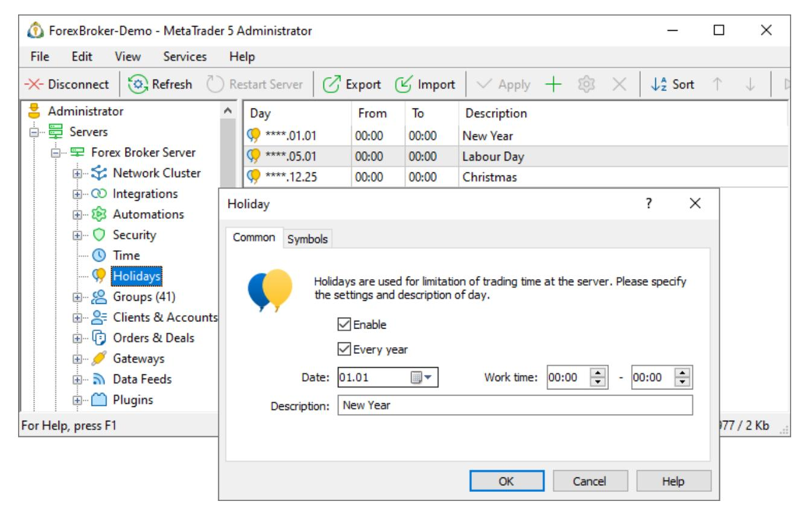

The following parameters are set for the holiday:

- ·**Enable** — enable/disable the holiday.
- · **Every year** — enable/disable holiday repetition. For such holidays, \*\*\*\* appears in the list instead of the year.
- ·**Date** — the date of the holiday.
- · **Work time** — server operation interval on the holiday. If the holiday should not have any working hours, leave zero values.
- ·**Description** — text description of the holiday.

Next, indicate which financial instruments will be affected by the holiday:

| Holiday                                                       | ?      | ×    |
|---------------------------------------------------------------|--------|------|
| Symbols                                                       | Common |      |
| Please specify symbols which will be affected by the holiday. |        |      |
| $Forex$ <sup>*</sup>                                          |        |      |
| $Crypto$ <sup>*</sup>                                         |        |      |
| Add                                                           |        |      |
| Edit                                                          |        |      |
| <b>Delete</b>                                                 |        |      |
|                                                               |        |      |
| Cancel<br>OK                                                  |        | Help |

You can add specific symbols or entire categories to the list.

Holiday settings do not affect swap operations.

#### **How holidays are checked**

Holiday rules are checked from top downward. If any rule allows trading for a symbol in the specified interval, all further rules will be ignored for this symbol-interval binding. Example:

- ·The first rule prohibits trading for all symbols on January 1, 2021.
- ·The second rule allows trading for Forex group symbols from 10:00 to 12:00 on that day
- ·The third rule allows trading for the same symbols from 13:00 to 22:00
- ·The fourth rule prohibits trading for all symbols on January 1, 2021.

As a result, on January 1, 2021 trading will be allowed for Forex group symbols from 10:00 to 12:00 and from 13:00 to 22:00. The fourth rule is ignored for the earlier allowed intervals as the check for these intervals stopped after the rules allowing trading for them. Thus, in order to set severaltrading intervals inside one time interval, you should first set a prohibitive rule followed by permissive ones.

## <span id="page-221-0"></span>**Import and export of settings**

The Administrator terminal enables quick export and import of almost all settings of the trading platform. This function can be used, for example, if you need to deploy a test platform with the same settings as used in your working platform.

### **Export**

Platform settings are exported to a JSON text file. Click **Export** in the sections tree and then select which settings you want to save:

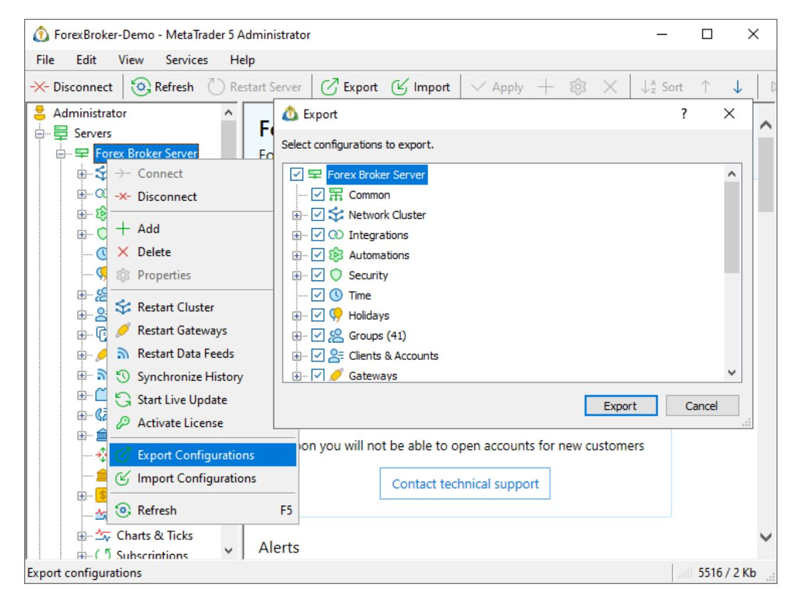

## **Import**

Settings are also imported via the section tree menu. Select a JSON file and specify which settings section you want to import.

| <b>O</b> Import                                                                     | ?                                                                                                                   | ×                         |
|-------------------------------------------------------------------------------------|---------------------------------------------------------------------------------------------------------------------|---------------------------|
| Select configurations to import.                                                    |                                                                                                                     |                           |
| Forex Broker Server<br><b>A</b> © Sc Network Cluster<br><b>E</b> . Ø © Integrations |                                                                                                                     |                           |
| 由 √ ® Automations                                                                   |                                                                                                                     |                           |
| $igcirc$ Security<br><b>+</b>                                                      |                                                                                                                     |                           |
| (V) Time<br>$	ext$                                                                  |                                                                                                                     |                           |
| $oxdot$ $	ext$ Holidays<br>Ė-                                                      |                                                                                                                     |                           |
|                                                                                     | $***,01.01$                                                                                                         |                           |
| **<br>◐<br>✓<br>**<br>✓                                                             | Holiday                                                                                                             | ?<br>×                    |
| 由 <b>× 8</b> Groups                                                                 | Common<br>Symbols                                                                                                   |                           |
| 中 × 2 2 Clients<br>X Gatewa<br>$ar{+}$                                             | Holidays are used for limitation of trading time at the server. Please specify the settings and description of day. |                           |
| <b>View</b>                                                                         | $igoplus$ Enable                                                                                                   |                           |
|                                                                                     | $oxdot$ Every year                                                                                                 |                           |
|                                                                                     | 01.01<br>Work time:<br>▦▾<br>00:00<br>Date:                                                                         | $rac$<br>÷<br>00:00<br>۰ |
|                                                                                     | New Year<br>Description:                                                                                            |                           |
|                                                                                     |                                                                                                                     |                           |
|                                                                                     |                                                                                                                     |                           |
|                                                                                     | OK                                                                                                                  | Cancel<br>Help            |

To view how the imported configuration would look like, select it and click "View".

If the imported configuration does not exist in the platform, it will be created. If the imported configuration matches the configuration already present in the trading platform, the settings of the existing configuration will be updated. The system compares configurations by key parameters, such as group name, manager login, routing rule name, etc.

Configurations of reports, plugins and funds are bound to specific servers in the cluster. When you export their settings, server IDs are also saved in JSON files. During import, the system checks the ID specified in the file and binds the configuration to the appropriate server. If the platform with the specified ID does not have a server with the specified identifier, the configuration will be bound to the main trade server. If necessary, you can change binding in the preview mode.

- · Be careful when importing settings. This operation can significantly affect the operation of the trading platform.
- ·Settings files use the UTF-16 Little Endian encoding. Files in other encodings cannot be imported.
- · Starting from platform build 1930, all volume settings are exported in two versions: with normal and increased accuracy. For example, the minimum volume for an instrument is exported as "VolumeMin" : "100" and "VolumeMinExt" : "1,000,000" (to obtain lots, the values are divided by 10,000 and 100,000,000, respectively). Priority is given to increased precision during import. If it is not specified (for example, settings were exported by an older version of the terminal), the value with normal precision will be used.

### **Command line import and export**

The console export and import mode automates the configuration process and allows transferring platform settings without the need to write complex C++ plugins or applications.

In order to start MetaTrader 5 Administrator in the console mode, use the /console key:

```
/console /server:<trade server
address:port> /login:<login> /password:<password> /action:<command> [command arguments]
```

Specify platform connection details in the 'server', 'login' and 'password' parameters. The command type is specified in the *action* parameter:

#### **Server restart**

Command /action:restart [/name:<server name>]. The server name can be optionally specified (History, Access...). If the name is specified, the matching sever will be searched for (case insensitive). If the name is not specified, the specified command will be performed for the currently connected server.

#### **Exporting configuration to JSON**

Command /action:export /file:<path> [/type:<type> /config:<mask>]. If optional arguments are not specified, the entire configuration of the connected server is exported.

Argument /file:<path> sets the destination file path. Argument /type:<type> is used for exporting a selected configuration branch and it may have the following values:

- ·common
- ·network
- ·firewall
- ·time
- ·holidays

Import and export of settings

- ·groups
- ·managers
- ·routing
- ·gateways
- ·plugins
- ·feeders
- ·reports
- ·symbols
- ·spreads
- ·historysync

Argument /config:<mask> sets a search criterion to search for a particular configuration structure by a string mask (this may contain \*,!). Search by mask can be used for the configurations of servers, groups, managers, trade requests, gateways, plugins, data feeds, reports, and symbols. The following rules applies to the rest of configurations: if a mask is specified, the configuration should be skipped; otherwise, the configuration should be processed.

#### **Importing a configuration**

Command /action:import /file:<path> [/type:<type> /config:<mask>]. All arguments are similar to those applied to export, except for the /type argument. The "common" branch (general platform settings) isn't imported.

## <span id="page-225-0"></span>**Common errors**

- · Do not change platform time settings while trading is in progress. This can disrupt the quoting feed and make trading impossible.
- · If the platform time has been erroneously shifted forward, you should wait untilthe weekend to return to the originaltime zone.
- · The platform receives information about the Daylight Saving Time settings from the Windows operating system. Install Windows operating system updates in a timely manner because the calendar may change.
- ·Time settings issues may be indicated by "old tick" errors in client terminal logs.

## <span id="page-226-0"></span>**Feeding quotes**

The following types of quotes are required for providing the ability to trade:

- · Real-time price stream — traders will execute deals at these prices. These quotes are delivered by gateways and data feeds, which connect to liquidity providers (exchanges, ECN, or other brokers) and broadcast the relevant data.
- · Deep price history, using which traders can test their strategies and perform technical analysis. This data can be obtained using different methods: data feeds with history import support (for example, IQFeeder), a function for synchronizing data with other MetaTrader servers and a data import function.

## **Types of prices**

Three basic prices of a financial instrument are used in the trading platform:

- · Bid is the highest price at which a trader can sell a financial instrument. It is the best price at which a financial symbol can be sold.
- · Ask is the lowest price at which a trader can buy a financial instrument. It is the best price at which a financial symbol can be bought.
- ·Last is the price of the last deal executed for this financial instrument.

A financial symbol can be traded on the exchange and over-the-counter (OTC) market. Different approaches to symbol quoting and charting are used depending on the market.

#### **Exchange markets with the Market Depth**

The only source of quotes in the exchange market is the Exchange itself. Buyers and sellers meet on the exchange, which keeps records of all executed deals. Orders of all market participants comprise a single Market Depth.

A Market Depth featuring real orders of market participants is available in the trading platform for exchange traded symbol. The Bid and Ask prices are formed in the Market Depth based on the best orders (these prices are shown in the Market Watch). Also, the exchange provides prices and volumes of last executed deals (Last and Volume). Last prices are used for creating price [charts](#page-228-0) and for displaying the Time & Sales tape:

|              | <b>USDRUB_TOD</b>                                                                                                                               |               |        |                |   |                                                          |                                  | ×                                |               |  |  |
|--------------|-------------------------------------------------------------------------------------------------------------------------------------------------|---------------|--------|----------------|---|----------------------------------------------------------|----------------------------------|----------------------------------|---------------|--|--|
|              | $\frac{1}{\sqrt{2}}\left\ \frac{1}{\sqrt{2}}\right\ _{\infty}\frac{1}{\sqrt{2}}\left\ \frac{1}{\sqrt{2}}\right\ _{\infty}$<br>₿<br>問图<br>図<br>Q |               |        |                |   |                                                          |                                  |                                  |               |  |  |
|              | Time                                                                                                                                            | Price<br>Type |        | ۸<br>Volume    |   | Volume                                                   | Price                            | Trade                            |               |  |  |
|              | 13:40:06.135                                                                                                                                    | Buy           | 57.538 | $\overline{2}$ |   | 250                                                      | 57.553                           | v<br>$\hat{\phantom{a}}$         |               |  |  |
| Time         | 13:40:04.090                                                                                                                                    | Buy           | 57.538 | 56             |   | 1895                                                     | 57.550                           | v<br>۸                           |               |  |  |
|              | 13:40:04.090                                                                                                                                    | Buy           | 57.538 | 24             |   | 400                                                      | 57.548                           | v<br>ㅅ                           | Depth         |  |  |
| and          | 13:39:15.234                                                                                                                                    | Buy           | 57.538 | 9              |   | 1 2 9 2                                                  | 57.545                           | v<br>ㅅ                           | of            |  |  |
| <b>Sales</b> | 13:38:51.502<br>⋾                                                                                                                               | Sell          | 57.533 | 1              |   | 1535                                                     | 57.543                           | v<br>۸                           | <b>Market</b> |  |  |
|              | 13:38:51.489                                                                                                                                    | Buy           | 57.535 | 2              |   | 200                                                      | 57.540                           | v<br>ㅅ                           |               |  |  |
|              | 13:38:45.808                                                                                                                                    | <b>Buy</b>    | 57.535 | 5              |   | 192                                                      | 57.538                           | v<br>۸                           |               |  |  |
|              | 13:38:45.127                                                                                                                                    | Buy           | 57.535 | 1              |   | 500                                                      | 57,533                           | v<br>۸                           |               |  |  |
|              | 13:38:42.905                                                                                                                                    | <b>Buy</b>    | 57.535 | 40             |   | 1679                                                     | 57.530                           | v<br>۸                           |               |  |  |
|              | 13:38:40.092                                                                                                                                    | Sell          | 57.533 | 50             |   | 50                                                       | 57.528                           | v<br>۸                           |               |  |  |
|              | 13:38:40.092                                                                                                                                    | Sell          | 57.535 | 45             |   | 150                                                      | 57.525                           | v<br>۸                           |               |  |  |
|              | 13:38:40.092                                                                                                                                    | Sell          | 57.535 | 43             |   | 600                                                      | 57.523                           | ٧<br>۸                           |               |  |  |
|              | 13:38:40.092                                                                                                                                    | Sell          | 57.535 | 69             |   | 1993                                                     | 57.520                           | v<br>۸                           |               |  |  |
|              | 13:38:40.092                                                                                                                                    | Sell          | 57.535 | 409            |   | 503                                                      | 57.518                           | v<br>$\hat{\phantom{a}}$         |               |  |  |
|              | 13:38:40.092                                                                                                                                    | Sell          | 57.535 | 379            |   | 0<br>Isl<br>$\overline{\phantom{a}}$<br>$\blacktriangle$ | $vol$ 1<br>$\blacktriangle$<br>۰ | 0<br>tр<br>۰<br>$\blacktriangle$ |               |  |  |
|              | 13:38:40.092                                                                                                                                    | Sell          | 57.535 | 55             | v | Sell                                                     | Close                            | Buy                              |               |  |  |
|              | c                                                                                                                                               |               |        |                |   |                                                          |                                  |                                  |               |  |  |

Although symbol charts are based on Last prices, traders execute deals at Bid and Ask prices (actual prices available in the market).

#### **Over-the-counter (OTC) market**

Participants of the OTC market are big market players, such as banks and prime brokerages. They form networks to trade with each other. Medium market participants, such as banks, management companies and hedge funds connect to large participants. Market participants aggregate prices of their counterparties or they set their own prices based on counterparties' prices, and provide these prices to clients.

Only Bid and Ask streaming quotes are used in OTC market trading, without data on actual executed deals. [Charts](#page-228-0) are based on Bid prices.

| Market Watch: 15:18:37 |          |          |     |          | × |
|------------------------|----------|----------|-----|----------|---|
| Symbol                 | Bid      | Ask      | !   | Time     |   |
| EURUSD                 | 1.18688  | 1.18690  | 2   | 15:18:32 |   |
| GBPUSD                 | 1.35022  | 1.35024  | 2   | 15:18:37 |   |
| USDCHF                 | 0.97413  | 0.97416  | 3   | 15:18:36 |   |
| USDJPY                 | 112.228  | 112.231  | 3   | 15:18:35 |   |
| USDCNH                 | 6.61596  | 6.61740  | 144 | 15:18:04 |   |
| AUDUSD                 | 0.79569  | 0.79574  | 5   | 15:18:37 |   |
| NZDUSD                 | 0.72816  | 0.72819  | 3   | 15:18:37 |   |
| USDCAD                 | 1.23208  | 1.23211  | 3   | 15:18:37 |   |
| USDSEK                 | 8.02968  | 8.03046  | 78  | 15:18:37 |   |
| USDHKD                 | 7.81469  | 7.81484  | 15  | 15:18:05 |   |
| USDSGD                 | 1.35082  | 1.35087  | 5   | 15:18:37 |   |
| USDMXN                 | 17.79752 | 17.79979 | 227 | 15:18:32 |   |

#### **OTC market with the Market Depth**

Unlike the previous variant, the broker provides traders information on volumes in addition to Bid and Ask prices, which allows the displaying of the Market Depth. The exchange Market Depth consists of limit orders of market participants, while OTC Market Depth is formed based on the broker's quotes. The broker can provide different prices depending on the buying and selling volume.

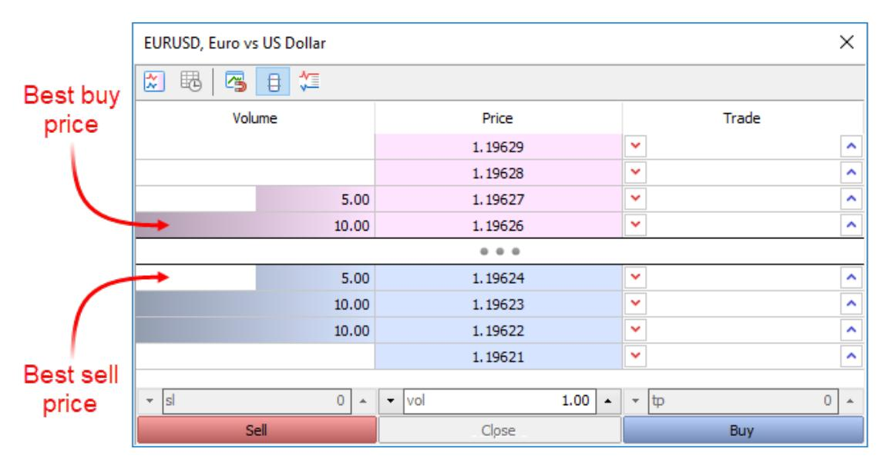

Here trading does not involve an exchange which could keep record of performed trades, so no Last prices are available in this mode. [Charts](#page-228-0) are based on Bid prices.

## <span id="page-228-0"></span>**How price charts are formed**

One-minute bars are formed based on symbol quotes (or ticks). Such a bar represents a set of price characteristics of a specific minute:

- · 4 prices: Low and High price during this minute, as well as the beginning and the end of the bar, i.e. the Open and Close prices
- ·Spread, which is the minimum difference between Bid and Ask registered during one this minute
- ·Tick volume, which shows the number of ticks received during bar formation
- · Volume, i.e. the real volume of deals performed during bar formation (may not be available for OTC markets)
- ·Date and time, i.e. the minute to which this bar corresponds

One-minute bars are based on Bid prices for OTC symbols, and are based on Last prices for exchange instruments.

In addition to one-minute bars, price charts in the trading platform can be displayed as larger time intervals. The time included in one bar or candlestick on the chart, is called a timeframe. The platform supports 21 timeframes, from 1 minute to 1 month.

The trading platform only stores 1-minute bars. All higher timeframes are created based on these bars. This approach ensures compliance of data across alltimeframes while saving traffic and drive space.

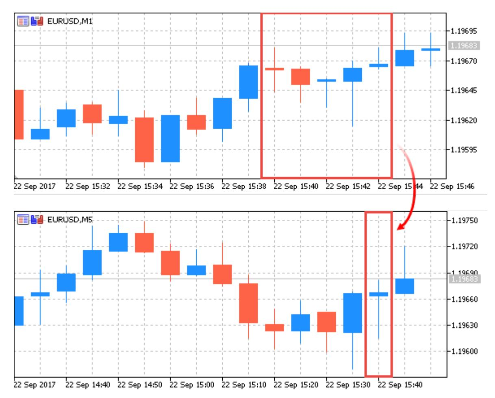

# <span id="page-230-0"></span>**Real-time price data from gateways and data feeds**

Two platform components are responsible for real-time data delivery: gateways and data feeds. Functionally, they utilize similar quote transfer mechanisms. Gateways are normally used when the trading requests are forwarded to an external system. If only price delivery is needed, data feeds are utilized.

Quotes arrive on the server as a stream of ticks, trading statistics and Depth of Market changes. The server forwards this data to clients, while accumulating only the history of tick data. Trading statistics and changes in the Depth of Market are not saved.

### **Ticks**

Each tick can store the following data:

- ·**Date** — tick date and time.
- ·**Bid** — Bid price.
- ·**Ask** — Ask price.
- ·**Last** — price of the last executed trade (for exchange instruments).
- ·**Volume** — volume of the last executed trade (for exchange instruments).
- · **Direction** — direction of the deal as a result of which the tick was created: Buy or Sell. Usually information about the direction is filled by the data source, a gateway or a data feed. If the source does not provide such data, the history server will add it automatically according to the following algorithm:
  - · If the Last price is greater than or is equalto the last Ask price, the price is considered to have emerged as a result of a buy operation.
  - · If the Last price is less than or is equalto the last Bid price, the price is considered to have emerged as a result of a sell operation.
  - · In other cases, it is considered that the direction can't be determined, and both directions, Buy and Sell, are assigned to the tick.
- ·**Data source** — the name of the data feed/gateway.

### **Trade statistics**

In addition to the basic price data, the platform enables the broadcasting of useful [statistics](https://www.metatrader5.com/en/terminal/help/trading/market_watch#details) to traders, such as session open and close price, highest and lowest Bid/Ask/Last prices for the day, and much more.

Calculated statistics can be transmitted through data feeds and gateways. If ready-made statistical variables are not available, the appropriate metrics can be calculated on the history server and client terminal side. The statistical variables are calculated as follows:

- · **Open price** — the open price of the last (current) session. If the [symbol](#page-204-0) chart is based on Bid prices, the system remembers the Bid price value from the first tick of the session. If the tick has no Bid, the next tick is used, and so on. Similarly, the Last price is used for the instruments whose charts are based on last deal prices. If the value is provided by a gateway or data feed, exactly this value will be used. No extra check or calculation is performed until history server is restarted.
- · **Close price** — the close price of the last (recent) session. If the symbol chart is based on Bid prices, the system remembers the value of the Bid price from the last tick of the session. If the tick has no Bid, the previous tick is used, and so on. Similarly, the Last price is used for the instruments whose charts are based on last deal prices. If the value is provided by a gateway or data feed, exactly this value will be used. No extra check or calculation is performed until history server is restarted.
- · **Price change** — price change in percentage terms. Indicates the difference between the Last price and the close price of the last session in percentage terms: ((Last – Settlement Price)/Settlement Price)\*100. Bid price is used for non-exchange instruments: ((Bid – Session Close Bid)/Session Close Bid)\*100.
  - · If the value is provided by a gateway or data feed, exactly this value will be used. No extra check or calculation is performed untilthe client terminal is restarted.
  - · In mobile terminals, the daily price change is calculated both in percentage and in points. Thus, if the calculation is performed on the terminal side, both values are shown. If the daily price change data is provided by a gateway or a data feed, only the percentage value is shown.

See also: [Documentation](https://support.metaquotes.net/en/docs/mt5/client/market_watch#details) / Client terminal/ Trading operations / Market watch / How to view quotes of financial [instruments](https://support.metaquotes.net/en/docs/mt5/client/market_watch#details)

### **Depth of Market**

Depth of Market data is represented as a set of trade orders from trading participants:

- ·Order direction: Buy or Sell
- ·Price
- ·Volume

The Depth of Market provides the orders which are closest to the current market price of the financial instrument. The number of provided orders in one direction is referred to as the order book depth. The depth depends on the data provider. The depth in the platform can be limited by the financial instrument settings.

#### **Data stream switching system and priority of data sources**

To ensure continuous price data availability for traders, the platform supports the operation of multiple data sources. If the main source fails, the platform will automatically switch to another.

The system operation is based on data priority. First, the priority is determined by the data source type. Data from gateways always have higher priority than data feeds. Priority within the types is determined by the

position of the source configuration in the list. The higher the gateway or data feed configuration, the higher its priority.

| ForexBroker-Demo - MetaTrader 5 Administrator                                           |                                                                                     |    |                                          |                       |               |
|-----------------------------------------------------------------------------------------|-------------------------------------------------------------------------------------|----|------------------------------------------|-----------------------|---------------|
| Edit<br><b>Services</b><br>File<br>View<br>Help                                         |                                                                                     |    |                                          |                       |               |
| $
ightrace 	extbf{Q}_{n}$ <b>Refresh</b> $
ightrace$ Restart Server<br>-X- Disconnect | $
ightarrow$ $C$ Export $C$ Import $igvee$ Apply $+$ $	imes 	imes   igwedge$ Sort |    |                                          |                       |               |
| Clients & Accounts                                                                      | Name                                                                                | ID | Mode                                     | Server                | <b>Status</b> |
| Orders & Deals                                                                          | MetaTrader 5 WL Gateway                                                             | 7  | <b>Trade and Quotes</b>                  | 18.140.180.42         | 0 / 427921    |
| Gateways                                                                                | <b>Broker 1</b>                                                                     | 2  | Trade and Quotes                         | access.metatrader.com | 0 / 1088932   |
| MetaTrader 5 WL Gateway                                                                 | <b>Broker 2</b>                                                                     | 3  | Trade and Quotes                         | access.metatrader.com | 0 / 1088927   |
| <b>Broker 1</b>                                                                         | <b>Broker 3</b>                                                                     | 4  | Trade and Quotes                         | broker.server         | Offline       |
| <b>Broker 2</b>                                                                         | Liquidity provider 1                                                                | 6  | Trade and Quotes                         | 203.4.179.122         | Offline       |
| Broker 3<br>Ø                                                                           | Liquidity provider 2                                                                | 5  | Trade and Quotes   access.metatrader.com |                       | Offline       |
| $\mathscr{S}$ Liquidity provider 1                                                      |                                                                                     |    |                                          |                       |               |
| $\mathcal{O}$ Liquidity provider 2                                                      |                                                                                     |    |                                          |                       |               |
| Data Feeds                                                                              |                                                                                     |    |                                          |                       |               |
| 1Plugins<br>$+$                                                                         |                                                                                     |    |                                          |                       |               |
| Reports                                                                                 |                                                                                     |    |                                          |                       |               |
| ECN                                                                                     |                                                                                     |    |                                          |                       |               |
| For Help, press F1                                                                      |                                                                                     |    |                                          |                       | 8015 / 14 Kb  |

The server receives information from all gateways at once. This solution allows the instant switch to other gateways in case of any issues. For example, several gateways provides quotes for one symbolfrom different financial companies. The priority determines which gateway should be used. If the required information is not received from the current gateway within a certain time, the server will automatically switch to the next gateway providing data for the same symbol. However, as soon as the platform receives data from a gateway with a higher priority, the server will switch back to it.

The data waiting time for the main gateway/data feed is determined in the history server settings:

| Datafeeds timeout: | 10    |
|--------------------|-------|
| Maximum news:      | 16384 |

History server is used for distribution of quotes and news. Please specify data feeds timeout and maximum number of stored news.

| <b>OK</b> | Cancel | <b>Help</b> |
|-----------|--------|-------------|
|-----------|--------|-------------|

Data source switching is performed independently for each financial instrument. For example, if only EURUSD quotes are not delivered from the main gateway, the stream of quotes only for this symbol will switch to a lowerpriority source. No changes will be made for other instruments.

| ForexBroker-Demo - MetaTrader 5 Administrator<br>Ω                   |                                             |                                       |                  |                       | ×<br>П                     |   |
|----------------------------------------------------------------------|---------------------------------------------|---------------------------------------|------------------|-----------------------|----------------------------|---|
| File<br>Edit<br>View<br><b>Services</b><br><b>Help</b>               |                                             |                                       |                  |                       |                            |   |
| $\{\phi\}$ Refresh $\(\ )$<br><b>Restart Server</b><br>-X-Disconnect | $\binom{7}{1}$ Export $\binom{1}{1}$ Import | $\vee$ Apply                          | 293              | $\downarrow^A_2$ Sort |                            |   |
| 国… n Data Feeds<br>A                                                 | Date                                        | <b>Bid</b>                            | Ask              |                       | <b>DataFeed</b>            |   |
| Plugins<br>m<br><b>+</b>                                             | 2021.07.07 11:12:55.313                     | 1.38064                               | 1.38094          |                       | MetaTrader 5 Feeder        |   |
| $\mathbb{G}$ Reports<br>$+$ $-$                                      | 2021.07.07 11:13:03.190                     | 1.38063                               | 1.38093          |                       | MetaTrader 5 Feeder        |   |
| <b>血 ECN</b><br><b>+</b>                                             | 2021.07.07 11:13:03.677                     | 1.38062                               | 1.38092          |                       | MetaTrader 5 Feeder        |   |
| $\rightarrow^{\uparrow}_{\mathbf{k}}$ Routing                        | $\vee$ 2021.07.07 11:13:03.678              | 1.38060                               | 1.38090          |                       | MetaTrader 5 Feeder        |   |
| <b>Example Funds &amp; ETF</b>                                       | $\vee$ 2021.07.07 11:13:03.678              | 1.38061                               | 1.38091          |                       | MetaTrader 5 Feeder        |   |
| $\frac{1}{2}$ Symbols (689)<br>由…                                    | $\vee$ 2021.07.07 11:13:03.678              | 1.38060                               | 1.38090          |                       | MetaTrader 5 Feeder        |   |
| $\mathbf{r}$ Spreads                                                 | $\vee$ 2021.07.07 11:13:03.857              | 1.38061                               | 1.38091          |                       | MetaTrader 5 Feeder        |   |
| 白 文 Charts & Ticks                                                   | $\vee$ 2021.07.07 11:13:03.857              | 1.38063                               | 1.38093          |                       | MetaTrader 5 Feeder        |   |
| $-\frac{4\pi}{\sqrt{6}}$ 1 Minute History Charts                     | $\vee$ 2021.07.07 11:13:04.055              | 1.38061                               | 1.38091          |                       | MetaTrader 5 Feeder        |   |
| <b>My</b> Bid/Ask/Last Ticks                                         | $\vee$ 2021.07.07 11:13:04.055              | 1.38060                               | 1.38090          |                       | MetaTrader 5 Feeder $\vee$ |   |
| $\frac{1}{2}$ Synchronization                                        | $Q$ GBPUSD $\vee$<br>All                    | 户<br>2021.07.06 16:33<br>$\checkmark$ | 2021.07.07 16:33 |                       | Request                    |   |
| ⊞⊹( )ิ<br><b>Subscriptions</b>                                       | ∢                                           |                                       |                  |                       |                            | ъ |
| For Help, press F1                                                   |                                             |                                       |                  |                       | 9582 / 14 Kb               |   |

Source switching can be tracked in the **Charts and ticks** \ **Bid/Ask/Last ticks** section.

Every tick information stores the index of the data source from which it was received. Index — is the position of the data source in the list at the time of tick arrival. Numbering starts from 0. The "Data source" column of ticks displays the data source which currently corresponds to the index recorded in the tick.

Data source switching can also be tracked by the history server log. For example:

```
18:32:44 Ticks datafeed 2: EURUSD activation
```

This log means that at 18:32:44, the stream of EURUSD ticks from the data source with the index of 2 in the list of configurations was activated.

#### **Possible delay in the delivery of Market Depth prices after switching gateways**

To consume less resources, the history server does not store the best prices and Market Depth values for each symbol and each available data source. For the same purpose, the Market Depth is passed from the data feed to the server in the form of changes relative to the previous state, while the full Market Dept snapshot is sent to the server no more than once every 30 seconds.

Therefore, if the main price feed stops and the server switches to another one, the server has to wait for the first Market Depth snapshot from the data feed. During this time (up to 30 seconds), the Market Depth data is not updated.

### <span id="page-234-0"></span>**Protection against incorrect price data**

The arrival of an incorrect price from a data source can disrupt the trading process. For example, such price can lead to massive triggering of stop levels on accounts, massive stop outs, which in turn will cause positions to close. Recovery from a price spike can be a very long and time-consuming process, which can also negatively affect your reputation.

To avoid such disrupting situations, the platform provides built-in tools for automated price validation.

Severalfiltering levels can be configured for each symbol, in its settings:

|        | Symbol: Forex\EURUSD |                           |               |                                              |        |                                                                                                                                                                                     |                    |                       |        |        | ?           | $\times$ |
|--------|----------------------|---------------------------|---------------|----------------------------------------------|--------|-------------------------------------------------------------------------------------------------------------------------------------------------------------------------------------|--------------------|-----------------------|--------|--------|-------------|----------|
| Common | Currency             | Quotes                    | Trade         |                                              |        | Execution   Margin   Margin Rates   Swaps   Sessions                                                                                                                                |                    |                       |        |        |             |          |
|        |                      |                           |               | and their repetition for filters to trigger. |        | The setting up of different filtration levels is intended for cutting off the incorrect data. Please specify the deviation of quotes<br>$\vee$ Allow realtime quotes from datafeeds |                    | Allow negative quotes |        |        |             |          |
|        |                      |                           |               |                                              |        | Receive market statistics from datafeeds                                                                                                                                            |                    | Save raw prices       |        |        |             |          |
|        |                      | Soft filtration level:    |               | 100                                          |        | points (must not be less than 4 or 5 times spread by default)                                                                                                                       |                    |                       |        |        |             |          |
|        |                      |                           | Filter:<br>10 | $\checkmark$                                 |        | wrong quotes coming one after another                                                                                                                                               |                    |                       |        |        |             |          |
|        |                      | Hard filtration level:    |               | 500                                          |        | points (must not be less than soft filtration level)                                                                                                                                |                    |                       |        |        |             |          |
|        |                      |                           | Filter:<br>10 | $\checkmark$                                 |        | wrong quotes coming one after another                                                                                                                                               |                    |                       |        |        |             |          |
|        |                      | Discard filtration level: |               | 500                                          |        | points (must not be less than hard filtration level)                                                                                                                                |                    |                       |        |        |             |          |
|        |                      | Gap mode level:           | off           |                                              | points |                                                                                                                                                                                     | Disable gap after: | off                   | ticks  |        |             |          |
|        |                      | Minimum spread:           | off           |                                              |        |                                                                                                                                                                                     | Maximum spread:    | off                   | points |        |             |          |
|        |                      | Delay for subscriptions   | 15            |                                              | min    |                                                                                                                                                                                     |                    |                       |        |        |             |          |
|        |                      |                           |               |                                              |        |                                                                                                                                                                                     |                    |                       | OK     | Cancel | <b>Help</b> |          |

There are three levels of quotes filtering:

- · **Soft filtration level**. This is the first border of the range of allowed symbol prices. If a new price (Bid or Ask) differs from the previous one by more than the specified value (in points), it is deleted from the price stream which is broadcast to clients. However, if such a price difference appears again and repeats for the number of times specified in the Filter box, the new price level will be accepted, and the filtration level will be shifted by the specified value. Such quotes will be broadcast again.
- · **Hard filtration level**. This is the second border of the price range. If a received quote exceeds the level both of the soft and of the hard filtration, it is discarded from the price stream broadcast to traders. For a new level of accepted price to be set, the quotes must be repeated the number of times specified in both levels.
- · **Discard filtration level**. If the difference between prices of the previous and new quote exceeds the specified value, such new prices are definitely discarded from the stream.

It is believed that there is a certain range of permissible price data fluctuations. This range is limited by the set level of softs filtration. If the Bid or Ask price of the newly received quote differs from the relevant prices of the previous quote by the soft filtration level value, such a price is discarded. If several next quotes (the quantity is specified in the **Filter** parameter) also exceed the soft filtering level, then a new range of acceptable prices is set. Example:

- ·The last EURUSD quote was 1.50213/1.50231 (Bid/Ask).
- ·The soft filtration level is set to 150; **Filter** is 3.
- · The following quotes are received next: 1.50373/1.50391, 1.50370/1.50388, 1.50372/1.50390, 1.50374/1.50392.
- ·The first three quotes will be discarded, as they exceed the previous price by more than 150 points.
- · The last quote will be let into the stream and a new range of acceptable prices will be set around this quote: 1.50374/1.50392 ± 150.

The hard filtration level serves as an additional protection against incorrect quotes. If the newly received quote differs from the previous one by an amount greater than the specified hard level value, this quote will be discarded. The additional hard filter protection implies a more complex mechanism for setting a new range of allowed prices. For the new levelto be confirmed, the quote must first pass the soft filtration level(the specified number of quotes exceeding the value), and then it mast pass the hard level.

The discard filtration level implies unconditionalremoval of quotes that differ from the previous ones by the specified amount. Such prices are considered to be unambiguously incorrect.

To completely disable filtering, set 0 for all levels: soft, hard and discard. However, this is not recommended.

#### **Filtration features**

- · Filters cannot be applied to instruments with the [enabled](#page-204-1) Depth of Market **and** with the one of the following properties: Exchange [calculation](#page-205-0) type (begins with "Exchange") or Last price based [charting](#page-205-1) mode. Also, filtering is not applied to splice symbols.
- ·Filtering is not applied to Depth of Market data.
- · The platform automatically filters out negative and zero Bid and Ask prices of non-exchange instruments, regardless of whether their Market Depth is enabled or not. Non-exchange are symbols whose calculation type does not start with Exchange.
- ·Analysis and filtration are performed separately for Bid and Ask.
- · Filters are not applied to the first tick after a break in the quotes stream, such as after the platform restart, after a break in quotation sessions, after non-working hours and after holidays. Filtration can't be applied because the previous price is not known. This rule does not apply to other price checks, including [allowable](#page-236-0) [spread](#page-236-0).
- ·Filters do not apply to ticks added via the Manager terminal and Manager API.

- · Filters are not used at the beginning of a trading day (the beginning of the first quoting session) and after the restart of the history server, since the previous price is not known in advance.
- · In the platform, one symbol can be used as the source of quotes for another symbol. Such a source symbol if specified in the Source box. Filtration settings of the source symbol are not applied to quotes translated to the destination symbol. For example, EURUSDm uses EURUSD quotes as the source. A quote that has been discarded from the EURUSD stream in accordance with the filtration parameters, can be included in the EURUSDm stream.

#### **Filtering identical quotes**

The trading platform filters out identical quotes from data sources. If within one minute the platform receives a quote that does not differ from the previous one, such a quote is not allowed into the stream. If more than a minute passes, the quote will be accepted. The same quote is also accepted if the minute has changed. The enables the correct display of charts in a low-liquid market.

Example:

- ·13:01:15 a quote is received
- ·13:01:32 the same quote is received, it is not accepted
- ·13:01:50 the same quote is received, it is not accepted
- · 13:02:01 the same quote is received, it is accepted (the interval between quotes is less than 60 seconds, but the minute has changed)

#### <span id="page-236-0"></span>**Spread control**

The Minimum Spread and Maximum Spread parameters in the **Quotes** tab are provided for additional protection. If the difference between the Bid and Ask prices in the incoming quote does not fall within the specified values, such a quote is removed from the stream.

The check is only performed for OTC (non-exchange) financial instruments with a floating spread. OTC/nonexchange symbols are those with the Forex, Futures, CFD, CFD Leverage or CFD Index calculation types.

#### **Gap mode level**

Gap is a considerable difference between the previous and the next quote in the price stream. Symbol settings allow you to define which price differences are to be considered as gaps.

Unlike the filters, quotes are not removed from the flow when enabling the gap mode. They are passed to clients. However, this check can be used in the routing rules in order to process trade requests in a special way under the market conditions that differ from normal ones. For example, after a gap, client requests can be rejected or requoted during a certain number of subsequent ticks.

Specify a value in points in the "Gap mode level" box. If the difference between the previous and the next quote exceeds the specified value, such a difference is considered a gap. The check is performed for Bid and Ask prices separately.

Next, specify the number of ticks after the gap, after which the gap mode is disabled. For example, suppose that we have the values of 100 points and 3 ticks. When a gap is detected, the tick counter is increased by 1. The gap mode is disabled if no new price spike of the specified number of points occurs within two next ticks:

- ·The first tick, in which the gap was registered. The tick counter is set to 1.
- ·The second tick without a gap. The tick counter increases to 2. It is the first tick confirming the new price.
- ·The third tick without a gap. The tick counter increases to 3. It is the second tick confirming the new price.
- ·The fourth tick without a gap. It is the third tick confirming the new price. The gap mode is disabled.

After starting a server, the first tick is always considered a gap, since the previous price is not known. The gap counter is immediately set to the maximum value in this case. Thus, the gap mode is disabled if no gap occurs on the second tick after server start.

Gaps detection and tick calculation data is displayed in the trade server journal:

```
2017.03.16 12:21:20.323 TickSymbol 'EURUSD' gap by ask from 1.07149 to 1.07250
[diff:101, gap level: 3]
2017.03.16 12:21:20.323 TickSymbol 'EURUSD' gap by ask from 1.07139 to 1.07240
[diff:101, gap level: 3]
```

The 'diff' value shows the actual difference between the previous and the next quote. The 'gap level' value shows the number of ticks specified in symbol settings, after which the gap mode is disabled.

If the difference between the current and the next price (here, it is Ask) does not exceed the specified value (100), a message will be printed to log stating that a normaltick has arrived and the counter has increased:

```
2017.03.16 12:21:20.428 TickSymbol 'EURUSD' normal tick 1.07247 after gap by ask
[tick counter: 2]
```

Please note that the counter is already equalto 2. The tick, on which the gap started, has already been counted. If the next tick does not differ by the specified value, the gap mode for the Ask price will be disabled:

```
2017.03.16 12:21:20.730 TickSymbol 'EURUSD' normal tick 1.07248 after gap by ask
[tick counter: 3]
2017.03.16 12:21:20.730 TickSymbol 'EURUSD' gap by ask mode disabled
```

#### **Additional settings**

The **Quotes** section provides some other parameters that affect the transmission of price data, such as:

- · **Allow real-time quotes from data feeds**. Enable/disable the real-time delivery of quotes for this symbol from data feeds. If the option is disabled, the dealer can manually add quotes for this symbol.
- · **Allow negative prices**. The trading platform supports operations with negative security prices. If such a situation occurs in the market, allthe appropriate functions will work correctly. This includes the display of quotes, calculation of profit margin, placing of orders, etc. However, such market situations are extremely

after the restart.

rare, and negative values in the price stream are usually caused by an error on the data source side. Therefore, the history server rejects negative prices by default. To allow negative prices in the platform, you should enable the appropriate option.

- · **Receive market statistics from datafeeds**. This option enables the delivery of market statistics (Ask High, Bid Low, etc.) directly from data sources, without the need to calculate it on the history server. If the option is disabled, the history server will calculate the following statistical variables: High and Low for Bid, Ask and Last prices; current session opening and previous session closing prices. Also, the percentage of price change relative to the previous session is calculated in client terminals. After disabling this option, a restart of the history server is required. Statistics recalculation willresume only
  - · Negative prices are only allowed for Futures contracts (Futures, Exchange Futures, Exchange FORTS Futures). Do not enable this option for other types of instruments.
  - · When enabling the **Receive market statistics from datafeeds** option, keep in mind that the data sources must support the transfer of market statistics.

#### **Configuring price data transmit through a gateway**

MetaQuotes provides ready-made gateways for connection to a wide variety of liquidity providers, including Currenex, Integral, LMAX, FXCM, MOEX, DGCX, Interactive Brokers, and others. One of the gateways enables connection to other MetaTrader 5 servers. It means that any MetaTrader 5 broker can operate as a liquidity provider for you. For connection, you only need to open a regular trading account with that broker. Detailed instructions on how to configure gateways are available in the platform [documentation](https://support.metaquotes.net/en/docs/mt5/platform/components/gateways).

Modules of allthese gateways are included in the standard platform package. You can test them in a demo mode by creating a configuration in MetaTrader 5 Administrator.

To purchase a gateway, please go to the App [Store](https://support.metaquotes.net/en/market) section in the MetaQuotes Support Center. Also, the App Store features additional solutions for connecting liquidity from third-party developers.

#### See also:

- ·Video / How to access liquidity without complex [integration](https://support.metaquotes.net/en/articles/471) and high costs
- ·[Documentation](https://support.metaquotes.net/en/docs/mt5/platform/components/gateways) / Platform / Platform components / Gateways

| ForexBroker-Demo - MetaTrader 5 Administrator                                         |              |               |                         |                                  | П | $×$           |
|---------------------------------------------------------------------------------------|--------------|---------------|-------------------------|----------------------------------|---|---------------|
| Edit<br>File<br>View<br><b>Services</b><br>Help                                       |              |               |                         |                                  |   |               |
| $ø$ Export $ø$ Import<br>$◯$ Refresh $◯$ Restart Server<br>-X- Disconnect             |              | $∨$ Apply $+$ | 503<br>$×$              | $↓^A_z$ Sort                     |   |               |
| त्ने <u>श</u> Clients & Accounts<br>Name                                              | ID           | Mode          |                         | Server                           |   | <b>Status</b> |
| (h) Orders & Deals<br>MetaTrader 5 WL Gateway                                         | 7            |               | <b>Trade and Quotes</b> | 18,140,180,42                    |   | 0 / 427921    |
| Gateways<br><b>Broker 1</b>                                                           | &#overline;2 |               | Trade and Quotes        | access.metatrader5.com           |   | 0 / 1088932   |
| MetaTrader 5 WL Gateway<br><b>Broker 2</b>                                            | 3            |               | <b>Trade and Quotes</b> | access.metatrader5.com           |   | 0 / 1088927   |
| <b>Broker 1</b><br><b>Broker 3</b>                                                    | 4            |               |                         | Trade and Quotes   broker.server |   | Offline       |
| <b>Brok</b><br>Gateway                                                                |              |               |                         |                                  | × | Offline       |
| Brok<br>Í                                                                             |              |               |                         |                                  |   | Offline       |
| $&scriptO$ Liqu<br>Common Groups Symbols Translations Parameters Timeouts Information |              |               |                         |                                  |   |               |
| $&scriptS$ Liqu<br>This gateway allows connecting to a remote MetaTrader 5 Platform   |              |               |                         |                                  |   |               |
| <b>Data Fee</b><br>$&mathbfF$                                                         |              |               |                         |                                  |   |               |
| Plugins<br>$&mathbfF$                                                                 |              |               |                         |                                  |   |               |
| 由 <b>G</b> Reports<br>$√$ Enable                                                      |              |               |                         |                                  |   |               |
| 由 血 ECN<br>Broker 1<br>Name:                                                          |              |               | ID: 2                   |                                  |   |               |
| For Help, press F1                                                                    |              |               |                         |                                  |   | 14 Kb         |
| Module:<br>MetaTrader5 Gateway64                                                      |              |               | <b>Trade and Quotes</b> |                                  |   |               |
| access.metatrader5.com:443                                                            |              |               |                         |                                  |   |               |
| Trading server:                                                                       |              |               |                         |                                  |   |               |
| Trading login:<br>1000                                                                |              | Password:     |                         |                                  |   |               |
| Show additional network settings                                                      |              |               |                         |                                  |   |               |
|                                                                                       |              |               |                         |                                  |   |               |
|                                                                                       |              |               |                         |                                  |   |               |
|                                                                                       |              |               |                         |                                  |   |               |
|                                                                                       |              | <b>OK</b>     | Cancel                  | <b>Help</b>                      |   |               |

Having selected a data provider, create a new configuration in the Gateway section:

Specify the basic gateway parameters under the **Common** section:

- · **Enable** — enable/disable the gateway. For the gateways running in service mode via the "Remote gateway" module, unchecking Enable will lead to disconnection of platform servers from the gateway service, while the service itself will not be stopped.
- · **Name** — the name of the gateway. Special characters (?, \*, <, >, etc.) are not allowed in the name as these characters can lead to problems in working with the gateway log files.
- · **ID** — specify the unique gateway identifier in this field. The identifier will be specified in the Dealer field of the deals executed via this gateway. This identifier is also used when creating trade request routing rules. The identifier can't be changed in an already created gateway configuration. To change the identifier, create a new configuration and delete the old one.
- · **Module** — the name of the gateway executable. Select here one of the available gateway executable files available in the */gateways* folder of the history server. An unlimited number of configurations with different settings can be created for each module. In the field to the right, select one of the operating modes supported by the gateway:
  - ·**Trade and Quotes**. In this mode, the gateway transmits quotes and processes trading operations.
  - · **Trade only**. In this mode the gateway only processes trading operations. This mode can be used when you work with the externaltrading system using several accounts in this system. This requires creating

several configurations of the same gateway. Only one configuration provides quotes, while all other configurations process trading operations.

- ·**Trade server** — address of the server of the externaltrading system to which the gateway connects.
- ·**Trading login** — account login for connecting to the externaltreading system.
- ·**Password** — the account password for connecting to the externaltreading system.

The gateway ID must not match any of existing manager [accounts.](#page-75-0) When you add a new gateway or edit an existing one, the system checks the validity of the gateway ID. If the ID value is invalid, the gateway configuration will not be added or will not be updated.

#### **Groups and symbols**

Specify the groups whose trade requests will be processed via the gateway. Also, you should specify the list of symbols to which the gateway will have access — the gateway will be able to receive/update settings for these symbols, as well as to stream quotes.

|                                                           | Gateway                                                                                                                                                                                         |
|-----------------------------------------------------------|-------------------------------------------------------------------------------------------------------------------------------------------------------------------------------------------------|
|                                                           | Common<br>Groups<br>Symbols<br>Translations<br>Parameters<br>Timeouts<br>Information                                                                                                            |
| Gateway                                                   | Please specify the symbols for which the gateway will translate quotes and perform trade operations. The orders, trades and positions for these symbols will be translated through the gateway. |
| Symbols                                                   | \$ Forex\*                                                                                                                                                                                      |
| Groups                                                    | ECN\*                                                                                                                                                                                           |
| Please specify the gateway. Orders,<br>external trade sys | √\$                                                                                                                                                                                             |
| జి\*                                                      | <button>Add</button> <button>Edit</button> <button>Delete</button>                                                                                                                              |
|                                                           | <button>OK</button> <button>Cancel</button> <button>Help</button>                                                                                                                               |
|                                                           | Allow importing traders balances                                                                                                                                                                |
|                                                           | <button>Help</button> <button>OK</button> <button>Cancel</button>                                                                                                                               |

Using the **Allow importing traders balances** option, the gateway can be allowed/denied to change and adjust trader balances in the specifies groups. This option is used when the external system to which the gateway connects calculates the financialresults for trading accounts (for example, it can calculate and adjust balances at the end of the trading day).

Turn on the **Allow importing symbol settings** option to enable the gateway to import into the platform the symbols for which it provides data and executes trading operations. The import is performed as follows:

- ·If the symbol does not exist in the trading platform, it is created in the Preliminary group.
- · All newly added symbols are imported with the trading option disabled. The platform administrator must check allthe settings and manually enable trading.
- ·If the symbol already exists in the platform, its trading settings will be updated.

Automatic import of symbol settings greatly simplifies the work of the platform administrator. Instead of the manual addition of all settings, you can simply move symbols from the Preliminary group the desired group and allow trading.

When the gateway changes symbol settings, the following record is printed in the server journal: "symbol config updated". The name of the gateway is indicated as the IP address of the source in such records (the **IP** field).

- · When the **Allow importing symbol settings** option is enabled, the gateway can add and edit any symbols in the Preliminary\\* group, even if the group is not indicated in the list above.
- ·Balance and symbol import functions must be supported by the gateway.

#### **Gateway parameters**

You can configure additional gateway parameters in the **Parameters** section. The set of available parameters depends on each specific gateway.

| Gateway |         |                        |                                                                                                                                                                                   |            |                 |             |        |      | $	imes$ |
|---------|---------|------------------------|-----------------------------------------------------------------------------------------------------------------------------------------------------------------------------------|------------|-----------------|-------------|--------|------|---------|
| Common  | Groups  | Symbols                | Translations                                                                                                                                                                      | Parameters | <b>Timeouts</b> | Information |        |      |         |
|         | tab.    |                        | Please specify parameters of the gateway. These parameters are specific for each type of<br>gateway. They allow using additional settings that were not available in the "Common" |            |                 |             |        |      |         |
|         | Up      | Parameter              |                                                                                                                                                                                   |            | Value           |             |        |      |         |
|         | Down    |                        | ab TradingCalendarHolidays                                                                                                                                                        |            |                 |             |        |      |         |
|         |         |                        | ab MaxPriceDeviation                                                                                                                                                              |            | 50              |             |        |      |         |
|         |         | ab LimitOrdersCoverage |                                                                                                                                                                                   |            | Market          |             |        |      |         |
|         |         |                        | ab QuotesTimeOriginal                                                                                                                                                             |            | No              |             |        |      |         |
|         | Add     |                        | ab LastPriceMarkup                                                                                                                                                                |            | Yes             |             |        |      |         |
|         |         | ab SymbolsPath         |                                                                                                                                                                                   |            |                 |             |        |      |         |
|         | Edit    |                        | ab SymbolsUpdate                                                                                                                                                                  |            | No              |             |        |      |         |
|         | Delete  |                        | ab CalculateHedgedMargin                                                                                                                                                          |            | No              |             |        |      |         |
|         |         |                        | ab CalculateHedgedMarginRate                                                                                                                                                      |            | 2.0             |             |        |      |         |
|         | Default | ah NewcEnable          |                                                                                                                                                                                   |            | NI              |             |        |      |         |
|         |         |                        |                                                                                                                                                                                   |            |                 |             |        |      |         |
|         |         |                        |                                                                                                                                                                                   |            |                 | OK          | Cancel | Help |         |

All data feeds and gateways have a standard set of supported parameters.

- · **NewsCategory** — news categories. Here, you can specify the name for the news category delivered from the data source. The category name can then be used for specifying news to be delivered to specific client groups.
- · **Quotes Delay** — a delay in quote transmission, in seconds. The maximum value of quotes delay is 20 minutes (1200 seconds). The density of the quote stream is not reduced and the steam itself is not changed. A quote is passed to the MetaTrader 5 history server only after the expiration of the delay from the moment the quote arrived to Gateway API. If the delay parameter is not defined, the quote delay is not used. Changes in Market Depth and price statistics are delayed together with the quotes stream.
- · **Quotes Tickstats Sample** — the minimum period for sending price statistics, in milliseconds. This parameter allows reducing the frequency of price statistics updates to optimize the traffic.
- · **Quotes Ticks Sample** — the minimum period for sending quotes, in milliseconds. This parameter allows reducing the frequency of quote updates to reduce the traffic. This parameter is recommended to be used only on demo servers.
- · **Quotes Books Sample** — the minimum period for sending Market Depth changes, in milliseconds This parameter allows reducing the frequency of Market Depth updates to reduce the traffic. This parameter is recommended to be used only on demo servers.
- · **Trading Calendar Holidays** — exchanges and trading venues may have working and non-working days that are different from working calendar settings in MetaTrader 5. This parameter overrides working/nonworking days for the gateway.

To add a non-working day, specify a value of the form +DDMMM. The date is specified as two digits, the month is specified as the first three letters of the month name in English. For example, +01JAN. To add a working day, specify a value of the format of -DDMMM, for example, -07FEB. You can specify multiple working/non-working days separated by semicolons, such as + 01JAN;-07FEB. If the added working day does not fall within the [platform](#page-214-0) working hours or trading/quote sessions of instruments, you should update the corresponding settings.

Parameters for reducing the price stream density can be used in conjunction with the **Quotes Delay** parameter. The range of allowable values is 100 – 3,000 milliseconds.

If an incorrect value is specified for a parameter, this parameter will not be used.

#### **Configuring price data transmit through a data feed**

MetaQuotes provides ready-made data feeds for receiving quotes: IQFeeder, MetaTrader 4 Feeder, MetaTrader 5 Feeder, and others. The data feed modules are included in the standard platform package and can be configured at any time. The data feeds are free of charge; however, you may need to purchase a data subscription. To do this, please contact the relevant system you want to connect to.

Additional data feeds from third-party developers are featured in the MetaQuotes Support Center App [Store.](https://support.metaquotes.net/en/market)

#### See also: [Documentation](https://support.metaquotes.net/en/docs/mt5/platform/components/datafeeds) / Platform / Platform components / Data feeds

Having selected a data provider, create a new configuration in the **Data Feeds** section:

| <b>Label</b>                                                                                                                                                                                                   | <b>Value</b>                                      |
|----------------------------------------------------------------------------------------------------------------------------------------------------------------------------------------------------------------|---------------------------------------------------|
| ForexBroker-Demo - MetaTrader 5 Administrator                                                                                                                                                                  |                                                   |
| Edit<br>File<br>View                                                                                                                                                                                           |                                                   |
| <b>Services</b><br>Help                                                                                                                                                                                        |                                                   |
|                                                                                                                                                                                                                |                                                   |
| -X-Disconnect                                                                                                                                                                                                  |                                                   |
| $f8$ Export $f8$ Import<br>$204$ <b>Refresh</b> $722$ Restart Server<br>$+$ $f7$ $d7$<br>$a6$ Apply                                                                                                     |                                                   |
| 中 & Clients & Accounts<br>由 C Orders & Deals<br><b>E</b> Gateways<br>Data Feeds<br>— ညွှ MetaTrader 5 Feeder<br>IQ Feeder Data Feed<br>UniFeed                                                                 |                                                   |
| Α<br>Name<br>Source<br>Server<br>MetaTrader 5 Feeder<br>Quotes and News   access.metatrader5.com:443<br><b>a</b> IQ Feeder<br><b>Quotes and News</b><br><b>S</b> UniFeeder<br>Quotes and News   localhost:2222 |                                                   |
| П                                                                                                                                                                                                              | 1276618 / 0<br>×                                  |
| <b>Status</b>                                                                                                                                                                                                  | Offline<br>Offline                                |
| <b>E</b> ∩ Plugins<br>由 <b>G</b> Reports<br>画 <b>血 ECN</b><br>$9rightarrow$ Routing<br>… 血 Funds & ETF<br>\$ Symbols (68                                                                                      |                                                   |
| Common<br>Symbols Translations Parameters Timeouts<br>The datafeed translates quotes and news from remote MetaTrader 5 server<br>√ Enable<br>MetaTrader 5 Feeder<br>Name:                                      |                                                   |
| For Help, press F1                                                                                                                                                                                             |                                                   |
|                                                                                                                                                                                                                | Module:<br>MetaTrader5Feeder64<br>Quotes and News |
|                                                                                                                                                                                                                |                                                   |
|                                                                                                                                                                                                                |                                                   |
|                                                                                                                                                                                                                |                                                   |
|                                                                                                                                                                                                                |                                                   |
|                                                                                                                                                                                                                |                                                   |
|                                                                                                                                                                                                                |                                                   |
|                                                                                                                                                                                                                |                                                   |
|                                                                                                                                                                                                                |                                                   |
|                                                                                                                                                                                                                |                                                   |
|                                                                                                                                                                                                                |                                                   |
|                                                                                                                                                                                                                |                                                   |
|                                                                                                                                                                                                                |                                                   |
|                                                                                                                                                                                                                |                                                   |
|                                                                                                                                                                                                                |                                                   |
|                                                                                                                                                                                                                |                                                   |
|                                                                                                                                                                                                                |                                                   |

Specify the basic data feed parameters under the **Common** section:

- · **Enable** — enable/disable the data feed. Running data feeds are automatically disabled during [server](#page-214-0) non[working](#page-214-0) hours. When the trade server starts working, the data sources are re-enabled. For the data feeds, running in service mode via the **Remote datafeed** module, unchecking Enable will lead to disconnection of platform servers from the data feed service, while the service itself will not be stopped.
- · **Name** — the name of the data feed. Use of special characters (?, \*, <, > etc.) in names is not allowed, as this may cause issues while working with the data feed log files.
- · **Module** — the name of the data feed module file and the transmitted data type (news, quotes, market books).
- ·**Feed server** — the address of the data source server.
- ·**Feed login** — login for connection to the data provider server.

·**Password** — password for connection to the data provider server.

#### **Symbols**

Specify the list of symbols for which the data feed can provide quotes. The symbols must be pre-created in the platform.

| Data Feed                                                                 |     |
|---------------------------------------------------------------------------|-----|
| Symbols                                                                   |     |
| Translations                                                              |     |
| Parameters                                                                |     |
| Timeouts                                                                  |     |
| Common                                                                    |     |
| Please specify the symbols for which the data feed will translate quotes. |     |
| *                                                                         |     |
| $+$ dick to add                                                           |     |
|                                                                           |     |
|                                                                           |     |
| Add                                                                       |     |
| Edit                                                                      |     |
| <b>Delete</b>                                                             |     |
| Allow importing symbol settings                                           |     |
|                                                                           |     |
|                                                                           |     |
| Cancel                                                                    | OK  |
| Help                                                                      | ui. |

If symbol names in the external system do not match yours, set the appropriate translation rules as described below.

Turn on the **Allow importing symbol settings** option to enable the data feed to import into the platform the symbols for which it provides data and executes trading operations. The import is performed as follows:

- ·If the symbol does not exist in the trading platform, it is created in the Preliminary group.
- · All newly added symbols are imported with the trading option disabled. The platform administrator must check allthe settings and manually enable trading.
- ·If the symbol already exists in the platform, its trading settings will be updated.

Automatic import of symbol settings greatly simplifies the work of the platform administrator. Instead of the manual addition of all settings, you can simply move symbols from the Preliminary group the desired group and allow trading.

When the data feed changes symbol settings, the following record is printed in the server journal: "symbol config updated". The name of the data feed is indicated as the IP address of the source in such records (the **IP** field).

When the **Allow importing symbol settings** option is enabled, the data feed can add and edit any symbols in the Preliminary\\* group, even if the group is not indicated in the list above.

#### **Data feed parameters**

You can configure additional data feed parameters in the **Parameters** section. The set of available parameters depends on each specific data feed.

| Common | Symbols       | Translations                                                                                                                                                                            | Parameters | Timeouts |
|--------|---------------|-----------------------------------------------------------------------------------------------------------------------------------------------------------------------------------------|------------|----------|
|        | tab.          | Please specify parameters of the data feed. These parameters are specific for each type of data feed. They allow using additional settings that were not available in the "Server" tab. |            |          |
|        | Up            | Parameter                                                                                                                                                                               |            |          |
|        | Down          | ab Quotes Time Original                                                                                                                                                                 |            | No       |
|        |               | ab News Category                                                                                                                                                                        |            | Finance  |
|        |               | ab Quotes Delay                                                                                                                                                                         |            | 0        |
|        |               | ab Quotes Tickstats Sample                                                                                                                                                              |            | 0        |
|        | Add           | ab Quotes Ticks Sample                                                                                                                                                                  |            | 0        |
|        | Edit          | ab Quotes Books Sample                                                                                                                                                                  |            | 0        |
|        |               |                                                                                                                                                                                         |            |          |
|        | <b>Delete</b> |                                                                                                                                                                                         |            |          |
|        | Default       |                                                                                                                                                                                         |            |          |
|        |               |                                                                                                                                                                                         |            |          |

All data feeds and gateways have a standard set of supported parameters.

- · **NewsCategory** — news categories. Here, you can specify the name for the news category delivered from the data source. The category name can then be used for specifying news to be delivered to specific client groups.
- · **Quotes Delay** — a delay in quote transmission, in seconds. The maximum value of quotes delay is 20 minutes (1200 seconds). The density of the quote stream is not reduced and the steam itself is not changed. A quote is passed to the MetaTrader 5 history server only after the expiration of the delay from the moment the quote arrived to Gateway API. If the delay parameter is not defined, the quote delay is not used. Changes in Market Depth and price statistics are delayed together with the quotes stream.
- · **Quotes Tickstats Sample** — the minimum period for sending price statistics, in milliseconds. This parameter allows reducing the frequency of price statistics updates to optimize the traffic.

- · **Quotes Ticks Sample** — the minimum period for sending quotes, in milliseconds. This parameter allows reducing the frequency of quote updates to reduce the traffic. This parameter is recommended to be used only on demo servers.
- · **Quotes Books Sample** — the minimum period for sending Market Depth changes, in milliseconds This parameter allows reducing the frequency of Market Depth updates to reduce the traffic. This parameter is recommended to be used only on demo servers.

Parameters for reducing the price stream density can be used in conjunction with the **Quotes Delay** parameter. The range of allowable values is 100 – 3,000 milliseconds.

If an incorrect value is specified for a parameter, this parameter will not be used.

#### **Additional network settings for gateways and data feeds**

Additional network settings include history/trade server to gateway/data feed connection parameters. These settings enable the safe operation between the components. In most cases, the parameters are hidden and do not require configuration (the history server sets the required address and connection parameters).

These parameters must be specified in two cases: when working in the remote datafeed/gateway mode, and if the automatically selected address/port is busy. In the second case, an additional message is displayed in the log:

datafeed address 'Data Feed name' already used, please setup another address for datafeed. gateway address 'Gateway name' already used, please setup another address for gateway.

To set connection parameters, select **Show additional network settings** in the **Common** section of the gateway or data feed.

- · **Gateway server** — the address at which the gateway accepts connections from the history and trade servers. The system will automatically insert in this field available addresses of the history server network interfaces. The special address history.server:port is also available in the list. For example, history.server:12345. Specific features of this address:
  - · The gateway/data feed will accept connections on the specified port on the same addresses on which the history server is running (which are specified in the listening address section on the **Network** tab of the history server).
  - · Trade servers will connect to the gateway/data feed though public points (which are specified in the listening address section on the **Network** tab of the history server).
  - · If 0.0.0.0 is present among the listen addresses of the history server, then the gateway willrun exactly on this address. 0.0.0.0 means listening on all addresses.
  - · This method for specifying the address enables the automatic switching of the history server with configured local gateways/data feeds to the backup server without the need to configure their addresses manually.

- · **Gateway login** — the login to authorize the history and trade servers on the gateway/data feed. Only positive numbers can be used as a login.
- · **Password** — the password to authorize the history and trade servers on the gateway/data feed. The password must meet complexity requirements (be at least 6 characters long and use at least two of three available character types: lowercase letters, uppercase letters, and digits).

The address 127.0.0.1 or localhost can also be specified as the gateway server. This address is the so-called [Loopback](https://ru.wikipedia.org/wiki/Loopback) or a virtual network interface not associated with any hardware. Such addresses are used by default when the gateway, history server and trade servers are running on the same computer. If these addresses are used, the platform performs the following additional checks to ensure proper operation:

- 1. Retrieves lists of addresses listened to by the history and trade servers
- 2. If at least one trade server has no common address with the history server, it is considered that at least one platform component is installed on another physical computer.
- 3. In this case, the gateway is not started on localhost (127.0.0.1), but on the set of listen addresses of the history server. The port specified under "Gateway server" is used for the port. For example, of address 127.0.0.1:16387 is specified for the port and the history server is running on 192.168.0.1:442, the gateway will eventually run on 192.168.0.1:16387.
- 4. When connecting to a gateway/data feed, the trade server also determines to which address to connect (similar to points 1 and 2): Loopack or a set of addresses. The port specified under "Gateway server" is used for the port. The following addresses are used for the set (in order of priority):
  - ·History server public addresses
  - · Local addresses listened to by the history server; these addresses match its public points (are on the same subnet).

If you install a gateway/data feed as a service on a Loopback address, then after transferring any platform component to another computer, the gateway/data feed will become unavailable for that component.

#### See also:

- ·[Documentation](https://support.metaquotes.net/en/docs/mt5/platform/administration/admin_gateways/gateway_service) / Platform / Platform settings / Gateway / Installation as a service
- ·[Documentation](https://support.metaquotes.net/en/docs/mt5/platform/administration/admin_feeds/feed_service) / Platform / Platform settings / Data feeds / Installation as a service

## <span id="page-248-0"></span>**Changing symbols names and markups**

The gateway receives prices from an external system and transmits them to clients adjusted for markups. Through markups, the brokerage company receives its profit share from each deal performed in the external system. Markup values are set separately for Bid and Ask prices by each symbol:

| Data Feed    |        |
|--------------|--------|
| Symbols      | Common |
| Translations |        |
| Parameters   |        |
| Timeouts     |        |
|              |        |
|              |        |
|              |        |

Other text in the form can appear between the tables. The content below relates to configuration of data transmission and symbols.

| Up                      | Down    |
|-------------------------|---------|
| Symbol<br><b>EURUSD</b> | Gateway |
|                         |         |
|                         |         |

The next set shows additional symbol configuration details.

| Add |
|-----|
|     |
|     |

Details of specific symbols include

|  | Symbol        | Source    | Bid | Ask |
|--|---------------|-----------|-----|-----|
|  | <b>EURUSD</b> | EURUSDEXT | -3  | 2   |
|  | <b>GBPUSD</b> | GBPUSDEXT | -2  | 3   |

Options include Add, Edit, Delete, and buttons like OK, Cancel, and Help.

You can also configure matching between symbol names used in the external system with the names used in your MetaTrader 5 platform. For example, if the original symbol name is EURUSDEXT but in the MetaTrader 5 platform it should be called EURUSD, enter EURUSD in the "Symbol" field and EURUSDEXT in the Source box.

The above screenshot shows price translation: at every tick, the Bid price will be reduced by 3 points and the Ask price will be increased by 2 points. Below is a schematic example of the translation:

| External system     | >>> | ask price | EURUSD<br>0.83004 | >>> | MetaTrader 5 server |
|---------------------|-----|-----------|-------------------|-----|---------------------|
| MetaTrader 5 server | >>> | ask price | EURUSD<br>0.83006 | >>> | Client terminal     |
| Client terminal     | >>> | buy limit | EURUSD<br>0.83006 | >>> | MetaTrader 5 server |

| MetaTrader 5 server | >>> | buy limit           | EURUSD<br>0.83004 | >>> | External system     |
|---------------------|-----|---------------------|-------------------|-----|---------------------|
| External system     | >>> | buy limit execution | EURUSD<br>0.83004 | >>> | MetaTrader 5 server |
| MetaTrader 5 server | >>> | buy limit execution | EURUSD<br>0.83006 | >>> | Client terminal     |

The broker earns a profit of 2 pips in this example. The price is sent to the client terminal only after the correction, so the clients work only with the corrected prices. If no correction is set for a symbol, the client will work with the original prices provided by an external system.

Conversion in data feeds is implemented in a similar way. The only difference is that the conversion only affects the transmitted quotes, since data feeds do not work with trading operations.

Translation settings also extend to the Depth of Market. Consider an example where Bid is –10 and Ask is 10. The Depth of Market contains sell orders at prices 120 and 110, as well as by orders at prices 90 and 80. As a result of the translation, the prices of the sell orders will become 130 and 120, and the prices of the buy orders will become 80 and 70.

See also: [Documentation](https://support.metaquotes.net/en/docs/mt5/platform/administration/admin_gateways/gateway_translation) / Platform / Platform settings / Gateways / Symbol and price translation

## **Timeouts for gateway and data feed reconnection**

To minimize downtime in the event of a data arrivalfailure, gateways and data feeds provide a system of automatic reconnection to a data source.

| Gateway                                       |                                                                                                                                                                                                                               |                                                                                                                                                                                                                                 |    | $\times$  |         |      |   |
|-----------------------------------------------|-------------------------------------------------------------------------------------------------------------------------------------------------------------------------------------------------------------------------------|---------------------------------------------------------------------------------------------------------------------------------------------------------------------------------------------------------------------------------|----|-----------|---------|------|---|
| Common Groups Symbols Translations Parameters | Timeouts                                                                                                                                                                                                                      | Information                                                                                                                                                                                                                     |    |           |         |      |   |
|                                               | Please set up gateway timeout parameters for connection errors. These parameters allow<br>quick restoring of a lost network connection and limiting the frequency of reconnections in<br>case of continuous network problems. |                                                                                                                                                                                                                                 |    |           |         |      |   |
| Ini                                           | Data Feed                                                                                                                                                                                                                     |                                                                                                                                                                                                                                 |    |           |         |      | × |
| Num                                           | Common Symbols Translations Parameters Timeouts                                                                                                                                                                               |                                                                                                                                                                                                                                 |    |           |         |      |   |
| <b>Interval bet</b>                           |                                                                                                                                                                                                                               | Please set up data feed timeout parameters for connection errors. These parameters<br>allow quick restoring of a lost network connection and limiting the frequency of<br>reconnections in case of continuous network problems. |    |           |         |      |   |
|                                               |                                                                                                                                                                                                                               | Interval between reconnections:                                                                                                                                                                                                 | 1  |           | seconds |      |   |
|                                               |                                                                                                                                                                                                                               | Number of reconnection attempts:                                                                                                                                                                                                | 5  |           |         |      |   |
|                                               |                                                                                                                                                                                                                               | Interval between series of reconnections:                                                                                                                                                                                       | 60 |           | seconds |      |   |
|                                               |                                                                                                                                                                                                                               |                                                                                                                                                                                                                                 |    |           |         |      |   |
|                                               |                                                                                                                                                                                                                               |                                                                                                                                                                                                                                 |    |           |         |      |   |
|                                               |                                                                                                                                                                                                                               |                                                                                                                                                                                                                                 |    |           |         |      |   |
|                                               |                                                                                                                                                                                                                               |                                                                                                                                                                                                                                 |    |           |         |      |   |
|                                               |                                                                                                                                                                                                                               |                                                                                                                                                                                                                                 |    | <b>OK</b> | Cancel  | Help |   |

The system parameters are set in the **Timeouts** section.

- ·**Interval between reconnections** — time between attempts to connect to an external server.
- · **Number of reconnection attempts** — how many times the system willtry to connect to an external server. If connection could not succeed after a series of attempts, the system will stop trying for the time specified in the below field.
- · **Interval between series of reconnections** — if connection could not be established after the specified number of attempts, the system will stop trying for the specified time. After this time has elapsed, the system will make another series of reconnection attempts.

## <span id="page-251-0"></span>**Deep price history**

Deep price history is essentialfor traders. It enables in-depth testing and technical analysis. If not sure in the correctness of trading decisions, a trader can refuse to open a real account. Another important factor is the quality of the price history. For example, incorrect spreads or their total unavailability can significantly reduce the trading robots testing quality, since the strategy tester in client terminals does not simulate spreads but takes them directly from history.

MetaTrader 5 features allthe necessary tools to provide complete and high-quality data to traders:

- · There is a universal solution for alltraders enabling access to price history. Everything needed for work is always available in the terminal, not requiring any additional actions from traders. As soon as the historical data is needed for the chart or for the strategy tester, the missing data is downloaded in the maximum traffic efficiency mode.
- ·The history server monitors the data integrity and filters information if necessary.
- · Due to the centralized price data storage, users can run distributed testing and optimization on remote agents and in MQL5 Cloud [Network](https://cloud.mql5.com/). Agents receive computationaltasks, download history from cloud servers and run testing.

The broker only needs to upload a deep price history to the server once. This can be done using data feeds with history import support (for example, IQFeeder), a function for synchronizing data with other MetaTrader servers and a data import function.

#### **How one-minute data is stored**

Only one-minute bars are stored in the platform; all other timeframes are built in client terminals (including mobile and web platforms) using these bars. The use of one-minute bars saves disk space and network traffic, as well as maintains data consistency across alltimeframes. After downloading the price history, the terminal only downloads new data.

Other timeframe charts are quickly plotted based on one-minute bars. Such plotted timeframes are cached on the user's disk. Cached timeframes are even faster to open, since the calculation is performed only for new data. When one-minute bars are changed on the server, the timeframes previously calculated and cached on client terminals will be automatically updated.

The price history is transmitted to client terminals in a compressed form, which significantly saves traffic and minimizes the download time. For example, a 10-year price history of one-minute bars for one symbol is about 10 MB in a compressed form.

The price data received from gateways and data feeds is stored in [history server installation directory\history]. If the free disk space on the history server drops below 2 gigabytes, the system will not save newly received prices. This prevents data from taking up all available space. Thus, the overall server performance is preserved. If data can't be written to disk, the following message is added into the history server log: "'EURUSD' save skipped due not enough free space on disk", "bars and ticks are not saved due not enough free space on disk", "synchronization was stopped due not enough free space on disk." In this case, you should immediately increase free disk space on the server.

#### **How one-minute data is formed**

The history server builds bars based on ticks received from data feeds and gateways. Depending on the [Charts](#page-204-0) parameter of a trading symbol, bars are built using Bid or Last prices (the price of the last executed trade). As a rule, charts of exchange instruments with the enabled Market Depth feature are based on the Last price.

Bars are formed and accumulated only using new incoming ticks. Bar history can only be imported.

## **Tick history**

In addition to one-minute data, the trading platform can also accumulate the history of allreceived quotes, i.e. ticks. Ticks enable traders to test their trading strategies in even more detail, practically in real conditions.

The trading platform can store two types of ticks: raw and accepted. Raw include ticks received directly from data feeds/gateways. Accepted are the ticks that were filtered and converted in accordance with [symbol](#page-234-0) [settings.](#page-234-0)

Accepted ticks are always saved on the history server. The saving of raw ticks depends on the "Save raw prices" parameter in symbol settings:

| Label                                                                                                                                | Value                                                         |
|--------------------------------------------------------------------------------------------------------------------------------------|---------------------------------------------------------------|
| Symbol: Forex\EURUSD                                                                                                                 |                                                               |
| Common                                                                                                                               |                                                               |
| Currency                                                                                                                             |                                                               |
| Quotes                                                                                                                               |                                                               |
|                                                                                                                                      |                                                               |
| Trade                                                                                                                                |                                                               |
|                                                                                                                                      |                                                               |
| Execution   Margin   Margin Rates   Swaps   Sessions                                                                                 |                                                               |
|                                                                                                                                      |                                                               |
| The setting up of different filtration levels is intended for cutting off the incorrect data. Please specify the deviation of quotes |                                                               |
|                                                                                                                                      |                                                               |
| 54 Allow realtime quotes from datafeeds                                                                                             |                                                               |
|                                                                                                                                      | Allow negative quotes                                         |
|                                                                                                                                      | Receive market statistics from datafeeds                      |
|                                                                                                                                      | Save raw prices<br>l.                                         |
|                                                                                                                                      | Soft filtration level:                                        |
|                                                                                                                                      |                                                               |
|                                                                                                                                      | 100                                                           |
|                                                                                                                                      | points (must not be less than 4 or 5 times spread by default) |
|                                                                                                                                      |                                                               |
|                                                                                                                                      | Filter:<br>10                                                 |
|                                                                                                                                      | ✔                                                             |
|                                                                                                                                      |                                                               |
|                                                                                                                                      | wrong quotes coming one after another                         |
|                                                                                                                                      |                                                               |
|                                                                                                                                      | Hard filtration level:                                        |
|                                                                                                                                      |                                                               |
|                                                                                                                                      | 500                                                           |
|                                                                                                                                      | points (must not be less than soft filtration level)          |
|                                                                                                                                      |                                                               |
|                                                                                                                                      | Filter:<br>10                                                 |
|                                                                                                                                      | ✔                                                             |
|                                                                                                                                      |                                                               |
|                                                                                                                                      | wrong quotes coming one after another                         |
|                                                                                                                                      |                                                               |
|                                                                                                                                      | Discard filtration level:                                     |
|                                                                                                                                      |                                                               |
|                                                                                                                                      | 500                                                           |
|                                                                                                                                      | points (must not be less than hard filtration level)          |
|                                                                                                                                      |                                                               |
|                                                                                                                                      | Gap mode level:                                               |
|                                                                                                                                      |                                                               |
|                                                                                                                                      | off                                                           |
|                                                                                                                                      |                                                               |
|                                                                                                                                      | Disable gap after:                                            |
|                                                                                                                                      | off<br>ticks                                                  |
|                                                                                                                                      |                                                               |
|                                                                                                                                      | Minimum spread:                                               |
|                                                                                                                                      | off                                                           |
|                                                                                                                                      |                                                               |
|                                                                                                                                      | Maximum spread:                                               |
|                                                                                                                                      | off<br>points                                                 |
|                                                                                                                                      |                                                               |
|                                                                                                                                      | Delay for subscriptions                                       |
|                                                                                                                                      | 15                                                            |
|                                                                                                                                      |                                                               |
|                                                                                                                                      |                                                               |
|                                                                                                                                      | OK<br>Cancel<br>Help                                          |

Saving of originalraw prices may be necessary for the additional control of the quotes stream or for the verification of filters. When enabling this options, please note that the stream of raw quotes willtake up additional disk space.

You can compare raw and accepted ticks in the **Charts and ticks** \ **Bid**/**Ask**/**Last ticks** section. Prices have relevant icons; there is also a separate request filter for the tick type.

## **History synchronization with other MetaTrader 4/5 servers**

One of the easiest ways to obtain a deep price history is to set up data synchronization with another MetaTrader server.

MetaQuotes has a permanently running demo server where any user can open a demo account and try MetaTrader 5. The server features financial symbol data that has been carefully collected for a long time. It provides one of the deepest and most correct historical data for many popular forex pairs.

For example, the server stores EURUSD full one-minute history starting from around 1990. Furthermore, it additionally stores daily data (one-day bars) down to 1971.

This server stores deep history for 35 forex pairs, 35 CFDs, XAUUSD and XAGUSD metals. Historical data include Bid prices, spreads (which actually means the availability of Ask prices), and tick volumes.

You can easily download this data to your server for free by synchronizing data with the MetaQuotes-Demo sever. The platform provides a ready configuration for this synchronization under the **Synchronization** section. To receive the data to your server, simply run the **Synchronize history** command in the **Services** menu. This command will download the relevant data to your server. If necessary, you can change some settings in the configuration before the operation, for example, you can set the desired time range.

We will consider later how the synchronization works and how it should be configured.

Open the **Synchronization** section in MetaTrader 5 Administrator and add a new configuration:

| <b>C</b>       | ForexBroker-Demo - | I | History charts & ticks synchronization |
|----------------|--------------------|---|----------------------------------------|
| <b>File</b>    | File               |   |                                        |
| <b>Edit</b>    | Edit               |   |                                        |
| <b>View</b>    | View               |   |                                        |
| <b>Common</b>  | Common             |   |                                        |
| <b>Symbols</b> | Symbols            |   |                                        |
| <b></b>        |                    |   |                                        |
| <b></b>        |                    |   |                                        |
| <b></b>        |                    |   |                                        |
| <b></b>        |                    |   |                                        |
| <b></b>        |                    |   |                                        |
| <b></b>        |                    |   |                                        |
| <b></b>        |                    |   |                                        |
| <b></b>        |                    |   |                                        |
| <b></b>        |                    |   |                                        |
| <b></b>        |                    |   |                                        |
| <b></b>        |                    |   |                                        |
| <b></b>        |                    |   |                                        |
| <b></b>        |                    |   |                                        |
| <b></b>        |                    |   |                                        |
| <b></b>        |                    |   |                                        |
| <b></b>        |                    |   |                                        |
| <b></b>        |                    |   |                                        |
| <b></b>        |                    |   |                                        |
| <b></b>        |                    |   |                                        |
| <b></b>        |                    |   |                                        |
| <b></b>        |                    |   |                                        |
| <b></b>        |                    |   |                                        |
| <b></b>        |                    |   |                                        |
| <b></b>        |                    |   |                                        |
| <b></b>        |                    |   |                                        |
| <b></b>        |                    |   |                                        |
| <b></b>        |                    |   |                                        |
| <b></b>        |                    |   |                                        |
| <b></b>        |                    |   |                                        |
| <b></b>        |                    |   |                                        |
| <b></b>        |                    |   |                                        |
| <b></b>        |                    |   |                                        |
| <b></b>        |                    |   |                                        |
| <b></b>        |                    |   |                                        |
| <b></b>        |                    |   |                                        |

In the **Common** section, specify data for connection to the external server and synchronization parameters:

- ·**Enable** — enable or disable data synchronization with this server.
- ·**Server** — server address and port, separated by a colon.
- · **Type** — the type of the server with which synchronization will be performed: MetaTrader 4 or MetaTrader 5.
- · **Login** — the account number on the server with which you synchronize. Use a regular client account which has access to required symbols.

- ·**Password** — password to the account on the server with which you synchronize.
- · **Mode** — data saving mode on your server. In the **Replace** mode, data from your server will be fully replaced with the data from the external server in the specified time range. In the **Combine** mode, only the data missing on your server will be downloaded from the external server, while the existing history will bot be replaced.
- ·**Synchronize** — data type for synchronization: minute data, ticks or both.
- · **Time zone correction** — this function is used when synchronizing data between MetaTrader servers located in different time zones. The **Auto Detect** option is suitable in most cases. The difference in time zones between the servers will be determined automatically to enable correct data saving.
- · **Limits** — you should carefully specify the time interval in which the data will be synchronized so as not to erase your own history. It is recommended to specify 1971.01.01 as the starting date (From), and the date from which a detailed one-minute history is available on your server as the end date.
- · **Check quotation sessions** — if this option is enabled, the system during synchronization willtake into account quoting sessions specified in your platform. If the source server contains price data that does not fall into the quoting sessions of your symbols, such data will not be synchronized (will be ignored). Thus, only price data within the specified quoting sessions will be downloaded to the trading platform.

See also: Documentation / Platform / Platform settings / [Synchronization](https://support.metaquotes.net/en/docs/mt5/platform/administration/admin_synchronization/synchronization_features) / Synchronization features

Next, specify the symbols for which the data will be synchronized.

| Label                                                                                | Value  |
|--------------------------------------------------------------------------------------|--------|
| History charts & ticks synchronization                                               |        |
| Symbols                                                                              | Common |
| Please specify the symbols by which the synchronization of data should be performed. |        |
| D Forex\*                                                                            |        |
|                                                                                      |        |
|                                                                                      |        |
| Add                                                                                  |        |
| Edit                                                                                 |        |
| <b>Delete</b>                                                                        |        |
| Synchronize symbols that use specified symbols as a source                           |        |
|                                                                                      |        |
|                                                                                      |        |
| Cancel                                                                               | OK     |
|                                                                                      | Help   |

In the above example, synchronization will be performed for all symbols from the Forex group. You can specify any separate symbols available on your server.

To find out which symbols are available on an external server, open a demo account on that server though a client terminal. Next, run the Symbols command in the context menu of the Market Watch window.

Enable **Synchronize symbols that use specified symbols as a source** for the system to additionally synchronize historical data for the symbols that have one of the symbols, which are selected on this tab, specified in the **Source** field.

After configuring the parameters, start synchronization by executing the **Synchronize History** command in the **Services** menu. You can track the progress of synchronization in the history server journal. Request logs using the **synchronization** keyword:

```
'1000': start history synchronization
history synchronization with 'access.metatrader5.com' started
'EURUSD' synchronization started
...
history synchronization with 'access.metatrader5.com' finished
```

Please note that price data constitutes intellectual property. Therefore, you should make sure that you have allthe necessary agreements before you proceed with the synchronization.

#### **Importing minute data**

Historical data import has the following objectives:

- ·Generating history when a new symbol is added
- ·Filling in the missing parts of an existing symbol's history
- ·Correcting individualfragments of history, if necessary

Historical data can be imported from a single file or from multiple files simultaneously (from a folder).

Only one-minute bars are stored in the platform; all other timeframes are built in client terminals based on these bars. You can import data from higher timeframes (for example when switching from MetaTrader 4). However, please note that lower timeframe charts will be incomplete. For example, if you import D1 data, these quotes will be written as 1-minute bars as of the beginning of corresponding days. D1 and higher timeframes will provide complete data, while lower timeframe charts will have gaps.

#### **Import from File**

Data import is performed for the symbol currently selected by a query in the **Historical data** section. Therefore, you should request the current symbol data before importing.

Select **Import from File** in the context menu of the **1 Minute History Charts** section.

|      |                                  |                                      | Import: EURUSD                                 |            |                    |                      |                  |                   |                    |                    | ?      | ×               |
|------|----------------------------------|--------------------------------------|------------------------------------------------|------------|--------------------|----------------------|------------------|-------------------|--------------------|--------------------|--------|-----------------|
| File | <b>C</b> ForexBroker-Dem<br>Edit | View                                 |                                                | File:      |                    | D:\Import\EURUSD.csv |                  |                   |                    |                    | Browse |                 |
|      | -X-Disconnect                    | $D$                                 |                                                | Separator: |                    | $0$                 | Skip:            | columns<br>$C$   |                    | 0<br>$0$          | rows   |                 |
|      | 中名 Group                         |                                      |                                                | Shift:     | 0<br>$0$          | hours                |                  | Use selected only |                    | $A5$ Tick volumes |        |                 |
|      | e- S= Client                     |                                      | Date                                           |            | Open               | High                 | Low              | Close             | <b>Tick Volume</b> | Volume             | Spread |                 |
|      | 中 D Orders                       | <b>E</b> Gatew                       | <b>Q</b> 2021.04.22 16:27                      |            | 1.20344            | 1.20344              | 1.20320          | 1.20320           | 0                  | 0                  | 0      |                 |
|      |                                  | ம் - வி Data F                       | Q 2021.04.22 16:26                             |            | 1.20318            | 1.20347              | 1.20315          | 1.20346           | $D$               | 0                  | 0      |                 |
|      | <b>主…</b>                        | 1Plugir                              | 2021.04.22 16:25<br>O                          |            | 1.20379            | 1.20379              | 1.20310          | 1.20318           | 0                  | 0                  | 0      |                 |
|      | 中 <b>G</b> Repor                 |                                      | [1 2021.04.22 16:24                            |            | 1.20390            | 1.20397              | 1.20378          | 1.20380           | 0                  | 0                  | 0      |                 |
|      | 画 <b>lett</b> ECN                |                                      | 2021.04.22 16:23<br>П                          |            | 1.20350            | 1.20390              | 1.20349          | 1.20388           | 0                  | 0                  | 0      |                 |
|      |                                  | $BB 5E A8 A6 A6 A5$ AB Routin | 0 2021.04.22 16:22                             |            | 1.20358            | 1.20367              | 1.20341          | 1.20349           | $D8$              | 0                  | 0      |                 |
|      |                                  | <b>Eunds</b>                         | 0 2021.04.22 16:21                             |            | 1.20379            | 1.20379              | 1.20336          | 1.20358           | 0                  | 0                  | 0      | v               |
|      | 中 \$ Symb                        |                                      |                                                |            |                    | <b>OK</b>            |                  | Cancel            |                    |                    |        |                 |
|      |                                  | $-rac{A_{ar{V}}}{
9) V}$ Spread   |                                                |            |                    |                      |                  |                   |                    |                    |        |                 |
|      |                                  |                                      | 白… 大 Charts & Ticks                            |            | 0 2021.07.08 14:39 |                      | 1.18374          |                   | 1.18377            | 1.18360            |        | 1.18376         |
|      |                                  |                                      | Minute History Charts                          |            | 0 2021.07.08 14:40 |                      | 1.18373          |                   | 1.18390            | 1.18368            |        | 1.18382         |
|      |                                  |                                      | - < Bid/Ask/Last Ticks                         |            | 2021.07.08 14:41   |                      | 1.18381          |                   | 1.18414            | 1.18377            |        | 1.18411         |
|      |                                  |                                      | $BD FFA A9 A8 A6 A5$ AB Synchronization |            | 2021.07.08 14:42   |                      | 1.18414          |                   | 1.18417            | 1.18397            |        | $1.18413 	imes$ |
|      |                                  |                                      | <b>A</b> ○ Subscriptions                       |            | Q EURUSD           | 白<br>$checkmark$    | 2021.07.08 00:00 | ▦▾                | 2021.07.08 23:59   | 圃▼                 |        | Request         |
|      |                                  | <b>S</b> Live Update                 |                                                |            | ≺                  |                      |                  |                   |                    |                    |        |                 |
|      | For Help, press F1               |                                      |                                                |            |                    |                      |                  |                   |                    |                    | all    | 1065 / 1 Kb     |

Specify the following parameters:

- · **File** — imported file. The following formats are supported: \*.hst and \*.hsc — historical data from MetaTrader 4 servers and terminals; \*.csv, \*.prn and \*.txt — text files with separators.
- ·**Separator** — element separator in the text file.
- · **Skip columns and rows** — number of columns (from left to right) and rows (from top to bottom), which should be skipped during import.
- ·**Shift** — time shift by hours. The option is used when importing data from other time zones.
- · **Use selected only** — import only the rows selected in the view window. You can select rows with your mouse while holding down Ctrl or Shift.
- ·**Tick volumes** — if this option is disabled, information about tick volumes will not be imported from the file.

#### **Import from Folder**

| Import from Folder        | 7                                                | ×                                 |
|---------------------------|--------------------------------------------------|-----------------------------------|
| Folder:                   | D:\Import                                        |                                   |
| Separator:                | ;                                                |                                   |
| Shift:                    | 0                                                |                                   |
| Skip:                     | 0                                                |                                   |
| Select symbols to import: | <input checked="" type="checkbox"/> Tick volumes |                                   |
|                           |                                                  |                                   |
| Symbol                    | Period                                           | <b>Bars</b>                       |
| ▼ EURCAD                  | 2021.04.22 09:18 - 2021.04.22 16:47              | 450                               |
| ▴ EURUSD                  | 2021.04.20 11:20 - 2021.04.22 16:27              | 1152                              |
| √ GBPUSD                  | 2021.04.22 09:18 - 2021.04.22 16:47              | 450                               |
|                           |                                                  |                                   |
|                           |                                                  |                                   |
|                           |                                                  |                                   |
|                           |                                                  | <button>Cancel</button> <b>OK</b> |

Click **Import from Folder** in the context menu of the **1 Minute History Charts** section.

Specify the following parameters:

- · **Folder** — folder with the price history files which you want to import. CSV history files are supported. File names should match symbol names created in the trade platform. For example, EURUSD.csv, GBPUSD.csv etc.
- ·**Separator** — element separator in the text file.
- · **Skip columns and rows** — number of columns (from left to right) and rows (from top to bottom), which should be skipped during import.
- ·**Shift** — time shift by hours. The option is used when importing data from other time zones.
- · **Tick volumes** — if this option is disabled, information about tick volumes will not be imported from the folder.

After selecting a folder, information on the found price data will be displayed at the bottom of the window. Check the symbols which you want to import and click OK.

#### **Record format**

The following record formats are supported in text files for import:

- ·YYYY.MM.DD HH:MM O H L C V
- ·YYYY-MM-DD HH:MM O H L C V

- ·YYYY/MM/DD HH:MM O H L C V
- ·DD.MM.YYYY HH:MM O H L C V
- ·DD-MM-YYYY HH:MM O H L C V
- ·DD/MM/YYYY HH:MM O H L C V
- ·MM.DD.YYYY HH:MM O H L C V
- ·MM-DD-YYYY HH:MM O H L C V
- ·MM/DD/YYYY HH:MM O H L C V
- ·YYYY.MM.DD,HH:MM O H L C V
- ·YYYY-MM-DD,HH:MM O H L C V
- ·YYYY/MM/DD,HH:MM O H L C V
- ·DD.MM.YYYY,HH:MM O H L C V
- ·DD-MM-YYYY,HH:MM O H L C V
- ·DD/MM/YYYY,HH:MM O H L C V
- ·MM.DD.YYYY,HH:MM O H L C V
- ·MM-DD-YYYY,HH:MM O H L C V
- ·MM/DD/YYYY,HH:MM O H L C V
- ·YYYYMMDD,HHMMSS,O,H,L,C,V

Time in records can also be specified as HH:MM:SS.

### **Importing tick data**

Tick data is imported similarly to minute data. The relevant command should be run from the **Bid/Ask/Last Ticks** section. Again, you can use separate data files or folders. All settings in import dialogs are the same.

## **Copying data from another symbol**

For newly created symbols with an empty price history, it is possible to copy data from another symbol in the platform. In the "Source" field of the new symbol specify the name of the symbolfrom which you want to copy data. The server will automatically copy the entire history.

As soon as the data copying is complete, delete the value from the **Source** field of the new symbol.

Copying is only performed if the new symbol has no price data.

## <span id="page-260-0"></span>**Common errors**

- · Do not truncate the available price history in an effort to save the disk space on your server. It is criticalfor traders to be able to test their strategies and to conduct technical analysis. At the very least, you should download a deep history of forex pairs from the MetaQuotes-Demo server. It is free and requires almost no configuration.
  - · If the "old tick" error appears in client terminal journals, check trade server time settings. The platform could erroneously switch to to or from daylight saving time.
  - · If the "quotes stream stopped" error appears in the gateway or data feed journal, you should check the accessibility of the data source. If the issue is not caused by the source, check your network settings. The gateway must be able to connect to the main trade server and to the history server.
  - · Do not disable quote filtering in symbol settings. Recovery from a price spike can be a very long and timeconsuming process, which can also negatively affect your reputation.

## <span id="page-261-0"></span>**Additional services**

The MetaTrader 5 platform features the ultimate set of tools to provide access to financial markets. However, every business has its specifics, requirements and its own area of interest. To cover 100% of business needs, the platform provides ample opportunities for customization and integration with third-party systems:

- · App [Store](#page-267-0) with hundreds of ready-made solutions from third-party developers. The store features server plugins, reports, exchange integration and web integration solutions, and much more.
- · Five [APIs](#page-262-0) for your own developments. If you do not want to depend on third-party developers, you can implement integration solutions in-house. API has detailed documentation with source code examples.

Also, the platform provides native integration with [messengers](#page-269-0) and mail [services](#page-282-0). Configure them to obtain advanced client onboarding and customer management opportunities.

In addition, the platform provides:

- · Turnkey solution for [hedge](#page-284-0) funds. Control investors and managers, automate chart calculations, reporting and other fund activities.
- · Liquidity [aggregation](#page-298-0) solution. Create a full-fledged ECN based on your platform. An example of such use is the Pakistan Mercantile Exchange (PMEX), which is based on MetaTrader 5.
- · Solution for providing [additional](#page-310-0) services for traders. Start offering high-quality market data, personal manager services, and other paid service through the Subscriptions service.

## <span id="page-262-0"></span>**Server plugins and APIs**

The MetaTrader 5 platform features open APIs which allow further expansion of the platform capabilities, integration with other trading systems and back-office components, as well as platform customization to fit specific business needs.

The platform provides five APIs and an additional option enabling real-time data export to an SQL database.

- · Server API offers tools for expanding the functionality and customizing the MetaTrader 5 server operation logic: custom commissioning and swap calculation algorithms, routing of financial operations, and more. The API provides ready-made examples for expanding the Web and Manager API protocols.
- · Manager API provides functions for developing and editing accounts, depositing and withdrawing funds, processing trade requests and managing the server settings. The API is available as C++ interfaces (32 and 64-bit DLL library) with source code examples.
- · Gateway API enables the creation of custom gateways and data feeds to integrate the MetaTrader 5 platform with other trading systems. Using the Gateway API, you can implement the execution and synchronization of orders and positions with an external system, create and edit trading symbols, provide quotes, and more.
- · Report API provides a set of tools for developing custom reports for MetaTrader 5 Manager. To use these features, you need to write specially designed reports modules as DLLs. The API supports multithreading and memory management, enables the creation of HTML reports and contains ready-made use cases.
- · Web API provides an open text-based protocolfor integrating the MetaTrader 5 platform with web resources and other services of a company. The API allows creating and editing client trade accounts via a website, as well as deposit and withdraw funds directly from a trader's room in realtime
- · Export to SQL is a standard real-time export of data to an SQL database allows for generating various reports: reconciliation of orders, deals and positions with external systems; regularity and risk management reports. For further details please see section Data Export to SQL and [Operations](#page-124-0) with DBMS.

See also: [Documentation](https://support.metaquotes.net/en/docs/mt5/api) / API

## **Setting up server plugins**

Plugins in the form of DLL files enhance the trading platform functionality. They can also change algorithms of some operations performed by the server. For example, you can use plugins to amend margin or swap calculation methods. Create your own plugins using the Server API or purchase ready-made solutions from the App [Store.](#page-267-0)

Plugins are configured separately for each trade server. Save the required DLL file to [server directory\plugins] and create a new configuration in the Administrator terminal:

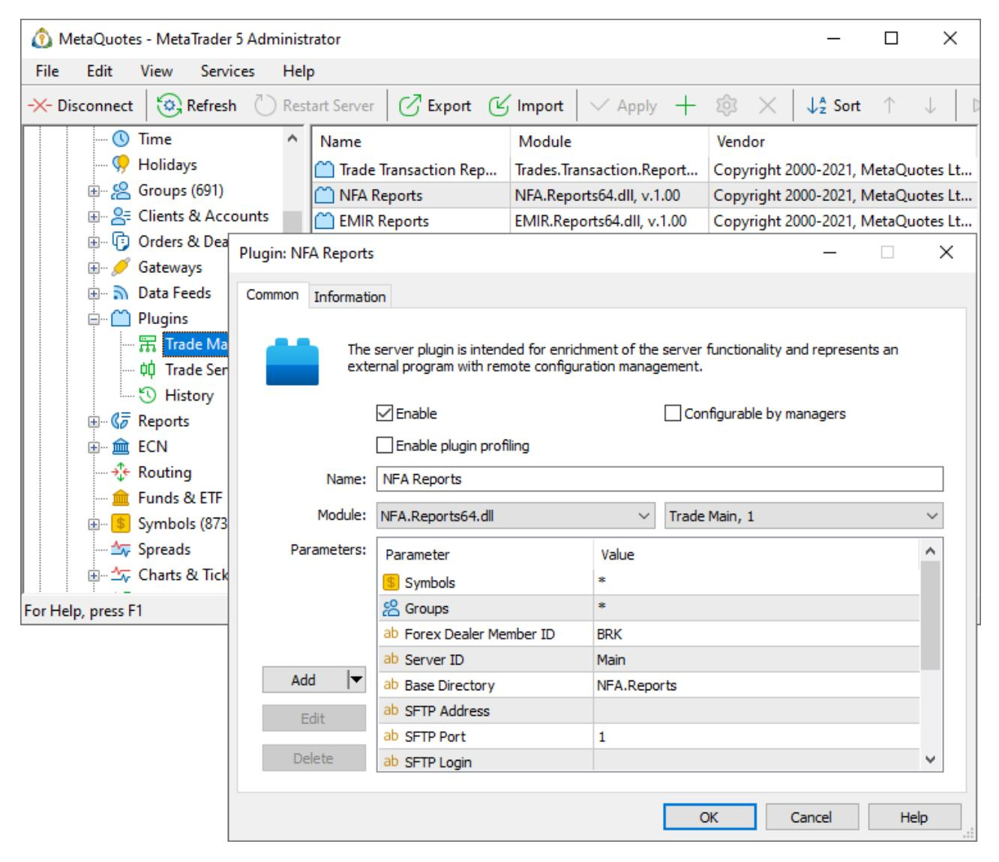

Set plugin parameters:

· **Enable** — enable/disable the plugin. The plugin starts running immediately after the option is enabled and the configuration is saved. No server restart is required to get started. If you disable the option, the server will completely unload the plugin from memory. This enables update of plug-in DLL files without the need to restart the platform.

- · **Configurable by managers** — if this option is enabled, the settings of this plugin can be edited via the Manager terminal. In order to be able to manage plugin configurations, the Manager account must have the [Configure](#page-75-0) plugins permission.
- · **Enable plugin profiling** — in this mode, the server will start collecting plugin operation statistics, based on which you can evaluate plugin performance and detect possible operation problems. Do not keep this parameter permanently enabled, because it affects the plugin performance.
- ·**Name** — the name of the plugin configuration.
- · **Module** — select one of the plugin modules in the first field. This field displays allthe plugins located in the "plugins" folder of the server selected in the next field. Each plugin configuration is bound to a specific trade server and thus it only influences the operation of this server.

Additional parameters are configured in the bottom part. The set of parameters depends on the plugin.

The **Information** section displays the plugin description, copyright, author and version and the version of the MetaTrader 5 Server API used for its development.

#### **Profiling**

Profiling allows evaluating the performance of the plugin by measuring the event handler and hook calltimes. Measurement is performed for each event and hook available in the plugin.

After you enable profiling, the server will begin to collect plugin operation statistics and will print information to the Journal every 5 minutes. Use the Profile keyword to request logs.

- · The profiling mode is only recommended for the plugin testing time, because this mode slows down the plugin operation.
- · Profiling should be enabled prior to enabling the plugin itself. If the plugin is already running, then you should restart it after enabling profiling. This is necessary for the correct collection of information.

The following information is provided during profiling:

· **Hook/event handler state** — active state (the hook/handler is being executed at the measurement time), unactive state (the hook/handler is not being executed at the measurement time). If the hook/handler is active for more than 5 seconds, the system displays a possible deadlock message in the log (the second entry in the example). If the hook/handler is active for more than 0.5 seconds, the system adds a message about the hook/handler being too slow (the third entry in the example).

```
14:10:01 Simple Plugin Profile IMTConSymbolSink::OnSymbolUpdate: unactive state
14:10:01 Simple Plugin Profile IMTConSymbolSink::OnSymbolUpdate: possible
deadlock: 6000 msc in active state
14:10:01 Simple Plugin Profile IMTConSymbolSink::OnSymbolUpdate: too slow: max
process time 1000 msc
```

·**Call count** — X calls, the total number of hook/handler calls for during the plagun operation time. 14:10:01 Simple Plugin Profile IMTConSymbolSink::OnSymbolUpdate: 5 calls

·**Last call time** — the time when the hook/handler was called for the last time up to milliseconds.

```
14:10:01 Simple Plugin Profile IMTConSymbolSink::OnSymbolUpdate: last call at
2013.06.26 14:09:37.603
```

· **Minimum execution time** — time min, minimum hook/handler execution time during the plugin operation time, in milliseconds.

```
14:10:01 Simple Plugin Profile IMTConSymbolSink::OnSymbolUpdate: time min 0
msc
```

· **Maximum execution time** — time max, maximum hook/handler execution time during the plugin operation time, in milliseconds.

```
14:10:01 Simple Plugin Profile IMTConSymbolSink::OnSymbolUpdate: time max 2
msc
```

· **Average execution time** — time avg, average hook/handler execution time during the plugin operation time, in milliseconds.

```
14:10:01 Simple Plugin Profile IMTConSymbolSink::OnSymbolUpdate: time avg 0
msc
```

· Total execution time — time total, total hook/handler execution time (time of all calls in milliseconds) during the plugin operation time, in milliseconds.

14:10:01 Simple Plugin Profile IMTConSymbolSink::OnSymbolUpdate: time total 0 msc

#### **Configuring access servers to work with Web API**

Access servers support connection via HTTPS protocol(HTTP is not supported). Therefore, they can act as a web server. This enables sending of Web API commands to a server as ordinary GET and POST requests.

To enable connection to the access server via HTTPS, at least one of its public addresses (specified in the **Network** section) must be associated with a certain domain, i.e. the host to which POST and GET requests will be implemented. For this purpose, the appropriate entry must be specified on the DNS server. For example, if you want to implement operation via the host abc.broker.com, the following entry should be added to DNS: XXX.XXX.XXX.XXX abc.broker.com, where XXX.XXX.XXX.XXX is the public address of the access server.

Since only protected TLS connections (HTTPS) are supported, an SSL certificate must be installed on the access server for the appropriate domain. Use the **SSL** section in the appropriate server settings to download and manage certificates:

| <b>SSL Certificates</b><br>Please specify server SSL certificates for all access servers. They will be used for connections made through them.                                                                                                                                           |                                          |                                          |             |               |                   |            |                                          |                                          |
|------------------------------------------------------------------------------------------------------------------------------------------------------------------------------------------------------------------------------------------------------------------------------------------|------------------------------------------|------------------------------------------|-------------|---------------|-------------------|------------|------------------------------------------|------------------------------------------|
| <table> <tr> <td><b>Up</b></td> <td><b>Down</b></td> </tr> <tr> <td>Certificate</td> <td>* .broker.com</td> <td>* .whitelabel.com</td> </tr> <tr> <td>Thumbprint</td> <td>69e0c8950c895a0a9a96f4442a61db3d838d85f6</td> <td>cced0a9441036ae8063e0290a3f04c3e029325d5</td> </tr> </table> | <b>Up</b>                                | <b>Down</b>                              | Certificate | * .broker.com | * .whitelabel.com | Thumbprint | 69e0c8950c895a0a9a96f4442a61db3d838d85f6 | cced0a9441036ae8063e0290a3f04c3e029325d5 |
| <b>Up</b>                                                                                                                                                                                                                                                                                | <b>Down</b>                              |                                          |             |               |                   |            |                                          |                                          |
| Certificate                                                                                                                                                                                                                                                                              | * .broker.com                            | * .whitelabel.com                        |             |               |                   |            |                                          |                                          |
| Thumbprint                                                                                                                                                                                                                                                                               | 69e0c8950c895a0a9a96f4442a61db3d838d85f6 | cced0a9441036ae8063e0290a3f04c3e029325d5 |             |               |                   |            |                                          |                                          |
| <button>Add</button> <button>Edit</button> <b>Delete</b>                                                                                                                                                                                                                                 |                                          |                                          |             |               |                   |            |                                          |                                          |

The certificate can be password protected. In this case, you will be prompted to enter the password. This password is only used for certificate installation on the local computer and is not transmitted anywhere.

SSL settings apply to all access servers, not just to the one in which you edit them. Changes in the list of certificates are applied instantly, so you do not need to restart the servers.

Connections from multiple domains can be supported on one server (the SNI [mode](https://ru.wikipedia.org/wiki/Server_Name_Indication)). In this case, the corresponding SSL certificate must be installed for each of them. When connecting, the client specifies the address to connect to. The access server checks all installed certificates and automatically provides the necessary one to the client:

- ·First, the server tries to find a certificate for an exact match domain.
- ·If not, it tries to find the most suitable one using mask \*.
- ·If the certificate could not be found, the server returns the first certificate from the list.

Select OK to complete a access server creation or editing. If you select Cancel, the window will be closed without saving changes.

## <span id="page-267-0"></span>**Additional components in the AppStore**

App Store features solutions for the MetaTrader 5 platform from MetaQuotes and third-party vendors. The store offers hundreds of products from different categories, including gateways, liquidity solutions, CRM systems and traders' rooms, as well as trade server hosting services. Every product has a detailed description of its function and application scopes. From the App Store, you can also upgrade your license: order an additional White Label, trade server, etc.

All vendors in the App Store go through a specialregistration procedure and sign an agreement with MetaQuotes. Detailed information on each company is available under the [Vendors](https://support.metaquotes.net/en/market/vendors) section on the Support Center [website.](https://support.metaquotes.net/en/market/vendors)

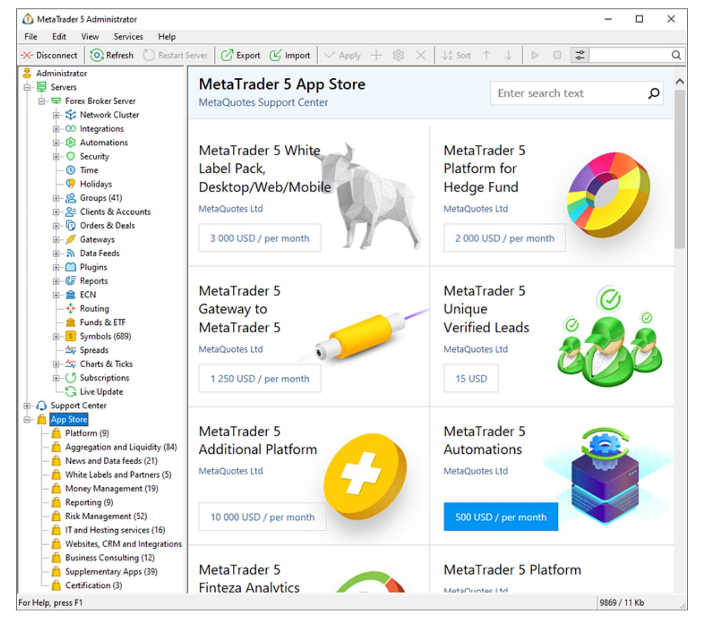

For convenience, all grouped by categories. Use the Navigator window to switch between them.

- ·Aggregation and Liquidity — price aggregation solutions, liquidity providers and gateways
- ·News and Data feeds — quotes, news and analytics sources

- ·White Labels and Partners — White Labelfor IBs (Introducing Brokers) and affiliate programs
- ·Money Management — money management, PAMM and MAMM solutions
- ·Reporting — advanced reporting software
- ·Risk Management — risk management solutions
- ·IT and Hosting services — MetaTrader 5 server management services and hosting providers
- · Websites, CRM and Integrations — order websites, trader rooms and integrations for the MetaTrader 5 platform
- ·Business Consulting — legal and business consulting services
- ·Supplementary apps

To order a product, fill out a simple form. The vendor's representative will contact you and provide allthe necessary information.

## <span id="page-269-0"></span>**Integration with messengers**

The MetaTrader 5 platform allows traders to quickly request demo and real accounts directly from the desktop and mobile terminals. The built-in verification system ensures that traders specify valid contact details which your managers can use for client management and promotional purposes. The system sends verification codes to the mobile number and email specified during the request.

| Open an Account                                                                             |                                                                               |
|---------------------------------------------------------------------------------------------|-------------------------------------------------------------------------------|
| Opening a demo account                                                                      | A demo account allows trading with virtual money and learn without risk       |
| First name:                                                                                 | John                                                                          |
| Second name:                                                                                | Smith                                                                         |
| Email:                                                                                      | confimation code<br>trader@mail.net                                           |
| Phone:                                                                                      | +1 United States<br>confimation code<br>123126999                             |
|                                                                                             | We have sent confirmation codes to your phone and email. Please specify them. |
| Use hedge in trading                                                                        | $alse$                                                                       |
| Server:                                                                                     | MetaQuotes-Demo                                                               |
| Account type:                                                                               | Demo-Hedging                                                                  |
| Deposit:                                                                                    | 1000000 USD, virtual money to be deposited to your account                    |
| Leverage:                                                                                   | 1:100 virtual credit funds to be provided by the broker for trading           |
|                                                                                             |                                                                               |
| I agree with the terms and conditions for opening an account and the data protection policy | $alse$                                                                       |
|                                                                                             | <button>&lt; Back</button> <button>Next &gt;</button>                         |

To enable the system operation, you should configure platform integration with messengers and mail [services](#page-282-0).

See also: [Documentation](https://support.metaquotes.net/en/docs/mt5/platform/administration/admin_accounts/account_allocation_groups) / Platform / Platform settings / Accounts / Account allocation settings

### **Intelligent budget optimization system**

Various factors affect the delivery of confirmation codes to traders, such as the provider, the trader's country and carrier, roaming, and so on. Codes can be delivered with a delay in some cases. To avoid frequent repeated quote requests, confirmation codes are valid for three hours. If the code is not entered in the field within this time frame, the trader will need to repeat the procedure.

Before sending codes, the system checks whether the specified phone/email was previously confirmed. If the trader has already passed verification from his or her computer in the last 72 hours, an account will be opened without additional confirmation. Thus, there will be no additional burden for traders and no additional costs for brokers.

The system automatically controls the correctness of specified phone numbers on the client terminal side. This prevents the sending of codes to incorrect numbers and thus saves you costs for the SMS provider services.

- · The phone number must be specified in the internationalformat: +[country code][number], for example: +79171113594. The number is indicated without spaces.
- ·This must be a mobile phone number, not landline.

The number of confirmations of different phone numbers that a trader can request from one computer is limited for security purposes. When the limit is reached, confirmation codes are no longer sent, and the following messages is printed in the server log: "too many phone confirmation requests from IP".

### <span id="page-270-0"></span>**Use multiple providers to enable the system to choose the optimal one**

We recommend working with at least two different SMS providers at the same time, in order to ensure successful and fast delivery. To reduce costs and to increase the delivery success rate, the platform will collect statistics on sent SMS for each country and provider: successful attempts, errors, cost.

| Country                           | Sent | Errors | Spent                | Average Price       |
|-----------------------------------|------|--------|----------------------|---------------------|
| +357 (Cyprus)                     | 3    |        | 2.40 CRD / 0.07 USD  | 0.80 CRD / 0.02 USD |
| +7 (Kazakhstan, Russia)           | 5    | 1      | 10.00 CRD / 0.30 USD | 2.00 CRD / 0.06 USD |
| +380 (Ukraine)                    |      | 1      |                      |                     |
| Balance: 8726.30 CRD / 261.79 USD | 8    |        | 12.40 CRD / 0.37 USD | 1.55 CRD / 0.05 USD |

How the provider is selected when sending a message:

- ·The system checks the client group and country
- · The best provider is selected from the list of providers meeting the [country](#page-278-0) and [group](#page-279-0) conditions, based on the number of successfully delivered messages and message cost

- ·If several providers have the same statistics, the one located further up the list is selected
- · If none of the providers is suitable, the default provider is utilized (as set by the **Default messenger** option in **Common** settings)

If sending through the main provider fails, the system will send the message through the next one.

By connecting multiple SMS providers, you can minimize the probability of losing a client due to an undelivered message.

A successfully delivered verification code is valid for 3 hours. Thus, a trader can open a real account even in the event of unforeseen delays due to the network operator fault.

The system also protects against technicalfailures if the optimal SMS provider fails for some reason. If an error is received from the provider, the system willrepeat a sending attempt. All unsuccessful attempts are accumulated in the counter. Once the limit is reached, the system switches to another available provider. Thus, the system willrepeat attempts untilthe message is successfully sent.

### **Setting up the provider**

| MetaQuotes - MetaTrader 5 Administrator    |                       |                                                                                         |                |                                         |           |                         | ×<br>□     |
|--------------------------------------------|-----------------------|-----------------------------------------------------------------------------------------|----------------|-----------------------------------------|-----------|-------------------------|------------|
| File<br>Edit<br>View<br><b>Services</b>    | Help                  |                                                                                         |                |                                         |           |                         |            |
| $21$ Refresh                             | <b>Restart Server</b> | $$ ( $4$ Export ( $4$ Import $   6$ $BEcircledS 6 $                         |                |                                         |           | $$ Sort       |            |
| Administrator                              | Name                  | Sender                                                                                  | <b>Address</b> | Balance                                 |           | Spent Average           | Total Sent |
| <b>3 Servers</b>                         | $$ BulkSMS           | 37121024                                                                                |                | https://ap 3753.61 C 120.09 CR 1.19 CRD |           |                         | 101 / 258  |
| 781 1 MetaTrader Server                 | Clickatell            | 12345                                                                                   |                | https://ap 3508.13 C 106.60 CR          |           | 1.00 CRD                | 107/12     |
| in Sc. Network Cluster<br>□ © Integrations | Messenger             |                                                                                         |                |                                         |           |                         | ×          |
| Finteza Analy                              | Common                | Countries Statistics Groups                                                             |                |                                         |           |                         |            |
| $	e$ VPS<br>… Mail Servers                |                       | Please set up your messenger service. It will be used for confirming user phones during |                |                                         |           |                         |            |
| Messengers                                 | $7$                  | account registration. You can request the parameters from the chosen service provider.  |                |                                         |           |                         |            |
| (8) KYC                                   |                       |                                                                                         |                |                                         |           |                         |            |
| <b>Web Services</b>                        |                       | 1 Enable                                                                               |                |                                         |           |                         |            |
| A731 01utomations                     | Name:                 | <b>BulkSMS</b>                                                                          |                |                                         |           |                         |            |
| <b>6</b> 6ecurity                        | Type:                 | <b>BulkSMS</b>                                                                          |                |                                         | $$ | https://www.bulksms.com |            |
| $2$ ( $9$ 0516)                     | Sender:               | 37121024062                                                                             |                |                                         |           |                         |            |
| C Holidays                                 |                       |                                                                                         |                |                                         |           |                         |            |
| 7219 (6213)                        | Template:             | #MESSAGE#                                                                               |                |                                         |           |                         |            |
| For Help, press F1                         |                       | Default messenger                                                                       |                |                                         |           |                         |            |
|                                            |                       |                                                                                         |                |                                         |           |                         |            |
|                                            | Provider address:     | https://api.bulksms.com/v1                                                              |                |                                         |           |                         |            |
|                                            | Token Id:             | Po 19roaap 1la                                                                          |                |                                         |           |                         |            |
|                                            | <b>Token Secret:</b>  | Di67sdPo4xnh                                                                            |                |                                         |           |                         |            |
|                                            | Currency rate:        | 0.030                                                                                   | <b>CRDUSD</b>  |                                         |           |                         |            |

Create a new configuration and set the messaging service connection parameters:

- · **Enable** — enable/disable messenger configuration. If the configuration is disabled, the service will not be used to send messages.
- ·**Name** — configuration name.
- · **Type** — messaging service provider. Parameters are provider-specific so you should check them with your provider. The following providers are currently supported: [BulkSMS](https://www.bulksms.com/), [Clickatell,](https://www.clickatell.com/) [WEBSMS,](https://websms.ru/) [Twilio,](https://www.twilio.com/) [CM.com](https://www.cm.com/), [Vonage,](https://www.vonage.com) [Infobip](https://www.infobip.com), [Foniva](https://www.foniva.com.tr/).
- ·**Sender** — message sender ID. The value is provided by the service provider.
- ·**Template** — the basic [template](#page-280-0) for sending messages via this provider.
- · **Default messenger** — the platform uses this option when selecting a [messenger](#page-270-0) to send a message to the client, if a messenger could not be selected based on the group, country or statistics.
- · **Rate** — exchange rate to convert message sending cost to USD. The rate is used to display data in the **Statistics** section.

Further settings depend on the provider. Please request required settings from the provider.

#### **BulkSMS**

- · **Provider address** — address for connecting to the service. The default value is https://api.bulksms.com/v1. In most cases, there is no need to change it.
- · **Token ID** — token for sending messages. It can be obtained at [https://www2.bulksms.com/home/advanced\\_features/api\\_tokens/](https://www2.bulksms.com/home/advanced_features/api_tokens/) after you authorize using your BulkSMS account.
- ·**Token secret** — token secret for sending messages.
- · **Sender** — the name of the sender which will be displayed in the message received by the recipient. The fields can be left blank or it can be filled with the [Sender](https://www.bulksms.com/features/sender-id.htm) ID value.

The token ID and token secret will be available to you at [https://www2.bulksms.com/home/advanced\\_features/api\\_tokens/](https://www2.bulksms.com/home/advanced_features/api_tokens/) after you log in using your BulkSMS account.

| <b>New Credentials</b> |                                       |
|------------------------|---------------------------------------|
| Token name             | test                                  |
| Token ID               | 6383ECAA85014F508F96F8AEC7F2FE39-02-E |
| <b>Token secret</b>    | nYQvfTignr*nLPPbloM#0zkOPEUmK         |

Sender ID is available in your account:

| My Account > Change Sender Id                                                                  | <b>Help Centre</b><br><b>Support</b> |
|------------------------------------------------------------------------------------------------|--------------------------------------|
|                                                                                                |                                      |
| <b>Request new sender id</b>                                                                   |                                      |
| A mobile phone number including country code, or a word of up to 11 characters (e.g. John).    |                                      |
| Warning: sender ids which contain any characters other than a-z A-Z and 0-9 will intermittentl |                                      |
| New sender Id                                                                                  |                                      |
|                                                                                                |                                      |
| <b>Manage sender ids</b>                                                                       |                                      |
| Default Sender ID                                                                              | 37137024367                          |
| <b>Current sender ids</b>                                                                      | 17979595587                          |
|                                                                                                | 37137024367                          |
|                                                                                                |                                      |

#### **Clickatell**

- · **Provider address** — address for connecting to the service. The default address is https://api.clickatell.com/rest. In most cases, there is no need to change it.
- · **Authentication token** — token for sending messages (or API key for the accounts, which were created after November 2016).

· **Sender** — the sender's number which will displayed in the message. This parameter should only be filled if the two way [messaging](https://www.clickatell.com/articles/digital-marketing/two-way-messaging-b2b-marketing/) option is enabled for your Clickatell account. When the option is enabled, you will receive a special number from which you will be sending messages and to which you will be able to receive replies. This is the number that should be specified in the Sender field.

The operation of Clickatell accounts created after November 2016 is different from earlier accounts: they utilize different API versions:

- ·The token for sending messages is called API key instead of Auth token.
- ·No message cost data is available for these accounts.
- · The financial state of such accounts can't be converted to USD, while statistics are shown in the deposit, specified in the Clickatell account.

To receive the API key, log in using your account at the [Clickatell](https://portal.clickatell.com) site and navigate to the SMS section of your profile:

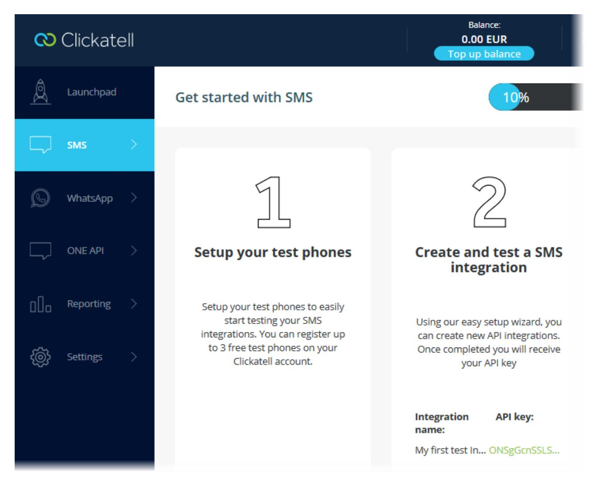

To check whether you need to specify the Sender field, open your Clickatell account and navigate to SMS \ Your REST integration \ Features \ Messaging type. You can switch between message sending modes in this section.

| Label          | Value                                                                                                 |
|----------------|-------------------------------------------------------------------------------------------------------|
| Logo           | <b>CO</b> Clickatell                                                                                  |
| Currency       | ₫                                                                                                     |
| Launchpad      | Launchpad                                                                                             |
| Page Header    | SMS Messaging > MT5 REST Integration                                                                  |
| Menu Items     | SMS, WhatsApp, My APIs, Campaign, Reporting, Settings                                                 |
| SMS            |                                                                                                       |
| Messaging type | Two-way messaging                                                                                     |
| Note           | Please note: Due to regulations a 2-way number is required to send messages within the United States. |
| Delivery type  | Time Critical                                                                                         |

#### **WEBSMS**

- · **Provider address** — address for connecting to the service. The default address is https://cab.websms.ru. In most cases, there is no need to change it.
- ·**Login** — your service account login.
- ·**Password** — password for sending messages via API (not password from your account).
- · **Sender** — the name of the sender which will be displayed in the message received by the recipient. The specified name must be added to the [Name](https://cab.websms.ru/fromname.asp) List of your account. If left blank, the default names from your [personal](https://cab.websms.ru/fromname.asp) account will be used.

To set the password for sending messages via API, log in to your account at the WEBSMS site and navigate to the [Password](https://www.websms.ru/EditPass.asp) Change section in your profile.

| <b>WEBSMS</b><br>личный кабинет                                                   |
|-----------------------------------------------------------------------------------|
| Телефонная<br>Текст<br>Дата и время <sup>)</sup><br>рассылки<br>рассылки<br>книга |

| ID пользователя: | 23            |
|------------------|---------------|
| Логин:           | та            |
| Статус:          | Платный ++    |
| На счете:        | 14431.60 руб. |
| Информер:        | 16            |

| ■ | Смена пароля<br>Смена пароля доступа в личный кабинет |
|---|-------------------------------------------------------|
|---|-------------------------------------------------------|

| ▶ | Выход |
|---|-------|
|---|-------|

| Введите старый пароль |  |
|-----------------------|--|
|-----------------------|--|

| Введите новый пароль |  |
|----------------------|--|
|----------------------|--|

| Повторите пароль |  |
|------------------|--|
|------------------|--|

| Сервисы приема |  |
|----------------|--|
|----------------|--|

| • Сервисы пополнения базы | изменить пароль |
|---------------------------|-----------------|
|---------------------------|-----------------|

| Оплата | Смена пароля доступа по НТТР, SMTP, SMPP |
|--------|------------------------------------------|
|--------|------------------------------------------|

| Персональные настройки | Для смены пороля необходимо указать действующий пароль. |
|------------------------|---------------------------------------------------------|
|------------------------|---------------------------------------------------------|

| ≡ Профайл | Если пароль ни разу не менялся - установлен тот же пароль, что и<br>Если действующий пароль утерян - обратитесь в тех. поддержку : |
|-----------|------------------------------------------------------------------------------------------------------------------------------------|
|-----------|------------------------------------------------------------------------------------------------------------------------------------|

| имя отправителя<br>Часовой пояс<br>Интерфейс<br>Безопасность<br>Смена пароля<br>Оповещения<br>• Навигация | Введите старый пароль<br>Введите новый пароль<br>Повторите ввод нового пароля |
|-----------------------------------------------------------------------------------------------------------|-------------------------------------------------------------------------------|
|-----------------------------------------------------------------------------------------------------------|-------------------------------------------------------------------------------|

#### **Twilio**

To set up the integration, sign up at [Twilio](https://www.twilio.com/) website and purchase the desired service plan. Go to Dashboard and copy ACCOUNT SID and AUTH TOKEN values:

| Twilio     |                  |                                                                                                                                                          | DOCS $∨$ |   | John Smith $∨$ |    |
|------------|------------------|----------------------------------------------------------------------------------------------------------------------------------------------------------|----------|---|----------------|----|
| Broker $∨$ |                  |                                                                                                                                                          | 9,       | ♦ | ?              | සූ |
| ⋒          | Dashboard        | Broker Dashboard                                                                                                                                         |          |   |                |    |
| $⊙$        | Billing<br>Usage | Project Info                                                                                                                                             |          |   | $∧$            |    |
|            | Settings         | BALANCE<br>Auto-recharge is disabled. Enable<br>\$16.36<br>REFERRAL PROGRAM<br>Refer your network to Twilio — give \$10, get \$10.<br>Referral Dashboard |          |   |                |    |
|            |                  | ACCOUNT SID<br>pa10oppKL39alx9035mRk                                                                                                                     |          |   | $■$            |    |
|            |                  | AUTH TOKEN<br>n01992kLopen962<br>Hide                                                                                                                    |          |   | Ø              |    |

Next, create a messenger configuration and specify the following parameters:

- · **Provider address** — address for connecting to the service. The default value is https://api.twilio.com/2010- 04-01. In most cases, there is no need to change it.
- ·**Sender** — your Twilio number via which the SMS messages are sent.
- · **Account SID** — your account identifier (ACCOUNT SID) from the Dashboard section of your account in the Twilio website.
- · **Authorization Token** — a token for sending SMS messages (AUTH TOKEN) from the Dashboard section of your account in the Twilio website.

#### **Foniva**

Foniva is a Turkish platform that provides fast and high-quality SMS messaging services to subscribers throughout the country. To connect to the service, request an account on the [provider's](https://www.foniva.com.tr/) website.

Then, go to your personal account at <https://sms.foniva.com.tr/login> and specify your login details. Next, click on your account name and go to the "API Settings" section. The section contains data for configuring the provider on the MetaTrader 5 side:

| Label                      | Value        |
|----------------------------|--------------|
| Foniva Telekom<br>User     |              |
| Edit Profile               |              |
| İYS Settings               |              |
| Dashboard<br>団             |              |
| ے<br>User                  | $\checkmark$ |
| SMS                        | $\checkmark$ |
| Credit<br>旵                | $\checkmark$ |
| Contact<br>$ \mathcal{S} $ | $\checkmark$ |
| Password 2                 |              |
| Username                   | test         |
| ≗                          |              |
| R20xlanr<br>₽              | Ø            |

Create a messenger configuration on the platform side and specify the following parameters:

- · **Sender** — the name that will be indicated as the message sender. This is a required field. The name should be discussed with the provider when you open your account.
- ·**Login** — login for connection from the personal account.
- ·**Password** — password for connection from the personal account.

·**Currency rate** — Turkish lira to US dollar exchange rate to display cost statistics.

#### **Infobip**

The service offers high speed and delivery reliability through over 700 direct operator connections and 28 data centers around the world.

To connect to the service, request an account on the provider's website. Login to your profile and copy the API key on the main page. Use the <https://portal.infobip.com/settings/accounts/api-keys> section to manage keys.

| HOME            | <b>BROADCAST</b>                            | <b>TEMPLATES</b> |
|-----------------|---------------------------------------------|------------------|
| Hi, John        |                                             |                  |
|                 | abcbroker  <br><b>Signup ABC Broker</b>     |                  |
|                 |                                             |                  |
| <b>API Key:</b> | <b>MANAGE API KEYS</b>                      |                  |
|                 | • <b>API Key:</b> ......................... |                  |

Create a messenger configuration on the platform side and specify the following parameters:

- ·**Sender** — number/name to be specified as the message sender. The field can be left blank.
- · **API endpoint** — the address of the Infobip server through which messages will be sent. The main server at https://api.infobip.com is used by default. It is not recommended to change the server unless absolutely necessary.
- ·**API key** — your unique 69-character key. Available in your account.
- · **Webhook endpoint** — leave the field blank. Integration with Infobip comes with standard options for providing message delivery notifications and information about the cost to the platform, without the need to additionally set up webhooks.

#### <span id="page-278-0"></span>**Countries**

Specify the list of countries, for which this messenger will be used. Use of different providers ensures the best delivery conditions for clients from different regions.

If no country is specified, the platform will use this messenger for clients from any country.

| Messenger                     |                  |                   |                       |                                                                                                                                                                                  |  | × |
|-------------------------------|------------------|-------------------|-----------------------|----------------------------------------------------------------------------------------------------------------------------------------------------------------------------------|--|---|
| Common                        | <b>Countries</b> | Statistics Groups |                       |                                                                                                                                                                                  |  |   |
| $\bullet$ $\bullet$ $\bullet$ |                  | countries.        |                       | Please specify countries the messenger will be used for. For example, you can have<br>different providers for clients from each region for better delivery. Empty list means all |  |   |
|                               |                  | Phone Code        | Country               | Template                                                                                                                                                                         |  |   |
|                               |                  | $\bigoplus +1$    | Canada, United States |                                                                                                                                                                                  |  |   |
|                               |                  | $oplus +33$       | France, Guadeloupe    |                                                                                                                                                                                  |  |   |
|                               |                  | $oplus +31$       | Netherlands           |                                                                                                                                                                                  |  |   |
|                               |                  | $oplus +52$       | Mexico                |                                                                                                                                                                                  |  |   |
|                               |                  |                   |                       |                                                                                                                                                                                  |  |   |
|                               |                  |                   |                       |                                                                                                                                                                                  |  |   |
|                               |                  |                   |                       |                                                                                                                                                                                  |  |   |
|                               |                  |                   |                       |                                                                                                                                                                                  |  |   |
|                               |                  |                   |                       |                                                                                                                                                                                  |  |   |
|                               | Add              |                   |                       |                                                                                                                                                                                  |  |   |
|                               | Edit             |                   |                       |                                                                                                                                                                                  |  |   |
|                               |                  |                   |                       |                                                                                                                                                                                  |  |   |
|                               | Delete           |                   |                       |                                                                                                                                                                                  |  |   |
|                               |                  |                   |                       |                                                                                                                                                                                  |  |   |
|                               |                  |                   |                       |                                                                                                                                                                                  |  |   |

Message [templates](#page-280-0) are overridden for each country.

When opening a demo account, the country is determined automatically on the client terminal side. When opening a preliminary account, the country is also detected automatically, but the client can specify another country in the registration form.

#### <span id="page-279-0"></span>**Groups**

Specify the list of groups, for which this messenger will be used. Thus you can organize work with your White Label partners. You partners can select providers and pay for their services, as well as send messages on their own behalf and use specific texts.

| Messenger |               |                                                                                                                                                                                        |        |  |  |           |  |        |  | ×    |
|-----------|---------------|----------------------------------------------------------------------------------------------------------------------------------------------------------------------------------------|--------|--|--|-----------|--|--------|--|------|
|           |               | Common Countries Statistics                                                                                                                                                            | Groups |  |  |           |  |        |  |      |
| $\cdots$  |               | Please specify the client groups that will use this messenger. For example, you can have<br>different providers for groups belonging to each White Label. Empty list means all groups. |        |  |  |           |  |        |  |      |
|           |               | Group<br>& real yeal                                                                                                                                                                   |        |  |  |           |  |        |  |      |
|           |               | 음 reallyeal-5                                                                                                                                                                          |        |  |  |           |  |        |  |      |
|           |               | 8 real\ecn                                                                                                                                                                             |        |  |  |           |  |        |  |      |
|           |               |                                                                                                                                                                                        |        |  |  |           |  |        |  |      |
|           |               |                                                                                                                                                                                        |        |  |  |           |  |        |  |      |
|           |               |                                                                                                                                                                                        |        |  |  |           |  |        |  |      |
|           | Add           |                                                                                                                                                                                        |        |  |  |           |  |        |  |      |
|           | Edit          |                                                                                                                                                                                        |        |  |  |           |  |        |  |      |
|           | <b>Delete</b> |                                                                                                                                                                                        |        |  |  |           |  |        |  |      |
|           |               |                                                                                                                                                                                        |        |  |  |           |  |        |  |      |
|           |               |                                                                                                                                                                                        |        |  |  | <b>OK</b> |  | Cancel |  | Help |

#### <span id="page-280-0"></span>**Templates**

Templates can be used for messages. The text can be changed depending on the used message provider or the recipient country.

Each country has its own message sending rules: providers can filter messages by specific words, require special formats, etc. For example, in China it is recommended to indicate a [signature](https://support.twilio.com/hc/en-us/articles/360016612253-China-SMS-Template-Pre-approval-Requests) before a message. Please check with your message provider for specific sending policies.

Use templates to customize message sending in accordance with localrules.

For example, a template from the file [main server installation directory]\templates\verify\_phone is used for phone number confirmation during account registration. You can specify in this template a macro for code substitution, without a text: "<!--CONFIRMATION\_CODE-->". Further, the required text can be added in the provider settings:

| Messenger                                    |                                                                                                                                                                                   |                   |                                                                                                                                                                                          |                                        |    | × |        |                          |   |           |                                                        |
|----------------------------------------------|-----------------------------------------------------------------------------------------------------------------------------------------------------------------------------------|-------------------|------------------------------------------------------------------------------------------------------------------------------------------------------------------------------------------|----------------------------------------|----|---|--------|--------------------------|---|-----------|--------------------------------------------------------|
| Common                                       | Countries                                                                                                                                                                         | Statistics        | Groups                                                                                                                                                                                   |                                        |    |   |        |                          |   |           |                                                        |
| <span>•</span> <span>•</span> <span>•</span> | Please set up your messenger service. It will be used for confirming user phones during<br>account registration. You can request the parameters from the chosen service provider. |                   |                                                                                                                                                                                          |                                        |    |   |        |                          |   |           |                                                        |
|                                              | <input type="checkbox"/> Enable                                                                                                                                                   |                   |                                                                                                                                                                                          |                                        |    |   |        |                          |   |           |                                                        |
| Name:                                        | WebSMS                                                                                                                                                                            |                   |                                                                                                                                                                                          |                                        |    |   |        |                          |   |           |                                                        |
| Type:                                        | <b>WEBSMS</b>                                                                                                                                                                     |                   | <a href="https://websms.ru">https://websms.ru</a>                                                                                                                                        | <input checked="" type="checkbox"/>    |    |   |        |                          |   |           |                                                        |
| Sender:                                      | 123456                                                                                                                                                                            |                   |                                                                                                                                                                                          |                                        |    |   |        |                          |   |           |                                                        |
| Template:                                    | Confirmation code: #MESSAGE#                                                                                                                                                      |                   |                                                                                                                                                                                          |                                        |    |   |        |                          |   |           |                                                        |
|                                              | Messenger                                                                                                                                                                         |                   |                                                                                                                                                                                          |                                        |    |   |        | <input type="checkbox"/> | ✗ |           |                                                        |
| Provider address:                            | <table> <tr> <td>Countries</td> <td>This is a list of country-specific provider addresses.</td> </tr> </table>                                                                    |                   |                                                                                                                                                                                          |                                        |    |   |        |                          |   | Countries | This is a list of country-specific provider addresses. |
| Countries                                    | This is a list of country-specific provider addresses.                                                                                                                            |                   |                                                                                                                                                                                          |                                        |    |   |        |                          |   |           |                                                        |
| Login:                                       | b                                                                                                                                                                                 |                   | Please specify countries the messenger will be used for. For example, you can have different providers for clients from each region for better delivery. Empty list means all countries. |                                        |    |   |        |                          |   |           |                                                        |
| Password:                                    |                                                                                                                                                                                   |                   |                                                                                                                                                                                          |                                        |    |   |        |                          |   |           |                                                        |
| Countries:                                   |                                                                                                                                                                                   | <span>⊕ +7</span> | Kazakhstan, Russia                                                                                                                                                                       | Template: Код подтверждения: #MESSAGE# |    |   |        |                          |   |           |                                                        |
|                                              |                                                                                                                                                                                   | ⊕ +1              | Canada, United States                                                                                                                                                                    |                                        |    |   |        |                          |   |           |                                                        |
|                                              |                                                                                                                                                                                   | ⊕ +86             | China                                                                                                                                                                                    | ABC #MESSAGE#                          |    |   |        |                          |   |           |                                                        |
|                                              |                                                                                                                                                                                   |                   |                                                                                                                                                                                          |                                        |    |   |        |                          |   |           |                                                        |
|                                              | Add                                                                                                                                                                               |                   |                                                                                                                                                                                          |                                        |    |   |        |                          |   |           |                                                        |
|                                              | Edit                                                                                                                                                                              |                   |                                                                                                                                                                                          |                                        |    |   |        |                          |   |           |                                                        |
|                                              | <b>Delete</b>                                                                                                                                                                     |                   |                                                                                                                                                                                          |                                        |    |   |        |                          |   |           |                                                        |
|                                              |                                                                                                                                                                                   |                   |                                                                                                                                                                                          |                                        |    |   |        |                          |   |           |                                                        |
|                                              |                                                                                                                                                                                   |                   |                                                                                                                                                                                          |                                        | OK |   | Cancel | <b>Help</b>              |   |           |                                                        |

A basic template is set in the general provider settings. It contains the default #MESSAGE# macro which substitutes the source text. In our example, the text "*Confirmation code*" is added so that the resulting message will look as follows: *Confirmation code: [confirmation code]*.

Country-specific templates are set in country settings. These templates have higher priority than basic ones. If a country template is specified, this template will be used. Otherwise a template from the **Common** tab will be used.

## <span id="page-282-0"></span>**Integration with mail services**

The MetaTrader 5 platform features the built-in email service. Use the system to send internal emails and trading reports to traders, as well as to enable the validation of email addresses specified by users when opening accounts via client terminals.

Reports and verification emails can be sent from different mailboxes, while a separate mailbox can be used for each client group. Thus your White Label partners can send emails to their clients from their own addresses.

Mail server configurations can be efficiently managed in the **Mail servers** section. Set the parameters once, and later you can select the desired server configuration in the client group or account allocation settings.

| File | Edit<br>View<br><b>Services</b>                    | Help                                    |                                                                                                                                                           |                |                     |                 |          |                           |
|------|----------------------------------------------------|-----------------------------------------|-----------------------------------------------------------------------------------------------------------------------------------------------------------|----------------|---------------------|-----------------|----------|---------------------------|
|      | œ                                                  | MetaQuotes - MetaTrader 5 Administrator |                                                                                                                                                           |                |                     |                 |          |                           |
|      | Refresh                                            | -X                                      | Disconnect                                                                                                                                                | Restart Server | $
ightarrow$ Export | $⌊$ Import      |          |                           |
|      | ◻️© Integrations                                   | Name                                    | Email                                                                                                                                                     | Sender         | Server              | Login           | Total Se | Time Min                  |
|      | Finteza Analytics                                  |                                         | ABC Broker   support@a   ABC Broker                                                                                                                       |                |                     | smtp.ab support |          | 1213 / 291 0 / 1168 / 249 |
|      | — ♀ vps                                            |                                         | Forex Broker support@fo Forex Broker smpt.for support                                                                                                     |                |                     |                 | 0/1      |                           |
|      | Mail Servers<br>V<br>Messengers                    | <b>Mail Server</b>                      |                                                                                                                                                           |                |                     |                 |          | ×                         |
|      | - $(2)$ KYC<br>Web Services (†<br>由 28 Automations |                                         | Please set up your mail server. It will be used for sending reports and confirming user emails. You can request SMTP parameters from your email provider. |                |                     |                 |          |                           |
|      | ◯ Security<br>中…                                   |                                         | $	riangledown$ Enable                                                                                                                                     |                |                     |                 |          |                           |
|      | $igodot$<br>Time                                  | Name:                                   | <b>ABC Broker</b>                                                                                                                                         |                |                     |                 |          |                           |
|      | $	ext{	extbf{Q}}$ Holidays<br>由 Society (691)      | Sender email:                           | support@abcbroker.com                                                                                                                                     |                |                     |                 |          |                           |
|      | 由 & Accounts                                       | Sender name:                            | <b>ABC Broker</b>                                                                                                                                         |                |                     |                 |          |                           |
|      | 由 C Orders & Deals<br><b>E</b> Gateways            | SMTP server:                            | smtp.abcbroker.com:25                                                                                                                                     |                |                     |                 |          |                           |
|      | 中心 nata Feeds                                      | SMTP login:                             | support@abcbroker.com                                                                                                                                     |                |                     | Password:       |          |                           |
|      | ⊕ ∩ Plugins                                        |                                         |                                                                                                                                                           |                |                     |                 |          |                           |
|      | $rac{	heta}{ar{z}}$ Reports                      |                                         | <b>▽</b> Default server                                                                                                                                   |                |                     |                 |          |                           |
|      | For Help, press F1                                 |                                         |                                                                                                                                                           | OK             | Cancel              |                 |          |                           |

Create a new configuration and set the mail server parameters:

- · **Enable** — enable/disable the mail server configuration. If the configuration is disabled, emails will not be sent via this server.
- ·**Name** — configuration name.
- ·**Sender email** — email address from which emails will be sent.
- ·**Sender name** — sender name which will be indicated in emails.
- · **SMTP server** — email server address for sending reports and port number, separated by a colon. Example: smtp.mailserver.com:80.
- ·**SMTP login** — account login on the mail server.

- ·**Password** — account password on the mail server.
- · **Default server** — the special **Default** option can be selected for the used mail server in group settings and in account allocation settings. In this case the platform will check the list of all servers and will utilize the first available server having the **Default server** option enabled.

Sent email statistics is shown for each configuration in the list:

- ·**Total Sent / Errors** — number of sent emails and number of unsent emails due to errors.
- ·**Queue** — number of emails on the queue to be sent.
- ·**Min / Max / Avg time** — minimum, maximum and average time of sending one email, in milliseconds.

See also:

- ·[Documentation](https://support.metaquotes.net/en/docs/mt5/platform/administration/admin_groups/groups_settings#reports) / Platform / Platform settings / Groups / Group settings / Reports
- ·[Documentation](https://support.metaquotes.net/en/docs/mt5/platform/administration/admin_accounts/account_allocation_groups) / Platform / Platform settings / Accounts / Account allocation settings

## <span id="page-284-0"></span>**Funds and ETFs**

MetaTrader 5 platform offers a turnkey solution for mutualfunds, prop trading and investment companies right out of the box. MetaTrader 5 Administrator allows creating a fund, swiftly configuring payouts and commissions, adding managers and opening trading accounts for investors.

All calculations related to share values, profitability and payouts are performed automatically in realtime. Fund clients are able to monitor their investments directly from the MetaTrader 5 client terminal like ordinary traders.

## **Automation capabilities**

MetaTrader 5 enables the automation of fund operations:

- · Manage investors and keep detailed records of investments. Fund management is performed according to a traditional scheme adopted in the platform: you create investor accounts, add relevant investment amounts to their balances and add these accounts to a specialfund investors section.
- · Work with fund managers. Similarly to investors, managers are added in the system in the form of regular trading accounts. Invested assets are credited to these accounts and are further used to perform trading operations.
- · Automatically build charts reflecting assets under management (AUM). The invested money is credited to regular trading accounts, in which it is used by the fund managers for trading (management). The platform automatically builds the AUM charts based on the account equity data and taking into account applicable management and success fees. Investors can view this chart in the desktop, mobile and web terminals by connecting using their trading accounts, similar to regular traders.
- · Automate the calculation of fees and payments to investors. You do not need to use third-party accounting systems. The platform provides flexible fund settings, which include the hurdle rate, fees, fee calculation frequency, and payment mode among others.
- · Provide real-time fund performance information to investors. Investors can view the fund charts and the current value of the shares by simply connecting to the trading account via the MetaTrader 5 desktop, mobile or web terminal.
- ·Receive fund performance reports.

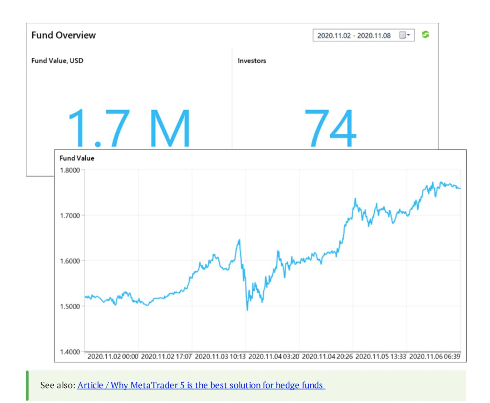

## <span id="page-286-0"></span>**Create charts reflecting funds performance.**

For each fund, you should create three financial instruments, to display net asset value [\(NAV\)](#page-296-0), [assets](#page-296-1) under [management](#page-296-1) (AUM) and fund [performance](#page-296-2) charts. In the future, NAV displaying symbols will also be used for buying shares. It will be possible to invest by simply opening a regular trading position via the client terminal.

Add a separate funds section under the **Symbols** section and create financial instruments. They do not require any specific settings.

| Label                          | Value                                   |
|--------------------------------|-----------------------------------------|
| File                           | -X-Disconnect                           |
| Edit                           | φ Refresh                               |
| View                           |                                         |
| <b>Services</b>                |                                         |
| Help                           |                                         |
|                                |                                         |
|                                |                                         |
|                                |                                         |
|                                |                                         |
|                                |                                         |
|                                |                                         |
|                                |                                         |
| Time                           | □ ⊛ Time                                |
| Holidays                       | □ ⊛ Holidays                            |
| Groups (691)                   | 由 8 Groups (691)                        |
| Clients & Accounts             | के <u>श</u> Clients & Accounts          |
| Common                         | Common                                  |
| Orders & Deals                 | <b>A</b> C Orders & Deals               |
| Gateways<br>ம் - வி Data Feeds | <b>E</b> Gateways<br>ம் - வி Data Feeds |
| Plugins                        | <b>E</b> ∩ Plugins                      |
| Reports                        | 由 <b>G</b> Reports                      |
| ECN                            | 中…                                      |
| Routing                        | $→ +$ Routing                           |
| Funds & ETF                    | $μm$ Funds & ETF                        |
| ISIN                           | ISIN:                                   |
| Sector                         | Sector:                                 |
| Industry                       | Industry:                               |
| Country                        | Country:                                |
| Category                       | Category:                               |
| Page                           | Page:                                   |
| Market depth                   | off                                     |
| Chart mode                     | by last price                           |
| Spread balance                 | = 0 bid / 0 ask                         |
| Background                     | None                                    |
| Digits                         | 4                                       |
| Export Co                      | H ∩ C Export Co                         |
| Page                           |                                         |
| Import Co                      | In G Import Co                          |
| Spread                         | off                                     |
| rt                             | ℗pt                                     |
| Chart mode                     | by last price                           |
| Spread balance                 | = 0 bid / 0 ask                         |
|                                |                                         |
| Add, Ctrl+N                    | ⁺ (a) Refresh                           |

## **Create funds and configure general settings**

Create a configuration for each fund under the **Funds and ETF** section:

| MetaQuotes - MetaTrader 5 Administrator                                                              |                                |                                                                                      |                | □                     | $×$             |
|------------------------------------------------------------------------------------------------------|--------------------------------|--------------------------------------------------------------------------------------|----------------|-----------------------|-----------------|
| File<br>Edit<br>View<br><b>Services</b>                                                              | Help                           |                                                                                      |                |                       |                 |
| $\left\{ \mathbf{\Omega} \right\}$ <b>Refresh</b> $\left\{ \right\}$ Restart Server<br>-X-Disconnect |                                | $\mathcal{C}$ Export $\mathcal{C}$ Import $\mathcal{C}$ Apply $+$ $\otimes$ $\times$ |                | $\downarrow_2^A$ Sort | $\uparrow$<br>J |
| Data Feeds                                                                                           | Name                           | Type                                                                                 | Symbol         | Manager               |                 |
| <sup>1</sup> Plugins<br>国…                                                                           | Den-end Control Planck Company |                                                                                      | <b>ENTHIGH</b> | 1863, John Smith      |                 |
| Reports                                                                                              | Funds & ETF                    |                                                                                      |                |                       | $\times$<br>п   |
| ECN                                                                                                  |                                |                                                                                      |                |                       |                 |
| $\rightarrow$ <sup>4</sup> Routing                                                                   | Common Fees<br>Tr.             |                                                                                      |                |                       |                 |
| $\frac{1}{2}$ Funds & ETF                                                                            |                                | Please set up your fund settings.                                                    |                |                       |                 |
| Symbols (87389)                                                                                      | \$                             |                                                                                      |                |                       |                 |
| $\mathbf{w}$ Spreads                                                                                 |                                | ⊡ Enable                                                                             |                |                       |                 |
| Charts & Ticks<br><b>E</b> . ① Subscriptions                                                         |                                |                                                                                      |                |                       |                 |
| <b>S</b> Live Update                                                                                 | Name:                          | ENTHIGH - Entropy Player High Risk                                                   |                |                       |                 |
| <b>E</b> Support Center                                                                              | Symbol:                        | <b>ENTHIGH NAV</b>                                                                   |                |                       |                 |
| $\mathbb{E}$ News                                                                                    | Assets symbol:                 | <b>ENTHIGH Assets</b>                                                                |                | $\checkmark$          |                 |
| Articles                                                                                             | Performance symbol:            | <b>ENTHIGH Performance</b>                                                           |                | $\checkmark$          |                 |
| <b>Platform Documentation</b><br>TЧ                                                                  |                                |                                                                                      |                |                       |                 |
| API Documentation                                                                                    | Trade server:                  | Trade Main, 1                                                                        |                | $\checkmark$          |                 |
| <b>B</b> Workshops                                                                                   | Manager:                       | 1863, John Smith                                                                     |                | $\checkmark$          |                 |
| Certification                                                                                        |                                |                                                                                      |                |                       |                 |
| For Help, press F1                                                                                   | Recalculation:                 | Every minute                                                                         |                |                       |                 |
|                                                                                                      | Type:                          | Open-end                                                                             |                |                       |                 |
|                                                                                                      | Period:                        | 2018.01.01<br>2020.01.01                                                             |                |                       |                 |
|                                                                                                      |                                |                                                                                      |                |                       |                 |
|                                                                                                      | Maximum capital:               | 100 000 000                                                                          | <b>USD</b>     |                       |                 |
|                                                                                                      | Maximum investors:             | 50                                                                                   |                |                       |                 |
|                                                                                                      |                                | Recalculate<br>Reset                                                                 | OK             | Cancel                | Help            |

Set up the following parameters under the **Common** section:

- ·**Name** — the fund name.
- ·**Symbol** — the name of the trading symbol, in which the [NAV](#page-296-0) will be reflected.
- ·**Assets symbol** — the name of the trading symbol, in which a change in the [AUM](#page-296-1) will be shown.
- ·**Performance symbol** — the name of the trading symbol, which willreflect the fund [performance](#page-296-2) chart.
- · **Trade server** — the trade server, on which the fund will be managed. Only accounts opened on the selected server can be used to created [investors](#page-293-0) and fund [managers.](#page-292-0) They can't be created on different servers.

- · **Administrating manager** — the account of the manager, who will administer the fund. The field is currently not used. In the future, the field will be used to grant separate permissions to access the fund reports, as well as to change the lists of investors and managers.
- <span id="page-288-0"></span>· **Recalculation** — fund charts [calculation](#page-296-3) mode:
  - · **Every minute** — the fund chart is recalculated every minute, after which appropriate quotes are added to the symbols' price stream.
  - · **Every hour** — the fund chart is recalculated every hour, after which appropriate quotes are added to the symbols' price stream.
  - · **Daily** — the fund chart is recalculated at the end of each trading session, after which appropriate quotes are added to the symbols' price stream.
  - · **Manually** — the platform does not calculate fund performance variables and does not generate charts. This mode should be used when broadcasting fund data from external sources via gateways or data feeds.
- · **Type** — fund type:
  - · **Open-end** — the shares of such a fund can be purchased or sold at any day. The assets of the fund can be freely increased or decreased.
  - · **Closed-end** — unlike the previous type, the capital of such a fund can't be changed. The fund issues a limited number of shares, which will not change in the future.
- · **Period** — the fund lifetime. The platform performs any operations concerning the fund (such as calculations, charting, fee charging) only within the specified period.
- · **Maximum capital** — the maximum allowable amount of investments within the fund. Investors and their shares are managed under a [separate](#page-293-0) section of fund settings. When the investment amount reaches the specified value, the platform will prevent from further adding of new investors or from increase of shares of existing investors.
- <span id="page-288-1"></span>· **Currency** — the currency in which allthe fund variables are calculated: prices, commissions, etc. For example, AUM (Assets under Management) is calculated based on the funds on trading [accounts.](#page-292-0) If the trading account deposit currency is GBP, while the fund currency is USD, the funds will be converted at the current GBPUSD rate when calculating AUM.
- · **Maximum investors** — the maximum number of investors who can purchase the fund shares (specified under a [separate](#page-293-0) section of fund settings).

#### **Configure payments and fees**

The MetaTrader 5 trading platform enables the automation of all calculations concerning the fund: management fees and payments of returns.

Before configuring payments, you should create a separate trading account for each fund: allrelevant payments will be performed in this account (Fees account). It is recommended to create a separate group for such

accounts, while this enables more convenient work with accounts (including granting of appropriate access permissions to managers).

| MetaQuotes - MetaTrader 5 Administrator     |                                                 |                                                 |
|---------------------------------------------|-------------------------------------------------|-------------------------------------------------|
| File<br>Edit<br>Services<br>View            | Help                                            |                                                 |
| <p></p>                                     |                                                 |                                                 |
| <p>● Security</p>                           |                                                 |                                                 |
| Time                                        | ◯                                               |                                                 |
| Holidays                                    | ○                                               |                                                 |
| Groups (691)                                | Preferred Login: next                           |                                                 |
| Clients & Accounts                          | Enter the client id, name or contacts to search |                                                 |
| Allocations                                 | Group: funds                                    |                                                 |
| Clients                                     | <p>½ Clients</p>                                |                                                 |
| Managers                                    | Existing Client:                                | Enter the client id, name or contacts to search |
| Trading Accounts                            | First name: Account for fund fees               |                                                 |
| Orders & Deals                              |                                                 |                                                 |
| Gateways                                    | Last name:                                      |                                                 |
| Data Feeds                                  | Middle name:                                    |                                                 |
| Plugins                                     | Company: ABC Hedge Fund                         |                                                 |
| Reports                                     |                                                 |                                                 |
| ECN                                         | Routing: 4/3                                    |                                                 |
| Symbols (87389)                             |                                                 |                                                 |
| For Help, press F1                          |                                                 |                                                 |
| Country:                                    | <b>United States</b>                            |                                                 |
| Zip code:                                   | 123456                                          |                                                 |
| State:                                      | New York                                        |                                                 |
| City:                                       | New York                                        |                                                 |
| Address:                                    |                                                 |                                                 |
| <button>OK</button> <button>Cancel</button> |                                                 |                                                 |

#### <span id="page-289-0"></span>**Management fees**

The company which manages the fund, charges investors a certain fee for the services. This is usually equalto a percentage of the [NAV](#page-296-1). This is referred to as the management fees. Allrelevant calculation parameters are specified under the fund's **Fees** section:

- · **Distribution** — fee distribution mode. If Automatic, the fee will be calculated by the platform. The Report mode enables manual calculation using external data.
- ·**Period** — fee calculation and distribution frequency: daily, monthly, quarterly or yearly.
- <span id="page-289-1"></span>·**Fees account** — a specialtrading account, to which fund management fees will be credited.
- · **Management fee** — the fund management fee as a percentage of [AUM.](#page-296-1) The calculation can also be based on assets values as of the beginning of the calculation period, end of period, or as an average value over a period. For example, if you select quarterly or period beginning calculation, the specified percentage will be calculated based on AUM as of the end of the previous quarter.

| Funds & ETF      | $\Box$ |
|------------------|--------|
| Fees             |        |
| Trading Accounts |        |
| Investors        |        |

Please set up fees of your fund.

| Distribution: | Automatic |
|---------------|-----------|
|---------------|-----------|

| Period: | Monthly |
|---------|---------|
|---------|---------|

| Fees account: | 17782523 |
|---------------|----------|
|---------------|----------|

| Management fee: | 1.5   p.a.%   Assets calculated at the end of period |
|-----------------|------------------------------------------------------|
|-----------------|------------------------------------------------------|

| Success fee: | 20.0   p.a.%   Before management fee |
|--------------|--------------------------------------|
|--------------|--------------------------------------|

| Calculation: | Soft, based on the entire return |
|--------------|----------------------------------|
|--------------|----------------------------------|

| High water mark: | For all period |
|------------------|----------------|
|------------------|----------------|

| Hurdle rate: | 3.0   p.a.% |
|--------------|-------------|
|--------------|-------------|

|--|--|

|--|--|

| Recalculate |  |
|-------------|--|
| Reset       |  |
| OK          |  |
| Cancel      |  |

| Help |
|------|
|------|

Management Fee is calculated using the following formula:

#### Management Fee = (Fund Equity \* Days \* Management Fee Percent/100)/365

where:

- ·'Fund Equity' is the fund value at the time of calculation
- ·'Days' is the calculation period
- ·'Management Fee Percent' is the management fee in percent

On a selected basis, the platform will calculate the management fees and willtransfer the relevant amount to the special account, which is specified in the fund settings (Fees account). The accrual is performed as a balance operation of Commission type, with a comment "MF '[Fund Name]'". For example, "MF 'ENTHIGH'".

The fees account balance is taken into account when [calculating](#page-296-3) fund values, including its AUM. Actually, each management fee transfer reduces the fund's AUM by an appropriate amount. Nothing is deducted from [investor](#page-293-0) [accounts](#page-293-0).

#### <span id="page-290-0"></span>**Success fee**

In the case of successfulfund management (profitable trading), the company may charge an additionalfee, the so-called Success fee. If during the selected period the AUM value increases by the amount, which is equalto or exceeds the threshold value (Hurdle rate), additional commission will be deducted from the fees account. All related calculation parameters are specified under the **Fees** section.

- ·Distribution, Period, Fees accounts — these parameters are common for [management](#page-289-0) fee and access fee.
- · Success fee — fee as a percentage of the totalreturns for the current period or of the profit above the Hurdle Rate (defined in the Calculation box). The returns are determined separately for each share. Actually, it is performed by the position on the [investor](#page-293-0) account. The success fee calculation mode is also specified here: before or after management fee calculation. The management fee affects the AUM value, which is taken into account during performance calculation. Therefore the success fee value is affected by its calculation time.
- · Calculation — determines the amount based on which success fee will be calculated: the total yield amount for the current period or the amount above the hurdle rate.
- · High water mark — the fund management success can be determined using different methods. Currently only the most popular method is supported in the platform: High water mark. In accordance with this method, management in the calculation period is considered successful if the increase per share (positions on the investor account) exceeds the hurdle rate. You can select how the excess shall be determined: over the entire fund management period, the last year or the last quarter.
- · Hurdle rate is the threshold rate of return. If exceeded during the selected period (specified in "High water mark"), the fund management is considered successful and a commission fee will be charged.

The calculated success fee is deducted from investor accounts as a balance operation of "Commission" type with a comment "SF '[Fund Name]'". For example, "SF 'ENTHIGH'". Further this amount is transferred to the [Fees](#page-289-1) [account](#page-289-1) as a Commission operation. A comment for this operation is specified as "SF '[Fund Name]'-'[Investor account from which the commission has been debited]'". For example, "SF 'ENTHIGH'-'1235966'".

For each position on investor accounts, the platform performs the following actions:

- · Determines the Hurdle rate of the share (position): Maximum share value (NAV) over the High water mark period + NAV Hurdle Rate. The platform calculates the maximum position value over the entire time, over the last year or over the last quarter, depending on the **High water mark** parameter. The position value is calculated as volume multiplied by [NAV](#page-296-0), its maximum value is searched in the price history of the appropriate symbol. Then Hurdle rate percentage of this amount is calculated and added to the total value.
- · Then the platform checks if share profit exceeded the hurdle rate: NAV at the end of the period – Hurdle rate. It means that the platform uses the position value as at the calculation time (before or after charging the management fee) and deducts the hurdle rate calculated at the previous stage, from the position value.
- · The share value (NAV) is determined: NAV at the end of the period – Maximum NAV over the High water mark period. The values are calculated as shown in previous points.
- · If the share profit is negative (loss), zero, or it does not exceed the Hurdle Rate, the success fee is not charged.
- · If the share profit exceeds the Hurdle Rate, the success fee is calculated in accordance with the Calculation field value:

- ·Soft: Profit per share \* Success fee. The fee is calculated as percentage of share profit calculated above.
- · Hard: Profit beyond the Hurdle Rate \* Success fee.
  - · The Fees account balance is taken into account when calculating the [AUM.](#page-296-1) Thus, charging of any management fees reduces the AUM value.
  - · Use a separate trading account for each fund's Fees account. Do not perform any other operations on this account.

#### <span id="page-292-0"></span>**Set up trading accounts for fund managers**

Common trading accounts are used for managing invested funds. You distribute funds between these accounts and then the managers connect to these accounts and perform trading operations.

Create a separate trading account for each of the fund trading managers. It is recommended to create a separate group for such accounts, while this enables more convenient work with the accounts (for example, generation of relevant reports). Then transfer the investors' funds to these accounts, for example, by performing balance operations using the Manager terminal.

Once you have prepared the accounts, specify them in the fund settings, under the **Trading Accounts** section:

| Funds & ETF                  |                                              |                       |                   | H                 | × |
|------------------------------|----------------------------------------------|-----------------------|-------------------|-------------------|---|
| Common                       | Fees                                         |                       |                   |                   |   |
| Trading Accounts             | Investors                                    |                       |                   |                   |   |
|                              | Please set up trading accounts of your fund. |                       |                   |                   |   |
|                              | Login                                        | Name                  | Balance           | Equity            |   |
|                              | 17368650                                     | Entropy High Trader 1 | 18 000 000.00 USD | 18 546 000.00 USD |   |
|                              | 17368661                                     | Entropy High Trader 2 | 17 000 000.00 USD | 17 860 000.00 USD |   |
|                              | 17368677                                     | Entropy High Trader 3 | 15 000 000.00 USD | 15 768 550.00 USD |   |
|                              |                                              |                       | 50 000 000.00 USD | 52 174 550.00 USD |   |
| Add<br>Edit<br><b>Delete</b> |                                              |                       |                   |                   |   |
|                              |                                              | Recalculate           | <b>OK</b>         | Reset             |   |

The current balances and equity amounts will be instantly shown for each of the manager accounts.

The [current](#page-296-3) fund AUM value is calculated based on the equity amounts available on the trading manager accounts.

#### <span id="page-293-0"></span>**Set the investors**

The fund investors are also managed using trading accounts.

Create a separate trading account for each investors. It is recommended to create a separate group for such accounts. Make sure to use hedging position accounting for an investor group. Once the investor deposits the required funds, distribute them between the trading accounts of the trading [managers.](#page-292-0)

Next, to allocate a share, open on the investor's account a long trading position for the fund [symbol;](#page-286-0) the position size should be equalto the relevant share. For example, if the share size is 1000, then the position size on the investor's account should be 1000 lots (provided that the symbol contract size is 1).

Thus, the investor will be able to monitor their investments by connecting to the trading account via the client terminal. The investor will have access to three fund [charts](#page-296-3), as well as to their share state, which is displayed as a trading position. The trading position state will be updated in accordance with the current totalfund value (the update frequency depends on the [Recalculation](#page-288-0) parameter).

| <b>Symbol:</b>            | ENTLOW                |
|---------------------------|-----------------------|
| <b>Type:</b>              | Market Order          |
| <b>Volume:</b>            | 10.00000000           |
| <b>Fill Policy:</b>       | Return                |
| <b>At Price:</b>          | 1975.8158             |
| <b>Stop Loss:</b>         | 0.0000                |
| <b>Take Profit:</b>       | 0.0000                |
| <b>Comment:</b>           |                       |
| <b>Additional Values:</b> | 1981.8558 / 1981.8558 |
| <b>Additional Values:</b> | 1974.5235             |
| <b>Sell at:</b>           | 1975.8158             |
| <b>Buy at:</b>            | 1975.8158             |
| <b>Additional Values:</b> | 1973.6915             |
| <b>Additional Values:</b> | 1972.8335             |
| <b>Additional Values:</b> | 1972.0015             |
| <b>Date:</b>              | 2021.04.23            |

To open positions on investor accounts, use the Manager terminal:

If there are no prices for the fund yet, drop the first price into the stream, otherwise an attempt to open a position will cause the terminalto display the "no prices" error. Once allthe shares have been allocated and the relevant funds have been added to the fund managers' accounts, the prices will be calculated automatically.

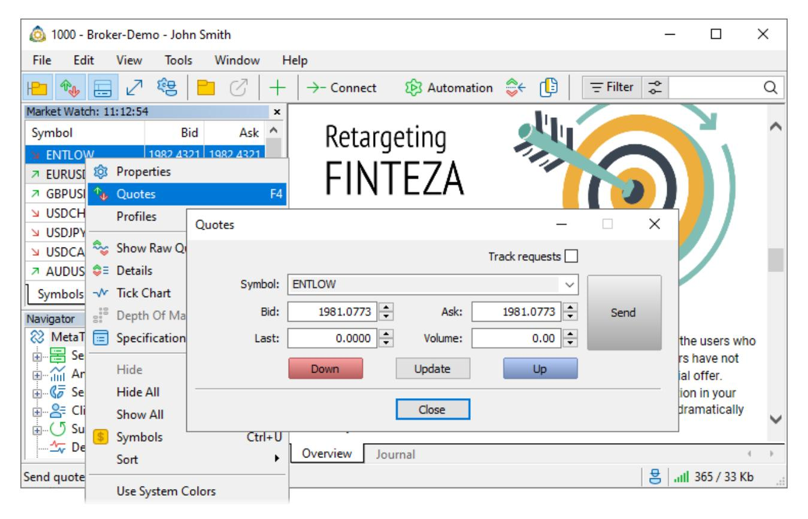

Once you have prepared the accounts, specify them in the fund settings, under the **Investors** section:

| Funds & ETF                  |        |                                       |                |                     |                  | $\Box$        | × |           |
|------------------------------|--------|---------------------------------------|----------------|---------------------|------------------|---------------|---|-----------|
| Common                       | Fees   | <b>Trading Accounts Investors</b>     |                |                     |                  |               |   |           |
|                              |        | Please set up investors of your fund. |                |                     |                  |               |   |           |
|                              | Login  |                                       | Name           |                     |                  | Shares        |   |           |
|                              | 943907 |                                       | Mitchell David |                     |                  | 2.48          |   |           |
|                              | 943908 |                                       | Walker Jose    |                     |                  | 4.91          |   |           |
|                              | 943909 |                                       | James Jose     |                     |                  | 8.18          |   |           |
|                              | 943910 |                                       | Martin Dominic |                     |                  | 3.68<br>19.25 |   |           |
|                              |        | 943907, Mitchell David                |                |                     |                  |               | ? | ×         |
|                              |        | <b>Ticket</b>                         | Volume         | Price               | Time             |               |   | Value     |
|                              |        | 日 14270859                            | 2.48           | 1.06765             | 2019.10.23 16:30 |               |   | 20,285.35 |
|                              |        | <b>HWM</b>                            | 2.48           | 1.06976             | 2019.10.07 23:19 |               |   | 20,325.45 |
| Add<br>Edit<br><b>Delete</b> |        |                                       |                |                     |                  |               |   |           |
|                              |        |                                       |                | <b>OK</b><br>Cancel |                  |               |   |           |

By clicking on the investor name you can view the current state of the investor's share (position). Also, maximum share value (High water mark) over the current [calculation](#page-288-0) period is shown for each share.

The volume of shares is calculated only for positions which are opened for the symbol corresponding to the current fund. No other positions opened on these accounts are taken into account in this section.

### **Allocation of additional shares**

If you need to allocate additional shares within an already running fund, please pay attention to the following:

- · After allocating shares for new investors (opening positions on their accounts) and adding investors to the list, do not forget to distribute their invested funds between relevant managers' accounts. Otherwise, the NAV chart will be incorrect as the number of units has increased, while the management funds have not. Funds are distributed between managers at your discretion.
- · To avoid incorrect NAV values before you distribute funds between manager accounts, you can temporarily disable the fund. This will pause the calculation of charts. After completing the setup, turn the fund back on.
- · If incorrect prices were still added to the fund charts, you can delete such prices via the **1 Minute History Chars** and **Bid/Ask/Last Ticks** sections.

### <span id="page-296-3"></span>**Assets under management, Net asset value, the NAV chart**

The trading platform allows tracking the fund yield dynamics in realtime, similarly to tracking of common symbol quotes.

As described above, ordinary trading [instruments](#page-286-0) are created for the fund. The platform automatically records the changes in net asset value (NAV), assets under management (AUM) and profitability into the price history of these symbols.

These charts are calculated at intervals, specified in the [Recalculation](#page-288-0) field. After each calculation, a quote with the appropriate fund value is added to the symbols' price history.

#### <span id="page-296-1"></span>**Assets under management (AUM)**

Fund AUM value is used for calculating [management](#page-289-0) fees and [commission](#page-290-0) fees, as well as for calculating other fund charts. It is calculated according to the following formula:

(The total amount of equity on the fund's trading accounts – Management fee)

The platform calculates the total amount of equity on alltrading [accounts](#page-292-0) of the fund and subtracts from the resulting value the management fee amount. The trading account deposit currency differing from the [fund](#page-288-1) [currency](#page-288-1) is converted at the current rate.

#### <span id="page-296-0"></span>**Net asset value (NAV)**

The value is calculated according to the following formula:

#### AUM / Number of fund shares

AUM value calculated by the previous formula is divided by the current [number](#page-293-0) of shares allocated by the fund to its investors.

#### <span id="page-296-2"></span>**Fund performance**

The value is calculated according to the following formula:

#### Previous-period Performance + log(Current-period AUM / Previous-period AUM)

where:

- · Previous-period Performance — for the first value on the chart this formula element is ignored. For the first period, the previous period performance will be zero.
- ·Current-period AUM is calculated according to the AUM formula specified above.
- · Previous-period AUM is also calculated according to the above AUM formula, but for the previous period. The amount of funds deposited during the calculation period is added to this value (the money [distributed](#page-292-0) at the beginning of the calculation period between managers).

Period refers to the chart calculation periodicity, specified in the [Recalculation](#page-288-0) field. If charts are recalculated once a minute, the previous period is equalto the previous minute.

### **Resetting the fund state**

The fund state can be reset using two commands in the settings dialog:

- · Recalculation — fullrecalculation of fund charts: NAV, AUM and performance. The platform reproduces the entire fund history based on manager and investor accounts: investment operations, share purchases, and other operations. The graph history is calculated and recorded based on this data.
- · Reset — resetting accumulated statistics used for the calculation of fund parameters, including commissions. Use this option if you need to restart the fund and exclude previously accumulated values from further calculations. For example, this operation may be needed after testing.

Use these commands with caution. Deleted values can't be recovered.

## <span id="page-298-0"></span>**Built-in ECN**

Brokers can implement their own ECN (Electronic Communication Network) in the MetaTrader 5 trading platform. Use the ECN to provide liquidity alongside the best execution prices for your clients. You can additionally profit from order matching and markups. Using the built-in ECN functionality, you can become a fullfledged liquidity provider for other companies and implement your own trading facilities.

MetaTrader5-based ECN implementation does not require much time and money. Liquidity providers can be easily connected to the network via gateways. Using the ready-made MetaTrader 5 — [MetaTrader](https://support.metaquotes.net/en/market/product/267) 4 and [MetaTrader](https://support.metaquotes.net/en/market/product/266) 5 — MetaTrader 5 gateways, you can connect any broker to the ECN via a regular trading account. Deploy the ECN without complicated pre-integration procedures.

The ECN configuration consists of a few simple steps:

- 1. Enable ECN
- 2. Create and configure financial instruments, including the minimum spread for order book aggregation
- 3. Configure quote sources and markups
- 4. Configure routing of trade requests to the ECN for processing
- 5. Configure trade request processing and matching rules

### **Enable ECN**

Firstly, you should enable the ECN module in the platform:

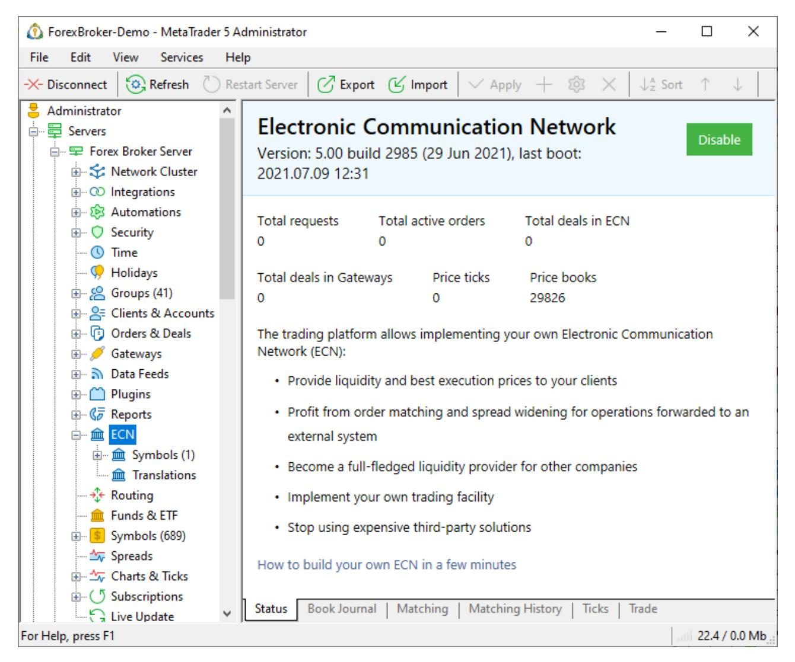

The general system operation statistics are displayed here, such as the number of matched orders, and generated ticks.

## **Create financial instruments for liquidity aggregation**

Select symbols to aggregate liquidity from different providers in your platform. We recommend [creating](#page-201-0) a separate set of instruments for [aggregation,](#page-201-0) though you can also use existing ones. However, note that current positions for these instruments will be processed via ECN instead of the previously used liquidity providers.

For operation convenience, create ECN symbols in a special subgroup and use specific names. For example, you can create a ECN group and add symbols with the suffix .ECN to it, such as EURUSD.ECN and GBPUSD.ECN. You can use any suffixes provided they are clear to you and your traders. Such symbol preparation will enable efficient operation in the future.

These recommended trading symbol usage principles also apply to gateways without the ECN. For example, if you use the Currenex and LMAX gateways, you should create a set of symbols with meaningful suffixes for each of them, for example, EURUSD.CNX and GBPUSD.LMX. This provides better control over data sources as compared to price feeding to general symbols. The properly suffixed names also enable the allocation of different liquidity access permissions to traders by specifying relevant symbol masks in group settings.

Then add the created symbols to the ECN:

|                                          | ForexBroker-Demo - MetaTrader 5 Administrator                                        |                                                                         |                                                               |                         |                                                | □          | ×                     |
|------------------------------------------|--------------------------------------------------------------------------------------|-------------------------------------------------------------------------|---------------------------------------------------------------|-------------------------|------------------------------------------------|------------|-----------------------|
| File<br>Edit<br>View                     | <b>Services</b><br>Help                                                              |                                                                         |                                                               |                         |                                                |            |                       |
| -X-Disconnect                            | $\left\{ \varphi\right\}$ <b>Refresh</b> $\left\langle \right\rangle$ Restart Server |                                                                         | $\oslash$ Export $\left\lfloor \swarrow \right\rfloor$ Import | $\vee$ Apply $+$<br>503 | $\downarrow^{\mathbb{A}}_{z}$ Sort<br>$\times$ | ↑<br>J     |                       |
| 由 <b>G</b> Reports                       |                                                                                      | Symbol                                                                  |                                                               | Description             | Add                                            | $Ctrl + N$ |                       |
| 白 血 ECN                                  |                                                                                      | <b>EURUSD.ECN</b>                                                       |                                                               | Euro vs US Dollar       | Edit<br>íÒ.                                    | $Ctrl + U$ |                       |
|                                          | 白 俞 Symbols (1)<br>$\leftarrow$ S ECN (1)                                            |                                                                         |                                                               |                         | $\times$ Delete                                | $Ctrl + D$ |                       |
| mш<br>$\rightarrow \epsilon$ Rou         | ECN Symbol: EURUSD.ECN                                                               |                                                                         |                                                               |                         | ?                                              | $\times$   |                       |
| mi Fun                                   |                                                                                      | Common                                                                  |                                                               |                         |                                                |            |                       |
| $$$ Sym<br>$+$                           |                                                                                      |                                                                         |                                                               |                         |                                                |            |                       |
| $-\frac{A_{\nabla}}{2}$ Spre             |                                                                                      | Please setup the name and parameters of a symbol to be used in the ECN. |                                                               |                         |                                                |            |                       |
| 由 文 Cha                                  |                                                                                      |                                                                         |                                                               |                         |                                                |            |                       |
| <b>面 ○ Sub</b><br>$\Box$ $\bigcirc$ Live | Symbol:                                                                              | EURUSD.ECN, Euro vs US Dollar                                           |                                                               |                         |                                                |            |                       |
| <b>E</b> Q Support Cer                   |                                                                                      |                                                                         |                                                               |                         |                                                |            |                       |
| <b>App Store</b>                         | Min Spread:                                                                          | off<br>pt                                                               |                                                               |                         |                                                |            |                       |
| Platforn                                 |                                                                                      | Allow to change best prices by client orders                            |                                                               |                         |                                                |            |                       |
| Aggregi                                  |                                                                                      | Send last deal prices to quotes stream                                  |                                                               |                         |                                                |            |                       |
| News ar                                  | History                                                                              |                                                                         |                                                               |                         |                                                |            |                       |
| White L                                  | Keep book:                                                                           | $\overline{2}$<br>days<br>$\checkmark$                                  |                                                               |                         |                                                |            |                       |
| Money                                    |                                                                                      |                                                                         |                                                               |                         |                                                |            |                       |
| Reportir                                 |                                                                                      | Limit and Take Profit orders activation                                 |                                                               |                         |                                                |            |                       |
| <b>Risk Ma</b>                           | Mode:                                                                                | Limit<br>$\checkmark$                                                   |                                                               |                         |                                                |            |                       |
| Add, Ctrl+N                              | Timeout:                                                                             | 5000                                                                    | milliseconds                                                  |                         |                                                |            | $\mathsf{Ab}_{\dots}$ |
|                                          |                                                                                      |                                                                         |                                                               |                         |                                                |            |                       |
|                                          |                                                                                      |                                                                         |                                                               | OK                      | Cancel                                         | Help       |                       |

Specify common symbol settings: minimum spread, history storage, and limit order activation mode.

See also: [Documentation](https://support.metaquotes.net/en/docs/mt5/platform/administration/ecn/ecn_dom_aggregation) / Platform / Platform settings / ECN / Forming Market Depth

## **Configure liquidity providers: you can select any MetaTrader brokers**

The ECN enables aggregation of price data from three source types: gateways, data feeds, and clients within the platform. The basic usage scenario implies connection of external systems via gateways. This is the standard integration method, which is used by many brokerage companies.

Ready-made provider connection solutions are available in the App [Store](#page-267-0). You can use the MetaTrader 5 — MetaTrader 4 and MetaTrader 5 — MetaTrader 5 gateways to connect any broker to the ECN via a regular trading account. Deploy the ECN without complicated pre-integration procedures.

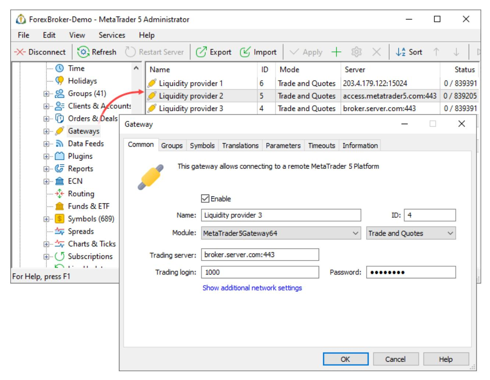

Configure appropriate translation [parameters](#page-248-0) to enable quote delivery to the aggregated ECN symbol order book. Specify the source symbolfrom an externaltrading system in the Source field and the target ECN symbol which will be receiving quotes in the Symbolfield. Configure these settings for allrequired symbols and gateways.

| Gateway                      |                                                                                                                                                                                                                                                                      |               |        |             |
|------------------------------|----------------------------------------------------------------------------------------------------------------------------------------------------------------------------------------------------------------------------------------------------------------------|---------------|--------|-------------|
| Groups<br>Common             | Translations<br><b>Parameters</b><br>Symbols                                                                                                                                                                                                                         | Timeouts      |        |             |
|                              | If necessary, please specify parameters for converting data transmitted through the<br>gateway: name of the source symbol in the external system and value of correction of<br>incoming prices. If any of the parameters is not set, its source values will be used. |               |        |             |
| <b>Up</b>                    | Symbol                                                                                                                                                                                                                                                               | Source        | Bid    | Ask         |
| Down                         | AUDUSD.ECN                                                                                                                                                                                                                                                           | <b>AUDUSD</b> | -5     | 5           |
|                              | <b>EURUSD.ECN</b>                                                                                                                                                                                                                                                    | <b>EURUSD</b> | $-3$   | 3           |
|                              | <b>GBPUSD.ECN</b>                                                                                                                                                                                                                                                    | <b>GBPUSD</b> | $-4$   | 5           |
|                              | USDJPY.ECN                                                                                                                                                                                                                                                           | <b>USDJPY</b> | $-6$   | -6          |
| Add<br>Edit<br><b>Delete</b> |                                                                                                                                                                                                                                                                      |               |        |             |
|                              |                                                                                                                                                                                                                                                                      | <b>OK</b>     | Cancel | <b>Help</b> |

For example, the gateway delivers Market Depth prices for EURUSD. To enable accumulation of relevant data in the EURUSD.ECN Market Depth, the EURUSD – EURUSD.ECN translation rule should be added to the symbol setting. You can also specify markups, which is the difference between buying and selling prices for the quotes and deals executed via the gateway. Markups are used for earning additional profit from each trading operation. Allrequired price conversions will be performed automatically.

Price aggregation from data feeds can be configured in a similar way.

Next, you can specify advanced settings to process quotes received from gateways and data feeds. Each ECN symbol has specific price [rules](https://support.metaquotes.net/en/docs/mt5/platform/administration/ecn/ecn_dom_aggregation#price_rules), using which you can hide certain prices from the order book, mark them as illiquid or totally disable such prices.

| ECN Symbol: EURUSD.ECN |                                         |                                                                                                                                                             |                                                                                                                                  |                                    |           | ? |  |                     |   |
|------------------------|-----------------------------------------|-------------------------------------------------------------------------------------------------------------------------------------------------------------|----------------------------------------------------------------------------------------------------------------------------------|------------------------------------|-----------|---|--|---------------------|---|
| Price rules            |                                         | Common                                                                                                                                                      |                                                                                                                                  | Aggregation rules   Matching Rules |           |   |  |                     |   |
|                        |                                         | Depth of market of an ECN symbol is formed on the basis of market data received from liquidity providers. Please specify the rules for processing the data. |                                                                                                                                  |                                    |           |   |  |                     |   |
| Up                     |                                         | Name                                                                                                                                                        |                                                                                                                                  | Action                             |           |   |  |                     |   |
| <b>Down</b>            |                                         | <b>H</b> LMAX Sell Hide                                                                                                                                     |                                                                                                                                  | Reject price                       |           |   |  |                     |   |
|                        | H<br>E                                  | <b>Price Rule</b>                                                                                                                                           |                                                                                                                                  |                                    |           |   |  |                     | × |
| Add                    | أرمتتم أرمتتم أرمتم أرمتم أرمتتم أرمتته |                                                                                                                                                             | Using price rules, you can hide or completely delete price levels (orders) received from specific liquidity provider or clients. |                                    |           |   |  |                     |   |
|                        |                                         | Name:                                                                                                                                                       | <b>LMAX Sell Hide</b>                                                                                                            |                                    |           |   |  |                     |   |
| Edit                   |                                         |                                                                                                                                                             |                                                                                                                                  |                                    |           |   |  |                     |   |
| <b>Delete</b>          |                                         | Perform action:                                                                                                                                             | Reject price                                                                                                                     |                                    | ✓         |   |  |                     |   |
|                        |                                         | Where conditions are:                                                                                                                                       | Type                                                                                                                             |                                    | Condition |   |  | Value               |   |
|                        |                                         |                                                                                                                                                             | ab Gateway or datafeed                                                                                                           |                                    | Equal (=) |   |  | <b>LMAX Gateway</b> |   |
|                        |                                         | Add                                                                                                                                                         | 01 Type                                                                                                                          |                                    | Equal (=) |   |  | Sell                |   |
|                        |                                         | Edit<br>Delete                                                                                                                                              |                                                                                                                                  |                                    |           |   |  |                     |   |
|                        |                                         |                                                                                                                                                             |                                                                                                                                  | <b>OK</b>                          | Cancel    |   |  |                     |   |

For example, if you need to hide from the order book all sell orders from the LMAX gateway while retaining the ability to execute client orders using these prices, set the following rule:

- ·Action: Use the price as liquidity, without displaying it
- ·Conditions: Gateway or data feed = LMAXGateway, Type = Sell

See also: [Documentation](https://support.metaquotes.net/en/docs/mt5/platform/administration/ecn/ecn_dom_aggregation#price_rules) / Platform / Platform settings / ECN / Forming Market Depth / Configuring data [aggregation](https://support.metaquotes.net/en/docs/mt5/platform/administration/ecn/ecn_dom_aggregation#price_rules) from gateways and data feeds

#### **Price liquidity and Market Depth availability to clients**

The aggregated Depth of Market (order book) of an ECN symbol can contain two order types:

- · Liquid orders which can be used to match client orders. These include orders from the gateways which are connected to the ECN as a dealer and which are added to the matching rule, as well as orders from traders within the cluster. The utilized gateways must support ECN operation (which is available by default in MetaQuotes' liquidity gateways).
- · Illiquid orders, which can't be utilized in matching. These include prices from data feeds, as well as quotes from gateways which do not participate in matching.

Only liquid orders can form best prices in the order book for traders (Best Bid/Best Ask). If a price is illiquid and it is currently the best one among all prices, it will not be shown in the Market Depth for traders. In other words, illiquid prices are shown in the trader order book only if they are not the best. For further details please see [documentation.](https://support.metaquotes.net/en/docs/mt5/platform/administration/ecn/ecn_dom_aggregation#dom_clients)

The Market Depth level liquidity and visibility flags can be checked from the ECN \ Market Depth journal.

### **Configure trade request routing to the ECN**

To enable the aggregated order book for your clients, you should configure a routing rule, according to which their requests will be forwarded to the ECN:

| Routing: To ECN |                                                                                 |                                                                                                                                                             |             |           |                                     |
|-----------------|---------------------------------------------------------------------------------|-------------------------------------------------------------------------------------------------------------------------------------------------------------|-------------|-----------|-------------------------------------|
| Dealers         | Common                                                                          |                                                                                                                                                             |             |           |                                     |
|                 | Please specify dealers who will process requests that meet the rule conditions. |                                                                                                                                                             |             |           |                                     |
| Up              | Login                                                                           |                                                                                                                                                             |             |           |                                     |
| Down            | ECN                                                                             |                                                                                                                                                             |             |           |                                     |
|                 | ECN Dealer                                                                      |                                                                                                                                                             |             |           |                                     |
|                 | Routing: To ECN                                                                 |                                                                                                                                                             |             |           |                                     |
|                 | ×                                                                               |                                                                                                                                                             |             |           |                                     |
|                 | Common Dealers                                                                  |                                                                                                                                                             |             |           |                                     |
|                 |                                                                                 | Using routing rules, one can adjust processing of trade requests by different conditions. Please specify<br>conditions, for which the rule will be applied. |             |           |                                     |
|                 |                                                                                 | $$ Enable this rule                                                                                                                                       |             |           |                                     |
| Add             | Name:                                                                           | <b>To ECN</b>                                                                                                                                               |             |           |                                     |
| Edit            |                                                                                 | Perform action: Process to dealers                                                                                                                          | $$         |           | skip this rule if no dealers online |
| Delete          | Where request is:                                                               | All                                                                                                                                                         |             |           | $$                                 |
|                 | Where order is:                                                                 | All                                                                                                                                                         |             |           | $$                                 |
|                 | Where conditions are:                                                           | Type                                                                                                                                                        | Condition   |           | Value                               |
|                 |                                                                                 | ab Symbols                                                                                                                                                  | Equal $(=)$ |           | $ECN$ <sup>*</sup>                  |
|                 | Add                                                                             |                                                                                                                                                             |             |           |                                     |
|                 | Edit                                                                            |                                                                                                                                                             |             |           |                                     |
|                 | <b>Delete</b>                                                                   |                                                                                                                                                             |             |           |                                     |
|                 |                                                                                 |                                                                                                                                                             |             |           |                                     |
|                 |                                                                                 |                                                                                                                                                             |             | <b>OK</b> | Help<br>Cancel                      |

In common settings, specify the requests which should be forwarded to the ECN. For example, you may specify here allrequests for the ECN\\* symbol group. Select the "Process to dealers" action for these requests. The ECN should be selected in the **Dealers** tab.

All ECN operation settings are compliant with the usual platform processes. Using the routing rules, the ECN request processing can be set for some of the requests, while traditional processing methods (such as automatic processing, forwarding to dealers or external systems) can be selected for other requests.

Client orders forwarded to ECN matching are added to the aggregated order book of appropriate symbols as liquid price levels.

See also: [Documentation](https://support.metaquotes.net/en/docs/mt5/platform/administration/requests_routing) / Platform / Platform settings / Routing

### **Configure trading order matching rules**

Set up matching rules to enable client order processing via the ECN using the aggregated order book.

| Label                                                                                                   | Value              |
|---------------------------------------------------------------------------------------------------------|--------------------|
| ECN Symbol: EURUSD.ECN                                                                                  |                    |
| Common                                                                                                  |                    |
| Price rules   Aggregation rules                                                                         |                    |
| define selection and filling options.                                                                   |                    |
| Using matching rules, one can adjust processing of orders within ECN: choose liquidity providers,       |                    |
| Up                                                                                                      |                    |
| Name                                                                                                    |                    |
| Providers                                                                                               |                    |
| Down                                                                                                    |                    |
| MT5 to MT5                                                                                              |                    |
| MetaTrader 5 Cluster                                                                                    |                    |
| ECN Symbol                                                                                              |                    |
| ECN Symbol                                                                                              |                    |
| Conditions Providers Filling                                                                            |                    |
| providers.                                                                                              |                    |
| Please specify conditions that will be used to match orders from the MetaTrader 5 cluster and liquidity |                    |
| Switch                                                                                                  |                    |
| Enable this rule                                                                                        |                    |
| Name:                                                                                                   | MT5 to MT5         |
| Where order is:                                                                                         | All                |
| Where conditions are:                                                                                   |                    |
| Type                                                                                                    |                    |
| Condition                                                                                               |                    |
| Value                                                                                                   |                    |
| ab Group                                                                                                | Equal (=)          |
| 01 Volume                                                                                               | Less or equal (<=) |
| Add                                                                                                     |                    |
| Edit                                                                                                    |                    |
| Delete                                                                                                  |                    |
|                                                                                                         |                    |
|                                                                                                         |                    |

The rules provide an instruction of how to match orders:

- ·Specify order selection rules under the **Conditions** section, such as volume, client group, date, and time.
- · In Providers, specify the systems via which the orders will be executed. These may include your gateways, as well as the MetaTrader 5 cluster to match requests between your clients. The order of providers in the

list affects order processing. For example, if the MT5 provider is specified before the Currenex gateway, the ECN will match orders within the cluster, if possible. If a suitable counter order is not found, the system will match with external system orders.

·The **Filling** tab features advanced matching settings. They can be configured later.

#### **How the matching is performed**

The ECN maintains a list of orders waiting to be matched. The list is formed in accordance with the aforementioned routing rules. Orders are processed in a loop:

- ·The ECN picks up an order from the list, according to the type, price and creation time.
- ·Based on the matching rules, the ECN determines a suitable opposite order.
- · If a client order within your trading platform is used for matching, the ECN will execute appropriate deals in both accounts.
- · If an external system order is used for matching, the ECN willform and send an appropriate order to it via a gateway.

See also: [Documentation](https://support.metaquotes.net/en/docs/mt5/platform/administration/ecn/ecn_matching#settings) / Platform / Platform Settings / ECN / Order matching

This completes the basic ECN setup. Quotes from selected sources will be aggregated in the ECN symbol order books, the ECN will accept trade requests for these symbols and it will add client orders to the aggregated order book for further execution. Client orders will be matched with each other or executed in an external system via a gateway.

you can view the current order queue execution state in the ECN \ [Matching](https://support.metaquotes.net/en/docs/mt5/platform/administration/ecn/ecn_matching_history) section, and processed orders and deals (executed or rejected) in the ECN \ [Matching](https://support.metaquotes.net/en/docs/mt5/platform/administration/ecn/ecn_matching_history#history) history section.

### **Profit from markups and liquidity**

Using the ECN functionality, a broker can provide liquidity to other companies. The system supports price retranslation to different trading instruments with automatic conversion. Using this option you can set up different ECN trading conditions for different client groups.

Set re-translation rules under the **Translation** section: specify the ECN source symbol, the target symbol which willreceive the prices and the quote conversion amount.

| Label                                                                  | Value                         |
|------------------------------------------------------------------------|-------------------------------|
| File<br>Edit<br>View                                                   |                               |
| Services<br>Help                                                       |                               |
|                                                                        |                               |
|                                                                        |                               |
|                                                                        |                               |
| – Disconnect<br>Refresh<br>Restart Server<br>Export<br>Import<br>Apply |                               |
|                                                                        |                               |
| से 2 Clients & Accounts                                                |                               |
| 由 C Orders & Deals                                                     | \$ 1 *.USR                    |
| *.ECN                                                                  |                               |
|                                                                        |                               |
|                                                                        | -4                            |
| <b>E</b> Gateways                                                      | <b>MUSR2</b>                  |
| *.ECN                                                                  |                               |
|                                                                        | $-10$                         |
| 中心 hata Feeds                                                          |                               |
|                                                                        | ?                             |
| 由 <b>G</b> Reports                                                     |                               |
| 白 血 ECN                                                                | 请指定规则和标记以翻译ECN<br>价格到平台的其他符号。 |
| 白 俞 Symbols (17)                                                       |                               |
| 面 S ECN (17)                                                           | $▼$ Enable                    |
| illes for Translations                                                 | *.<br>Symbol:                 |
| — +्री← Routing                                                        | *.<br>Source:                 |
| <b>Example 1</b> Funds & ETF                                           |                               |
| \$Symbols (87389)<br>由…                                                | Bid markup:<br>$-4$           |
|                                                                        | Ask markup: 5                 |
| −\frac{A_{\overline{V}}}{\sqrt{V}}                                     |                               |
| 面 - <sup>人</sup> Charts & Ticks                                        |                               |
|                                                                        | <b>OK</b><br>Cancel           |
| <b>A</b> C Subscriptions                                               |                               |
| <b>S</b> Live Update                                                   |                               |
| For Help, press F1                                                     |                               |
|                                                                        | .ull 34.8 / 0.0 Mb            |

For example, you can implement a separate group of .USR symbols for selected customers: the symbols will contain aggregated order books of .ECN symbols converted by a certain markup amount. Specify a conversion rate from the source set of ECN symbols "\*.ECN -> \*.USR" with desired markup values, such as -4/+5. This will make you 4/5 profit points with each deal.

Orders of the translated \*.USR symbols will be added to the source \*.ECN symbol order books in accordance with the translation settings and they will be available for matching. The entire process will be implemented in the platform automatically, without extra settings. However, to add these orders to the re-translated .\*USR symbol order books, you should create the following aggregation rule:

| ECN Symbol: EURUSD.USR |                                                                                                                                                      |            |
|------------------------|------------------------------------------------------------------------------------------------------------------------------------------------------|------------|
| Price rules<br>Common  | Aggregation rules                                                                                                                                    |            |
| Matching Rules         |                                                                                                                                                      |            |
|                        |                                                                                                                                                      |            |
|                        |                                                                                                                                                      |            |
|                        |                                                                                                                                                      |            |
| Up                     | Depth of market of an ECN symbol can also include orders from your MetaTrader 5 cluster. Please specify the rules to be used to select such orders.  |            |
|                        |                                                                                                                                                      |            |
| Down                   | <b>Orders by EURUSD.USR</b>                                                                                                                          |            |
|                        |                                                                                                                                                      |            |
|                        | <b>Aggregation Rule</b>                                                                                                                              |            |
| Add<br>Edit            | Using aggregation rules, you can define, which orders from the MetaTrader 5 cluster should be used in building the depth of market of an ECN symbol. |            |
|                        |                                                                                                                                                      |            |
|                        |                                                                                                                                                      |            |
| <b>Delete</b>          | Bid markup: 0                                                                                                                                        |            |
|                        | Ask markup: 0                                                                                                                                        |            |
|                        | Where symbol is:                                                                                                                                     | EURUSD.USR |
|                        | Where order is:                                                                                                                                      | All        |
|                        | Where conditions are:                                                                                                                                | Type       |
|                        |                                                                                                                                                      |            |
|                        | Condition                                                                                                                                            |            |
|                        |                                                                                                                                                      |            |
|                        | Value                                                                                                                                                |            |

For example, the EURUSD.USR symbolreceives a EURUSD.ECN order book with a markup of -4/+5. To display client orders for this symbol in the EURUSD.USR order book, create the following rule:

- · Specify zero markups (0/0), because EURUSD.USR symbol users should see their initial price orders in the Market Depth.
- ·Specify the EURUSD.USR symbolto show the related orders in the order book.
- · Specify order types (All) and selection conditions, similar to the routing rule, to forward EURUSD.USR orders to the ECN.

If you also wish to display source symbol(.ECN) orders in the translated symbol order books, create similar aggregation rules with inverse markups (-5/4).

If you do not need re-translation to other instruments, you can configure markups for the original ECN symbols using this method. Specify them as a source and as a receiver in the rules.

There are some other markup configuration methods apart from translation settings:

· Minimum spread — automatic conversion of ECN Market Depth prices if the current spread as per data aggregated from different sources is less than the specified one.

- ·Gateways settings — adding markups when receiving prices from an external system.
- ·Group setting — adding markups when sending prices to a specific client group.

See also: [Documentation](https://support.metaquotes.net/en/docs/mt5/platform/administration/ecn/ecn_translation) / Platform / Platform settings / ECN / Price translations

### **Additional features and advanced settings**

This topic only covers the basic setup allowing you to quickly launch an ECN and view its capabilities. However, the system has many advanced settings and functions, which enable fine system adjustment for unique tasks and conditions:

- ·Order forwarding and execution modes
- ·Profitable and unprofitable slippage
- ·Aggregation conditions
- ·Order book control and other settings

Allfunctions are described in detail in the documentation.

## <span id="page-310-0"></span>**Subscriptions for additional trader services**

With the new Subscriptions service, you can expand your offerings and attract more clients.

- ·Fee-based high-quality market data from reputable vendors
- ·Personal manager services to help users in learning trading basics
- ·One-time services such as position transferring or currency conversion, and much more.

The MetaTrader 5 already includes a completely prepared infrastructure:

- · The product showcase will be available to all your traders. You set up products via the Administrator terminal and the subscriptions instantly appear in client terminals. It means that you will not have to additionally attract traders to your site.
- · Payment is made directly from a trading account. Traders can easily pay for the product, as they do not have to think which payment methods to use. The easy procedure can increase the probability of a successful purchase.
- · Automated delivery of market data and news. Traders start receiving the data immediately after purchasing a subscription. Once you set up the subscriptions, you do not need to perform any additional manual actions.
- · You maintain a single database. Information on subscriptions is linked to trading accounts in the platform. You can view the history of purchases and generate reports.

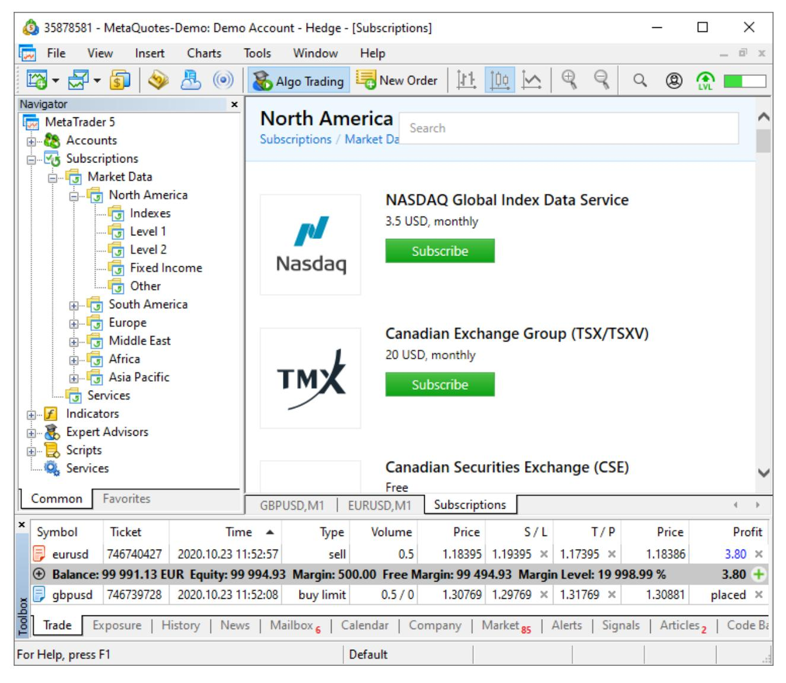

Start developing new paid products to boost your business success!

See also: Articles / Market data [subscriptions](https://support.metaquotes.net/en/articles/1014) in MetaTrader 5

#### **Subscription payments**

Subscription fees are paid directly from the trading account balance. Traders will not need to visit other websites, as payments will be made automatically within the platform.

A payment is deducted from the account as a balance operation of *commission* type. The following comment is added to the operation: Subscription 'Subscription name'.

To start receiving data, the trader purchases a subscription in the terminal:

- · At this moment, the appropriate amount is debited from the user's trading account balance (for paid subscriptions).
- ·An appropriate subscription record is created, indicating the subscription expiration date.

- · If automated renewal is enabled for a subscription, an attempt to deduct the appropriate amount from the account will be performed upon expiration. If the attempt is successful, the subscription willremain active.
- · If the required amount is not available on the account, the suspended status is set for the subscription. A repeated payment attempt will be made an hour later. Repeated attempts are made within a day. If a payment can't be made during this time, the subscription is canceled.

Since the payment is made from an account balance, subscriptions are only available for real and preliminary accounts.

#### **Creating a subscription**

Before setting up specific configurations, we recommend defining the service structure and creating appropriate categories. For example, "Market Data" and "Manager Services". Categories can be created using the context menu in the sections tree.

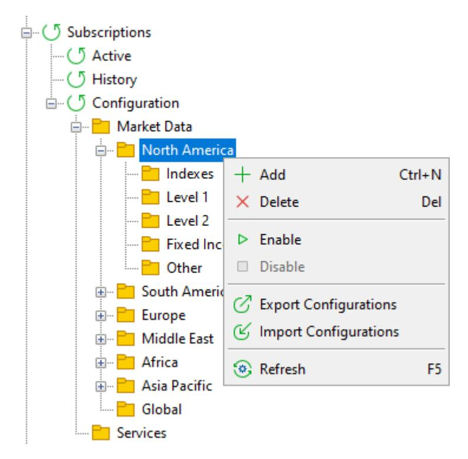

A convenient structure facilitates setup and management as well as increases service convenience for traders.

Next, we'll look at an example of creating a market data subscription. The full description of the service is available in the platform [documentation](https://support.metaquotes.net/en/docs/mt5/platform/administration/subscriptions).

#### **Why traders need market data**

Traders analyze markets and test strategies. They explore new securities, as diversification helps reduce the risks, execute more trading operations and improve the overall stability of trading results. With the Subscriptions service traders can access the required data out of the box.

Traders do not need to use third-party software, to learn MQL5 programming, or to load of data into custom symbols manually. The market data is provided through ordinary symbols, similarly to data provided by brokers for trading. Therefore, traders can use any standard analysis tools available in terminal as follows:

- ·View real-time quotes in Market Watch
- ·View charts and apply indicators or analytical objects
- ·Run Expert Advisors to simulate trading
- ·Test trading ideas in the strategy tester, perform optimization and mathematicaltasks
- ·Analyze prices using Python

These services will always be popular among traders, as they provide a ready-made toolfor expanded trading opportunities.

#### **Preparation**

Before you start offering market data to your traders, you should configure receiving of appropriate symbol data from liquidity providers. The process is similar to adding trading symbols available to traders in the platform:

- ·Create the [required](#page-201-0) symbols
- ·Configure [gateways](#page-226-0) or data feeds to receive data for these symbol
- · To start selling market data, you will need to sign an agreement with appropriate exchanges and trading systems, as the data is proprietary.
- · The support website App [Store](https://support.metaquotes.net/en/market/mt5/aggregation) features a variety of solutions enabling receiving of data from popular liquidity providers.

#### **Common subscription settings**

Create a new configuration in the **Subscriptions** \ **Settings** section. Set the service name, price and payment frequency in the main section. Choose a clear and understandable name for the service.

|                       | MetaQuotes - MetaTrader 5 Administrator |
|-----------------------|-----------------------------------------|
| -X-                   | Disconnect                              |
| <Refresh              | Refresh                                 |
| <b>Restart Server</b> |                                         |
| ⊘ Export              | ∕ Import                                |
| ∨ Apply               | +                                       |
| 503                   |                                         |

|  | Subscriptions |
|--|---------------|
|--|---------------|

| □ ○ Subscriptions |
|-------------------|
|-------------------|

|  | Name |
|--|------|
|--|------|

| ( ) | Active |
|-----|--------|
|-----|--------|

|  | NASDAQ Global Index Data Service |  |  |  |  | ⊘ 3.50 / 3.50 USD   Monthly   None |
|--|----------------------------------|--|--|--|--|------------------------------------|
|--|----------------------------------|--|--|--|--|------------------------------------|

|  | History |
|--|---------|
|--|---------|

|  | Configuration |
|--|---------------|
|--|---------------|

|  | Market Data |
|--|-------------|
|--|-------------|

|  | Subscription: NASDAQ Global Index Data Service |
|--|------------------------------------------------|
|--|------------------------------------------------|

|--|--|

|--|--|

|  | Common |
|--|--------|
|--|--------|

|  | Description |
|--|-------------|
|--|-------------|

|  | Permissions |
|--|-------------|
|--|-------------|

|  | Symbols |
|--|---------|
|--|---------|

|  | News |
|--|------|
|--|------|

Please choose the subscription name carefully, as it will be used as the product name in client terminals. If you wish to provide different price plans for the same service, create individual subscription configurations for them.

| Name: | NASDAQ Global Index Data Service |
|-------|----------------------------------|
|-------|----------------------------------|

| Depends on: |  |
|-------------|--|
|-------------|--|

| For Help, p |  |
|-------------|--|
|-------------|--|

|  | Non-Professional |
|--|------------------|
|--|------------------|

|  | Professional |
|--|--------------|
|--|--------------|

|  | Mb. <sub>.</sub> |
|--|------------------|
|--|------------------|

| Price: | 3.50 |
|--------|------|
|--------|------|

|  | 3.50 |  |  |  | <b>USD</b> |
|--|------|--|--|--|------------|
|--|------|--|--|--|------------|

| Prime cost: | 0.00 |
|-------------|------|
|-------------|------|

| Period: | Monthly |
|---------|---------|
|---------|---------|

| Free period: | None |
|--------------|------|
|--------------|------|

|--|--|

|  | <button>OK</button> |  | <button>Cancel</button> |  |
|--|---------------------|--|-------------------------|--|
|--|---------------------|--|-------------------------|--|

The following settings are available:

- · Name — the name of the service. It should be short and straightforward. This name will be displayed as the product name in client terminals.
- · Depends on — sets if another product subscription is required in order to subscribe to the current product. Using this option you can create product packages. For example, you can create a paid subscription for US market price data, and a dependent free subscription for Asian market data. In this case, traders having the first subscription will be able to receive the second one for free.
- · Price — subscription cost. Another function enabling separate pricing for non-professional(ordinary traders) and professional(legal entities, brokers, banks) clients is currently under development. The price from the Non-Professionalfields is currently used for all subscriptions.
- · Prime cost — specify your expenses relating to the service provision. For example, if you are reselling market data, you can specify here how much you are paying for the subscription. This will allow you to build reports on the service profitability.

- · Period — the period of the subscription. If the subscription is canceled before the end of the paid period, data delivery will stop immediately, while the fee for of remaining unused time will not be refunded.
- · Free period — subscription trial period. The trading account owner can use the free period once. If the subscription period is extended after the free period (including automatic renewals), the appropriate amount will be paid from the user's account.

#### **Subscription description**

Provide a detailed description of a subscription, including its benefits for traders. This information will be displayed in the subscriptions showcase in client terminals.

In the URL field, add a link to more detailed information about the service. Select a logo — you can access images for the most popular services, as well as for well-known data providers.

| Label                                                                                                                                                             | Value                                                                                                                                                                                                                                                                                                                                                                                             |
|-------------------------------------------------------------------------------------------------------------------------------------------------------------------|---------------------------------------------------------------------------------------------------------------------------------------------------------------------------------------------------------------------------------------------------------------------------------------------------------------------------------------------------------------------------------------------------|
| Subscription:                                                                                                                                                     | NASDAQ Global Index Data Service                                                                                                                                                                                                                                                                                                                                                                  |
| Description                                                                                                                                                       | Permissions Symbols News<br>Common                                                                                                                                                                                                                                                                                                                                                                |
| Please specify image URL or choose one of the predefined images for the product logo in client terminals. Describe all<br>the benefits of the product in details. |                                                                                                                                                                                                                                                                                                                                                                                                   |
| URL:                                                                                                                                                              | https://www.nasdaq.com                                                                                                                                                                                                                                                                                                                                                                            |
| Image:                                                                                                                                                            | NASDAQ                                                                                                                                                                                                                                                                                                                                                                                            |
| Font:                                                                                                                                                             | Tahoma                                                                                                                                                                                                                                                                                                                                                                                            |
| Size:                                                                                                                                                             | 2 (10 pt)                                                                                                                                                                                                                                                                                                                                                                                         |
| Icon:                                                                                                                                                             | │ႎ ႎ ႎ ႎ ຜ ✅ 囲│в и ⋓ ♪│들 풀 풀 를<br>2 (10 pt)<br>Tahoma<br>$checkmark$                                                                                                                                                                                                                                                                                                                       |
| Description:                                                                                                                                                      | Actual and historical index data for the diverse set of NASDAQ global indexes.                                                                                                                                                                                                                                                                                                                    |
| Details:                                                                                                                                                          | NASDAQ is an American stock exchange for high-tech company stocks. It was founded on February 8, 1971. More than<br>3,200 companies are currently listed on the NASDAQ. It is considered one of the major stock exchanges in the U.S.,<br>the other one being NYSE. The NASDAQ operation is regulated by SEC. The exchange is owned by NASDAQ OMX Group,<br>which also owns 8 European exchanges. |
| Description:                                                                                                                                                      | Global Index Data Service (GIDS) is a premier global index data feed service, offering real-time updates, daily summary<br>messages, and access to the most widely followed indexes and ETFs in the world. Data available for indexes:                                                                                                                                                            |
| Available Data:                                                                                                                                                   | Intraday Net Asset Values (NAVs)<br>Settlement values<br>Currency Spot values for select instruments<br>Daily security weightings and components data<br>End of day summary data                                                                                                                                                                                                                  |
| Buttons:                                                                                                                                                          | ОК<br>Cancel                                                                                                                                                                                                                                                                                                                                                                                      |
| Help Button:                                                                                                                                                      | <b>Help</b>                                                                                                                                                                                                                                                                                                                                                                                       |

#### **Access to subscription**

Specify subscription access permissions: to which client groups and countries the subscription will be available.

| Subscription:                                                                                                                                        | NASDAQ Global Index Data Service            |    |      |
|------------------------------------------------------------------------------------------------------------------------------------------------------|---------------------------------------------|----|------|
| Common                                                                                                                                               |                                             |    |      |
| Description                                                                                                                                          |                                             |    |      |
| Permissions                                                                                                                                          |                                             |    |      |
| Symbols News                                                                                                                                         |                                             |    |      |
| Manage access to the product here: set permissions to limit subscriptions, use countries and groups as a product filter on the client terminal side. |                                             |    |      |
| Auto prolong subscription                                                                                                                            |                                             |    |      |
| Agreement URL:                                                                                                                                       | https://abcbroker.com/agreements/marketdata |    |      |
| Permissions:                                                                                                                                         | Full                                        |    |      |
|                                                                                                                                                      | <input checked="" type="checkbox"/>         |    |      |
| Countries:                                                                                                                                           | <b>United States</b>                        |    |      |
| Groups:                                                                                                                                              | realorex-usd                               |    |      |
|                                                                                                                                                      | real	racks-usd                              |    |      |
|                                                                                                                                                      |                                             |    |      |
| <b>Add</b>                                                                                                                                           |                                             |    |      |
| <b>Edit</b>                                                                                                                                          |                                             |    |      |
| <b>Delete</b>                                                                                                                                        |                                             |    |      |
|                                                                                                                                                      |                                             |    |      |
|                                                                                                                                                      |                                             |    |      |
|                                                                                                                                                      | Cancel                                      | OK | Help |

Specify the following settings:

- · Auto renew subscription — this option enables automated subscription renewal upon expiration. During renewal, the subscription amount will be automatically debited from the client's trading account.
- · Agreement URL — you can specify here a link to additionalAgreement/Rules to be accepted by the trader. An agreement link will be displayed in the subscription confirmation dialog in client terminals.
- · Permissions — select the subscription actions available to traders:
  - ·Full — the client can subscribe and unsubscribe from the service.
  - · Unsubscribe — the client can only unsubscribe from the service. The subscription can only be created through the Manager terminal or the API. If the user is not subscribed to a service with this permission, the appropriate subscription will not be shown to the trader in the client terminal.
  - · View — the client can view the service in the terminal, but subscribe and unsubscribe options are only available through the Manager terminal or the API. If the user is not subscribed to a service with this permission, the appropriate subscription will not be shown to the trader in the client terminal.
  - · Hidden — clients can't view the service in the terminal, even if they are subscribed to this services (the subscription fee is charged from the trading account, as for regular subscriptions). The subscription can only be created through the Manager terminal or the API.

You can create subscriptions for traders from certain countries. To limit access, specify the list of countries in the appropriate field. To select/deselect all countries in the list, right-click on the list.

Note:

- ·When opening a demo account from the client terminal, the client's country is determined automatically.
- · When opening a preliminary account, the country is also detected automatically, but the client can specify another country in the registration form.
- ·When creating a real account, you specify the country manually.

Similarly, you can limit access, allowing subscriptions only for clients from individual groups.

Restrictions by countries and groups also affect the ability to subscribe through Manager terminals or the API. If the service is not available for the trader, there is no way to subscribe to it.

#### **Financial instruments in the subscription**

Specify the symbols and/or symbol groups which data will be available by subscription.

| Symbol                  | $\overline{\bullet}$ *                                                   |   |
|-------------------------|--------------------------------------------------------------------------|---|
| Level                   | Level 2 realtime<br>$\checkmark$                                         |   |
| Available ticks history | All                                                                      |   |
| Additional info         | 15 minutes delayed<br>Level 1 realtime, best Bid/Ask<br>Level 2 realtime |   |
| Other actions           | Add                                                                      |   |
|                         | Edit                                                                     |   |
|                         | <b>Delete</b>                                                            |   |
|                         | Cancel<br>OK                                                             |   |
|                         | <b>Help</b>                                                              | ÷ |

Specify, which data will be available for each of the symbols or groups:

- <span id="page-317-0"></span>· Level — data type that will be available by subscription:
  - · Delayed — data in the Market Watch in client terminals will be displayed with a [delay](#page-318-0). Depth of Market and tick history will not be available.

- · Level 1 realtime, best Bid/Ask — data in the Market Watch will be displayed in realtime. Depths of Market will not be available.
- · Level 2 realtime — the subscriber willreceive in realtime the best Bid/Ask prices in the Market Watch, as well ad the Depth of Market data.
- ·Available tick history — the tick history depth that will be available by subscription.

#### **Access to symbols on the client terminal side**

Subscription limit general access to trading symbols available in the platform. If a symbol is not used in subscriptions, this symbol can be accessed in a regular way — in accordance with the settings of the group to which the account belongs.

If there is a subscription for the symbol, then access to symbol data (quotes, history, order books, tick history) depends on whether this subscription is available to the trader in accordance with permission settings.

- · If permission settings include the trader's group, then the trader will be able to access the real-time symbol data by subscription. Without a subscription, the trader will only receive [delayed](#page-318-0) data. It means that you do not disable access to symbol data by setting up a subscription. Without a subscription, the trader can still receive the symbol data, but only with a delay.
- · If there are no subscriptions available to this client group, the trader will be able to receive the relevant market data without a subscription. The access will be provided in accordance with the group settings.

Example: you have a EURUSD symbol subscription with access for the real-usd group.

- ·A trader from the real-usd group will need a subscription to receive the EURUSD data.
- · Traders from any other groups willreceive the EURUSD data in accordance with the appropriate group settings, without a subscription.

If the trader has multiple intersecting subscriptions, the maximum subscribed data will be available. For example, if a trader has a subscription for the delayed EURUSD data and a subscription for EURUSD Level 2, then Level 2 data will be available to the trader.

Subscriptions restrict access to data that is originally available to the user group. For example, if only Forex\\* symbols are available to a trader's group, then no subscription can provide access to data from the Stocks\\* group.

#### <span id="page-318-0"></span>**Delayed data**

You can provide market data with a [delay](#page-317-0). For example, this option can be used for a free trial version. A certain delay in quote delivery can also be demanded by some exchanges providing data.

The default delay is 15 minutes. You can override this value for each desired trading instrument.

| Symbol:                                                                                                                                                                           | Forex\EURUSD                                                       |
|-----------------------------------------------------------------------------------------------------------------------------------------------------------------------------------|--------------------------------------------------------------------|
|                                                                                                                                                                                   | ? *                                                                |
| <b>Common Currency</b>                                                                                                                                                            |                                                                    |
| The setting up of different filtration levels is intended for cutting off the incorrect data. Please specify the deviation of quotes and their repetition for filters to trigger. |                                                                    |
| <b>Allow realtime quotes from datafeeds</b>                                                                                                                                       |                                                                    |
| <b>Allow negative quotes</b>                                                                                                                                                      |                                                                    |
| <b>Receive market statistics from datafeeds</b>                                                                                                                                   |                                                                    |
| <b>Save raw prices</b>                                                                                                                                                            |                                                                    |
| <b>Soft filtration level:</b>                                                                                                                                                     | 0<br>points (must not be less than 4 or 5 times spread by default) |
| <b>Filter:</b>                                                                                                                                                                    | wrong quotes coming one after another<br>$$                       |
| <b>Hard filtration level:</b>                                                                                                                                                     | 0<br>points (must not be less than soft filtration level)          |
| <b>Filter:</b>                                                                                                                                                                    | wrong quotes coming one after another<br>$$ 1<br>$$              |
| <b>Discard filtration level:</b>                                                                                                                                                  | points (must not be less than hard filtration level)<br>0          |
| <b>Gap mode level:</b>                                                                                                                                                            | off                                                                |
| <b>Disable gap after:</b>                                                                                                                                                         | off                                                                |
| <b>ticks</b>                                                                                                                                                                      | points                                                             |
| <b>Minimum spread:</b>                                                                                                                                                            | off                                                                |
| <b>Maximum spread:</b>                                                                                                                                                            | off                                                                |
| <b>points</b>                                                                                                                                                                     |                                                                    |
| <b>Delay for subscriptions</b>                                                                                                                                                    | 15 min                                                             |
| <b>Cancel</b>                                                                                                                                                                     | <b>OK</b>                                                          |
|                                                                                                                                                                                   | Help                                                               |

The delay is specified at this level, because exchanges can have different requirements for each trading instrument. Therefore, you can't create multiple subscriptions for the same trading instrument with different delay values. The value specified in symbol settings will be applied for all subscriptions connected to this instrument.

A restart of the access servers is required for new delay settings to take effect.

This works as follows on the client terminal side:

- ·Quotes in the Market Watch will be received with a delay.
- ·Charts will be updated with a delay.
- ·The current prices for positions and orders in the **Trade** section will be updated with a delay.
- ·Profit by position and account balance will be updated at current prices, without delay.
- · The tick history is only available for the current terminal operation session (deep history is not available, regardless of the subscription settings).
- ·Depths of Market is not be available.
- A special indication is used in client terminals to inform traders about which data is provided with a delay:
  - ·Symbols in Market Watch are marked with a clock icon, and the delay value is displayed in the tooltip
  - ·Data delay notification is displayed on charts

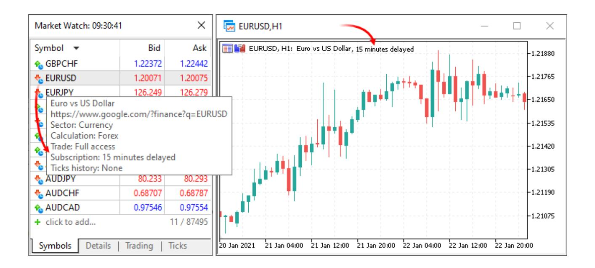

## **Conclusion**

Congratulations! You now have the necessary knowledge to administer the MetaTrader 5 platform.

You can always find additional information in the built-in documentation and articles published in the MetaQuotes Support Center.

To receive the documentary evidence of your knowledge and professional skills, pass the exams and earn your MetaTrader 5 Administrator certification!

Start [certification](https://support.metaquotes.net/en/certification/courses/administrator)