# Official proof of platform operational skills


|                                       | MetaQuotes certification program                                    | 4   |
|---------------------------------------|---------------------------------------------------------------------|-----|
|                                       | Trading system                                                      | 7   |
| 1                                     | Types of operations                                                 | 8   |
| 2                                     | Fill policy                                                         | 17  |
| 3                                     | Position accounting system                                          | 19  |
| 4                                     | Symbol settings                                                     | 21  |
| 5                                     | Common errors                                                       | 32  |
|                                       | Dealing                                                             | 33  |
| 1                                     | Working with trading positions                                      | 34  |
| 2                                     | Working with trading orders                                         | 44  |
| 3                                     | Viewing and editing trading operations                              | 53  |
| 4                                     | Manual request processing                                           | 70  |
| 5                                     | Automatic request processing                                        | 80  |
| 6                                     | Eliminating non-market consequences                                 | 99  |
| 7                                     | Analyzing operation logs                                            | 105 |
| 8                                     | Request rejection reasons                                           | 110 |
| 9                                     | Common errors                                                       | 115 |
|                                       | Risk management                                                     |     |
|                                       |                                                                     | 116 |
| 1                                     | Account leverage                                                    | 117 |
| 2                                     | Account state                                                       | 122 |
| 3                                     | Margin Call and Stop Out                                            | 127 |
| 4                                     | Margin calculation                                                  | 132 |
|                                       | Basic margin calculation                                            |     |
|                                       | Retail Forex, CFD, Futures — Hedging                                |     |
|                                       | Retail Forex, CFD, Futures — Netting                                |     |
|                                       | Stock Exchange Spreads                                              |     |
|                                       | Conversion                                                          |     |
| 5                                     | Protection from unfair clients                                      | 174 |
| 6                                     | Managing trading symbols                                            | 180 |
| 7                                     | Summary positions and coverage<br>Common errors                     |     |
|                                       | Broker and trader earnings                                          | 187 |
| 1                                     | Commission                                                          | 188 |
| 2                                     | Markups                                                             | 196 |
| 3                                     | Swaps                                                               | 198 |
| Corporate actions and bulk operations |                                                                     |     |
| 1                                     | Bulk closing .................................................. 215 |     |
| 2                                     | Bulk operations ............................................. 217   |     |
| 3                                     | Bulk payments by positions .................................. 220   |     |
| 4                                     | Splitting positions ......................................... 224   |     |
| 5                                     | Common errors ............................................... 226   |     |

# <span id="page-3-0"></span>**MetaQuotes certification program**

You think you know MetaTrader 5 inside out and have all the skills needed to operate the platform? Put your knowledge to the test, build on it and become a MetaQuotes certified professional.

- ·How to install and deploy the MetaTrader 5 trading cluster?
- ·How to protect against DDoS attacks and recover after a malfunction?
- ·How to create your own ECN and connect liquidity providers?
- ·How to configure the MetaTrader 5 platform to meet regulator requirements?
- ·What to do if the quotes have stopped and connection to the trade server has been lost?

These and many other questions arise in day to day brokerage activities. The answers are provided in this tutorial, [in articles published on the support site](https://support.metaquotes.net/en/articles), and in the [MetaTrader 5 platform documentation,](https://support.metaquotes.net/en/docs/mt5) but all this cannot replace a specialist who knows WHAT to do in a specific situation and WHERE to find the necessary information.

[Pass certification](https://support.metaquotes.net/en/certification)from MetaQuotes to verify your knowledge and get the documentary evidence of your qualification for a broker.

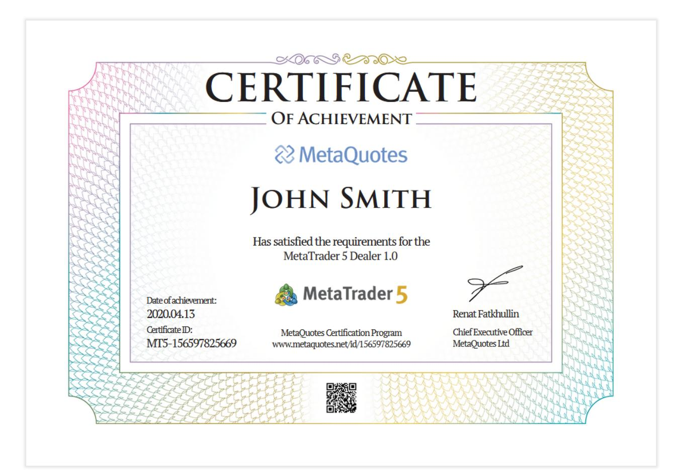

# **Through certification, you will**

- ·Test your knowledge
- ·Study relevant material and turn your weak points into strong ones
- ·Learn how to handle the existing functionality in depth
- ·Have an understanding of new product features
- ·Become a certified MetaQuotes professional
- ·Enrich your employment opportunities

### **Three types of certification**

- 1. [MetaTrader 5 Administrator](https://support.metaquotes.net/en/certification/courses/4) for platform administrators
- 2. [MetaTrader 5 Manager](https://support.metaquotes.net/en/certification/courses/6) for client managers
- 3. [MetaTrader 5 Dealer](https://support.metaquotes.net/en/certification/courses/7) for dealers and risk managers

### **Free online test and two oral exam attempts**

Even if you are not confident in your abilities, start with the first certification stage — the online test. This test is free, while the number of attempts is unlimited. Check out the topics covered by the test and prepare for the certification.

If you feel confident about your knowledge and can easily pass the first stage, it will not be difficult for you to pass the second-stage interview. During the interview, we will additionally verify your knowledge before issuing a certificate. Even if your first interview attempt is unsuccessful, you will have a free retake attempt.

It is safe to say that getting a certificate is easier than obtaining a driver's license provided that you really spent some time behind the wheel and read the traffic code.

We offer one free certification for each company. [Order it now](https://support.metaquotes.net/en/certification) via the Certification section in MetaQuotes Support Center.

### **You are just a few steps away from becoming a certified professional**

Select the necessary certificate type and pass two stages:

- · Stage 1. Complete the online test consisting of approximately 80 multi-choice questions at your convenience. To complete the test, you should score 70% correct answers. Once you have successfully completed this test, you can then go on to sign up for stage two.
- · Stage 2. Pay for the oral exam and be interviewed by a MetaQuotes representative via a video call. The interview lasts for roughly 30 minutes and verifies that the results of the first stage are legitimate.

Successful participants receive an official certificate signed and verified by a unique 12-digit ID which proves authenticity. The document can be validated by using this [link](https://support.metaquotes.net/en/certification).

Enroll in the program now by going to the [Certification](https://support.metaquotes.net/en/certification)section on the MetaQuotes Support Center website. It takes less than 10 seconds.

# <span id="page-6-0"></span>**Trading system**

The MetaTrader 5 trading system is designed to cover the needs of all financial markets while providing a powerful yet transparent and easy-to-understand system for traders. Within one platform, you can provide the opportunity to trade currencies, CFDs, futures, stocks, bonds, ETFs and cryptocurrencies on an unlimited number of exchanges.

- · The platform is suitable for Forex trading with hedging positions, as well as for exchange trading with netting accounts, as both [position accounting systems](#page-18-0) are supported.
- · MetaTrader 5 offers two main order types — [market](#page-8-0) and [pending](#page-8-1). A market order is an instruction to execute a deal immediately: to buy or sell a financial instrument. A pending order is an instruction to perform a trading action when certain conditions occur. Six pending order types are available: Buy Limit/ Sell Limit, Buy Stop / Sell Stop, Buy Stop Limit /Sell Stop Limit.
- · The platform deals with three trading entities: Order, Deal and Position. All these operations are linked: an order execution results in a deal which opens or closes a position. The entire trading process is transparent to the trader.
- ·The platform supports [position increase and partial closure](#page-13-0).
- · MetaTrader 5 provides four [order filling](#page-25-0) types. They determine how clients form trading orders and how the orders are processed by the platform.
- · When placing an order, traders can specify additional processing rules. They are referred to as the [fill policy.](#page-16-0) According to the policy, there are three filling modes: Fill or Kill (FOK), Immediate or Cancel (IOC) and Return.
- · Additionally, the platform allows the management of [expiration](#page-15-0)of pending orders. You can allow traders to place orders with no expiration or force them to close non-activated orders at the end of the day.

# <span id="page-7-0"></span>**Types of operations**

MetaTrader 5 offers three main types of trading operations:

- · An **order** is an instruction given to a broker to buy or sell a financial instrument. There are two main [types](#page-7-0) [of orders](#page-7-0): Market and Pending. In addition, there are special [Take Profit](#page-10-0) and [Stop Loss](#page-10-0) levels.
- <span id="page-7-1"></span>· A **deal** is the commercial exchange (buying or selling) of a financial security. Buying is executed at the Ask price, and Selling is performed at the Bid price. A deal can appear as a result of the execution of a market order or triggering of a pending order. Note that in some cases, execution of an order can result in several deals.
- · A **position** is a market obligation, i.e. the number of bought or sold contracts of a financial instrument. A long position is a financial security bought expecting the security price go higher. A short position is an obligation to supply a security expecting the price will fall in the future.

# **Orders, deals and positions linked**

In the platform, you can easily track how a position was opened or a deal was executed. All trading operations have a unique ticket. Each order and deal contain the ticket of the position they affected. Each deal contains the ticket of the order by which it was executed.

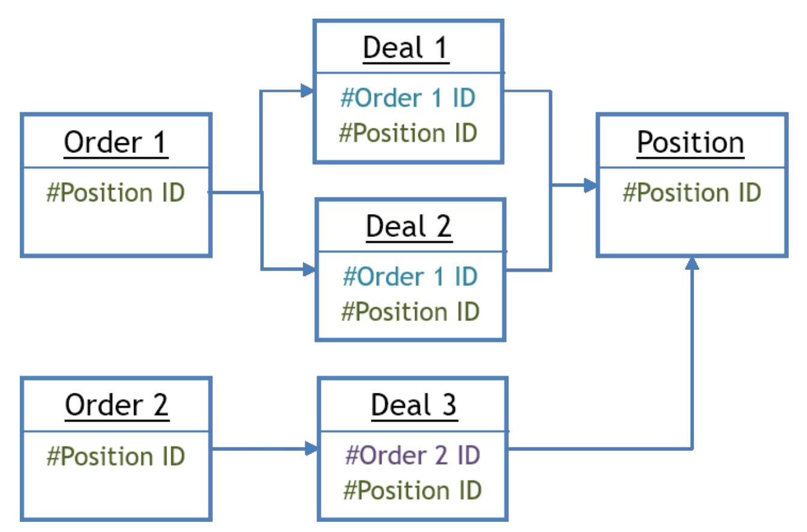

If multiple deals affected a position, for example, during partial closure or increase, the position ticket will be registered in each of the deals. This enables easy tracking of the entire history of the position.

If trading operations are forwarded to an exchange or liquidity provider, they additionally contain an identifier from an external system. Thus, you can analyze connected operations outside the platform.

# **Order types**

Using the Manager terminal, you can execute trading operations on any accounts. In addition, you can control and manage the state of open positions. For these purposes, several types of trading orders are used. They are divided into two main types: market and pending. There are also special [Stop Loss](#page-10-0) and [Take Profit](#page-10-0) orders.

## <span id="page-8-0"></span>**Market order**

A market order is an instruction to buy or sell a financial instrument. Execution of this order results the execution of a deal. A symbol is bought at the Ask price and is sold at the Bid price. The price at which the deal is performed is determined by the [execution type](#page-25-0) which depends on the symbol type. Generally, a security is bought at the Ask price and is sold at the Bid price.

## **Close By**

This market operation simultaneously closes two opposite positions for the same financial instrument. If opposite positions have different lot values, only one of them will be left open. Its volume will be equal to the difference between the lot values of the two positions, while the direction and open price of the remaining position will be the same as the direction and open price of a larger position.

Compared to individual closure, the Close By operation allows the trader to save on one spread:

- · If the positions are closed separately, the trader pays the spread twice: the Buy position is closed at Bid, and the Sell position is closed at Ask.
- · When using an opposite position, an open price of the second position is used to close the first one, while an open price of the first position is used to close the second one.

This type of operations can only be used with the [hedging](#page-18-0) position accounting system.

## <span id="page-8-1"></span>**Pending order**

A pending order is an order to buy or sell a financial instrument in the future, under the specified conditions. Types of pending orders:

- · **Buy Limit** — a trade request to buy at the Ask price equal to or less than the one specified in the order. The current price level is higher than the value specified in the order. Usually, this order is placed in anticipation that the security price will fall to a certain level and then will start growing.
- · **Buy Stop** — a trade order to buy at the Ask price equal to or greater than the one specified in the order. The current price level is lower than the value specified in the order. Usually, this order is placed in anticipation that the security price will reach a certain level and will keep increasing.

- · **Sell Limit** — a trade order to sell at the Bid price equal to or greater than the one specified in the order. The current price level is lower than the value specified in the order. Usually, this order is placed in anticipation that the security price will increase to a certain level and then will start falling.
- · **Sell Stop** — a trade order to sell at the Bid price equal to or less than the one specified in the order. The current price level is greater than the value specified in the order. Usually, this type of order is placed in the anticipation that the price will reach a certain level and will continue to fall.
- · **Buy Stop Limit** — this type is the combination of the first two types, being a stop order to place a Buy Limit order. As soon as the future Ask price reaches the stop level specified in the order (Price field), a Buy Limit order will be placed at the level specified in Stop Limit Price field. A stop level is set above the current Ask price, while the Stop Limit price is set below the stop level.
- · **Sell Stop Limit** — this order is a stop order to place a Sell Limit order. As soon as the future Bid price reaches the stop level specified in the order (Price field), a Sell Limit order will be placed at the level specified in Stop Limit Price field. A stop level is set below the current Bid price, while the Stop Limit price is set above the stop level.

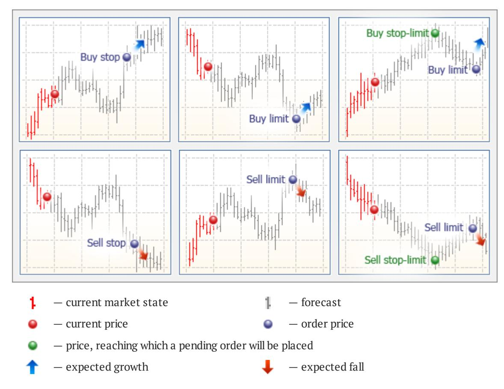

Pay attention to the following:

· For symbols with Exchange Stocks, Exchange Futures and Futures Forts calculation modes, all the types of pending orders trigger based on the Last price (the price of the last executed deal). In other words, an order triggers when the Last price touches the price specified in the order. But note that buying or selling as a result of triggering of an order is always performed at the Bid and Ask prices.

- · In the Exchange Execution mode, the price specified when placing limit orders is not verified. It can be specified above the current Ask price (for the Buy Limit orders) and below the current Bid price (for the Sell Limit orders). If an order is placed with such a price, it triggers almost immediately and turns into a market one. However, unlike market orders where a trader agrees to perform a deal by a non-specified current market price, a pending order will be executed at a price no worse than the specified price.
- · If an appropriate market operation cannot be executed when a pending order triggers (e.g. there is not enough margin), the pending order is canceled and moved to history with the Rejected status.

## <span id="page-10-0"></span>**Take Profit and Stop Loss**

Take Profit and Stop Loss orders are used to protect profits and to limit losses. They are linked to a position and are triggered when a certain price is reached. If the price moves in a favorable direction and reaches the Take Profit level, the position is closed and profit is fixed on it. If the price moves in the opposite direction and reaches the Stop Loss, it will not allow the loss to grow further.

Take Profit and Stop Loss are stored and processed on the trade server. Thus, positions remain protected even when the trader is away from the computer.

Stop levels can also be added for a pending order. Once the order triggers, the relevant levels will be copied to the new or modified position.

Please note that Take Profit and Stop Loss are processed similarly to stop orders, and thus slippage can be applied to them. If the level has triggered, but the price has changed, the position will anyway be closed.

| Account:                | 1839368, Bailey Diego, USD, 1:100, Hedge                                                                                                                                                                      |               |                |         |  |         |         |                      |                   |                |  |
|-------------------------|---------------------------------------------------------------------------------------------------------------------------------------------------------------------------------------------------------------|---------------|----------------|---------|--|---------|---------|----------------------|-------------------|----------------|--|
| Description:            | Overview   Exposure Personal Account Limits Profile Subscriptions Balance Trade                                                                                                                               |               |                |         |  |         |         |                      |                   |                |  |
| Details:                | Bailey Diego, 1839368, demo\two\forex-hedged-04, 1: 100<br>123456, Mexico, Mexico<br>+528615361988<br>Diego.Bailey@mail.net<br>Registered: 2022.03.25 Last access: 2022.03.25 17:19 Last Address: 94.130.2.61 |               |                |         |  |         |         |                      |                   |                |  |
| Symbol                  | Type                                                                                                                                                                                                          | Volume        | Price          | S/L     |  | T/P     | Price   | Swap                 | Profit            |                |  |
| Ħ<br>eurusd             | buy                                                                                                                                                                                                           | 1             | 1.02959        | 1.02820 |  | 1.03199 | 1.02956 | 0.00                 | $-3.00$           |                |  |
| $
ceil \. 
ceil$ eurusd | sell                                                                                                                                                                                                          |               | 1.02963        | 1.03350 |  | 1.02519 | 1.02956 | 0.00                 | 7.00              |                |  |
| ⊕ Balance:              | 4 993 646.21 USD                                                                                                                                                                                              |               |                |         |  |         |         | Equity: 4 993 647.21 | Commission: -3.00 | Margin: 102.52 |  |
| Free Margin:            | 4 993 544.69                                                                                                                                                                                                  | Margin Level: | 4 870 900.52 % |         |  |         |         |                      |                   |                |  |
| $
ceil$ - eurusd        | buy limit                                                                                                                                                                                                     | 0.1/0         | 1.02522        | 1.01982 |  | 1.03062 | 1.02956 |                      | placed            |                |  |
|                         |                                                                                                                                                                                                               |               |                |         |  |         |         |                      |                   |                |  |
|                         |                                                                                                                                                                                                               |               |                |         |  |         |         |                      |                   |                |  |
|                         | Client Properties<br>Update<br>Help<br>Cancel                                                                                                                                                                 |               |                |         |  |         |         |                      |                   |                |  |

Take Profit and Stop Loss activation is checked using the Bid price for long positions and using the Ask price for short positions.

Additional features:

- · If at the moment of Take Profit or Stop Loss activation the corresponding market operation cannot be executed (for example, it is rejected by the exchange), the order is not deleted. It will trigger again at the next tick corresponding to the order activation conditions.
- ·Activation of Take Profit or Stop Loss results in the complete closing of the entire position.
- · For symbols with Exchange Stocks, Exchange Futures and Futures Forts calculation modes, Stop Loss and Take Profit orders are triggered according to the rules of the relevant exchange. Usually, the Last price (price of the last performed transaction) is applied. In other words, a stop order triggers when the Last price touches the specified price. However, note that buying or selling as a result of stop order activation is always performed at the Bid and Ask prices.

#### <span id="page-11-0"></span>**Stop Loss and Take Profit inheritance rules (netting):**

- · When increasing position volume or reverting a position, Take Profit and Stop Loss levels are placed according to its latest order (market or triggered pending order). In other words, stop levels in each subsequent order for the same position replace the previous ones. If an order comes with zero stop orders, then Stop Loss and Take Profit levels are deleted.
- ·If a position is closed partially, the new order does not modify Stop Loss and Take Profit.
- · If a position is fully closed, the Stop Loss and Take Profit levels are deleted, because they are associated with an open position and cannot exist without it.
- · If a trade operation is executed for a symbol, for which there is a position, the current Stop Loss and Take Profit of the open position are automatically inserted in the order placing window. This prevents accidental deletion of current stop orders.
- · When executing one-click trading operations in the client terminal (from the on-chart panel or from the Market Watch) for the symbol, for which there is a position, the current Stop Loss and Take Profit values are not changed.
- · In the OTC markets (Forex, CFD, Futures), when a position is moved to the next trading day (the swap), including moving by re-opening, the Stop Loss and Take Profit levels do not change.
- · In the exchange market, when a position is moved to the next trading day (the swap), as well as when moved to another account or is delivered, the Stop Loss and Take Profit levels are reset.

#### **Stop Loss and Take Profit inheritance rules (hedging):**

- ·If a position is closed partially, the new order does not modify Stop Loss and Take Profit.
- · If a position is fully closed, the Stop Loss and Take Profit levels are deleted, because they are associated with an open position and cannot exist without it.
- · When executing a trading operation with one click in the client terminal (from the on-chart panel or from the Depth of Market), Stop Loss and Take Profit are not set.

These rules apply both when trading manually and when placing orders from Expert Advisors (MQL5 programs) in the client terminal.

## <span id="page-12-0"></span>**Order status**

Each order in the platform has a status. It allows understanding the current order processing stage on the server. According to the status, orders can be open and closed.

Open orders are those currently being processed, i.e. which have not yet been filled. Such orders are displayed in terminals along with current positions.

- · If an order is in the *Started* state, then it has already been validated but it has not yet been accepted by the broker for processing.
- ·*Placed* means that the order has been accepted or placed and is awaiting execution.
- ·*Partially filled* means that the order has been filled partially.

Processed orders are considered closed. They are displayed under the History section of the trading account.

- ·*Filled* indicates that the order has been filled in the full requested volume.
- ·*Canceled* means that the client has canceled the order before it was filled.
- ·*Rejected* are orders rejected by the dealer.
- ·*Expired* are those canceled upon expiration.

|          | Account: 1839368, Bailey Diego, USD, 1:100, Hedge |
|----------|---------------------------------------------------|
| Overview |                                                   |
| Time     | 2022.03.25 17:19:30                               |
| Order    | 297235977                                         |
| Symbol   | usdipy                                            |
| Type     |                                                   |
| Volume   | buy 0.02 / 0.02 122.016 115.915 128.117           |
| Price    |                                                   |
| S/L      |                                                   |
| T/P      |                                                   |
| Time     | 2022.03.25 17:19:30                               |
| State    | filled                                            |

|              | Account: 1839368, Bailey Diego, USD, 1:100, Hedge |
|--------------|---------------------------------------------------|
| Overview     |                                                   |
| Registered   | 2022.03.25                                        |
| Last access  | 2022.03.25 17:19                                  |
| Last Address | 94.130.2.61                                       |
| Symbol       | eurusd                                            |
| Type         | buy                                               |
| Volume       | 1                                                 |
| Price        | 1.02959                                           |
| S/L          | 1.02820                                           |
| T/P          | 1.03199                                           |
| Price        | 1.02956                                           |
| Swap         | 0.00                                              |
| Profit       | -3.00                                             |

|  | ⊕ Balance: 4 993 646.21 USD |
|--|-----------------------------|
|  | Equity: 4 993 647.21        |
|  | Commission: -3.00           |
|  | Margin: 102.52              |

|  | Free Margin: 4 993 544.69    |
|--|------------------------------|
|  | Margin Level: 4 870 900.52 % |

|  | <b>FJ</b> eurusd |
|--|------------------|
|  | buv limit        |
|  | 0.1/0            |
|  | 1.02522          |
|  | 1.01982          |
|  | 1.03062          |
|  | 1.02956          |

Client Properties..  
Update  
Help  
Cancel

# **Deal types: entry, exit, reversal**

Transactions differ in the operation type (Buying and Selling), as well as in the direction relative to the client's current position:

- ·The 'in' deals is the one that opens or increases an existing position.
- ·The 'out' deal is the one that closes a position in full or partially.
- · The 'in/out' type indicates that the deal closes an existing position and opens a new one in the opposite direction. This type is only possible in the netting system.
- · There is another type, 'out by', which means that the deal closes two opposite positions for the same symbol. This operation is only available on hedging accounts.

| Time                | Deal      | Order     | Symbol | Type | Entry  | Volume     | Price   | S/L             | T/P     | Profit |         |
|---------------------|-----------|-----------|--------|------|--------|------------|---------|-----------------|---------|--------|---------|
| 2022.03.25 17:20:42 | 237816185 | 297361503 | eurusd | sell | in     | 0.03       | 1.09878 | 1.15372         | 0.00000 | 0.00   |         |
| 2022.03.25 17:20:42 | 237816309 | 297361643 | usdcad | sell | in     | 0.04       | 1.24978 | 1.33726         | 0.00000 | 0.00   |         |
| 2022.03.25 17:20:42 | 237816571 | 297361953 | gbpusd | sell | in     | 3          | 1.31905 | 0.00000         | 0.00000 | 0.00   |         |
| 2022.03.25 17:20:42 | 237816681 | 297362101 | usdcad | buy  | out    | 0.05       | 1.25020 | 1.32476         | 1.17478 | -1.72  |         |
| 2022.03.25 17:20:42 | 237817122 | 297362604 | gbpusd | sell | out by | 1.5        | 1.31905 | 0.00000         | 0.00000 | -4.50  |         |
| 2022.03.25 17:20:42 | 237817123 | 297362604 | abpusd | buy  | out by | 1.5        | 1.31908 | 0.00000         | 0.00000 | 0.00   |         |
| 2022.03.25 17:20:42 | 237817466 | 297363015 | usdcad | buy  | in     | 0.02       | 1.25020 | 1.13768         | 1.36272 | 0.00   |         |
| 2022.03.25 17:20:42 | 237817599 | 297363161 | usdjpy | buy  | in     | 0.05       | 122.045 | 0.000           | 0.000   | 0.00   |         |
| 2022.03.25 17:20:42 | 237817848 | 297363461 | eurusd | sell | in     | 0.08       | 1.09878 | 0.00000         | 0.99989 | 0.00   |         |
| 2022.03.25 17:20:42 | 237818103 | 297363763 | usdcad | buv  | in     | 0.04       | 1.25020 | 0.00000         | 1.32521 | 0.00   |         |
| 2022.03.25 17:20:43 | 237818363 | 297364064 | eurusd | sell | in     | 0.06       | 1.09878 | 0.00000         | 0.00000 | 0.00   |         |
| 2022.03.25 17:20:43 | 237818606 | 297364349 | gbpusd | buy  | in     | 2          | 1.31904 | 0.00000         | 0.00000 | 0.00   |         |
| 2022.03.25 17:20:43 | 237818661 | 297364418 | usdchf | buy  | out    | 0.07       | 0.93037 | 0.00000         | 0.84663 | -0.08  |         |
| 2022.03.25 17:20:43 | 237819262 | 297365146 | usdcad | sell | dut.   | 0.02       | 1.24980 | 1.15018         | 1.35022 | -0.64  |         |
|                     |           |           |        |      | ✓      | 1970.01.01 | ▮▾      | 2022.08.13<br>0 | ▮▾      |        | Request |

### <span id="page-13-0"></span>**Position increase or partial closure**

The ability to increase or decrease the position volume depends on the [position accounting system](#page-18-0) adopted on the trading account.

| Netting                                                                                                                                | Hedging                                                                                                                                        |
|----------------------------------------------------------------------------------------------------------------------------------------|------------------------------------------------------------------------------------------------------------------------------------------------|
| Only one position can exist for a financial instrument at a time, while differently directed positions (buy and sell) are not allowed. | Multiple open positions of the same symbol can simultaneously exist on the trading account, including oppositely directed ones (Buy and Sell). |

| Netting                                                                                                                                                                                                                                                                                                                                                                                                                                                                                                                                                                                                                                                                                                          | Hedging                                                                                                                                       |
|------------------------------------------------------------------------------------------------------------------------------------------------------------------------------------------------------------------------------------------------------------------------------------------------------------------------------------------------------------------------------------------------------------------------------------------------------------------------------------------------------------------------------------------------------------------------------------------------------------------------------------------------------------------------------------------------------------------|-----------------------------------------------------------------------------------------------------------------------------------------------|
| Thus, if you have a 1-lot buy position for a financial instrument and sell one lot of this instrument, the position will be closed.<br>If you have a 1-lot buy position for a financial instrument and buy one more lot of the same instrument, you will have one 2-lot position. In this case, the open price is recalculated and becomes equal to the weighted average opening price: (First deal price * First deal volume + Second deal price * Second deal volume) / (First deal volume + Second deal volume).<br>The same is true for an opposite deal. If you have a 1-lot buy position and execute a trade operation to sell 0.5 lot of the same instrument, you will have one buy position of 0.5 lots. | The volume of an existing position cannot be increased.<br>For partial position closing, set the required volume value in the trading dialog. |

# **Configuring available order types**

The order types available to traders are configured via MetaTrader 5 Administrator. Open financial instrument settings and configure order types in the Trade \ Orders parameter. Here you can also configure [fill policy.](#page-16-0)

| Label                                                                                                                                      | Value                                                             |
|--------------------------------------------------------------------------------------------------------------------------------------------|-------------------------------------------------------------------|
| Symbol:                                                                                                                                    | Idx Asia Usd 10\RK_HSI                                            |
| Common                                                                                                                                     |                                                                   |
| Currency                                                                                                                                   |                                                                   |
| Quotes                                                                                                                                     |                                                                   |
| Trade                                                                                                                                      |                                                                   |
| Futures                                                                                                                                    |                                                                   |
| Execution                                                                                                                                  |                                                                   |
| Margin                                                                                                                                     |                                                                   |
| Margin Rates                                                                                                                               |                                                                   |
| Swaps                                                                                                                                      |                                                                   |
| Sess                                                                                                                                       |                                                                   |
| <p>The setting up of symbol trading. Please specify the type of profit calculation, type of placed orders, allowed trade volumes, etc.</p> |                                                                   |
| Contract size:                                                                                                                             | 5                                                                 |
| Tick size:                                                                                                                                 | 1                                                                 |
| Tick value:                                                                                                                                | 5.00000000                                                        |
| Calculation:                                                                                                                               | <b>Futures</b>                                                    |
| Trade:                                                                                                                                     | Full access                                                       |
| GTC:                                                                                                                                       | Good till cancelled                                               |
| Limit & stop level:                                                                                                                        | 30                                                                |
| Freeze level:                                                                                                                              | 5                                                                 |
| Max quote delay:                                                                                                                           | 30 sec                                                            |
| Filling:                                                                                                                                   | All                                                               |
| Expiration:                                                                                                                                | All                                                               |
| Orders:                                                                                                                                    | All                                                               |
| Enable Trading Signals:                                                                                                                    | <input checked="" type="checkbox"/>                               |
| <p>Volumes</p> <ul><li>0.1</li><li>0.1</li><li>Maximum: 20</li><li>Minimum:</li><li>Step:</li><li>Limit:</li></ul>                         |                                                                   |
|                                                                                                                                            | <button>OK</button> <button>Cancel</button> <button>Help</button> |

In addition, order expiration can be set up in this section.

<span id="page-15-0"></span>GTC — orders handling mode when switching to the next day:

- · Good till today including SL/TP — the orders are valid only during one trading day. With the end of the day, all Stop Loss and Take Profit levels are deleted; pending orders are also removed.
- ·Good till canceled — pending orders are preserved for the next trading day.
- · Good till today excluding SL/TP — only pending orders are deleted at the end of the trading day, while Stop Loss and Take Profit are preserved.

<span id="page-15-1"></span>Expiration — order expiration conditions. To allow an expiration type, check the relevant box:

- ·Good Till Canceled — the order will remain in the queue until it is canceled manually.
- · Day — the order will only be valid for the current trading day. When processed on the MetaTrader 5 platform side, intraday orders are canceled at the end of a calendar day taking into account the server trading time and the trading sessions of the instrument. For example, if trading ends at 21:00, the untriggered intraday orders will be canceled at the same time. When processed in external systems through gateways, the expiration rules may be different and may depend on the specific system.
- ·Specified time — the order will be valid until the date specified by the trader.
- · Specified day — the order will be valid until 00:00 of the specified day. If this time appears to be out of a trading session, the expiration is processed in the nearest trading time.

# <span id="page-16-0"></span>**Fill policy**

In addition to the general order execution rules specified in symbol settings, a trader/manager can specify additional conditions in the "Fill Policy" field of the order placing window:

#### ·**Fill or Kill (FOK)**

This fill policy means that the order can only be filled in the specified volume. If the necessary amount of a financial instrument is currently not available in the market, the order will not be executed. The required volume can be filled by several offers available in the market.

#### ·**Immediate or Cancel (IOC)**

A trader/manager agrees to execute the deal for the maximum volume available in the market within that indicated in the order. If the request cannot be filled completely, an order with the available volume will be executed, and the remaining volume will be canceled. The possibility of using IOC orders is determined on the trade server.

#### ·**Book or Cancel (BOC)**

The BOC policy indicates that the order can only be placed in the Depth of Market (order book). If the order can be filled immediately when placed, this order is canceled. This policy guarantees that the price of the placed order will be worse than the current market. BOC is used to implement passive trading: it is guaranteed that the order cannot be executed immediately when placed and thus it does not affect current liquidity. This fill policy is only supported for limit and stop limit orders.

#### ·**Return**

This fill policy is used for market (Buy and Sell), [limit and stop limit orders](#page-8-1). In case of partial filling, an order with the remaining volume is not canceled but is processed further. For market orders, the Return fill policy is used only in the Exchange execution [mode](#page-25-0), while for limit and stop limit orders it can be used in Market and Exchange execution modes.

The application of the fill policies depending on the execution mode can be represented as a table:

| Execution Mode\Fill Policy | Fill or Kill<br>(FOK) | Immediate or<br>Cancel (IOC) | Book or<br>Cancel | Return |
|----------------------------|-----------------------|------------------------------|-------------------|--------|
| Instant Execution          | +                     | —                            | —                 | —      |
| Request Execution          | +                     | —                            | —                 | —      |
| Market Execution           | +                     | +                            | —                 | +      |
| Exchange Execution         | +                     | +                            | +                 | +      |

The fill policies that traders can use are configured through MetaTrader 5 Administrator. Open the financial instrument settings and configure the "Trade \ Filling" parameter.

|                                                                                                                                     | s.<br>×<br>Symbol: Idx Asia Usd 10\RK_HSI        |  |  |  |  |  |  |  |  |  |  |  |  |  |
|-------------------------------------------------------------------------------------------------------------------------------------|--------------------------------------------------|--|--|--|--|--|--|--|--|--|--|--|--|--|
| Common                                                                                                                              | Currency Quotes                                  |  |  |  |  |  |  |  |  |  |  |  |  |  |
| Trade                                                                                                                               |                                                  |  |  |  |  |  |  |  |  |  |  |  |  |  |
|                                                                                                                                     |                                                  |  |  |  |  |  |  |  |  |  |  |  |  |  |
|                                                                                                                                     |                                                  |  |  |  |  |  |  |  |  |  |  |  |  |  |
| Futures                                                                                                                             | Execution   Margin   Margin Rates   Swaps   Sess |  |  |  |  |  |  |  |  |  |  |  |  |  |
| The setting up of symbol trading. Please specify the type of profit calculation, type of placed orders, allowed trade volumes, etc. |                                                  |  |  |  |  |  |  |  |  |  |  |  |  |  |
| Contract size:                                                                                                                      | 5                                                |  |  |  |  |  |  |  |  |  |  |  |  |  |
| Tick size:                                                                                                                          | 1                                                |  |  |  |  |  |  |  |  |  |  |  |  |  |
| Tick value:                                                                                                                         | 5.00000000                                       |  |  |  |  |  |  |  |  |  |  |  |  |  |
| Calculation:                                                                                                                        | <b>Futures</b>                                   |  |  |  |  |  |  |  |  |  |  |  |  |  |
|                                                                                                                                     | <input checked="" type="checkbox"/>              |  |  |  |  |  |  |  |  |  |  |  |  |  |
| Limit & stop level:                                                                                                                 | 30                                               |  |  |  |  |  |  |  |  |  |  |  |  |  |
| Trade:                                                                                                                              | Full access                                      |  |  |  |  |  |  |  |  |  |  |  |  |  |
|                                                                                                                                     |                                                  |  |  |  |  |  |  |  |  |  |  |  |  |  |
| GTC:                                                                                                                                | Good till cancelled                              |  |  |  |  |  |  |  |  |  |  |  |  |  |
|                                                                                                                                     | <input checked="" type="checkbox"/>              |  |  |  |  |  |  |  |  |  |  |  |  |  |
| Max quote delay:                                                                                                                    | 30                                               |  |  |  |  |  |  |  |  |  |  |  |  |  |
| Filling:                                                                                                                            | All                                              |  |  |  |  |  |  |  |  |  |  |  |  |  |
|                                                                                                                                     | <input checked="" type="checkbox"/>              |  |  |  |  |  |  |  |  |  |  |  |  |  |
| Expiration:                                                                                                                         | All                                              |  |  |  |  |  |  |  |  |  |  |  |  |  |
|                                                                                                                                     | <input checked="" type="checkbox"/>              |  |  |  |  |  |  |  |  |  |  |  |  |  |
| Orders:                                                                                                                             | All                                              |  |  |  |  |  |  |  |  |  |  |  |  |  |
|                                                                                                                                     | <input checked="" type="checkbox"/>              |  |  |  |  |  |  |  |  |  |  |  |  |  |
| Enable Trading Signals <                                                                                                            |                                                  |  |  |  |  |  |  |  |  |  |  |  |  |  |
| Volumes<br>0.1<br>Minimum:                                                                                                          | <input checked="" type="checkbox"/>              |  |  |  |  |  |  |  |  |  |  |  |  |  |
| Step:                                                                                                                               | 0.1                                              |  |  |  |  |  |  |  |  |  |  |  |  |  |
|                                                                                                                                     | <input checked="" type="checkbox"/>              |  |  |  |  |  |  |  |  |  |  |  |  |  |
| Maximum:                                                                                                                            | 20                                               |  |  |  |  |  |  |  |  |  |  |  |  |  |
| Limit:                                                                                                                              | <input checked="" type="checkbox"/>              |  |  |  |  |  |  |  |  |  |  |  |  |  |

# <span id="page-18-0"></span>**Position accounting system**

The trading platform supports two position accounting systems: Netting and Hedging. The applied system depends on the group settings and can only be changed via the Administrator terminal. In the Manager terminal, the parameter is available in the read-only mode.

| Group:                                                                                                                     | demo\forex-usd                                             |                 |    |            |
|----------------------------------------------------------------------------------------------------------------------------|------------------------------------------------------------|-----------------|----|------------|
| Margin                                                                                                                     | Ssymbols                                                   | Commissions     |    |            |
|                                                                                                                            | Please set up margin requirements.                         |                 |    |            |
| Risk management:                                                                                                           | for Retail Forex, CFD, Futures                             |                 |    |            |
| Margin call level:                                                                                                         | 50                                                         | Stop out level: | 30 | %, percent |
| Stop out level:                                                                                                            | 30                                                         |                 |    |            |
| in                                                                                                                         | ×                                                          |                 |    |            |
| Group:                                                                                                                     | demo\forex-usd                                             |                 |    |            |
| Margin                                                                                                                     | Ssymbols                                                   |                 |    |            |
| News & Mail                                                                                                                | Commissions                                                |                 |    |            |
| Reports                                                                                                                    | Company                                                    |                 |    |            |
| Permissions                                                                                                                |                                                            |                 |    |            |
| Please set up the mechanism of margin calculation for the group: choose the method of calculation and margin requirements. |                                                            |                 |    |            |
| Risk management:                                                                                                           | for Retail Forex, CFD, Futures                             |                 |    |            |
| for Retail Forex, CFD, Futures                                                                                             | Margin call level:                                         |                 |    |            |
|                                                                                                                            | for Retail Forex, CFD, Futures with hedged positions       |                 |    |            |
|                                                                                                                            | for Stock Exchange, based on margin discount rates         |                 |    |            |
|                                                                                                                            | Compensate negative balance after stop out                 |                 |    |            |
|                                                                                                                            | Withdraw credit after negative balance compensation        |                 |    |            |
|                                                                                                                            | Profit/loss in free margin                                 |                 |    |            |
|                                                                                                                            | Unrealized profit:<br>use unrealized profit/loss<br>$c$  |                 |    |            |
|                                                                                                                            | Daily fixed profit:<br>use daily fixed profit/loss         |                 |    |            |
|                                                                                                                            | Release fixed profit at the end of day                     |                 |    |            |
|                                                                                                                            | Virtual credit:<br>(applies only to opening new positions) |                 |    |            |
|                                                                                                                            | OK<br>Help<br>Cancel                                       |                 |    |            |

Different accounting systems are supported only for the OTC market. In the exchange market, a netting system is always used.

### <span id="page-18-1"></span>**Netting system**

With this system, you can have only one common position for a symbol at the same time:

- · If there is an open position for a symbol, executing a deal in the same direction increases the volume of this position.
- · If a deal is executed in the opposite direction, the volume of the existing position can be decreased, the position can be closed (when the deal volume is equal to the position volume) or reversed (if the volume of the opposite deal is greater than the current position).

It does not matter, what has caused the opposite deal — an executed market order or a triggered pending order.

The below example shows execution of two 1-lot EURUSD Buy deals:

| <b>Toolbox</b>                                                                                                  |           |                     |      |        |          |           |                                                                         |         |
|-----------------------------------------------------------------------------------------------------------------|-----------|---------------------|------|--------|----------|-----------|-------------------------------------------------------------------------|---------|
| Symbol                                                                                                          | Ticket    | Time                | Type | Volume | Price    | S/L       | T/P                                                                     | Price   |
| eurusd                                                                                                          | 207796062 | 2018.02.12 16:50:55 | buy  | 2.00   | 1.225935 | $1.22104$ | $1.23104$                                                               | 1.22573 |
| Balance: 1 000 000.00 USD Equity: 999 959.00 Margin: 2 451.87 Free Margin: 997 507.13 Margin Level: 40 783.52 % |           |                     |      |        |          |           |                                                                         |         |
|                                                                                                                 |           |                     |      |        |          |           |                                                                         |         |
| Trade<br>Exposure                                                                                               |           | History   News      |      |        |          |           | Mailbox7   Calendar   Company   Market12   Alerts   Signals   Code Base | Experts |

## <span id="page-19-0"></span>**Hedging system**

With this system, you can have multiple open positions of one and the same symbol, including oppositely directed positions.

If you have an open position for a symbol and execute a new deal (or a pending order triggers), a new position is additionally opened. Your current position does not change.

The below example shows execution of two 1-lot EURUSD Buy deals:

| Toolbox                                                                                                                     |                                                                                                                   |                     |      |        |         |          |          |              |
|-----------------------------------------------------------------------------------------------------------------------------|-------------------------------------------------------------------------------------------------------------------|---------------------|------|--------|---------|----------|----------|--------------|
| Symbol                                                                                                                      | Ticket                                                                                                            | Time                | Type | Volume | Price   | S/L      | T/P      | <b>Price</b> |
| □ eurusd                                                                                                                    | 207769623                                                                                                         | 2018.02.12 15:58:48 | buy  | 1.00   | 1.22439 | ∏1.21939 | ∏1.22939 | 1.22557      |
| ⌈ eurusd                                                                                                                    | 207795600                                                                                                         | 2018.02.12 16:50:12 | buy  | 1.00   | 1.22554 | ∏1.22054 | ∏1.23054 | 1.22557      |
| ⊕ Balance: 1 000 000.00 USD   Equity: 1 000 121.00   Margin: 2 449.93   Free Margin: 997 671.07   Margin Level: 40 822.43 % |                                                                                                                   |                     |      |        |         |          |          |              |
| Trade                                                                                                                       | Mailbox7   Calendar   Company   Market12   Alerts<br>History   News<br>Signals   Code Base<br>Experts<br>Exposure |                     |      |        |         |          |          |              |

### **Impact of the system used**

Depending on the position accounting system, some of the platform functions may have different behavior:

- ·Rules of [Stop Loss and Take Profit inheritance](#page-11-0) also change.
- · To [close a position](#page-35-0)in the netting system, you should perform an opposite trading operation for the same symbol and the same volume. To close a position in the hedging system, explicitly select the *Close Position* command in the context menu of the position.
- · A position cannot be reversed in the hedging system. In this case, the current position is closed and a new one with the remaining volume is opened.
- ·In the hedging system, a new condition for margin calculation is available — [Hedged margin](#page-148-0).

# <span id="page-20-0"></span>**Symbol settings**

All basic settings affecting financial symbol trading are configured via MetaTrader 5 Administrator.

### <span id="page-20-1"></span>**Instrument type**

The multi-asset platform supports a wide variety of trading instruments, including currency pairs, futures, stocks, bonds, and much more. The instrument type is defined in the Calculation field of trading settings:

|              | ?<br>×<br>Symbol: Idx Asia Usd 10\RK_HSI |  |
|--------------|------------------------------------------|--|
| Common       |                                          |  |
| Currency     |                                          |  |
| Quotes       |                                          |  |
| Trade        |                                          |  |
| Futures      |                                          |  |
| Execution    |                                          |  |
| Margin       |                                          |  |
| Margin Rates |                                          |  |
| Swaps        |                                          |  |
| Sess         |                                          |  |

The setting up of symbol trading. Please specify the type of profit calculation, type of placed orders, allowed trade volumes, etc.

| Contract size: | 5          |
|----------------|------------|
| Tick size:     | 1          |
| Tick value:    | 5.00000000 |

| Calculation:        | Futures             |
|---------------------|---------------------|
| Trade:              | Full access         |
| GTC:                | Good till cancelled |
| GTC:                |                     |
| Limit & stop level: | 30                  |
| Freeze level:       | 5                   |
| Max quote delay:    | 30                  |
| Filling:            | All                 |
| Expiration:         | All                 |
| Orders:             | All                 |

Enable Trading Signals <

| Volumes  |     |
|----------|-----|
| Minimum: | 0.1 |
| Step:    | 0.1 |
| Maximum: | 20  |
| Limit:   |     |

| OK | Cancel | Help |
|----|--------|------|
|----|--------|------|

The instrument type determines all related calculations: [margin,](#page-131-0) [profit](#page-208-0) and [swaps.](#page-197-0) It also determines the availability of some features on the client side. For example, the options board is only available for option instruments.

In all calculation modes except Exchange, the Take Profit and Stop Loss orders, as well as of all types of pending orders, are activated at Bid or Ask prices. In Exchange Stocks, Exchange Bonds, Exchange Futures and FORTS Exchange modes, such orders are triggered at the Last deal price.

The following calculation types exist:

- ·Forex — calculation for Forex instruments.
- · Forex No Leverage — similar to the Forex type but the client leverage is ignored in margin calculations. Forex No Leverage can be used if it is necessary to calculate the margin with a fixed leverage for all clients regardless of their actual leverage. If this type is selected, the client leverage is not included in margin calculations. A fixed leverage can be set through [margin rates](#page-134-0) (for example, the rate of 0.01 is similar to the leverage of 1:100).
- ·CFD — calculation for CFD instruments.

- ·Futures — calculation for Futures symbols.
- ·CFD Index — calculation for CFD indices.
- ·CFD Leverage — calculation for CFD instruments taking into account leverage.
- ·Exchange Stocks — calculation for exchange stocks.
- ·Exchange MOEX Stocks — calculation for stocks traded on the Moscow Exchange.
- ·Exchange Bonds — calculation for exchange bonds.
- ·Exchange MOEX Bonds — calculation for bonds traded on the Moscow Exchange.
- ·Exchange Futures — calculation for exchange futures.
- · Exchange FORTS Futures — futures calculations for the FORTS market. This mode must only be used together with the MOEX Derivatives Gateway. Otherwise, the margin requirements calculation results may be unpredictable.
- ·Exchange Option — calculation for exchange options.
- · Collateral — these non-tradable instruments are used as assets to provide the [required margin for open](#page-124-0) [positions](#page-124-0) for other instruments. No margin or profit calculation is performed for them.

#### **Additional trading settings**

The Trade section in symbol settings also provides the following parameters:

- · **Tick size** — the minimum price change step. Changing this setting requires a server restart. It is used when calculating the margin for CFD Index and Exchange FORTS Futures instruments. The parameter is required for Futures symbols; otherwise, close prices and profits will not be updated for the relevant futures positions.
- · **Tick price** — the cost of one price change point. Changing this setting requires a server restart. It is used when calculating the margin for CFD Index and Exchange FORTS Futures instruments. The parameter is required for Futures symbols; otherwise, close prices and profits will not be updated for the relevant futures positions.
- · **Limit & stop levels** — a price corridor (in points) from the current price, inside which placing of Stop Loss, Take Profit and pending orders is not allowed. If a user tries to place an order inside the corridor, the server will return the "Invalid Stops" error and will not accept the order.
- · **Trade** — symbol trading settings:
  - ·**Disabled** — trading is not allowed.
  - ·**Long only** — only opening of long positions is allowed.
  - ·**Short only** — only opening of short positions is allowed.

- · **Close only** — only position closing is allowed. Hedging accounts will only allow position closing market operations. In addition to the market operations, netting accounts also allow placing of a pending order in the opposite direction — the activation of this order will close an existing position instead of opening a new one (unlike with hedging).
- ·**Full access** — any type of trading is allowed.
- · **Freeze level** — freeze distance for orders and positions that are close to the current price. When the order price approaches the current market price at a distance equal to or lower than the specified value, order modification or deletion is prohibited. This limitation also applies to position modification. When the current price approaches the position's Stop Loss or Take Profit levels, modification of these levels, changing of position volume and position closing are not allowed.
- · **Orders** — allowed order types: Market, Limit, Stop, Stop Limit, Stop Loss, Take Profit, Close By. Enabling Close By orders does not mean that such operations will be allowed on netting accounts. Close By orders can only be used on hedging accounts.
- <span id="page-22-0"></span>· **Volumes** — volume settings of orders placed for the symbol:
  - · **Minimum** — the minimum volume of an order placed for the symbol. The parameter is ignored when closing positions.
  - · **Maximum** — the maximum volume of an order placed for the symbol. This parameter is analyzed not only for orders placed by traders but also for position closing by [Stop Out](#page-126-0).
  - ·**Step** — volume change step.
  - · **Limit** — maximum allowable total volume of an open position and pending orders at the same symbol and in the same direction (buy or sell). For example, if the limit is 5 lots, it is possible to have an open position of 5 lots and place a Sell Limit order of 5 lots as well. But in this case the trader cannot place a pending Buy Limit order, since the total volume in one direction would exceed the limit. Also, a client having a 5-lot Buy position cannot place a Sell Limit order with a volume exceeding 5 lots: if the pending order triggered after the closing of the initial position, the client would have a short position exceeding the specified limit.

# **Depth of Market**

The Depth of Market displays current buy and sell offers for a particular instrument at the best prices (closest to the market).

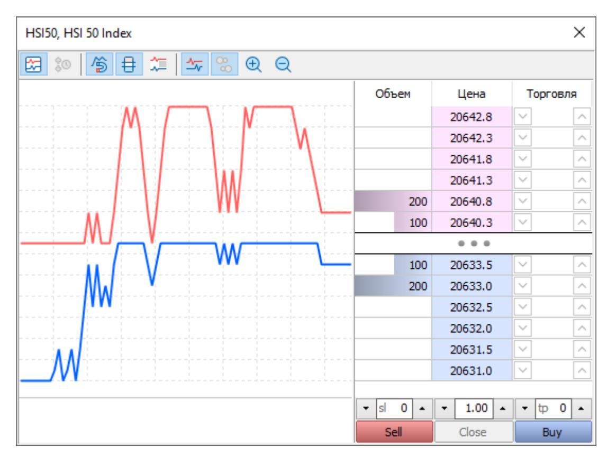

The Depth of Market differs in the exchange and over-the-counter markets:

- · If a symbol is traded in the exchange mode, in which related operations are forwarded to an external trading system (exchange), the Depth of Market features live prices and volumes of market participants' orders.
- · If a symbol is traded on the over-the-counter market (OTC), the order book can be formed from the quotes of the brokerage company, which can provide different prices depending on the buy or sell volume. If the broker does not provide volumes, then the Depth of Market operates as a scalping tool, from which market and pending orders are placed with one click. It displays price levels calculated from the Bid and Ask prices with a price change step.

Depth of Market settings are set for each instrument under the Common section:

| Label           | Value                                    |        |      |
|-----------------|------------------------------------------|--------|------|
| Symbol:         | EURUSD                                   |        |      |
| Description:    | Euro vs US Dollar                        |        |      |
| Exchange:       | Forex                                    |        |      |
| International:  | https://www.google.com/?finance?q=EURUSD |        |      |
| ISIN:           | EUU0009652759                            |        |      |
| Sector:         | Currency                                 |        |      |
| Industry:       | Undefined                                |        |      |
| CFI:            | <b>JFTXCC</b>                            |        |      |
| Basis:          |                                          |        |      |
| Country:        |                                          |        |      |
| Category:       | Currency                                 |        |      |
| Page:           | https://www.google.com/?finance?q=EURUSD |        |      |
| Digits:         | 5                                        |        |      |
| Market depth:   | 32                                       |        |      |
| Spread:         | 10                                       |        |      |
| Chart mode:     | by bid price                             |        |      |
| Spread balance: | -5 bid / 5 ask                           |        |      |
|                 |                                          |        |      |
|                 | OK                                       | Cancel | Help |

The "Market depth" parameter controls the display of the Depth of Market and the orders in it.

The depth is specified for one direction. For example, if you specify 16, then up to 16 buy orders and the same number of sell orders will be displayed in the Depth of Market. The maximum depth is 32 orders in one direction. If you set *disabled*, the symbol will use not an exchange order book, but it will use a scalping Depth of Market tool, which features the best Bid/Ask and prices equally distanced from Bid/Ask (this distance is referred to as the price step) up and down, which enable the quick placing of pending orders.

If the Depth of Market is enabled for a symbol, its charts are based on the Last price (the price of the last executed trade).

Keep in mind that in order to display real orders in the Depth of Market, the transfer of relevant information must be supported by your gateways/data feeds. If you set the depth parameter without broadcasting data, the Depth of Market will be displayed empty.

To disable access to the Depth of Market completely, including the scalping Depth of Market tool, override symbol settings for a client group. Open the Administrator terminal, go to the Symbols tab in group settings and add the required symbol to the list. Next, disable the "Enable market depth" option:

| Group: | demo\demoforex |
|--------|----------------|
|        |                |

| Common | Company | News & Mail | Permissions | Margin | Symbols                                                             | Commissions | Reports |
|--------|---------|-------------|-------------|--------|---------------------------------------------------------------------|-------------|---------|
|        |         |             |             |        | Please set up individual parameters of symbols trade for the group. |             |         |

| Up   | Symbol                |  |  |  | Spread         | Trade   |  |
|------|-----------------------|--|--|--|----------------|---------|--|
| Down | <b>S</b> Forex EURUSD |  |  |  | <b>Default</b> | Default |  |

|  | Symbol: Forex\EURUSD |   |  |  |  |  |  |
|--|----------------------|---|--|--|--|--|--|
|  |                      | ? |  |  |  |  |  |

|  | Common                | Trade                    | Execution    | Margin                                                      | Margin Rates | Swaps |
|--|-----------------------|--------------------------|--------------|-------------------------------------------------------------|--------------|-------|
|  | Add<br>Edit<br>Delete | \$<br>Spread difference: | Symbol:<br>0 | Forex\EURUSD<br>Enable market depth<br>√ Use default spread |              |       |

|  |  | Minimum:<br>0.1 | Limit:<br>$C$ | □ Use default volumes<br>□ Use default limit |  | 0.01<br>Step: |  |  |
|--|--|-----------------|----------------|----------------------------------------------|--|---------------|--|--|

|  |  |  |  |  |  |  |  | OK | Cancel |  | Help |
|--|--|--|--|--|--|--|--|----|--------|--|------|
|--|--|--|--|--|--|--|--|----|--------|--|------|

### <span id="page-25-0"></span>**Execution of trade requests**

The trading platform supports multiple order execution modes. The modes determine which prices will be used in the formation of requests, as well as the rules for their processing. The execution type is configured in a separate section of symbol settings:

| Symbol:                                               | Forex\EURUSD                            |
|-------------------------------------------------------|-----------------------------------------|
| Execution                                             | Instant                                 |
| Max time deviation:                                   | 7 seconds                               |
| Max profit deviation:                                 | 2 points                                |
| Max losing deviation:                                 | 2 points                                |
| Fast confirmation of requotes within client deviation |                                         |
| Maximum volume:                                       | before switching to Request execution 0 |
| Cancel                                                | OK                                      |
|                                                       | Help                                    |

#### <span id="page-26-0"></span>**Instant**

In this mode, the order is executed at the price offered by the client. When an execution request is sent, the client terminal automatically inserts current prices into the order. If a dealer/server accepts the prices, the order will be executed. If the requested price is not accepted, then a Requote is performed: the client is returned the prices at which this order can be executed.

The following settings are available for this mode:

- · **Max time deviation** — the maximum difference (in seconds) between the arrival time of the price at which the client placed the order and the time of the last price. If this limit is exceeded, a requoted new price is sent to the client.
- <span id="page-26-1"></span>· **Max profit deviation** — maximum deviation of the order price from the current symbol price in the direction profitable for the client, above which new order placing prices will be sent to the client.
- · **Max loss deviation** — maximum deviation of the order price from the current symbol price in the direction unprofitable for the client, above which new order placing prices will be sent to the client.
- · **Maximum volume** — the maximum order volume that can be accepted in the instant execution mode. Orders with the larger volume will be automatically switched to the request execution mode.
- · **Fast confirmation of requotes within client deviation** — the option is disabled by default. When creating a trade request in the instant execution mode, the client can specify tolerance, i.e. by how many points the request execution price can differ from the price specified in the order. If a dealer returns a requote in response to such a request, and the requote price is within the tolerable deviation specified by the client, the order will be returned to the dealer for confirmation after the client confirms this new price. If the option is enabled, the order will be executed immediately after the client confirms the price. No additional confirmation from a dealer is required.

The following options are only used if the deal volume exceeds the maximum volume which can be accepted in the instant execution mode. Such deals are executed in the Request execution mode.

- · **Timeout** — time in seconds during which the price issued by the dealer is valid in the request execution mode.
- · **Confirm orders** — if this option is disabled, then after the trader receives quotes from the dealer and agrees to execute a deal at these prices, the dealer will have to additionally confirm the order execution.

#### **Price checks and requotes**

If the price in the trade request exceeds the maximum deviation in the profit or loss direction, the server returns a requote to the client and adds the following log message:

'7009': requote 1.15309 / 1.15329 (instant buy 0.01 EURUSD at 1.15328)[slippage]

If the requoted price provided by the dealer exceeds the maximum deviation specified by the trader in the trade request (order), another requote is sent to the trader. The following message is written to the journal:

'7009': requote 1.15313 / 1.15333 (instant buy 0.01 EURUSD at 1.15331)[dealer deviation]

Apart from checking the price value and time deviation according to symbol settings, the server performs additional checks.

**Checking for presence in the stream.** The price used by a client to set an order, should be present in the quote stream. In other words, a deal cannot be performed at a non-existing price. The price search depth is defined by the "Max time deviation" parameter. If there is no price, the server sends a requote to a client and the appropriate message (deviation is blocked with *count*on *request*) appears in the journal. Here *count*is the counter of invalid client requests, while *request*is the request description. In each such case, the invalid client request counter is increased.

**Checking for obsolescence.** The platform checks if the prices used by a client to place an order are valid. Depending on the market rate, the server calculates the range of the last ticks, within which the requested price is located. On the fast market, the acceptable range is expanded, while on the slow market, it is narrowed. If the price is not within the allowed range, the server sends a requote to the client and adds the following log message: previous price *x* on *request*. Here *x* is the position of the price, at which the client created the request, in the quote stream (0 is the latest price), and *request*is the request description. In each such case, the invalid client request counter is increased.

**Invalid request counter.** The server features the invalid request counter for each client. As soon as the counter exceeds the threshold value, the server starts rejecting subsequent invalid client requests leaving the 'off quotes' message. The appropriate message (deviation is blocked with *count*on *request*) appears in the journal. Here, *count*indicates the counter of invalid client requests, while *request*is the last request description. When a valid client request is received, the counter is decreased.

#### **Request**

In this mode, the market order is executed at the price previously received from the dealer/server. Before submitting a market order, its execution prices are requested. After receiving the prices, the trader can confirm or reject the execution of the order.

The following settings are available for this mode:

- · **Timeout** — time in seconds during which the price issued by the dealer is valid in the request execution mode.
- <span id="page-27-0"></span>· **Confirm orders** — if this option is disabled, then after the trader receives quotes from the dealer and agrees to execute a deal at these prices, the dealer will have to additionally confirm the order execution.

#### **Market**

In this order execution mode, the dealer/server makes a decision about the order execution price without any additional discussion with the trader. Sending a market order by the trader means that the trader agrees with the price at which it will be executed.

#### **Exchange**

In this mode, trade operations conducted via terminals are forwarded to an external trading system (exchange). Trade operations are executed at the prices of the current market offers. The execution rules are determined by the external system.

- · The execution mode for each financial instrument can be [changed](#page-179-0) by a manager with the relevant permissions.
- ·For market orders placed via the Manager terminal there is no division into execution modes.

### <span id="page-28-0"></span>**Trading sessions**

For each instrument, you can determine the time when it can be traded and quoted. Go to the Sessions section and click on the day for which you want to change the schedule.

To set the same sessions for several days at once, select the days in the list with a mouse while holding down the Ctrl or Ctrl+Shift key, and then click *Edit*.

| Symbol       | Forex\EURUSD |
|--------------|--------------|
|              | ×            |
| Common       |              |
| Currency     |              |
| Quotes       |              |
| Trade        |              |
| Execution    |              |
| Margin       |              |
| Margin Rates |              |
| Swaps        |              |
| Sessions     |              |

The setting up of trade and quotation sessions of the symbol by days. During the quotation session it is possible to view the price dynamics but trading is prohibited.

| Day | Sunday |
|-----|--------|
|     |        |

| Day    | Monday      |
|--------|-------------|
| Quotes | 00:00-24:00 |
| Trade  | 00:00-24:00 |

| Sessions EURUSD: Monday |  |
|-------------------------|--|
|                         |  |

The setting up of sessions within the selected day. It is possible to determine several sessions of each type, trading sessions must be within the quotation ones. If specific trade sessions are not determined they will coincide with quotation ones.

| 00:00 | 0 02 04 06 08 10 12 14 16 18 20 22 24 02 04 06 08 10 10 12 14 |
|-------|---------------------------------------------------------------|
|-------|---------------------------------------------------------------|

| Quotes: |  |
|---------|--|
|---------|--|

| Trade: | 112   144   145   148   20   22   24   02   04   06   08   10   112   14   145   146   20   22   24 |
|--------|-----------------------------------------------------------------------------------------------------|
|--------|-----------------------------------------------------------------------------------------------------|

|  | Enable separate trading sessions |
|--|----------------------------------|
|--|----------------------------------|

|  | Cancel |
|--|--------|
|--|--------|

The following session types can be configured here:

- · Quoting sessions. During this time, the platform will receive (and broadcast to traders) quotes from data sources.
- · Trading sessions. During this time, users can perform trading operations for the symbol. When trying to place an order outside the session, the trader will receive the "Market closed" warning.

Both session types often coincide in time, so they are edited together by default. If you need to configure them separately, enable the option "Enable separate trading sessions".

Several quoting and trading sessions can be set up within one day of the week. To add a new session, click on an empty time on the scale and drag the session to the desired value.

The sliders denoting session beginning and end times can be moved with the mouse and with the arrow keys. You can hold down the Shift key to slow down the slider moving speed. This enables a precise configuration of the trading session to the nearest minute.

From the Sessions tab, you can also limit the symbol lifetime. If the symbol should only be available for a specific time, enable the option "Use time limits" and specify the time range. As soon as this period is over, trading will be disabled for this symbol. When trying to place an order, "Trading disabled" will be returned to clients.

- ·Trading and quoting sessions do not affect the ability to trade from the Manager terminal.
- ·Session settings are ignored for spliced symbols as the original symbol sessions can be different.
- · The general platform working time settings that affect all trading instruments are set via MetaTrader 5 Administrator in the Time and Holidays sections.

### <span id="page-29-0"></span>**Price accuracy digits**

Digits indicate the number of decimal places in the symbol price. It is a very important parameter that affects all symbol operations in the platform.

The platform accepts quotes from external data sources through gateways and data feeds in accordance with the specified accuracy. If the data provider supports higher accuracy, the platform will automatically round prices. The same accuracy is used for symbol profit and margin calculations.

Digits are set in the general symbol settings section:

| Symbol:         | EURUSD                                   |
|-----------------|------------------------------------------|
| Description:    | Euro vs US Dollar                        |
| Exchange:       | Forex                                    |
| International:  | https://www.google.com/?finance?q=EURUSD |
| ISIN:           | EUU0009652759                            |
| Sector:         | Currency                                 |
| CFI:            | <b>JFTXCC</b>                            |
| Industry:       | Undefined                                |
| Basis:          | ✓                                        |
| Country:        | ✓                                        |
| Source:         | ✓                                        |
| Category:       | Currency                                 |
| Background:     | None                                     |
| Page:           | https://www.google.com/?finance?q=EURUSD |
| Digits:         | 5                                        |
| Market depth:   | 32                                       |
| Spread:         | 10 pt                                    |
| Chart mode:     | by bid price                             |
| Spread balance: | -5 bid / 5 ask                           |
|                 |                                          |
|                 |                                          |

Changing this setting requires a server restart.

## **Special settings for cryptocurrencies**

MetaTrader 5 supports cryptocurrencies. The relevant trading process does not differ from currency pairs. The only difference is the requirement for greater accuracy in price and monetary values. For conventional instruments, all monetary variables normally have two decimal places. In cryptocurrencies, where the value of one unit can correspond to tens of thousands of dollars, the fractional part can be up to eight decimal places.

Therefore, additional settings are required to ensure correct display and calculations:

- ·Specify [quoting accuracy digits](#page-29-0) for the symbol corresponding to the data you receive
- · Specify digits for the [underlying currency, margin currency and profit currency](#page-132-0) in accordance with the traded cryptocurrency

If all settlements on accounts must also be performed in cryptocurrency, then it must be specified in the client group settings on the server. Open the group via the Administrator terminal and go to the Common section:

| Label                                                               | Value                           |
|---------------------------------------------------------------------|---------------------------------|
| Group:                                                              | real\crypto-btc                 |
| Name:                                                               | real\crypto-btc                 |
| Currency:                                                           | <b>BTC</b>                      |
| Trade server:                                                       | Trade Main, 1                   |
| Digits:                                                             | 2                               |
| Authentication:                                                     | Normal                          |
| Minimum password length:                                            | 1                               |
| One-time password:                                                  | Disabled                        |
| Force one-time password:                                            | √3                              |
| Push notifications:                                                 | None                            |
| Sent from the trade server                                          | 4 5                             |
| Enable connections                                                  | √ Enable connections            |
| Enable certificate confirmation                                     | Enable certificate confirmation |
| Change password at first login                                      |                                 |
| Show the risk warning window after connection                       |                                 |
| Enforce country-specific regulatory restrictions for retail clients |                                 |
|                                                                     |                                 |
|                                                                     |                                 |
|                                                                     |                                 |
|                                                                     |                                 |
|                                                                     |                                 |
|                                                                     |                                 |
|                                                                     |                                 |
|                                                                     |                                 |

Configure the Currency field and set the accuracy Digits.

# <span id="page-31-0"></span>**Common errors**

- · Do not specify the depth of the Market Depth feature in instrument settings if the relevant Level 2 data is not available for the symbol. Otherwise, the order book (Depth of Market) will be displayed empty.
- · Pending orders for exchange instruments are normally triggered at the Last price. However, orders are always executed at Bid and Ask prices.
- · To close a position on a hedging account, it is not enough to perform a similar operation in the opposite direction. The *Close* command must be explicitly selected in the trading dialog.
- ·Changing the accuracy (Digits) in symbol settings requires restarting the entire trading platform.
- · Position increase and reversal are only possible on netting accounts. Closing positions by opposite ones is only available on hedging accounts, even if the corresponding operation type is allowed in symbol settings.

# <span id="page-32-0"></span>**Dealing**

The key task of the dealer is to process clients' trading operations. The main dealing tool is the MetaTrader 5 Manager terminal. However, the dealer should also be aware of some trade server functions which enable proper configuration of the process and automation of certain actions.

#### ·**Processing trade requests**

All orders received from traders are added into the general server queue. The server sets [routing rules](#page-79-0) to determine which orders can be processed automatically and which of them should be forwarded to dealers to be [processed manually](#page-69-0).

In the Manager terminal, the dealer can see the queue of requests forwarded to this specific dealer for processing. The dealer can accept a request for processing and confirm it fully or partially, as well as reject or requote it.

#### ·**Quoting**

The Manager terminal enables the [feeding of prices](#page-77-0) into a quoting stream to fix incorrect prices.

#### ·**Operations with trading databases**

The Manager terminal provides full access to the history of orders, deals and positions. The dealer can view any [operation parameters](#page-52-0) and, subject to certain permissions, correct them. This might be necessary, for example, to eliminate the consequences of [non-market situations](#page-98-0).

#### ·**Trading on accounts on behalf of traders**

Based on the trader's instructions, the dealer can perform any trading operation on the trader's account: place a [pending order](#page-43-0), open, modify or close a [position.](#page-33-0)

#### ·**Access to the server journal**

Via the Manager terminal, you can request [trade server logs](#page-104-0) for detailed analysis of arising disputes. The journal will show all the details of the operation: its origin, creation time and processing details.

In this chapter, we will also look at the [main problems](#page-109-0) which can arise in trading.

# <span id="page-33-0"></span>**Working with trading positions**

| Client    | Position          | Open positions | Remarks             |
|-----------|-------------------|----------------|---------------------|
| Company A | Sales Manager     | 5              | Urgent              |
| Company B | Software Engineer | 3              | Interview scheduled |
| Company C | HR Specialist     | 2              | Screened            |

| File<br>Edit<br><b>Tools</b><br>View | Window<br>Help      |           |               |                     |                     |                        |              |  |
|--------------------------------------|---------------------|-----------|---------------|---------------------|---------------------|------------------------|--------------|--|
| <b>Navigator</b>                     | Login               | Position  | Symbol<br>$▲$ | Time                | Type                | Volume                 | Price<br>$∧$ |  |
| <b>MetaTrader 5 Manager</b>          | 1835539             | 289817871 | eurusd        | 2022.03.02 15:50:17 | buy                 | 100                    | 1.10830      |  |
| Servers                              | 1835539             | 289817872 | eurusd        | 2022.03.02 15:50:23 | buy                 | 100                    | 1.10829      |  |
| Analytics                            | 1835539             | 289817875 | eurusd        | 2022.03.02 15:50:27 |                     |                        |              |  |
| Server Reports                       | 1835539             | 289817876 | eurusd        | 2022.03.02 15:50:32 |                     | <b>Account Details</b> |              |  |
| Clients & Orders                     | 1835539             | 289817877 | eurusd        | 2022.03.02 15:50:35 |                     | Bulk Closing           |              |  |
| Online Users (17)                    | 1835539             | 289817878 | eurusd        | 2022.03.02 15:50:40 |                     | Bulk Payments          |              |  |
| Clients (9 590)                      | 1835539             | 289817879 | eurusd        | 2022.03.02 15:50:45 |                     | Split Positions        |              |  |
| Trading Accounts (8 831)             | 1835539             | 289817880 | eurusd        | 2022.03.02 15:50:49 |                     |                        |              |  |
| Positions (1 345)                    | 1835643             | 285549892 | eurusd        | 2022.02.07 19:57:57 | edit                |                        |              |  |
| Orders (304)                         | 1835643             | 285549893 | eurusd        | 2022.02.07 19:57:57 | delete              |                        |              |  |
| Subscriptions                        | 1835643             | 285549966 | eurusd        | 2022.02.07 21:30:00 |                     | Select By              |              |  |
| Dealing                              | 1835643             | 285550003 | eurusd        | 2022.02.07 23:25:02 |                     |                        |              |  |
| Groups (179)                         | 1835672             | 289755372 | eurusd        | 2022.02.09 14:45:40 |                     | Filter                 |              |  |
| Plugins (3)                          | 1836507             | 289754851 | eurusd        | 2022.02.08 21:37:02 |                     | Copy As                |              |  |
| Mailbox (8,079)                      | 1836653             | 289796204 | eurusd        | 2022.02.11 03:39:59 |                     | Journal By             |              |  |
| Support Center                       | 1836653             | 289796205 | eurusd        | 2022.02.11 03:40:05 | $Ø$ Export          |                        |              |  |
| App Store                            | 1836828             | 304051890 | eurusd        | 2022.06.28 19:48:08 | Q Find              |                        | $Ctrl + F$   |  |
| Market Watch                         | 2022.02.15 14:21:28 | 1836864   | 289799294     | eurusd              | 2022.02.15 14:21:28 |                        |              |  |
| Ask                                  | 1                   | 94.831    | eurusd        | 2022.02.15 14:21:30 |                     | Volumes                |              |  |
| 0.67024                              | AUDCHF              | 0.66944   | eurusd        | 2022.02.15 14:21:30 |                     | Show Milliseconds      |              |  |
| 94.831                               | AUDJPY              | 94.771    | eurusd        | 2022.02.15 14:21:30 |                     | Auto Arrange           |              |  |
| 7 AUDNZD                             | 1.10374             | 1.10494   | ∼             | 2022.02.17 05:50:00 |                     |                        |              |  |
| Details                              | 1836910             | 289801776 | eurusd        | 2022.02.16 20:16:59 | $✓$ Grid            |                        | G            |  |
| For Help, press F1                   | 1004000             | 200001225 | المستنب       | 2022.02.14 14:21    |                     | Columns                | 0            |  |

Each position is displayed along with the necessary information: user login, ticket, date, etc. The set of displayed data can be customized using the context menu. A description of all position parameters is available in the section [Viewing and editing trading operations](#page-65-0).

Double-click on a position to go to the dialog of the account to which it belongs. You can [modify](#page-39-0) or [close](#page-35-0) the position from there. Using the context menu, you can switch to [corporate actions](#page-213-0), export information about positions to a file and set [filtration.](#page-40-0) Using the *Journal...* command, you can quickly request the selected trading position journal from the trade server.

### **Position details and editing**

The trading operation dialog is a fully-featured tool with a plethora of advanced features, such as the display of the structure of operations, visualization, tick history and logs. To open the dialog, select a position from the list and click *View* in its context menu. If your account has permissions to modify trading operations, the *Edit* command will be shown in the menu instead of *View*. For further details about the trading dialog please see the section [Viewing and editing trading operations](#page-65-0).

# <span id="page-34-0"></span>**Position opening**

Opening a position or entering the market means the primary purchase or sale of a certain amount of a financial instrument. The manager can open positions on client accounts by placing [pending orders](#page-8-0). Order activation leads to an execution of a [deal](#page-7-1)which results in a position.

| 1863 - MetaQuotes - John Smith<br>Ō.                     |                                  |                        |                                     |                             |                   |                               | □              | × |
|----------------------------------------------------------|----------------------------------|------------------------|-------------------------------------|-----------------------------|-------------------|-------------------------------|----------------|---|
| File<br>Edit<br>View                                     | Window<br><b>Tools</b>           | Help                   |                                     |                             |                   |                               |                |   |
| $\Phi_{\Phi}$<br>१९९<br>↗<br>IÐ<br>隯                     |                                  | K<br>囤                 | <b>223 Automation → Connect</b>     |                             | జ                 | 군<br>$\equiv$ Filter          |                | Q |
| Navigator                                                | ×<br>Login                       | Name                   |                                     |                             | Group             | Country                       | <b>Balance</b> | Λ |
| 용<br>MetaTrader 5 Manager<br>由 早 Servers                 | 2 883873                         |                        | <b>Anderson Timothy</b>             |                             |                   | $\mathbf{L} \cdot \mathbf{D}$ | 4 998 857.23   |   |
| in analytics                                             |                                  | 883874<br>Cook Brandon |                                     | + New Account               |                   | Ctrl+Shift+N                  | 4 996 854.67   |   |
| ⊞                                                        | <u>은 883875</u>                  | Martin Jackson         | 随                                   | <b>Account Details</b>      |                   |                               | 4 999 945.67   |   |
| & Account: 883873, Anderson Timothy, USD, 1:100, Netting |                                  |                        |                                     |                             |                   |                               |                | × |
| Overview                                                 | Exposure Personal Account Limits |                        | Profile Subscriptions Balance Trade |                             | History Security  |                               |                |   |
| <b>EURUSD</b>                                            |                                  | Symbol:                | EURUSD, Euro vs US Dollar           |                             |                   |                               | $\checkmark$   |   |
|                                                          |                                  | Type:                  | Market Order                        |                             |                   |                               |                |   |
|                                                          |                                  |                        |                                     |                             |                   |                               |                |   |
| $\overline{+}$                                           |                                  | Volume:                |                                     | H<br>1.00                   | 100 000 EUR       |                               |                |   |
| $\overline{+}$                                           | 1.02975                          | Fill Policy:           | Return                              |                             |                   |                               |                |   |
|                                                          |                                  | At Price:              |                                     | $\frac{1}{\tau}$<br>1.03000 | Update            | $\sqrt{}$ Auto                |                |   |
|                                                          |                                  | Stop Loss:             |                                     | ÷<br>0.00000                | Take Profit:      |                               | ÷<br>0.00000   |   |
| i<br>Historia                                            |                                  | Comment:               |                                     |                             |                   |                               |                |   |
| Ma                                                       | 1.02970<br>1.02969               |                        |                                     |                             |                   |                               |                |   |
| Šy                                                       |                                  |                        |                                     |                             |                   |                               |                |   |
| ↘                                                        |                                  |                        |                                     |                             | 1.02969 / 1.02969 |                               |                |   |
| N                                                        |                                  |                        |                                     |                             |                   |                               |                |   |
| N                                                        | 1.02965                          |                        | Sell at 1.02969                     |                             |                   | Buy at 1.02969                |                |   |
| S                                                        |                                  |                        |                                     |                             |                   |                               |                |   |
| Sho                                                      |                                  |                        |                                     |                             |                   |                               |                |   |
| 2022.08.12                                               | 11:17 11:18 11:18 11:19:12       |                        |                                     |                             |                   |                               |                |   |
|                                                          |                                  |                        |                                     |                             |                   |                               |                |   |
| New Client                                               |                                  |                        |                                     |                             | Update            | Cancel                        | Help           |   |

To open a position, open the account dialog and go to the Trade tab.

The left-hand side of the window shows the chart of the selected symbol, and the right-hand side window contains the order placing form. Select a symbol and set *Market Order* in the Type field. Next, fill in the order parameters:

- · **Volume** — order volume in lots. The greater the volume of a deal, the greater its potential profit or loss, depending on where the symbol price will go. The deal volume also affects the [margin](#page-154-0)reserved on the trading account for the position.
- ·**Fill Policy** — additional [order filling rules.](#page-16-0) Available fill types are determined by the symbol settings.

- · **At Price** — the price at which the order will be placed. When you open the window, the current value of the buy price is specified in this field. If the Auto option is enabled, then the current Bid and Ask prices will be automatically used when executing deals (the current Bid or Ask price at the time the Sell or Buy button was pressed). If the option is disabled, the price can be specified manually. When you click *Update*, the current Ask price is substituted in the price field.
- · **Stop Loss** — the [Stop Loss](#page-10-0) level. The level is set to limit the position loss. If you leave a zero value in this field, this type of order will not be attached.
- · **Take Profit** — the [Take Profit](#page-10-0) level. The level is set to lock in profits of the position. If you leave a zero value in this field, this type of order will not be attached.
- ·**Comment** — a text comment to the order. Maximum comment length is limited to 31 characters.

After specifying all the necessary parameters, click *Sell* or *Buy*. This will send an order to open a short or long position, respectively, to the server.

Unlike client terminals, different [filling modes](#page-25-0) are not applied to orders in the Manager terminal. The trade server executes deals at the specified price.

## <span id="page-35-0"></span>**Closing positions**

When you close a trade position, an operation opposite to the first one is executed. For example, if the first trade operation was buying one lot of GOLD, then to close the position, you should sell one lot of the same instrument.

Open the Overview section of the account dialog and select the position to be closed. Then, click *Close Position* in its context menu. The window for closing a position is similar to opening, but it has the additional *Close...* button at the bottom:

A click on it will close the position at the specified price, partially or completely, depending on the specified volume.

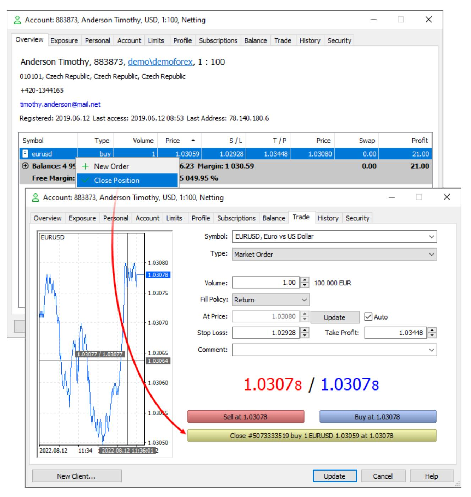

Pay attention to the following:

- · A position can be closed fully or partially, depending in the volume of the deal executed in the opposite direction.
- · To close a position in the [netting system,](#page-18-1) perform an opposite trading operation for the same symbol and the same volume. To close a position in the hedging system, explicitly select the *Close Position* command.

# **Closing By**

The Close By operation simultaneously closes two opposite positions for the same financial instrument. If opposite positions have different lot values, only one of them will be left open. Its volume will be equal to the difference between the lot values of the two positions, while the direction and open price of the remaining position will be the same as the direction and open price of a larger position.

Compared to an individual closure, the Close By operation allows the trader to save on one spread:

- · If the positions are closed separately, the trader pays the spread two times: the Buy position is closed at Bid, and the Sell position is closed at Ask.
- · When using an opposite position, an open price of the second position is used to close the first one, while an open price of the first position is used to close the second one.

Open the Overview section of the account dialog and select the position to be closed. Then, click *Close Position* in its context menu. Select *Close By* in the Type field:

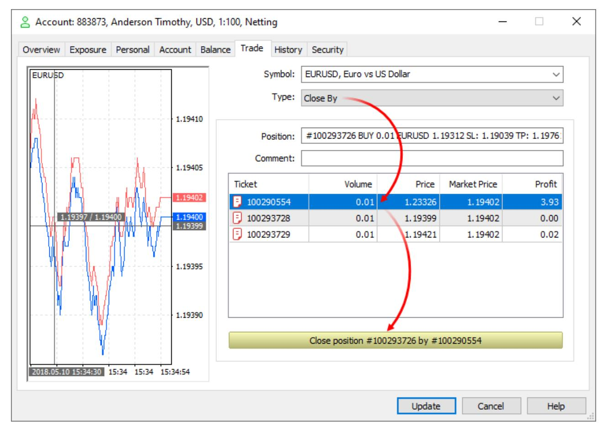

Choose a position and click *Close*.

When closing opposite positions, a Close By order is placed. The tickets of the positions to close are specified in the order comment. A pair of opposite positions is closed by two deals of the Out By type. Total profit/loss resulting from closing both positions is specified only in one deal.

| Account                                       | Overview            | Exposure | Personal    | Account  | Balance     | Trade      | History     | Security        |         |
|-----------------------------------------------|---------------------|----------|-------------|----------|-------------|------------|-------------|-----------------|---------|
| 883873, Anderson Timothy, USD, 1:100, Netting | Time                | Symbol   | Ticket      | Type     | Volume      | Price      | Profit      |                 |         |
|                                               | 2018.03.23 14:32:27 | eurusd   | 100290549   | buy      | 0.01 / 0.01 | market     |             |                 |         |
|                                               | 2018.03.23 14:32:27 | eurusd   | 100307551   | in       | 0.01        | 1.23375    | 0.00        |                 |         |
|                                               | 2018.03.23 14:32:54 | eurusd   | 100290550   | sell     | 1.00 / 1.00 | market     |             |                 |         |
|                                               | 2018.03.23 14:32:54 | eurusd   | 100307552   | in       | 1.00        | 1.23346    | 0.00        |                 |         |
|                                               | 2018.03.23 14:33:00 | eurusd   | 100290551   | buy      | 1.00 / 1.00 | market     |             |                 |         |
|                                               | 2018.03.23 14:33:00 | eurusd   | 100307553   | out      | 1.00        | 1.23331    | 0.00        |                 |         |
|                                               | 2018.03.23 14:33:09 | eurusd   | 100290552   | sell     | 0.01 / 0.01 | market     |             |                 |         |
|                                               | 2018.03.23 14:33:09 | eurusd   | 100307554   | in       | 0.01        | 1.23346    | 0.00        |                 |         |
|                                               | 2018.03.23 14:33:39 | eurusd   | 100290553   | sell     | 0.01 / 0.01 | market     |             |                 |         |
|                                               | 2018.03.23 14:33:39 | eurusd   | 100307555   | in       | 0.01        | 1.23331    | 0.00        |                 |         |
|                                               | 2018.03.23 14:33:41 | eurusd   | 100290554   | sell     | 0.01 / 0.01 | market     |             |                 |         |
|                                               | 2018.03.23 14:33:41 | eurusd   | 100307556   | in       | 0.01        | 1.23326    | 0.00        |                 |         |
|                                               | 2018.03.23 14:59:49 | eurusd   | 100290555   | close by | 0.01 / 0.01 |            | 1.23346     | #100290549 by # |         |
|                                               | 2018.03.23 14:59:49 | eurusd   | 100307557   | out by   | 0.01        | 1.23346    | -0.03       |                 |         |
|                                               | 2018.03.23 14:59:49 | eurusd   | 100307558   | out by   | 0.01        | 1.23375    | 0.00        |                 |         |
|                                               | 2018.03.26 02:55:00 | eurusd   | 100290741   | buy      | 0.01 / 0.01 | 1.23831    | [s] 1.23831 |                 |         |
|                                               | 2018.03.26 02:55:00 | armied   | 100307747   | out      | n n 1       | 1.73931    | JA 50       |                 |         |
|                                               |                     |          | All history |          | ✓           | 1970.01.01 |             | 2018.05.11      | Request |

This type of operations can only be used with the [hedging](#page-19-0) position accounting system.

# <span id="page-39-0"></span>**Editing positions**

Subject to appropriate rights, managers can modify parameters of clients' open positions.

Open the Overview section in the account dialog and select the position to be modified. Then click *Modify or Cancel* in its context menu.

| Account: 3641817, Cooper Jeremiah, USD, 1:100, Hedge<br>Overview | Exposure Personal Account Limits                                          |                      |                               |            | Profile Subscriptions Balance Trade History Security                                                                                        |                           |              |         |                                                                                      |          |        | $\times$                 |          |
|------------------------------------------------------------------|---------------------------------------------------------------------------|----------------------|-------------------------------|------------|---------------------------------------------------------------------------------------------------------------------------------------------|---------------------------|--------------|---------|--------------------------------------------------------------------------------------|----------|--------|--------------------------|----------|
| 010101, Turkey, Turkey, Turkey                                   |                                                                           |                      |                               |            | Cooper Jeremiah, 3641817, demo\two\forex-hedged-15, 1:100<br>Registered: 2021.12.13 Last access: 2021.12.13 17:31 Last Address: 94.130.2.61 |                           |              |         |                                                                                      |          |        |                          |          |
| Symbol                                                           | Type                                                                      | Volume               |                               | Price<br>٠ | S/L                                                                                                                                         |                           | T/P          |         | Price                                                                                | Swap     |        | Profit                   |          |
| eurusd                                                           | + New Order                                                               |                      |                               | 2902       | 1.01902                                                                                                                                     |                           | 1.03902      | 1.02920 |                                                                                      | 0.00     |        | 18.00                    |          |
| eurusd                                                           |                                                                           | Close Position       |                               | 2905       | 1.03905                                                                                                                                     |                           | 1.01905      | 1.02920 |                                                                                      | 0.00     |        | $-15.00$                 |          |
| E<br>eurusd                                                      |                                                                           | Modify or Cancel     |                               | 2905       | 1.01905                                                                                                                                     |                           | 1.03905      | 1.02920 |                                                                                      | 0.00     |        | 15.00                    |          |
| <b>E</b> Balance: 5 000                                          |                                                                           |                      |                               |            | 09 Commission: -5.00 Margin: 1029.04                                                                                                        |                           |              |         |                                                                                      | 0.00     |        | 18.00                    |          |
| Overview                                                         | Account: 3641817, Cooper Jeremiah, USD, 1:100, Hedge<br>Exposure Personal |                      | Account Limits                |            | Profile                                                                                                                                     | Subscriptions Balance     |              | Trade   | History                                                                              | Security |        | $\Box$                   | $\times$ |
| <b>EURUSD</b>                                                    |                                                                           |                      |                               |            | Symbol:                                                                                                                                     | EURUSD, Euro vs US Dollar |              |         |                                                                                      |          |        |                          |          |
|                                                                  |                                                                           |                      |                               |            |                                                                                                                                             |                           |              |         |                                                                                      |          |        | $\overline{\phantom{a}}$ |          |
|                                                                  |                                                                           |                      | 1.02920                       |            | Type:<br>Position:                                                                                                                          | Modify Position           |              |         | #5073333527 BUY 1 EURUSD 1.02902 SL: 1.01902 TP: 1.03902                             |          |        |                          |          |
|                                                                  |                                                                           |                      | 1.02915                       |            | Stop Loss:                                                                                                                                  |                           | ÷<br>1.01902 |         | 1000                                                                                 | ÷        | points |                          |          |
|                                                                  |                                                                           |                      |                               |            | Take Profit:                                                                                                                                |                           | ÷<br>1.03902 |         | 1000                                                                                 | ÷۱       | points |                          |          |
|                                                                  |                                                                           |                      | 1.02910                       |            | Comment:                                                                                                                                    |                           |              |         |                                                                                      |          |        |                          |          |
|                                                                  |                                                                           |                      | 1.02905<br>1.02.00<br>1.02895 |            |                                                                                                                                             |                           |              |         | 1.02895 / 1.02895<br>Modify #5073333527 buy 1 EURUSD 1.02902 sl: 1.01902 tp: 1.03902 |          |        |                          |          |
| 2022.08.12                                                       | 12:46                                                                     | 12:46 12:47 12:47:23 |                               |            |                                                                                                                                             |                           |              |         |                                                                                      |          |        |                          |          |
|                                                                  | Client Properties                                                         |                      |                               |            |                                                                                                                                             |                           |              |         | Update                                                                               | Cancel   |        |                          | Help     |

The Position field displays basic information: ticket, direction, volume, symbol and open price. Open price is a weighted average price: (price of deal 1 \* volume of deal 1 + ... + price of deal N \* volume of deal N) / (volume of deal 1 + ... + volume of deal N). The rounding accuracy of the average weighted price is equal to the number of decimal places in the symbol price plus three additional digits.

The following position parameters can be changed:

- · **Stop Loss** — the Stop Loss level. In the first box, you can specify the absolute value of the level and in the second specify the difference between the level and the average position price in points.
- · **Take Profit** — the Take Profit level. In the first box, you can specify the absolute value of the level and in the second specify the difference between the level and the average position price in points.
- ·**Comment** — comment to the position. The field is read-only and cannot be changed.

The current Bid and Ask prices are shown below. After setting new parameters, click *Modify...*

# **General information about trading operations**

Up to 128 trade requests can be sent to the server simultaneously. If this limit is exceeded, the server will return an error.

Trading dialogs enable quick modifications of prices, volumes, Stop Loss and Take Profit levels by a certain amount. To do this, hold down the Ctrl or Shift keys while editing the corresponding fields with the arrows:

- ·Shift — change by 5 points
- ·Ctrl — change by 10 points
- ·Ctrl+Shift — change by 50 points

# <span id="page-40-0"></span>**Position filtering**

Use filters for convenient work with positions. By default, the list shows all positions available to the manager. You may use filters to view information that meets certain criteria. For example, you can view operations on a specific instrument or operations of a certain volume and direction.

To apply a previously created filter, select it from the Filter menu in the list of accounts or clients. To return to the initial list of accounts, click *None*.

| 1863 - MetaQuotes - John Smith                                                                                                                            |         |              |                                 |          |                  |        | ×<br>□                |   |
|-----------------------------------------------------------------------------------------------------------------------------------------------------------|---------|--------------|---------------------------------|----------|------------------|--------|-----------------------|---|
| File                                                                                                                                                      | Edit    | View         | <b>Tools</b>                    | Window   | Help             |        |                       |   |
| $	ext{P}_{	ext{ab}}$<br>毱<br>IÐ<br>匾                                                                                                                      | a       | ľŕ<br>. (عُ) | <b>2</b> 2 Automation → Connect | ౚ        | $	ext{≡}$ Filter | 군      |                       | Q |
| Navigator<br>×                                                                                                                                            | Login   | Position     | Symbol<br>$ar{	ext{}}$         | Time     | Type             | Volume | Price                 |   |
| 몽 MetaTrader 5 Manager                                                                                                                                    | 3767842 | 5072762994   |                                 | 13:32:51 | buy              | 0.02   | 0.88222               |   |
| 由 ·· 早 Servers                                                                                                                                            | 3767843 | 5072876095   | <b>Account Details</b>          | 13:35:42 | sell             | 0.11   | 0.88185727            |   |
| in Analytics                                                                                                                                              | 3767844 | 5072874564   | √ Bulk Closing                  | 13:35:40 | sell             | 0.02   | 0.88178               |   |
| <b>e</b> Co Server Reports                                                                                                                                | 3767845 | 5072596684   | S. Bulk Payments                | 13:28:36 | buy              | 0.21   | 0.88175143            |   |
| e- 2= Clients & Orders                                                                                                                                    | 3767848 | 5072758649   | ↑ Split Positions               | 13:32:46 | sell             | 0.02   | 0.88202               |   |
| $	extstylerac{1}{2}$ Clients (6 219)                                                                                                                     | 3767850 | 5072761290   | 愈 Edit                          | 13:32:49 | sell             | 0.08   | 0.88215               |   |
| $	extstylerac{1}{2}$ Trading Accounts (                                                                                                                  | 3767851 | 5072796892   | $	imes$ Delete<br>$Ctrl + D$    | 13:33:44 | sell             | 0.03   | 0.88186               |   |
| $	extstylerac{1}{2}$ Positions (41 875)                                                                                                                  | 3767854 | 5072876100   | r<br>Select By                  | 13:35:42 | sell             | 0.01   | 0.88178               |   |
|                                                                                                                                                           | 3767855 | 5072877072   | Filter                          | ☐ None   |                  | 0.06   | 0.88195               |   |
| <b>e</b> ○ Subscriptions<br>$- rac{4oldsymbol{	imes} oldsymbol{rac{	extstyle 4	extstyle oldsymbol{rac{	extstyle 	extstyle rac{4	ext{π}}{	ext{V}}}$ | 3767856 | 5072501299   | ▶                               |          |                  | 0.42   | 0.88177253            |   |
| 画 8 Groups (2 745)                                                                                                                                        | 3767858 | 5072915581   | Copy As                         |          | By size          | 0.08   | 0.88206               |   |
| $∩$ Plugins (5)                                                                                                                                           | 3767861 | 5072915435   | Journal By                      |          | By symbol        | 0.04   | 0.88206               |   |
| $lacksquare$ Mailbox (21 992)                                                                                                                            | 3767865 | 5072804460   | <b>⊘</b> Export                 |          | Short only       | 0.08   | 0.88169               |   |
| <b>e-C</b> Support Center                                                                                                                                 | 3767867 | 5072918129   | $Q$ Find<br>$Ctrl + F$          |          |                  | 0.03   | 0.88206               |   |
| 由 App Store                                                                                                                                               | 3767868 | 5072919647   | r                               | ණ        | Customize        | 0.13   | 0.88209               |   |
|                                                                                                                                                           | 3767874 | 5072863123   | Volumes                         | 13:35:27 | sell             | 0.1    | $0.88172$ $	ext{vee}$ |   |
|                                                                                                                                                           |         |              | Show Milliseconds               |          |                  | 봄      | all 5032 / 20 KB      |   |

To create or edit filters, click *Customize*. The list of all previously created filters is shown in the Filters tab. Click twice on a filter to change its parameters.

| Positions Filters                                                                                     |                                                                            |                                                                                                                         |
|-------------------------------------------------------------------------------------------------------|----------------------------------------------------------------------------|-------------------------------------------------------------------------------------------------------------------------|
| <b>Filters</b><br>Edit Filter                                                                         |                                                                            |                                                                                                                         |
| <b>Name</b><br>$oxed{3}$ By size<br><b>By symbol</b><br>圓<br>$+$ New Filter                          | <b>Filter</b><br>Symbol: EURUSD; Volume: from 10<br>Symbol: EURUSD         | Ins   ell; Symbol: EURUSD; Volume: from 10                                                                              |
| <b>Q</b> Edit Filter<br>$	imes$ Delete Filter<br>$	extcheckmark$ Auto Arrange<br>$	extcheckmark$ Grid | <b>Positions Filters</b><br><b>Edit Filter</b><br>Filters                  | ×<br>$\Box$                                                                                                             |
|                                                                                                       | <b>Filter name:</b><br>Type:<br>Symbol:                                    | By symbol<br>Any<br>+<br>EURUSD, Euro vs US Dollar<br>$	extcheckmark$                                                   |
|                                                                                                       | <b>Volume:</b><br><b>Created:</b><br><b>Reason:</b><br><b>External ID:</b> | ۰<br>X 2022.08.12 14:07<br>X 2022.08.12 14:07<br>⊞∽<br>$oxed{	op}$<br>$\blacksquare$<br>Any<br>$\textcheckmark$<br>$+$ |
|                                                                                                       |                                                                            | <br>Cancel<br>Apply<br>Save                                                                                             |

Set the name of the filter and then configure parameters for filtering accounts:

- ·**Type** — show positions of a certain direction: Buy or Sell.
- · **Symbol** — show positions for the selected trading instrument. A symbol mask can be specified here. For example, EUR\* — all rates to the euro.
- · **Volume** — show positions with the volume within the specified range. Use this filter to keep track of big players.
- · **Created** — show positions which were created in the specified time interval. If an abnormal situation occurs, use the filter to find all related trading operations.
- · **Reason** — show positions with the certain [creation reason](#page-66-0): opened by client manually or via a trading robot, opened by dealer or API, etc.
- · **External ID** — display positions with the specified identifier in the external system (in the exchange). This filter will allow you to work with positions forwarded to the specified external trading system.

You can immediately enable the filter from the editing window by clicking *Apply*.

Filters enable selection of entries not only based on fields matching the specified value, but also by the "Except" and "Not empty field" parameters. Enter the desired value in the filter field and click , it will change to . The filter will select positions whose parameters do not match the specified value. For example, you can use the filter to create a list of operations on all symbols which do not belong to the specified group, as well as of positions except those opened by trading robots or positions without an external ID. In the latter case, switch the filter mode and leave the field blank.

# <span id="page-43-0"></span>**Working with trading orders**

| 1863 - MetaQuotes - John Smith |                  |            |            |                     |                        |          | $\Box$                   | ×       |              |
|--------------------------------|------------------|------------|------------|---------------------|------------------------|----------|--------------------------|---------|--------------|
| File                           | Edit             | View       | Window     | Help                |                        |          |                          |         |              |
|                                |                  |            |            |                     |                        |          |                          |         |              |
| $\Phi_{\Phi}$                  |                  |            |            |                     | Automation             | Connect  |                          |         |              |
| 穞                              |                  |            |            |                     | Filter                 | $\equiv$ |                          |         |              |
| 震                              |                  |            |            |                     | 군                      |          |                          |         |              |
| ١Ð                             |                  |            |            |                     |                        |          |                          |         |              |
| Navigator                      | $<\pmb{\times}$  |            |            |                     |                        |          |                          |         |              |
| MetaTrader 5 Manager           | <b>D</b> 3768165 | 5072914821 | audcad     | 2022.07.14 13:36:37 | sell limit             | 0.07/0   |                          | 0.95261 |              |
| Servers                        | 3768308          | 5072914843 | euraud     | 2022.07.14 13:36    | <b>Account Details</b> |          |                          | 1.41556 |              |
| Analytics                      | 3768013          | 5072914847 | eurcad     | 2022.07.14 13:36    |                        |          |                          | 1.39306 |              |
| Server Reports                 | 3768266          | 5072914868 | audcad-1   | 2022.07.14 13:36    | <b>W</b> Bulk Closing  |          |                          | 0.93543 |              |
| Clients & Orders               | 3768175          | 5072914871 | audjpy     | 2022.07.14 13:36    | Edit                   |          |                          | 98.874  |              |
| Online Users (6)               | 3767876          | 5072914881 | audjpy     | 2022.07.14 13:36    | Delete                 |          | $Ctrl+D$                 | 86,748  |              |
| Clients (6,219)                | 3768176          | 5072914883 | eurcad     | 2022.07.14 13:36    |                        |          |                          | 1.19673 |              |
| Trading Accounts (69,571)      | 3768228          | 5072914894 | eurcad     | 2022.07.14 13:36    | Select By              |          |                          | 1.43255 |              |
| Positions (41,875)             | 3768055          | 5072914916 | eurnzd     | 2022.07.14 13:36    | Filter                 |          |                          | 1.49840 |              |
| Orders (13,472)                | 3768182          | 5072914922 | eurjpy     | 2022.07.14 13:36    | Copy As                |          |                          | 126.588 |              |
| Subscriptions                  | 3767836          | 5072914930 | eurgbp     | 2022.07.14 13:36    | Journal By             |          |                          | 0.92318 |              |
| Dealing                        | 3768258          | 5072914931 | usdcad     | 2022.07.14 13:36    | Export                 |          |                          | 1.19530 |              |
| Groups (2,745)                 | 3768194          | 5072914938 | gbpchf     | 2022.07.14 13:36    | Find                   |          | $Ctrl+F$                 | 1.09307 |              |
| Plugins (5)                    | 3768105          | 5072914952 | usdchf     | 2022.07.14 13:36    |                        |          |                          | 1.07264 |              |
| Mailbox (21,992)               | 3768000          | 5072914966 | audcad-1   | 2022.07.14 13:36    | Volumes                |          |                          | 0.93543 |              |
| Support Center                 | 3768131          | 5072914977 | gbpjpy     | 2022.07.14 13:36    |                        |          |                          | 179.003 |              |
| App Store                      | 3767956          | 5072914978 | eurchf     | 2022.07.14 13:36    |                        |          | <b>Show Milliseconds</b> | 0.99503 |              |
| Market Watch                   | 3768019          | 5072914986 | eurgbp     | 2022.07.14 13:36    | Auto Arrange           |          | Α                        | 0.92322 |              |
| Ask1                           |                  | 3768062    | eurjpy.fix | 2022.07.14 13:36    | $\checkmark$ Grid      |          |                          | 151.636 |              |
| <b>EURCHF</b>                  | 0.97031 0.97061  | 3768084    | gbpjpy     | 2022.07.14 13:36    | Columns                |          |                          | 149.458 |              |
| 0.84836 0.84841                | <b>EURGBP</b>    | 3768256    | gbpusd     | 2022.07.14 13:36    |                        |          |                          | 1.08730 |              |
| S                              | Symbols          | 3768204    | eurusd     | 2022.07.14 13:36    | buy limit              | 0.09/0   |                          | 0.96080 | $\mathbf{v}$ |
| Help, press F1                 |                  |            |            |                     |                        |          |                          |         |              |

Managers can view the list of all current [pending orders](#page-8-1) placed by the relevant clients:

Each order is displayed along with the necessary information: user login, ticket, date, etc. The set of displayed data can be customized using the context menu. A description of all position parameters is available in the section [Viewing and editing trading operations](#page-56-0).

Double-click on the order to go to the dialog of the account to which it belongs. From this dialog, you can [modify](#page-46-0) [or delete](#page-46-0) the order. Using the context menu you can access [bulk order deletion](#page-214-0)option, export order information to a file and set [filtration](#page-49-0). Using the *Journal...* command, you can quickly request the selected order journal from the trade server.

# **Order details and editing**

The trading operation dialog is a fully-featured tool with a plethora of advanced features, such as the display of the structure of operations, visualization, tick history and logs. To open the dialog, select an order from the list and click *View* in its context menu. If your account has permissions to modify trading operations, the *Edit* command will be shown in the menu instead of *View*. For more details, please view the [separate section.](#page-52-0)

# **Moving orders to history**

Any open order can be canceled and moved to history. This will change its status to Canceled. Open the [order](#page-56-0) [dialog](#page-56-0) and click *To History*:

| Dealer ID:            |                            |
|-----------------------|----------------------------|
| Expert ID:            | 173339640206990851         |
| External ID:          |                            |
| Comment:              | Demo                       |
| Disabled activations: |                            |
| Modifications:        |                            |
| Take profit:          | $0.00000$ $\Rightarrow$    |
| Margin rate:          | $0.80898000$ $\Rightarrow$ |

Report…

To History Update Cancel HelpOrders moved to history are not executed or triggered, and no margin is charged for them.

### **Reopening orders**

Pending orders from the client's trading history can be reopened. Before reopening an order, the client's trading positions and balance should be properly corrected:

- ·Delete the deal opened according to the order.
- · Correct the client's positions. To do this, open the account dialog in MetaTrader 5 Administrator and execute the *Fix Positions* command in the context menu of the Overview tab.
- · Correct the client's balance. Select the appropriate account in the list in MetaTrader 5 Administrator and execute *Balance* -> *Fix Balance* command in the context menu.

After that, the triggered order can be reopened. To do this, go to the History section of the account, open the required order for editing and click *Reopen*:

| Expert ID:            | 173339640206990851 |        |        |        |      |
|-----------------------|--------------------|--------|--------|--------|------|
| External ID:          |                    |        |        |        |      |
| Comment:              | Demo               |        |        |        |      |
| Disabled activations: |                    |        |        |        |      |
| Modifications:        |                    |        |        |        |      |
| Margin rate:          | 1.27681000         |        |        |        |      |
|                       |                    |        |        |        |      |
| Report…               |                    | Reopen | Update | Cancel | Help |

# <span id="page-45-0"></span>**Placing pending orders**

To place a pending order, open the account dialog and go to the Trade tab.

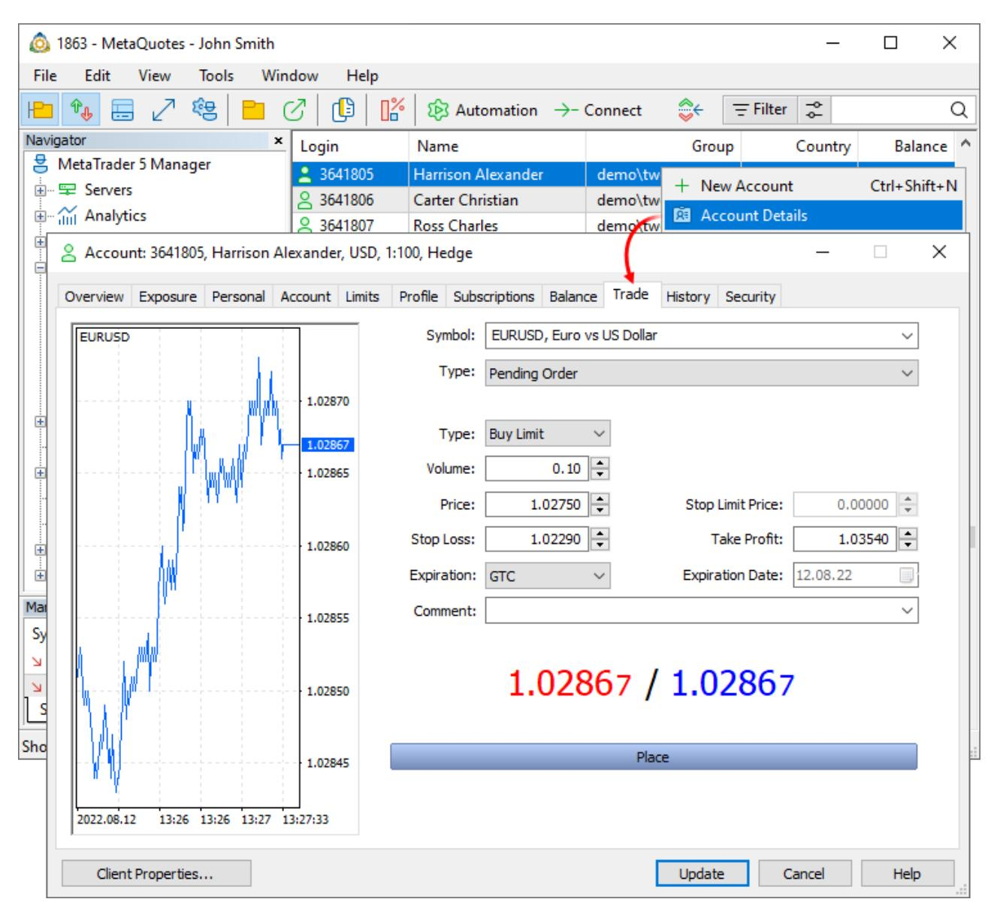

The left-hand side of the window shows the chart of the selected symbol, and the right-hand side window contains the order placing form. Select a symbol and set *Pending Order* in the Type field. Next, fill in the order parameters:

- ·**Type** — pending order type.
- ·**Volume** — volume of an order in lots.
- · **Fill Policy** — additional [order filling](#page-16-0) rule (only for limit and stop-limit orders): Return, Fill or Kill, Immediate or Cancel, Book or Cancel. If this field is unavailable, then the choice is blocked on the server.
- · **Price** — pending order trigger price. For stop and limit orders, it is the price at which they will be placed. For stop limit orders, this is the price of a stop order triggering. Upon reaching it, a limit order is set at the price indicated in the Stop Limit Price field.

- · **Stop Limit Price** — this field is active only for Stop Limit orders. When the Stop Limit order triggers, a limit order will be placed at the price specified here.
- · **Stop Loss** — the [Stop Loss](#page-10-0) level. If you leave a zero value in this field, this type of order will not be attached.
- · **Take Profit** — the [Take Profit](#page-10-0) level. If you leave a zero value in this field, this type of order will not be attached.
- · **Expiration** — order expiration date:
  - ·**Good Till Canceled (GTC)** — the order will be valid until it is manually canceled.
  - ·**Today** — the order will only be valid during the current trading day.
  - ·**Specified** — the order will be valid until the date specified in Expiration Date.
  - · **Specified day** — the order will be valid until 00:00 of the specified day. If this time does not fall within a trading session, expiration will occur in the nearest trading time.
- · **Expiration date** — order expiration date if the *Specified* or *Specified day* is selected for the order expiration condition. Available expiration types are determined by the symbol settings.
- ·**Comment** — a text comment to the order. Maximum comment length is limited to 31 characters.

After filling in all the necessary parameters, click *Place*.

# <span id="page-46-0"></span>**Modifying/Deleting pending orders**

To change or remove a pending order, open the account dialog and go to the Overview tab. Select an order and click *Modify or Delete* in its context menu.

| Overview                                                                              | Harrison Alexander, 3641805, demo\two\forex-hedged-11, 1:100<br>Alexander.Harrison@mail.net<br>Registered: 2021.12.13 Last access: 2021.12.13 17:31 Last Address: 94.130.2.61 |
|---------------------------------------------------------------------------------------|-------------------------------------------------------------------------------------------------------------------------------------------------------------------------------|
| & Account: 3641805, Harrison Alexander, USD, 1:100, Hedge                             |                                                                                                                                                                               |
|                                                                                       |                                                                                                                                                                               |
|                                                                                       |                                                                                                                                                                               |
|                                                                                       |                                                                                                                                                                               |
|                                                                                       |                                                                                                                                                                               |
|                                                                                       |                                                                                                                                                                               |
| Exposure Personal Account Limits Profile Subscriptions Balance Trade History Security |                                                                                                                                                                               |

| Symbol     | Type                                                                              | Volume | Price            | S/L              | T/P     | Price | Swap    | Profit  |
|------------|-----------------------------------------------------------------------------------|--------|------------------|------------------|---------|-------|---------|---------|
|            | ○ Balance: 4 984 482.91 USD Equity: 4 984 481.91 Commission: -1.00 Margin: 102.75 |        |                  |                  |         |       |         |         |
|            | Free Margin: 4 984 379.16 Margin Level: 4 851 077.28 %                            |        |                  |                  |         |       |         |         |
| 📌 D eurusd | buy limit                                                                         |        | 0.1/0            | 1.02750          | 1.02290 |       | 1.03540 | 1.02870 |
|            |                                                                                   |        |                  | + New Order      |         |       |         |         |
|            |                                                                                   |        | ▾ Close Position |                  |         |       |         |         |
|            |                                                                                   |        |                  | Modify or Cancel |         |       |         |         |
|            | & Account: 3641805, Harrison Alexander, USD, 1:100, Hedge                         |        |                  |                  |         |       |         |         |

| Overview         | Exposure Personal Account Limits Profile Subscriptions Balance Trade |
|------------------|----------------------------------------------------------------------|
|                  |                                                                      |
|                  |                                                                      |
|                  |                                                                      |
| History Security |                                                                      |

| 📈 <b>EURUSD</b>          |                                             |
|--------------------------|---------------------------------------------|
|                          |                                             |
|                          |                                             |
|                          |                                             |
|                          |                                             |
| Symbol:                  | EURUSD, Euro vs US Dollar                   |
|                          |                                             |
|                          |                                             |
|                          |                                             |
|                          |                                             |
| Type:                    | Modify Order                                |
|                          |                                             |
|                          |                                             |
|                          |                                             |
|                          |                                             |
|                          |                                             |
|                          |                                             |
|                          |                                             |
|                          |                                             |
|                          |                                             |
| Order:                   | #5073333530 BUY LIMIT 0.1 EURUSD AT 1.02750 |
| Price:                   | 1.02750                                     |
|                          |                                             |
|                          |                                             |
| <b>Stop Limit Price:</b> | 0.00000                                     |
| Stop Loss:               | 1.02290                                     |
| Take Profit:             | 1.03540                                     |
|                          |                                             |
|                          |                                             |
| Expiration:              | <b>GTC</b>                                  |
| Expiration Date:         | 12.08.22                                    |
|                          |                                             |
| Comment:                 | 1.02845                                     |
|                          |                                             |
|                          |                                             |
|                          |                                             |
|                          |                                             |
|                          |                                             |
|                          |                                             |
| Modify                   |                                             |
|                          |                                             |
|                          |                                             |
|                          |                                             |
|                          |                                             |
|                          |                                             |
|                          |                                             |
|                          |                                             |
|                          |                                             |
|                          |                                             |
|                          |                                             |
|                          |                                             |
|                          |                                             |
|                          |                                             |

The Order field contains information about the pending order being modified/deleted. Below you can change any order parameters with which the order was [placed](#page-45-0). To save new parameters, click *Modify*.

To remove a pending order, click *Delete*. The order will be moved to the client's trading history with the *Canceled* status.

# <span id="page-47-0"></span>**Activation of pending orders**

Activation of a pending order is equivalent to its triggering upon the occurrence of the conditions specified therein, but it is performed manually by the manager. The manager can activate a pending order at any time. To activate an order, open the account dialog and go to the Overview tab. Select an order and click *Activate* in its context menu.

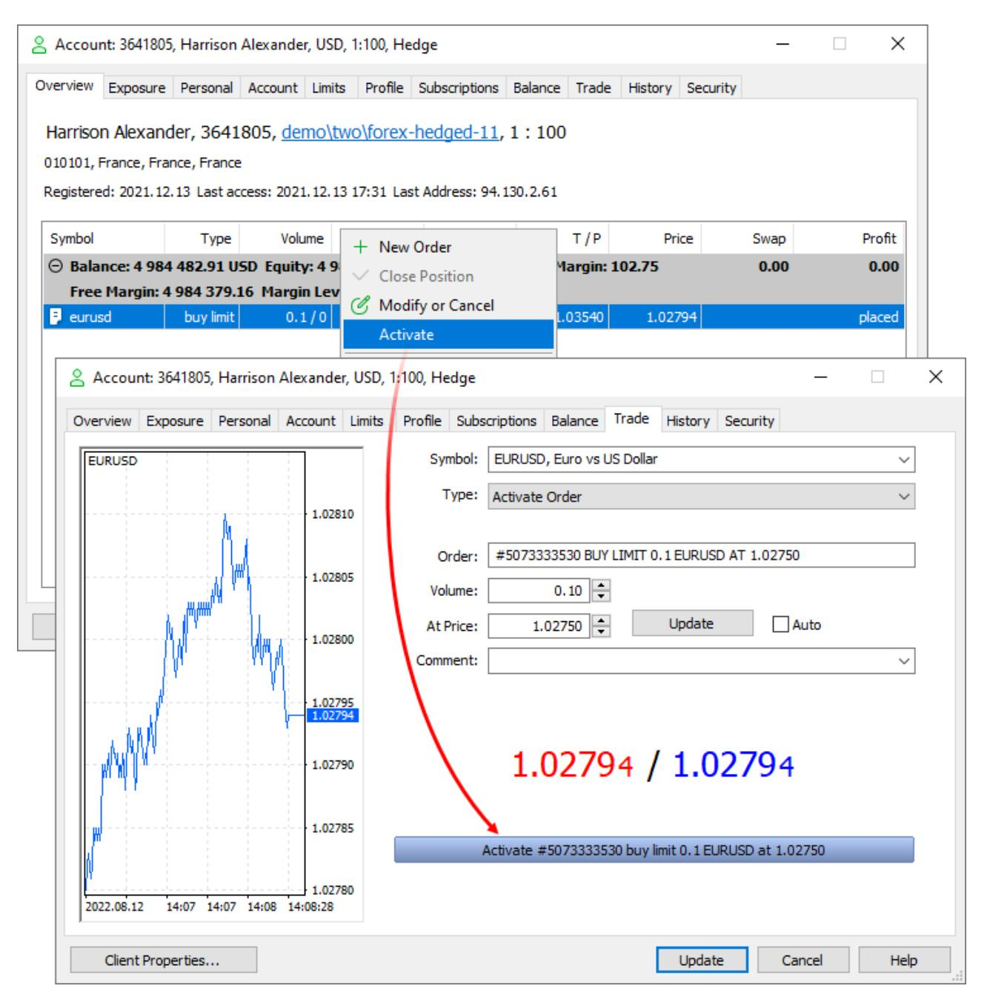

The Order field contains information about the order to be activated. The activation settings are specified below:

- · **Volume** — volume of the order to be activated. If activated partially, the remaining volume will be processed according to the fill policy specified in the order (the order with the remaining volume can be left pending or canceled).
- · **At price** — the price at which the order will be activated. To set the current price in this field (Ask for OTC and Last for exchange instruments), click *Update*. The current price is also substituted in this field when switching to the order activation.

- · **Auto** — with this option the order will be activated at the current bid or ask price as at the time you click *Activate*.
- ·**Comment** — text comment to the order.

The current prices Bid and Ask are shown below. After setting the parameters, click *Activate*.

# **General information about trading operations**

Up to 128 trade requests can be sent to the server simultaneously. If this limit is exceeded, the server will return an error.

Trading dialogs enable quick modifications of prices, volumes, Stop Loss and Take Profit levels by a certain amount. Hold down the Ctrl or Shift keys while changing the relevant fields with the arrows:

- ·Shift — change by 5 points
- ·Ctrl — change by 10 points
- ·Ctrl+Shift — change by 50 points

### <span id="page-49-0"></span>**Order filtering**

Use filters for convenient work with orders. All orders available to the manager are shown by default. You may use filters to view information that meets certain criteria. For example, you can view operations on a specific instrument or operations of a certain volume and direction.

| Navigator                 | Login     | Order      |  | Symbol             | Time                | Type       | Volume            | Price    |         |  |
|---------------------------|-----------|------------|--|--------------------|---------------------|------------|-------------------|----------|---------|--|
| MetaTrader 5 Manager      | 9 3768165 | 5072914821 |  | audcad             | 2022.07.14 13:36:37 | sell limit | 0.07 / 0          | 0.95261  |         |  |
| Servers                   | 3768308   | 5072914843 |  | euraud             | 2022.07.14 13:36:37 | buy limit  | 0.01 / 0          | 1.41556  |         |  |
| Analytics                 | 3768013   | 507291     |  | RE Account Details |                     | :36:37     | buy stop          | 0.05 / 0 | 1.39306 |  |
| Server Reports            | 3768266   | 50729      |  | Bulk Closing       |                     | :36:37     | sell limit        | 0.14 / 0 | 0.93543 |  |
| Clients & Orders          | 3768175   | 50729      |  |                    |                     | :36:37     | buy stop          | 1.01 / 0 | 98.874  |  |
| Online Users (4)          | 3767876   | 50729      |  | buy limit          |                     | :36:37     | buy limit         | 1.07 / 0 | 86.748  |  |
| Clients (6 220)           | 3768176   | 50729      |  | delete             |                     | :36:37     | buy limit         | 0.01 / 0 | 1.19673 |  |
| Trading Accounts (69 576) | 3768228   | 50729      |  | sell limit         |                     | 36:37      | sell limit        | 0.09 / 0 | 1.43255 |  |
| Positions (41 875)        | 3768055   | 50729      |  | Positions          |                     | 26-27      | huy limit         | 0.07 / 0 | 1.49840 |  |
| Orders (13 473)           | 3768182   | 50729      |  | Filter             |                     |            |                   | 0        | 126.588 |  |
| Subscriptions             | 3767836   |            |  | Copy As            |                     |            | Buy limit only    | 0        | 0.92318 |  |
| Dealing                   | 3768258   | 50729      |  | Journal By         |                     |            |                   | 0        | 1.19530 |  |
| Groups (2 745)            | 3768194   | 50729      |  | EURUSD             |                     |            |                   | 0        | 1.09307 |  |
| Plugins (5)               | 3768105   | 50729      |  | Find               |                     |            |                   | 0        | 1.07264 |  |
| Mailbox (21 992)          | 3768000   | 50729      |  | Mail               |                     |            |                   | 0        | 0.93543 |  |
| Support Center            | 3768131   | 50729      |  | Volumes            |                     |            |                   | 179,003  |         |  |
| App Store                 | 3767956   | 50729      |  |                    |                     |            |                   | 0.99503  |         |  |
|                           |           |            |  |                    |                     |            | Show Milliseconds |          |         |  |
|                           |           |            |  |                    |                     |            | Auto Arrange      |          |         |  |

To apply a previously created filter, select it from the Filter menu in the list of accounts or clients. To return to the initial list of accounts, click None.

To create or edit filters, click *Customize*. The list of all previously created filters is shown in the Filters tab. Click twice on a filter to change its parameters.

| <b>Orders Filters</b> | ×<br>П |  |
|-----------------------|--------|--|
|-----------------------|--------|--|

Filters  
**Edit Filter**

| Name                  | Filter                    |        |      |
|-----------------------|---------------------------|--------|------|
| <b>Buy limit only</b> | Type: buy limit           |        |      |
| <b>EURUSD</b>         | Symbol: EURUSD            |        |      |
| Placed by EA          | + New Filter              |        |      |
| @ Edit Filter         | Filters Edit Filter       |        |      |
| × Delete Filter       | Placed by EA              |        |      |
|                       | Filter name:              |        |      |
| ✔ Auto Arrange        |                           |        |      |
| ✔ Grid                |                           |        |      |
|                       | Type:                     |        |      |
| ✔                     |                           |        |      |
|                       | State:                    |        |      |
|                       | ✔                         |        |      |
|                       | EURUSD, Euro vs US Dollar |        |      |
|                       | Symbol:                   |        |      |
|                       | ✔                         |        |      |
|                       | Volume:                   |        |      |
|                       | 0                         |        |      |
|                       | 2022.08.12 15:24          |        |      |
|                       | 2022.08.12 15:24          |        |      |
|                       | ×                         |        |      |
|                       |                           |        |      |
|                       | Created:                  |        |      |
|                       | ✔                         |        |      |
|                       | ↓                         |        |      |
|                       | ٠                         |        |      |
|                       | X 2022.08.12 15:24        |        |      |
|                       | 2022.08.12 15:24          |        |      |
|                       | ⎯⎯⎯⎯⎯⎯⎯⎯⎯                 |        |      |
|                       | Expired:                  |        |      |
|                       | ⎯⎯⎯⎯⎯⎯⎯⎯⎯                 |        |      |
|                       | Reason:                   |        |      |
|                       | Expert ✔                  |        |      |
|                       | External ID:              |        |      |
|                       | +                         |        |      |
|                       | Comment:                  |        |      |
|                       | +                         |        |      |
|                       | Apply                     | Cancel | Save |

Set the name of the filter and then configure parameters for filtering accounts:

- · **Type** — show orders of a certain type: Buy, Sell, Buy Limit, Sell Limit, Buy Stop, Sell Stop, Buy Stop Limit, Sell Stop Limit, Close by.
- · **State** — show orders in a certain [state:](#page-12-0) started, placed, partial, request adding, request, modifying, request canceling. Using this filter, you can easily find orders with the frozen processing.
- · **Symbol** — show orders placed for the selected trading instrument. A symbol mask can be specified here. For example, EUR\* — all rates to the euro.
- · **Volume** — show orders having a volume within the specified range. Use this filter to keep track of big players.
- · **Creation date** — show orders which were placed in the specified time interval. The filter will help you find outdated and most recent orders.

- · **Expiry** — show orders having the expiration date within the specified time interval. Use this filter to determine orders to be canceled soon.
- · **Reason** — show orders with the specified [creation reason](#page-57-0): placed by a client manually or using a trading robot, created by the dealer or API, etc.
- · **External ID** — display orders with the specified identifier in the external system (in the exchange). This filter will allow you to work with operations forwarded to the specified external trading system.
- ·**Comment** — show orders with the specific comment.

You can immediately enable the filter from the editing window by clicking *Apply*.

Filters enable selection of entries not only based on fields matching the specified value, but also by the "Except" and "Not empty field" parameters. Enter the desired value in the filter field and click , it will change to . The filter will select the orders whose parameters do not match the specified value. For example, you can use the filter to create a list of operations on all symbols which do not belong to the specified group, as well as of orders except those opened by trading robots or orders without an external ID. In the latter case, switch the filter mode and leave the field blank.

# <span id="page-52-0"></span>**Viewing and editing trading operations**

The trading operation dialog is a fully-featured tool with a plethora of advanced features:

- ·Display of detailed information about [orders](#page-56-0), [deals](#page-60-0) and [positions](#page-65-0)
- ·Display of all [related operations,](#page-53-0) for example the orders and deals which opened the position
- ·[Execution visualization](#page-53-1)on the tick chart
- ·Access to the [history of nearby ticks](#page-53-2)
- ·Ability to view [trading server logs](#page-54-0) associated with the operation

|                                                                                                                             | ×<br>Position #100096325 sell 1.00 AUDJPY 86.022<br>П      |                               |      |        |                |      |                                                                                                                                                                                                                                                                                                                                                                                                                                                                                                                                                                                                                                                                                                                                                                                                                                                                                                                                                                                                                                                                                                                                                                               |  |  |  |
|-----------------------------------------------------------------------------------------------------------------------------|------------------------------------------------------------|-------------------------------|------|--------|----------------|------|-------------------------------------------------------------------------------------------------------------------------------------------------------------------------------------------------------------------------------------------------------------------------------------------------------------------------------------------------------------------------------------------------------------------------------------------------------------------------------------------------------------------------------------------------------------------------------------------------------------------------------------------------------------------------------------------------------------------------------------------------------------------------------------------------------------------------------------------------------------------------------------------------------------------------------------------------------------------------------------------------------------------------------------------------------------------------------------------------------------------------------------------------------------------------------|--|--|--|
|                                                                                                                             | &#요; John Smith, 1816500, demo\demoforex-5-hedged, 1 : 100 |                               |      |        |                |      |                                                                                                                                                                                                                                                                                                                                                                                                                                                                                                                                                                                                                                                                                                                                                                                                                                                                                                                                                                                                                                                                                                                                                                               |  |  |  |
| Ticket                                                                                                                      | Time                                                       | ID                            | Type | Volume | Price          | Fee  | Profit                                                                                                                                                                                                                                                                                                                                                                                                                                                                                                                                                                                                                                                                                                                                                                                                                                                                                                                                                                                                                                                                                                                                                                        |  |  |  |
| Ξ<br>100096325                                                                                                              | 2017.03.09 11:31:15.580                                    | 100096325                     | sell | 1.00   | 86.022         |      | 15 8 15.90                                                                                                                                                                                                                                                                                                                                                                                                                                                                                                                                                                                                                                                                                                                                                                                                                                                                                                                                                                                                                                                                                                                                                                    |  |  |  |
| ß<br>100096325                                                                                                              | 2017.03.09 11:31:15.579                                    | sell<br>1.00 / 1.00<br>86.022 |      |        |                |      |                                                                                                                                                                                                                                                                                                                                                                                                                                                                                                                                                                                                                                                                                                                                                                                                                                                                                                                                                                                                                                                                                                                                                                               |  |  |  |
| Э<br>100094840                                                                                                              | 2017.03.09 11:31:15.580                                    |                               | sell | 1.00   | 86.022         | 0.00 | 0.00                                                                                                                                                                                                                                                                                                                                                                                                                                                                                                                                                                                                                                                                                                                                                                                                                                                                                                                                                                                                                                                                                                                                                                          |  |  |  |
| Details<br>Visualization<br><b>Ticks</b><br>Journal                                                                         |                                                            |                               |      |        |                |      |                                                                                                                                                                                                                                                                                                                                                                                                                                                                                                                                                                                                                                                                                                                                                                                                                                                                                                                                                                                                                                                                                                                                                                               |  |  |  |
| Position:<br>100096325<br>H<br>1.00<br>AUDJPY, Australian Dollar vs Japanese Yen<br><b>SELL</b><br>$✓$<br>$✓$<br><b>COL</b> |                                                            |                               |      |        |                |      |                                                                                                                                                                                                                                                                                                                                                                                                                                                                                                                                                                                                                                                                                                                                                                                                                                                                                                                                                                                                                                                                                                                                                                               |  |  |  |
| Opened:                                                                                                                     | 2017.03.09 11:31:15.580                                    | ▪▾                            |      |        | Open price:    |      | ÷<br>86.022000                                                                                                                                                                                                                                                                                                                                                                                                                                                                                                                                                                                                                                                                                                                                                                                                                                                                                                                                                                                                                                                                                                                                                                |  |  |  |
| Updated:                                                                                                                    | 2017.03.09 11:31:15.580                                    | ▪▾                            |      |        | Current price: |      | ÷<br>67.534                                                                                                                                                                                                                                                                                                                                                                                                                                                                                                                                                                                                                                                                                                                                                                                                                                                                                                                                                                                                                                                                                                                                                                   |  |  |  |
| Reason:                                                                                                                     | Web                                                        |                               |      |        | Stop loss:     |      | ÷<br>125.000                                                                                                                                                                                                                                                                                                                                                                                                                                                                                                                                                                                                                                                                                                                                                                                                                                                                                                                                                                                                                                                                                                                                                                  |  |  |  |
| Dealer ID:                                                                                                                  |                                                            |                               |      |        | Take profit:   |      | &#div;<br/>62.000</td>     </tr>     <tr>       <td>Expert ID:</td>       <td>173339640206990851</td>       <td></td>       <td></td>       <td></td>       <td>Swap:</td>       <td></td>       <td>&#div;<br/>0.00</td>     </tr>     <tr>       <td>External ID:</td>       <td></td>       <td></td>       <td></td>       <td></td>       <td>Profit:</td>       <td></td>       <td>&#div;<br/>15815.90</td>     </tr>     <tr>       <td>Comment:</td>       <td>Demo</td>       <td></td>       <td></td>       <td></td>       <td>Profit rate:</td>       <td></td>       <td>0.00680342</td>     </tr>     <tr>       <td>Disabled activations:</td>       <td></td>       <td></td>       <td></td>       <td></td>       <td>Margin rate:</td>       <td></td>       <td>0.74964000</td>     </tr>     <tr>       <td>Modifications:</td>       <td></td>       <td></td>       <td></td>       <td></td>       <td></td>       <td></td>       <td></td>     </tr>     <tr>       <td>Report</td>       <td></td>       <td></td>       <td></td>       <td></td>       <td>Update</td>       <td>Cancel</td>       <td>Help</td>     </tr>   </tbody> </table> |  |  |  |

You can open an operation for viewing or editing from various parts of the Manager terminal: from the [list of](#page-43-0) [order](#page-43-0) or [positions](#page-33-0), as well as from the account's Overview and History sections.

If you have appropriate permissions, you can edit any parameters of orders, deals and positions via the Manager terminal. Do not edit trading operations unless absolutely necessary.

# **Account details**

The upper part of the dialog displays brief information about the account on which the operation was performed: name, login, groups and leverage. Click on this line to view account details.

## <span id="page-53-0"></span>**Overview and related operations**

This block features all operations associated with the current one. If you are viewing an order, the block will show the deal and the position opened as a result of the order execution. For positions, all related orders and deals will be shown. Thus, you can easily access the entire chain of related actions. Select an operation from the tree, and all its relevant parameters will be instantly displayed in the bottom part.

# <span id="page-53-1"></span>**Visualization**

This section visualizes the execution of a trading operation on the tick chart of the appropriate symbol.

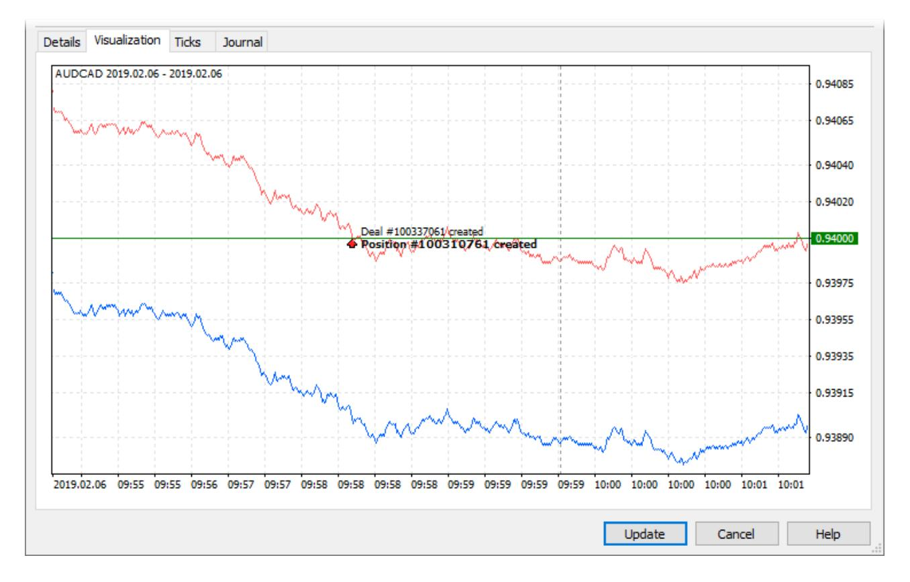

### <span id="page-53-2"></span>**Nearest ticks before and after the operation**

When analyzing disputable situations with traders, it is often necessary to analyze quotes which were broadcast at the trading operation execution time. The relevant quote data can be obtained in a couple of clicks. Open operation details and navigate to the Ticks section. The terminal will automatically request the quote history from the server for the entire day on which the operation was performed. The nearest quote to operation execution time will be automatically selected in the list of received quotes.

| Date                                      | Bid     | Ask     | Last    | ∧<br>Volume |
|-------------------------------------------|---------|---------|---------|-------------|
| $	extbackslash vee$ 2019.02.06 09:58:18   | 0.93906 | 0.94006 | 0.00000 | 0.00        |
| $	extbackslash sqrt{2019.02.06 09:58:18}$ | 0.93905 | 0.94005 | 0.00000 | 0.00        |
| $	extbackslash vee$ 2019.02.06 09:58:18   | 0.93906 | 0.94006 | 0.00000 | 0.00        |
| $	extbackslash sqrt{2019.02.06 09:58:18}$ | 0.93907 | 0.94007 | 0.00000 | 0.00        |
| 2019.02.06 09:58:19                       | 0.93908 | 0.94008 | 0.00000 | 0.00        |
| $	extbackslash vee$ 2019.02.06 09:58:20   | 0.93907 | 0.94007 | 0.00000 | 0.00        |
| $	extbackslash vee$ 2019.02.06 09:58:20   | 0.93904 | 0.94004 | 0.00000 | 0.00        |
| $	extbackslash vee$ 2019.02.06 09:58:20   | 0.93901 | 0.94001 | 0.00000 | 0.00        |
| 2019.02.06 09:58:20                       | 0.93898 | 0.93998 | 0.00000 | 0.00        |
| $	extbackslash vee$ 2019.02.06 09:58:20   | 0.93900 | 0.94000 | 0.00000 | 0.00        |
| 2019.02.06 09:58:20                       | 0.93899 | 0.93999 | 0.00000 | 0.00        |
| $	extbackslash vee$ 2019.02.06 09:58:20   | 0.93900 | 0.94000 | 0.00000 | 0.00        |
| $	extbackslash vee$ 2019.02.06 09:58:20   | 0.93901 | 0.94001 | 0.00000 | 0.00        |
| $	extbackslash vee$ 2019.02.06 09:58:21   | 0.93900 | 0.94000 | 0.00000 | 0.00        |
| $	extbackslash vee$ 2019.02.06 09:58:21   | 0.93901 | 0.94001 | 0.00000 | 0.00        |
| $	extbackslash vee$ 2019.02.06 09:58:21   | 0.93899 | 0.93999 | 0.00000 | 0.00        |
| $	extbackslash vee$ 2019.02.06 09:58:21   | 0.93898 | 0.93998 | 0.00000 | 0.00        |
| $	extbackslash vee$ 2019.02.06 09:58:21   | 0.93897 | 0.93997 | 0.00000 | 0.00        |
| . 2 anno an ac an colan                   | n noono | n nonno | o ooooo | n nn        |

# <span id="page-54-0"></span>**Operation journal**

This is another tool to assist during the follow-up operation examination. There is no need to manually request [logs from the server](#page-104-0) or to filter the entries. Open operation details, navigate to the Journal section — and the terminal will automatically request the necessary logs from the server using ticket and time interval filters (from the operation date to the current day).

| Time                    | IP          | Message                                                                                                  |
|-------------------------|-------------|----------------------------------------------------------------------------------------------------------|
| 2019.05.13<br>          | (20490 kb)  |                                                                                                          |
| 2019.05.13 15:25:54.684 | 11.14.194.2 | '1815606': order placed [#100329729 buy limit 1.00 AUDCAD at 0.93559], time 0.79 ms                      |
| 2019.05.13 15:28:51.242 | 11.14.194.2 | '1815606': modify order #100329729 buy limit 1.00 AUDCAD at 0.93559 sl: 0.00000 tp: 0.0                  |
| 2019.05.13 15:28:51.242 | 11.14.194.2 | '1815606': request confirmed, rule 'Auto Execution' (modify #100329729 buy limit 1.00 AUDCAD at 0.93531) |
| 2019.05.13 15:28:51.242 | 11.14.194.2 | '1815606': order modified [#100329729 buy limit 1.00 AUDCAD at 0.93531], time 0.48 ms                    |
| 2019.05.13 15:28:57.667 | 11.14.194.2 | '1815606': modify order #100329729 buy limit 1.00 AUDCAD at 0.93531 sl: 0.00000 tp: 0.00                 |
| 2019.05.13 15:28:57.667 | 11.14.194.2 | '1815606': request confirmed, rule 'Auto Execution' (modify #100329729 buy limit 1.00 AUDCAD at 0.93531) |
| 2019.05.13 15:28:57.667 | 11.14.194.2 | '1815606': order modified [#100329729 buy limit 1.00 AUDCAD at 0.93531], time 0.58 ms                    |
| 2019.05.13 17:04:08.806 |             | '1815606': order [#100329729 buy limit 1.00 AUDCAD at 0.93531] triggered, activation price               |
| 2019.05.13 17:04:08.806 |             | '1815606': activate order #100329729 buy limit 1.00 AUDCAD at 0.93531 (0.93430 / 0.93531)                |
| 2019.05.13 17:04:08.806 |             | '1815606': request confirmed at client price 0.93531, rule 'Auto Execution' (activate #10032)            |
| 2019.05.13 17:04:08.807 |             | '1815606': order performed buy 1.00 at 0.93531 [#100329729 buy limit 1.00 AUDCAD at 0.93531]             |
| 2019.05.14              | (20480 kb)  |                                                                                                          |
| 2019.05.14 15:30:53.643 | 11.14.194.2 | '1026605': server journal (#100329729, 2019.05.13 - 2019.05.14)                                          |
|                         |             |                                                                                                          |
| #100329729              |             | 2019.05.13<br>2019.05.14<br>Request<br>Full<br>All<br>$✓$<br>$✓$<br>$✓$<br>$✓$                           |

# **Trading operation report**

All trading operation details available in the editing dialogs can be saved as a report. The report will contain the entire chain of operations from an order to a position, visualization on a tick chart, extract from the server log and the trading account status.

To generate a file, select *Report*in the context menu under the [Overview and related operations](#page-53-0) section. Next, select data to be saved: account state, trading totals, logs, tick chart, etc.

|               | Position #100059643 buy 1.00 USDCAD 1.34415               |                     |                         |                                        |                         |                           | ×<br>п                     |
|---------------|-----------------------------------------------------------|---------------------|-------------------------|----------------------------------------|-------------------------|---------------------------|----------------------------|
|               | 오 John Smith, 1816500, demo\demoforex-5-hedged, 1: 100    |                     |                         |                                        |                         |                           |                            |
| <b>Ticket</b> |                                                           |                     | <b>Time</b>             | Type                                   | Volume                  | Price                     | Profit                     |
| F             | 100059643                                                 |                     | 2016.11.30 17:20:03.380 | buy                                    | 1.00 / 1.00             | market                    |                            |
| Θ             | $\times$ Delete                                           |                     | Delete   17:20:03.380   | buy                                    | 1.00                    | 1.34415                   | 0.00                       |
|               | <b>Volumes</b>                                            | <b>O</b> Save As    | 17-20-02-290            |                                        | 1.00                    | 1.24410                   | $1.205 - 07$<br>×          |
|               | HTML Report                                               | Save in:            | This PC                 |                                        | $\checkmark$            | 6 ∂ 2 ⊞*                  |                            |
| Deta          | $E$ Select All<br>Copy As                                 | <b>Ouick access</b> |                         | Downloads                              |                         |                           | ۸                          |
| Ō.            | Find<br><b>Q</b> Find Next                                |                     |                         | Music                                  |                         |                           |                            |
| ✓<br>✔        | <b>Show Milliseconds</b><br>Auto Arrange<br>$\sqrt{Grid}$ | Desktop             |                         | <b>Pictures</b>                        |                         |                           |                            |
|               | Columns                                                   | <b>Libraries</b>    |                         | Videos                                 |                         |                           |                            |
|               | Expiration:<br><b>GTC</b>                                 | This PC             |                         | Devices and drives (1)<br>OS(C)        |                         |                           |                            |
|               | Filling:<br><b>RETUR</b>                                  |                     |                         |                                        |                         |                           |                            |
|               | Dealer ID:                                                |                     |                         | 84.2 GB free of 236 GB                 |                         |                           |                            |
|               | Expert ID:                                                | Network             | File name:              |                                        | Position-100059643.html | $\checkmark$              | Save                       |
|               | External ID:                                              |                     | Save as type:           | HTML Files (*.html)                    |                         |                           | Cancel                     |
|               | Comment:                                                  | Trade objects       |                         | Report parts                           |                         |                           |                            |
|               | Disabled activations:                                     | $\odot$ All         |                         | □ Trade Account                        |                         | ○ Object Table            | $\triangledown$ Tick Table |
|               | Modifications:                                            | $\bigcirc$ Selected |                         | $\sqrt{\ }$ Trade Summary<br>√ Journal |                         | $\sqrt{\ }$ Trade Results | $\sqrt{}$ Tick Chart       |
| Report        |                                                           |                     |                         |                                        |                         |                           |                            |

Select the path on the disk and click *Save*.

# <span id="page-56-0"></span>**Order details**

| Position #                                         | 5072917935 buy 0.01 AUDCAD 0.89953 |            |                         |           |                         |        |      |       |         |        |      |
|----------------------------------------------------|------------------------------------|------------|-------------------------|-----------|-------------------------|--------|------|-------|---------|--------|------|
| Mitchell Steven, 3767921, demo\demoforex, 1: 100   |                                    |            |                         |           |                         |        |      |       |         |        |      |
| Ticket                                             | ۹<br>5072917935                    | Time       | 2022.07.27 23:02:10.493 | Type      | buy                     | Volume | 0.01 | Price | 0.89953 | Profit | 6.68 |
| Order                                              | 5072917935                         | Setup time | 2022.07.14 13:36:41.864 | Done time | 2022.07.27 23:02:10.493 |        |      |       |         |        |      |
| Position                                           | 5072917935                         |            |                         |           |                         |        |      |       |         |        |      |
| Remained volume                                    | 0.00                               |            |                         |           |                         |        |      |       |         |        |      |
| Reason                                             | Client $✓$                         |            |                         |           |                         |        |      |       |         |        |      |
| State                                              | <b>FILLED</b>                      |            |                         |           |                         |        |      |       |         |        |      |
| Expiration                                         | <b>GTC</b>                         |            |                         |           |                         |        |      |       |         |        |      |
| Expiration time                                    | 1970.01.01 00:00:00                |            |                         |           |                         |        |      |       |         |        |      |
| Filling                                            | <b>RETURN</b> $✓$                  |            |                         |           |                         |        |      |       |         |        |      |
| Dealer ID                                          |                                    |            |                         |           |                         |        |      |       |         |        |      |
| Expert ID                                          |                                    |            |                         |           |                         |        |      |       |         |        |      |
| External ID                                        |                                    |            |                         |           |                         |        |      |       |         |        |      |
| Comment                                            | order                              |            |                         |           |                         |        |      |       |         |        |      |
| Disabled activations                               |                                    |            |                         |           |                         |        |      |       |         |        |      |
| Modifications                                      |                                    |            |                         |           |                         |        |      |       |         |        |      |
| <button>Report...</button> <button>Update</button> |                                    |            |                         |           |                         |        |      |       |         |        |      |

Orders have the following parameters:

- ·**Login** — number of the account, on which the order was placed.
- ·**Order** — number (ticket) of the order.
- · **Setup time** — time the order was placed by the client. If the order is passed to an external trading system, this field displays the time the order was placed in the external system (not in the MetaTrader 5 platform).
- · **Position** — ticket of the position opened, modified or closed due as a result of order execution. Close By orders have two tickets: the ticket of the closed position and that of the opposite one.
- · **Type** — order type: Buy, Sell, Buy Limit, Sell Limit, Buy Stop, Sell Stop, Buy Stop Limit, Sell Stop Limit or Close By.
- ·**Initial volume** — volume requested in the order.
- ·**Symbol** — financial instrument of the order.
- ·**Filling** — additional [order execution parameters](#page-16-0): Fill or kill, Immediate or Cancel, Book or Cancel or Return.

- ·**Order price** — desired order execution price specified by the trader.
- · **Trigger price** — this field is intended for Buy Stop Limit and Sell Stop Limit orders. It contains the price level at which they trigger and create the corresponding limit orders.
- ·**Stop loss** — Stop Loss level.
- ·**Take profit** — Take Profit level.
- ·**Comment** — a text comment to the order. This field can contain trader's comments if they were specified.
- ·**Margin rate** — symbol margin currency to deposit currency conversion rate.
- ·**Expiration** — order expiration type: GTC (Good Till Canceled), Day or Specified.
- ·**Expiration time** — if the pending order has expired, this field contains the expiration date and time.
- · **Disable activation** — additional conditions (flags), with which order activation is prohibited. The flags can be set by the Gateway API when orders are sent to an external system. For example, if activation of stop loss and take profit must be controlled by an external system, a flag disabling activation on the MetaTrader 5 side can be set for the order. Order flags are inherited by positions created as a result of order execution. Available flags:
  - ·**Limit** — do not process hitting of a limit level.
  - ·**Stop** — do not process hitting of a stop level.
  - ·**Stop Limit** — do not process hitting of a stop limit level.
  - ·**SL** — do not process Stop Loss activation.
  - ·**TP** — do not process Take Profit activation.
  - ·**Stop Out** — do not process Stop Out activation.
  - ·**Expiration** — do not process order cancellation due to expiration.
- · **Modifications** — if the order was edited manually, this field displays who implemented the changes:
  - ·**Administrator** — order changed by an administrator.
  - ·**Manager** — open price changed by a manager.
  - ·**Restore** — order restored.
  - ·**Admin API** — order changed via the Manager API administrator interface.
  - ·**Manager API** — order changed via the Manager API manager interface.
  - ·**Server API** — order changed via the Server API.
  - ·**Gateway API** — order changed via the Gateway API.
- <span id="page-57-0"></span>·**Reason** — reason of placing the order:

- ·**Client** — the order was placed manually by the client via the client terminal.
- ·**Expert** — the order was placed by the client using an Expert Advisor.
- ·**Dealer** — the order was placed by a dealer via the Manager terminal.
- ·**SL** — the order was placed as a result of Stop Loss triggering.
- ·**TP** — the order was placed as a result of Take Profit triggering.
- ·**SO** — the order was placed as the client reached the Stop Out level.
- ·**Rollover** — the order was placed when reopening position for charging swaps.
- ·**External Client** — the order was placed by the client from an external trading system.
- ·**Variation margin** — the order was placed for calculating variation margin.
- ·**Gateway** — the order was placed by the MetaTrader 5 gateway connected to the trading platform.
- · **Signal** — the order was placed as a result of copying a [trading signal](https://www.mql5.com/en/signals)according to a subscription in the client terminal.
- · **Settlement** — the order was placed as a result of operations connected with the settlement of a futures contract/option. Currently not in use.
- · **Transfer** — the order was placed due to the transfer of a position at the settlement price to a new symbol with the same underlying asset. Currently not in use.
- · **Synchronization** — the order was placed as a result of synchronization of the trading account status with an external system.
- · **External Service** — the order was placed from an external trading system for technical reasons (for example, to correct the client's trading condition).
- ·**Mobile** — the order was generated via the MetaTrader 5 mobile terminal for Android or iPhone.
- ·**Web** — the order was generated via the web terminal.
- ·**Split** — the order was generated as a result of a symbol split.
- · **Corporate action** — the order was created as a result of a corporate action, such as consolidating or renaming securities, transferring a client to a different account, etc. API applications set this flag for service operations so that the platform does not account for such corporate actions in commission calculations.
- · **Migration** — the order was generated as a result of client trading operations imported from the MetaTrader 4 server.
- · **Expert** — the identifier (magic number) of the Expert Advisor that has sent this order from the client terminal.

- · **Execution time** — order execution time. If the order is passed to an external trading system, this field displays the time of the order execution in the external system (not in the MetaTrader 5 platform).
- · **State** — the current state of the order (filled, rejected, partially filled, expired, etc.). Editing is only provided for emergency situations. It is highly recommended not to change this parameter manually unless absolutely necessary.
- · **Current price** — the current price of the financial instrument for which the pending order was placed. For market orders, a value from the "Order price" field is displayed here.
- · **Remained volume** — if the order is not filled in the volume requested by trader this field will display the remainder volume.
- ·**ID** — unique order identifier in external systems.
- · **Dealer** — account number of the dealer who processed this order. If 0 is specified in this field, it means that the order was processed without a dealer.

After making changes, click *Update*. If you have the appropriate permissions, you can completely delete the order by clicking the appropriate button.

## <span id="page-60-0"></span>**Deal details**

| Deal #100386229 buy 0.02 EURUSD at 1.14201 |                                                        |                               |          |                      |                           |                 |                          |                  |              | ×       |
|--------------------------------------------|--------------------------------------------------------|-------------------------------|----------|----------------------|---------------------------|-----------------|--------------------------|------------------|--------------|---------|
|                                            | 음 John Smith, 1816500, demo\demoforex-5-hedged, 1: 100 |                               |          |                      |                           |                 |                          |                  |              |         |
| Ticket                                     | Time                                                   | ID                            | Type     | Volume               | Price                     |                 |                          |                  | Profit       | ٨       |
| Θ<br>102548225                             | 2020.03.09 09:15:47.895                                |                               | sell     | 0.05/0.05            | 1.14195                   |                 |                          |                  |              |         |
| э<br>100386228                             | 2020.03.09 09:15:47.896                                |                               | sell     | 0.05                 | 1.14195                   |                 |                          |                  |              | 0.00    |
| 102548392                                  | 2020.03.09 09:16:02.208                                |                               | close by | 0.02 / 0.02          | 1.14201                   |                 | #102548225 by #102548075 |                  |              |         |
| 100386229                                  | 2020.03.09 09:16:02.208                                |                               | buy      | 0.02                 | 1.14201                   | 0.00            |                          |                  |              | $-0.12$ |
| ₹100386230                                 | 2020.03.09 09:16:02.208                                |                               | sell     | 0.02                 | 1.14195                   | 0.00            |                          |                  |              | 0.00    |
| 102548998                                  | 2020.03.09 09:17:05.808                                |                               | buy      | 0.03/0.03            | 1.14213                   |                 |                          |                  |              | v       |
| Details<br>Visualization                   | <b>Ticks</b><br>Journal                                |                               |          |                      |                           |                 |                          |                  |              |         |
| Deal:                                      | 100386229                                              | Position:                     |          | 102548225            |                           |                 |                          | Order: 102548392 |              |         |
|                                            | <b>BUY</b><br>$\checkmark$                             | <b>OUT BY</b><br>$\checkmark$ |          | ÷<br>0.02            | EURUSD, Euro vs US Dollar |                 |                          |                  | $\checkmark$ | m       |
|                                            |                                                        | Closed volume:                |          | $0.02$ $\Rightarrow$ |                           |                 |                          |                  |              |         |
|                                            | ÷<br>1.14201000<br>Price:                              |                               |          |                      |                           |                 |                          |                  |              |         |
| Create time:                               | 2020.03.09 09:16:02.208                                | ▦▾                            |          |                      |                           |                 |                          |                  |              |         |
| Reason:                                    | Web<br>$\checkmark$                                    |                               |          |                      |                           | Position price: |                          |                  | 1.14195000   | $\div$  |
| Dealer ID:                                 |                                                        |                               |          |                      |                           | Stop loss:      |                          |                  | 0.00000      | $\div$  |
|                                            |                                                        |                               |          |                      |                           | Take profit:    |                          |                  | 0.00000      | $\div$  |
| Expert ID:                                 |                                                        |                               |          |                      |                           | Commission:     |                          |                  | 0.00         | $\div$  |
| External ID:                               |                                                        |                               |          |                      |                           |                 |                          |                  |              |         |
| Comment:                                   | #102548225 by #102548075                               |                               |          |                      |                           |                 | Fee:                     |                  | 0.00         | $\div$  |
|                                            |                                                        |                               |          |                      |                           |                 | Swap:                    |                  | 0.00         | $\div$  |
|                                            |                                                        |                               |          |                      |                           |                 | Profit:                  |                  | $-0.12$      | $\div$  |
| Market Bid:                                | ÷<br>1.14201                                           |                               |          |                      |                           | Raw profit:     |                          |                  | $-0.12$      | $\div$  |
| Market Ask:                                | ÷<br>1.14209                                           |                               |          |                      |                           | Profit rate:    |                          |                  | 1.00000000   | $\div$  |
| Market Last:                               | $\div$<br>1.14200                                      |                               |          |                      |                           | Margin rate:    |                          |                  | 1.14201000   | $\div$  |
| Modifications:                             | $\div$<br>0.00000000<br>Gateway price:                 |                               |          |                      |                           |                 |                          |                  |              |         |
| Report                                     |                                                        |                               |          |                      |                           | Update          | Cancel                   |                  | Help         |         |

Deals have the following parameters:

- ·**Login** — number of the account, on which the order was placed.
- ·**Create time** — deal execution time.
- ·**Deal** — unique deal number.
- ·**Order** — the ticket (number) of the order by which the deal was executed.
- ·**Position** — the ticket of the position that was opened or closed by this deal.
- <span id="page-60-1"></span>· **Action** — deal type and in relation to the current account position: in, out, in/out or out by. There are the following types of deals:

- ·**Sell** — selling a financial instrument.
- ·**Buy** — buying a financial instrument.
- ·**Balance** — balance top-up via the Manager terminal.
- ·**Credit** — providing a credit via the Manager terminal.
- ·**Charge** — other financial operations on the account that do not fall into other categories.
- ·**Correction** — manual correction of a client's balance.
- ·**Bonus** — accrual of bonuses. Issued bonuses increase the client's credit funds (Credit field).
- ·**Commission** — charging commissions.
- ·**Daily commission** — [commission](#page-187-0)charging deal at the end of the trading day.
- ·**Monthly commission** — commission charging deal at the end of the month.
- ·**Agent commission** — agent commission accrual deal used with [instant calculation](#page-26-0).
- ·**Daily agent commission** — agent commission accrual deal at the end of the trading day.
- ·**Monthly agent commission** — agent commission accrual deal at the end of the month.
- ·**Interest rate** — annual interest accrual deal at the end of a month.
- · **Canceled buy and Canceled sell** — canceled deal. Such deal types can occur, for example, when working with an external trading system via a gateway. A deal can be canceled in an external trading system. In this case, the type of the previously performed deal in the platform (Buy or Sell) is changed to "Canceled buy" or "Canceled sell" respectively. At the same time, profit/loss of such a deal is reset. After that, the client's positions are recalculated and the corresponding profit/loss is accrued/withdrawn in a separate balance deal. Deal cancellation does not entail changes in the client's order history. Canceled buy and Canceled sell type deals do not participate in an account financial status calculation and are not considered in position recalculations.
- ·**Dividend** — paying taxable dividends.
- ·**Franked Dividend** — paying non-taxable dividends (tax is paid by the company, not the client).
- ·**Tax** — withholding a tax.
- · **Migration** — the deal was generated as a result of client trading operations imported from the MetaTrader 4 server.
- ·**Volume** — deal volume.
- · **Closed volume** — position volume closed by this deal. This field enables convenient working with reversal deals. In addition to the total volume of the executed deal, which is opposite to the current position, you can view the closed volume. This ability is especially useful if the initial reversed position is composed of several deals, and its total volume is not explicitly visible.

- ·**Symbol** — financial instrument of the deal.
- · **Stop loss** — Stop Loss level of the deal. The Stop Loss values for entry and reversal deals are set in accordance with the Stop Loss of the orders, which initiated appropriate deals. The Stop Loss values of appropriate positions as of the time of position closure are used for exit deals.
- · **Take profit** — Take Profit level of the deal. The Take Profit values for entry and reversal deals are set in accordance with the Take Profit of orders, which initiated these deals. The Take Profit values of appropriate positions as of the time of position closure are used for exit deals.
- ·**Price** — deal price.
- · **Value** — deal value in the client deposit currency. The conversion rate to the deposit currency is shown in the "Margin rate" field. The field is only used for symbols with the Exchange\* [calculation type](#page-20-1) and for groups with the "for Stock Exchange, based on margin discount rates" risk management type. In case of exchange risk management, each deal affects the account balance: the deal value is charged or deducted from the balance. In other words, the system uses the Value field here (not Profit, as is the case with OTC accounting). The same applies to [balance verification using the trading history](#page-102-0): the check is based on the deal value instead of the deal execution results. Thus, if you change the deal price for some reason, make sure to update the Value field as well, since it is not recalculated automatically. Otherwise, the deal value change result will not be reflected on the account balance after its verification and correction using the trading history.
- <span id="page-62-0"></span>· **Reason** — reasons for deal execution:
  - ·**Client** — deal performed by a client manually through the client terminal.
  - ·**Expert** — deal performed by a client using an Expert Advisor.
  - ·**Dealer** — deal performed by a dealer through the manager terminal.
  - ·**Stop loss** — deal performed as a result of Stop Loss activation.
  - ·**Take profit** — deal performed as a result of Take Profit activation.
  - ·**Stop out** — deal performed when the client reached the Stop out level.
  - ·**Rollover** — deal performed when reopening a position for charging swaps.
  - ·**External Client** — deal performed by a client from an external trading system.
  - ·**Variation margin** — deal performed for accruing variation margin.
  - ·**Gateway** — deal performed by a MetaTrader 5 gateway that had connected to the trading platform.
  - ·**Signal** — deal performed as a result of copying a [trading signal](https://www.mql5.com/en/signals)as per a subscription in the client terminal.
  - · **Settlement** — deal executed as a result of operations associated with the futures/option maturity. Currently not in use.

- · **Transfer** — deal performed to transfer a position at the settlement price to a new symbol with the same underlying asset. Currently not in use.
- · **Synchronization** — deal performed as a result of synchronization of an account's trading status with an external system.
- · **External Service** — deal performed from an external trading system for technical reasons (for example, to correct the trading status of a client).
- ·**Mobile** — deal performed via the MetaTrader 5 mobile terminal for Android or iPhone.
- ·**Web** — deal performed via the web terminal.
- ·**Split** — deal executed as a result of a symbol split.
- · **Corporate action** — deal created as a result of a corporate action, such as consolidating or renaming securities, transferring a client to a different account, etc. API applications set this flag for service operations so that the platform does not account for such corporate actions in commission calculations.
- · **Migration** — the deal was generated as a result of client trading operations imported from the MetaTrader 4 server.
- ·**Expert** — identifier (magic number) of an Expert Advisor that has executed this deal in the client terminal.
- · **Commission** — commission charged for deal execution. The field is only used for the standard commission charged immediately. Parameters of commission fees are specified for each group.
- ·**Fee** — fee charged for deal execution. The field is used for the [Fee](#page-188-0) commission type.
- · **Agent commission** — agent commission fees for the deal. Agent commission parameters are specified for each group separately.
- ·**Swap** — charged swap.
- ·**Profit** — profit/loss gained as a result of the deal.
- · **Position price** — open price of the position that was closed by this deal. This field is only filled for deals that have the "out" or "in/out" type.
- · **Gateway price** — the field is only used for operations which are forwarded to external trading systems via gateways. It features the actual deal price on the external system side, not taking into account [gateway](https://support.metaquotes.net/en/docs/mt5/platform/administration/admin_gateways/gateways_config#translation) [price transformation settings](https://support.metaquotes.net/en/docs/mt5/platform/administration/admin_gateways/gateways_config#translation). The field is only visible if the manager account has ["Dealer" and "Risk](https://support.metaquotes.net/en/docs/mt5/platform/administration/admin_managers#permissions) [Manager" permissions](https://support.metaquotes.net/en/docs/mt5/platform/administration/admin_managers#permissions).
- · **Raw profit** — profit/loss of the committed deal. The profit/loss is represented in the profit currency of the traded symbol.
- · **Comment** — comment to the deal. Additional information can be written in the Comment field. For example, a comment indicating an account for whose trades an agent receives the commission is automatically added to the agent commission deals.

- ·**ID** — unique identifier of the deal in external systems.
- · **Dealer** — account number of the dealer who processed this deal. "0" specified in this field means that the deal was processed without a dealer.
- · **Modifications** — if the deal was changed manually, this field displays who implemented the changes:
  - ·**Administrator** — deal changed by an administrator.
  - ·**Manager** — open price changed by a manager.
  - ·**Position** — deal modification data was inherited from the position closed by that deal.
  - ·**Restore** — deal restored.
  - ·**Admin API** — deal changed via Manager API administrator interface.
  - ·**Manager API** — deal changed via Manager API manager interface.
  - ·**Server API** — deal changed via Server API.
  - ·**Gateway API** — deal changed via Gateway API.

The deals that fully or partially close positions inherit their modification flags. After closing, no separate entry about the position remains in the database. In order not to lose data on modifications, the flags are copied to the deal closing the position. In this case, the additional Position modification flag is added to the deal. This means the flags were inherited from the position. When inheriting, the deal modification flags are not lost. Instead, they are added to the position flags.

- ·**Profit rate** — exchange rate of the deal profit currency to the trader's group deposit currency.
- ·**Margin Ratio** — exchange rate of the margin currency to the trader's deposit currency.
- · **Market Bid** — the market Bid price as at the time the deal is executed by the server. The field is only filled for the deals which were created after the platform was updated to build 2890 or higher. The value will be zero for all earlier deals.
- · **Market Ask** — the market Ask price as at the time the deal is executed by the server. The field is only filled for the deals which were created after the platform was updated to build 2890 or higher. The value will be zero for all earlier deals.
- · **Market Last** — the market Last price as at the time the deal is executed by the server. The field is only filled for the deals which were created after the platform was updated to build 2890 or higher. The value will be zero for all earlier deals.

After making changes, click *Update*. If you have the appropriate permissions, you can completely delete the deal by using the appropriate button.

# <span id="page-65-0"></span>**Position details**

| Position #100096325 sell 1.00 AUDJPY 86.022                      |                                                      |           |      |             |                |        |            |  |  |
|------------------------------------------------------------------|------------------------------------------------------|-----------|------|-------------|----------------|--------|------------|--|--|
| 8                                                                | John Smith, 1816500, demo\demoforex-5-hedged, 1: 100 |           |      |             |                |        |            |  |  |
| Ticket                                                           | Time                                                 | ID        | Type | Volume      | Price          | Fee    | Profit     |  |  |
| 100096325                                                        | 2017.03.09 11:31:15.580                              | 100096325 | sell | 1.00        | 86.022         |        | 15 8 15.90 |  |  |
| 100096325                                                        | 2017.03.09 11:31:15.579                              |           | sell | 1.00 / 1.00 | 86.022         |        |            |  |  |
| 100094840                                                        | 2017.03.09 11:31:15.580                              |           | sell | 1.00        | 86.022         | 0.00   | 0.00       |  |  |
| Details<br>Visualization Ticks<br>Journal                        |                                                      |           |      |             |                |        |            |  |  |
| Position:                                                        | 100096325                                            |           |      |             |                |        |            |  |  |
| AUDJPY, Australian Dollar vs Japanese Yen<br>1.00<br><b>SELL</b> |                                                      |           |      |             |                |        |            |  |  |
| Opened:                                                          | 2017.03.09 11:31:15.580                              | ▦▾        |      |             | Open price:    |        | 86.022000  |  |  |
| Updated:                                                         | 2017.03.09 11:31:15.580                              | ▣∽        |      |             | Current price: |        | 67.534     |  |  |
| Reason:                                                          | Web                                                  |           |      |             | Stop loss:     |        | 125.000    |  |  |
| Dealer ID:                                                       |                                                      |           |      |             | Take profit:   |        | 62.000     |  |  |
| Expert ID:                                                       | 173339640206990851                                   |           |      |             | Swap:          |        | 0.00       |  |  |
| External ID:                                                     |                                                      |           |      |             | Profit:        |        | 15815.90   |  |  |
| Comment:                                                         | Demo                                                 |           |      |             | Profit rate:   |        | 0.00680342 |  |  |
| Disabled activations:                                            |                                                      |           |      |             | Margin rate:   |        | 0.74964000 |  |  |
| Modifications:                                                   |                                                      |           |      |             |                |        |            |  |  |
| Report                                                           |                                                      |           |      |             | Update         | Cancel | Help       |  |  |

The following information is available here:

- ·**Login** — account number on which the position was opened.
- · **Position** — ticket (unique number) of the position. Usually, a position ticket matches the [ticket of the order](#page-56-0) used to open the position. The exceptions are positions reopened as a result of service operations or opened without placing an order. The tickets may be different for positions having the following [opening reasons](#page-66-0):
  - ·Rollover — charging swaps with position reopening
  - ·Split — reopening a position after a split
  - ·Variation margin — reopening a position after charging a variation margin
  - · Synchronization — opening a position when synchronizing with an external system (without a previous order)
  - ·Transfer — transferring a position at the settlement price to a new symbol with the same underlying asset

Tickets of positions having other opening reasons match initial orders.

The position ticket changes when it is reversed using [one "in/out" deal](#page-60-1) (used in the [netting mode\)](#page-18-1).

- ·**Open time** — position open time.
- · **Update time**— last position modification time (related to a change in its volume). This is actually the time of the last deal for the financial instrument which corresponds to this position. This time does not change when Stop Loss or Take Profit is modified or when the position is edited via the Administrator terminal or API.
- ·**Type** — position type - buy or sell.
- ·**Symbol** — the symbol for which the position was opened.
- ·**Volume** — current position volume in lots.
- <span id="page-66-0"></span>· **Reason** — reasons for position opening:
  - ·**Client** — opened by a client manually through the client terminal.
  - ·**Expert** — opened by a client using an Expert Advisor.
  - ·**Dealer** — opened by a dealer through the Manager terminal.
  - ·**Stop loss** — not used for positions.
  - ·**Take profit** — not used for positions.
  - ·**Stop out** — not used for positions.
  - ·**Rollover** — opened when reopening a position for charging swaps.
  - ·**External Client** — opened by a client from an external trading system.
  - ·**Variation margin** — not used for positions.
  - ·**Gateway** — opened by a MetaTrader 5 gateway connected to the trading platform.
  - ·**Signal** — opened as a result of copying a [trading signal](https://www.mql5.com/en/signals)according to a subscription in the client terminal.
  - · **Settlement** — opened as a result of performing operations associated with the futures/option maturity date. Currently not in use.
  - · **Transfer** — opened due to transferring a position at the settlement price to a new symbol with the same underlying asset. Currently not in use.
  - · **Synchronization** — opened as a result of synchronization of an account's trading status with an external system.
  - · **External Service** — opened from an external trading system for technical reasons (for example, to correct the client's trading status).
  - ·**Mobile** — position opened via the MetaTrader 5 mobile terminal for Android or iPhone.

- ·**Web** — position opened via the web terminal.
- ·**Split** — position opened as a result of a symbol split.
- · **Corporate action** — position created as a result of a corporate action, such as consolidating or renaming securities, transferring a client to a different account, etc. API applications set this flag for service operations so that the platform does not account for such corporate actions in commission calculations.
- · **Migration** — position opened as a result of import of clients' trading operations from the MetaTrader 4 server.
- <span id="page-67-1"></span>· **Price** — weight-average price of the position opening: (price of deal 1 \* volume of deal 1 + ... + price of deal N \* volume of deal N) / (volume of deal 1 + ... + volume of deal N). The average weighted price rounding accuracy is equal to the number of decimal places in the symbol price plus three additional decimal places.
- ·**Stop Loss** — position Stop Loss level.
- ·**Take Profit** — position Take Profit level.
- ·**Profit** — current profit of this position. The profit does not include swap and commission.
- ·**Current price** — current price of the symbol for which the position is opened.
- ·**Swap** — charged swap.
- <span id="page-67-0"></span>· **Margin rate** — exchange rate of the margin currency to the account deposit currency. It is usually calculated and registered at the moment when a position is opened or its volume is modified. The rate can be recalculated at the end of the trading day if the relevant option is enabled in [symbol settings.](#page-118-0)
- ·**Profit rate** — exchange rate of the position profit currency to the trader's group deposit currency.
- · **Comment** — comment to the position. A comment to a position is inherited from the last deal executed for the position symbol.
- ·**Expert** — identifier (magic number) of an Expert Advisor that has opened this position in the client terminal.
- ·**ID** — unique identifier of the position in external systems.
- · **Dealer** — login of a dealer (gateway) who processed an order, by which the position was opened. If 0 is specified in this field, it means that the order was processed without a dealer.
- · **Disable activation** — additional conditions (flags), with which order activation is prohibited. The flags can be set by the Gateway API when orders are sent to an external system. For example, if activation of stop loss and take profit must be controlled by an external system, a flag disabling activation on the MetaTrader 5 side can be set for the order. Order flags are inherited by positions created as a result of order execution. Available flags:
  - ·**Limit** — do not process hitting of a limit level.
  - ·**Stop** — do not process hitting of a stop level.
  - ·**Stop Limit** — do not process hitting of a stop limit level.

- ·**SL** — do not process Stop Loss activation.
- ·**TP** — do not process Take Profit activation.
- ·**Stop Out** — do not process Stop Out activation.
- ·**Expiration** — do not process order cancellation due to expiration.
- · **Modifications** — if the position is changed manually, this field displays who implemented the changes:
  - ·**Administrator** — position changed by an administrator.
  - ·**Manager** — open price changed by a manager.
  - ·**Restore** — position restored.
  - ·**Admin API** — position changed via Manager API administrator interface.
  - ·**Manager API** — position changed via Manager API manager interface.
  - ·**Server API** — position changed via Server API.
  - ·**Gateway API** — position changed via Gateway API.

The deals that fully or partially close positions inherit their modification flags. After closing, no separate entry about the position remains in the database. In order not to lose data on modifications, the flags are copied to the deal closing the position. In this case, the additional Position modification flag is added to the deal. This means the flags were inherited from the position. When inheriting, the deal modification flags are not lost. Instead, they are added to the position flags.

After making changes, click *Update*. If you have the appropriate permissions, you can completely delete a position by using the appropriate button.

# <span id="page-69-0"></span>**Manual processing of client trading requests**

One of the key dealer functions is to process trade requests received from clients. Through the Manager terminal, you can receive, confirm and reject requests, as well as provide prices for executing the deals.

To start processing trade requests, select in the File menu or on the toolbar. After that, the Manager terminal will start accepting trade requests from the general queue of trade requests in accordance with the dealer permissions.

While a request is being processed by a dealer, no other dealer can receive or process it. A certain time is allocated for processing, which is configured in the Manager terminal. It is shown in the quotation field. If the dealer fails to process the request within this period, it will be automatically rejected.

When a request is received, the dealer immediately sees the current trading account status, including open positions and pending orders. Also, the dealer always sees the list of orders which are located close to the market price and which can soon be triggered.

|                                                                                                     | ×<br>1026605 - TradeServer - John Smith<br>□                                |            |             |         |                                      |         |                      |        |        |
|-----------------------------------------------------------------------------------------------------|-----------------------------------------------------------------------------|------------|-------------|---------|--------------------------------------|---------|----------------------|--------|--------|
| File<br>Edit                                                                                        | <b>Tools</b><br>View                                                        | Window     | Help        |         |                                      |         |                      |        |        |
| $\Phi_{\Phi}$<br>$\mathbf{F}$<br>匾                                                                  | 형                                                                           | u          | ıŕ          |         | <b>2</b> 2 Automation - X Disconnect | జి∈     | 군<br>$\equiv$ Filter |        | Q      |
| 1814514, Joe Black, demo\demoforex-5                                                                |                                                                             |            |             |         |                                      |         |                      |        |        |
|                                                                                                     | market sell 36.48 AUDUSD                                                    |            |             |         |                                      |         |                      |        |        |
|                                                                                                     | Partial filling:<br>0.75422 / 0.75452<br>$\frac{1}{\tau}$<br>36.48<br>02:19 |            |             |         |                                      |         |                      |        |        |
|                                                                                                     |                                                                             |            | Confirm     |         | <b>Reject</b>                        |         |                      |        |        |
| Comment                                                                                             |                                                                             |            |             |         |                                      |         |                      |        |        |
| Symbol $\tau$                                                                                       | Type                                                                        | Volume     | Price       | S/L     | T/P                                  | Price   | Swap                 |        | Profit |
| $\begin{bmatrix} -1 \\ 1813246 \end{bmatrix}$                                                       | audnzd                                                                      | sell limit | 1.01 / 0.00 | 1.09646 | 0.00000                              | 0.00000 | 1.09525              | placed |        |
| 1813880                                                                                             | audnzd                                                                      | buy limit  | 1.00 / 0.00 | 1.10505 | 0.00000                              | 0.00000 | 1.10633              | placed |        |
| F) 1814021                                                                                          | audnzd                                                                      | buy limit  | 1.00 / 0.00 | 1.09706 | 0.00000                              | 0.00000 | 1.09827              | placed |        |
| ฅ 1813880                                                                                           | audnzd                                                                      | sell limit | 1.00 / 0.00 | 1.10643 | 0.00000                              | 0.00000 | 1.10504              | placed |        |
| 1813181<br>audnzd<br>0.10 / 0.00<br>1.07052<br>0.00000<br>0.00000<br>1.07220<br>buy limit<br>placed |                                                                             |            |             |         |                                      |         |                      |        |        |
| For Help, press F1                                                                                  | 용<br>9641 / 3 Kb                                                            |            |             |         |                                      |         |                      |        |        |

The following information is provided for each incoming request:

· Account number, client name and group. Account information is displayed with the background color specified in its settings. The background color allows the dealer to identify the trader when processing a request. For example, certain colors can be used for potential scammers or for important customers.

- · Request type (for example, instant sell, request buy), volume, trading instrument and price (if the request is placed at a specific price).
- · Remaining time to process the request. If the dealer does not answer within the specified time, the request is rejected automatically. The maximum processing time is specified in Manager terminal settings. The price, volume or time value at which an alert will be triggered.

The main part of the quotation field displays the Bid and Ask prices at the time the request was received.

- · Using arrow-buttons, you can change the price at which the request will be processed. Large buttons change both prices, while small buttons change them individually. To quickly change the price value by a certain amount, hold Ctrl or Shift, while pressing arrows: Shift changes by 5 points, Ctrl — by 10 points, Ctrl+Shift by 50 points.
- ·Left-click in the quoting field to substitute the current market price of the instrument.
- · If you enable the "Throw in prices at request answer" option, then the specified prices will be automatically inserted into the price stream when the request is confirmed.

In the "Partial execution" field, you can manually specify the volume in which the incoming request will be filled. The original volume requested by the trader is inserted in this field by default. The field is only available if the trader's order uses the execution policy which allows the order to be executed in a partial volume.

In the Comment field, the dealer can specify the reason for the request rejection. The comment will be displayed in the order placing window in the client terminal. The maximum comment length is 32 symbols.

To responds to a request, use the buttons:

- ·Confirm — confirm the request execution at the prices and volume specified in the quotation field.
- · Reject — reject the request; the request will not be executed and will be removed from the queue, while the trader will receive a corresponding message in the terminal.

### **Account state**

The middle part of the window shows the current status of the account which sent the request: open positions, account status, pending and unfilled orders (including the one currently being processed). Double click on a position or order to go to the account dialog.

Using the context menu, you can configure the display: volume display mode (in lots or units) and profit display mode (in money or points), auto-size columns, etc.

The dealing section, as well as dealer connection buttons in the main menu and in the toolbar can be unavailable if the manager account does not have the Dealer permission. The relevant permission can be provided by the trade server administrator.

# <span id="page-71-0"></span>**Trade request information**

Upon receiving a request, the Manager terminal displays its details (type, volume and price) to a dealer. Examples of all possible request types are provided below.

| Request type                         | Description                                                                                                                                                                                                                                                                                                                  | Example                                                                             | Interpretation                                                                                                                                                                                   |
|--------------------------------------|------------------------------------------------------------------------------------------------------------------------------------------------------------------------------------------------------------------------------------------------------------------------------------------------------------------------------|-------------------------------------------------------------------------------------|--------------------------------------------------------------------------------------------------------------------------------------------------------------------------------------------------|
| Request of Quotes                    | Request of quotes in the "Request" execution mode.                                                                                                                                                                                                                                                                           | prices for EURUSD 1.00                                                              | Request of prices to execute a trade operation on 1 lot of EURUSD.                                                                                                                               |
| Request Confirmation                 | Additional order confirmation can be enabled in symbol settings. The trader received quotes from the dealer in the Request execution mode, accepts them and sends a trade execution request. The dealer must re-confirm the request execution (the execution mode, trade direction, volume, symbol and price are indicated). | request sell 1.00 EURUSD at 1.22788                                                 | Request to sell one lot of EURUSD at 1.22788.                                                                                                                                                    |
| Instant Order                        | Order confirmation in the instant execution mode.                                                                                                                                                                                                                                                                            | instant sell 1.00 EURUSD at 1.22788 sl: 1.22000                                     | Request to sell one lot of EURUSD at price 1.22788 with Stop Loss level equal to 1.22000.                                                                                                        |
| Market order                         | Order confirmation in the market execution mode.                                                                                                                                                                                                                                                                             | market sell 1.00 EURUSD                                                             | Request to sell one lot of EURUSD.                                                                                                                                                               |
| Exchange Order                       | Order confirmation in the exchange execution mode.                                                                                                                                                                                                                                                                           | exchange sell 1.00 EURUSD                                                           | Request to sell one lot of EURUSD.                                                                                                                                                               |
| Placing a pending order              | Placing of a pending order.                                                                                                                                                                                                                                                                                                  | buy limit 1.00 EURUSD at 1.22000                                                    | Placing a pending order Buy Limit for one lot of EURUSD at level 1.22000.                                                                                                                        |
| Request type                         | Description                                                                                                                                                                                                                                                                                                                  | Example                                                                             | Interpretation                                                                                                                                                                                   |
| Position Modification<br>(S/L, T/P)  | Request to change<br>levels of Stop Loss or<br>Take Profit.                                                                                                                                                                                                                                                                  | modify buy 1.00<br>EURUSD (sl: 1.22000,<br>tp: 0.00000)                             | Changing levels of Stop<br>Loss and Take Profit of a<br>position for buying one<br>lot of EURUSD to<br>1.22000 and 0.00000,<br>respectively.                                                     |
| Pending order<br>modification        | Request to modify a<br>pending order.                                                                                                                                                                                                                                                                                        | modify #123456 buy<br>limit 1.00 EURUSD at<br>1.23000 (sl: 1.22000, tp:<br>0.00000) | Modify the Buy Limit<br>order of one lot of<br>EURUSD with a unique<br>number 123456. The<br>order is placed at price<br>1.23000 with Stop Loss<br>level at 1.22000 and no<br>Take Profit level. |
| Deleting a pending order             | Request to delete a<br>pending order.                                                                                                                                                                                                                                                                                        | cancel #123456 buy<br>limit 1.00 EURUSD at<br>1.23000                               | Delete the Buy Limit<br>order of one lot of<br>EURUSD with a unique<br>number 123456 that was<br>placed at level 1.23000.                                                                        |
| Pending order activation             | Activation of a pending<br>order, when conditions<br>specified in it occur<br>(activate, a unique<br>number of the order).                                                                                                                                                                                                   | activate #123456 buy<br>limit 1.00 EURUSD at<br>1.23000                             | Activate the Buy Limit<br>order of one lot of<br>EURUSD with a unique<br>number 123456, at price<br>1.23000.                                                                                     |
| Activation of Stop Loss              | Activation of the order<br>to close a position when<br>the Stop Loss level is<br>reached.                                                                                                                                                                                                                                    | activate stop loss buy<br>1.00 EURUSD (sl:<br>1.23000)                              | Close a position to buy<br>one lot of EURUSD at<br>Stop Loss price 1.23000.                                                                                                                      |
| Activation of<br>Take Profit         | Activation of the order<br>to close a position when<br>the Take Profit level is<br>reached.                                                                                                                                                                                                                                  | activate take profit buy<br>1.00 EURUSD (sl:<br>1.23000)                            | Close a position to buy<br>one lot of EURUSD at<br>Take Profit price<br>1.23000.                                                                                                                 |
| Activation of a<br>Stop Limit order  | Activation of a stop limit<br>order Buy Stop Limit or<br>Sell Stop Limit.                                                                                                                                                                                                                                                    | activate stop-limit order<br>#123456 buy stop limit<br>1.00 EURUSD at<br>1.23000    | Place the Buy Limit<br>order for one lot of<br>EURUSD at level<br>1.23000 based on the<br>activated Buy Stop Limit<br>order with a unique<br>number 123456.                                      |
| Request type                         | Description                                                                                                                                                                                                                                                                                                                  | Example                                                                             | Interpretation                                                                                                                                                                                   |
| Deleting a Pending order by Stop Out | Deleting a pending order when a client reaches the Stop Out level.                                                                                                                                                                                                                                                           | delete stop-out order<br>#123456 buy limit 1.00 EURUSD at 1.23000                   | Delete the Buy Limit order placed for one lot of EURUSD at level 1.23000 with the unique number 123456.                                                                                          |
| Closing a position by Stop Out       | Closing a position when the client reaches the Stop Out level.                                                                                                                                                                                                                                                               | close stop-out position<br>buy 1.00 EURUSD at 1.23000                               | Close a position to buy one lot of EURUSD at price 1.23000.                                                                                                                                      |

## **Orders and positions closest to the market**

Under the field displaying the state of an account, you can see the list of orders and positions that are closest to the market. Thus, the dealer always has data on orders which may trigger in the near future.

| Symbol $τ$         | Type   | Volume                                                                                       | Price       | S/L     | T/P     | Price   | Swap    |             | Profit |
|--------------------|--------|----------------------------------------------------------------------------------------------|-------------|---------|---------|---------|---------|-------------|--------|
| n.<br>usdcad       | buy    | 25.60                                                                                        | 1.27577     | 1.26577 | 1.28577 | 1.27512 | 0.00    | $-1304.98$  |        |
| IEI.<br>eurusd     | buy    | 1.00                                                                                         | 1.23087     | 1.13087 | 1.33087 | 1.19229 | 0.00    | $-385.80$   |        |
| n<br>audusd        | sell   | 36.48                                                                                        | 0.75406     | 0.76406 | 0.74406 | 0.75523 | 0.00    | $-4268.16$  |        |
| Θ                  |        | Balance: 1 397 864.16 USD<br>Equity: 1 391 928.48<br>Commission: -62.08<br>Margin: 53 231.20 |             |         |         |         |         | $-5873.60$  |        |
|                    |        | Free Margin: 1 338 697.28<br>Margin Level: 2 614.87 %                                        |             |         |         |         |         |             |        |
|                    |        |                                                                                              |             |         |         |         |         |             |        |
| Login              | Symbol | Type                                                                                         | Volume      | Price   | S/L     | T/P     | Price   | Profit $∧$  |        |
| I⁴<br>1813246      | audnzd | sell limit                                                                                   | 1.01 / 0.00 | 1.09646 | 0.00000 | 0.00000 | 1.09525 | placed      |        |
| n<br>1813880       | audnzd | buy limit                                                                                    | 1.00 / 0.00 | 1.10505 | 0.00000 | 0.00000 | 1.10633 | placed      |        |
| n<br>1814021       | audnzd | buy limit                                                                                    | 1.00 / 0.00 | 1.09706 | 0.00000 | 0.00000 | 1.09827 | placed      |        |
| n<br>1813880       | audnzd | sell limit                                                                                   | 1.00 / 0.00 | 1.10643 | 0.00000 | 0.00000 | 1.10504 | placed      |        |
| &卪;<br>1813181     | audnzd | buy limit                                                                                    | 0.10 / 0.00 | 1.07052 | 0.00000 | 0.00000 | 1.07220 | placed      |        |
| n<br>1813880       | audnzd | buy stop                                                                                     | 0.30 / 0.00 | 1.11000 | 0.00000 | 0.00000 | 1.10652 | placed      |        |
| IA.<br>1814400     | eurusd | sell                                                                                         | 0.01        | 1.23326 | 1.19611 | 1.18681 | 1.19232 | 4.10 $∨$    |        |
| For Help, press F1 |        |                                                                                              |             |         |         |         | 🔽       | 9641 / 3 Kb |        |

This list features the positions whose Stop Loss and Take Profit levels are closest to the market prices of the relevant instruments. It also displays pending orders whose trigger prices are closest to the market prices.

The Take Profit and Stop Loss fields, as well as the order trigger price, are highlighted in color depending on the distance to the current market price:

- ·Triggered levels are highlighted in red.
- ·The Stop Loss levels which have not yet triggered are highlighted in pink.
- · For the symbols with five-digit accuracy (5 decimal places): if the distance to the current price is 100 points or less, the Take Profit levels and pending order activation prices are highlighted in yellow.
- · For the symbols with three-digit accuracy (3 decimal places): if the distance to the current price is 10 points or less, the Take Profit levels and pending order activation prices are highlighted in yellow.

Profit field is also highlighted in red if the account is under Stop Out.

The specified highlight distances are used for symbols with five- and three-digit quotes. For symbols with four- and two-digit quotes, the highlight distance is ten times less.

## **Additional dealer tools**

The context menu of the Dealing section enables the quick management of terminal settings related to the processing of trade requests:

- ·**Automation** — enable/disable [auto processing](#page-79-1) of trade requests.
- · **Correct Prices** — automatically throw in quotes into the price stream when responding to a trade request. Prices at which the request is executed are added into the stream.
- ·**Switch on Request** — automatically switch to the dealer window when a new trade request arrives.
- ·**Open Logs Folder** — open the folder storing the [trade request processing journal](#page-74-0) (dealing.log).

### <span id="page-74-0"></span>**Dealing log**

The manager terminal keeps track of the processed requests and records information about dealer's actions in a special log.

| Time                | Dealer       | Login                    | Request                                                          | Answer   |  |
|---------------------|--------------|--------------------------|------------------------------------------------------------------|----------|--|
| 2018.03.28 10:59:39 |              | 1813181                  | for '1813181' modify order #100095847 buy limit ...              | Done     |  |
| 2018.03.28 11:00:31 |              | 1813181                  | for '1813181' modify order #100095847 buy limit ...              | Done     |  |
| 2018.03.28 11:00:58 | 1026605      | 1814514                  | buy limit 1.00 EURUSD at 1.23950                                 | Done     |  |
| 2018.03.28 11:01:19 | 1026605      | 1814514                  | activate #100291046 buy limit 1.00 EURUSD at 1.2                 | Rejected |  |
| 2018.03.28 11:01:28 | 1026605      | 1814514                  | activate #100291046 buy limit 1.00 EURUSD at 1.2 Rejected        |          |  |
| 2018.03.28 11:01:33 | 1026605      | 1814514                  | activate #100291046 buy limit 1.00 EURUSD at 1.2 Rejected        |          |  |
| 2018.03.28 11:04:04 | 1026605      | 1814514                  | activate #100291046 buy limit 1.00 EURUSD at 1.2 Rejected        |          |  |
| 2018.03.28 11:06:34 | 1026605      | 1814514                  | activate #100291046 buy limit 1.00 EURUSD at 1.2 Rejected        |          |  |
| 2018.03.28 11:09:19 |              | 1814514                  | activate #100291046 buy limit 1.00 EURUSD at 1.2 Done at 1.23950 |          |  |
| Summary Exposure    | Mailbox News | <b>Economic Calendar</b> | Dealing Alerts Search                                            |          |  |

The log shows the request processing time (server time), dealer and client logins, [request description](#page-71-0)and response description. The possible responses are:

- ·**Done** — the request was executed at the specified price.
- ·**Rejected** — the request was rejected.
- ·**Prices** — the specified prices were suggested to the trader for executing the request.

Dealer logs are stored in a separate file: [Manager terminal data directory]\logs\dealing.log.

If a manager has Supervisor permission (granted in the Administrator terminal) while not connected as a dealer, this tab displays deal processing results by other dealers. The manager can track the processing of requests received from client groups available to this manager.

Journal entries are highlighted in different colors depending on how a request was processed by the dealer:

- · Orders that were activated at conditions worse than the current market (buying above the current price, selling below it) are highlighted in green.
- ·Rejected requests are displayed in yellow.
- · Orders that were activated at conditions better than the current market (buying below the current price or selling above it) are highlighted in red.
- ·Orders activated at the requested price are highlighted in white.

Using the journal context menu you can switch to the account view, open the dealer log storage directory (dealing.log), and customize the tab view.

# **Queue of trade requests**

The manager can view the list of trading requests waiting to be processed. Also, when receiving a new request from the client, the manager can see the history of the client's previous requests. The history can be viewed in a separate window in the Manager terminal. To open it, select *Queue* in the View menu or in the toolbox.

| Ō.                 | 1863 - MetaQuotes - John Smith |              |                                      |             |   |                                    |               |                 |   |                     |   | ×             |
|--------------------|--------------------------------|--------------|--------------------------------------|-------------|---|------------------------------------|---------------|-----------------|---|---------------------|---|---------------|
| File<br>Edit       | <b>Tools</b><br>View           | Window       | Help                                 |             |   |                                    |               |                 |   |                     |   |               |
| IÐ                 | 毱                              | ₾            | K                                    |             |   | <b>223 Automation</b> → Connect    | ೧⊬            | $\equiv$ Filter | 군 |                     |   | Q             |
| Margin Calls       | ×                              |              |                                      |             |   |                                    |               |                 |   |                     |   |               |
| Login              | Queue: 12                      |              |                                      |             | X | Joe Black, demo\demoforex-5        |               |                 |   |                     |   |               |
| 1812423<br>ዶ       |                                |              |                                      |             |   | ge buy 0.01 USDJPY at market       |               |                 |   |                     |   |               |
| 1811967            | Login                          | Request      |                                      |             |   |                                    |               |                 |   |                     |   |               |
| 1812166<br>ዶ       | 2 1814514                      |              | exchange buy 0.01 EURUSD at market   |             |   |                                    |               |                 |   | $\Delta \mathbf{r}$ |   | Partial       |
| 1812018<br>౭       | 1814514                        |              | exchange buy 0.01 USDJPY at market   |             |   |                                    |               |                 |   |                     |   |               |
| 1813634            | 1814514                        |              | exchange buy 0.01 GBPUSD at market   |             |   | <b>Oueue: 1814514</b>              |               |                 |   |                     | × |               |
| 1812348<br>౭       | 1814514                        |              | exchange buy 0.01 USDCAD at market   |             |   | exchange buy 0.01 EURUSD at market |               |                 |   |                     |   |               |
| 1812004            | 1814514                        |              | exchange buy 0.01 EURUSD at market   |             |   | exchange buy 0.01 USDCAD at market |               |                 |   |                     |   |               |
| 1812041            | 1814514                        |              | exchange buy 0.01 USDJPY at market   |             |   | exchange buy 0.01 GBPUSD at market |               |                 |   |                     |   |               |
| 1813796<br>౭       | 1814514                        |              | exchange buy 0.01 GBPUSD at market   |             |   | exchange buy 0.01 USDJPY at market |               |                 |   |                     |   |               |
| 1812067            | 1814514                        |              | exchange buy 0.01 USDCAD at market   |             |   | exchange buy 0.01 EURUSD at market |               |                 |   |                     |   | þp            |
| ౭<br>1812151       | 1814514                        |              | exchange buy 0.01 EURUSD at market   |             |   | exchange buy 0.01 USDCAD at market |               |                 |   |                     |   | 100           |
| 1813797            | 1814514                        |              | exchange buy 0.01 USDJPY at market   |             |   | exchange buy 0.01 GBPUSD at market |               |                 |   |                     |   | 100           |
| 1812430<br>౭       | 1814514                        |              | exchange buy 0.01 GBPUSD at market   |             |   | exchange buy 0.01 USDJPY at market |               |                 |   |                     |   | 100           |
| 1813090<br>౭       | 1814514<br>2                   |              | exchange buy 0.01 USDCAD at market   |             |   | exchange buy 0.01 EURUSD at market |               |                 |   |                     |   | 100           |
| ౭<br>1812627       | Requests                       | History      |                                      |             |   | exchange buy 0.01 USDCAD at market |               |                 |   |                     |   | loo           |
| ౭<br>1812313       | 41.46%                         |              | (-) Balance: 1 397 854.61 USD Equity |             |   | exchange buy 0.01 GBPUSD at market |               |                 |   |                     |   |               |
| ది<br>1812163      | 42.00%                         | Login        | Symbol                               | <b>Type</b> |   | exchange buy 0.01 USDJPY at market |               |                 |   |                     |   | ice           |
| ౭<br>1812000       | 42.14%                         | Θ<br>1814122 | eurusd                               | bu          |   | exchange buy 0.01 EURUSD at market |               |                 |   |                     |   | 57            |
| ౭<br>1812090       | 45.24 %                        |              |                                      |             |   |                                    | <b>ICDOAD</b> |                 |   |                     |   |               |
|                    | $- - - - -$                    | ∢            |                                      |             |   | Requests<br>History                |               |                 |   |                     |   | $\rightarrow$ |
| For Help, press F1 |                                |              |                                      |             |   |                                    |               |                 | 용 | all 9641 / 3 Kb     |   |               |

All requests pending processing are shown here. They are sorted in the order they were received: from oldest to newest. The request currently being processed by the dealer is displayed with a red background.

The History tab displays the history of requests received from the client whose request is currently being processed by the dealer. This allows monitoring the client's trading activity. If a request has a red background, it means it was rejected by the dealer.

To automatically switch to the History tab upon receiving a request for processing, enable the *Track Requests* option in the context menu. To view detailed client information, double-click on the account or request on any of the tabs.

- ·Requests begin to arrive in the terminal only after connecting in the dealer mode.
- · If the manager has Supervisor permission (granted in the Administrator terminal) while not connected as a dealer, this window will display the entire queue of requests arriving from client groups available to the manager.

## **Dealing settings**

To change the request processing parameters, go to the Tools \ Options \ Dealer tab:

| Options                                                                                                           | ―    |
|-------------------------------------------------------------------------------------------------------------------|------|
| Dealer<br>Support<br>Automation   Events   Confirmations<br>Server                                                |      |
| Automatic dealer connections<br>Throw in prices at request answer<br>Force switch to dealer window on new request |      |
| 150<br>Answer timeout:<br>seconds, before request is automatically rejected                                       |      |
| Disconnect dealer after:<br>3<br>automatic rejects                                                                |      |
|                                                                                                                   |      |
|                                                                                                                   |      |
|                                                                                                                   |      |
| Cancel<br>OK                                                                                                      | Help |

The following settings are available here:

- · **Automatic dealer connection** — automatically connect dealer after authorization on the server. If the option is disable, the manager will have to run the *Start Dealing* command to start processing requests.
- · **Throw in prices at request answer** — when enabled: if the dealer confirms a trade request, the confirmation price will be automatically thrown in to the price stream before actual confirmation.

- · **Force switch to dealer window on new request** — if enabled, you will automatically switch to the dealer window when a new trade request arrives.
- · **Answer timeout** — how many seconds the dealer has to respond to client's trade request. If the dealer does not answer within the specified time, the request will be rejected automatically. The remaining time is displayed in the quoting field of the Dealer section. The default response timeout is 150 seconds. Valid value range: 20 to 180 seconds.
- · **Disconnect dealer after [x] automatic rejects** — if the dealer does not respond to a client request within the specified "Answer timeout", the request is automatically rejected. The parameter sets how many requests should be automatically rejected in a row before the manager account is disconnected from processing trade requests (disconnected as a dealer). If 0 value is set, the dealer will not be disconnected.

## <span id="page-77-0"></span>**Quoting**

The manager terminal allows throwing in quotes to the price stream broadcast from the server. Select *Quotes* in the context menu of the Market Watch window or press F4.

| ίÖ.                                        |      | 1863 - MetaQuotes - John Smith |           |            |            |                                              |         |                     |                |            |              |   |
|--------------------------------------------|------|--------------------------------|-----------|------------|------------|----------------------------------------------|---------|---------------------|----------------|------------|--------------|---|
| File                                       | Edit | Window<br>View<br><b>Tools</b> |           | Help       |            |                                              |         |                     |                |            |              |   |
| Գս<br>١Ð                                   |      | 毱<br>震                         |           | ⊕          | K<br>চ্চ   | Automation $→$ Connect                       |         | ೧⊬                  | $≡$ Filter     | 군          |              | Q |
|                                            |      | Market Watch: 16:29:37<br>×    | Login     |            | Position   | Symbol<br>٠                                  |         | Time                | Type           | Volume     | Price        | Λ |
| Symbol                                     |      | Ask<br><b>Bid</b>              | ฅ         | 3018779    | 5044501126 | audchf                                       |         | 2022.01.11 12:49:37 | sell           | 0.01       | 0.66447      |   |
| AUDCAD                                     |      | 0.89603<br>0.89623             |           | 2918779    | 5044501149 | audchf                                       |         | 2022.01.11 14:53:40 | sell           | 0.03       | 0.66382      |   |
| AUD K                                      |      | <b>Q</b> Properties            |           | 24920      | 15613676   | audchf                                       |         | 2021.11.05 18:18:42 | buy            | 1          | 0.67663      |   |
| AUI                                        |      | Tab Quotes                     |           | 24922      | 15613668   | audchf                                       |         | 2021.11.05 18:18:42 | buv            |            | 0.67663      |   |
| <b>7 CAD</b>                               |      | <b>Profiles</b>                |           | Quotes     |            |                                              |         |                     |                | П          | 57663<br>×   |   |
| <b>7 EUR</b>                               |      |                                |           |            |            |                                              |         |                     |                |            | <b>B9667</b> |   |
| <b>EUR</b><br>Z.                           |      | ლि: Show Raw Quotes            |           |            |            |                                              |         | Track requests      |                |            | 56324        |   |
| <b>7 GBP</b>                               |      | $© ≡ D etails$                 |           |            | Symbol:    | AUDCAD, Australian Dollar vs Canadian Dollar |         |                     | $✓$            |            | 40000        |   |
| <b>CHI</b><br>21                           |      | → Tick Chart                   |           |            | Bid:       | ÷<br>0.89590                                 | Ask:    |                     | $÷$<br>0.89610 | Send       | b5009        |   |
| <b>GBP</b><br>N                            |      | Depth Of Market                |           |            | Last:      | ÷<br>0.00000                                 | Volume: |                     | ÷<br>0.00      |            | 50000        |   |
| ETC<br>$Φ$                                 | 屇    | Specification                  |           |            |            |                                              |         |                     |                |            | b5778        |   |
| ETH<br>Symb                                |      |                                |           |            | Down       |                                              | Update  |                     | Up             |            | 59002        |   |
| Navigato                                   |      | Hide<br>D                      |           |            |            |                                              |         |                     |                |            | 59343        |   |
| 용<br>Md                                    |      | <b>Hide All</b>                |           |            |            |                                              | Close   |                     |                |            | 58708        |   |
| க்⊶<br>耍                                   |      | Show All                       |           |            |            |                                              |         |                     |                |            | 74945        |   |
| 益<br>Ėŀ                                    |      | Symbols                        | $&ctrl U$ | 18779      | 5044501107 | audusd                                       |         | 2022.05.12 07:15:07 | buy            | 0.04       | 0.68859      |   |
| ம் ∙ே                                      |      | Sort                           | ь         | 18779      | 5044501129 | audusd                                       |         | 2022.03.23 10:33:08 | sell           | 0.04       | 0.74761      |   |
| 흐 - 2月                                     |      |                                |           | 18779      | 5044501141 | audusd                                       |         | 2022.05.12 10:47:55 | buy            | 0.04       | 0.68729      |   |
| <b>ம்</b> -∙ (5                            |      | Use System Colors              |           | 89573      | 15521450   | audusd                                       |         | 2021.07.15 13:44:28 | buy            | 0.5        | 0.74499      |   |
| $¼_{	extcolor{blue}{oldsymbol{	ext{D}}}}$ |      | <b>Show Milliseconds</b>       |           | 3061       | 12054308   | cadchf                                       |         | 2021.08.05 16:42:45 | buy            | 0.04       | 0.61234      |   |
| த்⊹த்                                      | ✓    | <b>Track Requests</b>          |           | 24920      | 15613679   | chfjpy                                       |         | 2021.11.05 18:18:52 | buy            | 1          | 124.258      |   |
|                                            |      | ← Auto Arrange                 |           | 24922      | 15613671   | chfjpy                                       |         | 2021.11.05 18:18:52 | buy            | 1          | 124.258 $∨$  |   |
|                                            |      | $✓$ Grid                       |           | nts: 6 225 | Online: 7  | Accounts: 69 602                             |         | Positions: 21 102   |                | Orders: 27 |              |   |

This window contains the following settings and commands:

- · **Track requests** — if enabled, then when a trade request is received from the client, the relevant symbol will be automatically selected in the Quotes window. Tracking only works when the Quotes window is open.
- ·**Symbol** — symbol for which a quote is being thrown in. To select a different symbol, click on this field.
- ·**Bid** — the Bid price of the quote. The price can be changed using arrows or entered manually.
- ·**Ask** — the Ask price of the quote. The price can be changed using arrows or entered manually.
- ·**Last** — the price of the last executed deal. The price can be changed using arrows or entered manually.
- · **Volume** — the volume of the last executed deal. The price can be changed using arrows or entered manually.
- ·**Up** — change Bid and Ask prices by one point up.
- ·**Down** — change Bid and Ask prices by one point down.
- ·**Update** — insert current prices to Ask and Bid fields.
- ·**Send** — send a quote with the specified prices into the price stream.

If you hold one of the below buttons when clicking arrows, the price will change by a certain amount:

- ·Holding Shift — by 5 points
- ·Holding Ctrl — by 10 points
- ·Holding Ctrl + Shift — by 50 points

# <span id="page-79-0"></span>**Automatic processing of trade requests**

The MetaTrader 5 platform facilitates dealer operations by automatically processing trade requests. To ensure security, you can specify in detail the request processing criteria: order types, volumes, frequency, client groups, etc.

Basic automation is available in the Manager terminal, while more advanced rules can be configured on the server through the Administrator terminal.

# <span id="page-79-1"></span>**Processing via the Manager terminal**

The Manager terminal enables the automatic processing of trade requests of certain types. You can set request types and processing restrictions in the terminal settings on the Automation tab.

| íÖ.                      | 1026605 - TradeServer - John Smith |                                 |                                      |                |                          |                |                       | □                    | ×         |
|--------------------------|------------------------------------|---------------------------------|--------------------------------------|----------------|--------------------------|----------------|-----------------------|----------------------|-----------|
| File<br>Edit             | View<br><b>Tools</b>               | Window<br>Help                  |                                      |                |                          |                |                       |                      |           |
| $ΦΦ$<br>IÐ<br>匾          | $Q$ Options                        | $Ctrl + O$                      | K                                    |                | Automation -X-Disconnect | ೧⊬             | 군<br>$\\equiv$ Filter |                      | Q         |
|                          |                                    |                                 | 1814514, Joe Black, demo\demoforex-5 |                |                          |                |                       |                      |           |
|                          | Options                            |                                 |                                      |                |                          |                | ×<br>п                |                      |           |
|                          | Support<br>Server                  | Dealer                          | Automation<br>Events                 | Confirmations  |                          |                |                       |                      |           |
|                          |                                    |                                 |                                      |                |                          |                |                       | $rac{1}{	au}$<br>48 |           |
|                          |                                    | $\\sqrt{}$ Enable               |                                      |                |                          |                |                       |                      |           |
|                          |                                    | Request type                    |                                      |                |                          |                | Maximum volume        |                      |           |
|                          |                                    | $∨$ Request Quotes              |                                      |                |                          |                | unlimited             |                      |           |
|                          |                                    | Confirm Request<br>∣✓∣          |                                      |                |                          |                | unlimited             |                      |           |
| Symbol $τ$               |                                    | <b>Instant Order</b><br>⊽       |                                      |                |                          |                | unlimited             |                      | Profit    |
| Θ<br>eurusd              |                                    | Market Order<br>✓               |                                      |                |                          |                | unlimited             |                      | $-400.00$ |
| Θ<br><b>Balance: 139</b> |                                    | Exchange Order<br>∣✓∣           |                                      |                |                          |                | unlimited             | $-400.00$            |           |
| <b>Free Margin</b>       |                                    | Close By Position<br>M          |                                      |                |                          |                | unlimited             |                      |           |
| 8<br>audusd              |                                    | Place Pending Order<br>∣✓       |                                      |                |                          |                | unlimited             |                      | started   |
|                          |                                    | Modify Position (S/L, T/P)<br>M |                                      |                |                          |                | unlimited Y           |                      |           |
| Login                    |                                    |                                 |                                      |                |                          |                |                       | Profit               | Λ         |
| ∟<br>1813246             |                                    |                                 |                                      |                | <b>OK</b>                | Cancel         | Help                  | placed               |           |
| 8<br>1813880             | auunzu                             | <b>DUY IIMIL</b>                | <b>1.00 / 0.00</b>                   | <b>T.TUJUJ</b> | <b>U.UUUUU</b>           | <b>U.UUUUU</b> | 1.10055               | placed               |           |
| 8<br>1814021             | audnzd                             | buy limit                       | 1.00 / 0.00                          | 1.09706        | 0.00000                  | 0.00000        | 1.09827               | placed               |           |
| Θ<br>1813880             | audnzd                             | sell limit                      | 1.00 / 0.00                          | 1.10643        | 0.00000                  | 0.00000        | 1.10504               | placed               |           |
| 8<br>1813181             | audnzd                             | buy limit                       | 0.10 / 0.00                          | 1.07052        | 0.00000                  | 0.00000        | 1.07220               | placed U             |           |
| For Help, press F1       |                                    |                                 |                                      |                |                          |                | 용                     | all 9641 / 3 Kb      |           |

To enable processing, click *Automation* on the toolbar. Next, manually process the current request. Only then will the automatic processing be started.

Automatic processing results can be tracked via the [dealing journal.](#page-74-0)

# **Server-side processing via routing**

The MetaTrader 5 trading platform features a built-in request routing system. It facilitates dealer operations by automatically processing trade requests, as well as protects from risky and fraudulent transactions.

| File | Edit               | View<br><b>Services</b>  |   | <b>Help</b>                                          |                                                      |                     |
|------|--------------------|--------------------------|---|------------------------------------------------------|------------------------------------------------------|---------------------|
|      | -X- Disconnect     |                          |   | Import<br><b>Refresh</b> Restart Server              | Export<br>  Apply<br>  +                             | ↓A Sort<br>←        |
|      |                    | Orders & Deals           |   | Name                                                 | Action                                               | <b>Dealers</b>      |
|      |                    | <b>Gateways</b>          |   | + Automate all demo                                  | Confirm by request price                             |                     |
|      |                    | Data Feeds               |   | ½ Allow modification                                 | Confirm by request price                             |                     |
|      | +                  | Plugins                  |   | &sqrt[4]{t} Large requests                           | Process to dealers                                   | George Green (1031) |
|      |                    | Reports                  |   | &sqrt[k]{·}                                          | Process to dealers                                   | George Green (1031) |
|      |                    | ECN                      |   | ½ Medium requests                                    | Process to dealers, skip if no dealers online        | Kate Wilson (1030)  |
|      |                    | -½ Routing               |   | ½ Medium positions                                   | Process to dealers, skip if no dealers online        | Kate Wilson (1030)  |
|      |                    | Funds & ETF              |   | ½ Requote cheaters                                   | Requote                                              |                     |
|      | 中…                 | S&% Symbols (689)        |   | ½ Automate other requests<br>Confirm by market price |                                                      |                     |
|      |                    | <b>ℛ </b> Spreads        |   | ∜ Delay for 2 seconds                                | Delay for 0 milliseconds                             |                     |
|      |                    | Reports & Charts & Ticks |   | &mathcal{F} Online dealer                            | Process to online dealers, skip if no dealers online |                     |
|      |                    | ■ Mailbox (2)            |   | ½ Auto Execution                                     | Confirm by request price                             |                     |
|      | For Help, press F1 | □ □ Live Update          | ✓ |                                                      |                                                      | .25.5 / 0.0 MB      |

Routing is built based on a set of rules: specify request parameters and select the actions that should be applied to them.

Rules are executed from top downwards. If a received request corresponds to the conditions of the top rule, it is processed under this rule, otherwise conditions of the second rule are checked, and so on.

The request processing continues in accordance with the rules until it is executed or forwarded to the dealer. For example, if a request encounters a rule that delays the processing for some time, the request will be delayed and after that it will be checked against further rules.

Any change in the routing table causes all requests that are currently being processed in accordance with the rules to be moved to the beginning of the table and to go through all the rules again.

To set up a rule, create a new configuration.

| Routing: Large positions |       |                                    |      |                                                                                                                                                             |                           |                                     | × |        |       |      |
|--------------------------|-------|------------------------------------|------|-------------------------------------------------------------------------------------------------------------------------------------------------------------|---------------------------|-------------------------------------|---|--------|-------|------|
| Dealers<br>Common        |       |                                    |      |                                                                                                                                                             |                           |                                     |   |        |       |      |
|                          |       |                                    |      | Please specify dealers who will process requests that meet the rule conditions.                                                                             |                           |                                     |   |        |       |      |
| Up                       | Login |                                    |      | Name                                                                                                                                                        |                           |                                     |   |        |       |      |
| Down                     |       | 몽 1031                             |      | George Green                                                                                                                                                |                           |                                     |   |        |       |      |
|                          |       | Routing: Large positions           |      |                                                                                                                                                             |                           |                                     |   |        | $∎$   | X    |
|                          |       | Common<br>Dealers                  |      |                                                                                                                                                             |                           |                                     |   |        |       |      |
|                          |       |                                    |      | Using routing rules, one can adjust processing of trade requests by different conditions. Please specify<br>conditions, for which the rule will be applied. |                           |                                     |   |        |       |      |
|                          |       |                                    |      | $d7$ Enable this rule                                                                                                                                     |                           |                                     |   |        |       |      |
| Add                      |       | Name:                              |      | Large positions                                                                                                                                             |                           |                                     |   |        |       |      |
| Edit                     |       | Perform action: Process to dealers |      |                                                                                                                                                             | $a$                      | skip this rule if no dealers online |   |        |       |      |
| Delete                   |       | Where request is:                  | All  |                                                                                                                                                             |                           |                                     |   |        |       | $a$ |
|                          |       | Where order is:                    | All  |                                                                                                                                                             |                           |                                     |   |        |       | $a$ |
|                          |       | Where conditions are:              | Type |                                                                                                                                                             | Condition                 |                                     |   |        | Value |      |
|                          |       |                                    |      | 01 Position volume                                                                                                                                          | Greater or equal ( $>=$ ) |                                     |   |        |       | 10   |
|                          |       | Add                                |      |                                                                                                                                                             |                           |                                     |   |        |       |      |
|                          |       | Edit                               |      |                                                                                                                                                             |                           |                                     |   |        |       |      |
|                          |       | <b>Delete</b>                      |      |                                                                                                                                                             |                           |                                     |   |        |       |      |
|                          |       |                                    |      |                                                                                                                                                             |                           |                                     |   |        |       |      |
|                          |       |                                    |      |                                                                                                                                                             |                           | OK                                  |   | Cancel | Help  |      |

Use the Common tab to specify the general parameters of the rule, as well as the conditions under which the requests will be processed according to this rule:

- · **Enable this rule** — if you do not need the rule at the moment, you can disable it without deleting it completely.
- ·**Name** — the name of the rule.
- · **Perform action** — the [action](#page-82-0)to be applied to the request matching the rule conditions. For some actions, an additional field appears on the right, for example, the number of seconds or ticks for a delay.
- ·**Where request is** — rule condition [by request type](#page-83-0). Right-click on the list to select or deselect all items.
- ·**Where order is** — rule condition [by order type.](#page-84-0) Right-click on the list to select or deselect all items.
- ·**Where conditions are** — [additional conditions](#page-85-0) for selecting requests.

When specifying conditions, consider the following:

- · Rule conditions are analyzed according to the AND principle. For a request to be processed, it must satisfy all the conditions specified in the rule.
- · The conditions in a rule must not contradict each other. For example, if one rule uses two group conditions — \real\* and demo\\* — not a single trade request will match it. A request cannot belong to both a demo account and a real one at the same time.

To specify additional conditions, use the block at the bottom of the window. Specify the following parameters for each condition:

- ·**Type** — parameter by which the condition will be checked.
- · **Condition** — condition for triggering the rule (equal, not equal, etc.). It must match the type. For example, for the condition type "Symbol" you cannot use the condition "greater or equal" (>=) as it is incorrect and will not work.
- ·**Value** — the value against which the condition parameter is compared.

Action "Proceed to dealers" implies request forwarding for manual processing. For such rules, you should additionally specify one or more dealer logins to whom the requests will be forwarded. To do this, use the Dealers tab.

If multiple dealers are specified in the rule, the requests will be processed by the one who first captures it from the queue. If the dealer refuses to process the request, it will be passed on to the next dealer.

#### <span id="page-82-0"></span>**Actions**

The action to be applied to trade requests is selected in the "Perform action" field in the Common tab:

- · **Delay in milliseconds** — delay the request execution for the specified number of milliseconds. When this action is selected, an additional field appears to the right, in which you should specify the time (in milliseconds) for which the request will be delayed. After applying this action, the request execution continues in accordance with the created rules located below in the list.
- · **Delay in ticks** — delay the request execution for the specified number of ticks. When this action is selected, an additional field appears to the right, in which you should specify the number of ticks for which the request will be delayed. After applying this action, the request execution continues in accordance with the created rules located below in the list.
- ·**Clear TP** — clear the Take Profit level specified in the order.
- ·**Clear SL** — clear the Stop Loss level specified in the order.
- ·**Clear SLTP** — clear the Stop Loss and Take Profit levels specified in the order.
- ·**Process to dealers** — enqueue the request to be processed by the dealers specified on the Dealer tab.
- · **Process to online dealers** — forward the request to the dealers who are currently online. In this case, the list of dealers specified on the Dealers tab is ignored. The request is forwarded to any online dealer who has the permission to process it.

- ·**Reject** — reject the request.
- ·**Requote** — send current market prices in response to the request.
- ·**Confirm by request price** — confirm order execution at the requested price.
- · **Confirm by market price** — confirm order execution at the current market price. The action is applied to both client orders and orders placed by dealers.
- · **Cancel Order** — cancel a pending order upon activation or modification. It is applied only when pending orders are modified or activated (including the action performed by the dealer). It does not affect other trade requests.

For example, if a pending order has triggered, but the client has already reached the maximum position volume and a new position cannot be opened, the routing rule will remove this order. Otherwise, the order would have continued to trigger on each new tick. When an order is canceled by this rule, "deleted [by dealer]" is added to the order comment. Information about the routing rule that canceled the order is also added to the server journal:

```
'1813415': modify order #100103968 buy limit 1.00 EURUSD at 1.06927 sl: 0.00000 tp:
0.00000 -> 1.06552, sl: 0.00000 tp: 0.00000 (1.06996 / 1.07005 / 1.06996)
'1813415': request rejected, order #100103968 will be canceled, rule 'Cancel on
modification' (modify #100103968 buy limit 1.00 EURUSD -> price: 1.06552, sl: 0.00000,
tp: 0.00000))
'1813415': order canceled - by routing rule [#100103968 buy limit 1.00 EURUSD at
1.06927]
```

Actions that forward requests to dealers have an additional option "Skip this rule if no dealers online". If enabled, the rule will be ignored in processing when there are no dealers online.

#### <span id="page-83-0"></span>**Conditions by request type**

This type is specified in the "Where request is" field. Here you can specify the types of client requests for which this rule will be used. Any number of items can be selected in this list.

- ·**Price** — price request (for request execution).
- · **Request execution** — confirmation of order execution at the dealer's price in the request execution mode (with the [order confirmation](#page-27-0)option enabled).
- ·**Instant Execution** — placing an order in the instant execution mode.
- ·**Market Execution** — placing an order in the market execution mode.
- ·**Exchange Execution** — placing an order in the exchange execution mode.
- ·**Pending order** — placing a pending order.
- ·**SL & TP modification** — modification of the Stop Loss and Take Profit levels of the position.
- ·**Order modification** — modification of a pending order.

- ·**Order removal** — deleting a pending order.
- ·**Close By** — simultaneously closing two opposite positions for the same instrument.
- ·**Order activation** — pending order activation (triggering).
- ·**Stop-Limit activation** — Stop Limit order activation.
- ·**SL activation** — Stop Loss order triggering.
- ·**TP activation** — Take Profit order triggering.
- · **Stop-Out order** — a request to delete a pending order to upon reaching the stop out level (valid if margin requirements are set for pending orders).
- ·**Stop-Out position** — a request to forcibly close a position upon reaching the stop out level.
- ·**Order expiration** — canceling order upon expiration.
- ·**Execution by dealer** — executing trading operation by a dealer.
- ·**Pending order by dealer** — placing a pending order by the dealer.
- ·**Position modification by dealer** — position parameters changed by the dealer.
- ·**Order modification by dealer** — order parameters changed by the dealer.
- ·**Order removing by dealer** — deletion of an order by the dealer.
- ·**Pending order activation by dealer** — forced activation of a pending order by the dealer.
- · **Stop-Limit activation by dealer** — forced activation of a Stop Limit order by the dealer. After this action is executed, the order turns into a limit order.
- · **Close By by dealer** — simultaneously closing two oppositely directed positions for the same symbol by the dealer.

#### <span id="page-84-0"></span>**Conditions by order type**

This type is specified in the "Where order is" field. Here you can specify the types of orders for which this rule will be used. Again, any number of items can be selected in this list.

- ·**Buy** — a buy order.
- ·**Sell** — a sell order.
- ·**Buy Limit** — a buy limit order.
- ·**Sell Limit** — a sell limit order.
- ·**Buy Stop** — a buy stop order.
- ·**Sell Stop** — a sell stop order.

- ·**Buy Stop Limit** — Buy Stop limit order.
- ·**Sell Stop Limit** — Sell Stop limit order.

current price by more than 8 points.

For "SL and TP modification", "SL activation", "TP activation", "Stop-Out Position" and "Position modification by dealer" operations, the condition by order type sets the direction of positions associated with these operations. For example, to route an operation closing a Buy position by Take Profit, the rule should be specified as "For orders: Buy", despite the fact that a Sell operation is actually performed to close the position.

#### <span id="page-85-0"></span>**Additional conditions**

In the "Where conditions are" field you can specify multiple additional conditions for the rule. Additional conditions set the parameter to be compared, the condition ("equal", "not equal" etc.), and the value with which the parameter will be compared. The following parameters can be used here:

- · **Date and time** — using this parameter you can compare date and time of a request with that specified in the "Value" field.
- · **Symbols** — this parameter is used for specifying a symbol or a group of symbols requests for which will be subject to the routing rule. You can use wildcards containing "\*" and "!" to specify symbols.
- · **Request volume** — deal volume requested in the order (in lots). This parameter is used for configuring a rule depending on the request volume, e.g. automatic processing of requests less than 1 lot.
- · **Request price** — the price requested in the order. In the Instant and Request [execution modes,](#page-25-0) the price which the trader has specified in the order is checked; in the Market or Exchange execution modes, the current symbol price is checked. Since prices of various symbols differ considerably, this condition should be used together with the "Symbols" condition. It can also be used to set the general price threshold. For example, you can decline all requests with the price less than one dollar.
- · **Deviation from market, points** — this condition works when executing orders in the Instant or Market modes, as well as when pending orders and Stop Loss/Take Profit orders are triggered. It takes into account the difference between the price requested by the client and the current market price. During the market execution, when the client does not specify a price in the order, the difference between the market price during the request and the current market price is taken into account. The deviation price is specified in points.

The deviation for Buy deals is calculated as ("Current Ask price" - "Client's request price"), and for Sell deals it is equal to ("Client's request price" - "Current Bid price"). For example if the client wants to buy at 1.2000 while the current Ask is 1.2008, the deviation will be equal to 1.2008 - 1.2000 = 8 points. When setting the condition, keep in mind that if the deviation is positive, opening at the request price is performed in the client's favor, if the deviation is negative, opening is performed against the client. Another example: if you set < -8, the condition will correspond to buy requests in which the request price exceeds the

- · **Time** — using this parameter, you can compare the request arrival time with the time specified in the Value field.
- ·**Day of week** — using this parameter you can route requests depending on the day of the week.

- · **Request comment** — this parameter allows comparing the request comment with the specified value. When condition "=" is specified, an exact match is checked. Condition ">" or ">=" searches for the specified substring in a comment line. Condition "<" or "<=" searches for the comment substring in the specified line.
- ·**Placed by expert** — this parameter enables the routing of requests created by MQL5 programs.
- · **Placed by signal** — all operations copied by the client terminal in accordance with the [trading signal](https://www.mql5.com/en/signals) subscription are marked in a special way. This parameter enables the routing of requests generated by trading signals. If set to true, the rule will be triggered for signal-based requests; if set to false, it will be used for all other requests except those placed based on signals.
- · **Dealer processed request** — this parameter allows the application of a routing rule depending on the dealer (or gateway) ID specified in the order or position. The dealer ID is specified in the order after the dealer/gateways has confirmed (processed) this order. Therefore, this rule can only be used when modifying/deleting earlier placed order but it cannot be used for newly placed orders as they do not yet contain the dealer ID. In positions, the dealer ID is placed in accordance with the dealer ID specified in the order which resulted in the creation of this position.

This parameter can be used when the same symbol is being processed by multiple gateways. Order or position created through a specific gateway must further be processed by the same gateway.

- · **Dealer placed request** — use this parameter to configure a rule based on the login of the dealer who placed the request on behalf of the client.
- · **Deviation from market, spreads** — this condition works when executing orders in the Instant or Market modes, as well as when pending orders and Stop Loss/Take Profit orders are triggered. It takes into account the difference between the price requested by the client and the current market price. With the market execution, when a client does not specify a price in the order, the difference between the market price during the request and the current market price is taken into account.

The deviation is set in spreads. For symbols with a floating spread, the current spread at as of the request check time is used. For symbols with the fixed spread the value is taken from [symbol settings.](#page-29-0)

The deviation for Buy deals is calculated as ("Current Ask price" - "Client's request price"), and for Sell deals it is equal to ("Client's request price" - "Current Bid price"). For example, if a client wants to buy at 1.2000, and the current Ask is 1.2008, then the deviation is equal to 1.2008 - 1.2000 = 8 points. The deviation will be divided by the current spread and the result will be compared with the value in the rule.

When setting the condition, keep in mind that if the deviation is positive, opening at the request price is performed in the client's favor, if the deviation is negative, opening is performed against the client. Another example: if we set < -1, the condition corresponds to the buy requests where a request price exceeds the current price by more than 1 spread.

· **Gap mode level** — this parameter allows processing trade requests in a special way under the market conditions that differ from normal ones. For example, after a gap, client requests can be rejected or requoted during a certain number of subsequent ticks. The gap mode is defined separately for each symbol according to its settings.

The parameter may take two values: true (enabled) or false (disabled). If the gap mode is active when checking a request according to the selected symbol routing rule, [actions set in this rule](#page-82-0) are applied to it. The gap mode is checked by the symbol's Bid and Ask prices If a gap is found on any of the prices, the rule will trigger.

- ·**Login** — client account number. This rule enables the creation of individual rules for separate accounts.
- · **Group** — the group that the client account belongs to. This parameter is used for configuring rules for separate account groups. Groups can be specified using the "\*" mask. For example, "demo\*" will include all groups whose names (including the path) begin with "demo" (for example, demo\forex, demoforex, demoforex\usd). If you specify \*forex, the rule will be applied to all groups whose names end with "forex" (for example, demo\forex, real\forex).
- ·**Country** — the client's country of residence. The rule will be applied to all clients from the specified country.
- ·**City** — use this parameter to apply rules to clients from the specified city.
- ·**ZIP code** — use this parameter to apply rules to clients with the specified postal code.
- ·**Color** — use this parameter to apply rules to clients marked with the specified color.
- ·**Leverage** — use this parameter to apply rules to clients with the specified leverage.
- · **Comment** — use this parameter to apply rules to clients with the specified comment (the Comment field in the client record).
- · **Margin** — use this parameter to set up rule application depending on the margin volume that is currently reserved (in the deposit currency).
- ·**Margin** — use this parameter to apply rules depending on the current margin level (as a percentage).
- · **Free margin** — use the parameter to apply rules depending on the current free margin level (in the deposit currency).
- · **Equity** — use the parameter to apply rules depending on the client's current equity (in the deposit currency).
- · **Balance** — use the parameter to apply rules depending on the client's current balance (in the deposit currency).
- · **Daily deals** — use the parameter to apply rules depending on the number of deals performed by the client for the current and previous day (including weekends and holidays).
- · **Daily deal period** — the frequency of deals during the day. The period is calculated based on the last 8 trades (average time between trades in seconds).
- · **Daily profit** — the profit of the client, whose request is being processed, for the current and previous days (including weekends and holidays).
- ·**Position volume** — the current volume of the position for the symbol for which the request has arrived.
- ·**Position profit** — the current profit from the position for the symbol for which the request has arrived.

- · **Age of position** — use this parameter you can specify time in seconds elapsed since position opening for the symbol a request for which is currently being processed. This parameter enables the tracking of positions by their holding time.
- · **Last change of position** — using this parameter you can specify time in seconds elapsed since the last modification of a position for the symbol a request for which is currently being processed. A position change means an increase in its volume or its partial closing. You can use this parameter to avoid bypassing of the previous rule (Age of position) by manipulating one position, increasing and decreasing its volume.
- · **Avg lifetime of position** — this parameter allows the tracking of the average lifetime of the position for the symbol a request for which is currently being processed. The average lifetime is calculated in seconds using the following formula: current time - ((open time + change time)/2).
- · **Positions total** — tracking the total number of the client's open positions for all symbols. For example, you can set the platform to reject trade requests to open new positions if the client has reached the specified limit.
- · **Positions total by symbol** — the parameter enables tracking of the number of positions for the symbol specified in the current trade request. For example, if the client has placed an order for EURUSD, this condition will check the current number of the client's open positions for EURUSD.
- · **Orders total** — tracking the total number of the client's orders for all symbols. All orders are taken into account, including pending and history orders. Each opening and closing of a position (including partial closure), as well as placing of a pending order increases this counter.
- · **Orders total by symbol** — tracking the number of orders for the symbol that is specified in the current trade request. For example, if the client has placed an order for EURUSD, this condition will check the current number of the client's orders (both active and history) for EURUSD.
- · **Position SL touched** — the condition is triggered when the market price touches the Stop Loss of a position (while the Stop Loss might not have been activated yet). Possible values — true or false.
- · **Position TP touched** — the condition is triggered when the market price touches the Take Profit of a position (while the Take Profit might not have been activated yet). Possible values — true or false.
- · **Order SL touched** — the condition is triggered when the market price touches the Stop Loss of a pending order. Possible values — true or false. Combined with the [Order activation](#page-83-0)condition, it can be used to track the simultaneous breakthrough of a pending order price (triggering) and of its Stop Loss level. This may occur during important news releases or after a weekend when a large price gap is formed.
- · **Order TP touched** — the condition is triggered when the market price touches the Take Profit of a pending order. Possible values — true or false. Combined with the [Order activation](#page-83-0)condition, it can be used to track the simultaneous breakthrough of a pending order price (triggering) and of its Take Profit level. This may occur during important news releases or after a weekend when a large price gap is formed.
- · **Order In** — orders, as a result of which the trader enters the market, increases the current position or reverses it. When a new order is received, the platform calculates the effect of the order execution on the current account state: whether a new position will be opened or existing one will be closed or reversed. The

check applies to market orders (the effect of the order execution) and to pending orders (the effect of the order triggering and execution at a price specified therein).

- · On hedging accounts: any pending order is considered an entry order, since its execution can only lead to the opening of a new position.
- · On hedging accounts: triggering of Stop Loss, Take Profit and Stop Out is considered an exit order, since it always leads to closing of existing positions.
- · On netting accounts: order direction is determined relative to the current uncovered volume of the symbol, taking into account the existing open position and all pending orders for that symbol. For example, the account has a Buy 1.00 position, a Buy Limit 2.00 order and a Sell Limit 1.00 order. If both pending orders triggered, the trader would have the resulting position Buy 2.00. This resulting position is taken into account when checking the "Order In" rule. For example, if the trader places a Buy Limit order with the volume of 1.00, the system considers it an entry order. A Sell Limit 1.00 order would be considered an exit order.
- · On netting accounts: for the rule checks performed for pending orders, a position having a Stop Loss or Take Profit level, is considered to be fully covered, so the calculated final uncovered position volume is considered to be zero. For example, the account has a Buy 1.00 position with a specified Stop Loss, a Buy Limit 2.00 order and a Sell Limit 1.00 order. If both pending orders triggered, the trader would have the resulting position Buy 1.00. This resulting position is taken into account when checking the "Order In" rule for pending orders.
- · **Order out** — orders, as a result of which the trader exits the market, partially closes the current position or reverses it. The rule is similar to the "Order In" condition.
- · **Current spread** — the parameter allows applying routing rules depending on the difference between the current Bid and Ask prices (as at the time of check) of the financial symbol from the trade request. For example, you can forward trade requests to a dealer if the spread increases a certain value.

For parameters of string type (for example, City, Comment, etc.), the "=" condition checks an exact match of values. Condition ">" or ">=" searches for the specified substring in a parameter. Condition "<" or "<=" searches for the parameter value substring in the specified string.

# **Routing rule examples**

Below is a set of routing rules to handle the most common situations that arise when processing trade requests.

#### **Automate all demo**

This rule enables the automatic processing of all requests coming from demo accounts, without any changes.

| Routing: Automate all demo |                                                                                                                                                          |        |      |
|----------------------------|----------------------------------------------------------------------------------------------------------------------------------------------------------|--------|------|
| Common                     | Dealers                                                                                                                                                  |        |      |
|                            | Using routing rules, one can adjust processing of trade requests by different conditions. Please specify conditions, for which the rule will be applied. |        |      |
|                            | $ √$ Enable this rule                                                                                                                                    |        |      |
| Name:                      | Automate all demo                                                                                                                                        |        |      |
| Perform action:            | Confirm by request price                                                                                                                                 |        |      |
| Where request is:          | All                                                                                                                                                      |        |      |
| Where order is:            | All                                                                                                                                                      |        |      |
| Where conditions are:      | Type                                                                                                                                                     |        |      |
|                            | ab Group                                                                                                                                                 |        |      |
|                            | Equal (=)                                                                                                                                                |        |      |
|                            | demo*                                                                                                                                                    |        |      |
| Add                        |                                                                                                                                                          |        |      |
| Edit                       |                                                                                                                                                          |        |      |
| <b>Delete</b>              |                                                                                                                                                          |        |      |
|                            |                                                                                                                                                          |        |      |
|                            | <b>OK</b>                                                                                                                                                | Cancel | Help |

To do this, on the Common tab of the rules, specify the following parameters:

- · **Perform action: Confirm by request** Confirm by requests specified in orders.
- · **Where request is: All** For all request types.
- · **Where order is: All** For all order types.
- · **Where conditions are: Group = demo\\*** For all subgroups in the "demo" group.

#### **Allow modification**

This rule can be used to modify positions and pending orders without restrictions. All such operations will be processed automatically without changes.

| Label                                                                                                                                                    | Value                                                   |        |             |
|----------------------------------------------------------------------------------------------------------------------------------------------------------|---------------------------------------------------------|--------|-------------|
| Routing: Allow modification                                                                                                                              |                                                         |        |             |
| Common                                                                                                                                                   |                                                         |        |             |
| Dealers                                                                                                                                                  |                                                         |        |             |
| Using routing rules, one can adjust processing of trade requests by different conditions. Please specify conditions, for which the rule will be applied. |                                                         |        |             |
| Enable this rule                                                                                                                                         |                                                         |        |             |
| Name:                                                                                                                                                    | Allow modification                                      |        |             |
| Perform action:                                                                                                                                          | Confirm by request price                                |        |             |
| Where request is:                                                                                                                                        | SL & TP modification, Order modification, Order removal |        |             |
| Where order is:                                                                                                                                          | All                                                     |        |             |
| Where conditions are:                                                                                                                                    | Type, Condition, Value                                  |        |             |
| Add<br>Edit<br><b>Delete</b>                                                                                                                             |                                                         |        |             |
|                                                                                                                                                          |                                                         |        |             |
|                                                                                                                                                          | <b>OK</b>                                               | Cancel | <b>Help</b> |

The following settings should be specified for this rule:

·**Perform action: Confirm by request**

Confirm by requests specified in orders.

- · **Where request is: SL & TP modification, Order modification, Order removal.** For requests to modify Stop Loss and Take Profit levels of open positions, as well as to modify or delete pending orders.
- · **Where order is: All** For all order types.
- · **Where conditions are: No** Additional conditions are not required.

#### **Large requests**

This rule will redirect large volume trade requests to dealers.

| Routing: Large requests |                                                                                                                                                          |                       |                                     |       |                          |
|-------------------------|----------------------------------------------------------------------------------------------------------------------------------------------------------|-----------------------|-------------------------------------|-------|--------------------------|
| Common                  | Dealers                                                                                                                                                  |                       |                                     |       |                          |
|                         | Using routing rules, one can adjust processing of trade requests by different conditions. Please specify conditions, for which the rule will be applied. |                       |                                     |       |                          |
|                         | <input type="checkbox"/> Enable this rule                                                                                                                |                       |                                     |       |                          |
| Name:                   | Large requests                                                                                                                                           |                       |                                     |       |                          |
|                         | Perform action:                                                                                                                                          | Process to dealers    | skip this rule if no dealers online |       |                          |
| Where request is:       | All                                                                                                                                                      |                       |                                     |       | <input type="checkbox"/> |
| Where order is:         | All                                                                                                                                                      |                       |                                     |       | ✓                        |
| Where conditions are:   | Type                                                                                                                                                     | Condition             |                                     | Value |                          |
|                         | 01 Request volume                                                                                                                                        | Greater or equal (>=) |                                     |       | 10                       |
| Add                     |                                                                                                                                                          |                       |                                     |       |                          |
| Edit                    |                                                                                                                                                          |                       |                                     |       |                          |
| <b>Delete</b>           |                                                                                                                                                          |                       |                                     |       |                          |
|                         |                                                                                                                                                          |                       |                                     |       |                          |
|                         |                                                                                                                                                          | OK                    | Cancel                              | Help  |                          |

The following settings should be specified for this rule:

·**Perform action: Process to dealer**

Forward the request to dealers specified on the Dealers tab.

- · **Where request is: All** For all request types.
- · **Where order is: All** For all order types.
- · **Where conditions are: Request volume >= 10** For requests of 10 lots and more.

#### **Large positions**

This rule will prevent bypassing of the previous one which sets specific processing rules for requests exceeding 10 lots. Some clients may try to open high volume positions by sending multiple smaller requests. This rule analyzes the volume of the client's existing position for the instrument.

| Routing: Large positions |                                                                                                                                                             |                         |                                     |       | ×            |
|--------------------------|-------------------------------------------------------------------------------------------------------------------------------------------------------------|-------------------------|-------------------------------------|-------|--------------|
| Common<br>Dealers        |                                                                                                                                                             |                         |                                     |       |              |
|                          | Using routing rules, one can adjust processing of trade requests by different conditions. Please specify<br>conditions, for which the rule will be applied. |                         |                                     |       |              |
|                          | $\sqrt{\ }$ Enable this rule                                                                                                                                |                         |                                     |       |              |
| Name:                    | Large positions                                                                                                                                             |                         |                                     |       |              |
|                          | Perform action: Process to dealers                                                                                                                          |                         | skip this rule if no dealers online |       |              |
| Where request is:        | All                                                                                                                                                         |                         |                                     |       | $\check{ }$  |
| Where order is:          | All                                                                                                                                                         |                         |                                     |       | $\checkmark$ |
| Where conditions are:    | Type                                                                                                                                                        | Condition               |                                     | Value |              |
|                          | 01 Position volume                                                                                                                                          | Greater or equal $(>=)$ |                                     |       | 10           |
| Add                      |                                                                                                                                                             |                         |                                     |       |              |
| Edit                     |                                                                                                                                                             |                         |                                     |       |              |
| <b>Delete</b>            |                                                                                                                                                             |                         |                                     |       |              |
|                          |                                                                                                                                                             |                         |                                     |       |              |
|                          |                                                                                                                                                             | OK                      | Cancel                              | Help  | u            |

The following parameters should be specified here:

·**Perform action: Process to dealer**

Forward the request to dealers specified on the Dealers tab.

- · **Where request is: All** For all request types.
- · **Where order is: All** For all order types.
- · **Where conditions are: Position volume >= 10** For requests the execution of which will cause the position volume to become 10 lots and more.

#### **Medium requests**

This rule will redirect medium volume trade requests to dealers. The group of processing dealers differs form the previous one.

| Routing: Medium requests |                                                                                                                                                             |                       |        | $	imes$ |
|--------------------------|-------------------------------------------------------------------------------------------------------------------------------------------------------------|-----------------------|--------|---------|
| Common<br>Dealers        |                                                                                                                                                             |                       |        |         |
|                          | Using routing rules, one can adjust processing of trade requests by different conditions. Please specify<br>conditions, for which the rule will be applied. |                       |        |         |
|                          | $oxed{	ext{Enable this rule}}$                                                                                                                             |                       |        |         |
| Name:                    | Medium requests                                                                                                                                             |                       |        |         |
|                          | Perform action: Process to dealers                                                                                                                          |                       |        |         |
|                          | $oxed{	ext{skip this rule if no dealers online}}$                                                                                                          |                       |        |         |
| Where request is:        | All                                                                                                                                                         |                       |        |         |
| Where order is:          | All                                                                                                                                                         |                       |        |         |
| Where conditions are:    | Type                                                                                                                                                        | Condition             | Value  |         |
|                          | 01 Request volume                                                                                                                                           | Greater or equal (>=) | 5      |         |
| Add                      |                                                                                                                                                             |                       |        |         |
| Edit                     |                                                                                                                                                             |                       |        |         |
| <b>Delete</b>            |                                                                                                                                                             |                       |        |         |
|                          |                                                                                                                                                             |                       |        |         |
|                          |                                                                                                                                                             | OK                    | Cancel | Help    |

The following parameters should be specified here:

·**Perform action: Process to dealers. Skip the rule if no dealers online.**

Forward the request to the dealers specified on the Dealers tab. The additional rule indicates that the rule will be skipped if no dealer is online.

- · **Where request is: All** For all request types.
- · **Where order is: All** For all order types.
- · **Where conditions are: Request volume >= 5** For requests of 5 lots and more.

#### **Medium positions**

This rule will prevent bypassing of the previous one which sets specific processing rules for requests exceeding 5 lots. Some clients may try to open high volume positions by sending multiple smaller requests. This rule analyzes the volume of the client's existing position for the instrument.

| Routing: Medium positions |                                                                                                                                                          |                       |        |      |
|---------------------------|----------------------------------------------------------------------------------------------------------------------------------------------------------|-----------------------|--------|------|
| Common<br><b>Dealers</b>  |                                                                                                                                                          |                       |        |      |
|                           | Using routing rules, one can adjust processing of trade requests by different conditions. Please specify conditions, for which the rule will be applied. |                       |        |      |
|                           | <input type="checkbox"/> Enable this rule                                                                                                                |                       |        |      |
| Name:                     | Medium positions                                                                                                                                         |                       |        |      |
|                           | Perform action: Process to dealers                                                                                                                       |                       |        |      |
|                           | <input type="checkbox"/> skip this rule if no dealers online                                                                                             |                       |        |      |
| Where request is:         | All                                                                                                                                                      |                       |        |      |
| Where order is:           | All                                                                                                                                                      |                       |        |      |
| Where conditions are:     | Type                                                                                                                                                     | Condition             | Value  |      |
|                           | 01 Position volume                                                                                                                                       | Greater or equal (>=) | 5      |      |
| Add                       |                                                                                                                                                          |                       |        |      |
| Edit                      |                                                                                                                                                          |                       |        |      |
| <b>Delete</b>             |                                                                                                                                                          |                       |        |      |
|                           |                                                                                                                                                          |                       |        |      |
|                           |                                                                                                                                                          | OK                    | Cancel | Help |

The following settings should be specified for this rule:

#### ·**Perform action: Process to dealers. Skip the rule if no dealers online.**

Forward the request to the dealers specified on the Dealers tab. The additional rule indicates that the rule will be skipped if no dealer is online.

·**Where request is: All**

For all request types.

- · **Where order is: All** For all order types.
- · **Where conditions are: Position volume >= 5** For requests the execution of which will cause the position volume to become 10 lots and more.

#### **Requote cheaters**

This routing rule will block trade requests at non-market prices. As an additional condition, it takes into account the number of non-market requests sent by the client during the day.

| Routing: Requote cheaters |                                                                                                                                                          |                       |  |       |
|---------------------------|----------------------------------------------------------------------------------------------------------------------------------------------------------|-----------------------|--|-------|
| Common<br><b>Dealers</b>  |                                                                                                                                                          |                       |  |       |
|                           | Using routing rules, one can adjust processing of trade requests by different conditions. Please specify conditions, for which the rule will be applied. |                       |  |       |
|                           | <i>Enable this rule</i>                                                                                                                                  |                       |  |       |
| Name:                     | Requote cheaters                                                                                                                                         |                       |  |       |
| Perform action:           | Requote                                                                                                                                                  |                       |  |       |
| Where request is:         | Request Execution, Instant Execution, Market Execution, Exchange Execution                                                                               |                       |  |       |
| Where order is:           | Buy, Sell                                                                                                                                                |                       |  |       |
| Where conditions are:     | <b>Type</b>                                                                                                                                              | Condition             |  | Value |
|                           | 01 Deviation from market, points                                                                                                                         | Greater or equal (>=) |  | 10    |
| Add                       |                                                                                                                                                          |                       |  |       |
| Edit                      |                                                                                                                                                          |                       |  |       |
| <b>Delete</b>             |                                                                                                                                                          |                       |  |       |

The following settings are specified for this rule:

·**Perform action: Requote**

Send the current prices in response to the request.

- · **Where request is: Request, Instant, Market, Exchange** For request in the instant, exchange, market and request execution mode.
- · **Where order is: Buy, Sell** For buy and sell orders.
- · **Where conditions are: Deviation from market >= 10** For requests whose price differs from the market price by 10 or more points.

#### **Automate other requests**

This rule enables automatic execution of requests that are not processed by the previous rules. If you do not specify such a rule at the end of the list, such requests will not be processed by the server.

| Routing: Automate other requests |                                                                                                                                                                                                                                                                                                                                                                                                                                                                                                                                                                                                   |           |        |      |
|----------------------------------|---------------------------------------------------------------------------------------------------------------------------------------------------------------------------------------------------------------------------------------------------------------------------------------------------------------------------------------------------------------------------------------------------------------------------------------------------------------------------------------------------------------------------------------------------------------------------------------------------|-----------|--------|------|
| Common                           | Dealers                                                                                                                                                                                                                                                                                                                                                                                                                                                                                                                                                                                           |           |        |      |
|                                  | Using routing rules, one can adjust processing of trade requests by different conditions. Please specify conditions, for which the rule will be applied.                                                                                                                                                                                                                                                                                                                                                                                                                                          |           |        |      |
|                                  | ${	ext{
m }} {	ext{
m }} {	ext{
m }} {	ext{
m }} {	ext{
m }} {	ext{
m }} {	ext{
m }} {	ext{
m }} {	ext{
m }} {	ext{
m }} {	ext{
m }} {	ext{
m }} {	ext{
m }} {	ext{
m }} {	ext{
m }} {	ext{
m }} {	ext{
m }} {	ext{
m }} {	ext{
m }} {	ext{
m }} {	ext{
m }} {	ext{
m }} {	ext{
m }} {	ext{
m }} {	ext{
m }} {	ext{
m }} {	ext{
m }} {	ext{
m }} {	ext{
m }} {	ext{
m }} {	ext{
m }} {	ext{
m }} {	ext{
m }} {	ext{
m }} {	ext{
m }} {	ext{
m }} {	ext{
m }} {	ext{
m }} {	ext{
m }} {	ext{
m }} {	ext{
m }} {	ext{
m }} {	ext{
m }}$ Enable this rule |           |        |      |
| Name:                            | Automate other requests                                                                                                                                                                                                                                                                                                                                                                                                                                                                                                                                                                           |           |        |      |
| Perform action:                  | Confirm by market price                                                                                                                                                                                                                                                                                                                                                                                                                                                                                                                                                                           |           |        |      |
| Where request is:                | All                                                                                                                                                                                                                                                                                                                                                                                                                                                                                                                                                                                               |           |        |      |
| Where order is:                  | All                                                                                                                                                                                                                                                                                                                                                                                                                                                                                                                                                                                               |           |        |      |
| Where conditions are:            | <b>Type</b>                                                                                                                                                                                                                                                                                                                                                                                                                                                                                                                                                                                       | Condition | Value  |      |
| Add<br>Edit<br><b>Delete</b>     |                                                                                                                                                                                                                                                                                                                                                                                                                                                                                                                                                                                                   |           |        |      |
|                                  |                                                                                                                                                                                                                                                                                                                                                                                                                                                                                                                                                                                                   | OK        | Cancel | Help |

The following parameters should be specified here:

- · **Perform action: Confirm by request** Confirm by requests specified in orders.
- · **Where request is: All** For all request types.
- · **Where order is: All** For all order types.
- · **Where conditions are: No** Additional conditions are not required.

# <span id="page-98-0"></span>**Eliminating non-market consequences**

Various force majeure situations can occur while processing trading operations, such as the arrival of an incorrect quote which may cause multiple orders to trigger, hardware failure, and others. The platform offers special tools to restore the normal state of accounts.

## **Recovery of incorrectly triggered orders**

If an order was incorrectly activated and moved to the history, it can be reopened. Before doing so, you should adjust the client's account and position status accordingly.

Before proceeding with the adjustment, make sure that the order trigger price has not yet appeared in the market since order trigger. If there has been such a price, there is no need to reopen the order and to delete the associated deal, as shown below. It would be enough to adjust their time and financial result and then to recalculate the client's balance.

Navigate to the account dialog and select the History section. Request the desired range of operations and open the desired order. The window will immediately display the deals associated with the order.

| Account: 1838757, Johnson Mason, USD, 1:100, Hedge |                                                          |                  |                |        |             |                     |         |             |                     |             |  |         |
|----------------------------------------------------|----------------------------------------------------------|------------------|----------------|--------|-------------|---------------------|---------|-------------|---------------------|-------------|--|---------|
| Overview                                           | Exposure                                                 | Personal Account | Limits         |        | Profile     | Subscriptions       | Balance | Trade       | History             | Security    |  |         |
| Time                                               | Order                                                    | Symbol           | Type           | Volume | Price       | S/L                 | T/P     |             | Time                | State       |  |         |
| 2022.03.25 16:49:27                                |                                                          | 293673191        | eurusd         | buy    | 0.06 / 0.06 | 1.10062             | 1.04559 | 0.00000     | 2022.03.25 16:49:27 | filled      |  |         |
| 2022.03.25 16:49:27                                | Order #293673191 buy 0.06 / 0.06 EURUSD at 1.10062       |                  |                |        |             |                     |         |             |                     |             |  |         |
| 2022.03.25 16:49:27                                | Johnson Mason, 1838757, demo_two, forex-hedged-04, 1:100 |                  |                |        |             |                     |         |             |                     |             |  |         |
| 2022.03.25 16:49:27                                | Ticket                                                   |                  |                |        |             | Time                |         | Type        |                     | Volume      |  | Price   |
| 2022.03.25 16:49:27.139                            | 293673191                                                |                  |                |        |             | 2022.03.25 16:49:27 |         | buy         |                     | 0.06        |  | 1.10062 |
| 2022.03.25 16:49:27.134                            | 293673191                                                |                  |                |        |             | 2022.03.25 16:49:27 |         | buy         |                     | 0.06 / 0.06 |  | 1.10062 |
| 2022.03.25 16:49:27.139                            | 234733857                                                |                  |                |        |             | 2022.03.25 16:49:27 |         | buy         |                     | 0.06        |  | 1.10062 |
| 2022.03.25 16:49:27.139                            | 293678994                                                |                  | $	imes$        | Delete |             | sell                |         | 0.06 / 0.06 |                     | 1.10061     |  |         |
|                                                    | 234738630                                                |                  | <b>Volumes</b> |        |             | sell                |         | 0.06        |                     | 1.10061     |  |         |

Delete the deal that was executed based on the order. This action can be performed via both the Administrator and the Manager terminal.

Then, complete the following steps:

· Correct the client's positions. To do this, open the Administrator terminal, navigate to the required account's dialog box, open the Overview tab and select *Fix positions* in its context menu. Please view the detailed instructions [below.](#page-99-0)

· Correct the client's balance. To do this, go to the accounts section in the Administrator or Manager terminal, select the required account and execute the [Balance -> Fix balance](#page-102-0) context menu command. Please view the detailed instructions [below.](#page-102-0)

After that, the triggered order can be reopened. To do this, open the order dialog from the account history and select *Reopen*:

| See also: Articles / Technical support workdays: inability to change an order or position |  |  |  |
|-------------------------------------------------------------------------------------------|--|--|--|

### <span id="page-99-0"></span>**Fixing positions**

The Administrator terminal enables checks and automated adjustments of client positions based on the relevant deals. For example, if a client's order was triggered by mistake, you can delete the associated deal and then recalculate positions.

To check a client's deal, select *Check Positions* in the context menu. After that, below the actual positions, the terminal will display positions created based on the client's deals (if there should be positions according to the client's deals now).

| Account:                                                     | 1842137, John Smith, USD, 1:100, Hedge                                                                        |      |        |         |           |                          |           |         |             |
|--------------------------------------------------------------|---------------------------------------------------------------------------------------------------------------|------|--------|---------|-----------|--------------------------|-----------|---------|-------------|
| Overview                                                     | Personal Account Limits                                                                                       |      |        |         |           |                          |           |         |             |
|                                                              |                                                                                                               |      |        |         |           |                          |           |         |             |
| Profile Subscriptions                                        |                                                                                                               |      |        |         |           |                          |           |         |             |
| Security                                                     |                                                                                                               |      |        |         |           |                          |           |         |             |
|                                                              |                                                                                                               |      |        |         |           |                          |           |         |             |
|                                                              |                                                                                                               |      |        |         |           |                          |           |         |             |
|                                                              |                                                                                                               |      |        |         |           |                          |           |         |             |
| 123456, Slovakia, Bratislava<br>+172293399<br>smith@mail.com | John Smith, 1842137, Individual, demo\demoforex-5-hed<br>Registered: 2022.07.07 Last access: 2022.07.07 14:19 |      |        |         |           |                          |           |         |             |
|                                                              |                                                                                                               |      |        |         |           |                          |           |         |             |
|                                                              |                                                                                                               |      |        |         |           |                          |           |         |             |
|                                                              | 愈 Edit<br>$	imes$ Delete<br>$	ilde$<br>ĩσι<br>Profit                                                          |      |        |         |           |                          |           |         |             |
| Check Positions                                              |                                                                                                               |      |        |         |           |                          |           |         |             |
| Fix Positions                                                |                                                                                                               |      |        |         |           |                          |           |         |             |
| Volumes                                                      |                                                                                                               |      |        |         |           |                          |           |         |             |
| Symbol                                                       | Ticket                                                                                                        | Type | Volume | Price   |           |                          |           | Swap    | Profit      |
| $	extbar 	ext{eurusd} 	extbar$                               | 304052894                                                                                                     | buy  | 1      | 1.01848 |           | <b>Show Milliseconds</b> |           | 0.00    | -1299.00    |
| $	extbar 	ext{gbpusd} 	extbar$                               | 304052895                                                                                                     | buy  | 1      | 1.19709 |           | Auto Arrange             |           | -390.00 | -1437.00    |
| • Checked positions                                          |                                                                                                               |      |        |         | Grid<br>✓ |                          |           |         |             |
| $	extbar 	ext{gbpusd} 	extbar$                               | 304052895                                                                                                     | buy  | 1      | 1.19709 |           |                          |           | 0.00    | -1437.00    |
| $	extbar 	ext{gbpusd} 	extbar$                               | 304052896                                                                                                     | sell | 0.5    | 1.19700 |           | Columns                  | >         | 0.00    | 714.00      |
|                                                              | → Balance: 100 046.87 USD                                                                                     |      |        |         |           |                          |           | -390.00 | -2741.00    |
|                                                              |                                                                                                               |      |        |         |           |                          |           |         |             |
| New Client                                                   |                                                                                                               |      |        |         |           |                          | <b>OK</b> | Cancel  | <b>Help</b> |

If the client's current open position does not match the position calculated based on deals, it will be highlighted in red. You can compare the types, volumes and open prices of the current and the calculated positions. If the position highlighted in red appears only in the upper or only in the bottom part of the window, it means that the client should not have this position or the position is missing, respectively.

The position check result also appears in the terminal [journal.](#page-104-0) The logs appear as follows:

positions of account 'xxx' have been checked account 'xxx' has valid positions or account 'xxx' has 'yyy' invalid positions

To correct the client's positions, select *Fix Positions* in the context menu.

When using the function, consider swap features:

- · When a missing position is restored, the swap value is not filled in it. The swap is only stored in market exit deals. When you delete the closing deal and restore the position based on the entry deal, the system cannot know the swap value. If necessary, you can specify the restored position swap [manually.](#page-65-0)
- ·When correcting an existing position, the swap value in the position is not reset.
- · Positions are checked and corrected only based on the client's deals, while orders are not checked. Orders are used to assign tickets to positions created as a result of correction. If there is no original order ticket and the account uses a netting system, a new ticket will be assigned to the created position. On hedging accounts, the position will not be created (adjustment will fail) and a corresponding log will be displayed in the journal.
- · If the client's [position accounting type](#page-18-0) ever changed (e.g. the account was transferred between groups with different accounting systems), balance check and correction will not be available, because trades cannot be matched correctly. The platform does not store data about when position accounting type was changed for an account.
- · For hedging accounts, the check will reveal no error if the volume of the position closing deal is greater than the original volume of the position. This situation is abnormal and can only be the result of manual manipulations with the deal database.

# **Recovering an accidentally closed position**

To restore an erroneously or accidentally closed (by Stop Out or by dealer) position, follow these steps:

Find the deal that closed the position. This can be done in the account history in the Manager terminal or in the Deals section in the Administrator terminal. The closing deal has the "Out" direction. If the deal was closed by Stop Out, its comment will contain [so at XX.XX%].

Select the found deal and delete it via the context menu. Similarly, delete the position closing order.

|                                       | Account: 1838757, Johnson Mason, USD, 1:100, Hedge         |                    |                |                                     |               |         |         |                     |        | ×       |
|---------------------------------------|------------------------------------------------------------|--------------------|----------------|-------------------------------------|---------------|---------|---------|---------------------|--------|---------|
| Overview                              | Exposure Personal Account Limits                           |                    |                | Profile Subscriptions Balance Trade |               |         | History | Security            |        |         |
| Time<br>▲                             |                                                            | Symbol<br>Order    | Type           | Volume                              | Price         | S/L     | T/P     | Time                | State  | A       |
| 2022.03.25 16:49:27<br>в              | 293673191                                                  | eurusd             | buy            | 0.06 / 0.06                         | 1.10062       | 1.04559 | 0.00000 | 2022.03.25 16:49:27 | filled |         |
| $\vert$ - 2022.03.2<br>Ð<br>2022.03.2 | Order #293673191 buy 0.06 / 0.06 EURUSD at 1.10062         |                    |                |                                     |               |         |         |                     |        |         |
| [5] 2022.03.2                         | 오 Johnson Mason, 1838757, demo\two\forex-hedged-04, 1: 100 |                    |                |                                     |               |         |         |                     |        |         |
| اءا<br>2022.03.2                      | <b>Ticket</b>                                              |                    |                |                                     | Time          |         | Type    | Volume              |        | Price   |
| E<br>2022.03.2                        | A<br>293673191                                             |                    |                | 2022.03.25 16:49:27.139             |               |         | buy     | 0.06                |        | 1.10062 |
| 2022.03.2                             | Ð<br>293673191                                             |                    |                | 2022.03.25 16:49:27.134             |               |         | buy     | 0.06 / 0.06         |        | 1.10062 |
| E.<br>2022.03.2                       | 2 234733857                                                |                    |                | 2022 03 25 16:49:27 139             |               |         | buy     | 0.06                |        | 1.10062 |
| B<br>2022.03.2                        | E<br>293678994                                             | $\times$ Delete    |                |                                     | <b>Delete</b> |         | sell    | 0.06 / 0.06         |        | 1.10061 |
|                                       | 5 234738630                                                |                    | <b>Volumes</b> |                                     | ▶             |         | sell    | 0.06                |        | 1.10061 |
| <b>Client Prope</b>                   | <b>Details</b><br>Visualization                            | <b>HTML Report</b> |                |                                     |               |         |         |                     |        |         |

Next:

- ·Correct the account balance according to the instructions from [Balance check and correction.](#page-102-0)
- · Restore the closed position using the commands *Check Positions* and *Fix Positions*, as shown in the [Fixing positions](#page-99-0) section.

# <span id="page-102-0"></span>**Balance check and correction**

The platform enables easy validation of account balance and credit funds based on the history of deals. Such operations may be required after manual history corrections, for example, as a result of failures or abnormal situations.

To perform a check, go to the Accounts section in the Manager or Administrator terminal and enable the Balance / Checked and Credit / Checked columns via the context menu.

| 1026605 - TradeServer - John Smith            |                       |                                |                                       |                        |                                    |   | □                                    | × |
|-----------------------------------------------|-----------------------|--------------------------------|---------------------------------------|------------------------|------------------------------------|---|--------------------------------------|---|
| Edit<br>File<br>View<br>Tools                 | Window<br>Help        |                                |                                       |                        |                                    |   |                                      |   |
| $\Phi_{\Phi}$<br>窀<br>$\mathbb{Z}$<br>IÐ<br>匾 | மி<br>Ø               | K                              | $\S$ Automation $\rightarrow$ Connect | జ                      | $\equiv$ Filter                    | 군 |                                      | Q |
| Market Watch: 16:14:28                        | ×<br>Login            | Name                           | Group                                 | <b>Balance</b>         | Balance / Che                      |   | Credit / Ch                          | Α |
| Bid<br>Ask<br>Symbol                          | $\wedge$<br>2 1842137 | <b>John Smith</b>              | demo\demofor                          | 100 046,87             |                                    |   |                                      |   |
| 0.73720 0.73780<br><b>N</b> CADCHF            | ౭<br>1842138          | + New Account                  |                                       | Ctrl+Shift+N  17.67    |                                    |   |                                      |   |
| <b>7 EURAUD</b><br>1,45967<br>1.46067         | 1842139               | <b>A. Account Details</b>      |                                       | 23.61                  |                                    |   |                                      |   |
| <b>7 EURCAD</b><br>1.30558 1.30638            | ౭<br>1842140          | $\times$ Delete Accounts       |                                       | 00.00<br>$Ctrl + D$    |                                    |   |                                      |   |
| 0.96303<br><b>N EURCHF</b><br>0.96333         | 8<br>1842141          |                                |                                       | 47.22                  |                                    |   |                                      |   |
| 161.936 161.943<br><b>7 GBPJPY</b>            | ౭<br>1842142          | S. Bulk Operations             |                                       | 44.44                  |                                    |   |                                      |   |
| <b>7 EURIPY</b><br>137.631<br>137.661         | ೭<br>1842143          | Internal Mail / Email          |                                       | 44.44                  |                                    |   |                                      |   |
| ⊵ EURUSD<br>1.00480 1.00480                   | రి<br>1842144         | <b>Push Notification / SMS</b> |                                       | 22.22                  |                                    |   |                                      |   |
| 1.29952 1.29992<br><b>7 USDCAD</b>            | ౭<br>1842145          | Journal<br>$=$ $=$             |                                       | 00.00                  |                                    |   |                                      |   |
| GBPUSD<br>1.18218 1.18218                     | 1842146               |                                |                                       | 41.54                  |                                    |   |                                      |   |
| 136,947 136,977<br><b>7 USDJPY</b>            | 1842147               | <b>Balances</b>                |                                       | 44.44                  |                                    |   |                                      |   |
| 1.13281 1.13351<br><b>SBPCHF</b>              | ౭<br>1842148          | Select By                      |                                       | $\triangleright$ 20.83 |                                    |   |                                      |   |
| <b>JUSDCHF</b><br>0.95851<br>$0.95851$ $\vee$ | ೭<br>1842149          | <b>Filter</b>                  |                                       | 00.00                  |                                    |   |                                      |   |
| Symbols<br>Details<br>Ticks                   | ౭<br>1842150          |                                |                                       | 00.00<br>Þ.            |                                    |   |                                      |   |
| $\boldsymbol{\mathsf{x}}$<br>Time             | Server                | Copy As                        |                                       |                        |                                    |   |                                      |   |
|                                               |                       | <b>⊘</b> Export                |                                       |                        |                                    |   |                                      |   |
| 2022.08.19 16:49:09.104                       | MetaQuotes-De         | $\mathfrak{C}$ Import          |                                       |                        | or 'BR-1.13' 2022.08.18-2022.08.19 |   |                                      |   |
| 2022.08.19 16:49:09.168                       | MetaQuotes-De         | $Q$ Find                       |                                       | $Ctrl + F$             |                                    |   | 3' 2022.08.18-2022.08.19 has been re |   |
| 2022.08.19 16:49:26.608                       | History               | <b>Auto Scroll</b>             |                                       |                        | 1838757' has been requested,       |   |                                      |   |
| 2022.08.19 16:49:26.771                       | History               |                                |                                       |                        | 838757' has Veen requested         |   |                                      |   |
| 2022.08.19 16:51:24.061                       | MetaQuotes-De         | Auto Arrange                   |                                       |                        |                                    |   | 57' 2022.03/18-2022.09.19 has been r |   |
| 2022.08.19 16:51:24.305<br>Toolbox            | MetaQuotes-De         | ✓<br>Grid                      |                                       | G                      |                                    |   | or '1838757' 2022.03 18-2022.09.18 h |   |
| Summary   Exposure<br>Newsr                   | Calendar              | Columns                        |                                       | r                      |                                    |   |                                      |   |
| For Help, press F1                            |                       |                                |                                       |                        |                                    | 용 | all 9641 / 3 Kb                      |   |

Select one or several accounts, for which you want to check the balance and credit funds, and execute the *Balance — Check Balance* command. If an incorrect balance or credit funds value is revealed, the appropriate account will be highlighted in red.

| 1026605 - TradeServer - John Smith |         |                   |              |                  |      |                                |                         |          |                |                            |                 |                                             |  |
|------------------------------------|---------|-------------------|--------------|------------------|------|--------------------------------|-------------------------|----------|----------------|----------------------------|-----------------|---------------------------------------------|--|
| File                               | Edit    | View              | <b>Tools</b> | Window           | Help |                                |                         |          |                |                            |                 |                                             |  |
| Market Watch: 16:23:40             |         |                   |              | Login            | Name |                                | Group                   |          | <b>Balance</b> |                            | Balance / Check | Credit / Check                              |  |
| Symbol                             | Bid     | Ask               | A            | 1842137          |      | John Smith                     | demo\demofor 100 046.87 |          |                | 100 046.87 / 10            |                 |                                             |  |
| CADCHF                             | 0.73759 | 0.73819           |              | 1842138          |      | + New Account                  | Ctrl+Shift+N            |          | 17.67          |                            |                 |                                             |  |
| EURAUD                             | 1.45922 | 1.46022           |              | 1842139          |      |                                |                         |          | 23.61          |                            |                 |                                             |  |
| EURCAD                             | 1.30502 | 1.30582           |              | 1842140          |      | <b>Account Details</b>         |                         |          | 00.00          |                            |                 |                                             |  |
| EURCHF                             | 0.96308 | 0.96338           |              | 1842141          |      | $	imes$ Delete Accounts        |                         | $Ctrl+D$ | 47.22          |                            |                 |                                             |  |
| GBPJPY                             | 161.892 | 161.899           |              | 1842142          |      | Bulk Operations                |                         |          | 44.44          |                            |                 |                                             |  |
| EURJPY                             | 137.572 | 137.602           |              | 1842143          |      | Internal Mail / Email          |                         |          | 44.44          |                            |                 |                                             |  |
| EURUSD                             | 1.00503 | 1.00503           |              | 1842144          |      |                                |                         |          | 22.22          |                            |                 |                                             |  |
| USDCAD                             | 1.29868 | 1.29908           |              | 1842145          |      | <b>Push Notification / SMS</b> |                         |          | 00.00          |                            |                 |                                             |  |
| GBPUSD                             |         | 1.18260           | 1.18260      | 1842146          |      | Journal                        |                         |          | 41.54          |                            |                 |                                             |  |
| USDJPY                             |         | 136.858           | 136.888      | 1842147          |      | Balances                       |                         |          | Check Balance  |                            |                 |                                             |  |
| GBPCHF                             |         | 1.13305           | 1.13375      | 1842148          |      | Select By                      |                         |          |                | Fix Balance                |                 |                                             |  |
| JUSDCHF                            |         | 0.95839   0.95840 |              | 1842149          |      |                                |                         |          | 00.00          |                            |                 |                                             |  |
| Symbols                            | Details | Ticks             |              | 1842150          |      | Filter                         |                         |          | 00.00          |                            |                 |                                             |  |
| Time                               |         |                   |              | Server           |      | Copy As                        |                         |          |                |                            | All 9641 / 3 Kb |                                             |  |
| 2022.08.19 16:49:26.608            |         |                   |              | History          |      | Export                         |                         |          |                | 1838757 has been requested |                 |                                             |  |
| 2022.08.19 16:49:26.771            |         |                   |              | History          |      | <b>√</b> Import                |                         |          |                | 1838757 has been requested |                 |                                             |  |
| 2022.08.19 16:51:24.061            |         |                   |              | MetaQuotes-Death |      | Find                           |                         |          |                |                            |                 | Ctrl+F 757 2022.03.18-2022.09.18 has been r |  |
| 2022.08.19 16:51:24.305            |         |                   |              | MetaQuotes-De    |      |                                |                         |          |                |                            |                 | or 1838757 2022.03.18-2022.09.18 h          |  |
| 2022.08.19 17:23:14.464            |         |                   |              | MetaQuotes-De    |      | <b>Auto Scroll</b>             |                         |          |                |                            |                 | has invalid balance: 100 046.87, vali       |  |
| 2022.08.19 17:23:14.466            |         |                   |              | MetaQuotes-De    |      | Auto Arrange                   |                         | А        |                | counts have been checked   |                 |                                             |  |
| Toolbox                            | Summary | Exposure          |              | Calendar         | ✓    | Grid                           |                         | G        |                |                            |                 |                                             |  |
| Check balance of selected accounts |         |                   |              |                  |      | Columns                        |                         |          |                |                            | All             |                                             |  |

Two values are displayed in Balance and Credit columns: the current balance/credit funds value is displayed on the left and the value calculated based on the deals history is shown on the right.

The check result is also displayed in the journal. If the calculated value differs from the current one, the following message will appear in the journal:

account xxx has invalid balance: xxx.xx, valid: xxx.xx

To correct the balance/credit funds value, select the desired account and execute *Balance* — *Fix Balance* command in the context menu. After that the calculated balance/credit value will be inserted instead of the current one. The correction result will be written to the journal:

balance of account '1030390' has been fixed from 9 968.70 to 9 999.80

The credit funds are checked based on deals with the ["Credit" type.](#page-60-0)

# <span id="page-104-0"></span>**Trade Server Journal**

Managers can control the trade server operation by using its journal. It provides data on accounts, trade operations, as well as changes in the platform settings, system and network events and much more. Open the Navigator, select the Servers section and go to the Journal tab.

| 1026605 - TradeServer - John Smith<br><b>lo</b>                 | ×                                                                                        |
|-----------------------------------------------------------------|------------------------------------------------------------------------------------------|
| File<br>Edit<br>Window<br>View<br><b>Tools</b><br>Help          |                                                                                          |
| 형<br>K<br>$oldsymbol{	ilde{v}}_{	ext{Phi}}$<br>IP<br>ម         | ౚ<br>군<br>$
elation$ Filter<br>$\S$ Automation $
ightarrow$ Connect<br>Q                 |
| IP<br>Time                                                      | ۸<br>Message                                                                             |
| 2022.08.19 16:14:34.064<br>2a55:500:1404:6                      | '1843630': close position #304057702 sell 0.01 AUDCAD.wtt by position #3                 |
| 2022.08.19 16:14:34.064<br>$	imes$                              | '1843630': request confirmed, rule 'Auto Execution' (close position #3040                |
| Navigator<br>2022.08.19 16:14:34.064                            | '1843630': deal performed [#243806299 buy 0.01 AUDCAD.wtt at 0.89479]                    |
| 2022.08.19 16:14:34.064<br>MetaTrader 5 Manager                 | '1843630': deal performed [#243806300 sell 0.01 AUDCAD.wtt at 0.89422]                   |
| 2022.08.19 16:14:34.064<br>由 -- Bervers                         | '1843630': order performed [#304057708 close by 0.01 AUDCAD.wtt at 0.8]                  |
| 2022.08.19 16:14:37.065<br><b>Elizabeth</b> Analytics           | server '\$5 - Trade Server Secondary' config updated                                     |
| 2022.08.19 16:14:37.528<br>A C Server Reports                   | server '\$2 - Access Point 1' config updated                                             |
| 2022.08.19 16:14:41.397<br>由 -- Q= Clients & Orders             | server '\$3 - History' config updated                                                    |
| 2022.08.19 16:14:50.246<br>山 <b>(</b> Subscriptions             | server '\$6 - Access Point 2' config updated                                             |
| 2022.08.19 16:14:50.278<br>$rac{1}{
rsqrt{2}}$ Dealing         | server '\$2 - Access Point 1' config updated                                             |
| △ 2022.08.19 16:14:51 476<br>面 · S Groups (179)                 | 'EURDKK' quotes delay 20 sec [last quote: 2022.08.19 16:14:30]                           |
| △ 2022.08.19 16:14:5 .478<br>$igcap$ Plugins (3)               | 'EURDKK.ECN' quotes delay 20 sec [last quote: 2022.08.19 16:14:30]                       |
| 2022.08.19 16:14:52.145<br>Mailbox (8079)<br>$ abla$ $	hicksim$ | '1836828': logout (Client build 3399)                                                    |
| 2022.08.19 16:14:13.758<br><b>E</b> Support Center              | server '\$8 - Backup Second' config updated                                              |
| 2022.08.19 16:14:56.557<br><b>h</b> App Store                   | server '\$5 - Trade Server Secondary' config updated                                     |
| 2022.08.19 16:15:00.571                                         | ECN common config updated                                                                |
| Q<br>All<br>Full<br>$	ick$<br>$	ick$                            | 曲<br>2022.08.19 图▼<br>$\parallel$ 2022.08.19 $oxplus 	riangledown$<br>Request<br>$	ick$ |
| For Help, press F1                                              | 용<br>all 9641 / 3 Kb                                                                     |

Enter the search word or phrase, set the time interval you want to get the journal entries for, and click *Request*. Additionally, you can specify the time period and the type of events which you want to receive.

Entry types:

- ·**Full** — all types of journal entries.
- ·**Without logins** — all messages except for information about user connections to the server.
- ·**Errors only** — only error messages.

#### Event types:

- ·**All** — all events except for Live Update.
- ·**Configuration** — changes in server settings.
- ·**System** — system events.
- ·**Network** — events related to the network activities.

- ·**History** — events related to history data.
- ·**Accounts** — events related to accounts on the server.
- ·**Trades** — events related to trading operations on the server.
- ·**API** — events related to working via API.
- ·**Live Update** — events related to the update of platform components.

Logs show event times, IP addresses (for example, a client's address) and descriptions. Different types of logs have appropriate icons for more convenience:

- ·— error message
- ·— warning
- ·— information message
- · — separator of days in the journal. The IP field of such entries indicates the size of generated logs for the selected day.

The context menu enables easy refined queries for already found entries. Select a journal entry and click one of the available commands in the Search submenu:

- ·**Account** — copy the account from the found entry to the query field of the journal.
- ·**Order** / **Deal** — copy the operation ticket from the found entry to the query field.
- ·**Symbol** — copy a symbol name from the found entry to the query field of the journal.
- ·**Computer ID** — copy a unique computer identifier (CID) the found entry to the query field of the journal.
- ·**IP** — copy an IP address the found entry to the query field of the journal.

After that, click *Request*.

Also, using the context menu, you can search for any text in found entries, copy them to clipboard and save as HTML, CSV and LOG files.

- ·For more accurate query, use [keywords](#page-106-0) and [logical operators.](#page-107-0)
- · The platform update log (Live Update) does not appear when you select *All* as an event type because it is stored in a separate file.
- · If the log file was manually edited on the server, the first edited entry and all following ones it will be highlighted in red.

# <span id="page-106-0"></span>**Keywords**

To analyze the server log, you can use any words or phrases that can be found in the server journal. It should be borne in mind that the request of the entire journal without a query string will retrieve the entire server log since the maximum amount of provided data is limited (to about 30,000 server log lines).

The following keywords can be used to analyze specific situations:

- ·**Startup** — information about the server initialization and restart.
- ·**Exit** — information about the server stop.
- · **Synchronization** — history synchronization. Possible errors: no connection to the server which you want to synchronize.
- · **Users** — information related to operations with the account database. Possible errors: invalid database header, error writing to/reading from disk, out of memory.
- · **History** — information about working with the symbol's historical data. Possible errors: invalid database header, write/read error, invalid quotes in the database.
- · **datafeed** or **"Data feed name"**— activation and operation of data feeds. Possible errors: error creating feeder, wrong timeout stop, error reading data from the feeder.
- ·**Filter** — filtering quotes (quotes not forwarded to the server).
- · **Mail** — work with the mail database. Possible errors: invalid database header, write/read error, out of memory.
- · **Monitor** — performance measurements and operations with the server monitoring database. Possible errors: invalid database header, inability to obtain information about the computer performance.
- ·**News** — news database. Possible errors: incorrect header or database version.
- · **Access**, **Common**, **Feeders**, **Groups**, **Managers**, **SymbolGroups**, **HistorySync**, **Holidays** — files of the corresponding server configurations. Possible errors: read/write error.
- ·**Network** — server operation. Possible errors: the port is already in use.
- ·**Live Update** — operation of the update system.
- ·**block** — activation and removal of blockings by anti-flood control.
- · **'...'**— to analyze actions related to a specific account number, specify it in single quotes. For example: '12345'.
- · **#...** — to analyze actions related to a specific order or deal, specify its ticket with the sign "#". For example: #111222.

### <span id="page-107-0"></span>**Logical Operators**

When querying the log, you can specify multiple keywords combined using logical operators:

- ·**| (or)** — logical operator OR, allows selecting log rows that contain either the first or the second keyword;
- · **& (and)** — logical operator AND, allows selecting only the log rows that contains both the first and the second word; a space between keywords is considered as the operator AND;
- · **^ (-, not)** — logical operator of exclusion NOT, allows selecting log rows that do not contain the exclude keyword.

An accurate search query enables a more effective selection of the desired log entries. For example, by querying "'5'& login", you can select the journal entries related to connections of the account with login 5.

Search is case sensitive. For example, search for "Session" and "session" will give different results.

#### **How to determine from which terminal a user connected**

General information about a connected client can be viewed in the Manager terminal under the "Clients and Orders \ Online Users" section. To obtain extended connection information use server logs. To do this, query records by account number or the "login" keyword.

Connection logs look like this:

[Date and time] [IP address from which the account is connected] '[account number]': login ([connection type] build [terminal build], cid: [computer ID], point: [access server and ping between it and the client])

The following example shows a log for a connection from the mobile terminal for iOS:

2022.07.07 15:30:26.364 10.12.33.154 '1841054': login (Client iPhone build 3298, cid: 243f216f931c3dfb0f6cfd852b50fc97, point: Access Point 2, ping: 70.98 ms)

#### **How to view the details of a trading operation**

To obtain detailed information about a trading operation, request logs using the operation ticket. Example:

2022.07.07 10:15:05.965 12.32.173.16 '1822681': order performed buy 0.01 at 136.040 [#304052862 buy 0.01 USDJPY at 136.040], time 0.72 ms 2022.07.07 10:21:54.657 12.32.173.16 '1822681': modify #304052862 buy 0.01 USDJPY sl: 0.000, tp: 0.000 -> sl: 135.928, tp: 136.411 (136.058 / 136.088) 2022.07.07 10:21:54.657 12.32.173.16 '1822681': request confirmed, rule 'Auto Execution' (modify #304052862 buy 0.01 USDJPY -> sl: 135.928, tp: 136.411) 2022.07.07 10:21:54.657 12.32.173.16 '1822681': position modified [#304052862 buy 0.01 USDJPY 136.040 sl: 135.928 tp: 136.411], time 0.28 ms 2022.07.07 12:09:52.019 '1822681': stop loss triggered #304052862 buy 0.01 USDJPY 136.040 sl: 135.928 tp: 136.411, activation price 135.926 [#304052881 sell 0.01 USDJPY at 135.928][135.926 / 135.956] 2022.07.07 12:09:52.024 '1822681': activate #304052862 stop loss, sell 0.01 USDJPY at 135.928 (135.926 / 135.956)

2022.07.07 12:09:52.026 '1822681': request confirmed at client price 135.928, rule 'Auto Execution' (activate #304052862 stop loss, sell 0.01 USDJPY at 135.928)(135.926 / 135.956)

It means the following:

- · The operation was initiated by a client with login 1822681 from the IP address 12.32.173.16. Date and time — 2022.07.07 10:15:05.965.
- ·The request was automatically confirmed by the server using the "Auto Execution" routing rule.
- ·The position was modified: Stop Loss and Take Profit were changed.
- · The position was then closed by an activated Stop Loss. The relevant row also includes the market price which activated Stop Loss and the price at which the position was actually closed.

# <span id="page-109-0"></span>**Request rejection reasons**

When executing trading operations, clients may encounter various problems: from a simple error in filling the order parameters to problems on the gateway or a third-party plugin. It is important to understand these errors, as well as to be able to find and eliminate their causes.

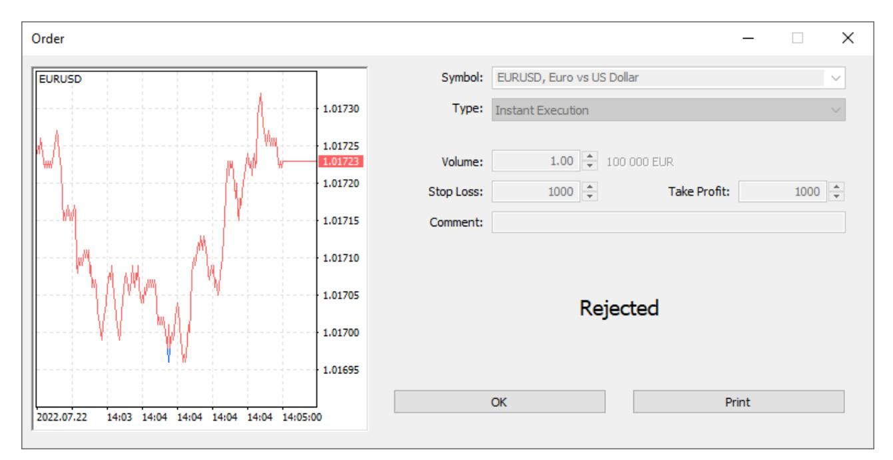

In this chapter, we will look at the error codes that the server can return when processing trades. All errors are logged in the [journal](#page-104-0).

| Error                                                                 | Description                                                                                                                                                                                                                                                                                                                                                                                                                                                                                                                                                                                                                                                                                                                                                                                                                                                                                                                                            |
|-----------------------------------------------------------------------|--------------------------------------------------------------------------------------------------------------------------------------------------------------------------------------------------------------------------------------------------------------------------------------------------------------------------------------------------------------------------------------------------------------------------------------------------------------------------------------------------------------------------------------------------------------------------------------------------------------------------------------------------------------------------------------------------------------------------------------------------------------------------------------------------------------------------------------------------------------------------------------------------------------------------------------------------------|
| Request on the way                                                    | The request has been sent to the server, but has not yet been accepted.                                                                                                                                                                                                                                                                                                                                                                                                                                                                                                                                                                                                                                                                                                                                                                                                                                                                                |
| Request accepted                                                      | The request has been received by the server and is pending processing.                                                                                                                                                                                                                                                                                                                                                                                                                                                                                                                                                                                                                                                                                                                                                                                                                                                                                 |
| Request processed                                                     | The server has started executing the request.                                                                                                                                                                                                                                                                                                                                                                                                                                                                                                                                                                                                                                                                                                                                                                                                                                                                                                          |
| Requote                                                               | The server has sent a requoted price in response to the client's trade request for a particular symbol.                                                                                                                                                                                                                                                                                                                                                                                                                                                                                                                                                                                                                                                                                                                                                                                                                                                |
| Prices                                                                | Sending the prices.                                                                                                                                                                                                                                                                                                                                                                                                                                                                                                                                                                                                                                                                                                                                                                                                                                                                                                                                    |
| Request rejected                                                      | The request has been rejected by the server or the dealer.                                                                                                                                                                                                                                                                                                                                                                                                                                                                                                                                                                                                                                                                                                                                                                                                                                                                                             |
| Request canceled                                                      | The request has been canceled by the server, dealer or client.                                                                                                                                                                                                                                                                                                                                                                                                                                                                                                                                                                                                                                                                                                                                                                                                                                                                                         |
| Order placed                                                          | The order has been placed and is awaiting specific conditions to be processed.                                                                                                                                                                                                                                                                                                                                                                                                                                                                                                                                                                                                                                                                                                                                                                                                                                                                         |
| Request executed                                                      | The requested operation has been executed.                                                                                                                                                                                                                                                                                                                                                                                                                                                                                                                                                                                                                                                                                                                                                                                                                                                                                                             |
| Error                                                                 | Description                                                                                                                                                                                                                                                                                                                                                                                                                                                                                                                                                                                                                                                                                                                                                                                                                                                                                                                                            |
| Request executed partly                                               | The requested operation has been partially executed, for example, a<br>part of the order volume has been filled.                                                                                                                                                                                                                                                                                                                                                                                                                                                                                                                                                                                                                                                                                                                                                                                                                                       |
| Request error                                                         | Request execution error.                                                                                                                                                                                                                                                                                                                                                                                                                                                                                                                                                                                                                                                                                                                                                                                                                                                                                                                               |
| Request timeout                                                       | The request has timed out.                                                                                                                                                                                                                                                                                                                                                                                                                                                                                                                                                                                                                                                                                                                                                                                                                                                                                                                             |
| Invalid request                                                       | The request has failed the primary validation check.                                                                                                                                                                                                                                                                                                                                                                                                                                                                                                                                                                                                                                                                                                                                                                                                                                                                                                   |
| Invalid volume                                                        | An incorrect volume is specified in the trade request.                                                                                                                                                                                                                                                                                                                                                                                                                                                                                                                                                                                                                                                                                                                                                                                                                                                                                                 |
| Invalid price                                                         | An invalid price is specified in the trade request.                                                                                                                                                                                                                                                                                                                                                                                                                                                                                                                                                                                                                                                                                                                                                                                                                                                                                                    |
| Invalid stops                                                         | The request contains incorrectly specified Take Profit and Stop Loss<br>levels.                                                                                                                                                                                                                                                                                                                                                                                                                                                                                                                                                                                                                                                                                                                                                                                                                                                                        |
| Trade disabled                                                        | The account is not allowed to perform trading operations.                                                                                                                                                                                                                                                                                                                                                                                                                                                                                                                                                                                                                                                                                                                                                                                                                                                                                              |
| Market closed                                                         | The market is closed. The error appears at an attempt to perform<br>trading operations outside the allowed time (this includes general<br>trading hours and trading sessions of individual symbols).                                                                                                                                                                                                                                                                                                                                                                                                                                                                                                                                                                                                                                                                                                                                                   |
| No money                                                              | Not enough money. An attempt to perform a trading operation with<br>insufficient funds.                                                                                                                                                                                                                                                                                                                                                                                                                                                                                                                                                                                                                                                                                                                                                                                                                                                                |
| Price changed                                                         | The price has changed. This error occurs when the current price<br>exceeds the maximum deviation from the price requested by the trader<br>in the order.                                                                                                                                                                                                                                                                                                                                                                                                                                                                                                                                                                                                                                                                                                                                                                                               |
| No prices                                                             | The error occurs when there is no quote stream.                                                                                                                                                                                                                                                                                                                                                                                                                                                                                                                                                                                                                                                                                                                                                                                                                                                                                                        |
| Invalid expiration                                                    | The invalid expiration error occurs when placing an order with an<br>incorrect expiration date.                                                                                                                                                                                                                                                                                                                                                                                                                                                                                                                                                                                                                                                                                                                                                                                                                                                        |
| Order has been changed already                                        | The error occurs at an attempt to edit an order that has already been<br>modified.                                                                                                                                                                                                                                                                                                                                                                                                                                                                                                                                                                                                                                                                                                                                                                                                                                                                     |
| Too many trade requests                                               | The error occurs when trades are sent to the server too often.                                                                                                                                                                                                                                                                                                                                                                                                                                                                                                                                                                                                                                                                                                                                                                                                                                                                                         |
| AutoTrading disabled by server                                        | The error indicates that trading using Expert Advisors is disabled in<br>account settings.                                                                                                                                                                                                                                                                                                                                                                                                                                                                                                                                                                                                                                                                                                                                                                                                                                                             |
| AutoTrading disabled by client                                        | The error indicates that the ability to trade using Expert Advisors is<br>disabled in the client terminal.                                                                                                                                                                                                                                                                                                                                                                                                                                                                                                                                                                                                                                                                                                                                                                                                                                             |
| Request locked                                                        | The dealer has blocked the request for processing.                                                                                                                                                                                                                                                                                                                                                                                                                                                                                                                                                                                                                                                                                                                                                                                                                                                                                                     |
| Modification failed due to order or<br>position being close to market | The order or position cannot be changed because it is too close to the<br>market.                                                                                                                                                                                                                                                                                                                                                                                                                                                                                                                                                                                                                                                                                                                                                                                                                                                                      |
| Error                                                                 | Description                                                                                                                                                                                                                                                                                                                                                                                                                                                                                                                                                                                                                                                                                                                                                                                                                                                                                                                                            |
|                                                                       | See also: Articles /Technical support workdays: inability to<br>change an order or position                                                                                                                                                                                                                                                                                                                                                                                                                                                                                                                                                                                                                                                                                                                                                                                                                                                            |
| Unsupported filling mode                                              | The requested fill mode is not supported.                                                                                                                                                                                                                                                                                                                                                                                                                                                                                                                                                                                                                                                                                                                                                                                                                                                                                                              |
| No connection                                                         | There is no connection to the trade server.                                                                                                                                                                                                                                                                                                                                                                                                                                                                                                                                                                                                                                                                                                                                                                                                                                                                                                            |
| Real accounts only                                                    | The operation is only allowed for real accounts.                                                                                                                                                                                                                                                                                                                                                                                                                                                                                                                                                                                                                                                                                                                                                                                                                                                                                                       |
| Order limit                                                           | The maximum allowable number of pending orders has been reached.                                                                                                                                                                                                                                                                                                                                                                                                                                                                                                                                                                                                                                                                                                                                                                                                                                                                                       |
| Volume limit                                                          | The maximum volume of orders and positions for this symbol has been<br>reached.                                                                                                                                                                                                                                                                                                                                                                                                                                                                                                                                                                                                                                                                                                                                                                                                                                                                        |
| Invalid order                                                         | Invalid or prohibited order type.                                                                                                                                                                                                                                                                                                                                                                                                                                                                                                                                                                                                                                                                                                                                                                                                                                                                                                                      |
| Position doesn't exist                                                | The position has already been closed. The error can be caused by an<br>attempt to modify the stop levels of a position after it was closed.                                                                                                                                                                                                                                                                                                                                                                                                                                                                                                                                                                                                                                                                                                                                                                                                            |
| Volume to be closed exceeds the<br>position volume                    | The requested volume to close exceeds the current position volume.                                                                                                                                                                                                                                                                                                                                                                                                                                                                                                                                                                                                                                                                                                                                                                                                                                                                                     |
| A close order already exists for a<br>specified position              | There is already a closing order for the specified position. This situation<br>may occur when working in the hedging system in the following cases:<br>•<br>when trying to close a position by an opposite one while there is an<br>order to close this position<br>•<br>when trying to close a position fully or partially if the total volume of<br>existing close orders and the newly placed order exceeds the current<br>position volume                                                                                                                                                                                                                                                                                                                                                                                                                                                                                                          |
| Position limit                                                        | The number of open positions which can simultaneously exist on an<br>account can be limited by group setting. When the limit is reached, the<br>server will return the<br>MT_TRADE_RETCODE_REQUEST_LIMIT_POSITIONS error in response<br>to order placing. The limitation works differently depending on the<br>position accounting type:<br>•<br>Netting — number of open positions is considered. When a limit is<br>reached, the platform disables placing new orders whose execution<br>may increase the number of open positions. In fact, the platform<br>allows placing orders only for the symbols that already have open<br>positions. The current pending orders are not considered since their<br>execution may lead to changes in the current positions but it cannot<br>increase their number.<br>•<br>Hedging — pending orders are considered together with open<br>positions, since a pending order activation always leads to opening a |
| Error                                                                 | Description                                                                                                                                                                                                                                                                                                                                                                                                                                                                                                                                                                                                                                                                                                                                                                                                                                                                                                                                            |
|                                                                       | new position. When a limit is reached, the platform disables placing<br>both new market orders for opening positions and pending orders.                                                                                                                                                                                                                                                                                                                                                                                                                                                                                                                                                                                                                                                                                                                                                                                                               |
| Request rejected, order #XXXX<br>will be canceled                     | This code is returned when the "Cancel order" routing rule action<br>triggers.                                                                                                                                                                                                                                                                                                                                                                                                                                                                                                                                                                                                                                                                                                                                                                                                                                                                         |
| Long positions only                                                   | The request has been rejected because the "Only long positions are<br>allowed" rule is set for the symbol.                                                                                                                                                                                                                                                                                                                                                                                                                                                                                                                                                                                                                                                                                                                                                                                                                                             |
| Short positions only                                                  | The request has been rejected because the "Only short positions are<br>allowed" rule is set for the symbol.                                                                                                                                                                                                                                                                                                                                                                                                                                                                                                                                                                                                                                                                                                                                                                                                                                            |
| Only position closing is allowed                                      | The request has been rejected because the "Only closing of existing<br>positions is allowed" rule is set for the symbol                                                                                                                                                                                                                                                                                                                                                                                                                                                                                                                                                                                                                                                                                                                                                                                                                                |
| Prohibited by FIFO                                                    | The position cannot be closed because of the FIFO rule. It is used for<br>groups with the enabled FIFO option, in which positions must be closed<br>strictly in the order they were opened, starting with the oldest one.                                                                                                                                                                                                                                                                                                                                                                                                                                                                                                                                                                                                                                                                                                                              |
| Hedge prohibited                                                      | It is not possible to open a position or to place a pending order because<br>position hedging is prohibited. The error is returned if a user tries to<br>execute a trading operation in the group with hedging prohibited, while<br>the user already has an opposite order or position for the same symbol.                                                                                                                                                                                                                                                                                                                                                                                                                                                                                                                                                                                                                                            |

### **Request rejection statistics**

The Administrator terminal provides a special tool to control the execution of trade requests. Select the required trading server in the Network Cluster section and open the Trading tab.

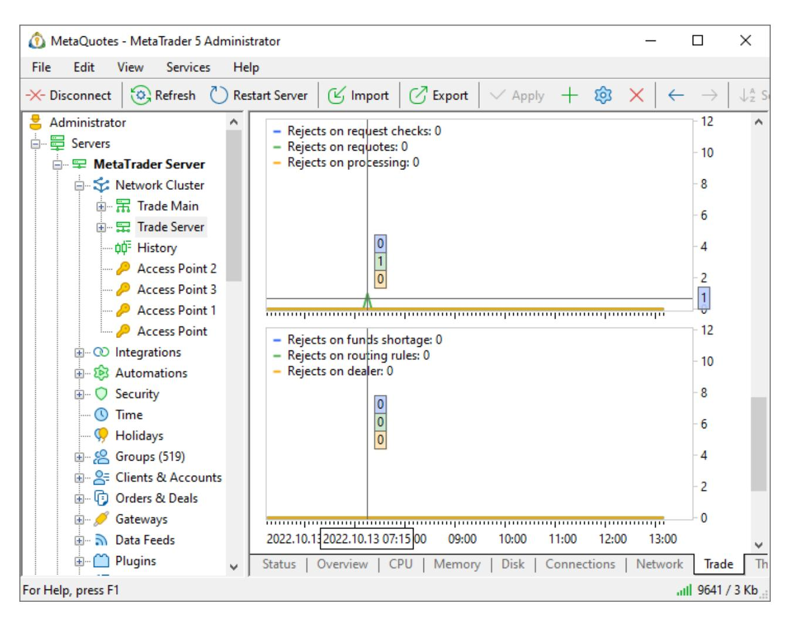

A separate group of diagrams show the statistics of trade request rejections. Analyze them to improve operational control and customer service quality. For example, by analyzing the diagrams, you can easily see if your routing rules or gateways began to work incorrectly.

- · Request validation rejections — the request did not pass the validation check: incorrect volume, stop levels, etc.
- · Requote rejections — the request was rejected due to a significant price change. Such rejections can only appear during [Instant Execution](#page-26-0).
- ·Processing failures — an error occurred while processing the request by the server.
- ·Rejections due to insufficient funds — the client did not have enough money to fulfill the request.
- ·Rejections by routing rules — the request was rejected according to the [routing rule](#page-79-0).
- ·Dealer rejections — the request was rejected by a dealer via the Manager terminal or Manager API.
- · Rejections on gateways — the request was routinely rejected by the gateway, for example, if an external system refuses to execute it.
- ·Gateway processing failures — an error occurred while processing the request by the gateway.

# <span id="page-114-0"></span>**Common errors**

- · Do not completely disable access to currency pairs for clients who do not trade them. Currency pairs must be available at least with trading disabled, as they are used to convert profits and margins of other instruments. If the symbol (CFD or Futures) calculation currency differs from the account deposit currency, the platform will not be able to display the relevant values without access to the required currency rates.
- · Be sure to specify the tick size and price for Futures symbols, otherwise the closing prices and profit will not be updated for Futures positions.
- · After manually changing the deal closing price, do not forget to update its financial result, as well as to adjust the positions and account trading status.
- · Execution modes are not applied when trading from the Manager terminal. The trade server always executes such deals at the price specified by the dealer.
- · Trade requests will not be forwarded to the manager terminal for processing until the dealer mode is enabled.
- · The dealer has no more than three minutes to process a trade request. After this time unprocessed requests are rejected.
- · Routing rules are checked from top to bottom. If a configured rule is not applied, make sure the request does not fall under one of the previous rules.
- · The number of log lines that can be simultaneously requested from the server is limited. If you see a message about reaching the limit, refine the request, otherwise you might be missing the necessary records.

# <span id="page-115-0"></span>**Risk management**

An important part of broker's operations is related to the company's trading security: control over trading operations, fraud prevention, limiting potential loss, etc. In this chapter, we will look at:

#### ·**Leverage**

How to configure [leveraged](#page-116-0) margin trading: common account leverage and instrument-specific leverage.

#### ·**Account state**

Where to view the sufficiency of funds on the account and other [financial variables.](#page-121-0) Which funds the client can use to maintain trading positions.

#### ·**Margin Call and Stop Out**

When a notification to [replenish an account](#page-126-0) triggers. How positions are forced to close when there is no money on the account.

#### ·**Margin calculation**

Pretrade control for stock and exchange trading. Initial and maintenance [margin](#page-131-0)calculations for different asset types.

#### ·**How to protect the broker from unfair traders**

Trading activity control: global [limits](#page-173-1) for groups and accounts, real-time checks through routing rules.

#### ·**Operational control of trading symbols**

How to quickly [modify symbol parameters](#page-179-0) in case of dangerous market situations: for example, how to switch all operations to request execution or to widen spread.

#### ·**Summary positions and coverage**

How to track abnormal situations in clients' trading positions and protect from risks by [covering](#page-182-0) with another broker.

# <span id="page-116-0"></span>**Account leverage**

Leverage is used in margin trading. It actually represents a loan provided by the broker to the trader to enable trading in a larger volume than would be possible with initial funds.

Leverage is the ratio of the trader's own funds to the loan amount. For example, 1:100 means that the broker provides a loan amount that is 100 times the investor's deposit.

Let us consider a classic example related to Forex currency pair trading: the contract size for EURUSD is 100,000. To perform a 1 lot deal, the trader needs EUR 100,000, but they only have EUR 1,000 in their account. In this case, the broker can provide leverage by lending the missing amount. In this case, the trader's funds are used as a certain pledge, which is called "margin". The leverage will be 1:100, i.e. the client spends 100 times less money on the deal.

Margin trading increases the potential profit of the client by increasing the volume of possible trades. In the example above, if the price increased by only 1%, the client would receive the profit of 1,000, i.e. would double the deposit. However, this also increases the potential risk: the same price movement in the opposite direction would cause all funds to be lost.

The maximum allowable leverage is determined by the regulatory requirements of the country where you provide brokerage services.

### **Leverage when opening demo accounts**

It is important to enable traders to understand in practice how margin trading works. To familiarize them with this option, use demo accounts. Specify the list of available leverage options for each demo account type.

The platform allows the trader to choose the required leverage when opening an account from the client terminal. You can enable this possibility via account allocation settings in MetaTrader 5 Administrator.

| Broker-Demo - MetaTrader 5 Administrator                                                                                                                                                                                                                                                                                                                                                                                                                                                                                                                                                                                                                                                                                                                                                                                                                                                                                                                                                                                                                                                                                                                                                                                                                                                                                                                                                                                                                                                                                                                                                                                                                                                                                                         |                                |                                                 |                                                                                                      |                                                                                                      |      |                        |                |  |                                                                    |         |                     |  |                |                                                                     |  |                                                  |  |                           |                                                                           |  |                          |  |  |  |  |   |   |  |  |  |  |  |  |  |          |         |   |  |  |  |  |        |                |   |  |  |  |  |              |           |  |            |                   |  |  |            |               |  |  |  |  |                |  |                                |                                                 |  |                               |  |  |                |               |  |                         |  |  |   |
|--------------------------------------------------------------------------------------------------------------------------------------------------------------------------------------------------------------------------------------------------------------------------------------------------------------------------------------------------------------------------------------------------------------------------------------------------------------------------------------------------------------------------------------------------------------------------------------------------------------------------------------------------------------------------------------------------------------------------------------------------------------------------------------------------------------------------------------------------------------------------------------------------------------------------------------------------------------------------------------------------------------------------------------------------------------------------------------------------------------------------------------------------------------------------------------------------------------------------------------------------------------------------------------------------------------------------------------------------------------------------------------------------------------------------------------------------------------------------------------------------------------------------------------------------------------------------------------------------------------------------------------------------------------------------------------------------------------------------------------------------|--------------------------------|-------------------------------------------------|------------------------------------------------------------------------------------------------------|------------------------------------------------------------------------------------------------------|------|------------------------|----------------|--|--------------------------------------------------------------------|---------|---------------------|--|----------------|---------------------------------------------------------------------|--|--------------------------------------------------|--|---------------------------|---------------------------------------------------------------------------|--|--------------------------|--|--|--|--|---|---|--|--|--|--|--|--|--|----------|---------|---|--|--|--|--|--------|----------------|---|--|--|--|--|--------------|-----------|--|------------|-------------------|--|--|------------|---------------|--|--|--|--|----------------|--|--------------------------------|-------------------------------------------------|--|-------------------------------|--|--|----------------|---------------|--|-------------------------|--|--|---|
| <table> <tr> <td><b>Edit</b></td> <td>File</td> <td>View</td> </tr> <tr> <td><b>Services</b></td> <td>Help</td> <td></td> </tr> <tr> <td>−×− Disconnect</td> <td></td> <td></td> </tr> <tr> <td>Refresh</td> <td></td> <td></td> </tr> <tr> <td>Restart Server</td> <td></td> <td></td> </tr> <tr> <td></td> <td></td> <td></td> </tr> <tr> <td></td> <td></td> <td></td> </tr> </table>                                                                                                                                                                                                                                                                                                                                                                                                                                                                                                                                                                                                                                                                                                                                                                                                                                                                                                                                                                                                                                                                                                                                                                                                                                                                                                                                                         | <b>Edit</b>                    | File                                            | View                                                                                                 | <b>Services</b>                                                                                      | Help |                        | −×− Disconnect |  |                                                                    | Refresh |                     |  | Restart Server |                                                                     |  |                                                  |  |                           |                                                                           |  |                          |  |  |  |  |   |   |  |  |  |  |  |  |  |          |         |   |  |  |  |  |        |                |   |  |  |  |  |              |           |  |            |                   |  |  |            |               |  |  |  |  |                |  |                                |                                                 |  |                               |  |  |                |               |  |                         |  |  |   |
| <b>Edit</b>                                                                                                                                                                                                                                                                                                                                                                                                                                                                                                                                                                                                                                                                                                                                                                                                                                                                                                                                                                                                                                                                                                                                                                                                                                                                                                                                                                                                                                                                                                                                                                                                                                                                                                                                      | File                           | View                                            |                                                                                                      |                                                                                                      |      |                        |                |  |                                                                    |         |                     |  |                |                                                                     |  |                                                  |  |                           |                                                                           |  |                          |  |  |  |  |   |   |  |  |  |  |  |  |  |          |         |   |  |  |  |  |        |                |   |  |  |  |  |              |           |  |            |                   |  |  |            |               |  |  |  |  |                |  |                                |                                                 |  |                               |  |  |                |               |  |                         |  |  |   |
| <b>Services</b>                                                                                                                                                                                                                                                                                                                                                                                                                                                                                                                                                                                                                                                                                                                                                                                                                                                                                                                                                                                                                                                                                                                                                                                                                                                                                                                                                                                                                                                                                                                                                                                                                                                                                                                                  | Help                           |                                                 |                                                                                                      |                                                                                                      |      |                        |                |  |                                                                    |         |                     |  |                |                                                                     |  |                                                  |  |                           |                                                                           |  |                          |  |  |  |  |   |   |  |  |  |  |  |  |  |          |         |   |  |  |  |  |        |                |   |  |  |  |  |              |           |  |            |                   |  |  |            |               |  |  |  |  |                |  |                                |                                                 |  |                               |  |  |                |               |  |                         |  |  |   |
| −×− Disconnect                                                                                                                                                                                                                                                                                                                                                                                                                                                                                                                                                                                                                                                                                                                                                                                                                                                                                                                                                                                                                                                                                                                                                                                                                                                                                                                                                                                                                                                                                                                                                                                                                                                                                                                                   |                                |                                                 |                                                                                                      |                                                                                                      |      |                        |                |  |                                                                    |         |                     |  |                |                                                                     |  |                                                  |  |                           |                                                                           |  |                          |  |  |  |  |   |   |  |  |  |  |  |  |  |          |         |   |  |  |  |  |        |                |   |  |  |  |  |              |           |  |            |                   |  |  |            |               |  |  |  |  |                |  |                                |                                                 |  |                               |  |  |                |               |  |                         |  |  |   |
| Refresh                                                                                                                                                                                                                                                                                                                                                                                                                                                                                                                                                                                                                                                                                                                                                                                                                                                                                                                                                                                                                                                                                                                                                                                                                                                                                                                                                                                                                                                                                                                                                                                                                                                                                                                                          |                                |                                                 |                                                                                                      |                                                                                                      |      |                        |                |  |                                                                    |         |                     |  |                |                                                                     |  |                                                  |  |                           |                                                                           |  |                          |  |  |  |  |   |   |  |  |  |  |  |  |  |          |         |   |  |  |  |  |        |                |   |  |  |  |  |              |           |  |            |                   |  |  |            |               |  |  |  |  |                |  |                                |                                                 |  |                               |  |  |                |               |  |                         |  |  |   |
| Restart Server                                                                                                                                                                                                                                                                                                                                                                                                                                                                                                                                                                                                                                                                                                                                                                                                                                                                                                                                                                                                                                                                                                                                                                                                                                                                                                                                                                                                                                                                                                                                                                                                                                                                                                                                   |                                |                                                 |                                                                                                      |                                                                                                      |      |                        |                |  |                                                                    |         |                     |  |                |                                                                     |  |                                                  |  |                           |                                                                           |  |                          |  |  |  |  |   |   |  |  |  |  |  |  |  |          |         |   |  |  |  |  |        |                |   |  |  |  |  |              |           |  |            |                   |  |  |            |               |  |  |  |  |                |  |                                |                                                 |  |                               |  |  |                |               |  |                         |  |  |   |
|                                                                                                                                                                                                                                                                                                                                                                                                                                                                                                                                                                                                                                                                                                                                                                                                                                                                                                                                                                                                                                                                                                                                                                                                                                                                                                                                                                                                                                                                                                                                                                                                                                                                                                                                                  |                                |                                                 |                                                                                                      |                                                                                                      |      |                        |                |  |                                                                    |         |                     |  |                |                                                                     |  |                                                  |  |                           |                                                                           |  |                          |  |  |  |  |   |   |  |  |  |  |  |  |  |          |         |   |  |  |  |  |        |                |   |  |  |  |  |              |           |  |            |                   |  |  |            |               |  |  |  |  |                |  |                                |                                                 |  |                               |  |  |                |               |  |                         |  |  |   |
|                                                                                                                                                                                                                                                                                                                                                                                                                                                                                                                                                                                                                                                                                                                                                                                                                                                                                                                                                                                                                                                                                                                                                                                                                                                                                                                                                                                                                                                                                                                                                                                                                                                                                                                                                  |                                |                                                 |                                                                                                      |                                                                                                      |      |                        |                |  |                                                                    |         |                     |  |                |                                                                     |  |                                                  |  |                           |                                                                           |  |                          |  |  |  |  |   |   |  |  |  |  |  |  |  |          |         |   |  |  |  |  |        |                |   |  |  |  |  |              |           |  |            |                   |  |  |            |               |  |  |  |  |                |  |                                |                                                 |  |                               |  |  |                |               |  |                         |  |  |   |
| <table> <tr> <td>由 8 Groups (44)</td> <td>۸</td> <td></td> <td>X Demo account allocat <a href="https://broker.com/open_account">https://broker.com/open_account</a></td> <td></td> </tr> <tr> <td>自 &amp; Clients &amp; Accounts</td> <td></td> <td></td> <td><span>∨</span> Automatic allocation of demo account on first start</td> <td></td> </tr> <tr> <td><b>PAllocations</b></td> <td></td> <td>× Deposit URL</td> <td><a href="https://broker.com/deposit">https://broker.com/deposit</a></td> <td></td> </tr> <tr> <td><span style="font-family:math;">P</span> Clients</td> <td></td> <td>&amp;overline× Withdrawal URL</td> <td><a href="https://broker.com/withdrawal">https://broker.com/withdrawal</a></td> <td></td> </tr> <tr> <td>Account allocation group</td> <td></td> <td></td> <td></td> <td></td> <td>?</td> <td>×</td> </tr> <tr> <td></td> <td></td> <td></td> <td></td> <td></td> <td></td> <td></td> </tr> <tr> <td>Company:</td> <td>Default</td> <td>✓</td> <td></td> <td></td> <td></td> <td></td> </tr> <tr> <td>Group:</td> <td>demo\forex-usd</td> <td>✓</td> <td></td> <td></td> <td></td> <td></td> </tr> <tr> <td>Description:</td> <td>Forex USD</td> <td></td> <td>Leverages:</td> <td>100,50,30,20,10,5</td> <td></td> <td></td> </tr> <tr> <td>Countries:</td> <td>All countries</td> <td></td> <td></td> <td></td> <td></td> <td><span>✓</span></td> </tr> <tr> <td></td> <td>Use advanced registration form</td> <td>Require identity and proof of address documents</td> <td></td> <td>Start KYC check automatically</td> <td></td> <td></td> </tr> <tr> <td>Fo<br/>Confirm:</td> <td>Phone &amp; Email</td> <td></td> <td>Mail server:<br/>Default</td> <td></td> <td></td> <td>✓</td> </tr> </table> | 由 8 Groups (44)                | ۸                                               |                                                                                                      | X Demo account allocat <a href="https://broker.com/open_account">https://broker.com/open_account</a> |      | 自 & Clients & Accounts |                |  | <span>∨</span> Automatic allocation of demo account on first start |         | <b>PAllocations</b> |  | × Deposit URL  | <a href="https://broker.com/deposit">https://broker.com/deposit</a> |  | <span style="font-family:math;">P</span> Clients |  | &overline× Withdrawal URL | <a href="https://broker.com/withdrawal">https://broker.com/withdrawal</a> |  | Account allocation group |  |  |  |  | ? | × |  |  |  |  |  |  |  | Company: | Default | ✓ |  |  |  |  | Group: | demo\forex-usd | ✓ |  |  |  |  | Description: | Forex USD |  | Leverages: | 100,50,30,20,10,5 |  |  | Countries: | All countries |  |  |  |  | <span>✓</span> |  | Use advanced registration form | Require identity and proof of address documents |  | Start KYC check automatically |  |  | Fo<br>Confirm: | Phone & Email |  | Mail server:<br>Default |  |  | ✓ |
| 由 8 Groups (44)                                                                                                                                                                                                                                                                                                                                                                                                                                                                                                                                                                                                                                                                                                                                                                                                                                                                                                                                                                                                                                                                                                                                                                                                                                                                                                                                                                                                                                                                                                                                                                                                                                                                                                                                  | ۸                              |                                                 | X Demo account allocat <a href="https://broker.com/open_account">https://broker.com/open_account</a> |                                                                                                      |      |                        |                |  |                                                                    |         |                     |  |                |                                                                     |  |                                                  |  |                           |                                                                           |  |                          |  |  |  |  |   |   |  |  |  |  |  |  |  |          |         |   |  |  |  |  |        |                |   |  |  |  |  |              |           |  |            |                   |  |  |            |               |  |  |  |  |                |  |                                |                                                 |  |                               |  |  |                |               |  |                         |  |  |   |
| 自 & Clients & Accounts                                                                                                                                                                                                                                                                                                                                                                                                                                                                                                                                                                                                                                                                                                                                                                                                                                                                                                                                                                                                                                                                                                                                                                                                                                                                                                                                                                                                                                                                                                                                                                                                                                                                                                                           |                                |                                                 | <span>∨</span> Automatic allocation of demo account on first start                                   |                                                                                                      |      |                        |                |  |                                                                    |         |                     |  |                |                                                                     |  |                                                  |  |                           |                                                                           |  |                          |  |  |  |  |   |   |  |  |  |  |  |  |  |          |         |   |  |  |  |  |        |                |   |  |  |  |  |              |           |  |            |                   |  |  |            |               |  |  |  |  |                |  |                                |                                                 |  |                               |  |  |                |               |  |                         |  |  |   |
| <b>PAllocations</b>                                                                                                                                                                                                                                                                                                                                                                                                                                                                                                                                                                                                                                                                                                                                                                                                                                                                                                                                                                                                                                                                                                                                                                                                                                                                                                                                                                                                                                                                                                                                                                                                                                                                                                                              |                                | × Deposit URL                                   | <a href="https://broker.com/deposit">https://broker.com/deposit</a>                                  |                                                                                                      |      |                        |                |  |                                                                    |         |                     |  |                |                                                                     |  |                                                  |  |                           |                                                                           |  |                          |  |  |  |  |   |   |  |  |  |  |  |  |  |          |         |   |  |  |  |  |        |                |   |  |  |  |  |              |           |  |            |                   |  |  |            |               |  |  |  |  |                |  |                                |                                                 |  |                               |  |  |                |               |  |                         |  |  |   |
| <span style="font-family:math;">P</span> Clients                                                                                                                                                                                                                                                                                                                                                                                                                                                                                                                                                                                                                                                                                                                                                                                                                                                                                                                                                                                                                                                                                                                                                                                                                                                                                                                                                                                                                                                                                                                                                                                                                                                                                                 |                                | &overline× Withdrawal URL                       | <a href="https://broker.com/withdrawal">https://broker.com/withdrawal</a>                            |                                                                                                      |      |                        |                |  |                                                                    |         |                     |  |                |                                                                     |  |                                                  |  |                           |                                                                           |  |                          |  |  |  |  |   |   |  |  |  |  |  |  |  |          |         |   |  |  |  |  |        |                |   |  |  |  |  |              |           |  |            |                   |  |  |            |               |  |  |  |  |                |  |                                |                                                 |  |                               |  |  |                |               |  |                         |  |  |   |
| Account allocation group                                                                                                                                                                                                                                                                                                                                                                                                                                                                                                                                                                                                                                                                                                                                                                                                                                                                                                                                                                                                                                                                                                                                                                                                                                                                                                                                                                                                                                                                                                                                                                                                                                                                                                                         |                                |                                                 |                                                                                                      |                                                                                                      | ?    | ×                      |                |  |                                                                    |         |                     |  |                |                                                                     |  |                                                  |  |                           |                                                                           |  |                          |  |  |  |  |   |   |  |  |  |  |  |  |  |          |         |   |  |  |  |  |        |                |   |  |  |  |  |              |           |  |            |                   |  |  |            |               |  |  |  |  |                |  |                                |                                                 |  |                               |  |  |                |               |  |                         |  |  |   |
|                                                                                                                                                                                                                                                                                                                                                                                                                                                                                                                                                                                                                                                                                                                                                                                                                                                                                                                                                                                                                                                                                                                                                                                                                                                                                                                                                                                                                                                                                                                                                                                                                                                                                                                                                  |                                |                                                 |                                                                                                      |                                                                                                      |      |                        |                |  |                                                                    |         |                     |  |                |                                                                     |  |                                                  |  |                           |                                                                           |  |                          |  |  |  |  |   |   |  |  |  |  |  |  |  |          |         |   |  |  |  |  |        |                |   |  |  |  |  |              |           |  |            |                   |  |  |            |               |  |  |  |  |                |  |                                |                                                 |  |                               |  |  |                |               |  |                         |  |  |   |
| Company:                                                                                                                                                                                                                                                                                                                                                                                                                                                                                                                                                                                                                                                                                                                                                                                                                                                                                                                                                                                                                                                                                                                                                                                                                                                                                                                                                                                                                                                                                                                                                                                                                                                                                                                                         | Default                        | ✓                                               |                                                                                                      |                                                                                                      |      |                        |                |  |                                                                    |         |                     |  |                |                                                                     |  |                                                  |  |                           |                                                                           |  |                          |  |  |  |  |   |   |  |  |  |  |  |  |  |          |         |   |  |  |  |  |        |                |   |  |  |  |  |              |           |  |            |                   |  |  |            |               |  |  |  |  |                |  |                                |                                                 |  |                               |  |  |                |               |  |                         |  |  |   |
| Group:                                                                                                                                                                                                                                                                                                                                                                                                                                                                                                                                                                                                                                                                                                                                                                                                                                                                                                                                                                                                                                                                                                                                                                                                                                                                                                                                                                                                                                                                                                                                                                                                                                                                                                                                           | demo\forex-usd                 | ✓                                               |                                                                                                      |                                                                                                      |      |                        |                |  |                                                                    |         |                     |  |                |                                                                     |  |                                                  |  |                           |                                                                           |  |                          |  |  |  |  |   |   |  |  |  |  |  |  |  |          |         |   |  |  |  |  |        |                |   |  |  |  |  |              |           |  |            |                   |  |  |            |               |  |  |  |  |                |  |                                |                                                 |  |                               |  |  |                |               |  |                         |  |  |   |
| Description:                                                                                                                                                                                                                                                                                                                                                                                                                                                                                                                                                                                                                                                                                                                                                                                                                                                                                                                                                                                                                                                                                                                                                                                                                                                                                                                                                                                                                                                                                                                                                                                                                                                                                                                                     | Forex USD                      |                                                 | Leverages:                                                                                           | 100,50,30,20,10,5                                                                                    |      |                        |                |  |                                                                    |         |                     |  |                |                                                                     |  |                                                  |  |                           |                                                                           |  |                          |  |  |  |  |   |   |  |  |  |  |  |  |  |          |         |   |  |  |  |  |        |                |   |  |  |  |  |              |           |  |            |                   |  |  |            |               |  |  |  |  |                |  |                                |                                                 |  |                               |  |  |                |               |  |                         |  |  |   |
| Countries:                                                                                                                                                                                                                                                                                                                                                                                                                                                                                                                                                                                                                                                                                                                                                                                                                                                                                                                                                                                                                                                                                                                                                                                                                                                                                                                                                                                                                                                                                                                                                                                                                                                                                                                                       | All countries                  |                                                 |                                                                                                      |                                                                                                      |      | <span>✓</span>         |                |  |                                                                    |         |                     |  |                |                                                                     |  |                                                  |  |                           |                                                                           |  |                          |  |  |  |  |   |   |  |  |  |  |  |  |  |          |         |   |  |  |  |  |        |                |   |  |  |  |  |              |           |  |            |                   |  |  |            |               |  |  |  |  |                |  |                                |                                                 |  |                               |  |  |                |               |  |                         |  |  |   |
|                                                                                                                                                                                                                                                                                                                                                                                                                                                                                                                                                                                                                                                                                                                                                                                                                                                                                                                                                                                                                                                                                                                                                                                                                                                                                                                                                                                                                                                                                                                                                                                                                                                                                                                                                  | Use advanced registration form | Require identity and proof of address documents |                                                                                                      | Start KYC check automatically                                                                        |      |                        |                |  |                                                                    |         |                     |  |                |                                                                     |  |                                                  |  |                           |                                                                           |  |                          |  |  |  |  |   |   |  |  |  |  |  |  |  |          |         |   |  |  |  |  |        |                |   |  |  |  |  |              |           |  |            |                   |  |  |            |               |  |  |  |  |                |  |                                |                                                 |  |                               |  |  |                |               |  |                         |  |  |   |
| Fo<br>Confirm:                                                                                                                                                                                                                                                                                                                                                                                                                                                                                                                                                                                                                                                                                                                                                                                                                                                                                                                                                                                                                                                                                                                                                                                                                                                                                                                                                                                                                                                                                                                                                                                                                                                                                                                                   | Phone & Email                  |                                                 | Mail server:<br>Default                                                                              |                                                                                                      |      | ✓                      |                |  |                                                                    |         |                     |  |                |                                                                     |  |                                                  |  |                           |                                                                           |  |                          |  |  |  |  |   |   |  |  |  |  |  |  |  |          |         |   |  |  |  |  |        |                |   |  |  |  |  |              |           |  |            |                   |  |  |            |               |  |  |  |  |                |  |                                |                                                 |  |                               |  |  |                |               |  |                         |  |  |   |

Make sure no default leverage is specified in the group settings. Otherwise, the specified leverage will be used for all demo accounts opened in this group from client terminals.

| Label                   | Value                                                                                  |
|-------------------------|----------------------------------------------------------------------------------------|
| Group:                  | demo\forex-usd                                                                         |
| Company                 |                                                                                        |
| Common                  |                                                                                        |
| Permissions             |                                                                                        |
| News & Mail             |                                                                                        |
| Margin                  |                                                                                        |
| Symbols                 |                                                                                        |
| Commissions             |                                                                                        |
| Reports                 |                                                                                        |
|                         | Please specify the group permissions for symbols, orders, use of Expert Advisors, etc. |
| Maximum symbols:        | unlimited                                                                              |
| Maximum positions:      | unlimited                                                                              |
| Available history:      | All                                                                                    |
| Maximum orders:         | unlimited                                                                              |
| Deposit by default:     |                                                                                        |
| Leverage by default:    |                                                                                        |
| Annual interest rate:   | 0.0000                                                                                 |
| %                       |                                                                                        |
| <b>Trading Signals:</b> | Enable all signals from all brokers                                                    |
| Transfer of funds:      | Disable transfer of funds between accounts                                             |
|                         | Enable trading by Expert Advisors V                                                    |
|                         | Enable position closing according to FIFO rule                                         |
|                         | Enable trailing stops                                                                  |
|                         | Prohibit hedge positions                                                               |
|                         | Enable charge of swaps                                                                 |
|                         | Enable deal cost calculation                                                           |
| Inactivity period:      | days, orders and positions will be deleted after inactivity period                     |
|                         |                                                                                        |
|                         | OK                                                                                     |
|                         | Cancel                                                                                 |
|                         | Help                                                                                   |

# **Leverage setting for instruments**

Some regulators, such as ESMA, limit leverage for specific asset types. In such cases, account-level leverage settings cannot be used as they affect trading operations for all instruments.

To set leverage for each asset type, open [symbol settings](#page-20-1) in MetaTrader 5 Administrator and change the calculation type to Forex No Leverage. This type of calculation ignores the actual leverage of client accounts. Then indicate the margin rates to achieve the desired leverage for the instrument. For example, the 1:30 leverage required by ESMA for major currency pairs can be achieved by setting the margin ratio to 0.033.

| Symbol:                                                              | EURUSD              |
|----------------------------------------------------------------------|---------------------|
|                                                                      |                     |
| Common                                                               | Quotes Trade        |
|                                                                      |                     |
| Trade                                                                | trade volumes, etc. |
|                                                                      |                     |
| Contract size:                                                       | 10000               |
| Calculation:                                                         | Forex No Leverage   |
|                                                                      |                     |
| Limit & stop level:                                                  | 0                   |
| Freeze level:                                                        | 0                   |
| Trade:                                                               | Full access         |
|                                                                      |                     |
|                                                                      |                     |
|                                                                      |                     |
|                                                                      |                     |
|                                                                      |                     |
|                                                                      |                     |
|                                                                      |                     |
|                                                                      |                     |
| Symbol:                                                              | EURUSD              |
|                                                                      |                     |
| Common                                                               | Quotes Trade        |
|                                                                      |                     |
| Execution Margin                                                     |                     |
| Margin Rates                                                         |                     |
| Swaps                                                                |                     |
| Sessions                                                             |                     |
|                                                                      |                     |
| Please specify margin rates for different types of trade operations. |                     |
| Vd                                                                   |                     |
| Liquidity margin rate:                                               | 1.000               |
| Currency margin rate:                                                | 0.00000000          |
| Margin rates:                                                        |                     |
|                                                                      |                     |
|                                                                      |                     |
|                                                                      |                     |
| Market Order                                                         |                     |
| Limit Order                                                          |                     |
| Stop Order                                                           |                     |
| Stop Limit Order                                                     |                     |
| <b>Initial margin</b>                                                |                     |
| <b>D</b> Buy<br>                                                     | 0.0330000           |
|                                                                      | 0.0000000           |
|                                                                      | 0.0000000           |
|                                                                      | 0.0000000           |
| Maintenance margin                                                   | 0.0330000           |
| $ox$ Buy                                                            | 0.0330000           |
|                                                                      | 0.0000000           |
|                                                                      | 0.0000000           |
|                                                                      | 0.0000000           |
|                                                                      |                     |

See also: [Article / How to configure the MetaTrader 5 platform to meet ESMA 2018/795 requirements](https://support.metaquotes.net/en/articles/451)

<span id="page-118-0"></span>The trading platform provides an option to recalculate the margin conversion rate at the end of the day.

In currency pair trading, the margin determined in the symbol's base currency is converted into the account deposit currency. For example, when trading EURUSD with a contract size of 100,000 and a leverage of 1:100, the margin will be EUR 1,000 per lot. If the trader's deposit currency is USD, the margin will be converted from EUR to USD at the current rate. The conversion rate is registered in the position's [Margin rate](#page-67-0) field.

The EURUSD exchange rate will change over time, and the USD equivalent of EUR 1,000 will change accordingly. Thus, the trader's actual leverage may become greater or less than the original one.

To prevent this from happening, the trading platform provides a mechanism for updating margin conversions. It is activated by the new "Recalculate margin exchange rate at the end of day" option in common symbol settings or in group-specific symbol settings.

| Symbol: Forex\EURUSD |                           |                 |                                                                   |                                                                                                                   |          |                                                                                                        | ?     | ×         |
|----------------------|---------------------------|-----------------|-------------------------------------------------------------------|-------------------------------------------------------------------------------------------------------------------|----------|--------------------------------------------------------------------------------------------------------|-------|-----------|
|                      |                           |                 |                                                                   | Common                                                                                                            | Currency | Quotes                                                                                                 | Trade | Execution |
|                      | Hedged margin:            | Initial margin: | multipliers for different types of trade operations.<br>0.00<br>0 |                                                                                                                   |          | The setup of margin requirements for the symbol. Please specify the initial and maintenance margin and |       |           |
|                      | Maintenance margin:       |                 | 0.00                                                              | Calculate hedged margin using larger leg                                                                          |          |                                                                                                        |       |           |
|                      |                           |                 |                                                                   | Exclude long position PnL from free margin and margin level<br>Recalculate margin exchange rate at the End of Day |          |                                                                                                        |       |           |
|                      | Additional margin checks: |                 | None                                                              |                                                                                                                   |          | $ \check{ }$                                                                                           |       |           |
|                      |                           |                 |                                                                   |                                                                                                                   |          |                                                                                                        |       |           |
|                      |                           |                 |                                                                   |                                                                                                                   |          | OK<br>Cancel                                                                                           | Help  |           |

At the end of the trading day, the server will update the "Margin rate" field in all positions for the instruments with the recalculation enabled. The new value will be calculated using the current market prices for the relevant client groups (similar procedures performed during trade execution).

Please note the following features:

- · The margin rate is not recalculated on the days marked as non-working in the platform (according to the server settings)
- · The margin rate is recalculated after swaps calculations (if no swaps are charged, the rate is recalculated too)
- ·If the required price is not available (zero) at the time of recalculation, no recalculation is performed

The recalculation process can be tracked in the trade server log. It will show the following records:

margin rates update started ... margin rates update finished

## **Leverage settings for accounts**

By default, all accounts in the platform are created with a leverage of 1:100. Immediately after creation, you can change the leverage to the desired value in the Account section:

| Label                                | Value                                     |
|--------------------------------------|-------------------------------------------|
| Account:                             | 938744, Taylor Michael, USD, 1:100, Hedge |
| Overview                             |                                           |
| Personal                             |                                           |
| Account                              |                                           |
| Limits                               |                                           |
| Profile                              |                                           |
| Subscriptions                        |                                           |
| Security                             |                                           |
| Group:                               | demo\demoforex                            |
| Color:                               |                                           |
| <b>Bank account:</b>                 | None                                      |
|                                      | √ Enable this account                     |
| Agent account:                       |                                           |
| Leverage:                            | 1:200<br>1:5000<br>1:1000<br>1:500        |
|                                      | √                                         |
|                                      |                                           |
|                                      |                                           |
|                                      |                                           |
|                                      |                                           |
|                                      |                                           |
|                                      |                                           |
|                                      |                                           |
|                                      |                                           |
|                                      |                                           |
|                                      |                                           |
|                                      |                                           |
|                                      |                                           |
|                                      |                                           |
|                                      |                                           |
|                                      |                                           |
| Trade accounts:                      |                                           |
| Change password at next login        |                                           |
|                                      |                                           |
|                                      |                                           |
|                                      |                                           |
|                                      |                                           |
|                                      |                                           |
|                                      |                                           |
|                                      |                                           |
|                                      |                                           |
| Synchronize<br>Add                   |                                           |
| Gateway ID                           |                                           |
| 1:66<br>1:50<br>1:40<br>1:33<br>1:25 |                                           |
|                                      |                                           |
| Edit<br><b>Delete</b>                |                                           |
| 1:20<br>1:15<br>1:10<br>1:5<br>1:3   |                                           |
| New Client                           |                                           |
|                                      |                                           |
| Update                               |                                           |
| Cancel                               |                                           |
| Help                                 |                                           |

# <span id="page-121-0"></span>**Account state and collateral**

The following properties determine the trading account state:

- ·Balance — funds on the account not including the results of current open positions (deposit).
- · Credit — credit funds provided by the broker (the sum of operations with the Credit and Bonus types). The trading platform does not provide an option of charging interest on a credit. Credit funds can be credited and withdrawn on the Balance tab.
- · Commission — the amount of commission for orders and positions accumulated during the day/month. Depending on the [client group settings](#page-187-0), preliminary commission calculation is performed during a day/month and the appropriate amount is blocked on the account. This amount is displayed in this field. Final commission calculation is executed at the end of a day/month and the appropriate amount is withdrawn from the account as a balance operation (displayed as a separate trade on the History tab), while the blocked funds are released.

In case commission is charged instantly, its value is shown in the Commission field on the History tab.

- · Accumulated — a client group can be [configured](#page-122-0) to prohibit the use of profit earned by the client during a day for executing trading operations (is not used in the free margin). At the end of the trading day, this profit is released and is added to the account balance. This field displays the current profit/loss obtained by the client during the day.
- ·Equity — calculated as Balance + Credit - Commission +/- Floating profit/loss - Blocked.
- ·Margin — funds required to secure open positions and pending orders.
- · Free margin — free funds which can be used to secure open positions. It is calculated as Equity - Margin. Depending on the client group settings, the equity includes or does not include floating profit, floating loss or floating profit and floating loss together.
- ·Margin level — the percentage ratio between the account funds and the margin (Equity / Margin \* 100).

All of them are available in the account dialog in the Manager terminal:

|                                      |                            |      | Account: 1835486, John Smith, USD, 1:100, Hedge |         |                                                                                                                                          |         |         |        |         |  |
|--------------------------------------|----------------------------|------|-------------------------------------------------|---------|------------------------------------------------------------------------------------------------------------------------------------------|---------|---------|--------|---------|--|
| Overview                             |                            |      | Exposure Personal Account Limits                |         | Profile Subscriptions Balance Trade History Security                                                                                     |         |         |        |         |  |
| India, Navi Mumbai<br>john@smith.com |                            |      | +919321800581, Visitor ID: 5190325547706340012  |         | John Smith, 1835486, demo\demoforex-5-hedged, 1:100<br>Registered: 2022.02.03 Last access: 2022.02.11 14:18 Last Address: 103.251.49.219 |         |         |        |         |  |
| Symbol                               |                            | Type | Volume                                          | Price   | S/L                                                                                                                                      | T/P     | Price   | Swap   | Profit  |  |
| ⌊= eurusd                            |                            | sell | 0.01                                            | 1.12788 | 0.00000                                                                                                                                  | 0.00000 | 0.99967 | 0.00   | 128.21  |  |
| § eurusd                             |                            | sell | 0.01                                            | 1.12796 | 0.00000                                                                                                                                  | 0.00000 | 0.99967 | 0.00   | 128.29  |  |
| ⌊ eurusd                             |                            | buy  | 0.01                                            | 1.12812 | 0.00000                                                                                                                                  | 0.00000 | 0.99967 | 0.00   | −128.45 |  |
| F eurusd                             |                            | buy  | 0.01                                            | 1.12816 | 0.00000                                                                                                                                  | 0.00000 | 0.99967 | 0.00   | −128.49 |  |
| § eurusd                             |                            | sell | 0.01                                            | 1.12816 | 0.00000                                                                                                                                  | 0.00000 | 0.99967 | 0.00   | 128.49  |  |
| F eurusd                             |                            | sell | 0.01                                            | 1.12821 | 0.00000                                                                                                                                  | 0.00000 | 0.99967 | 0.00   | 128.54  |  |
| ☐ eurusd                             |                            | buy  | 0.01                                            | 1.12822 | 0.00000                                                                                                                                  | 0.00000 | 0.99967 | 0.00   | −128.55 |  |
| F eurusd                             |                            | sell | 0.01                                            | 1.12822 | 0.00000                                                                                                                                  | 0.00000 | 0.99967 | 0.00   | 128.55  |  |
| F eurusd                             |                            | sell | 0.01                                            | 1.12822 | 0.00000                                                                                                                                  | 0.00000 | 0.99967 | 0.00   | 128.55  |  |
| E eurusd                             |                            | sell | 0.01                                            | 1.14561 | 0.00000                                                                                                                                  | 0.00000 | 0.99967 | 0.00   | 145.94  |  |
| [1 2]                                |                            | sell | 0.01                                            | 1.14571 | 0.00000                                                                                                                                  | 0.00000 | 0.99967 | 0.00   | 146.04  |  |
|                                      | Margin Level: 443 987.68 % |      |                                                 |         | → Balance: 100 383.22 USD<br>Equity: 100 163.62<br>Margin: 22.56<br>Free Margin: 100 141.06                                              |         |         | 0.00   | −219.60 |  |
|                                      | Client Properties          |      |                                                 |         |                                                                                                                                          |         | Update  | Cancel | Help    |  |

### <span id="page-122-0"></span>**Profit/Loss in free margin**

Some trading venues do not allow securing positions using profit/loss obtained during the day. Only after the final clearing, the funds become available to clients. The platform can be configured to meet such trading rules via group settings in the Administrator terminal.

| Group:                                                                                                                     | demo\demoforex                          |
|----------------------------------------------------------------------------------------------------------------------------|-----------------------------------------|
| Margin                                                                                                                     |                                         |
| News & Mail                                                                                                                |                                         |
| Permissions                                                                                                                |                                         |
| Symbols                                                                                                                    |                                         |
| Company                                                                                                                    |                                         |
| Commissions                                                                                                                |                                         |
| Reports                                                                                                                    |                                         |
| Common                                                                                                                     |                                         |
| Please set up the mechanism of margin calculation for the group: choose the method of calculation and margin requirements. |                                         |
| Risk management:                                                                                                           | for Retail Forex, CFD, Futures          |
| Stop out level:                                                                                                            |                                         |
| Margin call level:                                                                                                         | 200.00                                  |
| Stop out level:                                                                                                            | 30.00                                   |
| Stop out fully hedged accounts                                                                                             |                                         |
| Compensate negative balance after stop out                                                                                 |                                         |
| Withdraw credit after negative balance compensation                                                                        |                                         |
| Profit/loss in free margin                                                                                                 |                                         |
| Unrealized profit:                                                                                                         | use unrealized profit/loss              |
| Daily fixed profit:                                                                                                        | use daily fixed profit/loss             |
| Release fixed profit at the end of day                                                                                     |                                         |
| Virtual credit:                                                                                                            | (applies only to opening new positions) |
| OK                                                                                                                         |                                         |
| Cancel                                                                                                                     |                                         |
| <b>Help</b>                                                                                                                |                                         |

Open the Margin section in group settings and set the following parameters:

- · **Unrealized profit** — the field sets how the current floating profit or loss should affect free margin:
  - ·**Do not use unrealized profit/loss** — do not include profit/loss of open positions in the calculation.
  - ·**Use unrealized profit/loss** — include open positions' profit/loss in the calculation.
  - ·**Use unrealized profit** — include only profit.
  - ·**Use unrealized loss** — include only loss.
- · **Daily fixed profit** — accounting for the client's daily fixed profit/loss in the free margin:
  - · **Use daily fixed profit/loss** — take into account profit and loss received during a trading day, in the free margin.
  - · **Use daily fixed loss** — include only loss received during the trade day. During the day, the obtained profit is accumulated in the special account field (*Accumulated* in the Manager and Administrator terminals or *Blocked* in the Client terminal). If the "Release fixed profit at the end of day" option is enabled, the accumulated profit is released (reset) at the end of the day and is included in the user's balance (is used in the free margin). This option only works with the [netting position accounting](#page-18-1) system.
- · **Release fixed profit at the end of day** — this option is only available when the "Use daily fixed loss" option is enabled. If it is enabled, then the accumulated profit will be released (and thus included in the free

margin) at the end of the day. If the option is disabled, then the accumulated profit can only be released by a third-party application (for example, by a gateway). This operation will not be performed by the server.

### <span id="page-124-0"></span>**Collateral Symbols**

The trading platform supports a special type of non-tradable assets, which can be used as assets to provide the required margin for open positions of other instruments. For example, a certain amount of gold in physical form can be available on a trader's account, which can be used as a margin (collateral) for open positions.

These instruments have the [Collateral](#page-20-1) calculation type. They have the following features:

- · Clients cannot perform any operations with them except closing. A position can be opened only by a manager.
- ·No profit can be generated on the positions for such symbols, they have no stop loss or take profit.

Such assets are displayed as open positions. Their value is calculated by the formula: Contract size \* Lots \* Market Price \* Liquidity Rate.

- ·Contract size — size of a contract
- ·Lots — volume in lots
- ·Market Price — current market price of the financial instrument
- ·[Liquidity Rate](#page-124-1) here means the share of the asset value that the broker allows to use as collateral

The Assets are added to the client's Equity and increase Free Margin, thus increasing the volumes of allowable trade operations on the account.

| Toolbox                       |          |                                                                                                                       |                      |                    |         |         |           |           | ×                  |
|-------------------------------|----------|-----------------------------------------------------------------------------------------------------------------------|----------------------|--------------------|---------|---------|-----------|-----------|--------------------|
| Symbol                        | Ticket   | Time                                                                                                                  | Type                 | Volume             | Price   | S/L     | T/P       | Price     | <b>Profit</b>      |
| $
ceil$ eurusd                |          | 2015.05.20 13:31:37                                                                                                   | buy                  | 1.00               | 1.11441 | 0.00000 | 0.00000   | 1.11514   | $73.00 	imes$      |
|                               |          | ⨁ Balance: 4 952.25 USD<br>\$ Equity: 6 234.33<br>Margin: 1 114.41<br>Free Margin: 5 119.92<br>Margin Level: 559.43 % |                      |                    |         |         |           |           | 71.52              |
| $
ceil$ gold 1 oz             |          | 2015.05.14 13:32:23                                                                                                   | buy                  | 1.00               |         |         |           | 1210.56   |                    |
| <b>4</b> Assets: 1 210.56 USD |          |                                                                                                                       |                      |                    |         |         |           |           |                    |
|                               |          |                                                                                                                       |                      |                    |         |         |           |           |                    |
| Trade                         | Exposure | History<br>News $22$                                                                                                  | Mailbox $
ightarrow$ | Calendar   Company |         | Alerts  | Articles, | Code Base | Experts<br>Journal |

In the example above, a trader has 1 ounce of gold having the current market value of 1,210.56 USD. This value is added to the equity and the free margin.

The [symbol settings](#page-20-1) can only allow clients and managers to close such positions (Trade = Close only). In this case a trader can convert the asset into the deposit currency at the current market rate and use that money for trading. Closing can only be performed if an asset/deposit currency conversion rate is available.

### <span id="page-124-1"></span>**Liquidity rate**

When using the [exchange risk management model](#page-157-1), the client can use their own asset as collateral for open positions. The liquidity margin rate determines the amount of the current value of an asset for the specified financial instrument, which will be taken into account as collateral (accounted for in client's equity). If the value is set to 0, the instrument cannot be used as collateral.

|                | Symbol: Forex\EURUSD   |            |                                                                      |       |           |             |        |            |       |                  |
|----------------|------------------------|------------|----------------------------------------------------------------------|-------|-----------|-------------|--------|------------|-------|------------------|
|                |                        |            |                                                                      |       |           |             |        |            |       |                  |
|                |                        |            |                                                                      |       |           |             |        |            |       |                  |
|                | Common                 | Currency   | Quotes                                                               | Trade | Execution | Margin      | Margin | Rates      | Swaps | Sessions         |
|                |                        |            | Please specify margin rates for different types of trade operations. |       |           |             |        |            |       |                  |
|                | Liquidity margin rate: | 1.000      |                                                                      |       |           |             |        |            |       |                  |
|                | Currency margin rate:  | 1.00000000 |                                                                      |       |           |             |        |            |       |                  |
|                | Margin rates:          |            |                                                                      |       |           |             |        |            |       |                  |
|                |                        |            | Market Order                                                         |       |           | Limit Order |        | Stop Order |       | Stop Limit Order |
| Initial margin |                        |            |                                                                      |       |           |             |        |            |       |                  |
|                | Buy                    |            | 1.0000000                                                            |       |           |             |        |            |       |                  |
|                | Sell                   |            | 1.0000000                                                            |       |           |             |        |            |       |                  |
|                |                        |            |                                                                      |       |           |             |        |            |       |                  |
|                |                        |            |                                                                      |       |           |             |        |            |       |                  |
|                | Maintenance margin     |            |                                                                      |       |           |             |        |            |       |                  |
|                |                        |            |                                                                      |       |           |             |        |            |       |                  |
|                |                        |            |                                                                      |       |           |             |        |            |       |                  |
|                |                        |            |                                                                      |       |           |             |        |            |       |                  |
|                |                        |            |                                                                      |       |           |             |        |            |       |                  |
|                |                        |            |                                                                      |       |           |             |        |            |       |                  |
|                |                        |            |                                                                      |       |           |             |        |            |       |                  |

Also, the liquidity rate is used for [Collateral instruments.](#page-124-0)

# <span id="page-126-0"></span>**Margin Call and Stop Out**

For [leveraged](#page-116-0) trading, the broker can determine critical margin levels for the trader's account:

- · **Margin Call** — soon there will be no funds left on the account to secure open positions. In this case, nothing happens on the account, but the broker sends a warning to the trader: if the account is not replenished, the Stop Out state may occur.
- · **Stop Out** — there are not enough funds on the account to secure open positions. When this state occurs, trading positions and orders on the account are forcibly closed.

Для групп с режимами управления рисками for Retail Forex\* оба этих уровня настраиваются через администраторский или менеджерский терминал. They are set as the threshold value of the indicator Margin Level (calculated as Equity / Margin \* 100) or Equity in the trading account. For groups with the 'for Stock Exchange' mode, a Margin Call occurs when the initial margin on the client's positions becomes greater than the equity, and a Stop Out occurs when the maintenance margin on the client's positions becomes greater than the equity.

| Group:                                                           | demoforex-usd                                                                                                                                               |
|------------------------------------------------------------------|-------------------------------------------------------------------------------------------------------------------------------------------------------------|
| Margin                                                           | Symbols<br>Commissions                                                                                                                                      |
|                                                                  | Please set up margin requirements.                                                                                                                          |
| Risk management:                                                 | for Retail Forex, CFD, Futures with hedged positions                                                                                                        |
| Margin call level:                                               | 50                                                                                                                                                          |
| Stop out level:                                                  | 30                                                                                                                                                          |
| Group:                                                           | demoforex-usd                                                                                                                                               |
| Margin                                                           | Company                                                                                                                                                     |
| News & Mail                                                      | Permissions                                                                                                                                                 |
| Common                                                           | Symbols<br>Reports                                                                                                                                          |
| Please set up the mechanism of margin calculation for the group: | choose the method of calculation and margin requirements.                                                                                                   |
| Risk management:                                                 | for Retail Forex, CFD, Futures with hedged positions                                                                                                        |
| Margin call level:                                               | 50.00                                                                                                                                                       |
| Stop out level:                                                  | 30.00                                                                                                                                                       |
| Additional options:                                              | Stop out fully hedged accounts<br>and<br>Compensate negative balance after stop out<br>Withdraw credit after negative balance<br>profit/loss in free margin |
| Unrealized profit:                                               | use unrealized profit/loss                                                                                                                                  |
| Daily fixed profit:                                              | use daily fixed profit/loss                                                                                                                                 |
| Release fixed profit at the end of day                           |                                                                                                                                                             |
| Virtual credit:                                                  | (applies only to opening new positions)                                                                                                                     |
|                                                                  | OK<br>Cancel<br>Help                                                                                                                                        |

The Manager terminal enables the monitoring of accounts that are in the Margin Call state. This is done in a separate window. All accounts in this window are sorted by margin level.

The level is shown in percentage or in money, depending on how the Margin Call and Stop Out levels are configured in the client group settings (by margin or funds level). Accounts in the Stop-out state are highlighted in red.

|                                      | Login        | Level   |        |                     |             |                  |                                                                                        |                                  |                   |                          |         |
|--------------------------------------|--------------|---------|--------|---------------------|-------------|------------------|----------------------------------------------------------------------------------------|----------------------------------|-------------------|--------------------------|---------|
| File                                 | Edit         | View    | Tools  | Window              | Help        |                  |                                                                                        |                                  |                   |                          |         |
|                                      | Margin Calls |         |        |                     |             |                  |                                                                                        |                                  |                   |                          |         |
| 1814514, Joe Black, demo\demoforex-5 |              | 2       | 182210 | 5.09 %              |             |                  |                                                                                        | buy limit 0.50 EURUSD at 1.19153 |                   |                          |         |
| 1821852                              |              | 11.13   |        | 面                   | Details     |                  |                                                                                        |                                  |                   |                          |         |
| 1833144                              |              | 20.89   |        | <b>S</b> Email      |             |                  |                                                                                        |                                  |                   |                          |         |
| 1822673                              |              | 29.67   |        |                     |             |                  |                                                                                        | 1.19189 / 1.19192                |                   |                          |         |
| 1813634                              |              | 33.11   |        | <b>Auto Arrange</b> | А           |                  |                                                                                        |                                  |                   | $\overline{\phantom{a}}$ |         |
| 1812348                              |              | 33.16   | ✓      | Grid                | G           |                  | Confirm                                                                                |                                  | Reject            |                          |         |
| 1812004                              |              | 33.37   | ✓      | Header              | н           |                  |                                                                                        |                                  |                   |                          |         |
| 1812041                              |              | 37.71 % |        |                     |             |                  |                                                                                        |                                  |                   |                          |         |
| 1813796                              |              | 38.37%  |        |                     |             |                  |                                                                                        |                                  |                   |                          |         |
| 2181067                              |              | 38.60 % |        | Symbol $\tau$       | <b>Type</b> | Volume           | Price                                                                                  | S/L                              | T/P               | Price                    | Swap    |
| 1812151                              |              | 38.63%  |        | EURUSD              | buy         | 25.60            | 1.27577                                                                                | 1.26577                          | 1.28577           | 1.27568                  | 0.00    |
| 1813797                              |              | 38.77%  |        | EURUSD              | buy         | 1.50             | 1.21791667                                                                             | 1.13087                          | 1.33087           | 1.19158                  | 0.00    |
| 1812430                              |              | 39.32 % |        | AUDUSD              | sell        | 36.48            | 0.75406                                                                                | 0.76406                          | 0.74406           | 0.75502                  | 0.0     |
| 1813090                              |              | 39.54 % |        |                     |             |                  | Balance: 1,397,864.06 USD, Equity: 1,391,717.20, Commission: -63.08, Margin: 53,350.38 |                                  |                   |                          |         |
| 1812627                              |              | 40.82%  |        |                     |             |                  | Free Margin: 1,338,366.82, Margin Level: 2,608.64%                                     |                                  |                   |                          |         |
| 1812313                              |              | 41.46%  |        | EURUSD              | buy limit   | 0.50 / 0.00      | 1.19153                                                                                | 0.00000                          | 0.00000           | 1.19161                  |         |
| 1812163                              |              | 42.00%  |        | Login               | Symbol      | Type             | Volume                                                                                 | Price                            | S/L               | T/P                      | Price   |
| 1812000                              |              | 42.14%  |        | 1812067             |             |                  | 0.02                                                                                   | 1.05783                          |                   | 0.97320                  | 1.12106 |
| 1812090                              |              | 45.24%  |        | 1812200             | EURUSD      | sell             | 0.15                                                                                   | 1.06647133                       | 1.14246 / 1.01329 | 1.14265                  | 1.12106 |
| 1811986                              |              | 45.36%  |        | 1812656             |             | buy / sell limit | 0.01 / 0.00                                                                            | 113,554                          | 122,638           | 0.000                    | 111.304 |
| 1812371                              |              | 45.73%  |        | 1814122             |             | buy              | 0.01                                                                                   | 1.18684                          | 1.16679           | 0.00000                  | 1.19158 |
| 1812278                              |              | 46.86%  |        | 1812263             |             | sell             | 0.09                                                                                   | 0.75264                          | 0.81285           | 0.69243                  | 0.78565 |
| 1812409                              |              | 48.30%  |        | 1811966             |             | buy              | 0.05                                                                                   | 0.75371                          | 0.00000           | 0.81401                  | 0.78511 |
| 1812195                              |              | 48.48 % |        |                     |             |                  |                                                                                        |                                  |                   |                          |         |
| Help                                 | Press F1     |         |        |                     |             |                  |                                                                                        |                                  |                   | all 19.9 / 0.1 MB        |         |

The relevant actions can be taken in accordance with the company policy. For example, a warning email can be sent to such traders. To send such an email, select an account and click *Email* in the context menu.

To view account details, double click on the account number.

The sending of the Margin Call notifications can be [automated](https://support.metaquotes.net/en/docs/mt5/platform/administration/automation/automation_trigger#trading).

### **Stop Out settings**

In addition to the margin level at which the account positions are forced to close, you can specify additional Stop Out handling parameters in the group settings:

- <span id="page-128-1"></span>· **Stop Out fully hedged accounts** — if the option is enabled, then Stop Out will be triggered on accounts with open positions, zero margin (hedged positions) and negative equity values. If the option is disabled, orders and positions will not be forcibly closed in above cases. The option is only used on hedging accounts. An account with fully hedged positions can be subject to Stop Out if swap calculation is enabled for it or if a symbol has floating spread and its Bid and Ask prices change unevenly. The latter reason is especially relevant when important financial news is released, causing the spread to widen significantly.
- · **Compensate negative balance after stop out** — automatically perform a special operation on the client's account to increase the balance and to set it to zero, if the balance has become negative after a position was closed by Stop Out. Please see [below](#page-129-0) for details.
- · **Withdraw credit after negative balance compensation** — works as an addition to the previous option. If enabled, the credit funds on the account will be set to zero after a negative balance compensation operation. Credit funds are withdrawn in a separate balance operation with the "so credit compensation" type.

# <span id="page-128-0"></span>**Automatic Stop Out processing**

When Stop Out is processed automatically by the server (not a plugin or a manager), forced order cancellation and position closing are performed as follows:

- ·Client's pending orders that are currently not in the process of execution are analyzed.
- ·An order requiring the greatest amount of margin is canceled.
- · If Equity (or Margin level, depending on how the SO level is determined) is still less than the Stop Out level, the next order is canceled. Orders with no margin requirements are not canceled.
- · If Equity (or Margin level) is still less than the Stop Out level, the server closes a position with the largest loss.
- ·Positions are closed until Equity (or Margin level) becomes higher than the Stop out level.
- · [Netting accounts](#page-18-1) allow partial position closure by Stop out if the volume of the position to be closed exceeds the maximum allowable volume for the symbol. For example, a trader has a 50-lot position, while the [maximum permissible deal volume](#page-22-0) is 20. In the event of a Stop out, the platform will first close 20 lots of the position. If after this the client's funds level is still below the threshold, the platform will close the next 20 lots. Otherwise, the trader will have part of the position remaining open. In this case, the position comment will indicate [so XX%], where XX is the margin level at which Stop out occurred.

If the forced cancellation of orders and closing of positions are not performed by the server, the relevant procedures can be automated in the Manager terminal. Open its settings and go to the Automation section:

| Options                        |           |
|--------------------------------|-----------|
| Server                         |           |
| Support                        |           |
| Dealer                         |           |
| Automation                     |           |
| Events                         |           |
| Confirmations                  |           |
| Enable                         | ✓         |
| Request type                   |           |
| Maximum volume                 |           |
| ❌ Activate Pending Order       | unlimited |
| ❌ Activate Stop Loss           | unlimited |
| X Activate Take Profit         | unlimited |
| X Activate Stop Limit Order    | unlimited |
| ✔ Delete Stopout Pending Order | unlimited |
| ◯ Close Stopout Position       | unlimited |
| X Delete Expired Order         | unlimited |
|                                | ▼         |

Click *Enable* and then check these options:

- ·**Delete Stopout Pending Order** — enable to delete pending orders with a margin reserved.
- ·**Close Stopout Position** — enable to delete most unprofitable positions.

To quickly turn automation on and off, use the button on the toolbar.

The mechanism of processing a Stop Out by the manager terminal is similar to automatic processing by the server.

See also: [Technical support workdays: Why was Stop Out not triggered?](https://support.metaquotes.net/en/articles/1537)

#### <span id="page-129-0"></span>**Negative balance compensation after Stop Out**

If positions are forcibly closed upon Stop Out, the client's balance can become negative. This can happen during sharp market movements. In accordance with the rules set out by some regulators, for example by [the](https://www.esma.europa.eu/) [European Securities and Markets Authority](https://www.esma.europa.eu/), clients' balances may not fall zero. Therefore, you should enable the 'Compensate negative balance after stop out' for clients from countries where such regulations apply.

When a Stop Out triggers, the server forcibly closes the client's positions. If the compensation is enabled, and the client's balance has become negative after the closing of the last position, the "so compensation" operation is immediately performed on this account to increase the balance to zero:

| Label                         | Value                                       |   |            |   |            |   |        |         |        |      |
|-------------------------------|---------------------------------------------|---|------------|---|------------|---|--------|---------|--------|------|
| Account:                      | 1814659, John Smith, EUR, 1:5000            |   |            |   |            |   |        |         |        |      |
| Overview                      |                                             |   |            |   |            |   |        |         |        |      |
| Exposure                      |                                             |   |            |   |            |   |        |         |        |      |
| Personal                      |                                             |   |            |   |            |   |        |         |        |      |
| Account                       |                                             |   |            |   |            |   |        |         |        |      |
| Balance                       |                                             |   |            |   |            |   |        |         |        |      |
| Trade                         |                                             |   |            |   |            |   |        |         |        |      |
| History                       |                                             |   |            |   |            |   |        |         |        |      |
| Security                      |                                             |   |            |   |            |   |        |         |        |      |
| Time                          | 2018.05.16 14:43:02 100315430<br>⊕          |   |            |   |            |   |        |         |        |      |
| Deal                          |                                             |   |            |   |            |   |        |         |        |      |
| Order                         |                                             |   |            |   |            |   |        |         |        |      |
| Symbol                        |                                             |   |            |   |            |   |        |         |        |      |
| Type                          |                                             |   |            |   |            |   |        |         |        |      |
| E                             |                                             |   |            |   |            |   |        |         |        |      |
| Volume                        |                                             |   |            |   |            |   |        |         |        |      |
| Price                         |                                             |   |            |   |            |   |        |         |        |      |
| C                             |                                             |   |            |   |            |   |        |         |        |      |
| Profit                        | 100.00                                      |   |            |   |            |   |        |         |        |      |
| Comment                       | Deposit                                     |   |            |   |            |   |        |         |        |      |
| H                             | 2018.05.16 14:43:34 100315431 100293973     |   |            |   |            |   |        |         |        |      |
| Symbol                        | eurusd                                      |   |            |   |            |   |        |         |        |      |
| Type                          | buy                                         |   |            |   |            |   |        |         |        |      |
| Order                         | in                                          |   |            |   |            |   |        |         |        |      |
| Volume                        | 25.00                                       |   |            |   |            |   |        |         |        |      |
| Price                         | 1.17772                                     |   |            |   |            |   |        |         |        |      |
| E                             | -0.10                                       |   |            |   |            |   |        |         |        |      |
| Profit                        | 0.00                                        |   |            |   |            |   |        |         |        |      |
| Comment                       |                                             |   |            |   |            |   |        |         |        |      |
| 3                             | 2018.05.16 14:44:42   100315432   100293974 |   |            |   |            |   |        |         |        |      |
| Symbol                        | eurusd                                      |   |            |   |            |   |        |         |        |      |
| Type                          | sell                                        |   |            |   |            |   |        |         |        |      |
| Order                         | out                                         |   |            |   |            |   |        |         |        |      |
| Volume                        | 25.00                                       |   |            |   |            |   |        |         |        |      |
| Price                         | 1.17758                                     |   |            |   |            |   |        |         |        |      |
| E                             |                                             |   |            |   |            |   |        |         |        |      |
| Profit                        |                                             |   |            |   |            |   |        |         |        |      |
| Comment                       |                                             |   |            |   |            |   |        |         |        |      |
| 2018.05.16 14:44:42 100315433 | -0.10 -237.78 [so at -325.76%]              |   |            |   |            |   |        |         |        |      |
| Symbol                        |                                             |   |            |   |            |   |        |         |        |      |
| Type                          | so compensation                             |   |            |   |            |   |        |         |        |      |
| Order                         |                                             |   |            |   |            |   |        |         |        |      |
| Volume                        |                                             |   |            |   |            |   |        |         |        |      |
| Price                         |                                             |   |            |   |            |   |        |         |        |      |
| Profit                        | 137.98                                      |   |            |   |            |   |        |         |        |      |
| Comment                       | so compensation                             |   |            |   |            |   |        |         |        |      |
| Profit:                       | -100.00                                     |   |            |   |            |   |        |         |        |      |
| Deposit:                      | 100.00                                      |   |            |   |            |   |        |         |        |      |
| Withdrawal:                   | 0.00                                        |   |            |   |            |   |        |         |        |      |
| Credit:                       | 0.00                                        |   |            |   |            |   |        |         |        |      |
| Balance:                      | 0.00                                        |   |            |   |            |   |        |         |        |      |
| Total Profit / Loss           | -0.20 -99.80                                |   |            |   |            |   |        |         |        |      |
| All history                   |                                             | ✓ | 1970.01.01 | ✓ | 2018.05.17 | ۰ | ✓      | Request |        |      |
|                               |                                             |   |            |   |            |   |        |         |        |      |
|                               |                                             |   |            |   |            |   | Update |         | Cancel | Help |

An appropriate entry is made in a server log:

2018.05.16 14:55:42.834 '1814659': negative balance -137.98 compensated after stop out

The standard "StopOuts Compensation Report" enables the control of such compensation operations. This report reflects all deals with the "so compensation" type.

The compensation function works only if the client's balance has become negative as a result of a Stop Out. If the balance becomes negative as a result of another operation, for example the Stop Loss, compensation is not performed.

# <span id="page-131-0"></span>**Margin calculation**

The margin is charged for securing traders' open positions and orders. It serves as a guarantee that the conditions of the concluded deal will be fulfilled. The trading platform provides different risk management models, which define the type of pre-trade control.

The model is specified in the "Risk management" field separately for each client group. To view it, open the Groups section in the Administrator or Manager terminal, select a group and go to the Margin tab.

| Group:                                                                                                                     | demo\demoforex                 |  |  |  |  |  |  |
|----------------------------------------------------------------------------------------------------------------------------|--------------------------------|--|--|--|--|--|--|
| News & Mail<br>Common<br>Company                                                                                           |                                |  |  |  |  |  |  |
| Permissions                                                                                                                |                                |  |  |  |  |  |  |
| Margin                                                                                                                     |                                |  |  |  |  |  |  |
| Symbols                                                                                                                    |                                |  |  |  |  |  |  |
| Commissions                                                                                                                |                                |  |  |  |  |  |  |
| Reports                                                                                                                    |                                |  |  |  |  |  |  |
| Please set up the mechanism of margin calculation for the group: choose the method of calculation and margin requirements. |                                |  |  |  |  |  |  |
| Risk management:<br>for Retail Forex, CFD, Futures                                                                         |                                |  |  |  |  |  |  |
| Risk management                                                                                                            |                                |  |  |  |  |  |  |
| Method                                                                                                                     | for Retail Forex, CFD, Futures |  |  |  |  |  |  |
| Stop out level:                                                                                                            | 30.00                          |  |  |  |  |  |  |
| Margin call level:                                                                                                         | 200.00                         |  |  |  |  |  |  |
| In                                                                                                                         | %                              |  |  |  |  |  |  |
| Stop out fully hedged accounts                                                                                             |                                |  |  |  |  |  |  |
| Additional Settings                                                                                                        |                                |  |  |  |  |  |  |
| Compensate negative balance after stop out                                                                                 |                                |  |  |  |  |  |  |
| Withdraw credit after negative balance compensation                                                                        |                                |  |  |  |  |  |  |
| Profit/loss in free margin                                                                                                 |                                |  |  |  |  |  |  |
| Unrealized profit:                                                                                                         | use unrealized profit/loss     |  |  |  |  |  |  |
| Daily fixed profit:                                                                                                        | use daily fixed profit/loss    |  |  |  |  |  |  |
| Release fixed profit at the end of day                                                                                     |                                |  |  |  |  |  |  |
| Virtual credit:                                                                                                            |                                |  |  |  |  |  |  |
| (applies only to opening new positions)                                                                                    |                                |  |  |  |  |  |  |
| <button>ОК</button> <button>Cancel</button> <button>Help</button>                                                          |                                |  |  |  |  |  |  |

The following models are available:

- · for Retail Forex, CFD, Futures — used for the OTC market. Margin calculation is based on the type of instrument, as well as group settings. The [netting](#page-18-1) position accounting system is used.
- · for Retail Forex, CFD, Futures with hedging — used for the OTC market. Margin calculation is based on the type of instrument, as well as group settings. The [hedging](#page-19-0) position accounting system is used.
- · for Stock Exchange, based on margin discount rates — used for the exchange market. Margin calculation is based on the discounts specified in symbol settings. Discounts are set by the broker, but they cannot be lower than the exchange set values.

# **Symbol margin calculation settings**

The main parameter affecting the symbol margin calculation is *Calculation*. It is specified in symbol settings via MetaTrader 5 Administrator.

| <b>Symbol:</b>                                                                                                                             | Idx Asia Usd 10\RK_HSI              |                                | <b>?</b>                                                     | <i>×</i> |
|--------------------------------------------------------------------------------------------------------------------------------------------|-------------------------------------|--------------------------------|--------------------------------------------------------------|----------|
| <b>Common</b>                                                                                                                              | Currency Quotes Trade               |                                |                                                              |          |
| <b>The setting up of symbol trading. Please specify the type of profit calculation, type of placed orders, allowed trade volumes, etc.</b> |                                     |                                |                                                              |          |
| <b>Contract size:</b>                                                                                                                      | 5                                   | <b>Tick size:</b>              | 1                                                            |          |
| <b>Tick value:</b>                                                                                                                         | 5.00000000                          |                                |                                                              |          |
| <b>Calculation:</b>                                                                                                                        | Futures                             | <b>Limit &amp; stop level:</b> | 30                                                           |          |
|                                                                                                                                            | Trade: Full access<br>Freeze level: |                                | <i>✓</i>                                                     |          |
| <b>GTC:</b>                                                                                                                                | Good till cancelled                 | <b>Max quote delay:</b>        | 30                                                           |          |
|                                                                                                                                            | Max quote delay:                    |                                |                                                              |          |
| <b>Filling:</b>                                                                                                                            | All                                 |                                | <i>✓</i>                                                     |          |
| <b>Expiration:</b>                                                                                                                         | All                                 |                                | <i>✓</i>                                                     |          |
| <b>Orders:</b>                                                                                                                             | All<br>Enable Trading Signals       |                                | <i>∨</i><br><i>✓</i>                                         |          |
| <b>Volumes</b>                                                                                                                             | 0.1<br>Minimum:                     | Step: <i>  0.1  </i>           | 20<br>Maximum:<br>Limit:<br><i>✓</i><br><i>✓</i><br><i>✓</i> |          |
|                                                                                                                                            |                                     |                                | <i>✓</i>                                                     |          |
|                                                                                                                                            | Cancel<br>OK                        |                                | Help                                                         |          |

For further details please see the [Symbol settings](#page-20-1) section.

In addition, the Trade section provides the following parameters that affect the margin calculation:

- <span id="page-132-1"></span>·Contract size — determines how many units of the instrument (currency, stock) are contained in one 1 lot.
- <span id="page-132-3"></span>· Tick size — the minimum price change step. Changing this setting requires a server restart. It is used when calculating the margin for CFD Index and Exchange FORTS Futures instruments. The parameter is required for Futures symbols; otherwise, close prices and profits will not be updated for the relevant futures positions.
- <span id="page-132-2"></span>· Tick value — the cost of one price change point. Changing this setting requires a server restart. It is used when calculating the margin for CFD Index and Exchange FORTS Futures instruments. The parameter is required for Futures symbols; otherwise, close prices and profits will not be updated for the relevant futures positions.

<span id="page-132-0"></span>In the Currency section, check the "Margin currency" parameter. When calculating margin using the [formula](#page-139-0) corresponding to the symbol type, the resulting value will be expressed in this currency. As a rule, the margin currency corresponds to the base currency of the instrument and does not need to be changed.

| Base currency:          | <b>EUR</b>         |
|-------------------------|--------------------|
| Base currency digits:   | 2                  |
| Profit currency:        | <b>USD</b>         |
| Profit currency digits: | 2                  |
| Margin currency:        | <b>EUR</b>         |
| Margin currency digits: | 2                  |
|                         | OK   Cancel   Help |

Next, open the Margin tab. Here you can set specific calculation settings for some types of instruments, as well as margin check parameters.

| Symbol: Forex\EURUSD |                           |                 |                                                      |        |                                                    |                                                                                                             | ? | $\times$ |
|----------------------|---------------------------|-----------------|------------------------------------------------------|--------|----------------------------------------------------|-------------------------------------------------------------------------------------------------------------|---|----------|
|                      |                           |                 | Common Currency Quotes Trade Execution               | Margin | Margin Rates Swaps Sessions                        |                                                                                                             |   |          |
|                      |                           |                 | multipliers for different types of trade operations. |        |                                                    | The setting up of margin requirements for the symbol. Please specify the initial and maintenance margin and |   |          |
|                      |                           | Initial margin: | 0.00                                                 |        |                                                    |                                                                                                             |   |          |
|                      | Hedged margin:            |                 | 0                                                    |        |                                                    |                                                                                                             |   |          |
|                      | Maintenance margin:       |                 | 0.00                                                 |        |                                                    |                                                                                                             |   |          |
|                      |                           |                 |                                                      |        | Calculate hedged margin using larger leg           |                                                                                                             |   |          |
|                      |                           |                 |                                                      |        |                                                    | Exclude long position PnL from free margin and margin level                                                 |   |          |
|                      |                           |                 |                                                      |        | Recalculate margin exchange rate at the End of Day |                                                                                                             |   |          |
|                      | Additional margin checks: |                 | None                                                 |        |                                                    | $\checkmark$                                                                                                |   |          |
|                      |                           |                 |                                                      |        |                                                    |                                                                                                             |   |          |
|                      |                           |                 |                                                      |        |                                                    |                                                                                                             |   |          |
|                      |                           |                 |                                                      |        |                                                    |                                                                                                             |   |          |
|                      |                           |                 |                                                      |        |                                                    |                                                                                                             |   |          |
|                      |                           |                 |                                                      |        |                                                    |                                                                                                             |   |          |
|                      |                           |                 |                                                      |        |                                                    | OK<br>Cancel                                                                                                |   | Help     |

The following parameters are available:

- <span id="page-134-1"></span>· **Initial margin** is a security deposit provided for a fixed-term contract to perform a one-lot deal. Specified in margin currency. If the initial margin value is specified for the symbol, this value will be used. [Margin](#page-139-0) [calculation formulas](#page-139-0) for the relevant trading type do not apply.
- · **Maintenance margin** — minimum security deposit which a trader should have on their account to maintain a one-lot position. Specified in margin currency. If the amount of the maintenance margin is not specified, the initial margin value will be used instead.
- <span id="page-134-3"></span>· **Hedged margin** — the size of the margin charged for each hedged position lot. If initial margin is specified for the symbol, the hedged margin is specified as an absolute value (in the margin currency). If the initial margin is not specified (equal to 0), the contract size is indicated. The margin is calculated by the appropriate formula in accordance with the type of the financial instrument, using the specified contract size. For further information visit the [separate section](#page-148-0).

To enable correct risk management, the hedged margin must amount be greater than 0. Otherwise, traders will have almost no restrictions on increasing oppositely directed positions (while maintaining the same volume of each side). It is recommended to use a value equal to the contract size or the initial or maintenance margin (depending on how the hedging margin is set).

- <span id="page-134-2"></span>· **Calculate hedged margin using larger leg** — defines the [hedged margin calculation mode:](#page-148-0) basic or using the larger leg (buy or sell).
- · **Exclude long position PnL from free margin and margin level** — the setting is used to display positions purchased with own funds on accounts with margin trading. If the option is enabled, profit/loss of positions for the symbol will be ignored when calculating free margin, margin level and account equity. Also, [Stop Out](#page-126-0) will not be applied to such positions.
- <span id="page-134-4"></span>· **Additional margin checks** — by default, the margin is checked when any orders are placed and when pending orders are triggered. Additional checks can be included here:
  - · **check before execution** — a new check is added to the two above: the margin is checked before executing the order, after it has been confirmed (checked) by the server (with automatic execution), by the dealer or by the gateway.
  - · **check on SL-TP trigger** — enables an additional margin check before closing a position by stop loss or take profit. If after a closing a margin level is insufficient for maintaining open positions and orders, take profit/stop loss are not activated, and the position remains open. The verification should always be enabled if trade operations are sent to an external trading system (stock exchange).

<span id="page-134-0"></span>Next, go to the Margin Rates section. These rates are applied to margin values calculated using the [formula](#page-139-0) corresponding to its type.

|                                     | Symbol: Forex\EURUSD      |                        |  |                                        |           |                                                                      |                    |  |            | 7                |  |
|-------------------------------------|---------------------------|------------------------|--|----------------------------------------|-----------|----------------------------------------------------------------------|--------------------|--|------------|------------------|--|
| Common                              |                           |                        |  | Currency Quotes Trade Execution Margin |           | Margin Rates Swaps Sessions                                          |                    |  |            |                  |  |
|                                     |                           |                        |  |                                        |           | Please specify margin rates for different types of trade operations. |                    |  |            |                  |  |
|                                     |                           | Liquidity margin rate: |  | 1.000                                  |           |                                                                      |                    |  |            |                  |  |
| Currency margin rate:<br>1.00000000 |                           |                        |  |                                        |           |                                                                      |                    |  |            |                  |  |
| Margin rates:                       |                           |                        |  |                                        |           |                                                                      |                    |  |            |                  |  |
|                                     |                           |                        |  | Market Order                           |           |                                                                      | <b>Limit Order</b> |  | Stop Order | Stop Limit Order |  |
|                                     | <b>Initial margin</b>     |                        |  |                                        |           |                                                                      |                    |  |            |                  |  |
| $Box$ Buy                           |                           |                        |  |                                        | 1.0000000 |                                                                      | 1.0000000          |  | 1.0000000  | 1.0000000        |  |
| $Box$ Sell                          |                           |                        |  |                                        | 1.0000000 |                                                                      | 1.0000000          |  | 1.0000000  | 1.0000000        |  |
|                                     | <b>Maintenance margin</b> |                        |  |                                        |           |                                                                      |                    |  |            |                  |  |
| $Box$ Buy                           |                           |                        |  |                                        | 1.0000000 |                                                                      | 1.0000000          |  | 1.0000000  | 1.0000000        |  |
| Θ<br>Sell                           |                           |                        |  |                                        | 1.0000000 |                                                                      | 1.0000000          |  | 1.0000000  | 1.0000000        |  |
|                                     |                           |                        |  |                                        |           |                                                                      |                    |  |            |                  |  |
|                                     |                           |                        |  |                                        |           |                                                                      |                    |  | <b>OK</b>  | Cancel<br>Help   |  |

The rates are configured separately for the initial and maintenance margin. If no rate is set for the maintenance margin (set to zero), the initial margin rate will be used for it.

- · **Market Buy Order** — multiplier for calculating margin requirements for long positions relative to the main margin amount.
- · **Market Sell Order** — multiplier for calculating margin requirements for short positions relative to the main margin amount.
- · **Buy Limit Order** — multiplier for calculating margin requirements for Buy Limit orders relative to the main margin amount.
- · **Sell Limit Order** — multiplier for calculating margin requirements for Sell Limit orders relative to the main margin amount.
- · **Buy Stop Order** — multiplier for calculating margin requirements for Buy Stop orders relative to the main margin amount.
- · **Sell Stop Order** — multiplier for calculating margin requirements for Sell Stop orders relative to the main amount of margin.
- · **Buy Stop Limit Order** — multiplier for calculating margin requirements for Buy Stop Limit orders relative to the main amount of margin.
- · **Sell Stop Limit Order** — multiplier for calculating margin requirements for Sell Stop Limit orders relative to the main amount of margin.

If the exchange risk management is used for a client group and margin rates of an instrument are equal to 0, such an instrument is considered to be a non-marginable security. Margin is not calculated (not charged) for this instrument.

# **Overriding margin settings for client groups**

The basic margin settings specified at symbol level can be overridden for individual client groups. To do this, set the list of available symbols for the group. Open its settings through the Administrator terminal and specify the list.

| Group: | real\real                                                           |            |
|--------|---------------------------------------------------------------------|------------|
|        |                                                                     |            |
|        | Please set up individual parameters of symbols trade for the group. |            |
|        |                                                                     |            |
| Up     |                                                                     |            |
|        | Symbol                                                              |            |
|        |                                                                     |            |
|        |                                                                     |            |
|        | Spread                                                              |            |
|        |                                                                     |            |
|        |                                                                     |            |
|        | Trade                                                               |            |
|        |                                                                     |            |
|        |                                                                     |            |
|        |                                                                     |            |
|        | <b>Down</b>                                                         |            |
|        | $oxed{	ext{	extdollar}}$ Forex $ackslash^*$                       |            |
|        |                                                                     |            |
|        | $CFD$ <sup>*</sup>                                                  |            |
|        |                                                                     |            |
|        | \$ Stocksrac{*}{td>                                                |            |
|        |                                                                     |            |
|        |                                                                     |            |
|        |                                                                     |            |
|        |                                                                     |            |
|        |                                                                     |            |
|        |                                                                     |            |
|        |                                                                     |            |
|        |                                                                     |            |
|        |                                                                     |            |
|        |                                                                     |            |
|        | OK                                                                  |            |
|        | Cancel                                                              | Help<br>÷. |

If you need to override the settings of a particular symbol, it must be added as a separate item to this list.

If you specify several individual settings for the same symbol (for example you have settings with the mask \* for all symbols and individual settings for separate symbols), each setting will be applied sequentially, from top to bottom. The default setting in this case means that the parameter will not be changed from the previous value.

For example, if you want the group to have access to all symbols with default settings, except for EURUSD, the list should look like this:

·Forex\EURUSD

·\* Double-click on a symbol's line in the list to change its settings for the group. Uncheck 'Use default settings' and set the desired values.

| Symbol: | Forex\* |
|---------|---------|
|         |         |

Trade

| Common | Execution |
|--------|-----------|
|--------|-----------|

Margin Rates  
Margin

| Please specify margin rates for different types of trade operations. |
|----------------------------------------------------------------------|
|----------------------------------------------------------------------|

|--|

Use default margin rate settings

| Liquidity margin rate: | 0.000 |
|------------------------|-------|
|------------------------|-------|

| Currency margin rate: | 0.00000000 |
|-----------------------|------------|
|-----------------------|------------|

Market Order

|  | Limit Order | Stop Order | Stop Limit Order |
|--|-------------|------------|------------------|
|--|-------------|------------|------------------|

|--|--|--|--|

|--|--|

Initial margin

| Buy  | 1.0000000 |
|------|-----------|
| Sell | 1.0000000 |

Maintenance margin

| Buy  | 1.0000000 |
|------|-----------|
| Sell | 1.0000000 |

|  |  | OK | Cancel<br>Help |
|--|--|----|----------------|
|--|--|----|----------------|

Subject to the appropriate rights, these settings can be edited in the "Navigator \ Groups" section of the Manager terminal. This option is convenient when working with White Label partners who do not have access to Administrator terminals.

# **Symbol specification**

To view the parameters that affect the margin calculation in the Manager terminal, open the symbol specification using the context menu of the Market Watch.

| Market Watch: 16:57:48 | ×                          |            | <b>CADCHF</b> contract specification   |                | ?<br>×             |
|------------------------|----------------------------|------------|----------------------------------------|----------------|--------------------|
| Symbol                 | Ask $$<br>Bid             |            | CADCHF, Canadian Dollar vs Swiss Franc |                | ́                  |
| <b>N</b> CADCHF        | $0.72754$ 0.72814          |            | Sector                                 |                | Currency           |
| <b>LURAUD</b>          | <b>Q</b> Properties        |            | 01 Digits                              |                | 5                  |
| <b>7 EURCAD</b>        | 424, Quotes                |            | $rac{1}{2}$ Contract size             |                | 100000             |
| <b>7 EURCHF</b>        | <b>Profiles</b>            |            | 01 Spread                              |                | 60                 |
| <b>7 GBPJPY</b>        |                            |            | 01 Spread balance                      |                | -29 bid / 31 ask   |
| <b>7 EURJPY</b>        | జ్జ Show Raw Quotes        |            | 01 Stops level                         |                | 60                 |
| <b>7 EURUSD</b>        | <b><i>• ••</i> Details</b> |            | ab Margin currency                     |                | CAD                |
| USDCAD                 | √ Tick Chart               |            | ab Profit currency                     |                | CHF                |
| GBPUSD                 | gie Depth Of Market        | $Alt + B$  | 를 Calculation                          |                | Forex              |
| <b>USDJPY</b>          |                            |            | 1/2 Hedged margin                      |                | 100000             |
| A GBPCHF               | <b>画</b> Specification     |            | Margin rate                            | <b>Initial</b> | <b>Maintenance</b> |
| Symbols                | Hide                       | Delete     | 1/2 Market buy                         | 1.0000000      | 0.0000000          |
|                        | <b>Hide All</b>            |            | $rac{1}{2}$ Market sell               | 1.0000000      | 0.0000000          |
|                        | Show All                   |            | 1/2 Buy limit                          | 0.0000000      | 0.0000000          |
|                        |                            | $Ctrl + U$ | $rac{1}{2}$ Sell limit                | 0.0000000      | 0.0000000          |
|                        | Symbols<br>$  $          |            | 1/2 Buy stop                           | 0.0000000      | 0.0000000          |
|                        | Sort                       |            | /2 Sell stop                           | 0.0000000      | 0.0000000          |
|                        | Use System Colors          |            | 1/2 Buy stop limit                     | 0.0000000      | 0.0000000          |
|                        | <b>Show Milliseconds</b>   |            | $rac{1}{2}$ Sell stop limit           | 0.0000000      | 0.0000000          |
|                        |                            |            |                                        |                |                    |
|                        | <b>Track Requests</b><br>✓ |            |                                        | Close          |                    |
|                        | $;right;$ Auto Arrange    |            |                                        |                |                    |
|                        | Grid<br>✓                  |            |                                        |                |                    |
|                        | Columns                    | ▶          |                                        |                |                    |

# <span id="page-139-0"></span>**Basic margin calculation**

The trading platform provides several margin requirement calculation types depending on the financial instrument. You can select the calculation type in the [Calculation](#page-20-1)field of the Trade tab. Margin calculation formula for each instrument depends on the [risk management formula](#page-131-0) used for the client group.

The basic calculation is only the first stage in the calculation of the final margin value. The value calculated by formulas is always converted to the deposit currency, after which the margin rate and other parameters are additionally applied. A detailed calculation scheme is provided in separate sections for each risk management system:

- ·[Retail Forex, CFD, Futures — Netting](#page-154-0)
- ·[Retail Forex, CFD, Futures — Hedging](#page-146-0)
- ·[Exchange Model](#page-157-0)

#### **Forex**

The margin for Forex market symbols is calculated using the following formula:

```
All modes:Volume in lots * Contract size / Leverage
```

For example, let us calculate the margin requirements for buying one lot of EURUSD, while [the size of one](#page-132-1) [contract](#page-132-1) is 100,000 and the leverage is 1:100. Substitute the appropriate values to the formula and get the following result:

```
1 * 100,000 / 100 = EUR 1,000
```

As a result, we have obtained margin requirements in the symbol [margin currency.](#page-132-0)

In this mode, a client leverage is taken into account even if a [fixed margin](#page-145-0)is set.

### <span id="page-139-1"></span>**Forex No Leverage**

This type of calculation is also used for Forex symbols. But unlike the previous one, it does not take into account the client's leverage:

#### **All modes:**Volume in lots \* Contract size

For example, let us calculate the margin requirements for buying one lot of EURUSD, while the size of one contract is 100,000 and the leverage is 1:100. After placing the appropriate values to the equation, we will obtain the following result:

#### 1 \* 100,000 = EUR 100,000

So, now we have the margin requirements value in the symbol base currency (or margin currency).

Generally, the margin requirements currency and the symbol's base currency are the same. If the margin currency is different, calculation results are displayed in the margin currency rather than in the symbol's base currency.

#### **CFD**

Margin requirements for CFDs are calculated using the following formula:

#### **All modes:** Volume in lots \* Contract size \* Open market price

The current market Ask price is used for buy deals, while the current Bid price is used for sell deals.

For example, let us calculate the margin requirements for buying one lot of oil, with the contract size being 100 barrels, and the current Ask price of one barrel being USD 80. After placing the appropriate values to the equation, we will obtain the following result:

```
1 * 100 * 80 = USD 8,000
```

So, now we have the margin value in the symbol base currency (or margin currency).

#### **CFD Leverage**

This type of margin requirement calculation for CFDs additionally includes leverage:

**All modes:** Volume in lots \* Contract size \* Open market price / Leverage

#### **CFD Index**

For index CFDs, the margin requirements are calculated using the following formula:

```
All modes:Volume in lots * Contract size * Open market price * Tick value / Tick size
```

In addition to the usual calculation for CFDs, the formula takes into account the tick [value](#page-132-2) to tick [size](#page-132-3) ratio.

#### <span id="page-140-0"></span>**Futures, Exchange Futures**

There are two types of margin requirements for futures contracts:

- · **Initial margin** is the amount that must be available on the account at the moment when the user tries to enter the market. Further maintenance of the same amount may not be obligatory.
- · **Maintenance margin** is the minimum amount that must be available on the account to maintain an open position.

These two values are specified in the [Margin](#page-134-1)tab of symbol settings. The final size of the margin depends on the volume:

#### Volume in lots \* Initial margin

#### Volume in lots \* Maintenance margin

The same calculation method is applied in all risk management modes.

If the amount of the maintenance margin is not specified, the initial margin value will be used instead.

#### **Exchange Options**

There are two types of margin requirements for futures contracts:

- · **Initial margin** is the amount that must be available on the account at the moment when the user tries to enter the market. Further maintenance of the same amount may not be obligatory.
- · **Maintenance margin** is the minimum amount that must be available on the account to maintain an open position.

These two values are specified in the Margin tab of symbol settings. The final size of the margin depends on the volume:

#### Volume in lots \* Initial margin

#### Volume in lots \* Maintenance margin

If the amount of the maintenance margin is not specified, the initial margin value will be used instead. If neither the initial nor the maintenance margin is specified, the appropriate value will be calculated according to the following formula:

#### Volume in lots \* Contract size \* Open market price

The current market Ask price is used for buy deals, while the current Bid price is used for sell deals.

The same calculation method is applied in all risk management modes.

#### **Exchange Stocks, Exchange MOEX Stocks**

The margin requirements for securities are calculated using the following formula:

**Retail Forex, CFD, Futures:** Volume in lots \* Contract size \* Open market price

#### **Retail Forex, CFD, Futures with hedged position:** Volume in lots \* Contract size \* Open market price

The current market Ask price is used for buy deals, while the current Bid price is used for sell deals.

For example, let us calculate the margin requirements for buying one lot of oil, with the contract size being 100 barrels, and the current Ask price of one barrel being USD 80. After placing the appropriate values to the equation, we will obtain the following result:

#### 1 \* 100 \* 80 = USD 8,000

So, now we have the margin value in the symbol base currency (or margin currency).

In the 'Stock Exchange, based on margin discount rates' mode, margin for stocks is calculated as an indicative value, for assessing the trading account state relative to available positions. In this case, the margin amount is not blocked on the account and therefore does not reduce available funds. For details, please see the [appropriate section](#page-157-0).

The only difference for the Exchange Stocks and Exchange MOEX Stocks modes is the [calculation of the](#page-161-0) [adjusted initial margin](#page-161-0) when using the exchange model for risk management.

### **Exchange Bonds, Exchange MOEX Bonds**

The bond margin is calculated as part of the position value. Bond prices are provided as a face value percentage, so the position value is calculated as follows:

**Retail Forex, CFD, Futures:** Volume in lots \* Contract size \* Face value \* Open price / 100

**Retail Forex, CFD, Futures with hedged position:** Volume in lots \* Contract size \* Face value \* Open price / 100

The part of the position value to be reserved for maintenance is determined by [margin ratios.](#page-134-0)

In the 'Stock Exchange, based on margin discount rates' mode, bond margin is calculated as an indicative value, for assessing the trading account state relative to available positions. In this case, the margin amount is not blocked on the account and therefore does not reduce available funds. For details, please see the [appropriate](#page-157-0) [section.](#page-157-0)

- ·Position value is calculated in the [symbol base currency](#page-132-0) and not in the profit currency.
- · The only difference for the Exchange Bonds and Exchange MOEX Bonds modes is the [calculation of the](#page-161-0) [adjusted initial margin](#page-161-0) when using the exchange model for risk management.

#### **Exchange FORTS Futures**

The margin for the futures contracts of the Moscow Exchange derivative section is calculated separately for each symbol. First, the margin is calculated for the open position and for all Buy orders. Then the margin for the same position and all Sell orders is calculated. The same calculation method is applied in all risk management modes.

MarginBuy = MarginPos + Sum(MarginBuyOrder)

#### MarginSell = MarginPos + Sum(MarginSellOrder))

The largest one of the calculated values is used as the final margin value for the symbol.

Thus, the same position is used in the calculation of both values. In the first formula (which includes Buy orders), the position margin is calculated as follows:

MarginPos = Volume \* (InitialMarginBuy + (Open Price - SettlementPrice) \* Tick Value / Tick Size \* (1 + 0.01 \* Margin Currency Rate))

The volume is used with a positive sign for long positions and with a negative sign for short positions.

In the second formula (which includes Sell orders), the position margin is calculated as follows:

MarginPos = Volume \* (InitialMarginSell + (SettlementPrice - Open Price) \* Tick Value / Tick Size \* (1 + 0.01 \* Margin Currency Rate))

The volume is used with a positive sign for short positions and with a negative sign for long positions.

This approach provides the trader with a discount on margin, when there is an open position in the opposite direction with respect to the orders placed (the position acts as collateral for orders).

Margin on orders is calculated by the following formulas:

MarginBuyOrder = Volume \* (InitialMarginBuy + (Price - SettlementPrice) \* Tick value / Tick size \* (1 + 0.01 \* Margin currency rate))

MarginSellOrder = Volume \* (InitialMarginSell + (SettlementPrice - Price) \* Tick value / Tick size \* (1 + 0.01 \* Margin currency rate))

'Price' here depends on the order time and can be equal to:

- · The highest and the lowest contract price for the current session are used for the market or Stop Buy and Sell orders, which have not yet been executed. Since market orders do not specify a price, the trader is charged the highest possible margin. Once triggered, stop orders behave similar to market orders.
- ·The order price is used for limit orders.
- ·The Stop Limit price is used for stop limit orders.

Other parameters in the formulas:

- ·InitialMarginBuy — the initial margin for the Buy operation.
- ·InitialMarginSell — the initial margin for the Sell operation.
- · Currency margin rate is the rate change radius of the currency, a futures contract is denominated in, relative to the Russian ruble. It is specified under the 'Margin rates' section of [symbol settings.](#page-134-0) For further details please see ["Variation Margin and Security Deposit Calculation Using the Current US Dollar Exchange](https://fs.rts.micex.ru/files/644) [Rate](https://fs.rts.micex.ru/files/644)".
- ·SettlementPrice — the symbol's settlement price for the current session.

All parameters for the calculation are provided by the Moscow Exchange.

On the platform side, the high, low and settlement prices are specified in the Futures section of the symbol settings:

| Symbol                                                                                                            |        | <span>×</span> |
|-------------------------------------------------------------------------------------------------------------------|--------|----------------|
|                                                                                                                   |        |                |
| Common                                                                                                            |        |                |
| Currency                                                                                                          |        |                |
| Quotes                                                                                                            |        |                |
| Trade                                                                                                             |        |                |
| Futures                                                                                                           |        |                |
| Execution                                                                                                         |        |                |
| Margin                                                                                                            |        |                |
| Margin Rates                                                                                                      |        |                |
| Swaps                                                                                                             |        |                |
| Sess                                                                                                              |        |                |
| Configuration of futures symbol parameters. Please specify settlement price, price limits, and splice parameters. |        |                |
| Settlement price:                                                                                                 |        | 10000          |
| Minimum price:                                                                                                    |        | 9059           |
| Maximum price:                                                                                                    |        | 10259          |
| Splice type:                                                                                                      |        | None           |
| Splice date:                                                                                                      |        | Expiration     |
| Splice shift:                                                                                                     |        | 0              |
|                                                                                                                   |        |                |
|                                                                                                                   |        |                |
|                                                                                                                   |        |                |
|                                                                                                                   |        |                |
| OK                                                                                                                | Cancel | Help           |

The InitialMarginBuy value is specified in the 'Initial Margin' field, while InitialMarginSell is specified in the 'Maintenance Margin field' in symbol properties.

#### **Calculation example**

The below example shows the calculation of margin requirements for the following trading account state:

- ·Position Buy 3.00 Si-6.18 at 73640
- ·Order Buy Limit 2.00 Si-6.18 at 73000
- ·Order Sell Limit 10.00 Si-6.18 at 74500

Current session parameters

- ·Clearing price = 73638
- ·InitialMarginBuy = 7665.41
- ·InitialMarginSell = 7739.59
- ·Tick value = 1
- ·Tick size = 1
- ·Margin currency rate = 0

We substitute the values in the formulas

MarginBuy = 3 \* (7665.41 + (73640 - 73638) \* 1/1) + 2 \* (7665.41 + (73000-73638) \* 1/1) = 37057.05 MarginSell = -3 \* (7739.59 + (73638-73640) \* 1/1) +10.0 \* (7739.59 + (73638-74500) \* 1/1) = 45563.13

Margin = Max(37057.05, 45563.13) = 45563.13

The resulting margin for the Si-6.18 symbol is 45563.13.

The Exchange FORTS Futures mode must only be used together with the MOEX Derivatives Gateway. Otherwise, the margin requirements calculation results may be unpredictable.

## **Collateral**

Non-tradable instruments of this type are used as trader's assets to provide the [required margin for open](#page-124-0) [positions](#page-124-0) of other instruments. Margin is not calculated for such instruments.

## <span id="page-145-0"></span>**Fixed Margin**

If a non-zero value is specified in symbol settings, in the [Initial Margin](#page-134-1)field, the above calculation formulas will not be applied (except for [Futures](#page-140-0) calculations). In this case, the margin will be calculated in the Futures mode for all types of calculations, except for Forex and CFD Leverage:

Volume in lots \* Initial margin

Volume in lots \* Maintenance margin

Forex and CFD Leverage calculation types additionally include the leverage:

Volume in lots \* Initial margin / Leverage

Volume in lots \* Maintenance margin / Leverage

The same calculation method is applied in all risk management modes.

# <span id="page-146-0"></span>**Retail Forex, CFD, Futures — Hedging**

This margin calculation model is used for Retail Forex, CFD and Futures trading with the [hedging position](#page-19-0) [accounting system](#page-19-0). Unlike the similar model for netting accounts, this calculation additionally takes into account the presence of multiple positions/orders for the same symbols.

The margin amount is calculated in several stages:

- ·Basic calculation for a certain symbol
- ·[Margin currency conversion to deposit currency](#page-154-1)
- ·[Multiplication by a factor](#page-155-0)
- ·[Accounting for multiple positions/orders for the same symbol](#page-148-0)

### **Basic calculation for a symbol**

The [basic margin value](#page-139-0) in accordance with the symbol type is calculated first.

### <span id="page-146-2"></span>**Conversion to deposit currency**

The main calculations using the relevant formulas are performed in the symbol margin currency. Conversion is applied if it differs from the client's deposit currency. For example, the basic calculation for the EURUSD pair with the EUR margin currency will produce the margin value in EUR. If the user's deposit currency is USD, the calculated value will be converted from EUR to USD.

The current exchange rate of a margin currency to a deposit one is used for conversion. The Ask price is used for buy deals, and the Bid price is used for sell deals.

Suppose that the basic size of the margin previously calculated for buying one lot of EURUSD is EUR 1,000. If the account deposit currency is USD, the current Ask price of EURUSD pair is used for conversion. For example, if the current rate is 1.2790, the total margin size is USD 1,279.

The rate of conversion to deposit currency is shown in the "Margin rate" field on [orders](#page-56-0) and [positions.](#page-65-0)

For more details please visit the [Conversion](#page-170-0) section.

### <span id="page-146-1"></span>**Margin rates**

In [symbol settings](#page-134-0), you can specify additional multipliers (rates) for the margin requirements depending on the position/order type. The final margin requirements value calculated taking into account the conversion into the deposit currency, is additionally multiplied by the appropriate rate. In addition, you can completely disable margin charging for any desired types of trading operations. To do this, set the zero margin rate.

For example, the previously calculated margin for buying one lot of EURUSD is USD 1,279. This sum is additionally multiplied by the long margin rate. For example, if it is equal to 1.15, the final margin is 1,279 \* 1.15 = USD 1,470.85

# **Accounting for multiple positions/orders for the same symbol**

The hedging system allows having simultaneously multiple open positions of the same financial instrument. This is reflected in margin calculation.

#### **Positions/orders open in the same direction**

Their volumes are summed up and the weighted average open price is calculated for them. The resulting values are used for calculating margin by the formula corresponding to the symbol type. For pending orders (if the margin rate is non-zero) margin is calculated separately.

For example, the following positions and orders exist on the account:

- ·Buy 1 lot at 15.436
- ·Buy 2 lot at 15.432
- ·Buy Limit 1 lot at 15.412

The CFD Leverage calculation type is used for the instrument, its contract size is 5,000, and the account leverage is 1:100. The margin rate for all types of operations is 1.

- · Calculating the average weighted Open price of Buys positions: (1 \* 15.436 + 2 \* 15.432)/(1 + 2) = 15.433333333
- · Calculating margin using the CFD Leverage formula for the total volume: 3 \* 5,000 \* 15.433333333 / 100 = 2,315.00
- ·Taking into account the margin rate: 15.433333333 \* 1 = 15.433333333
- · Calculating margin using the CFD Leverage formula separately for the pending order: 1 \* 5,000 \* 15.412 / 100 = 770.60
- ·Taking into account the margin rate: 770.60 \* 1 = 770.60
- ·Calculating the final value as the sum of position and order margin values: 2,315.00 + 770.60 = 3 085.60

Further, this value can be converted to the account deposit currency, if necessary.

#### **Opposite Positions/Orders**

Oppositely directed open positions of the same symbol are considered hedged or covered. Two margin calculation methods are possible for such positions. The calculation method is determined by the symbol settings.

#### **Basic calculation**

Used if the 'Calculate hedged margin using larger leg' value is not specified in the [symbol settings.](#page-134-2)

The calculation consists of several steps:

- 1. For uncovered volume
- 2. For covered volume (if hedged margin size is specified)
- 3. For pending orders

The resulting margin value is calculated as the sum of margins calculated at each step.

#### 1. Calculation for uncovered volume

- ·Calculating the total volume of all positions and market orders for each of the legs, buy and sell.
- · Calculating the weighted average position and market order open price for each leg: (open price of position or order 1 \* volume of position or order 1 + ... + open price of position or order N \* volume of position or order N) / (volume of position or order 1 + ... + volume of position or order N).
- ·Calculating the uncovered volume (smaller leg volume is subtracted from the larger one).
- · The calculated volume and the weighted average price are used then to calculate margin by the appropriate formula corresponding to the symbol type.
- ·When considering a [margin ratio,](#page-146-1) the larger leg ratio (buy or sell) is used.
- ·The weighted average rate value is used when [converting from a margin currency to a deposit one.](#page-146-2)

#### <span id="page-148-0"></span>2. Calculation for covered (hedged) volume

Used if the 'Hedged margin' value is specified in [symbol settings.](#page-134-3) In this case margin is charged for hedged, as well as uncovered volume.

If the initial margin is specified for a symbol, the hedged margin is specified as an absolute value (in monetary terms).

If the initial margin is not specified (equal to 0), the contract size is specified in the 'Hedged' field. The margin is calculated by the appropriate formula in accordance with the type of the financial instrument, using the specified contract size. For example, we have two positions Buy EURUSD 1 lot and Sell EURUSD 1 lot, the contract size is 100,000. If the value of 100,000 is specified in the 'Hedged field', the margin for the two positions will be calculated as per 1 lot. If you specify 0, no margin is charged for the hedged (covered) volume.

Per each hedged lot of a position, the margin is charged in accordance with the value specified in the 'Hedged Margin' field in symbol settings:

- · Calculating hedged volume for all open positions and market orders (uncovered volume is subtracted from the larger leg).
- · Calculating the weighted average Open price of all positions and market orders: (open price of position or order 1 \* volume of position or order 1 + ... + open price of position or order N \* volume of position or order N) / (volume of position or order 1 + ... + volume of position or order N).
- · The calculated volume, the weighted average price and the hedged margin value are then used to calculate margin by the appropriate formula corresponding to the symbol type.

- ·When adjusting for the margin rate, the average of buy and sell order rates is used: (Buy rate + Sell rate)/2
- ·The margin currency is converted to the deposit currency using the weighted average conversion rate.

#### 3. Calculation for pending orders

- ·Calculating the margin for each pending order type separately (Buy Limit, Sell Limit, etc.).
- · The margin currency is converted to the deposit currency using the weighted average value of the margin rate and of the currency conversion rate for each type of pending orders used.

#### Calculation specifics for hedging orders when using fixed margin

When an order opposite to an existing position is placed, the margin on the hedged volume is always calculated using the 'Hedge margin' value. For the uncovered volume, the 'Initial margin' value is used when placing an order, and 'Maintenance margin' is applied after the appropriate position is opened.

These rules only apply to the symbols for which the initial and the maintenance margin is specified [\(Fixed margin](#page-145-0) or [Futures](#page-140-0) calculation types).

For example, the following parameters are used for EURUSD:

- ·Initial margin = 1000
- ·Maintenance margin = 500
- ·Hedge margin = 500

A trader has a position Buy 1.00 BR-12.18 on a USD account. A margin of USD 500 (as per the 'Maintenance margin') is reserved on the trader's account for this position.

- · To open a 2.00 BR-12.18 Sell position, the trader needs the margin of USD 2,000: USD 500 for the existing position, USD 500 for 1 hedged lot of the new position (in accordance with the "Hedged margin" parameter) and USD 1,000 for 1 uncovered lot of the new position (as set in the 'Initial margin' parameter).
- · Once the position is opened, a margin of USD 1,000 will remain reserved on the trader's account: USD 500 for 1 hedged lot (in accordance with 'Hedged margin') and USD 500 for 1 uncovered lot (as specified in the 'Maintenance margin').

#### Example

We have the following positions:

- ·Sell 1 lot at 1.11943
- ·Buy 1 lot at 1.11953
- ·Sell 1 lot at 1.11943
- ·Buy 1 lot at 1.11953
- ·Sell 1 lot at 1.11943

Hedged margin size = 100,000. Buy margin rate = 2; Sell rate = 4. Leverage 1:500.

- ·Calculate uncovered volume: Sell volume (3) - Buy volume (2) = 1
- · Calculate the weighted average Open price for the hedged volume by all positions: (1.11943 \* 1+1.11953 \* 1+1.11943 \* 1+1.11953 \* 1+1.11943 \* 1)/5 = 5.59735/5= 1.11947
- · Calculate the weighted average Open price for the non-hedged volume by all positions: (1.11943 \* 1 + 1.11943 \* 1 + 1.11943 \* 1)/3 = 1.11943
- ·Calculate the margin ratio for the hedged volume: (buy ratio + sell ratio)/2 = (2 + 4)/2 = 3
- ·The larger leg (sell) margin ratio is used for the non-hedged volume (sell): 4.
- · Calculate the hedged volume margin using the equation: (2.00 lots \* 100000 EUR \* 1.11947 \* 3) / 500 = 1343.36
- · Calculate the non-hedged volume margin using the equation: (1.00 lot \* 100000 EUR \* 1.11943 \* 4) / 500 = 895.54
- ·The final margin size: 1343.36 + 895.54 = 2238.90

#### **Larger leg calculation**

Used if the 'Calculate hedged margin using larger leg' value is not specified in the symbol settings.

- ·Calculating of margin for shorter and longer legs for all open positions and market orders.
- ·Calculating the margin for each pending order type separately (Buy Limit, Sell Limit, etc.).
- ·Calculating the sum of the longer leg margin values: long positions and market orders + long pending orders.
- · Calculating the sum of the shorter leg margin values: short positions and market orders + short pending orders.
- ·The largest one of all calculated values is used as the final margin value.

#### Larger leg calculation

- ·The total volume of long positions and market orders is calculated
- · Calculation of the weighted average Open price of long positions and market orders: (open price of position or order 1 \* volume of position or order 1 + ... + open price of position or order N \* volume of position or order N) / (volume of position or order 1 + ... + volume of position or order N).
- · The calculated volume and the weighted average price are used then to calculate margin by the appropriate formula corresponding to the symbol type.
- ·The long position margin rate is taken into account.
- ·The margin currency is converted to the deposit currency using the weighted average conversion rate.

A similar calculation is performed for each type of pending Buy orders: separately for Buy Limit, Buy Stop and Buy Stop Limit orders.

All calculated values are summed.

Short side calculation

- ·The total volume of short positions and market orders is calculated
- · Calculation of the weighted average Open price of short positions and market orders: (open price of position or order 1 \* volume of position or order 1 + ... + open price of position or order N \* volume of position or order N) / (volume of position or order 1 + ... + volume of position or order N).
- · The calculated volume and the weighted average price are used then to calculate margin by the appropriate formula corresponding to the symbol type.
- ·The short position margin rate is taken into account.
- ·The margin currency is converted to the deposit currency using the weighted average conversion rate.

A similar calculation is performed for each type of pending Sell orders: separately for Sell Limit, Sell Stop and Sell Stop Limit orders.

All calculated values are summed.

#### Total value

The largest one of the calculated values is used as the final margin value.

#### Example

The following positions and orders exist on the account:

- ·Buy EURUSD 1.00 lot at 1.16214
- ·Buy EURUSD 2.00 lot at 1.16207
- ·Sell EURUSD 1.00 lot at 1.16184
- ·Sell EURUSD 1.00 lot at 1.16189
- ·Buy Limit EURUSD 1.00 lot at 1.16053
- ·Sell Stop EURUSD 1.00 lot at 1.15808
- ·Sell Stop EURUSD 1.00 lot at 1.16067

The Forex calculation type is used for the instrument, its contract size is 100,000, the account leverage is 1:100 and the deposit currency is USD. The margin rate for all types of operations is 1.

Calculating the margin for the long leg:

·Calculating the total volume of Buy positions and market orders: 1 + 2 = 3

- · Calculating the average weighted Open price of Buys positions: (1 \* 1.16214 + 2 \* 1.16207) / (1 + 2) = 1.16209333
- ·Calculating the margin using the [Forex formula](#page-139-0) for the total volume: 3 \* 100,000 / 100 = EUR 3,000
- · Converting the resulting value to USD using the weighted average conversion rate: 3,000 \* 1.16209333 = 3,486.28
- ·Calculating the margin for the Buy Limit order using the Forex formula: 1 \* 100,000 / 100 = EUR 1,000
- ·Converting the margin to USD using the rate from the order: 1,000 \* 1.16053 = USD 1,160.53
- ·Calculating the total margin value for the long leg: 3,486.28 + 1,160.53 = 4,646.81

Calculating the margin for the short leg:

- ·Calculating the total volume of Sell positions and market orders: 1 + 1 = 2
- ·Calculating the average weighted Open price of Sell positions: (1 \* 1.16184 + 1 \* 1.16189) / (1 + 1) = 1.161865
- ·Calculating the margin using the Forex formula for the total volume: 2 \* 100,000 / 100 = EUR 2,000
- · Converting the resulting value to USD using the weighted average conversion rate: 2,000 \* 1.161865 = 2,323.73
- ·Calculating the total volume of Sell Stop orders: 1 + 1 = 2
- ·Calculating the average weighted Open price of the orders: (1 \* 1.15808 + 1 \* 1.16067) / (1 + 1) = 1.159375
- · Calculating the margin using the Forex formula for the total volume of Sell Stop orders: 2 \* 100,000 / 100 = EUR 2,000
- ·Converting the margin to USD using the weighted average order price: 2,000 \* 1.159375 = USD 2,318.75
- ·Calculating the total margin value for the short leg: 2,323.73 + 2,318.75 = 4,642.48

The largest one of the calculated values will be used as the final margin: 4,646.81.

### **Margin check**

When placing new orders, a check is performed of whether there is enough free margin on the trader's account for the appropriate order. An additional free margin check can be performed after the execution of pending orders. This depends on [symbol settings.](#page-134-4) Up to 3 checks can be performed in total:

- 1. Check when placing an order. The margin is checked according to the [margin rates](#page-155-0) specified for the symbol. If the margin rate is 0, the margin is not checked.
- 2. Check when activating a pending order. If an order is activated by a trade server or a dealer (via the Manager terminal), sufficiency of funds for the deal to be performed according to the order is checked. Such check is not performed if the order is activated by the gateway when activation is actually tracked by the external trading system.

3. Check after an order is confirmed by a dealer and before it is actually executed. The check is performed if 'Additional margin check: check before executing orders' option is enabled in symbol settings.

#### Check rules:

- 1. After the execution of an appropriate operation (order), the trader's free margin including the [virtual](#page-121-0) [credit](#page-121-0) should not be negative (it should exceed or be equal to 0).
- 2. Order execution should not cause the margin to increase. In fact, it means that a trader can close their position or reverse it considering available funds under any circumstances (even when there is not enough margin to place a new order).

The system will allow placing an order if any of the rules is met. If the trader has enough free margin (1), it does not matter if the margin will increase or not (2), while the system will allow placing an order.

The orders that have been place but have not yet been accepted for processing or have not yet been executed (orders in the 'started' state) can only increase the margin but not decrease it. Example:

- · The client account has the following position: Sell 0.02 lot USDJPY. The current margin is USD 6.67. Margin is calculated using the long leg.
- · Case 1. The client places an order in the opposite direction: Buy 0.03 lot USDJPY. As long as the order is in the "started" state, the client's margin is still equal to USD 6.67. As soon as the order is executed, the margin will be halved, i.e. USD 3.33, since the uncovered volume will decrease from 0.02 to 0.01 lots.
- · Case 2. The client places an order in the same direction: Sell 0.03 lot USDJPY. The client's margin will increase immediately after placing the order, even while the order is in the 'started' state. The margin value will become USD 16.67, since the potential uncovered volume may become 0.05 lots.

This prevents clients from placing orders for a total volume larger than the funds allow.

# <span id="page-154-0"></span>**Retail Forex, CFD, Futures — Netting**

This margin calculation model is used for Retail Forex, CFD and Futures with the [netting position accounting](#page-18-1) [system.](#page-18-1) Unlike the similar model for hedging accounts, [spreads](#page-155-1) are additionally taken into account in this calculation method.

The first stage of the margin calculation is defining if an account has positions or pending orders at the symbol the deal is performed for.

- ·If that account has no positions and orders for the symbol, the margin is calculated using the [formulas.](#page-139-0)
- · If the account has an open position, and a new order of any type with the volume being less or equal to the current position is placed in the opposite direction, the total margin is equal to the current position's one. Example: we have a 1 lot EURUSD Buy position and place an order to Sell 1 lot EURUSD (similarly for Sell Limit, Sell Stop and Sell Stop Limit).
- · If the account has an open position, and an order of any type is placed in the same direction, the total margin is equal to the sum of the current position's and placed order's margins.
- · If the account has an open position, and an order of any type with the volume exceeding the current position is placed in the opposite direction, two margin values are calculated - for the current position and for the placed order. The final margin is taken according to the highest of the two calculated values.
- · If the account has two or more oppositely directed market and limit orders, the margin is calculated for each direction (Buy and Sell). The final margin is taken according to the highest of the two calculated values. For all other order types (Stop and Stop Limit), the margin is summed up (charged for each order).

The margin amount is calculated in several stages:

- ·Basic calculation for a certain symbol
- ·[Margin currency conversion to deposit currency](#page-154-1)
- ·[Multiplication by a factor](#page-155-0)
- ·[Calculations for trading symbols in spread](#page-155-1)

### **Basic calculation for a symbol**

The [basic margin value](#page-139-0) in accordance with the symbol type is calculated first.

### <span id="page-154-1"></span>**Conversion to deposit currency**

This stage is common for all calculation types. Conversion of the margin requirements calculated using one of the methods mentioned above is performed in case their currency is different from the account deposit currency.

The current exchange rate of a margin currency to a deposit one is used for conversion. The Ask price is used for buy deals, and the Bid price is used for sell deals.

Suppose that the basic size of the margin previously calculated for buying one lot of EURUSD is EUR 1,000. If the account deposit currency is USD, the current Ask price of EURUSD pair is used for conversion. For example, if the current rate is 1.2790, the total margin size is USD 1,279.

The rate of conversion to deposit currency is shown in the "Margin rate" field on [orders](#page-56-0) and [positions.](#page-65-0)

For details, please visit the [Conversion](#page-170-0)section.

### <span id="page-155-0"></span>**Margin rates**

In [symbol settings](#page-134-0), you can specify additional multipliers (rates) for the margin requirements depending on the position/order type. The final margin requirements value calculated taking into account the conversion into the deposit currency, is additionally multiplied by the appropriate rate. In addition, you can completely disable margin charging for any desired types of trading operations. To do this, set the zero margin rate.

For example, the previously calculated margin for buying one lot of EURUSD is USD 1,279. This sum is additionally multiplied by the long margin rate. For example, if it is equal to 1.15, the final margin is 1,279 \* 1.15 = USD 1,470.85

# <span id="page-155-1"></span>**Calculations for Spread Trading**

The margin can be charged on preferential basis in case trading positions are in spread relative to each other. Spread trading is defined as the presence of the oppositely directed positions of correlated symbols. Reduced margin requirements provide traders with wider trading opportunities. For details about spread configurations and calculations please visit the [Spreads](#page-166-0) section.

# **Margin check**

When placing new orders, a check is performed of whether there is enough free margin on the trader's account for the appropriate order. An additional free margin check can be performed after the execution of pending orders. This depends on [symbol settings.](#page-134-4) Up to 3 checks can be performed in total:

- 1. Check when placing an order. The margin is checked according to the [margin rates](#page-155-0) specified for the symbol. If the margin rate is 0, the margin is not checked.
- 2. Check when activating a pending order. If an order is activated by a trade server or a dealer (via the Manager terminal), sufficiency of funds for the deal to be performed according to the order is checked. Such check is not performed if the order is activated by the gateway when activation is actually tracked by the external trading system.
- 3. Check after an order is confirmed by a dealer and before it is actually executed. The check is performed if 'Additional margin check: check before executing orders' option is enabled in symbol settings.

Check rules:

- 1. After the execution of an appropriate operation (order), the trader's free margin including the [virtual](#page-121-0) [credit](#page-121-0) should not be negative (it should exceed or be equal to 0).
- 2. After executing an order which is opposite to the present position (closing or reversal order), the margin should not increase. In fact, it means that a trader can close their position or reverse it considering available funds under any circumstances (even when there is not enough margin to place a new order).

The system will allow placing an order if any of the rules is met. If the trader has enough free margin (1), it does not matter if the margin will increase or not (2), while the system will allow placing an order.

The orders that have been place but have not yet been accepted for processing or have not yet been executed (orders in the 'started' state) can only increase the margin but not decrease it. Example:

- ·The client account has the following position: Sell 0.02 lot USDJPY. The current margin is USD 6.67.
- · Case 1. The client places an order in the opposite direction: Buy 0.03 lot USDJPY. As long as the order is in the "started" state, the client's margin is still equal to USD 6.67. As soon as the order is executed, the margin will be halved, i.e. USD 3.33, since the position volume will decrease from 0.02 to 0.01 lots.
- · Case 2. The client places an order in the same direction: Sell 0.03 lot USDJPY. The client's margin will increase immediately after placing the order, even while the order is in the 'started' state. The margin value will become USD 16.67, since the potential total volume may become 0.05 lots.

This prevents clients from placing orders for a total volume larger than the funds allow.

# <span id="page-157-0"></span>**Exchange Risk Management Model**

The exchange risk management model is the calculation of collateral on positions on the basis of symbol discounts which the broker defines using the data provided by the exchange. This model can be enabled in the 'Margin' tab of group settings. In the "Risk management" field select "for Stock Exchange, based on margin discount rates".

### **Basic terminology**

#### <span id="page-157-1"></span>**Assets**

Assets mean the current value of purchased financial instruments (of long positions) defined in the client's deposit currency. The value is determined dynamically based on the price of the latest symbol deal and taking into account the [liquidity margin rate.](#page-134-0) In fact, the amount of assets is equivalent to the amount of money that the trader would receive in case of immediate closure of long positions.

```
Assets = Value1 * L1 + Value2 * L2 + ... + ValueN * LN
```

where:

- ·Value is the [market value of the position](#page-158-0). It is determined depending on the financial instrument type.
- ·L is the liquidity rate of the instrument.

Only liquid instruments, i.e. those with the liquidity rate greater than 0, can be used as collateral.

#### **Liabilities**

Liabilities are obligations on current short positions calculated as the value of these positions at the current market price. In fact, the amount of liabilities is equivalent to the amount of money that the client would pay in case of immediate closure of short positions.

```
Liabilities = Value1 + Value2 + ... + ValueN
```

Here Value is the market value of the position. It is determined depending on the financial instrument type.

#### **Balance (own funds)**

Balance is the amount of own money on the client's account.

#### **Equity (portfolio value)**

Equity is calculated by the following formula:

Equity = Own Funds + Assets - Liabilities - Commission

#### **Margin**

- ·**Initial margin** is the minimum value of own funds required to enter the market.
- · **Adjusted initial margin** is the minimum value of own funds with which a trader is allowed to enter the market, including client's current market positions and limit orders .
- · **Maintenance margin** is the minimum amount of funds that must be available on the account for maintaining an open position. If the equity level falls below the maintenance margin, the broker initiates the forced closing of the trader's positions. The position closing procedure is determined by the broker's regulations.

#### <span id="page-158-0"></span>**Determining the market value of a position**

The market value of instruments with the Exchange Stocks calculation type, the position value is determined as follows:

```
Volume in lots * Contract size * Market price
```

For Exchange Bonds instruments, the position value is calculated using the following formula:

```
Volume in lots * Contract size * Face value * Market price / 100 + AI
```

Here AI is the accrued interest.

The market value is calculated [in the symbol's base currency.](#page-132-0) If necessary, the resulting value can be [converted](#page-170-0) to the account deposit currency.

#### **Calculation features**

In the spot market, as opposed to the futures and forward markets (where only collateral movement actually occurs), payment and receipt of assets (or the emergence of liabilities in the event of repurchase) occur immediately at the moment of deal conclusion. Accordingly, the transaction value immediately affects the trader's balance.

Since the payment for the instrument purchase or sale is always made in full, the margin is only used as an indication of the trading account state, which determines the possibility of opening new positions or necessity to close out existing positions.

# **Margin calculation for Exchange Stocks, Exchange Bonds, Exchange MOEX Stocks and Exchange MOEX Bonds**

The margin is the discounted assessment of the client's positions:

```
Margin = Value1 * MarginRate1 + Value2 * MarginRate2 + ... + ValueN * MarginRateN
```

where:

·Value is the [market value of the position](#page-158-0). It is determined depending on the financial instrument type. · MarginRate is the [margin rate](#page-134-0) or discount of the instrument, for which the position is open. Individual margin rates can be used for the initial and maintenance margin, as well as for short and long positions.

If margin rates of an instrument are equal to 0, such an instrument is considered to be a non-marginable security. For long positions, the charged margin is equal the value of such positions; short positions on nonmarginable securities are not allowed.

#### **Example of opening a long position**

In this example, the client's initial balance is TRY 1,000,000. The initial and maintenance margin rates are equal to 0.1 and 0.05. For simplicity, we do not take into account the commission size.

| Trade operations and price fluctuations | Trader's account state                                                                                                                                                                                                                                                                                                                         |
|-----------------------------------------|------------------------------------------------------------------------------------------------------------------------------------------------------------------------------------------------------------------------------------------------------------------------------------------------------------------------------------------------|
| Buying 1000 shares of NYCB TRY 150 each | ·<br>Balance: TRY 1,000,000 - 1000 * TRY 150 = TRY<br>850,000<br>·<br>Assets: 1000 * 150 = TRY 150,000<br>·<br>Liabilities: TRY 0<br>·<br>Equity: TRY 850,000 + TRY 150,000 = TRY<br>1,000,000<br>·<br>Initial margin: TRY 15,000<br>·<br>Maintenance margin: TRY 7,500                                                                        |
| Price drop to TRY 50 per share          | ·<br>Balance: TRY 850,000<br>·<br>Assets: 1000 * 50 = TRY 50,000<br>·<br>Liabilities: TRY 0<br>·<br>Equity: TRY 850,000 + TRY 50,000 = TRY<br>900,000<br>·<br>Initial margin: TRY 5,000<br>·<br>Maintenance margin: TRY 2,500                                                                                                                  |
| Buying 20,000 shares TRY 50 each        | ·<br>Balance: TRY 850,000 - 20,000 * TRY 50 = TRY -<br>150,000 (uses borrowed money)<br>·<br>Assets: (1,000 + 20,000) * TRY 50 = TRY<br>1,050,000<br>·<br>Liabilities: TRY 0<br>·<br>Equity: TRY 1,050,000 - TRY 150,000 = TRY<br>900,000<br>·<br>Initial margin: TRY 105,000<br>·<br>Maintenance margin: TRY 52,500                           |
| Price drop to 10 TRY per share          | ·<br>Balance: TRY -150,000<br>·<br>Assets: 21,000 * TRY 10 = TRY 210,000<br>·<br>Liabilities: TRY 0<br>·<br>Equity: TRY 210,000 - TRY 150,000 = TRY<br>60,000                                                                                                                                                                                  |
| Trade operations and price fluctuations | Trader's account state                                                                                                                                                                                                                                                                                                                         |
|                                         | ·<br>Initial margin: TRY 21,000<br>·<br>Maintenance margin: TRY 10,500                                                                                                                                                                                                                                                                         |
| Price drop to TRY 7.8 per share         | ·<br>Balance: TRY -150,000<br>·<br>Assets: 21,000 * TRY 7.8 = TRY 163,800<br>·<br>Liabilities: TRY 0<br>·<br>Equity: TRY 163,800 - TRY 150,000 = TRY 13,800<br>·<br>Initial margin: TRY 16,380<br>·<br>Maintenance margin: TRY 8,190<br>Note: equity below the initial margin. The client cannot open new positions, only close existing ones. |
| Price drop to TRY 5 per share           | ·<br>Balance: TRY -150,000<br>·<br>Assets: 21,000 * TRY 5 = TRY 110,000<br>·<br>Liabilities: TRY 0<br>·<br>Equity: TRY 110,000 - TRY 150,000 = TRY -40,000<br>·<br>Initial margin: TRY 11,000<br>·<br>Maintenance margin: TRY 5,500<br>Note: the equity is less than the maintenance margin.<br>Broker forcibly closes the client's position.  |

### **Example of Opening a Short Position**

In this example, the client's initial balance is TRY 1,000,000. The initial and maintenance margin rates are equal to 0.1 and 0.05. For simplicity, we do not take into account the commission size.

| Trade operations and price fluctuations   | Trader's account state                                                                                                                                                                                                                                   |
|-------------------------------------------|----------------------------------------------------------------------------------------------------------------------------------------------------------------------------------------------------------------------------------------------------------|
| Selling 1,000 shares of NYCB TRY 150 each | $ Balance: TRY 1,000,000 + 1,000 * TRY 150 = TRY 1,150,000 $ $ Assets: TRY 0 $ $ Liabilities: -1,000 * TRY 150 = TRY -150,000 $ $ Equity: TRY 1,150,000 - TRY 150,000 = TRY 1,000,000 $ $ Initial margin: TRY 15,000 $ $ Maintenance margin: TRY 7,500 $ |
| Price grows to TRY 300 per share          | $ Balance: TRY 1,150,000 $ $ Assets: TRY 0 $ $ Liabilities: -1,000 * TRY 300 = TRY -300,000 $ $ Equity: TRY 1,150,000 - TRY 300,000 = TRY 850,000 $                                                                                                      |

| Trade operations and price fluctuations | Trader's account state                                                                                                                                                                                                                                                                                                                                     |
|-----------------------------------------|------------------------------------------------------------------------------------------------------------------------------------------------------------------------------------------------------------------------------------------------------------------------------------------------------------------------------------------------------------|
|                                         | ·<br>Initial margin: TRY 30,000<br>·<br>Maintenance margin: TRY 15,000                                                                                                                                                                                                                                                                                     |
| Price grows to TRY 1,000 per share      | ·<br>Balance: TRY 1,150,000<br>·<br>Assets: TRY 0<br>·<br>Liabilities: -1,000 * TRY 1,000 = TRY -1,000,000<br>·<br>Equity: TRY 1,150,000 - TRY 1,000,000 = TRY 150,000<br>·<br>Initial margin: TRY 100,000<br>·<br>Maintenance margin: TRY 50,000                                                                                                          |
| Price grows to TRY 1,100 per share      | ·<br>Balance: TRY 1,150,000<br>·<br>Assets: TRY 0<br>·<br>Liabilities: -1,000 * TRY 1,100 = TRY -1,100,000<br>·<br>Equity: TRY 1,150,000 - TRY 1,100,000 = TRY 50,000<br>·<br>Initial margin: TRY 110,000<br>·<br>Maintenance margin: TRY 55,000<br>Note: equity below the initial margin. The client cannot open new positions, only close existing ones. |
| Price grows to TRY 1,200 per share      | ·<br>Balance: TRY 1,150,000<br>·<br>Assets: TRY 0<br>·<br>Liabilities: -1,000 * TRY 1,200 = TRY -1,200,000<br>·<br>Equity: TRY 1,150,000 - TRY 1,200,000 = TRY -50,000<br>·<br>Initial margin: TRY 120,000<br>·<br>Maintenance margin: TRY 60,000<br>Note: the equity is less than the maintenance margin. Broker forcibly closes the client's position.   |

#### <span id="page-161-0"></span>**Adjusted initial margin calculation for Exchange Stocks and Exchange Bonds**

If a client has limit orders, then the below formulas are used for calculating the initial margin when opening a position.

The adjusted margin is always calculated on the larger side, i.e. using the aggregate amount of Buy or Sell positions and orders.

Corrected Margin = Max(Margin Buy;Margin Sell)

Long side calculation:

Margin Buy = PositionSize \* (PriceMarket - PriceMin) + (PositionSize + OrdersBuySize) \* PriceMin \* MarginRate + (OrdersBuyValue - OrdersBuySize \* PriceMin)

where:

- ·PositionSize — position size calculated as the product of the volume in lots and the contract size.
- ·PriceMarket — current market price of the financial instrument (last deal price).
- ·PriceMin — minimum price among all current buy limit orders of the client.
- · OrdersBuySize — the size of the client's buy limit orders calculated as the product of the total volume of orders in lots and the contract size.
- · OrdersBuyValue — value of the buy limit orders if they were executed at the prices specified in them. It is calculated as the sum of the products of order sizes and their limit price.
- ·MarginRate — amount of the symbol discount.

If the client's current position is short and its size is greater than or equal to OrdersBuySize, then Margin Buy is not calculated and is considered equal to 0. In fact, this is a situation where even if all Buy Limit orders are filled, the client will still end up with a short position or the position will be completely eliminated.

Short side calculation:

Margin Sell = -PositionSize \* (PriceMax - PriceMarket) - (PositionSize - OrdersSellSize) \* PriceMax \* MarginRate + (OrdersSellSize \* PriceMax - OrdersSellValue)

where:

- ·PositionSize — position size calculated as the product of the volume in lots and the contract size.
- ·PriceMarket — current market price of the financial instrument (last deal price).
- ·PriceMax — maximum price among all current sell limit orders of the client.
- · OrdersSellSize — the size of the client's sell limit orders calculated as the product of the total volume of orders in lots and the contract size.
- · OrdersSellValue — value of the sell limit orders if they were executed at the prices specified in them. It is calculated as the sum of the products of order sizes and their limit price.
- ·MarginRate — amount of the symbol discount.

If the client's current position is long and its size is greater than or equal to OrdersSellSize, then Margin Sell is not calculated and is considered equal to 0. In fact, this is a situation where even if all Sell Limit orders are filled, the client will still end up with a long position or the position will be completely eliminated.

Let us consider the following example. The client has:

·1 lot ARC Buy position, contract size is 1,000 stocks, the current price is TRY 100, initial margin rate is 0.1

- ·0.5 lot ARC Buy Limit order (500 stocks), order price is TRY 80
- ·0.3 lot ARC Buy Limit order (300 stocks), order price is TRY 60
- ·0.1 lot ARC Buy Limit (100 stocks), order price is TRY 40

Calculation:

```
PriceMin = 40
Price Market = 100
OrdersBuySize = 500 + 300 + 100 = 900
OrdersBuyValue = 500 * 80 + 300 * 60 + 100 * 40 = 62 000
Margin Buy = 1000 * (100 - 40) + (1000 + 900) * 40 * 0.1 + (62 000 - 900 * 40) = 87 900
```

The total amount of the adjusted initial margin is equal to 87,900.

### **Adjusted initial margin calculation for Exchange MOEX Stocks and Exchange MOEX Bonds**

The Exchange MOEX Stocks and Exchange MOEX Bonds calculation modes are only used for the financial instruments which are traded on Moscow Exchange. The adjusted margin calculation rules applied in these modes are valid on Moscow Exchange since 01.07.2019.

If a client has limit orders, then the below formulas are used for calculating the initial margin when opening a position.

The adjusted margin is always calculated on the larger side, i.e. using the aggregate amount of Buy or Sell positions and orders.

```
Corrected Margin = Max(Margin Buy;Margin Sell)
```

Long side calculation:

Margin Buy = (PositionSize + OrdersBuySize) \* PriceMarket \* MarginRate

where:

- ·PositionSize — position size calculated as the product of the volume in lots and the contract size.
- ·PriceMarket — current market price of the financial instrument (last deal price).
- · OrdersBuySize — the size of the client's buy limit orders calculated as the product of the total volume of orders in lots and the contract size.
- ·MarginRate — amount of the symbol discount.

If the client's current position is short and its size is greater than or equal to OrdersBuySize, then Margin Buy is not calculated and is considered equal to 0. In fact, this is a situation where even if all Buy Limit orders are filled, the client will still end up with a short position or the position will be completely eliminated.

Short side calculation:

#### Margin Sell = (-PositionSize + OrdersSellSize) \* PriceMarket \* MarginRate

where:

- ·PositionSize — position size calculated as the product of the volume in lots and the contract size.
- ·PriceMarket — current market price of the financial instrument (last deal price).
- · OrdersSellSize — the size of the client's sell limit orders calculated as the product of the total volume of orders in lots and the contract size.
- ·MarginRate — amount of the symbol discount.

If the client's current position is long and its size is greater than or equal to OrdersSellSize, then Margin Sell is not calculated and is considered equal to 0. In fact, this is a situation where even if all Sell Limit orders are filled, the client will still end up with a long position or the position will be completely eliminated.

Let us consider the following example. The client has:

- ·1 lot ARC Buy position, contract size is 1,000 stocks, the current price is TRY 100, initial margin rate is 0.1
- ·0.5 lot ARC Buy Limit order (500 stocks), order price is TRY 80
- ·0.3 lot ARC Buy Limit order (300 stocks), order price is TRY 60
- ·0.1 lot ARC Buy Limit (100 stocks), order price is TRY 40

Calculation:

Price Market = 100

OrdersBuySize = 500 + 300 + 100 = 900

Margin Buy = (1000 + 900) \* 100 \* 0.1 = 19,000

The total amount of the adjusted initial margin is equal to 19,000.

#### **Adjusted margin calculation for non-marginal instruments**

A financial instrument is considered non-marginal if zero margins are specified for this instrument. Thus, no margin is charged for the positions of such instruments, while the trader pays full collateral when opening such positions. Accordingly, the calculation of initial margin when a position for a non-marginal instrument is opened is actually involves the check of whether the trader has enough money to buy the asset (short positions for nonmarginal instruments are usually prohibited).

Margin Buy = OrderBuySize \* PriceAsk

Margin Sell = (- PositionSize + OrderSellSize) \* PriceMarket

where:

- ·PositionSize — position size calculated as the product of the volume in lots and the contract size.
- · OrdersBuySize — the size of the client's buy limit orders calculated as the product of the total volume of orders in lots and the contract size.
- · OrdersSellSize — the size of the client's sell limit orders calculated as the product of the total volume of orders in lots and the contract size.
- ·PriceMarket — current market price of the financial instrument (last deal price).
- ·PriceAsk — the current Ask price of the instrument.

Note that the current Ask (not Last) price is used in the long position margin calculation formula. Non-marginal instruments are usually low-liquid. Accordingly, deals with such instruments are rare and thus the last deal price may differ significantly from the current market price. Therefore, the current Ask price is used for the correct estimation of the asset value.

This calculation is used for non-marginal instruments with type Exchange Stocks, Exchange Bonds, Exchange MOEX Stocks and Exchange MOEX Bonds.

### **Margin calculation for other types of instruments**

For all financial instruments except Exchange Stocks and Exchange Bonds, margin is calculated similar to [Retail](#page-154-0) [Forex, CFD, Futures for netting.](#page-154-0) However, this calculated margin value is not recorded in a separate field of the account state but increases the client's liabilities. The margin amount is actually blocked in the trader's account as collateral. Floating profit from positions is included in the account equity (and thus it affects the free margin amount).

Unlike the Retail mode, the exchange system does not take into account whether positions are [in spread.](#page-155-1)

For example, there is an open position: Buy EURUSD 1.00 lot at 1.16135. Forex calculation type is used for the instrument, and its contract size is 100,000. The account deposit is USD, the leverage is 1:200.

- ·Calculate the margin using the [Forex formula:](#page-139-0) 1 \* 100 000 / 200 = EUR 500
- ·Convert the margin from EUR to USD at the price as of the deal time: 500 \* 1.16135 = USD 580.68

The resulting value is not recorded to the Margin field but is written to the Trading Account Liabilities field instead.

# <span id="page-166-0"></span>**Spreads**

The margin can be charged on preferential basis if trading positions are in spread relative to each other. Spread trading is defined as the presence of the oppositely directed positions of correlated symbols. Reduced margin requirements provide traders with wider trading opportunities.

To set up spreads, open the relevant section in MetaTrader 5 Administrator and create a new configuration.

| MetaQuotes - MetaTrader 5 Administrator                                                                                                                                                                                         |                                                                                                                           |                                     |                                                                                                                                                                                                                                                                                        |                                  |                                                                | п | $\times$                                                                         |
|---------------------------------------------------------------------------------------------------------------------------------------------------------------------------------------------------------------------------------|---------------------------------------------------------------------------------------------------------------------------|-------------------------------------|----------------------------------------------------------------------------------------------------------------------------------------------------------------------------------------------------------------------------------------------------------------------------------------|----------------------------------|----------------------------------------------------------------|---|----------------------------------------------------------------------------------|
| File<br>Edit<br>View<br><b>Services</b>                                                                                                                                                                                         | Help                                                                                                                      |                                     |                                                                                                                                                                                                                                                                                        |                                  |                                                                |   |                                                                                  |
| $\left(\Omega$ <sub>a</sub> Refresh $\left(\overline{\phantom{a}}\right)$<br>-X-Disconnect                                                                                                                                      | Restart Server                                                                                                            | $(K)$ Import                        | $\mathbb{C}$ Export $ \vee$ Apply $+$ 23                                                                                                                                                                                                                                               |                                  | $\left  \begin{array}{c} \leftarrow \end{array} \right.$<br>X. |   | $\downarrow^A_2$ Sort                                                            |
| ⊕- ∩ Plugins<br>由 <b>G</b> Reports<br>由 血 ECN<br>$\rightarrow$ Routing<br>funds & ETF<br>$\frac{1}{2}$ Symbols (88590)<br>田…<br>Spreads<br>白 文 Charts & Ticks<br>$-\frac{A_{\rm T}}{A_{\rm V}}$ 1 Minute His<br>→ 公 Bid/Ask/Las | Side A (Ratio)<br>☆ GBPU-3.19 (1.00000)<br>$\frac{1}{2}$ GAZR-3.13 (1)<br>$\frac{1}{2}$ RTS-3.13 (1)<br>Spread<br>trades. |                                     | Side B (Ratio) c)<br>₫ς, 1MFR 2019.07.30 - 2020.05 1MFR 2019.07.30 - 2020.05.30 (<br>GBPU-3.19 2019.02.01 - 2019.0<br>GAZR-9.12 (1) 8.29 - 2019.08.2<br>RTS-9.12 (1) 0.31 - 2019.10.3<br>The setting up of spread trades. Please specify spread legs and margin requirements of spread |                                  |                                                                | ? | Margin<br>Maximal<br>CME Inter Spread: 0% / 0%<br>Maximal<br>Maximal<br>$\times$ |
| Synchroniza<br>□ ① Subscriptions<br>$\overline{\cup}$ Active<br>– <b>○ History</b><br>由 2 Configuratio<br>Mailbox (21991)                                                                                                       | Margin type:<br>Initial margin:<br>Legs:                                                                                  | Maximal<br>Symbol<br>GAZR-3.13<br>S | Ratio<br>1.00000                                                                                                                                                                                                                                                                       | Maintenance margin:<br>Side<br>А |                                                                |   | Period                                                                           |
| For Help, press F1                                                                                                                                                                                                              | Add<br>Edit<br><b>Delete</b>                                                                                              | GAZR-9.12                           | 1.00000<br>OK<br>Cancel                                                                                                                                                                                                                                                                | B                                |                                                                |   |                                                                                  |

## **Margin calculation type**

Specify the margin calculation type for the spread.

· For all types of calculations except for Maximum, the specified margin is charged per spread unit, i.e. for the specified combination of positions. If any part of the position does not fit the spread, it will be subject to extra margin in accordance with the symbol settings. If the client's current positions have the volume in which the specified combination fits several times, the charged margin is increased appropriately. For example, symbols A and B with the ratios of 1 and 2 are in spread. If the client has positions for these symbols with the volumes of 3 and 4 respectively, the total margin size is equal to the doubled value from the spread settings (two spreads: 1 lot of A and 2 lots of B, 1 lot of A and 2 lots of B) plus the margin for the single remaining A lot.

· The values are specified in the margin currency (except for CME Inter Spread where rates are used). It is assumed that the margin currency of all symbols is the same.

#### **Value**

When this type is selected, the Initial and Maintaining fields are set to the appropriate margin values that will be charged for the specified combination of positions.

Example:

- ·initial and maintenance margins are set at 2000
- ·two symbols are in spread:GAZR-9.12 with the weight 2 and GAZR-3.13 with the weight 1

If the client has oppositely directed positions at GAZR-9.12 and GAZR-3.13 with the ratios of 2 and 1 lot respectively, the margin of 2000 units is charged. In case of the volumes equal to 4 and 2 lots, the margin of 4000 units is charged.

#### **Maximum**

When this type is selected, the values of initial and maintenance margins will be calculated for each spread leg. The calculation is performed by summing up the margin requirements for all symbols of the leg. The margin requirements of the leg having a greater value will be used for the spread.

Example:

- ·symbols GAZR-9.12 and GAZR-3.13 are in spread
- ·initial and maintenance margin values for GAZR-9.12 are equal to 2000
- ·initial and maintenance margin values for GAZR-3.13 are equal to 2100

If the client has oppositely directed positions for GAZR-9.12 and GAZR-3.13 with the volumes of 2 and 1 lot respectively, the margin of 4000 units will be charged.

This mode takes into account the total volume of positions on each leg, not only the covered volume. This mode does not support the specification of weight.

#### **CME Inter Spread**

When this option is selected, you should specify rates (multipliers) for the relevant margin types in the Initial and Maintenance fields. The total margin value will be defined by summing up the margin requirements for all symbols of the spread and multiplying the total value by the specified rate.

Example:

- ·two symbols are in spread: GAZR-9.12 (leg A with the weight 2) and GAZR-3.13 (leg B with the wight 1)
- ·initial and maintenance margin values for GAZR-9.12 are equal to 2000

- ·initial and maintenance margin values for GAZR-3.13 are equal to 2100
- ·rates of 0.5. are specified in Initial and Maintenance fields in spread settings

The resulting value of the initial and maintenance margin will be calculated as follows: (2000 \* 2 + 2100) \* 0,5 = 3050.

#### **CME Intra Spread**

When this option is selected, the margin is calculated the following way: the difference between the total margin of A leg symbols and the total margin of B leg symbols is calculated (the difference in absolute magnitude is used, so that it does matter what leg is a deductible one). According to the type of the calculated margin, the value from the Initial or from the Maintenance field is added to the resulting difference.

Example:

- ·two symbols are in spread: GAZR-9.12 (leg A with the weight 2) and GAZR-3.13 (leg B with the wight 1)
- ·initial and maintenance margin values for GAZR-9.12 are equal to 2000
- ·initial and maintenance margin values for GAZR-3.13 are equal to 2100
- ·500 is specified in Initial and Maintenance fields in spread settings

The maintenance and initial margins are calculated the following way: (2000 \* 2 - 2100) + 500 = 2400.

# **Spread Legs**

The next step is to configure spread legs. The legs are the oppositely directed positions in a spread, buy or sell. To create a leg, click *Add*.

| Spread Leg                                                                                                       |                                             |
|------------------------------------------------------------------------------------------------------------------|---------------------------------------------|
| The leg is one side of spread. Please specify side, symbol or basis security with periods, and ratio of the leg. |                                             |
| Leg:                                                                                                             | <span>Side A</span>                         |
| Ratio:                                                                                                           | <span>1.00000000</span>                     |
| Symbol:                                                                                                          | <span>#AAPL</span>                          |
| Start period:                                                                                                    | <span>22.09.16</span>                       |
| End period:                                                                                                      | <span>22.09.16</span>                       |
|                                                                                                                  | <button>OK</button> <button>Cancel</button> |

Select leg A or B to configure. The leg type is not associated with a specific position direction (buy or sell). Note that the client's positions for all symbols in a leg must be either long or short.

Several symbols can be configured for each leg. A volume ratio in this spread leg can be specified for each of them.

Example:

- ·leg A consists of GAZR-9.12 and GAZR-3.13 symbols having the ratios of 1 and 2 respectively
- ·leg B consists of GAZR-6.13 having the ratio of 1.

To keep the positions in spread, the client should open positions of 1 and 2 lots for GAZR-9.12 and GAZR-3.13 respectively in one direction and position of 1 lot for GAZR-6.13 in another direction.

Trading instruments for the leg can be specified as a certain symbol (the *Symbol* option) or as an underlying asset (the *Basis* option), for example, if there are many symbols in spread.

If the underlying asset is specified, the leg will include all symbols with the specified underlying asset (the "Basis" field in [symbol settings\)](#page-29-0). Symbols can be additionally filtered by validity period (specified in the [Sessions](#page-28-0) tabs as From and To). To do this, specify the interval in the "Start period" and "End period" fields. A symbol will be used if its "To" field value is within the specified interval. To make the date open, uncheck the box in the Start or End period field.

If dates are not specified, all symbols with the specified underlying asset will be used, regardless of the expiration date.

On the Manager and Client terminal side, all possible spreading options are specified at in the symbol specification window:

| Sessions                                                                                                                 | Quotes       | Trade       |
|--------------------------------------------------------------------------------------------------------------------------|--------------|-------------|
| Sunday                                                                                                                   |              |             |
| Monday                                                                                                                   | 00:00-24:00  | 00:00-24:00 |
| Tuesday                                                                                                                  | 00:00-24:00  | 00:00-24:00 |
| Wednesday                                                                                                                | 00:00-24:00  | 00:00-24:00 |
| Thursday                                                                                                                 | 00:00-24:00  | 00:00-24:00 |
| Friday                                                                                                                   | 00:00-24:00  | 00:00-24:00 |
| Saturday                                                                                                                 |              |             |
| <b>Spreads</b>                                                                                                           |              |             |
| <b>Side A (Ratio)</b> : LKOH-3.13 (2.00000)   <b>Side B (Ratio)</b> : LKOH-9.12 (1.00000)   <b>Margin</b> : Максимальная |              |             |
|                                                                                                                          |              |             |
|                                                                                                                          | <b>Close</b> |             |

# <span id="page-170-0"></span>**Conversion**

The calculated margin or profit (loss) on trading operations is always converted to the account deposit currency. Conversion is based on the following principles:

| Forex and Forex No Leverage instruments                                                                                                                                                                                                                                                                                                                                                                                                                                                                                                                                                                                                                                                                                                                                                                                                                                                                                                                                                                                                                                                                                                                                                                                                                                                                            | Other instruments                                                                                                                                                                                                                                                                                                                                                                                                                                                                                                                                                                                                                                                                                                                                                                                                                                                                                                                                                                                                                                                                                                                                                                                                                                                                                                                                                                                                                                                                                                                                               |
|--------------------------------------------------------------------------------------------------------------------------------------------------------------------------------------------------------------------------------------------------------------------------------------------------------------------------------------------------------------------------------------------------------------------------------------------------------------------------------------------------------------------------------------------------------------------------------------------------------------------------------------------------------------------------------------------------------------------------------------------------------------------------------------------------------------------------------------------------------------------------------------------------------------------------------------------------------------------------------------------------------------------------------------------------------------------------------------------------------------------------------------------------------------------------------------------------------------------------------------------------------------------------------------------------------------------|-----------------------------------------------------------------------------------------------------------------------------------------------------------------------------------------------------------------------------------------------------------------------------------------------------------------------------------------------------------------------------------------------------------------------------------------------------------------------------------------------------------------------------------------------------------------------------------------------------------------------------------------------------------------------------------------------------------------------------------------------------------------------------------------------------------------------------------------------------------------------------------------------------------------------------------------------------------------------------------------------------------------------------------------------------------------------------------------------------------------------------------------------------------------------------------------------------------------------------------------------------------------------------------------------------------------------------------------------------------------------------------------------------------------------------------------------------------------------------------------------------------------------------------------------------------------|
| Profit/loss conversion rate depends on whether<br>the position is profitable or not. During the profit conversion, a trader sells the<br>profit currency for the deposit currency (at Bid<br>price). During the loss conversion, a trader should<br>buy the loss currency for the deposit currency (at<br>Ask price). The worst price is always used for<br>conversion. To perform conversion, the system searches for a<br>Forex symbol (symbol with the Forex/Forex No<br>leverage calculation type) with the base and<br>quoted currency coinciding with the profit (margin)<br>and deposit currency. For example, USDCHF<br>symbol is used to convert USD to CHF. If there is no such symbol, the system will try to<br>convert currencies via USD. Suppose the profit<br>currency is XYZ, while the deposit one is ABC. If<br>the server has no XYZABC or ABCXYZ symbol,<br>two symbols (XYZUSD and ABCUSD) will be used<br>for conversion. Thus, the conversion is performed<br>in two steps. The worst rate for a client is used at<br>each stage (Bid or Ask price). If a postfix is used in the name of the trading<br>symbol participating in the deal (for example,<br>EURUSDx), the server will try to use currency<br>pairs with the same postfix during direct<br>conversion and conversion via USD. | Profit/loss conversion rate depends on whether<br>the position is profitable or not. During the profit conversion, a trader sells the<br>profit currency for the deposit currency (at Bid<br>price). During the loss conversion, a trader should<br>buy the loss currency for the deposit currency (at<br>Ask price). The worst price is always used for<br>conversion. To perform conversion, the system searches for a<br>Forex symbol (symbol with the Forex/Forex No<br>leverage calculation type) with the base and<br>quoted currency coinciding with the profit (margin)<br>and deposit currency. For example, USDCHF<br>symbol is used to convert USD to CHF. The<br>following search orders is applied when selecting<br>an appropriate symbol:  A symbol is searched among all the symbols<br>available to a client group in accordance with<br>the group settings. The presence of a postfix<br>in the instrument name is ignored. For<br>example, to convert USD to CHF the system<br>can use either USDCHF or USDCHFx. If several symbols suitable for conversion are<br>available to a client group, the one, which<br>appears first in alphabetical order, will be<br>used. For example, among 'GBPUSD.xyz, GBPUSD.abc, GBPUSD' GBPUSD will be selected; GBPUSD.abc will be selected among 'GBPUSD.xyz, GBPUSD.abc'.  If no suitable instrument is found among the symbols available to the client group, the system will continue search among all the symbols in the platform. If several suitable symbols are found, the symbol which appears |
| The server tries to find the conversion rate with the postfix matching the postfix of the original trading instrument. Symbol visibility for the client group is taken into account. If the instrument is found and its prices are available, this instrument will be used. For example, to convert GBPCHF.xyz profit to USD, the server will try to use GBPUSD.xyz and USDCHF.xyz.                                                                                                                                                                                                                                                                                                                                                                                                                                                                                                                                                                                                                                                                                                                                                                                                                                                                                                                                |                                                                                                                                                                                                                                                                                                                                                                                                                                                                                                                                                                                                                                                                                                                                                                                                                                                                                                                                                                                                                                                                                                                                                                                                                                                                                                                                                                                                                                                                                                                                                                 |
| Forex and Forex No Leverage instruments                                                                                                                                                                                                                                                                                                                                                                                                                                                                                                                                                                                                                                                                                                                                                                                                                                                                                                                                                                                                                                                                                                                                                                                                                                                                            | Other instruments                                                                                                                                                                                                                                                                                                                                                                                                                                                                                                                                                                                                                                                                                                                                                                                                                                                                                                                                                                                                                                                                                                                                                                                                                                                                                                                                                                                                                                                                                                                                               |
| 2. Otherwise, the server will search for currency pairs among those available to the client group in accordance with its settings. The presence of a postfix in the instrument name is ignored. For example, to convert USD to CHF the system can use either USDCHF or USDCHFx.<br>3. If several symbols suitable for conversion are available to a client group, the one, which appears first in alphabetical order, will be used. For example, among 'GBPUSD.xyz, GBPUSD.abc, GBPUSD' GBPUSD will be selected; GBPUSD.abc will be selected among 'GBPUSD.xyz, GBPUSD.abc'.<br>4. If no suitable instrument is found among the symbols available to the client group, the system will continue search among all the symbols in the platform. If several suitable symbols are found, the symbol which appears first in alphabetical order will be used. Please note that in this case, conversion will only be performed on the platform side, while in terminal the floating profit and margin will have zero values. The appropriate values are calculated by terminals using incoming quotes. Accordingly, if the required instruments are not available to the terminals, they will not be able to calculate profit and margin.                                                                                | note that in this case, conversion will only be performed on the platform side, while in terminal the floating profit and margin will have zero values. The appropriate values are calculated by terminals using incoming quotes. Accordingly, if the required instruments are not available to the terminals, they will not be able to calculate profit and margin.<br>·<br>If there is no such symbol, the system will try to convert currencies via USD. Suppose the profit currency is XYZ, while the deposit one is ABC. If the server has no XYZABC or ABCXYZ symbol, two symbols (XYZUSD and ABCUSD) will be used for conversion. Thus, the conversion is performed in two steps. The worst rate for a client is used at each stage (Bid or Ask price).                                                                                                                                                                                                                                                                                                                                                                                                                                                                                                                                                                                                                                                                                                                                                                                                  |

first in alphabetical order will be used. Please

The above principles are applied both when converting the profit and when converting the margin. Please see the specific features of each case below:

- · Profit conversion: for Forex instruments you can additionally select the profit conversion mode, [by trade or](#page-210-0) [by market](#page-210-0).
- · Margin conversion: if the deal's currency pair is used to convert the margin currency to the deposit one, the deal execution price is always used to calculate the margin. For example, in case of EURUSD deal and USD deposit currency, conversion is conducted at EURUSD price, at which the deal is performed.

- · The floating profit and margin values on the terminal side are calculated using incoming quotes. To ensure the correct display of these variable, the currency pairs that are used for the conversion should be available to the group of the account, for which the calculation is being performed.
- · Additionally, to be able to view profit on a client account via a Manager or Administrator terminal, the manager account must also have access to the currency pairs used for conversion (they must be available for the manager group).

# <span id="page-173-0"></span>**Protection from unfair clients**

One of the most efficient ways to deal with dishonest clients is to configure routing rules, which are described in detail in the [Automatic request processing](#page-79-0) section. The examples provide the rules which enable the automated forwarding of dangerous requests to dealers for manual processing. In addition, routing can be used to analyze the clients' trading activity in real time. The analysis is based on the following [conditions](#page-85-0):

- · Gap mode level — this parameter allows the processing of trade requests in a special way under market conditions that differ from normal ones.
- · Deals per day, Frequency of deals per day, Total positions, Total orders — these conditions are used to limit trading activity.
- · Profit per day — the conditions enable the limitation of clients with suspiciously high profits which could be generated through unfair practices.
- · Current spread — control trading activity when the spread changes, for example, when it expands after important news releases.

In addition to this, you can control clients' trading activity at the group and account level.

# <span id="page-173-1"></span>**Trading limitations for groups**

The general policy regarding trading activity on accounts can be configured at the group level.

| Group: real\real        |                                                |        |      |
|-------------------------|------------------------------------------------|--------|------|
| Company                 | Common                                         |        |      |
| Permissions             | News & Mail                                    |        |      |
| Margin                  |                                                |        |      |
| <b>Symbols</b>          |                                                |        |      |
| Maximum symbols:        | unlimited                                      |        |      |
|                         | ✓                                              |        |      |
| Available history:      | All                                            |        |      |
| Maximum positions:      | unlimited                                      |        |      |
| Maximum orders:         | unlimited                                      |        |      |
| Deposit by default:     |                                                |        |      |
| Leverage by default:    | 1:75                                           |        |      |
|                         | ✓                                              |        |      |
| Annual interest rate:   | 0.0000 %                                       |        |      |
| <b>Trading Signals:</b> | Enable all signals from all brokers            |        |      |
| Transfer of funds:      | Disable transfer of funds between accounts     |        |      |
|                         | Enable trading by Expert Advisors              |        |      |
|                         | Enable position closing according to FIFO rule |        |      |
|                         | Enable trailing stops                          | ∨      |      |
|                         | Prohibit hedge positions                       |        |      |
|                         | Enable charge of swaps                         | ∨      |      |
|                         | Enable deal cost calculation                   |        |      |
|                         |                                                |        |      |
|                         | OK                                             | Cancel | Help |

For example, you can use different limits on the volume of transactions for accounts trading under the A-Book and B-Book schemes, set separate settings for groups of your White Label partners, etc.

Open the Permissions section in group settings and set the following parameters:

- · **Maximum positions** — the maximum number of open positions which can simultaneously exist on a trader's account. The effect of the limit can be different depending on the [position accounting type:](#page-18-0)
  - · Netting — number of open positions is considered. When a limit is reached, the platform disables placing new orders whose execution may increase the number of open positions. In fact, the platform allows placing orders only for the symbols that already have open positions. The current pending orders are not considered since their execution may lead to changes in the current positions but it cannot increase their number.
  - · Hedging — pending orders are considered together with open positions, since a pending order activation always leads to opening a new position. When a limit is reached, the platform disables placing both new market orders for opening positions and pending orders.
- · **Maximum orders** — the maximum number of orders which one account from the groups can place simultaneously. The limit can also be configured at the [account](#page-175-0) level.
- · **Trading signals** — allow/prohibit the use of the [Signals](https://www.mql5.com/en/signals) service in trading terminals:
  - · **Disable** — if the option is selected, signal settings tabs (Options window) and signals showcases (Toolbox window) are not displayed in the client terminals connected using accounts from this group. Users will not be able to subscribe to any signals both from the terminal and via www.mql5.com.
  - · **Enable all signals from all brokers** — this option enables all possibilities in using the [Signals](https://www.mql5.com/en/signals) service in trading terminals.
  - · **Enable signals from my servers only** — clients will be able to subscribe only to the signals that were generated by accounts opened with your company. Signals from other accounts will not be displayed in trading terminals. If no signal is left on the showcase due to the above limitations, the full showcase with signals from all brokers will be displayed.
- · **Enable trailing stops** — allow the account to use trailing stops in the client terminal. The ability to use Trailing Stop can be enabled for individual accounts.
- · **Enable trading by Expert Advisors** — allow account from the group to trade using Expert Advisors. This parameter can also be specified for individual accounts.
- · **Close positions by FIFO rule** — the mode of position closing according to a FIFO rule. If this option is enabled, then positions for each instrument can only be closed in the order in which they were opened: the oldest one should be closed first, then the next one, etc. The option is only valid for hedging accounts, in which traders can have multiple positions for the same financial instrument. There are three main methods to close a position; the option behavior will be different for each of the methods:

- · Closing from the client terminal: the trader closes the position manually, using a trading robot, based on the Signals service subscription, etc. If the trader tries to close positions in a non-FIFO order, the relevant error will be returned.
- · Closing upon Stop Loss or Take Profit activation: these orders are processed on the server side, so the position closure is not requested on the trader (terminal) side, but is initiated by the server. To prevent non-FIFO closing, the order in which stop levels are placed is changed on the client side. If multiple positions exist for the same instrument, the placing of stop levels for any of them causes same levels to be placed for all others. Therefore, once the level triggers, all positions will be closed in a FIFO compliant order.

The same behavior is used when modifying and deleting stop levels.

- · Closing upon Stop Out triggering: such operations are also processed on the server side. In a normal mode, in which FIFO-based closing is disabled, [Stop Out](#page-128-0) causes the positions to be closed, starting with the one having the largest loss. If this option is enabled, the open time will be additionally checked for losing positions before closure. The server determines losing positions for each symbol, finds the oldest position for each symbol, and then closes the one which has the greatest loss among the found positions.
- · **Prohibit hedge positions** — prohibit opening of opposite positions and placing of opposite orders. If this option is enabled, accounts are not allowed to have oppositely directed positions and orders for the same financial instrument. For example, if the account has a Buy position, then a user cannot open a Sell position or place a pending sell order. If such an attempt is made, the user will receive an error stating that hedging is prohibited. The option is only valid for hedging accounts.

### <span id="page-175-0"></span>**Trading limitations for individual accounts**

Trading limitations can be set for individual accounts in a group. Please note that these settings do not override the global group settings. For example:

- · If you disable algorithmic trading at the group level, it will be disabled for all accounts in this group. Enabling algorithmic trading for a specific account will not take effect.
- · If algorithmic trading is enabled at the group level, you can disable it for individual accounts by disabling the corresponding option in their settings.

Trading account settings are available in Manager and Administrator terminals:

| <b>Account:</b>                                                            | 1843546, Darrell Johnson, EUR, 1:50, Hedge |                         |
|----------------------------------------------------------------------------|--------------------------------------------|-------------------------|
|                                                                            |                                            |                         |
| <b>Overview</b>                                                            |                                            |                         |
| Exposure                                                                   |                                            |                         |
| <b>Personal</b>                                                            |                                            |                         |
| <b>Account</b>                                                             |                                            |                         |
| <b>Limits</b>                                                              |                                            |                         |
| <input checked="" type="checkbox"/> Show to regular managers               |                                            |                         |
| <input checked="" type="checkbox"/> Include in server reports              |                                            |                         |
| <input checked="" type="checkbox"/> Enable daily reports                   |                                            |                         |
| <input checked="" type="checkbox"/> Enable trading                         |                                            |                         |
| <input checked="" type="checkbox"/> Enable algo trading by Expert Advisors |                                            |                         |
| <input checked="" type="checkbox"/> Enable trailing stops                  |                                            |                         |
| Limit total value of positions:                                            | Default                                    | <b>EUR</b>              |
| Limit number of active orders:                                             | Default                                    |                         |
|                                                                            |                                            |                         |
| <b>New Client</b>                                                          |                                            |                         |
| <button>Update</button>                                                    |                                            |                         |
|                                                                            | <button>Help</button>                      | <button>Cancel</button> |

The following parameters are used to control trading activity:

- · **Enable trading** — if disabled, trading on the account is impossible: the user cannot place new orders or modify existing orders and positions. However, it can be used for connecting to the server and analyzing price dynamics. Trading disabling does not affect the triggering of existing pending orders and of Take Profit and Stop Loss levels of existing positions. The Stop Out procedure is not performed for accounts with disabled trading, because this tool is used for the internal control of broker risks.
- ·**Enable algo-trading by Expert Advisors** — allow the account to trade using Expert Advisors.
- ·**Allow trailing stops** — allow the account to use a trailing stop in the client terminal.
- · **Limit total value of positions** — the maximum value of open positions allowed on the account. Positions are evaluated as follows:

For each symbol, the total value of positions and active pending orders is determined separately for each direction, i.e., separately for buy and sell operations. The difference in the direction values is calculated. A similar analysis is performed for all instruments for which the account has open positions and orders.

The obtained values are summed up and the result is compared with the specified limit. When the limit is reached, the platform will not allow placing new orders which, if executed, may increase the total value of positions.

Position/order value calculation depends on the [symbol's margin/profit calculation type.](#page-20-1)

For symbols with the Forex calculation type, the value is calculated in the symbol's base currency and is equal to the product of the contract size and the volume. For example, for EURUSD with the contract size of 100,000, the value of 1 lot is equal to EUR 100,000.

For symbols with the CFD, CFD Leverage, CFD Index and Futures types, the value is also calculated in the base currency. Since the contract size of such instruments is not expressed in money (it can be expressed, for example, in the amount of assets), the contract size is additionally multiplied by the instrument price to obtain the value in monetary terms. For Futures symbols, the final value is additionally multiplied by the ratio of tick price to tick size. For example, if a Futures symbol has USD as the base currency, the contract size is equal to 100, the cost is 33, and the tick price to tick size ratio is 1/0.1, then the value of one lot of the position will be equal to 100\*33\*10 = USD 33,000. For a СFD symbol with the same parameters, one lot size will be 100\*33 = USD 3,300.

If the symbol base currency differs from the account deposit currency (specified after the field), the calculated value will be additionally converted using the relevant exchange rate.

· **Limit active orders** — the maximum number of active (placed) pending orders allowed on the account. Once the limit is reached, the client will no longer be able to place new pending orders. If no value is specified (default), a limit defined on the server will be used.

## **Infinite hedging protection**

On hedging accounts, traders may often use loss fixing or "locking". If the position went negative, the trader can open an identical opposite position. If the symbol spread is fixed (Bid and Ask prices changes are equal), the final result for both positions will always be the same. Theoretically, a trader can keep such positions open indefinitely.

To avoid such a situation, enable [swaps](#page-197-0) for the account. In this case, the trader will be gradually charged a fee for holding the positions open. Additionally, enable the [Stop out fully hedged accounts](#page-128-1) option for the account group.

# **Disabling signals for illiquid instruments**

If there are illiquid instruments among your offers, it is recommended to disable the [Signals](https://www.mql5.com/en/signals) for them. Otherwise, unfair traders can use the following scheme to trade at non-market prices:

- · The user buys some volume of an illiquid instrument. Then the user places several orders into the order book to sell this instrument it at significantly greater prices.
- · The user creates another account and registers it as a signal provider. It is used to trade regular instruments and to accumulate a subscriber base.
- · At some point, an order with a normal price is placed in the Depth of Market (order book) from the first account, which is immediately purchased using the account that is registered as a signal provider.
- · The deal performed on the provider's account is copied to all subscribers. Since now the Market Dept only features the overpriced orders, the signal subscribers' deals are filled using them.

To disable signals for an instrument, open its settings in the Administrator terminal and go to the Trade tab. Next, uncheck "Enable Trading Signals":

| Symbol                                                                                                                              |                     |        |       |           |          |              |                     | ?                      | ×      |
|-------------------------------------------------------------------------------------------------------------------------------------|---------------------|--------|-------|-----------|----------|--------------|---------------------|------------------------|--------|
| Common                                                                                                                              | Currency            | Quotes | Trade | Execution | Margin   | Margin Rates | Swaps               | Sessions               |        |
| The setting up of symbol trading. Please specify the type of profit calculation, type of placed orders, allowed trade volumes, etc. |                     |        |       |           |          |              |                     |                        |        |
| Contract size:                                                                                                                      | 100000              |        |       |           |          |              |                     |                        |        |
| Calculation:                                                                                                                        | Forex               |        |       |           |          | ✓            | Limit & stop level: | 5                      | pt     |
| Trade:                                                                                                                              | Full access         |        |       |           |          | ✓            | Freeze level:       | 0                      | pt     |
| GTC:                                                                                                                                | Good till cancelled |        |       |           |          | ✓            | Max quote delay:    | 600                    | sec    |
| Filling:                                                                                                                            | Fill or Kill        |        |       |           |          | ✓            | Convert profit:     | by deal                |        |
| Expiration:                                                                                                                         | All                 |        |       |           |          | ✓            |                     |                        |        |
| Orders:                                                                                                                             | All                 |        |       |           |          | ✓            |                     | Enable Trading Signals |        |
| Volumes<br>0.1<br>Minimum:                                                                                                          | ✓                   | Step:  | 0.1   | ✓         | Maximum: | 20           | Limit:<br>✓         |                        | ✓      |
|                                                                                                                                     |                     |        |       |           |          |              |                     | OK                     | Cancel |
|                                                                                                                                     |                     |        |       |           |          |              |                     | Help                   |        |

See also: [Documentation / Client terminal / Trading signals and copy trading](https://support.metaquotes.net/en/docs/mt5/client/signals)

# <span id="page-179-0"></span>**Managing financial instruments in trading**

The Manager terminals enable the editing of financial instrument settings during trading. For example, you can widen the spread and the corridor prohibiting the modification of stop levels during important economic news releases.

To open the symbol settings window, select *Properties* in its context menu in Market Watch.

|                                             |                | 1026605 - TradeServer - John Smith           |        |            |             |                                                 |            |              |                     |                  |          |      | ×<br>□                      |
|---------------------------------------------|----------------|----------------------------------------------|--------|------------|-------------|-------------------------------------------------|------------|--------------|---------------------|------------------|----------|------|-----------------------------|
| Edit<br>File                                | View           | <b>Tools</b>                                 | Window | Help       |             |                                                 |            |              |                     |                  |          |      |                             |
| $\Phi_{\Phi}$<br>١Ð<br>肩                    |                | 窀<br>$\mathcal{L}$                           | Ø      | K          | ₫9          | $\circledR$ Automation $\circledR \leftarrow +$ |            |              |                     | $\equiv$ Filter  | 군        |      | Q                           |
| Market Watch: 11:22:27                      |                |                                              |        | ×<br>Login |             | Position                                        | Symbol     | ۰            | Time                | Type             | Volume   |      | Price                       |
| Symbol                                      |                | Bid                                          | Ask    |            |             | □ 1816960 115005948                             | audcad     |              | 2020.07.06 13:51:58 | sell             |          | 0.02 | 0.94403                     |
| <b>N EURCAD</b>                             |                | 1.32455                                      | 132535 |            |             | 917112 114072835                                | audcad     |              | 2020.06.19 11:01:04 | buy              |          | 2    | 0.95387                     |
| <b>7 EURCHF</b>                             |                | <b>C</b> Properties                          |        |            |             | 26024 285548465 audcad                          |            |              | 2022.02.04 20:21:12 | sell             |          | 8    | 0.90236                     |
| ≥ GBPJPY                                    |                | <sup>®</sup> ‰ Quotes                        |        |            |             | EURCAD - Euro vs Canadian Dollar                |            |              |                     | 7                | $\times$ | 8    | 0.90236                     |
| <b>7 EURJPY</b>                             |                | Profiles                                     |        |            |             |                                                 |            |              |                     |                  |          | 8    | 0.90233                     |
| <b>7 EURUSD</b>                             |                |                                              |        |            |             | Execution:                                      | Instant    |              | $\checkmark$        |                  |          | 8    | 0.90231                     |
| <b>JUSDCAD</b>                              |                | ිස Show Raw Quotes                           |        |            |             |                                                 |            |              |                     |                  |          | 8    | 0.90231                     |
| <b>7 GBPUSD</b>                             |                | <b><i><sup>•</sup> <u>••</u></i> Details</b> |        |            |             | Background:                                     | None       |              | $\checkmark$        |                  |          | 10   | 0.90452                     |
| <b>7 USDJPY</b>                             |                | √ Tick Chart                                 |        |            |             | Limit & stops level:                            | 80         |              | points              |                  |          | 10   | 0.90452                     |
| ≥ GBPCHF                                    | $\frac{1}{20}$ | Depth Of Market                              |        |            |             | Spread:                                         | 80         | $\checkmark$ | points              |                  |          | 10   | 0.90452                     |
| <b>N</b> USDCHF                             | 固              | Specification                                |        |            |             |                                                 |            |              |                     |                  |          | 10   | 0.90455                     |
| ≥ EURGBP                                    |                |                                              |        |            |             | Spread balance:                                 |            |              |                     | -39 bid / 41 ask |          | 10   | 0.90455                     |
| Symbols                                     |                | Hide                                         |        |            |             |                                                 |            |              |                     |                  |          | 10   | 0.90455                     |
| Navigator                                   |                | Hide All                                     |        |            |             |                                                 | OK         |              | Cancel              |                  |          | 10   | 0.91170                     |
| 용<br>MetaTrad                               |                | <b>Show All</b>                              |        |            |             |                                                 |            |              |                     |                  |          | 10   | 0.91166                     |
| 由 ·· 早 Serve                                | $\vert$ \$     | Symbols                                      |        | $Ctrl + U$ |             | 26024 289755415                                 | audcad     |              | 2022.02.09 15:06:28 | sell             |          | 10   | 0.91166                     |
| 画 (iii) Analy                               |                | Sort                                         |        |            |             | 126024 289755416                                | audcad     |              | 2022.02.09 15:06:36 | sell             |          | 10   | 0.91165                     |
| 由 《戸 Serve                                  |                |                                              |        |            |             | 26024 289805624                                 | audcad     |              | 2022.02.21 16:21:06 | sell             |          | 8    | 0.91906                     |
| 由 2= Client                                 |                | Use System Colors                            |        |            | 126024      | 289805628                                       | audcad     |              | 2022.02.21 16:21:33 | sell             |          | 8    | 0.91908                     |
| 由 ① Subsc                                   |                | <b>Show Milliseconds</b>                     |        |            | 129687      | 304033847                                       | audcad     |              | 2022.04.20 21:19:06 | buy              |          | 0.1  | 0.93042                     |
| $-\frac{A_{\overline{V}}}{\sqrt{V}}$ Dealin |                | $\checkmark$ Track Requests                  |        |            | 33086       | 285496896                                       | audcad     |              | 2022.01.03 14:30:09 | sell             |          | 0.01 | 0.91936                     |
| 中名 Group                                    |                | $\checkmark$ Auto Arrange                    |        |            |             | 33086 285496897                                 | audcad     |              | 2022.01.03 14:30:13 | buy              |          | 0.01 | $0.91940 \sim$              |
| $\Box$ Plugit                               | ✓              | Grid                                         |        |            | ents: 9 715 |                                                 | Online: 12 |              | Accounts: 14771     | Positions: 2 528 |          |      | Orders: $2 \leftrightarrow$ |
| Show symbol p                               |                |                                              |        |            |             |                                                 |            |              |                     |                  | 용        |      | all 9641 / 3 Kb a           |
|                                             |                | Columns                                      |        | ▶          |             |                                                 |            |              |                     |                  |          |      |                             |

The following settings are available:

- ·**Execution** — symbol [execution type:](#page-25-0) Instant, Request or Exchange.
- · **Background** — symbol name background color. This color will be used for the instrument background in the Market Watch symbol.
- · **Limit and Stop levels** — price corridor (in points) from the current market price within which placing of [Stop](#page-10-0) [Loss](#page-10-0), [Take Profit](#page-10-0) and pending orders is not allowed. In case of an attempt to place an order inside the corridor, the server will return the 'Invalid Stops' error and will not accept the order.

- · **Spread** — spread in points. If this field is set to 0, then the spread is considered floating, i.e., it is formed on the basis of quotes received from data feeds. If any other value is specified, the spread will be fixed and will be calculated for the symbol using the Spread Balance parameter.
- · **Spread balance** — if fixed spread is set in the "Spread" field, using this parameter you can set the direction and value of the symbol price deviation (Bid + (Bid-Ask)/2) to form Bid and Ask. For example, if the spread is 3, and the balance spread is -2 bid/1 ask, then the Bid price will be equal to the symbol price -2 points, and the Ask price will be equal to the average price of the symbol + 1 point.

Special permissions are required to change symbol settings. If the option is not available, please contact your platform administrator.

## **Profiles**

Profiles are sets of financial symbol settings. They allow quick switching between symbol settings when the market situation changes. The following symbol settings are saved in a profile:

- ·Execution
- ·Background
- ·Limit and Stop levels
- ·Spread
- ·Spread balance

Profiles can be accessed using the *Profiles* command in the context menu of the Market Watch window.

To create a profile, configure symbols in the Market Watch window, and then click *Profiles — Save As*. The profile saves all the settings of all the symbols that are present in the Market Watch window at the time of saving. To apply a profile, select it from the list of available (previously saved) ones:

|                         |                                               | 1026605 - TradeServer - John Smith |         |      |                     |                           |                                                                                   |                     |                 |      |                          | $\Box$  | ×                          |
|-------------------------|-----------------------------------------------|------------------------------------|---------|------|---------------------|---------------------------|-----------------------------------------------------------------------------------|---------------------|-----------------|------|--------------------------|---------|----------------------------|
| File<br>Edit            |                                               | View<br>Tools                      | Window  |      | Help                |                           |                                                                                   |                     |                 |      |                          |         |                            |
| $\Phi_{\Phi}$<br>IÐ     |                                               | 毱                                  | Ø       | K    | 山                   | <b>D</b> Automation       | ೧⊱<br>$^{+}$                                                                      |                     | $\equiv$ Filter | 군    |                          |         | Q                          |
| Market Watch: 11:31:37  |                                               |                                    |         | ×    | Login               | Position                  | Symbol<br>٠                                                                       |                     | Time            | Type | Volume                   |         | Price<br>۸                 |
| Symbol                  |                                               | Bid                                | Ask     |      |                     | 日 1816960 115005948       | audcad                                                                            | 2020.07.06 13:51:58 |                 | sell | 0.02                     | 0.94403 |                            |
| <b>EURCAD</b>           |                                               | 1.32464                            | 1.32544 |      | E                   | 1817112 114072835         | audcad                                                                            | 2020.06.19 11:01:04 |                 | buy  | 2                        | 0.95387 |                            |
| <b>7 EURCHF</b>         |                                               | <b>Q</b> Properties                |         |      | 1826024             | 285548465                 | audcad                                                                            | 2022.02.04 20:21:12 |                 | sell | 8                        | 0.90236 |                            |
| <b>7 GBPJPY</b>         |                                               | <sup>42</sup> <sub>49</sub> Quotes |         |      |                     | F4 1826024 285548466      | audcad                                                                            | 2022.02.04 20:21:13 |                 | sell | 8                        | 0.90236 |                            |
| <b>N EURIPY</b>         |                                               | Profiles                           |         |      | Save As             |                           | ludcad                                                                            | 2022.02.04 20:21:13 |                 | sell | 8                        | 0.90233 |                            |
| <b>N</b> EURUSD         |                                               |                                    |         |      |                     | Remove                    | ludcad                                                                            | 2022.02.04 20:21:14 |                 | sell | 8                        | 0.90231 |                            |
| <b>7 USDCAD</b>         |                                               | ్లి: Show Raw Quotes               |         |      |                     |                           | <b>udcad</b>                                                                      | 2022.02.04 20:21:15 |                 | sell | 8                        | 0.90231 |                            |
| GBPUSD<br><b>USDJPY</b> |                                               | <b>O</b> ≡ Details                 |         |      |                     | <b>EUR News</b>           | <b>ludcad</b>                                                                     | 2022.02.08 12:55:16 |                 | sell | 10                       | 0.90452 |                            |
| <b>SBPCHF</b>           |                                               | √ Tick Chart                       |         |      |                     | S Apply profile: EUR News |                                                                                   |                     |                 |      | ?                        | ×       |                            |
| <b>7 USDCHF</b>         | $\frac{1000000000000000000000000000000000000$ | Depth Of Market                    |         | AH   |                     |                           |                                                                                   |                     |                 |      |                          |         |                            |
| <b>7 EURGBP</b>         | 百                                             | Specification                      |         |      |                     |                           | Symbols profile is a set of execution type, stops level, and spread for a list of |                     |                 |      |                          |         |                            |
| Symbols                 |                                               | Hide                               |         | Del  |                     | symbols.                  |                                                                                   |                     |                 |      |                          |         | þ,                         |
| Navigator               |                                               | <b>Hide All</b>                    |         |      | Symbol              |                           | Execution                                                                         | Stops Level         |                 |      | Spread                   |         | 0<br>6                     |
| 号 MetaTra               |                                               | <b>Show All</b>                    |         |      | <b>AUDCAD</b><br>s  |                           | Instant                                                                           | 100                 |                 |      | 100 (-49 bid / 51 ask)   |         |                            |
| 中军 Sen                  |                                               | Symbols                            |         | Ctrl | AUDCAD-1            |                           | Request                                                                           | 100                 |                 |      | 100 (-49 bid / 51 ask)   |         |                            |
| ம் <sub>பிய</sub> ் Ana |                                               | Sort                               |         |      | s<br><b>AUDCHF</b>  |                           | Instant                                                                           | 80                  |                 |      | 80 (-39 bid / 41 ask)    |         |                            |
| 由 · 《戸 Sen              |                                               |                                    |         |      | <b>AUDJPY</b>       |                           | Instant                                                                           | 60                  |                 |      | 60 (-29 bid / 31 ask)    |         | 656826                     |
| ங் <sup></sup> 2= Clie  |                                               | Use System Colors                  |         |      | \$<br><b>AUDNZD</b> |                           | Instant                                                                           | 120                 |                 |      | 120 (-59 bid / 61 ask)   |         |                            |
| 歯… <mark>① Sub</mark>   |                                               | <b>Show Milliseconds</b>           |         |      | <b>AUDUSD</b>       |                           | Instant                                                                           | 0                   |                 |      | 30 (-14 bid / 16 ask)    |         |                            |
| ┈ ᠫ⊽ Dea                |                                               | $\checkmark$ Track Requests        |         |      | <b>CADCHF</b>       |                           | Instant                                                                           | 60                  |                 |      | 60 (-29 bid / 31 ask)    |         |                            |
| ei-8 Gro<br>$-\cap$ Plu |                                               | $\checkmark$ Auto Arrange          |         |      | <b>CHFJPY</b>       |                           | Instant                                                                           | 5                   |                 |      | 0 (0 bid / 0 ask)        |         | b                          |
|                         |                                               | $\checkmark$ Grid                  |         |      | <b>EURAUD</b>       |                           | Instant                                                                           | 100                 |                 |      | 100 (-49 bid / 51 ask) v |         | ٠<br>$\mathsf{Kb}_{\dots}$ |
|                         |                                               | Columns                            |         |      |                     |                           | Apply                                                                             | Cancel              |                 |      |                          |         |                            |

Before a profile is applied, a window with the symbols and settings contained in the profile is displayed. Check them and click *Apply*.

# <span id="page-182-0"></span>**Summary positions and coverage**

The Manager terminal allows viewing data on clients' summary positions. A risk manager can view real-time information about the volume of short and long positions for each instrument, as well as manage non-covered profits on client's positions. This information is displayed in the Summary tab of the Toolbox window:

| <b>Toolbox</b> |                |                     |                               |                  |                   |            |              |                 | × |
|----------------|----------------|---------------------|-------------------------------|------------------|-------------------|------------|--------------|-----------------|---|
| Symbol         | Positions<br>٠ | <b>Buy Volume</b>   | <b>Buy Price</b>              | Sell Volume      | <b>Sell Price</b> | Net Volume | Profit (USD) | Uncovered (USD) |   |
| <b>GBPJPY</b>  | 2/0            | 0.01 / 0            | 154.627 / 0.000               | 15.5/0           | 151.766 / 0.000   |            | -15.49       | -297675.21      |   |
| <b>USDJPY</b>  | 2/0            | 0.78 / 0            | 109,389 / 0.000               | 0/0              | 0.000 / 0.000     | 0.78       | 18,410.79    | 18,410.79       |   |
| <b>CHFJPY</b>  | 3/0            | 3/0                 | 124.258 / 0.000               | 0/0              | 0.000 / 0.000     |            | 51,269.49    | 51,269.49       |   |
| <b>USDCHF</b>  | 3/0            | 0.05 / 0            | 0.96898 / 0.00000             | 35.06 / 0        | 0.90072 / 0.00000 | -35.01     | -227789.53   | -227789.53      |   |
| <b>EURJPY</b>  | 4/0            | 0.03 / 0            | 139,503 / 0.000               | 3/0              | 131.073 / 0.000   | -2.97      | -25032.87    | -25032.87       |   |
| <b>USDCAD</b>  | 4/0            | 1.01 / 0            | 1.41353 / 0.00000             | 4.12 / 0         | 1.26188 / 0.00000 | -3.11      | -27046.89    | -27046.89       |   |
| <b>GBPUSD</b>  | 6/0            |                     | 3.01 / 0<br>1.31123 / 0.00000 | 1.5/0            | 1.19269 / 0.00000 | 1.51       | -43875.62    | -43875.62       |   |
| Summary        | Exposure       | Calendar<br>News 17 | Dealing                       | Alerts<br>Search | Journal           |            |              |                 |   |

The following information on summary positions is available:

- ·**Symbol** — name of a financial security.
- ·**Positions** — number of clients' positions/number of covering positions.
- · **Buy Volume** — volume of clients' open buy positions/volume of the corresponding position on the coverage account.
- · **Buy Price** — average weighted open price of the clients' buy positions/the corresponding open price on the coverage account.
- · **Sell Volume** — volume of the clients' open sell positions/volume of the corresponding position on the coverage account.
- · **Sell Price** — average weighted open price of the clients' sell positions/the corresponding open price on the coverage account.
- · **Net Volume** — difference between the volumes of clients' buy and sell positions, at that the corresponding volume on the coverage account is subtracted from the buy or sell position.
- · **Profit (Currency)** — total profit (loss) from the clients' positions/profit (loss) on the coverage account position. Currency, in which the profit is displayed, is specified in brackets. You can change the currency using the *Currency* command of the context menu.
- · **Uncovered (Currency)** — difference between the total profit (loss) from the clients' positions and the corresponding position on the coverage account. Currency, in which the uncovered profit is displayed, is specified in brackets. You can change the currency using the *Currency* command of the context menu.

The Total line in the lower part displays the total rates by all the symbols.

## **How client positions are covered**

The MetaTrader 5 trading platform enables the coverage of client positions on other trade servers in an effort to protect your company from risks. For example, traders have opened the total of 100 lots of buy and 120 lots of sell positions for EURUSD. As a result, an imbalance of 20 lots occurs, which is a net position posing risk for the company. In this case, you can open your own 20-lot sell position with another broker to protect yourself.

The platform provides a separate type of accounts for working with coverage operations. These accounts are created in groups with the names starting with "coverage". For example, coverage\forex. They have one difference from regular trading accounts: all positions opened on them are considered as coverage and are displayed in the corresponding column in the summary positions section in Manager terminal. If you use multiple coverage accounts, all their positions will be summed and shown in the statistics.

To cover positions with another broker, you should configure the trading platform:

- ·Create a group with the name starting with "coverage".
- ·Create an account in that group; this account will be used for covering.
- ·Open a trading account on the external trade server, where coverage positions will be opened.
- · Set up the MetaTrader 5 Gateway - specify the authorization details of the account opened on the external trade server.
- · Set up routing of trading operations from the coverage account to the external trade system through the gateway.

To configure, contact the platform administrator.

See also: [Documentation / Platform / Platform components / Gateways / MetaTrader 5](https://support.metaquotes.net/en/docs/mt5/platform/components/gateways/metatrader5gateway#coverage)

Once a coverage account is set up, a manager can perform coverage operations, i.e. open and close [positions](#page-34-0) from the Manager terminal. The summary of all coverage accounts on the trading server will be displayed on the "Summary positions" and "Exposure" tabs of the Toolbox window.

#### **Assets**

The Toolbox \ Exposure tab in the Manager terminal contains additional information: summary exposure of all clients' accounts and summary exposure of the company's coverage accounts.

| <b>Toolbox</b>            |             |              |                  |         |                  |                |       |   | ×              |
|---------------------------|-------------|--------------|------------------|---------|------------------|----------------|-------|---|----------------|
| Asset<br>$\blacktriangle$ | Clients     | Coverage     | <b>Net Total</b> | Rate    | Net Total (USD)  | Positive (USD) | Graph | Α | Clients' Longs |
| AAPL                      | 10 000      | $\mathbf{0}$ | 10 000           | 96.314  | 963 138.50       | 963 138.50     |       |   | JPY            |
| <b>AUD</b>                | 154 858 487 | 0            | 154 858          | 0.66821 | 103 477 989.50   | 103 477 989.50 |       |   |                |
| CAD                       | 380 146     | $\bf{0}$     | 380 146          | 0.75325 | 286 345.30       | 286 345.30     |       |   |                |
| <b>CHF</b>                | 3 182 524   | 0            | 3 182 524        | 1.03887 | 3 306 226.37     | 3 306 226.37   |       |   |                |
| <b>ETC</b>                | 0           | $\bf{0}$     | $\mathbf{0}$     | 11.9150 | 0.06             | 0.06           |       |   |                |
| <b>ETH</b>                |             |              | 2                | 1463.7  | 2 927.46         | 2 927.46       |       |   |                |
| <b>EUR</b>                | $-296472$   | $\mathbf{0}$ | $-296472$        | 0.99758 | $-295754.41$     |                |       |   |                |
| <b>EUR</b>                | $-296472$   | 0            | $-296472$        | 0.99758 | $-295754.41$     |                |       | v | <b>AUD</b>     |
| Summary                   | Exposure    | News $17$    | Calendar         | Dealing | Alerts<br>Search | Journal        |       |   |                |

The following information is available:

- ·**Asset** — name of an asset.
- ·**Clients** — volume of clients' positions for the selected asset (in units).
- ·**Coverage** — volume of the positions on the coverage account for the selected asset (in units).
- ·**Net Total** — difference between the clients' positions and the covered positions.
- ·**Rate** — rate of converting the net total to the selected currency.
- · **Net Total (Currency)** — net total displayed in the selected currency. A currency can be selected using the corresponding command of the context menu.
- ·**Positive (Currency)** — positive net total displayed in the selected currency.
- ·**Graph** — graphical ratio of clients' and covered assets as well as the net total by them are displayed here.

The lower part contains the Total line, which displays the summary rates by all assets. Client and covered assets are displayed on the right side as a diagram. Click on it to switch between short/long position data. The diagram can also be changed via the context menu.

# <span id="page-185-0"></span>**Common errors**

- · Available leverage options must be set for an account in accordance with the local regulatory requirements. The leverage requirements are often different for different trading instrument.
- · Stop Out may fail to trigger for the following reasons: the account is disabled, or trading is prohibited for it; positions are fully hedged while Stop Out is disabled for hedged accounts; closing by Stop Out is rejected by a routing rule or is hanging on the gateway.
- · Make sure tick size and value are indicator in Futures symbol settings, otherwise the margin will not be calculated.
- · The floating profit and margin values on the terminal side are calculated using incoming quotes. Therefore, to ensure the correct display of these values, the currency pairs that are used for conversion to the deposit currency should be available to the account group.
- ·To prevent traders from infinitely holding fully hedged positions, enable swaps.
- · If the broker's own positions are not displayed in the summary positions section in the Manager terminal, check the correctness of the coverage group settings on the server. Its name should begin with "coverage".

# <span id="page-186-0"></span>**Broker and trader earnings**

Brokers have two major ways to generate profits: deducting commissions from trading operations and adding markups to quotes. The MetaTrader 5 platform provides all the necessary functions for this.

#### ·**Commission**

The platform supports [three types of commission:](#page-187-0) standard operation fees, agent commission for working with affiliates, and additional payment fees. All commissions can be multi-level, which means that they are charged in different amounts, depending on the transaction or turnover volume. Calculation can be executed in points, money and percentage terms. Furthermore, there are many additional settings, such as the trades to which the commission apply and when the calculation should be made, among others.

#### ·**Markups**

This method is utilized by STP brokers. In this case, the broker acts as an intermediary by forwarding trade requests from traders to a larger financial institution. When broadcasting quotes from a liquidity provider, the broker adds a [markup](#page-195-0). Clients perform trading operations at converted prices, while the prices are converted back to original values when forwarding the trades to the external provider. This markup represents charges for the intermediary services.

In the MetaTrader 5 platform, markups can be configured at different levels: for a specific client group, for a specific trading symbol, or for a certain liquidity provider at the gateway level.

#### ·**Swaps**

[A swap](#page-197-0) or a rollover happens when the broker extends the settlement date of an open trade position at the end of the trading day, so that the trader is not required to take delivery of the currency. A relevant fee is charged for the overnight position.

The platform provides flexible swap settings. It supports calculations in points, money and percentage terms, as well as fee charging by reopening positions. Swaps can be enabled or disabled for any day of the week, including weekends and holidays.

This chapter also covers the details related to trade [profit/loss calculation.](#page-208-0) The calculation depends on the type of the financial asset.

# <span id="page-187-0"></span>**Commission**

The broker is an intermediary between the trader and the market. One of the methods to get paid for the services is to charge commissions on trading operations. MetaTrader 5 provides a very flexible mechanism for commission charges. You can flexibly configure:

- ·The deals to charge a commission for: by type, direction, profit, etc.
- ·How often to charge a commission: immediately, at the end of the day or month
- ·Whether the commission will depend on the deal or turnover volume
- ·How the commission will be calculated: fixed or based on profits, which units will be used

Commission settings are specified at the client group level, which provides efficient control over the relevant operations. So, for example, you can specify different commissions for A-Book and B-book clients, while your White Label partners working in separate groups can set individual commission settings.

The configuration functionality can be accessed via the Administrator and Manager terminals, subject to the relevant permissions. Go to the Commissions tab in the group.

| Label                                                | Value                                               |                  |
|------------------------------------------------------|-----------------------------------------------------|------------------|
| Group: demo\demoforex-hedged                         |                                                     |                  |
| Margin Symbols                                       |                                                     |                  |
| Commissions                                          |                                                     |                  |
| Please set up commissions for accounts in the group. |                                                     |                  |
| Up                                                   |                                                     |                  |
| Name                                                 | Standard commission                                 |                  |
| Description                                          |                                                     |                  |
| Symbol                                               | *                                                   |                  |
| Type                                                 | Stand...                                            |                  |
| Range                                                | Volume                                              |                  |
| Charge                                               | Instant                                             |                  |
| <b>Down</b>                                          |                                                     |                  |
| % Stan                                               |                                                     |                  |
| %                                                    |                                                     |                  |
| Age                                                  | *                                                   |                  |
| Stand Volume                                         |                                                     |                  |
| Daily                                                |                                                     |                  |
| 0-1000 - 1.00 - depos                                |                                                     |                  |
| Commissions                                          |                                                     |                  |
| ?                                                    |                                                     |                  |
| ×                                                    |                                                     |                  |
| Add                                                  | Adjustment of commissions parameters of the symbol. |                  |
| Edit                                                 |                                                     |                  |
| Name:                                                | Standard commission                                 |                  |
| *<br>Symbol:                                         |                                                     |                  |
| <b>Delete</b>                                        |                                                     |                  |
| Range:                                               | Volume                                              |                  |
|                                                      | Charge: Instant                                     |                  |
|                                                      | ◯ Agent commission                                  |                  |
|                                                      | Turnover currency:                                  |                  |
|                                                      | Fee                                                 |                  |
|                                                      | Deal entry: All                                     |                  |
|                                                      | Deal action: All                                    |                  |
|                                                      | Deal profit:<br>All                                 |                  |
|                                                      | Deal reason:                                        | All              |
|                                                      | Add                                                 |                  |
|                                                      | From                                                |                  |
|                                                      | To                                                  |                  |
|                                                      | Commission                                          |                  |
|                                                      | Minimal                                             |                  |
|                                                      | Maximal                                             |                  |
|                                                      | Mode                                                |                  |
|                                                      | Currency                                            |                  |
|                                                      | Type                                                |                  |
|                                                      |                                                     |                  |
|                                                      |                                                     | 0                |
|                                                      |                                                     | 10               |
|                                                      |                                                     | 1                |
|                                                      |                                                     | 0                |
|                                                      |                                                     | 0 deposit ccy    |
|                                                      |                                                     |                  |
|                                                      |                                                     |                  |
|                                                      |                                                     | 11               |
|                                                      |                                                     | 50               |
|                                                      |                                                     | 0.9              |
|                                                      |                                                     | 0.00             |
|                                                      |                                                     | 0.00 deposit ccy |
|                                                      |                                                     |                  |
|                                                      |                                                     |                  |
|                                                      |                                                     | 51               |
|                                                      |                                                     | 100              |
|                                                      |                                                     | 0.8              |
|                                                      |                                                     | 0.00             |
|                                                      |                                                     | 0.00 deposit ccy |
|                                                      |                                                     |                  |
|                                                      |                                                     |                  |
|                                                      |                                                     |                  |
|                                                      |                                                     |                  |
|                                                      |                                                     |                  |
|                                                      |                                                     |                  |

The list shows previously specified settings, as well as symbols whose trades are affected by the settings. To create a new setting, click *Add*. To edit an existing setting, double-click on it.

#### **Common settings**

The common settings include the following parameters:

- ·**Name** — commission name.
- · **Description** — commission description. It is used as a comment in the commission transactions conducted on client accounts.
- · **Symbol** — select the symbols, for which commission will be charged during trading operations. A standard symbol selection list will open upon a click on this field.

#### <span id="page-188-0"></span>**Commission type**

There are three commission types: Standard, Agent and Fee.

#### **Standard commission**

This type of commission is charged by a broker from trades executed by their clients.

#### **Agent commission**

This commission is charged by agents. The payment is made from the brokerage funds. In the "Agent account" field of each account you can specify the relevant agent's account number. Commissions from all trades conducted on this trading account will be transferred to the agent's account in accordance with the commission settings.

#### **Fee**

The fee is similar to standard commission: it is also charged by a broker per trader's deals and has the same settings and the calculation principle. The differences are as follows:

- ·Fees can only have [the Instant calculation mode.](#page-189-0)
- · The amount is written in a separate Fee field, while the standard commission appears in the Commission field.

In fact, fees enable the splitting of deal commissions for separate accounting. For example, this option can be used when part of commission is charged by the brokerage company, and the other part is payable to an external system (exchange) the broker is integrated with.

- · The standard commission and fees are deducted from the accounts of the clients, who conduct trading operations, and transferred to the brokerage company.
- · Agent commission is not deducted from the accounts of the clients, who conduct trading operations. This commission is transferred to an agent account as a separate balance operation.

#### <span id="page-189-0"></span>**Commission payments**

Commission can be charged immediately after each trade, or it can be accumulated during the trading day or month and then charged in one operation. Select the desired option in the Charge field:

- · **Instant** — commissions are charged per trade instantly. The commission size is displayed in the Commission field of deals. This method is only available for standard commission. The size of the immediately charged standard commission is displayed in the Commission field of [deals](#page-60-0). Agent commissions are charged as separate balance operations [\("Agent commission" deals\)](#page-60-1). In the instant mode, only commission in volume can be specified, while other options in the Range field are not available.
- · **Daily** — the commission amount is accumulated during the day in a special field of the client record. At the end of the day, the accumulated amount credited/debited in a separate balance operation (a deal of the "Daily commission" or "Daily agent commission" type). The payment process is described in more detail [below.](#page-192-0)
- · **Monthly** — the commission amount is accumulated during the whole month in a special field of the client record. At the end of the month, the accumulated amount is charged from the account by a separate balance operation (a deal of the "Monthly commission" or "Monthly agent commission" type).
  - · The filled trade volume is taken into account when determining the number of individual trades and total turnover. The unfilled order volume is not considered when calculating the commission.
  - · Commissions are charged for deals in both directions (when opening/increasing a position and when closing a position or part of it).
  - · Commission charging should only be changed from daily/monthly to instant when there are no accumulated commissions on accounts. Otherwise, all accumulated commissions will be reset to zero at the end of the trading day and will not be deducted from the accounts.

#### <span id="page-189-1"></span>**Filters by deal types**

In the instant mode, you can additionally specify the parameters of deals from which the commission will be charged:

- · **Deal entry** — direction of deals to which commission shall apply. This option is only available for instant commissions. If the value is "In", commission will only be charged on entry deals; if "Out" — commission will apply to exit deals; "All" (default) — all deals. For reversal deals with the in/out type, "In" means that commission is only charged on the volume of the newly opened position, "Out" means commission on the closed volume. The following rules apply to Close By deals:
  - · No commission is charged on Close Buy deals when "All" or "In" is selected, since the commission is charged on two original deals. For example, a commission of 1 USD is charged on each deal. When a trader performs an entry Buy 1.00 EURUSD deal and an entry Sell 1.00 EURUSD deal, a commission of 2 USD will be charged. When the 1.00 EURUSD position is closed by the Sell 1.00 EURUSD position, the client will not be charged additional commission.

- · If "Out" is selected, commission on both Close By deals will be charged, and the total commission value will be written to the main exit deal (in which profit/loss is specified). For example, a commission of 1 USD is charged on each deal. When a trader performs an entry Buy 1.00 EURUSD deal and an entry Sell 1.00 EURUSD deal, no commission will be charged. When the 1.00 EURUSD position is closed by the Sell 1.00 EURUSD position, a commission of 2 USD will be charged. A commission of 2 USD will be specified in the first 'out by' deal, and a zero commission will be specified in the second deal.
- · **Deal action** — type of deals, to which the commission shall apply: buy, sell, or both. This option is only available for instant commissions.
- · **Deal profit** — filter deals by their financial result. For example, you can charge a commission only on deals which generated a profit.
- · **Deal reason** — filter by deal execution [reasons](#page-62-0). For example, you can reduce commissions for deals performed by trading robots to encourage algorithmic trading. Alternatively, you can charge an additional commission for deals processed through a dealer.

#### **Commission levels**

Commissions can be multilevel, i.e. vary depending on the deal volume, turnover, profit, etc. Select the required condition in the "Range" parameter:

- · **Volume** — deal volume (number of lots). For example, if you set levels as 0 — 10 and 12 — 20, a 15-lot deal will be subject to the second level commission.
- <span id="page-190-0"></span>· **Turnover Money** — turnover in money over the period specified in the Charge field (day or month). For example, the levels are set as 0 — 500, 501 — 1000, and commission is charged on a monthly basis. The first-level commission will be charged until the total cost of the client's operations exceeds 500 units. As soon as the money turnover exceeds the value of 500, commission for all deals per period is recalculated according to the second level.

By default, the money turnover is calculated in the group deposit currency: the price of each trade is calculated and converted into the deposit currency. For example, the price of Buy 1 lot EURUSD with a contract size of 100,000 is 100,000 EUR. If the client's deposit currency is USD, the position price is converted at EURUSD at the time of the transaction (in this case, it is the transaction price). If commission is to be charged on the turnover in some certain currency regardless of the group deposit, set it in the Currency field. Commission ranges will be based on the turnover in the specified currency. When calculating commissions, the deal price is also converted into that currency.

- · **Turnover Volume** — total volume of trading operations (number of lots) for the period specified in the Charge field (day or month).
- ·**Value** — the value of a deal calculated depending on the [symbol margin/profit calculation](#page-131-0).

For the symbols with the Forex calculation type, the value is calculated in the base symbol currency and is equal to the product of the contract size and the volume. For example, for EURUSD with the contract size of 100,000, the value of 1 lot is equal to 100,000 EUR.

For the symbols with the CFD, CFD Leverage, CFD Index and Futures type, the value is also calculated in the base currency. Since the contract size of such instruments is not expressed in money (it can be expressed, for example, in the amount of assets), the contract size is additionally multiplied by the instrument price to obtain the value in monetary terms. For Futures symbols, the final value is additionally multiplied by the ratio of tick price to tick size. For example, if a Futures symbol has USD as the base currency, the contract size is equal to 100, the cost is 33, and the tick price to tick size ratio is 1/0.1, then the value of one lot of the position will be equal to 100\*33\*10 = USD 33,000. For a СFD symbol with the same parameters, one lot size will be 100\*33 = USD 3,300.

If the symbol base currency differs from the turnover currency specified in commission settings, the calculated value will be additionally converted using the relevant exchange rate.

Example: the specified levels are 0 — 9,999 and 10,000 — 1,000,000. GBP is specified as the currency. Commission is charged instantly. The trader executes a GBPUSD 1.0 Buy deal at 1.34644, with a contract size 10,000. The deal value is 1 \* 10,000 = 10,000 GBP. No conversion is needed here, as the base currency matches the selected one. The deal falls into the second range of commission.

- · **Profit** — profit/loss of the deal or the total profit/loss of a client's deals for a day or month, depending on the selected commission charging mode. The currency in which the level will be indicated and to which the profit will be converted, is specified in the field below.
- · **Turnover Currency** — settlement currency. The group deposit currency is used by default (if no other currency is specified).
  - · The value of the client's deals will be converted to this currency when calculating [turnover in money.](#page-190-0) Accordingly, commission levels will be specified in this currency.
  - ·It is used when setting up levels based on the deal value.

Commission levels are configured at the bottom of the window.

First, set the minimum and maximum values for the range. The value is specified in selected commission level units: deal volume, turnover, profit, etc. For example, the Range field is set to "Volume". In this case, a level between 0 to 10 will means that the specified commission will be charged on deals with a volume not more than 10 lots.

If levels are specified based on profit, the range values can be negative. For example, from -1000 to -100 means that the level will be applied to the corresponding loss.

The ranges must not overlap. If the operation falls into several ranges, the commission is charged according to the first suitable range.

If you do not need multilevel commissions, set one level covering the entire range of values for the selected condition.

Next, specify commission calculation parameters:

- · **Commission** — commission amount. Commission units depend on the commission calculation method, which is selected in the corresponding field.
- · **Minimal/Maximal** — minimum and maximum amount of commission charged. The units in which the value is specified depend on how the commission is calculated. If commission is calculated as a percentage, the values are specified in the client's deposit currency. In all other cases, the values are indicated according to the calculation method — in the base currency, the group currency, in points, etc. To disable the minimum or maximum commission limit, set the value to 0.
- · **Mode** — commission calculation units:
  - ·**Currency** — deposit currency for the group.
  - ·**Base currency** — the base currency of the traded symbol.
  - ·**Profit currency** — the profit currency of the traded symbol.
  - ·**Margin currency** — currency for calculating margin requirements specified for the traded symbol.
  - · **Points** — price points of the traded symbol. The point value is calculated as the profit of a same-directed 1-lot position if the difference between the open and close prices is equal to 1 pip (point).
  - · **Percents** — percentage of the actual value of the deal or turnover. The value is calculated in the symbol base currency and is equal to the product of its price, contract size and volume in lots (for all [futures and](#page-20-1) [options symbols:](#page-20-1) volume in lots \* Tick Size / Tick Price). Deal/turnover value calculated in the base currency is converted to the group deposit currency; then the final commission (the specified percent) is calculated based in the resulting value.
  - ·**Specified currency** — the currency specified in the Currency field.
  - · **Profit percent** — percentage of the deal profit (for immediate commission) or of the trader's total profit for the day or month (if charged at the end of the day or month). In case of a loss, the corresponding commission value will not be debited from the trader but will be credited to the trader's account instead. To avoid such charges, set the minimum commission size to 0 and/or set the [filter by deal profit.](#page-189-1)
- · **Currency** — currency for calculating the commission. This field is active only if you select "Specified currency" in the Mode box. The currency has a three-letter representation, e.g. EUR, USD, JPY etc.
- · **Type** — commission charging type:
  - ·**per deal** — commission is charged for each executed deal.
  - · **per volume** — the commission is charged from the volume (each lot) of executed deals. Only the filled volume of trade requests is taken into account.

#### <span id="page-192-0"></span>**Blocked funds, daily and monthly commission calculations and payments**

Standard commissions, which are charged at the end of the month, utilize a special mechanism to pre-block funds on accounts. This ensures that the commission will be paid upon the final settlement.

Depending on the payment option chosen, the preliminary calculated commission amount is blocked on the client's account during the day or month:

- · If commissions are charged per trading operation volume, the amount can be calculated immediately. The relevant volume of assets is blocked on the account.
- · If commissions are based on turnover (in monetary or volume terms), the preliminary commission amount is calculated excluding the trades performed earlier in that day/month. In other words, the trade operation volume is treated as the turnover and then compared with configured commission levels.

The blocked amount is displayed in the client account status:

|                                          | Account: 1837661, Doyle Jackson, USD, 1:100, Hedge                                                                                        |      |            |         |         |         |        |             |        |
|------------------------------------------|-------------------------------------------------------------------------------------------------------------------------------------------|------|------------|---------|---------|---------|--------|-------------|--------|
| Overview                                 | Exposure Personal Account Limits Profile Subscriptions Balance Trade History Security                                                     |      |            |         |         |         |        |             |        |
| +33-967278<br>Jackson.Doyle@mail.net     | Doyle Jackson, 1837661, demo\two\forex-hedged-12, 1:100<br>010101, France, France, France                                                 |      |            |         |         |         |        |             |        |
| Symbol $	au$                             | Registered: 2022.03.17 Last access: 2022.03.17 17:18 Last Address: 94.130.2.61                                                            | Type | Volume     | Price   | S/L     | T/P     | Price  | Swap        | Profit |
| $
vert 	extperiodcentered 
vert$ usdjpy  | buy                                                                                                                                       | 0.11 | 109.328636 | 108.329 | 110.329 | 109.271 | 0.00   | $-5.80$     |        |
| $
vert 	extbar 
vert$ gbpusd             | buy                                                                                                                                       | 0.11 | 1.35284727 | 1.34285 | 1.36285 | 1.35689 | 0.00   | 44.47       |        |
| $
ceil 	extperiodcentered 
floor$ eurusd | buy                                                                                                                                       | 2.12 | 1.21021934 | 1.16022 | 1.26022 | 1.19325 | 0.00   | $-359.75$   |        |
| Θ                                        | Balance: 1 388 217.53 USD Equity: 1 387 719.74 Commission: -176.94 Margin: 515.38<br>Free Margin: 1 387 204.36 Margin Level: 269 261.47 % |      |            |         |         |         |        | $-320.85$   |        |
|                                          |                                                                                                                                           |      |            |         |         | Update  | Cancel | <b>Help</b> |        |

Blocked assets are excluded from Equity and Free Margin calculations. Thus, they cannot be used for trading. The commission to be blocked for the order is also considered when checking the free margin.

The commission is blocked for market orders and for all types of pending orders. If a pending order is deleted, the relevant commission amount is unblocked. If a pending order is filled, only the commission that corresponds to the filled order volume remains blocked.

- · Blocked assets are released for any deleted, closed and canceled trade requests for which no trades have been executed.
- · There is no blocking mechanism for agent commissions, since funds are not deducted from trading clients.

The final commission is calculated and deducted at the end of the day/month. For example, if the commission is charged on turnover, the system calculates the final turnover for the period and calculates the commission

amount from it. All calculated commissions are summed up for each client, and then deducted in one balance transaction. This resets the block amount on the account.

The fact that commissions are finalized at the end of the day/month should be taken into account when moving clients between groups with different commission settings. For example, if during a trading day, an account is moved from a group with commissions charged daily to a group without commissions, no commission will be charged from that account for all the operations performed on that day.

In case of agent commission, the relevant funds are credited to agent accounts using balance operations. Just like with standard commissions, one balance operation is performed according to each commission configuration. Balance operations are performed separately for each account in which an agent account is specified.

The agent account to which the commissions are transferred is specified in the comment to the corresponding balance transaction. The comment looks as follows:

agent from #xxxxxxx

See also: [Articles / Technical support workdays: Reasons for missing agent commissions](https://support.metaquotes.net/en/articles/1556)

Commission transactions have the following types:

- ·**DAILY COMMISSION** — standard commission charged daily
- ·**MONTHLY COMMISSION** — standard commission charged monthly
- ·**DAILY AGENT COMMISSION** — agent commission charged daily
- ·**MONTHLY AGENT COMMISSION** — agent commission charged monthly

The 'Comment' field of the deal contains text specified in the 'Description' field of the commission configuration or the number of an account, from operations on which an agent commission is charged.

# <span id="page-195-0"></span>**Earnings from quote markups**

One of the ways for a broker to generate profit is to add markups to quotes broadcast to traders.

The trading platform receives prices from data feeds (liquidity providers) and forwards them to clients in accordance with spread settings applicable for the client group. Clients perform trading operations using converted prices. By increasing the selling price and reducing the buying price (markup), a White Label broker receives their profit share from each performed deal.

Spread settings are specified for symbol groups available to the account group. The list of available groups can only be changed from MetaTrader 5 Administrator. Managers can only override symbol settings for a certain client group.

To start the setup, select the Groups section in the Navigator, then select the desired client group, find the desired symbol group in it and navigate to the Common section:

| Group:                                                              | real\real                                               |                       |                                   |                           | ×      |  |      |
|---------------------------------------------------------------------|---------------------------------------------------------|-----------------------|-----------------------------------|---------------------------|--------|--|------|
| Margin                                                              | Symbols                                                 | Commissions           |                                   |                           |        |  |      |
| Please set up individual parameters of symbols trade for the group. |                                                         |                       |                                   |                           |        |  |      |
| Symbol                                                              |                                                         | <b>Initial Margin</b> |                                   | <b>Maintenance Margin</b> |        |  |      |
| S Forex Major *                                                     |                                                         | Default               |                                   | Default                   |        |  |      |
| S Forex<br>S CFD                                                    | Symbol: Forex\Major\*                                   |                       |                                   |                           |        |  |      |
| ○                                                                   | Common Margin, Margin Rates, Swaps                      |                       |                                   |                           |        |  |      |
|                                                                     | Please set up main parameters of symbols for the group. |                       |                                   |                           |        |  |      |
|                                                                     | Symbol:                                                 | Forex\Major\*         |                                   |                           |        |  |      |
|                                                                     |                                                         | Use default spread    |                                   |                           |        |  |      |
|                                                                     | Spread difference:                                      | 3<br>∨ pt             | Difference balance: 2 bid / 1 ask |                           |        |  |      |
|                                                                     |                                                         |                       |                                   |                           |        |  |      |
|                                                                     |                                                         |                       |                                   |                           |        |  |      |
|                                                                     |                                                         |                       |                                   |                           |        |  |      |
|                                                                     |                                                         |                       |                                   |                           |        |  |      |
|                                                                     |                                                         |                       |                                   |                           |        |  |      |
|                                                                     |                                                         |                       |                                   | <b>OK</b>                 | Cancel |  | Help |

The following settings are available:

- · **Use default spread settings** — use spread parameters configured for each symbol in the Administrator terminal (without overriding settings for a certain group).
- ·**Symbol** — the name of the financial instrument or a group of instruments.

- · **Spread difference** — the difference of the financial instrument spread for a certain user group and the basic symbol spread (determined by the liquidity provider and symbol settings on the platform side).
- · **Difference balance** — the balance of spread difference distribution between the bid and ask price. The value specified in the "Spread difference" field will be divided between the ask and bid prices as specified here. For example, if the spread difference is set to 3, it can be divided between prices as follows: 3 bid/ 0 ask, 2 bid/ 1 ask etc.

Markups can also be configured on the server side: at the financial instrument level and at the level of a gateway/data feed that broadcasts quotes.

#### See also:

- ·[Documentation / Platform / Platform settings / Gateways / Symbol and price translation](https://support.metaquotes.net/en/docs/mt5/platform/administration/admin_gateways/gateway_translation)
- ·[Documentation / Platform / Platform settings / Symbols / Symbol settings / Common](https://support.metaquotes.net/en/docs/mt5/platform/administration/admin_symbols/admin_symbols_settings/symbol_settings_common)

# <span id="page-197-0"></span>**Calculation of swaps**

Swap (Rollover) is an operation related to the transferring of a trader's open position to the next trading day. It is executed at the end of the trading day if the position remains open. The operation is performed to eliminate the need for the trader to actually deliver the currency to the second party of the transaction. A certain fee is deducted from the trader or credited to it for the transfer. It depends which currency, sold or bought, has a higher interest rate.

The MetaTrader 5 platform features the ultimate set of tools for operations with rollovers, including the flexible calculation mechanism, transparent accrual and reporting.

# **Basic setup of symbol swaps**

The main swap settings are specified at the financial symbol level using the Administrator terminal. Select the symbol in the appropriate section and navigate to the Swaps section.

| Label                                               | Value                                                                                                                           |
|-----------------------------------------------------|---------------------------------------------------------------------------------------------------------------------------------|
| Symbol:                                             | Forex\EURUSD                                                                                                                    |
| Common                                              |                                                                                                                                 |
|                                                     |                                                                                                                                 |
| Currency Quotes Trade Execution Margin Margin Rates |                                                                                                                                 |
| Swaps                                               |                                                                                                                                 |
| <b>Sessions</b>                                     |                                                                                                                                 |
|                                                     |                                                                                                                                 |
|                                                     | The setting up of charging swaps by the symbol. Please specify swaps for long and short positions and swap multipliers for each |
|                                                     |                                                                                                                                 |
| Type:                                               | in points                                                                                                                       |
|                                                     |                                                                                                                                 |
| Long positions:                                     | 0                                                                                                                               |
| Short positions:                                    | 0                                                                                                                               |
| Days in year:                                       | 360                                                                                                                             |
|                                                     | <input checked="" type="checkbox"/>                                                                                             |
| Automatically consider holidays                     |                                                                                                                                 |
| Swap multipliers:                                   |                                                                                                                                 |
|                                                     |                                                                                                                                 |
|                                                     |                                                                                                                                 |
|                                                     |                                                                                                                                 |
|                                                     |                                                                                                                                 |
|                                                     |                                                                                                                                 |
|                                                     |                                                                                                                                 |
|                                                     |                                                                                                                                 |
| Sun                                                 |                                                                                                                                 |
| Monday                                              | 1                                                                                                                               |
| Tuesday                                             | 1                                                                                                                               |
| Wednesday                                           | 3                                                                                                                               |
| Thursday                                            | 1                                                                                                                               |
| Friday                                              | 1                                                                                                                               |
| Saturday                                            |                                                                                                                                 |
|                                                     |                                                                                                                                 |
|                                                     |                                                                                                                                 |
|                                                     |                                                                                                                                 |
|                                                     | OK<br>Cancel<br>Help                                                                                                            |

The following settings are available:

- ·**Type** — swap calculation method. To disable swap calculation, select the "Disabled" option.
- ·**Swap long** — swap for Buy positions.
- ·**Swap short** — swap for Sell positions.
- · **Days in year** — number of days in a year, based on which [swap percentage](#page-200-0) is calculated. Depending on the country and market in which the broker operates, as well as on the financial instrument type, different

[numbers of days in a year](https://en.wikipedia.org/wiki/Day_count_convention) can be used when calculating annual percent. This parameter operates with such calculation specifics. The most common option of 360 days is used by default. You can change the value to 365 or 366, as well as specify a different value manually.

- · **Swap multipliers** — swap multiplier for each day of the week. This multiplier will be applied to the calculated swap value before charging. Specify 1 to charge the regular amount, 3 for triple swap or 0 to cancel swap. Conveniently manage the settings using the following commands:
  - · Forex — sets standard settings for Forex instruments: standard single swaps on weekdays and triple swap on Wednesday.
  - ·All week — standard single swap seven days a week.
  - ·From symbol — copies swap coefficients from the selected symbol.

The "Default" value can be set for each field. In this case, the group will use the basic symbol configuration specified on the trading server.

#### **Automatically consider holidays**

If the option is enabled, the platform will check all holiday configurations (specified by the platform administrator) and adjust swaps accordingly. The day before the holiday, the swap is doubled. No swap is charged on the day of the holiday. The calculations still use the swap multipliers specified for the corresponding days. For example:

- ·Swap multiplier is set to 1 for Tuesday
- ·Wednesday swap multiplier is 3
- ·Wednesday is a holiday

On Tuesday, the swap will be charged with a coefficient of 4: a sum of the multipliers of the current day and of the holiday. No swap will be charged on Wednesday as it is a holiday.

The coefficients are applied similarly if you have multiple holidays in a row. If the holidays are set to Wednesday and Thursday, the platform will add the multipliers for Tuesday, Wednesday and Thursday and will charge the corresponding swap on Tuesday.

Swap calculations are globally controlled at the [trading server](#page-204-0) level. If swaps for certain days are disabled on the server, it cannot be enabled for individual symbols. If swaps are enabled on the server, they can be disabled for a specific symbol by specifying a zero multiplier for the certain day.

#### **Calculation in points**

Swap size is set in points and calculated by the following formula:

Swap size \* Point price

Depending on the position direction, a swap size is taken from the "Long positions" or "Short positions" field. The calculation is performed in the following order:

- ·Calculating the point price in a symbol profit currency considering a position volume
- ·Converting the obtained price into a client's deposit currency
- ·Calculating a swap sum using the formula shown above

A single point price is a profit obtained when the price moves one point for a position of a specified volume. The price (including converting to the deposit currency) is calculated according to the symbol profit calculation type depending on the position direction.

For example, in case of Buy 5.00 USDTRY with the contract volume of 100 000 and Forex profit calculation type, the point price is calculated as follows:

5 \* 100,000 \* 0.00001 = 5 TRY

If the deposit currency is USD, the price is converted at the current rate:

5 \* 0.2274587 = 1.14 USD (with rounding)

If the swap for long positions is -11.35, the total sum is as follows:

1.14 \* (-11.35) = 12.94 USD

The swap may be equal to zero, if the sum is below the minimum estimated currency unit at one of the stages. This may happen on small volume trades at micro-accounts (with a reduced contract size). For example, in case of Buy 0.01 EURUSD and the contract size of 1 000, the point price is calculated as follows: 0.01 \* 1 000 \* 0.00001 = 0.0001 USD. When rounding, the result is 0, thus the final swap value is also zero.

#### **Calculation in money**

If you choose to charge swaps in money, the fields 'Long positions' and 'Short positions' indicate the amount of money charged for the transfer of each lot of the corresponding position. The swap amount can be specified:

- ·**In base currency** to charge the swap in the [base currency](#page-132-0) of the symbol for which the position is open
- ·**In margin currency** to charge swaps in the margin currency of the symbol for which the position is open
- ·**In profit currency** to charge swaps in the profit currency of the position symbol
- ·**In group currency** to charge swaps in the deposit currency of the group to which the account belongs

For all cases except the deposit currency, the swap amount is converted into the deposit currency. The conversion is executed at the price which is worse for the trader: if the swap is positive, the trader must sell the swap currency for the deposit currency, while if the swap is negative, the trader must purchase the swap currency for the deposit currency.

#### <span id="page-200-0"></span>**Calculation in percentage**

For calculation in percentage, annual percent is specified for short and long positions. Since swaps are calculate daily at the end of the trading day, the calculated annual percent amount is divided by the [number of days in a](#page-197-0) [year.](#page-197-0)

To calculate the swap, the system first calculates the value of one lot of the position symbol, and then the specified percentage is calculated based on this value. The result is multiplied by the position volume in lots and is divided by the number of days in a year. There are two ways to calculate:

- · **Percentage of the current price**: in this case the swap value is calculated as a percentage of the current position value: (1 position lot value \* Volume in lots \* Specified swap value /100)/[days in a year].
- · **Percentage of the open price**: the swap is calculated as a percentage of the position value at the time of opening: (1 position lot value \* Volume in lots \* Annual percent /100)/[days in a year].

The calculation of 1 position lot depends on the symbol [margin/profit calculation type:](#page-131-0)

- · For symbols with the Forex calculation type, 1 position lot value is calculated in the symbol base currency and is equal to the contract size. For example, for EURUSD with the contract size of 100,000, the value of 1 lot of a position is equal to EUR 100,000. The specific feature of Forex symbols is that the value of one lot of a position does not change over time. Therefore, the two calculation modes have the same effect for Forex symbols.
- · For symbols with the CFD, CFD Leverage, CFD Index and Futures calculation type, the value of 1 lot of a position is also calculated in the deposit currency. Since the contract size of such instruments is not expressed in money (it can be expressed, for example, in the amount of assets), the contract size is additionally multiplied by the symbol price to calculate the value in monetary terms. For Futures symbols, the final value is additionally multiplied by the ratio of tick price to tick size. For example, if a Futures symbol has USD as the base currency, the contract size is equal to 100, the cost is 33, and the tick price to tick size ratio is 1/0.1, then the value of one lot of the position will be equal to 100\*33\*10 = USD 33,000. For a СFD symbol with the same parameters, one lot size will be 100\*33 = USD 3,300.

If the swap calculation currency (the base currency of the symbol) does not match the client group's deposit currency, it is converted at the current exchange rate during payment. For Buy positions, the Bid price of the currency pair [swap currency|deposit currency] is used; Ask price is used for Sell positions.

#### **Charging swaps by reopening positions**

During swaps operations are performed as reopening at the end of each trading day, all symbol positions are forcibly closed and then opened on the next trading day. The conditions for reopening depend on the swap settings:

- · **In points, reopen position by close price** — positions will be reopened at their close price +/- specified swap (in points).
- · **In points, reopen position by bid price** — positions will be reopened at their Bid price +/- specified swap (in points).

Thus, the swap is charged by adjusting the reopening price.

Position close time at the end of the trading day and new open time (for reopened positions) depend on the trading server settings. Position opening time can be set in accordance with the current day closing time or the time of the next trading day beginning. If the opening time does not fall within the symbol trading session, then the beginning of the nearest trading session is set as the position open time. In this case, if a position is reopened at the current Bid price, then the price as of the moment of opening is used, not as of the trading session beginning.

The reopened position has the same ticket as the closed one. The position ticket is also registered in the closing and opening deals (in the "Position" field).

# **Disabling swaps for a group**

Swap calculations are globally controlled at the [trading server](#page-204-0) level. You can additionally disable swaps for separate groups.

To do this, open the group settings via the Administrator terminal and go to the "Permissions" section. Next, change the "Allow swaps" option:

| Group:                | real\real                                                                              |        |  |            |
|-----------------------|----------------------------------------------------------------------------------------|--------|--|------------|
| Company<br>Common     | Permissions<br>News & Mail                                                             |        |  |            |
| Permissions           | Please specify the group permissions for symbols, orders, use of Expert Advisors, etc. |        |  |            |
| Maximum symbols:      | unlimited<br><span>✓</span>                                                            |        |  |            |
| Available history:    | All                                                                                    |        |  |            |
| Maximum positions:    | unlimited<br><span>✓</span>                                                            |        |  |            |
| Maximum orders:       | unlimited                                                                              |        |  |            |
| Deposit by default:   |                                                                                        |        |  |            |
| Leverage by default:  | 1:75<br><span>✓</span>                                                                 |        |  |            |
| Annual interest rate: | 0.0000<br>%                                                                            |        |  |            |
| Trading Signals:      | Enable all signals from all brokers<br><span>✓</span>                                  |        |  |            |
| Transfer of funds:    | Disable transfer of funds between accounts                                             |        |  |            |
|                       | Enable trading by Expert Advisors <span>∨</span>                                       |        |  |            |
|                       | Enable position closing according to FIFO rule <input type="checkbox"/>                |        |  |            |
|                       | Enable trailing stops <span>∨</span>                                                   |        |  |            |
|                       | Prohibit hedge positions                                                               |        |  |            |
|                       | Enable charge of swaps <span>∨</span>                                                  |        |  |            |
|                       | Enable deal cost calculation                                                           |        |  |            |
|                       | ОК                                                                                     | Cancel |  | Help<br>H. |

### <span id="page-201-0"></span>**Overriding swaps for groups**

The basic swap settings specified at symbol level can be overridden for individual client groups. To do this, set the list of available symbols for the group. Open its settings through the Administrator terminal and specify the list.

| Group: real\real |               |                                                                     |             |        |         |             |         |      | × |
|------------------|---------------|---------------------------------------------------------------------|-------------|--------|---------|-------------|---------|------|---|
| Common           | Company       | News & Mail                                                         | Permissions | Margin | Symbols | Commissions | Reports |      |   |
|                  |               | Please set up individual parameters of symbols trade for the group. |             |        |         |             |         |      |   |
|                  |               |                                                                     |             |        |         |             |         |      |   |
|                  | Up            | Symbol                                                              |             |        |         | Spread      | Trade   |      |   |
|                  | Down          | $Forex$ *<br>$ $ s $ $                                              |             |        |         | Default     | Default |      |   |
|                  |               | $CFD$ *                                                             |             |        |         | Default     | Default |      |   |
|                  |               | \$ Stocks*                                                          |             |        |         | Default     | Default |      |   |
|                  | Add           |                                                                     |             |        |         |             |         |      |   |
|                  | Edit          |                                                                     |             |        |         |             |         |      |   |
|                  | <b>Delete</b> |                                                                     |             |        |         |             |         |      |   |
|                  |               |                                                                     |             |        |         |             |         |      |   |
|                  |               |                                                                     |             |        |         | OK          | Cancel  | Help | u |

If you need to override the settings of a particular symbol, it must be added as a separate item to this list.

If you specify several individual settings for the same symbol (for example you have settings with the mask \* for all symbols and individual settings for separate symbols), each setting will be applied sequentially, from top to bottom. The default setting in this case means that the parameter will not be changed from the previous value.

For example, if you want the group to have access to all symbols with default settings, except for EURUSD, the list should look like this:

- ·Forex\EURUSD
- ·\*

Double-click on a symbol's line in the list to change its settings for the group. Uncheck "Use default settings" and set the desired values.

| Label                           | Value                                                                |
|---------------------------------|----------------------------------------------------------------------|
| Symbol: Forex\EURUSD            |                                                                      |
| Margin   Margin Rates<br>Common |                                                                      |
| Swaps                           |                                                                      |
|                                 | Please set up parameters of charging swaps by symbols for the group. |
| Type:                           | Default                                                              |
| Long positions:                 | Default<br>$\checkmark$                                              |
|                                 | Short positions:<br>$\checkmark$                                     |
| Days in year:                   | Default<br>$\checkmark$                                              |
|                                 | Consider holidays:<br>$\checkmark$                                   |
| Swap multipliers:               | Day of week                                                          |
|                                 | <b>Default</b><br>Multiplier                                         |
|                                 | Sunday<br>Monday                                                     |
|                                 | Tuesday                                                              |
|                                 | Wednesday<br>Thursday                                                |
|                                 | Friday                                                               |
|                                 | Saturday                                                             |
|                                 | Use default swap settings                                            |
|                                 |                                                                      |
|                                 |                                                                      |

Subject to the appropriate rights, these settings can be edited in the "Navigator \ Groups" section of the Manager terminal. This option is convenient when working with White Label partners who do not have access to Administrator terminals.

## <span id="page-204-0"></span>**Weekend swaps**

By default, swap calculations are not performed on Saturday and Sunday. When work days are shifted to weekend, swap calculation on weekends can be enabled on the trade server. Open the Administrator terminal, go to the 'Network Cluster' section, select a trading server and go to the "End of Day" tab:

| Server: Trade Main - ID 1             |                                                                                               |                                  |             | ×  |
|---------------------------------------|-----------------------------------------------------------------------------------------------|----------------------------------|-------------|----|
| Network Demo<br>Common                | End of Day<br>Accounts Orders Deals<br>Failover<br>Service                                    |                                  |             |    |
|                                       | Please specify trade server settings: end of day time, schedule, statements generation modes. |                                  |             |    |
| End of day time:                      | ÷<br>23:59                                                                                    |                                  |             |    |
| End of day schedule:                  | Monday, Tuesday, Wednesday, Thursday, Friday<br>$\checkmark$                                  |                                  |             |    |
| Rollover schedule:                    | Αll                                                                                           |                                  |             |    |
| Daily statements:<br>Last end of day: | √Sunday<br>√Monday<br><b>√Tuesday</b><br>√Wednesday                                           | 22.09.14 23:59:59<br>$\check{ }$ |             |    |
| Monthly statements:                   | √Thursday<br>√Friday<br>√Saturday                                                             |                                  |             |    |
| Last end of month:                    | Previous end of month: 2022.07.31 23:59:59<br>2022.08.31 23:59:59                             |                                  |             |    |
|                                       |                                                                                               |                                  |             |    |
|                                       | <b>OK</b>                                                                                     | Cancel                           | <b>Help</b> | a. |

Saturday and Sunday should be enabled in the 'End of day schedule' and 'Rollover Schedule' fields to be able to charge swaps on weekends.

See also: [Documentation / Platform / Platform setup / Network cluster / Configuring servers / Trade](https://support.metaquotes.net/en/docs/mt5/platform/administration/admin_network/network_add_edit/network_trade_server#eod) [servers](https://support.metaquotes.net/en/docs/mt5/platform/administration/admin_network/network_add_edit/network_trade_server#eod)

Next, turn off the triple swap accrual in the instrument settings by setting the multiplier for the corresponding day to 1 instead of 3 (usually on Wednesday). Additionally set the multipliers of 1 for Saturday and Sunday.

| Symbol:              | Forex\EURUSD                             |
|----------------------|------------------------------------------|
|                      |                                          |
|                      |                                          |
|                      |                                          |
|                      |                                          |
| Common               | Currency                                 |
| Quotes               | Trade                                    |
| Execution            | Margin                                   |
| Margin Rates         | Swaps                                    |
| <b>Sessions</b>      |                                          |
| day of the week.     | $a0$ Enable swaps                      |
| Type:                | in points                                |
| Long positions:      | 0                                        |
| Short positions:     | 0                                        |
| Days in year:        | 360                                      |
|                      | $a0a0$ automatically consider holidays |
| Swap multipliers:    |                                          |
| Day of week          |                                          |
| Sunday               | 1                                        |
| Monday<br>Tuesday    | 1<br>1                                   |
| Wednesday            | 1                                        |
| Thursday             | 1                                        |
| Friday               | 1                                        |
| Saturday             | 1                                        |
| Cancel<br>Help<br>OK |                                          |

Symbol swap settings can be overridden in bulk at the [group level](#page-201-0).

Next, configure the server's working time schedule. Trading must be allowed on weekends:

| MetaQuotes - MetaTrader 5 Administrator |
|-----------------------------------------|
|-----------------------------------------|

| File           | View | Services | Help   |
|----------------|------|----------|--------|
| Refresh        |      | Import   | Export |
| Restart Server |      | Apply    |        |
| -X- Disconnect |      |          |        |

| Administrator |  |
|---------------|--|
|---------------|--|

| Servers |
|---------|
|---------|

| MetaTrader Server |  |
|-------------------|--|
|-------------------|--|

| Network Cluster |  |
|-----------------|--|
|-----------------|--|

| Properties   |           |
|--------------|-----------|
| 01 Time zone | GMT+01:00 |

| Daylight Saving Time | Yes          |
|----------------------|--------------|
| Time synchronization | pool.ntp.org |

| Automations |  |
|-------------|--|
|-------------|--|

| Day settings |             |
|--------------|-------------|
| Sunday       | 00:00-24:00 |
| Monday       | 00:00-24:00 |
| Tuesday      | 00:00-24:00 |
| Wednesday    | 00:00-24:00 |
| Thursday     | 00:00-24:00 |
| Friday       | 00:00-24:00 |
| Saturday     | 00:00-24:00 |

| Groups (3145) |
|---------------|
|---------------|

| Clients & Accounts |
|--------------------|
|--------------------|

| Orders & Deals |
|----------------|
|----------------|

| Gateways |
|----------|
|----------|

| For Help, press F1 |
|--------------------|
|--------------------|

| II 5303 / 1 KB |
|----------------|
|----------------|

See also: [Documentation / Platform / Platform setup / Time](https://support.metaquotes.net/en/docs/mt5/platform/administration/admin_time)

# **Calculation of swaps**

The swap amount is accumulated in a separate field of a trading position during its entire lifetime. This value affects the current floating profit/loss: a positive swap increases profit and a negative one decreases it. Thus, it affects the amount of free margin on the account.

When the position is closed, the accumulated swap is added to/deducted from the account balance and is recorded in a separate exit trade field.

| Account: 1835349, Ganesh Harkal, USD, 1:100, Hedge                                                                   |           |                |                  |               |            |         |            |                         |          | ×                |  |
|----------------------------------------------------------------------------------------------------------------------|-----------|----------------|------------------|---------------|------------|---------|------------|-------------------------|----------|------------------|--|
| Overview<br>Profile Subscriptions Balance Trade<br>Exposure Personal<br>Account Limits<br><b>History</b><br>Security |           |                |                  |               |            |         |            |                         |          |                  |  |
| Ganesh Harkal, 1835349, demo\demoforex-5-hedged, 1:100                                                               |           |                |                  |               |            |         |            |                         |          |                  |  |
| India, Pune<br>Registered: 2022.01.31 Last access: 2022.03.04 12:23 Last Address: 117.208.52.41 pec: 17.28.52.41     |           |                |                  |               |            |         |            |                         |          |                  |  |
| Symbol<br>Type                                                                                                       | Volume    | Price          | $⧫$              | S/L           | T/P        | Price   |            | Swap                    |          | Profit           |  |
| Ħ<br>qbpusd<br>sell                                                                                                  | 1         | 1.30701        | 1.21759          |               | 1.20017    | 1.20663 |            | 255.00                  |          | 10 038,00        |  |
| 卪<br>qbpusd<br>sell                                                                                                  | 1         | 1.30701        | 1.21209          |               | 1.20025    | 1.20663 |            | 255.00                  |          | 10 038,00        |  |
| F<br>gbpusd<br>sell                                                                                                  | 1         | 1.30701        | 1.21551          |               | 1.19921    | 1.20663 |            | 255.00                  |          | 10 038,00        |  |
| ⊕ Balance: 116 623.74 USD Equity: 147 502.74 Margin: 3 921.03                                                        |           |                |                  |               |            |         |            | 765.00                  | 30879.00 |                  |  |
| Account: 1835349, Ganesh Harkal, USD, 1:100, Hedge                                                                   |           |                |                  |               |            |         |            |                         |          | $×$<br>п         |  |
|                                                                                                                      |           |                |                  |               |            |         |            |                         |          |                  |  |
| Exposure<br>Overview                                                                                                 | Personal  | Account Limits | Profile          | Subscriptions | Balance    | Trade   | History    | Security                |          |                  |  |
| Time                                                                                                                 | Deal      | Symbol         | Type             | Entry         | Volume     | Price   | S/L        | T/P                     | Swap     | Profit           |  |
| H<br>2022.04.06 23:59:59 238383791                                                                                   |           | gbpusd         | buy              | out           | 1          |         |            | 1.30696 0.00000 0.00000 | 0.00     | 95.00            |  |
| P.<br>2022.04.06 23:59:59                                                                                            | 238383792 | gbpusd         | sell             | in            | 1          |         |            | 1.30701 0.00000 0.00000 | 0.00     | 0.00             |  |
| Ю<br>2022.04.06 23:59:59                                                                                             | 238383793 | abpusd         | buy              | out           | 1          |         |            | 1.30696 0.00000 0.00000 | 0.00     | 95.00            |  |
| Ð<br>2022.04.06 23:59:59                                                                                             | 238383794 | qbpusd         | sell             | in            | $1$        |         |            | 1.30701 0.00000 0.00000 | 0.00     | 0.00             |  |
| Ю<br>2022.04.06 23:59:59                                                                                             | 238383795 | qbpusd         | buy              | out           | 1          |         |            | 1.30696 0.00000 0.00000 | 0.00     | 95.00            |  |
| Ð<br>2022.04.06 23:59:59                                                                                             | 238383796 | qbpusd         | sell             | in            | 1          |         |            | 1.30701 0.00000 0.00000 | 0.00     | 0.00             |  |
| 2022.05.31 23:59:59<br>⊕                                                                                             | 243785840 |                | interest rate    |               |            |         |            |                         | 0.00     | 147.97           |  |
| 2022.06.30 23:59:59<br>$^{(+)}$                                                                                      | 243793642 |                | interest rate    |               |            |         |            |                         | 0.00     | 82.70            |  |
| H<br>2022.07.25 14:12:41 243798363                                                                                   |           | gbpusd         | buy              | out           | 1          |         |            | 1.20699 1.21759 1.20017 | 255.00   | 10 002.00        |  |
| → 2022.07.25 23:59:59 243798436                                                                                      |           |                | daily commission |               |            |         |            |                         | 0.00     | $-100.02$        |  |
| ⊕ Profit: 10 672.65 Deposit: 0.00 Withdrawal: 0.00 Credit: 0.00 Balance: 10 672.65                                   |           |                |                  |               |            |         |            |                         |          | 255.00 10 417.65 |  |
|                                                                                                                      |           |                |                  | $✓$           | 2022.04.06 | ▦▾<br>۰ | 2022.07.25 | ▥▾                      |          | Request          |  |
| Client Properties                                                                                                    |           |                |                  |               |            |         | Update     | Cancel                  |          | <b>Help</b>      |  |

### **How to add swap manually**

If the position swap calculation has failed for some reason , you can fix this manually. Calculate the swap manually in accordance with the current symbol settings. Next, open the position closing trade and specify the required value in the 'Swap' field:

| Deal #243798363 buy 1 GBPUSD at 1.20699                   |                 |                         |                |              |                        |              |                                     |        | п                        | $\times$              |
|-----------------------------------------------------------|-----------------|-------------------------|----------------|--------------|------------------------|--------------|-------------------------------------|--------|--------------------------|-----------------------|
| 8 Ganesh Harkal, 1835349, demo\demoforex-5-hedged, 1: 100 |                 |                         |                |              |                        |              |                                     |        |                          |                       |
| <b>Ticket</b>                                             |                 |                         | <b>Time</b>    |              | Type                   | Volume       |                                     | Price  | Profit                   | ٨                     |
| E<br>289755224                                            |                 | 2022.02.09 11:49:32.310 |                |              | sell                   | 1/1          |                                     | market |                          |                       |
| Ð<br>230216292                                            |                 | 2022.02.09 11:49:32.310 |                |              | sell                   | 1            | 1.35830                             |        | 0.00                     |                       |
| A<br>304054340                                            |                 | 2022.07.25 14:12:41.807 |                |              | buy                    | 1/1          | 1.20699                             |        |                          |                       |
| 243798363                                                 |                 | 2022.07.25 14:12:41.807 |                |              | buy                    | $\mathbf{1}$ | 1.20699                             |        | 10 002.00                |                       |
| Details<br>Visualization                                  | <b>Ticks</b>    | Journal                 |                |              |                        |              |                                     |        |                          |                       |
|                                                           |                 |                         |                |              |                        |              |                                     |        |                          |                       |
|                                                           | Deal: 243798363 |                         |                |              | Position:<br>289755224 |              |                                     |        | Order: 304054340         |                       |
|                                                           | <b>BUY</b>      |                         | OUT            | $\checkmark$ | $\div$<br>1.00         |              | GBPUSD, Pound Sterling vs US Dollar |        | $\checkmark$<br>$\cdots$ |                       |
|                                                           |                 |                         | Closed volume: |              | E<br>1.00              |              |                                     |        |                          |                       |
|                                                           |                 |                         |                |              |                        |              | Price:                              |        | 1.20699000               | $\div$                |
| Create time:                                              |                 | 2022.07.25 14:12:41.807 | ▦▾             |              |                        |              | Position price:                     |        | 1.30701000               | ÷                     |
| Reason:                                                   | Dealer          |                         | ୰              |              |                        |              | Stop loss:                          |        | 1.21759                  | $\div$                |
| Dealer ID:                                                |                 |                         |                |              |                        |              | Take profit:                        |        | 1.20017                  | $\div$                |
| Expert ID:                                                |                 |                         |                |              |                        |              | Commission:                         |        | 0.00                     | $\div$                |
| External ID:                                              |                 |                         |                |              |                        |              | Fee:                                |        | 0.00                     | $\div$                |
| Comment:                                                  |                 |                         |                |              |                        |              | Swap:                               |        | 255.00                   | $\div$                |
|                                                           |                 |                         |                |              |                        |              | Profit:                             |        | 10002.00                 | $\div$                |
| Market Bid:                                               |                 | $\div$<br>1.20699       |                |              |                        |              | Raw profit:                         |        | 10002.00                 | $\blacktriangle$<br>┯ |
| Market Ask:                                               |                 | $\div$<br>1.20699       |                |              |                        |              | Profit rate:                        |        | 1.00000000               | $\blacktriangle$<br>┯ |
| Market Last:                                              |                 | $\div$<br>0.00000       |                |              |                        |              | Margin rate:                        |        | 1.20699000               | $\blacktriangle$<br>┯ |
| Modifications:                                            |                 |                         |                |              |                        |              | Gateway price:                      |        | 0.00000000               | $\div$                |
| Report                                                    |                 |                         |                |              |                        |              | Update                              | Cancel | Help                     |                       |

#### After that execute [account balance check and correction.](#page-102-0)

It is impossible to correct swap values in reports available from the Manager terminal (Daily, Segregated, etc.). These reports are created based on daily data which are automatically generated by the server at the end of the trading day. It is not possible to restart the data generation procedure.

# <span id="page-208-0"></span>**Traders' profit/loss**

In order to profit from exchange rate differences, the trader must close a previously position. When you close a trade position, an operation opposite to the first one is executed. For example, if the first trade operation was buying one lot of GOLD, then to close the position, you should sell one lot of the same instrument.

Different types of trading instruments have different profit calculation rules. The final amount of profit is calculated in two steps:

- ·Basic calculation for the instrument
- ·Profit currency conversion into the deposit currency

## **Basic calculation for a symbol**

The trading platform provides five types of profit calculation depending on the financial instrument. You can select the calculation type in the [Calculation](#page-20-1)field of the Trade tab. When using calculation formulas, please consider the following features:

- · The calculated profit is rounded down to the number of decimal places in the symbol price. The rounding is indicated by the Normalize() function in the formulas below.
- ·On [netting accounts](#page-18-1), the position opening price is equal to the [weighted average price](#page-67-1).

#### **Forex**

Profit from Buy trades (when executing opposite transactions) for Forex instruments is calculated using the following formula:

Normalize(Close price \* Contract size \* Volume in lots) — Normalize(Open price \* Contract size \* Volume in lots)

For Sell trades, the closing and opening prices in the formula are swapped:

Normalize(Open price \* Contract size \* Volume in lots) — Normalize(Close price \* Contract size \* Volume in lots)

For example, consider closing a one-lot EURUSD buy position. The position was opened at a price of 1.2000. At the time of closing, the price is 1.2050, while the contract size is 100,000. By substituting these values into the formula, we get:

(1.2050 \* 100 000 \* 1) — (1.2000 \* 100 000 \* 1) = 500 USD

The result indicates the profit amount in the symbol [profit currency.](#page-132-0)

#### **CFD, CFD Index, CFD Leverage, Exchange Stocks and Exchange MOEX Stocks**

Profit from Buy trades (when executing opposite transactions) for CFD and Stocks instruments is calculated using the following formula:

Normalize((Close price — Open price) \* Contract size \* Volume in lots)

For Sell trades, the closing and opening prices in the formula are swapped:

Normalize((Open price — Close price) \* Contract size \* Volume in lots)

For example, consider closing a one-lot EURUSD buy position. The position was opened at a price of 1.2000. At the time of closing, the price is 1.2050, while the contract size is 100,000. By substituting these values into the formula, we get:

(1.2050 — 1.2000) \* 100 000 \* 1 = 500 USD

The result indicates the profit amount in the symbol profit currency.

#### **Futures, Exchange Futures, FORTS Futures, Exchange Options, Exchange Margin Options**

Profit on futures Buy trades is calculated using the following formula:

Normalize((Close price — Open price) \* Volume in lots \* Tick value / Tick size)

For Sell trades, the closing and opening prices in the formula are swapped:

Normalize((Open price — Close price) \* Volume in lots \* Tick value / Tick size)

Profit calculation on Futures trades also takes into account the ratio of the [price](#page-132-2) and [size](#page-132-3) of one tick.

#### **Exchange Bonds, Exchange MOEX Bonds**

Profit is calculated as the difference between the position value at the time of opening and closing. Position price is defined as follows:

Price/100 \* Face value \* Volume in lots \* Contract size + Accrued interest \* Volume in lots \* Contract size

The price is divided by 100 since bond prices are passed as a face value percentage.

The current floating profit at bonds is calculated without an accrued interest:

(Current price - Open price)/100 \* Face value \* Volume in lots \* Contract size

- · Accrued interest history is not stored in the platform, while it is accounted for by the exchange when executing deals.
- ·The position value is calculated in the symbol's base currency (not in the profit currency).

#### **Collateral**

Non-tradable instruments of this type are used as trader's assets to provide the [required margin for open](#page-124-0) [positions](#page-124-0) of other instruments. No profit calculation is performed.

## <span id="page-210-0"></span>**Conversion to deposit currency**

Profit conversion is performed if the profit currency differs from the account deposit currency.

For details, please visit the [Conversion](#page-170-0)section.

#### **All symbol types except Forex**

The conversion process differs from profitable and losing trades.

- · **Profitable trades**: conversion is performed at the current exchange rate of the profit currency to the deposit currency. Conversion uses the Bid price, since the trader receives a certain amount of the profit currency as a result of the profitable trade and needs to sell this currency for the deposit currency.
- · **Losing trades**: conversion is also performed at the current exchange rate of the profit currency to the deposit currency. However, Ask is used in this case, since the trader needs to purchase profit currency for the deposit currency after a losing trade.

#### **Forex**

For Forex symbols, the profit conversion type can be specified using the "Profit conversion" option on the [Trade](#page-20-0) tab.

#### **By deal**

This mode is used by default for Forex symbols. In order to convert a profit when closing a buy or sell order, the system uses the Ask or Bid price accordingly of the XXXYYY currency pair, where XXX is a trade profit currency, while YYY is a client deposit currency. It does not matter whether the position that is being closed is profitable or not. If possible, the price, at which the market exit has been performed, is used during the conversion (provided that the appropriate currency pair takes part in the conversion).

For example, a customer with a USD deposit currency closed the buy USDCHF position. In this case, the platform should apply the Ask price of the CHFUSD pair. Since there is only a reverse rate (USDCHF), the platform calculates the desired price the following way: Ask CHFUSD = 1/Bid USDCHF. Here, the price, at which the position was actually closed, is used as Bid USDCHF.

If there is no direct exchange rate between profit and deposit currencies, the conversion is performed via USD. For example, a customer with a TRY deposit currency performs a trade on USDJPY. Since there is no TRYJPY rate, the profit is converted using the intermediary pair USDJPY.

#### **Market**

In this mode, profit is converted using the current Bid/Ask prices depending on the deal profit/loss. Bid is used for profitable trades since the trader obtains a certain amount of the profit currency and sells it for the deposit currency. Ask is used for losing trades since the trader needs to purchase profit currency for the deposit currency after a losing trade.

#### **Conversion features for Exchange-based settlement groups**

In the [exchange model,](#page-157-0) the payment and receipt of assets (or the incurrence of liabilities in case of repurchase operations) occur immediately upon conclusion of the deal. The deal cost is immediately reflected in the client's balance. Accordingly, the profit currency is immediately converted into the deposit currency, both when entering and exiting a position.

Floating profits displayed in client terminals is calculated based on this feature. Let's consider the an example:

- 1. Suppose you have a euro account (EUR). You buy shares that have US dollars (USD) as the profit currency.
- 2. Upon completing a trade, the cost of the shares is immediately debited from your balance, and the shares become your asset.
- 3. Since you do not have USD, you need to buy them with EUR to complete the trade. Therefore, the Ask price of the EURUSD pair at the time of opening the position is used for conversion.
- 4. When closing a position, you will sell the shares for USD. To credit the funds to your balance, the cost of the shares must be converted into euros. This conversion will use the Bid price of the EURUSD pair at the time of closing the position.
- 5. Thus, when calculating floating profit in the exchange mode, the profit currency is converted into the deposit currency at different rates at existing different points in time.

### **Normalization**

For all instruments except Forex, the total profit is mathematically rounded off by the number of decimal places in a symbol profit currency. The position value during closing and opening is normalized separately for Forex symbols.

Buy trade profit = Normalize(Close price \* Volume \* Contract size, Digits) — Normalize(Open price \* Volume \* Contract size, Digits).

Sell trade profit = Normalize(Open price \* Volume \* Contract size, Digits) — Normalize(Close price \* Volume \* Contract size, Digits).

Here, Normalize is a mathematical rounding function. Its second argument is the number of digits to round. Digits is a number of decimal places in the symbol's profit currency.

See also: [Technical support workdays: a closed trade shows zero profit](https://support.metaquotes.net/en/articles/1004)

# <span id="page-212-0"></span>**Common errors**

- ·All commissions are debited and accrued using a separate type of balance transactions.
- · No agent commission is paid by attracted traders. Such a fee is accrued to the agent commissions from the broker's funds.
- · Commission payment can be skipped if the calculated amount was too small, and the server rounded it down to zero. Check the calculation against the specified settings and change them if necessary.
- · When enabling weekend swaps, do not forget to turn off triple swap accrual in the middle of the week (usually on Wednesday).
- · If weekend swaps are disabled on the server, they cannot be enabling via symbol settings. Check all platform settings.
- · The floating profit values on the terminal side are calculated using incoming quotes. Therefore, to ensure the correct display of the account status, the currency pairs that are used for conversion to the deposit currency should be available to the account group.

# <span id="page-213-0"></span>**Corporate actions and bulk operations**

The Manager terminal enables the execution of bulk operations with trading accounts, as well as corporate actions with securities:

- ·Close positions and remove pending orders, as well as clear stop loss and take profit levels in bulk
- ·Execute bulk accrual or withdrawal
- ·Pay interest on securities
- ·Split or consolidate securities

| Θ<br><b>Bulk Operations</b>   |                                                                                                   |      |                           |         |            |              |         | ?            | ×            |                                  |   |
|-------------------------------|---------------------------------------------------------------------------------------------------|------|---------------------------|---------|------------|--------------|---------|--------------|--------------|----------------------------------|---|
| Operation:                    | Balance                                                                                           |      | $\checkmark$              | Load    |            |              |         |              |              |                                  |   |
| Amount:                       | 100                                                                                               |      | <b>USD</b>                | Set     |            |              | Rates   |              |              |                                  |   |
| Comment:                      | <b>Bonus</b>                                                                                      |      |                           |         |            |              |         |              |              |                                  |   |
|                               | Conduct balance operation without checking the free margin and the current balance on the account |      |                           |         |            |              |         |              |              |                                  |   |
| Login                         | Name                                                                                              |      |                           | Group   | Ccy        |              | Balance | Amount       | Result       |                                  |   |
| ≗<br>1839159                  | Doyle Jordan                                                                                      |      | demo\two\forex-hedged-04  |         | <b>USD</b> | 5 007 204.34 |         | 100.00       | 5 007 304.34 |                                  |   |
| ౭<br>1839160<br>రి<br>1839161 | 囘<br><b>Close All Positions By Symbol</b>                                                         |      |                           |         |            |              |         |              |              | ?                                | × |
| 8<br>1839162                  | Symbol:                                                                                           |      | EURUSD, Euro vs US Dollar |         |            |              |         | $\checkmark$ |              |                                  |   |
| ౭<br>1839163                  |                                                                                                   |      |                           |         |            |              |         |              |              |                                  |   |
| 8<br>1839164                  | Bid / Ask:                                                                                        |      | 0.99742                   |         | 0.99742    |              | Update  |              |              | Close positions $\boxed{\smile}$ |   |
| ౭<br>1839165                  | Groups:                                                                                           | *    |                           |         |            |              |         | $\checkmark$ |              | Delete pending orders $\vee$     |   |
| ౭<br>1839166                  | Comment:                                                                                          |      |                           |         |            |              |         | $\checkmark$ |              | Clear Stop Loss and Take Profit  |   |
| ౭<br>1839167                  |                                                                                                   |      |                           |         |            |              |         |              |              |                                  |   |
| ౭<br>1839168                  | Login                                                                                             | Type | Volume                    | Price   |            | S/I          | T/P     | Price        | Swap         | Profit                           |   |
|                               | F)<br>1817094                                                                                     | buy  | 0.41                      | 1.04563 |            | 0.00000      | 0.00000 | 0.99742      | 0.00         | $-1976.61$                       |   |
|                               | F<br>1817094                                                                                      | buy  | 0.4                       | 1.04558 |            | 0.00000      | 0.00000 | 0.99742      | 0.00         | $-1926.40$                       |   |
|                               | F<br>1835063                                                                                      | buy  | 0.01                      | 1.12779 |            | 0.00000      | 0.00000 | 0.99742      | 0.00         | $-130.37$                        |   |
|                               | A<br>1836893                                                                                      | sell | 0.1                       | 1.13454 |            | 0.00000      | 0.00000 | 0.99742      | 0.00         | 1371.20                          |   |
|                               | Θ<br>1837087                                                                                      | buy  | 0.1                       | 1.10395 |            | 0.00000      | 0.00000 | 0.99742      | 0.00         | $-1065.30$                       |   |
|                               | Θ<br>1820558                                                                                      | buy  | 0.5                       | 1.12743 |            | 0.00000      | 0.00000 | 0.99742      | 0.00         | $-6500.50$                       |   |
|                               | €<br>1822409                                                                                      | buy  | 1                         | 1.06283 |            | 0.00000      | 0.00000 | 0.99742      | 0.00         | $-6541.00$                       |   |
|                               | Π<br>1832880                                                                                      | sell | 0.01                      | 1.10400 |            | 0.00000      | 0.00000 | 0.99742      | 0.00         | 106.58 $\sqrt{ }$                |   |
|                               |                                                                                                   |      |                           | Close   |            |              | Cancel  |              |              |                                  |   |

Before performing bulk and corporate actions, please read the [general information on the platform's](#page-6-0) [trading system](#page-6-0) and basic concepts.

# <span id="page-214-0"></span>**Bulk closing**

The Manager terminal enables the execution of bulk operations with trade positions for a selected symbol: close positions, delete orders and remove stop levels. To proceed to bulk operations, click *Bulk Closing* in the context menu of the [Positions](#page-33-0) or [Orders](#page-43-0) section.

| lÖ.                               | 1026605 - TradeServer - John Smith |        |                           |                   |         |              |                     |                      | □                               |         | ×             |
|-----------------------------------|------------------------------------|--------|---------------------------|-------------------|---------|--------------|---------------------|----------------------|---------------------------------|---------|---------------|
| File<br>Edit                      | View<br><b>Tools</b>               | Window | Help                      |                   |         |              |                     |                      |                                 |         |               |
| $\Phi_{\Phi}$<br>$\mathbf{F}$     | 穞<br>国ノ                            | Ø      | K<br>ป                    | 283 Automation    |         |              |                     | 군<br>$\equiv$ Filter |                                 |         | Q             |
| Navigator                         |                                    | ×      | Login                     | Position          | Symbol  | ٠            | Time                | Type                 | Volume                          | Price   | Λ             |
|                                   | MetaTrader 5 Manager               |        | 1837612 289911725         |                   | eurusd  |              | 2022.03.16 02:51:25 | buy                  | 0.01                            | 1.09690 |               |
| 由 ·· 早 Servers                    |                                    |        | E                         | 1837612 289911726 | eurusd  | 2022.03      |                     | Account Details      |                                 | 0.09681 |               |
| in analytics                      |                                    |        | E                         | 1837612 289911727 | eurusd  | 2022.03      |                     | <b>Bulk Closing</b>  |                                 | 0.09738 |               |
| <b>E- <i>G</i></b> Server Reports |                                    |        |                           |                   |         | nov.         |                     |                      |                                 | ancer   |               |
| <b>ಂ</b> - ஜி Clien               | Close All Positions By Symbol      |        |                           |                   |         |              |                     |                      | ?                               | ×       |               |
| - 양 d<br>– &= c                   | Symbol:                            |        | EURUSD, Euro vs US Dollar |                   |         | $\checkmark$ |                     |                      |                                 |         |               |
| -- 2≡                             | Bid / Ask:                         |        | 0.99742                   | 0.99742           | ÷       | Update       |                     |                      | Close positions $$              |         |               |
| -- 양 - P<br>− 2=                  | Groups:                            | ÷      |                           |                   |         | $\checkmark$ |                     |                      | Delete pending orders $$        |         |               |
| <b>⊞</b> ○ Subs                   | Comment:                           |        |                           |                   |         | $\checkmark$ |                     |                      | Clear Stop Loss and Take Profit |         |               |
| - 公 Deali                         |                                    |        |                           |                   |         |              |                     |                      |                                 |         |               |
| 中名 Grou                           | Login                              | Type   | Volume                    | Price             | S/L     | T/P          | Price               | Swap                 | Profit $\wedge$                 |         |               |
| Plugi                             | $-1 & 1817094$                     | buy    | 0.41                      | 1.04563           | 0.00000 | 0.00000      | 0.99742             | 0.00                 | $-1976.61$                      |         |               |
| Maill                             | Π<br>1817094                       | buy    | 0.4                       | 1.04558           | 0.00000 | 0.00000      | 0.99742             | 0.00                 | $-1926.40$                      |         |               |
| <b>E</b> O Supp                   | Θ<br>1835063                       | buy    | 0.01                      | 1.12779           | 0.00000 | 0.00000      | 0.99742             | 0.00                 | $-130.37$                       |         |               |
| 由 App                             | F<br>1836893                       | sell   | 0.1                       | 1.13454           | 0.00000 | 0.00000      | 0.99742             | 0.00                 | 1371.20                         |         |               |
|                                   | Ε<br>1837087                       | buy    | 0.1                       | 1.10395           | 0.00000 | 0.00000      | 0.99742             | 0.00                 | $-1065.30$                      |         |               |
|                                   | E<br>1820558                       | buy    | 0.5                       | 1.12743           | 0.00000 | 0.00000      | 0.99742             | 0.00                 | $-6500.50$                      |         | ٧             |
| Close all positi                  | F<br>1822409                       | buy    | 1                         | 1.06283           | 0.00000 | 0.00000      | 0.99742             | 0.00                 | $-6541.00$                      |         | $kb_{\cdots}$ |
|                                   | F<br>1832880                       | sell   | 0.01                      | 1.10400           | 0.00000 | 0.00000      | 0.99742             | 0.00                 | 106.58 $\vee$                   |         |               |
|                                   |                                    |        |                           |                   |         |              |                     |                      |                                 |         |               |
|                                   |                                    |        |                           | Close             |         | Cancel       |                     |                      |                                 |         |               |
|                                   |                                    |        |                           |                   |         |              |                     |                      |                                 |         |               |

Specify the bulk operation settings:

- ·**Symbol** — select a symbol to execute the bulk operation for.
- · **Bid/Ask** — Bid and Ask prices for closing positions (if the appropriate option is enabled). If you click the *Update* button, the current Bid and Ask prices will be specified here.
- · **Groups** — client group to execute the bulk operation for. If "\*", the operation will be performed for all groups.
- ·**Comment** — comment, which will be written to all orders and deals executed as a result of the operation.
- ·**Close positions** — close positions for a selected symbol.
- ·**Delete orders** — delete all pending orders for a selected symbol.

· **Clear Stop Loss and Take Profit** — delete [Stop Loss](#page-10-0) and [Take Profit](#page-10-0) levels in the selected orders or positions. This function only sets these levels to zero, other parameters of the positions are not changed.

Depending on the type of bulk operations chosen, the lower part displays the positions or pending orders for the selected symbol considering selected groups (or both positions and orders if both options are selected).

To close selected positions/delete orders, click *Close* in the lower part of the window.

The context menu of the orders and positions preview allows configuring the list of trading operations: switch display modes for volumes (in lots or units) and profits (in money or points).

# <span id="page-216-0"></span>**Bulk operations**

The Manager terminal allows the execution of balance operations for multiple accounts at once. For example, you can pay bonuses or charge commissions to a list of accounts at once. A list of accounts and operation amounts can be specified manually or imported from a CSV file.

Select one or several accounts (holding Ctrl or Ctrl+Shift) and click *Bulk Operations...* in the context menu.

|                                                         | 1026605 - TradeServer - John Smith |                              |                                                                                                   |            |                        |                      | $\Box$                               | ×            |
|---------------------------------------------------------|------------------------------------|------------------------------|---------------------------------------------------------------------------------------------------|------------|------------------------|----------------------|--------------------------------------|--------------|
| Edit<br>File                                            | View<br>Tools                      | Window<br>Help               |                                                                                                   |            |                        |                      |                                      |              |
| $\mathcal{P}_\Phi$<br>۱Ρ                                | 연                                  | K<br>₲<br>M                  | $\circledR$ Automation $\circledR \leftarrow +$                                                   |            |                        | 군<br>$\equiv$ Filter |                                      | Q            |
| Navigator                                               |                                    | $\pmb{\times}$<br>Login<br>۰ | Name                                                                                              |            |                        |                      | Group                                | Α<br>Balance |
| MetaTrader 5 Manager                                    |                                    | 1839160                      | <b>Watson Antonio</b>                                                                             |            |                        |                      | domoltus\form bodged 06 4.001.125.39 |              |
| Servers                                                 |                                    | 1839161                      | <b>Bennett Aiden</b>                                                                              |            | <b>New Account</b>     |                      | Ctrl+Shift+N                         | .71          |
| Analytics<br><b>公司...</b><br><b>E</b> Co Server Reports |                                    | 1839162                      | <b>Bailey Kyle</b>                                                                                |            | <b>Account Details</b> |                      |                                      | .91          |
| Clients & Orders                                        |                                    | 1839163                      | <b>Wilson Timothy</b>                                                                             |            | X Delete Accounts      |                      | $Ctrl + D$                           | .46          |
|                                                         | Online Users (10)                  | 1839164                      | Mitchell Jose                                                                                     |            | <b>Bulk Operations</b> |                      |                                      | .60          |
| - 2≡                                                    | <b>Bulk Operations</b>             |                              |                                                                                                   |            |                        |                      | ?                                    | ×            |
| - 2≡                                                    |                                    |                              |                                                                                                   |            |                        |                      |                                      |              |
| S= P                                                    | Operation:                         | <b>Balance</b>               | Load                                                                                              |            |                        |                      |                                      |              |
| - 2≡                                                    |                                    |                              |                                                                                                   |            |                        |                      |                                      |              |
| 面 (5 Subs                                               | Amount:                            | 100                          | <b>USD</b><br>Set                                                                                 |            |                        | Rates                |                                      |              |
| Δ⊽ Deal                                                 | Comment:                           | <b>Bonus</b>                 |                                                                                                   |            |                        |                      |                                      |              |
| ம இ Grou                                                |                                    |                              | Conduct balance operation without checking the free margin and the current balance on the account |            |                        |                      |                                      |              |
| Plu                                                     |                                    |                              |                                                                                                   |            |                        |                      |                                      |              |
| Mail                                                    | Login                              | Name                         | Group                                                                                             | Ccy        | Balance                | Amount               | Result                               |              |
| <b>Supp</b>                                             | 1839159                            | Doyle Jordan                 | demo\two\forex-hedged-04                                                                          | <b>USD</b> | 5,007,204.34           | 100.00               | 5,007,304.34                         |              |
| App<br>田…                                               | 1839160                            | <b>Watson Antonio</b>        | demo\two\forex-hedged-06                                                                          | <b>USD</b> | 4,991,135.39           | 100.00               | 4,991,235.39                         |              |
|                                                         | 1839161                            | <b>Bennett Aiden</b>         | demo\two\forex-hedged-08                                                                          | <b>USD</b> | 5,004,591.71           | 100.00               | 5,004,691.71                         |              |
|                                                         | 1839162                            | <b>Bailey Kyle</b>           | demo\two\forex-hedged-10                                                                          | <b>USD</b> | 5,000,395.91           | 100.00               | 5,000,495.91                         |              |
| <b>Bulk Payment</b>                                     | 1839163                            | Wilson Timothy               | demo\two\forex-hedged-16                                                                          | <b>USD</b> | 5,005,130.46           | 100.00               | 5,005,230.46                         |              |
|                                                         | 1839164                            | Mitchell Jose                | demo\two\forex-hedged-14                                                                          | <b>USD</b> | 5,000,432.60           | 100.00               | 5,000,532.60                         |              |
|                                                         | 1839165                            | <b>Brown Alexander</b>       | demo\two\forex-hedged-20                                                                          | <b>USD</b> | 5,008,763.07           | 100.00               | 5,008,863.07                         |              |
|                                                         | 1839166                            | King Kevin                   | demo\two\forex-hedged-18                                                                          | <b>USD</b> | 4,991,186.25           | 100.00               | 4,991,286.25                         |              |
|                                                         | 1839167                            | Harrison Seth                | demo\two\forex-hedged-12                                                                          | <b>USD</b> | 5,007,777.08           | 100.00               | 5,007,877.08                         |              |
|                                                         | 1839168                            | James Seth                   | demo\two\forex-hedged-02                                                                          | <b>USD</b> | 4,993,199.61           |                      | 4,993,299.61                         |              |
|                                                         |                                    |                              |                                                                                                   |            | Process                |                      | Cancel                               |              |

Select the type of a balance operation:

- ·**Balance** — changing the account balance.
- ·**Credit** — issuing and repaying a credit.
- ·**Charge** — any additional charges.
- ·**Correction** — correction of trading results.
- ·**Bonus** — bonuses. Issued bonuses increase the client's credit funds (Credit field).

- ·**Commission** — additional commissions.
- ·**Dividend** — paying taxable dividends.
- ·**Franked dividends** — paying non-taxable dividends (tax is paid by a company, not a client).
- ·**Tax** — charging a tax.

You can additionally specify a comment that will be added to each payment operation. All payments are performed in the form of deals.

By default, when conducting payment operations, the platform performs checks to make sure the operation does not cause the account free margin and balance to become negative or its margin level to fall below 100%. In any of the above cases, the platform will not execute the operation and will return the "No money" error. If necessary, you can disable these checks by enabling the option "Conduct balance operations without checking the free margin and the current balance on the account".

The free margin is not checked for the Correction operation. Please be careful when performing operations that reduce the balance. If the client has open positions and you write off an amount greater than the free margin, this will cause the Stop out to trigger on the account.

To perform a transaction for the same amount for all clients, specify it in the Amount field and click *Set*. The amount will be displayed in the Amount column for all clients. In order to change the amount for a certain account, double-click on it in the accounts table.

If a payment currency is different from the client's deposit currency, the amount will be converted at the current exchange rate. Click *Rates* to see or modify it.

| From                                        | EUR        |
|---------------------------------------------|------------|
| To                                          | USD        |
| Rate Buy                                    | 0.99734000 |
| Rate Sell                                   | 0.99734000 |
| <button>OK</button> <button>Cancel</button> |            |

To modify the rate, double-click its value.

The list of accounts and transaction values can be imported from a CSV file. The first value (before the separator) in the file sets logins, the second one defines operation amounts. For example:

1001;100 1002;50.20 1003;70.05

Click *Process* to execute operations. Three entries will appear in the [journal](#page-104-0)for each executed operation:

2017.03.14 11:27:15.867 Trades '1026605': balance 10.00 Bonus for '1811955' done in 61 ms (Bonus) 2017.03.14 11:27:15.866 Trades '1026605': accepted balance 10.00 Bonus for '1811955' 2017.03.14 11:27:15.806 Trades '1026605': balance 10.00 Bonus for '1811955'

# <span id="page-219-0"></span>**Bulk payments by positions**

Unlike ordinary [bulk balance operations,](#page-216-0) here you can calculate payments for actual traders' positions at a specified date. The function is primarily designed for calculating and paying dividends to shareholders in accordance with the number of shares they own.

Calculation and payments are performed for the positions status as of the selected date. If the date is different from the current one, data on actual clients' positions are taken from daily reports. Therefore, daily reports generation should be enabled on the trade server for such cases (please note that they are enabled for each client group separately).

Click *Bulk Payments...* in the context menu of the Positions section.

|                                                     | 1026605 - TradeServer - John Smith |                                                                                                   |                                 |                  |            |              |                     |                              |                     | □        | $\times$       |
|-----------------------------------------------------|------------------------------------|---------------------------------------------------------------------------------------------------|---------------------------------|------------------|------------|--------------|---------------------|------------------------------|---------------------|----------|----------------|
| Edit<br>File                                        | View<br>Tools                      | Window<br>Help                                                                                    |                                 |                  |            |              |                     |                              |                     |          |                |
| $P_{\mathrm{d}\mathrm{b}}$<br>١Ð                    | 貏                                  | K<br>⊕                                                                                            | $$$ $\otimes$ Automation $\&$ + |                  |            |              |                     | $\vec{r}$<br>$\equiv$ Filter |                     |          | Q              |
| Navigator                                           |                                    | ×<br>Login                                                                                        | Position                        | Symbol           | ۰          |              | Time                | Type                         | Volume              | Price    | Λ              |
| 몽 MetaTrader 5 Manager                              |                                    | ■ 1837612                                                                                         | 289911725                       | eurusd           |            |              | 2022.03.16 02:51:25 | buy                          | 0.01                | 1.09690  |                |
| 中 早 Servers                                         |                                    | 间<br>1837612                                                                                      | 289911726                       | eurusd           |            | 2022.03.     |                     | <b>RE Account Details</b>    |                     | 09681    |                |
| in analytics                                        |                                    | ฅ<br>1837612                                                                                      | 289911727                       | eurusd           |            | 2022.03.     | √ Bulk Closing      |                              |                     | 09738    |                |
| <b>E-C</b> Server Reports<br>e- 2= Clients & Orders |                                    | F<br>1837612                                                                                      | 289911735                       | eurusd           |            | 2022.03.     |                     | <b>Bulk Payments</b>         |                     | 09665    |                |
| ⊶&≕ oi                                              |                                    | $\Box$ 1027612                                                                                    | 200011756                       | <b>ALLELLE A</b> |            | כח בבחב      |                     |                              |                     | 20772    |                |
| ⊢ g⊧ ci                                             | <b>Bulk Payments by Positions</b>  |                                                                                                   |                                 |                  |            |              |                     |                              | ?                   | $\times$ |                |
| – <u>2</u> ≑ Tr                                     | Symbol:                            | #AAPL                                                                                             |                                 |                  |            | $\checkmark$ | Date:               |                              | $\sqrt{2017.03.17}$ | ▦▾       |                |
| -- 2= Po                                            | Groups:                            | \$                                                                                                |                                 |                  |            |              |                     |                              | Request             |          |                |
| -- 양 이                                              |                                    |                                                                                                   |                                 |                  |            | $\checkmark$ |                     |                              |                     |          |                |
| 面 <b>(5 Subsc</b>                                   | Login                              | Name                                                                                              |                                 | Group            | Ccy        | Vol Buy      | Vol Sell            | Amoun                        | Amount              | ٨        |                |
| $-\frac{A_{\mathcal{W}}}{\sqrt{2}}$ Dealin          | 8 1812130                          | Cook Diego                                                                                        | real\exchange                   |                  | <b>USD</b> | 0.08         |                     |                              |                     |          |                |
| 由 8 Group                                           | 2 1812137                          | <b>Wilson David</b>                                                                               | real\exchange                   |                  | <b>USD</b> |              | 0.07                |                              |                     |          |                |
| <sup>1</sup> Plugin                                 | 2 1812138                          | James Jose                                                                                        | real\exchange                   |                  | <b>USD</b> | 0.04         |                     |                              |                     |          |                |
| $\blacksquare$ Mailbe                               | 2 1812141                          | <b>Turner Dominic</b>                                                                             | real\exchange                   |                  | <b>USD</b> |              | 0.09                |                              |                     |          |                |
| <b>E</b> O Suppe                                    | 2 1812151                          | Moore Jayden                                                                                      | real\exchange                   |                  | <b>USD</b> | 0.06         |                     |                              |                     |          |                |
| ம் பிApp S                                          | 2 1812175                          | Miller Luke                                                                                       | real\exchange                   |                  | <b>USD</b> |              | 0.03                |                              |                     |          |                |
|                                                     | 8<br>1812188                       | <b>Richardson Patrick</b>                                                                         | real\exchange                   |                  | <b>USD</b> | 0.07         |                     |                              |                     |          |                |
|                                                     | A 1812190                          | Lee Jayden                                                                                        | real\exchange                   |                  | <b>USD</b> |              | 0.03                |                              |                     |          | v              |
| Bulk payment d                                      |                                    | Calculate using net positions                                                                     |                                 |                  |            |              |                     |                              | Rates               |          | þ <sub>:</sub> |
|                                                     |                                    | Conduct balance operation without checking the free margin and the current balance on the account |                                 |                  |            |              |                     |                              |                     |          |                |
|                                                     |                                    | Amount per 1 lot                                                                                  | Tax                             | Operation        |            |              |                     | Comment                      |                     |          |                |
|                                                     | <b>BUY</b>                         | <b>USD</b>                                                                                        | %                               | Dividend         |            | $\checkmark$ |                     |                              |                     |          |                |
|                                                     | <b>SELL</b>                        | <b>USD</b>                                                                                        | %                               |                  |            | $\checkmark$ |                     |                              |                     |          |                |
|                                                     |                                    |                                                                                                   |                                 | Dividend         |            |              |                     |                              |                     |          |                |
|                                                     |                                    | Calculate                                                                                         |                                 | Process          |            | Cancel       |                     |                              |                     |          |                |
|                                                     |                                    |                                                                                                   |                                 |                  |            |              |                     |                              |                     |          |                |

Next, specify the parameters:

- · The instruments of the positions for which the payments will be made. One symbol or a group of symbols can be selected from the list. Optionally, you can specify a comma separated list of trading instruments or groups of symbols. For example, Forex\\*, CFD\\*, Metals\GOLD.
- ·The client groups for which the payments will be made.
- ·Payment settlement date.

Click *Request*to display data on clients' positions for the selected symbols in the list. The data is taken from the last daily report available on the server on the specified date. To enable calculation for current positions, uncheck the Date field.

A volume of short and long positions in lots is displayed for each client. If hedging accounts are present among others, use a net volume to calculate payments (volume difference between buy and sell positions). To do this, enable the option "Calculate using net positions".

By default, when conducting payment operations, the platform performs checks to make sure the operation does not cause the account free margin and balance to become negative or its margin level to fall below 100%. If it does, the platform will not perform the operation and will write the "No money" error in the Status column. If necessary, you can disable these checks by enabling the option "Conduct balance operations without checking the free margin and the current balance on the account".

Be careful when disabling margin and balance checks. Such payment operations may cause Margin Call or Stop Out on client accounts.

Specify a payment amount per each position lot and the payment currency. If a payment currency is different from the client's deposit currency, the amount is converted at the exchange rate valid during the daily report generation time. Click *Rates* to see or modify it.

| <b>Conversion Rates</b> |            |            |            |
|-------------------------|------------|------------|------------|
| <b>?: ×</b>             |            |            |            |
| From                    | To         | Rate Buy   | Rate Sell  |
| <b>EUR</b>              | <b>USD</b> | 0.99734000 | 0.99734000 |
| <br>                    |            |            |            |
| OKCancel                |            |            |            |
| J.                      |            |            |            |

To modify the rate, double-click its value.

In the Tax field, you can specify a percentage value to be deducted from the payment amount. For example, if the payment amount is USD 100, while the Tax field is set to 3, clients will be paid USD 97 per each position lot.

Next, select the operation type:

- ·**Balance** — changing the account balance.
- ·**Credit** — issuing and repaying a credit.
- ·**Charge** — any additional charges.
- ·**Correction** — correction of trading results.
- ·**Bonus** — bonuses. Issued bonuses increase the client's credit funds (Credit field).
- ·**Commission** — additional commissions.
- ·**Dividend** — paying taxable dividends.
- ·**Franked dividends** — paying non-taxable dividends (tax is paid by a company, not a client).
- ·**Tax** — charging a tax.

You can additionally specify a comment that will be added to each payment operation. All payments are performed in the form of deals.

The free margin is not checked for the Correction operation. Please be careful when performing operations that reduce the balance. If the client has open positions and you write off an amount greater than the free margin, this will cause the Stop out to trigger on the account.

Click *Calculate* to see preliminary results. They are displayed in the "Amount Buy" and "Amount Sell" columns (or "Amount" when using net positions). Any payment amount can be changed manually. Double-click the amount and enter a new value.

| Symbol:                       | #AAPL             |
|-------------------------------|-------------------|
| Date:                         | 2017.03.17        |
| Groups:                       | *                 |
| <b>Request</b>                |                   |
| Login                         | Name              |
| 1812126                       | Carter Justin     |
| 1812127                       | Wilson Cameron    |
| 1812130                       | Cook Diego        |
| 1812137                       | Wilson David      |
| 1812138                       | James Jose        |
| 1812141                       | Turner Dominic    |
| Group                         | real\exchange     |
| Ccy                           | <b>USD</b>        |
| Vol Buy                       | 0.07              |
| Vol Sell                      | 0.09              |
| Amount                        | 0.70              |
| Amount                        | 0.80              |
| Amount                        | 1.00              |
| Amount                        | 0.09              |
| Calculate using net positions |                   |
| <b>Amount per 1 lot</b>       |                   |
| BUY                           | 10 USD % Dividend |
| SELL                          | Dividend for AAPL |
| Operation                     |                   |
| Dividend                      |                   |
| Calculate                     |                   |
| Cancel                        |                   |
| <b>Process</b>                |                   |

Make sure the amounts are correct and click *Process*. Payments are performed using balance operations of the selected type with the specified comment. Successfully paid amounts are highlighted in green. If a payment is not performed, it is highlighted in red. An error description is shown in a tooltip.

| Label                                  | Value           |  |
|----------------------------------------|-----------------|--|
| Ð                                      | 7 ×             |  |
| Symbol:                                |                 |  |
|                                        | $√{2017.03.17}$ |  |
| Date:                                  | 2017.03.17      |  |
| Groups:                                | Request<br>$✔$  |  |
| Login                                  | 1812126         |  |
| Name                                   | Carter Justin   |  |
| Group                                  | real	rade       |  |
| Ccy                                    | <b>USD</b>      |  |
| Vol Buy                                | 0.07            |  |
| Vol Sell                               |                 |  |
| Amount                                 | 0.70            |  |
| Amount...                              |                 |  |
| Login                                  | 1812127         |  |
| Name                                   | Wilson Cameron  |  |
| Group                                  | real	rade       |  |
| Ccy                                    | <b>USD</b>      |  |
| Vol Buy                                |                 |  |
| Vol Sell                               | 0.09            |  |
| Amount                                 |                 |  |
| Amount...                              |                 |  |
| Login                                  | 1812130         |  |
| Name                                   | Cook Diego      |  |
| Group                                  | real	rade       |  |
| Ccy                                    | <b>USD</b>      |  |
| Vol Buy                                | 0.08            |  |
| Vol Sell                               |                 |  |
| Amount                                 | 0.80            |  |
| Amount...                              |                 |  |
| Login                                  | 1812137         |  |
| Name                                   | Wilson David    |  |
| Group                                  | real	rade       |  |
| Ccy                                    | <b>USD</b>      |  |
| Vol Buy                                |                 |  |
| Vol Sell                               | 0.07            |  |
| Amount                                 |                 |  |
| Amount...                              |                 |  |
| Login                                  | 1812138         |  |
| Name                                   | James Jose      |  |
| Group                                  | demo	rade       |  |
| Ccy                                    | <b>USD</b>      |  |
| Vol Buy                                | 0.10            |  |
| Vol Sell                               |                 |  |
| Amount                                 | 1.00            |  |
| Amount...                              |                 |  |
| Login                                  | 1812141         |  |
| Name                                   | Turner Dominic  |  |
| Group                                  | real	rade       |  |
| Ccy                                    | real	rade       |  |
| Allowed for real accounts only (10032) |                 |  |

# <span id="page-223-0"></span>**Splitting positions**

A split is an increase of the number of outstanding stocks by splitting them with a proportional decrease in their value. The opposite operation is consolidation (or reverse split), during which the number of stocks is reduced while their values increase.

When stocks are actually split/consolidated, the relevant operations can be executed on the trading platform's side:

- · Splitting current client positions — assigning a new volume and price with the ability to remove stop loss and take profit levels.
- ·Splitting the minute and tick symbol history (via MetaTrader 5 Administrator).

Click *Split Positions* in the context menu of the Positions section.

| #AA, Alcoa Inc<br>Symbol: |                                                                                                                                                                                                                                                                                                                                                                                                                                                                                                                                                                                                                                                                                                                                                                                                                                                                                                                                                                           |       |        |      |                         |      |                         |      |                         |      |     |        |        |       |       |            |        |           |       |            |      |                    |           |                    |           |                   |   |            |  |            |  |       |      |        |      |           |  |        |  |         |  |
|---------------------------|---------------------------------------------------------------------------------------------------------------------------------------------------------------------------------------------------------------------------------------------------------------------------------------------------------------------------------------------------------------------------------------------------------------------------------------------------------------------------------------------------------------------------------------------------------------------------------------------------------------------------------------------------------------------------------------------------------------------------------------------------------------------------------------------------------------------------------------------------------------------------------------------------------------------------------------------------------------------------|-------|--------|------|-------------------------|------|-------------------------|------|-------------------------|------|-----|--------|--------|-------|-------|------------|--------|-----------|-------|------------|------|--------------------|-----------|--------------------|-----------|-------------------|---|------------|--|------------|--|-------|------|--------|------|-----------|--|--------|--|---------|--|
| Split Positions           |                                                                                                                                                                                                                                                                                                                                                                                                                                                                                                                                                                                                                                                                                                                                                                                                                                                                                                                                                                           |       |        |      |                         |      |                         |      |                         |      |     |        |        |       |       |            |        |           |       |            |      |                    |           |                    |           |                   |   |            |  |            |  |       |      |        |      |           |  |        |  |         |  |
| Comparison                | The html representation has the labels in the first row and the values in the second row.  It should be corrected to have the labels on the left side and the values on the right side.                                                                                                                                                                                                                                                                                                                                                                                                                                                                                                                                                                                                                                                                                                                                                                                   |       |        |      |                         |      |                         |      |                         |      |     |        |        |       |       |            |        |           |       |            |      |                    |           |                    |           |                   |   |            |  |            |  |       |      |        |      |           |  |        |  |         |  |
| Corrected Html            | <table> <tr> <td>Login</td> <td>Number</td> </tr> <tr> <td>1001</td> <td>demo\demoforex<br/>Group</td> </tr> <tr> <td>1002</td> <td>demo\demoforex<br/>Group</td> </tr> <tr> <td>1003</td> <td>demo\demoforex<br/>Group</td> </tr> <tr> <td>Type</td> <td>buy</td> </tr> <tr> <td>Volume</td> <td>100.00</td> </tr> <tr> <td>Price</td> <td>34.91</td> </tr> <tr> <td>New Volume</td> <td>233.00</td> </tr> <tr> <td>New Price</td> <td>14.96</td> </tr> <tr> <td>Adjustment</td> <td>0.05</td> </tr> <tr> <td>Old Position Value</td> <td>34.88 USD</td> </tr> <tr> <td>New Position Value</td> <td>34.81 USD</td> </tr> <tr> <td>Stock Split Ratio</td> <td>7</td> </tr> <tr> <td>New Shares</td> <td></td> </tr> <tr> <td>Old Shares</td> <td></td> </tr> <tr> <td>Price</td> <td>Down</td> </tr> <tr> <td>Volume</td> <td>Down</td> </tr> <tr> <td>Calculate</td> <td></td> </tr> <tr> <td>Cancel</td> <td></td> </tr> <tr> <td>Process</td> <td></td> </tr> </table> | Login | Number | 1001 | demo\demoforex<br>Group | 1002 | demo\demoforex<br>Group | 1003 | demo\demoforex<br>Group | Type | buy | Volume | 100.00 | Price | 34.91 | New Volume | 233.00 | New Price | 14.96 | Adjustment | 0.05 | Old Position Value | 34.88 USD | New Position Value | 34.81 USD | Stock Split Ratio | 7 | New Shares |  | Old Shares |  | Price | Down | Volume | Down | Calculate |  | Cancel |  | Process |  |
| Login                     | Number                                                                                                                                                                                                                                                                                                                                                                                                                                                                                                                                                                                                                                                                                                                                                                                                                                                                                                                                                                    |       |        |      |                         |      |                         |      |                         |      |     |        |        |       |       |            |        |           |       |            |      |                    |           |                    |           |                   |   |            |  |            |  |       |      |        |      |           |  |        |  |         |  |
| 1001                      | demo\demoforex<br>Group                                                                                                                                                                                                                                                                                                                                                                                                                                                                                                                                                                                                                                                                                                                                                                                                                                                                                                                                                   |       |        |      |                         |      |                         |      |                         |      |     |        |        |       |       |            |        |           |       |            |      |                    |           |                    |           |                   |   |            |  |            |  |       |      |        |      |           |  |        |  |         |  |
| 1002                      | demo\demoforex<br>Group                                                                                                                                                                                                                                                                                                                                                                                                                                                                                                                                                                                                                                                                                                                                                                                                                                                                                                                                                   |       |        |      |                         |      |                         |      |                         |      |     |        |        |       |       |            |        |           |       |            |      |                    |           |                    |           |                   |   |            |  |            |  |       |      |        |      |           |  |        |  |         |  |
| 1003                      | demo\demoforex<br>Group                                                                                                                                                                                                                                                                                                                                                                                                                                                                                                                                                                                                                                                                                                                                                                                                                                                                                                                                                   |       |        |      |                         |      |                         |      |                         |      |     |        |        |       |       |            |        |           |       |            |      |                    |           |                    |           |                   |   |            |  |            |  |       |      |        |      |           |  |        |  |         |  |
| Type                      | buy                                                                                                                                                                                                                                                                                                                                                                                                                                                                                                                                                                                                                                                                                                                                                                                                                                                                                                                                                                       |       |        |      |                         |      |                         |      |                         |      |     |        |        |       |       |            |        |           |       |            |      |                    |           |                    |           |                   |   |            |  |            |  |       |      |        |      |           |  |        |  |         |  |
| Volume                    | 100.00                                                                                                                                                                                                                                                                                                                                                                                                                                                                                                                                                                                                                                                                                                                                                                                                                                                                                                                                                                    |       |        |      |                         |      |                         |      |                         |      |     |        |        |       |       |            |        |           |       |            |      |                    |           |                    |           |                   |   |            |  |            |  |       |      |        |      |           |  |        |  |         |  |
| Price                     | 34.91                                                                                                                                                                                                                                                                                                                                                                                                                                                                                                                                                                                                                                                                                                                                                                                                                                                                                                                                                                     |       |        |      |                         |      |                         |      |                         |      |     |        |        |       |       |            |        |           |       |            |      |                    |           |                    |           |                   |   |            |  |            |  |       |      |        |      |           |  |        |  |         |  |
| New Volume                | 233.00                                                                                                                                                                                                                                                                                                                                                                                                                                                                                                                                                                                                                                                                                                                                                                                                                                                                                                                                                                    |       |        |      |                         |      |                         |      |                         |      |     |        |        |       |       |            |        |           |       |            |      |                    |           |                    |           |                   |   |            |  |            |  |       |      |        |      |           |  |        |  |         |  |
| New Price                 | 14.96                                                                                                                                                                                                                                                                                                                                                                                                                                                                                                                                                                                                                                                                                                                                                                                                                                                                                                                                                                     |       |        |      |                         |      |                         |      |                         |      |     |        |        |       |       |            |        |           |       |            |      |                    |           |                    |           |                   |   |            |  |            |  |       |      |        |      |           |  |        |  |         |  |
| Adjustment                | 0.05                                                                                                                                                                                                                                                                                                                                                                                                                                                                                                                                                                                                                                                                                                                                                                                                                                                                                                                                                                      |       |        |      |                         |      |                         |      |                         |      |     |        |        |       |       |            |        |           |       |            |      |                    |           |                    |           |                   |   |            |  |            |  |       |      |        |      |           |  |        |  |         |  |
| Old Position Value        | 34.88 USD                                                                                                                                                                                                                                                                                                                                                                                                                                                                                                                                                                                                                                                                                                                                                                                                                                                                                                                                                                 |       |        |      |                         |      |                         |      |                         |      |     |        |        |       |       |            |        |           |       |            |      |                    |           |                    |           |                   |   |            |  |            |  |       |      |        |      |           |  |        |  |         |  |
| New Position Value        | 34.81 USD                                                                                                                                                                                                                                                                                                                                                                                                                                                                                                                                                                                                                                                                                                                                                                                                                                                                                                                                                                 |       |        |      |                         |      |                         |      |                         |      |     |        |        |       |       |            |        |           |       |            |      |                    |           |                    |           |                   |   |            |  |            |  |       |      |        |      |           |  |        |  |         |  |
| Stock Split Ratio         | 7                                                                                                                                                                                                                                                                                                                                                                                                                                                                                                                                                                                                                                                                                                                                                                                                                                                                                                                                                                         |       |        |      |                         |      |                         |      |                         |      |     |        |        |       |       |            |        |           |       |            |      |                    |           |                    |           |                   |   |            |  |            |  |       |      |        |      |           |  |        |  |         |  |
| New Shares                |                                                                                                                                                                                                                                                                                                                                                                                                                                                                                                                                                                                                                                                                                                                                                                                                                                                                                                                                                                           |       |        |      |                         |      |                         |      |                         |      |     |        |        |       |       |            |        |           |       |            |      |                    |           |                    |           |                   |   |            |  |            |  |       |      |        |      |           |  |        |  |         |  |
| Old Shares                |                                                                                                                                                                                                                                                                                                                                                                                                                                                                                                                                                                                                                                                                                                                                                                                                                                                                                                                                                                           |       |        |      |                         |      |                         |      |                         |      |     |        |        |       |       |            |        |           |       |            |      |                    |           |                    |           |                   |   |            |  |            |  |       |      |        |      |           |  |        |  |         |  |
| Price                     | Down                                                                                                                                                                                                                                                                                                                                                                                                                                                                                                                                                                                                                                                                                                                                                                                                                                                                                                                                                                      |       |        |      |                         |      |                         |      |                         |      |     |        |        |       |       |            |        |           |       |            |      |                    |           |                    |           |                   |   |            |  |            |  |       |      |        |      |           |  |        |  |         |  |
| Volume                    | Down                                                                                                                                                                                                                                                                                                                                                                                                                                                                                                                                                                                                                                                                                                                                                                                                                                                                                                                                                                      |       |        |      |                         |      |                         |      |                         |      |     |        |        |       |       |            |        |           |       |            |      |                    |           |                    |           |                   |   |            |  |            |  |       |      |        |      |           |  |        |  |         |  |
| Calculate                 |                                                                                                                                                                                                                                                                                                                                                                                                                                                                                                                                                                                                                                                                                                                                                                                                                                                                                                                                                                           |       |        |      |                         |      |                         |      |                         |      |     |        |        |       |       |            |        |           |       |            |      |                    |           |                    |           |                   |   |            |  |            |  |       |      |        |      |           |  |        |  |         |  |
| Cancel                    |                                                                                                                                                                                                                                                                                                                                                                                                                                                                                                                                                                                                                                                                                                                                                                                                                                                                                                                                                                           |       |        |      |                         |      |                         |      |                         |      |     |        |        |       |       |            |        |           |       |            |      |                    |           |                    |           |                   |   |            |  |            |  |       |      |        |      |           |  |        |  |         |  |
| Process                   |                                                                                                                                                                                                                                                                                                                                                                                                                                                                                                                                                                                                                                                                                                                                                                                                                                                                                                                                                                           |       |        |      |                         |      |                         |      |                         |      |     |        |        |       |       |            |        |           |       |            |      |                    |           |                    |           |                   |   |            |  |            |  |       |      |        |      |           |  |        |  |         |  |

Select a trading instrument and a client group and click *Request*. The list displays all open positions.

Set the split settings:

·Use New Shares and Old Shares to set stock split/consolidation ratio.

- · Set the rounding rules for the new volume and price, in case a fractional number of stocks is left on a client's account after the split. For example, dividing 35 stocks using the 3:2 ratio results in 52.5 stocks. In this case, the number may be rounded down (against a trader) or up (in a trader's favor). A similar rounding may be applied to a price.
- · If the Calculate Adjustments option is enabled, a difference in money gained/lost by the client as a result of the split is withdrawn/deposited to their account as a separate balance transaction. For example, a 2:1 split is executed for a 3-lot position, while the minimum symbol volume is 1 lot. The new volume should be equal to 1.5 lots but it is not allowed by the symbol settings. A new position will have a volume of 1 or 2 lots depending on the selected rounding rule. The value of 0.5 lot of the new position (calculated at the new price) is deposited/withdrawn via a balance operation. The value is determined using the [profit calculation](https://support.metaquotes.net/en/docs/mt5/platform/administration/admin_symbols/admin_symbols_settings/symbol_settings_trade/profit_calculation) [formula](https://support.metaquotes.net/en/docs/mt5/platform/administration/admin_symbols/admin_symbols_settings/symbol_settings_trade/profit_calculation) corresponding to the trading symbol.

For groups with the [non-exchange risk management mode,](#page-131-0) adjustments are calculated based on the difference in the floating profit/loss before and after the split. In this case, there is no need to include the position value, since it does not affect the account state (the position is secured by margin).

- · It is recommended to clear trading positions' stop levels to avoid their activation after the split. To do this, enable the "Clear Stop Loss and Take Profit" option.
- · If the split operation will cause the position volume to become less than one contract, the split will not executed. In such cases the Manager terminal highlights the corresponding volume fields in red. The positions which cannot be split can be closed in bulk directly during the split. To do this, enable the "Close positions less than minimum allowed" option in the dialog.

After implementing all the settings, click *Calculate* to see the preliminary split results. The table displays a new price, a volume for each position, as well as a difference in money gained/lost by a client. Click *Process* to execute a split.

During the split procedure, existing positions will be closed and then reopened with the new price and volume. Position tickets will not change. Two deals are executed on the account to split each position:

- ·An Out deal with the Split reason to execute the existing position.
- ·An In deal with the Split reason to open a new position.

The ticket of the original position is written in the "Position" field of both deals.

If adjustments are enabled, they are charged as separate balance operations.

#### See also:

- ·[Articles / Technical support workdays: Splitting positions and chart histories](https://support.metaquotes.net/en/articles/1592)
- ·[Documentation / Platform / Platform setup / 1 minute history charts / Split Stocks](https://support.metaquotes.net/en/docs/mt5/platform/administration/admin_charts/split_charts)

# <span id="page-225-0"></span>**Common errors**

- · Be careful when disabling margin and balance checks in bulk operations. Such operations may cause the triggering of Margin Call or Stop Out on accounts.
- ·Only execute split during non-working hours, when prices are not updated, and trading is closed.
- · Splitting the price history for a symbol can take a long time. Do not re-start it if the results are not immediately visible. Track the split status using the trade server log.
- · When performing split, clear Stop Loss and Take Profit levels for current positions to prevent Stop Out from being hit by new prices.

# **Conclusion**

Congratulations! You now have the necessary knowledge to work with the trading functions of the MetaTrader 5 platform.

You can always find additional information in the built-in documentation and articles published in the MetaQuotes Support Center.

To receive the documentary evidence of your knowledge and professional skills, pass the exams and earn your MetaTrader 5 Manager certification!

[Start certification](https://support.metaquotes.net/en/certification/courses/dealer)