# Official proof of platform operational skills


|   | MetaQuotes Certification Program         | 4   |
|---|------------------------------------------|-----|
|   | Client onboarding                        | 7   |
| 1 | Allocation of demo accounts<br>8         |     |
| 2 | Allocation of preliminary accounts<br>18 |     |
| 3 | Verification of contact details<br>30    |     |
| 4 | Working with the customer database<br>33 |     |
| 5 | Automatic KYC checks<br>57               |     |
| 6 | Common errors<br>63                      |     |
|   | Communication with traders               | 64  |
| 1 | Internal mailing system and emails<br>65 |     |
| 2 | Push notifications and SMS<br>70         |     |
| 3 | Welcome emails<br>73                     |     |
| 4 | MQL5.community chats<br>76               |     |
| 5 | Company page<br>78                       |     |
| 6 | Common errors<br>80                      |     |
|   | Reports and analytics                    | 81  |
| 1 | Server reports<br>82                     |     |
| 2 | Finteza end-to-end analytics<br>91       |     |
| 3 | Reports for traders<br>107               |     |
| 4 | Exporting accounts and clients<br>112    |     |
| 5 | Common errors<br>114                     |     |
|   | Attracting new clients                   | 115 |
| 1 | Mobile terminals<br>116                  |     |
| 2 | Deep Linking<br>120                      |     |
| 3 | Web Terminal<br>124                      |     |
| 4 | MetaQuotes Leads<br>134                  |     |
| 5 | Advertising on specialized sites<br>141  |     |
| 6 | White Label partners<br>147              |     |
| 7 | MQL5.community services<br>160           |     |
| 8 | Sponsored VPS<br>169                     |     |
| 9 | Common errors<br>175                     |     |
|   | Working with accounts                    | 176 |
| 1 | Account types<br>182                     |     |
| 2 | Creating accounts<br>185                 |     |
| 3 | Importing accounts<br>187                |     |
| 4 | Configuring accounts<br>190              |     |

| Connection security | Online accounts | Depositing and withdrawing funds | Common errors |
|---------------------|-----------------|----------------------------------|---------------|
| 5                   | 6               | 7                                | 8             |
| 199                 | 204             | 206                              | 217           |

<span id="page-3-0"></span>

# MetaQuotes Certification Program

You think you know MetaTrader 5 inside out and have all the skills needed to operate the platform for your broker successfully? Put your knowledge to the test and become a MetaQuotes certified professional.

- ·How to install and deploy the MetaTrader 5 trading cluster?
- ·How to protect against DDoS attacks and recover after a malfunction?
- ·How to create your own ECN and connect liquidity providers?
- ·How to configure the MetaTrader 5 platform to meet regulatory requirements?
- ·What to do if the quotes have stopped and connection to the trade server has been lost?

These and many other questions arise in day-to-day brokerage activities. The answers are provided in this book, in [article published on the Support Center](https://support.metaquotes.net/en/articles) site and in [the MetaTrader 5 platform documentation](https://support.metaquotes.net/en/docs/mt5). Nevertheless, all this information cannot replace a specialist who knows WHAT to do in a specific situation and WHERE to find the necessary information.

[Pass certification](https://support.metaquotes.net/en/certification)from MetaQuotes to verify your knowledge and get the documentary evidence of your qualification for a broker.

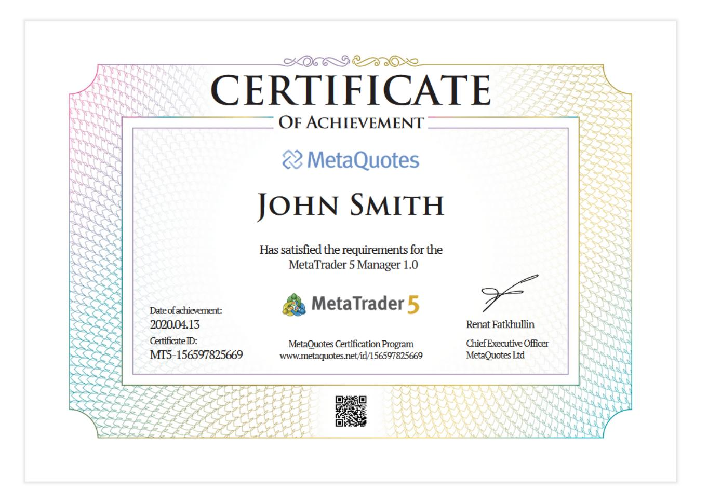

# Through certification, you will

- ·Test your knowledge
- ·Study relevant material and turn your weak points into strong ones
- ·Learn how to handle the existing functionality in depth
- ·Have an understanding of new product features
- ·Become a certified MetaQuotes professional
- ·Enrich your employment opportunities

## **Three types of certification**

- 1. [MetaTrader 5 Administrator](https://support.metaquotes.net/en/certification/courses/4) for platform administrators
- 2. [MetaTrader 5 Manager](https://support.metaquotes.net/en/certification/courses/6) for client managers
- 3. [MetaTrader 5 Dealer](https://support.metaquotes.net/en/certification/courses/7) for dealers and risk managers

#### **Free online test and two oral exam attempts**

Even if you are not confident in your abilities, start with the first certification stage — the online test. This test is free, while the number of attempts is unlimited. Check out the topics covered by the test and prepare for the certification.

If you feel confident about your knowledge and can easily pass the first stage, it will not be difficult for you to pass the second-stage interview. During the interview, we will additionally verify your knowledge before issuing a certificate. Even if your first interview attempt is unsuccessful, you will have a free retake attempt.

It is safe to say that getting a certificate is easier than obtaining a driver's license provided that you really spent some time behind the wheel and read the traffic code.

We offer one free certification for each company. [Order it now](https://support.metaquotes.net/en/certification) via the Certification section in the MetaQuotes Support Center.

## **You are just a few steps away from becoming a certified professional**

Select the necessary certificate type and pass two stages:

- · Stage 1. Complete the online test consisting of approximately 80 multi-choice questions at your convenience. To complete the test, you should score 70% correct answers. Once you have successfully completed this test, you can then go on to sign up for stage two.
- · Stage 2. Pay for the oral exam and be interviewed by a MetaQuotes representative via a video call. The interview lasts for roughly 30 minutes and verifies that the results of the first stage are legitimate.

Successful participants receive an official certificate signed and verified by a unique 12-digit ID which proves authenticity. The document can be validated by using this [link](https://support.metaquotes.net/en/certification).

Enroll in the program now by going to the [Certification](https://support.metaquotes.net/en/certification)section on the MetaQuotes Support Center website. It takes less than 10 seconds.

<span id="page-6-0"></span>

# Client onboarding

Fast and easy registration is one of the major prerequisites for maintaining a continuous inflow of new customers.

You should properly configure the [demo account registration option](#page-7-0)as this is an important selling point. By providing the ability to easily try your service, you can encourage traders to proceed to a real account.

The easiest and fastest way to create an account is to request it through the client terminal. The user will only need to fill in a simple form. The broker can start collecting valid user details straight at the demo account registration step. The platform supports [automated verification](#page-29-0)of phone numbers and emails. Thus, you will have valid contact details to connect with potential customers.

It is important not to destroy customer experience by excessive bureaucracy. The client should be able to receive a real account without excessive registration procedures. MetaTrader 5 simplified all account opening processes. Traders can request an account directly from the client terminal, by filling out a short form and uploading an ID and proof of address documents. Furthermore, the broker can enable [automated document](#page-56-0) [verification](#page-56-0)by configuring integration with a KYC service provider. Automated verification speeds up the registration procedure and minimizes manual operations.

MetaTrader 5 also provides the necessary tools to [manage clients](#page-6-0). All registered accounts are automatically linked to client records. Details from registration forms are additionally registered in these records. You can grant different database access permissions for regional offices, appoint responsible managers, work with documents and perform many other tasks straight in the trading platform, without using third-party specialized software.

<span id="page-7-0"></span>

# Allocation of demo accounts

In the financial industry, a person has to overcome a variety of obstacles on their way towards becoming a client. Legal and compliance departments require the fulfilling of vast documentation along with multiple verifications even for the simplest of operations. Such a strict policy often leads to a decrease in customer inflow.

To protect against potential problems, brokers create complex registration and verification schemes for the demo account opening procedure:

- ·the trader needs to enter the site
- ·specify real data
- ·complete phone number and email verification
- ·receive account details and enter them in appropriate fields in the terminal

Such a complicated multi-step account opening procedure definitely reduces the number of potential clients.

A demo account is an important point in attracting new customers. A user can start demo trading without completing KYC procedures. A demo account enables traders to test strategies and practice before proceeding with live trading. By restricting the usage of demo accounts, the potential real clients figures will ultimately drop.

## More accounts — more clients

Enable demo account opening via terminals and attract more potential clients.

Traders are not generally happy when they are prompted to register on a website. They may want to find another broker, allowing them to quickly view conditions and practice trading. Users perform a minimum of steps in the terminal and can start trading on a demo account without completing the KYC procedure.

Conversion rates on your site can be higher from the mathematical point of view, rates which your marketing department can use as a proof of the scheme's operational effectiveness. For example, 2,000 registrations were converted to 50 real accounts. Thus, the conversion rate is at 2.5%. A higher number of registrations can be completed in the terminals, for example 50,000. Even with a conversion rate of 0.5% this would create 250 real accounts. More potential customers at the input generate more real accounts at the output.

Do not be afraid of a large number of accounts. The high performance of the MetaTrader 5 platform allows you to service millions of demo accounts on one trading server without the need of purchasing additional licenses.

Do not worry about how to process unverified accounts. The platform features push notifications and an internal email system, which allow the delivery of promotional materials directly to terminals.

## Demo group settings

Platform configuration starts with groups, in which accounts will be created. The groups define basic operation conditions, such as risk management models, swap and commission charges, authorization types, permissions and others. Types of accounts displayed in the registration form on the client terminal side are created based on the groups.

Open MetaTrader 5 Administrator and create groups. The names of demo groups should begin with "demo".

Create separate groups for clients from different countries to enable automatic distribution of registrations for regional sales departments. Set the availability of accounts depending on users' location, and all registrations will be distributed by groups at the account opening stage. Your employees with appropriate positions will then manage these groups.

Specify the account deposit currency. Align it with the country, for which the group will be used.

| ×<br>Broker - MetaTrader 5 Administrator<br>□  |                         |                                                                                                                                                                                  |                    |                                              |                               |                                    |        |            |
|------------------------------------------------|-------------------------|----------------------------------------------------------------------------------------------------------------------------------------------------------------------------------|--------------------|----------------------------------------------|-------------------------------|------------------------------------|--------|------------|
| File<br>Edit<br>View                           | <b>Services</b><br>Help |                                                                                                                                                                                  |                    |                                              |                               |                                    |        |            |
| <span>∆</span> Refresh<br>-X-Disconnect        | <b>Restart Server</b>   | <span>∇</span> Export<br><span>𝔬</span> ( <span>𝔠</span> ), Import                                                                                                               |                    | <span>∨</span> Apply<br><span>^+</span>      | <span>⊗</span> <span>×</span> | <span>↓</span> <sub>A</sub> 2 Sort | Υ      | ↓          |
| 白 早 Forex Broker Server                        | Group                   | Server                                                                                                                                                                           |                    | Company                                      | Type                          | Authentication                     |        | Currency   |
| Network Cluster                                | & demo\demoforex        |                                                                                                                                                                                  | <b>Main Server</b> | <b>Forex Broker</b>                          | Netting                       |                                    | Normal | <b>USD</b> |
| <b>E-O Integrations</b>                        | demo\forex-usd          |                                                                                                                                                                                  | <b>Main Server</b> | <b>Forex Broker</b>                          | Hedged                        |                                    | Normal | <b>USD</b> |
| 由 23 Automation                                | Group: demo\forex-usd   |                                                                                                                                                                                  |                    |                                              |                               |                                    |        | ×          |
| <b>⊞ Security</b>                              |                         |                                                                                                                                                                                  |                    |                                              |                               |                                    |        |            |
| <span>□</span> ( <span>⋄</span> ) Time         | Common<br>Company       | News & Mail                                                                                                                                                                      |                    | Permissions   Margin   Symbols   Commissions |                               | Reports                            |        |            |
| <span>□</span> <span>⊞</span> Holidays         |                         |                                                                                                                                                                                  |                    |                                              |                               |                                    |        |            |
| 白 8 Groups (41)                                |                         | Group is a set of users that have the same permission settings and service conditions.<br>Please specify name of group, deposit currency, trade server, and authentication type. |                    |                                              |                               |                                    |        |            |
| ℐ <span>⊞</span> contest<br><b>Pe</b> coverage |                         |                                                                                                                                                                                  |                    |                                              |                               |                                    |        |            |
| ℐ demo (                                       | Name:                   | demo\forex-usd                                                                                                                                                                   |                    |                                              | Currency:                     | <b>USD</b>                         |        |            |
| 由 <b>P</b> e funds (3                          | Trade server:           |                                                                                                                                                                                  |                    |                                              |                               |                                    |        |            |
| <b>Pe</b> manage                               |                         | Main Server, 1                                                                                                                                                                   |                    |                                              | Digits:                       | <span>¯2</span>                    |        |            |
| <span>𝔬</span> <b>Prelimin</b>                 | Authentication:         | Normal                                                                                                                                                                           |                    |                                              | Minimum password length:      | 8                                  |        |            |
| ℐ real (6)                                     | One-time password:      | <b>Disabled</b>                                                                                                                                                                  |                    | Force one-time password usage                |                               |                                    |        |            |
| illest-acd                                     | Push notifications:     | All                                                                                                                                                                              |                    | sent from the trade server                   |                               |                                    |        |            |
| SE Clients & Al                                |                         |                                                                                                                                                                                  |                    |                                              |                               |                                    |        |            |
| For Help, press F1                             |                         | <b>○</b> Enable connections                                                                                                                                                      |                    |                                              |                               |                                    |        |            |
|                                                |                         | Enable certificate confirmation                                                                                                                                                  |                    |                                              |                               |                                    |        |            |
|                                                |                         | Change password at first login                                                                                                                                                   |                    |                                              |                               |                                    |        |            |
|                                                |                         | Show the risk warning window after connection                                                                                                                                    |                    |                                              |                               |                                    |        |            |
|                                                |                         | Enforce country-specific regulatory restrictions for retail clients                                                                                                              |                    |                                              |                               |                                    |        |            |
|                                                |                         |                                                                                                                                                                                  |                    | OK                                           |                               | Cancel                             |        | Help       |

Open the Company tab and specify your company details, including the name, websites and email address. This information is used for the generation of trading reports on accounts. Additionally, separate your IB partners' clients by creating groups and account types linked to the appropriate White Label.

|        | Group: demo\forex-usd |                                                |
|--------|-----------------------|------------------------------------------------|
|        |                       |                                                |
| Common | Company               |                                                |
|        | News & Mail           |                                                |
|        | <b>Permissions</b>    |                                                |
|        | Margin                |                                                |
|        | <b>Symbols</b>        |                                                |
|        | <b>Commissions</b>    |                                                |
|        | Reports               |                                                |
|        |                       |                                                |
|        |                       |                                                |
|        |                       |                                                |
|        |                       |                                                |
|        | Company:              | Forex Broker                                   |
|        | Company site:         | <b>Forex Broker</b><br><b>TOTAXDIOKAIKCOM</b>  |
|        | Company email:        | mail@forexbroker.com                           |
|        | Deposit site:         | forexbroker.com/deposit                        |
|        | Withdrawal site:      | forexbroker.com/withdraw                       |
|        | Support site:         | forexbroker.com/[lang:en es pt ru]/landing-mt5 |
|        | Support email:        | support@forexbroker.com                        |
|        | Templates folder:     |                                                |
|        |                       |                                                |
|        |                       |                                                |
|        |                       |                                                |

This completes the basic setup. Make sure to restart the trading platform after creating groups, to enable opening of accounts in the new groups.

See also: [Documentation / Platform / Platform settings / Groups / Group settings](https://support.metaquotes.net/en/docs/mt5/platform/administration/admin_groups/groups_settings)

<span id="page-9-0"></span>

## Account allocation settings

Create an account type based on the newly created group; after that it will become available in client terminals. Go to "Clients & Accounts \ Allocations" and create a new record.

You cannot add a disabled group to the list of groups for opening demo accounts. Allocation of demo accounts is impossible in such groups. If there is a disabled group among the previously selected ones, a warning is displayed when closing the dialog window.

Specify the company accordingly to define in which terminals the group will be available. If you are not working with affiliates, leave the Default value. If you work with several White Labels, then specify the name of your company. Create separate groups and account types for your affiliates. This will help you organize work with demo registrations.

We also recommend configuring at least one default demo group. This will enable users to open accounts on your server from any broker's terminal.

| Broker - MetaTrader 5 Administrator                                                                                                                    |                                                 |                       |                                      |                                                    | ×<br>п                             |  |  |
|--------------------------------------------------------------------------------------------------------------------------------------------------------|-------------------------------------------------|-----------------------|--------------------------------------|----------------------------------------------------|------------------------------------|--|--|
| File<br>Edit<br>View<br><b>Services</b><br>Help                                                                                                        |                                                 |                       |                                      |                                                    | .ull 485 / 1 KB                    |  |  |
| ∜≎- Refresb<br>Restart Server<br>-X-Disconnect                                                                                                         | $K$ Import                                      | $\binom{7}{1}$ Export | $\vee$ Apply                         | छिर<br>$\leftarrow$                                | $\downarrow^{\mathbb{A}}_{z}$ Sort |  |  |
| > { Groups (641)                                                                                                                                       | X Demo account alloca                           |                       | https://broker.com/open_account      |                                                    |                                    |  |  |
| ↓ __ Q= Clients & Accounts                                                                                                                             | $\boxed{\vee}$ Deposit URL                      |                       |                                      | https://www.broker.com/[lang:ru en zh]/deposit     |                                    |  |  |
| … <i>မ</i> ြ Allocations                                                                                                                               | V Withdrawal URL                                |                       |                                      | https://www.broker.com/[lang:ru en zh]/withdraw    |                                    |  |  |
| <sub></sub>                                                                                                                                            |                                                 |                       |                                      |                                                    |                                    |  |  |
| 몸 Managers                                                                                                                                             | Group                                           | C<br>Type             | Server                               | Countries                                          | Leverag                            |  |  |
| & Trading Accounts                                                                                                                                     | <b>Default</b>                                  |                       |                                      |                                                    |                                    |  |  |
| <b>In the Corporate links</b>                                                                                                                          | & demo\demofor                                  | <b>USD</b>            |                                      | Netting   Trade Secondary   CY, FR, DE, NL, PL, RU | 100, 50, 3                         |  |  |
| > 「响 Orders & Deals                                                                                                                                    | <u>&amp;</u> demo\demofor∣                      | <b>USD</b>            | Hedg Trade Secondary   All countries |                                                    | 10,50,100                          |  |  |
| Account allocation group                                                                                                                               |                                                 |                       |                                      |                                                    | ?<br>$\times$                      |  |  |
| Please specify a company and a group with description. This group will be available for opening accounts from the client<br>terminals of this company. |                                                 |                       |                                      |                                                    |                                    |  |  |
| Default<br>Company:                                                                                                                                    |                                                 |                       |                                      |                                                    |                                    |  |  |
| demo\forex-usd<br>Group:                                                                                                                               |                                                 |                       |                                      |                                                    |                                    |  |  |
| Forex USD<br>Description:                                                                                                                              |                                                 |                       | Leverages:                           | 100,50,30,20,10,5                                  |                                    |  |  |
| All countries<br>Countries:                                                                                                                            |                                                 |                       |                                      |                                                    |                                    |  |  |
|                                                                                                                                                        | Require identity and proof of address documents |                       |                                      | Start KYC check automatically                      |                                    |  |  |
| Use advanced registration form                                                                                                                         |                                                 |                       |                                      |                                                    |                                    |  |  |
| Phone & Email<br>Confirm:                                                                                                                              |                                                 | Mail server:          | Default                              |                                                    |                                    |  |  |
|                                                                                                                                                        |                                                 |                       |                                      |                                                    |                                    |  |  |
| Agreement                                                                                                                                              | <b>URL</b>                                      |                       |                                      |                                                    | Mandatory                          |  |  |
| ☑<br>ab Client agreement<br>https://broker.com/agreements/account                                                                                      |                                                 |                       |                                      |                                                    |                                    |  |  |
| ab Data Protection Policy<br>https://broker.com/agreements/data-protection                                                                             |                                                 |                       |                                      |                                                    | ⊡                                  |  |  |
|                                                                                                                                                        |                                                 |                       |                                      |                                                    |                                    |  |  |
|                                                                                                                                                        |                                                 |                       |                                      |                                                    |                                    |  |  |
|                                                                                                                                                        |                                                 |                       |                                      |                                                    |                                    |  |  |
|                                                                                                                                                        | OK                                              | Cancel                |                                      |                                                    |                                    |  |  |

Specify the name of the account type associated with this group. Use a short and clear name as it will be displayed in client terminals.

Specify a list of countries in which the account type will be available. Use this feature to assign registrations to the relevant sales departments. Create separate account types for Europe, Asia and America. This will automatically filter the incoming flow of accounts by different groups at the registration stage.

The user's country is determined automatically on the client terminal side. If several account types are available to the trader, then the group with the deposit currency corresponding to the client's country will be selected by default in the account opening form. For example, a yen account will be offered by default to clients from Japan.

Specify a comma separated list of available leverage options. The first value in the list will be used as a default leverage.

Set up agreements to be accepted by traders during registration. Such links can be required by regulators, while they can provide safeguards against potential legal issues. This will inform the client about the operation conditions and simplify further the KYC procedures.

| Label                    | Value                                                  |
|--------------------------|--------------------------------------------------------|
| Confirm:   Phone & Email |                                                        |
| Mail server:             | ABC Broker                                             |
| Agreement                | Complaints handling procedure                          |
| URL                      | https://abcbroker.com/client_agreement                 |
| Mandatory                | $0$                                                   |
|                          |                                                        |
| Agreement                | Client agreement                                       |
| URL                      | https://abcbroker.com/risk_disclosure                  |
| Mandatory                | $0$                                                   |
|                          |                                                        |
| Agreement                | Risk disclosure                                        |
| URL                      | https://abcbroker.com/gdpr                             |
| Mandatory                | X                                                      |
|                          |                                                        |
| Agreement                | Client agreement and risk disclosure                   |
| URL                      | https://abcbroker.com/gdpr                             |
| Mandatory                | X                                                      |
|                          |                                                        |
| Agreement                | Complaints handling procedure                          |
| URL                      |                                                        |
| Mandatory                |                                                        |
| Agreement                | Order execution policy<br>Client categorisation notice |
| URL                      |                                                        |
| Mandatory                |                                                        |
| Agreement                | Conflicts of interest policy                           |
| URL                      |                                                        |
| Mandatory                |                                                        |
| Agreement                | Data Protection Policy                                 |
| URL                      |                                                        |
| Mandatory                |                                                        |
|                          | OK                                                     |
|                          | Cancel                                                 |

Agreements are displayed as links in the account opening dialog:

| Open an Account: Forex Broker |                                                                                                          |
|-------------------------------|----------------------------------------------------------------------------------------------------------|
|                               |                                                                                                          |
| Opening a demo account        | A demo account allows trading with virtual money                                                         |
|                               |                                                                                                          |
|                               |                                                                                                          |
|                               |                                                                                                          |
| First name:                   | John                                                                                                     |
| Second name:                  | Smith                                                                                                    |
| Email:                        | john@smith.com                                                                                           |
| Mobile Phone:                 | +1 (Canada, United State                                                                                 |
|                               |                                                                                                          |
|                               |                                                                                                          |
|                               |                                                                                                          |
|                               |                                                                                                          |
|                               |                                                                                                          |
| Server:                       | ForexBroker-Demo                                                                                         |
| Account type:                 | Forex USD                                                                                                |
| Deposit:                      | Forex USD<br>Forex JPY                                                                                   |
| Leverage:                     | Forex CHF<br>1:100<br>virtual c<br>▽                                                                     |
|                               | I agree with the terms and conditions for opening an account<br>⋈<br>Client agreement<br>Risk disclosure |
|                               |                                                                                                          |
|                               |                                                                                                          |

Up to two types of agreements can be displayed in a normal account opening form:

- · Client Agreement (or Client Agreement and Risk Notification) and Data Protection Policy, in case both agreement types are specified. If the Client Agreement is not specified, the first user agreement from the list (if any) will be shown instead. A user agreement is the one, which name has been specified manually (rather than selected from the predefined list).
- · Client Agreement (or Client Agreement and Risk Notification) or Data Protection Policy, in case only one of them is specified.
- · If no agreements are specified, only the following check box will be displayed in the account opening dialog: "I agree with the account opening terms and the data protection policy".

Up to ten types of agreements are shown in the expanded form.

Agreements can be marked as mandatory. For example, the acceptance of account opening rules and Privacy Policy is required by law and is therefore considered as mandatory. Such agreements require a separate, explicitly set checkbox in the account registration window, while the acceptance of the agreement will be additionally displayed in the trade server log.

| Open an Account: Forex Broker |                                                                   | ?      | × |
|-------------------------------|-------------------------------------------------------------------|--------|---|
| Opening a real account        | A real account is required for live trading on financial markets  |        |   |
| Real trading experience:      |                                                                   |        |   |
| Forex:                        | $<$ 1 year<br>$\checkmark$                                        |        |   |
| CFD:                          | $<$ 1 year                                                        |        |   |
| Futures:                      | $<$ 1 year<br>◡                                                   |        |   |
| Stocks:                       | $<$ 1 year<br>✓                                                   |        |   |
|                               |                                                                   |        |   |
|                               |                                                                   |        |   |
|                               | I agree with the terms and conditions for opening an account<br>∨ |        |   |
|                               | Client agreement<br>⋈                                             |        |   |
|                               | Risk disclosure<br>✓                                              |        |   |
|                               | I agree to receive newsletters and company news                   |        |   |
|                               |                                                                   |        |   |
|                               |                                                                   |        |   |
|                               | $<$ Back<br>Next >                                                | Cancel |   |

Similar behavior is implemented in mobile terminals for iOS and Android.

When the user accepts each mandatory agreement, a relevant event is added to the trade server log:

```
'27904969': accepts mandatory agreement 'Risk disclosure' -
https://abcbroker.com/legal/risk
```

A relevant comment is also added to the [client record](#page-52-0):

```
Accepts agreements on account '1092' allocation :
Client agreement
Risk disclosure
```

See also: [Articles / Add agreement links to account registration forms](https://support.metaquotes.net/en/articles/1570)

We also recommend enabling the option "Automatic allocation of demo account on first start". In this case, a demo account will be created automatically for the client during the first launch of the client terminal. The account will be created in the first group available for this terminal/company.

This feature can have a positive effect on the conversion, since users are allowed to skip the registration stage. Fast acquaintance with the platform will further encourage traders to request live accounts.

## Segmentation of accounts by groups

The distributed architecture of the trading platform enables the management of a huge number of accounts, without compromising performance. Performance optimization is supported both at the cluster level and at the database level.

To ensure efficient server operation, it is recommended not to use huge groups that include several thousand accounts. Instead, it is better to create several smaller groups and to evenly distribute accounts among them. This will improve the quality of your services.

The platform provides the automated distribution of accounts into different groups, at the moment the account is opened via a client terminal.

To enable this feature, create account groups with indexes in the name, such as:

- ·demo\forex-hedge-usd-01
- ·demo\forex-hedge-usd-02
- ·demo\forex-hedge-usd-03

These groups must have the same settings.

Next, in the account allocation settings, specify the group as follows: demo\forex-hedge-usd-01..03.

| Account allocation group |                                                 |
|--------------------------|-------------------------------------------------|
|                          |                                                 |
|                          |                                                 |
| Company:                 | Default                                         |
| Group:                   | demo\forex-hedge-usd-01..03                     |
| Description:             | Demo-Hedging                                    |
| Leverages:               | 50,100                                          |
| Countries:               | All countries                                   |
|                          |                                                 |
|                          | Require identity and proof of address documents |
|                          | Start KYC check automatically                   |
|                          | Use advanced registration form                  |
| Confirm:                 | None                                            |
|                          |                                                 |
| Mail server:             | MetaQuotes.net                                  |
|                          |                                                 |

All accounts will be evenly distributed into three groups.

Distribution of accounts is performed by access servers. Accounts are distributed evenly, but not necessarily sequentially, i.e. not necessarily from the first to the last group in the list.

## Server settings

Common demo account operation parameters are specified in the trading server settings, in the "Network Cluster" section. Open the Demo tab and make sure demo account allocation is allowed. We recommend renewing the account lifetime after each connection. Deletion of accounts after an expiration period can cause a negative reaction from users, who lose their trading statistics.

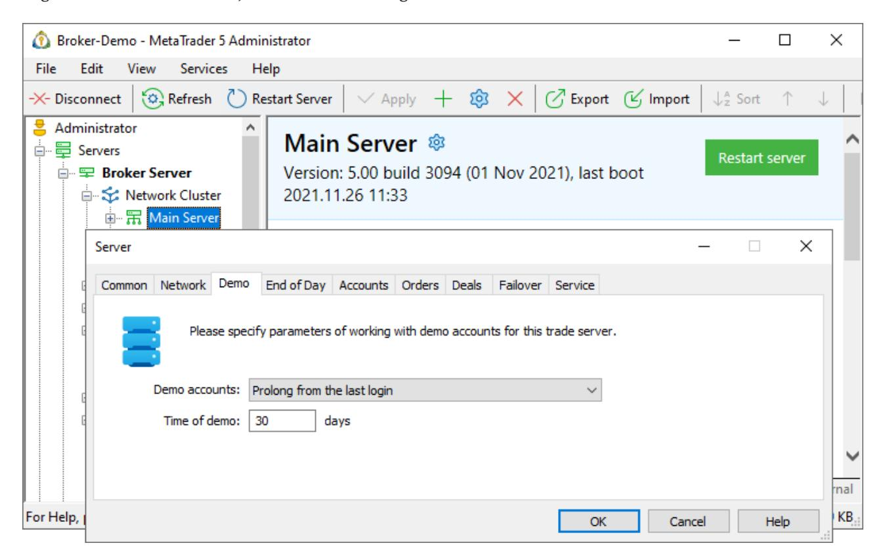

## Checking the settings

Now, open the client terminal and check demo account registration. Required leverage options and agreement links should be available in the form. Also, check the availability of account types corresponding to the country. Open the Administrator terminal to make sure that the account is created in the appropriate group.

All new accounts will be automatically created in different groups in accordance with the user's country. Thus, configure access permissions to regional managers accordingly.

| Label                                      | Value                                                                                                                                                                                                                           |                                                                        |                                                                                                                                                                                                                                                                                                                                                                               |   |
|--------------------------------------------|---------------------------------------------------------------------------------------------------------------------------------------------------------------------------------------------------------------------------------|------------------------------------------------------------------------|-------------------------------------------------------------------------------------------------------------------------------------------------------------------------------------------------------------------------------------------------------------------------------------------------------------------------------------------------------------------------------|---|
| Open an Account                            | Trade real or virtual money and gain experience                                                                                                                                                                                 |                                                                        |                                                                                                                                                                                                                                                                                                                                                                               |   |
| List of brokers<br>Select a broker you are |                                                                                                                                                                                                                                 |                                                                        |                                                                                                                                                                                                                                                                                                                                                                               |   |
| add new broker like 'Broker!               | Open a demo account to trade virtual money without risk<br>A demo account allows you to learn trading on stock exchanges and test your strategies. While doing that, you do not<br>risk anything as you use pure virtual money. |                                                                        |                                                                                                                                                                                                                                                                                                                                                                               |   |
| <b>Forex Broker</b>                        | Open an Account: Forex Broker                                                                                                                                                                                                   |                                                                        |                                                                                                                                                                                                                                                                                                                                                                               |   |
|                                            | Opening a demo account                                                                                                                                                                                                          |                                                                        |                                                                                                                                                                                                                                                                                                                                                                               |   |
|                                            | A demo account allows trading with virtual money and learn without risk                                                                                                                                                         |                                                                        |                                                                                                                                                                                                                                                                                                                                                                               |   |
|                                            | First name:                                                                                                                                                                                                                     | John                                                                   |                                                                                                                                                                                                                                                                                                                                                                               |   |
|                                            | Second name:                                                                                                                                                                                                                    | Smith                                                                  |                                                                                                                                                                                                                                                                                                                                                                               |   |
|                                            | Email:                                                                                                                                                                                                                          | john@smith.net                                                         |                                                                                                                                                                                                                                                                                                                                                                               |   |
|                                            | Mobile Phone:                                                                                                                                                                                                                   | +1 United States                                                       | 2296398522                                                                                                                                                                                                                                                                                                                                                                    | ✓ |
|                                            |                                                                                                                                                                                                                                 | √ Use hedge in trading                                                 |                                                                                                                                                                                                                                                                                                                                                                               |   |
|                                            |                                                                                                                                                                                                                                 | Server: ForexBroker-Demo                                               |                                                                                                                                                                                                                                                                                                                                                                               |   |
|                                            | Account type:                                                                                                                                                                                                                   | Forex USD                                                              |                                                                                                                                                                                                                                                                                                                                                                               |   |
|                                            | Deposit:                                                                                                                                                                                                                        | USD, virtual money to be deposited to your account<br>100000           | &#check;                                                                                                                                                                                                                                                                                                                                                                      |   |
|                                            | Leverage:                                                                                                                                                                                                                       | virtual credit funds to be provided by the broker for trading<br>1:100 | &#check;</td> </tr> <tr> <td></td> <td></td> <td>&#9660; I agree with the terms and conditions for opening an account and the data protection policy</td> </tr> <tr> <td></td> <td></td> <td>Client agreement<br/>&#10003;</td> </tr> <tr> <td></td> <td></td> <td>Data Protection Policy</td> </tr> <tr> <td></td> <td></td> <td>&lt; Back<br/>Next &gt;</td> </tr> </table> |   |

## Client management system

All trading accounts are linked to the appropriate [client records](#page-32-0), which store traders' data automatically collected by the MetaTrader 5 platform, such as personal information, addresses, documents and trading accounts.

When a trader opens an account via the terminal, the platform compares the specified name, e-mail and phone with the existing database. If a client with matching data is found, the account is [linked](#page-35-0) to the found record.

Additionally, missing data is automatically copied to the account. If the corresponding client is not found, a new record is created automatically, and related information is copied to it.

The same mechanism is used for real accounts requested from terminals. Data specified in the extended registration form, including documents, is automatically added to the client record. As a result, you will not have to copy data manually. After [document verification,](#page-48-0) you will only need to move the account from a preliminary group to the live one.

| Client:           | 1001 - John Murray Smith   |
|-------------------|----------------------------|
| Account:          | 1013, John Murray Smith, U |
| Personal          | Address                    |
| Overview          | Type                       |
| Name:             | John                       |
| Last name:        | Smith                      |
| Company:          | Individual                 |
| Registered:       | 2018.08.03 14:48           |
| Language:         | English                    |
| ID number:        |                            |
| MetaQuotes ID:    |                            |
| Email:            | john@smith.com             |
| Phone:            | +14845551234               |
| Country:          | United States              |
| City:             | New York                   |
| Address:          | 10 Wall st, 15             |
| Comment:          | Forex Broker, mg           |
| Client Properties |                            |
| Introducer        | Kate Wilson                |

Convenient client management, tracking of traders' lifecycle and manager controls — this enhanced functionality is available in your platform's back-office components.

Publicly distribute terminals and demo accounts rather than hiding them in traders' rooms. This will help you attract more clients. Add [mobile terminal deep links](#page-119-0) in your sites and registration emails. This will increase functionality and enhance operations efficiency with account opening.

<span id="page-17-0"></span>

# Allocation of preliminary accounts

Novice traders are generally conquered with doubts. When a beginner decides to start real trading, it is important to open a trading account without going through the burdensome bureaucratic procedures. Ensuring a simple and fast account opening procedure is essential in retaining your clients.

The client terminal is the trader's main workplace, from which most of the operations are performed. However, brokers often register live accounts only through the website, which means that users need to find the resource and fill out additional forms. We offer brokers to take the advantage of MetaTrader 5 and provide traders with the possibility to request live accounts directly from the client terminal by filling out a simple form. Offer this option to your clients and increase your conversion rate!

| Open an Account: Forex Broker                                      | 7                                                                                                                                                                                                                                          | ×                      |                                                                                                                                                                                                                |
|--------------------------------------------------------------------|--------------------------------------------------------------------------------------------------------------------------------------------------------------------------------------------------------------------------------------------|------------------------|----------------------------------------------------------------------------------------------------------------------------------------------------------------------------------------------------------------|
| Open an account<br>Trade real or virtual money and gain experience |                                                                                                                                                                                                                                            |                        |                                                                                                                                                                                                                |
|                                                                    | $\bigcirc$ Open a demo account to trade virtual money without risk<br>A demo account allows you to learn trading on stock exchanges and test your strategies. While doing that, you do not<br>risk anything as you use pure virtual money. |                        |                                                                                                                                                                                                                |
| ● Open a real account for live trading                             | A real account requires additional proof of identity. You will need to provide copies of identification documents.                                                                                                                         |                        |                                                                                                                                                                                                                |
| Open an Account: Forex Broker<br>Opening a real account            | A real account is required for live trading on financial markets                                                                                                                                                                           | ?                      | ×                                                                                                                                                                                                              |
| First name:                                                        | John                                                                                                                                                                                                                                       | Second name:           | Smith                                                                                                                                                                                                          |
| Middle name:                                                       | Murray                                                                                                                                                                                                                                     |                        |                                                                                                                                                                                                                |
| Date of birth:                                                     | 11/26/1990                                                                                                                                                                                                                                 | Language:              | English                                                                                                                                                                                                        |
| Email:                                                             | john@smith.net                                                                                                                                                                                                                             | Mobile Phone:          | +1 (Canada, United States) 2296398522                                                                                                                                                                          |
| Country:                                                           | United States                                                                                                                                                                                                                              | Account type: Real USD | Use hedge in trading<br><b>United States</b><br>○<br>Personal details are used for opening a trade account and are not passed to any third parties.<br>The information is handled securely and confidentially. |
|                                                                    | < Back<br>Next                                                                                                                                                                                                                             |                        | Cancel                                                                                                                                                                                                         |

## Simplify account management

Set up an automated real account opening process. The data specified by the traders in the registration form is delivered straight to the platform. Ultimately, you do not have to create an account, copy information from the trader's room using plug-ins or enter it manually via the Manager terminal. An account can be simply moved from a preliminary group to the live one after data verification.

In this case, the trader completes a usual registration similar to the demo account opening procedure. If possible, the terminal automatically adds data from previous requests to the form, thus simplifying the process as a whole.

| Open an Account: Forex Broker |                                                                  | Account: 1013, John Murray Smith, USD, 1:1, Netting |  |
|-------------------------------|------------------------------------------------------------------|-----------------------------------------------------|--|
| Opening a real account        | A real account is required for live trading on financial markets |                                                     |  |
| Personal Overview             |                                                                  |                                                     |  |
| Name:                         | John                                                             |                                                     |  |
| First name:                   | John                                                             |                                                     |  |
| Last name:                    | Smith                                                            |                                                     |  |
| Second name:                  | Smith                                                            |                                                     |  |
| Company:                      | Individual                                                       |                                                     |  |
| Middle name:                  | Murray                                                           |                                                     |  |
| Registered:                   | 2018.08.03 14:48:27                                              |                                                     |  |
| Date of birth:                | 11/26/1990                                                       |                                                     |  |
| Gender:                       |                                                                  |                                                     |  |
| Language:                     | English                                                          |                                                     |  |
| ID number:                    |                                                                  |                                                     |  |
| MetaQuotes ID:                |                                                                  |                                                     |  |
| Email:                        | john@smith.net                                                   |                                                     |  |
| Mobile Phone:                 | +1 (Canada, United States) 2296398522                            |                                                     |  |
| Phone:                        | +14845551234                                                     |                                                     |  |
| Use hedge in trading          |                                                                  |                                                     |  |
| Country:                      | United States                                                    |                                                     |  |
| Account type:                 | Real USD                                                         |                                                     |  |
| City:                         | New York                                                         |                                                     |  |
| Address:                      | 10 Wall St, 15                                                   |                                                     |  |
| Comment:                      | Forex Broker, mgl5.welcome.open                                  |                                                     |  |

## Access the full history of traders

MetaTrader 5 maintains a complete history of interactions with the trader and stores all related data in a single client record.

When requesting a live account, the trader fills in the extended form and uploads the ID and address confirmation documents. This information is saved in the client record. A trading account is also linked to this record. You no longer need to collect data from various sources, since the platform collects information automatically.

| Label                         | Value                                                                                                          |
|-------------------------------|----------------------------------------------------------------------------------------------------------------|
| Client:                       | 1001 - John Murray Smith                                                                                       |
| Open an Account: Forex Broker |                                                                                                                |
| Opening a real account        | A real account is required for live trading on financial markets                                               |
| Title                         | Mr.                                                                                                            |
| First name                    | John                                                                                                           |
| Second name                   | Smith                                                                                                          |
| Middle name                   | Murray                                                                                                         |
| Date of birth                 | 11/26/1990                                                                                                     |
| Gender                        | Male                                                                                                           |
| Language                      | English                                                                                                        |
| Email                         | john@smith.net                                                                                                 |
| Mobile Phone                  | +1 (Canada, United States) 2296398522                                                                          |
| Country                       | United States                                                                                                  |
| Account type                  | Real USD                                                                                                       |
| Use hedge in trading          |                                                                                                                |
| Comments                      | Personal details are used for opening a trade account. The information is handled securely and confidentially. |
| Preliminary Trading Accounts  | 1013 John Murray Smith                                                                                         |
| John Murray Smith             | English                                                                                                        |
| Smith John Murray             | skype:john-smith                                                                                               |
| Smith John Murray             | +1 (Canada, United States)                                                                                     |
| Smith John Murray             | 1249993399                                                                                                     |
| Smith John Murray             |                                                                                                                |

## Expanded forms and automatic distribution by country

The registration form is flexibly customizable. You may choose to request documents and expanded data on employment, income and trading experience immediately during registration.

Similar to demo accounts, you can configure automatic assignment of registrations to regional sales departments by creating several types of preliminary accounts and making them available in appropriate countries. Requests will be distributed by separate groups on the trading server and forwarded to managers having appropriate permissions.

|                                                          |                                                                  | Open an Account: Broker<br>Opening a real account<br>A real account is required for live trading on financial markets |            |                                         |  |        |  |
|----------------------------------------------------------|------------------------------------------------------------------|-----------------------------------------------------------------------------------------------------------------------|------------|-----------------------------------------|--|--------|--|
|                                                          | Nationality:                                                     | <b>United States</b>                                                                                                  |            |                                         |  |        |  |
| Open an Account: Broker                                  | Tax ID:                                                          | 199922                                                                                                                |            |                                         |  |        |  |
| Opening a real account<br>A real account is required for | Employment status:                                               | Employed                                                                                                              |            |                                         |  |        |  |
|                                                          | Employment industry:                                             | Architecture and Construction                                                                                         |            |                                         |  |        |  |
| Real trading experience:                                 | Education level:                                                 | Bachelor degree or equivalent                                                                                         |            |                                         |  |        |  |
| Forex:<br>< 1 year                                       |                                                                  |                                                                                                                       |            |                                         |  |        |  |
| CFD:<br>< 1 year                                         | Annual income:                                                   | 100000<br>                                                                                                            | <b>USD</b> |                                         |  |        |  |
| Open an Account: Broker<br>Opening a real account        | A real account is required for live trading on financial markets |                                                                                                                       |            |                                         |  |        |  |
| First name:                                              | John                                                             |                                                                                                                       |            |                                         |  |        |  |
| Second name:                                             | Smith                                                            |                                                                                                                       |            |                                         |  |        |  |
| Middle name:                                             | Murray                                                           |                                                                                                                       |            |                                         |  |        |  |
| Date of birth:                                           | 11/26/1990                                                       | Gender                                                                                                                |            |                                         |  |        |  |
| Language:                                                | English<br>✓                                                     |                                                                                                                       |            |                                         |  |        |  |
| Email:                                                   | john@smith.net                                                   |                                                                                                                       |            |                                         |  |        |  |
| Mobile Phone:                                            | +1 (Canada, United States)                                       | 2296398522                                                                                                            |            |                                         |  |        |  |
| Country:                                                 | Use hedge in trading<br>Cyprus                                   | <input checked="" type="checkbox"/>                                                                                   |            |                                         |  |        |  |
| Account type:                                            | Real EUR                                                         | <input checked="" type="checkbox"/>                                                                                   |            |                                         |  |        |  |
|                                                          | Real USD<br>Real EUR<br>Forex EUR                                |                                                                                                                       |            | We are not passed to any third parties. |  |        |  |
|                                                          |                                                                  |                                                                                                                       |            | < Back<br>Next                          |  | Cancel |  |

### KYC in mobile terminals

Live account requests can also be sent from [mobile terminals for iPhone and Android](#page-115-0). The trader fills in the form, takes document photos, submits data and opens an account. You do not need to additionally configure your mobile platforms: set up the registration of real accounts once, and this option will be available to all Windows, Android and iOS users. Get closer to your potential customers — the number of smartphone users is growing daily.

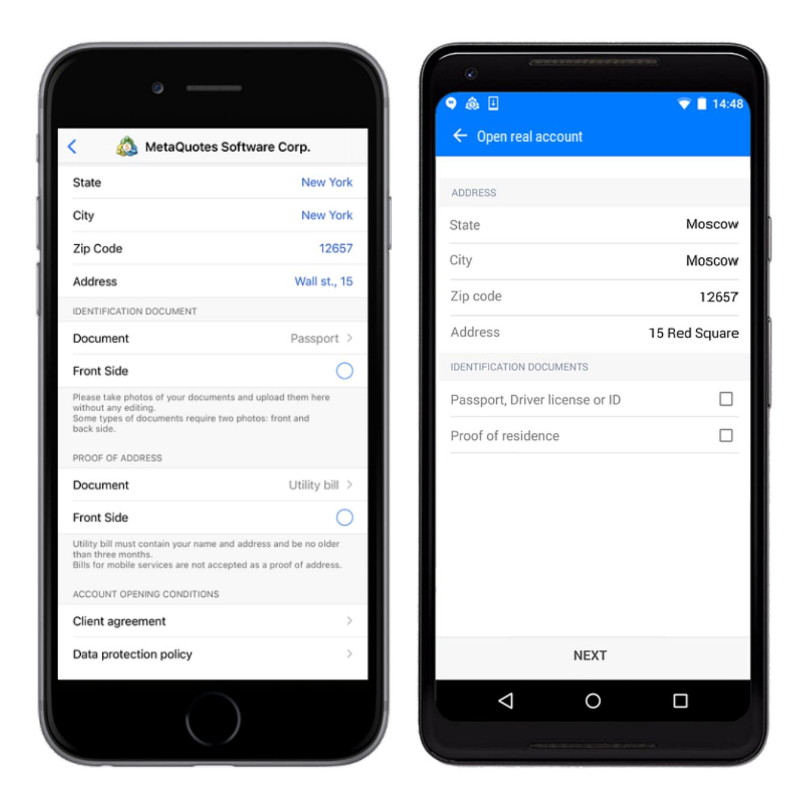

### Preliminary groups

Live accounts requested via client terminals are created with the zero balance, in special [preliminary groups](https://support.metaquotes.net/en/docs/mt5/platform/administration/admin_groups/groups_settings). Trading is disabled in such groups.

Open MetaTrader 5 Administrator and create preliminary groups for different countries, currencies and account types. This will enable automatic distribution of registrations to regional sales departments and will allow clients to select desired trading conditions, for example to request a standard, mini or micro account.

The names of preliminary groups should begin with "preliminary". Specify other settings similar to demo account configurations.

Make sure to restart the trading platform after creating groups, to enable opening of accounts in the new groups.

|                                                                     |                                                                                                              | Broker-Demo - MetaTrader 5 Administrator                                                                                              |                       | □        | $\times$   |  |  |  |
|---------------------------------------------------------------------|--------------------------------------------------------------------------------------------------------------|---------------------------------------------------------------------------------------------------------------------------------------|-----------------------|----------|------------|--|--|--|
| File                                                                | Edit                                                                                                         | View<br><b>Services</b><br>Help                                                                                                       |                       |          |            |  |  |  |
|                                                                     | $-\times$ - Disconnect                                                                                       | ES.<br>$\binom{7}{1}$ Export $\binom{1}{1}$ Import<br>$\left\{ \varphi\right\}$ Refresh<br>Restart Server<br>$\vee$ Apply<br>$\times$ | $\downarrow^A_z$ Sort |          |            |  |  |  |
|                                                                     |                                                                                                              | 白 8 Groups (41)<br>Group<br>Server<br>Authe<br>Type                                                                                   | Margin                |          | Currency   |  |  |  |
|                                                                     |                                                                                                              | $\mathbb{R}^{\mathbb{Q}}$ contest (1)<br>Se preliminary\usd-standard<br>Main Server Netting<br>Normal                                 | 50 / 30 %             |          | <b>USD</b> |  |  |  |
|                                                                     |                                                                                                              | $\mathbb{R}$ coverage (1)<br>& preliminary\usd-mini<br>Main Server Netting<br>Normal                                                  | 50 / 30 %             |          | <b>USD</b> |  |  |  |
|                                                                     |                                                                                                              | <b>P</b> g demo (15)<br>preliminary\eur-standard<br>Main Server Netting<br>Normal                                                     | 50 / 30 %             |          | EUR        |  |  |  |
|                                                                     |                                                                                                              | $\mathbb{P}_{\beta}$ preliminary (4)<br>Se preliminary\eur-mini<br>Main Server Netting<br>Normal                                      | 50 / 30 %             |          | eur        |  |  |  |
|                                                                     | — Eg<br>-- Pe                                                                                                | Group: preliminary\usd-standard                                                                                                       |                       | $\times$ |            |  |  |  |
|                                                                     | ⊢ B                                                                                                          | Common<br>Company News & Mail<br>Permissions Margin Synobols Commissions Reports                                                      |                       |          |            |  |  |  |
|                                                                     | — Pe                                                                                                         |                                                                                                                                       |                       |          |            |  |  |  |
|                                                                     | 由 <u>-</u> 2= Clie<br>Group is a set of users that have the same permission settings and service conditions. |                                                                                                                                       |                       |          |            |  |  |  |
|                                                                     | 画 h Ord                                                                                                      | Please specify name of group, deposit currency, trade server, and authentication type.                                                |                       |          |            |  |  |  |
|                                                                     | <b>⊞</b> ○ Gate                                                                                              |                                                                                                                                       |                       |          |            |  |  |  |
|                                                                     | 画 い Data                                                                                                     | preliminary\usd-standard<br><b>USD</b><br>Name:<br>Currency:                                                                          |                       |          |            |  |  |  |
|                                                                     | <b>E</b> ∩ Plud                                                                                              | Trade server:<br>Digits:<br>Main Server, 1<br>$\overline{2}$                                                                          |                       |          |            |  |  |  |
|                                                                     | 画 《戸 Rep                                                                                                     | Minimum password length:<br>8<br>Authentication:<br>Normal<br>◡                                                                       |                       |          |            |  |  |  |
|                                                                     | 由 血 ECN                                                                                                      |                                                                                                                                       |                       |          |            |  |  |  |
|                                                                     | + Rou                                                                                                        | One-time password:<br><b>Disabled</b><br>Force one-time password usage                                                                |                       |          |            |  |  |  |
|                                                                     |                                                                                                              | Fun<br>All<br>Push notifications:<br>sent from the trade server                                                                       |                       |          |            |  |  |  |
|                                                                     | Sym<br>田…                                                                                                    | $\vee$ l Enable connections                                                                                                           |                       |          |            |  |  |  |
|                                                                     | For Help, press F1                                                                                           | Enable certificate confirmation                                                                                                       |                       |          | <b>MB</b>  |  |  |  |
|                                                                     |                                                                                                              | Change password at first login                                                                                                        |                       |          |            |  |  |  |
|                                                                     | Show the risk warning window after connection                                                                |                                                                                                                                       |                       |          |            |  |  |  |
| Enforce country-specific regulatory restrictions for retail clients |                                                                                                              |                                                                                                                                       |                       |          |            |  |  |  |
|                                                                     |                                                                                                              | OK<br>Cancel                                                                                                                          | Help                  |          |            |  |  |  |

See also: [Documentation / Platform / Platform settings / Groups / Group settings](https://support.metaquotes.net/en/docs/mt5/platform/administration/admin_groups/groups_settings)

#### Account allocation settings

To make a group available in client terminals, create an account type based on the new group in the Allocations section. Set parameters (similar to the demo groups):

- ·Specify the company and the account type name
- ·Set availability by countries to distribute requests by sales departments
- · Configure agreements (up to 8) to be accepted by traders during registration, to simplify further the KYC procedure

Enable employment, income and experience fields if such information is required by your regulator. Additional steps for specifying appropriate data will be added to the registration form. The collected information will be saved in appropriate client records.

If you cannot request documents during account registration, you can disable this function. This will cause the corresponding fields to be hidden in the form.

| Account allocation group |                                                                                                                                                        |          |                               |                 |                                                                  | ? | ×                      |
|--------------------------|--------------------------------------------------------------------------------------------------------------------------------------------------------|----------|-------------------------------|-----------------|------------------------------------------------------------------|---|------------------------|
|                          | Please specify a company and a group with description. This group will be available for opening accounts from the client<br>terminals of this company. |          |                               |                 |                                                                  |   |                        |
| Company:                 | Default                                                                                                                                                |          |                               |                 |                                                                  |   |                        |
| Group:                   | preliminary-usd                                                                                                                                        |          |                               |                 |                                                                  |   |                        |
| Description:             | Real USD                                                                                                                                               |          |                               | Leverages:      | 100, 50, 25, 10, 5, 2, 1                                         |   |                        |
| Countries:               | All countries                                                                                                                                          |          |                               |                 |                                                                  |   | $\check{ }$            |
|                          | $\sqrt{\phantom{a}}$ Require identity and proof of address documents                                                                                   |          |                               |                 | Start KYC check automatically                                    |   |                        |
|                          | Use advanced registration form                                                                                                                         |          | Open an Account: Broker       |                 |                                                                  |   |                        |
| Confirm:                 | None                                                                                                                                                   |          | Opening a real account        |                 | A real account is required for live trading on financial markets |   |                        |
| Agreements:              | Agreement                                                                                                                                              |          |                               |                 |                                                                  |   |                        |
|                          | ab Client agreement                                                                                                                                    |          | State:                        | <b>New York</b> |                                                                  |   |                        |
| Add                      | ab Risk disclosure                                                                                                                                     |          | City:                         | Limassol        |                                                                  |   |                        |
| Edit                     | Open an Account: Broker                                                                                                                                |          | Zip code:                     | 123456          |                                                                  |   |                        |
| Delete                   | Opening a real account                                                                                                                                 |          | Address:                      | 24 Wall st, 15  |                                                                  |   |                        |
|                          | A real account is required                                                                                                                             |          |                               |                 | Please take photos of your documents and upload them here v      |   |                        |
|                          |                                                                                                                                                        |          | Identity:                     | Passport        | $\checkmark$                                                     |   | John Smith.Person.jpg  |
|                          | Nationality:                                                                                                                                           | United   |                               |                 |                                                                  |   |                        |
|                          | Tax ID:                                                                                                                                                | 199922   | Address:                      | Utility bill    | $\checkmark$                                                     |   | John Smith.Address.jpg |
|                          |                                                                                                                                                        |          |                               |                 |                                                                  |   |                        |
|                          | Employment status:                                                                                                                                     | Employed |                               | $\checkmark$    |                                                                  |   |                        |
|                          | Employment industry:                                                                                                                                   |          | Architecture and Construction |                 | $\checkmark$                                                     |   |                        |
|                          | Education level:                                                                                                                                       |          | Bachelor degree or equivalent | $\checkmark$    |                                                                  |   |                        |

See also: [Documentation / Platform / Platform settings / Accounts / Account allocation settings](https://support.metaquotes.net/en/docs/mt5/platform/administration/admin_accounts/account_allocation_groups)

#### Configuring welcome emails

After requesting a real account, the trader receives a standard [welcome email](#page-72-0)which contains preliminary account credentials and a note that the trader will soon be contacted by a manager to complete the registration process.

Replace default emails with your own messages containing the desired information. Email templates are stored on the trading server, in the \templates\greeting\preliminary directory. They are available as HTML files containing macros.

Individual emails can be configured for your partners. Templates can be set separately for each account group: create a subdirectory with templates and specify its name in group settings.

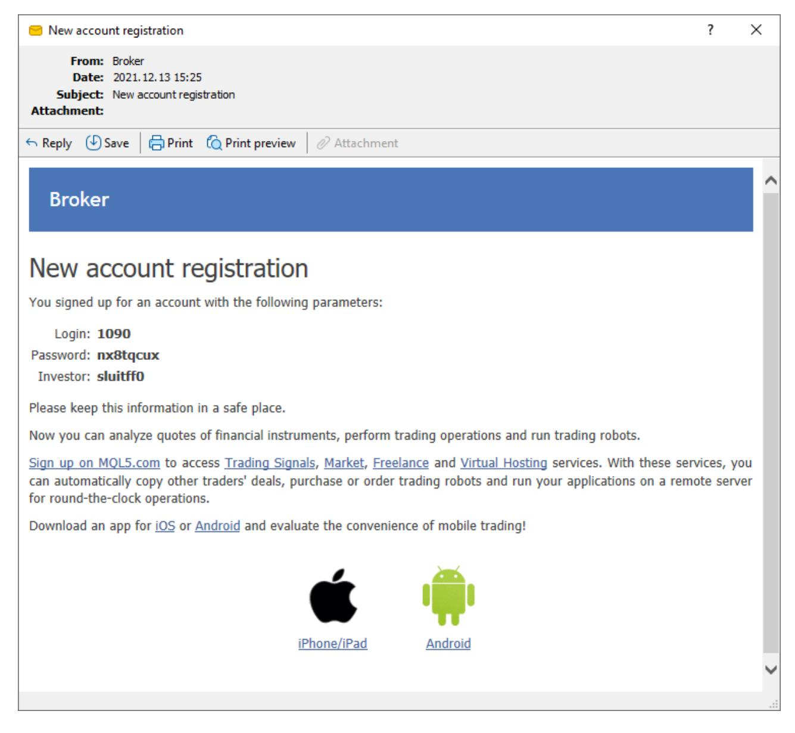

## Checking the settings

You can now open the client terminal and check preliminary account registration. The form should contain agreement links and all fields selected during customization. Furthermore, you can check the availability of account types corresponding to the relevant country and delivery of welcome emails. Then, open the Administrator terminal and check registration on the server side.

New accounts will be automatically created in appropriate groups in accordance with the user's country — verify data and move them to the real groups.

| Open an Account: Broker                                            |                                                                                                                                                           |          | Open an Account: Broker<br>Opening a real account<br>A real account is required for live trading on financial markets |                |        |                                                                              |        |          |   |
|--------------------------------------------------------------------|-----------------------------------------------------------------------------------------------------------------------------------------------------------|----------|-----------------------------------------------------------------------------------------------------------------------|----------------|--------|------------------------------------------------------------------------------|--------|----------|---|
| Open an account<br>Trade real or virtual money and gain experience |                                                                                                                                                           |          | State:                                                                                                                | New York       |        |                                                                              |        |          |   |
|                                                                    |                                                                                                                                                           |          | City:                                                                                                                 | New York       |        |                                                                              |        |          |   |
|                                                                    |                                                                                                                                                           |          | Zip code:                                                                                                             | 123456         |        |                                                                              |        |          |   |
| ○ Open a demo account to trade virtual money                       |                                                                                                                                                           |          | Address:                                                                                                              | 24 Wall St, 15 |        |                                                                              |        |          |   |
|                                                                    | A demo account allows you to learn trading<br>risk anything as you use pure virtual money                                                                 |          |                                                                                                                       |                |        | Please take photos of your documents and upload them here without any errors |        |          |   |
|                                                                    |                                                                                                                                                           |          | Identity:                                                                                                             | Passport       | ✓      | John Smith.Person.jpg                                                        |        |          |   |
| ◉ Open a real account for live trading                             |                                                                                                                                                           |          |                                                                                                                       |                |        |                                                                              |        |          |   |
|                                                                    | A real account requires additional proof of                                                                                                               |          | Address:                                                                                                              | Utility bill   | ✓      | John Smith.Address.jpg                                                       |        |          |   |
| Open an Account: Broker                                            |                                                                                                                                                           |          |                                                                                                                       |                |        |                                                                              | ?     | ×<br>nee |   |
| First name:                                                        | Second name:                                                                                                                                              |          |                                                                                                                       |                |        |                                                                              |        |          |   |
| John                                                               | Smith                                                                                                                                                     |          |                                                                                                                       |                |        |                                                                              |        |          |   |
| Middle name:                                                       |                                                                                                                                                           | Optional |                                                                                                                       |                |        |                                                                              |        |          | < |
| Date of birth:                                                     | 12/13/1989                                                                                                                                                |          | Gender                                                                                                                |                |        |                                                                              |        |          |   |
| Language:                                                          | English                                                                                                                                                   |          |                                                                                                                       |                |        |                                                                              |        |          |   |
|                                                                    |                                                                                                                                                           |          |                                                                                                                       |                |        |                                                                              |        |          |   |
| Email:                                                             | john@smith.com                                                                                                                                            |          |                                                                                                                       |                |        |                                                                              |        |          |   |
| Mobile Phone:                                                      | +1 United States                                                                                                                                          |          | 4845551243                                                                                                            |                |        |                                                                              |        |          |   |
|                                                                    | Use hedge in trading                                                                                                                                      |          |                                                                                                                       |                |        |                                                                              |        |          |   |
| Country:                                                           | Cyprus                                                                                                                                                    |          | ✓                                                                                                                     |                |        |                                                                              |        |          |   |
| Account type: Real USD                                             |                                                                                                                                                           |          |                                                                                                                       | ✓              |        |                                                                              |        |          |   |
|                                                                    | Personal details are used for opening a trade account and are not passed to any third parties.<br>The information is handled securely and confidentially. |          |                                                                                                                       |                |        |                                                                              |        |          |   |
|                                                                    |                                                                                                                                                           |          |                                                                                                                       |                | < Back | Next                                                                         | Cancel |          |   |

### The real account is almost ready: client management

The platform automatically collects relevant information about traders. Every opened account is [linked to the](#page-35-0) [appropriate client record.](#page-35-0) All data including documents are stored in a single place.

Assign managers and compliance department specialists to process incoming account requests. Your employees can maintain the traders' history, update data and change statuses straight out of the platform. The system will monitor and display all changes in the versions section, allowing control over all managers' actions.

[Customizable filters](#page-177-0) are available in the Manager terminal for a more convenient operation. Any employee can view assigned clients or users from a selected country. Filter settings are stored on the trading server and linked to the manager account, so the required tools can be accessed from any computer.

| Client                  | 1001 - John Murray Smith                                             |
|-------------------------|----------------------------------------------------------------------|
| Client                  | □ 1030, Kate Wilson #1 2018.08.24 16:34                              |
| Personal                | Called the client, will come to the office tomorrow to sign contract |
| Address                 | □ 1031, George Green #2 2018.08.24 16:36                             |
| Regulation              | Checked passport and registration, all approved                      |
| Client                  | 1001 - John Murray Smith                                             |
| Client                  |                                                                      |
| Type                    | Individual                                                           |
| Status                  | Approved                                                             |
| Assigned manager        | 1030, Kate Wilson                                                    |
| Preferred trading group | demoorex-eur                                                        |
| Approval by             | 1000, John Smith                                                     |
| Approval date           | 2018.08.24                                                           |
| Close date              | 2021.07.27                                                           |
| Lead source             | www.abcbroker.com                                                    |
| Lead campaign           | preliminary-desktop                                                  |
| Introducer              | Kate Wilson                                                          |

A [database of documents with version support](#page-48-0) and comments is stored directly in the platform. A compliance specialist may check the trader's documents and set a corresponding status upon approval. If anything is wrong with the documents, an appropriate comment can be left for the responsible manager, who will request new documents from the client and upload them in the versions section. Previously loaded files are also stored in the system.

| Client                                                                                                            | 1001 - Smith John Murray                        |               |                        |                                                         |                  | ?        | ×                      |
|-------------------------------------------------------------------------------------------------------------------|-------------------------------------------------|---------------|------------------------|---------------------------------------------------------|------------------|----------|------------------------|
| Client                                                                                                            |                                                 | ID            | 4                      | Type                                                    | Proof of address | Name     | Smith John.Address.jpg |
|                                                                                                                   |                                                 | Creation Date | 2018.08.06 13:36       | Status                                                  | New              |          |                        |
| Personal                                                                                                          |                                                 |               |                        |                                                         |                  |          |                        |
|                                                                                                                   |                                                 | 5             | Proof of identity      | Smith John.Person.jpg                                   | 2018.08.06 13:36 | Approved |                        |
|                                                                                                                   |                                                 | 11            | Proof of identity      | Smith John.Person.jpg                                   | 2018.08.27 09:31 | New      |                        |
|                                                                                                                   |                                                 | 12            | Proof of address       | Smith John.Address.jpg                                  | 2018.08.27 09:31 | New      |                        |
| Regulation                                                                                                        |                                                 |               |                        | Document: 5 - Proof of identity - Smith John.Person.jpg |                  |          |                        |
|                                                                                                                   | <b>Documents</b>                                |               |                        | Proof of identity - Smith John.Person.jpg               |                  |          |                        |
|                                                                                                                   |                                                 | Comments      |                        |                                                         |                  |          |                        |
| History                                                                                                           | Created by: 1019 on 2018.08.06 13:36<br>History |               |                        |                                                         |                  |          |                        |
| Last changed by: 1031, George Green on 2019.10.16 14:58<br><u>Additional info</u> Preliminary Trading<br>Comments |                                                 |               |                        |                                                         |                  |          |                        |
| A 1013 Smith                                                                                                      |                                                 |               |                        | Approved by: 1031, George Green on 2018.08.24 16:44     |                  |          |                        |
|                                                                                                                   |                                                 |               | Status                 |                                                         |                  |          |                        |
|                                                                                                                   |                                                 |               | Approved               |                                                         |                  |          |                        |
| <sup>2</sup> ဥ                                                                                                    |                                                 |               | Document type          |                                                         |                  |          |                        |
| 1029 Smith                                                                                                        |                                                 |               | Proof of identity      |                                                         |                  |          |                        |
|                                                                                                                   |                                                 |               | Document subtype       | Passport                                                |                  |          |                        |
| <sup>2</sup> ဥ                                                                                                    |                                                 |               | Issue date             | 2018.08.03                                              |                  |          |                        |
| 1001 John                                                                                                         |                                                 |               | <b>Expiration date</b> | 2028.08.03                                              |                  |          |                        |
|                                                                                                                   |                                                 |               | Name                   | Smith John.Person.jpg                                   |                  |          |                        |
|                                                                                                                   |                                                 |               | Comment                | Proof of identity from 1019 - 'Smith John Murray'       |                  |          |                        |
|                                                                                                                   |                                                 |               |                        |                                                         |                  |          |                        |
|                                                                                                                   |                                                 |               |                        |                                                         | Cancel           | Update   |                        |

### The real account is ready — simply change the group

After verifying the trader's data and documents, move the account from the preliminary group to a live one in accordance with requested trading conditions and the country. Then, the client can deposit the required amount and start trading right away. You will not need to re-send account credentials to the trader, because the account is already available in the client terminal.

| <b>Group:</b>                                                | real dash standard                                                  |
|--------------------------------------------------------------|---------------------------------------------------------------------|
| <b>Color:</b>                                                | managers<br>demo                                                    |
| <b>Bank account:</b>                                         | preliminary<br>usd-standard<br>usd-mini<br>eur-standard<br>eur-mini |
| <b>Trade accounts:</b>                                       | real<br>usd-standard<br>usd-mini                                    |
| <b>Synchronize</b>                                           |                                                                     |
|                                                              | & usd-mini                                                          |
| <b>Account:</b> 1029, Smith John Murray, USD, 1:100, Netting |                                                                     |
| <b>Overview</b>                                              |                                                                     |
| <b>Balance</b>                                               | 1 000 USD                                                           |
| <b>Operation:</b>                                            | Balance                                                             |
| <b>Amount:</b>                                               | 1 000                                                               |
| <b>Comment:</b>                                              | Deposit                                                             |
| <b>Deposit</b>                                               |                                                                     |
| <b>Time</b>                                                  | 2018.08.24 17:09:56                                                 |
| <b>Deal</b>                                                  | 45                                                                  |
| <b>Type</b>                                                  | balance                                                             |
| <b>Amount</b>                                                | 1 000.00                                                            |
| <b>Balance details</b>                                       | Balance: 1 000.00 USD Equity: 1 000.00 Free: 1 000.00               |
| <b>All history</b>                                           | 1970.01.01     ▼<br>✔                                               |
| <b>Request</b>                                               |                                                                     |
| <b>Client Properties</b>                                     |                                                                     |
| <b>Update</b>                                                |                                                                     |
| <b>Cancel</b>                                                |                                                                     |
| <b>Help</b>                                                  |                                                                     |

<span id="page-29-0"></span>

# Verification of contact details

The trading platform provides built-in features for the verification of phone numbers and emails which traders specify when opening [demo](#page-7-0) and [preliminary](#page-17-0) accounts via client terminals. Configure verification and access wider opportunities in working with potential clients by collecting valid contact information.

## Verification setup

Small confirmation codes are sent to traders by SMS and email to verify the data.

Before you enable SMS and email options in the platform, the system administrator should configure platform integration with messengers and email services.

Once done, open "Clients & Accounts \ Allocations" in MetaTrader 5 Administrator. In the Confirm parameter of each account type, select which data you want to be verified: phone number, email or both.

| Label                    | Value                                                                                                                                               |                                     |
|--------------------------|-----------------------------------------------------------------------------------------------------------------------------------------------------|-------------------------------------|
| Account allocation group |                                                                                                                                                     |                                     |
|                          | Please specify a company and a group with description. This group will be available for opening accounts from the client terminals of this company. |                                     |
| Company:                 | <b>Default</b>                                                                                                                                      |                                     |
| Group:                   | preliminary-usd                                                                                                                                     |                                     |
| Description:             | Real USD                                                                                                                                            |                                     |
| Leverages:               | 100, 50, 25, 10, 5, 2, 1                                                                                                                            |                                     |
| Countries:               | All countries                                                                                                                                       |                                     |
|                          | Start KYC check automatically                                                                                                                       |                                     |
|                          | Require identity and proof of address documents                                                                                                     |                                     |
|                          | Use advanced registration form                                                                                                                      |                                     |
| Confirm:                 | None                                                                                                                                                |                                     |
|                          | Mail server:                                                                                                                                        |                                     |
|                          | Default                                                                                                                                             |                                     |
|                          | ✓                                                                                                                                                   |                                     |
|                          |                                                                                                                                                     |                                     |
| Agreements:              | Agreement                                                                                                                                           |                                     |
|                          | <b>URL</b>                                                                                                                                          |                                     |
|                          | Client agreement                                                                                                                                    | https://abc broker.com/legal/client |
|                          | Mandatory                                                                                                                                           |                                     |
| Add                      | ab Risk disclosure                                                                                                                                  | https://abc broker.com/legal/risk   |
| Edit                     |                                                                                                                                                     |                                     |
| <b>Delete</b>            |                                                                                                                                                     |                                     |
|                          | OK                                                                                                                                                  | Cancel                              |

Specify the email server which will be used to confirm email addresses during the registration of specific account types.

When sending a confirmation SMS, the platform will choose the best available provider. The platform takes into account the client group and country, as well as the provider operation statistics. This allows for more reliable delivery as well as lower costs for provider services.

You can additionally specify your own email and SMS text to be sent to traders for confirmation. Use standard templates on the trade server:

- ·[main server installation directory]\templates\verify\_email — HTM files with email templates.
- · [main server installation directory]\templates\verify\_phone — text files for SMS templates. Do not use too long messages. If the allowed length is exceeded (depending on the provider), a message may be cropped or split into multiple SMS.

See also:

- ·[Documentation / Platform / Platform settings / Integration / Mail servers](https://support.metaquotes.net/en/docs/mt5/platform/administration/integration/integration_mail)
- ·[Documentation / Platform / Platform settings / Integration / Messengers](https://support.metaquotes.net/en/docs/mt5/platform/administration/integration/integration_messenger)

## Confirmation on the client side

During account registration, traders provide their contact data, including phone number and email.

| Open an Account: MetaQuotes Software Corp.                                                                   |                                                                                                                                 |
|--------------------------------------------------------------------------------------------------------------|---------------------------------------------------------------------------------------------------------------------------------|
| <p>Opening a demo account</p> <p>A demo account allows trading with virtual money and learn without risk</p> |                                                                                                                                 |
| First name:                                                                                                  | John                                                                                                                            |
| Second name:                                                                                                 | Smith                                                                                                                           |
| Email:                                                                                                       | john@smith.net                                                                                                                  |
| Confirmation code                                                                                            |                                                                                                                                 |
| Mobile Phone:                                                                                                | +1 (Canada, United States)                                                                                                      |
| Confirmation code                                                                                            |                                                                                                                                 |
|                                                                                                              | We have sent confirmation codes to your phone and email. Please specify them.                                                   |
|                                                                                                              | <input checked="" type="checkbox"/> Use hedge in trading                                                                        |
| Server:                                                                                                      | MetaQuotes-Demo                                                                                                                 |
| Account type:                                                                                                | Demo-Hedging                                                                                                                    |
| Deposit:                                                                                                     | USD, virtual money to be deposited to your account<br>100000                                                                    |
| Leverage:                                                                                                    | 1:100<br>virtual credit funds to be provided by the broker for trading                                                          |
|                                                                                                              | <input checked="" type="checkbox"/> I agree with the terms and conditions for opening an account and the data protection policy |
|                                                                                                              | <a href="http://www.metaquotes.net">www.metaquotes.net</a>                                                                      |
|                                                                                                              | <a href="#">&lt; Back</a>   <a href="#">Next</a>   <button>Cancel</button>                                                      |

If verification is enabled for the selected account type (group), confirmation codes are automatically sent to the trader and special code fields appear in the dialog box.

Confirmation codes are valid for three hours. If the code is not entered in the field within this time frame, the trader will need to repeat the procedure.

Before sending codes, the system checks whether the specified phone/email has been previously confirmed. If the trader has already passed verification from their computer in the last 72 hours, an account will be opened without additional confirmation. Thus, there will be no additional burden for traders and no additional costs for brokers.

The system automatically controls the correctness of specified phone numbers on the client terminal side. This prevents the sending of codes to incorrect numbers and thus saves you costs for the SMS provider services.

- · The phone number must be specified in the international format: +[country code][number], for example: +79171113594. The number is indicated without spaces.
- ·This must be a mobile phone number, not landline.

In addition, the system checks the correctness of email addresses. Temporary addresses and unreliable mail services are not allowed.

The number of confirmations of different phone numbers and email addresses that a trader can request from one computer is limited for security purposes. When the limit is reached, confirmation codes are no longer sent, and the following messages is printed in the server log:

too many phone confirmation requests from IP too many email confirmation requests from IP

<span id="page-32-0"></span>

# Clients

The Client is a separate entity in the trading platform. This is the aggregate information on a trader, including [personal data,](#page-39-0) [documents](#page-48-0) and [trading accounts.](#page-54-0) The client record stores the history of all changes: every version made by any manager is available in the [Versions](#page-53-0) section.

All accounts registered in the platform are automatically connected to an existing or a new client. Thus, the client entity conveniently stores all accounts of a trader, even those opened in different groups or having different types. This data arrangement registers all client performed actions before opening a real account and allows evaluation of the client's real LTV (Life-Time Value).

| (6) 1000 - Broker-Demo - John Smith                                     |                                             |                      | □<br>×               |                  |
|-------------------------------------------------------------------------|---------------------------------------------|----------------------|----------------------|------------------|
| Edit<br>File<br>View<br><b>Tools</b><br>Window<br>Help                  |                                             |                      |                      |                  |
| $\mathbf{\hat{v}_{4}}$<br>總<br>↙<br>۳<br>⋿                              | ❶<br>D3°<br>C+ → Connect                    | ⇄<br>$\equiv$ Filter | Q                    |                  |
| Navigator<br>$\pmb{\times}$<br>ID<br>$\hat{\phantom{a}}$<br>Name        | City                                        | <b>Status</b>        | Country              |                  |
| 몽 MetaTrader 5 Manager<br>$×$ 1000<br>由--- Servers                      | <b>First Admin Smith</b><br><b>New York</b> | Approved             | <b>United States</b> |                  |
| × 1001<br>in Analytics                                                  | John Murray Smith<br><b>New York</b>        | Approved             | <b>United States</b> |                  |
| 7 1002 Joe Perry<br><b>E-Co</b> Server Reports                          |                                             | Nicosia Unregistered | Cyprus               |                  |
| Client: 1001 - John Murray Smith<br>□ 2= Clients & Drders               |                                             |                      |                      | ?                |
| 8= Online Users<br><b>命</b> Client<br>SE Clients (11)                   | Client                                      |                      |                      |                  |
| - <u>&amp;</u> Trading Acc<br>闻 Personal<br>$\frac{1}{2}$ Positions (1) | Type                                        |                      |                      |                  |
| $\mathbb{R}$ Orders (1)<br>0<br>Address                                 | Individual                                  |                      |                      |                  |
| $\frac{A_{\rm T}}{A_{\rm T}}$ Dealing                                   | <b>Status</b>                               |                      |                      |                  |
| 由 & Groups (41)<br>Regulation<br>요                                      | Approved                                    |                      |                      |                  |
| <sup>1</sup> Plugins                                                    | Assigned manager                            |                      |                      |                  |
| <b>Documents</b><br><b>E</b> Support Center<br>O                        | 1030, Kate Wilson                           |                      |                      |                  |
| <b>E</b> App Store<br>□ Comments                                        | Preferred trading group                     |                      |                      |                  |
| For Help, press F1                                                      | demo\forex-eur                              |                      |                      |                  |
| <b>5</b> History                                                        | Approved by                                 |                      |                      |                  |
| <b>Preliminary Accounts</b><br>ஃ                                        | 1000, John Smith                            |                      |                      |                  |
|                                                                         | Approval date                               |                      |                      |                  |
| 1013 John Murray Smith<br>g.                                            | ⊕∽<br>$\sqrt{2018.08.24}$                   |                      |                      |                  |
|                                                                         | Close date                                  |                      |                      |                  |
| ని<br>1017 Smith John Murray                                            | ⊕∽<br>× 2021.07.27                          |                      |                      |                  |
| 1018 Smith John Murray                                                  | Lead source                                 |                      |                      |                  |
| 1019 Smith John Murray                                                  | www.abcbroker.com                           |                      |                      |                  |
| ዳ                                                                       | Lead campaign                               |                      |                      |                  |
| 1028 Smith John Murray<br>g                                             | preliminary-desktop                         |                      |                      |                  |
|                                                                         | Introducer                                  |                      |                      |                  |
| 1032 Smith John Murray<br>8                                             | Kate Wilson                                 |                      |                      |                  |
| ౭<br>1033 Smith John Murray                                             |                                             |                      |                      |                  |
|                                                                         | Copy                                        | Export               |                      | Update<br>Cancel |

All clients are displayed in a separate section:

The context menu contains commands for managing the Clients section:

·Displayed data is managed by the Columns command

- ·The [list of clients](#page-177-0) can be managed using the Filters submenu
- ·[Information to clients](#page-64-0) can be sent using the E-Mail command
- ·Details on clients' operations can be retrieved from the trade server journal by the Journal command

If Autoscroll is enabled, the list of clients is scrolled to the last one whenever a new trading account is added to the list. The auto scroll can only be applied to a list sorted by the identifier (ID).

The manager account needs to have appropriate permissions for accessing the Clients section. Such permissions are provided by the platform administrator.

### Creating clients automatically and manually

All accounts registered in the platform via client terminals are [automatically linked to clients](#page-35-0). If there is no client record for the newly created account, such a record is created automatically. All information from the account is copied to the client record. Minimum details are required for demo accounts: name, surname, company, email and phone number.

More data can be requested during the registration of preliminary accounts via client terminals. Depending on platform settings, the following data may be requested:

- ·Detailed personal data
- ·ID and proof-of-address documents
- ·Nationality and tax ID number
- ·Social status, employment and education
- ·Income and its sources
- ·Trading experience in various financial markets

If you enable the extended account registration form, all the above data will be automatically added to client records. Thus, you will not need to additionally request this information and add it manually to the database.

| Label           | Value                    |
|-----------------|--------------------------|
| Open an Account |                          |
| Client          | 1001 - Smith John Murray |

Opening a real account

| A real account is required for live trading |
|---------------------------------------------|
|---------------------------------------------|

| Client | 1001 - Smith John Murray |
|--------|--------------------------|
|--------|--------------------------|

Personal

| Title                         | Mr.                                              |
|-------------------------------|--------------------------------------------------|
| First name                    | John                                             |
| Second name                   | Smith                                            |
| Middle name                   | Murray                                           |
| Date of birth                 | 1989-09-01                                       |
| Language                      | Russian                                          |
| Email                         | john@smith.com                                   |
| Phone                         | +1 (Canada, United States)                       |
| Country                       | United States                                    |
| Account type                  | Real EUR (Main Trading Account)                  |
| Personal details are used for | Trading                                          |
| Remarks                       | If the phone or email is missing, please update. |
| Real Trading Accounts         |                                                  |
| 1029 Smith John               |                                                  |
| 1034 Smith John               |                                                  |
| Demo Trading Accounts         |                                                  |
| 1001 John Smith               | fb:johnsmith                                     |
| 1002 John Smith               |                                                  |
| External ID                   | 1249993399                                       |

| File   | Edit | View | <b>Tools</b> |
|--------|------|------|--------------|
| Window | Help |      |              |

Title: (6) 1000 - Broker-Demo - John Smith

| Navigator               | ID                      | Name                               | City | Status       | Country |
|-------------------------|-------------------------|------------------------------------|------|--------------|---------|
| 메타트레이더 5 매니저            | 1000                    | First Admin Smith                  |      | Unregistered |         |
| Α                       | + New Client            | × 1001 John Murray Smith           |      |              |         |
|                         | Ctrl+Shift+N            |                                    |      |              |         |
| 中 (iii) Analytics       | 由 《戸 Server Rej         |                                    |      |              |         |
| Client: New e Clients & |                         | S.                                 |      |              |         |
| -8 = 0 nl in            | 命 Client                | -8 =                               |      |              |         |
| -8 =                    | Tradit                  | 图 Personal                         |      |              |         |
| - <mark>Al</mark> Order | 9 Address               | -A_{\overline{V}}/\sqrt{V} Dealing |      |              |         |
| 中 8 Groups (4           | 음 Regulation            |                                    |      |              |         |
| - Mugins                | <b>KYC</b> status       |                                    |      |              |         |
| For Help, press F1      | Undefined               |                                    |      |              |         |
|                         | Assigned manager        |                                    |      |              |         |
|                         | None                    |                                    |      |              |         |
|                         | Preferred trading group |                                    |      |              |         |
|                         |                         |                                    |      |              |         |
|                         | Approved by             |                                    |      |              |         |
|                         | None                    |                                    |      |              |         |
|                         | Approval date           |                                    |      |              |         |
|                         | ⊞∽<br>X 2021.12.14      |                                    |      |              |         |

To create a client manually, click "New client" in the context menu of the client list or press Ctrl+Shift+N.

After that specify required information in sections [Personal data,](#page-39-0) [Address](#page-44-0) and [Regulation](#page-47-0). Once you save the client record, document and trading account management sections will appear.

When a [trading account is created](#page-184-0) via the Manager terminal, an appropriate client record is not created automatically. To create a record manually based on account data, open the account dialog and select "New client" in the lower left corner. To create an account linked to a client record, use the [Trading](#page-54-0) [accounts](#page-54-0) section in the appropriate client record.

<span id="page-35-0"></span>

#### Binding accounts to clients and copying data

The trading platform automatically binds each trading account opened via the client terminal to a client record. Search is based on the comparison of trading account data with data in client records:

- · First, a client with the matching First Name, Last Name and E-Mail is searched (all the three should match, case insensitive).
- · If no such client is found, the system searches for a client with the matching First Name, Last Name and phone number (all the three fields should match, case insensitive).

If no suitable record is found, a new client is created, and the trading account is linked to it.

After that the account data is copied to the client record in accordance with priority. Demo accounts and client records created based on demo accounts have the lowest priority. The highest priority is given to data from real accounts and manually created clients.

- · **Demo account** — when binding such an account to an existing client record, which was created earlier on the basis of another demo account, only missing data is copied.
- · **Preliminary account** — when binding such an account to an existing client record, which was created earlier on the basis of a demo account, all data is copied (existing data is overwritten). If the client was created on the basis of a preliminary account, only missing data is copied. If the client was created on the basis of a real account or was added manually, data is not copied.
- · **Real account** — when binding such an account to an existing client record, which was created earlier on the basis of a preliminary or demo account, all data is copied (existing data is overwritten). If the client was created on the basis of a real account or was added manually, data is not copied.

If the account is linked to a newly created record, all account data is copied.

The relevant details are also copied to clients after each time the account is changed. In this case, the data is only copied to the empty fields of the client. For example, when the manager adds an address to account data. If the address is not filled for the client to whom the account is bound, the data will be copied to the relevant fields.

<span id="page-36-0"></span>

#### Differentiation of access to clients for managers

A client record is available to the manager if one of the following conditions is met:

- ·The client has been created by this manager
- ·The client is explicitly [assigned](#page-38-0) to the manager
- · [The preferred trading group](#page-38-1) set for the client is available to the manager (the manager has permissions for the group)
- · Any of the [trading accounts bound to the client](#page-54-0) is available to the manager (the manager has permissions for the group in which the account is located)

# General client information

This section displays general information about the client, as well as the responsible employees who manage the client.

| Client:                      | 1001 - Smith John Murray          |
|------------------------------|-----------------------------------|
| Type                         | Individual                        |
| Address                      |                                   |
| Regulation                   | Approved                          |
| KYC status                   | Approved                          |
| Assigned manager             | 1030, Kate Wilson                 |
| Comments                     |                                   |
| History                      |                                   |
| Preferred trading group      | demoorex-eur                     |
| Preliminary Trading Accounts |                                   |
| 1013 Smith John              | Approved by                       |
|                              | 1000, First Admin                 |
| 1017 Smith John              | Approval date<br>$30$ 2018.08.24 |
| Real Trading Accounts        | Close date                        |
|                              | X 2019.10.17                      |
| 1029 Smith John              | Lead source                       |
| Demo Trading Accounts        | www.abcbroker.com                 |
|                              | Lead campaign                     |
| 1001 John Smith              | preliminary-desktop               |
| 1002 John Smith              | Introducer                        |
|                              | Kate Wilson                       |
| 1034 Smith John              |                                   |
|                              | Export<br>Cancel                  |
|                              | Update                            |

- <span id="page-37-0"></span>· **Type** — individual or corporate client. The Company tab is additionally available for corporate clients, in which company details are specified.
- · **Status** sets the client status:
  - ·Not registered — an anonymous client created based on a demo account without any data.
  - ·Registered — the client has created a demo account and has filled contact details.
  - · Not interested — the client has created a demo account and has filled contact details but is not interested in opening a real account.

- ·Not completed — the client has provided data for opening a real account.
- · Completed — the client has provided data for opening a real account and has submitted all the required documents.
- ·Information — to open a real account, the client needs to provide additional information.
- ·Rejected — the client was denied registration.
- ·Approved — a real account has been opened for the client.
- ·Funded — the client has deposited money to a real account.
- ·Active — the client has trading activity.
- ·Inactive — the client does not have any trading activity.
- ·Suspended — work with the client has been suspended.
- ·Closed — the client has left at their own decision.
- ·Terminated — work with the client was terminated at the initiative of the company.
- <span id="page-38-2"></span>·**KYC status** — the result of a client check via the [KYC](#page-41-0)service.
- <span id="page-38-0"></span>· **Assigned manager** — the name of the responsible employee. To find all the clients managed by a certain employee, enable the "Assigned manager" column in the client list and sort the list by this column. The list of managers available for selection is formed in accordance with the settings of the manager who is viewing the client. If the current manager account is linked to a certain company on the trading server, the available list will only include managers from the same company. A manager without any company specified can access all managers on the server. If the required managers are not available to you in the list, please contact your trading platform administrator.
- <span id="page-38-1"></span>· **Preferred trading group** — the field is used to [distribute client records](#page-36-0) between manager accounts. If this field is empty, the client record will be available to managers regardless of their account group permissions. If filled, the client will only be available to the managers having the specified group permissions.
- · **Approved by** — different employees can be responsible for the creation and final approval of clients. For example, a manager can register a client, fill in necessary data and set the Registered status. Then a compliance specialist may verify the data, change the status to Approved, set the approval date and specify his account in the "Approved by" field.
- · **Approval date** — data and document verification and approval date. The date is set by the data approving specialist.
- ·**Close date** — the date when the provision of services to the client was terminated.
- · **Lead Source, Lead Campaign** — the website from which the client came (lead source) and the name of the marketing campaign, as a result of which the client came.

These fields enable the analysis of marketing campaigns and tracking of leads. To receive the data, add the special parameters to the client or mobile platform download links:

```
https://download.mql5.com/cdn/web/metaquotes.ltd/mt5/mt5setup.exe?
utm_source=YourWebsite&utm_campaign=YourCampaign
https://download.mql5.com/cdn/mobile/mt5/ios?server=ABC-Demo,ABC-
Real&utm_source=YourWebsite&utm_campaign=YourCampaign
https://download.mql5.com/cdn/mobile/mt5/android?server=ABC-Demo,ABC-
Real&utm_source=YourWebsite&utm_campaign=YourCampaign
```

Here YourCampaign is the company name, and YourWebsite is the address of the website hosting the link. In the 'server' parameter of the mobile platform links, enter the list of your servers to be shown to traders when they open an account.

When opening a demo account and connecting to any trading account via the terminal downloaded using such a link, utm\_source and utm\_campaign values will be registered in the client record on the server side. If the fields are already filled, the label values will not be overwritten when the account reconnects (even when connecting from a terminal downloaded by a link with other labels).

- ·**Introducer** — the login (trading account) of the user, who introduced the client.
- · **Visitor ID** — a unique identifier assigned to the user when they install your terminal or visit your site, if a Finteza tracker is installed in it. With this tracker, you can trace trader behavior, from the first website visit to a real account deposit. For further details please visit the [Analytics](#page-90-0) section.

Lead Source and Lead Campaign data from terminal download links is registered in created accounts only if you have a [Finteza license](https://support.metaquotes.net/en/docs/mt5/platform/administration/integration/integration_finteza).

If you wish to process client data using third-party software, you can save the relevant data to a file. Click Export and select the data which should be exported to a file: documents, history, etc. After that click Save:

| Network            |               |                     |           |              | $\checkmark$ |
|--------------------|---------------|---------------------|-----------|--------------|--------------|
|                    | File name:    | Client-1050.html    |           | $\checkmark$ | Save         |
|                    | Save as type: | HTML Files (*.html) |           | $\checkmark$ | Cancel       |
| Report parts       |               |                     |           |              |              |
| √ Client           |               | Documents           | Comments  |              |              |
| ⥱ Trading Accounts |               | ∨ Files             | ☐ History |              |              |
|                    |               |                     |           |              | ±            |

<span id="page-39-0"></span>

### Client's personal data

Client's personal data is filled in this section: name, date of birth and contact details.

| Label                                                 | Value                                 |
|-------------------------------------------------------|---------------------------------------|
| Client:                                               | 1001 - Smith John Murray              |
| Client                                                | Personal                              |
| Title                                                 | Mr.                                   |
| First name                                            | John                                  |
| Second name                                           | Smith                                 |
| Middle name                                           | Murray                                |
| Gender                                                | Male                                  |
| Birthdate                                             | 1998.02.24                            |
| Language                                              | English                               |
| Preferred method                                      | Not specified                         |
| Email                                                 | john@smith.com                        |
| Mobile                                                | +1 (Canada, United States) 2251325673 |
| Messengers (skype:username, icq:userid, etc.)         | skype:johm-smith                      |
| Social Networks (fb:username, twitter:username, etc.) | fb:johmsmith                          |
| External ID                                           | 1249993399                            |
| KYC Check                                             | Cancel                                |

- ·**Title** — client title, Mr. or Mrs.
- ·**First name** — client's first name.
- ·**Second name** — client's second name.
- ·**Middle name** — client's middle name.
- ·**Gender** — client's gender.
- ·**Birthdate** — date of birth.
- ·**Language** — the language spoken by the client.
- ·**Preferred method** — preferred contact method: email, phone calls, SMS, messengers.
- ·**Email** — client's email address.
- ·**Mobile** — client's mobile phone number.

- · **Messengers** — a list of the client's accounts in instant messengers. You may specify accounts in any form, but it is recommended to use the unified method: [messenger name]:[account].
- · **Social Networks** — the list of the client's accounts in social networks. You may use any form, but it is recommended to use the unified method: [network name]:[account].
- · **External ID** — client ID in an external trading system. This field can be used for integrations and for generating reports using API.

<span id="page-41-0"></span>

## KYC Check

The trading platform integration with KYC (Know Your Customer) services enables the validation of client personal data and [documents](#page-48-0) with one click or even in a fully automated mode.

The trader [requests a live account](#page-17-0) via the desktop or mobile terminal by filling out a form and uploading documents:

| Open an Account        |                                                                                                                                         |                                                                                                                                                               | ?                    | ×      |
|------------------------|-----------------------------------------------------------------------------------------------------------------------------------------|---------------------------------------------------------------------------------------------------------------------------------------------------------------|----------------------|--------|
| Opening a real account | A real account is required for live trading on financial markets                                                                        |                                                                                                                                                               |                      |        |
| State:                 | New York                                                                                                                                |                                                                                                                                                               |                      |        |
| City:                  | New York                                                                                                                                | 123456                                                                                                                                                        |                      |        |
| Zip code:              | 123456                                                                                                                                  |                                                                                                                                                               |                      |        |
| Address:               | Wall st, 1                                                                                                                              |                                                                                                                                                               |                      |        |
| Identity:              | <b>ID Card</b>                                                                                                                          | Please take photos of your documents and upload them here without any editing.<br>image or PDF file for the front side<br>image or PDF file for the back side | $\cdots$<br>$\cdots$ |        |
| Address:               | Utility bill                                                                                                                            | image or PDF file                                                                                                                                             | $\sqrt{1}$           |        |
|                        | - Some types of documents require two photos: front and back side<br>- Bills for mobile services are not accepted as a proof of address | - Utility bill must contain your name and address and be no older than three months                                                                           |                      |        |
|                        |                                                                                                                                         | $\sqrt{1}$ agree with the terms and conditions for opening an account and the data protection policy                                                          |                      |        |
|                        |                                                                                                                                         | < Back<br>Next                                                                                                                                                |                      | Cancel |

A preliminary account with a zero balance is created for the client. This account along with the relevant data and documents is linked to the client record. The manager clicks the "KYC Check" button in the [client personal data](#page-39-0) section and the platform automatically sends a request to the KYC system.

| 1017 Smith John       | john@smith.com                                        |
|-----------------------|-------------------------------------------------------|
| Real Trading Accounts | Mobile                                                |
|                       | +1 (Canada, United States)<br>2251325673              |
| 1029 Smith John       | skype:john-smith                                      |
| Demo Trading Accounts | social networks: fb:johnsmith, twitter:username, etc. |
| 1001 John Smith       | fb:johnsmith                                          |
|                       | External ID<br>1249993399                             |
| 1034 Smith John       | <b>KYC Check</b><br>Update<br>Cancel                  |

- ·To enable this feature, [configure KYC providers](#page-56-0) on the server.
- · The platform can be configured to enable automated sending of client data to a KYC provider after the client opens a [preliminary account](#page-17-0) via the client terminal. This allows the full automation of the onboarding process.

The KYC system checks data and documents and returns the result, which the manager can view in the platform as a report:

| Client: 7255 - Parker Gabriel                                                                                                                                                                                                                                                                                                                   |                 |            |  |  |  |  |  |  |  |  |  |  |  |  |  |  |  |  |  |  |  |  |  |  |  |  |  |  |
|-------------------------------------------------------------------------------------------------------------------------------------------------------------------------------------------------------------------------------------------------------------------------------------------------------------------------------------------------|-----------------|------------|--|--|--|--|--|--|--|--|--|--|--|--|--|--|--|--|--|--|--|--|--|--|--|--|--|--|
|                                                                                                                                                                                                                                                                                                                                                 |                 |            |  |  |  |  |  |  |  |  |  |  |  |  |  |  |  |  |  |  |  |  |  |  |  |  |  |  |
| Create time                                                                                                                                                                                                                                                                                                                                     |                 |            |  |  |  |  |  |  |  |  |  |  |  |  |  |  |  |  |  |  |  |  |  |  |  |  |  |  |
| 2019-12-04 14:09:05                                                                                                                                                                                                                                                                                                                             |                 |            |  |  |  |  |  |  |  |  |  |  |  |  |  |  |  |  |  |  |  |  |  |  |  |  |  |  |
| Review start time                                                                                                                                                                                                                                                                                                                               |                 |            |  |  |  |  |  |  |  |  |  |  |  |  |  |  |  |  |  |  |  |  |  |  |  |  |  |  |
| 2019-12-04 14:09:48                                                                                                                                                                                                                                                                                                                             |                 |            |  |  |  |  |  |  |  |  |  |  |  |  |  |  |  |  |  |  |  |  |  |  |  |  |  |  |
| Review end time                                                                                                                                                                                                                                                                                                                                 |                 |            |  |  |  |  |  |  |  |  |  |  |  |  |  |  |  |  |  |  |  |  |  |  |  |  |  |  |
| 2019-12-04 14:09:58                                                                                                                                                                                                                                                                                                                             |                 |            |  |  |  |  |  |  |  |  |  |  |  |  |  |  |  |  |  |  |  |  |  |  |  |  |  |  |
| <b>Review result</b>                                                                                                                                                                                                                                                                                                                            |                 |            |  |  |  |  |  |  |  |  |  |  |  |  |  |  |  |  |  |  |  |  |  |  |  |  |  |  |
| <b>Accepted</b>                                                                                                                                                                                                                                                                                                                                 |                 |            |  |  |  |  |  |  |  |  |  |  |  |  |  |  |  |  |  |  |  |  |  |  |  |  |  |  |
| <b>Documents review</b>                                                                                                                                                                                                                                                                                                                         |                 |            |  |  |  |  |  |  |  |  |  |  |  |  |  |  |  |  |  |  |  |  |  |  |  |  |  |  |
| Document                                                                                                                                                                                                                                                                                                                                        | Status          |            |  |  |  |  |  |  |  |  |  |  |  |  |  |  |  |  |  |  |  |  |  |  |  |  |  |  |
| Passport front side                                                                                                                                                                                                                                                                                                                             | <b>Accepted</b> |            |  |  |  |  |  |  |  |  |  |  |  |  |  |  |  |  |  |  |  |  |  |  |  |  |  |  |
| Passport back side                                                                                                                                                                                                                                                                                                                              | <b>Accepted</b> |            |  |  |  |  |  |  |  |  |  |  |  |  |  |  |  |  |  |  |  |  |  |  |  |  |  |  |
| Utility bill                                                                                                                                                                                                                                                                                                                                    | <b>Accepted</b> |            |  |  |  |  |  |  |  |  |  |  |  |  |  |  |  |  |  |  |  |  |  |  |  |  |  |  |
| Birthday                                                                                                                                                                                                                                                                                                                                        |                 | 1986.11.26 |  |  |  |  |  |  |  |  |  |  |  |  |  |  |  |  |  |  |  |  |  |  |  |  |  |  |
| <b>Client details update</b>                                                                                                                                                                                                                                                                                                                    |                 |            |  |  |  |  |  |  |  |  |  |  |  |  |  |  |  |  |  |  |  |  |  |  |  |  |  |  |
| Applicant -5de7bb090a975a750f27ac22   Personal   First nameParker  Last nameGarbriel  Birthday1986.11.26  Birth placeNY  Birth countryUnited States  GenderM  Phone+1234567890                                                                                                                                                                  |                 |            |  |  |  |  |  |  |  |  |  |  |  |  |  |  |  |  |  |  |  |  |  |  |  |  |  |  |
| Document typePassport  Document number123456789  Document issue date2019.12.01  Document valid till2025.01.01                                                                                                                                                                                                                                   |                 |            |  |  |  |  |  |  |  |  |  |  |  |  |  |  |  |  |  |  |  |  |  |  |  |  |  |  |
| 2019-12-04 14:09:05<br>2019-12-04 14:09:48<br>2019-12-04 14:09:58<br><b>Documents review</b><br><b>Client details update</b><br>Applicant - 5de7bb090a975a750f27ac22<br>Personal<br>First name<br>Parker<br>Garbriel<br>Last name<br>Birthday<br>1986.11.26<br><b>Birth place</b><br>NY<br><b>Birth country</b><br>United States<br>Gender<br>M |                 |            |  |  |  |  |  |  |  |  |  |  |  |  |  |  |  |  |  |  |  |  |  |  |  |  |  |  |
| Comments<br>New Comment                                                                                                                                                                                                                                                                                                                         |                 |            |  |  |  |  |  |  |  |  |  |  |  |  |  |  |  |  |  |  |  |  |  |  |  |  |  |  |
| Cancel                                                                                                                                                                                                                                                                                                                                          |                 |            |  |  |  |  |  |  |  |  |  |  |  |  |  |  |  |  |  |  |  |  |  |  |  |  |  |  |
| Update                                                                                                                                                                                                                                                                                                                                          |                 |            |  |  |  |  |  |  |  |  |  |  |  |  |  |  |  |  |  |  |  |  |  |  |  |  |  |  |

Based on the check result, the 'confirmed' or 'rejected' status is automatically assigned to the [client](#page-38-2) and to the documents uploaded to the relevant client record. Furthermore, data from the KYC system can supplement client records on the platform side. These include the details which the system can read from the provided documents: name, date of birth, document type, number and expiration date, among other data. Updated data is indicated in a separate report block.

| Client:           | 7255 - Parker Gabriel                |
|-------------------|--------------------------------------|
| ID                | 633                                  |
| Type              | Proof of identity                    |
| Name              | Passport                             |
| Creation Date     | 2019.12.05 12:54                     |
| Status            | Approved                             |
| Proof of address: | 634                                  |
| Type              | Proof of address                     |
| Name              |                                      |
| Creation Date     | 2019.12.05 12:55                     |
| Status            | Rejected                             |
| Address           | V                                    |
| Document          | 633 - Proof of identity - Passport   |
| Regulation        | 同                                    |
| Documents in      | Files                                |
| Created by        | 1863, John Smith on 2019.12.05 12:54 |
| Comments          | History                              |
| Last changed by   | 1863, John Smith on 2019.12.05 12:54 |
| Approved by       | 1863, John Smith on 2019.12.05 12:54 |
| Status            | Approved                             |
| Document type     | Proof of identity                    |
| Document subtype  | Other                                |
| Issue date        | 2017.12.05                           |
| Expiration date   | 2025.12.05                           |
| Name              | Passport                             |
| Comment           |                                      |
| Cancel            | Update                               |

Once the check is complete, the manager can confirm registration and move the preliminary account to a real group. After that, the client can make a deposit and start trading.

<span id="page-44-0"></span>

## Client's address

Fill in here the client's address of residence and information about the appropriate ID document.

| Client:                      | 1001 - Smith John Murray                        |
|------------------------------|-------------------------------------------------|
| Client                       |                                                 |
| Personal                     |                                                 |
| Address                      |                                                 |
| Regulation                   |                                                 |
| Document type                | Passport                                        |
| Document number              | 14 2669369                                      |
| Issue date                   | 2016.10.16                                      |
| Expiration date              | 2026.10.16                                      |
| Comments                     |                                                 |
| History                      |                                                 |
| Preliminary Trading Accounts |                                                 |
| 1013 Smith John              | United States                                   |
| 1017 Smith John              | State: New York                                 |
| Real Trading Accounts        | City: New York                                  |
| 1029 Smith John              | ZIP code: 12446                                 |
| Demo Trading Accounts        | Address: 24 Wall st, 15                         |
| 1001 John Smith              |                                                 |
|                              |                                                 |
|                              | <button>Cancel</button> <button>Update</button> |

- ·**Document type** — the name of the document: passport, driving license, etc.
- ·**Document number** — the number of the above document.
- ·**Issue date** — the date when the document was issued.
- ·**Expiration date** — document expiration date.
- ·**Comment** — an arbitrary comment in addition to the document details.
- ·**Country** — country of residence.
- ·**State** — state or region of residence.
- ·**City** — city of residence.
- ·**ZIP code** — zip or postal code.
- ·**Address** — full address including street name, building number, etc.

## Corporate clients

This section is only available for [corporate clients](#page-37-0). Company registration data is specified here.

| Client                      | 1008 - ABC Company - Caine Richard                   |
|-----------------------------|------------------------------------------------------|
| Company                     |                                                      |
| Country of registration     | Netherlands                                          |
| Company name                | ABC Company                                          |
| Registration number         | 1261222992                                           |
| Registration date           | 2016.10.16                                           |
| Registration authority      | Chamber of Commerce                                  |
| VAT registration number     | 12226666                                             |
| LEI number for EMIR reports | 69989916                                             |
| License number              | N1122922                                             |
| License authority           | Dutch Central Bank                                   |
| Legal address               | 10 Jan Evertsenstraat st, 15, Amsterdam, Netherlands |
| Website                     | www.abccompany.com                                   |
| Account Holder              | John Smith                                           |
| Account Number              | 1001                                                 |
| Status                      | Cancel / Update                                      |

- ·**Country of registration** — the country the company is registered in.
- ·**Company name** — the name of the company.
- ·**Registration number** — the number assigned to the company by the registration authority.
- ·**Registration date** — date of registration of the company.
- ·**Registration authority** — the name of the authority that registered the company.
- ·**VAT registration number** — used for legal entities registered in the European Union.
- · **LEI number for EMIR reports** — EMIR (European Market Infrastructure Regulation) is a body of European legislation for the regulation of over-the-counter derivatives. EMIR requires from brokers to provide a report on transactions performed by legal entities. The transaction body in such a report must be identified by LEI (Legal Entity Identifier). It consists of a 20-character alphanumeric code.

- ·**License number** — company license number.
- ·**License authority** — the name of the issuing authority.
- ·**Legal address** — full legal address of the company.
- ·**Website** — company website address.

<span id="page-47-0"></span>

#### Regulation

This section contains additional client data that may be required under the KYC (Know Your Customer) regulation.

| Client:                              | 1001 - Smith John Murray                                                                                                                                                                                                                                                                                                |                  |        |
|--------------------------------------|-------------------------------------------------------------------------------------------------------------------------------------------------------------------------------------------------------------------------------------------------------------------------------------------------------------------------|------------------|--------|
| Client                               |                                                                                                                                                                                                                                                                                                                         |                  |        |
| Personal                             |                                                                                                                                                                                                                                                                                                                         |                  |        |
| Address                              |                                                                                                                                                                                                                                                                                                                         |                  |        |
| Regulation                           |                                                                                                                                                                                                                                                                                                                         |                  |        |
| Regulation                           |                                                                                                                                                                                                                                                                                                                         |                  |        |
| <b>Documents</b>                     |                                                                                                                                                                                                                                                                                                                         |                  |        |
| Comments                             | <b>United States</b><br>Employed<br><b>Employment industry</b><br>Agriculture, Food and Natural Resource<br><b>Education level</b><br>Master degree or equivalent<br>Source of wealth<br>Employment or Business proceeds<br>Annual income, USD<br>Net worth, USD<br>Annual deposit, USD<br>100 000<br>100 000<br>10 000 |                  |        |
| History                              |                                                                                                                                                                                                                                                                                                                         |                  |        |
|                                      |                                                                                                                                                                                                                                                                                                                         |                  |        |
| Preliminary Trading Accounts         |                                                                                                                                                                                                                                                                                                                         |                  |        |
| A 1013 Smith John                    |                                                                                                                                                                                                                                                                                                                         |                  |        |
| 유 1017 Smith John                    |                                                                                                                                                                                                                                                                                                                         |                  |        |
| နို့ Real Trading Accounts           |                                                                                                                                                                                                                                                                                                                         |                  |        |
| 음 1029 Smith John                    | Trading experience                                                                                                                                                                                                                                                                                                      |                  |        |
|                                      | <b>Stocks</b><br>Forex<br><b>Futures</b>                                                                                                                                                                                                                                                                                | <b>CFD</b>       |        |
| <sup>2</sup> e Demo Trading Accounts | > 3 years<br>< 1 year<br>< 1 year<br>v<br>∨                                                                                                                                                                                                                                                                             | > 3 years<br>$✔$ |        |
| 음 1001 John Smith                    |                                                                                                                                                                                                                                                                                                                         | Cancel           | Update |

- ·**Nationality** — client's nationality.
- ·**Tax ID** — identification number in the tax service, such as TIN.
- ·**Employment status** — employed, unemployed, self-employed, etc.
- ·**Employment industry** — agriculture, architecture and construction, health care, etc.

- ·**Education level** — secondary, higher, no, degrees, etc.
- · **Source of wealth** — the source of funds which the client deposited to the account balance: employment, business, savings, income from investments, etc.
- ·**Net worth** — the real value of the client's assets (money and property) less liabilities.
- ·**Annual income** — the amount of annual income received by the client
- ·**Annual deposit** — the amount which the client plans to deposit to the account during the year.
- · **Trading experience** — real trading experience relating to different instruments: Forex, stocks, futures, CFD.

<span id="page-48-0"></span>

#### Documents

This section allows management of client's documents. Here you can add, edit or delete documents. Documents provided by the client during preliminary account opening are automatically added to this section.

The flexible system of permissions enables multi-level processing of documents.

For example, a customer department employee creates a new record and adds documents to it. Further, a compliance specialist may download and check documents, and then set the appropriate status, such as 'approved' (for example, when the client confirms the authenticity of documents by visiting the office), 'rejected' (for example, if the document expired), etc.

All document status changes are displayed in the version history.

The list shows general information about documents: unique document ID in the platform, type, etc. To view more information about the document, double-click on its line in the list. To view the document, click .

|        | Client: 1001 - Smith John Murray |                   |        |                                                         |                                                         |                                    | ?             | ×       |
|--------|----------------------------------|-------------------|--------|---------------------------------------------------------|---------------------------------------------------------|------------------------------------|---------------|---------|
| Client |                                  |                   | ID     | Type                                                    | Name                                                    | <b>Creation Date</b>               | <b>Status</b> |         |
|        |                                  |                   | 4      | Proof of address                                        | Smith John.Address.jpg                                  | 2018.08.06 13:36                   | New $DD$    |         |
|        | 图 Personal                       |                   | 5      | Proof of identity                                       | Smith John.Person.jpg                                   | 2018.08.06 13:36 Approved $7E50$ |               |         |
| တု     | Address                          |                   | 11     | Proof of identity                                       | Smith John.Person.jpg                                   | 2018.08.27 09:31                   | New           | ↓       |
|        |                                  |                   | 12     | Proof of address                                        | Smith John.Address.jpg                                  | 2018.08.27 09:31                   | New $7E50$  |         |
| $05$  | Regulation                       |                   |        | Document: 5 - Proof of identity - Smith John.Person.jpg |                                                         |                                    | ?             | $0DD$ |
|        | <b>h</b> Documents               | <b>d</b> Document |        |                                                         | Proof of identity - Smith John.Person.jpg               |                                    |               |         |
|        | $3$ Comments                    | 啊 Files           |        |                                                         |                                                         |                                    |               |         |
| ြုပ္   | History                          | 圖 History         |        |                                                         | Created by: 1019 on 2018.08.06 13:36                    |                                    |               |         |
|        | <u>လု</u> Preliminary Tr         | U Comments        |        |                                                         | Last changed by: 1031, George Green on 2019.10.16 14:58 |                                    |               |         |
|        | A 1013 Smith                     |                   |        |                                                         | Approved by: 1031, George Green on 2018.08.24 16:44     |                                    |               |         |
|        | 음 1017 Smith                     |                   | Status |                                                         |                                                         |                                    |               |         |
|        |                                  |                   |        | Approved                                                |                                                         |                                    |               |         |
|        | <sup>2</sup> ဥ Real Trading      |                   |        | Document type                                           |                                                         |                                    |               |         |
|        | 음 1029 Smith                     |                   |        | Proof of identity                                       |                                                         |                                    |               |         |
|        |                                  |                   |        | Document subtype<br>Passport                            |                                                         |                                    |               |         |
|        | <sup>2</sup> ္တ Demo Tradin      |                   |        | Issue date                                              |                                                         |                                    |               |         |
|        | 음 1001 John                      |                   |        | $022$ 2018.08.03                                      | ▦▾                                                      |                                    |               |         |
|        |                                  |                   |        | <b>Expiration date</b>                                  |                                                         |                                    |               |         |
|        |                                  |                   |        | $ $ 2028,08.03                                          | ▦▾                                                      |                                    |               |         |
|        |                                  |                   |        | Name                                                    |                                                         |                                    |               |         |
|        |                                  |                   |        | Smith John.Person.jpg                                   |                                                         |                                    |               |         |
|        |                                  |                   |        | Comment                                                 | Proof of identity from 1019 - 'Smith John Murray'       |                                    |               |         |
|        |                                  |                   |        |                                                         |                                                         |                                    |               |         |
|        |                                  |                   |        |                                                         |                                                         | Cancel                             | Update        |         |

#### Adding and editing documents

To add a document, click "New" at the bottom of the section, to edit a document double click on it in the list. General information is shown in the Documents tab:

- ·**Created by** — the name of the manager who has created the document, along with the creation date.
- · **Last changed by** — the name of the manager who has made the latest changes to the document, and the date of the changes.
- ·**Approved by** — the name of the manager who approved the document.

- · **Status** — the current status of the document: new, approved, rejected, archived, deleted. When the status is changed to Approved, the name of the manager who approved the document and the date of approval are written to the "Approved by" field.
- ·**Document type** — ID, proof of address, legal address, company registration, etc.
- · **Document subtype** — a more specific document type: passport, driver's license, utility bill, bank statement, etc.
- ·**Issue date** — the date when the document was issued.
- ·**Expiration date** — document expiration date.
- · **Name** — the name of the document file. Documents provided by the client during preliminary account registration via terminals are automatically named according to the following rule: [Second Name] [First Name].[Document Type].[Extension]. The document type for proof of identity documents is 'Person', for proof of address it is 'Address'.
- · **Comment** — an arbitrary comment. For example, here you can specify the reason for rejecting the document.

|                |           |                | Document: 5 - Proof of identity - Smith John.Person.jpg                                                                                                                                             |                                                               |                                                         | ?                      | ×      |          |
|----------------|-----------|----------------|-----------------------------------------------------------------------------------------------------------------------------------------------------------------------------------------------------|---------------------------------------------------------------|---------------------------------------------------------|------------------------|--------|----------|
| Document<br>क़ |           | #              | Date                                                                                                                                                                                                | Author $\triangle$                                            | Name                                                    | Size                   |        |          |
|                |           | 1              | 2018.08.06 13:36                                                                                                                                                                                    | 1019                                                          | Smith John.Person.jpg                                   | 34.80 KB $\frac{L}{2}$ |        |          |
| hij Files      |           | $\overline{2}$ |                                                                                                                                                                                                     | 2019.10.16 14:58 1031, George Gre                             | john-smith-person.jpg                                   | 16.12 KB $\frac{1}{2}$ |        |          |
| 뗩              |           |                | His Document: 5 - Proof of identity - Smith John.Person.jpg                                                                                                                                         |                                                               |                                                         |                        | ?      | $\times$ |
| -Cd            | Document  |                |                                                                                                                                                                                                     |                                                               | Proof of identity - Smith John.Person.jpg               |                        |        |          |
|                | 咱 Files   |                |                                                                                                                                                                                                     | Created by: 1019 on 2018.08.06 13:36                          |                                                         |                        |        |          |
|                | 일 History |                |                                                                                                                                                                                                     |                                                               | Last changed by: 1031, George Green on 2019.10.16 14:58 |                        |        |          |
|                | Comments  |                |                                                                                                                                                                                                     |                                                               | Approved by: 1031, George Green on 2018.08.24 16:44     |                        |        |          |
|                |           |                | <b>Status</b><br>Approved<br>Document type<br>Proof of identity<br><b>Issue date</b><br>$\nu$ 2018.08.03<br><b>Expiration date</b><br>$\vee$ 2028.08.03<br>Name<br>Smith John.Person.jpg<br>Comment | ▦▾<br>▦▾<br>Proof of identity from 1019 - 'Smith John Murray' | Cancel                                                  |                        | Update |          |

You can view the document in the Files tab and replace it if necessary. The tab shows the date of document addition, the name of the document author, the file name and size. To view the document file, click . If you have appropriate permissions, you can upload new document files by clicking "Attach documents".

### Comments

Any changes made to client documents are displayed on the Versions tab:

| Document:                                                                                                                                                                                                                                                                    | 5 - Proof of identity - Smith John.Person.jpg   |
|------------------------------------------------------------------------------------------------------------------------------------------------------------------------------------------------------------------------------------------------------------------------------|-------------------------------------------------|
|                                                                                                                                                                                                                                                                              | 2019.10.16 14:58                                |
| Issue date:                                                                                                                                                                                                                                                                  | 2012.06.13 → 2018.08.02                         |
| Expiration date:                                                                                                                                                                                                                                                             | 2022.06.13 → 2028.08.02                         |
| History:                                                                                                                                                                                                                                                                     | 2019.10.16 14:58, 1031, George Green            |
| Files added:                                                                                                                                                                                                                                                                 | john-smith-person.jpg (16.12 KB)                |
| Comments:                                                                                                                                                                                                                                                                    |                                                 |
|                                                                                                                                                                                                                                                                              | ✔                                               |
|                                                                                                                                                                                                                                                                              | 1031, George Green                              |
| Files removed:                                                                                                                                                                                                                                                               |                                                 |
| Files removed: john-smith-address.jpg (631 bytes)<br>2019.10.16 14:57, 1031, George Green<br>2018.08.24 16:44, Approval date<br>Approved by: 1031, George Green<br>Issue date: 2012.06.13<br>Expiration date: 2022.06.13<br>Status: New → Approved<br>2018.08.06 13:36, 1019 |                                                 |
|                                                                                                                                                                                                                                                                              |                                                 |
|                                                                                                                                                                                                                                                                              |                                                 |
|                                                                                                                                                                                                                                                                              |                                                 |
|                                                                                                                                                                                                                                                                              |                                                 |
|                                                                                                                                                                                                                                                                              |                                                 |
|                                                                                                                                                                                                                                                                              | <button>Cancel</button> <button>Update</button> |

Information on each change contains the number, date and the manager login. To view more information about changes, click on the line. The details show each changed parameter: its name, previous value and new value.

The list of changes can be filtered by the employee who made the changes. Use the Manager field to filter the list.

#### **Document comments**

You can add here comments on client documents. If a document is not accepted, you can add instructions to managers to contact the client.

All messages from this section are also displayed in the general list of [client comments.](#page-52-0)

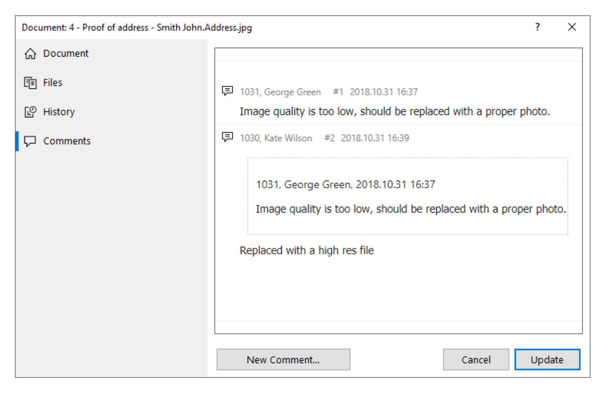

### <span id="page-52-0"></span>**Comments**

This section stores the client history and comments of all managers working with the client. For example, sales managers can keep a call history, and the supervisory department can leave instructions to managers to contact a client if documents are not in order.

Several types of comments are supported for convenience and efficiency: general comments, log records, calls and automatic records. Choose the appropriate type for your messages, and you will be able to easily identify them in general correspondence.

| Client                                               | 1001 - Smith John Murray                                                               |
|------------------------------------------------------|----------------------------------------------------------------------------------------|
|                                                      | ?                                                                                      |
|                                                      |                                                                                        |
| Client                                               |                                                                                        |
| Personal                                             | 1030, Kate Wilson #1 2018.08.24 16:34                                                  |
| Address                                              | 6 Called the client, will come to the office tomorrow to sign contract                 |
| Regulation                                           | 1031, George Green #2 2018.08.24 16:36 Checked passport and registration, all approved |
| Documents                                            |                                                                                        |
|                                                      |                                                                                        |
| Client: 1001 - Smith John Murray - Reply for Comment |                                                                                        |
| Comment                                              | <b>Comment</b><br>Tahoma<br>뎹<br><b>D</b> Comment                                      |
| Log record & Call record                             | 00 佳 涯 重 雪 ┃ ■ @ @<br>∨ Size                                                           |
|                                                      | Called the client, will come to the office tomorrow to sign contract<br>∨              |
| Documents prepared for signing                       | ദി                                                                                     |
|                                                      |                                                                                        |
|                                                      |                                                                                        |
|                                                      |                                                                                        |
|                                                      |                                                                                        |
|                                                      |                                                                                        |
|                                                      |                                                                                        |
|                                                      |                                                                                        |
|                                                      |                                                                                        |
|                                                      | annur avnni murrur                                                                     |
| Save                                                 |                                                                                        |
| Smith John                                           | 1035<br>Smith John                                                                     |
| New Comment                                          | 1036<br>Smith John                                                                     |
| Cancel                                               |                                                                                        |
| Update                                               |                                                                                        |

All comments on [client documents](#page-48-0) are also displayed in this section.

<span id="page-53-0"></span>

### History

For efficient employee performance monitoring and secure storage of information, all changes in client records are tracked and displayed in the Versions section. Version support allows you to see all changes made to the client record. You can revert changes if necessary, since all earlier specified information is stored in the platform.

| Client                                 |    |                                |                                                                |        | 7      | $\times$ |
|----------------------------------------|----|--------------------------------|----------------------------------------------------------------|--------|--------|----------|
| 16 2019.10.17 14:35 1031, George Green |    |                                | 15 2019.10.16 11:20 1031, George Green                         |        |        |          |
|                                        |    |                                | Document Number: 14 2669369                                    |        |        |          |
| Address                                |    | Document Date: 2016.10.16      |                                                                |        |        |          |
|                                        |    |                                | 14 2019.10.15 18:10 1031, George Green                         |        |        |          |
| Regulation                             |    | 13 2019.10.15 18:09            | 1031, George Green                                             |        |        |          |
|                                        |    | External ID: 1249993399        |                                                                |        |        |          |
| <b>Documents</b>                       |    | 12 2019.08.08 15:12            | 1058                                                           |        |        |          |
|                                        |    |                                | Preferred Trading Group: demo\forex-eur                        |        |        |          |
| Comments                               |    | 11 2018.08.24 16:25            | 1000, First Admin                                              |        |        |          |
|                                        |    | Status: Incompleted → Approved |                                                                |        |        |          |
| History                                |    |                                | Compliance Approved by: 1031, George Green → 1000, First Admin |        |        |          |
| Preliminary Trading Accounts           |    |                                | Compliance Approval Date: 2018.08.24 → 2018.08.24              |        |        |          |
|                                        |    | 10 2018.08.24 16:25            | 1000, First Admin                                              |        |        |          |
| 요 1013 Smith John                      |    | 9 2018.08.24 16:22             | 1000, First Admin                                              |        |        |          |
|                                        | 8  | 2018.08.24 16:21               | 1000, First Admin                                              |        |        |          |
| 유 1017 Smith John                      |    | 7 2018.08.08 12:16             | 1023                                                           |        |        |          |
|                                        | 6. | 2018.08.07 16:35               | 1000, First Admin                                              |        |        |          |
| 2e Real Trading Accounts               |    | 5 2018.08.07 16:35             | 1000, First Admin                                              |        |        |          |
|                                        |    | 4 2018.08.06 13:34             | 1017                                                           |        |        |          |
| 의 1029 Smith John                      |    | 3 2018.08.03 14:48             | 1013                                                           |        |        |          |
| 2e Demo Trading Accounts               |    | 2 2018.07.27 14:59             | 1000, First Admin                                              |        |        |          |
|                                        |    | 2018.07.27 13:25               | 1001                                                           |        |        |          |
| 유 1001 John Smith                      |    |                                |                                                                |        |        |          |
|                                        |    |                                |                                                                | Cancel | Update |          |

Information on each change contains the number, date and manager login. To view more details about changes, click on the row. The details show each changed parameter: its name, previous value and new value.

The list of changes can be filtered by the employee who made the changes. Use the Manager field to filter the list.

<span id="page-54-0"></span>

### Trading accounts

This section contains information about the client's trading accounts, including demo, preliminary and real ones.

All accounts in the trading platform are automatically connected to clients. If an existing client opens a demo or preliminary account via the terminal, this account will be immediately added to the appropriate client record. If this is a new client, a new client record will be created, to which the newly opened account will be connected.

Also, this section allows you to [open accounts](#page-184-0) for the client. To do this, select "New Account" in the context menu. The created account will be automatically connected to the client record. To edit an existing account, double-click on it in the list. After that, all account [parameters](#page-189-0) will be shown in the right window part.

Using this menu, you can bind or unbind any other accounts:

- · Click "Link \ By login" in the context menu. After that a new row will be added at the end of the table. Specify here the number of the account to bind.
- · Select an account and click "Unlink" in the context menu. After confirmation, the selected account will no longer be bound to the client and will be removed from the list.

| Client                              | Login                                                                                                                                                                                                                                        | Name       | Group          | Balance      |         |         |           |  |  |
|-------------------------------------|----------------------------------------------------------------------------------------------------------------------------------------------------------------------------------------------------------------------------------------------|------------|----------------|--------------|---------|---------|-----------|--|--|
| Client: 1001 - Smith John Murray    | 1001                                                                                                                                                                                                                                         | John Smith | demo\demoforex | 3 000.00     |         |         |           |  |  |
|                                     | 1002                                                                                                                                                                                                                                         | John Smith | + New          | Ctrl+Shift+N |         |         |           |  |  |
|                                     | 1003                                                                                                                                                                                                                                         | John Smith | REI Edit       | Ctrl+U       |         |         |           |  |  |
|                                     | 1004                                                                                                                                                                                                                                         | John Smith | delete         | Ctrl+D       |         |         |           |  |  |
|                                     | 1005                                                                                                                                                                                                                                         | John Smith | demd           |              |         |         |           |  |  |
|                                     | 1007                                                                                                                                                                                                                                         | John Smith | Link           |              |         |         |           |  |  |
|                                     | 1008                                                                                                                                                                                                                                         | John Smith | Unlink         |              |         |         |           |  |  |
|                                     | 1009                                                                                                                                                                                                                                         | John Smith | Select All     | Ctrl+A       |         |         |           |  |  |
|                                     | 1010                                                                                                                                                                                                                                         | John Smith | Comments       |              |         |         |           |  |  |
|                                     | 1011                                                                                                                                                                                                                                         | John Smith | Copy As        |              |         |         |           |  |  |
|                                     | 1014                                                                                                                                                                                                                                         | John Smith | Export         |              |         |         |           |  |  |
|                                     | 1015                                                                                                                                                                                                                                         | John Smith | Auto Arrange   |              |         |         |           |  |  |
|                                     | 1016                                                                                                                                                                                                                                         | John Smith | Grid           |              |         |         |           |  |  |
| 1001 John Smith                     | 1020                                                                                                                                                                                                                                         | John Smith | dem            |              |         |         |           |  |  |
|                                     | 1021                                                                                                                                                                                                                                         | John Smith | demi           |              |         |         |           |  |  |
| Overview                            |                                                                                                                                                                                                                                              |            |                |              |         |         |           |  |  |
| d Client                            | Personal Account Profile Security                                                                                                                                                                                                            |            |                |              |         |         |           |  |  |
| Personal                            | John Smith, 1010, demo\forex-hedge-usd, 1:100<br>United States, New York, New York, 24 Wall st.<br>+12251325673 MetaQuotes ID: E243E874<br>john@smith.com<br>Registered: 2018.07.27 Last access: 2018.07.27 14:03 Last address: 192.168.1.79 |            |                |              |         |         |           |  |  |
| Symbol                              | Type                                                                                                                                                                                                                                         | Volume     | Price          | S/L          | T/P     | Price   | Profit    |  |  |
| eurusd                              | sell                                                                                                                                                                                                                                         | 1.00       | 1.15808        | 0.00000      | 0.00000 | 1.10444 | 5364.00   |  |  |
| eurusd                              | sell                                                                                                                                                                                                                                         | 1.00       | 1.16189        | 1.17189      | 1.06189 | 1.10444 | 5745.00   |  |  |
| eurusd                              | sell                                                                                                                                                                                                                                         | 1.00       | 1.16067        | 1.17067      | 1.06067 | 1.10444 | 5623.00   |  |  |
| <b>(b) Balance</b> : 996 735.00 USD |                                                                                                                                                                                                                                              |            |                |              |         |         | 16 732.00 |  |  |
| 2e Demo Trading Accounts            |                                                                                                                                                                                                                                              |            |                |              |         |         |           |  |  |

You may use the context menu to export accounts to a file or to change the list view: show/hide columns and grid or enable/disable auto-size of columns.

<span id="page-56-0"></span>

# Automatic KYC checks

The trading platform integration with KYC (Know Your Customer) services enables the validation of client personal data and documents with one click or even in a fully automated mode. Set up connection to an external KYC provider in just a few minutes in order to:

- · Send data and documents for automated verification straight from the client dialog. A detailed report is generated for each verification, which is saved in the client history. Based on the check results, an appropriate status is automatically set for client documents.
- · Configure [automatic data check](#page-60-0) for preliminary account registration. This feature provides the further automation of client onboarding procedures.

[Request trial from Sum & Substance](mailto:metatrader@sumsub.com) to evaluate the KYC procedure benefits.

## Integration Setup

Open the "Integrations — KYC" section and create a new configuration:

| $\times$<br>MetaQuotes - MetaTrader 5 Administrator<br>п                                                                                                                                                                                        |                                                                                                                                                                                                                                                                             |        |      |   |  |  |  |  |  |
|-------------------------------------------------------------------------------------------------------------------------------------------------------------------------------------------------------------------------------------------------|-----------------------------------------------------------------------------------------------------------------------------------------------------------------------------------------------------------------------------------------------------------------------------|--------|------|---|--|--|--|--|--|
| File<br>Edit<br>View<br><b>Services</b>                                                                                                                                                                                                         | Help                                                                                                                                                                                                                                                                        |        |      |   |  |  |  |  |  |
| -X-Disconnect                                                                                                                                                                                                                                   | $\omega$ , Refresh $\circledcirc$ Restart Server $\circledcirc$ Export $\circledcirc$ Import $\circledcirc$ Apply $+$ $\circledcirc$ $\times$<br>$\downarrow_2^A$ Sort $\uparrow$<br>J                                                                                      |        |      |   |  |  |  |  |  |
| Administrator<br>□ 受 Servers                                                                                                                                                                                                                    | <b>Know Your Customer</b>                                                                                                                                                                                                                                                   |        | H    | × |  |  |  |  |  |
| 白… <a> MetaTrader Serve</a>                                                                                                                                                                                                                     | Common<br>Countries Groups                                                                                                                                                                                                                                                  |        |      |   |  |  |  |  |  |
| Network Clus کی ای<br>□ © Integrations<br>$\blacktriangleright$ Finteza A<br>$\hookrightarrow$ vps<br>$\blacksquare$ Mail Serv<br>$\Box$ Messeng<br>$ (2)$ kyc<br>ं ∰ Web Serv<br>由 8 Automations<br><b>⊞</b> ○ Security<br>$\Box$ $\odot$ Time | Please set up Know Your Customer service. You can request the parameters from the<br>⊆∎⊇<br>chosen service provider.<br>Enable<br>SumSub KYC<br>Name:<br>https://sumsub.com<br>Sum & Substance<br>⊙<br>Type:<br>Default KYC provider<br>Provider address:<br>api.sumsub.com |        |      |   |  |  |  |  |  |
| $\Box$ $\mathbb{Q}$ Holidays                                                                                                                                                                                                                    | Token:                                                                                                                                                                                                                                                                      |        |      |   |  |  |  |  |  |
| 中 8 Groups (691)                                                                                                                                                                                                                                | Secret key:<br>                                                                                                                                                                                                                                                             |        |      |   |  |  |  |  |  |
| For Help, press F1                                                                                                                                                                                                                              | Medium check<br>Level name:                                                                                                                                                                                                                                                 |        |      |   |  |  |  |  |  |
|                                                                                                                                                                                                                                                 |                                                                                                                                                                                                                                                                             |        |      |   |  |  |  |  |  |
|                                                                                                                                                                                                                                                 |                                                                                                                                                                                                                                                                             |        |      |   |  |  |  |  |  |
|                                                                                                                                                                                                                                                 | OK                                                                                                                                                                                                                                                                          | Cancel | Help |   |  |  |  |  |  |

Specify the following parameters:

·**Name** — configuration name.

- · **Type** — KYC check service type. Each provider has an individual set of settings. Please request the required settings from the provider. Currently only the [Sum & Substance](https://sumsub.com/) provider is supported. Support for [World-](https://www.refinitiv.com/en/products/world-check-kyc-screening)[Check](https://www.refinitiv.com/en/products/world-check-kyc-screening), [eSpear](https://espear.com/) and other providers will be added soon.
- · **Default KYC provider** — the platform uses this option when [selecting a KYC provider](#page-60-1) to verify client data if verification could not be performed based on group or country settings.

Further settings are provider-dependent. Please request the required parameters from your provider.

#### Sum & Substance

[Sum&Substance](https://sumsub.com/) provides an all-in-one technical and legal toolkit to cover KYC/KYB/AML needs. It is a single powerful platform to convert more customers, speed up the verification processes, reduce costs and detect digital fraud.

To get server access, please fill in the registration form at [https://sumsub.com.](https://sumsub.com) Next, log into the control panel using the provided login and password. The control panel features the required integration data.

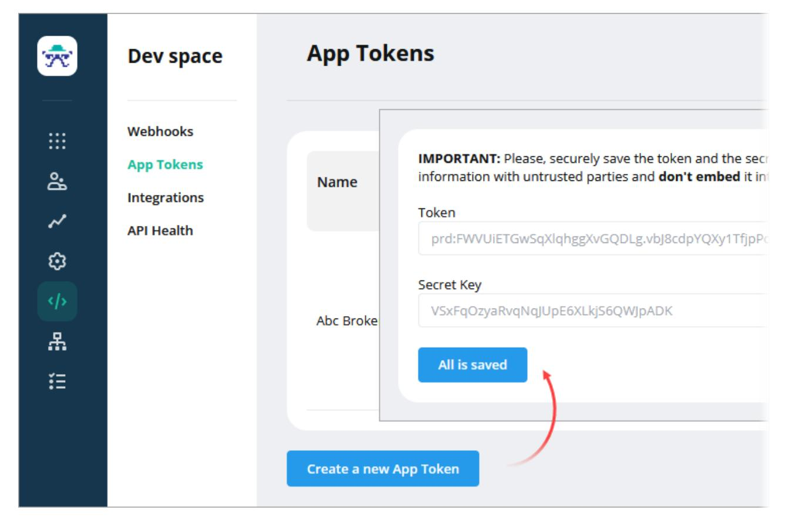

Open the [DevSpace\App Tokens](https://api.sumsub.com/checkus#/devSpace/appTokens) section and add a new application. Add the following permissions for the application: seePersonalData, SeeBgCheckResults, managePersonalData, manageUsers, manageClientSettings, seeStats, seeSensitiveData. After adding the application, you will receive a token and a secret key which you should specify in the provider settings on the MetaTrader 5 side.

Next, create a provider configuration and specify the following parameters:

- · **Provider address** — address for connecting to the service. Default is api.sumsub.com. In most cases, there is no need to change it.
- ·**Token** — token for authorization. The token is available in the [DevSpace](https://api.sumsub.com/checkus#/devSpace/appTokens) section of the control panel.
- · **Secret key** — a secret key for authorization. The secret key is available in the [DevSpace](https://api.sumsub.com/checkus#/devSpace/appTokens) section of the control panel.

<span id="page-58-0"></span>In the "Level name" parameter, specify the name of the setting which defines your client verification process.

| Label                                                                      | Value                                                                                                                                                                                                                                                                                                                                                                                                                                                                                                                                                                                                                                                                                                                 |                 |                  |                |                                                                            |                    |                                                                         |                                                                            |                 |            |                   |   |                        |              |        |   |              |
|----------------------------------------------------------------------------|-----------------------------------------------------------------------------------------------------------------------------------------------------------------------------------------------------------------------------------------------------------------------------------------------------------------------------------------------------------------------------------------------------------------------------------------------------------------------------------------------------------------------------------------------------------------------------------------------------------------------------------------------------------------------------------------------------------------------|-----------------|------------------|----------------|----------------------------------------------------------------------------|--------------------|-------------------------------------------------------------------------|----------------------------------------------------------------------------|-----------------|------------|-------------------|---|------------------------|--------------|--------|---|--------------|
| Integrations                                                               | <table> <tr> <td>Global Settings</td> </tr> <tr> <td>SDK Translations</td> </tr> <tr> <td>Questionnaires</td> </tr> <tr> <td>Applicant Levels</td> </tr> <tr> <td>Verification Flows</td> </tr> </table>                                                                                                                                                                                                                                                                                                                                                                                                                                                                                                              | Global Settings | SDK Translations | Questionnaires | Applicant Levels                                                           | Verification Flows |                                                                         |                                                                            |                 |            |                   |   |                        |              |        |   |              |
| Global Settings                                                            |                                                                                                                                                                                                                                                                                                                                                                                                                                                                                                                                                                                                                                                                                                                       |                 |                  |                |                                                                            |                    |                                                                         |                                                                            |                 |            |                   |   |                        |              |        |   |              |
| SDK Translations                                                           |                                                                                                                                                                                                                                                                                                                                                                                                                                                                                                                                                                                                                                                                                                                       |                 |                  |                |                                                                            |                    |                                                                         |                                                                            |                 |            |                   |   |                        |              |        |   |              |
| Questionnaires                                                             |                                                                                                                                                                                                                                                                                                                                                                                                                                                                                                                                                                                                                                                                                                                       |                 |                  |                |                                                                            |                    |                                                                         |                                                                            |                 |            |                   |   |                        |              |        |   |              |
| Applicant Levels                                                           |                                                                                                                                                                                                                                                                                                                                                                                                                                                                                                                                                                                                                                                                                                                       |                 |                  |                |                                                                            |                    |                                                                         |                                                                            |                 |            |                   |   |                        |              |        |   |              |
| Verification Flows                                                         |                                                                                                                                                                                                                                                                                                                                                                                                                                                                                                                                                                                                                                                                                                                       |                 |                  |                |                                                                            |                    |                                                                         |                                                                            |                 |            |                   |   |                        |              |        |   |              |
| Applicant Levels                                                           | <table> <tr> <td>1</td> </tr> <tr> <td>Level name</td> </tr> <tr> <td>1</td> </tr> <tr> <td>Note that once you create a level, you will not be able to change its name</td> </tr> <tr> <td>Required steps</td> </tr> <tr> <td>Here, you should set up the steps that are required from your customers</td> </tr> <tr> <td>Please note that the order of these steps is important, as it defines your</td> </tr> <tr> <td>Driving license</td> </tr> <tr> <td>Passport *</td> </tr> <tr> <td>Identity Document</td> </tr> <tr> <td></td> </tr> <tr> <td>Selfie with a document</td> </tr> <tr> <td>Selfie Type:</td> </tr> <tr> <td>Selfie</td> </tr> <tr> <td></td> </tr> <tr> <td>Add new step</td> </tr> </table> | 1               | Level name       | 1              | Note that once you create a level, you will not be able to change its name | Required steps     | Here, you should set up the steps that are required from your customers | Please note that the order of these steps is important, as it defines your | Driving license | Passport * | Identity Document |  | Selfie with a document | Selfie Type: | Selfie |  | Add new step |
| 1                                                                          |                                                                                                                                                                                                                                                                                                                                                                                                                                                                                                                                                                                                                                                                                                                       |                 |                  |                |                                                                            |                    |                                                                         |                                                                            |                 |            |                   |   |                        |              |        |   |              |
| Level name                                                                 |                                                                                                                                                                                                                                                                                                                                                                                                                                                                                                                                                                                                                                                                                                                       |                 |                  |                |                                                                            |                    |                                                                         |                                                                            |                 |            |                   |   |                        |              |        |   |              |
| 1                                                                          |                                                                                                                                                                                                                                                                                                                                                                                                                                                                                                                                                                                                                                                                                                                       |                 |                  |                |                                                                            |                    |                                                                         |                                                                            |                 |            |                   |   |                        |              |        |   |              |
| Note that once you create a level, you will not be able to change its name |                                                                                                                                                                                                                                                                                                                                                                                                                                                                                                                                                                                                                                                                                                                       |                 |                  |                |                                                                            |                    |                                                                         |                                                                            |                 |            |                   |   |                        |              |        |   |              |
| Required steps                                                             |                                                                                                                                                                                                                                                                                                                                                                                                                                                                                                                                                                                                                                                                                                                       |                 |                  |                |                                                                            |                    |                                                                         |                                                                            |                 |            |                   |   |                        |              |        |   |              |
| Here, you should set up the steps that are required from your customers    |                                                                                                                                                                                                                                                                                                                                                                                                                                                                                                                                                                                                                                                                                                                       |                 |                  |                |                                                                            |                    |                                                                         |                                                                            |                 |            |                   |   |                        |              |        |   |              |
| Please note that the order of these steps is important, as it defines your |                                                                                                                                                                                                                                                                                                                                                                                                                                                                                                                                                                                                                                                                                                                       |                 |                  |                |                                                                            |                    |                                                                         |                                                                            |                 |            |                   |   |                        |              |        |   |              |
| Driving license                                                            |                                                                                                                                                                                                                                                                                                                                                                                                                                                                                                                                                                                                                                                                                                                       |                 |                  |                |                                                                            |                    |                                                                         |                                                                            |                 |            |                   |   |                        |              |        |   |              |
| Passport *                                                                 |                                                                                                                                                                                                                                                                                                                                                                                                                                                                                                                                                                                                                                                                                                                       |                 |                  |                |                                                                            |                    |                                                                         |                                                                            |                 |            |                   |   |                        |              |        |   |              |
| Identity Document                                                          |                                                                                                                                                                                                                                                                                                                                                                                                                                                                                                                                                                                                                                                                                                                       |                 |                  |                |                                                                            |                    |                                                                         |                                                                            |                 |            |                   |   |                        |              |        |   |              |
|                                                                           |                                                                                                                                                                                                                                                                                                                                                                                                                                                                                                                                                                                                                                                                                                                       |                 |                  |                |                                                                            |                    |                                                                         |                                                                            |                 |            |                   |   |                        |              |        |   |              |
| Selfie with a document                                                     |                                                                                                                                                                                                                                                                                                                                                                                                                                                                                                                                                                                                                                                                                                                       |                 |                  |                |                                                                            |                    |                                                                         |                                                                            |                 |            |                   |   |                        |              |        |   |              |
| Selfie Type:                                                               |                                                                                                                                                                                                                                                                                                                                                                                                                                                                                                                                                                                                                                                                                                                       |                 |                  |                |                                                                            |                    |                                                                         |                                                                            |                 |            |                   |   |                        |              |        |   |              |
| Selfie                                                                     |                                                                                                                                                                                                                                                                                                                                                                                                                                                                                                                                                                                                                                                                                                                       |                 |                  |                |                                                                            |                    |                                                                         |                                                                            |                 |            |                   |   |                        |              |        |   |              |
|                                                                           |                                                                                                                                                                                                                                                                                                                                                                                                                                                                                                                                                                                                                                                                                                                       |                 |                  |                |                                                                            |                    |                                                                         |                                                                            |                 |            |                   |   |                        |              |        |   |              |
| Add new step                                                               |                                                                                                                                                                                                                                                                                                                                                                                                                                                                                                                                                                                                                                                                                                                       |                 |                  |                |                                                                            |                    |                                                                         |                                                                            |                 |            |                   |   |                        |              |        |   |              |

Sum & Substance allows the customization of the number of steps which the user must complete in order to obtain the verified status, as well as of the set of required documents and other parameters. This procedure is called the Verification Level.

You can use different levels depending on certain conditions. For example, you can set soft verification for safer regions. Pre-configure verification levels in the Sum & Substance control panel and create several KYC configurations on the MetaTrader 5 side. Specify in the configurations specific verification levels and define the list of countries for which they will be used.

For further details about how to set up verification levels please view the [Sum & Substance documentation.](https://help.sumsub.com/articles/57128-customizing-verification-levels-and-flows)

<span id="page-59-0"></span>

## Countries

Specify the list of countries, for which this KYC provider will be used, for manualand for [automatic](#page-60-0) checks. Use of different providers ensures the best verification conditions for clients from different regions. You can also [adjust](#page-58-0) [the verification process](#page-58-0) depending on the country.

| Know Your Customer                                                                                |        |        |   |
|---------------------------------------------------------------------------------------------------|--------|--------|---|
| Countries                                                                                         | Groups |        |   |
| Common                                                                                            |        |        |   |
| Please specify countries the KYC provider will be used for. Empty list means all countries.<br>رگ |        |        |   |
| Country                                                                                           |        |        |   |
| ● Russia                                                                                          |        |        |   |
| ● Georgia                                                                                         |        |        |   |
| ● Ukraine                                                                                         |        |        |   |
| ● Belarus                                                                                         |        |        |   |
| Add                                                                                               | Edit   | Delete |   |
| OK                                                                                                | Cancel | Help   | w |

If no country is specified, the platform will use this provider for clients from any country.

When opening a demo account, the country is determined automatically on the client terminal side. When opening a preliminary account, the country is also detected automatically, but the client can specify another country in the registration form.

<span id="page-59-1"></span>

#### Groups

Specify the list of client groups, for which this KYC provider will be used, for manualand for [automatic](#page-60-0) checks. Thus, you can organize work with your White Labels. Your affiliates can select preferred providers and pay for their services.

| <b>Know Your Customer</b> |           |                                                                                                                                                                                                      |      | × |
|---------------------------|-----------|------------------------------------------------------------------------------------------------------------------------------------------------------------------------------------------------------|------|---|
| Common                    | Countries | Groups                                                                                                                                                                                               |      |   |
|                           |           | Please specify the client groups that will be checked using KYC provider. For example, you<br>can have different providers for groups belonging to each White Label. Empty list means<br>all groups. |      |   |
|                           |           | Group<br>& preliminary*                                                                                                                                                                              |      |   |
|                           |           |                                                                                                                                                                                                      |      |   |
|                           |           |                                                                                                                                                                                                      |      |   |
|                           |           |                                                                                                                                                                                                      |      |   |
| Add                       |           |                                                                                                                                                                                                      |      |   |
| Edit                      |           |                                                                                                                                                                                                      |      |   |
| <b>Delete</b>             |           |                                                                                                                                                                                                      |      |   |
|                           | <b>OK</b> | Cancel                                                                                                                                                                                               | Help | u |

<span id="page-60-1"></span>

#### How the provider is selected

- ·The system checks the client group and country
- · The provider located higher in the list is selected from all providers, which meet the [country](#page-59-0) and [group](#page-59-1) conditions
- · If none of the providers is suitable, the default provider is utilized (as set by the "Default KYC provider" option in common settings)

<span id="page-60-0"></span>

#### Documents request from terminals and automatic verification

The KYC integration enables complete automation of client onboarding procedures.

[Live accounts](#page-17-0) can be requested from desktop and mobile terminals. Configure the registration form to request supporting documents from clients during registration. This can be done by enabling the "Require identity and proof of address documents" option under account allocation section.

|              | ?<br>Account allocation group                                                                                                                          |            |                                    |  |           |  |
|--------------|--------------------------------------------------------------------------------------------------------------------------------------------------------|------------|------------------------------------|--|-----------|--|
|              | Please specify a company and a group with description. This group will be available for opening accounts from the client<br>terminals of this company. |            |                                    |  |           |  |
| Company:     | Default<br>$\checkmark$                                                                                                                                |            |                                    |  |           |  |
| Group:       | preliminary-usd<br>$\checkmark$                                                                                                                        |            |                                    |  |           |  |
| Description: | Real USD                                                                                                                                               |            |                                    |  |           |  |
| Leverages:   | 100, 50, 25, 10, 5, 2, 1                                                                                                                               |            |                                    |  |           |  |
| Countries:   | All countries                                                                                                                                          |            |                                    |  |           |  |
|              | $\sqrt{}$ Require identity and proof of address documents                                                                                              |            |                                    |  |           |  |
|              | $\vee$ Use advanced registration form                                                                                                                  |            |                                    |  |           |  |
| Confirm:     | Phone & Email<br>$\check{ }$                                                                                                                           |            |                                    |  |           |  |
|              |                                                                                                                                                        |            |                                    |  |           |  |
| Mail server: | Default                                                                                                                                                |            |                                    |  |           |  |
| Agreements:  | Agreement                                                                                                                                              | <b>URL</b> |                                    |  | Mandatory |  |
|              | ab Client agreement                                                                                                                                    |            | https://abcbroker.com/legal/client |  | ✓         |  |
|              | ab Risk disclosure                                                                                                                                     |            | https://abcbroker.com/legal/risk   |  | ☑         |  |
|              |                                                                                                                                                        |            |                                    |  |           |  |

Enable the option "Start KYC check automatically". Once a preliminary account is opened and linked to a client, appropriate client data and documents will be automatically sent to the KYC service for verification. After the check, the system provides a report which can be viewed under the client comments section. If the option is disabled, you can send the data manually through the client's personal data section.

See also: [Articles / Enable automated KYC verification in MetaTrader 5](https://support.metaquotes.net/en/articles/988)

<span id="page-62-0"></span>

# Common errors

- ·Do not disable the registration of demo accounts via client terminals. This feature brings in leads.
- · Do not disable the ability to request real accounts from client terminals. By simplifying the client onboarding procedures, you increase conversions.
- · Do not use only one SMS provider to verify phone numbers. We recommend configuring at least two providers to ensure the delivery of confirmation codes, so that you do not lose traders during registration due to undelivered SMS.

<span id="page-63-0"></span>

# Communication with traders

Reach your clients directly, convert demo accounts into real ones, and keep your clients connected and up to date. Offer them the best customer service experience and increase deposits using built-in communication channels in MetaTrader 5.

It is a fact that the brokerage industry has become more competitive than ever. Brokers can no longer rely only on the trading technology and trading conditions in their offerings. Now, the success of a brokerage company depends even more on their clients' loyalty and trust.

This trust can be gained through communication and transparency, which can be achieved through direct communication with the client.

The MetaTrader 5 already features built-in and ready-to-use communication solutions for your specific brokerage business needs:

- · Internal mail. Reach your traders directly via client terminals. You can deliver information even when you do not have valid contact details.
- · Email. Integrate with mail servers and send emails to your traders directly through manager terminals, without using third-party email clients. Furthermore, the integration enables confirmation of email addresses during registration.
- · Push notifications provide a modern alternative to SMS. Messages are delivered to traders' mobile devices via the Internet.
- · Welcome emails. During account opening, the traders automatically receive messages with connection details and useful information. Customize these emails to send the relevant information to your clients.
- · SMS. The SMS functionality can be used for the instant verification of clients' mobile numbers upon new account opening, as well as for sending custom SMS to your clients.
- ·Chat. Offer customer support straight in client terminals via the built-in Chat service.
- ·Company website. Advertise your services and publish information in the frequently visited terminal area.

See also: [Articles / All-in-one communication channels in MetaTrader 5](https://support.metaquotes.net/en/articles/993)

<span id="page-64-0"></span>

# Internal mailing system and emails

Using the internal mailing system, you can deliver any information to your traders: new service promotions, important announcement and so on. To deliver the information you do not need the treader's contact information. Internal mailing system is built into desktop and mobile terminals.

The message will not stay unnoticed: all mails are displayed right in the terminal and are accompanied with sound alerts. The mailing system provides an efficient feedback channel: the trader can reply to mails and request further details.

When using the platform, you can easily send emails to traders without having to launch an external email client.

To send an email, select "Internal mail/Email" in the account menu. For bulk mailing, you can first select all the required account in the list. Their logins will be included in the "To" field.

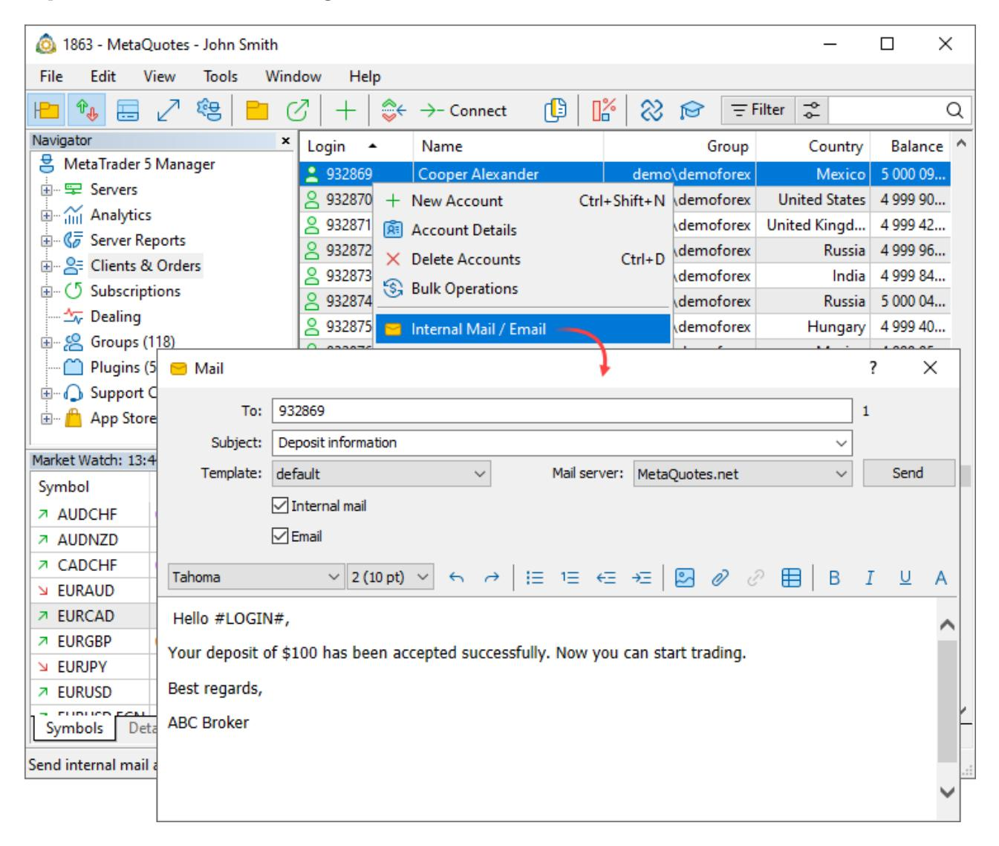

Fill in the following fields in the email:

- · **To** — account number of the email recipient. The terminal allows [sending emails to multiple clients](#page-65-0) [simultaneously](#page-65-0).
- ·**Subject** — email subject.
- · **Template** — any email can be saved as a [template](#page-66-0) using the context menu. For example, you can save a typical maintenance work email as a template. To get a ready-made email afterwards, simply select the template in this field.
- ·**Internal mail** — select this option to send a message using the internal mailing system.
- · **Email** — use this option to send an email. The address specified in [account personal data](#page-189-0) will be used. Please note:
  - · A mail server must be configured in the platform to enable email sending. If the function is not available, please contact your platform administrator.
  - · Messages sent by email are not displayed under the "Toolbox \ Mail" section. To check the sending status, select your server in the Navigator and go to the Journal section. If an email has been sent successfully, the recipient address and the configuration name of the mail server through which the email has been sent, are shown in the log: email to someaddress@mail.net sent [MailServer].

By selecting on the toolbar, you can attach a file. Please mind the following attachment restrictions:

- ·One file size should not exceed 8 MB
- ·The total size of attachments should not exceed 16 MB
- ·Up to five files can be attached

To enable the emailing features, the relevant mailbox name must be specified in the manager account on the trade server. Also, the manager should have sufficient permissions. Contact the platform administrator to configure the account.

The mail text editor provides commands for creating lists and inserting images, links and tables. To view or edit the source HTML code of the message, select on the toolbar.

The context menu of the text editing window contains standard commands for working with the text: Copy, Cut, Paste, Insert Hyperlink, Insert Table and Insert Image. From the context menu, you can also work with email [templates](#page-66-0) and [macros](#page-66-1).

<span id="page-65-0"></span>

### Bulk mailing

The manager terminal allows you to send messages to groups of users. The list of users is specified in the "To" field of the email.

·**Multiple Logins** — specify several usernames separated by a comma. For example, 1000, 1001, 1002.

- · **Range of Logins** — send mails to a range of logins, specify the start and end logins of the range through a hyphen. For example, 1000-9000.
- · **Group of Accounts** — to send mails to a certain group, specify the following construction: "group:group name". For example, to send emails to the demoforex group, specify group:demoforex in the "To" field. You can also specify several groups, separated separating them by commas.
- · **Country of Residence** — emails can be sent to traders from a certain country. To do this, specify the following construction: "country:country name" in the "To" field. For example, to send mails to all clients who live in Russia, specify country:Russia. You can also specify several countries, separated by commas.
- · **City of Residence —** to send mails to clients from certain cities, specify "city:city name". You can specify several cities separated by commas.

In the "To" field, you can specify several delivery parameters separated by a semi colon (;). In this case the email will be sent to all the clients who match at least one of the specified parameters. For example, if you specify "group:demoforex, managers; city:Moscow; 1000-2000", emails will be sent to all clients from 'demoforex' and 'managers' groups, all clients who live in Moscow and to all of the clients from the accounts range from 1000 to 2000 inclusive.

When specifying the mailing parameters, you can use the negation sign "!". It allows excluding some of clients from mailing by a certain parameter. For example, if you specify "group:!managers", then messages will be sent to all the users except the ones who belong to the managers group.

When sending an email, the system checks whether there are any clients with the specified delivery parameters. If there are no such clients, the email will not be sent. In this case a corresponding message will appear in the journal.

<span id="page-66-0"></span>

#### Templates

To make working with email easier, use pre-configured email templates. The templates are HTML files which contain macros and enable email customization to address each recipient.

Use the email creation window context menu to work with templates.

All email templates are stored in the /templates/mail folder of the Manager terminal.

<span id="page-66-1"></span>

#### Macros

Using the Macros submenu of the context menu of the email creation window, you can insert macros in the text. They allow substituting different data depending on the email recipient.

- ·Login (#LOGIN#) — email/message recipient's account number.
- ·Name (#USERNAME#) — recipient's first and last name.
- ·Currency (#USER\_CURRENCY#) — recipient's deposit currency.

- ·Balance (#USER\_BALANCE#) — recipient's balance.
- ·Credit (#USER\_CREDIT#) — credit funds on the recipient's account.
- ·Equity (#USER\_EQUITY#) — equity on the recipient's account.
- ·Leverage (#USER\_LEVERAGE#) — account leverage.
- ·Margin (#USER\_MARGIN#) — reserved margin on the recipient's account.
- ·Free margin (#USER\_MARGIN\_FREE#) — free margin on the recipient's account.
- ·Margin level (#USER\_MARGIN\_LEVEL#) — margin level.

The following macros substitute email sending time in the message text:

- ·Trading time — internal platform time.
- ·Local time — time used in the computer on which the platform is installed.
- ·UTC time — [UTC](https://ru.wikipedia.org/wiki/%D0%92%D1%81%D0%B5%D0%BC%D0%B8%D1%80%D0%BD%D0%BE%D0%B5_%D0%BA%D0%BE%D0%BE%D1%80%D0%B4%D0%B8%D0%BD%D0%B8%D1%80%D0%BE%D0%B2%D0%B0%D0%BD%D0%BD%D0%BE%D0%B5_%D0%B2%D1%80%D0%B5%D0%BC%D1%8F)time.

#### Email history

The email sending history is displayed in the Toolbox \ Mailbox tab:

| Label                              | Value                                                                              |
|------------------------------------|------------------------------------------------------------------------------------|
| Subject                            | Trading championship 2021                                                          |
| From                               | John Murray Smith                                                                  |
| To                                 | Administrator                                                                      |
| Time                               | 2021.08.12 17:36                                                                   |
| Help with switching to ECN account | John Murray Smith                                                                  |
| From                               | 1083, John Murray Smith                                                            |
| Date                               | 2021.08.12 17:36                                                                   |
| Subject                            | Help with switching to ECN account                                                 |
| Attachment                         | 2 Attachment                                                                       |
| Bonus program                      | ∽<br>← Welcome to Forex<br>Exposure<br>Summary                                     |
| Additional info                    |                                                                                    |
|                                    | Hello,                                                                             |
|                                    | Can you please help me to switch to an ECN account? I want to try it.<br>Thank you |

Emails are stored on the trade server. If an email is deleted from the terminal interface, it will not be redownloaded. However, if you delete the terminal email base (the file /bases/server\_name/mail/mailaccount\_number.dat) or connect using another terminal, all the emails for the last 30 days will be downloaded again.

# Attachment directory

To conveniently work with the files that you send by email, create an attachment directory in Manager terminal settings.

| Server:                                    | Broker-Demo   |
|--------------------------------------------|---------------|
| Login:                                     | 1000          |
| Password:                                  | ••••••••      |
| Enable proxy server                        |               |
| Keep personal settings and data at startup |               |
| Hide online users                          |               |
| Enable news                                |               |
| News languages:                            | Auto select   |
| Save files to:                             | D:\nDownloads |
|                                            |               |
|                                            |               |
|                                            |               |
|                                            |               |
|                                            |               |
| Cancel                                     | <b>OK</b>     |
| Help                                       |               |

When you open an attachment, the terminal checks its extension and verifies whether the file contents match this extension. If the file type is allowed and its contents have been successfully validated, the terminal will open the file and save it to the specified directory. Otherwise, a warning will be displayed, notifying that the file may harm the computer, and the file will not be saved. The following file types are allowed: PNG, JPG/JPEG, BMP, ZIP, 7Z, GIF, DOC, XLS, DOCX, XSLX, ODT, RTF, CSV, TXT, LOG.

If a file with the same name and a different content exists in the directory, the manager's login and email arrival date/time up to a second will be added to the saved file name: [login]-[file name]-[date and time].[extension]. For example, the log file 20170501.log will be saved as 1001-20170501-20170502-170038.log.

By default, files are saved to C:\Users\[Windows username]\Downloads\MetaTrader. You can change the default directory by selecting Overview.

<span id="page-69-0"></span>

# Push notifications and SMS

The MetaTrader 5 platform provides fast and efficient tools for sending important information to your traders, for example for sending server operation news or real account opening offers. You can send push notifications or SMS to mobile devices straight from the Manager terminal.

## How to send push notifications

Push notifications are personal messages sent over the Internet, independent of a mobile phone number or carrier. Messages are delivered instantly to MetaTrader 5 mobile terminals. There is no need to keep the application running.

Messages are sent based on MetaQuotes ID, which is a unique user identifier. To obtain this number, the user should install the [MetaTrader 5 mobile terminal](#page-115-0)for iPhone or Android.

Push notifications can be sent directly from Manager terminals.

|                                                   | Notification      |                                                                                                                |              |                        | 7                            | ×               |            |
|---------------------------------------------------|-------------------|----------------------------------------------------------------------------------------------------------------|--------------|------------------------|------------------------------|-----------------|------------|
| 1863 - MetaQuotes - John                          |                   | Sending internal push notification and/or SMS. You can specify several MetaQuotes IDs<br>separated by a comma. |              |                        |                              |                 | $$        |
| Edit<br>File<br>View<br>Tools                     | Send by:          | Login<br>$024;$                                                                                               |              |                        |                              |                 |            |
| Ŧ                                                 | Recipients:       | 884174                                                                                                         |              |                        | 1                            |                 | Q          |
| Market Watch: 14:47:16                            | Sender name:      | <b>ABC Broker</b>                                                                                              |              |                        |                              |                 | $ice^{;}$ |
| Bid<br>Symbol                                     |                   | Internal push notification by MetaQuotes ID                                                                    |              |                        |                              |                 | 6          |
| 0.65399<br>AUDCHF<br>0.6                          |                   | $C7; ; {S}$ SMS                                                                                              |              |                        |                              |                 | 4          |
| AUDNZD<br>1.05335<br>1.0                          |                   |                                                                                                                |              |                        |                              |                 | 6          |
| 0.71626<br>0.7<br><b>N</b> CADCHF                 | Hello.            | New trading competition starts on September 1st. Please don't forget to register.                              |              |                        |                              |                 | 7          |
| 1.58927<br><b>7 EURAUD</b><br>1.5                 |                   |                                                                                                                |              |                        |                              |                 | 4          |
| Details<br>Ticks<br>Symbols                       |                   |                                                                                                                |              |                        |                              |                 | 7          |
| Navigator                                         |                   |                                                                                                                |              |                        |                              |                 | O          |
| MetaTrader 5 Manager                              |                   |                                                                                                                |              |                        |                              |                 | 7          |
| 由------------------------------------             |                   | Send                                                                                                           | Cancel       |                        |                              |                 | 2          |
| in analytics                                      |                   |                                                                                                                |              |                        |                              | .::17           |            |
| <b>E-C</b> Server Reports                         | 284174            | Dichardcon Michael<br>+ New Account                                                                            |              | domp\demoforex         | Saudi Arabia                 | 5 003 64.       |            |
| 由 ·· Q= Clients & Orders                          | 88411<br>রি       |                                                                                                                | Ctrl+Shift+N | b\demoforex            | Mexico                       | 4 999 95        |            |
| 面 - 〇 Subscriptions                               | ౭<br>88411        | <b>REL Account Details</b>                                                                                     |              | b\demoforex            | Denmark                      | 4 9 9 96        |            |
| $- ; BD; DF;/VAF;V_{V}$ Dealing               | రి<br>8841        | $	imes$ Delete Accounts                                                                                        |              | $Ctrl + D$ b\demoforex | Japan                        | 4 9 9 9 9 7     |            |
| 由 · S Groups (118)                                | ౭<br>8841         | S. Bulk Operations                                                                                             |              |                        | b\demoforex   Czech Republic | 5 000 81        |            |
| Plugins (5)                                       | ౭<br>8841         |                                                                                                                |              | b\demoforex            | Ukraine                      | 4 9 9 9 9 3     |            |
| <b>E</b> O Support Center                         | 88418<br>ዳ        | Internal Mail / Email                                                                                          |              | b\demoforex            | Japan                        | 4 9 9 9 9 8     |            |
| □ <b>■ App Store</b>                              | 00.444<br>Clients | <b>Push Notification / SMS</b>                                                                                 |              | Positions: 35 817      | Orders: 8 002                | Loop of         |            |
| Send internal push notification and/or SMS to the |                   | <b>EE</b> Journal                                                                                              |              |                        |                              | ill 725 / 18 Kb |            |
|                                                   |                   | <b>Balances</b>                                                                                                |              |                        |                              |                 |            |

Select "Push notification / SMS" in the account context menu. An analogous command is available in the account editing dialog. Specify a comma separated list of logins or MetaQuotes IDs and the message text.

You can specify logins as ranges, for example: 1000-2000. Optionally, you can select the required accounts in the list and proceed to email sending. A list of logins for sending will be generated automatically. To enable sending by login number, make sure [MetaQuotes ID](#page-189-0) is specified for the relevant accounts.

Next, enter the message text and click "Send". The maximum message length is limited to 255 characters.

The sending mode affects the automatic signature in push notifications:

- · If you send messages specifying logins, the signature will contain owner company name from the settings of the group to which the accounts belong. Use this type for White Labels, to add the correct company name in the signature.
- ·If MetaQuotes IDs are used, the company name from the Server License will be specified in the signature.

Clients will immediately receive the notifications on their mobile devices. Broker's push notifications appear in the special category of the Messages section in the mobile trading platform:

| Label                                                                                                                                                | Value                                                                                        |
|------------------------------------------------------------------------------------------------------------------------------------------------------|----------------------------------------------------------------------------------------------|
| John Smith                                                                                                                                           |                                                                                              |
| Search for messages or chats                                                                                                                         |                                                                                              |
| 1814514 - Joe Black                                                                                                                                  | 'NBW 2D': synchronized with #100292479<br>buy 1.00 EURUSD 1.23087, #100292657 sell           |
| 15:09                                                                                                                                                |                                                                                              |
| ABC Broker                                                                                                                                           | Hello,<br>Please note, that we will perform maintenance                                      |
| 14:48                                                                                                                                                |                                                                                              |
| April 24                                                                                                                                             |                                                                                              |
| Traders                                                                                                                                              | Канал доступен на mql5.com!                                                                  |
| 10:52                                                                                                                                                | Hello,                                                                                       |
| New trading competition starts on September 1st.<br>Please don't forget to register.                                                                 |                                                                                              |
| Signals                                                                                                                                              | New subscription NBW 2D for account<br>1814514: https://www.mql5.com/en/signals/             |
| Yesterday                                                                                                                                            | Best regards,<br><b>ABC Broker</b>                                                           |
| 15:14                                                                                                                                                |                                                                                              |
| U                                                                                                                                                    | Market<br>Japanese Candlesticks, 0/5 activated:<br>https://www.mql5.com/en/users/alex/mar    |
| Yesterday                                                                                                                                            | Hello,                                                                                       |
| Please note, that we will perform maintenance works<br>on our trade server on Sunday, June 15th, 3:00 to<br>4:00. The servers will not be available. |                                                                                              |
| MQL5                                                                                                                                                 | Profile<br>MQL5.com authorization from '48.14.185.58'.<br>NL (Firefox 59, Windows 10) failed |
| Yesterday                                                                                                                                            |                                                                                              |
| We apologize for inconvenience.                                                                                                                      |                                                                                              |
|                                                                                                                                                      |                                                                                              |
| My MetaQuotes ID: 97B7DEC1                                                                                                                           |                                                                                              |
|                                                                                                                                                      |                                                                                              |

See also: [Articles / How to get rid of SMS messages? Use MetaTrader 5 push notifications!](https://support.metaquotes.net/en/articles/436) 

## Automatic linking of MetaQuotes IDs to accounts

As soon as the trader connects to a trading account, the MetaQuotes ID from their terminal is automatically added to the account on the server side. This works for both desktop and mobile terminals. Thus, the broker will not need to collect this data manually.

#### How to send SMS

Similarly to push notifications, SMS can be sent to traders directly through the Manager terminal.

Select "Push notification / SMS" in the account context menu, then specify logins and enter the SMS text. The message will be sent to the phone number indicated in [account personal data](#page-190-0).

Some SMS providers support the specification of the message sender name. In this case, the receiver will see the company name instead of the phone number. Contact your platform administrator to find out whether this feature is supported by your provider. If it is, fill in the appropriate field when sending an SMS.

The SMS sending option requires a properly configured list of providers available on the trade server. If the function is not available, please contact your platform administrator.

<span id="page-72-0"></span>

# Welcome emails

During account opening, the platform automatically sends to the trader a message via the internal mail system. The email contains the account number and password, as well as general information about the MetaTrader 5 platform.

Customize standard welcome emails by adding your brand logo and information about your services. This is a great place for your promotions: every trader receives the emails, they are displayed in the terminal working area, while the trader receives an audio notification when the email is received.

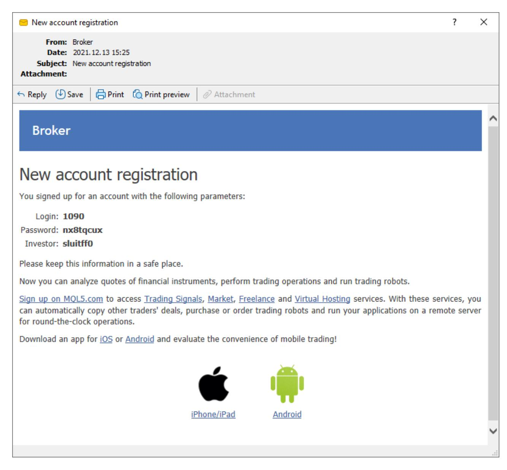

The welcome email templates are located in the following directories:

- · **[trade server directory]\templates\greeting\default\\*.htm** — default demo account opening email templates used for all groups.
- · **[trade server directory]\templates\greeting\***custom folder***\\*.htm** — demo account opening email templates, which are sent only to individual account groups in accordance with their settings.
- · **[trade server directory]\templates\greeting\preliminary\\*.htm** — email templates that are sent to the trader when they open a [preliminary account](#page-17-0) from the client terminal.

Template files are named in accordance with the applicable languages. For example, english.htm for English or arabic.htm for Arabic. The sent email language is determined by the client terminal settings.

You can customize these files, but keep in mind the following recommendations:

- · Do not remove information about the login and password of the newly opened account, as this is the only way the traders can receive this data.
- ·You can use [macros](#page-74-0) in emails.
- ·All templates must be in the Unicode encoding (UTF-16/UCS-2 Little Endian).

To activate new email templates, you should restart the main trading server.

The emails are sent regardless of whether the trader opens the account via the client terminal, or the broker opens the account via the Manager or Administrator terminal.

### Different emails for different groups

You can configure different emails for different client groups. This function can be especially useful when working with White Labels, as they will be able to use their own branded messages and assign traders to their managers or support specialists.

Create a separate subdirectory for emails under [server directory]\templates\greeting\. For example, "abcpartner". Move specific White Label templates to this directory.

Next, specify the name of the created directory in the settings of the client groups managed by the White Label.

| Group  |                   |                                                                                                         |                                                 |        |         |                     |        |      | ×  |
|--------|-------------------|---------------------------------------------------------------------------------------------------------|-------------------------------------------------|--------|---------|---------------------|--------|------|----|
| Common | Company           | News & Mail                                                                                             | Permissions                                     | Margin | Symbols | Commissions Reports |        |      |    |
|        |                   | Please specify details of the group servicing company and the folder with mail and<br>report templates. |                                                 |        |         |                     |        |      |    |
|        | Company:          | <b>ABC Partner</b>                                                                                      |                                                 |        |         |                     |        |      |    |
|        | Company site:     | abcbroker.com                                                                                           |                                                 |        |         |                     |        |      |    |
|        | Company email:    |                                                                                                         | contact@abcbroker.com                           |        |         |                     |        |      |    |
|        | Deposit site:     | abcbroker.com/deposit                                                                                   |                                                 |        |         |                     |        |      |    |
|        | Withdrawal site:  |                                                                                                         | abcbroker.com/withdraw                          |        |         |                     |        |      |    |
|        | Support site:     |                                                                                                         | https://www.abcbroker.com/[lang:en ru es pt zh] |        |         |                     |        |      |    |
|        | Support email:    |                                                                                                         | support@abcbroker.com                           |        |         |                     |        |      |    |
|        | Templates folder: | abcpartner                                                                                              |                                                 |        |         |                     |        |      |    |
|        |                   |                                                                                                         |                                                 |        |         |                     |        |      |    |
|        |                   |                                                                                                         |                                                 |        |         | OK                  | Cancel | Help | ú. |

Restart the platform to apply the new templates.

<span id="page-74-0"></span>

#### Email macros

You can use macros in emails. They substitute appropriate data depending on the message recipient.

For a complete list of macros please see the following documentation section: [Platform \ Platform components \](https://support.metaquotes.net/en/docs/mt5/platform/components/trade_server/mail_templates) [Trading server \ Email templates](https://support.metaquotes.net/en/docs/mt5/platform/components/trade_server/mail_templates).

<span id="page-75-0"></span>

# MQL5.community chats

Brokerage companies can provide technical support to their clients using MQL5.community chats. The advantage of this method is that chats are built into desktop and mobile terminals. Thus, your traders can receive help while continuing to trade without the need to switch to third-party resources. It is fast and convenient.

[Register an mql5.com account](https://www.mql5.com/en/auth_register) and create [Service Desk](https://support.metaquotes.net/en/servicedesk) ticket to request account binding to your company's servers. A client connecting to any of these servers will see broker's technical support account in the chat contact list.

The broker will see all incoming chats from traders in their MQL5 account and will be able to respond to them:

- ·Via the Messages section on MQL5.com
- · Via a client terminal, provided that the appropriate MQL5 account credentials are specified in terminal [settings](https://support.metaquotes.net/en/docs/mt5/client/settings#community)

The technical support account is always shown in the first place for traders, and it cannot be hidden.

| Title                     | 53993369 - MetaQuotes-Demo: Demo Account - Hedge - MetaQuotes Software Corp. - [EURUSD,H1]                                                                                                                                                                                                                                                                                                                                                                                                                                                                                                                                                                                                                                                        |
|---------------------------|---------------------------------------------------------------------------------------------------------------------------------------------------------------------------------------------------------------------------------------------------------------------------------------------------------------------------------------------------------------------------------------------------------------------------------------------------------------------------------------------------------------------------------------------------------------------------------------------------------------------------------------------------------------------------------------------------------------------------------------------------|
| Menu                      | File<br>Charts<br>Tools<br>Window<br>View<br>Insert<br>Help                                                                                                                                                                                                                                                                                                                                                                                                                                                                                                                                                                                                                                                                                       |
| Icons                     | o.<br>$-30$                                                                                                                                                                                                                                                                                                                                                                                                                                                                                                                                                                                                                                                                                                                                       |
| Tools and Options         | ®<br>$+1$<br>0Ò<br>$oxed{ eq}$<br>Algo Trading + New Order<br><b>P</b><br>$oldsymbol{S}$<br>( (o) )<br>⋒<br>v<br>Q<br><b>IDE</b><br>⇔<br>$	extasciitilde$ $igstar$                                                                                                                                                                                                                                                                                                                                                                                                                                                                                                                                                                             |
| Market Watch              | 14:27:25<br><b>MetaQuotes Support</b>                                                                                                                                                                                                                                                                                                                                                                                                                                                                                                                                                                                                                                                                                                             |
| Symbols                   | 83                                                                                                                                                                                                                                                                                                                                                                                                                                                                                                                                                                                                                                                                                                                                                |
| EURUSD                    | 1.13100                                                                                                                                                                                                                                                                                                                                                                                                                                                                                                                                                                                                                                                                                                                                           |
| GBPUSD                    | 1.33536                                                                                                                                                                                                                                                                                                                                                                                                                                                                                                                                                                                                                                                                                                                                           |
| USDCHF                    | 0.92355                                                                                                                                                                                                                                                                                                                                                                                                                                                                                                                                                                                                                                                                                                                                           |
| USDJPY                    | 1.27786                                                                                                                                                                                                                                                                                                                                                                                                                                                                                                                                                                                                                                                                                                                                           |
| USDCNH                    | 9.05120                                                                                                                                                                                                                                                                                                                                                                                                                                                                                                                                                                                                                                                                                                                                           |
| Additional Info           | Symbols<br>Details<br>Tr<br>Hello,<br>Thank you for contacting us.<br>You can save the settings of any chart as a template. For that, click with the right mouse button on<br>the chart and select 'Templates'. You can find more information at<br>https://www.metatrader5.com/en/terminal/help/charts_analysis/charts<br><b>MetaTrader 5 Help</b><br>Expert Advisors<br>Charts in the trading platform visualize changes of financial symbol quotes over time. Charts are<br>used for technical analysis and operation of Expert Advisors. They allow traders to visually<br>monitor the prices of currencies and shares in real time and instantly respond to any changes in<br>the market situation, you can open up to 100 charts at a time. |
| Favorites                 | Common                                                                                                                                                                                                                                                                                                                                                                                                                                                                                                                                                                                                                                                                                                                                            |
| Ticket Information        | ✘ Ticket<br>Symbol<br>Balance: 61 892.55<br>eurusd<br>1225696<br>Message                                                                                                                                                                                                                                                                                                                                                                                                                                                                                                                                                                                                                                                                          |
| Support and Support Tools | Support<br>Trade<br>Support<br>Ò<br>h,<br>For Help, press F1                                                                                                                                                                                                                                                                                                                                                                                                                                                                                                                                                                                                                                                                                      |

You can use separate accounts for different servers, for example you can create an individual account for your White Label. Register the required number of accounts in the MQL5.community and create a Service Desk ticket, specifying the list of servers to which you want to bind them.

<span id="page-77-0"></span>

# Company page

Embed a landing page into client terminals to promote your services and to convert potential clients to real traders.

The company page is displayed directly in the Toolbox window, along with other terminal features used by traders on a day-to-day basis:

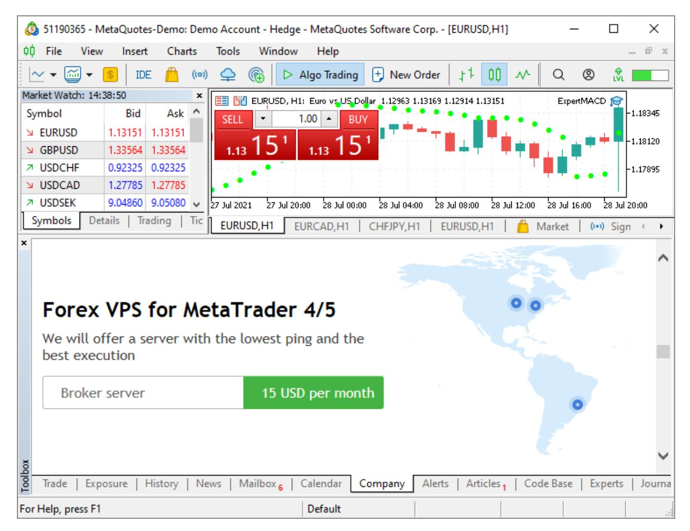

Through this page, you can reach your potential clients even without knowing their valid contact details. If a trader opens a demo account on your server, they will see this page.

### Setup

The company page is configured separately for each client group, to ensure flexible customization opportunities:

- ·For real clients, you can display traders rooms with useful functions
- ·For demo accounts, create a landing page to advertise your services
- ·Your White Label partners can show their own advertising pages

Open the Company tab in the group settings and specify a link to your web page in the "Support site" field:

| Group:            | demo\forex-usd                                 |
|-------------------|------------------------------------------------|
| Company:          | Forex Broker                                   |
| Company site:     | forexbroker.com                                |
| Company email:    | mail@forexbroker.com                           |
| Deposit site:     | forexbroker.com/deposit                        |
| Withdrawal site:  | forexbroker.com/withdraw                       |
| Support site:     | forexbroker.com/[lang:en es pt ru]/landing-mt5 |
| Support email:    | support@forexbroker.com                        |
| Templates folder: |                                                |
|                   |                                                |
|                   |                                                |
|                   | <b>OK</b>                                      |
|                   | Cancel                                         |
|                   | <b>Help</b>                                    |

You can use macros that are replaced on the client terminal side and form the final link:

- · [lang:en|ru|es|..] — the list of language in the format of ISO 639-1. If one of the listed languages matches the interface language of the client terminal, it will be used for the news language. Otherwise, the first language in the list is used.
- ·[login] — client's current login.
- ·[uniq] — the unique ID of the client's computer.

If no address is specified, the default https://www.mql5.com is shown.

<span id="page-79-0"></span>

# Common errors

- · Do not ban demo accounts with missing or incorrect contact information. You can still reach the traders using built-in communication methods: internal mailing system, push messages, welcome emails, and company pages.
- · Specify an internal mailbox for at least one manager account on the server side so that traders can easily contact you.
- · Encourage your clients to use mobile terminals. In addition to offering on-the-go trading capabilities, you will get an additional communication channel.

<span id="page-80-0"></span>

# Reports and analytics

MetaTrader 5 offers a built-in powerful analytics module. Native platform tools provide detailed information on trader activity dynamics, trading account states, commissions, turnovers, and more.

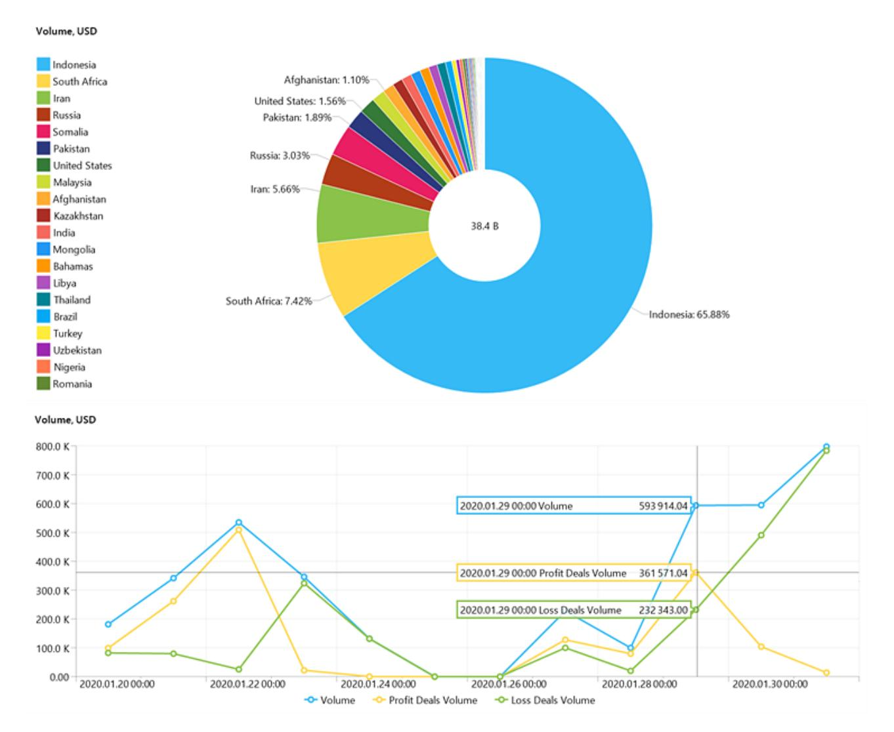

Finteza integration enables the generation of end-to-end trader analytics to trace trader behavior, from the first website visit to a real account deposit.

In addition to more than 40 standard reports, you can generate any custom reports using the MetaTrader 5 Report API or choose from hundreds of turnkey solutions from third-party developers in the [App Store.](https://support.metaquotes.net/en/market/mt5/reporting)

<span id="page-81-0"></span>

# Server reports

The trading platform features multiple reports reflecting clients' trading activity, working agents, account margin statuses, gateways and much more. All these reports can be accessed from the Server Reports section in the navigator.

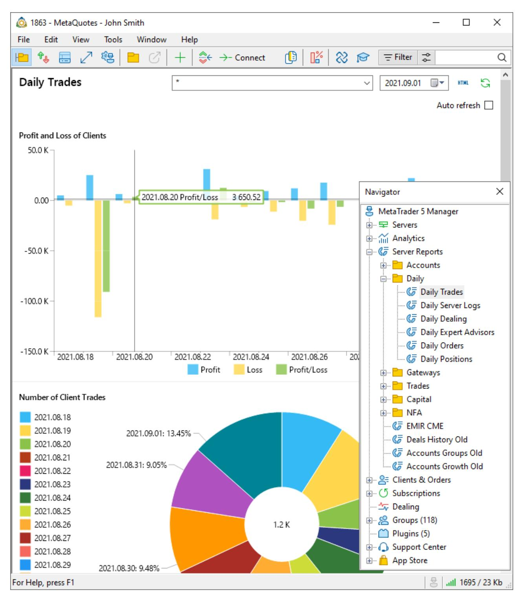

## Requesting a report

The platform automatically requests a report from the server when you select it in the list or change its parameters.

If you want to request reports only manually, disable the "Auto refresh" option. Disabling the option can be useful when working with large reports: by avoiding unnecessary requests, you can reduce the load on the server and Manager terminal.

To manually request data, click in the upper right corner.

Reports can have different settings and filters by groups, dates and symbols. You can change them in the upper right corner of the section.

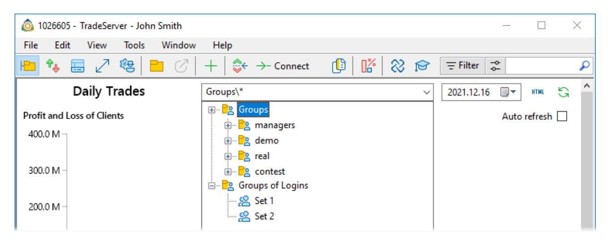

Each report has an individual set of available parameters.

- · **Groups** — group of users, on which the report is generated. When making a request, you may specify:
  - ·One of the trading groups or subgroups, for example, demo\\*.
  - ·User logins separated by commas, for example "10011, 10012, 10015".
  - ·Create or use a previously saved [custom set of accounts.](#page-81-0)
- · **Symbols** — the symbol for which the report will be generated (for example, report on operation on a certain symbol). Possibility to filter by symbols depends on the report type.
- · **Period** — custom period for report generation (for example, report on trading operations for the last week). Dates can be specified both manually and using a calendar that is opened when you press . Button allows the selection of one of the predefined time periods to generate a report for.
- · / — switch between two types of reports: regular and dashboard. One or both types can be supported, depending on how the developer implemented the report.

## Requesting reports by client list

You can create and use previously saved account sets for easier requests. Click "Add group of logins" in the context menu of the filter by group.

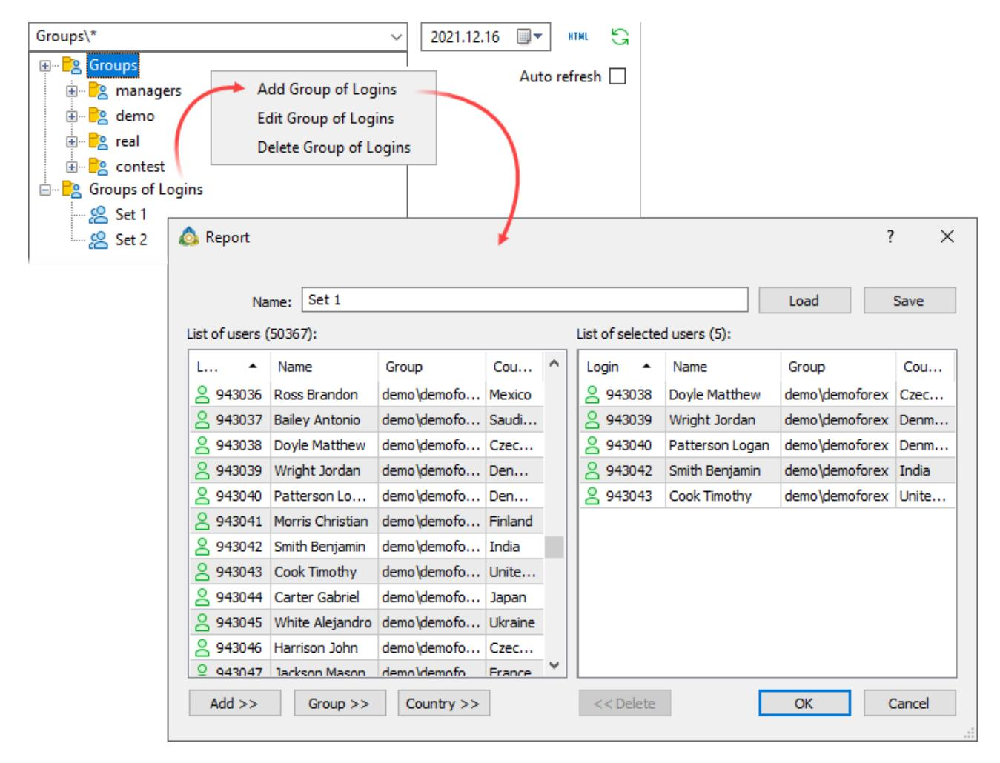

Select the necessary account (or multiple accounts using Shift or Ctrl+Shift) and click Add. In order to add all accounts from a client group, select one account with a necessary group and click Group. Similarly, you can add accounts by country.

Specify a name for an account group and click Save. The group will become available for selection in the filter.

You can create a group of accounts based on a csv file (for example, a file received by export in the [Accounts](#page-175-0) or [Online](#page-203-0) section). To do this, click Load and select a file. When importing, a login is taken from the file's first data column beginning from the first line, therefore it does not matter how many columns in total are in the file. The program takes the value up to the nearest separator: a space, a tab, a comma or a semicolon. Sample file:

```
Login;Name;Group;Country;Balance;Credit
1811971;Mitchell Adam;demo\demoforex-5;Morocco;50056.50;0.00
1811972;Richardson Lucas;demo\demoforex-5;Pakistan;49919.47;0.00
1811973;Lewis Landon;demo\demoforex-5;United States;49623.39;0.00
1811974;Cook John;demo\demoforex-5;Ukraine;49900.94;0.00
```

The first line with column names is not imported since a login may only contain numbers.

Account sets are saved separately for each manager account and trading server.

### Report display settings

Using the context menu commands, you can save the report in CSV, Open XML, MHT or HTML file. The context menu of dashboard reports provides diagram settings:

- ·**Title** — show/hide the chart title.
- ·**Legend** — show/hide the chart legend.
- ·**Details** — show/hide the chart details.
- ·**Color** — switch color. The option is used for charts displaying information about an entity.
- · **Type** — switch the chart view: Bar chart, Line chart, Area chart, Donut chart, value (shows the total variable value).
- · **Stacking** — switch chart stacking type. Used for charts, which compare several entities and their contribution to the overall value. For example, you may distribute positions by symbols and market sentiment. Available options:
  - ·**None** — data series are displayed separately
  - ·**With negative values** — data series are combined; values are not summed up
  - ·**Regular** — data series are combined; values are summed up
  - · **100%** — rows are combined, the general contribution of each series to the total value in percentage is shown

### Report cache

Data cache stores data requested from the trading platform database, between report generation times. Use of data cache saves resources when creating reports: the server does not need to re-retrieve data from databases and perform related calculations, while the ready data is already available in the cache.

Over time, the data in the cache can become out of date. For example, if historical data on the server has significantly changed, it is recommended to reset the report cache to ensure proper information display.

To reset the cache, select any report and execute the related command from the report menu. This will reset the cache of all reports, not only the selected one.

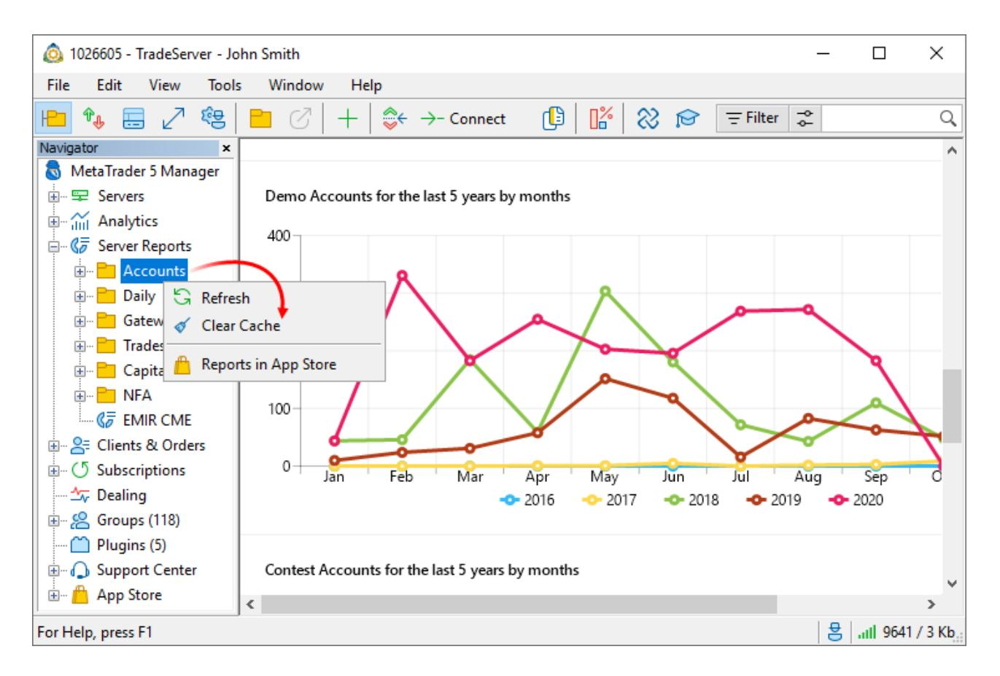

<span id="page-85-0"></span>

#### Standard reports

The standard platform installer includes many ready-made reports:

- ·Accounts Groups — statistical report on accounts in groups on the server.
- ·Accounts Growth — growth in the number of accounts in groups on the server.
- ·Agents — report on all deals related to agent commission operations.
- ·Agents Detailed — extended report on agent commissions.
- ·Credit Facility — report on credit operations for the selected period.
- ·Daily — financial states of requested accounts as at the end of the day.
- ·Daily Detailed — a detailed report on the financial state of one selected account as at the end of the day.
- ·Daily Server Logs — statistical report on platform operation for the selected day.
- ·Daily Dealing — daily report on dealing activity.
- ·Daily Trades — report on trading operations for the selected day.
- ·Daily Orders — report on open orders as at the end of the selected day.
- ·Daily Positions — information about trading positions which remain open at the end of the selected day.
- ·Daily Expert Advisors — trading operations performed by client Expert Advisors.

- ·Deals History — summary report on deals for the selected period.
- ·Deals Profit — detailed report on deals for the selected period.
- ·Deals Initiators — report on deal initiators (reasons).
- ·Deals Geography — trading activity distribution by countries.
- ·Deals Weekly — weekly activity of traders.
- ·Deposit and Withdrawal — deposit and withdrawal operations for the selected period.
- · Equity — financial states of the requested accounts as of the end of a day. The accounts are grouped according to their "Comment" field value. This report allows to generate reports on clients' accounts grouping them by custom criteria.
- ·Margin Calls — report on accounts in the Margin Call or Stop-out state.
- ·Orders History — summary report on orders for the selected period.
- · Segregated — summary report reflecting changes in the financial states of the requested accounts, for the specified period.
- ·Summary — total movements of funds and turnover on the requested accounts for the selected period.
- ·Gateways Turnover — volume of deals processed by gateways.
- · Gateways Profit — volume of deals processed by gateways as well as the broker's profit generated when processing these deals.
- · Gateways White Label — volume of deals executed on the trading server by other brokers via the MetaTrader 5 Gateway (regular or White Label version).
- ·Execution Type — the number, volume and type of executed deals.
- ·Trade Accounts — current trading states of client accounts.
- ·Trade Transactions — detailed information on trading operations executed on MetaTrader 5 servers.
- · Trade Modifications — trading operations that were changed manually by the administrator, by the manager or through the API.
- · StopOut Compensations — operations related to negative account compensations upon Stop-out. It includes all deals with the "so compensation" type.
- ·Money Flow Daily — a group of reports on daily movement of funds on client accounts.
- ·Money Flow Weekly — a group of reports on weekly movement of funds on client accounts.
- ·Lifetime Value — a group of customer lifetime value reports.
- ·First Time Deposit — a group of reports on clients' deposit operations.
- ·Retention of Clients — new customer retention report.

- ·Retention of Trading Accounts — new customer retention report covering separate accounts.
- ·NFA — reports to be submitted to NFA.
- ·EMIR — a report for EMIR regulatory reporting.
- ·Fund Overview — report on key characteristics of an investment fund.
- ·Risk Appetite — report on traders' risk appetite characteristics.

Please see the [MetaTrader 5 Manager documentation](https://support.metaquotes.net/en/docs/mt5/manager/reports)for the complete description of the reports.

The platform administrator determines which reports will be available, when configuring the platform.

#### Configuring reports on the server

Report parameters are managed in the Administrator terminal, because they are generated on the trade server side.

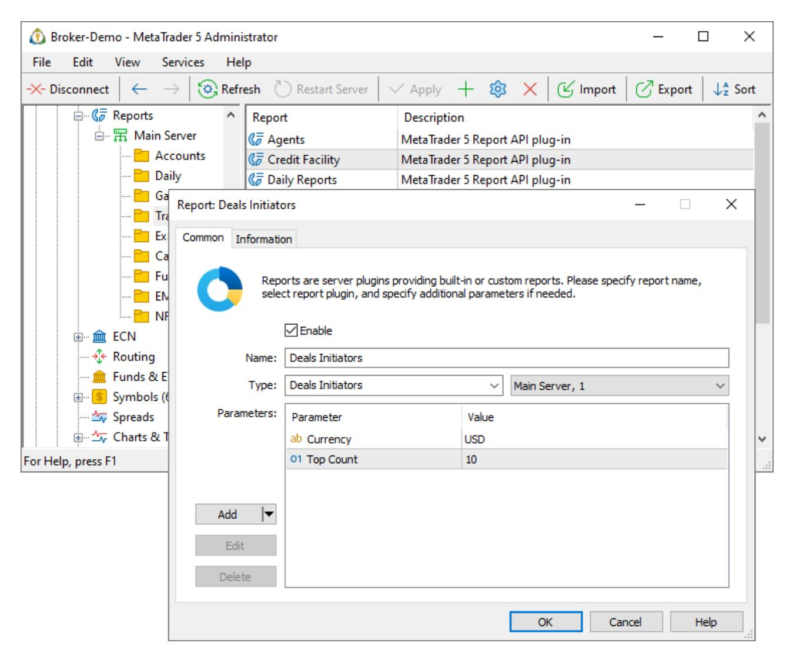

All reports are displayed in a tree-like list, grouped by the servers for which they are configured. For convenience, you can split them into additional categories: Accounts, Daily Reports, Gateways, etc. Use the context menu of the tree to arrange the reports into subgroups.

Double click on a report to edit its parameters:

- · **Enable** — enable/disable the report. Disabled reports are not available for requests in the Manager terminal.
- ·**Name** — the name of the report configuration.
- · **Type** — this section reflects all reports available on the server. The list is compiled in accordance with the DLL files contained in the /report folder of the main trader server. The platform provides a lot of [standard](#page-85-0) [reports](#page-85-0). You can create additional reports using the MetaTrader 5 Report API or purchase them from the [App Store.](#page-89-0)
- · **Trade server** — to the right of the Type field, select the trade server for which you are configuring the report. The report will use data of the specified server and will only be available when connecting to the specified server.

The bottom of the window features a block of additional report parameters. The list of parameters depends on the specific report. Please see the [MetaTrader 5 Manager documentation](https://support.metaquotes.net/en/docs/mt5/manager/reports)for the description of standard report parameters.

To create a parameter, select Add. String type parameters are created by default. To select another type (integer or fractional), click the arrow on the Add button.

The Information section displays the report description, author, report module version and the version of the MetaTrader 5 Server API using which the report was created.

Also, this section features the data about available report formats (as an HTML page or as a table) along with the required database snapshots. A database snapshot is a state of a certain server database (for example, a database of accounts) registered by the module to create a report.

<span id="page-89-0"></span>

# Additional reports

A wide variety of additional reports is available in the [App Store](https://support.metaquotes.net/en/market/mt5/reporting) on the Support Center website. The App Store showcase is featured directly in Manager terminals, allowing managers to view and order additional products without leaving their workspace:

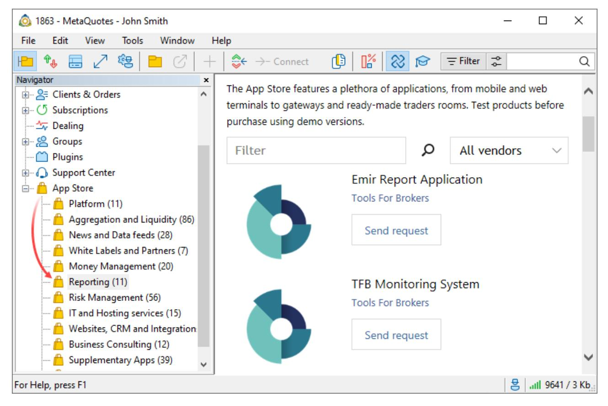

Furthermore, you can develop your own reports using [MetaTrader Report API](https://support.metaquotes.net/en/docs/mt5/api/reportapi). The package contains all the necessary tools, alongside the source code examples of standard reports. You can modify the source codes to create your own reports.

<span id="page-90-0"></span>

# Finteza end-to-end analytics

[Finteza](https://www.finteza.com/) is an analytical and advertising system designed to assist brokers in analyzing user behavior on the site and in running marketing campaigns. The system is integrated with MetaTrader 5, and thus the analytics is available straight in the platform: analyze your audience, evaluate the efficiency of marketing campaigns and track the entire trader lifetime, from the first website visit to a real account deposit.

Finteza is integrated with MetaTrader 5, so you can track your traders' actions in terminals. Obtain statistics on which functions and services are the most popular among your traders: algo trading programs, signal copying, account opening and others.

<span id="page-90-1"></span>

#### How to set up analytics

[Order Finteza](https://support.metaquotes.net/en/market/product/402) via the MetaQuotes Support Center. A 3-month trial license is provided for free of charge — test the system in your company and evaluate its efficiency for your business.

[Create an account on the Finteza website](https://www.finteza.com/pricing) and configure tracking on your site (pixel code similar to Facebook or Google pixels) as well as set up the display of ads as HTML5 or raster banners. To set up tracking, copy the code from the Settings \ Counter section of the Finteza panel and insert it into all pages of your website:

| 7                             | <b>∅</b> > Websites > ABC Broker > Settings :                                                                                                                                                                                                                                                                                                                            |        |         |               |             |          |                     |              |       |
|-------------------------------|--------------------------------------------------------------------------------------------------------------------------------------------------------------------------------------------------------------------------------------------------------------------------------------------------------------------------------------------------------------------------|--------|---------|---------------|-------------|----------|---------------------|--------------|-------|
| ≡                             | <table> <tr><td>Common</td></tr> <tr><td>Counter</td></tr> <tr><td><b>Events</b></td></tr> <tr><td>Retargeting</td></tr> <tr><td>Ad zones</td></tr> <tr><td><b>Integrations</b></td></tr> <tr><td>Anti-Adblock</td></tr> <tr><td>Goals</td></tr> </table>                                                                                                                | Common | Counter | <b>Events</b> | Retargeting | Ad zones | <b>Integrations</b> | Anti-Adblock | Goals |
| Common                        |                                                                                                                                                                                                                                                                                                                                                                          |        |         |               |             |          |                     |              |       |
| Counter                       |                                                                                                                                                                                                                                                                                                                                                                          |        |         |               |             |          |                     |              |       |
| <b>Events</b>                 |                                                                                                                                                                                                                                                                                                                                                                          |        |         |               |             |          |                     |              |       |
| Retargeting                   |                                                                                                                                                                                                                                                                                                                                                                          |        |         |               |             |          |                     |              |       |
| Ad zones                      |                                                                                                                                                                                                                                                                                                                                                                          |        |         |               |             |          |                     |              |       |
| <b>Integrations</b>           |                                                                                                                                                                                                                                                                                                                                                                          |        |         |               |             |          |                     |              |       |
| Anti-Adblock                  |                                                                                                                                                                                                                                                                                                                                                                          |        |         |               |             |          |                     |              |       |
| Goals                         |                                                                                                                                                                                                                                                                                                                                                                          |        |         |               |             |          |                     |              |       |
| Ø<br>101<br>8<br>ъ,<br>D<br>⊟ | <p>Select parameters to generate the counter installation code</p> <p>Track hash in browser address bar</p> <p><b>Track external links clicks</b></p> <p>Count exact time on site</p> <p>Proxy the script and requests</p> <p>Proxy scripts through your website to get precise and secure analytics. Learn how to do that in the user guide.</p>                        |        |         |               |             |          |                     |              |       |
| R<br>Å                        | <p>Insert this HTML-code into all pages of your website (in body section)</p> <p><b>Send to Email</b></p> <p>Copy to Clipboard</p>                                                                                                                                                                                                                                       |        |         |               |             |          |                     |              |       |
| N                             | <script type="text/javascript"> // Your script code here </script>                                                                                                                                                                                                                                                                                                       |        |         |               |             |          |                     |              |       |
| Y<br>ੱਤ                       | <p>(function(a,e,f,q,b,c,d){a[b]=a[b]  function(){(a[b].q=a[b].q  []).push(arguments)};a[b].l=1*new Date();c=e.createElement(f);d=e.getElementsByTagName(f)[0];c.async=!0;c.defer=!0;c.src=q;d.parentNode.insertBefore(c,d)})(window,document,"script","https://content.finteza.org/core.js","fz");  fz("register","website","xwuqbsthgcmkpzlvmxzyneeslfjyakfsml"); </p> |        |         |               |             |          |                     |              |       |
| $\stackrel{\checkmark}{=}$    |                                                                                                                                                                                                                                                                                                                                                                          |        |         |               |             |          |                     |              |       |
| భి                            | <p>To accelerate the tracking script download, it is recommended to add the X-DNS-Prefetch-Control instruction to the header of all website pages.</p>                                                                                                                                                                                                                   |        |         |               |             |          |                     |              |       |

After that, you will start receiving analytics from your website.

Next, configure Finteza integration with your platform. Navigate to Integration \ Finteza Analytics in the Administrator terminal and activate the analytical module.

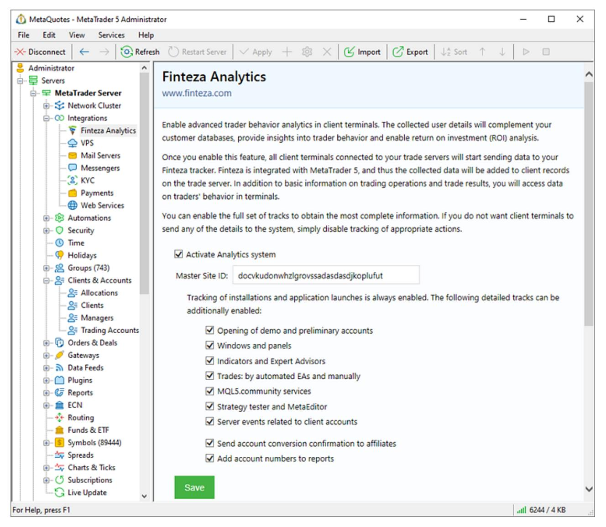

Next, specify your tracker identifier in the "Master Site ID" field. The tracker identifier is available under the Settings \ Common section of the Finteza panel.

After that, the trading platform will start receiving data from Finteza. A variety of metrics will become available under the "Analytics" section of the Manager terminal.

| Category | Option | Values                               |                                                                                                                                     |
|----------|--------|--------------------------------------|-------------------------------------------------------------------------------------------------------------------------------------|
|          | F      | ≈ Websites > ABC Broker > Settings : |                                                                                                                                     |
|          | ≡      | Common                               | Counter<br>Events<br>Retargeting<br>Goals<br>Ad zones<br>Integrations<br>Anti-Adblock<br><b>Counter</b>                             |
|          |      |                                    |                                                                                                                                     |
|          | 1.,    |                                      | Time zone<br>(UTC) Coordinated Universal Time                                                                                       |
|          | ⊞      |                                      | Automatically adjust for daylight saving time                                                                                       |
|          | R      | Domain                               | www.abcbroker.com                                                                                                                   |
|          | Å      |                                      | Strict antispoofing control                                                                                                         |
|          |        | <b>Alias domains</b>                 | Set additional domains the data for this counter is to be received from.<br>Traffic from other domains will be considered spoofing. |
|          |      |                                      |                                                                                                                                     |
|          | E      |                                      | Any<br><b>Specified</b><br><b>No</b>                                                                                                |
|          |      | eCommerce IP Whitelist               | Enter comma separated IPs                                                                                                           |
|          | భి     | Sampling                             | Auto                                                                                                                                |
|          |        | ID                                   | Copy to Clipboard<br>xwuqbsthqcmkpzlvmxzyneeslfjyakfsml                                                                             |

Configure required Finteza access permissions to your employees in manager account settings in MetaTrader 5 Administrator. The settings provide special permissions: access to the integration section, access to page views, marketing campaigns and reports.

See also: [Video / Finteza integration with MetaTrader 5](https://support.metaquotes.net/en/articles/956)

#### Server and client events

Finteza automatically accumulates data on your terminal installations and launches. All such events are linked to the website specified in the "Master Site ID" field. These events can be viewed at any time under the Events section of the Finteza panel. This data is only available to you.

Enable tracking of additional trader events via the Integration \ Finteza Analytics section of the Administrator terminal:

- · Demo and preliminary account opening; all events are categorized into actions by unique and non-unique traders (checking if the trader has previously opened an account)
- ·Opening of windows and panels inside the terminal
- ·Launch of indicators and Expert Advisors

- ·Trades: performed automatically by trading robots and manual trades
- ·Usage of MQL5.community services
- ·Usage of Strategy Tester and MetaEditor
- · Server events related to client accounts: live account creation, moving of a preliminary account to a real group and first account deposit

All events, except for the last point, are sent to Finteza by client terminals. When connected to your trading server, the terminals request the relevant settings and sends the appropriate events to the specified tracker. Server events are sent to Finteza by the trading server.

The event naming is formed by the following formula: [Category] + [Subcategory] + [Action].

[Category] + [Subcategory] mean the main source and additional details:

- MetaTrader 5 Trade Server ..... the event occurred on the MetaTrader 5 trading server
- MetaTrader 5 Desktop ..... the event occurred in the MetaTrader 5 desktop version
- MetaTrader 5 iOS ..... the event occurred in MetaTrader 5 mobile for iOS

The main action is indicated as an [Action]:

- ·Expert Add — launching an Expert Advisor on the chart
- ·Account Real Deposit — successful account deposit
- ·Open Editor — opening MetaEditor

So, the events can be as follow:

- · MetaTrader 5 Trade Server Account Real Deposit — funds were deposited in MetaTrader 5 (the event arrived from the trading server)
- ·MetaTrader 5 iOS Account Demo — a demo account was created from the MetaTrader 5 mobile for iOS

To view tracked events, go to the Finteza panel, select your tracker and open the Event report.

| Tracked event                                                   | Value | Unit  | Visitors   | Events     |
|-----------------------------------------------------------------|-------|-------|------------|------------|
| MetaTrader 5 Trade Server Account Real Deposit                  |       | srv   | 1 541 -48% | 5 648 -97% |
| MetaTrader 5 Trade Server Account Real Withdrawal               |       | srv   | 703 -59%   | 1 098 -99% |
| MetaTrader 5 Trade Server Account Real Create                   |       | login | 659 -50%   | 1 244 -99% |
| MetaTrader 5 Trade Server Account Demo Confirm No Unique        |       | login | 403 -58%   | 509 -62%   |
| MetaTrader 5 Trade Server Account Demo Confirm Unique           |       | login | 354 -89%   | 400 -87%   |
| MetaTrader 5 Trade Server Account Preliminary Confirm Unique    |       | login | 47 -64%    | 48 -64%    |
| MetaTrader 5 Trade Server Account Real Link                     |       | login | $39 - 22%$ | 159 -19%   |
| MetaTrader 5 Trade Server Account Real Convert                  |       | login | 15 - 40%   | $16 - 41%$ |
| MetaTrader 5 Trade Server Account Preliminary Confirm No Unique |       | login | $6 - 63%$  | $7 - 65%$  |

To view detailed statistics, enable the option "Add account numbers to reports" via the Administrator terminal. In this case, the relevant account number will be added to the Value field (accordingly, *Account* will be indicated as Units) of each tracked event. If the option is disabled, only your server name will appear as an additional parameter for each event in Finteza.

Finteza automatically associates server and client events with user actions on your site. This action chain provides in-depth end-to-end analytics. View the entire journey of your traders, from their first visit to your website, to opening of a real account, deposits and actions performed in the terminal.

The bottom of the "Finteza Analytics" section features a summary chart on the total number of events sent to your tracker by the trading server and client terminals.

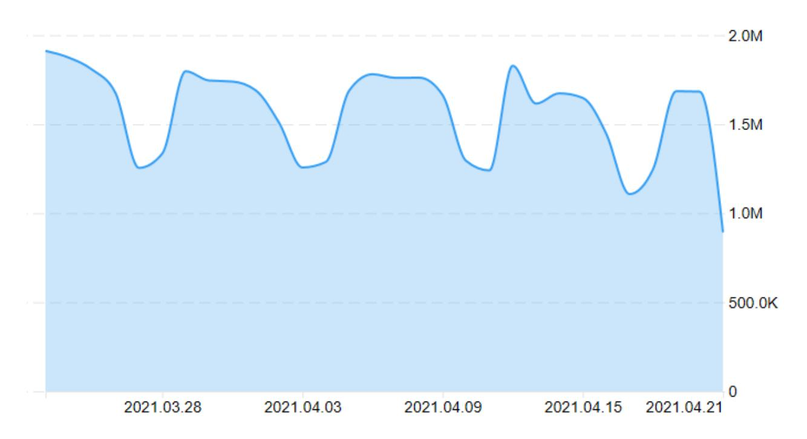

## Working with affiliates

To manage affiliate programs, enable the "Send account conversion confirmation to affiliates" option under the Integration \ Finteza Analytics section of the Administrator terminal.

An additional utm\_affiliate\_site parameter will be added to all tracked events sent from your terminals to Finteza. Thus, you can track the efficiency of your affiliates in terms of client attraction, using a special Finteza panel section: Sources / Referral.

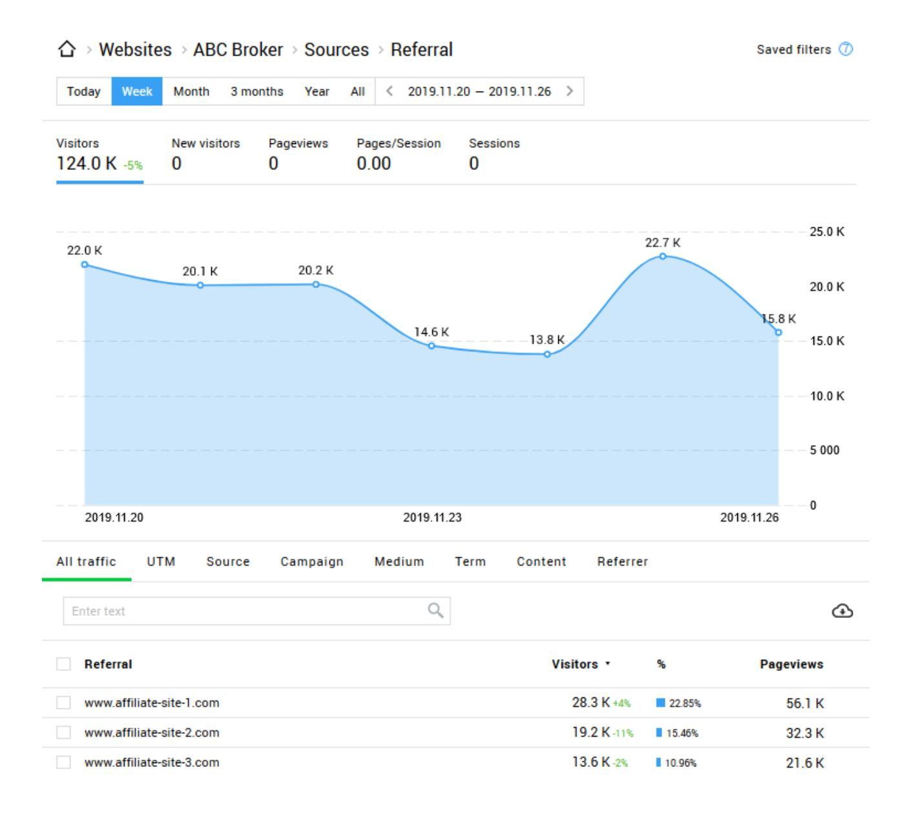

## Where do clients come from?

Your platform already has a [client database](#page-6-0) with UTM parameters. This database is created automatically, based on trading accounts on your server.

When a client downloads the terminal installer, Finteza registers information about where the client came from. The relevant details are added to all accounts opened from this terminal. Within the platform, each account is linked to a client record: all account data is copied into the client, including lead source and ad campaign parameters. This generates a client database with information about sources in a fully automatic mode.

Work with the client database via the MetaTrader 5 Manager. For convenience, the Manager terminal provides [filters](#page-177-0) by Lead Campaign and Lead Source. Analyze how many clients you received from a specific ad campaign, as well as evaluate their account statuses and deposits.

| File                      | Edit         | View    | Tools        | Window | Help |                  |  |  |              |          |               |                    |                    |  |
|---------------------------|--------------|---------|--------------|--------|------|------------------|--|--|--------------|----------|---------------|--------------------|--------------------|--|
| File                      | Edit         | View    | <b>Tools</b> |        |      |                  |  |  |              |          |               |                    |                    |  |
| Market Watch: 11:55:00    |              |         |              |        |      |                  |  |  |              |          |               |                    |                    |  |
| Symbol                    | Bid          | Ask     |              | ID     |      | Name             |  |  |              |          | Lead Campaign |                    | Lead Source        |  |
| AUDCAD                    | 0.92442      | 0.92450 |              | 6990   |      | Smith Jose       |  |  |              |          | web.terminal  |                    | www.mql5.com       |  |
| AUJPY                     | 81.829       | 81.889  |              | 6991   |      | Parker Lucas     |  |  |              |          | download      |                    | www.metatrader.com |  |
| CADCHF                    | 0.71518      | 0.71578 |              | 6992   |      | Taylor Gavin     |  |  |              |          | download      |                    | www.metatrader.com |  |
| AUDCHF                    | 0.66105      | 0.66185 |              | 6993   |      | Jones Jackson    |  |  |              |          | download      |                    | www.metatrader.com |  |
| Details Symbols           | <b>Ticks</b> |         |              | 6994   |      | Phillips Charles |  |  |              |          | download      |                    | www.metatrader.com |  |
| Navigator                 |              |         |              | 6995   |      | Green Ashton     |  |  |              |          | web.terminal  |                    | www.mql5.com       |  |
| MetaTrader 5 Manager      |              |         |              | 6996   |      | James Sean       |  |  |              |          | web.terminal  |                    | www.mql5.com       |  |
| Servers                   |              |         |              | 6997   |      | + New Client     |  |  | Ctrl+Shift+N |          | download      |                    | www.metatrader.com |  |
| Analytics                 |              |         |              | 6998   |      | 2                |  |  |              |          | web.terminal  |                    | www.mql5.com       |  |
| Server Reports            |              |         |              | 6999   |      | Client Details   |  |  |              |          | web.terminal  |                    | www.mql5.com       |  |
| Clients & Orders          |              |         |              | 7000   |      | Delete Clients   |  |  |              |          | Ctrl+D        |                    | www.mql5.com       |  |
| Online Users (6)          |              |         |              | 7001   |      | Journal          |  |  |              | download |               | www.metatrader.com |                    |  |
| Clients (4,965)           |              |         |              | 7002   |      | Find             |  |  | $Ctrl + F$   |          |               |                    |                    |  |
| Trading Accounts (52,004) |              |         |              | 7003   |      | Customize        |  |  |              |          |               |                    |                    |  |
| Positions (65,976)        |              |         |              | 7004   |      | Auto Scroll      |  |  |              |          |               |                    |                    |  |
| Orders (24,800)           |              |         |              | 7005   |      | Auto Arrange     |  |  |              |          |               |                    |                    |  |
| Subscriptions             |              |         |              | 7006   |      | Grid             |  |  |              |          |               |                    |                    |  |
|                           |              |         |              | 7007   |      | Q                |  |  |              |          |               |                    |                    |  |

Lead Source and Lead Campaign data from terminal download links is registered in created accounts only if you have a Finteza license.

<span id="page-97-0"></span>

# Trader tracking

If you have an active Finteza subscription, in addition to trader reports in the Analytics section, you can access further data in the account and client dialogs:

- · Visitor ID — a unique identifier assigned to a user when he/she installs your terminal or visits your site, if a Finteza tracker is installed in it. With this tracker, you can trace trader behavior, from the first website visit to a real account deposit.
- ·Affiliate — the name of the website from which the trading terminal installer was downloaded.

| Client:                                                                                                | 2097 - John Smith |                     |       |        |         |        |             | ?      | $×$ |
|--------------------------------------------------------------------------------------------------------|-------------------|---------------------|-------|--------|---------|--------|-------------|--------|-----|
| Client<br>fn)                                                                                          |                   | Client              |       |        |         |        |             |        |     |
| Personal<br>闊                                                                                          |                   | Type<br>Individual  | $✓$   |        |         |        |             |        |     |
| Ø<br>Address                                                                                           |                   |                     |       |        |         |        |             | $×$    |     |
| Account: 1819052, John Smith, USD, 1:100, Hedge<br>П<br>屇                                              |                   |                     |       |        |         |        |             |        |     |
| Overview<br>Personal Account Profile Subscriptions Security                                            |                   |                     |       |        |         |        |             |        |     |
| 団<br>John Smith, 1819052, demo\demoforex-5-hedged, 1:100                                               |                   |                     |       |        |         |        |             |        |     |
| India, Mumbai<br>Ç                                                                                     |                   |                     |       |        |         |        |             |        |     |
| +1293992297331 MetaQuotes ID: 4B676913, Visitor ID: 4930739665660928282, Affiliate: abcbroker.com<br>떱 |                   |                     |       |        |         |        |             |        |     |
| john.smith@gmail.com                                                                                   |                   |                     |       |        |         |        |             |        |     |
| Registered: 2021.01.06 Last access: 2021.01.06 05:58 Last Address: 124.123.165.82                      |                   |                     |       |        |         |        |             |        |     |
| Symbol                                                                                                 | Volume<br>Type    | Price               | S/L   | T/P    | Price   | Swap   |             | Profit |     |
| FI.<br>eurjpy                                                                                          | 0.01<br>buy       | 126.415             | 0.000 | 0.000  | 129.135 | 0.00   |             | 24.82  |     |
| F<br>eurjpy                                                                                            | sell<br>0.01      | 126.372             | 0.000 | 0.000  | 129.175 | 0.00   |             | -25.57 |     |
| ● Balance: 3,003.13 USD                                                                                |                   |                     |       |        |         | 36.88  |             | -0.75  |     |
| Equity: 3,002.38                                                                                       |                   |                     |       |        |         |        |             |        |     |
| Margin: 36.88                                                                                          |                   |                     |       |        |         |        |             |        |     |
| Free Margin: 2,965.50                                                                                  |                   |                     |       |        |         |        |             |        |     |
| Margin Level: 8,140.94 %                                                                               |                   |                     |       |        |         |        |             |        |     |
| Client Properties                                                                                      |                   |                     |       |        | Update  | Cancel | <b>Help</b> |        |     |
|                                                                                                        |                   | Visitor ID          |       |        |         |        |             |        |     |
|                                                                                                        |                   | 4930739665660928282 |       |        |         |        |             |        |     |
|                                                                                                        |                   |                     |       |        |         |        |             |        |     |
|                                                                                                        |                   | Copy                |       | Export |         | Cancel | Update      |        |     |

Find the required Visitor ID in the Finteza panel, under the visits section, and click on it to apply the ID as a filter. This will enable the generation of any report on trader actions on your site: page views, events, sales funnels, and others.

|     | ÷<br>Home                  | ∧                                                                     | Websites > ABC Broker > Audience > Visitors > Details |                  |                                      |                           |              |  |  |  |  |  |  |  |
|-----|----------------------------|-----------------------------------------------------------------------|-------------------------------------------------------|------------------|--------------------------------------|---------------------------|--------------|--|--|--|--|--|--|--|
|     | Main menu                  | Week<br>Today<br>Month                                                | 3 months                                              | 6 months<br>Year | All<br>←                             | $2021.03.17 - 2021.03.23$ | Refresh      |  |  |  |  |  |  |  |
| 0   | Overview                   | <b>Visitor ID</b>                                                     | 4930739665660928282                                   |                  |                                      | <b>Sessions</b>           | 2.35s        |  |  |  |  |  |  |  |
| 2.  | Audience                   | Last seen                                                             | 2021.03.22 12:42:07                                   |                  |                                      | <b>Events</b>             | 5            |  |  |  |  |  |  |  |
|     | <b>Devices</b>             | <b>Last action</b>                                                    | MetaTrader 5 iOS Download                             |                  |                                      | Retargets                 | 0            |  |  |  |  |  |  |  |
|     | Platforms                  | Geography<br>$\mathcal{M}$                                            | Cyprus, Limassol                                      |                  |                                      | Conversions               | 1            |  |  |  |  |  |  |  |
|     | Geography<br>Organizations | Language                                                              | Other                                                 |                  |                                      |                           |              |  |  |  |  |  |  |  |
|     | <b>Visitors</b>            | IP                                                                    | 79.150.180.172                                        |                  |                                      | <b>Banners</b>            | 3            |  |  |  |  |  |  |  |
|     | Retention                  | Owner                                                                 | Webzilla B.V                                          |                  |                                      | <b>Clicks</b>             | 5, CTR 3.15% |  |  |  |  |  |  |  |
| 狙   | Quality                    | $\overline{\phantom{a}}$<br>$\overline{\phantom{a}}$<br><b>Device</b> |                                                       |                  |                                      | Revenue                   | 100          |  |  |  |  |  |  |  |
|     | Performance NEW            | Application                                                           | Other                                                 |                  |                                      |                           |              |  |  |  |  |  |  |  |
|     | Pages                      | <b>Attribution</b><br><b>Raw Data</b>                                 | <b>Sessions</b>                                       | <b>Sources</b>   | <b>Timeline</b><br>จ                 |                           |              |  |  |  |  |  |  |  |
|     | Ad zones                   | IP<br><b>Last event</b>                                               |                                                       | Geography        | <b>Device</b>                        | <b>Action</b>             |              |  |  |  |  |  |  |  |
| Lvi | Events                     | 2021.03.22 12:42:07                                                   | 79.150.180.172                                        | Cyprus, Limassol | $\cdots$<br>$\sim$                   | Open preliminary account  |              |  |  |  |  |  |  |  |
|     |                            | 2021.03.22 12:42:05                                                   | 79.150.180.172                                        | Cyprus, Limassol | $\overline{\phantom{a}}$<br>$\cdots$ | Open demo account         |              |  |  |  |  |  |  |  |

#### Analytics in MetaTrader 5 Manager

The Manager terminal provides tools for analyzing broker's audience and traders' preferences, as well as for managing marketing campaigns.

Integration with the [Finteza business analytics system](https://www.finteza.com/) enables the display of information about your site visits, analysis of page efficiency and attraction channels, and other data directly in the terminal.

Information is conveniently presented in the form of charts and diagrams. You can create your own dashboards based on any metrics or use ready presets.

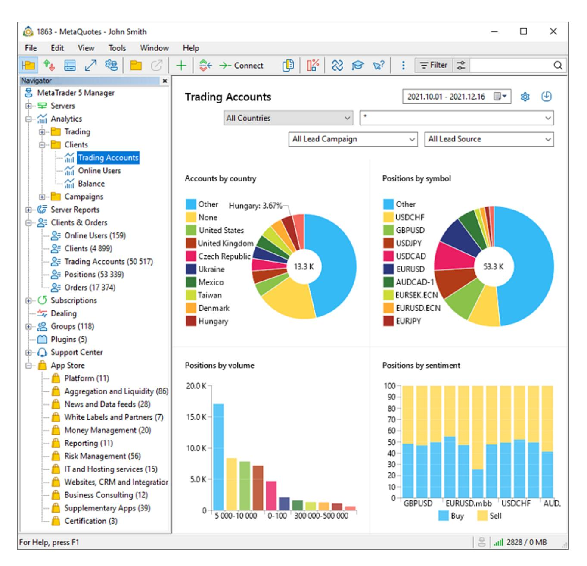

#### Available metrics

The terminal provides access to various analytical variables. All metrics are divided into groups:

- · **Online Users** — data about users currently connected to the trade server: distribution by geographical location, running balances, software builds, groups, etc.
- · **Clients** — data about all clients and accounts on the trade server: distribution by geographical location, running balances, agents, statuses, marketing campaigns, etc.
- · **Positions** — information about clients' open positions: distribution by symbols, volumes, types, market mood, etc.
- · **Orders** — information about clients' open (active) orders: distribution by symbols, volumes, types, direction, etc.

- · **Finteza Sites** — data on your sites, provided by Finteza: visits, unique users, page views, tracked events, etc. If Finteza metrics are not available, check [settings](#page-90-1) on the platform side and the manager account permissions.
- ·**Finteza Campaigns** — data on your marketing campaigns from Finteza: clicks, CTR, views, etc.
- · **External URL** — browser widget. The widget allows displaying the contents of any web page. For example, you can use it to include your own data in reports.

See also: [Video / Built-in analytics: Boost your sales through efficient advertising](https://support.metaquotes.net/en/articles/947)

#### Predefined sets of metrics

With the predefined sets of metrics, you can quickly get started, without having to create custom dashboards. Open the context menu of the Analytics section and select a preset, which best suits your goals. For example, the "Trading accounts" preset includes diagrams showing the distribution of trading accounts by the registration data, country and group.

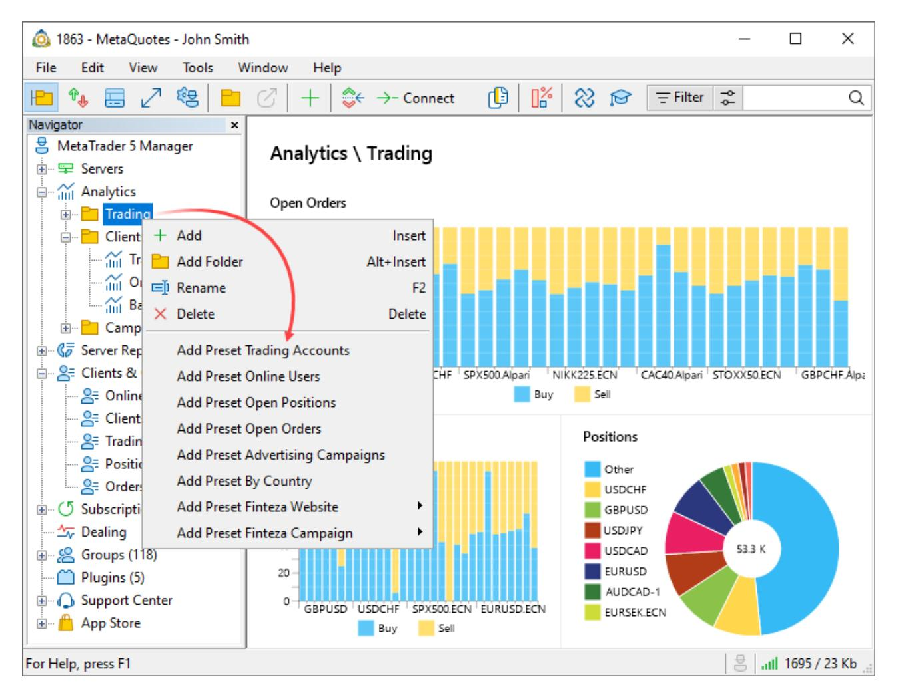

#### Configuring a custom dashboard

You can create your own dashboards using any metrics available. All dashboard settings are stored on the trading server separately for each manager account. Thus, the manager can access dashboards from any computer, on which the Manager terminal is installed.

To create a new dashboard, select Add in the context menu of the Analytics section.

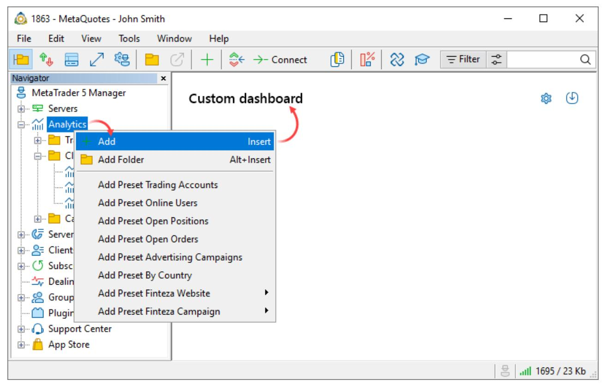

Then add required metrics using the context menu of the dashboard.

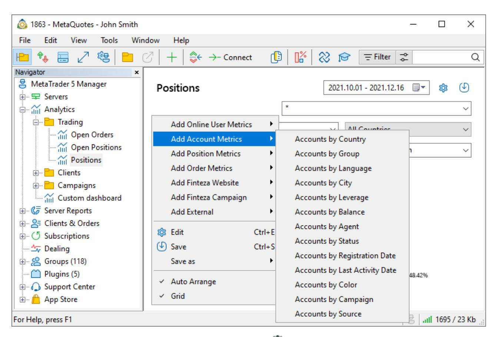

To change the order of charts, use the context menu or press in the upper right corner. Next, rearrange charts with the mouse.

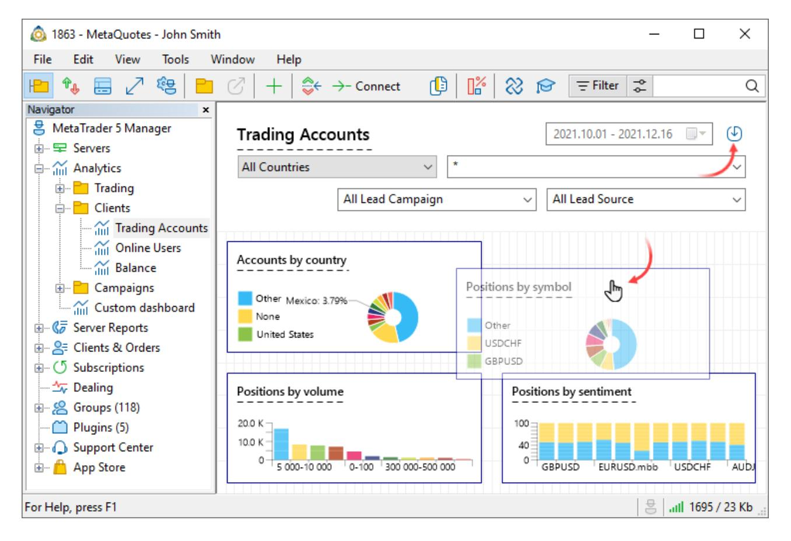

In editing mode, you can also change the names of the charts. Click on the current name and enter a new one. To delete a chart, select it and press the Delete key. After making changes, click .

#### Arranging Dashboards

If you are using a large number of dashboards, arrange them in folders, for convenience. For example, you may want to create separate folders for clients and accounts, trading metrics and marketing campaigns.

Click "Add Folder" in the context menu. After creating the necessary folders, drag dashboards into them using the mouse.

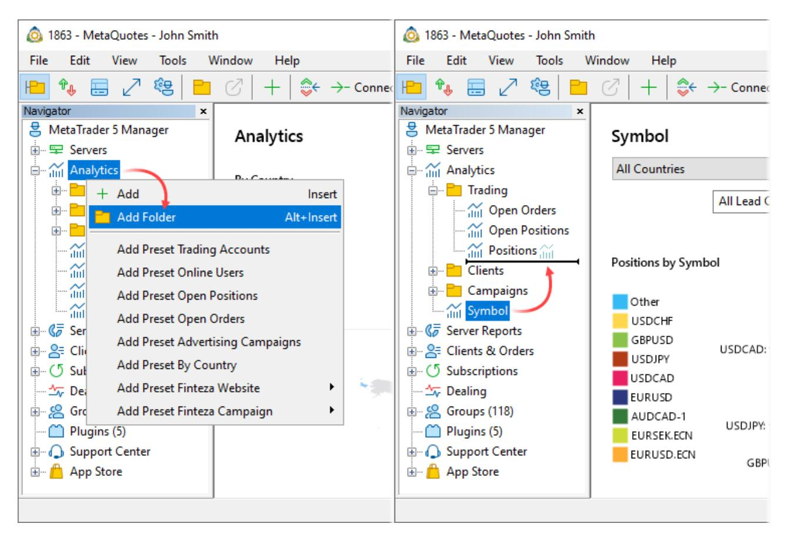

You can create further dashboards directly in the desired folder, using the folder context menu. Nesting is supported, which means you can create subfolders inside the folders.

<span id="page-103-0"></span>

#### Data filters

Data in the charts can be filtered by Lead campaigns and Lead sources, groups and countries, and also by time. For example, you can set the filter to display traders from Germany, who responded to a certain landing page, during the past 5 days.

Filters are located at the top of the dashboard:

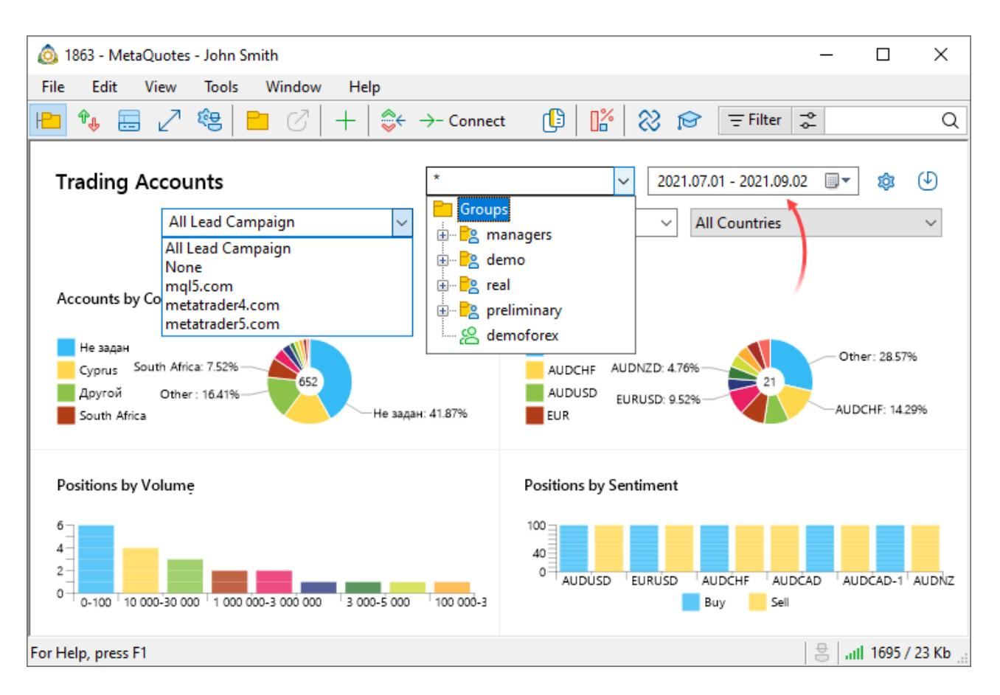

#### Customizing charts

To customize the appearance of a chart, open its context menu and set the desired parameters:

- ·**Title** — show/hide the chart title.
- ·**Legend** — show/hide the chart legend.
- ·**Details** — show/hide the chart details.
- ·**Color** — switch color. The option is used for charts displaying information about an entity.
- · **Type** — switch the chart view: Bar chart, Line chart, Area chart, Donut chart, value (shows the total variable value).
- · **Stacking** — switch chart stacking type. Used for charts, which compare several entities and their contribution to the overall value. For example, you may distribute positions by symbols and market sentiment. Available options:
  - ·**None** — data series are displayed separately
  - ·**With negative values** — data series are combined; values are not summed up
  - ·**Regular** — data series are combined; values are summed up
  - · **100%** — rows are combined; the general contribution of each series to the total value in percentage is shown

· **Top** — set the number of values displayed in the chart. For example, if you set Top = 5, then the chart will display the five largest values.

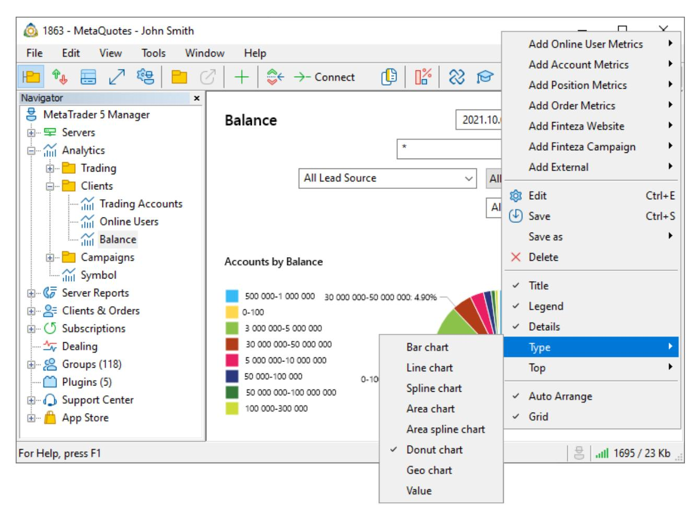

<span id="page-106-0"></span>

# Reports for traders

The platform can automatically send trading reports to traders:

- ·Daily reports are sent at the end of each trading day
- ·Monthly reports are sent at the end of each trading month

[At the end of each trading day and month](#page-107-0), the trade server generates client trading report and saves them to [trade server directory]/confirms/YYYYMMDD", where YYYYMMDD is the current date). Each report is an HTML file having the name "login\_mail.htm" (for example, "123\_mail.htm"). The trade server sends the generated reports using the special SendMail utility (its file is stored in the server directory).

The database of all generated reports is saved in the file [trade server directory]/bases/daily.dat. The data from the database can be requested via the Manager terminal, for example, by using a report from [Daily Report](#page-81-0) standard delivery.

## Enabling/disabling daily reports

You can enable or disable reports for individual client groups.

| Group:                                                                                                                                                                  | demoforex                         |        |  |      |
|-------------------------------------------------------------------------------------------------------------------------------------------------------------------------|-----------------------------------|--------|--|------|
|                                                                                                                                                                         |                                   |        |  |      |
|                                                                                                                                                                         |                                   |        |  |      |
|                                                                                                                                                                         |                                   |        |  |      |
|                                                                                                                                                                         |                                   |        |  |      |
|                                                                                                                                                                         |                                   |        |  |      |
|                                                                                                                                                                         |                                   |        |  |      |
| Company                                                                                                                                                                 | Common                            |        |  |      |
| News & Mail                                                                                                                                                             | <b>Permissions</b>                |        |  |      |
| Margin                                                                                                                                                                  |                                   |        |  |      |
| Symbols                                                                                                                                                                 |                                   |        |  |      |
| Commissions                                                                                                                                                             |                                   |        |  |      |
| Reports                                                                                                                                                                 |                                   |        |  |      |
|                                                                                                                                                                         |                                   |        |  |      |
| The platform can daily save the end-of-day state of accounts to a special database. That data is used for generating daily statements and various reports for managers. |                                   |        |  |      |
| Generate report data:                                                                                                                                                   | End of Day and End of Month       |        |  |      |
|                                                                                                                                                                         | ✓ Generate statements for clients |        |  |      |
|                                                                                                                                                                         |                                   |        |  |      |
|                                                                                                                                                                         | ✓ Send statements by email        |        |  |      |
| Mail server:                                                                                                                                                            | Default                           |        |  |      |
|                                                                                                                                                                         | ✓ Send copies to support email    |        |  |      |
|                                                                                                                                                                         |                                   |        |  |      |
|                                                                                                                                                                         |                                   |        |  |      |
|                                                                                                                                                                         |                                   |        |  |      |
|                                                                                                                                                                         |                                   |        |  |      |
|                                                                                                                                                                         |                                   |        |  |      |
|                                                                                                                                                                         |                                   |        |  |      |
|                                                                                                                                                                         |                                   |        |  |      |
|                                                                                                                                                                         |                                   |        |  |      |
|                                                                                                                                                                         |                                   |        |  |      |
|                                                                                                                                                                         |                                   |        |  |      |
|                                                                                                                                                                         | OK                                | Cancel |  | Help |

You can additionally configure sending of reports to clients and (if necessary) to the technical support by email.

## Configuring the daily report generation time

The time at which daily and monthly report are generated is determined by trade server settings:

| End of day time:       | 23:59                                        |      |
|------------------------|----------------------------------------------|------|
| End of day schedule:   | Monday, Tuesday, Wednesday, Thursday, Friday |      |
| Rollover schedule:     | Monday, Tuesday, Wednesday, Thursday, Friday |      |
| Daily statements:      | End of day                                   |      |
| Last end of day:       | 2021.12.16 23:59:59                          |      |
| Previous end of day:   | 2021.12.15 23:59:59                          |      |
| Monthly statements:    | Last day of month                            |      |
| Last end of month:     | 2021.11.30 23:59:59                          |      |
| Previous end of month: | 2021.10.31 23:59:59                          |      |
| <b>OK</b>              | Cancel                                       | Help |

The reports are affected by the following parameters:

- <span id="page-107-0"></span>·**End of day time** — report generation start time.
- ·**End of day schedule** — report generation days. The option does not affect monthly reports.
- · **Daily statements** — daily report generation time: at the end of a trading day (before charging swaps, annual interest, and commissions) or at the start of a trading day (after charging swaps, annual interest, and commissions).
- · **Monthly statements** — monthly report generation time: at the end of the last day of month (before charging swaps, annual interest, and commissions) or at the start of a first day of the next month (after charging swaps, annual interest, and commissions).

#### Report Data

| Issued to         | Description                                                                                              |
|-------------------|----------------------------------------------------------------------------------------------------------|
| Datetime          | Daily report generation date and time.                                                                   |
| Login             | Initial key. Client login for which the daily report is generated.                                       |
| Issued to         | Description                                                                                              |
| DatetimePrev      | Previous daily report generation date and time.                                                          |
| Name              | The name of the client in the daily report.                                                              |
| Group             | The group of the client in the daily report.                                                             |
| Currency          | The currency of the client's deposit in the daily report.                                                |
| Company           | The company serving the client in the daily report.                                                      |
| EMail             | The email of the client in the daily report.                                                             |
| Balance           | The client's balance in the daily report.                                                                |
| Credit            | The client's credit funds in the daily report.                                                           |
| InterestRate      | The annual interest rate for the client in the daily report.                                             |
| CommissionDaily   | Commission fees charged from the client for the day in the report.                                       |
| CommissionMonthly | Commission fees charged from the client for the current month in the report.                             |
| AgentDaily        | Agent commissions charged for the client's trading operations for the day.                               |
| AgentMonthly      | Agent commissions charged for the client's trading operations for the current month.                     |
| BalancePrevDay    | The client's balance at the end of the previous day.                                                     |
| BalancePrevMonth  | The client's balance at the end of the previous trading month.                                           |
| EquityPrevDay     | The client's equity at the end of the previous day.                                                      |
| EquityPrevMonth   | The client's equity at the end of the previous trading month.                                            |
| Margin            | The client's margin in the daily report.                                                                 |
| MarginFree        | The client's free margin in the daily report.                                                            |
| MarginLevel       | The client's margin level in the daily report.                                                           |
| MarginLeverage    | The client's margin leverage in the daily report.                                                        |
| Profit            | Current profit for all open positions of the client in the daily report.                                 |
| ProfitStorage     | Current swaps charged for the client's open positions for the day, but not yet reflected in the balance. |
| ProfitEquity      | The client's current floating equity in the daily report.                                                |
| DailyProfit       | The client's recorded daily profit.                                                                      |
| DailyBalance      | The amount added to the client's balance during the reported day.                                        |
| Issued to         | Description                                                                                              |
| DailyCredit       | Credit given to the client during the reported day.                                                      |
| DailyCharge       | Other charges to the client's balance during the reported day.                                           |
| DailyCorrection   | Corrective balance operations for the reported day.                                                      |
| DailyBonus        | Bonuses added to the client's balance for the reported day.                                              |
| DailyStorage      | Swaps charged to the client for the reported day.                                                        |
| DailyCommInstant  | Instant commissions charged for the reported day.                                                        |
| DailyCommRound    | Turnover commissions charged for the reported day.                                                       |
| DailyCommFee      | Fees charged for the client's deals for the reported day.                                                |
| DailyAgent        | Agent commissions charged for a client's trade operations for the reported day.                          |
| DailyInterest     | The amount accrued to the client as part of the annual interest rate for the reported day.               |

### Customizing report appearance

Email templates for daily and monthly reports are located in the trade server directory:

- · **[server directory]\templates\confirmation\default\\*.htm** — default templates of daily reports used for all groups.
- · **[server directory]\templates\confirmation\custom folder\\*.htm** — daily report templates that are only sent to separate groups in accordance with their settings.
- · **[server directory]\templates\statement\default\\*.htm** — default templates of monthly reports used for all groups.
- · **[server directory]\templates\statement\custom folder\\*.htm** — templates of monthly reports that are only sent to separate groups in accordance with their settings.

Template files are named in accordance with the applicable languages. For example, english.htm for English or arabic.htm for Arabic. The sent email language is determined by the client terminal settings.

You can customize these files, but keep in mind the following recommendations:

- ·All templates must be in the Unicode encoding (UTF-16/UCS-2 Little Endian).
- ·You can use [macros](#page-110-0) in templates.

To activate a new email template, you should restart the main trading server.

### Separate reports for groups

You can configure different emails for different client groups. This function can be especially useful when working with White Label partners, as they will be able to use their own branded messages and contact details.

Create a separate subdirectory for templates in [server directory]\templates\confirmation\. For example, "abcpartner". Move specific White Label report templates to this directory.

Next, specify the name of the created directory in the settings of the client groups managed by the White Label.

| Group            |                                                                   |
|------------------|-------------------------------------------------------------------|
| Common           |                                                                   |
| Company          | ABC Partner                                                       |
| Company site     | abcbroker.com                                                     |
| Company email    | contact@abcbroker.com                                             |
| Deposit site     | abcbroker.com/deposit                                             |
| Withdrawal site  | abcbroker.com/withdraw                                            |
| Support site     | https://www.abcbroker.com/[lang:en ru es pt zh]                   |
| Support email    | support@abcbroker.com                                             |
| Templates folder | abcpartner                                                        |
|                  |                                                                   |
|                  | <button>OK</button> <button>Cancel</button> <button>Help</button> |

Restart the platform to apply the new templates.

<span id="page-110-0"></span>

### Macros for reports

You can use macros in reports. They substitute appropriate data depending on the message recipient.

For a complete list of macros please see the following documentation section: [Platform \ Platform components \](https://support.metaquotes.net/en/docs/mt5/platform/components/trade_server/mail_templates) [Trading server \ Email templates](https://support.metaquotes.net/en/docs/mt5/platform/components/trade_server/mail_templates).

<span id="page-111-0"></span>

# Exporting client accounts

You can export the account database as file and analyze it in third-party applications.

Open the relevant section in MetaTrader 5 Manager and select Export in the context menu. After that, specify the directory where the file will be saved, as well as export settings.

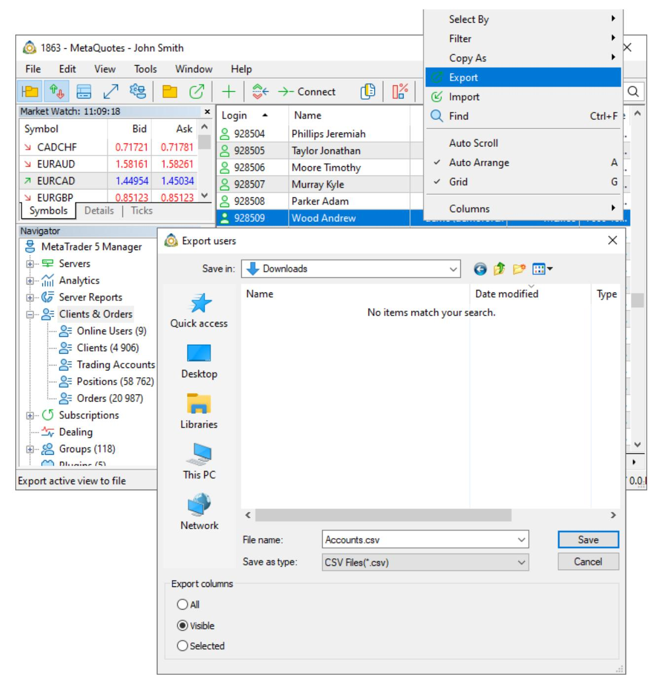

In the "Save as type" field, select the destination file format: \*.HTML or \*.CSV. Next, select the export option: The following export variants are available here:

·**All** — export all information, regardless of the currently selected columns.

- ·**Visible** — export only those columns that are currently enabled.
- ·**Selected** — open the below described window to manually specify columns for export.

In the Selected mode, you can define which client and account details should be sent to a file. In addition to the required columns, you can also define their order in the file.

| Available columns: | I Last name<br>D Middle name<br>I Registration Time<br>Last Access Time<br>I Last Access Address<br>I Bank Account<br>Trade account<br>$\blacksquare$<br>D Phone Password<br>Company<br>D Language | Insert -> | <-Remove | Sequence of columns in target file: | $\vee$ Login<br>$\vee$ Name<br>$\vee$ Group<br>$\vee$ Country<br>$\vee$ Balance | Up<br><b>Down</b><br>Reset |
|--------------------|----------------------------------------------------------------------------------------------------------------------------------------------------------------------------------------------------|-----------|----------|-------------------------------------|---------------------------------------------------------------------------------|----------------------------|
|                    |                                                                                                                                                                                                    | <b>OK</b> | Cancel   |                                     |                                                                                 |                            |

<span id="page-113-0"></span>

# Common errors

- · If a report is not available to you, check whether the report is configured on the server and whether your manager account has the necessary rights.
- · If the report does not contain the required clients, check whether your manager account has access to the relevant groups on the server.
- · If you receive no data when requesting any daily report (beginning with "Daily"), check if the generation of daily reports is enabled in the client group settings.
- · If the Analytics section does not feature metrics on advertising campaigns, make sure that you have a Finteza license and that your manager account has the necessary permissions.
- · A Finteza license is required to enable automated filling of "Lead source" and "Lead campaign" fields in accounts opened via the terminals.

<span id="page-114-0"></span>

# Attracting new clients

The success of a brokerage company primarily depends on the number of clients and their trading activity. The more clients you attract, the more trades they perform, the stronger your business becomes. On the other hand, traders are constantly looking for better deals and for more favorable trading conditions. That is why it is important to provide the best possible offerings in order to prevent clients from leaving for your competitors.

The MetaTrader 5 platform provides a plethora of ready-made solutions for attracting new clients:

- ·Mobile and web terminals for comfortable trading from anywhere in the world
- ·Deep links for highly efficient trader rooms
- ·Lead purchasing program that redirects traders to your servers
- ·Advertising on trading resources
- ·Business expansion capabilities through White Label partners
- ·Additional trading services to assist beginners
- ·Ability to offer sponsored hosting to increase customer loyalty and to increase trading volumes

The platform provides extra capabilities to evaluate the effectiveness of customer acquisition strategies. Native integration with the Finteza analytics and the built-in client management system enable the evaluation of various channels. Access statistics on how many people use mobile terminals, how purchased leads convert to real customers and how much they pay.

Use every opportunity to attract new users and to retain existing customers.

<span id="page-115-0"></span>

# MetaTrader 5 mobile terminals for iOS and

Mobile trading in MetaTrader 5 provides the ability to connect to your platform and to trade anytime and from anywhere in the world. With a smartphone or tablet with the MetaTrader 5 app for iOS or Android, your traders can access financial information, control their trading accounts and trade 24 hours a day.

Mobile trading enhances the overall user experience. Furthermore, in addition to building customer loyalty, mobile platforms can increase the broker's trading turnover by providing easy access to trading capabilities.

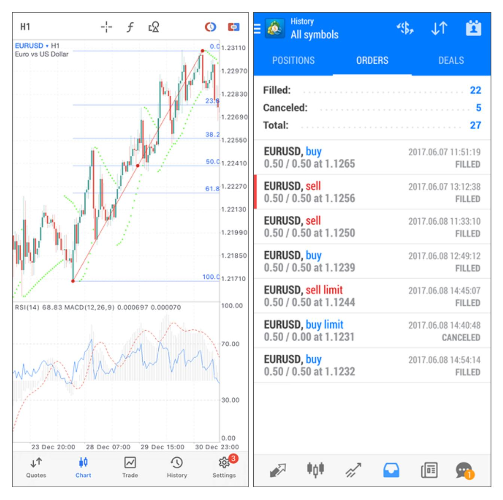

With [push notifications](#page-69-0) available on mobile devices, you will receive an additional communication channel. You will be able to reach your potential clients without even having their contact details.

Built-in [chats](#page-75-0) allow traders to communicate with each other, as well as provide an additional tool for broker's technical support. Traders can contact your support team directly and receive responses straight on their mobile device.

Due to all these exciting opportunities, mobile terminals can be considered an indispensable part of any brokerage business.

#### See also:

- ·[Documentation / MetaTrader 5 iPhone/iPad](https://www.metatrader5.com/en/mobile-trading/iphone/help)
- ·[Documentation / MetaTrader 5 Android](https://www.metatrader5.com/en/mobile-trading/android/help)

#### How to order a mobile terminal

Unlike the desktop platform, mobile terminals allow the connection only to those servers which are present in the list built into the application. If your company has no mobile terminal White Label, your trading platform will not be included into the list of servers, and traders will not be able to connect to it.

The general list of servers in all mobile terminals is updated automatically if 24 hours have passed since the last launch of the terminal:

- · After ordering a mobile terminal for one of the White Labels (as a separate component or as part of a package), the relevant WL's servers are added to the general list.
- · If a decision is made to cancel the mobile terminal of one of the White Labels, the relevant servers will be removed from the general list.

The mobile terminal White Label can be ordered via the [App Store](https://support.metaquotes.net/en/market/mt5?Text=mobile&Category=&vendor=1) section of the Support Center website.

You can order mobile terminals not only for your company, but also for your White Label. Your affiliates will be able to attract traders to their servers and maintain their own analytics.

See also: [Articles / White Label for MetaTrader 5](https://support.metaquotes.net/en/articles/252#mobile_terminal_wl)

#### Use proper download links

After you order a mobile White Label, your servers will be added to the list of available servers. Any trader will be able to download the mobile terminal from the relevant app store and connect to your server.

However, for maximum efficiency, we recommend that you use special download links for mobile terminals. Such links are available under the [White Label](https://support.metaquotes.net/en/market/whitelabel/mt5) section of the Support Center website.

```
https://download.mql5.com/cdn/mobile/mt5/ios?server=[list-of-your-servers]
https://download.mql5.com/cdn/mobile/mt5/android?server=[list-of-your-servers]
```

These links already feature your company's servers. When users download a mobile terminal from such a link, your platform will be immediately shown in the list of servers in the account opening/connection window. This is especially important for attracting new clients, as they are likely to request a demo account on your server.

You can also add UTM parameters to these links to track the efficiency of your client attraction strategies through mobile applications.

```
https://download.mql5.com/cdn/mobile/mt5/ios?utm_campaign=[your-campaign-id]&
server=[list-of-your-servers]
https://download.mql5.com/cdn/mobile/mt5/android?utm_campaign=[your-campaign-id]&
server=[list-of-your-servers]
```

The specified parameters will be automatically registered in the Lead Source and Lead Campaign fields of all trading accounts opened through terminals downloaded at such links. Based on UTM parameters, you can select specific accounts, filter [server reports](#page-81-0) and [analytical dashboards.](#page-103-0) All these details enable in-depth analytics on attracted traders, such as their country, trading activity, deposits, etc.

Lead Source and Lead Campaign data from terminal download links is registered in created accounts only if you have a [Finteza license](#page-90-0).

### Platform-side configuration

Make sure to properly configure account groups in your platform for the correct operation of White Labels and mobile terminals.

When registering a new WL, do not forget to add new or edit existing account groups to work under the label: simply select the necessary company name in the Company field of the group settings in MetaTrader 5 Administrator:

| Group:            | demo\forex-usd                                 |
|-------------------|------------------------------------------------|
|                   |                                                |
| Company           | Forex Broker                                   |
| Company site:     | forexbroker.com                                |
| Company email:    | mail@forexbroker.com                           |
| Deposit site:     | forexbroker.com/deposit                        |
| Withdrawal site:  | forexbroker.com/withdraw                       |
| Support site:     | forexbroker.com/[lang:en es pt ru]/landing-mt5 |
| Support email:    | support@forexbroker.com                        |
| Templates folder: |                                                |
|                   |                                                |
|                   | <b>OK</b> Cancel <b>Help</b>                   |

If no company name or an incorrect company name is specified in the account group settings, your traders will see the "invalid server name" error in mobile terminals and will not be able to connect to your platform:

The mobile terminal journal will feature the following logs:

You were trying to connect to ForexBroker-Server but have connected to a different server.

To fix the error, select a valid company name in the group settings and ask the trader to re-connect to your platform.

The exact company name is available in your White Label request, in the list of [White Labels](https://support.metaquotes.net/en/market/whitelabel/mt5) and in the relevant White Label [editing from](#page-146-0).

<span id="page-119-0"></span>

# Deep Linking in MetaTrader mobile terminals

Advanced deep linking technologies enable the redirection of users to predefined sections of the mobile application. The technology provides extensive opportunities in trading, such as navigation to the required account from the registration email or jumping to a trading operation in MetaTrader after receiving a signal in your analytical application.

# Website integration: increase conversions and improve customer experience

You can improve the mobile versions of your websites, make them more user-friendly and functional. Add links to the trader's room to switch to a mobile terminal for each account. By selecting the link, the client will switch to MetaTrader with the specified account and server specified automatically. The user will only need to enter the password. You can also add direct links to demo account opening in the mobile application — your potential customer can try trading in just a couple of clicks.

Another extremely important feature is deep-linking in registration emails. Add links to the emails that you send to customers upon account registration, and the users will not need to specify the account number and the server name manually. The relevant details will be substituted automatically, while the trader will only need to enter the password.

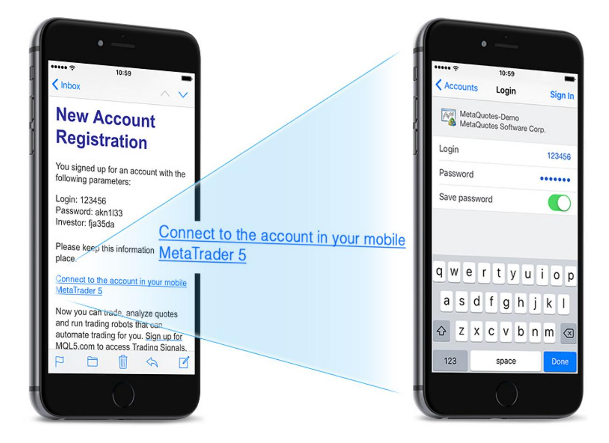

The fewer steps on the way to opening an account, the greater the chance that your potential customer will convert into a real one, and the real customer will stay longer with you.

# Integration with a mobile app: trading function to complement your analytics

Very few of top finance applications on Google Play and App Store offer trading features, while existing trading applications provide very limited functionality.

It is practically impossible to reach the performance and reliability offered by native applications even by using server plug-ins for integration. Many companies focus on providing pure analytics: quotes, technical and fundamental analysis, trading advice and news.

The capabilities of such applications can also be expanded through deep links that lead to MetaTrader. For example, if your application generates EURUSD buy signals, you can create a link that opens the Trade section of MetaTrader, in which the desired symbol is already selected. The trader will only need to specify volume and tap "Buy".

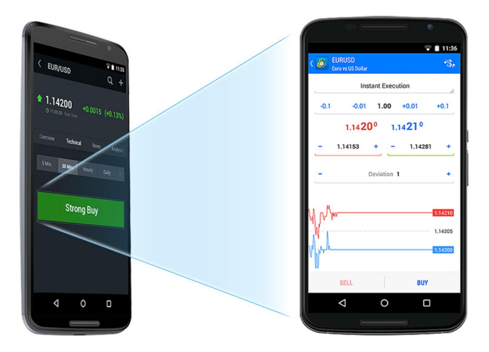

## How it works

Selection of a special hyperlink located on your website or in your application, opens the MetaTrader mobile app platform and a desired section in it. The link should start with metatrader5://... . The part of link before "://" is

called [a URL scheme.](https://ru.wikipedia.org/wiki/URL) Popular schemes are http, ftp, mailto etc. During installation, MetaTrader 5 terminals register the metatrader5 URL scheme in the operating system to enable the use of appropriate links on this device.

The general scheme of links:

metatrader5://path?par1=val1&...&parN=valN

Where:

- ·'path' is the destination section of the application
- ·'par' is the list of parameters

#### Connection to a specified account on the server

The link should contain the application section, to which you want to link your traders, as well as the 'login' and 'server' parameters containing the account number and the name of the server to connect to. Example:

metatrader5://account?login=123456&server=MetaQuotes-Demo

Upon a click on such a link, the MetaTrader 5 app starts and tries to connect to the specified account. If the account is already present in the terminal and has a predefined password, connection is performed successfully. Otherwise, the account connection form is shown with the account and server already specified, and a user is prompted to enter the password. A server name should exactly match the name in the White Label.

- · If the server name is not specified, the server of the current account or of the first account from the list will be used.
- · If the account number is not specified, and the server name is specified, any account from the specified server will be selected. If there are no such accounts, the scheme will not be executed.
- · If both the account and the server are not specified, the current account or the first account from the list will be used.

#### Link to a specified section

In order to forward users to the specified section, specify the appropriate 'path' value in the link:

```
metatrader5://<path>?login=123456&server=MetaQuotes-Demo
```

After <path>, you can specify the account number and the server name, to which the terminal should connect before opening the section. If the account or server is not specified, the connection rules described above apply.

- ·account — no specific section will be opened; it is used for connection to a specified account and server.
- · marketwatch — quotes. The example contains the additional 'symbols' parameter, in which financial instruments to be displayed in the window are specified.

metatrader5://marketwatch?server=MetaQuotes-Demo&symbols=USDRUB,XAUUSD,%23DIS,%23IBM

·chart/symbol/period is a chart with the specified symbol and timeframe, e.g.:

metatrader5://chart/XAUUSD/H1?server=MetaQuotes-Demo

·trade — Trade tab, the list of open positions and orders, e.g.:

metatrader5://trade?server=MetaQuotes-Demo

· trade/symbol — a trade dialog, from which a trading operation on the specified symbol can be performed, e.g.:

metatrader5://trade/SILVER?server=MetaQuotes-Demo&login=1145990

Illegal characters in URI links must be encoded. For example, the #GOOG must be specified as % 23GOOG. Names of financial instruments are case sensitive.

Some email services may erase links beginning with "metatrader4://" or "metatrader5://". In this case, instead of deep link, insert a link to a certain section of your website, which in turn re-directs users to the mobile application.

#### Additional parameters

It is possible to specify additional parameters for each deep linked section:

- ·'login' and 'server' can be used for connection with the specified account number and server name.
- · symbols — one or more symbols separated by commas, which should be added to the Quotes section after connection to an account defined by the 'login' and 'server' parameters. Illegal characters in URI links must be encoded. For example, the #GOOG must be specified as %23GOOG. Names of financial instruments are case sensitive. The indicated symbols do not replace those already existing in the Quotes section, while they are added to the current list.

<span id="page-123-0"></span>

# MetaQuotes Leads

MetaTrader 5 Web Terminal allows users to trade in financial markets from any web browser. It works in all operating systems and browsers, while requiring no extra software installations. The application is safe to use: the transmitted data is securely encrypted.

The Web Terminal allows placing all types of market and pending orders, as well as supports one-click trading. Traders can view real-time quotes and analyze charts using basic graphical objects and thirty technical indicators.

The terminal is a modern HTML5 application that can be easily integrated into any website via a simple iframe widget.

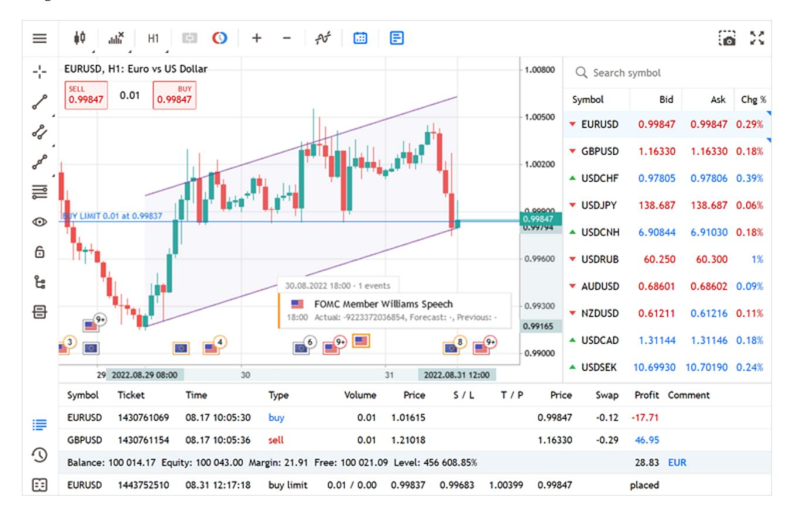

The web terminal is located entirely on the broker's access servers. It operates as an individual web terminal, which only works with your platform. This provides maximum security and full control for the broker.

When connecting to the web terminal via your website, the trader should only enter the login and password, without having to select a server. The platform will determine which server (demo, real, main or additional trading server) the account belongs to. For the seamless web terminal integration with the clients area on the broker website, the user login can be pre-selected to let your client enter a password only. If a user saves a password in a browser storage, the account will be connected automatically on the next run.

## Web Terminal benefits for brokers

The web terminal provides an opportunity to attract new clients by lowering the entry threshold. The web terminal provides fewer functions, and yet it offers everything a trader may need to get started. For example, there are no algorithmic trading features, Market or Signals. It will be easier for the trader to understand the main terminal features.

Also, the web terminal provides complete device independence. The terminal can be accessed from any device powered by Windows or macOS, as well tablet or phone. The user will only need a web browser to manage the account. Your clients can trade from anywhere, and thus you can generate additional profits from increased trade volumes.

To obtain the terminal, please [order it via the App Store section](https://support.metaquotes.net/en/market/product/248)of the Support website.

## How to set up the platform

The web terminal operates on an [access server](https://support.metaquotes.net/en/docs/mt5/platform/components/access_server) which acts as a web server.

Register a domain (or a subdomain for your existing domain) where the web terminal will run. Below we use the domain webtrading.broker.com as an example — you should replace it with your own domain.

Associate your domain with the [public IP address](https://support.metaquotes.net/en/docs/mt5/platform/administration/admin_network/network_add_edit/network_access_server#public) of your access server. For this purpose, the appropriate record must be specified on the DNS hosting. For example, for webtrading.broker.com host, the following entry should be registered in DNS: "XXX.XXX.XXX.XXX webtrading.broker.com", where XXX.XXX.XXX.XXX is the public address of the access server.

Next, open Integration \ Web services in MetaTrader 5 Administrator and add an SSL certificate for the domain. The certificate will enable connections to the access server using the HTTPS protocol.

You can add extra certificates for your White Label partners to provide a separate web terminal for each required company's domain. After that, in the relevant field, specify which company the domain belongs to.

It is recommended to have port 443 available on the server for HTTPS connections. In this case, your clients will not need to explicitly specify the port in the address bar to open the web terminal page.

No other settings are needed. Your web terminal will be available at https://webtrading.broker.com/terminal/.

See also: [Documentation / MetaTrader 5 Administrator / Integration / Web Services](https://support.metaquotes.net/ru/docs/mt5/platform/administration/integration/integration_web_services)

#### If you have multiple access servers

For each platform we recommend using at least two access servers: for the main and backup configuration. As your customer database grows and your business geography expands, the number of servers will increase to ensure high-quality service.

To enable connections to your web terminal via any of your access servers, add A-records with their public addresses to the DNS server. Thus, you will have several records with different addresses but with the same domain:

```
XXX.XXX.XXX.XXX webtrading.broker.com
YYY.YYY.YYY.YYY webtrading.broker.com
ZZZ.ZZZ.ZZZ.ZZZ webtrading.broker.com
```

XXX, YYY and ZZZ are the addresses of your access servers. There can be any number of them.

No additional actions are required on the platform side. The domain certificate uploaded via the Integration \ Web Services section is used for all access servers.

To balance the load by distributing connections to the web terminal between access servers, use GeoDNS or GLSB services. Please check with your hosting provider whether this service is available.

#### How to add the web terminal to your site

To install the web terminal on your site, simply place the <iframe> tag on the desired page. The address of your web terminal should be specified as the source in this tag:

```
<!DOCTYPE html>
<html>
<head>
  <meta charset="UTF-8">
  <title>Web Terminal</title>
</head>
<body>
  <iframe src="https://webtrading.broker.com/terminal?
mode=connect&marketwatch=EURUSD,GBPUSD,USDJPY&utm_campaign=webterminal&utm_source=site"
width="100%" height="1000"></iframe>
</body>
</html>
```

Additional web terminal settings can be specified as URL parameters:

```
<iframe src="https://webtrading.broker.com/terminal?
parameter1=value1&parameter2=value2"></iframe>
```

The following parameters are supported:

**first\_name, second\_name, email** — first name, last name and email to be inserted into the demo and real account registration form. By using these parameters, you can make account opening easier for traders who have already registered on your site and provided the required data. Example:

```
https://webtrading.broker.com/terminal?
mode=demo&first_name=John&second_name=Smith&email=johnsmith%40mail.com
```

Please note that the example includes the "mode=demo" parameter to automatically open the demo account registration form upon the web terminal launch.

<span id="page-126-0"></span>**utm\_campaign, utm\_source** — utm parameters that will be added to the [relevant fields of accounts](#page-191-0) opened via the web terminal. Using them, you can analyze how efficiently you attract traders via web terminals. For further details please see ["How to track accounts opened via the web terminal".](#page-128-0) Example:

https://webtrading.broker.com/terminal?utm\_campaign=webterminal&utm\_source=site

The parameters are used only at the first start. After that the web terminal will use the user-specified data.

**mode** — the web terminal page that opens on first launch. Supported values:

- ·demo — demo account registration form
- ·real — real account registration form
- ·connect — existing account connection form

https://webtrading.broker.com/terminal?mode=connect

The parameter is used only if the user has not previously connected to the account. If the web terminal has a saved account, it will be connected immediately upon startup.

**login** — trading account for connection. If this parameter is specified, the web terminal will be launched with a pre-filled account connection dialog. The user will only have to enter a password. Use this parameter to create convenient client areas.

https://webtrading.broker.com/terminal?login=123456

If an account is specified in the URL, no demo account will be crated at the first launch (the option is managed via [platform settings\)](#page-9-0). This also prevents from connecting using a previously saved account.

**marketwatch** — the list of symbols to be displayed by default in Market Watch is specified by the marketwatch parameter. Example:

https://webtrading.broker.com/terminal?marketwatch=EURUSD,GBPUSD,AUDCAD,USDJPY

The parameter also determines the order in which the symbols are displayed. In the example above, on the first web terminal launch the user will see only four specified symbols in the Market Watch window, EURUSD will be the first and USDJPY will be the last. Later the user can re-configure the list of symbols, and the new settings will be saved in the browser. The maximum number of symbols in the parameter is 300.

**theme-mode** — theme for the application interface. Possible values:

- ·0 — light (default)
- ·1 — dark

https://webtrading.broker.com/terminal?theme-mode=1

The parameter is only used for the first start. After that the web terminal will use user-specified settings. If necessary, you can force a user-defined theme to be overridden. This may be useful, for example, if your site supports light and dark themes. This will allow the synchronization of interface switching modes of the site and the web terminal.

To switch the color scheme of the web terminal, call postMessage on the <iframe> element, through which the web terminal is loaded. Specify the parameters type: 'mt5\_update' and theme-mode: 0 (for the light theme) or 1 (for the dark theme):

```
const iframe = document.getElementById('iframe');
iframe.contentWindow.postMessage({
  type: 'mt5_update',
  'theme-mode': 1,
}, '*');
```

**theme** — color scheme for the application interface. Possible values:

- ·greenRed — red and green (default)
- ·blueRed — blue and red
- ·blackWhite — black and white
- ·neutral — neutral

https://webtrading.broker.com/terminal?theme=blueRed

The parameter is used only at the first start. After that, the web terminal will apply user-specified settings.

**lang** — web terminal interface language. The following languages are currently supported:

· English (en), Arabic (ar), Bulgarian (bg), Czech (cs), Chinese Simplified (zh), Chinese Traditional (zt), Hebrew (he), Hungarian (hu), Dutch (nl), French (fr) ), German (de), Greek (el), Hindi (hi),

· Indonesian (id), Italian (it), Japanese (ja), Korean (ko), Malay (ms), Persian (fa), Polish (pl), Portuguese (pt), Romanian (ro), Russian (ru), Spanish (es), Thai (th), Turkish (tr), Ukrainian (uk), Uzbek (uz), Vietnamese (vi)

https://webtrading.broker.com/terminal?lang=de

The parameter is used only at the first start. After that, the web terminal will apply user-specified settings.

The parameter is only used for the first start. Then the web terminal will apply user-specified settings.

The size of the web terminal window on the page can be set using standard "width" and "height" parameters in the <iframe> tag, for example:

```
<iframe src="https://webtrading.broker.com/terminal" width="100%"
height="1000"></iframe>
```

Generally we recommended to set the width and height to 100% so that the web terminal block takes up all the available web page space. If you specify an absolute size in pixels, some elements may be out of the visible window on some devices.

#### How to set up the account opening form

To configure the account opening form, use MetaTrader 5 Administrator. Go to the Clients & Account \ Allocations section and set available account types, leverages and balance.

#### Security settings

Prevent the web terminal page from loading in IFRAME. An attacker can place an invisible IFRAME containing the page of your website with the web terminal and combine the web terminal control element (such as a button) with another link on their website. Thus, when clicking a link, a user may actually perform an action necessary to the attacker.

Add [X-Frame-Options: DENY](https://developer.mozilla.org/en-US/docs/Web/HTTP/X-Frame-Options) HTTP header to your page containing the web terminal in order to disable page loading in IFRAME and protect users.

Only use the web terminal widget on https pages. The page on which the widget is installed must work over a secure https protocol (not http). Otherwise, the operation of the web terminal will not be possible in some browsers (for example Chrome version 60 and higher).

<span id="page-128-0"></span>

#### How to track accounts opened via the web terminal

Special UTM parameters are added to all accounts opened via the web terminal. Such UTM parameters inform the broker that the potential client has come from a web terminal operating on the broker's website. The UTM tags are added to the [trading account parameters](#page-191-0):

· The Comment field will contain "WebTerminal [short name of the domain from which the account was opened]". Example: "WebTerminal mysite.com". The "www" part is removed from the address.

- · The domain name with 'www' is also added in the 'Lead source' field. Example: "www.mysite.com". The value can be overridden by adding utm\_source to the widget parameters.
- · The 'Lead campaign' field is not filled by default. You may add utm\_campaign to widget parameters in order to write the name of your marketing campaign to this field.

To use your own UTM parameters for tracking clients, add the [utm\\_source and utm\\_campaign parameters](#page-126-0) to the web terminal widget.

| Name          | John Smith        |
|---------------|-------------------|
| Company       | Individual        |
| Language      | English           |
| MetaQuotes ID | 56DC7613          |
| Lead campaign | web.demo          |
| Lead source   | www.abcbroker.com |
| Email         | john@smith.com    |
| Phone         | +12251325673      |
| Country       | United States     |
| State         | New York          |
| City          | New York          |
| Zip code      | 4032              |
| Address       | 24 Wall st.       |
| Comment       | abcbroker.com     |

For the widget added to the www.abcbroker.com site, account parameters will be filled as follows:

- ·Comment = WebTerminal
- ·Lead source = www.abcbroker.com
- ·Lead campaign = web.demo

#### Mobile version of the web platform

The MetaTrader 5 web platform includes a special version adapted for iOS and Android smartphones and tablets. This enables convenient trading from mobile browsers in addition to desktop ones.

No additional settings for the mobile version are needed. The web terminal will automatically detect the user's device by the browser's "user-agent" and will adapt the interface.

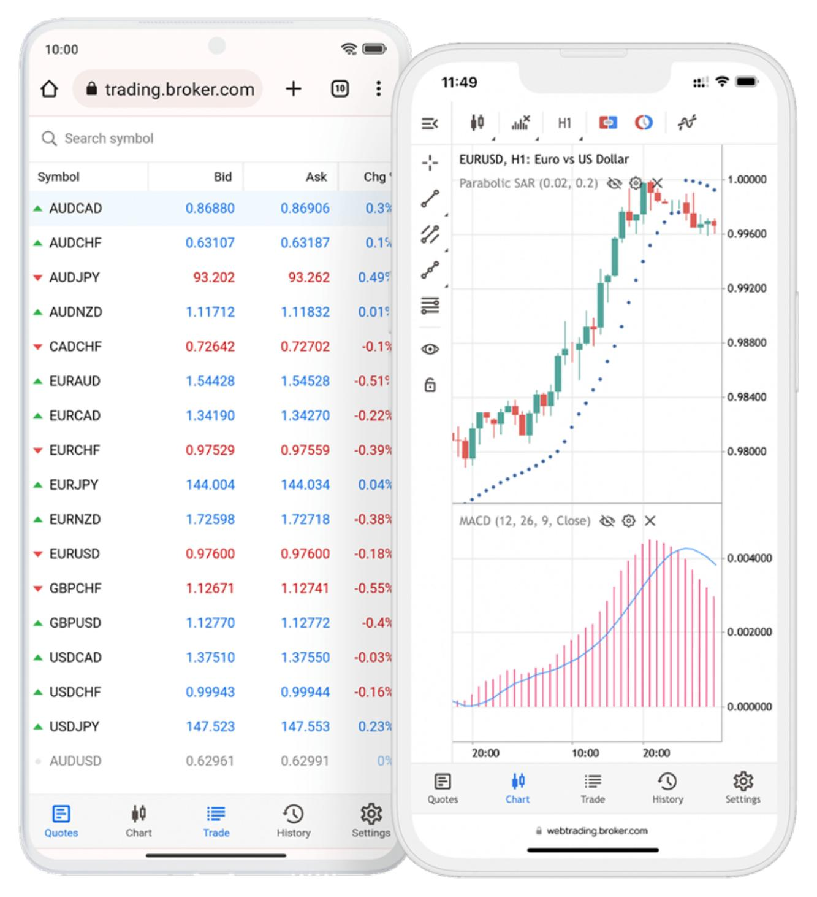

You can also embed a web terminal in your mobile app. To do this, create a web form in it with the web terminal <iframe>.

#### Minimum browser versions

The web terminal supports the following web browser versions and above:

·Microsoft Edge 15

- ·Mozilla Firefox 54
- ·Google Chrome 51
- ·Safari 12
- ·Opera 38

#### Troubleshooting

If a trader receives a 404 error when trying to open the web terminal page, check the following:

- ·The SSL certificate you uploaded in the Integration \ Web Service section is valid and has not expired
- · Your company name is specified correctly in the SSL certificate — it must match the company name specified in the license/White Label
- ·Your platform does not run under a test license — in this case the web terminal is not available
- ·The web terminal is included in your platform license. Contact the [support team](https://support.metaquotes.net/en/support) to check the license

### Web terminal widget example

```
<!DOCTYPE html>
<html lang="en">
<head>
 <meta http-equiv="Content-Type" content="text/html; charset=utf-8">
 <title>WebTerminal for the MetaTrader 5 platforms</title>
 <style type="text/css">
 body {margin: 0; padding: 0; font-family: Arial, Tahoma; font-size: 16px; color:
#000; background-color: #FFF; min-width: 1010px}
 .top {background-color: #0055A7;}
 .top h1 {margin: 10px 20px 10px 10px; font-size: 25px; font-weight: normal; color:
#FFF; display: inline-block; vertical-align: middle; }
 .top .menu, .top .menu li {margin: 0; padding: 0; list-style: none; display:
inline-block; vertical-align: middle; }
 .top .menu li {margin: 0; padding: 0; list-style: none; display: inline-block;}
 .top .menu li a {padding: 20px; font-size: 16px; color: #FFF; text-decoration:
none; text-align: center; display: block;}
 .top .menu li a:hover {background-color: #0B6ABF;}
 .top .menu li a.selected {background-color: #2989DF; color: #FFF;}
 .content { box-shadow: 0 0 20px rgba(0,0,0,0.5); position: relative; }
 .footer {text-align: center; padding: 20px; color: #0A0A0A; font-size: 14px}
 </style>
</head>
<body>
 <div class="top">
 <h1>BROKER</h1>
 <ul class="menu">
 <li><a href="#">Analytics</a></li>
```

```
 <li><a href="#" class="selected">WebTerminal</a></li>
 <li><a href="#">News</a></li>
 <li><a href="#">Contacts</a></li>
 </ul>
 </div>
 <div class="content">
 <!-- Web Terminal Code Start -->
 <iframe src="https://webtrading.broker.com/terminal?
mode=connect&marketwatch=EURUSD,GBPUSD,USDJPY&utm_campaign=webterminal&utm_source=site"
width="100%" height="1000"></iframe>
 <!-- Web Terminal Code End -->
 </div> 
 <div class="footer">
 Copyright 2000-2015, Broker
 </div>
</body>
</html>
```

<span id="page-133-0"></span>

# MetaQuotes Leads

Brokerage companies have a unique opportunity to purchase leads with verified contact details for the MetaTrader 5 trading platform. You order leads from preferred countries and start registering new accounts on your demo server. Instead of searching for customers, you can obtain registered users with real contact information. Connect your sales team and convert such leads into paying customers.

The lead generation program is based on targeting options in [the Finteza Analytics system.](https://www.finteza.com/) When the user downloads MetaTrader 5 form MetaQuotes' corporate resources, Finteza analyzes user parameters. Users from target countries will be automatically offered to open a demo account on your trading server. Furthermore, the trader's contact details are validated during registration.

Each completed account opening event is tracked in Finteza. You only pay if a user has opened a demo account and an appropriate event has been confirmed in the tracker. Potential client data with complete contact details instantly appear in your MetaTrader 5 platform. The information is available in Manager and Administrator terminals and can further be exported to any CRM or BI system for further analysis.

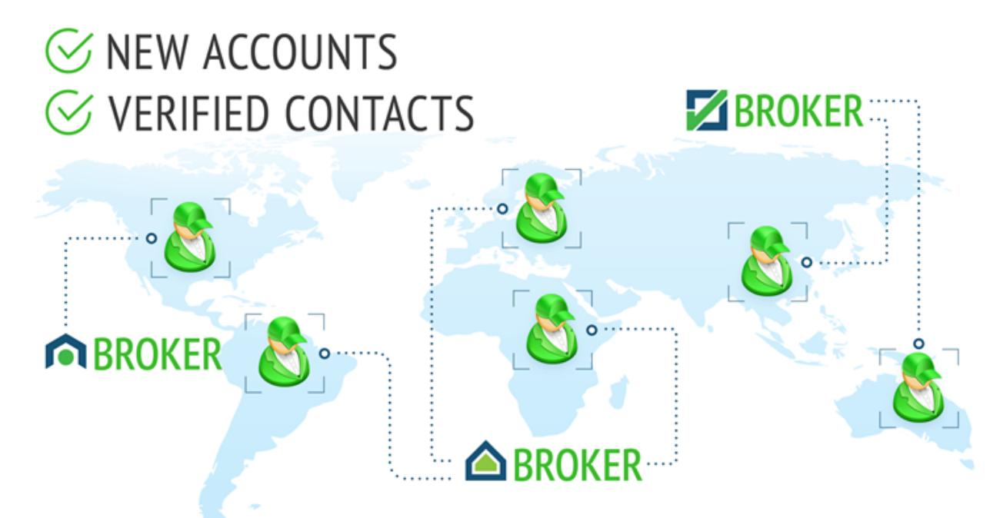

# Lead generation process

1. The user downloads the client terminal from MetaQuotes' corporate websites (metaquotes.net, metatrade4.com, metatrade5.com, mql4.com and mql5.com) or from advertising sources.

Terminals downloaded from brokers' websites can only connect to the relevant broker's servers registered in WL and licenses. Such downloads do not participate in the program.

2. The user installs and launches the downloaded terminal for the first time.

3. Finteza checks targeting options. If the user falls under the specified criteria, such as the target country, then only your servers will be displayed in the connection list in the trading terminal.

4. The user is automatically prompted to open a demo account on your server.

Pay attention that analytics only cover open accounts. If the user does not complete the required actions, the event will not be registered in the analytical system.

To start receiving verified contact details of traders during account registration, set up [email and phone](#page-29-0) [confirmation](#page-29-0). This is a key step towards efficient potential customer management.

5. Information about the potential client will be added directly to your MetaTrader 5 and to your Finteza tracker. The events related to new demo accounts registered on your server are confirmed in the tracker. These events can also be monitored from the MetaTrader 5 Manager or Administrator terminal.

Special UTM parameters are used for tracking:

- ·utm\_source=metaquotes
- ·utm\_campaign=install.metaquotes

6. Your sales managers can start working with these potential clients in an effort to convert them into real accounts. A client can be contacted using [built-in communication channels:](#page-63-0) email, push notifications, SMS and others.

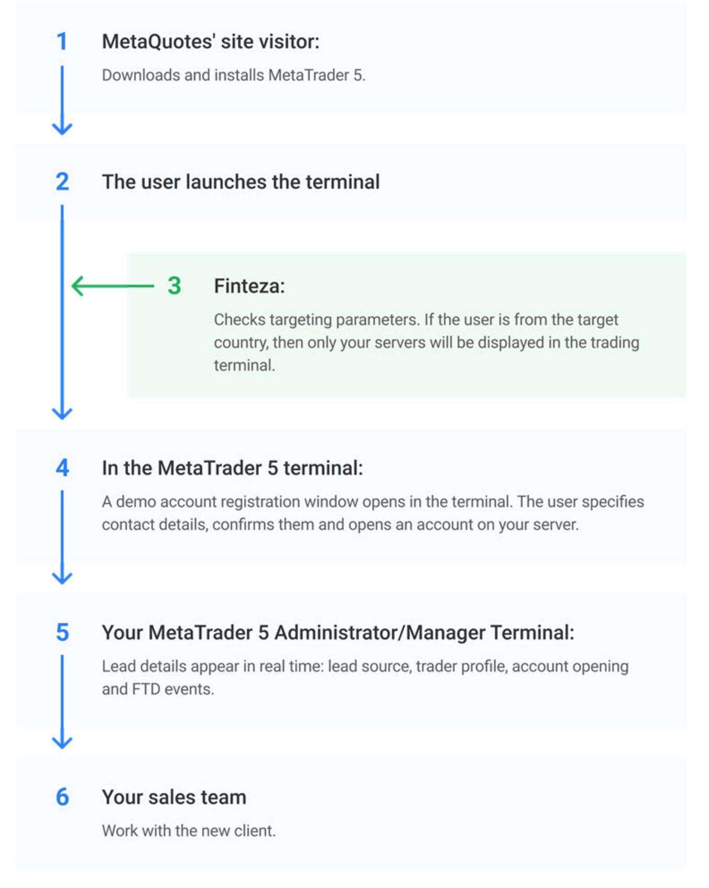

# Configure onboarding functions in MetaTrader 5

First, you should enable verification of contact details, opening of [demo accounts](#page-7-0) and request of [real accounts](#page-17-0) straight from the terminal.

MetaTrader 5 provides the ability to [validate phone numbers and emails](#page-29-0) as specified by users when opening accounts from client terminals. The option is implemented through the integration of email and SMS services. If you do not enable the contact verification option, traders can indicate invalid phone numbers and emails during registration.

| Label                                      | Value                                                                                                             |
|--------------------------------------------|-------------------------------------------------------------------------------------------------------------------|
| Open an Account: MetaQuotes Software Corp. |                                                                                                                   |
| Opening a demo account                     | A demo account allows trading with virtual money and learn without risk                                           |
| First name:                                | John                                                                                                              |
| Second name:                               | Smith                                                                                                             |
| Email:                                     | john@smith.net<br>Confirmation code                                                                               |
| Mobile Phone:                              | +1 (Canada, United States)<br>2296398522<br>Confirmation code                                                     |
|                                            | We have sent confirmation codes to your phone and email. Please specify them.                                     |
|                                            | ∨ Use hedge in trading                                                                                            |
|                                            | Server: MetaQuotes-Demo                                                                                           |
| Account type:                              | Demo-Hedging<br>✓                                                                                                 |
| Deposit:                                   | USD, virtual money to be deposited to your account<br>100000<br>✓                                                 |
| Leverage:                                  | virtual credit funds to be provided by the broker for trading<br>1:100<br>✓                                       |
|                                            | I agree with the terms and conditions for opening an account and the data protection policy<br>www.metaquotes.net |
|                                            | < Back<br>Next                                                                                                    |

Traders can request real accounts straight from client terminals, while MetaTrader 5 integration with [KYC](#page-56-0) [services](#page-56-0) minimizes manual procedures related to data verification and document validation. A potential client fills out a form, submits the required documents and receives a preliminary account. You can configure the fields to be filled during registration in the MetaTrader 5 Administrator. Such accounts requested via client terminals are created with zero balance, under special preliminary groups. Trading is disabled for such groups, but preliminary accounts can be moved to a real group after relevant checks.

Create separate groups for different countries, currencies and account types. This will enable automatic forwarding of registrations to appropriate regional sales departments and will enable clients to select desired trading conditions (for example, to request a standard, mini or micro account). Set up the live account registration feature once, and this option will be available to all MetaTrader 5 users.

| Open an Account:       | Broker                                                           |
|------------------------|------------------------------------------------------------------|
| Opening a real account | A real account is required for live trading on financial markets |

Trade real or virtual money and gain experience

| State:    | New York       |
|-----------|----------------|
| City:     | New York       |
| Zip code: | 123456         |
| Address:  | 24 Wall St, 15 |

Please take photos of your documents and upload them here without any ε

| Identity: | Passport | $C4$ | John Smith.Person.jpg |
|-----------|----------|-------|-----------------------|
|-----------|----------|-------|-----------------------|

| Open a real account for live trading | A real account requires additional proof of identity |       |                        |
|--------------------------------------|------------------------------------------------------|-------|------------------------|
| Address:                             | Utility bill                                         | $C7$ | John Smith.Address.jpg |

| Open an Account:       | Broker                                                           |
|------------------------|------------------------------------------------------------------|
| Opening a real account | A real account is required for live trading on financial markets |

| First name:                                                                                                                                            | John             |     |            |
|--------------------------------------------------------------------------------------------------------------------------------------------------------|------------------|-----|------------|
| Second name:                                                                                                                                           | Smith            |     |            |
| Middle name:                                                                                                                                           | optional         |     |            |
| Date of birth:                                                                                                                                         | 12/13/1989       |     |            |
| Gender                                                                                                                                                 |                  |     |            |
| Language:                                                                                                                                              | English          | $$ |            |
| Email:                                                                                                                                                 | john@smith.com   |     |            |
| Mobile Phone:                                                                                                                                          | +1 United States | $$ | 4845551243 |
| Use hedge in trading                                                                                                                                   |                  |     |            |
| Country:                                                                                                                                               | Cyprus           | $$ |            |
| Account type:                                                                                                                                          | Real USD         | $$ |            |
| Personal details are used for opening a trade account and are not passed to any third parties. The information is handled securely and confidentially. |                  |     |            |
| <Back   Next   Cancel                                                                                                                                  |                  |     |            |

In addition, the MetaTrader 5 client terminal provides a fast switch for deposit and withdrawal operations in the broker website. Clients will be able to get to the desired section directly from client terminals. All relevant transactions will be performed through your site(s), while the functions only redirect users to the appropriate pages. Enable deposit and withdrawal commands to provide to traders easy access to balance operations.

## **Tracking and end-to-end analytics in Finteza and in MetaTrader 5**

The entire client conversion path can be tracked in Finteza. This applies to any customer acquisition channels, including MetaQuotes Leads and all other traffic sources.

Available features:

- · End-to-end analytics in client terminals and websites, deposit tracking and customer lifetime value reports (LTV) by traffic sources.
- · Trader profiling enriching client records. Access to extended information increases the efficiency of your client acquisition and retention strategies and also assists in saving resources at the sales stage.
- · Conversion funnels can be used to determine efficient client attraction channels, as well as to find new ROMI and conversion rate boosters.
- · A two-stage bot traffic detection system can reduce advertising budget costs. Advertising partners may deliver bot traffic if you do not control the traffic quality. Finteza provides efficient and reliable quality control tools.
- · Website loading speed reports by country and device. Measure your website loading speed in target countries. If a page loads for more than 3 seconds, you are definitely losing conversions along the entire process, from registration to deposits. This leads to inefficient budgeting of your customer attraction strategies.
- ·An advertising engine with a retargeting option based on site visits and user actions in the platform.

All analytical reports feature full unsampled data. You always access complete real-time information about user actions.

Finteza is the only system which can analyze user behavior in MetaTrader terminals:

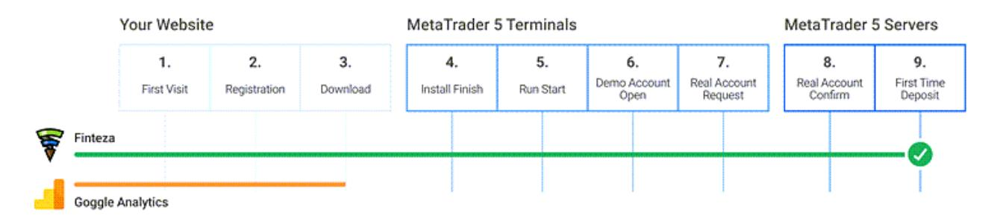

By default, the Finteza panel displays data on terminal installations and launches. You can additionally enable an expanded list of events:

- ·Demo and preliminary account opening
- ·Opening of windows and panels inside the terminal
- ·Launch of indicators and Expert Advisors
- ·Trades performed automatically by trading robots and manual trades

- ·Usage of [MQL5.community](https://www.mql5.com/) services
- ·Usage of Strategy Tester and MetaEditor
- · Server events related to client accounts: live account creation, moving of a preliminary account to a real group and first account deposit

[Enabled advanced analytics](#page-90-1) under the "Integration \ Finteza Analytics" section in MetaTrader 5 Administrator.

## **Benefits of MetaQuotes Leads**

- ·The program drives targeted users with validated contact details.
- · The targeting option allows the selection of preferred countries or allows a limitation in the number of accounts from specific countries.
- · You receive full control over the client acquisition process. Relevant statistics are available in the Finteza panel and in the MetaTrader 5 Manager and Administrator terminals.
- · You can boost the efficiency of your lead management strategies and deliver useful information using onboarding and contact options directly in the platform.

You can order leads in the [App Store](https://support.metaquotes.net/en/market/product/550) section of the Support Center website.

# <span id="page-140-0"></span>**Advertising on specialized sites**

Searching for new clients on financial and trading resources is one of the most obvious strategies. Such resources usually feature the target audience of brokerage companies.

You can promote your company and trading conditions on [www.mql5.com,](https://www.mql5.com) [www.mql4.com](https://www.mql4.com/), [www.dolar](https://www.dolar-colombia.com/)[colombia.com](https://www.dolar-colombia.com/) and [www.currencyconverterx.com.](https://www.currencyconverterx.com/) These are finance-related websites, which are visited by your potential clients. Advertising on these sites is one of the shortest paths to traders.

## **MQL5.com**

[www.mql5.com](https://www.mql5.com/) is our flagship website with the highest traffic from all over the world. The site features a massive knowledge base and is a unified portal for trading services: Market, Signals, Freelance, VPS, Quotes and CodeBase.

- ·4,000,000 unique visitors per month
- ·25,000,000 page views

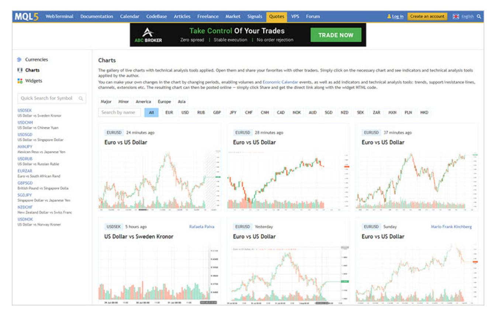

To order advertising, go to the [App Store](https://support.metaquotes.net/en/market/product/542) section of the Support Center website.

## **MQL4.com**

[www.mql4.com](https://www.mql4.com/) is the MetaTrader 4 user community, featuring an online MQL4 programming language tutorial and the MQL4 Language Reference, both in English and Russian. Site visitors are people who want to learn more about the MetaTrader 4 platform and about the relevant development of trading robots.

- ·80,000 unique visitors per month
- ·600,000 page views

|                                                                                                                                                                                                                                                                                                                                                                                                                                                                                                                                                                         | <b>WebTerminal</b>                                                                                        | <b>Documentation</b> | <b>Book</b>                                                                                                                                                                                                                                                                                                                                                                                                                                                                    |               |         |             | TA Calendar Code-Base Articles Freelance Market Signals VPS Forum                                                       |                                        |                                                                                                                                                                                                                                                                                                                               | & Login                                                                                                                                                                                                                                                                                                                                                                                                                                                                                                                                                                                                                                                                                                                                                                                                                                                                                                                                                                                                                                                                                                                                                                                                                                                                                                                                                                                                                                                                                                                                                                                                                                                                                                                                                                                                                                                                                                                                                                                                                                                                                                                                                                                                                                                                                                                                                                                                                                                                                                                                                        | Registration | <b>CHE English</b>   |
|-------------------------------------------------------------------------------------------------------------------------------------------------------------------------------------------------------------------------------------------------------------------------------------------------------------------------------------------------------------------------------------------------------------------------------------------------------------------------------------------------------------------------------------------------------------------------|-----------------------------------------------------------------------------------------------------------|----------------------|--------------------------------------------------------------------------------------------------------------------------------------------------------------------------------------------------------------------------------------------------------------------------------------------------------------------------------------------------------------------------------------------------------------------------------------------------------------------------------|---------------|---------|-------------|-------------------------------------------------------------------------------------------------------------------------|----------------------------------------|-------------------------------------------------------------------------------------------------------------------------------------------------------------------------------------------------------------------------------------------------------------------------------------------------------------------------------|----------------------------------------------------------------------------------------------------------------------------------------------------------------------------------------------------------------------------------------------------------------------------------------------------------------------------------------------------------------------------------------------------------------------------------------------------------------------------------------------------------------------------------------------------------------------------------------------------------------------------------------------------------------------------------------------------------------------------------------------------------------------------------------------------------------------------------------------------------------------------------------------------------------------------------------------------------------------------------------------------------------------------------------------------------------------------------------------------------------------------------------------------------------------------------------------------------------------------------------------------------------------------------------------------------------------------------------------------------------------------------------------------------------------------------------------------------------------------------------------------------------------------------------------------------------------------------------------------------------------------------------------------------------------------------------------------------------------------------------------------------------------------------------------------------------------------------------------------------------------------------------------------------------------------------------------------------------------------------------------------------------------------------------------------------------------------------------------------------------------------------------------------------------------------------------------------------------------------------------------------------------------------------------------------------------------------------------------------------------------------------------------------------------------------------------------------------------------------------------------------------------------------------------------------------------|--------------|----------------------|
|                                                                                                                                                                                                                                                                                                                                                                                                                                                                                                                                                                         |                                                                                                           |                      |                                                                                                                                                                                                                                                                                                                                                                                                                                                                                | <b>BROKER</b> |         |             | Trade 160+ Instruments From One Account<br>Forex   Metals   Energies   Crypto   Stocks   Indices                        |                                        | <b>OPEN ACCOUNT</b>                                                                                                                                                                                                                                                                                                           |                                                                                                                                                                                                                                                                                                                                                                                                                                                                                                                                                                                                                                                                                                                                                                                                                                                                                                                                                                                                                                                                                                                                                                                                                                                                                                                                                                                                                                                                                                                                                                                                                                                                                                                                                                                                                                                                                                                                                                                                                                                                                                                                                                                                                                                                                                                                                                                                                                                                                                                                                                |              |                      |
| <b>MQL4 Reference</b>                                                                                                                                                                                                                                                                                                                                                                                                                                                                                                                                                   |                                                                                                           |                      |                                                                                                                                                                                                                                                                                                                                                                                                                                                                                |               |         |             |                                                                                                                         |                                        |                                                                                                                                                                                                                                                                                                                               |                                                                                                                                                                                                                                                                                                                                                                                                                                                                                                                                                                                                                                                                                                                                                                                                                                                                                                                                                                                                                                                                                                                                                                                                                                                                                                                                                                                                                                                                                                                                                                                                                                                                                                                                                                                                                                                                                                                                                                                                                                                                                                                                                                                                                                                                                                                                                                                                                                                                                                                                                                |              |                      |
| · MQL5 features<br>· Language Basics<br><b>Structures</b><br>· MQL4 programs<br>· Predefined Variables<br>· Common Functions<br>· <b>Array Functions</b><br>Conversion Functions<br>· Math Functions<br>· String Functions<br>. Date and Time<br>· Account Information<br>• Checkup<br>· Market Info<br>- Chart Operations<br>· Trade Functions<br>· Trade Signals<br>· File Functions<br>· Custom Indicators<br>· Object Functions<br>· Technical Indicators<br>- Worlding with Events<br>· Obsolete functions<br>· List of MOL4 Functions<br>. List of MOL4 Constants | · Constants, Enumerations and<br>· Timeseries and Indicators Access<br>· Global Variables of the Terminal |                      | <b>MOL4 Reference</b><br>technical indicators (oustom indicators), scripts and libraries.<br>Programs written in MetaQuotes Language 4 have different features and purposes:<br>implementing of analytical functions only.<br>Custom indicators are stored in terminol_directory.MQL4\Indicators<br>Scripts are stored in terminal, directory/MOL4\Scripts<br>Libraries are stored in terminal directory MQL4\Libraries<br>the #Include directive is used with angle brackets. |               |         |             | 水南县 医白石 全古有 水南北市南方谷西<br>new tick receipt, a timer event, depth of market changing event, chart event and custom events. | © 2000-2020, MetaQuotes Software Corp. | . Library is a set of custom functions intended for storing and distributing frequently used blocks of custom programs. Libraries cannot start executing by themselves.<br>stage. The use of included files is more preferable than the use of libraries because of additional burden occurring at calling library functions. | ;小区/1050日→金小区/1050日→金小区/1050日→金小区/1050日→金小<br><b>Z8GB◇全☆Z/Z8GB◇全MQL4⊙全☆Z/Z8GB◇全☆Z/Z</b><br>法审查 查爾 石金合金 法可法律的 计同步<br>MetaQuotes Language 4 (HQL4) is a built-in language for programming trading strategies. This language is developed by MetaQuotes Ltd. based on their long experience in the creation of online trading platforms. Using<br>this language, you can create your own Expert Advisors that make trading management automated and are perfectly suitable for implementing your own trading strategies. Besides, using MQL4 you can create your own<br>MQL4 contains a large number of functions necessary for analyzing current and previously received quotes, and has built-in basic indicators and functions for managing trade orders and controlling them. The MetaEditor<br>(text editor) that highlights different constructions of MQL4 language is used for writing the program code. It helps users to orientate themselves in the expert system text quite easily.<br>The brief guide contains functions, operations, reserved words, and other language constructions divided into categories, and allows finding the description of every used element of the language.<br>. Expert Advisor is a mechanical trading system linked up to a certain chart. An Expert Advisor starts to run when an event happens that can be handled by it; events of initialization and deinitialization, event of a<br>An Expert Advisor can both inform you about a possibility to trade and automatically trade on an account sending orders directly to a trade server. Expert Advisors are stored in terminal_directory/MQL4\Experts.<br>. Custom Indicator is a technical indicator written independently in addition to those already integrated into the client terminal. Like built-in indicators, they cannot trade automatically and are intended for<br>. Script is a program intended for a single execution of some actions. Unlike Expert Advisors, scripts do not process any actions, except for the start event (this requires the OnStart handler function in a script).<br>. Include File is a source text of the most frequently used blocks of custom programs. Such files can be included into the source texts of Expert Advisors, scripts, custom indicators, and libraries at the compliing<br>include files can be stored in the same directory as a source file - in this case the Finclude directive with double quotes is used. Another place to store include files is terminal directory MQL4 Include, in this case |              |                      |
|                                                                                                                                                                                                                                                                                                                                                                                                                                                                                                                                                                         |                                                                                                           |                      |                                                                                                                                                                                                                                                                                                                                                                                                                                                                                |               |         |             |                                                                                                                         |                                        |                                                                                                                                                                                                                                                                                                                               |                                                                                                                                                                                                                                                                                                                                                                                                                                                                                                                                                                                                                                                                                                                                                                                                                                                                                                                                                                                                                                                                                                                                                                                                                                                                                                                                                                                                                                                                                                                                                                                                                                                                                                                                                                                                                                                                                                                                                                                                                                                                                                                                                                                                                                                                                                                                                                                                                                                                                                                                                                |              | <b>MOL5</b> features |
|                                                                                                                                                                                                                                                                                                                                                                                                                                                                                                                                                                         |                                                                                                           |                      |                                                                                                                                                                                                                                                                                                                                                                                                                                                                                |               |         |             | Join us - download MetaTrader 5!                                                                                        |                                        |                                                                                                                                                                                                                                                                                                                               |                                                                                                                                                                                                                                                                                                                                                                                                                                                                                                                                                                                                                                                                                                                                                                                                                                                                                                                                                                                                                                                                                                                                                                                                                                                                                                                                                                                                                                                                                                                                                                                                                                                                                                                                                                                                                                                                                                                                                                                                                                                                                                                                                                                                                                                                                                                                                                                                                                                                                                                                                                |              |                      |
|                                                                                                                                                                                                                                                                                                                                                                                                                                                                                                                                                                         |                                                                                                           |                      |                                                                                                                                                                                                                                                                                                                                                                                                                                                                                |               | Windows | iPhone/iPad | Mac OS                                                                                                                  | Android                                | Linux                                                                                                                                                                                                                                                                                                                         |                                                                                                                                                                                                                                                                                                                                                                                                                                                                                                                                                                                                                                                                                                                                                                                                                                                                                                                                                                                                                                                                                                                                                                                                                                                                                                                                                                                                                                                                                                                                                                                                                                                                                                                                                                                                                                                                                                                                                                                                                                                                                                                                                                                                                                                                                                                                                                                                                                                                                                                                                                |              |                      |
|                                                                                                                                                                                                                                                                                                                                                                                                                                                                                                                                                                         |                                                                                                           |                      |                                                                                                                                                                                                                                                                                                                                                                                                                                                                                |               |         |             |                                                                                                                         |                                        |                                                                                                                                                                                                                                                                                                                               |                                                                                                                                                                                                                                                                                                                                                                                                                                                                                                                                                                                                                                                                                                                                                                                                                                                                                                                                                                                                                                                                                                                                                                                                                                                                                                                                                                                                                                                                                                                                                                                                                                                                                                                                                                                                                                                                                                                                                                                                                                                                                                                                                                                                                                                                                                                                                                                                                                                                                                                                                                |              |                      |

To order advertising, go to the [App Store](https://support.metaquotes.net/en/market/product/542) section of the Support Center website.

## **Dolar-Colombia**

[www.dolar-colombia.com](https://www.dolar-colombia.com/) is Colombian peso (CPO) to US dollar (USD) exchange rate calculator in Spanish. Site visitors are Latin American users who frequently deal with finance operations.

- ·280,000 unique visitors per month
- ·900,000 page views

To order advertising, go to the [App Store](https://support.metaquotes.net/en/market/product/542) section of the Support Center website.

| <b>DOLAR-COLOMBIA</b><br>Today's exchange rate<br><b>Historical</b><br><b>Calculator</b><br>Trade 160+ Instruments From One Account<br><b>DEF</b><br><b>DEROKER</b>                                                                                                                                                                                                                                                                                                                     | ŵ.<br>ш.<br>Chart<br>Trading<br><b>OPEN ACCOUNT</b>                                                                                                                                                           |
|-----------------------------------------------------------------------------------------------------------------------------------------------------------------------------------------------------------------------------------------------------------------------------------------------------------------------------------------------------------------------------------------------------------------------------------------------------------------------------------------|---------------------------------------------------------------------------------------------------------------------------------------------------------------------------------------------------------------|
| Forex   Metals   Energies   Crypto   Stocks   Indices                                                                                                                                                                                                                                                                                                                                                                                                                                   | Today's exchange rate                                                                                                                                                                                         |
| OFFICIAL EXCHANGE RATE TUESDAY AUGUST 4TH OF 2020                                                                                                                                                                                                                                                                                                                                                                                                                                       | CHART                                                                                                                                                                                                         |
| $1$ USD = $13,768.39$ COP<br>Three Thousand, Seven Hundred And Sixty-eight Point Three Nine                                                                                                                                                                                                                                                                                                                                                                                             | 3780<br>3760<br>3740                                                                                                                                                                                          |
| View historical exchange rate<br>曽<br>< Yesterday<br>2020-08-04<br>La cotización del dólar en Colombia para el día Martes 4 de Agosto del<br>2020 subió 35.31 Pesos, correspondiente a un aumento del 0.95% con<br>respecto al día anterior. Alcanzó el nivel más alto en más de 2 meses<br>(desde 2020-05-26). La TRM aumentó un 11.96% (402.61 Pesos) en<br>referencia al mismo día del año anterior y subió un 3.36% (122.49 Pesos)<br>comparando con el mismo día del mes anterior. | 3720<br>3700<br>3680<br>3660<br>26<br>30<br>27<br>28<br>29<br>31<br>Last 15 days - Last month - Last quarter<br>Last semester - Last year - Last 5 years - Last 10 years<br>Watch quotes in MetaTrader S<br>Δ |
| CALCULATOR                                                                                                                                                                                                                                                                                                                                                                                                                                                                              | <b>LAST 2 WEEKS</b>                                                                                                                                                                                           |
| Convert Dollars to Pesos<br>C Convert Pesos to Dollars                                                                                                                                                                                                                                                                                                                                                                                                                                  | Tuesday August 4th of 2020<br>\$3,768.39                                                                                                                                                                      |
|                                                                                                                                                                                                                                                                                                                                                                                                                                                                                         | Monday August 3rd of 2020<br>\$3,733.08                                                                                                                                                                       |
| 2020-08-04<br>曲。<br>1000<br>Calcular                                                                                                                                                                                                                                                                                                                                                                                                                                                    | Sunday August 2nd of 2020<br>\$3,733.08                                                                                                                                                                       |
| tel Follow news in the Economic Calendar                                                                                                                                                                                                                                                                                                                                                                                                                                                | Saturday August 1st of 2020<br>\$3,733.08                                                                                                                                                                     |
| Articles                                                                                                                                                                                                                                                                                                                                                                                                                                                                                | Friday July 31st of 2020<br>\$3,739.49                                                                                                                                                                        |

#### **CConverterX**

[www.currencyconverterx.com](https://www.currencyconverterx.com/) is a universal converter and calculator for dozens of world currencies. Site visitors are traders actively speculating in the financial markets.

|                                  | <b>Take Control Of Your Trades</b><br>Zero spread   Stable execution   No order rejection<br><b>ABC BROKER</b>                                                                                                                                                                                                           |  |
|----------------------------------|--------------------------------------------------------------------------------------------------------------------------------------------------------------------------------------------------------------------------------------------------------------------------------------------------------------------------|--|
| <b>Online Currency Converter</b> |                                                                                                                                                                                                                                                                                                                          |  |
|                                  | Currency converter helps you convert over 170+ currencies across the world get the latest exchange rate of popular currencies. You can convert currency by entering an<br>amount in the box above, also select the currency units you want to convert. The result will be displayed as soon as you press convert button. |  |
| Values                           |                                                                                                                                                                                                                                                                                                                          |  |
| 1<br>10<br>100<br>1000           | EUR - Euro €                                                                                                                                                                                                                                                                                                             |  |
|                                  | USD - US Dollar \$                                                                                                                                                                                                                                                                                                       |  |
|                                  | <b>Convert</b>                                                                                                                                                                                                                                                                                                           |  |

Visitor statistics:

- ·200,000 unique visitors per month
- ·350,000 page views

To order advertising, go to the [App Store](https://support.metaquotes.net/en/market/product/542) section of the Support Center website.

#### **Conditions**

Each website has only one advertising zone. You can buy the contained impressions partially or fully.

The banner rotation is performed monthly and should be a multiple of 100,000 views.

| Website                    | Cost per 1,000 impressions (CPM) |
|----------------------------|----------------------------------|
| www.mql5.com               | 10 USD                           |
| www.mql4.com               | 10 USD                           |
| www.dolar-colombia.com     | 5 USD                            |
| www.currencyconverterx.com | 5 USD                            |

Advertising is sold on a prepaid basis and thus you need to pay in advance to arrange placement for the coming month. If you have a long-term contract for six or more months, you can pay in monthly installments.

We guarantee that you will get no less than the purchased impression volume. As a bonus, you will receive a fully functional interactive advertising campaign report, compiled by utilizing the [Finteza analytical system.](https://support.metaquotes.net/en/analytics)

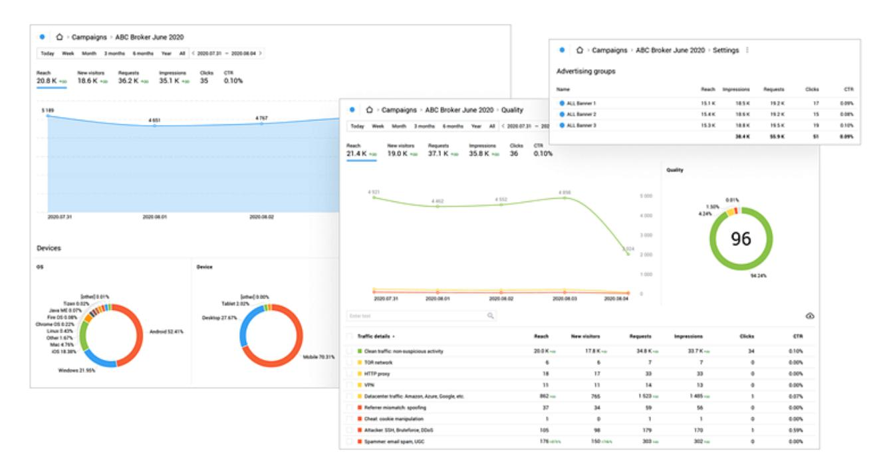

You can estimate the reach, impression frequency and CTR, as well as the parameters of the audience, who actually viewed your banners. Find out who these people are, where they come from, what language they speak, what devices they use, how good the traffic really is (real people, suspicious visits, bots) and much more.

The number of simultaneously running banners is not limited. We recommend adding as many banners as possible. You will be able to disable low-CTR ads, in an effort to increase the display time of ads which accompany the highest conversion rates.

## **Banner formats**

Common banner formats are supported: non-animated GIF, JPG, PNG and HTML5. The responsive format can be used to create ads of different sizes. Finteza automatically generates ready-to-use banners based on uploaded text and images.

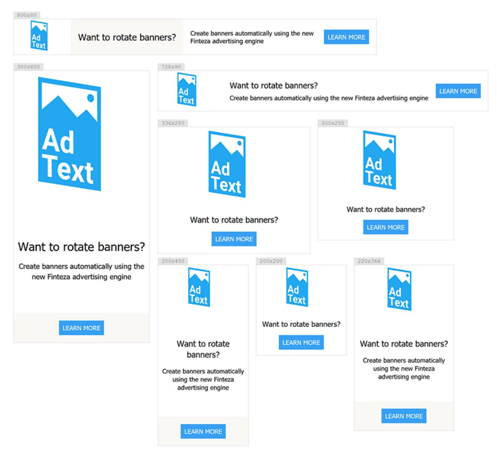

The cost of advertising includes not only desktop banners, but also mobile ones, and there is no difference between them. If you use responsive banners, you do not need to create ready-made banners, while they are created automatically. If you want extra personalization and branding, please use the following formats:

| Banner type    | Banner size    | Valid format                                     |
|----------------|----------------|--------------------------------------------------|
| Desktop/tablet | 800x80         | Responsive, non-animated GIF, JPG, PNG and HTML5 |
| Mobile         | Variable x 80* | Responsive or HTML5                              |

\* Since the width of mobile devices may vary, the mobile banner format accommodates a variable width. The height remains equal to 80 pixels.

# <span id="page-146-0"></span>**White Label partners**

Large and medium-sized brokerage companies often co-operate with other financial organizations. If an emerging company cannot afford to buy a trading platform and arrange all necessary infrastructure, it can conclude a partnership agreement with a larger broker and operate under that broker's White Label. For a certain fee (for example, commission charged for trades), the larger broker provides the technological basis, while the emerging company only has to attract and render services to its clients.

Order an additional White Label to enable your partner to work with its own brand name. In fact, this is a client terminal in which your company's name, logos and contacts are replaced with the relevant details of your affiliate. After receiving the White Label terminal, configure the trading platform, including client groups, financial instruments and manager accounts, for your WL-partner.

## **Order a White Label**

To order a client terminal White Label, go to the Support Center [App Store](https://support.metaquotes.net/en/market) and select Buy next to the MetaTrader 5 Terminal product. In the window that appears, specify the name of the company, for which the White Label is ordered:

# Select Label:

*No additional text provided in the image.*

# MetaQuotes

# Text Content

```
2 000 USD

Total: 2 000 USD

I expressly acknowledge that I have read, and do hereby accept the terms and conditions contained in [this agreement](#). I also expressly acknowledge and agree that by accepting it, I do so on behalf, and with the express authorization, of the Licensee, who shall be legally bound by this Agreement in respect of the use of the Product.

# Cancel

# Confirm your order

The product will be added to your monthly statement

The company name can be entered only in Latin or Cyrillic writing and may contain the following special characters: space ' () + , - . / : = ?.

Be careful when specifying the company name. After your White Label is delivered, you will be able to change the company name only by requesting a new White Label and canceling the current one. In that case your company will have to pay for ordering the new White Label.

After confirming the order, a new request with the order ID in the header and an online White Label creation form is automatically generated in the [Service Desk](https://support.metaquotes.net/en/servicedesk) section of the technical support website. The request will allow you to track your order and provide additional data if necessary.

The online form consists of a few sections: "About window", "Installer window", "Other settings", "Custom files", "Documents", and "Servers". All the form fields are provided with hints. Hover over the field name to view them.

When filling out the form, please pay attention to the following:

- ·All form fields are obligatory.
- · All terminal information (branding, images, server name) must correspond to the company name or its registered brand/business name. The images shall not include any additional marketing slogans unless legally and validly registered/licensed by the company.
- · If you do not have ready logos, you may use the standard MetaQuotes' logos. Logos and other information can be changed later. If you want to update the White Label, navigate to the [App Store / White Labels /](https://support.metaquotes.net/en/market/whitelabel/mt5) [MetaTrader 5](https://support.metaquotes.net/en/market/whitelabel/mt5) section, find the relevant label and click the edit icon next to the company name to open the White Label editing form.

#### **The About window**

Specify here the company name, contact details, logo and program name. This information will be available to traders in the About window of your terminal.

| About                                                                              |                                      |       |
|------------------------------------------------------------------------------------|--------------------------------------|-------|
| Click to upload logo                                                               |                                      |       |
| 24-bit color BMP image file. Size should not exceed 131 px width and 151 px height | Legal address of the company         |       |
| not exceed 131 px width and 151 px height                                          |                                      |       |
|                                                                                    | Phone                                |       |
|                                                                                    | www.forexbroker.dev                  |       |
|                                                                                    | support@forexbroke.r.dev             |       |
|                                                                                    |                                      |       |
| Forex Broker MetaTrader 5                                                          |                                      |       |
| Version: 5.00 Build 2037<br>30 Apr 2020                                            | Copyright 2001-2020, MetaQuotes Ltd. | Close |

| Element      | Explanation                                                                                                                                                                                                                                                                                                                                                                                      |
|--------------|--------------------------------------------------------------------------------------------------------------------------------------------------------------------------------------------------------------------------------------------------------------------------------------------------------------------------------------------------------------------------------------------------|
| Company name | The name of the company for which the White Label is created. The name you have specified in the order is entered by default. Scanned company documents should be attached in the Documents tab.                                                                                                                                                                                                 |
| Element      | Explanation                                                                                                                                                                                                                                                                                                                                                                                      |
| Logo         | The image in BMP format with 24-bit color depth. The image size should not exceed 131 px (width) to 151 px (height). To upload a logo, click Browse and choose the image file. The uploaded image can be aligned to the center by clicking the appropriate button. To use the standard MetaQuotes logo, click Standard (archive with MetaQuotes logos).                                          |
| Address      | Company's registered office address, specified in the KYC Form. The address can be specified in two lines. Use   as a line break character.                                                                                                                                                                                                                                                      |
| Phone        | Phone number. In addition to the required phone number, you can specify other communication channels, such as instant messengers. Data can be specified in two lines. To break the line, use the special characters  , for example:<br>Tel : +7 xxx xxxxxx<br>Fax: +7 xxx xxxxxx                                                                                                                 |
|              | Phone number should be specified in the standard international format.                                                                                                                                                                                                                                                                                                                           |
| Website      | The URL of your company's website, for example: www.metaquotes.net. Do not specify the protocol identifier "http", it will be added automatically. Note: only one website should be added here, additional links will not work.                                                                                                                                                                  |
| E-mail       | The email address of your company's technical support team.                                                                                                                                                                                                                                                                                                                                      |
| Program name | The name is formed from the company name or registered brand/business name. It is used as:the title of the client terminal windowthe name of the terminal installation directory and the group in the Start menuthe name in a desktop shortcutIf you want to use the word "MetaTrader" in the program name, you should specify it in exactly this format (as one word with "M" and "T" capital). |

The About window always contain MetaQuotes Ltd copyright, website link and a link to the End-User License Agreement.

#### **The Installer window**

Here you can specify the company logo which will be displayed in the terminal installation window:

|                                                                                                                                                    | ×                                                                                          |
|----------------------------------------------------------------------------------------------------------------------------------------------------|--------------------------------------------------------------------------------------------|
| Click to upload image                                                                                                                              | 8-bit color (256 colors) BMP image with size exactly 500 px width and 60 px height         |
| Select the destination folder where you want to install MetaTrader 5. To install to a different location, click Browse, and select another folder. | Installation folder:                                                                       |
| C:\Program Files\Forex Broker MetaTrader 5                                                                                                         | <button>Browse…</button>                                                                   |
|                                                                                                                                                    | Select the Start Menu program group in which you would like Setup to create the shortcuts. |
| Program group:                                                                                                                                     | Forex Broker MetaTrader 5                                                                  |
|                                                                                                                                                    | <input checked="" type="checkbox"/> Open MQL5.community website                            |
|                                                                                                                                                    |                                                                                            |
|                                                                                                                                                    |                                                                                            |
| <b>Forex Broker</b>                                                                                                                                |                                                                                            |
|                                                                                                                                                    | < Back><br>Next<br>Cancel                                                                  |

Use an image in the BMP format, with a color depth of 8 bits (256 colors) and the precise sizes of 500 px (width) to 60 px (height).

You can create a banner using the standard MetaQuotes logo and the name of your company or program.

#### **Icons**

This is where you set your terminal logo (icon).

Use an ICO file containing a set of frames sized 16x16, 32x32, 48x48 and 64x64 pixels, with a color depth of 8 bits and 32 bits each.

The icon will appear in the main window of the client terminal, on the desktop and in the Start menu. The icon file - terminal.ico - is located in Client Terminal installation folder.

Icons can be created using various free programs, such as [IcoFX](https://www.icofx.ro/) and others.

See also: [Articles / How to create an icon for the client terminal?](https://support.metaquotes.net/en/articles/1460)

#### **White Label**

Specify here additional information for the White Label setup:

| Server name:   | ForexBroker                                                                             |
|----------------|-----------------------------------------------------------------------------------------|
| Short name:    | Forex Broker MT5                                                                        |
| Account types: | Keep in mind, for demo accounts onboarding you will need to set up allocation groups on |

Keep in mind, for demo accounts onboarding you will need to set up allocation grou
MetaTrader 5 server side. See for details [Groups for Account Allocation](https://www.example.com).

Copy details to clipboard

# Save draft

# Send final version

| Element     | Explanation                                                                                                                                                                                                                                                                                                                                                                          |
|-------------|--------------------------------------------------------------------------------------------------------------------------------------------------------------------------------------------------------------------------------------------------------------------------------------------------------------------------------------------------------------------------------------|
| Server name | The name is formed from the company name or registered<br>brand/business name. It will be used as the first part of the server name<br>(up to "-"-). The name allows identifying and finding the company in the<br>list of servers in the terminal.<br>Server name with '.com ' suffix cannot be applied, e.g.<br>ForexBroker.com, Please do not register such brand/business names. |
| Short name  | The short name of the program will only be displayed in the Navigator<br>window of the client terminal.                                                                                                                                                                                                                                                                              |

#### **Custom files**

Here, you can upload files which will be automatically added to appropriate folders of the client terminal build.

Custom files should be taken from the similarly-named client terminal folders. Open the terminal, configure it the way you want, close and copy the files. After that, they can be uploaded via the interface for adding custom files. Do not add the files having unfamiliar assignment. Do not fill in this tab if you want to leave the look of the client terminal and all its settings unchanged.

| Folder | File types                                                                                                                                                                                                                                                                                                                                                                                                                                                                                                                                                                                                                                                                                                                                  |
|--------|---------------------------------------------------------------------------------------------------------------------------------------------------------------------------------------------------------------------------------------------------------------------------------------------------------------------------------------------------------------------------------------------------------------------------------------------------------------------------------------------------------------------------------------------------------------------------------------------------------------------------------------------------------------------------------------------------------------------------------------------|
| config | Here, you can upload files with terminal settings. The client terminal will<br>have appropriate settings during its first launch after installation. For<br>example, terminal.ini file contains data on location and size of the client<br>terminal windows (however, data on location and size of chart windows<br>are stored in the profile, see the details below). Note that coordinates<br>have absolute values and location of client terminal windows may be<br>different on different monitors. We do not recommend adding this file to<br>the build. The file named trade.ini contains trading settings of the<br>terminal (Tools - Options). The common.ini file contains the main<br>settings of the terminal (Tools - Options). |

| Folder                       | File types                                                                                                                                                                                                                                                   |
|------------------------------|--------------------------------------------------------------------------------------------------------------------------------------------------------------------------------------------------------------------------------------------------------------|
|                              | Do not add common.ini file with AllowDllImport=1. To ensure the end users' security, DLL import is not allowed by default.                                                                                                                                   |
| bases\default\symbols        | Here you can upload price history files and a file with a set of symbols to be displayed in the Market Watch window during the first launch of the terminal. For details please see: How to change the default list of symbols in the client terminal label? |
| MQL5                         | You can upload here custom indicators, scripts and Expert Advisors that will be available in client terminals.<br>It is prohibited to add DLL files, and EX5 files which may use external DLLs.                                                              |
| MQL5\profiles\charts\default | The file of the default profile to be used during the first launch of the terminal. For details please see: How to change the default set of charts in the client terminal label?                                                                            |
| MQL5\profiles\symbolsets     | The folder stores symbol sets available in the context menu of the Market Watch window (*.set files). You can create your own symbol sets according to the symbol type and upload them to the folder.                                                        |
| MQL5\profiles\templates      | You can add here your own chart templates (*.tpl files), and templates for client terminal reports (*.htm files). Also, you can modify standard report files ReportTrade.htm, ReportHistory.htm or ReportTester.htm and upload them to this folder.          |

#### **Servers**

On this tab, select servers that will appear in the list of available servers when opening an account from the terminal. All your servers will be available in the list, including additional servers.

#### **Documents**

Upload the following documents confirming the registration data of the White Label company:

- ·Certificate of Incorporation
- ·Register of Directors documents
- ·Notarized copy of your IB's Director's passport
- ·Certificate of Good Standing or Certificate of Incumbency
- ·Domain ownership; the website must be registered under the White Label company
- ·Completed and signed KYC form which is provided in the order

If you are ordering an additional White Label for the principal company or for another existing White Label whose documents were provided earlier, the re-uploading of scanned copies of the documents is not required.

#### **Sending data**

Please carefully check all the data before sending the final version. After sending the data, you will be able to change it only after the client terminal is assembled. You may click "Save as a draft" to save changes and return to the form later.

Once you have checked the White Label form data, click "Send final version" at the bottom right corner of the form.

After order confirmation (status of the automatically generated request with the order ID changes to *Completed*), White Label of the client terminal is generated based on the information provided in the online form. The installer download link will become available on the [App Store / White Labels / MetaTrader 5](https://support.metaquotes.net/en/market/whitelabel/mt5) page of the Support Center section.

We strongly recommend that all brokers use the download links that are available in the [White Label](https://support.metaquotes.net/en/market/whitelabel/mt5) section. If your corporate policy does not allow to download files from other sites, you can copy the required files to your website and update them when necessary. Do not forget to update your applications.

See also: [Articles / Why you need to update all links to MetaTrader 4/5 installers](https://support.metaquotes.net/en/articles/427)

### **Configuring the MetaTrader 5 platform to work with White Labels**

#### **Create separate account groups for the White Label**

First, create separate groups for real and demo accounts.

Specify your WL company name, websites and email in the group settings. This data will be indicated in trade reports sent to clients in the group, as well as in welcome emails when opening a demo account.

| File                                           | Disconnect                               |        |  |      |
|------------------------------------------------|------------------------------------------|--------|--|------|
|                                                | $-X-$                                    |        |  |      |
| Edit                                           |                                          |        |  |      |
|                                                | $\leftarrow$                             |        |  |      |
| View                                           |                                          |        |  |      |
|                                                |                                          |        |  |      |
| Services                                       | <b>Refresh</b>                           |        |  |      |
| $\left\{ \Omega \right\}$                      | $\left\{ \cdots \right\}$ Restart Server |        |  |      |
| Help                                           | $\vee$ Apply $+$ $\circledcirc$ $\times$ |        |  |      |
|                                                |                                          |        |  |      |
|                                                |                                          |        |  |      |
|                                                | $(K)$ Import                             |        |  |      |
|                                                |                                          |        |  |      |
|                                                |                                          |        |  |      |
|                                                | $\binom{7}{1}$ Export                    |        |  |      |
|                                                | $\downarrow^A_2$ Sort                    |        |  |      |
| Groups(41)                                     |                                          |        |  |      |
| 白 8                                            | Groups (41)                              |        |  |      |
| Company                                        |                                          |        |  |      |
| demo\demoforex                                 |                                          |        |  |      |
| Server                                         | Main Server                              |        |  |      |
|                                                |                                          |        |  |      |
| Company                                        | Forex Broker                             |        |  |      |
|                                                |                                          |        |  |      |
| Type                                           |                                          |        |  |      |
|                                                | Hedged                                   |        |  |      |
| Authentication                                 |                                          |        |  |      |
|                                                | Normal                                   |        |  |      |
| Margin                                         |                                          |        |  |      |
| 50 / 30 %                                      |                                          |        |  |      |
| Currency                                       |                                          |        |  |      |
| <b>USD</b>                                     |                                          |        |  |      |
| Group                                          |                                          |        |  |      |
| demo\forex-usd                                 |                                          |        |  |      |
| Company site                                   |                                          |        |  |      |
| forexbroker.com                                |                                          |        |  |      |
| Deposit site                                   |                                          |        |  |      |
| forexbroker.com/deposit                        |                                          |        |  |      |
| Withdrawal site                                |                                          |        |  |      |
| forexbroker.com/withdraw                       |                                          |        |  |      |
| Support site                                   |                                          |        |  |      |
| forexbroker.com/[lang:en es pt ru]/landing-mt5 |                                          |        |  |      |
| Support email                                  |                                          |        |  |      |
| support@forexbroker.com                        |                                          |        |  |      |
| Templates folder                               |                                          |        |  |      |
|                                                |                                          |        |  |      |
| $\sin \left  \frac{1}{25} \right $ Symbols (6) |                                          |        |  |      |
|                                                |                                          |        |  |      |
| For Help, press F1                             |                                          |        |  |      |
|                                                |                                          |        |  |      |
|                                                |                                          |        |  |      |
|                                                |                                          |        |  |      |
|                                                |                                          |        |  |      |
| OK                                             |                                          | Cancel |  | Help |

The White Label company name specified in the group should exactly match the name of the ordered White Label. Therefore, the company should be selected from the list rather than entered manually. In case of a mismatch, the name of the main company will be displayed in the White Label platform instead of the White Label company name.

Specify the White Label company's technical support email and enable the "Send copies to support email" option on the group's Reports tab to enable the sending of the report copies to the White Label company.

The web page specified in the "Support site" field will be displayed on the Company tab of your White Label client terminals. For further configuration details please see the [Company page](#page-77-0) section.

Custom welcome email templates can be used for the White Label company. Open the email template directory on the trade server, for example, <main trade server>\templates\greeting\. Create a new subdirectory and save welcome email templates for the White Label there. Specify the subdirectory name in the "Templates folder" parameter. For further details please read the [Welcome emails](#page-72-0) section.

#### **Set individual trading conditions for the White Label's customers**

You can set an individual list of available trading symbols along with special trading conditions for the White Label's clients. For example, you can set an additional spread markup for symbols belonging to a certain group:

| <b>Group:</b>                                                                        | demo\forex-usd                                                                                                                                                                    |  |               |      |
|--------------------------------------------------------------------------------------|-----------------------------------------------------------------------------------------------------------------------------------------------------------------------------------|--|---------------|------|
| <b>Common Company News &amp; Mail Permissions Margin Symbols Commissions Reports</b> |                                                                                                                                                                                   |  |               |      |
| Please set up individual parameters of symbols trade for the group.                  |                                                                                                                                                                                   |  |               |      |
| <b>Up</b>                                                                            |                                                                                                                                                                                   |  |               |      |
| Symbol                                                                               |                                                                                                                                                                                   |  |               |      |
|                                                                                      |                                                                                                                                                                                   |  |               |      |
| <b>Down</b>                                                                          |                                                                                                                                                                                   |  |               |      |
| √\$ Forex	extbackslash;^*                                                            |                                                                                                                                                                                   |  |               |      |
| <b>Symbol:</b> Forex*                                                                |                                                                                                                                                                                   |  |               |      |
|                                                                                      |                                                                                                                                                                                   |  |               |      |
| <b>Common Trade Execution Margin Margin Rates Swaps</b>                              |                                                                                                                                                                                   |  |               |      |
| <b>Add</b>                                                                           |                                                                                                                                                                                   |  |               |      |
| \$                                                                                   | Please set up main parameters of symbols for the group.                                                                                                                           |  |               |      |
| <b>Edit / Delete</b>                                                                 |                                                                                                                                                                                   |  |               |      |
|                                                                                      | <b>Forex*</b><br>Symbol:<br>Enable market depth<br>Use default spread<br>Market depth limit: unlimited<br><input checked="" type="checkbox"/> <input checked="" type="checkbox"/> |  |               |      |
|                                                                                      | Spread difference: 2 pt<br>○ Use default volumes                                                                                                                                  |  |               |      |
|                                                                                      | Difference balance: 1 bid / 1 ask                                                                                                                                                 |  |               |      |
|                                                                                      | Minimum: 0.00000001 ~5;<br>Step:<br>Maximum: 100000001                                                                                                                           |  |               |      |
|                                                                                      | Limit: 0                                                                                                                                                                          |  |               |      |
|                                                                                      | <b>OK</b>                                                                                                                                                                         |  | <b>Cancel</b> | Help |

Commission settings can be defined in advance. Optionally, the White Label company's employees can configure commissions via the Manager terminal. This will require enabling the "Change groups" permissions for the relevant manager account via the MetaTrader 5 Administrator. See below for more details on how to create White Label manager accounts.

#### **Configure opening of demo accounts via White Label terminals in the appropriate groups**

Demo account opening settings are configured in the "Clients & Accounts \ Allocations" section in MetaTrader 5 Administrator.

Two options are available: opening via the client terminal and redirecting to a website. The first option is preferable as the process is fast and convenient.

To enable the opening of White Label accounts in relevant groups, add the following entry to the list:

| File  | Broker-Demo - MetaTrader 5 Administrator |
|-------|------------------------------------------|
| Links |                                          |

| -X- Disconnect     | <-> |
|--------------------|-----|
| < Refresh          | >   |
| (C) Restart Server |     |
|                    |     |
| ∼ Apply            | +   |
| ⊗ ⋆ ×   ⋀ ∨ Import |     |
| ⌕ Export           |     |
|                    |     |
| ↓ Sort             |     |

| 由 8 Groups (41)                                 |                                             |
|-------------------------------------------------|---------------------------------------------|
| e Clients & Accounts                            |                                             |
| ≸ Allocations                                   |                                             |
| ≡ Deposit URL                                   | https://broker.com/deposi <sup>.</sup>      |
| ∼ Clients                                       |                                             |
| ½ Withdrawal URL                                | https://broker.com/withdra                  |
| Account allocation group                        |                                             |
|                                                 | ?                                           |
| Company:                                        | Default                                     |
| Group:                                          | Default                                     |
| Description:                                    | Forex USD                                   |
| Leverages:                                      | 100,50,30,20,10,5                           |
| Countries:                                      | All countries                               |
|                                                 |                                             |
| Require identity and proof of address documents |                                             |
| Start KYC check automatically                   |                                             |
| Use advanced registration form                  |                                             |
|                                                 |                                             |
| Confirm:                                        | Phone & Email                               |
| Mail server:                                    | Default                                     |
| Agreements:                                     |                                             |
| Client agreement                                | https://abcbroker.com/legal/client          |
| Data Protection Policy                          | https://abcbroker.com/legal/data-protection |
|                                                 |                                             |
| URL                                             |                                             |
| Mandatory                                       |                                             |
|                                                 |                                             |
|                                                 |                                             |

For further details please see the [Demo account allocation](#page-7-0)section.

When opening demo accounts via the website, it is impossible to set different addresses for the main and additional labels. Only a single link can be specified instead:

| Broker-Demo - MetaTrader 5 Administrator                                   |                                                                                                           |                      |                                      |                |                                      |                                      |                           | ×                                    |                                      |        |                                      |        |                                      |                                      |      |
|----------------------------------------------------------------------------|-----------------------------------------------------------------------------------------------------------|----------------------|--------------------------------------|----------------|--------------------------------------|--------------------------------------|---------------------------|--------------------------------------|--------------------------------------|--------|--------------------------------------|--------|--------------------------------------|--------------------------------------|------|
| <b>Services</b>                                                            | Edit                                                                                                      | View                 | Help                                 | File           |                                      |                                      |                           |                                      |                                      |        |                                      |        |                                      |                                      |      |
| $-x$ - Disconnect                                                          | $	ext{	extbackslash mathcal	ext{-}A}$ <--> $	ext{	extbackslash mathbb	ext{-}Q}$                           | Refresh              | $	ext{	extbackslash mathbb	ext{-}Q}$ | Restart Server | $	ext{	extbackslash mathbb	ext{-}Q}$ | $	ext{	extbackslash mathbb	ext{-}Q}$ | Apply                     | $	ext{	extbackslash mathbb	ext{-}Z}$ | $	ext{	extbackslash mathbb	ext{-}Q}$ | Import | $	ext{	extbackslash mathbb	ext{-}Q}$ | Export | $	ext{	extbackslash mathbb	ext{-}Q}$ | $	ext{	extbackslash mathbb	ext{-}Z}$ | Sort |
| 中 8 Groups (41)                                                            | →→ Demo account allocation URL                                                                            |                      |                                      |                |                                      |                                      | https://www.broker.com/ ↑ |                                      |                                      |        |                                      |        |                                      |                                      |      |
| SE Clients & Accounts                                                      | $	ext{	extbackslash sqrt	extbracket{} 	extbracket{}}$ Automatic allocation of demo account on first start |                      |                                      |                |                                      |                                      |                           |                                      |                                      |        |                                      |        |                                      |                                      |      |
| AA $	ext{	extbackslash frac	extbracket{} 1 2 	extbracket{}}$ Allocations | AA $	ext{	extbackslash times}$ Deposit URL                                                              |                      |                                      |                |                                      |                                      | https://broker.com/depo.  |                                      |                                      |        |                                      |        |                                      |                                      |      |
| AA $	ext{	extbackslash frac	extbracket{} 1 2 	extbracket{}}$ Clients     | AA $	ext{	extbackslash overline	extbracket{} 	extbracket{*}}$ Withdrawal URL                            |                      |                                      |                |                                      |                                      | https://broker.com/withcl |                                      |                                      |        |                                      |        |                                      |                                      |      |
| AA $	ext{	extbackslash mathbb	extsuperscript{2}}$ Managers               | €                                                                                                         |                      |                                      |                |                                      |                                      |                           |                                      |                                      |        |                                      |        |                                      |                                      |      |
| <b>Example 2</b> Trading Accounts                                          | Group                                                                                                     | Description          | Currency                             | Type           | Countries                            |                                      | Leverages                 |                                      |                                      |        |                                      |        |                                      |                                      |      |
| A0A0由 C Orders & Deals                                                   | A0 <b>Default</b>                                                                                        |                      |                                      |                |                                      |                                      |                           |                                      |                                      |        |                                      |        |                                      |                                      |      |
| A0 <b>E</b> Gateways                                                      | & preliminary-usd                                                                                         | A0 <b>Real USD</b>  | USD                                  | Netting        |                                      | All countries                        |                           |                                      |                                      |        |                                      |        |                                      |                                      |      |
| A0A0Data Feeds                                                           | Soldemoorex-usd                                                                                          | A0 <b>Forex USD</b> | USD                                  | Hedged         |                                      | All countries                        | 100 50 30 20 10 5         |                                      |                                      |        |                                      |        |                                      |                                      |      |

On the website itself, you have to re-direct customers to different web pages depending on what terminal has been used to open an account. The terminal label can be defined by the additional "label" parameter automatically added to the link on the client terminal side. Below is a sample link that can be generated when opening a demo account from the ABC Company terminal:

https://www.forexbroker.com/open\_account?type=demo&acp=1251&label=ABC Company& server=Forex Broker&interface=English&cid=3c8e1d9cd303dbd0d5686b729689d556

Below is a list of all parameters passed in the link:

- ·first\_name — the first name specified in the registration form on the client terminal side.
- ·second\_name — the last name specified in the registration form on the client terminal side.
- ·email — the email specified in the registration form on the client terminal side.
- ·phone — the phone number specified in the registration form on the client terminal side.
- ·age — the number of days since the installation of the client terminal.
- ·type — the type of the requested account: demo or real.
- ·acp — the code page used by the trader.
- ·label — the name of the company which owns the terminal White Label.
- ·server — the name of the server a trader has selected when opening an account.
- ·interface — the language of the client terminal interface.
- ·cid — the unique identifier of the trader's computer.

When forming a request, the presence of character "?" in the "Account allocation URL" parameter is checked. In other words, it is checked whether the specified address contains its own request parameters:

- · If there is no "?" in the address, it is formed with the standard set of parameters described above. For example, https://www.mycompany.com.
- · If "?" is present in the address, standard parameters are added to the specified custom ones. For example, if address https://www.mycompany.com?utm\_campaign=terminal is specified, the resulting string will be https://www.mycompany.com?utm\_campaign=terminal&type=demo&acp=.... .

Also please pay attention to the following features:

- ·The link address must begin with "https://" or "http://".
- · The redirect function only works for demo accounts. Preliminary accounts can only be opened from client terminals.
- · The "Demo account allocation URL" option is only used in the desktop client terminal versions. Redirection to an external site is not supported in mobile terminals.

#### **Create a manager account for your White Label partner with the appropriate group permissions**

Create a [new account](#page-184-0) in the manager group. If you work with multiple agents or Introducing Brokers, it would be reasonable to create separate manager subgroups for each of them, for example, managers\ABC\_Company.

In the manager group settings, you can specify a custom set of symbols to be processed by the company managers. Only the specified symbols will be available to the dealer in the Market Watch of the Manager terminal.

Next, create a manager account based on this account. Set only the groups previously created for this label to be available for the account.

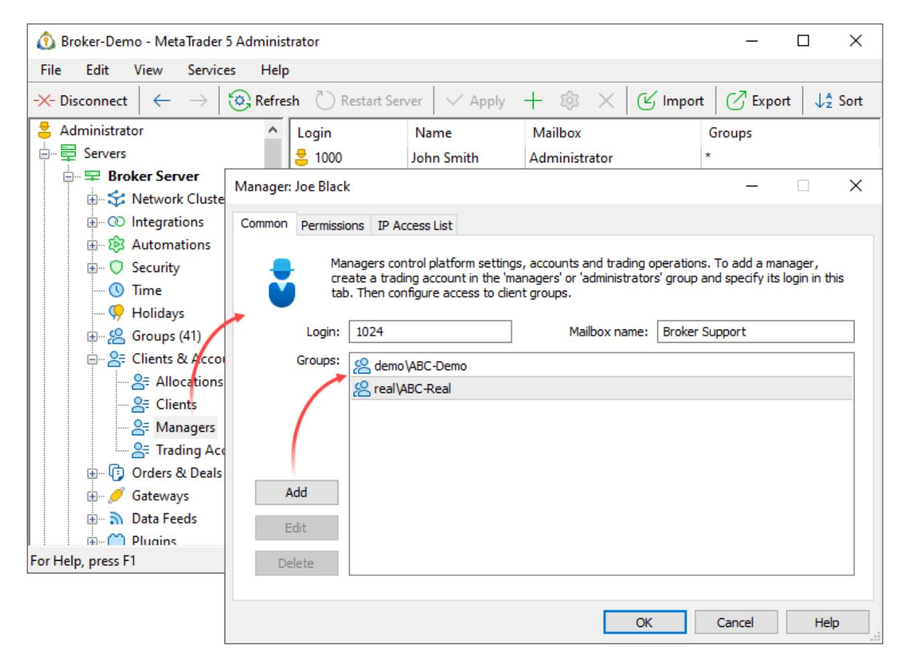

Next, configure the rights for the manager:

| Manager:           | Joe Black                                                                                                                                                                                                                                                                                                                                                                                                                                                                                                                                                                                                                                                                                                                                                                                                                                                                                                                                                                                                                                                                                                                                                                                                                                                                                                                                                                                                                                                                                                                                                                                                                                                                                                                                                                            |        |  |                 |     |                    |     |       |                                                                                                                                                                                                                                                                                                                                                                                                                                                                                                                                                                                                                                                                                                                                                                                                                                                                                                                                                                                                                                                                                                                                                                                                                                                                                                                                                                                                |
|--------------------|--------------------------------------------------------------------------------------------------------------------------------------------------------------------------------------------------------------------------------------------------------------------------------------------------------------------------------------------------------------------------------------------------------------------------------------------------------------------------------------------------------------------------------------------------------------------------------------------------------------------------------------------------------------------------------------------------------------------------------------------------------------------------------------------------------------------------------------------------------------------------------------------------------------------------------------------------------------------------------------------------------------------------------------------------------------------------------------------------------------------------------------------------------------------------------------------------------------------------------------------------------------------------------------------------------------------------------------------------------------------------------------------------------------------------------------------------------------------------------------------------------------------------------------------------------------------------------------------------------------------------------------------------------------------------------------------------------------------------------------------------------------------------------------|--------|--|-----------------|-----|--------------------|-----|-------|------------------------------------------------------------------------------------------------------------------------------------------------------------------------------------------------------------------------------------------------------------------------------------------------------------------------------------------------------------------------------------------------------------------------------------------------------------------------------------------------------------------------------------------------------------------------------------------------------------------------------------------------------------------------------------------------------------------------------------------------------------------------------------------------------------------------------------------------------------------------------------------------------------------------------------------------------------------------------------------------------------------------------------------------------------------------------------------------------------------------------------------------------------------------------------------------------------------------------------------------------------------------------------------------------------------------------------------------------------------------------------------------|
| Permissions        | <table> <tr> <th>Common</th> <td></td> </tr> </table> <b>IP Access List</b> <p>Set up permissions of the manager by selecting entries or a previously saved set.</p> <table> <tr> <th>Available logs:</th> <td>All</td> </tr> <tr> <th>Available reports:</th> <td>All</td> </tr> <tr> <th>Role:</th> <td> <input checked="" type="checkbox"/>               Connection type<br/>               ⊟…<br/> <math>D</math><br/> <label><input type="checkbox"/> Connect using MetaTrader 5 Administrator</label><br/> <label><input type="checkbox"/> Connect using MetaTrader 5 Manager</label><br/> <label><input type="checkbox"/> Configuration setup</label><br/> <label><input type="checkbox"/> </label><br/> <label><input type="checkbox"/> </label><br/> <label><input type="checkbox"/> Configure network</label><br/> <label><input type="checkbox"/> CCCCCCCCCCCCCCCCCCCCCCCCCCCCCCCCCCCCCCCCCCCCCCCCCCCCCCCCCCCCCCCCCCCCCCCCCCCCCCCCCCCCCCCCCCCCCCCCCCCCCCCCCCCCCCCCCCCCCCCCCCCCCCCCCCC               <label><input type="checkbox"/> CCCCCCCCCCCCCCCCCCCCCCCCCCCCCCCCCCCCCCCCCCCCCCCCCCCCCCCCCCCCCCCCCCCCCCCCCCCCCCCCCCCCCCCCCCCCCCCCCCCCCCCCCCCCCCCCC               <label><input type="checkbox"/> CCCCCCCCCCCCCCCCCCCCCCCCCCCCCCCCCCCCCCCCCCCCCCCCCCCCCCCCCCCCCCCCCCCCCCCCCCCCCCCCCCCCCCCCCCCCCCCCCCCCCCCCCCCCCCCCCCCCCCCCCCCCCCCCC</label></label></label></td></tr></table> | Common |  | Available logs: | All | Available reports: | All | Role: | <input checked="" type="checkbox"/> Connection type<br>⊟…<br>$D$<br><label><input type="checkbox"/> Connect using MetaTrader 5 Administrator</label><br><label><input type="checkbox"/> Connect using MetaTrader 5 Manager</label><br><label><input type="checkbox"/> Configuration setup</label><br><label><input type="checkbox"/> </label><br><label><input type="checkbox"/> </label><br><label><input type="checkbox"/> Configure network</label><br><label><input type="checkbox"/> CCCCCCCCCCCCCCCCCCCCCCCCCCCCCCCCCCCCCCCCCCCCCCCCCCCCCCCCCCCCCCCCCCCCCCCCCCCCCCCCCCCCCCCCCCCCCCCCCCCCCCCCCCCCCCCCCCCCCCCCCCCCCCCCCCC               <label><input type="checkbox"/> CCCCCCCCCCCCCCCCCCCCCCCCCCCCCCCCCCCCCCCCCCCCCCCCCCCCCCCCCCCCCCCCCCCCCCCCCCCCCCCCCCCCCCCCCCCCCCCCCCCCCCCCCCCCCCCCC               <label><input type="checkbox"/> CCCCCCCCCCCCCCCCCCCCCCCCCCCCCCCCCCCCCCCCCCCCCCCCCCCCCCCCCCCCCCCCCCCCCCCCCCCCCCCCCCCCCCCCCCCCCCCCCCCCCCCCCCCCCCCCCCCCCCCCCCCCCCCCC</label></label></label> |
| Common             |                                                                                                                                                                                                                                                                                                                                                                                                                                                                                                                                                                                                                                                                                                                                                                                                                                                                                                                                                                                                                                                                                                                                                                                                                                                                                                                                                                                                                                                                                                                                                                                                                                                                                                                                                                                      |        |  |                 |     |                    |     |       |                                                                                                                                                                                                                                                                                                                                                                                                                                                                                                                                                                                                                                                                                                                                                                                                                                                                                                                                                                                                                                                                                                                                                                                                                                                                                                                                                                                                |
| Available logs:    | All                                                                                                                                                                                                                                                                                                                                                                                                                                                                                                                                                                                                                                                                                                                                                                                                                                                                                                                                                                                                                                                                                                                                                                                                                                                                                                                                                                                                                                                                                                                                                                                                                                                                                                                                                                                  |        |  |                 |     |                    |     |       |                                                                                                                                                                                                                                                                                                                                                                                                                                                                                                                                                                                                                                                                                                                                                                                                                                                                                                                                                                                                                                                                                                                                                                                                                                                                                                                                                                                                |
| Available reports: | All                                                                                                                                                                                                                                                                                                                                                                                                                                                                                                                                                                                                                                                                                                                                                                                                                                                                                                                                                                                                                                                                                                                                                                                                                                                                                                                                                                                                                                                                                                                                                                                                                                                                                                                                                                                  |        |  |                 |     |                    |     |       |                                                                                                                                                                                                                                                                                                                                                                                                                                                                                                                                                                                                                                                                                                                                                                                                                                                                                                                                                                                                                                                                                                                                                                                                                                                                                                                                                                                                |
| Role:              | <input checked="" type="checkbox"/> Connection type<br>⊟…<br>$D$<br><label><input type="checkbox"/> Connect using MetaTrader 5 Administrator</label><br><label><input type="checkbox"/> Connect using MetaTrader 5 Manager</label><br><label><input type="checkbox"/> Configuration setup</label><br><label><input type="checkbox"/> </label><br><label><input type="checkbox"/> </label><br><label><input type="checkbox"/> Configure network</label><br><label><input type="checkbox"/> CCCCCCCCCCCCCCCCCCCCCCCCCCCCCCCCCCCCCCCCCCCCCCCCCCCCCCCCCCCCCCCCCCCCCCCCCCCCCCCCCCCCCCCCCCCCCCCCCCCCCCCCCCCCCCCCCCCCCCCCCCCCCCCCCCC               <label><input type="checkbox"/> CCCCCCCCCCCCCCCCCCCCCCCCCCCCCCCCCCCCCCCCCCCCCCCCCCCCCCCCCCCCCCCCCCCCCCCCCCCCCCCCCCCCCCCCCCCCCCCCCCCCCCCCCCCCCCCCC               <label><input type="checkbox"/> CCCCCCCCCCCCCCCCCCCCCCCCCCCCCCCCCCCCCCCCCCCCCCCCCCCCCCCCCCCCCCCCCCCCCCCCCCCCCCCCCCCCCCCCCCCCCCCCCCCCCCCCCCCCCCCCCCCCCCCCCCCCCCCCC</label></label></label>                                                                                                                                                                                                                                                                                                                                                                                       |        |  |                 |     |                    |     |       |                                                                                                                                                                                                                                                                                                                                                                                                                                                                                                                                                                                                                                                                                                                                                                                                                                                                                                                                                                                                                                                                                                                                                                                                                                                                                                                                                                                                |

Be sure to disable:

- ·Ability to connect using MetaTrader 5 Administrator
- ·The entire "Configuration setup" block of permissions
- ·The entire "Administration" block

You are free to enable other permissions if required by the agreement with your White Label affiliate.

Please be extremely careful when enabling permissions for your White Label's manager account in order to prevent unauthorized access to the critical data and platform settings. Make sure that the White Label company has access only to the customers within its own groups.

See also: [Documentation / Platform / Platform settings / Managers](https://support.metaquotes.net/en/docs/mt5/platform/administration/admin_managers)

# <span id="page-159-0"></span>**MQL5.community services**

[MQL5.community](https://www.mql5.com/) connects millions of traders around the world. Being an integral part of the MetaTrader 5 trading platform, the community provides access to a variety of unique services. Here traders can purchase trading robots and indicators, copy trades of professional traders in the automated mode, rent a virtual server and much more. Users can access all these unique services with a [single MQL5 account.](https://www.mql5.com/en/auth_register)

MQL5.community services are available straight from trading terminals. Traders can specify the MQL5 account login and password in platform settings, and purchase robots straight from the terminals. Also, the account enables users to communicate with fellow traders and receive notifications on their smartphone. An MQL5 account is a pass to all MetaTrader 5 services.

The availability of such services is very important when attracting new customers, as they can assist users in getting started. Inform your traders about the MQL5.community and additional trading services.

# **MQL5 Market: The largest store of applications for MetaTrader**

[MQL5 Market](https://www.mql5.com/en/market) is the largest store of trading applications for the MetaTrader 4 and MetaTrader 5 platforms. The market features over 20,000 trading robots, indicators and other trading programs developed by independent programmers. Dozens of new products and updates of existing applications appear in the Market every day.

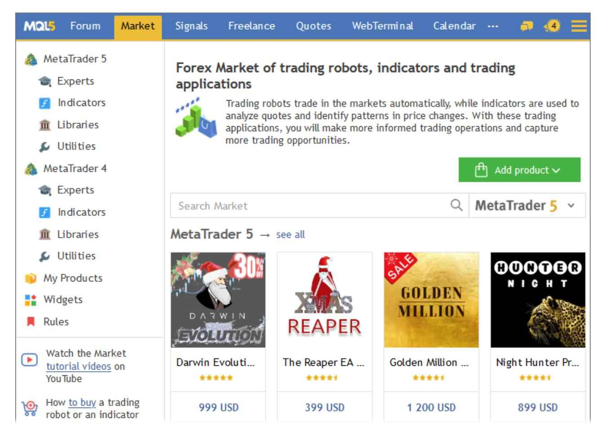

The MQL5 Market is available straight from MetaTrader terminals. After paying for a purchased product using popular payment systems or a credit card, the trader can launch the program on the chart right away. The

purchasing procedure is absolutely safe: payments are performed through an encrypted connection, while the delivery of the application to the terminal is guaranteed by the service.

All trading robots and indicators provide trial versions, which can be downloaded and tested for free in the strategy tester.

All programs downloaded from the Market are securely encrypted. This is to protect them from unauthorized use. Encryption is performed so that the product can be run only on the computer from which it is downloaded. The process of product binding to a computer is called activation.

Every product in the Market has at least five activations: one is used during purchase, and the other four activations are additional. A seller may choose to increase the number of available activations. The number of available activations is determined at the time of purchase; the relevant number is displayed on the product page. Even if the seller changes the number of activations in the future, user purchases will not be affected.

If the Market product can no longer be run on a chart and the terminal journal shows the "invalid license" error, it means that the trader's computer configuration has changed, and thus the product needs to be re-activated. To do this, the user should delete the old file, then open the "Navigator \ Market \ My Purchases" section and install it again.

See also: [Documentation / Client terminal / Market App Store](https://support.metaquotes.net/en/docs/mt5/client/market)

## <span id="page-160-0"></span>**Trading signals and copy trading**

[Signals](https://www.mql5.com/en/signals) is a convenient service for copying trading operations performed by professional traders to a MetaTrader account in the automated mode. The service is available straight from MetaTrader terminals.

A trader can select a suitable signal from the showcase, pay for the subscription in the terminal, and start receiving real-time trades right away. Users can choose from several thousands of signal providers based on detailed monitoring information, which includes the full account history, statistics and charts.

To avoid increased risk, the system does not allow real accounts to subscribe to signals from demo accounts. Demo accounts can subscribe to signals from real accounts.

The transparent signal operation model serves to avoid conflict of interests. The trader pays a fixed amount for a signal subscription, without any additional fees on profit or number of copied trades.

Becoming a signal provider is easy. The trader should specify the MetaTrader account number, investor password and the broker server name (the main account password is not required, so the account is protected). The service connects to the broker server and transmits to subscribers the information about all deals performed on the provider's account. The service architecture based on a global distributed network of servers provides minimum delays when copying operations.

| <b>MQL5</b><br><b>Market</b><br>Forum                                                                         | Freelance<br><b>Signals</b> | Quotes                     | WebTerminal<br>                                                                                                                                                                                                                               |               |
|---------------------------------------------------------------------------------------------------------------|-----------------------------|----------------------------|-----------------------------------------------------------------------------------------------------------------------------------------------------------------------------------------------------------------------------------------------|---------------|
| (q)<br><b>Signals</b><br>(a) My Signals<br>My Subscriptions<br><b>Favorites</b><br>Add widget<br><b>Rules</b> | on Your Account             |                            | ((g)<br><b>MetaTrader 5 Trading Signals with Automatic Execution</b><br>Signals is a copy-trading service allowing you to automatically copy provider's<br>deals on your trading account. Use Signals to boost your Forex trading efficiency. | Create signal |
| Filter<br>Trading system                                                                                      | MetaTrader $5$              | <b>Broker</b> server       |                                                                                                                                                                                                                                               | $✓$<br>Q      |
| <b>All</b>                                                                                                    | <b>Maximum profit</b>       | <b>Reliability</b>         | Profitable within a month                                                                                                                                                                                                                     |               |
| <b>Netting</b>                                                                                                |                             |                            |                                                                                                                                                                                                                                               |               |
| <b>Hedging</b>                                                                                                |                             |                            |                                                                                                                                                                                                                                               |               |
| <b>Closing by FIFO</b>                                                                                        |                             |                            |                                                                                                                                                                                                                                               |               |
| Enable if positions<br>are always closed                                                                      | Signals<br>#↓               | Price                      | Growth                                                                                                                                                                                                                                        |               |
| according to FIFO rule<br>on your account.<br>Leverage                                                        | 0<br>500                    | <b>35 USD</b><br>per month | 3 487%                                                                                                                                                                                                                                        | Copy          |
| 0<br>500                                                                                                      | 2<br>Lobster                | <b>30 USD</b><br>per month | 2 538%                                                                                                                                                                                                                                        | Copy          |
| Profit/Month, %<br>0<br>100                                                                                   | 3<br><b>Insider Pro</b>     | <b>40 USD</b><br>per month | 550%                                                                                                                                                                                                                                          | Copy          |

#### **Functions for brokers**

You can configure which symbols will be available to your traders. By configuring group settings, you can allow subscription to only signals from accounts registered on your servers. Signals traded on other brokers' accounts will be hidden from the signals showcase in client terminals.

| Broker-Demo - MetaTrader 5 Administrator             |                         |                                                |                |                                                                                        |         |                                                  |              |                              | $\Box$                | ×                     |
|------------------------------------------------------|-------------------------|------------------------------------------------|----------------|----------------------------------------------------------------------------------------|---------|--------------------------------------------------|--------------|------------------------------|-----------------------|-----------------------|
| Edit<br>File<br>View                                 | <b>Services</b><br>Help |                                                |                |                                                                                        |         |                                                  |              |                              |                       |                       |
| -X-Disconnect<br>$\leftarrow$                        |                         | Refresh Restart Server                         |                | $\vee$ Apply $+$ 203                                                                   |         | $\times$                                         | $K_1$ Import |                              | $\binom{7}{1}$ Export | $\downarrow^A_z$ Sort |
| $\mathbb{Q}$ Holidays                                |                         | Group                                          |                | Server                                                                                 | Company | Type                                             |              | Authenticat                  | Margin                | Currency              |
| □ 8 Groups (41)                                      |                         | real\usd-standard   Main Server   Forex Broker |                |                                                                                        |         | Netting                                          |              |                              | Normal 50 / 30 %      | <b>USD</b>            |
| <b>P</b> g contest (1)                               |                         | <b>Solus</b> real\usd-mini                     |                | Main Server   Forex Broker   Netting                                                   |         |                                                  |              |                              | Normal 50 / 30 %      | <b>USD</b>            |
| <sub>∞</sub> Pe coverag<br>— <mark>−</mark> ९ demo ( |                         | Group: real\usd-standard                       |                |                                                                                        |         |                                                  |              |                              |                       | ×                     |
| 国 Le funds (3                                        | Common Company          |                                                | News & Mail    | Permissions                                                                            | Margin  | Symbols Commissions                              |              | Reports                      |                       |                       |
| — <mark>E</mark> ® manage                            |                         |                                                |                |                                                                                        |         |                                                  |              |                              |                       |                       |
| <b>ER</b> prelimin                                   |                         |                                                |                | Please specify the group permissions for symbols, orders, use of Expert Advisors, etc. |         |                                                  |              |                              |                       |                       |
| $\mathbb{P}^{\circ}$ real (6)                        |                         |                                                |                |                                                                                        |         |                                                  |              |                              |                       |                       |
| <sub>19</sub> test-acd                               |                         |                                                |                |                                                                                        |         |                                                  |              |                              |                       |                       |
| k≡ Clients & A<br><b>+</b>                           |                         | Maximum symbols:                               | unlimited      | $\checkmark$                                                                           |         | Available history:                               | All          |                              |                       |                       |
| m<br>Orders & De<br>田                                |                         | Maximum positions:                             | unlimited      | $\checkmark$                                                                           |         | Maximum orders:                                  |              | unlimited                    | $\checkmark$          |                       |
| Gateways<br>田…                                       |                         | Deposit by default:                            |                |                                                                                        |         | Leverage by default:                             |              |                              | ✓                     |                       |
| <b>Date</b> Feeds<br>围                               |                         |                                                |                |                                                                                        |         |                                                  |              |                              |                       |                       |
| <b>Plugins</b><br>Fŀ                                 |                         | Annual interest rate:                          | 0.0000         |                                                                                        | %       |                                                  |              |                              |                       |                       |
| 由 《戸 Reports                                         |                         | Trading Signals:                               |                | Enable all signals from all brokers                                                    |         |                                                  |              |                              |                       |                       |
| 由 - 血 ECN                                            |                         | Transfer of funds:                             | <b>Disable</b> |                                                                                        |         |                                                  |              |                              |                       |                       |
| — $\frac{1}{2}$ Routing                              |                         |                                                |                | Enable all signals from all brokers<br>Enable signals from my servers only             |         |                                                  |              |                              |                       |                       |
| $\mathbb{R}$ Funds & FTI                             |                         | Enable trading by Expert Advisors M            |                |                                                                                        |         | Enable position closing according to FIFO rule ( |              |                              |                       |                       |
| For Help, press F1                                   |                         |                                                |                | Enable trailing stops $\vert \checkmark \vert$                                         |         |                                                  |              | Prohibit hedge positions     |                       |                       |
|                                                      |                         |                                                |                | Enable charge of swaps $\vee$                                                          |         |                                                  |              | Enable deal cost calculation |                       |                       |
|                                                      |                         |                                                |                |                                                                                        |         | OK                                               |              | Cancel                       |                       | Help                  |

Also, you can access the detailed statistics of signals based on accounts registered on your servers, as well as based on subscriptions purchased by your clients. To access the statistics, [register a regular mql5.com account](https://www.mql5.com/en/auth_register) and request extended permissions (brokerage account) from the [Service Desk](https://support.metaquotes.net/en/servicedesk).

These permissions will open two additional sections of the [Signals](https://www.mql5.com/en/signals) service, MT5 Broker and MT4 Broker.

| <b>MQL5</b> | <b>Forum</b>                 | Market                        | <b>Signals</b> | Freelance     | <b>Quotes</b>  | <b>WebTerminal</b> |                   | Calendar | VPS    | $\sim 100$           | Ы               | $• ≡$       |  |
|-------------|------------------------------|-------------------------------|----------------|---------------|----------------|--------------------|-------------------|----------|--------|----------------------|-----------------|-------------|--|
|             |                              | Signals / MetaTrader 5 Broker |                |               |                |                    |                   |          |        |                      |                 |             |  |
| W<br>09.    | <b>Signals</b><br>My Signals |                               |                | Signals159    | Subscribers690 |                    | <b>Statistics</b> |          |        |                      |                 |             |  |
| н           | My Subscriptions             |                               |                |               |                |                    |                   |          | Filter |                      | Export to CSV   |             |  |
| Qυ          |                              | MetaTrader 5 Broker           |                | Name / Rating |                | Growth             | Equity            | Login    |        | <b>Broker server</b> |                 | <b>Type</b> |  |
| Qυ          | <b>Favorites</b>             | MetaTrader 4 Broker           |                | Signal 1      |                | 0.00%              | 0.00 USD          | 52051617 |        |                      | MetaQuotes-Demo | Real        |  |
|             | ∘ Add widget                 |                               |                | Signal 2      |                | 0.00%              | 0.00 USD          | 43047882 |        |                      | MetaQuotes-Demo | Real        |  |
| Rules       |                              |                               |                | Signal 3      |                | 0.00%              | 0.00 USD          | 52061591 |        |                      | MetaQuotes-Demo | Real        |  |
|             |                              |                               |                | Signal 4      |                | 0.00%              | 0.00 USD          | 52065254 |        |                      | MetaQuotes-Demo | Real        |  |
|             |                              |                               |                | Signal 5      |                | 0.00%              | 0.00 USD          | 52060246 |        |                      | MetaQuotes-Demo | Real        |  |

You can attract additional attention of potential clients by adding an interactive showcase of signals to your site. Go to [Widgets \ Showcase](https://www.mql5.com/en/signals/widgets), enter the list of your servers, and click "Get a widget code".

| Signal                                                                         | Top                                                                                            |
|--------------------------------------------------------------------------------|------------------------------------------------------------------------------------------------|
| Showcase                                                                       |                                                                                                |
| Terminal:                                                                      | <b>MetaTrader 4</b><br><b>MetaTrader 5</b>                                                     |
| Broker:                                                                        | MetaQuotes-Demo                                                                                |
|                                                                                | Get a widget code                                                                              |
| Specify a part of the broker's or trading server's name to select the servers. | You can enter a number of brokers separated by comma. Then click a "Get a widget code" button. |
| Filter:                                                                        | Change                                                                                         |
| Language:                                                                      | <b>English</b><br>Russian<br>Chinese<br>Spanish<br>German<br>Portuguese<br>Japanese            |
| HTML code:                                                                     | <iframe src="https://www.mq15.com/en/signals/widget/showcase/5uih"></iframe>                   |
|                                                                                | Copy and paste the code to insert it into HTML-code of your web page                           |
| Use XML API to quickly access the signals list from your application:          | https://www.mql5.com/api/signals/5uih/xml                                                      |

Insert this code to your web page and receive a ready showcase of signals, which is updated in real time.

See also: [Documentation / Client terminal / Trading signals and copy trading](https://support.metaquotes.net/en/docs/mt5/client/signals)

### **Virtual hosting for 24/7 operation**

[Virtual hosting](https://www.mql5.com/en/vps) enables the round-the-clock, failure-free operation of trading robots and signal subscriptions, even when the computer is turned off. The service is easy-to-use and is available directly from the MetaTrader 4/5 terminal. The trader chooses a subscription plan that costs no more than 15 USD, and the service finds a server located close to the broker, to minimize network delays. Trading robots and signal subscriptions can be configured in the terminal and then migrated to a virtual server with a single click.

Service features:

- · Smart resource allocation algorithms ensure that each virtual platform receives enough resources: up to 3 GB of RAM, up to 16 GB of hard disk space and several CPUs allocated on demand.
- ·No additional activations are used for Market applications on the VPS.
- ·Only one account can run on a VPS, however the VPS can be transferred to another account.
- · VPS subscription can be canceled within 24 hours with a full refund. If the subscription is canceled later, the remaining time is credited to the trader's MQL5 account in the form of free minutes. A new VPS can be rented for free using these minutes.

Read more about the service in the [Sponsored VPS](#page-168-0) section.

## **Freelance for ordering trading apps**

A lot of MQL5.community members have vast programming experience and are willing to develop custom orders. [MQL5 Freelance](https://www.mql5.com/en/job) is a secure service for ordering custom applications from freelancers. Any type of software, from custom Expert Advisors and indicators for MetaTrader 4/5 to a whole website or a Windows app in C++, can be ordered from here.

The price of order development starts from USD 30. Choose from more than 700 developers of different skill level, from beginners to professionals, who can program in MQL4/MQL5, as well as in other popular programming languages, such as C++, C#, PHP, Java, Python, and others.

The service proved a transparent and safe system for both parties. Orders are performed in steps, starting with the selection of the developer and discussion of preliminary specifications and finishing with the acceptance of the final work. The agreed order cost is frozen on the customer's account for the order development time. This procedure is aimed at protecting both parties: it guarantees payment for a properly developed order while ensuring the development of the ordered application.

In the Freelance service, you can order branded applications for MetaTrader 4/5 and provide them free of charge to your traders by adding them to terminals via a [White Label](#page-146-0)form. You can also find programmers for your specific needs, as well as translators having vast experience in IT, finance and trading related translations.

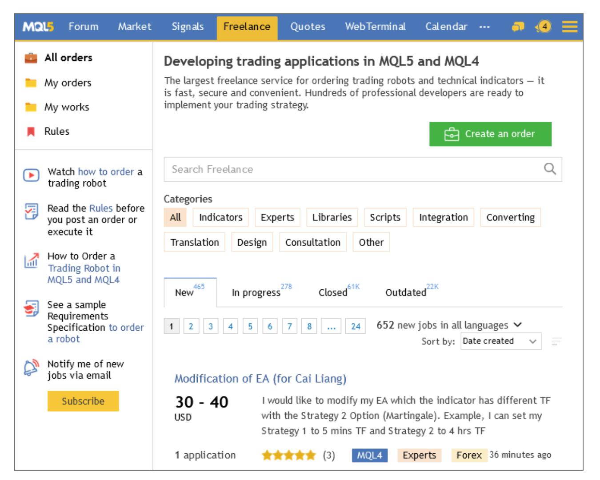

## **Economic Calendar**

The [Economic Calendar](https://www.mql5.com/en/economic-calendar) provides up-to-date real-time information on more than 800 macroeconomic events of the largest world economies, including the United States, the European Union, the United Kingdom, Japan and Canada. Information about economic indicator releases can assist users in forecasting future market developments and in formulating informed trading decisions.

The calendar is MetaQuotes' proprietary solution. We monitor the publication of macroeconomic indicators from primary sources in real time and invite you to broadcast this valuable data on your website. This is a legally clean service, with no licensing risks or intermediaries. Install our economic calendar and equip your traders with essential fundamental information on the spot, so that there is no need for your clients to visit competitor or third-party resources.

The economic calendar will assist your traders in preparing forecasts and in making informed trading decisions. Any financial assets, including currencies, stocks, indices, metals and oil, respond to news releases and statistical publications.

| <b>MQL5</b><br><b>Forum</b><br>Market                                          | Sign als    | Freelance                                                                      | Quotes                          | WebTerminal                                                                                                                                                                | Calendar        | $\cdots$            |                                        |
|--------------------------------------------------------------------------------|-------------|--------------------------------------------------------------------------------|---------------------------------|----------------------------------------------------------------------------------------------------------------------------------------------------------------------------|-----------------|---------------------|----------------------------------------|
| <b>Economic Calendar</b><br>13 - 19 Dec, 2021<br>$\triangleright$ Current week |             | Economic calendar, Forex news<br>real-time data collected from public sources. |                                 | This is an indispensable tool for fundamental analysis of financial markets based on<br>economic news. More than 500 indices of the world's largest economies are based on |                 |                     |                                        |
| Previous week<br>Next week<br>Current month                                    |             |                                                                                |                                 | Follow news in the<br><b>Economic Calendar</b>                                                                                                                             |                 | 閛<br>Add to website |                                        |
| Previous month<br>Next month                                                   | TIME, 16:04 | $6 - 12$ Dec, 2021                                                             | <b>CURRENCY</b><br><b>EVENT</b> | <b>ACTUAL</b><br>13 - 19 Dec, 2021<br>13 December, Monday                                                                                                                  | <b>FORECAST</b> |                     | <b>PREVIOUS</b><br>20 - 26 Dec, 2021 > |
| Event importance<br>Holidays<br>$\Box$ Low                                     | 01:50       | $\bullet$ JPY                                                                  |                                 | Core Machinery Orders m/m<br>3.8%                                                                                                                                          | 0.2%            |                     | 0.0%                                   |
| Medium<br>$\blacksquare$ High                                                  | 01:50       | $\bullet$ JPY                                                                  | $\Box$                          | Core Machinery Orders y/y<br>2.9%                                                                                                                                          | 13.3%           |                     | 12.5%                                  |
| <b>Currencies</b><br>AUD - Australian Dollar                                   | 01:50       | $\bullet$ JPY                                                                  |                                 | BoJ Tankan Large All Industry Capex<br>9.3%                                                                                                                                | 1.6%            |                     | 10.1%                                  |
| <b>BRL</b> - Brazilian real<br>CAD - Canadian dollar                           | 01:50       | $\bullet$ JPY                                                                  |                                 | BoJ Tankan Large Manufacturing Outlook<br>12                                                                                                                               | 10              |                     |                                        |

#### **Fast and easy installation**

To install the calendar, use the [Add to website](https://www.mql5.com/en/economic-calendar/widgets) button on the Calendar page of the MQL5.com website. Specify the desired size of the calendar and the display period for upcoming events, which can be the current day or week. All changes are instantly reflected in the Preview section, which visualizes how the calendar will appear on your website page. The calendar widget is currently available in ten languages:

- ·English, Russian, Chinese, Spanish, Portuguese
- ·German, Japanese, Arabic, Turkish, Korean

Here is an example of an embed code for the economic calendar in English, featuring current week events:

```
<script type="text/javascript"
src="https://www.tradays.com/c/js/widgets/calendar/widget.js?8"></script>
<div id="economicCalendarWidget"></div>
<script type="text/javascript">
  new economicCalendar({ width: "100%", height: "100%", mode: 2, lang: "en" });
</script>
```

Copy the auto-generated code and paste it into your webpage. This completes the installation of the calendar.

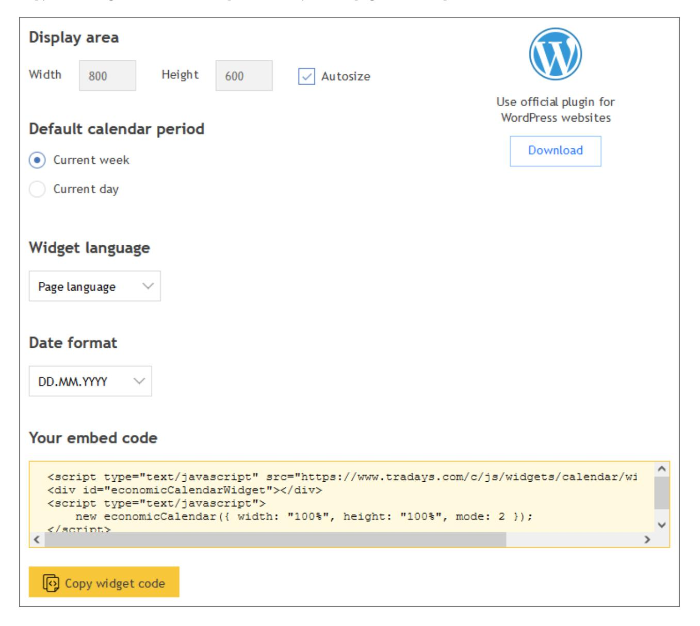

#### **Advantages of our economic calendar**

· Free: we have developed this calendar for the MetaTrader 5 trading platform and allow our customers to install it for free.

- ·No licensing risks: we collect all the relevant data from primary sources using specialized software.
- · Support for ten languages: all events and descriptions are translated into the most common global languages, with more translations to be added later.
- · Full representation: every event is provided with a detailed description and notes related to the release influence on individual currencies, as well as the source link, release date and charts.
- ·No ads: you will not have to pay for the service by showing third-party ads.
- · Automatic time zone selection: event tracking is maintained via local time adaptation. Manual adaptation of time zones is also possible.
- ·Automatic update: the calendar is automatically updated as soon as a new event appears in a source.
- · Continuous development: when a country is added, all economic indices which have a significant impact on the national currency are included in the calendar.
- ·Simple and quick installation: the calendar is installed in just a few clicks.

#### **MQL5.community business account**

Extended options are available for brokerage accounts at MQL5.community: [managing signals and subscriptions](#page-160-0) available to your traders, creating and topping up MQL5 accounts via the API.

By creating an MQL5 account with an initial top-up, you can help your traders get started with the website and related services. The MQL5 account creation procedure can be implemented in the trader's room or on a broker's website. It means that your clients having a MetaTrader account and a profile on your site, will be able to subscribe to trading signals, purchase applications from the Market, and access other trading services.

The above options are available from a brokerage account. [Create](https://www.mql5.com/en/auth_register) an account on mql5.com and [contact us via](https://support.metaquotes.net/en/servicedesk) [Service Desk](https://support.metaquotes.net/en/servicedesk) in order to obtain extended permissions.

For API usage details, please see [Documentation](https://support.metaquotes.net/en/docs/community/mql5_api).

# <span id="page-168-0"></span>**Sponsored VPS**

The [Virtual Hosting](https://support.metaquotes.net/en/docs/mt5/client/virtual_hosting) service is extremely important for traders. It enables 24/7 operation of trading robots and [copied signals](https://www.mql5.com/en/signals), without the need to keep the computer turned on permanently. Furthermore, users do not have to worry about the hardware and connections.

The service is available directly from the client terminals, so traders can start using it in just a few clicks. The service ensures minimal network delays between the terminal and the broker's server, as the system selects the nearest hosting server automatically.

Sponsored Hosting provides a great tool for attracting new traders. Start providing a free useful service to your clients and create a competitive edge to attract more traders. By providing stable and continuous trading 24/7 for existing clients, you will increase trading volumes.

#### See also:

- ·[Articles / Gain a competitive edge with MetaQuotes VPS](https://support.metaquotes.net/en/news/3439)
- ·[Articles / 4 reasons to tell your traders about VPS for MetaTrader](https://support.metaquotes.net/en/news/3394)
- ·[Articles / Enable VPS for your traders — it pays off](https://support.metaquotes.net/en/articles/1018)

#### **Preparation**

A [corporate MQL5.community account](https://support.metaquotes.net/en/docs/community/mql5_api) is needed to pay for the Sponsored VPS. Your traders' hosting rentals will be paid from the balance of this account.

Such an account is automatically created for you and is added to the Sponsored VPS section in the Platform. This is absolutely safe. The data is securely encrypted, while the created account is not publicly available on MQL5.com to other users and to search engines.

If necessary, you can create another corporate account to manage the payments. To do this, register a regular MQL5.com account and contact our [Service Desk](https://support.metaquotes.net/en/servicedesk/new) to expand permissions. Next, add your account to the Sponsored Hosting section.

### **Paying for VPS**

Payments for VPS are made from the balance of your corporate MQL5.com account. The current balance is displayed at the bottom of the section. Please make sure you always have enough money on this account, otherwise your traders will not be able to rent new sponsored VPSs.

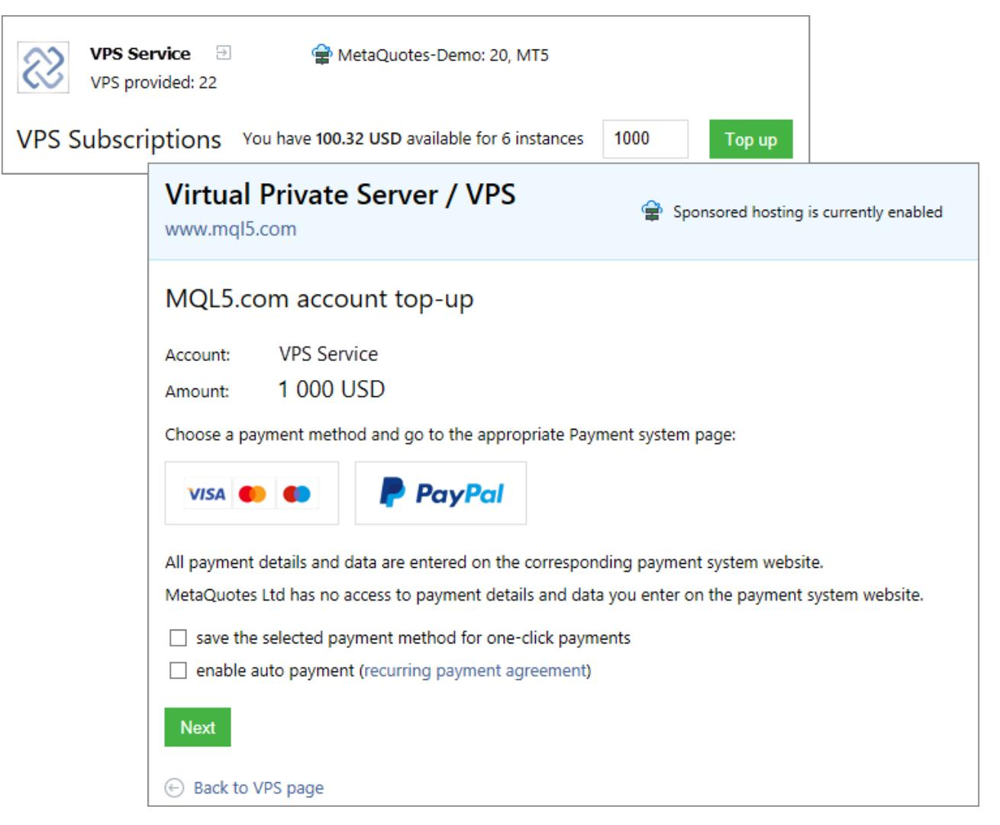

You can top up your balance in two ways:

- · Via the [payment systems](https://www.mql5.com/en/articles/302) available at MQL5.com. There is no need to go to the site, while the money can be added by using the "Top up" button at the bottom of the page.
- · By purchasing the ["Sponsored Virtual Hosting for MetaTrader 5"](https://support.metaquotes.net/en/market/product/617) product from the Support Center App Store. This option allows you to fund the account via a company invoice. You can request a top-up for the required amount and pay the invoice, after which the relevant funds will be credited to your MQL5 account. An additional Sponsored VPS service agreement can be concluded if necessary. The relevant details should be provided in the ticket created upon product order.

The entire history of top-ups and hosting payments will be available in your MQL5 profile, under the "Payments" section.

# **Platform setup**

To manage sponsorship, use the Integrations \ VPS section in MetaTrader 5 Administrator.

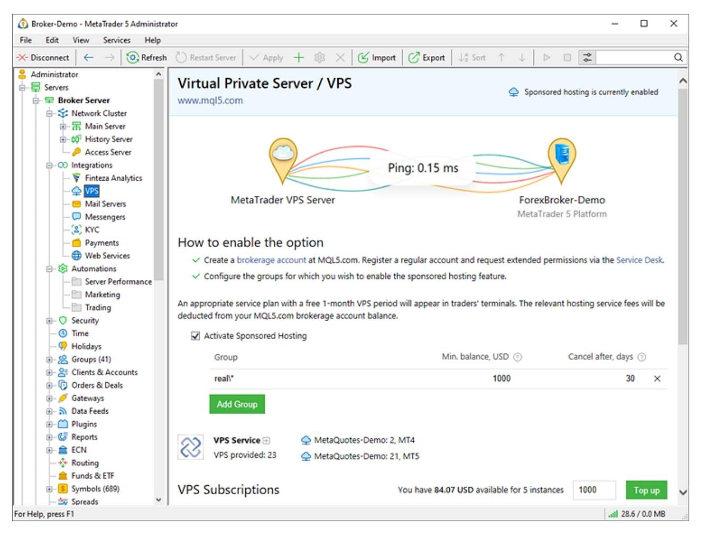

Enter your MQL5 account to be able to monitor the remaining balance, as well as to see the number of VPSs allocated to your traders.

Next, enable the "Activate sponsored hosting" option and specify the list of groups for which the service will be available. Additional parameters can be specified for each group:

- · Minimum balance — the minimum client balance value with which a sponsored VPS is available to the trader. Use to reward your major customers.
- · Cancel after, days — if there is no trading activity on the account for the specified period, the free VPS will be canceled.

Access can be additionally controlled at the trading account level, using the "Sponsored MetaTrader Virtual Hosting" option:

| Label                | Value                                  |
|----------------------|----------------------------------------|
| Account:             | 1003, John Smith, USD, 1:100, Hedge    |
| Overview             |                                        |
| Personal             |                                        |
| Account              |                                        |
| Profile              |                                        |
| Subscriptions        |                                        |
| Security             |                                        |
| Group:               | demoorex-usd                          |
| Color:               | None<br>$0$                           |
| Leverage:            | 1:100<br>$1$                          |
| <b>Bank account:</b> |                                        |
|                      | ○ Enable this account                  |
|                      | □ Enable trading by Expert Advisors    |
|                      | $4$ Enable trading                    |
|                      | Enable API connections                 |
|                      | ○ Enable to change password            |
|                      | □ Enable daily reports                 |
|                      | $4$ Enable trailing stops             |
|                      | □ Change password at next login        |
|                      | √ Enable one-time password             |
|                      | ○ Sponsored MetaTrader Virtual Hosting |
| Trade accounts:      |                                        |
| Gateway ID           |                                        |
|                      | Account                                |
| Synchronize          |                                        |
|                      |                                        |
|                      |                                        |
| Add                  |                                        |
| Edit                 |                                        |
| Delete               |                                        |
|                      |                                        |
| Client Properties    |                                        |
|                      | Update                                 |
|                      | Cancel                                 |
|                      | Help                                   |
|                      | u                                      |

If the "Sponsored MetaTrader Virtual Hosing" option is enabled in account settings, the service will be available regardless of group settings. Group permissions are checked if the option is disabled.

### **Operation on the Client Terminal side**

Users with enabled access will see a special service plan in the VPS section of their client terminals. By selecting it, they will obtain hosting, while the relevant payment will be made from the broker's corporate account: the system will find the appropriate account by the server name under trading account parameters.

|                                                       | 5] 51190365 - MetaQuotes-Demo: Demo Account - Hedge - MetaQuotes Software Corp. - [VPS]                |                          |                                              |                                 | ×<br>□                    |
|-------------------------------------------------------|--------------------------------------------------------------------------------------------------------|--------------------------|----------------------------------------------|---------------------------------|---------------------------|
| File<br>View<br><b>Charts</b><br>Insert<br>⊵          | <b>Tools</b><br>Window<br>Help                                                                         |                          |                                              |                                 | $ 0x$                     |
| $\approx$<br>IDE<br>$\sim$ $\star$<br>$\vert$ \$<br>۰ | ቈ<br>♤<br>$( ( \circ ) )$<br>$\triangleright$ Algo Trading                                             | 00<br>F New Order<br>FF. | $\circledR$<br>$\odot$<br>⊞<br>$\mathcal{N}$ | 비→ 비←<br>$\alpha$<br>்வு        | $\frac{9}{100}$<br>®      |
| Market Watch: 16:48:09<br>$\pmb{\times}$              |                                                                                                        |                          |                                              |                                 |                           |
| ۸<br>Ask<br>Symbol<br>Bid                             |                                                                                                        |                          |                                              | ID How to rent a virtual server | Balance: 84.06 USD        |
| 1.12988 1.12988<br><b>SI EURUSD</b>                   |                                                                                                        |                          |                                              |                                 |                           |
| <b>7 GBPUSD</b><br>1.32774 1.32774                    |                                                                                                        |                          | Specialized VPS for MetaTrader               |                                 |                           |
| <b>USDCHF</b><br>0.92098 0.92098                      |                                                                                                        |                          |                                              |                                 |                           |
| 1.28352 1.28352 \<br><b>SI USDCAD</b>                 | <b>MetaTrader VPS</b><br>18                                                                            |                          | Ping: 0.12 ms                                | MetaQuotes-Demo<br>             |                           |
| Details   Trading<br>Symbols<br>Ti                    | MOL5 Amsterdam 03                                                                                      |                          | 61.47 ms faster than the current connection  |                                 | MetaQuotes Software Corp. |
| Navigator<br>$\pmb{\times}$                           |                                                                                                        |                          |                                              |                                 |                           |
| MetaTrader 5                                          |                                                                                                        |                          |                                              | $-7%$                           | $-12%$                    |
| 由-g Accounts<br><b>E-</b> ○ Subscriptions             | Sponsored by<br>ô                                                                                      | <b>Basic</b>             | Popular                                      | <b>Trader</b>                   |                           |
| A Indicators                                          | broker                                                                                                 | 1 month                  | 3 months                                     | 6 months                        |                           |
| 由一个 Expert Advisors                                   |                                                                                                        | <b>15 USD</b>            | <b>14 USD</b>                                | 13.17 USD                       |                           |
| 由 <i>B</i> Scripts                                    | <b>FREE</b>                                                                                            | per month                | per month                                    | per month                       |                           |
| <b>283 Services</b>                                   |                                                                                                        |                          |                                              |                                 |                           |
| <b>E-</b> Market                                      |                                                                                                        |                          |                                              |                                 |                           |
| (i-(i-i) Signals                                      |                                                                                                        |                          | <b>Rent for free</b>                         |                                 |                           |
| ம்⊢ <b>≙</b> vps                                      |                                                                                                        |                          |                                              |                                 |                           |
| Favorites<br>Common                                   |                                                                                                        |                          |                                              |                                 |                           |
|                                                       | EURUSD.H1<br>EURCAD, H1                                                                                | CHFJPY.H1<br>EURUSD.H1   | Market<br>(e) Signals                        | $\triangle$ VPS                 | $i \rightarrow$           |
| Symbol<br><b>Ticket</b><br>$\overline{\phantom{a}}$   | Time                                                                                                   | Volume<br>Type           | S/L<br>Price                                 | T/P<br>Price                    | Profit                    |
| Fl eurusd<br>1226785539                               | 2021.12.17 16:45:46                                                                                    | sell<br>0.01             | 1.13026<br>$1.13226 \times$                  | $1.12526 \times$<br>1.12988     | $0.34 \times$             |
| 1124407116<br>$\lceil$ usdcad                         | 2021.09.20 12:48:24                                                                                    | sell<br>0.01             | 1.28432<br>1.29432 $\times$                  | 1.18432 $\times$<br>1.28352     | $0.55 \times$             |
| Toolbox                                               | ⊕ Balance: 2 645.61 EUR Equity: 2 646.37 Margin: 18.55 Free Margin: 2 627.82 Margin Level: 14 266.15 % |                          |                                              |                                 | 0.76                      |
| Trade                                                 | Exposure   History   News   Mailbox   Calendar   Company   Alerts   Articles   Code Base               |                          | Experts                                      | Journal<br>Market (e) Signals   | QVPS                      |
| For Help, press F1                                    | Default                                                                                                |                          |                                              |                                 | .all 232 / 6 Kb           |

We have added extra protection to avoid service misuse:

- · Only one sponsored hosting server can be rented for each account at a time, while the allocation of multiple servers is prohibited
- ·No other account can be launched on the sponsored hosting server

For further details on the Virtual Hosting service please refer to the [client terminal documentation.](https://support.metaquotes.net/en/docs/mt5/client/virtual_hosting)

#### **Service usage report**

The VPS section at [mql5.com](https://www.mql5.com) features the detailed information on sponsored hosting spots: client names, account numbers and rental dates.

| <b>MQL5</b><br><b>Forum</b>              | <b>Market</b>      | <b>Signals</b>     | Freelance<br><b>Quotes</b>       | <b>WebTerminal</b>   | Calendar<br><b>VPS</b> | <b>Articles</b> | $B7 ullet 3B 96$<br>a.<br>$B7 3B B7$ |
|------------------------------------------|--------------------|--------------------|----------------------------------|----------------------|------------------------|-----------------|---------------------------------------------|
| <b>ABC Broker</b>                        |                    |                    |                                  |                      |                        |                 |                                             |
| <b>A</b> Profile                         | <b>A2</b> Main    | Sponsorship<br>風   |                                  |                      |                        |                 |                                             |
| Settings                                 | © Active           | <b>A7</b> Expired | <b>D8</b> Canceled<br>All       |                      |                        |                 |                                             |
| <b>B</b> Messages                        |                    | <b>Name</b>        |                                  | <b>Broker server</b> | <b>Host server</b>     | Price           | <b>Start / Expiration date</b>              |
| Achievements<br>嚣                        | P.<br>6231560      |                    | MT5 37975665 - Hill Dominic      | ABCBroker-Real       | MQL5 Amsterdam 03      | 15.00           | 2021.05.06 / 2021.06.06                     |
| <b></b> Favorites                        | EA5<br>6250555    |                    | MT5 16904 - Lewis Bryan          | ABCBroker-Real       | MQL5 Amsterdam 02      | 15.00           | 2021.05.06 / 2021.06.06                     |
| Payments<br>đ64                         | 9FD4<br>6250554  |                    | MT5 7649304 - Richardson Matthew | ABCBroker-Real       | MQL5 Amsterdam 08      | 15.00           | 2021.05.06 / 2021.06.06                     |
| Service Desk<br>G.                       | A7<br>6154029     |                    | MT5 27006218 - Boris Petrov      | ABCBroker-Real       | MQL5 Amsterdam 01      | 15.00           | 2021.05.05 / 2021.06.05                     |
| <b>b</b> Freelance                      | 0A0D4<br>6241382 |                    | MT5 6489288 - Cooper Bryan       | ABCBroker-Real       | MQL5 Amsterdam 02      | 15.00           | 2021.05.05 / 2021.06.05                     |
| <b>S</b> Agents<br><b>Hosting</b><br>B7 | 3B<br>6241105     |                    | MT5 3706416 - Bennett Luke       | ABCBroker-Real       | MQL5 Amsterdam 01      | 15.00           | 2021.05.04 / 2021.06.04                     |
|                                          |                    |                    |                                  |                      |                        |                 |                                             |

The entire history of top-up operations and hosting payments is stored under the Payments section.

Summary information is also available at the bottom of the "Integration / VPS" section in MetaTrader 5 Administrator.

# <span id="page-174-0"></span>**Common errors**

- · Do not distribute client terminal installers through your website. We strongly recommend using installer download links from our CDN network. The network consists of a dozen of access points around the world, to ensure reliability and maximum download speed. Installers on such links are always up to date so you do not have to update them manually. Furthermore, you will receive extra analytical capabilities through UTM parameters. For further details please read the article [Why you need to update all links to MetaTrader 4/5](https://support.metaquotes.net/en/articles/427) [installers.](https://support.metaquotes.net/en/articles/427)
- · Do not forget to set up groups for your White Label on the trade server side, to avoid the "invalid server name" error in your White Label's mobile terminals when opening accounts.
- · When you reinstall the platform, your server becomes available in the web terminal within 24 hours. Likewise for the demo account request window in the web terminal: after you enable the allocation of demo accounts on the server, the server will become available in the list within 24 hours.
- · UTM parameters from the terminal installation links are registered in accounts only if you have an active Finteza license.

# <span id="page-175-0"></span>**Working with trading accounts**

Through the manager terminal, you can perform all operations related to customer service: open and configure accounts, deposit funds and execute trading operations on them. The Manager terminal provides access to full client information, including personal data, all open positions and orders, financial status and the history of all trading operations.

Also, the terminal shows accounts currently connected to the trading servers.

| 6 1863 - MetaQuotes - John Smith             |                                                                                   |                    |                                                                                                   | □<br>×              |         |
|----------------------------------------------|-----------------------------------------------------------------------------------|--------------------|---------------------------------------------------------------------------------------------------|---------------------|---------|
| File<br>Edit<br>View<br><b>Tools</b>         | Window<br>Help                                                                    |                    |                                                                                                   |                     |         |
| 毱                                            | 은← → Connect                                                                      | ſФ<br>K<br>⊗       | 군<br>$ eq$ Filter<br>Թ                                                                            | Q                   |         |
| Market Watch: 14:39:20                       | Name                                                                              |                    |                                                                                                   | Balance             |         |
| Symbol<br>Bid                                | Login<br>Ask<br><b>Lee Michael</b>                                                |                    | Country<br>Group                                                                                  | Mexico 5 000 117.93 |         |
| <b>CADCHF</b><br>0.71309                     | 2864729<br>0.71369<br>864730<br><b>Watson Justin</b>                              |                    | demo\demoforex<br>Indonesia 4 993 728.72<br>demo\demoforex                                        |                     |         |
| <b>EURAUD</b><br>1.58604                     | 1.58704<br>2 864731<br>Alien Joseph                                               |                    | Denmark 4 999 931.83<br>demo\demoforex                                                            |                     |         |
| <b>EURCAD</b><br>1.45875<br>1.4              |                                                                                   |                    |                                                                                                   |                     | □<br>×  |
| <b>EURGBP</b><br>0.85254<br>0.8              | Account: 928442, Patterson Richard, USD, 1:100, Netting                           |                    |                                                                                                   |                     |         |
| <b>EURJPY</b><br>128.162<br>128              | Overview<br>Exposure<br>Personal<br>Account<br>Limits<br>Profile<br>Subscriptions |                    |                                                                                                   |                     |         |
| <b>EURUSD</b><br>1.12849<br>1.1              |                                                                                   |                    |                                                                                                   |                     |         |
| Symbols                                      | Details<br> <br>Ticks                                                             | Richard<br>Name:   |                                                                                                   |                     |         |
| Navigator                                    | Patterson<br>Last name:                                                           |                    | Middle name:<br>Jeremy                                                                            |                     |         |
| MetaTrader 5 Manager                         |                                                                                   |                    |                                                                                                   |                     |         |
| Servers                                      | Individual<br>Company:                                                            |                    |                                                                                                   |                     |         |
| Analytics                                    | Account: 928442, Patterson Richard, USD, 1:100, Netting                           |                    |                                                                                                   |                     |         |
| Server Reports                               |                                                                                   |                    |                                                                                                   |                     |         |
| B- & Clients & Orders                        | Overview<br>Exposure<br>Personal<br>Account<br>Limits<br>Profile<br>Subscriptions |                    |                                                                                                   |                     |         |
| E-C Subscriptions                            | Balance<br>Operation:                                                             | $✓$                |                                                                                                   |                     |         |
| -A <sub>∇</sub>                              | Dealing                                                                           |                    |                                                                                                   |                     |         |
| Groups (1 118)                               | 1000<br>Amount:                                                                   | 1 000 USD<br>$✓$   |                                                                                                   |                     |         |
| $□$ Plugins (5)<br><b>E-C</b> Support Center | Deposit<br>Comment:                                                               |                    |                                                                                                   |                     |         |
| <b>E</b> App Store                           |                                                                                   |                    | Conduct balance operation without checking the free margin and the current balance on the account |                     |         |
|                                              |                                                                                   |                    |                                                                                                   |                     |         |
| For Help, press F1                           | <b>Deposit</b>                                                                    | Withdrawal         |                                                                                                   |                     |         |
|                                              | Time                                                                              | Deal               | Type                                                                                              |                     | Amount  |
|                                              | ⊕ 2019.09.03 01:22:24                                                             | 14638340           | balance                                                                                           | 5 000 000.00        |         |
|                                              | → 2019.09.03 23:59:59                                                             | 14638451           | daily commission                                                                                  |                     | -110.00 |
|                                              | → 2019.09.04 23:59:59                                                             | 14638455           | daily commission                                                                                  |                     | -1.00   |
|                                              | © 2019.09.05 23:59:59                                                             | 14638459           | daily commission                                                                                  |                     | -1.00   |
|                                              | → 2019.09.06 23:59:59                                                             | 14638463           | daily commission                                                                                  |                     | -1.00   |
|                                              | → 2019.09.10 23:59:59                                                             | 14638469           | daily commission                                                                                  |                     | -1.00   |
|                                              | → 2019.09.17 23:59:59                                                             | 14638481           | daily commission                                                                                  |                     | -1.00   |
|                                              | → 2019.09.24 23:59:59                                                             | 14638494           | daily commission                                                                                  |                     | -2.00   |
|                                              | · Balance: 4 999 813.92 USD Equity: 4 999 813.92 Free: 4 999 813.92               |                    |                                                                                                   |                     |         |
|                                              |                                                                                   | All history<br>$✓$ | ⊪<br>2021.12.21<br>1970.01.01                                                                     | ⊪<br>Request        |         |
|                                              | New Client                                                                        |                    | Update                                                                                            | Cancel              | Help    |

Various commands are available in the context menu of the Clients, Accounts and Online Users sections:

- ·The Column command enables the management of the displayed information.
- ·Commands Notification and E-Mail allow sending [information to clients](#page-63-0).
- ·Details on client operations can be requested from the trading server log using the Journal command.

- · The Balances submenu enables the quick [balance check based on the operations history](#page-214-0), after which you can make the relevant balance corrections.
- · The "Select by" submenu enables convenient selection of clients and accounts in the list. Copy logins to the clipboard and click "Select By \ Logins from Clipboard" in the context menu. Accounts with the relevant login numbers will be instantly found and selected in the list. Similarly, you can use a list of accounts from a text file.

Using the context menu, it is possible to [export](#page-111-0) and [import accounts](#page-186-0). If Autoscroll is enabled, the list of accounts will be scrolled to the last account every time a new trading account is added to the list. The Autoscroll option only works if the account list is sorted by login.

| Header                                                                                                            |                                    | Equity                                                                                | Margin                 |
|-------------------------------------------------------------------------------------------------------------------|------------------------------------|---------------------------------------------------------------------------------------|------------------------|
| File<br>View<br>Tools                                                                                             | Window<br>Help                     | Balance<br>+ New Account<br>Ctrl+Shift+N<br>Free Margin<br>Account Details            |                        |
| $P_{ab}$<br>Market Watch: 15:03:28                                                                                | Login<br>$▲$                       | Margin Level, %<br>Delete Accounts<br>Ctrl+D<br>Blocked Commission<br>Bulk Operations |                        |
| Bid<br>Ask<br>Symbol<br><b>CADCHF</b><br>0.71305<br>0.71245                                                       | Account Number<br>928436<br>928437 | Blocked Profit<br>Internal Mail / Email<br>Profit                                     | 75.81<br>73.36         |
| <b>EURAUD</b><br>1.58561<br>1.58661<br><b>N EURCAD</b><br>1.46045<br>1.46125                                      | Account Number<br>928438<br>928439 | Push Notification / SMS<br>Swap<br>Journal<br>Floating P/L                            | 17.42<br>3.30          |
| <b>EURGBP</b><br>0.85312<br>0.85312<br><b>EURJPY</b><br>128.203<br>128.233<br><b>EURUSD</b><br>1.12945<br>1.12944 | Account Number<br>928440<br>928441 | <b>Balances</b><br>Currency<br>Status                                                 | 14.46<br>0.36          |
| <b>Details</b><br>Ticks<br>Symbols                                                                                | 928442<br>928443                   | Select By<br>Agent Account<br>Filter                                                  | 3.92<br>36.17          |
| Navigator<br>MetaTrader 5 Manager                                                                                 | 928444<br>928445<br>928446         | Bank Account<br>Copy As<br>Trade Accounts<br>Export                                   | 6.20<br>18.84<br>16.53 |
| Servers<br>Analytics<br>Server Reports                                                                            | 928447<br>928448                   | Registration Time<br>Import<br>Last Access Time<br>Find<br>Ctrl+F                     | 5.33<br>3.66           |
| Clients & Orders<br>Subscriptions                                                                                 | 928449<br>928450                   | Last Access Address<br>Auto Scroll<br>MetaQuotes ID                                   | 15.77<br>4.35          |
| Dealing<br>Groups (1118)                                                                                          | 928451<br>928452                   | Auto Arrange<br>Lead Campaign<br>Grid<br>Lead Source                                  | 6.93<br>3.57           |
| Plugins (5)<br>Support Center                                                                                     | 928453<br>928454                   | Columns<br>Color<br>Trade History<br>WIISON Changes<br>Demo                           | 15.13                  |
| App Store                                                                                                         | ∼<br>Clients: 4,940                | Accounts: 51,966<br>Positions: 65,974<br>Online: 5<br>Orders: 24,800                  |                        |

Some sections with client and account information may not be available if the manager does not have the relevant permissions. Permissions are configured by the platform administrator.

## <span id="page-177-0"></span>**Filtering accounts and clients**

Use filters for convenient operations with clients and accounts. By default, the list shows all [clients](#page-6-0) and accounts available to the manager. You may use filters to view information that meets certain criteria. For example, you can view clients from a selected country, clients from specific marketing campaigns, or accounts with a certain language.

To apply a previously created filter, select it from the Filter menu in the list of accounts or clients. To return to the original list of accounts, click "Not selected".

| Symbol               | Bid     | Ask     |     | Price     |  |  | Name                    |  |  | Group          |  | Country       | Balance              |  |
|----------------------|---------|---------|-----|-----------|--|--|-------------------------|--|--|----------------|--|---------------|----------------------|--|
| CADCHF               | 0.71272 | 0.71332 |     | 2 928436  |  |  | <b>Wood Landon</b>      |  |  | demo\demoforex |  | Israel        | 4 999 875.81         |  |
| EURUSD               | 1.58509 | 1.58609 |     | 2 928438  |  |  | Taylor Kyle             |  |  | demo\demoforex |  | Taiwan        | 4 999 973.36         |  |
| EURCAD               | 1.46009 | 1.46089 |     | 2 928438  |  |  | Cooper Christopher      |  |  | demo\demoforex |  | Saudi Arabia  | 4 999 757.42         |  |
| EURGBP               | 0.85326 | 0.85329 |     | 8<br>92   |  |  | <b>Account Details</b>  |  |  | b\demoforex    |  | Japan         | 4 999 824.46         |  |
| EURJPY               | 128.245 | 128.275 |     | 8<br>92   |  |  | Delete Accounts         |  |  | $×$            |  | Pakistan      | 4 999 950.36         |  |
| EURUSD               | 1.12948 | 1.12950 |     | ೭<br>92   |  |  |                         |  |  |                |  | Turkey        | 4 999 813.92         |  |
| Details              | Symbols |         |     | 92<br>g   |  |  | Bulk Operations         |  |  |                |  | United States | 4 999 886.17         |  |
| Navigator            |         |         | $x$ | ది<br>92  |  |  | Internal Mail / Email   |  |  |                |  | Japan         | 4 999 816.20         |  |
| MetaTrader 5 Manager |         |         |     | ೭<br>92   |  |  | Push Notification / SMS |  |  |                |  | Hungary       | 4 999 288.84         |  |
| Servers              |         |         |     | రు<br>92  |  |  | Support Center          |  |  |                |  | United States | 4 999 826.53         |  |
| Analytics            |         |         |     | ౭<br>92   |  |  | Balances                |  |  |                |  | Denmark       | 4 999 765.33         |  |
| Server Reports       |         |         |     | రి<br>92  |  |  |                         |  |  |                |  | Germany       | 5 000 193.66         |  |
| Clients & Orders     |         |         |     | 8<br>92   |  |  | Filter                  |  |  |                |  | France        | 5 000 345.77         |  |
| Subscriptions        |         |         |     | $-$       |  |  | .                       |  |  |                |  | land          | 5 002 614.35         |  |
| Dealing              |         |         |     | $-$       |  |  | Copy As                 |  |  |                |  | stan          | 4 999 756.93         |  |
| Groups (1 118)       |         |         |     | ရန်<br>92 |  |  | Export                  |  |  |                |  | hnce          | 5 001 913.57         |  |
| Plugins (5)          |         |         |     | 92<br>$B$ |  |  |                         |  |  | By group       |  | Iblic         | 4 999 905.13         |  |
| Support Center       |         |         |     | $C$       |  |  | Import                  |  |  | By language    |  | srael         | 4 999 924.96         |  |
| App Store            |         |         |     | 0.5       |  |  | Find                    |  |  |                |  |               | 3                    |  |
|                      |         |         |     | $Q$       |  |  | Customize               |  |  |                |  |               | 1/2 and 1695 / 23 Kb |  |
|                      |         |         |     |           |  |  | Auto Scroll             |  |  |                |  |               |                      |  |
|                      |         |         |     |           |  |  | Auto Arrange            |  |  |                |  |               |                      |  |

To create or edit filters, click Customize. The list of all previously created filters is shown in the Filters tab. Click twice on a filter to change its parameters.

|         | <b>Trading Accounts Filters</b> |                                 |                         |                                                                                                  |                         | П                  | ×            |       |        |        | Filters | <b>Edit Filter</b> |  |  |  |  |  |  |  |  |  | Name |  | Filter |  |  |  |  |  |  |  |  |  | <b>&amp; By country</b> | Country: United States |  |  |  |  |  |  |  |  |  | <b>&amp; By group</b> | Group: demo\demoforex-advanced |  |  |  |  |  |  |  |  |  | By language | Language: English |  |  |  |  |  |  |  |  |  | + New Filter | Ins |  |  |  |  |  |  |  |  |  | 愈 Edit Filter | <b>Trading Accounts Filters</b> |  |  |  |  |  |  | $\Box$ | × |  | $\times$ Delete Filter | Filters Edit Filter |  |  |  |  |  |  |  |  |  | $\checkmark$ Auto Arrange |  |  |  |  |  |  |  |  |  |  | $\checkmark$ Grid | Filter name: |  | Demo accounts from website |  |  |  |  |  |  |  |  |  |  | Hide disabled accounts |  |  |  |  |  |  |  |  |  |  |  |  |  |  |  |  |  | Trading: | Any |  |  |  |  |  |  |  |  |  | Country: | $\color{red}{+}$ |  |  |  | $\checkmark$ |  |  |  |  |  | City: | $^{+}$ |  |  |  |  |  |  |  |  |  | Language: | $\ddot{}$ | Any | $\checkmark$ |  |  |  |  |  |  |  | Agent account: | $+$ |  |  |  |  |  |  |  |  |  | Group: | $^{+}$ | demo\* |  |  |  |  |  |  |  |  | Company: | $^{+}$ |  |  |  |  |  |  |  |  |  | MetaQuotes ID: | $^{+}$ | main-banner |  |  |  |  |  |  |  |  | Lead campaign: | $^{+}$ | main-banner |  |  |  |  |  |  |  |  | Lead source: | $\ddot{}$ | broker.com |  |  |  |  |  |  |  |  | Comment: | $^{+}$ |  |  |  |  |  |  |  |  |  | Last access: | $\overline{\mathsf{x}}$ | $\overline{\mathbb{B}}$ $\overline{\phantom{a}}$<br>2021.12.20 16:51<br>$\overline{\phantom{a}}$ |  | X 2021.12.20 16:51 | $\Box$ |  |  |  |  |  | Registration: |  | × 2021.12.20 16:51<br>⊞∽<br>$\mathbb{Z}^2$ | $\overline{\mathbf{x}}$ | 2021.12.20 16:51 | 同・ |  |  |  |  |  | Balance: |  |  |  |  | any currency |  |  |  |  |  |  |  |  |  |  |  |  |  |  |  |  |  |  |  |  | Save |  | Apply |  | Cancel |
|---------|---------------------------------|---------------------------------|-------------------------|--------------------------------------------------------------------------------------------------|-------------------------|--------------------|--------------|-------|--------|--------|---------|--------------------|--|--|--|--|--|--|--|--|--|------|--|--------|--|--|--|--|--|--|--|--|--|-------------------------|------------------------|--|--|--|--|--|--|--|--|--|-----------------------|--------------------------------|--|--|--|--|--|--|--|--|--|-------------|-------------------|--|--|--|--|--|--|--|--|--|--------------|-----|--|--|--|--|--|--|--|--|--|---------------|---------------------------------|--|--|--|--|--|--|--------|---|--|------------------------|---------------------|--|--|--|--|--|--|--|--|--|---------------------------|--|--|--|--|--|--|--|--|--|--|-------------------|--------------|--|----------------------------|--|--|--|--|--|--|--|--|--|--|------------------------|--|--|--|--|--|--|--|--|--|--|--|--|--|--|--|--|--|----------|-----|--|--|--|--|--|--|--|--|--|----------|------------------|--|--|--|--------------|--|--|--|--|--|-------|--------|--|--|--|--|--|--|--|--|--|-----------|-----------|-----|--------------|--|--|--|--|--|--|--|----------------|-----|--|--|--|--|--|--|--|--|--|--------|--------|--------|--|--|--|--|--|--|--|--|----------|--------|--|--|--|--|--|--|--|--|--|----------------|--------|-------------|--|--|--|--|--|--|--|--|----------------|--------|-------------|--|--|--|--|--|--|--|--|--------------|-----------|------------|--|--|--|--|--|--|--|--|----------|--------|--|--|--|--|--|--|--|--|--|--------------|-------------------------|--------------------------------------------------------------------------------------------------|--|--------------------|--------|--|--|--|--|--|---------------|--|--------------------------------------------|-------------------------|------------------|----|--|--|--|--|--|----------|--|--|--|--|--------------|--|--|--|--|--|--|--|--|--|--|--|--|--|--|--|--|--|--|--|--|------|--|-------|--|--------|
|         | <b>Trading Accounts Filters</b> |                                 |                         |                                                                                                  |                         | П                  | ×            |       |        |        |         |                    |  |  |  |  |  |  |  |  |  |      |  |        |  |  |  |  |  |  |  |  |  |                         |                        |  |  |  |  |  |  |  |  |  |                       |                                |  |  |  |  |  |  |  |  |  |             |                   |  |  |  |  |  |  |  |  |  |              |     |  |  |  |  |  |  |  |  |  |               |                                 |  |  |  |  |  |  |        |   |  |                        |                     |  |  |  |  |  |  |  |  |  |                           |  |  |  |  |  |  |  |  |  |  |                   |              |  |                            |  |  |  |  |  |  |  |  |  |  |                        |  |  |  |  |  |  |  |  |  |  |  |  |  |  |  |  |  |          |     |  |  |  |  |  |  |  |  |  |          |                  |  |  |  |              |  |  |  |  |  |       |        |  |  |  |  |  |  |  |  |  |           |           |     |              |  |  |  |  |  |  |  |                |     |  |  |  |  |  |  |  |  |  |        |        |        |  |  |  |  |  |  |  |  |          |        |  |  |  |  |  |  |  |  |  |                |        |             |  |  |  |  |  |  |  |  |                |        |             |  |  |  |  |  |  |  |  |              |           |            |  |  |  |  |  |  |  |  |          |        |  |  |  |  |  |  |  |  |  |              |                         |                                                                                                  |  |                    |        |  |  |  |  |  |               |  |                                            |                         |                  |    |  |  |  |  |  |          |  |  |  |  |              |  |  |  |  |  |  |  |  |  |  |  |  |  |  |  |  |  |  |  |  |      |  |       |  |        |
| Filters | <b>Edit Filter</b>              |                                 |                         |                                                                                                  |                         |                    |              |       |        |        |         |                    |  |  |  |  |  |  |  |  |  |      |  |        |  |  |  |  |  |  |  |  |  |                         |                        |  |  |  |  |  |  |  |  |  |                       |                                |  |  |  |  |  |  |  |  |  |             |                   |  |  |  |  |  |  |  |  |  |              |     |  |  |  |  |  |  |  |  |  |               |                                 |  |  |  |  |  |  |        |   |  |                        |                     |  |  |  |  |  |  |  |  |  |                           |  |  |  |  |  |  |  |  |  |  |                   |              |  |                            |  |  |  |  |  |  |  |  |  |  |                        |  |  |  |  |  |  |  |  |  |  |  |  |  |  |  |  |  |          |     |  |  |  |  |  |  |  |  |  |          |                  |  |  |  |              |  |  |  |  |  |       |        |  |  |  |  |  |  |  |  |  |           |           |     |              |  |  |  |  |  |  |  |                |     |  |  |  |  |  |  |  |  |  |        |        |        |  |  |  |  |  |  |  |  |          |        |  |  |  |  |  |  |  |  |  |                |        |             |  |  |  |  |  |  |  |  |                |        |             |  |  |  |  |  |  |  |  |              |           |            |  |  |  |  |  |  |  |  |          |        |  |  |  |  |  |  |  |  |  |              |                         |                                                                                                  |  |                    |        |  |  |  |  |  |               |  |                                            |                         |                  |    |  |  |  |  |  |          |  |  |  |  |              |  |  |  |  |  |  |  |  |  |  |  |  |  |  |  |  |  |  |  |  |      |  |       |  |        |
| Name    |                                 | Filter                          |                         |                                                                                                  |                         |                    |              |       |        |        |         |                    |  |  |  |  |  |  |  |  |  |      |  |        |  |  |  |  |  |  |  |  |  |                         |                        |  |  |  |  |  |  |  |  |  |                       |                                |  |  |  |  |  |  |  |  |  |             |                   |  |  |  |  |  |  |  |  |  |              |     |  |  |  |  |  |  |  |  |  |               |                                 |  |  |  |  |  |  |        |   |  |                        |                     |  |  |  |  |  |  |  |  |  |                           |  |  |  |  |  |  |  |  |  |  |                   |              |  |                            |  |  |  |  |  |  |  |  |  |  |                        |  |  |  |  |  |  |  |  |  |  |  |  |  |  |  |  |  |          |     |  |  |  |  |  |  |  |  |  |          |                  |  |  |  |              |  |  |  |  |  |       |        |  |  |  |  |  |  |  |  |  |           |           |     |              |  |  |  |  |  |  |  |                |     |  |  |  |  |  |  |  |  |  |        |        |        |  |  |  |  |  |  |  |  |          |        |  |  |  |  |  |  |  |  |  |                |        |             |  |  |  |  |  |  |  |  |                |        |             |  |  |  |  |  |  |  |  |              |           |            |  |  |  |  |  |  |  |  |          |        |  |  |  |  |  |  |  |  |  |              |                         |                                                                                                  |  |                    |        |  |  |  |  |  |               |  |                                            |                         |                  |    |  |  |  |  |  |          |  |  |  |  |              |  |  |  |  |  |  |  |  |  |  |  |  |  |  |  |  |  |  |  |  |      |  |       |  |        |
|         | <b>&amp; By country</b>         | Country: United States          |                         |                                                                                                  |                         |                    |              |       |        |        |         |                    |  |  |  |  |  |  |  |  |  |      |  |        |  |  |  |  |  |  |  |  |  |                         |                        |  |  |  |  |  |  |  |  |  |                       |                                |  |  |  |  |  |  |  |  |  |             |                   |  |  |  |  |  |  |  |  |  |              |     |  |  |  |  |  |  |  |  |  |               |                                 |  |  |  |  |  |  |        |   |  |                        |                     |  |  |  |  |  |  |  |  |  |                           |  |  |  |  |  |  |  |  |  |  |                   |              |  |                            |  |  |  |  |  |  |  |  |  |  |                        |  |  |  |  |  |  |  |  |  |  |  |  |  |  |  |  |  |          |     |  |  |  |  |  |  |  |  |  |          |                  |  |  |  |              |  |  |  |  |  |       |        |  |  |  |  |  |  |  |  |  |           |           |     |              |  |  |  |  |  |  |  |                |     |  |  |  |  |  |  |  |  |  |        |        |        |  |  |  |  |  |  |  |  |          |        |  |  |  |  |  |  |  |  |  |                |        |             |  |  |  |  |  |  |  |  |                |        |             |  |  |  |  |  |  |  |  |              |           |            |  |  |  |  |  |  |  |  |          |        |  |  |  |  |  |  |  |  |  |              |                         |                                                                                                  |  |                    |        |  |  |  |  |  |               |  |                                            |                         |                  |    |  |  |  |  |  |          |  |  |  |  |              |  |  |  |  |  |  |  |  |  |  |  |  |  |  |  |  |  |  |  |  |      |  |       |  |        |
|         | <b>&amp; By group</b>           | Group: demo\demoforex-advanced  |                         |                                                                                                  |                         |                    |              |       |        |        |         |                    |  |  |  |  |  |  |  |  |  |      |  |        |  |  |  |  |  |  |  |  |  |                         |                        |  |  |  |  |  |  |  |  |  |                       |                                |  |  |  |  |  |  |  |  |  |             |                   |  |  |  |  |  |  |  |  |  |              |     |  |  |  |  |  |  |  |  |  |               |                                 |  |  |  |  |  |  |        |   |  |                        |                     |  |  |  |  |  |  |  |  |  |                           |  |  |  |  |  |  |  |  |  |  |                   |              |  |                            |  |  |  |  |  |  |  |  |  |  |                        |  |  |  |  |  |  |  |  |  |  |  |  |  |  |  |  |  |          |     |  |  |  |  |  |  |  |  |  |          |                  |  |  |  |              |  |  |  |  |  |       |        |  |  |  |  |  |  |  |  |  |           |           |     |              |  |  |  |  |  |  |  |                |     |  |  |  |  |  |  |  |  |  |        |        |        |  |  |  |  |  |  |  |  |          |        |  |  |  |  |  |  |  |  |  |                |        |             |  |  |  |  |  |  |  |  |                |        |             |  |  |  |  |  |  |  |  |              |           |            |  |  |  |  |  |  |  |  |          |        |  |  |  |  |  |  |  |  |  |              |                         |                                                                                                  |  |                    |        |  |  |  |  |  |               |  |                                            |                         |                  |    |  |  |  |  |  |          |  |  |  |  |              |  |  |  |  |  |  |  |  |  |  |  |  |  |  |  |  |  |  |  |  |      |  |       |  |        |
|         | By language                     | Language: English               |                         |                                                                                                  |                         |                    |              |       |        |        |         |                    |  |  |  |  |  |  |  |  |  |      |  |        |  |  |  |  |  |  |  |  |  |                         |                        |  |  |  |  |  |  |  |  |  |                       |                                |  |  |  |  |  |  |  |  |  |             |                   |  |  |  |  |  |  |  |  |  |              |     |  |  |  |  |  |  |  |  |  |               |                                 |  |  |  |  |  |  |        |   |  |                        |                     |  |  |  |  |  |  |  |  |  |                           |  |  |  |  |  |  |  |  |  |  |                   |              |  |                            |  |  |  |  |  |  |  |  |  |  |                        |  |  |  |  |  |  |  |  |  |  |  |  |  |  |  |  |  |          |     |  |  |  |  |  |  |  |  |  |          |                  |  |  |  |              |  |  |  |  |  |       |        |  |  |  |  |  |  |  |  |  |           |           |     |              |  |  |  |  |  |  |  |                |     |  |  |  |  |  |  |  |  |  |        |        |        |  |  |  |  |  |  |  |  |          |        |  |  |  |  |  |  |  |  |  |                |        |             |  |  |  |  |  |  |  |  |                |        |             |  |  |  |  |  |  |  |  |              |           |            |  |  |  |  |  |  |  |  |          |        |  |  |  |  |  |  |  |  |  |              |                         |                                                                                                  |  |                    |        |  |  |  |  |  |               |  |                                            |                         |                  |    |  |  |  |  |  |          |  |  |  |  |              |  |  |  |  |  |  |  |  |  |  |  |  |  |  |  |  |  |  |  |  |      |  |       |  |        |
|         | + New Filter                    | Ins                             |                         |                                                                                                  |                         |                    |              |       |        |        |         |                    |  |  |  |  |  |  |  |  |  |      |  |        |  |  |  |  |  |  |  |  |  |                         |                        |  |  |  |  |  |  |  |  |  |                       |                                |  |  |  |  |  |  |  |  |  |             |                   |  |  |  |  |  |  |  |  |  |              |     |  |  |  |  |  |  |  |  |  |               |                                 |  |  |  |  |  |  |        |   |  |                        |                     |  |  |  |  |  |  |  |  |  |                           |  |  |  |  |  |  |  |  |  |  |                   |              |  |                            |  |  |  |  |  |  |  |  |  |  |                        |  |  |  |  |  |  |  |  |  |  |  |  |  |  |  |  |  |          |     |  |  |  |  |  |  |  |  |  |          |                  |  |  |  |              |  |  |  |  |  |       |        |  |  |  |  |  |  |  |  |  |           |           |     |              |  |  |  |  |  |  |  |                |     |  |  |  |  |  |  |  |  |  |        |        |        |  |  |  |  |  |  |  |  |          |        |  |  |  |  |  |  |  |  |  |                |        |             |  |  |  |  |  |  |  |  |                |        |             |  |  |  |  |  |  |  |  |              |           |            |  |  |  |  |  |  |  |  |          |        |  |  |  |  |  |  |  |  |  |              |                         |                                                                                                  |  |                    |        |  |  |  |  |  |               |  |                                            |                         |                  |    |  |  |  |  |  |          |  |  |  |  |              |  |  |  |  |  |  |  |  |  |  |  |  |  |  |  |  |  |  |  |  |      |  |       |  |        |
|         | 愈 Edit Filter                   | <b>Trading Accounts Filters</b> |                         |                                                                                                  |                         |                    |              |       | $\Box$ | ×      |         |                    |  |  |  |  |  |  |  |  |  |      |  |        |  |  |  |  |  |  |  |  |  |                         |                        |  |  |  |  |  |  |  |  |  |                       |                                |  |  |  |  |  |  |  |  |  |             |                   |  |  |  |  |  |  |  |  |  |              |     |  |  |  |  |  |  |  |  |  |               |                                 |  |  |  |  |  |  |        |   |  |                        |                     |  |  |  |  |  |  |  |  |  |                           |  |  |  |  |  |  |  |  |  |  |                   |              |  |                            |  |  |  |  |  |  |  |  |  |  |                        |  |  |  |  |  |  |  |  |  |  |  |  |  |  |  |  |  |          |     |  |  |  |  |  |  |  |  |  |          |                  |  |  |  |              |  |  |  |  |  |       |        |  |  |  |  |  |  |  |  |  |           |           |     |              |  |  |  |  |  |  |  |                |     |  |  |  |  |  |  |  |  |  |        |        |        |  |  |  |  |  |  |  |  |          |        |  |  |  |  |  |  |  |  |  |                |        |             |  |  |  |  |  |  |  |  |                |        |             |  |  |  |  |  |  |  |  |              |           |            |  |  |  |  |  |  |  |  |          |        |  |  |  |  |  |  |  |  |  |              |                         |                                                                                                  |  |                    |        |  |  |  |  |  |               |  |                                            |                         |                  |    |  |  |  |  |  |          |  |  |  |  |              |  |  |  |  |  |  |  |  |  |  |  |  |  |  |  |  |  |  |  |  |      |  |       |  |        |
|         | $\times$ Delete Filter          | Filters Edit Filter             |                         |                                                                                                  |                         |                    |              |       |        |        |         |                    |  |  |  |  |  |  |  |  |  |      |  |        |  |  |  |  |  |  |  |  |  |                         |                        |  |  |  |  |  |  |  |  |  |                       |                                |  |  |  |  |  |  |  |  |  |             |                   |  |  |  |  |  |  |  |  |  |              |     |  |  |  |  |  |  |  |  |  |               |                                 |  |  |  |  |  |  |        |   |  |                        |                     |  |  |  |  |  |  |  |  |  |                           |  |  |  |  |  |  |  |  |  |  |                   |              |  |                            |  |  |  |  |  |  |  |  |  |  |                        |  |  |  |  |  |  |  |  |  |  |  |  |  |  |  |  |  |          |     |  |  |  |  |  |  |  |  |  |          |                  |  |  |  |              |  |  |  |  |  |       |        |  |  |  |  |  |  |  |  |  |           |           |     |              |  |  |  |  |  |  |  |                |     |  |  |  |  |  |  |  |  |  |        |        |        |  |  |  |  |  |  |  |  |          |        |  |  |  |  |  |  |  |  |  |                |        |             |  |  |  |  |  |  |  |  |                |        |             |  |  |  |  |  |  |  |  |              |           |            |  |  |  |  |  |  |  |  |          |        |  |  |  |  |  |  |  |  |  |              |                         |                                                                                                  |  |                    |        |  |  |  |  |  |               |  |                                            |                         |                  |    |  |  |  |  |  |          |  |  |  |  |              |  |  |  |  |  |  |  |  |  |  |  |  |  |  |  |  |  |  |  |  |      |  |       |  |        |
|         | $\checkmark$ Auto Arrange       |                                 |                         |                                                                                                  |                         |                    |              |       |        |        |         |                    |  |  |  |  |  |  |  |  |  |      |  |        |  |  |  |  |  |  |  |  |  |                         |                        |  |  |  |  |  |  |  |  |  |                       |                                |  |  |  |  |  |  |  |  |  |             |                   |  |  |  |  |  |  |  |  |  |              |     |  |  |  |  |  |  |  |  |  |               |                                 |  |  |  |  |  |  |        |   |  |                        |                     |  |  |  |  |  |  |  |  |  |                           |  |  |  |  |  |  |  |  |  |  |                   |              |  |                            |  |  |  |  |  |  |  |  |  |  |                        |  |  |  |  |  |  |  |  |  |  |  |  |  |  |  |  |  |          |     |  |  |  |  |  |  |  |  |  |          |                  |  |  |  |              |  |  |  |  |  |       |        |  |  |  |  |  |  |  |  |  |           |           |     |              |  |  |  |  |  |  |  |                |     |  |  |  |  |  |  |  |  |  |        |        |        |  |  |  |  |  |  |  |  |          |        |  |  |  |  |  |  |  |  |  |                |        |             |  |  |  |  |  |  |  |  |                |        |             |  |  |  |  |  |  |  |  |              |           |            |  |  |  |  |  |  |  |  |          |        |  |  |  |  |  |  |  |  |  |              |                         |                                                                                                  |  |                    |        |  |  |  |  |  |               |  |                                            |                         |                  |    |  |  |  |  |  |          |  |  |  |  |              |  |  |  |  |  |  |  |  |  |  |  |  |  |  |  |  |  |  |  |  |      |  |       |  |        |
|         | $\checkmark$ Grid               | Filter name:                    |                         | Demo accounts from website                                                                       |                         |                    |              |       |        |        |         |                    |  |  |  |  |  |  |  |  |  |      |  |        |  |  |  |  |  |  |  |  |  |                         |                        |  |  |  |  |  |  |  |  |  |                       |                                |  |  |  |  |  |  |  |  |  |             |                   |  |  |  |  |  |  |  |  |  |              |     |  |  |  |  |  |  |  |  |  |               |                                 |  |  |  |  |  |  |        |   |  |                        |                     |  |  |  |  |  |  |  |  |  |                           |  |  |  |  |  |  |  |  |  |  |                   |              |  |                            |  |  |  |  |  |  |  |  |  |  |                        |  |  |  |  |  |  |  |  |  |  |  |  |  |  |  |  |  |          |     |  |  |  |  |  |  |  |  |  |          |                  |  |  |  |              |  |  |  |  |  |       |        |  |  |  |  |  |  |  |  |  |           |           |     |              |  |  |  |  |  |  |  |                |     |  |  |  |  |  |  |  |  |  |        |        |        |  |  |  |  |  |  |  |  |          |        |  |  |  |  |  |  |  |  |  |                |        |             |  |  |  |  |  |  |  |  |                |        |             |  |  |  |  |  |  |  |  |              |           |            |  |  |  |  |  |  |  |  |          |        |  |  |  |  |  |  |  |  |  |              |                         |                                                                                                  |  |                    |        |  |  |  |  |  |               |  |                                            |                         |                  |    |  |  |  |  |  |          |  |  |  |  |              |  |  |  |  |  |  |  |  |  |  |  |  |  |  |  |  |  |  |  |  |      |  |       |  |        |
|         |                                 |                                 |                         | Hide disabled accounts                                                                           |                         |                    |              |       |        |        |         |                    |  |  |  |  |  |  |  |  |  |      |  |        |  |  |  |  |  |  |  |  |  |                         |                        |  |  |  |  |  |  |  |  |  |                       |                                |  |  |  |  |  |  |  |  |  |             |                   |  |  |  |  |  |  |  |  |  |              |     |  |  |  |  |  |  |  |  |  |               |                                 |  |  |  |  |  |  |        |   |  |                        |                     |  |  |  |  |  |  |  |  |  |                           |  |  |  |  |  |  |  |  |  |  |                   |              |  |                            |  |  |  |  |  |  |  |  |  |  |                        |  |  |  |  |  |  |  |  |  |  |  |  |  |  |  |  |  |          |     |  |  |  |  |  |  |  |  |  |          |                  |  |  |  |              |  |  |  |  |  |       |        |  |  |  |  |  |  |  |  |  |           |           |     |              |  |  |  |  |  |  |  |                |     |  |  |  |  |  |  |  |  |  |        |        |        |  |  |  |  |  |  |  |  |          |        |  |  |  |  |  |  |  |  |  |                |        |             |  |  |  |  |  |  |  |  |                |        |             |  |  |  |  |  |  |  |  |              |           |            |  |  |  |  |  |  |  |  |          |        |  |  |  |  |  |  |  |  |  |              |                         |                                                                                                  |  |                    |        |  |  |  |  |  |               |  |                                            |                         |                  |    |  |  |  |  |  |          |  |  |  |  |              |  |  |  |  |  |  |  |  |  |  |  |  |  |  |  |  |  |  |  |  |      |  |       |  |        |
|         |                                 |                                 |                         |                                                                                                  |                         |                    |              |       |        |        |         |                    |  |  |  |  |  |  |  |  |  |      |  |        |  |  |  |  |  |  |  |  |  |                         |                        |  |  |  |  |  |  |  |  |  |                       |                                |  |  |  |  |  |  |  |  |  |             |                   |  |  |  |  |  |  |  |  |  |              |     |  |  |  |  |  |  |  |  |  |               |                                 |  |  |  |  |  |  |        |   |  |                        |                     |  |  |  |  |  |  |  |  |  |                           |  |  |  |  |  |  |  |  |  |  |                   |              |  |                            |  |  |  |  |  |  |  |  |  |  |                        |  |  |  |  |  |  |  |  |  |  |  |  |  |  |  |  |  |          |     |  |  |  |  |  |  |  |  |  |          |                  |  |  |  |              |  |  |  |  |  |       |        |  |  |  |  |  |  |  |  |  |           |           |     |              |  |  |  |  |  |  |  |                |     |  |  |  |  |  |  |  |  |  |        |        |        |  |  |  |  |  |  |  |  |          |        |  |  |  |  |  |  |  |  |  |                |        |             |  |  |  |  |  |  |  |  |                |        |             |  |  |  |  |  |  |  |  |              |           |            |  |  |  |  |  |  |  |  |          |        |  |  |  |  |  |  |  |  |  |              |                         |                                                                                                  |  |                    |        |  |  |  |  |  |               |  |                                            |                         |                  |    |  |  |  |  |  |          |  |  |  |  |              |  |  |  |  |  |  |  |  |  |  |  |  |  |  |  |  |  |  |  |  |      |  |       |  |        |
|         |                                 | Trading:                        | Any                     |                                                                                                  |                         |                    |              |       |        |        |         |                    |  |  |  |  |  |  |  |  |  |      |  |        |  |  |  |  |  |  |  |  |  |                         |                        |  |  |  |  |  |  |  |  |  |                       |                                |  |  |  |  |  |  |  |  |  |             |                   |  |  |  |  |  |  |  |  |  |              |     |  |  |  |  |  |  |  |  |  |               |                                 |  |  |  |  |  |  |        |   |  |                        |                     |  |  |  |  |  |  |  |  |  |                           |  |  |  |  |  |  |  |  |  |  |                   |              |  |                            |  |  |  |  |  |  |  |  |  |  |                        |  |  |  |  |  |  |  |  |  |  |  |  |  |  |  |  |  |          |     |  |  |  |  |  |  |  |  |  |          |                  |  |  |  |              |  |  |  |  |  |       |        |  |  |  |  |  |  |  |  |  |           |           |     |              |  |  |  |  |  |  |  |                |     |  |  |  |  |  |  |  |  |  |        |        |        |  |  |  |  |  |  |  |  |          |        |  |  |  |  |  |  |  |  |  |                |        |             |  |  |  |  |  |  |  |  |                |        |             |  |  |  |  |  |  |  |  |              |           |            |  |  |  |  |  |  |  |  |          |        |  |  |  |  |  |  |  |  |  |              |                         |                                                                                                  |  |                    |        |  |  |  |  |  |               |  |                                            |                         |                  |    |  |  |  |  |  |          |  |  |  |  |              |  |  |  |  |  |  |  |  |  |  |  |  |  |  |  |  |  |  |  |  |      |  |       |  |        |
|         |                                 | Country:                        | $\color{red}{+}$        |                                                                                                  |                         |                    | $\checkmark$ |       |        |        |         |                    |  |  |  |  |  |  |  |  |  |      |  |        |  |  |  |  |  |  |  |  |  |                         |                        |  |  |  |  |  |  |  |  |  |                       |                                |  |  |  |  |  |  |  |  |  |             |                   |  |  |  |  |  |  |  |  |  |              |     |  |  |  |  |  |  |  |  |  |               |                                 |  |  |  |  |  |  |        |   |  |                        |                     |  |  |  |  |  |  |  |  |  |                           |  |  |  |  |  |  |  |  |  |  |                   |              |  |                            |  |  |  |  |  |  |  |  |  |  |                        |  |  |  |  |  |  |  |  |  |  |  |  |  |  |  |  |  |          |     |  |  |  |  |  |  |  |  |  |          |                  |  |  |  |              |  |  |  |  |  |       |        |  |  |  |  |  |  |  |  |  |           |           |     |              |  |  |  |  |  |  |  |                |     |  |  |  |  |  |  |  |  |  |        |        |        |  |  |  |  |  |  |  |  |          |        |  |  |  |  |  |  |  |  |  |                |        |             |  |  |  |  |  |  |  |  |                |        |             |  |  |  |  |  |  |  |  |              |           |            |  |  |  |  |  |  |  |  |          |        |  |  |  |  |  |  |  |  |  |              |                         |                                                                                                  |  |                    |        |  |  |  |  |  |               |  |                                            |                         |                  |    |  |  |  |  |  |          |  |  |  |  |              |  |  |  |  |  |  |  |  |  |  |  |  |  |  |  |  |  |  |  |  |      |  |       |  |        |
|         |                                 | City:                           | $^{+}$                  |                                                                                                  |                         |                    |              |       |        |        |         |                    |  |  |  |  |  |  |  |  |  |      |  |        |  |  |  |  |  |  |  |  |  |                         |                        |  |  |  |  |  |  |  |  |  |                       |                                |  |  |  |  |  |  |  |  |  |             |                   |  |  |  |  |  |  |  |  |  |              |     |  |  |  |  |  |  |  |  |  |               |                                 |  |  |  |  |  |  |        |   |  |                        |                     |  |  |  |  |  |  |  |  |  |                           |  |  |  |  |  |  |  |  |  |  |                   |              |  |                            |  |  |  |  |  |  |  |  |  |  |                        |  |  |  |  |  |  |  |  |  |  |  |  |  |  |  |  |  |          |     |  |  |  |  |  |  |  |  |  |          |                  |  |  |  |              |  |  |  |  |  |       |        |  |  |  |  |  |  |  |  |  |           |           |     |              |  |  |  |  |  |  |  |                |     |  |  |  |  |  |  |  |  |  |        |        |        |  |  |  |  |  |  |  |  |          |        |  |  |  |  |  |  |  |  |  |                |        |             |  |  |  |  |  |  |  |  |                |        |             |  |  |  |  |  |  |  |  |              |           |            |  |  |  |  |  |  |  |  |          |        |  |  |  |  |  |  |  |  |  |              |                         |                                                                                                  |  |                    |        |  |  |  |  |  |               |  |                                            |                         |                  |    |  |  |  |  |  |          |  |  |  |  |              |  |  |  |  |  |  |  |  |  |  |  |  |  |  |  |  |  |  |  |  |      |  |       |  |        |
|         |                                 | Language:                       | $\ddot{}$               | Any                                                                                              | $\checkmark$            |                    |              |       |        |        |         |                    |  |  |  |  |  |  |  |  |  |      |  |        |  |  |  |  |  |  |  |  |  |                         |                        |  |  |  |  |  |  |  |  |  |                       |                                |  |  |  |  |  |  |  |  |  |             |                   |  |  |  |  |  |  |  |  |  |              |     |  |  |  |  |  |  |  |  |  |               |                                 |  |  |  |  |  |  |        |   |  |                        |                     |  |  |  |  |  |  |  |  |  |                           |  |  |  |  |  |  |  |  |  |  |                   |              |  |                            |  |  |  |  |  |  |  |  |  |  |                        |  |  |  |  |  |  |  |  |  |  |  |  |  |  |  |  |  |          |     |  |  |  |  |  |  |  |  |  |          |                  |  |  |  |              |  |  |  |  |  |       |        |  |  |  |  |  |  |  |  |  |           |           |     |              |  |  |  |  |  |  |  |                |     |  |  |  |  |  |  |  |  |  |        |        |        |  |  |  |  |  |  |  |  |          |        |  |  |  |  |  |  |  |  |  |                |        |             |  |  |  |  |  |  |  |  |                |        |             |  |  |  |  |  |  |  |  |              |           |            |  |  |  |  |  |  |  |  |          |        |  |  |  |  |  |  |  |  |  |              |                         |                                                                                                  |  |                    |        |  |  |  |  |  |               |  |                                            |                         |                  |    |  |  |  |  |  |          |  |  |  |  |              |  |  |  |  |  |  |  |  |  |  |  |  |  |  |  |  |  |  |  |  |      |  |       |  |        |
|         |                                 | Agent account:                  | $+$                     |                                                                                                  |                         |                    |              |       |        |        |         |                    |  |  |  |  |  |  |  |  |  |      |  |        |  |  |  |  |  |  |  |  |  |                         |                        |  |  |  |  |  |  |  |  |  |                       |                                |  |  |  |  |  |  |  |  |  |             |                   |  |  |  |  |  |  |  |  |  |              |     |  |  |  |  |  |  |  |  |  |               |                                 |  |  |  |  |  |  |        |   |  |                        |                     |  |  |  |  |  |  |  |  |  |                           |  |  |  |  |  |  |  |  |  |  |                   |              |  |                            |  |  |  |  |  |  |  |  |  |  |                        |  |  |  |  |  |  |  |  |  |  |  |  |  |  |  |  |  |          |     |  |  |  |  |  |  |  |  |  |          |                  |  |  |  |              |  |  |  |  |  |       |        |  |  |  |  |  |  |  |  |  |           |           |     |              |  |  |  |  |  |  |  |                |     |  |  |  |  |  |  |  |  |  |        |        |        |  |  |  |  |  |  |  |  |          |        |  |  |  |  |  |  |  |  |  |                |        |             |  |  |  |  |  |  |  |  |                |        |             |  |  |  |  |  |  |  |  |              |           |            |  |  |  |  |  |  |  |  |          |        |  |  |  |  |  |  |  |  |  |              |                         |                                                                                                  |  |                    |        |  |  |  |  |  |               |  |                                            |                         |                  |    |  |  |  |  |  |          |  |  |  |  |              |  |  |  |  |  |  |  |  |  |  |  |  |  |  |  |  |  |  |  |  |      |  |       |  |        |
|         |                                 | Group:                          | $^{+}$                  | demo\*                                                                                           |                         |                    |              |       |        |        |         |                    |  |  |  |  |  |  |  |  |  |      |  |        |  |  |  |  |  |  |  |  |  |                         |                        |  |  |  |  |  |  |  |  |  |                       |                                |  |  |  |  |  |  |  |  |  |             |                   |  |  |  |  |  |  |  |  |  |              |     |  |  |  |  |  |  |  |  |  |               |                                 |  |  |  |  |  |  |        |   |  |                        |                     |  |  |  |  |  |  |  |  |  |                           |  |  |  |  |  |  |  |  |  |  |                   |              |  |                            |  |  |  |  |  |  |  |  |  |  |                        |  |  |  |  |  |  |  |  |  |  |  |  |  |  |  |  |  |          |     |  |  |  |  |  |  |  |  |  |          |                  |  |  |  |              |  |  |  |  |  |       |        |  |  |  |  |  |  |  |  |  |           |           |     |              |  |  |  |  |  |  |  |                |     |  |  |  |  |  |  |  |  |  |        |        |        |  |  |  |  |  |  |  |  |          |        |  |  |  |  |  |  |  |  |  |                |        |             |  |  |  |  |  |  |  |  |                |        |             |  |  |  |  |  |  |  |  |              |           |            |  |  |  |  |  |  |  |  |          |        |  |  |  |  |  |  |  |  |  |              |                         |                                                                                                  |  |                    |        |  |  |  |  |  |               |  |                                            |                         |                  |    |  |  |  |  |  |          |  |  |  |  |              |  |  |  |  |  |  |  |  |  |  |  |  |  |  |  |  |  |  |  |  |      |  |       |  |        |
|         |                                 | Company:                        | $^{+}$                  |                                                                                                  |                         |                    |              |       |        |        |         |                    |  |  |  |  |  |  |  |  |  |      |  |        |  |  |  |  |  |  |  |  |  |                         |                        |  |  |  |  |  |  |  |  |  |                       |                                |  |  |  |  |  |  |  |  |  |             |                   |  |  |  |  |  |  |  |  |  |              |     |  |  |  |  |  |  |  |  |  |               |                                 |  |  |  |  |  |  |        |   |  |                        |                     |  |  |  |  |  |  |  |  |  |                           |  |  |  |  |  |  |  |  |  |  |                   |              |  |                            |  |  |  |  |  |  |  |  |  |  |                        |  |  |  |  |  |  |  |  |  |  |  |  |  |  |  |  |  |          |     |  |  |  |  |  |  |  |  |  |          |                  |  |  |  |              |  |  |  |  |  |       |        |  |  |  |  |  |  |  |  |  |           |           |     |              |  |  |  |  |  |  |  |                |     |  |  |  |  |  |  |  |  |  |        |        |        |  |  |  |  |  |  |  |  |          |        |  |  |  |  |  |  |  |  |  |                |        |             |  |  |  |  |  |  |  |  |                |        |             |  |  |  |  |  |  |  |  |              |           |            |  |  |  |  |  |  |  |  |          |        |  |  |  |  |  |  |  |  |  |              |                         |                                                                                                  |  |                    |        |  |  |  |  |  |               |  |                                            |                         |                  |    |  |  |  |  |  |          |  |  |  |  |              |  |  |  |  |  |  |  |  |  |  |  |  |  |  |  |  |  |  |  |  |      |  |       |  |        |
|         |                                 | MetaQuotes ID:                  | $^{+}$                  | main-banner                                                                                      |                         |                    |              |       |        |        |         |                    |  |  |  |  |  |  |  |  |  |      |  |        |  |  |  |  |  |  |  |  |  |                         |                        |  |  |  |  |  |  |  |  |  |                       |                                |  |  |  |  |  |  |  |  |  |             |                   |  |  |  |  |  |  |  |  |  |              |     |  |  |  |  |  |  |  |  |  |               |                                 |  |  |  |  |  |  |        |   |  |                        |                     |  |  |  |  |  |  |  |  |  |                           |  |  |  |  |  |  |  |  |  |  |                   |              |  |                            |  |  |  |  |  |  |  |  |  |  |                        |  |  |  |  |  |  |  |  |  |  |  |  |  |  |  |  |  |          |     |  |  |  |  |  |  |  |  |  |          |                  |  |  |  |              |  |  |  |  |  |       |        |  |  |  |  |  |  |  |  |  |           |           |     |              |  |  |  |  |  |  |  |                |     |  |  |  |  |  |  |  |  |  |        |        |        |  |  |  |  |  |  |  |  |          |        |  |  |  |  |  |  |  |  |  |                |        |             |  |  |  |  |  |  |  |  |                |        |             |  |  |  |  |  |  |  |  |              |           |            |  |  |  |  |  |  |  |  |          |        |  |  |  |  |  |  |  |  |  |              |                         |                                                                                                  |  |                    |        |  |  |  |  |  |               |  |                                            |                         |                  |    |  |  |  |  |  |          |  |  |  |  |              |  |  |  |  |  |  |  |  |  |  |  |  |  |  |  |  |  |  |  |  |      |  |       |  |        |
|         |                                 | Lead campaign:                  | $^{+}$                  | main-banner                                                                                      |                         |                    |              |       |        |        |         |                    |  |  |  |  |  |  |  |  |  |      |  |        |  |  |  |  |  |  |  |  |  |                         |                        |  |  |  |  |  |  |  |  |  |                       |                                |  |  |  |  |  |  |  |  |  |             |                   |  |  |  |  |  |  |  |  |  |              |     |  |  |  |  |  |  |  |  |  |               |                                 |  |  |  |  |  |  |        |   |  |                        |                     |  |  |  |  |  |  |  |  |  |                           |  |  |  |  |  |  |  |  |  |  |                   |              |  |                            |  |  |  |  |  |  |  |  |  |  |                        |  |  |  |  |  |  |  |  |  |  |  |  |  |  |  |  |  |          |     |  |  |  |  |  |  |  |  |  |          |                  |  |  |  |              |  |  |  |  |  |       |        |  |  |  |  |  |  |  |  |  |           |           |     |              |  |  |  |  |  |  |  |                |     |  |  |  |  |  |  |  |  |  |        |        |        |  |  |  |  |  |  |  |  |          |        |  |  |  |  |  |  |  |  |  |                |        |             |  |  |  |  |  |  |  |  |                |        |             |  |  |  |  |  |  |  |  |              |           |            |  |  |  |  |  |  |  |  |          |        |  |  |  |  |  |  |  |  |  |              |                         |                                                                                                  |  |                    |        |  |  |  |  |  |               |  |                                            |                         |                  |    |  |  |  |  |  |          |  |  |  |  |              |  |  |  |  |  |  |  |  |  |  |  |  |  |  |  |  |  |  |  |  |      |  |       |  |        |
|         |                                 | Lead source:                    | $\ddot{}$               | broker.com                                                                                       |                         |                    |              |       |        |        |         |                    |  |  |  |  |  |  |  |  |  |      |  |        |  |  |  |  |  |  |  |  |  |                         |                        |  |  |  |  |  |  |  |  |  |                       |                                |  |  |  |  |  |  |  |  |  |             |                   |  |  |  |  |  |  |  |  |  |              |     |  |  |  |  |  |  |  |  |  |               |                                 |  |  |  |  |  |  |        |   |  |                        |                     |  |  |  |  |  |  |  |  |  |                           |  |  |  |  |  |  |  |  |  |  |                   |              |  |                            |  |  |  |  |  |  |  |  |  |  |                        |  |  |  |  |  |  |  |  |  |  |  |  |  |  |  |  |  |          |     |  |  |  |  |  |  |  |  |  |          |                  |  |  |  |              |  |  |  |  |  |       |        |  |  |  |  |  |  |  |  |  |           |           |     |              |  |  |  |  |  |  |  |                |     |  |  |  |  |  |  |  |  |  |        |        |        |  |  |  |  |  |  |  |  |          |        |  |  |  |  |  |  |  |  |  |                |        |             |  |  |  |  |  |  |  |  |                |        |             |  |  |  |  |  |  |  |  |              |           |            |  |  |  |  |  |  |  |  |          |        |  |  |  |  |  |  |  |  |  |              |                         |                                                                                                  |  |                    |        |  |  |  |  |  |               |  |                                            |                         |                  |    |  |  |  |  |  |          |  |  |  |  |              |  |  |  |  |  |  |  |  |  |  |  |  |  |  |  |  |  |  |  |  |      |  |       |  |        |
|         |                                 | Comment:                        | $^{+}$                  |                                                                                                  |                         |                    |              |       |        |        |         |                    |  |  |  |  |  |  |  |  |  |      |  |        |  |  |  |  |  |  |  |  |  |                         |                        |  |  |  |  |  |  |  |  |  |                       |                                |  |  |  |  |  |  |  |  |  |             |                   |  |  |  |  |  |  |  |  |  |              |     |  |  |  |  |  |  |  |  |  |               |                                 |  |  |  |  |  |  |        |   |  |                        |                     |  |  |  |  |  |  |  |  |  |                           |  |  |  |  |  |  |  |  |  |  |                   |              |  |                            |  |  |  |  |  |  |  |  |  |  |                        |  |  |  |  |  |  |  |  |  |  |  |  |  |  |  |  |  |          |     |  |  |  |  |  |  |  |  |  |          |                  |  |  |  |              |  |  |  |  |  |       |        |  |  |  |  |  |  |  |  |  |           |           |     |              |  |  |  |  |  |  |  |                |     |  |  |  |  |  |  |  |  |  |        |        |        |  |  |  |  |  |  |  |  |          |        |  |  |  |  |  |  |  |  |  |                |        |             |  |  |  |  |  |  |  |  |                |        |             |  |  |  |  |  |  |  |  |              |           |            |  |  |  |  |  |  |  |  |          |        |  |  |  |  |  |  |  |  |  |              |                         |                                                                                                  |  |                    |        |  |  |  |  |  |               |  |                                            |                         |                  |    |  |  |  |  |  |          |  |  |  |  |              |  |  |  |  |  |  |  |  |  |  |  |  |  |  |  |  |  |  |  |  |      |  |       |  |        |
|         |                                 | Last access:                    | $\overline{\mathsf{x}}$ | $\overline{\mathbb{B}}$ $\overline{\phantom{a}}$<br>2021.12.20 16:51<br>$\overline{\phantom{a}}$ |                         | X 2021.12.20 16:51 | $\Box$       |       |        |        |         |                    |  |  |  |  |  |  |  |  |  |      |  |        |  |  |  |  |  |  |  |  |  |                         |                        |  |  |  |  |  |  |  |  |  |                       |                                |  |  |  |  |  |  |  |  |  |             |                   |  |  |  |  |  |  |  |  |  |              |     |  |  |  |  |  |  |  |  |  |               |                                 |  |  |  |  |  |  |        |   |  |                        |                     |  |  |  |  |  |  |  |  |  |                           |  |  |  |  |  |  |  |  |  |  |                   |              |  |                            |  |  |  |  |  |  |  |  |  |  |                        |  |  |  |  |  |  |  |  |  |  |  |  |  |  |  |  |  |          |     |  |  |  |  |  |  |  |  |  |          |                  |  |  |  |              |  |  |  |  |  |       |        |  |  |  |  |  |  |  |  |  |           |           |     |              |  |  |  |  |  |  |  |                |     |  |  |  |  |  |  |  |  |  |        |        |        |  |  |  |  |  |  |  |  |          |        |  |  |  |  |  |  |  |  |  |                |        |             |  |  |  |  |  |  |  |  |                |        |             |  |  |  |  |  |  |  |  |              |           |            |  |  |  |  |  |  |  |  |          |        |  |  |  |  |  |  |  |  |  |              |                         |                                                                                                  |  |                    |        |  |  |  |  |  |               |  |                                            |                         |                  |    |  |  |  |  |  |          |  |  |  |  |              |  |  |  |  |  |  |  |  |  |  |  |  |  |  |  |  |  |  |  |  |      |  |       |  |        |
|         |                                 | Registration:                   |                         | × 2021.12.20 16:51<br>⊞∽<br>$\mathbb{Z}^2$                                                       | $\overline{\mathbf{x}}$ | 2021.12.20 16:51   | 同・           |       |        |        |         |                    |  |  |  |  |  |  |  |  |  |      |  |        |  |  |  |  |  |  |  |  |  |                         |                        |  |  |  |  |  |  |  |  |  |                       |                                |  |  |  |  |  |  |  |  |  |             |                   |  |  |  |  |  |  |  |  |  |              |     |  |  |  |  |  |  |  |  |  |               |                                 |  |  |  |  |  |  |        |   |  |                        |                     |  |  |  |  |  |  |  |  |  |                           |  |  |  |  |  |  |  |  |  |  |                   |              |  |                            |  |  |  |  |  |  |  |  |  |  |                        |  |  |  |  |  |  |  |  |  |  |  |  |  |  |  |  |  |          |     |  |  |  |  |  |  |  |  |  |          |                  |  |  |  |              |  |  |  |  |  |       |        |  |  |  |  |  |  |  |  |  |           |           |     |              |  |  |  |  |  |  |  |                |     |  |  |  |  |  |  |  |  |  |        |        |        |  |  |  |  |  |  |  |  |          |        |  |  |  |  |  |  |  |  |  |                |        |             |  |  |  |  |  |  |  |  |                |        |             |  |  |  |  |  |  |  |  |              |           |            |  |  |  |  |  |  |  |  |          |        |  |  |  |  |  |  |  |  |  |              |                         |                                                                                                  |  |                    |        |  |  |  |  |  |               |  |                                            |                         |                  |    |  |  |  |  |  |          |  |  |  |  |              |  |  |  |  |  |  |  |  |  |  |  |  |  |  |  |  |  |  |  |  |      |  |       |  |        |
|         |                                 | Balance:                        |                         |                                                                                                  |                         |                    | any currency |       |        |        |         |                    |  |  |  |  |  |  |  |  |  |      |  |        |  |  |  |  |  |  |  |  |  |                         |                        |  |  |  |  |  |  |  |  |  |                       |                                |  |  |  |  |  |  |  |  |  |             |                   |  |  |  |  |  |  |  |  |  |              |     |  |  |  |  |  |  |  |  |  |               |                                 |  |  |  |  |  |  |        |   |  |                        |                     |  |  |  |  |  |  |  |  |  |                           |  |  |  |  |  |  |  |  |  |  |                   |              |  |                            |  |  |  |  |  |  |  |  |  |  |                        |  |  |  |  |  |  |  |  |  |  |  |  |  |  |  |  |  |          |     |  |  |  |  |  |  |  |  |  |          |                  |  |  |  |              |  |  |  |  |  |       |        |  |  |  |  |  |  |  |  |  |           |           |     |              |  |  |  |  |  |  |  |                |     |  |  |  |  |  |  |  |  |  |        |        |        |  |  |  |  |  |  |  |  |          |        |  |  |  |  |  |  |  |  |  |                |        |             |  |  |  |  |  |  |  |  |                |        |             |  |  |  |  |  |  |  |  |              |           |            |  |  |  |  |  |  |  |  |          |        |  |  |  |  |  |  |  |  |  |              |                         |                                                                                                  |  |                    |        |  |  |  |  |  |               |  |                                            |                         |                  |    |  |  |  |  |  |          |  |  |  |  |              |  |  |  |  |  |  |  |  |  |  |  |  |  |  |  |  |  |  |  |  |      |  |       |  |        |
|         |                                 |                                 |                         |                                                                                                  |                         |                    |              |       |        |        |         |                    |  |  |  |  |  |  |  |  |  |      |  |        |  |  |  |  |  |  |  |  |  |                         |                        |  |  |  |  |  |  |  |  |  |                       |                                |  |  |  |  |  |  |  |  |  |             |                   |  |  |  |  |  |  |  |  |  |              |     |  |  |  |  |  |  |  |  |  |               |                                 |  |  |  |  |  |  |        |   |  |                        |                     |  |  |  |  |  |  |  |  |  |                           |  |  |  |  |  |  |  |  |  |  |                   |              |  |                            |  |  |  |  |  |  |  |  |  |  |                        |  |  |  |  |  |  |  |  |  |  |  |  |  |  |  |  |  |          |     |  |  |  |  |  |  |  |  |  |          |                  |  |  |  |              |  |  |  |  |  |       |        |  |  |  |  |  |  |  |  |  |           |           |     |              |  |  |  |  |  |  |  |                |     |  |  |  |  |  |  |  |  |  |        |        |        |  |  |  |  |  |  |  |  |          |        |  |  |  |  |  |  |  |  |  |                |        |             |  |  |  |  |  |  |  |  |                |        |             |  |  |  |  |  |  |  |  |              |           |            |  |  |  |  |  |  |  |  |          |        |  |  |  |  |  |  |  |  |  |              |                         |                                                                                                  |  |                    |        |  |  |  |  |  |               |  |                                            |                         |                  |    |  |  |  |  |  |          |  |  |  |  |              |  |  |  |  |  |  |  |  |  |  |  |  |  |  |  |  |  |  |  |  |      |  |       |  |        |
|         |                                 |                                 |                         |                                                                                                  |                         | Save               |              | Apply |        | Cancel |         |                    |  |  |  |  |  |  |  |  |  |      |  |        |  |  |  |  |  |  |  |  |  |                         |                        |  |  |  |  |  |  |  |  |  |                       |                                |  |  |  |  |  |  |  |  |  |             |                   |  |  |  |  |  |  |  |  |  |              |     |  |  |  |  |  |  |  |  |  |               |                                 |  |  |  |  |  |  |        |   |  |                        |                     |  |  |  |  |  |  |  |  |  |                           |  |  |  |  |  |  |  |  |  |  |                   |              |  |                            |  |  |  |  |  |  |  |  |  |  |                        |  |  |  |  |  |  |  |  |  |  |  |  |  |  |  |  |  |          |     |  |  |  |  |  |  |  |  |  |          |                  |  |  |  |              |  |  |  |  |  |       |        |  |  |  |  |  |  |  |  |  |           |           |     |              |  |  |  |  |  |  |  |                |     |  |  |  |  |  |  |  |  |  |        |        |        |  |  |  |  |  |  |  |  |          |        |  |  |  |  |  |  |  |  |  |                |        |             |  |  |  |  |  |  |  |  |                |        |             |  |  |  |  |  |  |  |  |              |           |            |  |  |  |  |  |  |  |  |          |        |  |  |  |  |  |  |  |  |  |              |                         |                                                                                                  |  |                    |        |  |  |  |  |  |               |  |                                            |                         |                  |    |  |  |  |  |  |          |  |  |  |  |              |  |  |  |  |  |  |  |  |  |  |  |  |  |  |  |  |  |  |  |  |      |  |       |  |        |

Set the name of the filter and then configure parameters for filtering accounts:

- ·**Hide disabled accounts** — display only enabled accounts in the list.
- ·**Trading** — show accounts with the enabled or disabled trading option.
- · **Country, City, Language** — show accounts from the selected country, city or with the selected language. For example, such filters can be useful when sending bulk notification to clients, such as emails or push notifications.
- · **Agent account** — show only accounts of the specified agent in the list. Use this filter to analyze the work of agents.

- · **Group** — show only accounts from the specified group. This filter can be used to separate work with real and demo accounts.
- · **MetaQuotes ID** — show accounts with this [MetaQuotes ID](#page-191-1) or all accounts which have any MetaQuotes ID. In the latter case, leave the field empty and invert the filter using the button.
- · **Company** — show accounts which have the selected company specified in their parameters. This is a useful filter for working with corporate clients.
- · **Lead campaign, Lead source** — show accounts with this specific lead campaign and lead source. These filters will be helpful in analyzing the effectiveness of your marketing campaigns.
- · **Comments** — show accounts with the specified comment. The filter allows viewing accounts based on certain internal criteria.
- · **Balance** — show the accounts that have a balance within the specified range. When combined with the registration date filter, this option enables the detection of inactive clients.
- · **Registration** — show the accounts with the registration date within the specified range. This filter can be helpful in working with new clients.
- · **Last access** — show the accounts with the last login date within the specified range. This filter can be helpful in working with inactive/abandoned accounts.

The following filtering options are available for [online accounts:](#page-203-0)

- · **Country, City** — show accounts from the selected country or city. For example, such filters can be useful when sending bulk notification to clients, such as emails or push notifications.
- · **Group** — show only accounts from the specified group. This filter can be used to separate work with real and demo accounts.
- · **Client** — show accounts with the selected connection type: desktop, mobile and manager terminals, API, etc. Use the filter to analyze which features your clients use.
- · **Version** — show accounts which use the specified client application build. The filter can be used to identify clients using old terminal versions.
- · **Balance** — show the accounts that have a balance within the specified range. When combined with the registration date filter, this option enables the detection of inactive clients.
- · **Equity** — show accounts having the equity within the specified range. When combined with the balance filter, this option enables detection of clients with large floating profit or loss.

The following filtering options are available in the list of [clients](#page-6-0):

- · **Country, City, Language** — show clients from the selected country, city or with the selected language. These filters can be useful for audience analysis.
- · **Company** — show clients, in which this company is specified. Such a filter is useful for working with corporate clients.

- · **Introducer** — show only the clients that were introduced by the specified user (the account number is specified). Use this filter to analyze the work of agents.
- · **Assigned manager** — show clients managed by the specified assigned manager. The filter is useful for managers working with clients, as well as for controlling the performance of such managers.
- · **Lead campaign, Lead source** — show clients with this specific lead campaign and lead source. These filters will be helpful in analyzing the effectiveness of your marketing campaigns.
- ·**Type** — display only private or only corporate clients in the list.
- · **Status** — display clients with a selected registration status in the list. For example, the filter can show clients with abandoned registration, inactive clients, etc.

Filters can be immediately enabled from the editing window by clicking Apply.

Filters enable the selection of records not only based on the matching field, but also by the "Except" and "Not empty field" parameters. Specify a value in the filter field and then click icon "+", which will change to "-". The filter will select accounts/clients, the parameters of which do not match the specified value. For example, you can use this option to obtain a list of accounts which do not belong to the specified group, as well as a list of clients without an assigned manager. In the latter case, switch the filter mode and leave the field blank.

# <span id="page-181-0"></span>**Trading account types**

The trading platform supports several account types. For convenience, individual icons are used for different types:

- · — demo accounts to trade in a training mode without investing real money, as well as contest accounts which can be used in various trading contests.
- ·— preliminary accounts which enable quick requesting of real accounts directly from client terminals.
- ·— live accounts for real trading.
- ·— an account for working with traders and for managing the platform.

The account type is determined by the group in which it is located. The system determines the group type by its name.

#### **Demo groups**

Demo groups contain demo accounts. They enable users to work in a training mode without real money, allowing them to test trading strategies. These accounts have the same functionality as the real ones.

The difference is that demo accounts can be opened without any investment and, therefore, one cannot expect to profit from them. Demo accounts can be opened directly from client terminals, while real accounts can only be opened through Manager and Administrator terminals.

A created group is considered a demo group if its name (including the path) contains the characters "demo" (case sensitive). For example, demo\forex, demo-USD and real\demoforex-USD are demo groups, while Demoforex and fx-USD are not considered as demo.

For further details please see the [Demo account allocation](#page-7-0)section.

#### **Manager groups**

Accounts for broker employees are created in manager groups. Only such accounts can connect to trading servers via Administrator and Manager terminals or via the API.

A group is considered as manager if its name (including path) contains "manager" (case sensitive). For example, manager\_CFD or manager\_real.

#### **Contest groups**

This type is provided specifically for holding contests among traders. A group is considered as contest if its name (including path) contains "contest" (case sensitive). For example, contest\_forex or contest\USD.

Contest accounts cannot be opened from terminals, as they can only be created by the broker.

Contest accounts are marked with a blue icon in client terminals. When a trader is connected to such an account, the "Contest account" title is displayed in the terminal window header. In some reports, contest accounts can be displayed in separate groups. Contest accounts operate similarly to demo accounts.

#### **Preliminary groups**

One preliminary group is created automatically on the server. When a trader requests a real account from the client terminal, a preliminary account is created in this group.

Managers can monitor the creation of such accounts and contact clients using the contact details provided during registration. After completing formal procedures, the manager can simply move a preliminary account in one of the real groups, after which the client will be able to trade.

You can create additional preliminary groups so that customers can immediately request specific account types.

Features of preliminary groups:

- ·Trading is prohibited for all symbols in the preliminary group.
- ·All accounts in such groups are created with a zero balance.
- · When opening an account in this group, the client receives a standard email from the [main server directory] \templates\greeting\preliminary\ folder.

For further details please see the [Preliminary account allocation](#page-17-0)section.

#### **Coverage groups**

The MetaTrader 5 trading platform enables the covering of client positions on other trading servers to protect a company from risks. When a client opens a position, the broker can open a position on another broker's server. Such trading operations are performed through coverage groups.

Coverage groups are included in special reports, while their positions are displayed in a separate tab in the Manager terminal enabling the broker's risk manager to control situation.

The names of coverage groups (including path) contain "coverage" (case sensitive). For example, coverage\forex.

See also: [Documentation / Manager / Dealing and risk management / Summary positions and coverage](https://support.metaquotes.net/en/docs/mt5/manager/summary_positions)

## **Real groups**

These groups contain accounts for live financial trading using real money. If a group does not fall into any of the above categories, the system determines the group as real.

- · If groups in the system have a hierarchy, their names should contain the relevant path. This path is an integral part of the group name, which is taken into account when determining its type. For example, all the subgroups that are created in the group "manager", will be considered manager groups.
- ·Do not mix signs of different group types within one group name. For example, managers\demo.

# <span id="page-184-0"></span>**Creating accounts**

Open the Accounts section in MetaTrader 5 Manager and select "New account" from the context menu or press Ctrl+N.

| File                       | Edit<br>View<br><b>Tools</b> | Window<br>Help                                                           |                     |          |                  |
|----------------------------|------------------------------|--------------------------------------------------------------------------|---------------------|----------|------------------|
| $\mathcal{P}_{\mathrm{d}}$ | ↗<br>연<br>肩                  | ⊕<br>K<br>ी → Connect<br>a<br>$\otimes$ 19<br>$\equiv$ Filter<br>$\!+\!$ | $\frac{1}{2}$       |          |                  |
|                            | Market Watch: 15:53:50       | ×<br>Name<br>Login<br>$\blacktriangle$<br>Group                          | Country             |          | <b>Balance</b>   |
| Symbol                     | Bid                          | ٨<br>Ask<br>2928430<br><b>Walker Charles</b><br>demo\demoforex           | Turkey 4 999 816.44 |          |                  |
| <b>N</b> CADCHF            | 0.71129                      | 0.71189<br>2928431<br>Spencer Sean<br>+ New Account                      | Ctrl+Shift+N 94.50  |          |                  |
| <b>7 EURAUD</b>            | 1.58653                      | 1.58753<br>ዶ<br>9288432<br><b>Bailey Diego</b><br><b>Account Details</b> |                     |          | 07.07            |
| <b>N EURCAD</b>            | 146256 146336                | oonaan                                                                   |                     | <b>?</b> | 0027<br>$\times$ |
|                            | EUR New Account              |                                                                          |                     |          |                  |
| ≥ EURJ<br><b>DEURU</b>     | Preferred Login:             | next                                                                     |                     |          |                  |
|                            |                              |                                                                          |                     |          |                  |
| Symbo                      | Group:                       | demo\demoforex-hedged<br>$\checkmark$                                    |                     |          |                  |
| Navigator                  | <b>Existing Client:</b>      | Type in the client id, name or contacts to search<br>$\checkmark$        |                     |          |                  |
| 몽 Met                      |                              |                                                                          |                     |          |                  |
| ė ş<br>車論                  | First name:                  | John<br>Passwords                                                        |                     |          |                  |
| ⊡ ©                        | Last name:                   | Smith<br>Master:                                                         | km0hhhkr            |          |                  |
| ்⊹&                        |                              |                                                                          |                     |          |                  |
| ம் ∙                       | Middle name:                 | Jeremy<br>Investor:                                                      | nud8vpnb            |          |                  |
| ┈⅍                         | Company:                     | Individual<br>Phone:                                                     |                     |          |                  |
| த்⊹த்                      |                              |                                                                          |                     |          |                  |
| ⋒<br>                      | Email:                       | john@smith.net                                                           |                     |          |                  |
| ≐∙ Q                       | Phone:                       | +12412299314                                                             |                     |          |                  |
| e A                        |                              |                                                                          |                     |          |                  |
| For Help,                  | Country:                     | <b>United States</b>                                                     |                     |          |                  |
|                            | Zip code:                    | 123456                                                                   |                     |          |                  |
|                            |                              | <b>New York</b>                                                          |                     |          |                  |
|                            | State:                       |                                                                          |                     |          |                  |
|                            | City:                        | New York                                                                 |                     |          |                  |
|                            | Address:                     | 20 Wall st 15                                                            |                     |          |                  |
|                            |                              |                                                                          |                     |          |                  |
|                            |                              | OK<br>Cancel                                                             |                     |          |                  |

For convenience, the account settings in the account creation window are divided into two blocks.

#### **Information**

This block provides information about a client:

- · **Login** — account number. If you specify "next" instead of the number, the next available number will be assigned to the account.
- · **Group** — the group in which the account will be created. The manager can only select the group to which they have access.

- · **Client** — the [client](#page-6-0) to whom the account should be linked. Specify the identifier, the name, or contact information in the "Existing client" field and then click Request. Next, select the required client from the list of found records.
- ·**First name** — the first name of the account holder.
- ·**Last name** — the last name of the account holder.
- ·**Middle name** — the middle name of the account holder.
- ·**Company** — the name of the client's company.
- ·**E-Mail** — e-mail address.
- ·**Phone** — phone number.
- ·**Country** — country of residence.
- ·**State** — state (region) of residence.
- ·**City/Town** — city/town of residence.
- ·**Zip code** — zip or postal code.
- ·**Address** — client's address.

After creating an account, you can specify [additional settings](#page-189-0) for it.

Accounts are always created with a zero balance. To add funds, open the [Balance](#page-205-0) section of the created account.

A manually created account [is not linked to a client record.](#page-35-0) To bind the account manually, open the accounts section of the required customer or create a new client record based on the account.

#### **Passwords**

Account passwords are specified in this block. When you create an account, passwords are generated automatically, but you can specify them manually in the appropriate fields:

- ·**Master** — master password for the account.
- ·**Investor** — investor password (without the ability to perform trading operations).
- · **Phone** — phone password used for identifying the account holder while performing trade operations over the phone.

All passwords, including master and investor, must contain two of the three types of characters (lowercase letters, uppercase letters and digits). The minimum length of a password is determined by group settings on the server. The maximum length is 16 characters.

# <span id="page-186-0"></span>**Importing accounts**

The Manager terminal allows the bulk importing of accounts to the trading platform from text files. To import, select Import in the context menu of the accounts list.

| 1863 - MetaQuartz             | Import users |                           |           |           |  |                  |                | 7                    | ×<br>×            |
|-------------------------------|--------------|---------------------------|-----------|-----------|--|------------------|----------------|----------------------|-------------------|
| Edit<br>File<br>View          | File:        | D:\Accounts.csv           |           |           |  |                  |                | Browse               |                   |
|                    | Separator:   |                           |           |           |  | Begin from line: | ÷ 0            | Columns              | Q                 |
| Market Watch: 16:03<br>Symbol |              | ✓ Use selected items only |           |           |  |                  |                | Refresh              | 晾                 |
| <b>7 CADCHF</b>               |              |                           |           |           |  |                  |                |                      |                   |
| <b>N EURAUD</b>               | Login        | Name                      |           |           |  | Group            | Country        | Balance              |                   |
| <b>N EURCAD</b>               | 927869       | Anderson Ashton           |           |           |  | demo\demoforex   | Morocco        | 5,000,130.16         |                   |
| <b>7 EURGBP</b>               | 927870       | Wright Thomas             |           |           |  | demo\demoforex   | Czech Republic | 4,999,436.42         |                   |
| <b>7 EURJPY</b>               | 927871       | <b>Baker Seth</b>         |           |           |  | demo\demoforex   | Mexico         | 4,998,967.07         |                   |
| ≥ EURUSD                      | 927872       | Cooper Brian              |           |           |  | demo\demoforex   | Turkey         | 4,999,607.73         |                   |
| Detail<br>Symbols             | 927873       | <b>Green Luis</b>         |           |           |  | demo\demoforex   |                | Denmark 5,000,368.22 |                   |
|                               | 927874       | Clark Kevin               |           |           |  | demo\demoforex   | Germany        | 4,999,544.69         |                   |
| Navigator                     | 927875       | James Samuel              |           |           |  | demo\demoforex   | <b>Israel</b>  | 4,999,747.46         |                   |
| MetaTrader 5 M                | 927876       | Anderson Justin           |           |           |  | demo\demoforex   | <b>Belarus</b> | 4,999,722.59         |                   |
| Servers                       | 927877       | <b>Watson Miguel</b>      |           |           |  | demo\demoforex   |                | Denmark 4,999,756.00 |                   |
| Support Center                |              |                           |           |           |  |                  | <b>Apply</b>   | Cancel               |                   |
| App Store                     |              | Clients: 4941             | Online: 4 | Accounts: |  | ℕ Import         |                |                      |                   |
| For Help, press F1            |              |                           |           |           |  | ℹ Find           |                |                      | Ctrl+F 36.6 / 0.0 |
|                               |              |                           |           |           |  |                  |                |                      |                   |

The following commands are available in the account importing window:

- · **File** — path to the \*.CSV file from which you want to import accounts. Specify the path manually or select the file using the Browse... button located to the right.
- ·**Separator** — data separator in the file (comma, semicolon, tabulation character or space).
- · **Start from line** — the line of the file starting from which data will be imported. For example, if you set 3, the first two lines in the file will be skipped.
- · **Columns...** — open the section where you can [match data](#page-187-0) in the imported file with appropriate fields in the system.
- · **Use selected items only** — if enabled, only rows currently selected in the preview window below will be imported.
- ·**Refresh** — refresh data in the preview window.

To see how the account will look after import, double-click on it in the list or select View in its context menu. Click Apply to import accounts. The import progress will be displayed in the Journal tab the Toolbox window.

#### **Import features**

- · All accounts are imported with the disabled status. Further, they can be enabled manually from the Accounts tab.
- ·Clients' financial data (balance) and security data cannot be imported.
- ·Set passwords for accounts after import.

### <span id="page-187-0"></span>**Data matching**

This function allows the matching of data in the imported file with the data fields of client records on the trading platform side. To start matching, click Columns... in the import window.

| Available columns:           |          |                                   | Sequence of columns in target file: |             |  |
|------------------------------|----------|-----------------------------------|-------------------------------------|-------------|--|
| <b>II</b> Master Password    |          |                                   | C;vD; Login                       | Up          |  |
| <b>I</b> Investor Password   |          |                                   | C;vD; Name                        | <b>Down</b> |  |
| D Certificate                |          |                                   | C;vD; Group                       |             |  |
| D Agent                      |          | C; Insert D; D; D; D; D;D; | C;vD; Country                     | Reset       |  |
| I Last name                  |          |                                   | C;vD; Balance                     |             |  |
| D Middle name                |          | <-Remove                          |                                     |             |  |
| <b>I</b> Registration Time   |          |                                   |                                     |             |  |
| <b>Last Access Time</b><br>П |          |                                   |                                     |             |  |
| <b>I</b> Last Access Address |          |                                   |                                     |             |  |
| <b>D</b> Bank Account        | $;vD;$ |                                   |                                     |             |  |
|                              |          |                                   |                                     |             |  |
|                              |          | OK                                | Cancel                              |             |  |

In the right part of the window, arrange columns in accordance with how they are located in the imported file:

- ·**Add** — add the column to selected ones.
- · **Remove** — remove the column from the list of selected ones. The Login field is required, it cannot be removed.
- ·**Up** — move the added column up relative to other columns.
- ·**Down** — move the added column down relative to other columns.
- ·**Reset** — return default column settings.

You can also move columns by double clicking on them.

The sequence of selected columns is very important, because this is how they will be matched with the fields in the system. To skip one or more columns in the source file, use the special "Skip column" option. For example, if this item is set third from top in the sequence, the third column in the imported file will be skipped.

When you import accounts that were exported from the MetaTrader 4/5 platform, fields are matched automatically.

# <span id="page-189-0"></span>**Configuring accounts**

To set up an account, select it from the list and click "Account details" in the context menu. All parameters are grouped into several sections.

| 1863 - MetaQuotes - John Smith                                                                                                                                                                                                                                                                            |                           |                                                          |         |                            |                      | ×                          |       |
|-----------------------------------------------------------------------------------------------------------------------------------------------------------------------------------------------------------------------------------------------------------------------------------------------------------|---------------------------|----------------------------------------------------------|---------|----------------------------|----------------------|----------------------------|-------|
| File<br>Edit<br>View<br>Tools<br>Help                                                                                                                                                                                                                                                                     |                           |                                                          |         |                            |                      |                            |       |
| ↗<br>毱<br>Ø<br>$\Psi_{\Phi}$<br>Æ                                                                                                                                                                                                                                                                         | ౚఁ                        | $→$ Connect                                              | ⊪<br>ľŕ | $^{\circledR}$<br>ি        | 군<br>$\equiv$ Filter | Q                          |       |
| Navigator<br>×                                                                                                                                                                                                                                                                                            | Login<br>$\blacktriangle$ | Name                                                     |         | Group                      | Country              | Balance                    |       |
| 白 ·· S= Clients & Orders                                                                                                                                                                                                                                                                                  | 286835                    | Samuel Morgan                                            |         | demo\demoforex             |                      | United States 4,989,776.40 |       |
| $\frac{1}{2}$ Online Users (4)                                                                                                                                                                                                                                                                            | 868336                    | Carter Landon                                            | d       | + New Account              |                      | $Ctrl + Shift + N$         |       |
| <b>Q=</b> Clients (4,941)                                                                                                                                                                                                                                                                                 | 868337                    | Morris Jackson                                           | d       | <b>But</b> Account Details |                      | 50                         |       |
| … 2= Trading Accounts (51,967)<br>$\frac{1}{2}$ Positions (65,977)                                                                                                                                                                                                                                        | 868338                    | Carter Landon                                            | d       | $×$ Delete Accounts        |                      | 10<br>$Ctrl + D$           |       |
| Account: 868335, Samuel Morgan, USD, 1:100, Netting                                                                                                                                                                                                                                                       |                           |                                                          |         |                            |                      | $×$                        |       |
| 国                                                                                                                                                                                                                                                                                                         |                           |                                                          |         |                            |                      |                            |       |
| Overview<br>Personal<br>Account<br>Limits<br>Exposure<br>                                                                                                                                                                                                                                                 | Profile                   | Subscriptions<br>Balance<br>Trade<br>History<br>Security |         |                            |                      |                            |       |
| 庙<br>Samuel Morgan, 868335, Individual, demo\demoforex, 1:100<br>Ma<br>123456, United States, New York, New York, 20 Wll st 15<br>Sy<br>+358-969587<br>samuel.morgan@mail.net<br>z<br>$\mathbf{\underline{\small{M}}}$<br>Registered: 2019.03.07 Last access: 2019.03.07 13:26 Last Address: 78.140.180.6 |                           |                                                          |         |                            |                      |                            |       |
| Symbol<br><b>Type</b>                                                                                                                                                                                                                                                                                     | Volume                    | Price<br>S/L                                             | T/P     | Price                      | Swap                 | Profit                     |       |
| $\lceil \cdot \rceil$ audjpy<br>sell                                                                                                                                                                                                                                                                      | 1                         | 80.743<br>81.237                                         | 80.352  | 80.792                     | 0.00                 | $-43.18$                   |       |
| $\lceil$ eurusd<br>buy                                                                                                                                                                                                                                                                                    | 1                         | 1.12968                                                  | 1.11976 | 1.13336                    | 1.12993              | 0.00                       | 25.00 |
| Shd<br>○ Balance: 4,989,776.40 USD<br>Equity: 4,989,758.22<br>Margin: 1,841.28                                                                                                                                                                                                                            |                           |                                                          |         |                            | 0.00                 | $-18.18$                   |       |
| Free Margin: 4,987,916.94<br>Margin Level: 270,993.99 %                                                                                                                                                                                                                                                   |                           |                                                          |         |                            |                      |                            |       |
|                                                                                                                                                                                                                                                                                                           |                           |                                                          |         |                            |                      |                            |       |
| New Client                                                                                                                                                                                                                                                                                                |                           |                                                          |         | Update                     | Cancel               | Help                       |       |

### **Account overview**

The Overview tab displays the general information about the account: personal data of the account holder, last connection date, and current trading state. Last connection time and address data is updated once per hour.

If you have an active Finteza subscription, this section can additionally display user tracking data: Visitor ID and Affiliate. For further details please see the [Finteza end-to-end analytics](#page-97-0) section.

The lower part displays the account trading status:

- ·Open positions for financial instruments
- ·Financial condition of the account
- ·Assets in the form of non-tradable instruments
- ·Active pending orders

## <span id="page-190-0"></span>**Personal**

In this tab, you can view and edit the personal data of the account holder:

| Account:                       | 868335, Samuel Morgan, USD, 1:100, Netting |
|--------------------------------|--------------------------------------------|
| Exposure Overview              |                                            |
| Name:                          | Samuel                                     |
| Last name:                     | Morgan                                     |
| Middle name:                   |                                            |
| Company:                       | Individual                                 |
| Registered:                    | 2019.03.07 13:26:28                        |
| Language:                      | English                                    |
| Status:                        | <b>RE</b>                                  |
| ID number:                     |                                            |
| Lead campaign:                 | download                                   |
| MetaQuotes ID:                 | C9A069EE                                   |
| Lead source:                   | www.metatrader5.com                        |
| Email:                         | samuel.morgan@mail.net                     |
| Phone:                         | +358-969587                                |
| Country:                       | United States                              |
| State:                         | New York                                   |
| City:                          | New York                                   |
| Zip code:                      | 123456                                     |
| Address:                       | 20 Wll st 15                               |
| Comment:                       |                                            |
| <button>New Client...</button> |                                            |
| <button>Update</button>        |                                            |
| <button>Cancel</button>        |                                            |
| <button>Help</button>          |                                            |

The following data is specified here:

- ·**First name** — the first name of the account holder.
- ·**Last name** — the last name of the account holder.
- ·**Middle name**— the middle name of the account holder.
- ·**Company** — name of the account holder's company.
- · **Registered** — account registration date. The date is added automatically during account creation. Please be careful when changing the registration date manually: data should fit the account trading history, and thus there should not be any trading operations before the registration date. Otherwise, such operations can be ignored when generating [reports](#page-81-0).
- ·**Language** — user's language.
- ·**Status** — status of the account holder, RE (resident) or NR (non-resident).

<span id="page-191-0"></span>· **Lead Source, Lead Campaign** — the website from which the client came (lead source) and the name of the marketing campaign, as a result of which the client came.

These fields enable the analysis of marketing campaigns and tracking of leads. To receive the data, add the special parameters to the client or mobile platform download links:

https://download.mql5.com/cdn/web/metaquotes.ltd/mt5/mt5setup.exe? utm\_source=YourWebsite&utm\_campaign=YourCampaign https://download.mql5.com/cdn/mobile/mt5/ios?server=ABC-Demo,ABC-Real&utm\_source=YourWebsite&utm\_campaign=YourCampaign https://download.mql5.com/cdn/mobile/mt5/android?server=ABC-Demo,ABC-Real&utm\_source=YourWebsite&utm\_campaign=YourCampaign

Here YourCampaign is the company name, and YourWebsite is the address of the website hosting the link. In the 'server' parameter of the mobile platform links, enter the list of your servers to be shown to traders when they open an account.

When opening a demo account and connecting to any trading account via the terminal downloaded using such a link, utm\_source and utm\_campaign values will be registered in the client record on the server side. If the fields are already filled, the label values will not be overwritten when the account reconnects (even when connecting from a terminal downloaded by a link with other labels).

Lead Source and Lead Campaign data from terminal download links is registered in created accounts only if you have a [Finteza license](https://support.metaquotes.net/en/docs/mt5/platform/administration/integration/integration_finteza).

- ·**ID number** — passport number, tax ID or any other unique identifiers of the account holder.
- <span id="page-191-1"></span>· **MetaQuotes ID** — during installation of MetaTrader 5 mobile terminals for [iPhone](https://download.mql5.com/cdn/mobile/mt5/ios?hl=ru&utm_campaign=download&utm_source=metatrader5.help) or [Android](https://download.mql5.com/cdn/mobile/mt5/android?hl=ru&utm_campaign=download&utm_source=metatrader5.help) a unique MetaQuotes ID is provided to every user. This ID is used similarly to a phone number, enabling the receiving of [push notifications](#page-69-0).

MetaQuotes ID is registered in the account on the broker's side when the client specifies it in the desktop terminal settings or connects to the account via a mobile terminal.

- ·**E-mail** — email address.
- ·**Phone** — phone number.
- ·**Country** — country of residence. Affects the display of additional [disclaimers or risk warnings](#page-195-0).
- ·**State** — state (region) of residence.
- ·**City/Town** — city/town of residence.
- ·**Zip code** — zip or postal code.
- ·**Address** — client's address.
- ·**Comment** — a text comment to the account.

When opening a demo account from the client terminal, the client's country and city/town are filled based on GeoIP data. If GeoIP detection is not possible, the language of the client's operating system is used.

## **Account trading settings**

This section provides settings related to the trading possibilities on the account:

| Account:        | 868335, Samuel Morgan, USD, 1:100, Netting              |
|-----------------|---------------------------------------------------------|
| Overview        |                                                         |
| Group:          | demo\demoforex                                          |
| Color:          | None                                                    |
| Leverage:       | 1: 100                                                  |
| Bank account:   |                                                         |
| Agent account:  |                                                         |
|                 | <input checked="" type="checkbox"/> Enable this account |
|                 | <input type="checkbox"/> Enable password change         |
|                 | <input type="checkbox"/> Enable one-time password       |
|                 | Change password at next login                           |
| Trade accounts: |                                                         |
|                 | Gateway ID                                              |
|                 | 3, DGCX Remote                                          |
|                 | Account                                                 |
|                 | 123456789                                               |
| Add             |                                                         |
| Edit            |                                                         |
| Delete          |                                                         |
|                 |                                                         |
|                 |                                                         |
|                 |                                                         |
|                 |                                                         |
| New Client      |                                                         |
|                 | <button>Update</button>                                 |
|                 | <button>Cancel</button>                                 |
|                 | <button>Help</button>                                   |

It contains the following parameters:

- ·**Group** — the group to which the account belongs.
- · **Color** — the color that will be used for the trading request from the client displayed in the manager terminal. For example, you can mark suspicious and VIP clients with certain colors.
- ·**Leverage** — leverage of the account.
- ·**Bank account** — the client's account in an external bank.
- ·**Agent account** — account for charging agent commissions on trade operations on this account.
- · **Enable this account** — enable/disable the account. If you uncheck this item, the account will become inactive, and its icon will become gray . It will be impossible to connect to the server using this account. Disabling of an account does not disable the sending of daily or monthly reports to this account. This option should be [disabled separately.](#page-194-0)
- · **Enable password change** — if enabled, an account holder will be able to change account passwords in the client terminal.

- · **Enable one-time password** — this option can be used to disable the use of one-time passwords for separate clients in the group. If OTP use is disabled for the group, enabling this option will have no effect.
- · **Change password at next login** — if you enable this option, the account holder will be prompted to change the master password during the next connection. No actions can be performed on the account until password change. The option will be automatically disabled once the password is changed.

#### **Trading accounts**

The trading platform can be integrated with an external trading system such as a stock exchange or an ECN. Integrations are implemented via gateways, which deliver price data from an external system and forward to it trading operations performed by traders in MetaTrader 5. The special client record field, account number in an external trading system, is used for associating a client in the trading platform with a client in the external system.

The "Trading accounts" section allows the management of client trading account numbers in external systems. Each account number is associated with a specific gateway, through which the platform interacts with the external system.

- · Accounts can be moved between groups with different deposit currency only if their balance is zero and they have no open positions.
- ·Accounts cannot be moved between groups which belong to different trade servers.
- · Do not move accounts between groups with different position accounting systems (netting and hedging), especially if they have open positions. They may become incorrect.

#### **Limits**

| Account: 868335, Samuel Morgan, USD, 1:100, Netting |                                                |               | ×              |
|-----------------------------------------------------|------------------------------------------------|---------------|----------------|
| Overview                                            | Exposure                                       | Personal      | Account Limits |
| Subscriptions                                       | Balance                                        | Trade History | Security       |
| Profile                                             | $ $ Show to regular managers                   |               |                |
|                                                     | $ $ Enable trading                             |               |                |
|                                                     | $ $ Include in server reports                  |               |                |
|                                                     | $ $ Enable algo trading by Expert Advisors     |               |                |
|                                                     | $ $ Enable daily reports                       |               |                |
|                                                     |                                                |               |                |
|                                                     |                                                |               |                |
|                                                     |                                                |               |                |
|                                                     |                                                |               |                |
| Enable API connections                              | Default $$<br>Limit total value of positions: | <b>USD</b>    |                |
| Enable sponsored VPS hosting                        | Limit number of active orders:<br>Default $ $  |               |                |

In this section, you can configure trading account permissions and restrictions:

- · **Show to regular managers** — this rule allows the convenient working with technical accounts. Disable this option for testing accounts to hide them from all managers who do not have special access to technical accounts (which is provided by the platform administrator). Such technical accounts can be confusing for the managers working with clients, in which case hiding them can be useful. The permission affects the visibility in the general list of accounts in the Administrator and Manager terminals, as well as in the list of online accounts in the Manager terminal.
- · **Include in server reports** — using this option, you can exclude the account from [server reports.](#page-81-0) Like the previous permission, it is intended for more convenient work with technical accounts. Permission to edit the previous two options is provided by the platform administrator.
- <span id="page-194-0"></span>· **Enable daily reports** — allow receiving of [daily and monthly reports](#page-106-0). If this option is disabled, HTML reports for the account will not be generated or sent (this option does not affect the generation of daily data for server reports).
- ·**Enable API connections** — allow connection using this account via Web API.
- · **Enable sponsored VPS hosting** — brokers can pay the [virtual hosting](https://www.mql5.com/en/vps) fee for their client. The service is extremely important for traders, and the opportunity to receive a VPS for free can give them a good reason to choose your company over competitors. The availability of a broker-sponsored VPS is controlled at the individual account level. Only if this option is enabled, the appropriate payment plan will be shown to the trader in the client terminal. For more details, please read the [appropriate section.](https://support.metaquotes.net/en/docs/community/vps#sponsored)
- · **Enable trading** — if disabled, trading on the account is impossible: the user will not be able to place new orders or modify existing orders and positions. However, the account can be used for connecting to the server and analyzing price dynamics. Disabling of trading does not affect the triggering of existing pending orders and of Take Profit and Stop Loss levels of existing positions. The Stop Out procedure is not performed for accounts with disabled trading, because this tool is used for the internal control of broker risks.
- ·**Enable algo trading by Expert Advisors** — allow the account to trade using Expert Advisors.
- ·**Enable trailing stops** — allow the account to use trailing stops in the client terminal.
- · **Limit total value of positions** — the maximum value of open positions allowed on the account. Positions are evaluated as follows:

For each symbol, the total value of positions and active pending orders is determined separately for each direction, i.e., separately for buy and sell operations. The difference in the values of these direction is calculated. A similar analysis is performed for all instruments for which the account has open positions and orders.

The obtained values are summed up and the result is compared with the specified limit. Once the limit is reached, the platform will disable the ability to place new orders if their execution can increase the total value of positions.

The value calculation for each position/order depends on the symbol's margin/profit calculation method.

For the symbols with the Forex calculation type, the value is calculated in the base symbol currency and is equal to the product of the contract size and the volume. For example, for EURUSD with the contract size of 100,000, the value of 1 lot is equal to 100,000 EUR.

For the symbols with the CFD, CFD Leverage, CFD Index and Futures calculation type, the value is also calculated in the deposit currency. Since the contract size of such instruments is not expressed in money (it can be expressed, for example, in the amount of assets), the contract size is additionally multiplied by the instrument price to obtain the value in monetary terms. For Futures symbols, the final value is additionally multiplied by the ratio of tick price to tick size. For example, if some Futures symbol has USD as the base currency, the contract size is equal to 100, the cost is 33, and the tick price to tick size ratio is 1/0.1, the value of one lot of the position is equal to 100\*33\*10 = 33,000 USD. For a СFD symbol with the same parameters, one lot size would be 100\*33 = 3,300 USD.

If the symbol base currency differs from the account deposit currency (specified after the field), the calculated value will be additionally converted using the relevant exchange rate.

· **Limit number of active orders** — the maximum number of active (placed) pending orders allowed on the account. Once the limit is reached, the client will no longer be able to place new pending orders If no value is specified (default), a limit defined at the group level will be used. If limits are set both at the account and at the group level, the stricter one of them will be applied.

### <span id="page-195-0"></span>**Country-specific risk warning and disclaimer**

Every country has regulatory authorities, which are state bodies that supervise the activities of financial institutions (including brokers). Each regulatory authority has its own set of requirements for the organization of Forex, security and other types of financial trading.

If necessary, you can display a risk warning each time the trader connects to the account. The display of the relevant information can be enabled through a special parameter in the account group via the MetaTrader 5 Administrator:

|        | Group: real\real-5-risk |                  |                                                      |              |         |                                                                                                                                                                                  |            |   |             | $\times$ |
|--------|-------------------------|------------------|------------------------------------------------------|--------------|---------|----------------------------------------------------------------------------------------------------------------------------------------------------------------------------------|------------|---|-------------|----------|
| Common | Company                 | News & Mail      | Permissions                                          | Margin       | Symbols | Commissions                                                                                                                                                                      | Reports    |   |             |          |
|        |                         |                  |                                                      |              |         | Group is a set of users that have the same permission settings and service conditions.<br>Please specify name of group, deposit currency, trade server, and authentication type. |            |   |             |          |
|        | Name:                   | real veal-5-risk |                                                      |              |         | Currency:                                                                                                                                                                        | <b>USD</b> |   |             |          |
|        | Trade server:           |                  | Trade Server Secondary, 5                            |              |         | Digits:                                                                                                                                                                          | 2          |   |             |          |
|        | Authentication:         | Normal           |                                                      | $\checkmark$ |         | Minimum password length:                                                                                                                                                         |            | 7 |             |          |
|        | One-time password:      | Disabled         |                                                      | $\checkmark$ |         | Force one-time password usage                                                                                                                                                    |            |   |             |          |
|        | Push notifications:     | All              |                                                      | $\checkmark$ |         | sent from the trade server                                                                                                                                                       |            |   |             |          |
|        |                         |                  | √ Enable connections                                 |              |         |                                                                                                                                                                                  |            |   |             |          |
|        |                         |                  | Enable certificate confirmation                      |              |         |                                                                                                                                                                                  |            |   |             |          |
|        |                         |                  | Change password at first login                       |              |         |                                                                                                                                                                                  |            |   |             |          |
|        |                         |                  | $\vee$ Show the risk warning window after connection |              |         |                                                                                                                                                                                  |            |   |             |          |
|        |                         |                  |                                                      |              |         | $\vee$ Enforce country-specific regulatory restrictions for retail dients                                                                                                        |            |   |             |          |
|        |                         |                  |                                                      |              |         | ОК                                                                                                                                                                               | Cancel     |   | <b>Help</b> |          |

Trading operations on the account are not allowed until the trader confirms that they have read the warning and are aware of the risks. To confirm, the trader should check the option "I am aware of the risks and I wish to trade in financial markets".

| High Risk Investment Warning                                                                                                                                                                                                                                                                                                     |  |
|----------------------------------------------------------------------------------------------------------------------------------------------------------------------------------------------------------------------------------------------------------------------------------------------------------------------------------|--|
|                                                                                                                                                                                                                                                                                                                                  |  |
| High Risk Investment Warning                                                                                                                                                                                                                                                                                                     |  |
| We wish to inform you that by using this trading platform further you will have access to leveraged high risk investment products, provided by the financial institution of your choice. Investing in such products might not be suitable for all investors, because it carries a risk of losing a part or all deposited amount. |  |
| Before deciding to trade high risk investment products you should carefully consider your investment objectives, level of experience and acceptable risk. The possibility exists that you could sustain a loss higher than your initial investment and therefore you should not invest money that you cannot afford to lose.     |  |
| We invite you to widen your knowledge about all the risk factors that are concerned with investing in these products, and seek advice from a professional financial advisor if you have any doubts.                                                                                                                              |  |
| $0$ I am aware of the above statement and I wish to trade high risk investment products                                                                                                                                                                                                                                         |  |
| Cancel<br>ОК                                                                                                                                                                                                                                                                                                                     |  |

This warning is displayed once per session of the terminal. The next time it appears after the restart of the terminal. The warning is not displayed for demo accounts, regardless of group settings.

Often brokerage companies offer services to traders from different countries. The platform provides the ability to meet specific regulatory requirements without interfering with the work of traders from the regions to which these requirements do not apply.

Restrictions applied to trader accounts depend on the client's country and other conditions set by that country's regulator. These restrictions and the relevant countries are already provided in the platform. To enable the mechanism, use parameter "Enforce country-specific regulatory restrictions for retail clients".

| Order                                                                                                                                            |                   |                          |
|--------------------------------------------------------------------------------------------------------------------------------------------------|-------------------|--------------------------|
| <b>EURUSD</b>                                                                                                                                    | Symbol:           | EURUSD, Euro vs Dollar   |
| 1.06950<br>1.06949                                                                                                                               | Type:             | <b>Instant Execution</b> |
| 1.06945                                                                                                                                          | Volume:           | $1.00$ $
ightarrow$      |
| 1.06941                                                                                                                                          | Stop Loss:        | ÷<br>1000                |
| 1.06935                                                                                                                                          | Comment:          |                          |
|                                                                                                                                                  | Deviation:        | 5<br>$	ick$              |
| 1.06930                                                                                                                                          |                   |                          |
|                                                                                                                                                  | 1.06941 / 1.06949 |                          |
| 2017.04.18 16:24 16:24 16:24 16:24 16:25 16:25:20                                                                                                |                   |                          |
| You are about to acquire EURUSD, which is a product with leverage. Please be aware that losses can be greater than the funds initially invested. |                   |                          |
|                                                                                                                                                  |                   |                          |

For example, according to the National Securities Market Commission (Comisión Nacional del Mercado de Valores), brokers are required to specifically warn clients using leverage 1:10 or higher about risks. Accordingly, if Spain is indicated as the client's country, and the leverage 1:10 or higher is used, an additional warning in the trade dialog will be displayed for that client.

The trading dialog and the risk warning will be shown even when using the one-click trading functions, for example, when trying to perform a trading operation from the Depth of Market or from the on-chart quick trading panel.

Currently, only one regional restriction is used in the platform. The list will be expanded.

# <span id="page-198-0"></span>**Connection security**

The standard account authentication method used in the platform is login and password.

The client's login is an unsigned integer in the range between 1 and 18,446,744,073,709,551,615. The password is a string between 8 and 16 characters long. The minimum password length is configured in the properties of the group to which the client belongs.

The system controls the complexity of all used passwords. A password must contain at least two of three types of characters: lowercase letters, uppercase letters and digits.

You can use extended security measures by enabling the following options:

- · Extended authentication — in addition to the standard login and password, the user will need a special certificate file to connect to the account.
- · One-time passwords — in addition to the standard login and password, the user will need to enter an additional password generated through the mobile application.

#### **Security settings**

The authentication method and other connection settings are configured at individual account group levels via MetaTrader 5 Administrator:

| Group: real\real-5-risk |  |
|-------------------------|--|
| Common Company          |  |
| News & Mail             |  |
| Permissions             |  |
| Margin                  |  |
| Symbols                 |  |
| <b>Commissions</b>      |  |
| Reports                 |  |

Group is a set of users that have the same permission settings and service conditions.  
Please specify name of group, deposit currency, trade server, and authentication type.

| Name:         | real\real-5-risk          |
|---------------|---------------------------|
| Currency:     | <b>USD</b>                |
| Trade server: | Trade Server Secondary, 5 |
| مريه          |                           |
| Digits:       | 2                         |

**Authentication:** Normal

**Minimum password length:** 7

| One-time password: | Disabled |
|--------------------|----------|
|                    | $✓$      |

**Push notifications:** All

|  | $✓$ |
|--|-----|

sent from the trade server

|  | ∨ Enable connections                            |
|--|-------------------------------------------------|
|  | Enable certificate confirmation                 |
|  | Change password at first login                  |
|  | ∠ Show the risk warning window after connection |
|  |                                                 |

Enforce country-specific regulatory restrictions for retail clients

|  | ОК     |
|--|--------|
|  | Cancel |

**Help**

Go to the Common tab and specify the following information:

- · **Authentication** — authentication method to be used for this group:
  - ·**Normal** — basic authentication using login and password.
  - ·**1024-bit RSA SSL certificate** — extended authentication using certificates with 1024-bit encryption.
  - ·**2048-bit RSA SSL certificate** — extended authentication using certificates with 2048-bit encryption.
  - ·**Custom SSL certificate** — extended authentication using custom certificates.
- · **Minimum password length** — minimum password length for the accounts created in this group and for the certificates used for extended authentication. The maximum possible password length is 16 characters.
- · **Enable certificate confirmation** — if you check the box, then confirmation will be requested for all generated client certificates.
- · **Change password at first login** — if enabled, the user will be requested to change the master password on first connection. No actions can be performed on the account until password change. When enabling this option, please make sure that clients in the group are allowed to change password ("Change password at next login" option is enabled). Otherwise, users will not be able to connect to the server because they will not be able to change the password.

See also: [Documentation / Platform / Platform settings / Groups / Group settings](https://support.metaquotes.net/en/docs/mt5/platform/administration/admin_groups/groups_settings)

#### **Password management**

Up to four types of passwords can be used for each account.

- ·**Master password** provides full access to the account, including trading functions.
- ·**Investor password** provides access to an account without the ability to perform trading operations.
- · **Web API password** is required if the account is used for authorization via a Web client written using MetaTrader 5 Web API.
- ·**Phone password** is used to identify the account holder while performing trade operations over phone.

Account passwords are managed via the Security section.

| Master password is used for full access to the trading account                                    |  |
|---------------------------------------------------------------------------------------------------|--|
| minimum 8 characters                                                                              |  |
| Investor password is used for limited access to the trading account in read-only mode             |  |
| minimum 8 characters                                                                              |  |
| API password is used for access to the server using Web API                                       |  |
| minimum 8 characters                                                                              |  |
| Phone password allows to identify the account owner when performing trade operations by phone     |  |
| to view password set focus to field                                                               |  |
| Shared secret key in combination with the current timestamp is used to generate one-time password |  |
| OTP secret key                                                                                    |  |

Master, investor, and Web API passwords must contain four character types: lowercase letters, uppercase letters, numbers and symbols (#, @, !, etc.). For example, 1Ar#pqkj. The minimum password length is determined by group settings, while the lowest possible value is 8 characters. The maximum length is 16 characters.

To change the password, enter a new password and click Change. The password change result is displayed in the manager terminal journal.

To create a random master password, click Generate. Next, select Change to assign the created password to your account. You can set other passwords in the same way. After generating the password, copy it into the required field.

To find out if the specified password is used for the account, enter the password and click Check. The check result will be displayed in a separate window.

To view a phone password, place the mouse cursor to Password field. To change it, specify a new password and click Update.

#### **OTP Secret Key**

The key is a link between the account and the one-time password generator (mobile terminal) to which it is bound. The key is represented by a sequence of 16 characters generated based on the data about the device the MetaTrader 5 mobile platform is installed on.

Each account can only be bound to one password generator. To rebind the account to a new generator, you will need to enter a one-time code from the previous generator.

If the user no longer has access to the bound password generator (for example, the mobile device is lost), the current OTP secret key can be deleted. In this case, account authorization via one-time passwords will be disabled and the user will be able to bind the account to a new generator.

If the user has forgotten the PIN for the password generator but they use the same mobile device, they can simply reinstall the mobile platform and rebind the account to the generator. No one-time password is required when rebinding the account to a generator on the same device.

See also: [Documentation / Manager / For advanced users / One Time Passwords](https://support.metaquotes.net/en/docs/mt5/manager/beginning_advanced/otp)

### **Certificates**

Use the Certificate section to manage the certificate used for extended account authentication.

| Account:      | 1822086, John Smith, USD, 1:100, Netting |
|---------------|------------------------------------------|
| Overview      |                                          |
| Exposure      |                                          |
| Personal      |                                          |
| Account       |                                          |
| Limits        |                                          |
| Profile       |                                          |
| Subscriptions |                                          |
| Balance       |                                          |
| Trade         |                                          |
| History       |                                          |
| Security      |                                          |
| Certificate   |                                          |

Extended authentication with SSL certificate based on RSA 2048 bit is used for this account.  
1821120 - John Smith issued by metatrader 5.com

| Confirm | Reset | Import |
|---------|-------|--------|
|---------|-------|--------|

| Client Properties | Update |
|-------------------|--------|
| Cancel            | Help   |

The tab shows information about the generated or imported certificate if a certificate is available for the account. This tab includes the account number for which the certificate was generated, the name of the account, and the certification center that issued the certificate. Click on the certificate to open further details in a separate window.

If the standard authentication method is used for the group, the tab is not displayed.

Commands for working with the certificate:

· **Confirm** — you can enable additional certificate confirmation for a client group for increased operation security. The user will not be able to log in using a certificate until it is confirmed. Once the client completes the required steps, the manager can confirm the certificate using this command.

- · **Reset** — if a certificate has already been generated or imported for the account, you can reset this account using this command. In this case, authorization using this certificate will become impossible. If certificates are generated on the server, a new certificate will be assigned to the account on the next connection.
- · **Import** — import a certificate for the account. This button opens a window for specifying a certificate file (\* .cer, \* .crt). The public part of the certificate is imported to the platform. When authorizing on the server, the client's certificate is compared to the one downloaded to the database. The presence of a private key in the client's certificate is additionally checked. The import function is provided for the possibility of using custom certificate generating mechanisms.

See also: [Documentation / Platform / Platform settings / Groups / Extended authentication settings](https://support.metaquotes.net/en/docs/mt5/platform/administration/admin_groups/group_extended_authentication)

# <span id="page-203-0"></span>**Online accounts**

You can control all current connections to your trading server using the Online Users section in MetaTrader 5 Manager.

For convenience, each type of connection is indicated by a separate icon: — desktop client terminal, — Administrator terminal, — Manager terminal, — mobile terminal for Android, — signal provider (connection to the account via the signal server) etc. If the user is connected to the same account from different devices/terminals, all connections will be displayed as separate entries.

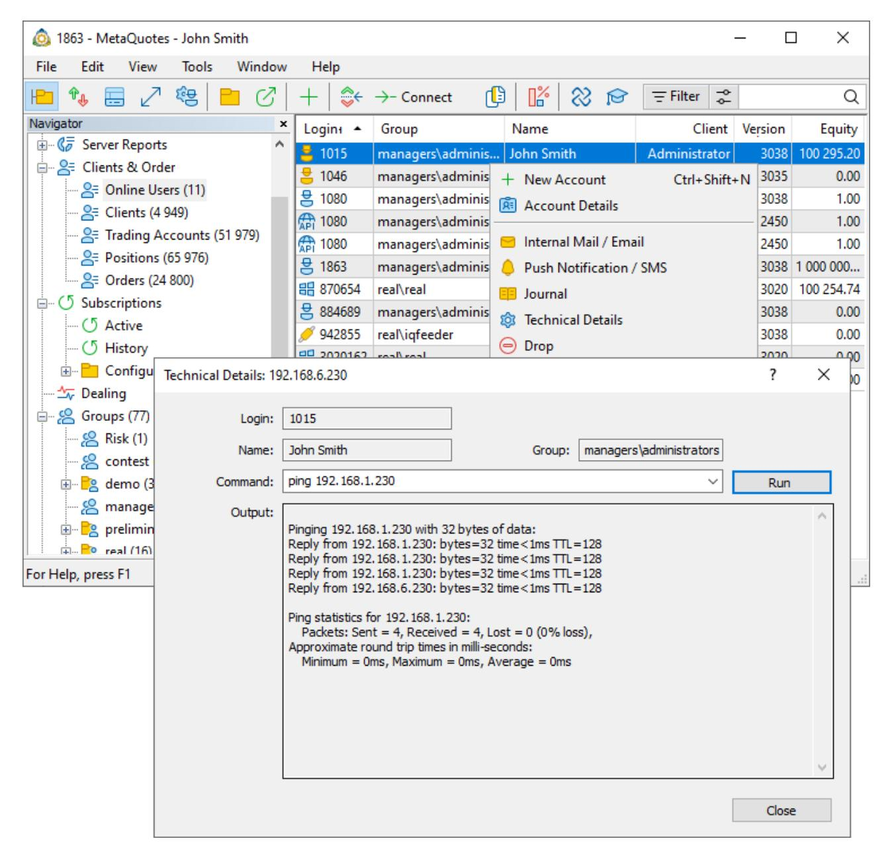

In addition to trading information, the section provides technical details on account connections. The list of accounts shows the IP address from which the client is connected or the domain name if option "Enable DNS Lookup" is enabled in the context menu.

For more details, click Technical Details... in the context menu, as shown above. Next, enter the network command to execute in the Command field. You can specify your own command or choose one of the commonly used: "ping", "tracert" or "whois". After clicking Run, the result of the command execution will appear below.

To forcibly disconnect a client from the server, select Drop in the context menu. After the connection is dropped, the client terminals will automatically attempt to reconnect.

The Online Users tab can be hidden by using the "Hide online users" option in the manager terminal settings. This reduces the load on the manager terminal and the consumption of network traffic.

# <span id="page-205-0"></span>**Depositing and withdrawing funds**

The easier and faster your clients can start trading, the less likely they are to change their mind and leave. One of the key steps on this process is the ability to deposit funds. The MetaTrader 5 platform provides special tools for this. You can embed deposit and withdrawal buttons directly into trading terminals, both desktop and mobile.

Selection of these buttons will open a certain page on the broker's website. The information necessary for the deposit/withdrawal operation is passed to the website: account number and currency, name, language, client group type etc. The trader will only need to specify the amount. This allows traders to proceed instantly.

## **How it works for traders**

From the MetaTrader 5 desktop client terminal, the deposits and withdrawals requests can be made via:

- ·the context menu of the Navigator
- ·the context menu of the Trade section in the Toolbox
- ·the + icon in the account status line in in the Trade section

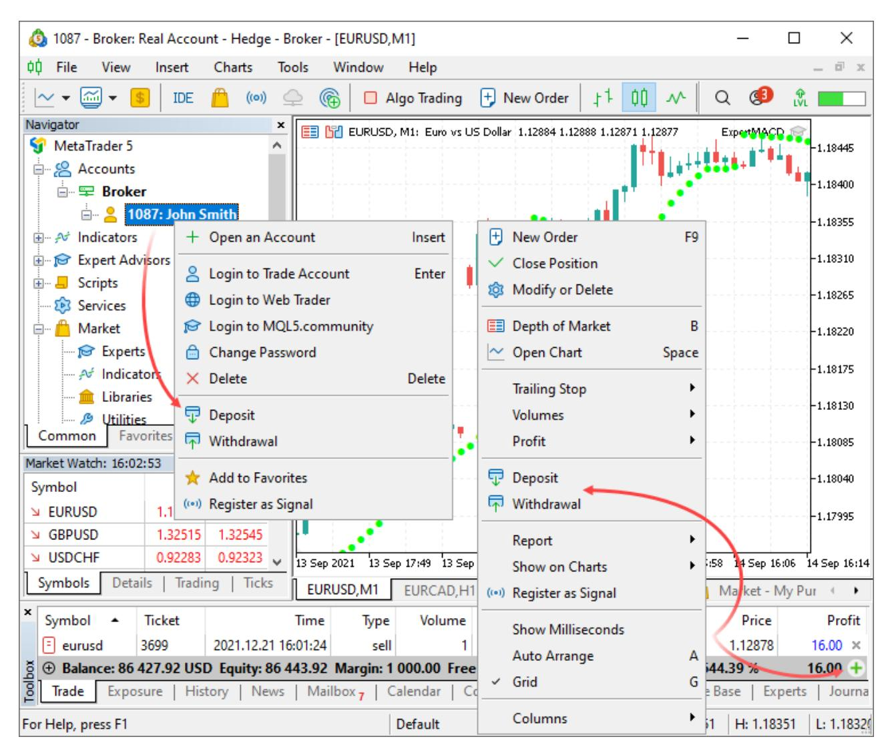

In the MetaTrader 5 mobile terminal (both iOS and Android), the commands for fast navigation to deposit/withdrawal pages are available in the Accounts and Trading sections:

| $\equiv$ Balance:<br>Commission:<br>Equity:<br>Margin:<br>Free Margin:<br>Margin Level (%): | 131.00 USD                                                                       | $\pm$ 99 943.90<br>$-8.20$<br>100 066.70<br>432.77<br>99 633.93<br>23 122.37 | < Accounts                  | $\mathcal{R}_{\mathcal{S}_0}$ John Smith<br>40739870 - MetaQuotes-Demo<br>100 000.00 USD<br>1:100, Hedge |
|---------------------------------------------------------------------------------------------|----------------------------------------------------------------------------------|------------------------------------------------------------------------------|-----------------------------|----------------------------------------------------------------------------------------------------------|
| <b>AUDUSD sell 1</b><br>$0.76386 \rightarrow 0.76255$                                       |                                                                                  | 131.00                                                                       | Deposit                     | ▶                                                                                                        |
| <b>EURCAD buy limit</b><br>1/0 at 1.54633                                                   |                                                                                  | placed                                                                       | Withdrawal                  |                                                                                                          |
| <b>USDCHF sell limit</b><br>1.4 / 0 at 0.89583                                              |                                                                                  | placed                                                                       | Name                        | John Smith                                                                                               |
|                                                                                             |                                                                                  |                                                                              | Email                       | john@smith.net                                                                                           |
|                                                                                             |                                                                                  |                                                                              | Phone<br>Login              | +55655853955<br>40739870                                                                                 |
|                                                                                             | Balance                                                                          |                                                                              | Server                      | MetaQuotes-Demo                                                                                          |
|                                                                                             | Quickly navigate to account deposit/withdrawal pages on<br>your broker's website |                                                                              | Connected                   | Access Point EU 3                                                                                        |
|                                                                                             | <b>Deposit</b>                                                                   |                                                                              | Connect from another device | $\mathcal{P}$                                                                                            |
|                                                                                             | Withdrawal                                                                       |                                                                              | Change Password             | $\mathcal{P}$                                                                                            |
|                                                                                             | <b>Cancel</b>                                                                    |                                                                              | Bind to OTP                 | $→$                                                                                                      |
|                                                                                             |                                                                                  |                                                                              | <b>Delete Account</b>       | $\mathcal{P}$                                                                                            |

A tap on the Deposit command directly opens the broker's payment page where the trader only needs to specify the amount and select a preferred payment method. All other details, including the trader's name, trading account data and payment purpose, are automatically substituted based on the rules set by the broker. Traders will surely appreciate the efficiency, speed and automation of one-click payments.

The trading terminal does not perform any account deposit/withdrawal operations. The integrated functions redirect the user to the relevant broker's website pages.

# **Configuring deposits/withdrawals in MetaTrader 5 Administrator**

Links to deposit and withdrawal pages can be added in account allocation sections and in group sections in MetaTrader 5 Administrator:

|      | MetaQuotes - MetaTrader 5 Administrator |                              |                 |        |                                   |                   |                                                                                                         |                      |        |         |          |                                                    |         |                       |   | □                     | ×    |
|------|-----------------------------------------|------------------------------|-----------------|--------|-----------------------------------|-------------------|---------------------------------------------------------------------------------------------------------|----------------------|--------|---------|----------|----------------------------------------------------|---------|-----------------------|---|-----------------------|------|
| File | Edit                                    | View                         | <b>Services</b> |        | Help                              |                   |                                                                                                         |                      |        |         |          |                                                    |         |                       |   |                       |      |
|      | -X-Disconnect                           | ←                            |                 |        | $\langle \varphi \rangle$ Refresh |                   | Restart Server                                                                                          | $\vee$ Apply $+$ 203 |        |         | $\times$ | $K$ Import                                         |         | $\binom{7}{1}$ Export |   | $\downarrow^A_z$ Sort |      |
|      |                                         | 由 B Automations              |                 |        | A                                 | $\mathsf{\times}$ | Demo account allocation URL                                                                             |                      |        |         |          | https://broker.com/open_account                    |         |                       |   |                       |      |
|      |                                         | 画… ○ Security                |                 |        |                                   | M                 | Automatic allocation of demo account on first start                                                     |                      |        |         |          |                                                    |         |                       |   |                       |      |
|      |                                         | <b>1</b> Time                |                 |        |                                   |                   | <b>Ø</b> Deposit URL                                                                                    |                      |        |         |          | https://www.abcbroker.com/[lang:ru en zh]/deposit  |         |                       |   |                       |      |
|      |                                         | <b>C</b> Holidays            |                 |        |                                   |                   | √ Withdrawal URL                                                                                        |                      |        |         |          | https://www.abcbroker.com/[lang:ru en zh]/withdraw |         |                       |   |                       |      |
|      |                                         | 由 8 Groups (1744)            |                 |        |                                   |                   |                                                                                                         |                      |        |         |          |                                                    |         |                       |   |                       |      |
|      |                                         | SE Clients & Accounts        |                 |        |                                   | Group             |                                                                                                         |                      |        |         |          | Description                                        |         |                       |   |                       |      |
|      |                                         | <b>Allocations</b>           |                 |        |                                   | <b>Default</b>    |                                                                                                         |                      |        |         |          |                                                    |         |                       |   |                       |      |
|      |                                         | <b>2</b> Clients             |                 |        |                                   |                   | & demo\demoforex-5                                                                                      |                      |        |         |          | Demo-Netting                                       |         |                       |   |                       |      |
|      |                                         | 음 Mana<br>$2 =$ Tradir       |                 |        | Group: demo\demoforex             |                   |                                                                                                         |                      |        |         |          |                                                    |         |                       | П | X                     |      |
|      |                                         | 由 <b>Goders</b> &            |                 |        |                                   |                   |                                                                                                         |                      |        |         |          |                                                    |         |                       |   |                       |      |
|      | 田一人                                     | Gateways                     |                 | Common | Company                           |                   | News & Mail                                                                                             | Permissions          | Margin | Symbols |          | Commissions                                        | Reports |                       |   |                       |      |
|      | ⊞∽ลิ                                    | Data Feed                    |                 |        |                                   |                   |                                                                                                         |                      |        |         |          |                                                    |         |                       |   |                       |      |
|      | $\mathbf{H}$                            | Pugins                       |                 |        |                                   |                   | Please specify details of the group servicing company and the folder with mail and<br>report templates. |                      |        |         |          |                                                    |         |                       |   |                       |      |
|      |                                         | 由 <b>G</b> Reports           |                 |        |                                   |                   |                                                                                                         |                      |        |         |          |                                                    |         |                       |   |                       |      |
|      | 由 血 ECN                                 |                              |                 |        |                                   | Company:          | <b>Broker</b>                                                                                           |                      |        |         |          |                                                    |         |                       |   |                       |      |
|      |                                         | + Routing                    |                 |        | Company site:                     |                   | https://broker.com                                                                                      |                      |        |         |          |                                                    |         |                       |   |                       |      |
|      |                                         | Funds &                      |                 |        |                                   |                   | mail@broker.com                                                                                         |                      |        |         |          |                                                    |         |                       |   |                       |      |
|      |                                         | Symbols                      |                 |        | Company email:                    |                   |                                                                                                         |                      |        |         |          |                                                    |         |                       |   |                       |      |
|      |                                         | $\mathbf{\triangle}$ Spreads |                 |        | Deposit site:                     |                   | https://broker.com/deposit                                                                              |                      |        |         |          |                                                    |         |                       |   |                       | $\,$ |
|      | For Help, press F1                      |                              |                 |        | Withdrawal site:                  |                   | https://broker.com/withdraw                                                                             |                      |        |         |          |                                                    |         |                       |   |                       | аř.  |
|      |                                         |                              |                 |        | Support site:                     |                   | https://support.broker.com                                                                              |                      |        |         |          |                                                    |         |                       |   |                       |      |
|      |                                         |                              |                 |        | Support email:                    |                   | support@broker.com                                                                                      |                      |        |         |          |                                                    |         |                       |   |                       |      |
|      |                                         |                              |                 |        |                                   |                   |                                                                                                         |                      |        |         |          |                                                    |         |                       |   |                       |      |
|      |                                         |                              |                 |        | Templates folder:                 |                   |                                                                                                         |                      |        |         |          |                                                    |         |                       |   |                       |      |
|      |                                         |                              |                 |        |                                   |                   |                                                                                                         |                      |        |         |          |                                                    |         |                       |   |                       |      |
|      |                                         |                              |                 |        |                                   |                   |                                                                                                         |                      |        |         |          |                                                    |         |                       |   |                       |      |
|      |                                         |                              |                 |        |                                   |                   |                                                                                                         |                      |        |         |          | OK                                                 | Cancel  |                       |   | Help                  |      |

Links in the account allocation section apply globally to all groups. Thus, added deposit and withdrawal links will be available for all accounts within the platform (including demo accounts).

Links in groups allow overriding global settings or enabling this option only for separate accounts. If you do not want to enable deposit and withdrawal commands for all accounts, leave appropriate account allocation settings unchanged and add links only to the specific group settings.

Trader parameters separated by "&" symbol are additionally passed in the address line. Analyze the parameters to direct the traders to the required page and to automatically fill deposit/withdrawal form fields.

https://www.deposit.url/?login=1815985&email=john@smith.net&type=real&currency=USD&

acp=1252&label=MetaQuotes&server=MetaQuotes-Demo&interface=English& cid=35069eb0358e7b01023bdef53313c0cc&age=437&utm\_campaign=download& utm\_source=www.metatrader5.com

The following parameters are supported:

- ·login — account login.
- ·type — account type: demo, contest or real.
- ·currency — account deposit currency
- ·acp — the code page used by the trader.
- ·label — the name of the company which owns the terminal White Label.
- ·server — the name of the server on which the account is opened.
- ·interface — the current language of the client terminal interface.
- ·cid — the unique identifier of the trader's computer.
- ·age — the number of days since the installation of the client terminal.
- ·email — the email address specified in the trading account.
- · utm\_campaign — the name of the marketing campaign from the Lead Campaign field of the trading account. This parameter is filled automatically, in accordance with the tag specified in the terminal installation link.
- · utm\_source — the source name from the Lead Source field of the trading account This parameter is filled automatically, in accordance with the tag specified in the terminal installation link.

You can use the [lang: ... ] macro in the address line to forward a trader to the desired language page. The list of languages in ISO 639-1 format should be specified here. If one of the listed languages matches the interface language of the client terminal, it will be used for the news language. Otherwise, the first language in the list is used. Example:

https://www.deposit.url/[lang:ru|en|es]

Additional link parameters are not supported. If necessary, you can use the redirect option on your site.

For example, you use the same page for deposits and withdrawals, https://www.abcbroker/balance. If you specify it in both parameters on the MetaTrader 5 side, your site will not know which action was requested by the user. To solve this issue, set different deposit and withdrawal URLs on the platform side: https://www.abcbroker/balance/deposit and https://www.abcbroker/balance/withdraw. The user can then be redirected to the appropriate page on the platform side, while the additional parameters will be registered.

# **Automating balance operations**

You can automate various balance operations. For example, you can automatically add bonuses to with their first deposit operation.

Open the Automations section in MetaTrader 5 Administrator and create a task. Select "First Deposit" for the trigger:

|                    |                     | MetaQuotes - MetaTrader 5 Administrator        |                                                                                               |                    |                                                                                                                                                  |                                          |    |       |   |    |                  |              |                       | □    | ×                     |
|--------------------|---------------------|------------------------------------------------|-----------------------------------------------------------------------------------------------|--------------------|--------------------------------------------------------------------------------------------------------------------------------------------------|------------------------------------------|----|-------|---|----|------------------|--------------|-----------------------|------|-----------------------|
| File               | Edit                | View<br><b>Services</b>                        | Help                                                                                          |                    |                                                                                                                                                  |                                          |    |       |   |    |                  |              |                       |      |                       |
| -X-Disconnect      |                     | $\leftarrow$                                   | $\left\{ \mathbf{\Omega} \right\}$ <b>Refresh</b> $\left\langle \right\rangle$ Restart Server |                    |                                                                                                                                                  | $\vee$ Apply $+$ $\circledcirc$ $\times$ |    |       |   |    | $K_j$ Import     |              | $\binom{7}{1}$ Export |      | $\downarrow^A_2$ Sort |
|                    |                     | 白 -- 早 MetaTrader Server                       | Μ                                                                                             | Name               |                                                                                                                                                  |                                          |    |       |   |    | Type Eve Act Act |              |                       | Op   | Op                    |
|                    |                     | Network Cluster شي الله                        | Automation                                                                                    |                    |                                                                                                                                                  |                                          |    |       |   |    |                  |              |                       | п    | ×                     |
|                    |                     | <b>E-©</b> Integrations                        |                                                                                               |                    |                                                                                                                                                  |                                          |    |       |   |    |                  |              |                       |      |                       |
|                    |                     | 由 28 Automations                               | Trigger                                                                                       | Conditions Actions |                                                                                                                                                  |                                          |    |       |   |    |                  |              |                       |      |                       |
|                    |                     | <b>⊞</b> ○ Security                            |                                                                                               |                    |                                                                                                                                                  |                                          |    |       |   |    |                  |              |                       |      |                       |
|                    | $\Box$ $\odot$ Time |                                                |                                                                                               |                    | Set up automation of typical procedures based on scenarios. Please start with setting<br>properties: trigger event, time limits and periodicity. |                                          |    |       |   |    |                  |              |                       |      |                       |
|                    |                     | $\Box$ $\mathbb{Q}$ Holidays                   |                                                                                               |                    |                                                                                                                                                  |                                          |    |       |   |    |                  |              |                       |      |                       |
|                    |                     | 由 8 Groups (1745)                              |                                                                                               |                    | <b>▽</b> Enable                                                                                                                                  |                                          |    |       |   |    |                  |              |                       |      |                       |
|                    |                     | 由 ·· S= Clients & Accour<br>由 C Orders & Deals |                                                                                               | Name:              | First deposit bonus                                                                                                                              |                                          |    |       |   |    |                  |              |                       |      |                       |
|                    |                     | Gateways                                       |                                                                                               |                    | First deposit                                                                                                                                    |                                          |    |       |   |    |                  | $\checkmark$ |                       |      |                       |
|                    |                     | 中心 So Data Feeds                               |                                                                                               | Trigger:           |                                                                                                                                                  |                                          |    |       |   |    |                  |              |                       |      |                       |
|                    |                     | <b>E</b> ∩ Plugins                             |                                                                                               |                    |                                                                                                                                                  |                                          |    |       |   |    |                  |              |                       |      |                       |
|                    |                     | 由 <b>G</b> Reports                             |                                                                                               | Started:           | 2020.09.10 14:14:48                                                                                                                              |                                          | §  |       |   |    |                  |              |                       |      |                       |
|                    | 由 血 ECN             |                                                |                                                                                               | Expired:           |                                                                                                                                                  | 2021.12.21 16:30:34                      | ▦▾ |       |   |    |                  |              |                       |      |                       |
|                    |                     | $\rightarrow^{\uparrow}_{\mathbf{k}}$ Routing  |                                                                                               |                    |                                                                                                                                                  |                                          |    |       |   |    |                  |              |                       |      |                       |
|                    |                     | <b>Example Funds &amp; ETF</b>                 |                                                                                               | Repetitions:       | 0                                                                                                                                                | $\div$                                   |    |       |   |    |                  |              |                       |      |                       |
|                    |                     | 由 Symbols (92450)                              |                                                                                               | Period:            | ÷<br>0                                                                                                                                           | days<br>0                                | ÷  | hours | 0 |    | minutes          |              |                       |      |                       |
|                    |                     | $M5$ Spreads                                   |                                                                                               |                    |                                                                                                                                                  |                                          |    |       |   |    |                  |              |                       |      |                       |
| For Help, press F1 |                     |                                                |                                                                                               | Days of week:      | All                                                                                                                                              |                                          |    |       |   |    |                  |              |                       |      |                       |
|                    |                     |                                                |                                                                                               |                    |                                                                                                                                                  |                                          |    |       |   |    |                  |              |                       |      |                       |
|                    |                     |                                                |                                                                                               | Months:            | All                                                                                                                                              |                                          |    |       |   |    |                  |              |                       |      |                       |
|                    |                     |                                                |                                                                                               | Days of month:     | All                                                                                                                                              |                                          |    |       |   |    |                  |              |                       |      |                       |
|                    |                     |                                                |                                                                                               |                    |                                                                                                                                                  |                                          |    |       |   |    |                  |              |                       |      |                       |
|                    |                     |                                                |                                                                                               |                    |                                                                                                                                                  |                                          |    |       |   | OK |                  | Cancel       |                       | Help |                       |

Additional trigger filters can be specified under the Conditions section. For example, you can select client groups and countries for which the bonus will apply.

| Automation |                       |                    |                                                                                                                                   | ×<br>п         |
|------------|-----------------------|--------------------|-----------------------------------------------------------------------------------------------------------------------------------|----------------|
| Trigger    | Conditions            |                    |                                                                                                                                   |                |
|            |                       |                    | Please specify detailed conditions for the automation task to trigger. Date, account and platform-based parameters are available. |                |
|            |                       | Type               | Condition                                                                                                                         | Value          |
|            |                       | Accounts\\Group    | Equal (=)                                                                                                                         | $real*$        |
|            |                       | Accounts\\\Country | Equal (=)                                                                                                                         | Canada         |
|            | Add<br>Edit<br>Delete |                    |                                                                                                                                   |                |
|            |                       |                    | <b>OK</b>                                                                                                                         | Help<br>Cancel |

In the Actions section, select "Bonus" or "Bonus as percentage" depending on whether you want to provide the bonus as a specific amount or as a percentage of the initial deposit amount.

| Automation |                            |                                                                                                                                                                                                                                                             |  | $\times$ |          |
|------------|----------------------------|-------------------------------------------------------------------------------------------------------------------------------------------------------------------------------------------------------------------------------------------------------------|--|----------|----------|
|            | Trigger Conditions Actions |                                                                                                                                                                                                                                                             |  |          |          |
|            |                            | Please specify actions that should be performed when conditions trigger. For example, sending a message, updating account settings or performing balance operation, etc. Also specify accounts and groups to apply the action to.                           |  |          |          |
|            | Up                         | Action<br>Name                                                                                                                                                                                                                                              |  |          |          |
|            | <b>Down</b>                | 22 50 USD Bonus<br><b>Bonus</b>                                                                                                                                                                                                                             |  |          |          |
|            |                            |                                                                                                                                                                                                                                                             |  |          |          |
|            | <b>Action</b>              |                                                                                                                                                                                                                                                             |  | ?        | $\times$ |
|            |                            | Please specify automation action name and parameters. Parameters of some actions can be taken from trigger context. With trigger of Connections, Accounts or Finance configured, the system can use the login for which the automation condition triggered. |  |          |          |
|            |                            | 50 USD Bonus<br>Name:                                                                                                                                                                                                                                       |  |          |          |
|            |                            | Finance Bonus<br>$\checkmark$<br>Action:                                                                                                                                                                                                                    |  |          |          |
|            | Select by:                 | Trigger<br>✓                                                                                                                                                                                                                                                |  |          |          |
|            | Amount:                    | 50.00                                                                                                                                                                                                                                                       |  |          |          |
|            | Comment:                   | First deposit bonus                                                                                                                                                                                                                                         |  |          |          |
|            |                            | OK<br>Cancel                                                                                                                                                                                                                                                |  |          |          |

In this example, for every first deposit of a real account from Canada, the system will automatically add a bonus of 50 USD to it. The bonus will be added as a balance deal of Bonus type with the comment "First deposit bonus".

See also: [Documentation / Platform / Platform Settings / Automations](https://support.metaquotes.net/en/docs/mt5/platform/administration/automation) 

## **Performing balance operations manually**

The manager terminal allows performing balance operations: depositing and withdrawing funds, crediting, charging commissions and dividends, etc.

| Title                          | Details |
|--------------------------------|---------|
| 1863 - MetaQuotes - John Smith |         |
| Edit                           |         |
| Window                         |         |
| File                           |         |
| <b>Tools</b>                   |         |
| View                           |         |
| Help                           |         |

| Market Watch: 15:57:07 |  |
|------------------------|--|
| Balance ^              |  |
| Login                  |  |
| Name                   |  |
| Group                  |  |
| Country                |  |

| Bid                         |  |
|-----------------------------|--|
| Ask                         |  |
| Symbol                      |  |
| 863689                      |  |
| Czech Republic 5 013 314.74 |  |
| <b>Patterson Charles</b>    |  |
| demo	extbackslash demoforex |  |

| <b>EURAUD.ECN</b>   |
|---------------------|
| 1.58032             |
| 1.58046             |
|                     |
| 863690              |
|                     |
| <b>Young Steven</b> |
| + New Account       |
| Ctrl+Shift+N        |
| 91                  |
| dei                 |

| <b>EURCAD</b>       |
|---------------------|
| 1.45694             |
| 1.45774             |
| 2863691             |
|                     |
| <b>Wood Michael</b> |
| <sub>14</sub>       |
| dei                 |
| <b>Red</b>          |
| Account Details     |

| Account: 863689, Patterson Charles, USD, 1:100, Netting |
|---------------------------------------------------------|
|---------------------------------------------------------|

| Balance        |
|----------------|
| Profile        |
| Overview       |
| Personal       |
| Account Limits |
| Subscriptions  |
| Trade          |
| Exposure       |
| History        |
| Security       |

| Na |
|----|
|    |
|    |
|    |
|    |
|    |
|    |
|    |
|    |
|    |
|    |

Balance: 5 013 314.74 USD Equity: 5 013 314.74 Free: 5 013 314.74

| Operation:                                                                                        | ✓          |
|---------------------------------------------------------------------------------------------------|------------|
| 10000                                                                                             | 10 000 USD |
| Amount:                                                                                           | ✓          |
| Deposit                                                                                           |            |
| Comment:                                                                                          | ✓          |
| Conduct balance operation without checking the free margin and the current balance on the account |            |
| Withdrawal                                                                                        |            |
| <b>Deposit</b>                                                                                    |            |

| F                           | Deal             |
|-----------------------------|------------------|
| Time                        | Type             |
| Amount                      |                  |
| ⊕ 2019.02.20 23:48:41       |                  |
| balance                     | 5 000 000.00     |
| 8906261                     |                  |
| → 2019.02.20 23:59:59       |                  |
| 8988067                     | daily commission |
| -141.00                     |                  |
| ∑ 2019.02.21 23:59:59       |                  |
| 9072990                     | daily commission |
| -4.00                       |                  |
| · Balance: 5 013 314.74 USD |                  |
| Equity: 5 013 314.74        |                  |
| Free: 5 013 314.74          |                  |

| ▦▾         | ▦▾          |
|------------|-------------|
| 2021.12.22 | Request     |
| 1970.01.01 | All history |
| ✓          |             |
| &overline  |             |

| New Client |
|------------|
| Update     |
| Cancel     |
| Help       |

To conduct a balance operation, set the following parameters:

- · **Operation** — type of operation:
  - ·**Balance** — changing an account balance.
  - ·**Credit** — issuing and repaying a credit.
  - ·**Charge** — any additional charges.
  - ·**Correction** — correction of trading results.

- ·**Bonus** — bonuses. Bonuses increase the client's credit funds.
- ·**Commission** — additional commissions.
- ·**Dividend** — paying taxable dividends.
- ·**Franked dividends** — paying non-taxable dividends (tax is paid by a company).
- ·**Tax** — charging a tax.
- ·**Amount** — amount of money deposited or withdrawn from the account.
- · **Comment** — a text comment to the operation. In this field, you can choose one of the earlier created comments, or write a new one.

There are two types of directions for each operation type, depositing to an account or withdrawal. The blue button is used for depositing, the red button is used for withdrawals.

By default, the platform checks payment operations to make sure the operation will not cause the account free margin and balance to become negative. In any of the above cases, the platform will not perform the operation and will return the "No money" error. If necessary, you can disable these checks by enabling the option "Conduct balance operations without checking the free margin and the current balance on the account".

#### **Features of balance operations**

- ·All balance operations are conducted in the system as deals.
- ·It is not allowed to withdraw an amount greater than the current value of the free margin.
- · The free margin is not checked for the Correction operation. Please be careful when performing operations that reduce the balance. If the client has open positions and you write off an amount greater than the free margin, this will cause the Stop out to trigger on the account.

The "Accountant (deposit/withdraw)" permission is required for accessing the section. The permission is granted by the platform administrator.

#### **History of operations**

The history of balance operations conducted earlier is available at the bottom of the window:

- · **Time** — the time of the operation. When funds are deposited to the account, icon "+" is shown at the beginning of this field. Sign "-" is used for withdrawals.
- ·**Deal** — unique operation ID in the system.
- ·**Type** — operation type.
- ·**Amount** — operation amount.
- ·**Comment** — a comment to the operation.

To view the history of balance operations, set a period and click Request at the bottom of the window. Use the context menu to enable/disable the display of milliseconds, grid or comments in the history of operations, use the context menu.

#### **Account state**

The account status bar is displayed under the list of balance operations. It contains the following information:

- ·**Balance** — money on the account, not accounting for the results of currently open positions (deposit).
- · **Credit** — amount of credit funds provided to the client by the broker. The trading platform does not provide an ability to charge interest for credit assets.
- · **Blocked** — a client group can be set up so that a profit earned by a trader during the day cannot be used for trading (it is not included in the free margin). This blocked profit is displayed in the Blocked field. At the end of the trading day, this profit is unlocked and added to the account balance.
- ·**Equity** — equity is calculated as Balance + Credit - Commission +/- Floating profit/loss - Blocked.
- ·**Margin** — money required to cover open positions and pending orders.
- · **Free** — the following parameters are displayed here:
  - · **Free Margin** — free amount of money that can be used to maintain open positions. It is calculated as Equity - Margin. Depending on the client group settings, the equity value may or may not include floating profit, floating loss or floating profit and floating loss together.
  - ·**Margin Level** — percentage of the account equity to the margin volume (Equity / Margin \* 100).

If the clients open positions show a positive result, icon "+" is shown at the beginning of the account status line. Icon "-" is shown if the result is negative.

# <span id="page-214-0"></span>**Balance check and correction**

In the manager terminal, you can easily check the balance and the state of credit funds on the accounts based on the history of deals. Such operations can be needed after the manual history correction, for example, as a result of failures or abnormal situations.

To check balances, go to the Accounts section and enable the "Balance / Checked" and "Credit / Checked" columns via the context menu.

| (6) 1863 - MetaQuotes - John Smith    |                           |                   |      |                                |                |            |                          |             |                                         | □            | ×              |       |
|---------------------------------------|---------------------------|-------------------|------|--------------------------------|----------------|------------|--------------------------|-------------|-----------------------------------------|--------------|----------------|-------|
| Edit<br>File<br>View                  | Tools                     | Window            | Help |                                |                |            |                          |             |                                         |              |                |       |
| $\mathcal{P}_{\Phi}$                  |                           |                   |      | te → Connect                   | K<br>⊪         |            | $ 7$ 19                  | $7$ Filter | 긓                                       |              |                | Q     |
| Navigator                             | $\boldsymbol{\mathsf{x}}$ | Login             | Name |                                | <b>Balance</b> |            | <b>Balance / Checked</b> |             | Credit                                  | Credit / Che |                | $a7$ |
| MetaTrader 5 Manager                  |                           | 863689            |      | <b>Patterson Charles</b>       | 5 013 314.74   |            |                          |             | 0.00                                    |              |                |       |
| 由------------------------------------ |                           | 863690            |      | <b>Young Steven</b>            | 4 998 385.91   |            |                          |             | 0.00                                    |              |                |       |
| 画 (iii) Analytics                     |                           | 863691            |      | <b>Wood Michael</b>            | 5 000 604.64   |            |                          |             | 0.00                                    |              |                |       |
| <b>E-Co</b> Server Reports            |                           | 863692            |      | <b>Watson Ashton</b>           | 5 010 417.31   |            |                          |             | 0.00                                    |              |                |       |
| e- 2= Clients & Orders                |                           | 863693            |      | + New Account                  | Ctrl+Shift+N   |            |                          |             | 0.00                                    |              |                |       |
| $\frac{1}{2}$ Online Users (8)        |                           | 863694            |      | <b>RE</b> Account Details      |                |            |                          |             | 0.00                                    |              |                |       |
| $\mathbb{R}$ Clients (4 954)          |                           | 863695            |      | $
7$ Delete Accounts           |                | $Ctrl + D$ |                          |             | 0.00                                    |              |                |       |
| - 용 Trading Accounts (                |                           | 863696            |      | S. Bulk Operations             |                |            |                          |             | 0.00                                    |              |                |       |
| $\frac{1}{2}$ Positions (65 976)      |                           | 863697            |      |                                |                |            |                          |             | 0.00                                    |              |                |       |
| $\frac{1}{2}$ Orders (24 800)         |                           | 863698            |      | Internal Mail / Email          |                |            |                          |             | 0.00                                    |              |                |       |
| <b>A.</b> 5ubscriptions               |                           | 863699            |      | <b>Push Notification / SMS</b> |                |            |                          |             | 0.00                                    |              |                |       |
| $-rac{A_{ abla}}{A}$ Dealing         |                           | 863700            |      | Journal                        |                |            |                          |             | 0.00                                    |              |                |       |
| 由 8 Groups (1 123)                    |                           | 863701            |      | <b>Balances</b>                |                | ▶          |                          |             | 0.00                                    |              |                |       |
| $oxed$ Plugins (6)                   |                           | 863702            |      |                                |                |            |                          |             | 0.00                                    |              |                |       |
| <b>E-C</b> Support Center             |                           | 863703            |      | Select By                      |                | ۰          |                          |             | 0.00                                    |              |                |       |
| ம் பி App Store                       | o                         | 863704            |      | Filter                         |                |            |                          |             | 0.00                                    |              |                |       |
|                                       |                           | Clients: 4954     |      | Copy As                        |                |            | s: 65 976                |             | Orders: 24 800                          |              |                |       |
| ×<br>Time                             |                           | Source            |      | <b>⊘</b> Export                |                |            |                          |             |                                         |              |                |       |
| 2021.12.21 15:19:15.827               |                           | Reports           |      |                                |                |            |                          |             | kly has been received in 0.43 sec 32 K  |              |                |       |
| 2021.12.21 16:57:47.711               |                           | MetaQuotes-       |      | $7$ Import                    |                |            |                          |             | or 'BR-1.13' 2021.12.20-2021.12.2       |              |                |       |
| 2021.12.21 16:57:47.860               |                           | MetaQuotes-       |      | $Q$ Find                       |                | $Ctrl + F$ |                          |             | '.13' 2021.2.20-2021.12.21 has been req |              |                |       |
| 2021.12.21 16:57:48.861               |                           | MetaQuotes-       |      | <b>Auto Scroll</b>             |                |            |                          |             | or 'BR-1, 3' 2021.12.20-2021.12.21      |              |                |       |
| 2021.12.21 16:57:48.920               |                           | MetaQuotes-       |      |                                |                |            |                          |             | 3' 2021/12.20-2021.12.21 has been req   |              |                |       |
|                                       |                           |                   |      | <b>Auto Arrange</b>            |                | А          |                          |             |                                         |              |                |       |
| Toolbox<br>Summary   Exposure         |                           | Mailbox<br>News27 |      | $\\checkmark$ Grid             |                | G          | rch/                     | Journal     |                                         |              |                |       |
| For Help, press F1                    |                           |                   |      | Columns                        |                | k          |                          |             |                                         | 8            | atl 50.3 / 0.0 |       |

Select one or several accounts, for which you want to check the balance and credit funds and execute the "Balance — Check Balance" command. If an incorrect balance or credit funds value is revealed, the appropriate account will be highlighted in red.

| File<br>Edit<br>Tools<br>View                                                                                                                                                                                                                                                                                                                                                                                                                            | Window                                                                                                                                         |                                                                                                                                                                                                                                                                                         |                                                                                       |                                                                                                                                                                                                                                                                     |                                                                                                                        | П                 | × |  |  |  |  |  |  |
|----------------------------------------------------------------------------------------------------------------------------------------------------------------------------------------------------------------------------------------------------------------------------------------------------------------------------------------------------------------------------------------------------------------------------------------------------------|------------------------------------------------------------------------------------------------------------------------------------------------|-----------------------------------------------------------------------------------------------------------------------------------------------------------------------------------------------------------------------------------------------------------------------------------------|---------------------------------------------------------------------------------------|---------------------------------------------------------------------------------------------------------------------------------------------------------------------------------------------------------------------------------------------------------------------|------------------------------------------------------------------------------------------------------------------------|-------------------|---|--|--|--|--|--|--|
| Help                                                                                                                                                                                                                                                                                                                                                                                                                                                     |                                                                                                                                                |                                                                                                                                                                                                                                                                                         |                                                                                       |                                                                                                                                                                                                                                                                     |                                                                                                                        |                   |   |  |  |  |  |  |  |
| $\mathcal{P}_{\Phi}$<br>$\triangledown$<br>연<br>匾<br>IÐ                                                                                                                                                                                                                                                                                                                                                                                                  | a                                                                                                                                              | ी → Connect                                                                                                                                                                                                                                                                             | (動]<br>8″ ⊡                                                                           | $\otimes$ $\otimes$                                                                                                                                                                                                                                                 | 군<br>$\equiv$ Filter                                                                                                   |                   | Q |  |  |  |  |  |  |
| Navigator<br>몽 MetaTrader 5 Manager<br>$\overline{m}$ $\overline{m}$ Servers<br>画 (iii) Analytics<br><b>E</b> Co Server Reports<br>e- 2= Clients & Orders<br>$\mathbb{R}^2$ Online Users (8)<br>$\frac{1}{2}$ Clients (4 954)<br><b>BE</b> Trading Accounts<br>$\frac{1}{2}$ Positions (65 976)<br><b>PE Orders (24 800)</b><br><b>E</b> C Subscriptions<br>$-\frac{A_{\overline{V}}}{\sqrt{V}}$ Dealing<br>由 8 Groups (1 123)<br>$\bigcirc$ Plugins (6) | ×<br>Login A<br><u>A</u> 1812552<br>1812554<br>2.18<br>음 18<br>రి<br>18<br>Do Do<br>8<br>18<br>రి<br>18<br>8<br>18<br>ది<br>-18<br>$Q = 15$    | Name<br>Jackson Logan<br>○ 1812553 James Cameron<br><b>Harrison Adam</b><br>1812555 Smith Antonio<br>+ New Account<br><b>Account Details</b><br>$\times$ Delete Accounts<br>S. Bulk Operations<br>Internal Mail / Email<br><b>Push Notification / SMS</b><br>Journal<br><b>Balances</b> | <b>Balance</b><br>102 853.60<br>29 845.23<br>731 775.79<br>Ctrl+Shift+N<br>$Ctrl + D$ | <b>Balance / Checked</b><br>47 746.72 47 746.72 / 49 995.04<br>Check Balance                                                                                                                                                                                        | Credit<br>0.00<br>0.00<br>0.00<br>0.00<br>0.00<br>0.00<br>0.00<br>0.00<br>0.00<br>0.00<br>0.00<br>0.00<br>0.00<br>) oo | Credit / Checked  |   |  |  |  |  |  |  |
| $\boldsymbol{\mathsf{x}}$<br>Time<br>2019.06.03 16:13:23.967<br>2019.06.03 16:13:23.968<br>2019.06.03 16:13:23.968<br>2019.06.03 16:13:23.969<br>2019.06.03 16:13:24.755<br>2019.06.03 16:13:24.779<br>● 2019.06.03 16:19:20.887<br>2019.06.03 16:19:20.889<br>Toolbox<br>Summary<br>Exposure<br><b>Check balance</b>                                                                                                                                    | Source<br>Orders<br>Account<br><b>Positions</b><br>Online<br>Network<br><b>TradeCer</b><br><b>MetaOu</b><br>MetaQue<br>News <sub>99</sub>   Ma | Select By<br>Filter<br>Copy As<br>$\oslash$ Export<br>$\mathfrak{C}$ Import<br>$Q$ Find<br><b>Auto Scroll</b><br>Auto Arrange<br>$\checkmark$ Grid<br>Columns                                                                                                                           |                                                                                       | <b>愈 Fix Balance</b><br>chronized<br>nchronized<br>nchronized<br>zed<br>synchronized with MetaQuotes Software Co<br>Ctrl+F d in 16 ms<br>1812555' has invalid balance: 47 746.72, vali<br>of 1 accounts have been checked<br>А<br>G<br><b>Larch</b><br>Journal<br>▶ |                                                                                                                        | all 11.9 / 0.0 Mb |   |  |  |  |  |  |  |

Two values are displayed in Balance and Credit columns: the current balance/credit funds value is displayed on the left and the value calculated based on the deals history is shown on the right.

Credit funds are checked based on Credit type deals.

The check result is also displayed in the journal. If the calculated value differs from the current one, the following message will appear in the journal:

account xxx has invalid balance: xxx.xx, valid: xxx.xx

To correct the balance/credit funds value, select the desired account and execute "Balance — Fix Balance" command in the context menu. After that the calculated balance/credit value will be inserted as the current one. The correction result will be written to the journal:

balance of account '1030390' has been fixed from 9 968.70 to 9 999.80

# <span id="page-216-0"></span>**Common errors**

- · Do not move accounts between groups with different position accounting systems (netting and hedging), especially if they have open positions. They may become incorrect.
- ·Do not forget to set passwords and to enable trading for accounts after importing.
- ·Password length requirements are configured in the account group settings.
- · Manually created accounts are not linked to the client database automatically. You should link them manually.
- · If any of the described sections of the manager terminal are not available to you, request the relevant permissions from the platform administrator.

# **Conclusion**

Congratulations! You now have the necessary knowledge to manage clients in the MetaTrader 5 platform.

You can always find additional information in the built-in documentation and articles published in the MetaQuotes Support Center.

To receive the documentary evidence of your knowledge and professional skills, pass the exams and earn your MetaTrader 5 Manager certification!

[Start certification](https://support.metaquotes.net/en/certification/courses/manager)