[🏠 Document Start](../README.md) / [Algorithmic Trading, Trading Robots](README.md) / Expert Advisors and Custom Indicators

[Previous](README.md) | [Next](Where-to-Find-Trading-Robots-and-Indicators.md)

# Expert Advisors and Custom Indicators (#expert-advisors-and-custom-indicators)

Two broad categories can be singled out among automated trading applications: trading robots and indicators. Applications of the first type are designed for performing trading operations, and the second type programs are used for analyzing prices and identifying patterns in price changes. Indicators can be used directly in trading robots forming a complete automated trading system.

## How to Run a Trading Robot or an Indicator (#run)

To start an Expert Advisor, attach it to a chart. The easiest way is to double-click on an Expert Advisor in the [Navigator](../Getting-Started/User-Interface.md) window or drag'n'drop it to a chart.

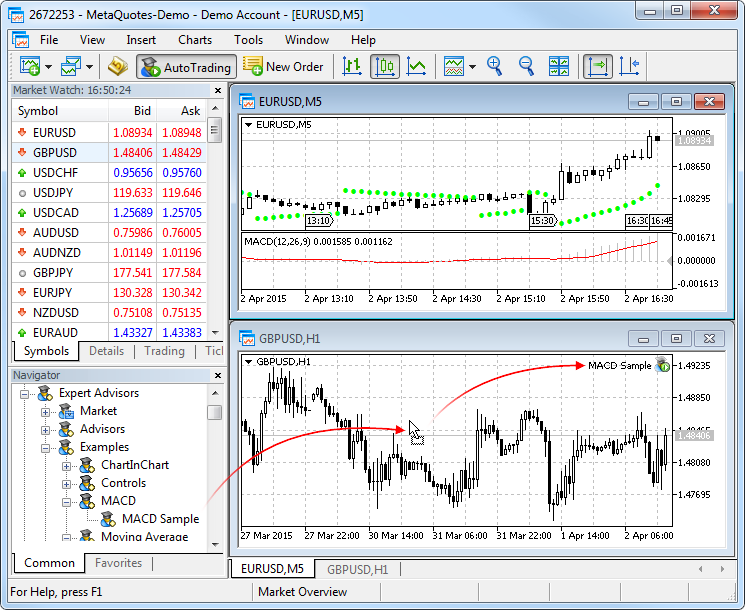

This will bring up the Expert Advisor Properties window. Click OK to start the Expert Advisors on the chart. If an Expert Advisor has been successfully started, its name and icon  appear in the upper right corner of the chart.

If the icon is , the Expert Advisor is not allowed to perform trading operations. Enable automated trading in the [Expert Advisor settings (#set)](Expert-Advisors-and-Custom-Indicators.md#set), as well as in the trading platform options.

  * Only one Expert Advisor can run on one chart. If you start another Expert Advisor on the same chart, the first one is removed.
  * The number of indicators applied on one chart is not limited.

  
---  
  

## Application Setup before Start (#set)

A window of application properties opens before it is started on a chart.

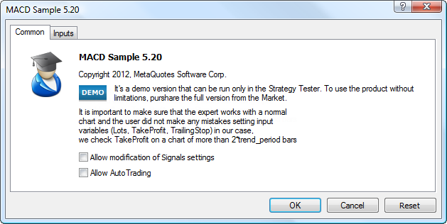

The "Common" tab contains information about the application: name, version, copyright, the software developing company name (two last parameters can be represented as links to the corresponding web page) and description.

If a license is required for an Expert Advisor (for example, it is purchased or downloaded from the [Market](../Market-App-Store/README.md)), the appropriate license details (expiration date, demo) are displayed here.

Individual parameters of the Expert Advisor start are set up at the bottom of the window:

  * Allow modification of Signals settings — this option allows an MQL5 application to [subscribe and unsubscribe from Signals](../Trading-Signals-and-Copy-Trading/How-to-Subscribe-to-a-Signal.md), as well as edit [signal settings (#signals)](../Getting-Started/Platform-Settings.md#signals). The functions for accessing the database of Signals from an MQL5 application enable you to perform your own analysis of the quality of signals, dynamically manage the subscription and adjust risks. More details about the signal managing functions are available in the [MQL5 Reference](https://www.mql5.com/en/docs/signals).
  * Allow Auto Trading — this option limits the trading activities of Expert Advisors. This limitation can be useful when testing analytical capabilities of Expert Advisors in the real-time mode (not to be confused with backtesting). Note that even if this option is enabled, the autotrading for the Expert Advisor may be disabled in the [common settings of the platform (#enable-ea)](../Getting-Started/Platform-Settings.md#enable-ea).

Common parameters for all Expert Advisors are specified in the trading platform [settings (#ea)](../Getting-Started/Platform-Settings.md#ea).

## Input Parameters of Trading Robots and Indicators (#input)

An application can have input parameters. They allow you to control the behavior of the application making its use more flexible. An application may have no input parameters if a developer has not provided them.

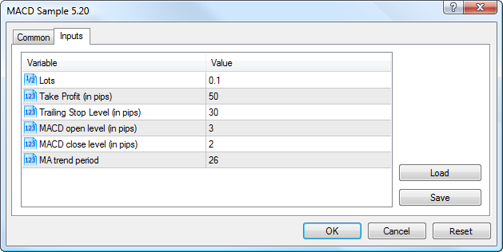

### How to modify application parameters (#how-to-modify-application-parameters)

To modify a parameter, double-click on it and enter a new value.

### How to use parameter presets (#how-to-use-parameter-presets)

You can use the "Save" button to save the current set of parameters and the "Load" button to load a previously saved set. Sets of input parameters are stored in the [/Presets (#presets)](../Getting-Started/For-Advanced-Users/Files-and-Folders.md#presets) folder of the trading platform.

### How to restore default settings (#how-to-restore-default-settings)

To restore the default settings, click "Reset".

> Already attached Expert Advisors can be individually configured. However, the Expert Advisor properties window cannot be opened during the current execution. This can only be done in periods between the Start() function calls. In this case an Expert Advisor will not be started until its parameters window is closed. If input parameters of an Expert Advisors have been changed, the EA is re-initialized with new input parameters after the "OK" button is pressed.

## Programs Using External Functions (DLL) (#dependencies)

The "Dependencies" tab appears if the Expert Advisor uses the import of functions from other EX5 or DLL files. Use of external DLLs can extend the functionality of the program. However, it is potentially dangerous. These functions should be allowed only for trusted applications.

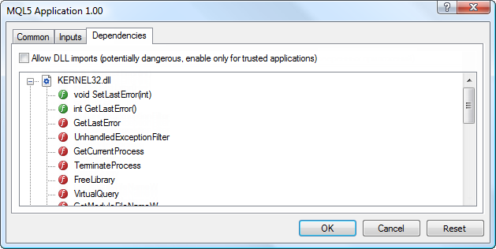

Files used by the Expert Advisor are displayed as a tree-like list. The green icons indicate calls of functions from MQL5 programs, and the red icons indicate calls of functions within DLLs.

An option for enabling/disabling DLLs is available at the top of the tab:

  * Allow DLL imports — Expert Advisors can use DLLs to extend their functionality. If this option is enabled, such libraries can be used without any restrictions. If an MQL5 application uses a DLL, but its import is prohibited (this option is disabled), then the "OK" button is not displayed in the application start window.

> Do not enable the "Allow use DLL imports" option if you are not sure that launching the application is safe. Applications obtained from unknown sources may cause damage through the use of third-party DLLs.

## How to Control Expert Advisor Trading (#control)

The possibility of automated trading can be controlled at the trading platform level or separately for every trading robot.

Button " AutoTrading" on the toolbar (and a similar option in [Options — Expert Advisors (#enable-ea)](../Getting-Started/Platform-Settings.md#enable-ea)) enables/disables automated trading in the platform. If you turn it off, automated trading is disabled for all Expert Advisors even if you enable automated trading individually in the [Expert Advisors settings (#set)](Expert-Advisors-and-Custom-Indicators.md#set). If you enable it, the Expert Advisors is allowed to trade, unless automated trading is individually disabled in the Expert Advisor parameters.

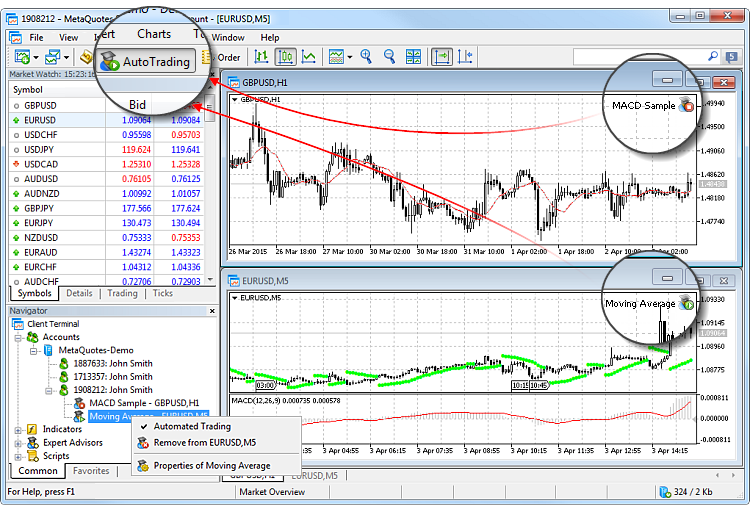

Automated trading permissions can be conveniently managed for individual Expert Advisors from the Navigator window, rather than in their [parameters (#set)](Expert-Advisors-and-Custom-Indicators.md#set). In the Navigator window, the list of all running Expert Advisors is displayed for a connected account. In addition to the Expert Advisor name, a chart on which the EA is running is specified in the list. An icon indicates whether the EA is allowed to trade.

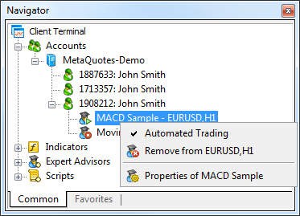

The context menu contains commands for enabling or disabling automated trading for any of the Expert Advisors, as well as for viewing its properties or removing it from the chart.

## Which Platform Settings Affect Automated Trading? (#set-global)

Settings affecting automated trading are available on the [Expert Advisors (#ea)](../Getting-Started/Platform-Settings.md#ea) tab of the platform options.

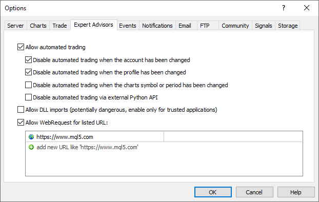

The following settings are available:

  * Allow Auto Trading — this option allows or prohibits trading using [Expert Advisors (#type)](How-to-Create-an-Expert-Advisor-or-an-Indicator.md#type) and [scripts (#type)](How-to-Create-an-Expert-Advisor-or-an-Indicator.md#type). If it is disabled, scripts and Expert Advisors can work, but are not able to trade. This limitation can be useful for testing the analytical capabilities of an Expert Advisor in the real-time mode (not to be confused with testing on history data).  
The option enables/disables automated trading for the entire platform. If you disable it, no Expert Advisor will be allowed to trade, even if you enable automated trading individually in the [Expert Advisor settings (#run)](Expert-Advisors-and-Custom-Indicators.md#run). If you enable it, the Expert Advisors will be allowed to trade, unless automated trading is individually disabled in the Expert Advisor parameters.

  * Disable automated trading when switching accounts — this option represents a protective mechanism disabling trading by Expert Advisors and scripts when the account is changed. It is useful, for example, when switching from a demo account to a real one.
  * Disable automated trading when switching profiles — a large amount of information about the current settings of all charts in the workspace is stored in [profiles (#profiles)](../Price-Charts-Technical-and-Fundamental-Analysis/Additional-Features/Templates-and-Profiles.md#profiles). Particularly, profiles contain information about Expert Advisors attached. [Expert Advisors (#type)](How-to-Create-an-Expert-Advisor-or-an-Indicator.md#type) included into the profile will start working with the arrival of a new tick. Enable this option to prevent trading by Expert Advisors when changing the profile.
  * Disable automated trading when switching chart symbols or period — if this option is enabled, then when the period or symbol of a chart is changed, the Expert Advisor attached to it is automatically prohibited from trading.

  * Disable automatic trading through the external Python API — [Python scripts (#python)](Expert-Advisors-and-Custom-Indicators.md#python) which use the module for integration with the trading platform, can perform trading operations. However, this possibility is disabled by default for security reasons. You should explicitly enable auto trading by ticking off this option.
  * Allow DLL imports (potentially dangerous, enable only for trusted applications) — to extend functionality, [mql5 applications](How-to-Create-an-Expert-Advisor-or-an-Indicator.md) can use DLLs. This option allows determining a default value for the "Allow DLL imports" parameter used during [start of applications (#run)](Expert-Advisors-and-Custom-Indicators.md#run). It is recommended to disable import when working with unknown Expert Advisors.
  * Allow WebRequest for listed URL — the WebRequest() function in MQL5 is used for receiving and sending information to websites using GET and POST requests. To allow an MQL5 application to send such requests, enable this option and manually explicitly specify the URLs of trusted websites. For security reasons, the option is disabled by default.  
To delete an address from the trusted list, select it and press "Delete".

## Quick Access to Frequently Used Programs (#favorites)

For quick access to frequently used programs, use "Favorites" and hotkeys.

Select a trading robot, an indicator or a script and add it to your Favorites using the context menu. All of your favorite programs are displayed on a separate tab of the Navigator and can be easily accessed.

For a quick start on a chart, any program can be assigned a key shortcut. This can be done through the context menu of the Navigator window.

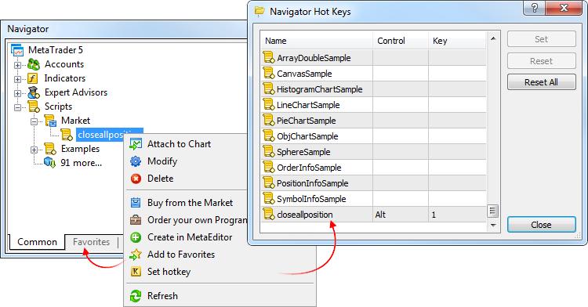

In the above example, keys "Alt+1" are set for a script. Once they are pressed, the script is instantly launched on the current open chart.

## Services (#service)

The trading platform features a special type of programs called Services. Such apps enable the use of custom price feeds for the terminal and to implement price delivery from external systems in real time, just like it is implemented on brokers' trade servers. Services can also be used to perform other service tasks in the background.

Unlike Expert Advisors, indicators and scripts, services are not linked to a specific chart. Such applications run in the background and are launched automatically when the terminal is started (if they were previously launched).

Use the Navigator to manage services:

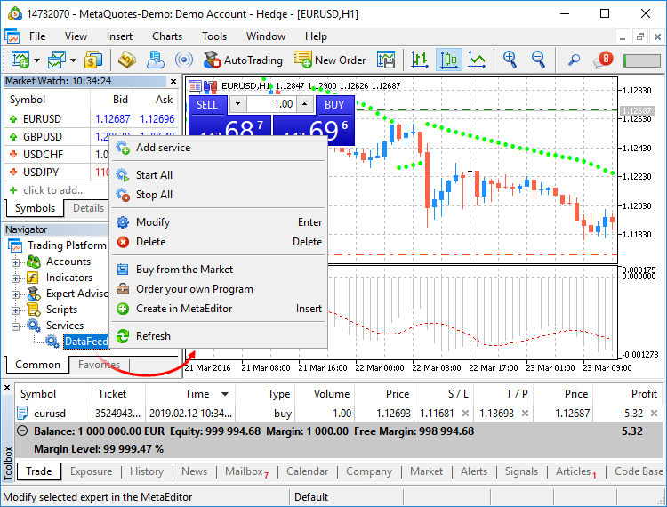

To run multiple copies of an Expert Advisor or indicator with different parameters, you should launch them on different charts. In this case different program instances are created, which then operate independently. Services are not linked to charts, therefore a special mechanism has been implemented for the creation of service instances. Select a service from the Navigator and click "Add service" in its context menu. This will open a standard MQL5 program dialog, in which you can enable/disable trading and access to signal settings, as well as set various parameters.

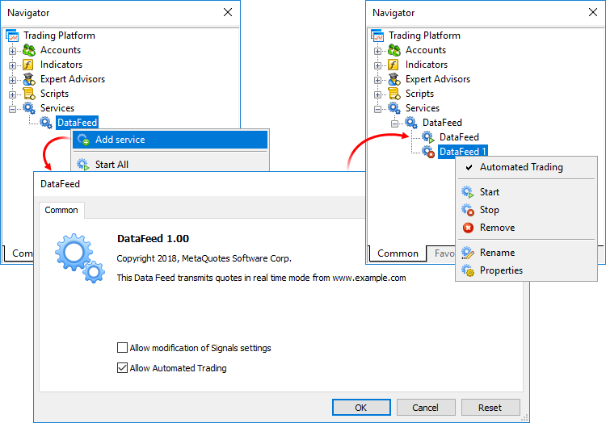

A service instance can be launched and stopped using the appropriate instance menu. To manage all instances, use the service menu.

## Python scripts (#python)

The are a lot of machine learning, process automation, as well as data analysis and visualization libraries for the Python language. The advanced language possibilities can now be applied in the platform through the [Python integration module](https://www.mql5.com/en/docs/python_metatrader5).

  * Exchange data can be easily and quickly obtained from the trading platform and then analyzed using Python tools: hundreds of thousands of financial symbol ticks can be requested with one command
  * Obtain account trading state and trading history for calculating statistics
  * Perform trading operations following your own algorithm

Python scripts can be launched directly on platform charts, similarly to regular MQL5 programs. These scripts are marked with special icons in the Navigator.

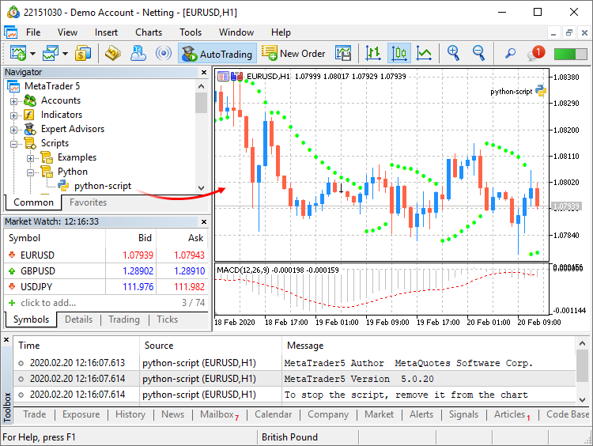

Script messages are displayed under the "Toolbox \ Experts" section.

Python scripts can be launched on the same chart in parallel with other MQL5 scripts and Expert Advisors. To stop a script with a looped execution, remove it from the chart.

To enable additional account protection when using third-party Python libraries, you may use the "Disable automated trading via external Python API" option in terminal settings.

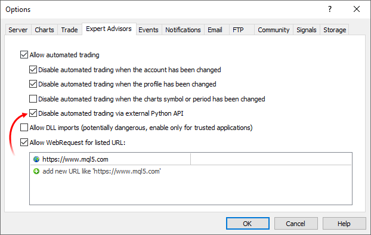

Python scripts can only perform trading operations when this option is disabled.
