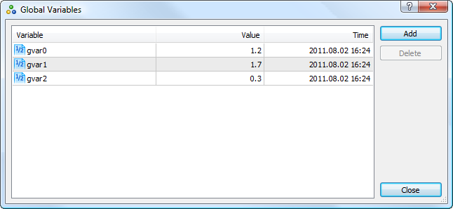

[🏠 Document Start](../README.md) / [Algorithmic Trading, Trading Robots](README.md) / Global Variables

[Previous](MetaTester-and-Remote-Agents.md) | [Next](../Trading-Signals-and-Copy-Trading/README.md)

# Global Variables

Global variables are used for quick transfer of small amounts of data between [Expert Advisors](Expert-Advisors-and-Custom-Indicators.md), as well as for providing conflict-free simultaneous operation of several Expert Advisors in the platform. Features of global variables:

  * they exist independently from Expert Advisors as distinct from variables declared (including those declared on the global level) in their source texts;
  * they are saved between platform starts;
  * any floating point number can serve as a global variable;
  * they are available within four weeks since their last call from Expert Advisor or modification.

To manage platform global variables click on " Global Variables" in the [Tools](../Getting-Started/User-Interface.md) menu or press F3. 

This tab contains the following information:

  * Variable — the name of the global variable;
  * Value — the value of the global variable. Any floating point number can be used as a global variable value;
  * Time — date and time of the last modification or call of the global variable.

To add a new variable, click Add in the right pane. A new row is added to the table, where you can specify the name of the variable and its value. To edit created global variables, double click on the appropriate cell. The time of the last call is automatically updated for such a variable. To delete a variable, select it and click "Delete".
