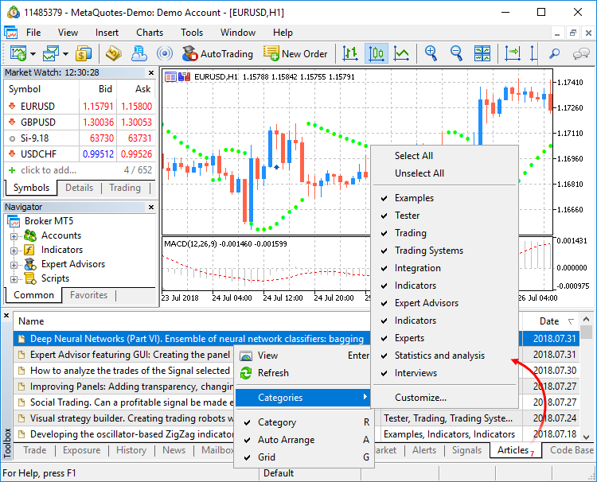
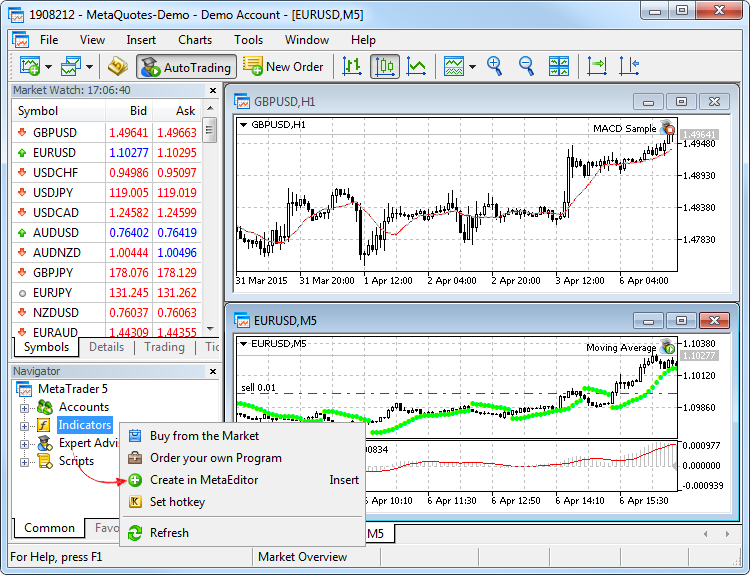
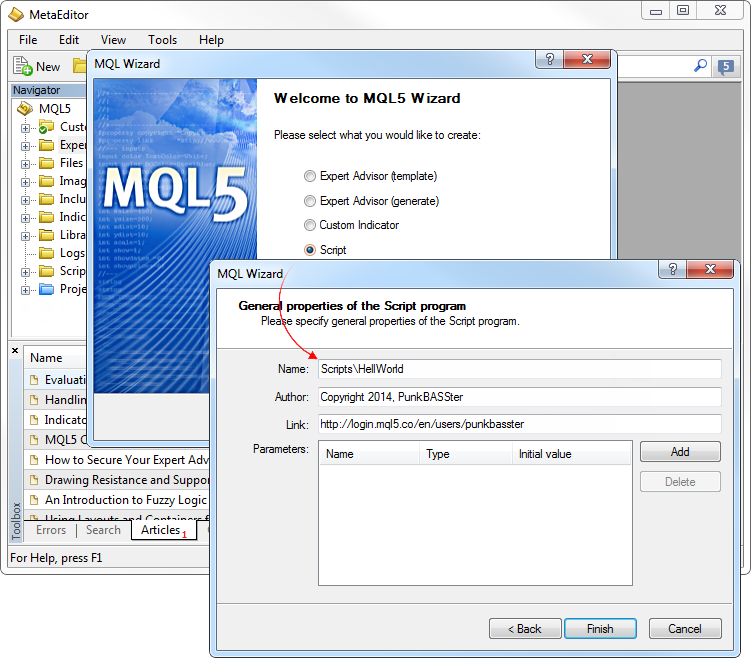
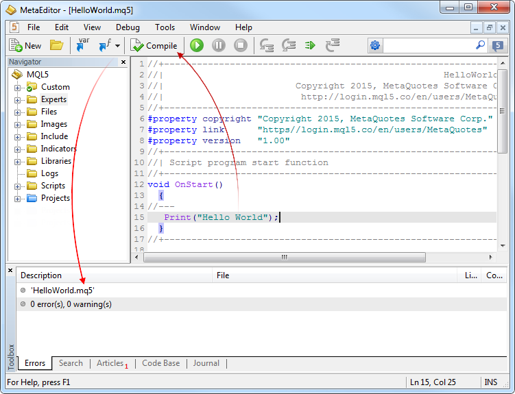
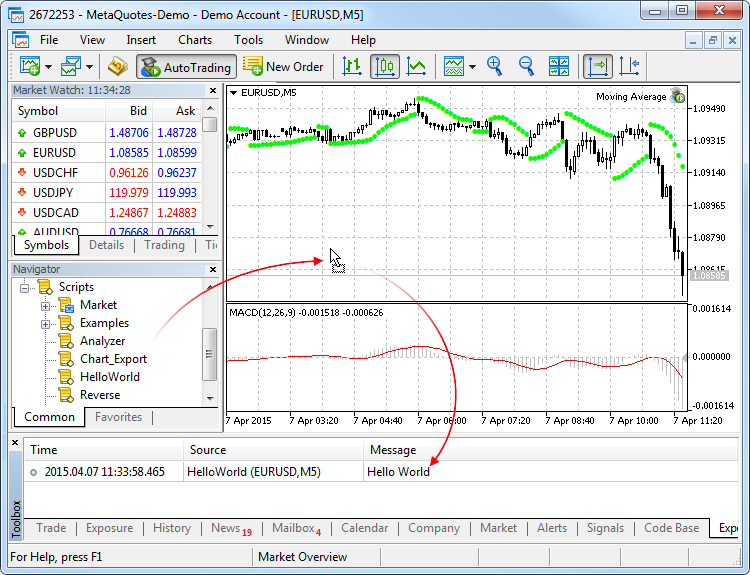

[🏠 Document Start](../README.md) / [Algorithmic Trading, Trading Robots](README.md) / How to Create an Expert Advisor or an Indicator

[Previous](Where-to-Find-Trading-Robots-and-Indicators.md) | [Next](Strategy-Testing.md)

# How to Create an Expert Advisor or an Indicator (#how-to-create-an-expert-advisor-or-an-indicator)

The trading platform contains a built in programming language MetaQuotes Language 5 ([MQL5 (#mql5)](How-to-Create-an-Expert-Advisor-or-an-Indicator.md#mql5)), the [MetaEditor (#metaeditor)](How-to-Create-an-Expert-Advisor-or-an-Indicator.md#metaeditor) development environment and strategy testing tools. 

> Any information about the development of trading strategies in MQL5 can be found on the official [MQL5.community](https://www.mql5.com "MQL5.Community") site. The website section [Code Base](https://www.mql5.com/en/code "Code Base") contains examples of ready-to-use applications.

## The MQL5 Programming Language of Trading Strategies (#mql5)

The trading platform has its own built-in language for programming trading strategies [MetaQuotes Language 5](https://www.mql5.com/ "MQL5"). It is the fifth generation of MQL languages. It allows developing [Expert Advisors (#type)](How-to-Create-an-Expert-Advisor-or-an-Indicator.md#type) to automate trading processes, as well as implementing your own trading strategies. MQL5 also allows creating [custom indicators (#type)](How-to-Create-an-Expert-Advisor-or-an-Indicator.md#type), [scripts (#type)](How-to-Create-an-Expert-Advisor-or-an-Indicator.md#type) and function libraries.

MQL5 Features:

  * The language is object-oriented;
  * MQL5 syntax is similar to that of C++;
  * It contains a large number of functions necessary for analyzing quotes, managing positions, calling technical indicators, etc.;
  * It is a high-performance language;
  * High protection against decompilation: new complex encryption algorithms, file integrity checking, and the complexity of the language;
  * [OpenCL](https://www.mql5.com/en/articles/405 "OpenCL: The Bridge to Parallel Worlds article") support to enable use of video cards for calculations in MQL5 applications;
  * Integrated software development environment [MetaEditor (#metaeditor)](How-to-Create-an-Expert-Advisor-or-an-Indicator.md#metaeditor) including a debugger.

A detailed description of all language constructions and functions is provided in the MQL5 Reference. All the necessary information about MQL5 can also be found on the developer community website at <https://www.mql5.com>.

## MetaEditor (#metaeditor)

MetaEditor is an integrated [MQL5](https://www.mql5.com) development environment. It is a component of the trading platform. MetaEditor allows you to create, edit, compile and debug source code written in [MQL5 (#mql5)](How-to-Create-an-Expert-Advisor-or-an-Indicator.md#mql5).

  * MQL5 Wizard for creating templates and trading robots  
MetaEditor includes the MQL5 Wizard that helps to quickly create MQL5 programs. With the MQL5 Wizard a trader without programming skills can easily create Expert Advisors. You only need to select trading signals for an Expert Advisor, as well as money management and trailing stop algorithms. The Expert Advisor code is generated automatically based on selected parameters.  
In addition, the MQL5 Wizard allows creating MQL5 program templates to simplify the work of a programmer.
  * Helps with the source code  
MetaEditor can recognize language structures: suggests tips on how to use functions and highlights various elements of the program source code. Thus, the editor enhances navigation in the source code of trading programs and speeds up the development process.
  * Debugging  
MetaEditor allows you to debug programs to greatly facilitate troubleshooting. A step-by-step execution of a source code enables monitoring of the variable values.
  * Profiling for code optimization  
The editor also provides tools for software profiling. You can identify the slowest functions in the source code and optimize your program.
  * Articles about programming and a source code library  
Straight from the editor, you can find a plethora of MQL5 programming tutorials. You can additionally access a huge code base of free automated trading programs.
  * Online MQL5 Storage with versioning support  
The storage provides safe storage of files and the possibility to restore lost files, as well as access your code from any computer using a MQL5.community account.

More details about MetaEditor can be found in its built-in help files. The description of MQL5 can be found in the built-in reference and the official [MQL5.community](https://www.mql5.com "MQL5.community") website.

## Algo Trading Books (#algobook)

To assist beginners, we have released two comprehensive books on MQL5 programming, designed for anyone who wish to master the creation of trading robots and applications for algorithmic trading. The books offer a systematic and structured presentation of the material to make the learning process easier. Detailed code examples, which explain the step-by-step creation of trading robots and applications, allow for a deeper understanding of algorithmic trading nuances.

"[MQL5 Programming for Traders](https://www.mql5.com/en/book "MQL5 Programming for Traders")" is the most complete and detailed tutorial on MQL5, suitable for programmers of all levels. Beginners will learn the basics: the book introduces development tools and basic programming concepts. Based on this material, you will create, compile and run your first application in the MetaTrader 5 trading platform. Users with experience in other programming languages can directly proceed to the applied sections: creating trading robots and analytical applications in MQL5.

"[Neural Networks in Algorithmic Trading with MQL5](https://www.mql5.com/en/neurobook "Book on Neural Networks, MQL5, OpenCL and Python")" is a guide to using machine learning methods in trading robots for the MetaTrader 5 platform. You will be progressively introduced to the fundamentals of neural networks and their application in algorithmic trading. As you advance, you will build and train your own AI solution, gradually adding new features. In addition to learning MQL5, you will gain Python and OpenCL programming skills and explore integrated matrix and vector methods, which enable the solution of complex mathematical problems with concise and efficient code.

## Articles on the development of trading applications (#articles)

[MQL5.community](https://www.mql5.com "MQL5.community") website features an extensive library [of articles on MQL4/MQL5 programming](https://www.mql5.com/en/articles). Articles are an excellent guide for creating applications, since they cover a lot of practical tasks involving algorithmic trading. New articles are published every week.

List of all available articles is displayed directly in MetaEditor. To find the necessary material, use the [online search (#search)](../Getting-Started/User-Interface.md#search).

## Types of MQL5 Applications (#type)

Three major types of trading applications are available.

### Expert Advisors (#expert-advisors)

Expert Advisors are mechanical trading systems that allow complete automation of analytical and trading activities for the efficient operation in the financial markets. They allow to perform prompt technical analysis of price data and control trading activities on the basis of signals received. They also help to strictly follow a trading strategy eliminating emotions.

All Expert Advisors are stored in the [/MQL5/Experts (#ea)](../Getting-Started/For-Advanced-Users/Files-and-Folders.md#ea) folder of the trading platform.

### Custom Indicators (#custom-indicators)

Custom Indicators are custom developed technical indicators intended for analyzing price dynamics. Trading tactics and Expert Advisors are developed based on algorithms of indicators. Custom indicators are only used for analyzing symbol price dynamics. Indicators cannot trade and do not have access to charts.

All indicators are stored in the [/MQL5/Indicators (#indicators)](../Getting-Started/For-Advanced-Users/Files-and-Folders.md#indicators) folder of the trading platform. 

### Scripts (#scripts)

A script is an application written in [MQL5 (#mql5)](How-to-Create-an-Expert-Advisor-or-an-Indicator.md#mql5) designed for a single execution of an action. A script can perform both analytical and trading functions. Unlike [Advisors (#type)](How-to-Create-an-Expert-Advisor-or-an-Indicator.md#type), scripts are executed on request. In other words, if an Expert Advisor works almost continuously, a script executes its function and quits.

All scripts are stored in the [/MQL5/Scripts (#scripts)](../Getting-Started/For-Advanced-Users/Files-and-Folders.md#scripts) folder of the trading platform.

### Services (#services)

[Services (#service)](Expert-Advisors-and-Custom-Indicators.md#service) enable the use of custom price feeds for the platform and to implement price delivery from external systems in real time, just like it is implemented on brokers' trade servers. Services can also be used to perform other service tasks in the background.

Unlike Expert Advisors, indicators and scripts, services are not linked to a specific chart. Such applications run in the background and are launched automatically when the terminal is started (unless such an app was forcibly stopped).

All services are stored under the [/MQL5/Services (#scripts)](../Getting-Started/For-Advanced-Users/Files-and-Folders.md#scripts) folder of the trading platform.

Inside folders Experts, Indicators, Scripts and Services, applications can be sorted into subfolders. The structure of their location is displayed in the [Navigator](../Getting-Started/User-Interface.md) window.  
---  
  

## How to Create and Run a Trading Application (#create)

Click " Create in MetaEditor" in the context menu of the [Navigator](../Getting-Started/User-Interface.md) window in section Expert Advisors, Indicators or Scripts. MetaEditor can also be launched by pressing F4.

This launches [MetaEditor (#metaeditor)](How-to-Create-an-Expert-Advisor-or-an-Indicator.md#metaeditor) with an automatically opened MQL5 Wizard. Use it to generate the necessary program template to quickly start software development. Let's create a simple script writing a message "Hello world" into the [journal](../Getting-Started/For-Advanced-Users/Platform-Logs.md).

In the resulting template, we add the code Print("Hello World"); and compile it by pressing F7 to receive an executable file. The executable file has an extension EX5 and can be run in the trading platform.

Compilation results are added to the editor log.

In accordance with the application type, the source code is saved to the folder MQL5\Scripts\\. The executable file is created in the same folder. You can now return to the trading platform and run the generated script.

> Specifics of use of automated trading programs are described in section ["Expert Advisors and custom indicators"](Expert-Advisors-and-Custom-Indicators.md).

## How to Edit a Trading Application (#modify)

To edit a trading robot or a custom indicator, click " Modify" in its context menu in the [Navigator](../Getting-Started/User-Interface.md) window or select it and press Enter. This opens [MetaEditor (#metaeditor)](How-to-Create-an-Expert-Advisor-or-an-Indicator.md#metaeditor) with the source code of the selected indicator. After you have modified the indicator, re-compile it (F7). Otherwise its previous unchanged version will be used in the platform.

## How to Shut Down a Trading Application (#quit)

There are many ways to shut down a trading application in the platform.

Trading robot | Custom technical indicator | Script  
  
  * Click "Remove" in the [Expert List (#ea)](../Price-Charts-Technical-and-Fundamental-Analysis/Additional-Features/Lists-of-Objects-Applied.md#ea) window;
  * Change the chart [template](../Price-Charts-Technical-and-Fundamental-Analysis/Additional-Features/Templates-and-Profiles.md);
  * Change the [profile (#profiles)](../Price-Charts-Technical-and-Fundamental-Analysis/Additional-Features/Templates-and-Profiles.md#profiles), provided that the [appropriate option is enabled in the platform settings (#profile)](../Getting-Started/Platform-Settings.md#profile);
  * Turn off the trading platform;
  * Close the chart the Expert Advisor is running on;
  * Run another Expert Advisor on the same chart;
  * Click " Remove" in the context menu of the Expert Advisor icon on the chart.

| 

  * Click " Delete" or " Delete Indicator Window" in the context menu of the indicator;
  * Click "Delete" in the [Indicator List (#indicators)](../Price-Charts-Technical-and-Fundamental-Analysis/Additional-Features/Lists-of-Objects-Applied.md#indicators) window;
  * Change the chart [template](../Price-Charts-Technical-and-Fundamental-Analysis/Additional-Features/Templates-and-Profiles.md);
  * Re-open the chart.

| 

  * Click "Remove" in the [Expert List (#ea)](../Price-Charts-Technical-and-Fundamental-Analysis/Additional-Features/Lists-of-Objects-Applied.md#ea) window. This window also contains a list of running scripts;
  * Change the chart [template](../Price-Charts-Technical-and-Fundamental-Analysis/Additional-Features/Templates-and-Profiles.md);
  * Change the [profile (#profiles)](../Price-Charts-Technical-and-Fundamental-Analysis/Additional-Features/Templates-and-Profiles.md#profiles), provided that the [appropriate option is enabled in the platform settings (#profile)](../Getting-Started/Platform-Settings.md#profile);
  * Change the [chart](../Price-Charts-Technical-and-Fundamental-Analysis/View-and-Configure-Charts.md) symbol;
  * Change the chart [timeframe (#operations)](../Price-Charts-Technical-and-Fundamental-Analysis/View-and-Configure-Charts.md#operations);
  * Turn off the trading platform;
  * Close the chart the script is running on;
  * Run another script on the same chart;
  * Click " Remove" in the context menu of the script icon on the chart.

  
  
  * If a trading application is running on a chart, it will not be shut down if you delete the appropriate executable file from the [Navigator](../Getting-Started/User-Interface.md) window.

  * Disabling Expert Advisors [in the trading platform settings (#enable-ea)](../Getting-Started/Platform-Settings.md#enable-ea) does not disable them completely. This operation only prohibits Expert Advisors from trading.

  
---  
  

## How to Run a Downloaded File of the MQ5 Source Code (#mq5)

If you only have a source code file (*.MQ5), save it in a folder corresponding to the application type:

  * For Expert Advisors — /MQL5/Experts
  * For indicators — /MQL5/Indicators
  * For scripts —/MQL5/Scripts

To quickly navigate to the trading platform data folder, click " Open data folder" in the [File](../Getting-Started/User-Interface.md) menu.

To run a file in the trading platform, compile it in the [MetaEditor (#metaeditor)](How-to-Create-an-Expert-Advisor-or-an-Indicator.md#metaeditor):

  * Open MetaEditor by pressing F4.
  * In MetaEditor, open the source code file in the Navigator window by a double left-click on the file name.
  * Press F7 to compile it.

This creates an executable *.EX5 file that can be run in the trading platform.

> Source files (*.MQ5) are not displayed in the [Navigator](../Getting-Started/User-Interface.md) window of the trading platform.
