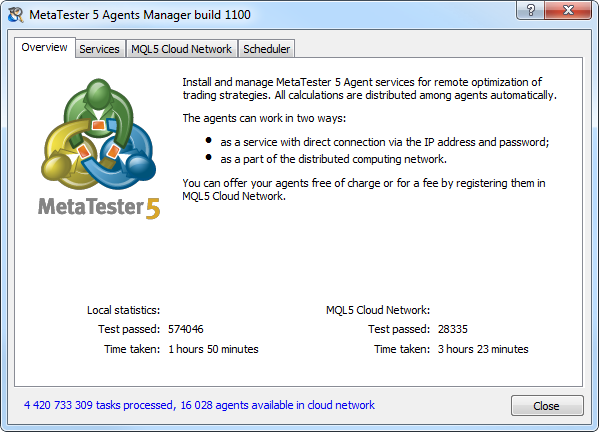
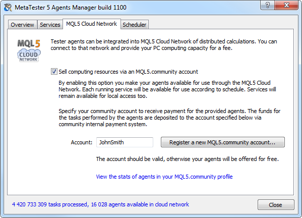

[🏠 Document Start](../README.md) / [Algorithmic Trading, Trading Robots](README.md) / MetaTester and Remote Agents

[Previous](Real-and-Generated-Ticks.md) | [Next](Global-Variables.md)

# MetaTester and Remote Agents (#metatester-and-remote-agents)

Expert Advisors are tested and optimized using the so called agents, which are separate services on a computer for performing calculations. The agents can be local and remote.

Local agents are created automatically on the computer where the trading platform is installed. The number of local agents is equal to the number of logical cores.

A remote agent is a specialized service installed on a computer and used for testing and optimizing Expert Advisors in the strategy tester. The unlimited number of such agents can be connected to a platform. Use of remote agents considerably speeds up optimization of strategies, because each run is performed as a separate process on a separate agent. The process of remote agent connection to a strategy tester is described in a [separate section (#farm)](Strategy-Optimization.md#farm).

  * Remote agents can be connected to the global cloud computing network [MQL5 Cloud Network](../MQL5-Cloud-Network/README.md).
  * Remote agents can only be used in 64-bit systems.

  
---  
  
Remote agents are installed as separate services in the operating system using the special application "metatester.exe" located in the trading platform installation folder.

> To save traffic and disk space, as well as for security reasons:

## Files and Folders (#structure)

To store the service information, MetaTester creates the "Tester" folder in the directory where the application is located. It contains the following folders and files:

Folders and Files | Description | Sub-folders | Description  
---|---|---|---  
Agent-IP-address-port | The folders are created for each agent of the tester. The folder name contains the IP address and port number the agent runs on. | logs | The agent operation logs are stored in this folder.  
bases | History data used by the agent are stored in this folder.  
Manager | This directory contains MetaTester component logs.  
  
> Log files of agents are automatically deleted two days or if their size exceeds 1 gigabyte.

## Working with MetaTester (#setup)

In order to share the calculation powers of your computer with a trading platform over a local network or Internet, install remote agents. Agents can be installed and managed using the special utility MetaTester. It is available in the default standard trading platform package. Run metatester.exe from the platform installation folder.

  * Testing agents can be installed on any computer separately from the trading platform. To do this, copy and run the metatester64.exe file on the required computer. Service files and folders are installed to the directory where the MetaTester application is located. The metatester64.exe file is both the installer and the executable file required for the operation of agents.
  * Agents can only be installed and used in 64-bit systems.

  
---  
  
The window of the MetaTester application consists of several tabs:

  * [Overview (#overview)](MetaTester-and-Remote-Agents.md#overview)
  * [Services (#services)](MetaTester-and-Remote-Agents.md#services)
  * [MQL5 Cloud Network (#cloud-network)](MetaTester-and-Remote-Agents.md#cloud-network)
  * [Scheduler (#scheduler)](MetaTester-and-Remote-Agents.md#scheduler)

### Overview (#overview)

This tab displays helpful information about the use of agents. It also displays statistics on the number of tests performed using the agents and the time spent on them. The statistical data are available for two agent operation modes:

  * Local statistics  
In the local mode, agents are used as service installed in a computer. The specified address and password are used for connecting to them.
  * MQL5 Cloud Network statistics  
In this mode, the agents work within the special [MQL5 Cloud Network (#cloud-network)](MetaTester-and-Remote-Agents.md#cloud-network).

### Services (#services)

On this tab you can manage agents on your computer. To install testing agents specify the following:

  * Agents — number of agents you want to install. It is recommended to install as many agents as there are logical processor cores.
  * Password — password for connection to agents. The password must be specified when you [add agents (#farm)](Strategy-Optimization.md#farm) in the strategy tester.
  * TCP Ports — the range of ports (or one port to install one agent) the agents will work on. The port number must also be specified when connecting to agents from the strategy tester.

To install the agents click Add. Agents are installed at the IP address specified at the top of the tab. Use this address to connect to the agents.

> To install and manage agents, a user needs administrator permissions on the system.

The list of installed agents is displayed at the bottom of the window:

  * Service — the name of the service, under which the agent is running in the operating system. The name is assigned automatically;
  * Port — the number of the port the agent is operating on;
  * Passes — number of testing passes performed by the agent;
  * Traffic In/Out — amount of incoming and outgoing traffic of the agent;
  * Cloud — network connection state. This option allows to ensure that agents can receive tasks from the cloud computing network.
  * State — the currents state of the agent: running or stopped.

### Context menu (#context-menu)

Installed agents can be managed using the context menu commands:

  *  Start — start the selected agent;
  *  Stop — stop the selected agent process. The appropriate service in the system is also stopped, and connecting to the agent is impossible;
  *  Restart — stop and then restart a selected agent;
  *  Refresh — refresh the list of installed agents;
  *  Export — export agent settings to a *.mt5 file. These settings can be [imported (#farm-impexp)](Strategy-Optimization.md#farm-impexp) to the trading platform for connection to installed agents.
  *  Delete — delete the selected agent.

> When you close the MetaTester window, running agents are not stopped. To stop an agent, execute the appropriate command in its context menu.

### MQL5 Cloud Network (#cloud-network)

The MQL5 Cloud Network is a special system designed to integrate remote agents into a single cloud network. Its key advantages are:

  * The possibility to provide your own agents and use third-party computing power for free or on a commercial basis.
  * No need to set up network access for agents — MetaTester and MQL5 Cloud Network automatically organize access and distribute incoming tasks among agents.
  * Convenient control of agents from the [MQL5.community](https://www.mql5.com) user profile.

The tab contains an option for managing use in the distributed computing MQL5 Cloud Network: Sell computing resources via an MQL5.community account.

By enabling this option, a user consents to allow use of his or her remote agents via the MQL5 Cloud Network. Each agent service will be available in the network in accordance with a preset [scale (#scheduler)](MetaTester-and-Remote-Agents.md#scheduler).

When connected to the MQL5 Cloud Network, the agent is still available for normal remote connections using [IP address and password (#services)](MetaTester-and-Remote-Agents.md#services).

To provide the computing power of agents as a paid service, specify your [MQL5.community](https://www.mql5.com) account in the appropriate field. Fees for the use of your agents are transferred to the specified account via the internal MQL5.community payment system.

If you do not have an account, you may create one by clicking "Register a new MQL5.community account..."

  * Be careful when indicating your valid account, otherwise, in case of an error, the agent services will be provided to other users for free.
  * You can monitor the availability of your agents in the network and manage them on the "Agents" tab of your MQL5.community profile.

  
---  
  

### Scheduler (#scheduler)

On this tab you can set a schedule for managing the availability of your remote agents in the [MQL5 Cloud Network (#cloud-network)](MetaTester-and-Remote-Agents.md#cloud-network).

The hours when the agents are available are colored blue, the unavailable hours are light-colored. To switch between working and non-working hours click on the appropriate square. To mark all hours of a certain day, click on the asterisk at the end of a row.

> This schedule does not influence the availability of agents for a normal remote connection using [IP address and password (#services)](MetaTester-and-Remote-Agents.md#services).

## Console Commands (#console)

To work with agents through the command line, use the console commands of the metatester.exe file:

  * /install /address:address:port /password:password — install an agent at the specified IP address and port with the specified password. For example, metatester.exe /install /address:192.168.0.1:1950 /password:gj1sfj;
  * /uninstall /address:address:port — delete the agent installed at the specified IP address and port;
  * /start /address:address:port — start the service of the agent installed at the specified IP address and port;
  * /stop /address:address:port — stop the service of the agent installed at the specified IP address and port;
  * /restart /address:address:port — restart the service of the agent installed at the specified IP address and port;
  * /help — open help of the console commands.

To delete an agent using the command line, you can also execute the following commands:

  * sc stop "agent name" (this action is required if the agent is running);
  * sc delete "agent name"

For example, to delete the already stopped agent "MetaTester-1", you should execute the following command:

sc delete "MetaTester-1".
