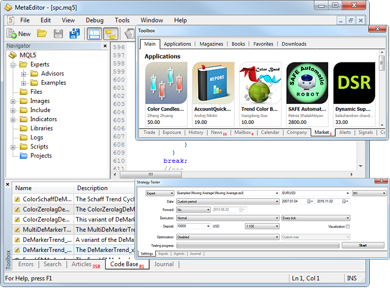

[🏠 Document Start](../README.md) / Algorithmic Trading, Trading Robots

[Previous](../Price-Charts-Technical-and-Fundamental-Analysis/Additional-Features/Templates-and-Profiles.md) | [Next](Expert-Advisors-and-Custom-Indicators.md)

# Algorithmic Trading, Trading Robots

Algorithmic or automated trading is making buy and sell operations in the financial markets using special [trading robots](Expert-Advisors-and-Custom-Indicators.md). In the trading platform, these programs are also called Expert Advisors or EAs.

Trading robots undertake price analysis based on preset algorithms, decision-making and, as a result, execution of trading operations in the market.

Trading robots are widely used in financial trading, and the share of automated operations relative to manual trading is constantly growing. A computer program has a variety of advantages:

  * It never gets tired
  * It is not susceptible to stress
  * It strictly follows a preselected algorithm
  * It rapidly responds to market changes.

### How to Start Creating Trading Robots

We have released two free books on MQL5 programming to help you master the creation of trading robots and applications for algorithmic trading.

These books offer a systematic and structured presentation of the material to make the learning process significantly easier. Detailed code examples, which explain the step-by-step creation of trading robots and applications, allow for a deeper understanding of algorithmic trading nuances. The books include numerous practical exercises to help reinforce the acquired knowledge and develop programming skills in real trading environments.

"[MQL5 Programming for Traders](https://www.mql5.com/en/book "MQL5 Programming Book")" is the most complete and detailed tutorial on MQL5, suitable for programmers of all levels. Beginners will learn the basics: the book introduces development tools and basic programming concepts. Based on this material, you will create, compile and run your first application in the MetaTrader 5 trading platform. Users with experience in other programming languages can directly proceed to the applied sections: creating trading robots and analytical applications in MQL5.

"[Neural Networks in Algorithmic Trading with MQL5](https://www.mql5.com/en/neurobook "Book on Neural Networks with MQL5, OpenCL and Python")" is a guide to using machine learning methods in trading robots for the MetaTrader 5 platform. You will be progressively introduced to the fundamentals of neural networks and their application in algorithmic trading. As you advance, you will build and train your own AI solution, gradually adding new features. In addition to learning MQL5, you will gain Python and OpenCL programming skills and explore integrated matrix and vector methods, which enable the solution of complex mathematical problems with concise and efficient code.

### Explore articles on developing trading strategies

[MQL5 Articles](https://www.mql5.com/en/articles "Articles on algorithmic/automated trading in MetaTrader and MQL4 and MQL5 programming") are an excellent resource for exploring the full potential of the language, covering a wide range of practical algorithmic trading tasks. For easy navigation, all articles are categorized into sections such as [Examples](https://www.mql5.com/en/articles/examples), [Expert Advisors](https://www.mql5.com/en/articles/expert_advisors), [Machine Learning](https://www.mql5.com/en/articles/machine_learning), and more. Every month, dozens of new articles are published on the [MQL5 Algotrading community](https://www.mql5.com/) website, written by traders for other traders. Read and discuss these articles to master modern algorithmic trading. For beginners, we have compiled a list of [16 recommended articles](https://www.metatrader5.com/en/metaeditor/help/articles) for a quick immersion into MQL5.

A special branch of algorithmic trading includes high frequency trading (HFT). As the name implies, trade operations are carried out at a high speed and frequency. The trading platform provides all the necessary tools for that:

  * Fast and efficient trading robots programming language [MQL5 (#mql5)](How-to-Create-an-Expert-Advisor-or-an-Indicator.md#mql5)
  * Orders are sent from the platform and processed on the trade server with a minimum delay
  * Renting a [virtual platform](../Virtual-Hosting-for-247-Operation/README.md) close to a broker to minimize network delays

Read this section to find out everything about the automated trading:

  * [Expert Advisors and Custom Indicators](Expert-Advisors-and-Custom-Indicators.md)
  * [Where to get trading robots and indicators](Where-to-Find-Trading-Robots-and-Indicators.md)
  * [How to create an Expert Advisor or an indicator](How-to-Create-an-Expert-Advisor-or-an-Indicator.md)
  * [Strategy Testing](Strategy-Testing.md)
  * [Strategy Optimization](Strategy-Optimization.md)

