[🏠 Document Start](../README.md) / [Algorithmic Trading, Trading Robots](README.md) / Real and Generated Ticks

[Previous](Optimization-Types.md) | [Next](MetaTester-and-Remote-Agents.md)

# Real and Generated Ticks (#real-and-generated-ticks)

Ticks are required for testing and optimizing Expert Advisors, because they use tick data for operation. Testing can be performed on real ticks provided by a broker or on ticks generated by the strategy and based on minute data.

## Real Ticks (#real)

Testing and optimization on real ticks are as close to real conditions as possible. Instead of [generated (#generate)](Real-and-Generated-Ticks.md#generate) ticks based on minute data, it is possible to use real ticks accumulated by a broker. These are ticks from exchanges and liquidity providers.

When testing on real ticks, a spread may change within a minute bar, whereas when generating ticks within a minute, a spread fixed in the appropriate bar is used.

If the Market Depth is displayed for a symbol, the bars are built strictly according to the last executed trade price (Last). OnTick event is triggered on all ticks regardless of whether the Last price is present or not.

Please note that trading operations are always performed by Bid and Ask prices even if the chart is built by Last prices. For example, if an Expert Advisor working on bar open prices receives a signal at Last price, it performs a trade at another price (Bid or Ask depending on the direction). If "Every tick" mode is used, the bars are built by Bid prices, while trades are performed by Bid and Ask ones. The Ask price is calculated as Bid + fixed spread of a corresponding minute bar.

If a symbol history has a minute bar with no tick data for it, the tester generates ticks in the ["Every tick" (#tick-mode)](Real-and-Generated-Ticks.md#tick-mode) mode. This allows testing the EA on a certain period in case a broker's tick data is insufficient. If a symbol history has no minute bar but the appropriate tick data for the minute is present, these ticks are ignored. The minute data is considered more reliable.

Tick data has greater size compared to minute one. Downloading it may take quite a long time during the first test. Downloaded tick data is stored by months in TKC files in \bases\\[trade server name]\ticks\\[symbol name]\\.

## Generation of Ticks (#generate)

The strategy tester generates tick data based on cached one-minute records in the integer format. It means, the tester copies the required history data from the platform and converts them to the integer format to speed up calculations.

> The strategy tester provides several [tick generation modes (#tick-mode)](Real-and-Generated-Ticks.md#tick-mode). The most accurate "Every tick" mode is described below.

The tick generation procedure is different for bars with different tick volumes:

### Tick Volume = 1 (#tick-volume-1)

Ticks are not generated for bars with the tick volume equal to one, a tick with the value of bar's Close price is written for them:

### Tick Volume = 2 (#tick-volume-2)

Also ticks are not generated for bars with two ticks. First a tick with the Open price and then the tick with the Close price are written:

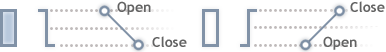

### Tick Volume >= 3 (#tick-volume-3)

For bars with 3 or more ticks, there are different schemes of tick generation depending on their number.

## Bar Progress Scheme (#bar-progress-scheme)

Four different schemes are possible for bars with three or more ticks:

Progress option | Image  
---|---  
The price moves in one direction and returns to the open price level. Thus a bar has only High (the highest price) and Low (the lowest price). | 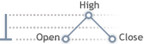 | 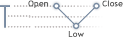  
The price moves in one direction and returns, breaking through the open level. In this case the bar also has only High (the highest price) or only Low (the lowest price), but the Open and Close prices are not equal. | 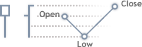 | 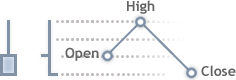  
The price moves in one direction, but does not reach the Open price while returning back. | 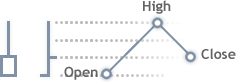 | 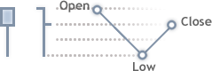  
The price moves several points in one direction only. In this case the bar does not have High or Low. | 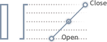 | 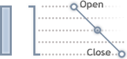  
  

## Tick Generation for Bars with Three or More Ticks (#tick-generation-for-bars-with-three-or-more-ticks)

Ticks are generated based on reference points. The number of such points cannot exceed the tick volume, and cannot be larger than 11 (the point of the Open price is not taken into account).

Reference points are divided into three parts: those for forming the opening shadow, the candlestick's range (between its High and Low) and the closing shadow.

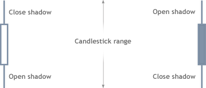

Depending on the number of ticks, the following variants of distribution of reference points are possible:

Number of reference points | Opening shadow | Candlestick range | Closing shadow  
---|---|---|---  
11 | 3 | 5 | 3  
10 | 2 | 6 | 2  
9 | 2 | 5 | 2  
8 | 2 | 4 | 2  
7 | 2 | 3 | 2  
6 | 1 | 4 | 1  
5 | 1 | 3 | 1  
4 | 1 | 2 | 1  
3 | 1 | 1 | 1  
  
  * If a candlestick does not have any of the shadows, the shadow points are included into the range of the candlestick.
  * The candlestick range is generated by an odd number of reference points. If the range has an even number of points, the excessive one is included into one of its shadows provided that the shadow already has 2 points. Otherwise the excessive point is omitted.

  
---  
  

### The Ideal Distribution (3-5-3) (#the-ideal-distribution-3-5-3)

Reference points are calculated as the number of points from the open price. The ideal distribution of points (3-5-3) is calculated as follows:

Bull Candlestick

Calculation of Points | Image  
---|---  
  
  * Open
  * 3/4*(O - L)
  * 1/2*(O - L)
  * Low
  * (H - L)/3
  * (H - L)*3 - 1
  * 2/3*(H - L)
  * 2/3*(H - L) - 1
  * High
  * 3/4*(H - C)
  * 1/2*(H - C)
  * Close

| 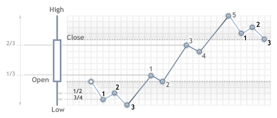  
  
Bear Candlestick

Calculation of Points | Image  
---|---  
  
  * Open
  * 3/4*(O - H)
  * 1/2*(O - H)
  * High
  * (L - H)/3
  * (L - H)/3 + 1
  * 2/3*(L - H)
  * 2/3(L - H) + 1
  * Low
  * 3/4*(L - C)
  * 1/2*(L - C)
  * Close

| 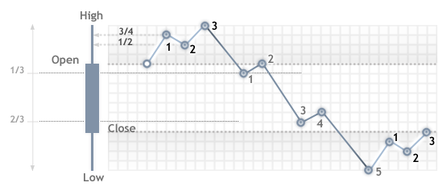  
  

### Doji Candlesticks (#doji-candlesticks)

If a candlestick is doji (Close = Open), previous candlesticks are analyzed. If the previous candlestick was rising, this one is considered falling, and vice versa.

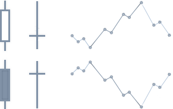

### Plotting a Shadow of Three Points (#plotting-a-shadow-of-three-points)

If a shadow is generate using three reference points, and integer values of 3/4 and 1/2 of the shadow size are equal (this happens when the difference between the Open and Low or Open and High is not more than 2 points, i.e. distances of price steps forward and backward are equal), then the shadow is generated as follows:

Bull Candlestick

Calculation of Points | Image  
---|---  
  
  * Open
  * Open - 1
  * Open
  * Low

| 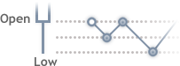  
  
Bear Candlestick

Calculation of Points | Image  
---|---  
  
  * Open
  * Open + 1
  * Open
  * High

| 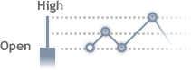  
  
> A closing shadow is generated the same way.

### Plotting a Shadow of Two Points (#plotting-a-shadow-of-two-points)

If a shadow is generated based on two points, the generation is performed as follows:

Bull Candlestick

Calculation of Points | Image  
---|---  
  
  * Open
  * Open + 1
  * Low

| 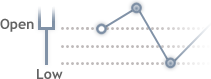  
  
Bear Candlestick

Calculation of Points | Image  
---|---  
  
  * Open
  * Open - 1
  * High

| 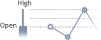  
  
> A closing shadow is generated the same way.

### Plotting a Candlestick Range (#plotting-a-candlestick-range)

The candlestick range is generated by waves in cycles. If Prev = Low (previous price is the Low price), the following cycle is used:

  * N1 = Prev + Step
  * N2 = Prev + Step - 1
  * Prev = N2

If Prev = High (previous price is the High price), the following cycle is used:

  * N1 = Prev - Step
  * N2 = Prev - Step + 1
  * Prev = N2

Where:

N1 and N2 are reference points in one cycle;  
Prev is the previous price;  
Step is the step size. The step is calculated as follows: (H - L - 1)/(Number of cycles) + 1;  
Number of cycles is calculated as (Number of reference points in a range + 1)/2.

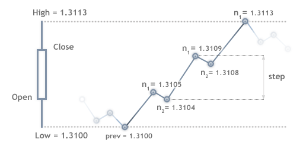

### Intermediate Ticks (#intermediate-ticks)

Intermediate ticks between reference points are generated according to the following rules:

  * If the number of ticks is larger than the number of pips between the reference points, a "saw" is generated (initial value +/- 1).
  * If the number of pips between reference points is large enough, a linear sequence of ticks is generated.

## Tick Generation Modes (#tick-mode)

Tick generation modes can be selected in the [strategy tester settings (#settings)](Strategy-Testing.md#settings) window. The following options are available:

### Every Tick (#every-tick)

In this mode, all ticks are generated — OHLC and intermediate ticks. The procedure of such generation of ticks is described above.

### 1 Minute OHLC (#1-minute-ohlc)

In this mode only OHLC ticks of 1 minute bars are generated. If the tick volume of a candlestick is greater than 4, then only four prices (Open, High, Low and Close) are generated. If the tick volume is less than 4, then the above rules of candlestick formation are applied.

> Selecting this mode does not mean that testing or optimization will be performed on the M1 timeframe. For example, if you [select the H1 timeframe (#settings)](Strategy-Testing.md#settings) in the "OHLC of 1" mode, prices will be generated on each 1-minute bar for the Open, High, Low and Close values. In this case, the OnTick() event of the Expert Advisor is executed four times a minute — at opening, closing, high and low of a one-minute bar, although testing is performed on H1.

In fact, OHLC prices exist in history data. Thus, only the time of arrival of Open, High, Low and Close ticks is generated during testing, while the price values are taken from the history.

### Open Prices Only (#open-prices-only)

In this mode, OHLC prices of bars of the timeframe selected for testing are generated. The Expert Advisor function OnTick() is executed only at the beginning of the bar (at the Open price). Due to this feature, Stop Levels and pending orders may trigger at a price different from the specified one (especially when testing at higher timeframes). But this allows you to quickly run an evaluation test of an Expert Advisor.

> The exceptions are periods W1 and MN1, for which bars are generated once a day instead of once a week or a month respectively.

There are some limitations on the "Open Prices Only" mode:

  * [The Random Delay trading mode (#settings)](Strategy-Testing.md#settings) cannot be used;
  * The tested Expert Advisor cannot access data of a [timeframe (#settings)](Strategy-Testing.md#settings) below the testing/optimization timeframe. For example, if your run testing/optimization on the H1 period, you can access data of H2, H3, H4 etc., but not M30, M20, M10 etc. In addition, the higher timeframes that are accessed must be multiple of the testing timeframe. For example, if you run testing on M20, you cannot access data of M30, but it is possible to access H1. These limitations are connected with the impossibility to obtain data of lower or non-multiple timeframes out of the bars generated during testing/optimization.
  * Limitations on accessing data of other timeframes also apply to other symbols whose data are used by the Expert Advisor. In this case the limitation for each symbol depends on the first timeframe accessed during testing/optimization. Suppose, during testing on EURUSD H1, an Expert Advisor accesses data of GBPUSD M20. In this case the Expert Advisor will be able to further use data of EURUSD H1, H2, etc., as well as GBPUSD M20, H1, H2 etc.

> The mode of every tick generation is the most accurate, but the slowest one. For quick, but rough testing/optimization, use the "Open prices only" mode.

### Mathematical Calculations (#math)

This mode allows you to use the Strategy Tester for mathematical computations. It does not require and therefore does not load historical data and information about symbols, and it does not generate ticks. In the tested Expert Advisors, only OnInit(), OnTester() and OnDeinit() are called sequentially.

In this mode, the Custom [optimization criterion (#criterion)](Optimization-Types.md#criterion) is used. All fields in the [tester settings (#settings)](Strategy-Testing.md#settings) become inactive, except for the optimization mode and Expert Advisor selection.

Mathematical computations are useful for calculating an extremum of a mathematical function, whose value should be returned from OnTester(). Optimization is aimed at finding the highest value of the function. With a large number of combinations of input parameters of a mathematical function, it is recommended to use the "Genetic algorithm". This allows to significantly accelerate the search.
