[🏠 Document Start](../README.md) / [Algorithmic Trading, Trading Robots](README.md) / Strategy Testing

[Previous](How-to-Create-an-Expert-Advisor-or-an-Indicator.md) | [Next](Strategy-Optimization.md)

# Strategy Testing (#strategy-testing)

The Strategy Tester allows you to test and optimize trading strategies ([Expert Advisors (#type)](How-to-Create-an-Expert-Advisor-or-an-Indicator.md#type)) before using them for live trading. During testing, an Expert Advisor with initial parameters is once run on history data. During optimization, a trading strategy is run several times with different sets of parameters which allows selecting the most appropriate combination thereof.

The Strategy Tester is a multi-currency tool, which allows you to test and optimize strategies trading multiple financial instruments. The tester automatically processes information of all symbols that are used in the trading strategy, so you do not need to manually specify the list of symbols for testing/optimization.

The Strategy Tester is multi-threaded, thus allowing to use all available computer resources. Testing and optimization are carried out using special computing [agents (#agents)](Strategy-Optimization.md#agents) that are installed as services on the user's computer. Agents work independently and allow parallel processing of optimization passes.

An unlimited number of [remote (#farm)](Strategy-Optimization.md#farm) agents can be connected to the Strategy Tester. In addition, the Strategy Tester can access the [MQL5 Cloud Network](../MQL5-Cloud-Network/README.md). It brings together thousands of agents around the world, and this computational power is available to any user of the trading platform.

In addition to Expert Advisor testing and optimization, you can use the Strategy Tester to test the operation of custom indicators in the [visual mode](Testing-Visualization.md). This feature allows to easily test the operation of demo versions of indicators downloaded from the [Market](../Market-App-Store/README.md).

## How to Test (#test)

Testing of an [Expert Advisor (#type)](How-to-Create-an-Expert-Advisor-or-an-Indicator.md#type) is its single run with fixed parameters using historical price data. It allows you to test how the strategy works before you use it on a real market.

 | Watch the video: How to test Expert Advisors and Indicators before purchase Watch the video to learn how to test a trading robot before you purchase it from the Market. Every product on the Market is provided with a free demo version, which can be tested in the Strategy Tester. Please watch the video for further details.  
---|---  
  

### Quick Selection of Testing Tasks (#start-page)

After tester launch, instead of multiple settings the user sees a list of standard tasks, by selecting which they can quickly start testing. This will be especially useful for users without previous experience.

Some of the major strategy testing and optimization tasks are presented in the start page. In addition, one of the previously performed tasks can be restarted from this page. If you have run a lot of tasks and they do not fit into the start page, use the search bar. You can find a test by any parameter: program name, symbol, timeframe, modeling mode, etc.

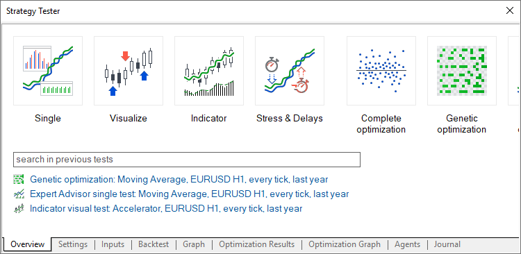

After selecting a task, the user proceeds to further testing parameters setup: selection of an Expert Advisor, symbol, testing period, etc. All irrelevant parameters which are not required for the selected tasks are hidden from the setup page. For example, if mathematical calculations are selected, only two parameters should be specified: selection of a program to be tested and the optimization mode. Testing period, delay and tick generation settings will be hidden.

All available testing options will be explained below.

### How to Select a Trading Robot for Testing (#ea)

Click " Test" in the context menu of an Expert Advisor in the [Navigator](../Getting-Started/User-Interface.md) window. 

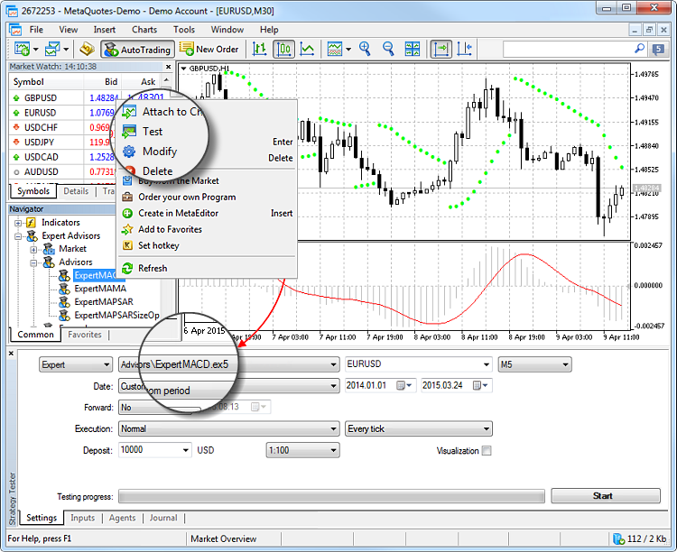

After that the Expert Advisor is selected in the Strategy Tester.

### Enable Required Symbols in Market Watch for Multi-Currency Expert Advisors (#mw)

The Strategy Tester allows backtesting strategies that trade multiple symbols. Such trading robots are conventionally called multicurrency Expert Advisors.

The tester automatically downloads the history of required symbols from the trading platform (not from the trade server!) during the first call of the symbol data. Only the missing price history data are additionally downloaded from the trading server.

Before you start testing a multi-currency Expert Advisor, enable the symbols required for testing in the Market Watch. Open its context menu, click " Symbols" and enable the required instruments.

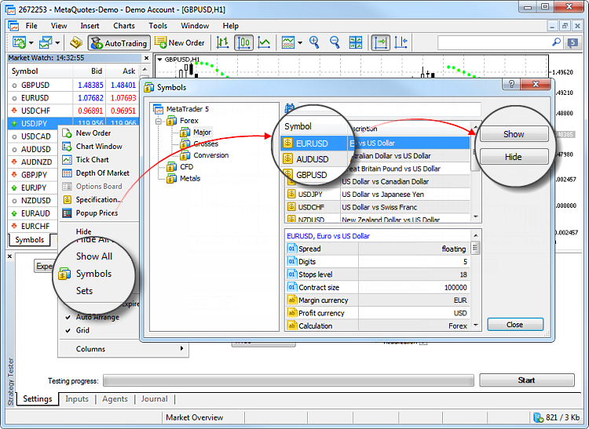

### Choosing Testing Parameters (#settings)

Before you start testing, select the financial instrument to test the trading robot operation on, the period and the mode.

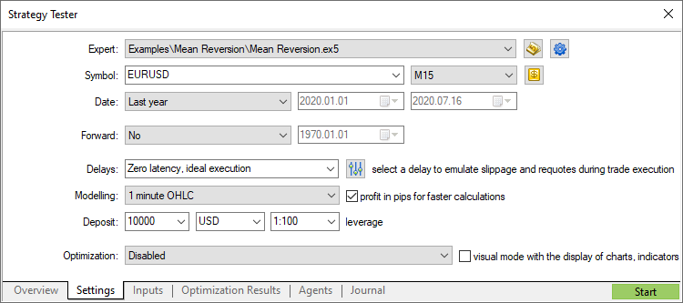

### Symbol and period (#symbol-and-period)

Select the main chart for testing and optimization. Symbol selection is required to provide the triggering of OnTick() events contained in Expert Advisors. Also, the selected symbol and period affect special functions in the Expert Advisor code that use current chart parameters (for example, Symbol() and Period()). In other words, the chart to which the Expert Advisor is attached should be selected here.

### Date (#date)

Select the testing and optimization period. You can select one of predefined periods or set a custom time interval. To set a custom period, enter the start and end dates in the appropriate fields to the right.

The specific feature of the tester is that it additionally downloads some data preceding the specified period (to form no less than 100 bars). This is required for a more accurate testing and optimization. For example, if you test on a one-week timeframe, two additional years are downloaded.

If there is not enough history data for forming additional 100 bars (it is especially significant for the monthly and weekly timeframes), for example, when specifying a start of testing close to the start of existing history data, then the start date of testing will be automatically shifted. An appropriate message is added to the Strategy Tester [journal (#result)](Strategy-Testing.md#result).

### Forward (#forward)

This option allows you to check the results of testing in order to avoid fitting to certain time intervals. During [forward testing (#forward)](Strategy-Testing.md#forward), the period set in the Date field is divided into two parts in accordance with the selected forward period (a half, one third, one fourth or a custom period when you specify the forward testings tart date).

The first part is the period of back testing. It is the period of Expert Advisor operation adaptation. The second part is forward testing, during which the selected parameters are checked.

### Execution (#execution)

Strategy tester enabled the emulation of network delays during an Expert Advisor operation in order to provide close-to-real conditions for testing. A certain time delay is inserted between placing a trade request and its execution in the strategy tester. From the moment of request sending till its execution the price can change. This allows users to evaluate how trade processing speed affects the trading results.

In the [instant execution (#execution-type)](../Trading-Operations/Basic-Principles.md#execution-type) mode, users can additionally check the EA's response to a requote from the trade server. If the difference between requested and execution prices exceeds the [deviation (#deviation)](../Trading-Operations/Executing-Trades.md#deviation) value specified in the order, the EA receives a requote.

Please note that delays work only for trades performed by an EA (placing [orders (#order-type)](../Trading-Operations/Basic-Principles.md#order-type), changing [stop levels (#position-modify)](../Trading-Operations/Executing-Trades.md#position-modify), etc.). For example, if an EA uses pending orders, delays are only applied to order placing but not to order execution (in real conditions, execution occurs on the server without a network delay).

**No Delay**

In this mode, all orders are executed at requested prices without requotes. The mode is used to check how an EA would perform in "ideal" conditions.

**Random Delay**

The Random Delay mode allows testing an Expert Advisor in conditions maximally close to real ones. The delay value is generated as follows: a number from 0 to 9 is selected randomly - this is the number of seconds for a delay; if a selected number is equal to 9, another number from the same range is selected randomly and added to the first one.

Thus, the possibility of a delay for 0-8 seconds is 90%, possibility of a 9-18 second delay is 10%.

**Fixed Delay**

You can select one of the predefined delay values or set a custom one. The platform measures the ping to the trade server and allows you to set that value as a delay in the tester so that you are able to test a robot in the conditions that are as close to the real ones as possible.

### Tick generation mode (#tick-generation-mode)

Select one of the tick generation modes:

  * Every tick — the most accurate but the slowest mode. All ticks are simulated in this mode.
  * Every tick based on real ticks provides conditions close to real ones. Testing is performed using [real ticks (#real)](Real-and-Generated-Ticks.md#real) of financial instruments, accumulated by brokers. No simulation is performed. Due to a large size of tick data, downloading them from a broker's server during the first testing run may take a long time.
  * 1 minute OHLC — in this mode only 4 prices (Open, High, Low and Close) of each minute bar are emulated.
  * Open prices only — in this mode OHLC prices are also modeled, however only the open price is used for testing/optimization.
  * Math calculations — in this mode the tester does not download history data and information on symbols, as well as does not generate ticks. Only functions OnInit(), OnTester() and OnDeinit() are called. Thus a tester can be used for various mathematical calculations where the selection of parameters is required.

For more information about tick generation, please read the [appropriate section (#tick-mode)](Real-and-Generated-Ticks.md#tick-mode).

Profit calculation in pips can speed up the testing process while there is no need to recalculate profit to deposit currency using conversion rates (and thus there is no need to download the appropriate price history). Swap and commission calculations are eliminated in this mode.

Please note that margin control is not performed in this mode. You should only use it for quick and rough strategy estimation and then check the obtained results using more accurate modes.

### Initial deposit and leverage (#initial-deposit-and-leverage)

Specify the amount of the initial deposit used for testing and optimization. The deposit currency of the currently [connected](../Getting-Started/Connect-to-an-Account.md) account is used by default, but you can specify any other currency. Please note that cross rates for converting profit and margin to the specified deposit currency must be available on the account, to ensure proper testing. Only symbols with the "Forex" or "Forex No Leverage" calculation type can be used as cross rates.

Next select the leverage for testing and optimization. The leverage influences [the amount of funds reserved on the account as the margin on positions and orders](../Trading-Operations/For-Advanced-Users/Margin-Calculation-Retail-Forex-Futures.md).

### Quick jump to EA editing (#quick-jump-to-ea-editing)

If you have the source code of the selected Expert Advisor, you can click this button to switch to its editing in [MetaEditor (#metaeditor)](How-to-Create-an-Expert-Advisor-or-an-Indicator.md#metaeditor).

### Managing testing settings (#managing-testing-settings)

Use this menu to manage tester settings: save sets of settings for various Expert Advisors in ini files and access them in a couple of clicks later. Current testing settings can also be copied to the clipboard by pressing Ctrl+C. You can edit them in your preferred text editor, then copy and upload them to the tester using Ctrl+V.

From the same menu, you can quickly select the last used programs, last chart settings and testing periods.

Furthermore, you can quickly access any of the previous [optimization results (#result)](Strategy-Optimization.md#result), as well as the settings with which the result was achieved.

### Custom symbol settings for testing (#custom-symbol-settings-for-testing)

You can change [the settings of the main trading instrument (#custom-symbol)](Strategy-Testing.md#custom-symbol) used for testing/optimization. Almost all specification parameters can be overwritten: volumes, trading modes, margin requirements, execution mode and other settings.

### Advanced testing settings (#advanced-testing-settings)

Set [your own trading account parameters (#extended-settings)](Strategy-Testing.md#extended-settings) when testing strategies, such as trading limits, margin settings and commissions. This option enables the simulation of different trading conditions offered by brokers.

### Visual testing (#visual-testing)

The [visual testing](Testing-Visualization.md) mode allows to visualize exactly how the Expert Advisor performs trade operations during testing on historical data. Each trade of a financial instrument is displayed on its chart.

  * Note that symbol specification does not mean that the tester will use only these history data. The tester automatically downloads information on all the symbols used in the Expert Advisor.
  * Before the start of testing/optimization, all the available price data of the symbol of the main chart are automatically downloaded from the server. It may take quite a long time if the internet connection is slow.
  * Downloading of all data is performed once, only the missing information is downloaded during the next starts.
  * Only the symbols that are currently selected in the [Market Watch](../Trading-Operations/Market-Watch.md) are available for testing/optimization.

  * The price data of all necessary symbols are automatically downloaded from the server during testing and optimization.
  * Testing starts and ends at 00hr.00m.00s. of the specified dates. Thus the start date of testing/optimization is included in the testing period, while the end date is not included. Testing ends on the last tick of the previous date. Also you cannot specify the end date, which is greater than the current one. In such case, the testing anyway will be performed to the current date (not including it).

  
---  
  

### Selection of Input Parameters (#inputs)

Input parameters allow you to control the behavior of the Expert Advisor, adapting it to different market conditions and a specific financial instrument. For example, you can explore the Expert Advisor performance with different [Stop Loss (#stop-loss)](../Trading-Operations/Basic-Principles.md#stop-loss) and [Take Profit (#take-profit)](../Trading-Operations/Basic-Principles.md#take-profit) values, different periods of the moving average used for market analysis and decision-making, etc.

Specify a value for each input parameter.

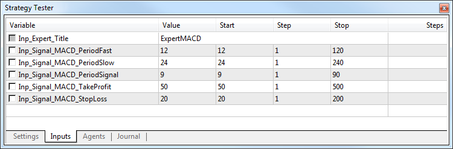

Parameter sets. You can at any time return to the current settings of your MQL5 program by saving a set of its parameters using a context menu:

  * To save the parameters as a set-file on your computer, click "Save". These files can be moved between platforms on different computers or sent to other users.
  * To save parameters for future use in the current platform, click "Save Version". These saved presets will be available then in the "Load Version" sub-menu. They can be applied at any time by selecting an appropriate version from the list.

### Advanced Testing Settings (#extended-settings)

You can specify custom trading account settings during strategy testing, such as trading limits, margin settings and commissions. This option enables the simulation of different trading conditions offered by brokers.

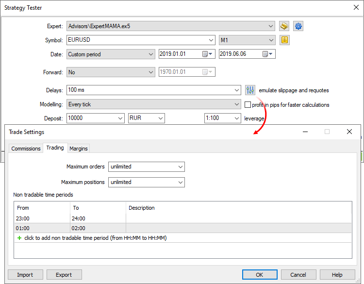

Common

In this section, you can set the maximum number of open orders and positions, which can simultaneously exist on the account. Additionally, you can configure sessions during which the program is not allowed to trade.

Margin

The section allows configuration of margin reserving rules and position accounting systems to be used in testing:

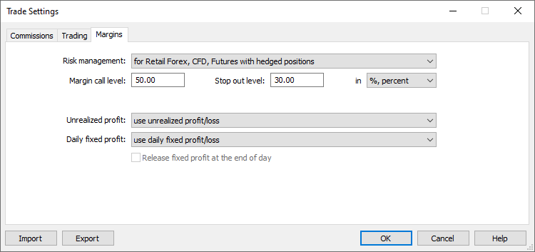

[Risk management model](../Trading-Operations/For-Advanced-Users.md): OTC and Exchange, netting or hedging.

When this level is reached, the account switches to the Margin Call state.

When this level is reached, all orders are canceled and all trading positions are closed. These levels can be indicated in money and in percentage. In the former case, they are determined as the account's Equity value. If "In percent" is selected, levels are defined as the account "Margin level" value (Equity/Margin*100).

The method of accounting for the current floating profit/loss in the free margin calculation is specified here:

  * Do not use unrealized profit/loss — do not include profit/loss of open positions in the calculation.
  * Use unrealized profit/loss — include open positions' profit/loss in the calculation.
  * Use unrealized profit — include only profit.
  * Use unrealized loss — include only loss.

The method of accounting for the trader's daily realized profit/loss in the free margin calculation is specified here:

  * Use daily fixed profit/loss — include in the free margin profit and loss received during a trading day.
  * Use daily fixed loss — include only loss received during the trade day. During the day, the obtained profit is accumulated in the special account field ("Blocked"). At the end of the trading day, the accumulated profit is released (reset) and is added to the account balance (included in the free margin).

Release fixed profit at the end of day — this option becomes available only if the option "Use daily fixed loss" is selected. If it is enabled, the accumulated profit will be released (and thus included in the free margin) at the end of the day. Otherwise this profit amount will remain blocked.

Commission

This section provides control over commissions charged on all trading operations:

  * Commission may be single-level and multilevel, i.e. be equal regardless of the deal volume/turnover or can depend on their size.
  * Commission can be charged immediately upon deal execution or at the end of a trading day/month.
  * Separate commissions can be charged depending on deal direction: entry, exit or both operation types.
  * Commission can be charged per lot or deal.
  * Commission can be calculated in money, percentage or points.

To apply commission settings of the current trading account, enable the option "Use predefined commissions".

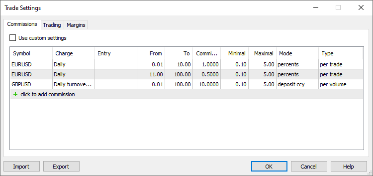

Enable the option to use current trading account commission settings instead of custom settings specified below.

Specify the name of the symbol for which you are configuring commissions. Several settings can be added for each symbol. Thus, you can set up multi-level commissions that depend on the deal volume or turnover.

Commission can be charged immediately after each trade, or it can be accumulated during the trading day or month and then charged in one operation:

  * Instant — commissions are charged instantly during execution of each deal. The instant commission size is displayed in the Commission field of deals. In the instant mode, only commission in volume can be specified (not in turnover).
  * Daily — the commission amount is accumulated during a day in a special account state field "Blocked". At the end of the day, the accumulated amount is debited from the account in a separate balance operation (a deal of the Daily commission or Daily agent commission type).
  * Monthly — the commission amount is accumulated during the month in a special account state field "Blocked". At the end of the month the accumulated amount is charged from the account with a separate balance operation (a deal of the Monthly commission or Monthly agent commission type).

Also, commission can be charged depending on each deal volume or on daily/monthly turnover. The selected option determines the entity whose volumes are indicated in the "From" and "To" fields: deal or turnover.

  * Volume — commission levels are set based on the volume (amount of lots) of each deal executed in a trading operation. For example, if you set levels as 0 — 10 and 12 — 20, a 15-lot deal will be subject to the second level commission. This option is used in modes Daily, Monthly or Instant.
  * Overturn Money — commission levels are set based on turnover in money over the selected period (day or month). For example, the levels are set as 0 — 500, 501 — 1000, and commission is charged on a monthly basis. The first-level commission will be charged until the total cost of operations exceeds 500 units. As soon as the money turnover exceeds the value of 500, all further trades will be subject to the second-level commission.  
By default, the money turnover is calculated in the deposit currency: the price of each trade is calculated and converted into the deposit currency. For example, the price of Buy 1 lot EURUSD with a contract size of 100 000 is 100 000 EUR. If your deposit currency is USD, the position price is converted to EURUSD at the time of the transaction (in this case, it is the deal price).
  * Overturn Volume — commission levels are set based on the volume of trading operations (amount of lots) over the selected period (day or month).

In the daily and monthly mode, commissions are charged for deals in both directions (when opening/increasing a position and when closing a position or part of it). For instant commissions, trade direction can be set manually.

For reversal deals with the in/out type, "In" means that commission is only charged on the volume of the newly opened position, "Out" means commission on the closed volume. The following rules shall apply for Close By deals:

  * No commission is charged on Close By deals when "All" or "In" is selected, since the commission is charged on two original deals. For example, a commission of 1 USD is charged on each deal. When a trader performs an entry Buy 1.00 EURUSD deal and an entry Sell 1.00 EURUSD deal, a commission of 2 USD will be charged. When the 1.00 EURUSD position is closed by the Sell 1.00 EURUSD position, the client will not be charged additional commission.
  * If "Out" is selected, commission on both Close By deals will be charged, and the total commission value will be written to the main exit deal (in which profit/loss is specified). For example, a commission of 1 USD is charged on each deal. When a trader performs an entry Buy 1.00 EURUSD deal and an entry Sell 1.00 EURUSD deal, no commission will be charged. When the 1.00 EURUSD position is closed by the Sell 1.00 EURUSD position, a commission of 2 USD will be charged. A commission of 2 USD will be specified in the first 'out by' deal, and a zero commission will be specified in the second deal.

The minimum deal volume (turnover) from which the commission will be charged. The ranges must not overlap. Otherwise, the commission will be charged for all the ranges, in which the operation falls.

The maximum deal volume (turnover) from which the commission will be charged. The ranges must not overlap.. Otherwise, the commission will be charged for all the ranges, in which the operation falls.

Commission fee amount. Commission units depend on the commission calculation method selected in the Mode field.

Minimum commission amount. Value units depend on the selected calculation mode (in the base currency, group currency, points. etc.). If you do not want to limit the minimum commission amount, set the 0 value.

Maximum commission amount. Value units depend on the selected calculation mode (in the base currency, group currency, points. etc.). The maximum commission value cannot be less than the minimum commission. If you do not want to limit the maximum commission amount, set the 0 value.

Commission fee calculation units:

  * Deposit currency — commission is calculated in the deposit currency specified for the group.
  * Base currency — commission is calculated in the base currency of the traded symbol.
  * Profit currency — commission is calculated in the profit currency of the traded symbol.
  * Margin currency — commission is calculated in the margin requirements currency specified for the traded symbol.
  * Points — commission is calculated in price points of the traded symbol. The point value is calculated as the profit of a position in the same direction, with the volume of 1 lot and the difference between the open and close prices is equal to 1 pip (point).
  * Percents — this calculation method allows charging commission in % of the actual cost of the deal/turnover. The cost is calculated in the base currency of the symbol as the product of its price, contract size and volume in lots (for futures and options symbols: volume in lots * Tick Size / Tick Price). By default, deal/turnover value calculated in the base currency is converted to the deposit currency; then the final commission (the specified percent) is calculated based in the resulting value.

Commission charging type:

  * Per deal — commission will be charged for each conducted deal.
  * Per volume — commissions are charged per lot (volume) of executed deals. Only the executed volume of trade requests is taken into account.

### Custom Testing Symbol Settings (#custom-symbol)

You can overwrite settings of the main trading instrument, for which testing/optimization is performed. Almost all [specification (#specification)](../Trading-Operations/Market-Watch.md#specification) parameters can be overwritten: volumes, trading modes, margin requirements, execution mode and other settings. Thus, if you need to check an Expert Advisor under different conditions, there is no need to create a separate [custom symbol](../Trading-Operations/For-Advanced-Users/Custom-Financial-Instruments.md) and download its history. This can be done by changing standard symbol settings.

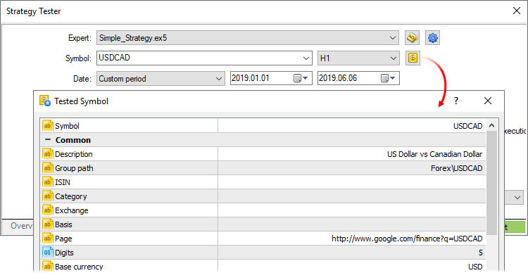

If the symbol specification is customized, the gear icon and the symbol icon are marked with an asterisk. This shows that custom parameters are used for the current test.

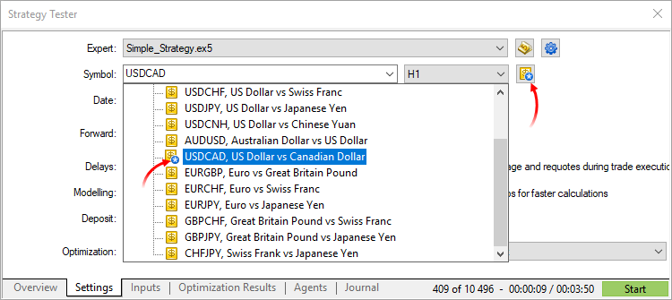

### Starting the Test (#start)

To start testing, click "Start" on the "Settings" tab. The testing progress is displayed to the left.

## Where to View Testing Results (#result)

Results of an Expert Advisor testing are displayed on tabs "Result" and "Graph".

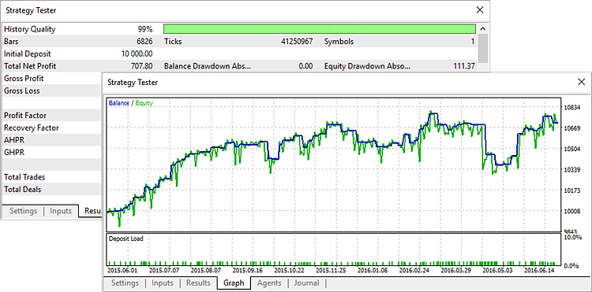

### Testing Report (#testing-report)

Detailed testing results are displayed on the "Result" tab. The tab contains general testing results, including profit and the number of trades, as well as many statistical values to help assess the performance of the trading robot.

Additional charts visualize the distribution of the number and success of trading operations by hours, days and months, as well as describe the risk parameter of the trading strategy.

See the [Testing report](Testing-Report.md) section for details.

### Testing Graph (#testing-graph)

On the "Graph" tab, you can visually determine how successfully the Expert Advisor performed on the selected instrument in the selected time interval.

The balance curve (blue line) and the equity curve (green) are shown in the main area of the tab. Dates are shown on the horizontal scale, balance/equity values are shown on the vertical scale. The bottom part of the tab features a histogram of the load on deposit, which is calculated as the ratio of margin and equity (margin/equity).

  * Balance values are shown on the chart each time they are changed (when a position is closed), equity values are additionally shown with a certain periodicity between balance changes.

  * When testing on accounts with the [exchange risk management model](../Trading-Operations/For-Advanced-Users/Margin-Calculation-Exchange-Model.md), the chart only shows the equity, while the balance and the deposit load are not shown. The trading status of such accounts is evaluated based on the equity level. The balance only shows the amount of money on the account and ignores the trader's assets and liabilities. Deposit load (margin/equity) is not displayed, because in the exchange calculation mode margin is equal to the current discounted value of the asset/liability, and it changes along with equity.

  
---  
  

### Testing Progress in the Journal (#testing-progress-in-the-journal)

The testing progress is reflected on the "Journal". In addition, messages of the Expert Advisor are added to the Journal. In the [visual testing](Testing-Visualization.md) mode, the testing progress can be viewed straight on the chart.

### Testing Progress on a Chart (#testing-progress-on-a-chart)

As soon as testing is over, you can open the chart on which the Expert Advisor was tested (selected symbol and period). Click " Open Chart" in the context menu of the "Result" tab. All the deals performed by the Expert Advisor during testing are shown on the chart. If a [template](../Price-Charts-Technical-and-Fundamental-Analysis/Additional-Features/Templates-and-Profiles.md) named tester.tpl is available in folder /profiles/templates of the trading platform, it will be applied to the opened chart. If the template is not available, the default one is used (default.tpl).

If the tested Expert Advisor uses [indicators](../Price-Charts-Technical-and-Fundamental-Analysis/Technical-Indicators.md), which run on the testing symbol and period, they are also displayed on the chart. However, if forced unloading of an indicator (the [IndicatorRelease function](https://www.mql5.com/en/docs/series/indicatorrelease "IndicatorRelease"))is implemented in the source code of the Expert Advisor, it is not displayed on the chart.

## Testing a Trading Robot on a Forward Non-Optimized Period (#forward)

Forward testing is the repeated run of the Expert Advisor on a different time period. This feature allows you to avoid parameters fitting in certain areas of historical data.

To start the forward testing, in the Forward field of the Settings tab select the part of the [total period (#settings)](Strategy-Testing.md#settings) for it:

  * No — forward testing is not used;
  * 1/2 — half of the specified period is used for the forward test;
  * 1/3 — one third of the specified period is used for the forward test;
  * 1/4 — a quarter of the specified period is used for the forward test;
  * Custom — specify the forward test start day manually.

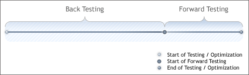

  * Always the second (latest) part of the total period is taken for the forward testing.
  * The start date of the forward period is marked by a vertical line on the chart.

  
---  
  
When the forward testing is enabled, the selected part is separated from the period specified in the ["Date" (#settings)](Strategy-Testing.md#settings) field. The first part is the period of back testing, and the second one is the period of forward testing.

Results of the forward test are displayed on the separate tab "Forward". The start date of the forward period is marked by a vertical line on the chart.

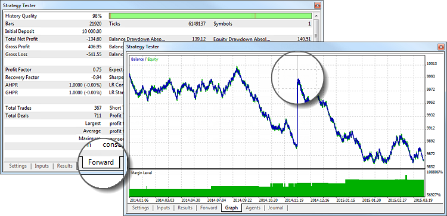

For details about testing results please read section ["Where to view the optimization results" (#result)](Strategy-Testing.md#result).

## Visual Testing (#visual)

In the [Strategy Tester](Strategy-Testing.md) of the trading platform, you can test Expert Advisors and indicators in the visual mode. This mode allows to visualize exactly how the Expert Advisor performs trade operations during backtesting. Each trade is displayed on the chart of a financial symbol.

To enable the visual test, select "Visualization" in the settings:

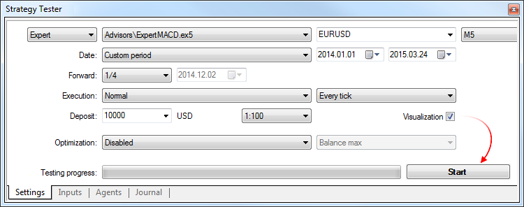

  * Visual testing is unavailable when [optimization](Strategy-Optimization.md) is enabled.
  * Visual testing can only be performed on [local agents (#agents)](Strategy-Optimization.md#agents). If [a remote agent (#farm)](Strategy-Optimization.md#farm) is selected for testing, choose a local one using the " Select" command in its context menu.

  
---  
  
Set up [testing options (#settings)](Strategy-Testing.md#settings) and [configuration parameters (#inputs)](Strategy-Testing.md#inputs), then click "Start".

Visual testing runs in a new window, which simulates a separate trading platform: it contains charts, Market Watch and the Toolbox window where you can view trading operations and the Journal.

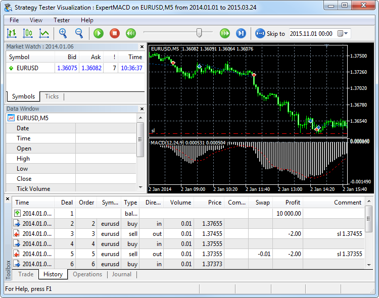

### Testing process control (#testing-process-control)

To pause, speed up or slow down the testing, use the toolbar. You can also jump to a specific date of the test.

You can conveniently control the testing process via hot keys, combinations are listed next to the menu commands.

### Monitoring Expert Advisor testing on a chart (#monitoring-expert-advisor-testing-on-a-chart)

The main purpose of this type of testing is the visual analysis of the Expert Advisor performance. A chart is generated in real time based on emulated historic price data. Trading robot operations are displayed on this chart.

Trading operations are displayed as icons  (a Buy deal) and  (a Sell deal). A dotted line is displayed between market entries and exits.

  * You can change the appearance of a chart, show indicators or graphical objects on it using [templates](../Price-Charts-Technical-and-Fundamental-Analysis/Additional-Features/Templates-and-Profiles.md). For a template to be applied, its name must match the name of the tested Expert Advisor, for example ExpertMACD.tpl. The template should be placed in folder [/profiles/templates](../Getting-Started/For-Advanced-Users/Files-and-Folders.md) of the trading platform.
  * A list of symbols available in the chart mode is limited to the main testing symbol, as well as the symbols whose data are used by the Expert Advisor.
  * [The chart timeframe (#operations)](../Price-Charts-Technical-and-Fundamental-Analysis/View-and-Configure-Charts.md#operations) cannot be changed. The [period (#settings)](Strategy-Testing.md#settings) selected in the settings is used for the main testing chart. Periods requested by the Expert Advisor are used for other symbols.
  * To switch between symbols, use the "View — Charts" menu.

### Viewing price data in Market Watch (#viewing-price-data-in-market-watch)

The Market Watch window shows prices generated during testing. It is similar to the Market Watch of the [trading platform](../Trading-Operations/Market-Watch.md), but has some specific features. To show/hide this window, use the Market Watch command in the View menu or press Ctrl+M.

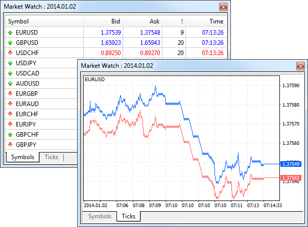

The Symbols tab features the current price information of financial instruments. The list of displayed symbols is limited to the [main testing symbol (#settings)](Strategy-Testing.md#settings), as well as the symbols whose data are used by the Expert Advisor.

The Ticks tab contains a chart of prices [generated](Real-and-Generated-Ticks.md) during testing. The number of displayed ticks is limited to 64,000.

### Viewing details of bars and indicator values in the Data Window (#viewing-details-of-bars-and-indicator-values-in-the-data-window)

The data window displays information about the prices (OHLC), date and time of a bar, spread, volume and [indicators](../Price-Charts-Technical-and-Fundamental-Analysis/Technical-Indicators.md). Here you can quickly find information about a particular bar and applied indicators at a selected point of the chart. The window can be enabled or disabled by clicking "Data Window" in the View menu or pressing Ctrl+D.

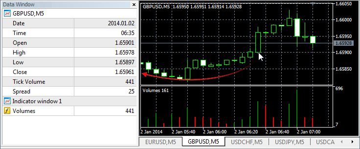

The upper part of the window contains the name of a financial instrument and the chart period. Information about the current cursor position on the chart is shown below. Information about [indicators](../Price-Charts-Technical-and-Fundamental-Analysis/Technical-Indicators.md) open in separate subwindows is shown in separate blocks.

### Viewing details of trades in the Toolbox (#viewing-details-of-trades-in-the-toolbox)

For a detailed study of the trades performed by the Expert Advisor, use the Toolbox window. It has several tabs with the following information:

  * Current open positions and pending orders
  * The history of orders and deals
  * The history of Expert Advisor's trade requests, including requests to modify pending orders, stop-level of positions, etc.

> Information about trade operation parameters is available in sections [Trade (#position-list)](../Trading-Operations/Executing-Trades.md#position-list) and [History (#trade-history)](../Trading-Operations/Executing-Trades.md#trade-history).

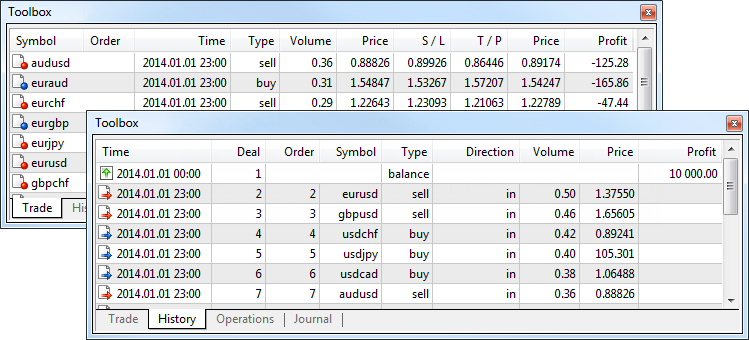

Additional details about testing are available in the Journal. It contains information about testing and actions of the Expert Advisor performed during the test.

> As long as the visualizer is open, the logs of testing agents are not sent to the [Strategy Tester (#result)](Strategy-Testing.md#result) of the trading platform. Nevertheless, they can be viewed via the trading platform using the "Local Journals of local agents" command in the context menu.

## Testing indicators in the visual mode (#indicator)

The visual testing mode allows you to monitor the behavior of [indicators](Expert-Advisors-and-Custom-Indicators.md) on historic data. This feature allows you to easily test an indicator before purchasing it from the [Market](../Market-App-Store/README.md). Download the free demo version and run the indicator in the Strategy Tester.

Select the type of the program "Indicators", then select the indicator and click "Start". The visualization mode is enabled automatically. The rest of the parameters are set in the same way, as during [testing of trading robots (#settings)](Strategy-Testing.md#settings).

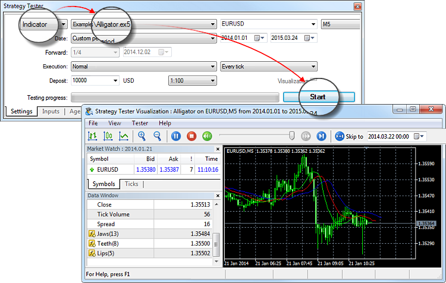

The behavior of the indicator is shown on a chart, which is plotted based on a sequences of ticks simulated in the tester.
