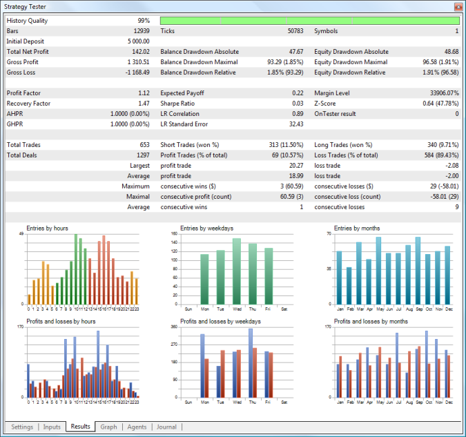
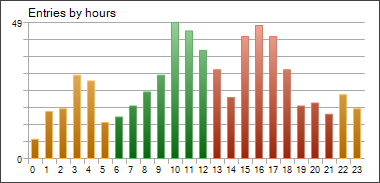
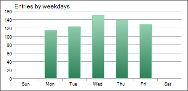
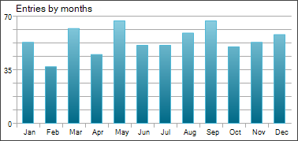
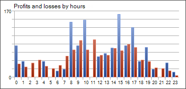
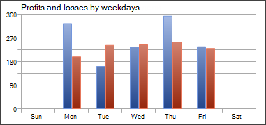
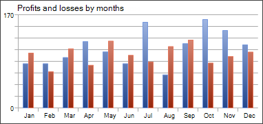
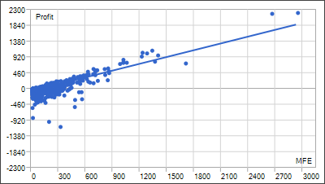
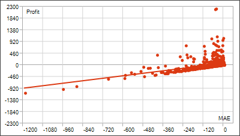
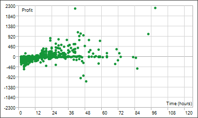

[🏠 Document Start](../README.md) / [Algorithmic Trading, Trading Robots](README.md) / Testing Report

[Previous](Testing-Features.md) | [Next](Testing-Visualization.md)

# Testing Report

You can view a detailed report on the "Results" tab.

The following parameters are available in the testing report:

  * History Quality — this value characterizes the quality of price data used for testing. It is determined as a percentage ratio of correct and incorrect one-minute data. Bars with a volume equal to 1 with different OHLC values are considered incorrect. History gaps are also considered as incorrect data. Depending on size, the period of testing is divided into 1 — 199 intervals. The history quality is determined for each of them separately. The time intervals are shown in different colors on the graphical indicator of the history quality (the lighter tint of green means the better quality, the red color represents intervals with the quality lower than 50%).
  * Bars — the number of bars generated for the testing [symbol (#settings)](Strategy-Testing.md#settings);
  * Ticks — the number of ticks modeled during testing;
  * Symbols — the number of symbols, for which information was requested by the Expert Advisor during testing;
  * Initial Deposit — [initial deposit (#settings)](Strategy-Testing.md#settings) for testing;
  * Withdrawal — the amount of money withdrawn by an Expert Advisor during testing. This field is not displayed if there are no withdrawal operations;
  * Total Net profit — the financial result of all trades. 
  * Gross Profit — the sum of all profitable trades in terms of money;
  * Gross Loss — the sum of all losing trades in terms of money;
  * Balance Drawdown Absolute — difference between the initial deposit and the minimal level below initial deposit throughout the whole testing period. AbsoluteDrawDown = InitialDeposit - MinimalBalance See the [drawdown calculation example (#drawdown)](../Trading-Operations/For-Advanced-Users/Trading-Report.md#drawdown).
  * Balance Drawdown Maximal — difference in deposit currency between the highest local balance value and the next lowest account balance value. The maximal drawdown value in percentage is given in brackets. MaximumDrawDown = Max[Local High - Next Local Low] See the [drawdown calculation example (#drawdown)](../Trading-Operations/For-Advanced-Users/Trading-Report.md#drawdown).
  * Balance Drawdown Relative — difference in percentage terms between the highest local balance value and the next lowest account balance value. The maximal drawdown value in monetary terms is given in brackets. RelativeDrawdown = Max[(Local High - Next Local Low)/Local High * 100)] See the [drawdown calculation example (#drawdown)](../Trading-Operations/For-Advanced-Users/Trading-Report.md#drawdown).
  * Equity Drawdown Absolute — difference between the initial deposit and the minimal level below initial deposit throughout the whole testing period. The calculation is similar to that of the Balance Dradwown Absolute.
  * Equity Drawdown Maximal — difference in deposit currency between the highest local equity value and the next lowest equity value. The maximal drawdown value in percentage is given in brackets. The calculation is similar to that of the Balance Dradwown Maximal.
  * Equity Drawdown Relative — difference in percentage terms between the highest local equity value and the next lowest equity value. The maximal drawdown value in monetary terms is given in brackets. The calculation is similar to that of the Balance Dradwown Relative.
  * Profit Factor — ratio of the gross profit to the gross loss. A value of one means that these parameters are equal;
  * Recovery Factor — the value reflects the riskiness of the strategy, i.e. the amount of money risked by the Expert Advisor to make the profit it obtained. It is calculated as the ratio of gained profit to the maximum drawdown;
  * AHPR — arithmetic mean of a trade (change in percents). Arithmetic mean of equity changes per trade. The arithmetic mean usually overestimates the profitability of a trading system as compared to the geometric mean. If the geometric mean implies the multiplication of results of each trade, the arithmetic mean just sums them. The value in percents is given in brackets. It is positive if the trading system is profitable. The negative value means that the system is losing.
  * GHPR — geometric mean of a trade (change in percents). Geometric mean shows by how many times the capital changed after each trade in average. The relative equity change is often a more objective estimation than the expected payoff. Capital change in percents is given in brackets. A negative number in brackets means that on the average the capital is reduced on each trade.
  * Expected Payoff — a statistically calculated value showing the average return of one deal. Also, it is considered to display the expected return of the next trade;
  * Sharpe Ratio — a classic measure which is commonly used to evaluate the performance of a portfolio manager, fund results or a trading system. The ratio is calculated as (Return – Risk-Free Rate)/Standard Deviation of Return. In the strategy tester, the Risk-Free Rate is assumed to be zero. The ratio values are usually interpreted as follows:

  * Sharpe Ratio < 0 — the strategy is unprofitable. Bad.
  * 0 < Sharpe Ratio < 1.0 — the risk does not pay off. Such strategies can be considered when there are no alternatives. Indefinite.
  * Sharpe Ratio ≥ 1.0 — this can mean that the risk pays off and that the portfolio/strategy can show results. Good.
  * Sharpe Ratio ≥ 3.0 — a high value indicates that the probability of obtaining a loss in each particular deal is very low. Very good.
  * LR Correlation — linear regression correlation. A balance graph is a broken line, which can be approximated by a straight line. To find the coordinates of the straight line, the least-squares method is applied. The resulting straight line is called "linear regression" and allows estimating the deviation of balance graph points from the linear regression. Correlation between the balance graph and the linear regression allows to estimate the degree of the capital variability. The less sharp peaks and troughs on the balance curve, the closer the parameter value is to 1. Values close to zero mean the random nature of trading.
  * LR Standard Error — the standard error of balance deviation from the linear regression. This index is used to estimate the balance chart deviation from the linear regression in money terms. It only makes sense to compare systems with similar initial conditions (the same values of the initial equity). The higher the value, the more balance deviates from a straight line.
  * Margin Level — minimal level of margin in percentage terms registered during testing;
  * Z-Score — series testing (the probability of correlation between trades). The series testing allows to estimate the degree of correlation between trades and evaluate whether the trade history includes more/less periods of consecutive profits/losses than normal distribution implies. The detected correlation allows to apply the methods of money management and/or change the trading system algorithm to maximize profit and/or to remove the dependence. Both non-finding the real correlation and finding a nonexistent correlation between trades are dangerous. The Z score indicates deviation from normal distribution in the sigma. A value above 3 indicates that a win will be followed by a loss with the probability of 3 sigma (99.67%). A value below -3 indicates that a win will be followed by a win with the probability of 3 sigma (99.67%).
  * OnTester Result — a value returned by the OnTester function in the Expert Advisor as a result of testing. It corresponds to the [custom criterion (#criterion)](Optimization-Types.md#criterion) of optimization;
  * Total Trades — the total number of trades (deals resulted in fixing a profit/loss);
  * (Total Deals) — the total number of deals;
  * Short Trades (won %) — number of trades that resulted in profit from selling a financial instrument, and percentage of profitable short trades;
  * Long Trades (won %) — number of trades that resulted in profit from purchasing a financial instrument, and percentage of profitable long trades;
  * Profit Trades (% of total) — the amount of profitable trades and their percentage in the total trades;
  * Loss Trades (% of total) — the amount of losing trades and their percentage in the total trades;
  * Largest profit trade — the largest profit of all profitable trades;
  * Largest loss trade — the largest loss of all loss-making trades;
  * Average profit trade — the average profit value per a trade (the total of profits divided by the number of winning trades);
  * Average loss trade — the average loss value per a trade (the total of losses divided by the number of losing trades);
  * Maximum consecutive wins ($) — the longest series of winning trades and their total profit;
  * Maximum consecutive losses ($) — the longest series of losing trades and their total loss;
  * Maximal consecutive profit (count) — the maximum profit of a series of profitable trades and the amount of profitable trades in this series;
  * Maximal consecutive loss (count) — the maximal loss of a series of losing trades and the number of losing trades in it;
  * Average consecutive wins — the average number of winning trades in profitable series;
  * Average consecutive losses — the average number of losing trades in losing series.
  * Correlation (Profits, MFE) — correlation between returns and the MFE (Maximum Favorable Excursion, maximum size of a potential profit occurred during the life time of a position). Each position had its maximal profit and maximal loss between opening and closing. MFE shows profit in the favorable excursion of the price. Each position has its result and two parameters — MFE and MAE (Maximum Adverse Excursion, maximum size of a potential loss occurred during the life time of a position). Thus, each position can be drawn on a plane where MFE is plotted along the X axis, the result is plotted along the Y-axis. Results close to MFE mean the most complete use of the favorable price excursion. A straight line on the graph shows approximation by function Profit=A*MFE+B. Correlation(Profits,MFE) allows to estimate relation between the profits/losses and the MFE. Values close to 1 mean that trades fit well into the approximation line. Values close to zero mean weak correlation. MFE characterizes the ability to realize potential profit.
  * Correlation (Profits, MAE) — correlation between results and MAE (Maximum Adverse Excursion). Each position reached its maximal profit and maximal loss between opening and closing. MAE shows the loss during the adverse excursion of the price. Each position has its result and two parameters — MFE and MAE. Thus, each position can be drawn on a plane where MAE is plotted along the X axis, the return is plotted along the Y axis. Results close to MAE mean the most complete protection against adverse price excursion. A straight line on the graph shows approximation by function Profit=A*MAE+B. The Correlation(Profits,MAE) allows to estimate relation between the profits/losses and the MAE. Values close to 1 mean that trades fit well into the approximation line. Values close to zero mean weak correlation. MAE describes the drawdown during the position lifetime and best characterizes the use of protective Stop Loss.
  * Correlation (MFE, MAE) — correlation between MFE and MAE. It shows correlation between two rows of characteristics. The ideal value is 1 - we take the maximum profit and protect the position throughout its lifetime. A value close to zero indicates there is practically no correlation.
  * Minimal position holding time — a minimum amount of time between opening a position and closing it completely. Complete closing of a position is its full elimination; the calculated value does not take into account partial closing or position reversal.
  * Maximal position holding time — a maximum amount of time between opening a position and closing it completely.
  * Average position holding time — the average time between opening a position and closing it completely during testing.

> ### Diagrams

The following diagrams are available in the testing report:

Entries by hours

This diagram shows the distribution of market entry deals (opening, increase and reversal of positions) by hours. The colors of the diagram bars mark trading sessions: Asian (yellow), European (green) and American (red).

Entries by weekdays

This diagram shows the distribution of market entry deals (opening, increase and reversal of positions) by days of the week.

Entries by month

This diagram shows the distribution of market entry deals (opening, increase and reversal of positions) by months.

Profits and losses by hours

This diagram shows the distribution of market exit deals (closure, partial closure and reversal of positions) by hours. The colors of the diagram bars show profitable (blue) and losing (red) deals.

Profits and losses by weekdays

This diagram shows the distribution of market exit deals (closure, partial closure and reversal of positions) by weekdays. The colors of the diagram bars show profitable (blue) and losing (red) deals.

Profits and losses by months

This diagram shows the distribution of market exit deals (closure, partial closure and reversal of positions) by months. The colors of the diagram bars show profitable (blue) and losing (red) deals.

MFE-Profits Distribution

Positions are plotted as dots on the graph of MFE (Maximum Favorable Excursion) — Profits. Values of both axes are given in the deposit currency. In addition to the profit value of each position including swaps plotted along the Y axis, the graph shows the maximally possible profit during the position holding time. It allows to estimate the quality of protection of the paper (unrealized) profit.

Though the distribution of points along the graph provides a picture of the trading system, a linear regression, which is approximation by least squares, is given for an objective assessment. Ideally, the line should go at an angle of 45 degrees.

MAE-Profits Distribution

Positions are plotted as dots on the graph of MAE (Maximum Adverse Excursion) — Profit. Values of both axes are given in the deposit currency. In addition to the profit value of each position including swaps plotted along the Y axis, the graph shows the highest drawdown during the position holding time. It allows estimating trades in terms of drawdown outstaying.

Though the distribution of points along the graph provides a picture of the trading system, a linear regression, which is approximation by least squares, is given for an objective assessment. The less trades with negative X (MAE) values, the better. The graphical analysis helps to estimate the maximum tolerated loss, after which the possibility of taking profit is very small (if the analysis is performed for one currency pair and in points).

Profit and position holding time distribution

Points plotted on the Profit — Time graph indicate positions. The graph displays a correlation between the position holding time and the profit obtained as a result of closing it. Values on the time axis can be given in seconds, minutes or hours depending on the scale required. Profit is displayed in the deposit currency. The position holding time is calculated as the time from its opening till complete closing. Complete closing of a position is its full elimination; the calculated value does not take into account partial closing or position reversal.
