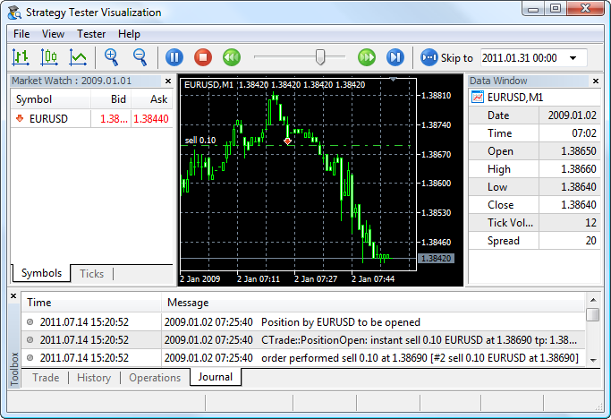
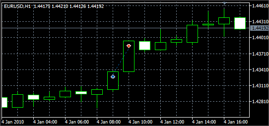
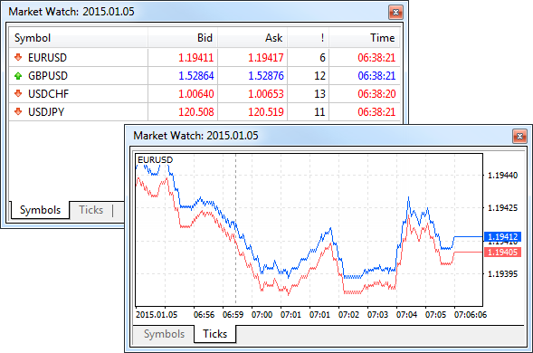
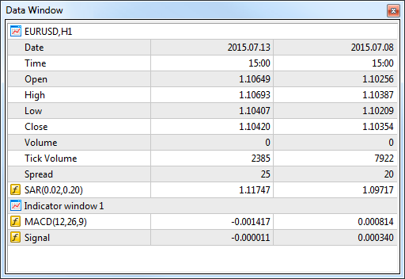
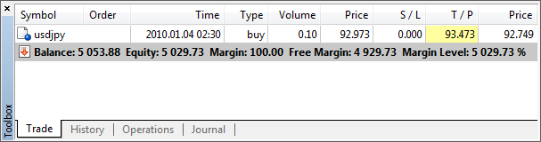
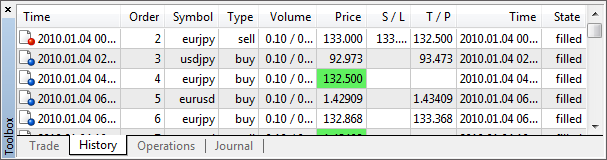
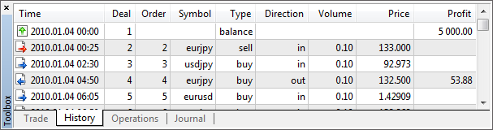
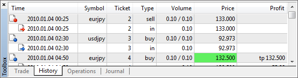
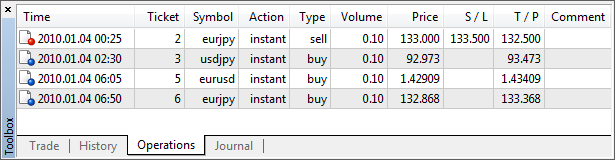
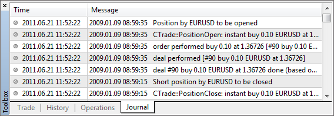

[🏠 Document Start](../README.md) / [Algorithmic Trading, Trading Robots](README.md) / Testing Visualization

[Previous](Testing-Report.md) | [Next](Journal-of-Testing.md)

# Testing Visualization (#testing-visualization)

In the [Strategy Tester](Strategy-Testing.md) of the trading platform, you can test Expert Advisors and indicators in the visual mode. This mode allows to visualize exactly how the Expert Advisor performs trade operations during backtesting. Each trade of a financial instrument is displayed on its [chart (#chart)](Testing-Visualization.md#chart). In the visual testing mode, you can test the operation of an [indicator (#indicator)](Strategy-Testing.md#indicator) using historical data. This feature allows to easily test the operation of demo versions of indicators downloaded from the [Market](../Market-App-Store/README.md).

## Start (#start)

To start the visual testing:

  * Enable the "Visualization" option in the [Strategy Tester (#settings)](Strategy-Testing.md#settings) settings. When you select testing of [indicators](Expert-Advisors-and-Custom-Indicators.md), the visualization is enabled automatically.
  * Disable [the optimization mode (#settings)](Strategy-Testing.md#settings), because visualization is only available in the testing mode.
  * Make sure that one of [local agents (#agents)](Strategy-Optimization.md#agents) is used for testing. If [a remote agent (#farm)](Strategy-Optimization.md#farm) is selected for testing, choose a local one using the " Select" command in its context menu.

If all of the above conditions are met, clicking on the "Start" button opens [the visualization window (#view)](Testing-Visualization.md#view).

## Viewing the Testing Process (#view)

Testing Visualizer runs in a separate window:

Information about the testing process is available in several forms:

  * [Price chart (#chart)](Testing-Visualization.md#chart), where trade operations are shown.
  * [Market Watch (#market-watch)](Testing-Visualization.md#market-watch), which shows prices generated during testing.
  * [Data Window (#data-window)](Testing-Visualization.md#data-window), where you can view information about a selected point on the chart.
  * The multifunctional [Toolbox (#toolbox)](Testing-Visualization.md#toolbox) window that displays trade operations performed by an Expert Advisor during testing and logs of the visualizer.

## Chart (#chart)

A chart is the primary means of testing process visualization. It is similar to conventional [charts](../Price-Charts-Technical-and-Fundamental-Analysis/View-and-Configure-Charts.md) of the platform, but has a number of specific features:

  * The chart is based on price data [generated](Real-and-Generated-Ticks.md) during testing.
  * All trade operations performed by an Expert Advisor during testing are shown on the chart. Trading operations are displayed using the "Buy sign" and "Sell sign" [objects](../Price-Charts-Technical-and-Fundamental-Analysis/Analytical-Objects/Arrows.md). 
  * Only the basic chart settings (type, grid, scale) are available.
  * A list of symbols available in the chart mode is limited to the main testing symbol, as well as the symbols whose data are used by the Expert Advisor.
  * [The chart timeframe (#operations)](../Price-Charts-Technical-and-Fundamental-Analysis/View-and-Configure-Charts.md#operations) cannot be changed. The [period (#settings)](Strategy-Testing.md#settings) selected in the settings is used for the main testing chart. Periods requested by the Expert Advisor are used for other symbols.
  * To switch between symbols, use the "View — Charts" menu.
  * The chart allows you to view the behavior of the indicator based on historical data, for example, when testing a demo version of the indicator downloaded from the [Market](../Market-App-Store/README.md).

### Using a Template (#using-a-template)

You can change the appearance of a chart, show indicators or graphical objects on it using [templates](../Price-Charts-Technical-and-Fundamental-Analysis/Additional-Features/Templates-and-Profiles.md). For a template to be applied, its name must match the name of the tested Expert Advisor. The template should be placed in folder [/profiles/templates](../Getting-Started/For-Advanced-Users/Files-and-Folders.md) of the trading platform.

## Market Watch (#market-watch)

The Market Watch window shows prices generated during testing. It is similar to the Market Watch of the [trading platform](../Trading-Operations/Market-Watch.md), but has some specific features. To show/hide this window, use the Market Watch command in the View menu or press Ctrl+M.

The Symbols tab features the current price information of financial instruments. The list of displayed symbols is limited to the [main testing symbol (#settings)](Strategy-Testing.md#settings), as well as the symbols whose data are used by the Expert Advisor.

The window header contains the current time of testing.

The Ticks tab contains a chart of prices [generated](Real-and-Generated-Ticks.md) during testing. The number of displayed ticks is limited to 64 thousand.

## Data Window (#data-window)

This window is used to display information about the prices (OHLC), date and time of a bar, spread, volume and [indicators](../Price-Charts-Technical-and-Fundamental-Analysis/Technical-Indicators.md). Here you can quickly find information about a particular bar and applied indicators at a selected point of the chart. The window can be enabled or disabled by clicking "Data Window" in the View menu or pressing Ctrl+D.

The upper part of the window contains the name of a financial instrument and the chart period. Information about the current cursor position on the chart is shown below. Information about [indicators](../Price-Charts-Technical-and-Fundamental-Analysis/Technical-Indicators.md) open in separate subwindows is shown in separate blocks.

## Toolbox (#toolbox)

Toolbox is a multifunctional window, in which you can view an Expert Advisor's trading activity during testing, as well as view the journal of [a testing agent (#agents)](Strategy-Optimization.md#agents). To show/hide this window, use the Toolbox command in the View menu or press Ctrl+T keys.

The Toolbox window consists of several tabs:

  * [Trade (#toolbox-trade)](Testing-Visualization.md#toolbox-trade) — current positions and pending orders. 
  * [History (#toolbox-history)](Testing-Visualization.md#toolbox-history) — the history of deals and orders.
  * [Operations (#toolbox-operations)](Testing-Visualization.md#toolbox-operations) — a list of trading operations requested by the Expert Advisor.
  * [Journal (#toolbox-journal)](Testing-Visualization.md#toolbox-journal) — the journal of a testing agent.

### Trade (#toolbox-trade)

The "Trade" tab contains information about the current state of the trading account, [open positions (#position-open)](../Trading-Operations/Executing-Trades.md#position-open) and placed [pending orders (#pending)](../Trading-Operations/Executing-Trades.md#pending). All open positions can be sorted by any field. To do this, click on its name.

Positions

Positions are shown in a table with the following fields:

  * Symbol — a financial instrument of the open position.
  * Time — position opening time. The record is represented as YYYY.MM.DD HH:MM (year.month.day hour:minute);
  * Type — position type: "Buy" — long, "Sell" — short.
  * Volume — volume of a trade operation (in lots or units);
  * Price — the price of a deal, as a result of which the position was opened. If the opened position is a result of execution of several deals, then this field displays their weighted average price: (price of deal 1 * volume of deal 1 + ... + price of deal N * volume of deal N) / (volume of deal 1 + ... + volume of deal N). The number of characters in this field is determined by the number of characters in the price of the symbol plus three additional characters;
  * S/L — the [Stop Loss (#stop-loss)](../Trading-Operations/Basic-Principles.md#stop-loss) level of the current position. If this order was not placed, a zero value is shown in the field;
  * T/P — the [Take Profit (#take-profit)](../Trading-Operations/Basic-Principles.md#take-profit) level of the current position. If this order was not placed, a zero value is shown in the field;
  * Price — the current price of the financial symbol.
  * Commission — commission charged for the execution of the trade operation;
  * Swap — amount of swaps charged;
  * Profit — the financial result of a deal taking into account the current price is written in this field. A positive result indicates the profitability of the deal, negative indicates loss. 

Account state

The current account state is shown below the open trading positions:

  * Balance — amount of money on the account, the results of currently open positions are not included.
  * Equity — the amount of money taking into account the results of the currently open positions;
  * Margin — money required to cover open positions.
  * Free Margin — the free amount of money that can be used to maintain open positions;
  * Margin Level — percentage of the account equity to the margin volume;
  * Total of deals — total financial result of all open positions. With the positive result of positions, icon  is shown, with negative — .

Pending orders

Placed pending orders are shown below the current account state:

  * Symbol — the financial instrument of the pending order.
  * Order — the ticket number (a unique identifier) of the pending order;
  * Time — pending order placing time. The record is represented as YYYY.MM.DD HH:MM (year.month.day hour:minute);
  * Type — [type of the pending order (#pending-order)](../Trading-Operations/Basic-Principles.md#pending-order): "Sell Stop", "Sell Limit", "Buy Stop", "Buy Limit", "Buy Stop Limit" or "Sell Stop Limit";
  * Volume — volume requested in the pending order, and volume covered by the deal (in lots or units).
  * Price — price reaching which the pending order will trigger.
  * S/L — level of the placed [Stop Loss order (#stop-loss)](../Trading-Operations/Basic-Principles.md#stop-loss). If this order was not placed, a zero value is shown in the field;
  * T/P — level of the set [Take Profit (#take-profit)](../Trading-Operations/Basic-Principles.md#take-profit) order. If this order was not placed, a zero value is shown in the field;
  * Price — the current price of the financial symbol.
  * Comment — comments to the pending order;
  * State — in the last column, the current [status (#order-state)](../Trading-Operations/Basic-Principles.md#order-state) of the pending order is shown: "Started", "Placed", etc.

## History (#toolbox-history)

The history of trade operations is available in the History tab. There are three modes of viewing the history of trade operations: only deals, only orders, deals and orders; you can switch between them in the context menu.

### Orders (#order)

The history of placed orders is displayed in a table with the following fields:

  * Time — order placing time. The record is represented as YYYY.MM.DD HH:MM (year.month.day hour:minute);
  * Order — ticket number (a unique identifier) of a trade operation;
  * Symbol — a financial instrument of the order;
  * Type — trading operation type: "Buy" — a long position, "Sell" — a short position or names of [Pending orders (#pending-order)](../Trading-Operations/Basic-Principles.md#pending-order) "Sell Stop", "Sell Limit", "Buy Stop", "Buy Limit", "Buy Stop Limit" and "Sell Stop Limit".
  * Volume — volume requested in the order (in lots or units). The minimal volume and its change step are limited by a brokerage company, the maximal one — by the deposit size.
  * Price — price specified in the order at which the trade operation should be executed.
  * S/L — level of the placed [Stop Loss order (#stop-loss)](../Trading-Operations/Basic-Principles.md#stop-loss). If the trade position of the order has closed, the cell is colored red, and a record "[s/l]" appears in the comment box. If this order was not placed, a zero value is recorded in this field;
  * T/P — level of the set [Take Profit (#take-profit)](../Trading-Operations/Basic-Principles.md#take-profit) order. If the trade position of the order has closed, the cell is colored green, and a record "[t/p]" appears in the comment box . If this order was not placed, a zero value is recorded in this field;
  * State — order [placing result (#order-state)](../Trading-Operations/Basic-Principles.md#order-state): "Filled", "Partial", "Canceled" etc.
  * Comment — comments to orders are written here.

The lower line shows the summary of orders: total quantity, number of filled and canceled orders.

### Deals (#deal)

The history of deals is also displayed in a table with the following fields:

  * Time — time of the deal. The record is represented as YYYY.MM.DD HH:MM (year.month.day hour:minute);
  * Deal — ticket number (a unique identifier) of a deal.
  * Order — ticket number (a unique identifier) of the order, the trade was executed for. Several deals can correspond to one order, if the required volume specified in the order was not covered by one market offer;
  * Symbol — a financial instrument of the deal.
  * Type — type of a trade operation: "Buy" — a buy deal, "Sell" — a sell deal;
  * Direction — direction of the deal relative to the current position on a particular symbol: "in", "out" or "in/out".
  * Volume — volume of an executed deal (in lots or units).
  * Price — the price at which the deal was executed;
  * Commission — commission charged for the deal execution;
  * Profit — the financial result of the position exiting. For entry deals, zero profit is shown.

The bottom line shows the trade execution results relative to the initial deposit:

  * Profit — profit or loss relative to the initial deposit. For losses, the  sign is shown in this field, for profit — ;
  * Deposit — the amount of deposit;
  * Withdrawal — amount withdrawn from the account.

The value of the current balance of the account is shown at the end of the line.

### Orders and Trades (#orders-deals)

In this mode, orders and deals are displayed as a tree that shows how exactly the trade requests were processed.

## Operations (#toolbox-operations)

All trade requests made by an Expert Advisor during testing are shown in the Operations tab. In addition to buy and sell requests, you can track the modifications of pending orders, stop levels of positions, etc.

The history of trade operations is displayed in a table with the following fields:

  * Time — time of the trade operation request. The record is represented as YYYY.MM.DD HH:MM (year.month.day hour:minute);
  * Ticket — ticket number (unique number) of a trade operation;
  * Symbol — the symbol of a requested trade operation;
  * Action — type of a requested action (instant execution of a trade operation, modification of stop levels, etc.);
  * Type — direction of a trade operation (buy or sell);
  * Volume — the volume of a requested trade operation;
  * Price — the price at which the trade operation is requested;
  * S/L — the [Stop Loss (#stop-loss)](../Trading-Operations/Basic-Principles.md#stop-loss) level in a trade request;
  * T/P — the [Take Profit (#take-profit)](../Trading-Operations/Basic-Principles.md#take-profit) level in a trade request;
  * Comment — a comment to a request.

## Journal (#toolbox-journal)

This tab contains the logs of the [agent (#agents)](Strategy-Optimization.md#agents) that is used for testing an Expert Advisor. All actions of the agent and the Expert Advisor during testing are logged in the Journal.

> As long as the visualizer is open, the logs of testing agents are not sent to the [Strategy Tester](Strategy-Testing.md) of the trading platform. Nevertheless, they can be viewed via the trading platform using the "Journals of local agents" command in the context menu.

Log entries consist of two parts:

  * Date — date and time of the event;
  * Message — description of the event.

##  (#)
